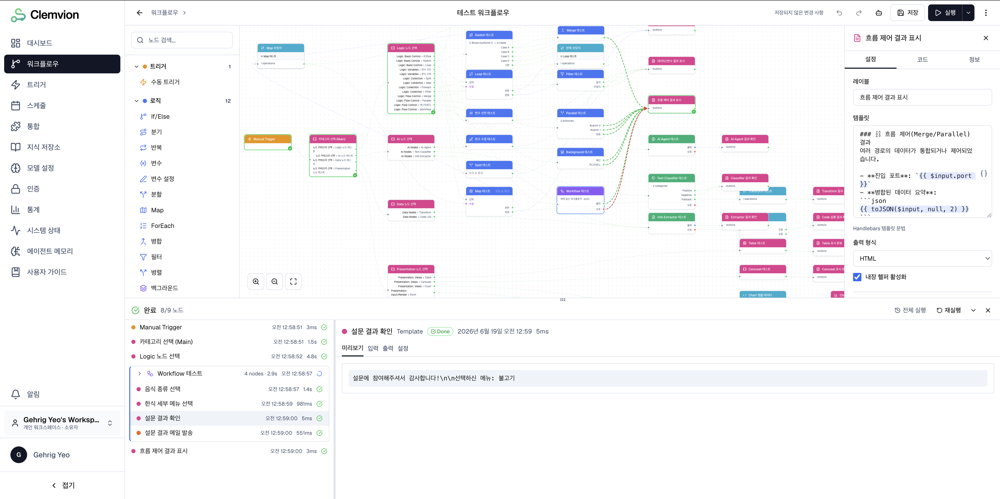
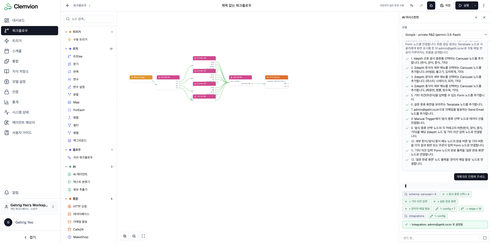

# Clemvion

<p align="left">
  
</p>

AI 에이전틱 워크플로우 시스템.

**Clemvion**은 AI 에이전트와 노코드 워크플로우 빌더를 통합한 실행 플랫폼입니다.

자동화를 위한 워크플로우와 AI 챗봇을 만들고, 실행할 수 있습니다.
(자동화 워크플로우에서도 AI 노드를 활용할 수 있습니다.)


## 안내사항

본 프로젝트는 대규모 상용 제품에 적용이 가능한 claude code를 활용하는 개발 프로세스 실험을 위해 시작된 프로젝트입니다.

따라서 기본적으로 상용 제품의 품질을 목표로 하지만, 실질적으로는 AI Slop 프로젝트입니다.

구현 방식과 범위에 따라 복잡도가 높은 워크플로우 빌더(예:n8n, flowise 등)를 선정하여 진행되었으며,
제품의 언급이나 코드 없이 Greenfield 방식으로 진행되었습니다.

인간의 최소 개입을 원칙으로 한명의 개발자가 다음 역할을 수행하였습니다.

- 구현할 제품의 기능 지정
- 아키텍쳐 등의 핵심 사항 판단 (단순한 사항은 AI에게 판단 일임)
- 최소한의 코드 리뷰
- 제품 동작 테스트(QA)
- 본 README.md의 일부 섹션 작성
- 특정 AI 노드의 시스템 프롬프트 작성
- 제품 로고 이미지 제작


## 주요 기능

- **AI 어시스턴트** - AI와의 대화로 워크플로우 구성 및 디버깅
- **캔버스 에디터** — 무한 2D 캔버스에서 노드를 드래그앤드롭으로 배치하고 연결
- **다양한 노드** — 로직(If/Else, Switch, Loop 등), AI 에이전트, 통합(HTTP, Email, DB), 데이터 변환, 프레젠테이션 노드
- **실행 엔진** — 수동 실행, 스케줄(Cron) 실행, Webhook 트리거 지원
- **실시간 모니터링** — WebSocket 기반 실행 상태 실시간 추적
- **버전 관리** — 워크플로우 버전 히스토리 및 롤백
- **Expression Language** — 노드 간 데이터 참조 및 변환을 위한 표현식 언어
- **다국어 사용자 가이드** — 한국어·영어 매뉴얼 내장 (`/docs/ko/...`, `/docs/en/...`)

## 스크린샷





## 아키텍처

```
Client (Next.js SPA)
│
├── 캔버스 에디터 (@xyflow/react)
├── 대시보드 / 워크플로우 관리
└── 트리거 / 스케줄 / 통합 설정
        │
        ▼  REST API / WebSocket
┌─────────────────────────────────────┐
│        API Gateway (NestJS)         │
│  Auth · Rate Limiting · Routing     │
├─────────────────────────────────────┤
│  Core API Service                   │
│  - Workflow CRUD, 검색, 버전 관리   │
│  Execution Engine                   │
│  - BullMQ 워커 풀, 스케줄러         │
│  Integration Service                │
│  - OAuth, HTTP, Email, DB           │
│  WebSocket Gateway                  │
│  - 실시간 실행 상태 업데이트        │
└─────────────────────────────────────┘
        │
        ▼
┌──────────┬──────────┬──────────┐
│PostgreSQL│  Redis   │  MinIO   │
│ (DB)     │(Cache/MQ)│(Storage) │
└──────────┴──────────┴──────────┘
```

## 기술 스택

| 영역            | 기술                                  |
|---------------|-------------------------------------|
| **Frontend**  | Next.js 16, React 19, TypeScript    |
| **상태 관리**     | Zustand, TanStack React Query       |
| **캔버스**       | @xyflow/react                       |
| **스타일링**      | Tailwind CSS, Radix UI              |
| **Backend**   | NestJS 11, TypeScript               |
| **ORM**       | TypeORM                             |
| **데이터베이스**    | PostgreSQL 18                       |
| **캐시/메시지 큐**  | Redis 7, BullMQ                     |
| **실시간 통신**    | Socket.io                           |
| **오브젝트 스토리지** | MinIO (Self-hosted) / AWS S3 (SaaS) |
| **인프라**       | Docker Compose, Kubernetes          |
| **테스트**       | Vitest (Frontend), Jest (Backend)   |

## 프로젝트 구조

```
./
├── codebase/                   # 애플리케이션 코드
│   ├── frontend/               #   클라이언트 (Next.js)
│   ├── backend/                #   서버 (NestJS)
│   └── packages/               #   공유 라이브러리 (expression-engine, node-summary)
├── k8s/                        # Kubernetes 매니페스트 (Kustomize)
├── docker-compose.yml          # 인프라(PostgreSQL/Redis/MinIO) + (--profile app) 풀스택
└── spec/                       # 제품 정의·기술 명세
```

## 빠른 시작

### 사전 요구 사항

- Node.js 24+ (내부 개발·빌드 기준 — 운영 `node:24`·CI 와 정렬. 외부 배포 SDK `@workflow/sdk`·`@workflow/web-chat` 소비는 Node 20+ 호환)
- Docker & Docker Compose

### 풀스택 한 번에 기동 (권장)

마이그레이션·backend·frontend 까지 컨테이너로 일괄 기동합니다.

```bash
docker compose --profile app up
```

기동 순서: postgres/redis/minio healthy → 버킷 초기화 → migrate(Flyway) → backend(`:3011`) → frontend(`:3012`). 소스코드는 host bind-mount 로 라이브 편집됩니다.

| | URL |
|---|---|
| Frontend | http://localhost:3012 |
| Backend API | http://localhost:3011/api |
| MinIO Console | http://localhost:9001 |

<details>
<summary>인프라만 띄우고 host 에서 직접 실행하기</summary>

인프라(PostgreSQL/Redis/MinIO)만 컨테이너로 띄우고 backend·frontend 는 host 에서 직접 실행하는 방식입니다.

> **전제조건**: Node.js 24+ 와 pnpm. pnpm 은 corepack 으로 활성화하면 버전이 루트 `package.json` 의 `packageManager` 필드로 자동 고정됩니다 — `corepack enable`.

```bash
# 인프라만 기동 — PostgreSQL(5432), Redis(6379), MinIO(9000/9001)
docker compose up -d

# 의존성 설치 — 레포 루트에서 1회. pnpm workspace 가 전체를 설치하고
# 내부 공유 패키지(expression-engine 등) dist 도 prepare 로 자동 빌드한다.
pnpm install

# Backend
pnpm --filter backend start:dev

# Frontend (새 터미널)
pnpm --filter frontend dev
```

</details>

<details>
<summary>컨테이너 의존성·볼륨 관리</summary>

- `dist`, `.next`, `node_modules` 는 named volume 으로 host 와 격리되어 macOS native 모듈(예: bcrypt)이 컨테이너로 새지 않습니다.
- 컨테이너에 의존성 추가: `docker compose exec backend pnpm add <pkg>`. named volume 재시드가 필요하면 `docker volume rm clemvion_backend_node_modules` 후 `docker compose --profile app up --build`.
- 공유 패키지(`expression-engine`·`node-summary`)는 이미지에 baked-in. 변경 시 `docker compose build backend frontend`.
- 마이그레이션만 재실행: `docker compose --profile app run --rm migrate`.

</details>

### 개발 스크립트

각 stack 디렉터리(`codebase/{frontend,backend}`)에서 `pnpm <script>`, 또는 레포 루트에서 `pnpm --filter <frontend|backend> <script>`.

| 명령어 | Frontend | Backend |
|--------|----------|---------|
| 개발 서버 | `pnpm dev` | `pnpm start:dev` |
| 빌드 | `pnpm build` | `pnpm build` |
| 린트 | `pnpm lint` | `pnpm lint` |
| 테스트 | `pnpm test` | `pnpm test` |
| 테스트 (E2E) | — | `pnpm test:e2e` |

## 환경 변수

**Frontend** (`codebase/frontend/.env`)

```env
NEXT_PUBLIC_API_URL=http://localhost:3011/api
NEXT_PUBLIC_WS_URL=http://localhost:3011
```

**Backend** (`codebase/backend/.env`)

```env
# Database
DB_HOST=localhost
DB_PORT=5432
DB_USERNAME=postgres
DB_PASSWORD=<password>
DB_DATABASE=workflow

# Redis
REDIS_HOST=localhost
REDIS_PORT=6379

# JWT
JWT_SECRET=<secret>
JWT_ACCESS_EXPIRATION=15m
JWT_REFRESH_EXPIRATION=7d

# S3 / MinIO
S3_ENDPOINT=http://localhost:9000
S3_ACCESS_KEY=<access-key>
S3_SECRET_KEY=<secret-key>
S3_BUCKET=workflow
S3_REGION=us-east-1

# App
APP_PORT=3011
APP_URL=http://localhost:3011
FRONTEND_URL=http://localhost:3012

# Webhook body size (spec 12-webhook WH-NF-02 옵션 C)
# /api/hooks/* 인증 webhook 본문 한도 (default 1MiB, 상한 16MiB 클램프). 공개 webhook 의
# 32KB(PUBLIC_WEBHOOK_MAX_BODY_BYTES)는 Guard 가 별도 적용, non-webhook 라우트는 전역 100KB.
HOOKS_MAX_BODY_BYTES=1048576

# Email (dev: console / prod: smtp)
MAIL_TRANSPORT=console
MAIL_HOST=smtp.example.com
MAIL_PORT=587
MAIL_SECURE=false
MAIL_USER=<smtp-user>
MAIL_PASS=<smtp-password>
MAIL_FROM=noreply@example.com    # 배포 환경에서는 실제 발신 도메인으로 교체

# Security
# 일반 암호화 (32-byte hex / 64 hex chars). 빈 값이면 암호화 비활성 (dev 전용).
ENCRYPTION_KEY=<32-byte-hex>
# Integration 자격증명(OAuth refresh token / API key / DB password 등)을 AES-256-GCM 으로
# 암호화. 누락 시 평문 저장 + 부팅 경고. 운영에서는 반드시 설정 (분실 시 기존 행 복호화 불가).
INTEGRATION_ENCRYPTION_KEY=<32-byte-hex>
# Swagger UI(/docs)는 non-production 에서만 노출. production 디버깅용 강제 노출(opt-in,
# 무인증 노출 위험 복귀)은 ENABLE_SWAGGER_IN_PROD=true.
ENABLE_SWAGGER_IN_PROD=false
# refresh 쿠키 SameSite. 기본 none(프론트↔API 가 사이트 경계를 달리하는 cross-site 배포).
# 동일 사이트 배포는 lax(또는 strict)로 하드닝. none 의 CSRF 는 /auth/refresh Origin 검증으로 보완.
COOKIE_SAMESITE=none
# CF-Connecting-IP 헤더 신뢰 여부(기본 off=무시). 위변조 가능 헤더라 Cloudflare(Tunnel 포함)
# 뒤 배포에서만 true 로 켠다. off 면 X-Forwarded-For/req.ip 사용 (비-CF 배포 IP 스푸핑 방어).
TRUST_CF_CONNECTING_IP=false

# Execution Engine
# 단일 Execution 의 최대 active-running 누적 시간(ms). waiting_for_input park 시간 제외.
# 초과 시 Execution 이 EXECUTION_TIME_LIMIT_EXCEEDED 코드로 실패 처리됨.
# 기본값 1800000 (30분). 0 이면 무제한. 상세: codebase/backend/.env.example
EXECUTION_MAX_ACTIVE_RUNNING_MS=1800000

# Health probe 로그 게이팅 (기본 false — 성공 로그 억제, 노이즈 감소)
HEALTH_CHECK_LOG=false
```

### Google OAuth (SSO) 연동 — 선택

소셜 로그인·통합을 사용하려면 Google OAuth 클라이언트를 설정합니다.

<details>
<summary>설정 절차</summary>

1. [Google Cloud Console](https://console.cloud.google.com/) 접속 → 프로젝트 생성(또는 기존 선택)
2. **APIs & Services → OAuth consent screen**
   - User type: External
   - 앱 이름·지원 이메일·개발자 연락처 입력
   - Scopes: `.../auth/userinfo.email`, `.../auth/userinfo.profile`, `openid` 추가
   - Test users 에 본인 Google 계정 추가 (Publishing 전까지 테스트 계정만 로그인 가능)
3. **APIs & Services → Credentials → CREATE CREDENTIALS → OAuth client ID**
   - Application type: Web application
   - Authorized redirect URIs 에 두 개 모두 등록:
     - `http://localhost:3011/api/auth/oauth/google/callback` (유저 로그인용)
     - `http://localhost:3011/api/3rd-party/google/callback` (통합용)
   - 생성 후 Client ID / Client Secret 복사

`codebase/backend/.env` 에 추가:

```env
OAUTH_STUB_MODE=false
GOOGLE_CLIENT_ID=<복사한 client id>.apps.googleusercontent.com
GOOGLE_CLIENT_SECRET=<복사한 client secret>
```

</details>

## Docker / Kubernetes 배포

> 로컬 dev 풀스택 기동은 `docker compose --profile app up` 으로 대체할 수 있습니다 (위 「빠른 시작」 참고). 아래 절차는 **프로덕션 이미지 빌드/배포** 용입니다.

프로덕션 서빙은 세 개의 컨테이너 이미지로 구성됩니다.

| 이미지 | Dockerfile | 역할 |
| ----- | ---------- | ---- |
| `backend` | `codebase/backend/Dockerfile` | NestJS API 서버 |
| `frontend` | `codebase/frontend/Dockerfile` | Next.js 16 (standalone build) |
| `migrate` | `codebase/backend/migrations/Dockerfile` | Flyway 기반 DB 스키마 마이그레이션 |

### 빌드

세 이미지 모두 **repo 루트가 빌드 컨텍스트**입니다 (`codebase/packages/*` 의 `file:` 의존성을 트래킹하기 위함).

```bash
# Backend
docker build -f codebase/backend/Dockerfile -t clemvion/backend .

# Frontend (NEXT_PUBLIC_*는 build-time에 client bundle에 인라인됨 — 환경별로 빌드)
docker build -f codebase/frontend/Dockerfile \
  --build-arg NEXT_PUBLIC_API_URL=https://api.example.com/api \
  --build-arg NEXT_PUBLIC_WS_URL=https://api.example.com \
  -t clemvion/frontend .

# DB 마이그레이션
docker build -f codebase/backend/migrations/Dockerfile -t clemvion/migrate .
```

### 런타임 환경변수 (k8s ConfigMap/Secret)

**Backend** — `DB_*`, `REDIS_*`, `JWT_*`, `S3_*`, `APP_PORT`(기본 3011), `APP_URL`, `FRONTEND_URL`, `ENCRYPTION_KEY`, `INTEGRATION_ENCRYPTION_KEY`, `HEALTH_CHECK_LOG`(기본 `false` — 프로브 성공 로그 억제; `true` 로 설정하면 `/api/health`, `/api/health/live` 성공 요청도 로그에 남김). 자세한 항목은 `codebase/backend/.env`의 키를 참고. `OAUTH_STUB_MODE=true`는 `NODE_ENV=production`과 함께 쓰면 부트스트랩이 거부합니다 (보안 가드).

**Frontend** — `INTERNAL_API_URL` (예: `http://backend.<ns>.svc:3011/api`) 을 Server Component fetch 경로로 권장. `PORT`/`HOSTNAME`은 Dockerfile 기본값 사용.

### Kubernetes 매니페스트

Kustomize 기반 매니페스트가 [`k8s/`](./k8s) 에 포함되어 있습니다.

- `k8s/base/` — 환경 공통 리소스 (Deployment, Service, ConfigMap, Secret 스키마, HAProxy Ingress, Flyway migration Job)
- `k8s/overlays/local` — docker-desktop / kind / minikube 용 (in-cluster Postgres/Redis/MinIO 포함)
- `k8s/overlays/staging`, `k8s/overlays/prod` — 외부 관리형 DB/캐시/S3 endpoint 와 환경별 image 태그

```bash
kubectl apply -k k8s/overlays/local      # 로컬
kubectl apply -k k8s/overlays/staging    # 스테이징
```

자세한 사용법(SealedSecrets 통합, Ingress 컨트롤러별 annotation, ArgoCD PreSync hook 등)은 [`k8s/README.md`](./k8s/README.md) 를 참고하세요.

## 라이선스

Clemvion 은 **듀얼 라이선스(Dual Licensing)** 로 제공됩니다.

- **AGPL v3 (무료)** — 소스코드 공개 의무를 준수하는 조건으로 무료 사용이 가능합니다. 내부 업무 목적 사용은 공개 의무가 없습니다. 전문은 [`LICENSE`](./LICENSE) 참조.
- **상업 라이선스** — AGPL v3 의무를 면제받고 소스 비공개 상태로 상업적 서비스를 운영하려는 경우 필요합니다. 안내·문의는 [`LICENSE-COMMERCIAL.md`](./LICENSE-COMMERCIAL.md) 참조.

상업 라이선스 문의: **admin@getit.co.kr**

---

> **기여·개발 워크플로**(worktree 정책, 빌드·린트·e2e 명령, 문서 동반 갱신 규약, 운영 스크립트)는 [`PROJECT.md`](./PROJECT.md) 와 [`CLAUDE.md`](./CLAUDE.md) 를 참고하세요.
