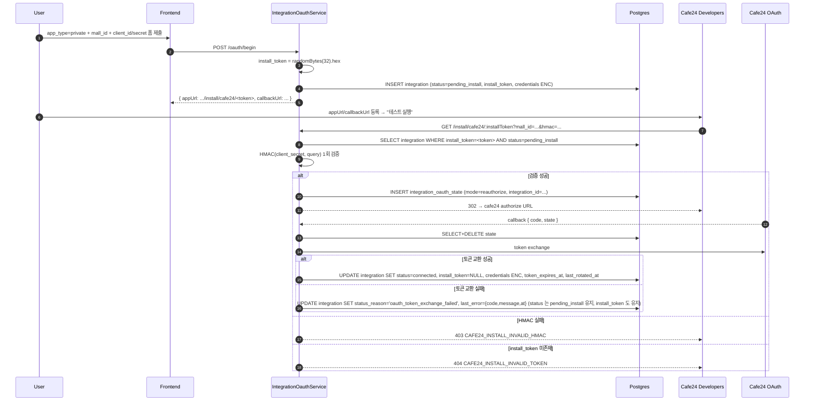

# Spec Draft — Cafe24 Pending Install 정비

본 draft 는 `plan/in-progress/spec-update-cafe24-pending-polish.md` 의 위임 요구를 spec 본문 패치 형태로 구체화한다. `/consistency-check --spec` 통과 후 그대로 적용된다.

---

## DRAFT 1 — `spec/1-data-model.md` §2.10 Integration

### 1A. status enum 행 (replace)

```diff
- | status | Enum | connected / expired / error |
+ | status | Enum | connected / expired / error / pending_install |
```

### 1B. install_token 컬럼 (insert, status 행 직후)

```
| install_token | String? | Cafe24 Private 앱 설치 흐름 식별 키. `oauth/begin (app_type=private)` 시 32바이트 hex 발급, callback 성공 또는 TTL 만료 시 NULL. Cafe24 private 전용 — 다른 service_type 에서는 항상 NULL. 정식 라이프사이클은 [Spec 통합 화면 §6 상태 전이](./2-navigation/4-integration.md#6-상태-전이) 와 [§9.2 API](./2-navigation/4-integration.md#92-인증--회전--scope) |
```

### 1C. status_reason 행 (replace — pending_install case 명시, snake_case 통일)

```diff
- | status_reason | String? | status가 error일 때의 이유 (`insufficient_scope`, `auth_failed`, `network`, `unknown`). 다른 상태에서는 NULL |
+ | status_reason | String? | 상태별 사유 코드 (모두 `snake_case`). `error` → `insufficient_scope` / `auth_failed` / `network` / `unknown` (현행) — `credentials_unreadable` 은 pre-existing 분기(`integrations.service.ts:845`)로 본 개정 범위 외이나 정합성 유지를 위해 §10.4 / data-flow §3.2 에 동시 명시. `expired` → `token_expired` / `refresh_failed` / `install_timeout`. `pending_install` → callback 실패 분기 코드 (`oauth_token_exchange_failed`, `oauth_state_mismatch`, `oauth_state_expired`). ※ `resource_not_found` 는 row 자체가 사라진 케이스라 status_reason 갱신이 불가능 — §10.4 표에서 "변경 불가" 로만 다루고 본 컬럼 후보값에서는 제외. `connected` → NULL. ※ 본 컬럼의 값은 callback HTML 의 API 에러 코드(`OAUTH_*`, `UPPER_SNAKE_CASE`) 와 동일 의미를 `snake_case` 로 표기한다 — DB 저장값은 `snake_case`, API 응답 에러 코드는 `UPPER_SNAKE_CASE` (의도적 분리, [Spec 통합 화면 §10.4](./2-navigation/4-integration.md#104-에러-매핑) 참고) |
```

### 1D. §3 인덱스 전략 (replace `(workspace_id, status)` 행 + 신규 `(install_token)` 부분 인덱스 추가)

```diff
- | Integration | (workspace_id, status) | 만료/에러 상태 배지 카운트 |
+ | Integration | (workspace_id, status) | 만료/에러 상태 배지 카운트 + `pending_install` TTL 스캐너 조회 + 중복 방지 lookup 겸용 ([Spec 통합 화면 §6](./2-navigation/4-integration.md#6-상태-전이)) |
+ | Integration | (install_token) WHERE install_token IS NOT NULL | Cafe24 Private App URL (`/oauth/install/cafe24/:installToken`) 의 단일 row 식별. NULL 비저장 부분 인덱스로 인덱스 크기 최소화 (전체 행의 0.001% 미만이 pending_install) |
```

> 인덱스 자체는 V042 (`install_token` 컬럼 추가 migration) 와 함께 또는 후속 V0XX 로 추가한다 — `install_token UNIQUE` 제약을 둘지(중복 random 32바이트 충돌 무시 가능 수준이라 UNIQUE 생략) 는 운영 시점에 결정.

---

## DRAFT 2 — `spec/2-navigation/4-integration.md`

### 2A. §2.2 항목 요소 (replace — 상태 아이콘·상태 텍스트·더보기 행)

```diff
- | 상태 아이콘 | 🟢 connected / 🟡 expiring(7일 이내)·expired / 🔴 error(reason) |
+ | 상태 아이콘 | 🟢 connected / 🟡 expiring(7일 이내)·expired / 🔴 error(reason) / ⏳ pending_install |
...
- | 상태 텍스트 | `Connected` / `Expires in Nd` / `Expired` / `Error: <reason>` |
+ | 상태 텍스트 | `Connected` / `Expires in Nd` / `Expired` / `Error: <reason>` / `Pending install` (보조 문구: "Complete Cafe24 Test Run to activate". `status_reason`/`last_error` 가 채워지면 카드 하단에 진단 단서 표시 — 예: `Last error: OAUTH_TOKEN_EXCHANGE_FAILED — Failed to exchange authorization code`) |
...
- | 더보기(⋮) | 상세 열기, 연결 테스트, 재인증(OAuth), 삭제(차단 시 비활성) |
+ | 더보기(⋮) | 상세 열기, 연결 테스트(연결됨에 한함), 재인증(OAuth · **비활성 조건**: §4.2 Reauthorize 행 참조 — 요약: `status='pending_install'`, `service_type='cafe24' AND credentials.app_type='private'` 전체 케이스, `expired AND status_reason='install_timeout'`), 삭제(차단 시 비활성). `pending_install` 의 ⋮ 메뉴는 **상세 열기 + 삭제만 활성** — 재인증은 cafe24 측 "테스트 실행" 재호출이 정식이며, 연결 테스트는 토큰이 없어 의미가 없다 |
```

### 2A-bis. §2.3 검색·필터 (W4) — pending_install 의도적 제외 inline note

§2.3 표 직후 / "모든 필터는 URL 쿼리 파라미터로 ..." 문장 앞에 다음 한 줄 추가:

```
※ 상태 칩에 `pending_install` 은 포함하지 않는다 — 외부 흐름(Cafe24 Developers "테스트 실행") 진행 중 정상 전환 상태이며, 사용자가 명시적으로 필터링할 수요가 낮다. 별도 수요 발생 시 후속 plan 으로 재검토 (Rationale 참고).
```

### 2B. §2.4 "Need attention" 배너 (replace 조건 줄)

```diff
- - 조건: `status IN (expired, error)` OR `token_expires_at <= now() + 7d`
+ - 조건: `status IN (expired, error)` OR `token_expires_at <= now() + 7d`. `pending_install` 은 사용자가 외부(Cafe24 Developers)에서 흐름을 진행 중인 정상 상태로 보고 배너에서 제외한다 — `status_reason` 이 채워진 케이스도 동일 (재시도가 cafe24 측에서 일어나므로 우리 화면의 attention 으로는 잡지 않음).
```

### 2C. §3.2 Cafe24 Private 응답 예시 (replace — appUrl 줄)

```diff
   응답: `{ "mode": "cafe24_private_pending", "integrationId": "...", "appUrl": "https://.../oauth/install/cafe24", "callbackUrl": "https://.../oauth/callback/cafe24" }`.
↓
   응답: `{ "mode": "cafe24_private_pending", "integrationId": "...", "appUrl": "https://<host>/api/integrations/oauth/install/cafe24/:installToken", "callbackUrl": "https://<host>/api/integrations/oauth/callback/cafe24" }`. `appUrl` 의 마지막 path segment 가 `install_token` 이며, Cafe24 Developers 의 "앱 URL" 에 그대로 등록한다. 토큰 없는 옛 경로 (`/oauth/install/cafe24`) 는 410 Gone 으로 응답한다 — 운영 전환기에 옛 등록 URL 잔존을 감안한 완충.
```

추가로 §3.2 단계 3–4 텍스트:

```diff
- 3. **Cafe24 "테스트 실행"** — Cafe24 가 App URL(`GET /api/integrations/oauth/install/cafe24`) 를 호출. 쿼리 파라미터: ...
+ 3. **Cafe24 "테스트 실행"** — Cafe24 가 App URL(`GET /api/integrations/oauth/install/cafe24/:installToken`) 를 호출. 쿼리 파라미터: ...

- 4. **App URL 처리** — 백엔드가 HMAC 을 검증하고, `mall_id` + `app_type=private` 로 `pending_install` Integration 을 조회한 뒤 OAuthState 를 생성하고 ...
+ 4. **App URL 처리** — 백엔드가 path 의 `install_token` 으로 단일 `pending_install` Integration 을 조회하고, 그 row 의 `client_secret` 으로 HMAC 을 1회 검증한다 (현행 in-memory 100건 스캔 대체). 검증 통과 시 OAuthState 를 생성하고 ...
```

### 2D-pre. §6 노트 추가 (W5 — install_timeout expired 행 reauthorize 비활성)

§6 본문 마지막 노트 바로 위 또는 §2.2 더보기(⋮) 정의에 다음 한 줄 추가:

```
> `status_reason='install_timeout'` 으로 expired 처리된 Cafe24 Private 행은 reauthorize 버튼이 **비활성** 이다 — Private 앱은 재인증 진입점이 없고 cafe24 "테스트 실행" 만 정식이다. 사용자는 행을 삭제 후 새로 등록한다.
```

### 2D. §6 상태 전이 (replace 다이어그램 + 전이 표)

```
[pending_install] ──install callback success──▶ [connected]
       │                                              │
       │ (Cafe24 private 앱 전용)        ┌────────────┘
       │                                 ▼
       │                    ──expire──▶ [expired] ──reauthorize success──┐
       │                        │                                         │
       │                        └──rotate success─────────────────────────┤
       │                     call fails                                    │
       │                        │                                          │
       │                        ▼                                          │
       │                [error(reason)] ──rotate/reauthorize success───────┘
       │
       ├── install TTL 24h 만료 ──▶ [expired] (status_reason='install_timeout')
       │
       ├── callback 실패 (token exchange / state / row 조회) ──▶ [pending_install] (자기 루프, status_reason + last_error 갱신, status 보존)
       │
       └── manual delete ──▶ (삭제)
```

> **번복 acknowledgment**: 기존 spec §6 의 `pending_install → (삭제)` (install timeout 자동 삭제) 화살표는 본 개정에서 제거되고 위 다이어그램의 `→ [expired]` 로 대체된다. 자동 삭제 경로는 없어지며, 삭제는 `manual delete` 경로로만 일어난다. (DRAFT 2I Rationale 의 "install_token TTL 24h" 첫 단락 참고)

전이 표 갱신 (추가 행 2개 + 기존 행 유지):

| 전이 | 트리거 이벤트 |
|------|--------------|
| (기존) pending_install → connected | Cafe24 Private 앱 "테스트 실행" → HMAC 검증 → OAuth callback 성공 |
| **(신규) pending_install → expired** | install_token 발급 후 24시간 내 callback 미성공 — 일일 스캐너가 `status='expired'`, `status_reason='install_timeout'`, `install_token=NULL` 로 자동 전이. 재시도하려면 사용자가 새로 통합을 등록하거나 expired 행에서 reauthorize 흐름 (단 private 앱은 reauthorize 불가 → 권장: 삭제 후 재등록) |
| **(신규) pending_install → pending_install (callback 실패 보존)** | OAuth callback 처리 중 token exchange 실패 / state mismatch / state expired 등이 발생하면 status 는 보존되고 `last_error` + `status_reason` (`oauth_token_exchange_failed` / `oauth_state_mismatch` / `oauth_state_expired`, 모두 snake_case) 만 갱신된다. 사용자가 cafe24 측 설정을 고치고 "테스트 실행" 을 다시 누르면 새 OAuthState 가 생성되어 재시도 가능. ※ row 자체가 사라진 `resource_not_found` 케이스는 갱신 대상이 없어 §10.4 "변경 불가" 행으로만 다룬다. |
| (기존) connected → expired | 매일 스캐너 또는 노드 실행 중 토큰 갱신 실패 (refresh fail) |
| (기존) connected → error(auth_failed) | 노드 실행 중 401/403 |
| (기존) connected → error(insufficient_scope) | 노드 실행 중 403 + 서비스별 `missing_scope` 시그널 |
| (기존) connected → error(network) | 노드 실행 중 커넥션 실패가 3회 연속 |
| (기존) expired/error → connected | `reauthorize` 또는 `rotate` 성공 (연결 테스트 통과) |
| **(명시) → (삭제)** | **사용자가 명시적으로 Delete 액션을 수행한 경우에만**. 자동 삭제는 없음 (TTL 만료는 expired 로만 전이) |

§6 본문 마지막 노트 (replace + 1줄 추가):

```diff
- > `pending_install` 은 Cafe24 Private 앱 전용 상태. 이 상태의 Integration 은 노드·AI Agent 에서 사용할 수 없다 (`INTEGRATION_INCOMPLETE` — §4.2). 사용자가 Cafe24 에서 "테스트 실행" 을 완료해야 `connected` 로 전이한다.
+ > `pending_install` 은 Cafe24 Private 앱 전용 상태. 이 상태의 Integration 은 노드·AI Agent 에서 사용할 수 없다 (`INTEGRATION_INCOMPLETE` — §4.2). 사용자가 Cafe24 에서 "테스트 실행" 을 완료해야 `connected` 로 전이한다. callback 시도가 실패해도 status 는 보존되어 재시도가 가능하며, 24시간 내 성공하지 못하면 `expired` 로 자동 전이된다 (install_timeout — `install_token` 도 NULL 로 소거).
```

### 2E. §9.2 인증 / 회전 / Scope (replace install 라인)

```diff
- | GET | `/api/integrations/oauth/install/cafe24` | Cafe24 Private 앱 App URL 엔드포인트. Cafe24 "테스트 실행" 시 Cafe24 가 호출. 쿼리: `mall_id`, `timestamp`, `hmac` 등 Cafe24 표준 파라미터. HMAC(HmacSHA256+Base64) 검증 → `pending_install` Integration 조회 → OAuthState 생성 → Cafe24 authorize URL 로 `302 redirect`. 에러: `CAFE24_INSTALL_INVALID_HMAC`(403, pending 미발견 포함 — 정보 노출 방지), `CAFE24_INSTALL_REPLAY`(400). |
+ | GET | `/api/integrations/oauth/install/cafe24/:installToken` | Cafe24 Private 앱 App URL 엔드포인트. Cafe24 "테스트 실행" 시 Cafe24 가 호출. path 의 `:installToken` 은 oauth/begin 응답으로 받은 32바이트 hex (URL-safe). 쿼리: `mall_id`, `timestamp`, `hmac` 등 Cafe24 표준 파라미터. **식별 절차**: `install_token` 으로 단일 row 조회 → 그 row 의 `client_secret` 으로 HMAC 1회 검증. 통과 시 OAuthState 생성 → Cafe24 authorize URL 로 `302 redirect`. 에러: `CAFE24_INSTALL_INVALID_TOKEN`(404, 토큰 미존재·이미 소비), `CAFE24_INSTALL_INVALID_HMAC`(403), `CAFE24_INSTALL_REPLAY`(400, timestamp ±5분 초과). |
+ | GET | `/api/integrations/oauth/install/cafe24` | (Deprecated) 옛 토큰 없는 경로. `CAFE24_INSTALL_LEGACY_PATH`(410) 로 응답하며, 클라이언트(통합 생성 폼)는 새 토큰 포함 URL 만 발급한다. 운영 전환기 완충용 — 영구 폐기 시점은 별도 plan. |
```

### 2F. §9.4 공통 응답 포맷 — 에러 코드 보강

```diff
   - `INTEGRATION_IN_USE` (409) — 삭제 차단
   - `INTEGRATION_TEST_FAILED` (422) — 연결 테스트 실패
   - `OAUTH_STATE_MISMATCH` (400)
   - `OAUTH_CONFIG_MISSING` (500)
   - `INSUFFICIENT_SCOPE` (403) — 노드 실행 중 감지 시 `Integration.status`도 갱신
+  - `CAFE24_INSTALL_INVALID_TOKEN` (404) — App URL 의 `install_token` 미존재 또는 callback 성공·TTL 만료로 이미 소거
+  - `CAFE24_INSTALL_INVALID_HMAC` (403) — App URL HMAC 검증 실패
+  - `CAFE24_INSTALL_REPLAY` (400) — App URL 의 timestamp 가 ±5분 윈도우 밖
+  - `CAFE24_INSTALL_LEGACY_PATH` (410) — 토큰 없는 옛 install 경로 호출
+  - `CAFE24_PRIVATE_APP_ALREADY_CONNECTED` (409) — 동일 `(workspaceId, mall_id, app_type='private')` 에 이미 `connected` Integration 존재. swagger 규약(spec/conventions/swagger.md §2-4 — 중복/충돌은 409, `INTEGRATION_IN_USE(409)` 선례) 에 맞춤. 사용자에게 기존 통합 사용 또는 삭제 후 재등록 안내
```

### 2F-bis. §9.2 oauth/begin 응답 (Cafe24 Private) appUrl 형식 + 중복 가드 명시 (I11, W3)

§9.2 표의 `POST /oauth/begin` 행 본문 끝에 다음 두 문장 추가:

```
※ Cafe24 Private 응답의 `appUrl` 은 `${APP_URL}/api/integrations/oauth/install/cafe24/:installToken` 형식이다 — `installToken` 은 본 begin 호출이 발급한 32바이트 hex 로 Cafe24 Developers "앱 URL" 에 그대로 등록된다.

※ Cafe24 Private 흐름 진입 시 동일 `(workspaceId, mall_id, app_type='private')` 의 connected Integration 이 이미 존재하면 begin 자체가 `CAFE24_PRIVATE_APP_ALREADY_CONNECTED (409)` 으로 즉시 거부된다 — 사용자는 기존 통합을 사용하거나 삭제 후 재등록한다.
```

### 2G. §10.4 에러 매핑 (replace 표)

```diff
  | 에러 | 팝업 표시 | Integration 상태 |
  |------|----------|----------------|
- | state 불일치 | `Security validation failed. Please try again.` | 변경 없음 |
- | 사용자 거부 | `Authorization was denied.` | 변경 없음 |
- | 코드 교환 실패 | `Failed to connect to {provider}.` | reauthorize면 `error(auth_failed)` |
- | 네트워크 오류 | `Connection error.` | 변경 없음 |
+ | state 불일치 | `Security validation failed. Please try again.` | 변경 없음 (integrationId 식별 전 단계라 row 갱신 불가) |
+ | 사용자 거부 | `Authorization was denied.` | 변경 없음 |
+ | 코드 교환 실패 (mode=`reauthorize`, status=`connected`) | `Failed to connect to {provider}.` (auto-close 3~5초 지연 — 사용자가 메시지 읽도록) | `error(auth_failed)` + `last_error` 기록 |
+ | 코드 교환 실패 (mode=`reauthorize`, status=`pending_install` — Cafe24 Private 초기 install) | 동일 | **status 보존 (`pending_install` 유지)** + `status_reason='oauth_token_exchange_failed'` + `last_error.code='OAUTH_TOKEN_EXCHANGE_FAILED'` 기록. cafe24 측 설정 수정 후 재시도 가능 |
+ | state mismatch / expired (state row 소비 후) | `Security validation failed.` / `OAuth state has expired.` | integrationId 가 식별되면 `status_reason='oauth_state_mismatch'` 또는 `oauth_state_expired` 만 기록, status 보존 |
+ | 토큰 발급 후 row 조회 실패 (resource not found) | `Integration not found.` | 변경 불가 (row 가 사라진 케이스. integrationId 만 식별, row 가 없으니 갱신 대상 없음) |
+ | 네트워크 오류 | `Connection error.` | integrationId 식별되면 `last_error` 만 기록, status 보존 |
```

§10.2 step 4 reauthorize 분기에 다음 한 줄 보강 (W8):

```diff
   - `reauthorize`: 기존 `integrationId`의 credentials를 새 토큰으로 교체, status를 `connected`로 복귀
+    - ※ 단, integration 현재 status 가 `pending_install` 이면 callback 성공 시 `connected` 로, **실패 시 `pending_install` 유지** + `last_error`/`status_reason` 갱신 (cafe24 Private 초기 install 흐름 — 상세는 step 6).
```

§10.2 처리 플로우 마지막에 추가 (replace step 5 + insert step 6):

```diff
  5. **팝업 → 부모 창 알림**:
  ...
  window.close();
  ```
+ 6. **실패 처리**: handleCallback 내부에서 예외가 발생하면 컨트롤러는 동일한 callback HTML (`status: 'error'`, error message 포함) 을 반환한다. 팝업은 메시지 읽힘을 위해 **3~5초 지연 후 window.close()** (성공은 즉시). state 소비 이후의 예외는 `OAuthState.integrationId` 컨텍스트가 살아있으므로 백엔드가 해당 row 의 `last_error` + `status_reason` 을 갱신한다. status 보존 규칙은 §10.4 표가 정의 — 요약: **`pending_install` 은 `pending_install` 유지** (cafe24 Private 초기 install — 재시도 흐름 보존), **`connected` 의 reauthorize 실패 중 코드 교환 실패는 §10.4 표대로 `error(auth_failed)` 로 전이** (기존 정책), state mismatch/expired 등 state 단계 실패는 `last_error` 만 기록하고 status 보존.
```

### 2H. §14.2 워크플로우 에디터 — Resource → 카테고리 단어 교정

```diff
- - AI Agent 노드는 ... — Cafe24 의 경우 도구 수가 많아(Resource × Operation = ~180) allowlist UI 가 Resource 단위 grouping 으로 노출된다 ...
+ - AI Agent 노드는 ... — Cafe24 의 경우 도구 수가 많아(Resource × Operation = ~180) allowlist UI 가 카테고리 단위 grouping 으로 노출된다 (용어는 [Spec Cafe24 API 메타데이터 §6](../conventions/cafe24-api-metadata.md#6-allowlist-와의-관계) 기준) ...
```

같은 표현이 `spec/4-nodes/4-integration/4-cafe24.md:337` 에도 있으므로 함께 수정:

```diff
- AI Agent config 의 ... UI 에서는 Resource 단위 grouping 으로 사용성 보강 — "Product (read/write 전부 허용)" 같은 short form 을 frontend 가 enabledTools 배열로 펼쳐 저장한다.
+ AI Agent config 의 ... UI 에서는 카테고리 단위 grouping 으로 사용성 보강 — "Product (read/write 전부 허용)" 같은 short form 을 frontend 가 enabledTools 배열로 펼쳐 저장한다 (용어 정의는 [Spec Cafe24 API 메타데이터 §6](../../conventions/cafe24-api-metadata.md#6-allowlist-와의-관계)).
```

추가로 `spec/conventions/cafe24-api-metadata.md §6` 본문 첫 단락에 다음 한 줄 inline 보강 (I10):

```
> 용어: **UI grouping 단위 = "카테고리"** (사용자 친화 표기) — 백엔드 메타데이터 파일 구조의 "Resource" 와 동일 범위를 가리키며, 문맥에 따라 혼용한다. spec 본문에서는 UI 맥락이면 "카테고리", 백엔드/Operation 메타데이터 맥락이면 "Resource" 사용.
```

### 2I. 본문 끝에 `## Rationale` 섹션 신설 (정보성 — I5)

```markdown
## Rationale

### Cafe24 Private 앱의 callback 실패는 왜 status 를 보존하나 (2026-05-14)

`pending_install` 상태의 Integration 이 callback 처리 중 token exchange 실패 등으로 떨어졌을 때, 자연스러운 선택지는 `error(auth_failed)` 로 전이하는 것이다. 그러나 Private 앱은 `reauthorize` 액션이 불가능하다 — OAuth 재시작은 **Cafe24 Developers 의 "테스트 실행"** 만 정식 진입점이고, 그 진입점은 우리가 발급한 `install_token` 을 path 에 그대로 사용한다. status 를 `error` 로 바꾸면 (a) UI 가 "reauthorize" 액션을 권장하지만 실제로 그 액션이 무력하고, (b) 사용자는 cafe24 측 설정을 고친 뒤 다시 "테스트 실행" 을 누르는 외부 흐름을 진행 중인데 우리 화면이 이를 "error" 로 표기해 흐름 단계를 오인하게 된다. 따라서 callback 실패는 `status_reason` + `last_error` 만 채우고 status 는 `pending_install` 그대로 유지한다. (참고: `review/consistency/2026-05-14_16-48-25`)

`status_reason` 의 저장값은 callback 에러 코드를 `snake_case` 로 표기한다 — DB 컬럼 컨벤션 전체가 `auth_failed`, `token_expired` 등 `snake_case` 인 것과 통일. 한편 API 응답·callback HTML 의 에러 코드는 `OAUTH_*`, `CAFE24_*` 같은 `UPPER_SNAKE_CASE` 를 유지한다 (HTTP 컨벤션). 동일 의미 두 표기는 [Spec 통합 화면 §10.4](#104-에러-매핑) 에서 매핑.

`last_error.code` 와 `status_reason` 이 같은 값을 중복 보존하는 이유: `last_error` 는 JSONB 라 보존 정책(향후 GDPR 등)에 따라 소거될 수 있다. status_reason 은 plain string 컬럼으로 더 가볍게 유지되며, "왜 이 상태에 있는지" 의 핵심 신호로 보존된다.

### install_token 을 App URL path 식별 키로 승격 (2026-05-14)

원래 설계는 `GET /oauth/install/cafe24` 가 mall_id + HMAC 만 받고, 백엔드가 `pending_install` 행을 in-memory 로 100건 스캔하면서 mall_id 일치 candidates 의 client_secret 으로 HMAC 검증을 trial 했다. 두 가지 운영 위험이 누적됐다 — (a) 동일 mall_id 의 중복 `pending_install` 이 누적되면 HMAC 매칭이 비결정적이고 사용자가 보고 있는 행이 아닌 다른 행이 connected 처리될 수 있다 (W3 시나리오), (b) `pending_install` 수가 커지면 O(N) 매칭 비용. App URL path 에 `install_token` 을 박으면 단일 row 조회로 고정되고, 토큰 자체가 32바이트 random 이므로 추측 불가능한 식별자 역할도 겸한다. 옛 토큰 없는 경로는 즉시 폐기하지 않고 `410 Gone` 으로 응답해 운영 전환기 완충 — **영구 폐기 시점은 `plan/in-progress/cafe24-pending-polish.md` 의 후속 항목으로 추가** (운영 데이터·외부 등록 URL 잔존 여부 확인 후 결정).

기존 §9.2 의 `CAFE24_INSTALL_INVALID_HMAC(403)` 은 "HMAC 불일치 또는 pending 미발견" 두 케이스를 합쳐 정보 노출 방지 차원에서 일반화했었다. 본 개정에서 식별 키가 `install_token` 으로 분리되면서 "토큰 미존재" 케이스는 `CAFE24_INSTALL_INVALID_TOKEN(404)` 로 의미 축소 분리한다 — 토큰 추측 불가능 가정 하에서 정보 노출 위험이 제거됐기 때문. 내부 e2e/통합 테스트는 404 응답에 대응해야 한다 (I7).

`CAFE24_PRIVATE_APP_ALREADY_CONNECTED` 의 동시 요청 race condition 은 **앱 레벨 체크로만** 처리한다 (DB 유니크 인덱스 추가 안 함). 이유: 같은 mall_id 의 connected 통합이 동시에 두 번 생성되는 상황은 사용자가 같은 폼을 거의 동시에 두 번 제출했을 때만 발생하며, 그 경우 두 번째 요청이 첫 번째의 connected 상태를 본 뒤 거부되는 흐름이 자연스럽다. DB 유니크 인덱스는 partial UNIQUE 가 PostgreSQL 에서 가능하나 credentials 가 암호화 JSONB 라 mall_id 추출 불가 → 인덱스 적용 불가. trade-off 가 명확하지 않으면 앱 레벨에서 시작 (I5).

### install_token TTL 24h (2026-05-14)

**기존 spec §6 는 install timeout 시 `→ (삭제)` 를 명시했으나 본 개정에서 `→ expired (status_reason='install_timeout')` 로 번복한다.** 이유: 데이터 분석·감사 목적으로 보존이 유리하고, 사용자가 만료된 행을 보고 "왜 install 이 안 됐는지" 를 진단할 단서가 남아야 함. 자동 삭제는 더 이상 일어나지 않으며, manual delete 만 삭제 경로다. (W4 acknowledgment)

Cafe24 Developers 의 앱 등록 → "테스트 실행" 까지의 사용자 작업 텀을 최대 1일로 가정한다. 더 길면 stale `pending_install` 행이 누적되어 §9.2 의 식별 키 룩업 성능과 §2.4 attention 카운트에 잡음. 더 짧으면 정상 흐름이 끊긴다 (사용자가 점심·미팅·휴일 사이클에 작업이 분할되기 쉬움). 24h 가 지나면 `status='expired'`, `status_reason='install_timeout'`, `install_token=NULL` 로 자동 전이. 만료된 행은 데이터 분석·감사 목적으로 삭제하지 않고 보존한다 (manual delete 별도).

`status_reason='install_timeout'` 인 expired 행에서는 reauthorize 버튼이 **비활성** 이다 — Private 앱은 재인증 진입점이 없고 cafe24 "테스트 실행" 만 정식이다. 사용자는 행을 삭제 후 새로 등록한다. (W5)

### OAuthState.mode='reauthorize' 를 초기 install 에도 재사용한 이유 (2026-05-14)

Cafe24 Private 의 "테스트 실행" 흐름은 `pending_install` 행이 이미 존재하는 상태에서 OAuthState 를 새로 발급해 token 교환을 완료한다 — 의미상 "기존 행에 token 을 채운다" 라는 점에서 `mode='reauthorize'` 와 동일 (`mode='new'` 는 OAuthState 에 integrationId 가 없고 callback 이 previewToken 을 발급하는 다른 흐름). 별도 `mode='cafe24_private_install'` 을 신설하는 안도 검토했으나, callback 의 처리 분기가 동일 (integration row UPDATE) 이고 spec 의 §10.2 step 4 가 이미 reauthorize 를 "기존 integrationId 의 credentials 갱신" 으로 정의하고 있어 enum 확장으로 얻는 이득이 없다. status 가 `pending_install` 이냐 `connected` 이냐에 따라 callback 의 후처리만 살짝 다를 뿐 (`installToken=null` 처리 등). 단, 향후 reauthorize 와 분리해야 할 동작이 늘어나면 별도 mode 신설 검토. (W2)

### CAFE24_PRIVATE_APP_ALREADY_CONNECTED 의 mall_id 비교 경로 (2026-05-14)

`mall_id` 는 `credentials` JSONB 안에 저장되고 컬럼 자체는 암호화 transformer 를 거친다. 따라서 begin 시점의 중복 가드는 (a) 동일 workspace 의 cafe24 통합을 SQL 로 조회한 뒤 (b) ORM 경계에서 자동 복호화된 `credentials.mall_id` 와 새 요청의 mall_id 를 in-memory 비교한다. DB 레벨 UNIQUE 인덱스로 강제할 수 없는 trade-off — credentials 가 암호화돼 partial UNIQUE index 적용 불가. 동시 요청 race 는 매우 좁은 윈도우 (사용자가 같은 폼을 거의 동시에 두 번 제출) 라 앱 레벨 체크로 충분. (W3)

### CAFE24_INSTALL_INVALID_TOKEN(404) 의 보안 전제 (2026-05-14)

옛 `CAFE24_INSTALL_INVALID_HMAC(403, pending 미발견 포함)` 합산 정책은 토큰이 path 에 없던 시절 "어느 mall_id 에 pending 이 있는지" 정보가 응답 코드로 새지 않게 하는 안전망이었다. 새 디자인에서 `install_token` 은 32바이트 (256-bit) random hex 라 추측 불가능 — URL path 자체가 capability token 처럼 동작한다. 이 전제 하에서 "토큰 미존재" 케이스를 `CAFE24_INSTALL_INVALID_TOKEN(404)` 로 분리해도 무의미한 enumeration 이 일어나지 않는다. **이 전제가 깨지면** (예: 토큰 길이 단축, PRNG 변경, install_token 노출 사고) 다시 403 으로 통합해야 한다. (W4)

### status_reason `oauth_token_exchange_failed` 와 auth 도메인의 `token_exchange_failed` 구분 (2026-05-14)

소셜 로그인 흐름(`spec/2-navigation/10-auth-flow.md`) 의 URL param `error=token_exchange_failed` 와 본 spec 의 통합 callback `status_reason='oauth_token_exchange_failed'` 는 도메인이 다른 별개 신호다 — 전자는 user authentication 도메인, 후자는 integration credentials 도메인. 의도적으로 prefix `oauth_` 를 두어 grep·index 시 도메인 구분이 자명하도록 분리했다. 이름은 통일하지 않는다. (W4)

### Cafe24 Private 의 `connected → expired` 복구 경로 (2026-05-14)

일반 OAuth provider 는 `expired → connected` 가 reauthorize 또는 자동 refresh 로 복구된다 (§6 / data-flow §3.1). **Cafe24 Private 앱은 reauthorize 진입점이 없고**, refresh 도 token endpoint 가 mall 별이라 일반 흐름이긴 하지만 만약 refresh 가 실패해 `expired(refresh_failed)` 로 떨어지면 **복구 유일 경로는 삭제 후 재등록** 이다. 이건 Private 앱의 구조적 제약 (우리 서버가 OAuth 를 시작할 수 없음) 의 당연한 귀결이며, §6 전이 표의 `expired → connected (reauthorize)` 항은 Cafe24 Private 에는 적용되지 않음. UI 의 reauthorize 버튼 비활성 (§4.2) 이 이 사실을 반영한다. (W3)

### `pending_install` 은 필터 칩에 추가하지 않는다 (2026-05-14)

§2.3 상태 필터 칩은 `Connected / Expiring / Expired / Error` 4종 + All 로 운영된다. `Pending install` 은 사용자가 외부 흐름(Cafe24 Developers) 을 진행 중인 **정상 전환 상태** 로 보고 필터 칩에 추가하지 않는다. 별도 필터링 수요가 발생하면 후속 plan 으로 추가 검토. (I12)
```

---

## DRAFT 2J — `spec/4-nodes/4-integration/4-cafe24.md` §9.4 + §9.8 (W1, W2)

### 2J-1. §9.4 Private 앱 흐름 step 3/4 URL 갱신 (W1)

```diff
- 3. Cafe24 가 `GET /api/integrations/oauth/install/cafe24?mall_id=...&hmac=...` 로 App URL 호출
+ 3. Cafe24 가 `GET /api/integrations/oauth/install/cafe24/:installToken?mall_id=...&hmac=...` 로 App URL 호출 — path 의 `install_token` 은 step 1 의 `pending_install` 생성 시 발급된 32바이트 hex
- 4. 백엔드: HMAC 검증(§9.8) → OAuthState 생성 → Cafe24 authorize URL 로 redirect
+ 4. 백엔드: path 의 `install_token` 으로 `pending_install` Integration 단일 row 조회 → 그 row 의 `client_secret` 으로 HMAC 1회 검증 (§9.8 — 단일 row 조회 + 1회 검증) → OAuthState 생성 → Cafe24 authorize URL 로 redirect. 토큰 미존재 시 `404 CAFE24_INSTALL_INVALID_TOKEN`, HMAC 불일치 시 `403 CAFE24_INSTALL_INVALID_HMAC`
```

### 2J-bis. §9 Rationale 섹션 cross-reference 보강 (W-5)

`4-cafe24.md` 의 `## 9. Rationale` 섹션 (이미 존재) 내 `### 9.8 Private 앱 App URL HMAC 검증` 본문 끝에 다음 한 줄 추가:

```
> 식별 전략 번복(mall_id 스캔 → install_token 단일 조회) 배경은 [Spec 통합 화면 ## Rationale "install_token 을 App URL path 식별 키로 승격"](../../2-navigation/4-integration.md#rationale) 참조.
```

### 2J-2. §9.8 HMAC 검증 알고리즘 + 식별 전략 전면 갱신 (W2)

§9.8 본문 갱신 — "알고리즘" 자체는 동일하지만 "식별 전략" 단락을 단일 row 조회 + 1회 검증으로 재서술하고, replay/error 응답을 새 에러 코드와 맞춤.

```diff
- **식별 전략:** HMAC 이 `client_secret` 에 묶여 있어, 같은 `mall_id` 에 복수의 `pending_install` Integration 이 있어도 HMAC 검증을 통과한 것이 정확한 타깃이다.
+ **식별 전략 (2026-05-14 갱신):** App URL path 의 `:install_token` 으로 `pending_install` Integration 을 **단일 row 조회** 한다. 조회된 row 의 `client_secret` 으로 HMAC 을 **1회만** 검증한다 — 옛 in-memory 100건 스캔 + trial HMAC 방식은 폐기 (W3 dedup 시나리오 + O(N) 비용 동시 해소). 토큰 미존재 시 `404 CAFE24_INSTALL_INVALID_TOKEN`, HMAC 불일치 시 `403 CAFE24_INSTALL_INVALID_HMAC`, timestamp 윈도우 초과 시 `400 CAFE24_INSTALL_REPLAY`. 토큰이 callback 성공 또는 TTL 만료로 NULL 이 되면 그 시점 이후의 App URL 재호출은 토큰 미존재 분기로 처리된다.
```

verifyHmac 의 TypeScript 예시 자체는 그대로 유지 (알고리즘은 동일). 식별 전략 단락이 이미 "단일 row 조회 + 1회 검증" 을 명시하므로 함수 위 별도 주석은 추가하지 않는다 (I-5 — 중복 회피).

§9.4 본문 마지막 줄 (CHANGELOG 직전) 에 다음 한 줄 inline 추가:

```
> 2026-05-14 개정: App URL path 가 `/oauth/install/cafe24/:installToken` 로 변경됨 — 식별을 mall_id 스캔에서 install_token 단일 조회로 옮긴 결과. 토큰 없는 옛 경로는 410 Gone. ([Spec 통합 화면 §9.2](../../2-navigation/4-integration.md#92-인증--회전--scope))
```

§9.4 Private 앱 흐름 요약 step 5 직후 신규 step 6/7 추가 (W-4 — 실패 분기 명시):

```diff
  5. 동의 → callback → 토큰 교환 → Integration `pending_install → connected`
+ 6. **실패 시**: callback 처리 중 token exchange 실패 등이 발생하면 `pending_install` 행에 `status_reason` (예: `oauth_token_exchange_failed`) + `last_error` 가 기록되고 **status 는 보존**된다. 사용자는 cafe24 측 설정을 고치고 "테스트 실행" 을 다시 호출해 재시도한다. (상세는 [Spec 통합 화면 §10.4](../../2-navigation/4-integration.md#104-에러-매핑))
+ 7. **TTL 만료**: install_token 발급 후 24시간 내 step 5/6 가 성공하지 못하면 일일 스캐너가 `status='expired'`, `status_reason='install_timeout'`, `install_token=NULL` 로 자동 전이한다. 재시도하려면 사용자가 행을 삭제 후 새로 등록한다 — Private 앱은 재인증 진입점이 없다. (상세는 [Spec 통합 화면 §6](../../2-navigation/4-integration.md#6-상태-전이))
```

§10 CHANGELOG 표의 기존 `2026-05-14 | §9.4 Private 앱 흐름 전면 재정의 ...` 행을 다음 내용으로 **확장 replace** (중복 행 생성 회피, Warning #2):

```diff
- | 2026-05-14 | §9.4 Private 앱 흐름 전면 재정의 — 우리 서비스가 OAuth popup 을 시작할 수 없고, Cafe24 "테스트 실행"이 App URL 을 호출하는 구조로 정정. §9.8 HMAC 검증 알고리즘 추가. integration status `pending_install` 신설. `GET /api/integrations/oauth/install/cafe24` 엔드포인트 추가 (spec/2-navigation/4-integration.md §9.2 반영). |
+ | 2026-05-14 | §9.4 Private 앱 흐름 전면 재정의 — 우리 서비스가 OAuth popup 을 시작할 수 없고, Cafe24 "테스트 실행"이 App URL 을 호출하는 구조로 정정. §9.8 HMAC 검증 알고리즘 추가. integration status `pending_install` 신설. `GET /api/integrations/oauth/install/cafe24/:installToken` 엔드포인트 추가 (spec/2-navigation/4-integration.md §9.2 반영). 같은 날짜 추가 갱신 — App URL path 에 `install_token` 도입(식별을 mall_id 스캔에서 단일 row 조회로 이행), 옛 경로(`/oauth/install/cafe24`)는 `CAFE24_INSTALL_LEGACY_PATH(410)` 응답, pending_install TTL 24h 자동 만료 (`status_reason='install_timeout'`) 추가, callback 실패 시 `status_reason` snake_case 기록 정책. consistency-check 세션: `review/consistency/2026-05-14_17-12-13/`. |
```

---

### 2J-ter. §11 만료 스캐너 forward-ref (W7)

§11 서두 (§11.1 직전) 에 다음 한 줄 추가:

```
> Cafe24 Private 의 `pending_install` 24h TTL 만료 처리도 동일 만료 스캐너가 dispatch 한다 — 큐 메시지 `reason` 으로 `token_expiring` 과 `pending_install_timeout` 두 갈래로 분리한다. 상세 흐름은 [data-flow §1.4](../data-flow/5-integration.md#14-oauth-만료-스캐너-bullmq-integration-expiry) 참조.
```

### 2K. §4.2 Overview 탭 Reauthorize 행 (W5) — 비활성 조건 추가

```diff
- | Reauthorize (OAuth) | `[Reauthorize]` 버튼 → `POST /api/integrations/:id/reauthorize`에서 authUrl 수신 → 팝업 OAuth → 성공 시 상태 `connected` 복귀 |
+ | Reauthorize (OAuth) | `[Reauthorize]` 버튼 → `POST /api/integrations/:id/reauthorize`에서 authUrl 수신 → 팝업 OAuth → 성공 시 상태 `connected` 복귀. **비활성 조건**: `status='pending_install'` (cafe24 Private 초기 install — "테스트 실행" 재호출이 정식). `status='expired' AND status_reason='install_timeout'` (Private install TTL 만료 — 삭제 후 재등록 권장). `service_type='cafe24' AND credentials.app_type='private'` 인 모든 케이스 (Private 앱은 우리 서버가 OAuth 를 시작할 수 없음) |
```

§4.2 Quick actions 행에도 비활성 표기 보강:

```diff
- | Quick actions | `Test connection`, `Reauthorize`(OAuth), `Rotate credentials`(비OAuth), `Edit alias` |
+ | Quick actions | `Test connection` (connected 한정), `Reauthorize`(OAuth · `pending_install` 또는 cafe24 private 에서 비활성), `Rotate credentials`(비OAuth), `Edit alias` |
```

## DRAFT 3 — `spec/data-flow/5-integration.md`

### 3A. §3.1 상태 전이 다이어그램 (replace — pending_install 분기 추가)

```diff
  ```mermaid
  stateDiagram-v2
+   [*] --> pending_install: Cafe24 private oauth/begin
+   pending_install --> connected: HMAC 검증 + token 교환 성공
+   pending_install --> expired: install TTL 24h 만료 (status_reason=install_timeout, install_token=NULL)
+   pending_install --> pending_install: callback 실패 (status 보존, last_error/status_reason 갱신)
    [*] --> connected: 생성 / OAuth 성공
    connected --> error: API 호출 실패 (insufficient_scope, auth_failed, network, unknown)
    connected --> expired: 만료 스캐너 OR refresh 실패
    error --> connected: 사용자 재인증 / credentials 수정
    expired --> connected: refresh 성공 OR 수동 재인증
    connected --> [*]: 삭제
+   pending_install --> [*]: manual delete
+   expired --> [*]: manual delete (install_timeout 케이스)
  ```
```

### 3B. §3.2 status_reason 매핑 (replace — snake_case 통일)

```diff
  | status | status_reason 후보 |
  | --- | --- |
- | `error` | `insufficient_scope`, `auth_failed`, `network`, `unknown` |
- | `expired` | `token_expired`, `refresh_failed` |
- | `connected` | NULL |
+ | `error` | `insufficient_scope`, `auth_failed`, `network`, `unknown`, `credentials_unreadable` |
+ | `expired` | `token_expired`, `refresh_failed`, `install_timeout` |
+ | `pending_install` | callback 실패 분기 코드: `oauth_token_exchange_failed`, `oauth_state_mismatch`, `oauth_state_expired` (모두 snake_case — DB 저장 표기. 동일 의미의 API 에러 코드는 §10.4 의 `OAUTH_*` UPPER_SNAKE_CASE) — status 는 보존되지만 사용자가 진단 단서를 볼 수 있도록 채워짐. `resource_not_found` 는 row 자체가 사라진 케이스라 DB 갱신 불가 → 후보값에서 제외 |
+ | `connected` | NULL |
```

### 3C. §1.2 OAuth 연결 시퀀스 다이어그램 — Cafe24 private 흐름 보강 (insert 후 §1.2 끝, W2 forward-ref 포함)

§1.2 다이어그램 직후 (sub-diagram 진입 직전) 한 줄 forward-ref 추가:

```
> Cafe24 Private 앱의 install_token 기반 흐름은 [§1.2.1](#121-cafe24-private-앱--install_token-기반-흐름) 참고 (`POST /oauth/begin` → App URL 등록 → "테스트 실행" → callback). 부모 다이어그램의 `GET /oauth/:service/start` 는 일반 OAuth 의 표현이며 Cafe24 Private 는 별도 시작 흐름을 가진다.
```

§1.2 다이어그램 뒤에 다음 sub-diagram 추가:

```markdown
#### 1.2.1 Cafe24 Private 앱 — install_token 기반 흐름



`pending_install` 행은 일일 만료 스캐너 (`integration-expiry` 큐) 가 동일하게 처리한다 — `created_at < now - 24h AND status='pending_install'` 인 행을 `status='expired', status_reason='install_timeout', install_token=NULL` 로 전이.
```

### 3C-bis. §1.4 OAuth 만료 스캐너 (W3) — pending_install TTL 분기 추가

`§1.4 OAuth 만료 스캐너` 시퀀스 다이어그램의 Cron 조회와 처리 분기에 다음 두 가지를 명시:

```diff
   Cron->>PG: SELECT integration WHERE token_expires_at < now + Δ AND status='connected'
+  Cron->>PG: SELECT integration WHERE status='pending_install' AND created_at < now - INTERVAL '24h' AND install_token IS NOT NULL
   loop each integration
     Cron->>Q: queue.add({ integrationId })
   end
   Q-->>Scan: job
+  alt status='pending_install' 분기 (Cafe24 Private install TTL 만료)
+    Scan->>PG: UPDATE integration SET status='expired', status_reason='install_timeout', install_token=NULL
+    Scan->>Noti: notify integration_expired (선택 — 사용자에게 cafe24 측 설정 미완 안내)
+  else (refresh 흐름)
     alt refresh_token 존재
       Scan->>Prov: refresh token
       Scan->>PG: UPDATE integration SET credentials=ENC(new), token_expires_at, last_rotated_at
     else 만료 처리만
       Scan->>PG: UPDATE integration SET status='expired', status_reason='token_expired'
       Scan->>Noti: notify integration_expired
     end
+  end
```

본문 텍스트 보강 (다이어그램 직후):

```
스캐너 한 작업이 두 갈래를 모두 처리한다 — (a) `connected` 토큰 만료 임박 행은 refresh 또는 expired 전이 / (b) `pending_install` 24h 초과 행은 expired (`install_timeout`) 전이. 두 갈래는 별도 큐 메시지로 dispatch 되어 처리 로직이 분리된다 (`{ integrationId, reason: 'token_expiring' | 'pending_install_timeout' }`). **하위 호환**: 기존 소비자가 `reason` 미포함 메시지를 받던 경로가 있다면 `reason ?? 'token_expiring'` 으로 기본값 처리한다 — 본 개정 이전의 큐 잔존 메시지가 신규 소비자에서도 안전하게 처리되도록 보장.
```

### 3D. §2.1 Postgres schema 매핑 (replace `integration` 행 + `integration_oauth_state` 행 보강)

```diff
- | `integration` | 생성·갱신 | `workspace_id, service_type, name, auth_type, credentials (encrypted JSONB), scope, status, status_reason, token_expires_at, last_used_at, last_rotated_at, last_error, created_by` | `(workspace_id, name) UNIQUE` (V008/V001), `(workspace_id, status)` 배지 카운트, `(workspace_id, service_type)`, `(token_expires_at)` 스캐너용 (V009) |
+ | `integration` | 생성·갱신 | `workspace_id, service_type, name, auth_type, credentials (encrypted JSONB), scope, status, status_reason, install_token (Cafe24 private 전용), token_expires_at, last_used_at, last_rotated_at, last_error, created_by` | `(workspace_id, name) UNIQUE` (V008/V001), `(workspace_id, status)` 배지 카운트 + pending_install TTL 스캐너 조회 겸용, `(workspace_id, service_type)`, `(token_expires_at)` 스캐너용 (V009). `install_token` 컬럼은 V042 추가 |
...
- | `integration_oauth_state` | OAuth start | INSERT `state, service_type, workspace_id, user_id, expires_at = now+10m` | one-shot DELETE on callback. `state UNIQUE` (V009) |
+ | `integration_oauth_state` | OAuth start | INSERT `state, service_type, workspace_id, user_id, integration_id (reauthorize/private install 시), mode, requested_scopes, provider_meta (encrypted JSONB), expires_at = now+10m` | one-shot DELETE on callback. `state UNIQUE` (V009). `integration_id` FK → integration ON DELETE CASCADE (V009). `provider_meta` 컬럼 V041 추가 — cafe24 private 의 mall_id/client_id/client_secret 을 callback 까지 캐리. |
```

---

## 영향받는 연관 문서

- `spec/1-data-model.md` §2.10, §3 (인덱스는 미변경, 본문만 보강)
- `spec/2-navigation/4-integration.md` §2.2, §2.4, §3.2, §6, §9.2, §9.4, §10.2, §10.4, §14.2 + 신규 ## Rationale
- `spec/data-flow/5-integration.md` §1.2 (sub-diagram 추가), §1.4 (pending_install 분기 추가), §2.1, §3.1, §3.2
- `spec/4-nodes/4-integration/4-cafe24.md` §9.4 (App URL path 갱신), §9.8 (식별 전략 재서술), §337 줄 (Resource → 카테고리 용어 교정), §10 CHANGELOG
- `spec/conventions/cafe24-api-metadata.md` §6 첫 단락 (용어 명시 inline, I10)
- `spec/2-navigation/4-integration.md` §2.3 (W4 — pending_install 필터 칩 미포함 inline note), §4.2 (W5 — Reauthorize 비활성 조건), §11 서두 (W7 — pending_install TTL forward-ref)

## consistency-check 후 후속 작업

- 본 draft 통과 시 patch 내용을 실제 spec 파일에 적용
- `plan/in-progress/spec-update-cafe24-pending-polish.md` 와 본 draft 를 처리 완료 상태로 정리 (모든 항목 처리 후 `plan/complete/` 로 `git mv` — 후속 구현 작업은 `cafe24-pending-polish.md` 에 남아있으므로 그 plan 은 in-progress 유지)
- developer skill 로 복귀해 변경 0–5 구현 진행
