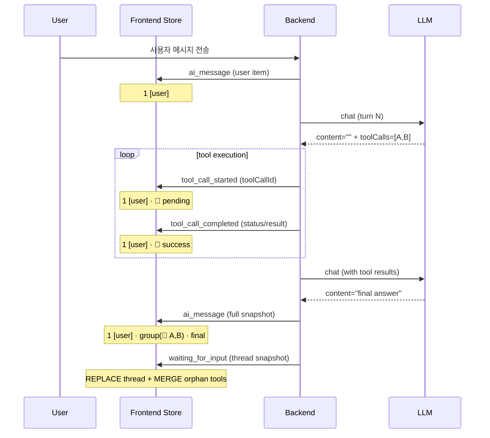

# Spec Draft — Conversation UI Contract (§9 확장)

> **본 draft 의 위상**: PR #214 (`worktree-toolcall-tree-rendering`, 미머지) 가 §9.6 / §9.7 / §9.8 / §9.11 의 핵심 구현을 이미 보유 (consistency-check `plan_coherence` C-3 지적). 본 PR 은 그 구현을 spec 으로 격상하는 **reverse-spec** 성격이며, spec write 단계에서 commit 의 변경 사항이 본 spec 의 계약과 1:1 일치하는지 검증을 의무로 한다. PR #214 머지 후 본 spec 의 §9.11 변환 함수 contract 가 실제 코드와 어긋나면 spec 정정 commit 으로 후속 반영한다.

## 1. 배경

`spec/conventions/conversation-thread.md` §9 (미리보기 UI 렌더 규칙) 은 데이터 모델 + LLM context 정책 + 5 source × 아이콘 매핑만 명세하고 있어, **UI 라이프사이클·렌더 계약** 이 결여돼 있다. 결과로 다음 4건의 회귀가 동일 영역에서 발생:

| PR | 증상 | 누락된 spec 항목 |
| --- | --- | --- |
| #206 | LLM 의 truthy whitespace content 로 빈 버블 발생 | content blank 동치성 |
| #208 | `includeToolTurns: false` thread 적용 시 live tool row wipe | WS 이벤트 → store 변환 계약 |
| #210 | "skip intermediate" 가 환경에 따라 무효 | intermediate assistant 시각 정책 |
| #214 | tool 호출 그룹의 parent-child 표현 미정의 | tool-call 그룹 시각 정책 + 정렬 invariant |

본 draft 는 §9 를 확장해 (§9.6 ~ §9.10) + (§9.11) 신설로 UI 계약을 SoT 화한다.

## 2. 변경 범위

| 절 | 신설/개정 | 내용 요약 |
| --- | --- | --- |
| §9.6 | 신설 | tool-call 그룹 시각 정책 (parent-child tree) |
| §9.7 | 신설 | WS 이벤트 → store 변환 계약 (4 이벤트 × mutation 정책) |
| §9.8 | 신설 | content blank 동치성 — `isAssistantContentBlank` 의 단일 결정 함수 |
| §9.9 | 신설 | UI Invariants (Inv-1 ~ Inv-4) |
| §9.10 | 신설 | 회귀 차단 시나리오 테이블 + 테스트 파일명 링크 |
| §9.11 | 신설 | 변환 함수 contract (messagesToConversationItems / threadTurnsToConversationItems / mergeOrphanToolItems) 등가성 정의 |
| §9 prologue | 개정 | 라이프사이클 다이어그램 (mermaid) 추가 |
| 최상위 §10 (CHANGELOG, 기존) | 개정 | 2026-05-19 항목 추가 |

기존 §9.1 ~ §9.5 의 본문은 보존, 표현만 새 절들과 cross-link. §9.1 의 `ai_assistant` 행에는 §9.6 parent chip 분기 비고, `ai_tool` 행에는 pending status badge 확장 표기를 함께 보강.

## 3. Draft 본문 (§9 확장)

### §9 prologue 추가 — 라이프사이클 다이어그램

한 multi-turn AI Agent turn 의 timeline phase 전환:



### §9.6 — tool-call 그룹 시각 정책 (신설)

LLM 호출 1회 = 1 `ai_assistant` turn. 다음 조건을 모두 만족하면 **tool-call group parent** 로 분류:

1. `source === 'ai_assistant'` (wire) 또는 store `type === 'assistant'`
2. `turn.toolCalls?.length >= 1` (wire) 또는 `item.assistantToolCalls?.length >= 1` (store)
3. `isAssistantContentBlank(text|content)` (§9.8 정의)

같은 turn 의 후행 `ai_tool` turn 들 (또는 store 의 `type: "tool"` 항목들) 중 아직 다른 parent 에 claim 되지 않은 것들을 `toolCalls.length` (= store `assistantToolCalls.length`) 개까지 **children** 으로 흡수. parent 가 enumerate 한 child 수만큼 후행 unclaimed tool 을 sequence-claim — `assistantToolCalls` 의 `id` 는 forward-compat 으로 drop 되어 sequence-count 매칭이 SoT.

UI 형식:

| 영역 | 시각 |
| --- | --- |
| parent | 미니 chip 헤더: `🤖 AI · 🔧 N개 도구 호출`. chat bubble (둥근 배경, 좌·우 정렬) **아님** — inline-flex chip |
| children container | 좌측 vertical line (`border-l-2`) + `ml-3 pl-3` indent |
| 각 child | §9.1 의 `ai_tool` 라인 형식 그대로 (🔧 + name + status badge + result preview) |

content 가 blank 가 아닌 assistant (LLM 의 thinking text 등) 는 parent 로 분류하지 않고 §9.1 의 표준 `ai_assistant` chat bubble 로 렌더 + ToolCallBadge 를 본문 아래 노출.

자식 row 도 클릭 가능 — `onSelectMessage(childIndex)` 가 그대로 호출돼 SelectedItemDetail 의 ToolDetail 로 진입.

### §9.7 — WS 이벤트 → store 변환 계약 (신설)

`useExecutionStore.conversationMessages` 의 mutation 정책. 모든 이벤트는 spec/5-system/6-websocket-protocol.md §4.4 의 의미를 따른다. 표의 이벤트명은 `execution.` prefix 를 생략한 형태 (정식명 `execution.tool_call_started` 등).

| WS 이벤트 | store mutation | 책임 |
| --- | --- | --- |
| `tool_call_started` | UPSERT by `toolCallId` (status=pending) | live 표시 시작 |
| `tool_call_completed` | UPDATE by `toolCallId` (status/result/durationMs/error) | live 상태 전이 |
| `ai_message` | REPLACE with `messagesToConversationItems(payload.messages, …)` — 단, `toolStatus`/`durationMs`/`error` 는 prev 의 동일 `toolCallId` 항목에서 carry-over | snapshot 정합 |
| `waiting_for_input` (interactionType=ai_conversation) | REPLACE with `threadTurnsToConversationItems(payload.conversationThread.turns)` + **MERGE orphan tools / intermediate assistants** (§9.11 참고). `lastAppliedThreadSeqRef` 로 동일 `nextSeq` 재emit skip | lean thread 보존 |
| `waiting_for_input` (interactionType=form / buttons) | `conversationThread` 가 동봉된 경우에만 위 ai_conversation 행과 동일 정책 (live tool row 보존 의무 동일) | Form/Buttons 노드 |

REPLACE 는 unconditional 배열 교체가 아니라 **carry-over policy 가 명시된 교체**다 — Inv-1, Inv-4 를 깨지 않도록 prev 의 일부 상태를 보존한다.

**Carry-over 필드의 스키마 귀속**: `toolStatus`/`durationMs`/`error` 는 store 내부 `ConversationItem` (`codebase/frontend/src/lib/stores/execution-store.ts`) 의 runtime 필드이며, ConversationTurn §1.2 wire 스키마 확장이 아니다.

본 계약은 spec/3-workflow-editor/3-execution.md §10.8 "권위적 재구성" 의 conversation UI 레이어 명문화이며, carry-over 항목은 live WS 이벤트 선행 도착 정보를 snapshot 빈 상태가 덮어쓰지 않기 위한 정책이다.

### §9.8 — content blank 동치성 (신설)

`isAssistantContentBlank(content: unknown): boolean` 의 **단일 결정 함수** 정의:

```ts
function isAssistantContentBlank(content: unknown): boolean {
  return typeof content !== "string" || content.trim() === "";
}
```

**구현 위치 의무**: `codebase/frontend/src/lib/conversation/conversation-utils.ts` 에서 export. UI 컴포넌트 (`conversation-inspector.tsx`) 와 변환 함수 (`messagesToConversationItems` / `threadTurnsToConversationItems` / `mergeOrphanToolItems`) 가 동일 함수를 import 해 사용 — 다중 정의 금지.

다음 4가지를 모두 동치로 처리:

- `null`
- `undefined`
- `""` (빈 문자열)
- `" "`, `"\n"`, `"   \t\n"` 등 whitespace-only 문자열

**입력 출처**: `ConversationTurn.text` (§1.2). Anthropic 의 별도 `extended_thinking` content block 은 `turn.text` 로 합쳐지지 않으므로 본 판정 입력에 영향 없음 (extended_thinking 처리는 별 spec 항목).

이 판정의 **사용처 (3곳)**:

1. **그룹 분류** (§9.6): `ai_assistant` 가 parent 인지 결정
2. **헤더 라벨** (SelectedItemDetail): `hasToolCalls && isAssistantContentBlank(content)` → "Tool Call — Turn N", else "AI Response — Turn N"
3. **placeholder** (timeline bubble): content 와 toolCalls 모두 없을 때만 `(empty)` 노출

LLM provider 가 어떤 형태로 content 를 emit 하든 (Anthropic `null`, OpenAI `null`, Google `null`, 혹은 whitespace text block) UI 동작이 **동일** 해야 한다.

### §9.9 — UI Invariants (신설)

다음 4가지 불변량은 §9 변경 / 구현 변경 시 반드시 유지돼야 한다. `Inv-N` 레이블은 본 §9.9 스코프 한정.

| ID | Invariant |
| --- | --- |
| Inv-1 | tool row 의 시각 (🔧 + name + status badge + result preview) 은 라이프사이클 phase (pending / success / error) 와 무관하게 같은 layout 을 유지. status 만 변한다. |
| Inv-2 | timeline 항목 수는 *그룹 단위* 로만 줄어든다 — parent-child 묶임은 허용. 한 번 표시된 tool row 가 부모 그룹 합쳐짐 외의 이유로 사라지지 않는다. |
| Inv-3 | SummaryView 와 SelectedItemDetail 의 "Tool Call" vs "AI Response" 라벨 판정은 동일한 `isAssistantContentBlank` (§9.8) 에서 도출. |
| Inv-4 | live tool row 는 thread snapshot 이 lean (`includeToolTurns: false`) 이어도 store 에 보존돼야 한다. (§9.7 의 MERGE orphan tools 책임) |

### §9.10 — 회귀 차단 시나리오 (신설)

§9 본 절을 변경하거나 conversation timeline 관련 코드 (`conversation-inspector.tsx`, `conversation-utils.ts`, `use-execution-events.ts`) 를 수정하는 PR 은 다음 시나리오의 **단위 테스트 통과를 의무**로 한다. 사용자 시각 확인에 의존하지 않는다. `CT-S*` ID 는 본 §9.10 스코프 한정. 테스트 파일은 구현 단계에서 최종 경로 확정 — 본 표는 파일명 수준으로만 명시.

| ID | 시나리오 | 검증 | 1차 테스트 파일 |
| --- | --- | --- | --- |
| CT-S1 | LLM 이 whitespace content + tool_use 동시 emit (Anthropic 의 빈 text block) | content blank 동치, parent 그룹으로 분류 | `conversation-utils.test.ts` |
| CT-S2 | `includeToolTurns: false` + 1 tool 호출 | thread lean snapshot 적용 후에도 🔧 tool row 보존 | `use-execution-events.test.ts` |
| CT-S3 | `includeToolTurns: false` + 한 turn 안 2 LLM call × N tools | 각 parent 가 자기 tools 만 흡수, 중복 그룹 없음 | `conversation-inspector.test.tsx` |
| CT-S4 | `includeToolTurns: true` | thread 가 이미 enumerate 한 tool/intermediate 가 중복 추가되지 않음 (`mergeOrphanToolItems` no-op) | `conversation-utils.test.ts` |
| CT-S5 | LLM 이 thinking text + tool_use 동시 emit | parent 그룹 아님 — 본문 + ToolCallBadge 동시 노출 | `conversation-inspector.test.tsx` |
| CT-S6 | multi-turn (turn 1 tool + turn 2 tool) | turn 경계가 parent-child 매칭을 가로지르지 않음 | `conversation-inspector.test.tsx` |
| CT-S7 | `tool_call_completed` 가 `ai_message` 보다 늦게 도착 (out-of-order) | `toolStatus` carry-over 로 success 가 pending 으로 회귀하지 않음 | `use-execution-events.test.ts` |

본 시나리오들의 **입력 fixture** 는 `codebase/frontend/src/components/editor/run-results/__tests__/fixtures/conversation-scenarios.ts` 에 단일 export 로 둔다. 새 시나리오 발견 시 본 표 추가 + fixture 추가 + 해당 테스트 작성을 PR review 의 의무로 한다.

### §9.11 — 변환 함수 contract (신설)

두 변환 함수는 **같은 turn 의 ConversationItem 다중집합으로서 동치** 여야 한다:

```
threadTurnsToConversationItems(turns) ⊆ messagesToConversationItems(messages)
```

- 양변의 차이는 **lean thread 의 `includeToolTurns: false` 케이스에 한정** — thread 는 `ai_tool` + intermediate `ai_assistant` 를 누락할 수 있다. messages 는 항상 full.
- 이 누락은 `mergeOrphanToolItems(threadItems, prev)` (`conversation-utils.ts`) 가 보전한다. prev 는 직전 `ai_message` 가 채워둔 messages-base snapshot.
- 두 함수의 **공통 invariant**: 같은 turn 내 항목들의 부분 순서 (user → intermediate assistants → tools → final assistant) 는 보존된다.

세 변환 path 의 책임:

| 함수 | 입력 | 사용처 |
| --- | --- | --- |
| `messagesToConversationItems(messages, opts)` | `ai_message.messages[]` (full chat history) | `handleAiMessage` (live), `parseHistoryMessages` (history rebuild) |
| `threadTurnsToConversationItems(turns)` | `conversationThread.turns` snapshot | `handleWaitingForInput` (live 1차 source), `parseHistoryMessages` (history view 의 thread 재구성 시) |
| `mergeOrphanToolItems(threadItems, prev)` | (threadItems, store prev) → merged items | `handleWaitingForInput` 내부 — REPLACE 직전 |

본 표는 §9.5 의 `stripInlineMarkers` 적용 진입점 목록과 동일 상호참조 관계를 유지한다 — §9.5 의 목록에도 `mergeOrphanToolItems` 가 함께 등재돼야 한다 (spec write 시 §9.5 보강).

신규 변환 path 도입 시 본 contract 표 갱신 + §9.11 의 등가성 정의 만족 여부 검토 의무.

### §10 CHANGELOG 추가 항목

| 2026-05-19 | §9 확장 — §9.6 (tool-call 그룹 시각 정책), §9.7 (WS 이벤트 → store 변환 계약), §9.8 (content blank 동치성), §9.9 (UI Invariants), §9.10 (회귀 차단 시나리오), §9.11 (변환 함수 contract) 신설. §9 prologue 에 라이프사이클 다이어그램 추가. 4건 UI 회귀 (PR #206, #208, #210, #214) 의 spec 결손 보강 |

## 4. 영향 받는 다른 spec

| 파일 | 영향 | 조치 |
| --- | --- | --- |
| `spec/5-system/6-websocket-protocol.md` | §4.4.5 / §4.4.6 가 §9 를 가리키는 cross-ref 만 보유 | 별도 변경 불필요. 새 §9.6~§9.11 자동 적용 |
| `spec/4-nodes/3-ai/1-ai-agent.md` | §57 / §289 등에서 conversation-thread 를 high-level 로 참조 | 변경 불필요 |
| `spec/5-system/4-execution-engine.md` | conversation-thread 의 push API 만 참조 | 변경 불필요 |
| `plan/in-progress/ai-agent-tool-connection-rewrite.md` | tool connection 재작성 — UI 영역과 별개 | 충돌 없음, 본 spec 변경 이후 작업 시 §9.10 의무 적용 |

## 5. 부가 산출물 (본 PR 범위)

§9.10 의 회귀 시나리오 7건을 다음 PR 부터 일관된 시각 검증이 가능하도록 fixture 인프라 1개와 함수 위치 정정 1건을 본 PR 에 포함한다:

| 산출물 | 위치 | 비고 |
| --- | --- | --- |
| Fixture 모음 | `codebase/frontend/src/components/editor/run-results/__tests__/fixtures/conversation-scenarios.ts` | CT-S1 ~ CT-S7 의 입력 `ConversationItem[]` 단일 export. spec §9.10 표가 직접 참조. |
| 함수 위치 이전 | `isAssistantContentBlank` 를 `conversation-inspector.tsx` → `conversation-utils.ts` 로 이전 후 export (consistency-check C-2 해소) | 호출처 (`conversation-inspector.tsx`, `mergeOrphanToolItems` 등) 가 단일 source 에서 import |

두 산출물은 codebase/ 영역이므로 spec write 완료 후 `developer` 역할로 전환해 한 worktree·한 PR 안에서 작성한다.

## 6. 일관성 검토 결과

`/consistency-check --spec` 1차 실행 결과 (`review/consistency/2026/05/19/13_51_26/SUMMARY.md`): **BLOCK: YES** — Critical 3건 + Warning 5건 + Info 16건.

**Critical 해소** (본 draft 의 현 버전에 반영 완료):

| ID | 해소 |
| --- | --- |
| C-1 (절번호) | `§9.A` → `§9.11` 로 변경. §2 표의 "§10 CHANGELOG" 표기를 "최상위 §10 (기존)" 으로 분리. |
| C-2 (함수 위치) | §9.8 에 `isAssistantContentBlank` 의 구현 위치를 `conversation-utils.ts` 로 이전 명시 + §5 부가 산출물에 이전 작업 추가. |
| C-3 (구현 선행) | draft 본문 최상단에 reverse-spec 위상 명시 + spec write 시 PR #214 구현과의 1:1 일치 검증 의무. |

**Warning 해소** (W-1: §9.7 에 carry-over Rationale 주석 추가 / W-2: §9.10 경로를 파일명 수준으로 완화 / W-5: §9.11 로 통일) — 모두 반영. W-3 (stale worktree 참조) 와 W-4 (PR #214 머지 후 테스트 중복 표시) 는 후속 정리 항목 (§7) 으로 이관.

**Info 일괄 반영**: I-3 (`parseHistoryMessages` 사용처 추가), I-4 (`turn.toolCalls` vs `assistantToolCalls` 명시), I-5 (carry-over 스키마 귀속), I-14 (§9.5 에 `mergeOrphanToolItems` 등재 의무), I-15 (`Inv-N` 스코프 한정 명시), I-16 (`CT-S*` 도메인 prefix), I-7 (extended_thinking 입력 출처), I-2 (form/buttons interactionType 의 store 영향 행 추가). 나머지 I-1, I-6, I-8 ~ I-13 은 spec write 단계에서 §9.1 / §9.3 / §9 prologue / §7 / §8 보강 시 함께 반영.

재검토 생략 사유: 위 변경은 모두 명료화 (라벨 변경, 행 추가, 주석 보강) 이며 새 충돌 도입 가능성이 없음. spec write 시점에 §9.1 / §9.5 / §8 / §7 보강 부분만 신중히 진행.

## 7. 후속 정리 (별 작업)

| 항목 | 작업 | 상태 |
| --- | --- | --- |
| W-3 | `plan/in-progress/ai-agent-tool-connection-rewrite.md` 의 stale worktree 참조 (`conversation-thread-e509c5`) 갱신/삭제 | ✅ 2026-05-20 — "(해소됨, 2026-05)" 마커로 갱신, worktree 참조 제거 |
| W-4 | PR #214 머지 후 §9.10 표의 CT-S1 ~ CT-S7 중 이미 구현된 케이스 "기존 테스트로 충족" 표시 | ✅ 2026-05-20 — §9.10 에 "구현 상태" 표 추가 (CT-S1 ~ CT-S8 모두 충족, 1차 매핑 명시) |
| (W-1 follow-up) | 본 PR 머지 후 `spec/3-workflow-editor/3-execution.md §10.8` 에 §9.7 cross-ref 보강 | ✅ 2026-05-20 — §10.8 라이프사이클 표 다음에 §9.7 cross-ref paragraph 추가 |

## Rationale

- **§9.6 (tool-call 그룹 시각 정책) 채택 근거**: PR #206 → #208 → #210 → #214 의 회귀는 모두 intermediate assistant + tool row 의 관계가 spec 에 비명시여서 발생. 사용자 제안 ("도구만 호출한 턴은 봇 아이콘 옆에 도구만 호출했다는 UI 추가, 호출 결과를 하위 tree 로") 을 spec 으로 격상. parent-child tree 외 대안 (skip / hide / 둘 다 동등) 은 #210 에서 사용자 환경에 따라 무효임이 확인됨.
- **§9.7 (WS 이벤트 변환 계약) 채택 근거**: REPLACE / UPSERT / MERGE 정책이 코드 안에 분산돼 있어 PR 마다 추측 의사결정. spec 으로 명문화하면 새 이벤트 추가 시 계약 표 갱신만 보면 됨. carry-over 항목 (toolStatus, durationMs, error) 은 PR #208 의 `toolStatusMapFromItems` 가 이미 구현한 정책의 spec 화.
- **§9.8 (content blank 동치성) 채택 근거**: PR #206 의 root cause. LLM provider 마다 빈 content 표현이 다른 점을 spec 으로 흡수하지 않으면 새 provider 추가 시 재발 가능. `isAssistantContentBlank` 라는 명시적 함수명을 spec 에 박아 구현 reference point 화.
- **§9.9 (Invariants) 채택 근거**: spec 의 "절대 깨지 않는 규칙" 분리는 다른 conventions 문서 (예: node-output.md Principle 4.5) 의 패턴 답습. 회귀 차단의 단단한 기준선.
- **§9.10 (회귀 시나리오) 채택 근거**: 회귀 발생 후 fixture 화 하는 패턴을 spec 의 의무로 격상. 사용자 시각 확인이 release gate 가 되는 위험 회피.
- **§9.11 (변환 함수 contract) 채택 근거**: PR #208 의 `mergeOrphanToolItems` 가 사실상 "두 변환 함수의 결과를 등가로 만드는 어댑터" 인데 그 의도가 spec 에 없었음. 새 변환 함수 도입 시 등가성 검토 의무를 명문화.
- **(기각) 시각 회귀 storybook 도입 — 본 PR 에서**: storybook 통합은 별 인프라 의존이라 본 PR 범위 초과. §9.10 의 fixture 인프라만 도입하고 storybook/visual regression 은 v2 로드맵 (§7) 항목으로 다음 PR 에 위임.
- **(기각) tool row 의 "도구 호출 시점에 status indicator 표시" 시각 차별화**: §9.1 의 단일 매핑이 명시적이고 §9.9 Inv-1 로 보장돼 추가 시각 차별화는 불필요.
