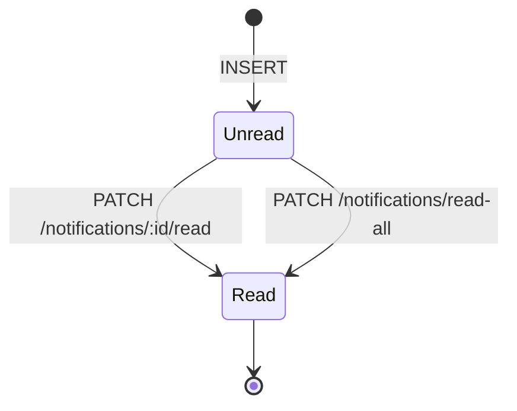
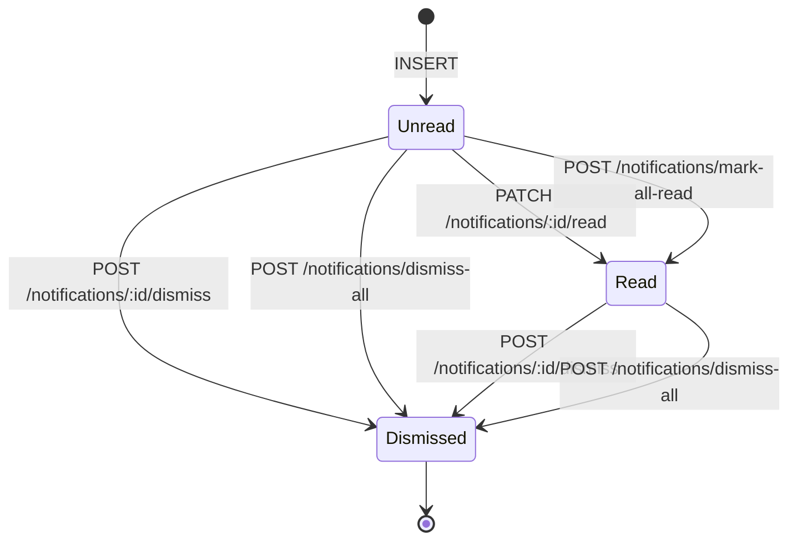

# Spec Draft — 알림 dismiss 도입 (B안 spec 단계)

본 draft 는 `consistency-checker --spec` 사전 검토용. spec/ 본문에 쓰기 전 단계로,
draft 의 모든 변경안이 검토 통과 후 해당 spec 파일들에 반영된다.

## 변경 의도

알림 popover 의 UX 개선안 "B안" 구현을 위해 알림 **soft delete (dismiss)** 상태를 도입한다.
사용자는 알림을 (1) 읽음 처리, (2) 닫기(dismiss) 두 차원으로 다룰 수 있다. 두 차원은 별개:

- 읽음(is_read) — 사용자가 내용을 인지했다.
- 닫기(dismissed_at) — 사용자가 더 이상 목록에 표시되길 원치 않는다 (감사 추적은 보존).

## 수정 대상 spec

1. `spec/data-flow/8-notifications.md` — 주요 변경
2. `spec/1-data-model.md` §2.19 + §3 (인덱스)
3. `spec/2-navigation/_layout.md` §3.1 — 한 줄
4. `spec/2-navigation/4-integration.md` §11.2 — 한 줄 (중복 방지 ↔ dismiss 관계 명시)

WebSocket 프로토콜 (`spec/5-system/6-websocket-protocol.md`) §4.4 알림 이벤트는 이번 phase 에서
**변경하지 않는다**. 같은 사용자의 다른 device 간 read/dismiss 동기화 (`notification.read`,
`notification.dismissed` emit) 는 별도 follow-up 으로 분리. 본 phase 는 단일 device 의 React Query
캐시 invalidate 로 동작이 충분하다.

## HTTP 동사 정책 (consistency-check r1 반영, 2026-05-17)

이전 draft 는 `DELETE /notifications/:id` / `DELETE /notifications` 로 표기했으나, consistency-check
세션 `review/consistency/2026/05/17/15_53_16/SUMMARY.md` 의 CRITICAL C-1/C-2 로 차단됨. 코드베이스
관례에서 `DELETE` 는 hard delete 를 의미하며, soft delete 의미를 `DELETE` 동사에 부여하면 API 소비자
혼동·HTTP DELETE+body 의 일부 클라이언트 미지원·W-48(PATCH 패턴 미결, `plan/in-progress/20260516-full-review/RESOLUTION.md`)
방향과 불일치.

본 draft 는 **POST 액션 endpoint** 로 통일한다 — 기존 `POST /notifications/mark-all-read` 와 대칭:

- `POST /notifications/:id/dismiss` (단건)
- `POST /notifications/dismiss-all` (일괄)

`PATCH /notifications/:id` + body `{ dismissed: true }` 안도 후보였으나, (a) `is_read` 와 `dismissed`
가 의미적으로 별개 액션이라 분리된 endpoint 가 명료, (b) `mark-all-read` 와의 동사 대칭이 유지,
(c) W-48 의 PATCH 패턴 결정이 확정되기 전 더 보수적 (action endpoint 는 PATCH/REST 어느 방향이든
호환) 으로 선택. 본 결정은 변경안 #1-E Rationale 에 inline 으로 기록.

---

## 변경안 #1 — `spec/data-flow/8-notifications.md`

### 1-A. §1 "Source → Sink" 의 sequence diagram (변경 없음)

생성 흐름은 그대로. dismiss 는 별도 §4 (사용자 액션 흐름) 에서 다룬다.

### 1-B. §2.1 Postgres 표 갱신

기존:

```
| Sink (table) | 흐름 | read/write 컬럼 | 인덱스 |
| --- | --- | --- | --- |
| `notification` | 적재 | INSERT `workspace_id, user_id, type, title, message, resource_type?, resource_id?, is_read=false, channel, email_sent_at?` (V001) | `(user_id, is_read, created_at DESC)`, `(workspace_id, created_at DESC)` (V002) |
| `notification` | 읽음 처리 | UPDATE `is_read=true` | — |
| `user` | preferences 읽기 | SELECT `notification_preferences JSONB` (V010) | — |
```

신규 (3개 row 추가, 인덱스 갱신):

```
| Sink (table) | 흐름 | read/write 컬럼 | 인덱스 |
| --- | --- | --- | --- |
| `notification` | 적재 | INSERT `workspace_id, user_id, type, title, message, resource_type?, resource_id?, is_read=false, channel, email_sent_at?, dismissed_at=NULL` (V001 + dismissed_at 컬럼 추가 V0NN) | `(user_id, is_read, created_at DESC) WHERE dismissed_at IS NULL`, `(workspace_id, created_at DESC)` (V002 + partial 전환 V0NN+1) |
| `notification` | 읽음 처리 | UPDATE `is_read=true` | — |
| `notification` | dismiss 처리 (단건) | UPDATE `dismissed_at=now()` WHERE `id=? AND user_id=? AND dismissed_at IS NULL` | — |
| `notification` | dismiss 처리 (일괄) | UPDATE `dismissed_at=now()` WHERE `workspace_id=? AND user_id=? AND dismissed_at IS NULL` | — |
| `notification` | 목록 / 카운트 조회 | SELECT `WHERE dismissed_at IS NULL` (활성 알림만) | partial index 활용 |
| `user` | preferences 읽기 | SELECT `notification_preferences JSONB` (V010) | — |
```

> **마이그레이션 분리 (Flyway `executeInTransaction` 제약 반영)**: 다음 두 파일로 분리한다 —
> (a) 컬럼 추가 (`V0NN__notification_dismissed_at_add.sql`, 기본 transaction OK),
> (b) partial index 전환 (`V0NN+1__notification_active_partial_index.{sql,conf}`,
> `executeInTransaction=false` + `CREATE INDEX CONCURRENTLY ... WHERE dismissed_at IS NULL` +
> 기존 인덱스 `DROP INDEX CONCURRENTLY` 순서).
> **번호 (V0NN)** 는 developer 단계 착수 직전 `ls codebase/backend/migrations/ | sort | tail -1` 로 현행 최신
> 번호를 재확인해 +1, +2 로 채운다. plan checklist 에도 동일 항목 명시.

### 1-C. §3 "상태 전이" mermaid 다이어그램 갱신

기존:



신규 (이력 주석은 본문 inline 이 아닌 Rationale 에 inline):



> spec 본문에는 이력 주석을 두지 않는다. 옛 다이어그램의 `PATCH /notifications/read-all` 표기와
> POST dismiss 동사 채택 경위는 Rationale 에 inline (변경안 #1-E).

### 1-D. 새 절: §4 "Dismiss 흐름" 추가 (기존 §4 "외부 의존" 은 §5 로 번호 이동)

> **앵커 영향**: 기존 §4 "외부 의존" 이 §5 로 이동하므로, 다른 spec 파일에서
> `8-notifications.md#4-외부-의존` 앵커를 참조하는 곳이 있는지 spec 반영 시
> `grep -rn "8-notifications.md#4-외부-의존" spec/` 로 확인 후 일괄 갱신한다.
> (확인 결과: 외부 참조 없음 — 8-notifications.md 자체 외 다른 곳에 §4 앵커 인용 없음. spec
> 반영 시 재확인.)

새 §4 본문:

```
## 4. Dismiss 흐름 (사용자 액션)

알림의 **읽음(`is_read`)** 과 **닫기(`dismissed_at`)** 는 별개 차원으로 운영된다.

### 4.1 차원 분리

| 차원 | 컬럼 | 의미 | 목록 표시 | 미읽음 카운트 |
| --- | --- | --- | --- | --- |
| 읽음 | `is_read` | 사용자가 내용을 인지했음 | 영향 없음 (visible 인 한 표시) | 차감됨 |
| 닫기 | `dismissed_at` | 사용자가 더 이상 표시되길 원치 않음 (NULL=visible, 채워짐=dismissed) | dismissed 면 제외 | dismissed 면 제외 |

조합 가능한 4 상태 (`visible` ≡ `dismissed_at IS NULL`):

- (unread, visible) — 갓 생성된 알림. 목록 표시 O, 카운트 O.
- (read, visible) — 사용자가 읽음만 표시. 목록 표시 O, 카운트 X.
- (unread, dismissed) — 안 읽었지만 닫기. 목록 표시 X, 카운트 X (사용자가 내용을 보지 않고 무시한 경우).
- (read, dismissed) — 읽고 닫음. 목록 표시 X, 카운트 X (가장 흔한 종결 상태).

> "active" 라는 어휘는 `Workflow.is_active`, `Trigger.is_active`, `Schedule.is_active` 등
> 라이프사이클 활성/비활성 의미로 이미 점유되어 있으므로, 본 spec 에서는 dismiss 차원의 활성
> 상태를 `visible` 로 일관 표기한다.

### 4.2 Endpoint

| Endpoint | 동작 | 권한 |
| --- | --- | --- |
| `POST /notifications/:id/dismiss` | 단건 dismiss — `UPDATE notification SET dismissed_at=now() WHERE id=:id AND user_id=:uid AND dismissed_at IS NULL`. 멱등 — 본인 소유 알림 id 면 이미 dismissed 여도 idempotent 성공으로 처리. | 본인 알림만 (다른 user 의 id 는 404 Not Found) |
| `POST /notifications/dismiss-all` | 일괄 dismiss — `UPDATE notification SET dismissed_at=now() WHERE workspace_id=:ws AND user_id=:uid AND dismissed_at IS NULL`. 응답 `{ data: { affected: number } }`. | 본인 + 현재 워크스페이스 알림만 |

응답 코드 / 본문 (`@nestjs/swagger` 규약, [spec/conventions/swagger.md §5](../conventions/swagger.md#5-응답-dto-규약) 적용):

- 단건: `200 OK` with `ApiOkWrappedResponse({ id: string, dismissedAt: string | null })`. 응답 본문이
  dismiss 시각을 그대로 반환해 클라이언트가 낙관적 업데이트를 정정 없이 반영할 수 있다.
- 일괄: `200 OK` with `ApiOkWrappedResponse({ affected: number })`. 기존 `POST /notifications/mark-all-read`
  의 `MarkAllReadResultDto` 와 동일 패턴.

DTO 위치 (developer 단계 구현):

- `codebase/backend/src/modules/notifications/dto/responses/dismiss-result.dto.ts` (`DismissResultDto`).
- `codebase/backend/src/modules/notifications/dto/responses/dismiss-all-result.dto.ts` (`DismissAllResultDto`)
  — 기존 `MarkAllReadResultDto` 와 동일 shape 이라 `PickType` / 재사용 가능.

### 4.3 목록·카운트에 미치는 영향

`GET /notifications` 와 `GET /notifications/unread-count` 는 **항상** `dismissed_at IS NULL` 필터를
적용한다. 사이드바 벨 배지의 미읽음 카운트도 본 정의를 따르며, dismissed 알림은 카운트되지
않는다 (옛 `is_read=false` 단순 조건 → `is_read=false AND dismissed_at IS NULL`).

dismissed 알림을 보고 싶다는 사용자 요구는 현재 없으므로 별도 query 옵션은 두지 않는다 —
필요해지면 그 시점에 `?includeDismissed=true` 옵션을 추가한다.

### 4.4 중복 방지 (`hasRecentByResource`) 와의 관계

`integration_action_required` 등에서 24h 중복 방지에 사용하는 `hasRecentByResource` 헬퍼는
**dismissed row 도 카운트한다** — 사용자가 닫았다는 사실이 알림 재발사 빈도를 다시 풀어버리면
같은 장애에 대해 사용자가 닫을 때마다 재발사되어 over-noise. 닫음은 표시 차원의 결정일 뿐,
중복 방지의 "최근 발사 여부" 와 별개. 본 동작은 의도된 것이며, 향후 별도 옵션으로 분리하지 않는다.

### 4.5 보존 정책

dismissed 알림 row 는 즉시 삭제되지 않는다. 향후 정책으로 (a) dismissed 후 N일 경과 row 의
hard delete 배치, (b) 분석용 ETL 의 dismiss 이벤트 집계 를 도입할 수 있다 — 본 phase 의 범위 외.
현재는 row 그대로 누적되며, 정기 청소가 필요한 시점에 별도 plan 으로 추진한다.

### 4.6 WebSocket 동기화 (follow-up)

본 phase 는 같은 device 의 React Query 캐시 invalidate 로 popover 가 즉시 갱신된다. 같은 사용자의
다른 device 간 read/dismiss 동기화 (예: 한 탭에서 dismiss 한 알림이 다른 탭의 popover 에서도
즉시 사라짐) 는 `spec/5-system/6-websocket-protocol.md §4.4` 의 `notification.read`,
`notification.dismissed` 이벤트 신설로 가능. follow-up phase 에서 검토.
```

### 1-E. Rationale 추가

기존 Rationale 섹션 끝에 새 절 두 개 추가:

```
### Hard delete 가 아닌 soft delete — `dismissed_at` 컬럼 (2026-05-17)

알림 popover 에 "닫기 (✕)" 액션을 도입하면서 hard delete 대신 `dismissed_at TIMESTAMPTZ NULL`
컬럼으로 soft delete 를 채택했다.

근거:

1. **감사 추적 보존** — 어떤 알림이 사용자에게 도달했고, 사용자가 어떻게 처리했는지의 기록은
   장애 사후 조사 (`integration_action_required` 에서 사용자가 실제로 인지·조치했는지, 또는
   닫고 무시했는지) 에 가치가 있다.
2. **분석 데이터** — 알림 type 별 read-rate / dismiss-rate 가 향후 알림 정책 (어떤 type 을
   email 채널로 승격할지, 어떤 type 의 임계를 조정할지) 결정 근거가 된다.
3. **"되살리기" 여지** — 사용자가 실수로 닫은 알림을 복구할 옵션을 (현재는 도입하지 않지만)
   향후 추가할 가능성이 있다. hard delete 면 불가.
4. **중복 방지 무결성** — `hasRecentByResource` 가 dismissed row 도 카운트해야 over-noise 를
   막을 수 있다 (§4.4). hard delete 시 사용자가 닫는 행위로 24h 가드가 풀려 같은 장애 알림이
   반복 발사될 위험이 있다.

기각된 대안:

- Hard delete (`DELETE FROM notification WHERE id=?`) — 근거 1·2·3·4 모두 손실.
- `is_deleted BOOLEAN` 컬럼 — `dismissed_at` 이 시각을 동시에 보존하므로 정보량 우위.
  보존·분석 정책 (`dismissed_at` 후 N일 경과 청소) 도 시각 컬럼이 자연스럽다.
- 별도 `notification_dismissals` 테이블 — 일관성 (`is_read` 와 같은 row 안의 단일 transaction
  update) 우위가 사라지고 JOIN 비용 발생. dismiss 가 row 당 0~1 회 일어나는 1:1 관계라
  별도 테이블 가치 없음.

`(user_id, is_read, created_at DESC)` 인덱스는 **partial index** (`WHERE dismissed_at IS NULL`)
로 갱신해 목록·미읽음 카운트 쿼리에 그대로 사용된다. 활성 알림이 dismissed 알림보다 일반적으로
훨씬 적으므로 partial 인덱스 크기가 작아 부수 이점도 있다. partial 전환은 `executeInTransaction=false`
로 `CREATE INDEX CONCURRENTLY ... WHERE dismissed_at IS NULL` 후 옛 인덱스 `DROP CONCURRENTLY`
순서로 적용한다 (Flyway 규칙, [`spec/0-overview.md §2.8`](../0-overview.md) 또는 현행 migrations
관례 준수).

### Dismiss endpoint 의 HTTP 동사 — `POST /:id/dismiss` 채택 (2026-05-17)

`DELETE /notifications/:id` / `DELETE /notifications` 도 후보였으나, 다음 이유로 `POST` 액션
endpoint 패턴을 채택했다 — 기존 `POST /notifications/mark-all-read` 와 대칭이다.

근거:

1. **코드베이스 관례 — `DELETE` = hard delete**. 코드 베이스 전반의 `DELETE` 가 hard delete
   를 의미하므로 soft delete 의 `dismissed_at` 갱신에 같은 동사를 쓰면 API 소비자가 "알림이
   사라졌다 = row 가 사라졌다" 로 오해할 위험이 있다.
2. **HTTP DELETE + response body 호환성** — 일부 HTTP 클라이언트·API 게이트웨이가 `DELETE`
   메서드의 응답 본문을 무시·제거한다. dismiss 는 응답에 `dismissedAt` 또는 `affected` 를
   포함해야 클라이언트가 낙관적 업데이트를 정정 없이 반영할 수 있다.
3. **W-48 정합성** — `plan/in-progress/20260516-full-review/RESOLUTION.md` 의 W-48 ("API 계약
   변경 — PATCH 패턴 미결") 이 algn 미결 상태에서 `DELETE` 동사를 새 endpoint 에 도입하면
   알림 모듈의 동사 정책이 다른 모듈의 향후 결정과 어긋날 위험. POST 액션 endpoint 는 PATCH/REST
   어느 방향으로 정책이 결정되든 호환 — 보수적 선택.
4. **`mark-all-read` 와의 동사 대칭** — 이미 일괄 읽음 처리가 `POST /notifications/mark-all-read`
   액션 endpoint 이므로, 일괄 dismiss 도 `POST /notifications/dismiss-all` 로 통일하면
   클라이언트 SDK 가 두 액션을 동일 패턴으로 호출한다.

기각된 대안:

- `DELETE /notifications/:id` / `DELETE /notifications` — 위 1·2·3·4 위배.
- `PATCH /notifications/:id` + body `{ dismissed: true }` — 읽음 처리(`PATCH /:id/read`)와 차원이
  다른 액션을 한 endpoint 에 묶으면 의도 분기가 흐려진다. body 의 부분 갱신 의미와 액션 의미의
  혼선도 발생.

### 옛 spec 의 `PATCH /notifications/read-all` 표기 정정 (2026-05-17)

옛 §3 다이어그램은 일괄 읽음 처리를 `PATCH /notifications/read-all` 로 표기했으나, 실제 구현은
`POST /notifications/mark-all-read` (현 `NotificationsController.markAllRead` `@Post('mark-all-read')`)
이다. spec 과 구현이 어긋난 오기였으며, 본 개정으로 정정한다. 어떤 다른 spec 파일도 `read-all`
경로를 참조하지 않음을 확인 (`grep -rn "notifications/read-all" spec/` 단일 hit — 본 §3 다이어그램).
```

---

## 변경안 #2 — `spec/1-data-model.md` §2.19 + §3

### 2-A. §2.19 Notification 필드 표

기존 row 들 사이에 한 row 추가 (`email_sent_at` 다음, `created_at` 앞):

```
| dismissed_at | Timestamp? | 사용자가 닫은 시각 (NULL=visible, 채워짐=dismissed). 목록·미읽음 카운트에서 제외 — 자세한 dismiss 흐름·근거는 [data-flow/8-notifications.md §4](./data-flow/8-notifications.md#4-dismiss-흐름-사용자-액션) 참조 |
```

### 2-B. §3 인덱스 전략 표

기존:

```
| Notification | (user_id, is_read, created_at DESC) | 사용자별 미읽은 알림 조회 |
```

신규 (인덱스 정의 갱신 — partial 추가):

```
| Notification | (user_id, is_read, created_at DESC) WHERE dismissed_at IS NULL | 사용자별 visible 미읽음 알림 조회. partial 로 dismissed row 를 인덱스에서 배제해 크기를 작게 유지 |
```

---

## 변경안 #3 — `spec/2-navigation/_layout.md` §3.1

기존 라인 95:

```
- 알림 벨 아이콘 (미읽은 알림 수 뱃지 표시, 사용자 영역 옆 또는 사이드바 하단)
```

신규 (자식 bullet 으로 동작 설명 추가, 카운트 정의 dismiss 제외 명시):

```
- 알림 벨 아이콘 (visible 미읽은 알림 수 뱃지 표시 — `is_read=false AND dismissed_at IS NULL`, 사용자 영역 옆 또는 사이드바 하단)
  - 팝오버를 열면 알림 목록이 표시되며, 각 항목 hover 시 우측에 ✓(개별 읽음) / ✕(개별 닫기) 액션이 노출된다. 항목 본문 클릭 시 자동 읽음 처리 + `resource_type`/`resource_id` 기반 deep link 이동.
  - 팝오버 헤더 우측 메뉴에 "모두 읽음 처리" 와 "모두 지우기" 일괄 액션을 분리해 노출한다. 두 액션은 독립이며 한쪽이 다른쪽을 함의하지 않는다.
  - 자세한 read/dismiss 라이프사이클은 [data-flow/8-notifications.md §3-§4](../data-flow/8-notifications.md#3-상태-전이) 참조.
```

---

## 변경안 #4 — `spec/2-navigation/4-integration.md` §11.2

§11.2 (라인 848 부근) 의 `integration_action_required` 의 24h 중복 방지 설명 부근에 마지막 단락
한 줄 추가:

```
> 24h 중복 방지(`hasRecentByResource`) 는 row 존재 여부로 판단하며, 사용자가 알림을 닫아 `dismissed_at` 이 채워진 row 도 카운트에 포함된다 ([data-flow/8-notifications.md §4.4](../data-flow/8-notifications.md#44-중복-방지-hasrecentbyresource-와의-관계)). 닫기는 표시 차원의 결정일 뿐 알림 재발사 빈도와 무관하다.
```

---

## 영향 점검 (side-effect)

| 영역 | 영향 | 조치 |
| --- | --- | --- |
| `codebase/backend/src/modules/notifications/notifications.controller.ts` | endpoint 2 개 신규 (`POST /:id/dismiss`, `POST /dismiss-all`) | developer phase |
| `codebase/backend/src/modules/notifications/notifications.service.ts:findAll` | `dismissed_at IS NULL` 필터 추가 | developer |
| `codebase/backend/src/modules/notifications/notifications.service.ts:getUnreadCount` | 동일 필터 | developer |
| `codebase/backend/src/modules/notifications/notifications.service.ts:hasRecentByResource` | **변경 없음** — dismissed row 카운트 유지 (§4.4) | developer |
| `codebase/backend/migrations/V0NN__notification_dismissed_at_add.sql` | `ALTER TABLE notification ADD COLUMN dismissed_at TIMESTAMPTZ NULL` | developer (착수 직전 번호 재확인) |
| `codebase/backend/migrations/V0NN+1__notification_active_partial_index.{sql,conf}` | partial index 전환, `executeInTransaction=false` + CONCURRENTLY | developer |
| `codebase/frontend/src/components/layout/sidebar.tsx` | popover UX 전반 개편 (mutation·deep link·hover 액션) | developer |
| WebSocket multi-device 동기화 | follow-up | 본 phase 외 |
| `plan/in-progress/full-review/RESOLUTION.md` W-48 | 본 dismiss spec 의 POST 채택은 W-48 의 향후 PATCH 결정과 호환 — 충돌 없음 | — |
| `plan/in-progress/spec-overview-ui-patterns-followup-2026-05-16.md` (worktree TBD) | `_layout.md` 동시 수정 가능성 있으나 아직 worktree 미생성 — 본 작업이 먼저 진행되고 그쪽이 rebase 흡수 | 진행 가능 |
| `plan/in-progress/spec-update-cafe24-test-connection.md` (prod-rereview-fix-a7c93f §11 재구성) | 해당 worktree 가 활성 목록에 없음 → 머지 완료 추정. 본 §11.2 한 줄 추가는 충돌 영향 없음 | 진행 가능 |
| `full-review-fixes-a1b2c3` 워트리 | `spec/1-data-model.md` 의 Integration 엔티티 (§2.10) 만 수정 — 본 변경의 Notification (§2.19) / §3 인덱스 영역과 겹치지 않음 | 진행 가능 |

---

## 의사결정 요약 (consistency-checker 참고용)

- **soft delete via `dismissed_at`** — 채택. 근거: 감사 추적·분석·되살리기 여지·중복 방지 무결성.
- **읽음 ↔ 닫기 차원 분리** — 채택. 둘 다 종결 상태로 가는 별개 경로.
- **HTTP 동사: POST 액션 endpoint** — 채택 (DELETE 동사 차단 후 변경). 근거는 변경안 #1-E Rationale.
- **24h 중복 방지에 dismissed row 포함** — 채택. over-noise 방지.
- **단건 dismiss 의 멱등성** — 채택. 다중 클릭 / race / 옛 view 에서의 ✕ 클릭을 안전하게 처리.
- **`active` 어휘 회피** — 채택. spec 표기는 `visible` / `dismissed` 로 통일.
- **이력 주석은 spec 본문이 아닌 Rationale 에** — 채택. spec 본문은 latest 상태만.
- **WebSocket emit 확장** — 본 phase 미포함. follow-up. spec §4.6 에 명시.
- **dismissed row 정기 청소** — 본 phase 미포함. 누적이 운영 부담될 때 별도 plan.

---

## 작업 절차

1. `consistency-checker --spec` 재호출 (이 draft 경로 전달, r2).
2. Critical 0 건이면 위 4 개 spec 파일에 본문 반영.
3. draft 파일은 spec 반영 후 `plan/in-progress/` 에 유지 (B안 전체가 끝나야 `plan/complete/` 이동).
4. spec commit message: `docs(spec): notifications — dismissed 상태 전이 + POST dismiss endpoint (B안 spec 단계)`.
