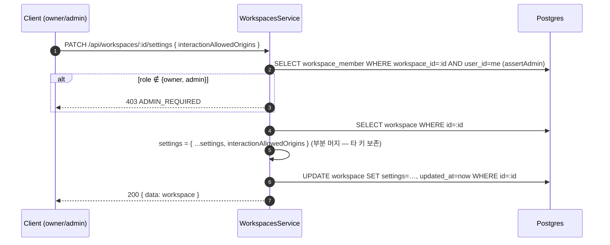

# Spec draft — 워크스페이스 설정 변경 API/UI (`interactionAllowedOrigins`)

`Workspace.settings.interactionAllowedOrigins`(임베드/CORS allowlist)는 backend 가 읽기만 하고 **편집 표면이
없었다**(설정 UI·API 부재). RBAC([9-user-profile §4.2](../../spec/2-navigation/9-user-profile.md), [1-auth §3.2](../../spec/5-system/1-auth.md))엔
이미 "워크스페이스 설정: Owner✅ Admin✅" 가 명세돼 있으나 이를 실현하는 엔드포인트/화면이 미구현. 본 작업은 그 표면을 채운다.

## 결정 (사용자 confirm 2026-06-03)
- 범위: **`interactionAllowedOrigins` 만**(timezone 등 타 settings 키 비목표).
- 권한: **owner + admin**(기존 RBAC "워크스페이스 설정 ✅✅❌❌" 와 일치 — 신규 권한 도입 아님).
- API: **전용 `PATCH /api/workspaces/:id/settings`**(부분 머지). 기존 `PATCH /api/workspaces/:id` 는 **rename 전용**
  (`{ name }`, `@IsNotEmpty` min2/max100)이며 settings 부분 갱신과 의미가 달라 분리한다.

## ★ 빈 배열 의미 (Critical 정정 — CORS invariant 유지)
`interactionAllowedOrigins` 는 **built-in 위젯 CDN origin 에 더해 추가로 허용할 origin 목록**이다([4-security §2](../../spec/7-channel-web-chat/4-security.md), `web-chat-cors.ts isExternalOriginAllowed`).
- **빈 배열 = 추가 origin 없음** — `/api/external/*` CORS 는 여전히 **built-in 위젯 origin 만 허용**(EIA §8.5 "미설정 시 차단" invariant 유지). "모든 origin 허용" 아님.
- 별개로 **임베드 soft 검증**(embed-config)은 목록이 비면 `enforce=false`(allow-all, soft)로 동작 — 이는 CORS 와 다른 레이어이며 본 설정 변경이 둘 다에 반영된다.
- 즉 본 API 는 secure-by-default 를 깨지 않는다(빈 값이 외부 origin 개방으로 이어지지 않음).

## Phase: Spec 갱신 (각 파일 정식 반영)

- [ ] **`spec/2-navigation/9-user-profile.md`**
  - §4 워크스페이스 관리 화면: **개요 탭에 "임베드 허용 도메인" 섹션** 추가(origin 목록 추가/삭제+저장). **owner/admin 만 편집**, 그 외 read-only. 탭 구조(개요·멤버·위험영역) 유지 — 신규 탭 아닌 개요 탭 내 섹션.
  - §4.2 역할 권한 매트릭스: "워크스페이스 설정(✅✅❌❌)" 가 본 origins 편집을 포함함을 inline 명시(매트릭스 값 변경 없음).
  - §6.1 API 표: `PATCH /api/workspaces/:id/settings`(Admin+, body `{ interactionAllowedOrigins: string[] }`) 신규 행 + 기존 `PATCH /api/workspaces/:id`(rename 전용 `{ name }`) 행 body 스키마 명시.
- [ ] **`spec/data-flow/12-workspace.md`** — §1.7 워크스페이스 설정 변경 플로우 신설(아래 다이어그램).
- [ ] **`spec/1-data-model.md §2.2`** — `interactionAllowedOrigins` 키에 "편집 경로: `PATCH /api/workspaces/:id/settings` ([9-user-profile §6.1])" cross-ref.
- [ ] **`spec/7-channel-web-chat/4-security.md §2·§3`** + **`spec/5-system/14 §8.5`** — "워크스페이스 설정/사용자가 명시 설정 필요" 문구에 실제 config 표면(`/workspace/settings` 개요 탭 + `PATCH /:id/settings`) cross-ref.
- [ ] **`spec/5-system/3-error-handling.md §1.2`** — 기존 `assertAdmin()` 이 이미 발행하나 카탈로그 미등재인 `ADMIN_REQUIRED`(403) 정식 등재.

## data-flow/12-workspace.md §1.7 — 워크스페이스 설정 변경

- **검증**: 각 항목 `http(s)://host[:port]`(scheme 필수, path/query/fragment 불가). 후행 슬래시 정규화. 빈 배열 허용(= 추가 origin 없음, 위 ★). 배열·문자열 길이 상한.
- **응답 래핑**: 전역 `TransformInterceptor` 규약대로 `{ data: workspace }`([2-api-convention §5.1](../../spec/5-system/2-api-convention.md)).
- **반영 지연**: `/api/external/*` CORS 는 CORS resolver 캐시 TTL(짧음, [4-security §2](../../spec/7-channel-web-chat/4-security.md)); 임베드 soft 검증은 embed-config `Cache-Control: max-age=300`(최대 5분).

## UI — 개요 탭 "임베드 허용 도메인" 섹션
- origin 목록 표시 + 추가/삭제 + [저장]. 편집은 `useHasRole("admin")` 게이트(ROLE_LEVEL 상 **owner 포함** — owner≥admin). 비권한자는 read-only 표시.
- 클라이언트 검증(형식·중복) → `PATCH /:id/settings`. 성공/실패 toast. 저장 후 5분 내 반영 안내.

## Phase: 구현 (developer)
- [x] backend DTO `update-workspace-settings.dto.ts` — `interactionAllowedOrigins: string[]`, `@IsArray`/`@ArrayMaxSize(100)` + 각 항목 `@IsString`/`@MaxLength(2048)`/`@Matches(origin-only)`. 서비스에서 후행 슬래시 정규화.
- [x] backend controller `@Patch(':id/settings')`(Admin+) + **`@Get(':id/settings')`(멤버 read — viewer 포함, 에디터 시드용)** — swagger 데코레이터.
- [x] backend service `updateWorkspaceSettings`(assertAdmin→부분 머지→save) + `getWorkspaceSettings`(멤버 check→origins 반환).
- [x] backend unit(service spec, getWorkspaceSettings 3 포함 = **82 pass**) + **e2e** `workspace-rbac.e2e-spec.ts` G(PATCH Admin+ 200/403 + GET 멤버 200/비멤버 403).
- [x] frontend API client `updateSettings` + `getSettings`.
- [x] frontend UI — 개요 탭 `EmbedOriginsCard`(GET 시드→key remount 로 effect-setState 회피) + `EmbedOriginsEditor`(add/remove/검증/저장, `useHasRole("admin")` 게이트). react-query + toast + `parseApiError`.
- [x] frontend i18n KO/EN 14키.
- [ ] user-guide 동반(web-chat.mdx "허용 도메인" → 실제 UI 경로 — `user-guide-writer` 위임).
- [ ] TEST WORKFLOW(lint·unit·build·**e2e** 필수) + REVIEW WORKFLOW(/ai-review).

## Rationale
- 전용 settings 엔드포인트는 **신규 결정**(기존 spec 에 prior art 없음) — 기존 `PATCH /:id`(name 필수, rename) 흡수안은
  name optional 화로 rename 계약을 파괴하므로 기각. settings 부분 머지 의미를 별 엔드포인트로 분리.
- 전용 settings 엔드포인트: 기존 `PATCH /:id` 는 `name` 필수(rename)라 settings 부분 갱신과 의미가 다름. 별도
  엔드포인트가 계약을 분리하고 향후 settings 키 확장에 열려 있다(name optional 파괴 회피).
- 빈 배열 = 추가 origin 없음(제한 없음 아님): EIA §8.5 secure-by-default("미설정 시 차단")와 4-security §2 R1
  (built-in always-allow ∪ 워크스페이스 추가)를 **유지** — 번복 아님. 임베드 soft 검증의 allow-all(enforce=false)은
  별 레이어(soft 캐주얼 오남용 방지)이므로 CORS 보안 경계와 충돌하지 않는다.
- 권한 owner+admin: RBAC "워크스페이스 설정 ✅✅" realize. `useHasRole("admin")` 는 ROLE_LEVEL(owner>admin)상 owner 도 통과.
- 범위 origins 한정: timezone 은 schedule/AI 노드 SoT 얽힘 → side-effect 별도 점검 필요, 본 작업 비목표.
