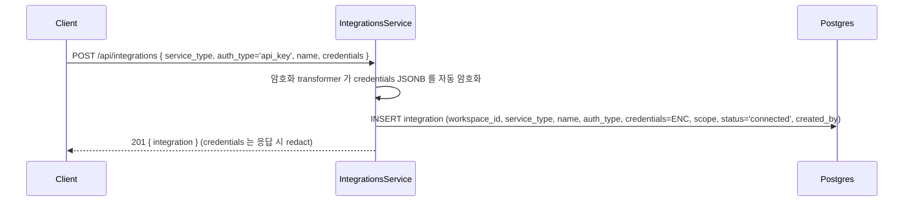
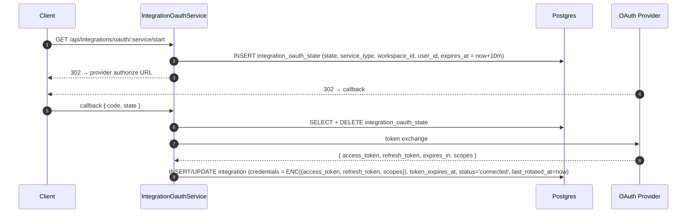
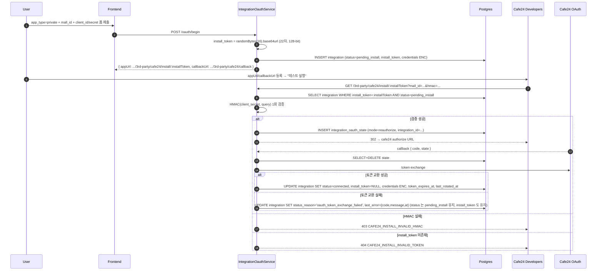
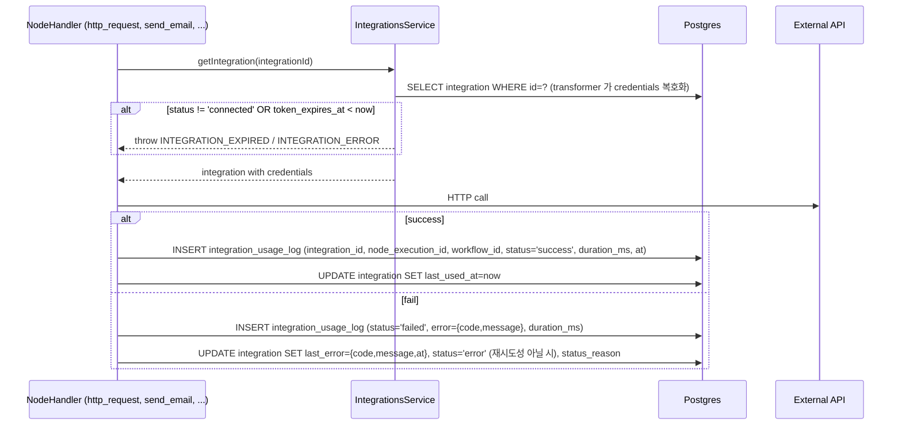
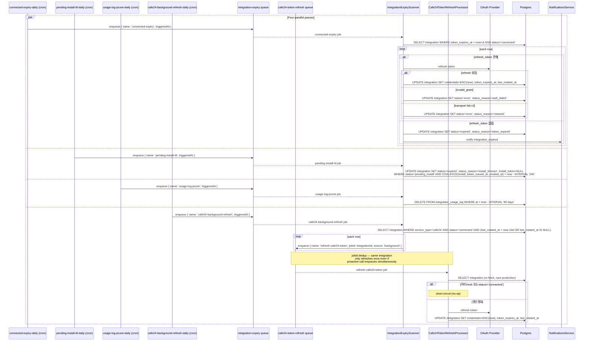
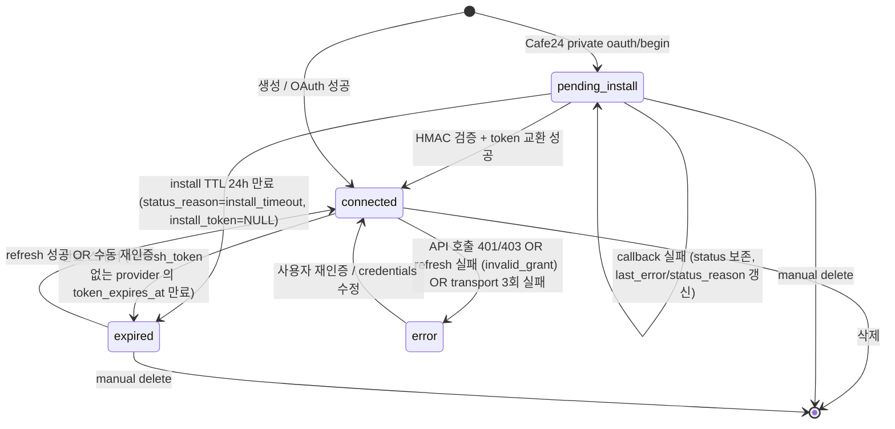

# 동시성(Concurrency) Review Payload

본 파일은 orchestrator 가 동시성(Concurrency) reviewer 용으로 작성한 입력입니다. 다음 코드 변경을 동시성/병렬 처리 관점에서 분석한다.
sub-agent 의 system prompt 에 정의된 호출 규약·등급 기준·출력 형식을 그대로
따르되, 분석 시 아래 "점검 관점" 을 빠짐없이 적용하세요. 결과는 `output_file`
인자에 review.md 로 Write 하고 호출자에게는 STATUS 한 줄만 반환합니다.

> 변경 코드가 본 reviewer 의 영역과 무관하면 "해당 없음" 으로 응답하고
> 위험도를 NONE 으로 설정해 `STATUS=success ISSUES=0` 으로 반환합니다.

## 점검 관점 (동시성(Concurrency))

1. **경쟁 조건(Race Condition)**: 공유 자원 동시 접근으로 인한 경쟁 조건
2. **데드락**: 여러 락 사용 시 데드락 가능성
3. **동기화**: 공유 자원에 대한 적절한 동기화 (mutex/semaphore/lock)
4. **스레드 안전성**: 변수·컬렉션·객체의 스레드 세이프 여부
5. **async/await**: 비동기 코드의 올바른 사용, await 누락
6. **원자성**: 복합 연산의 원자성 보장
7. **이벤트 루프**: 이벤트 루프 블로킹·콜백 지옥·Promise 체인 관리
8. **리소스 풀링**: 스레드 풀·커넥션 풀의 크기·관리

## 리뷰 대상 파일

### 파일 1: review/consistency/2026/05/16/14_28_20/cross_spec/review.md
- 변경 유형: Review
- 언어: md

#### 변경된 코드
```
diff --git a/review/consistency/2026/05/16/14_28_20/cross_spec/review.md b/review/consistency/2026/05/16/14_28_20/cross_spec/review.md
new file mode 100644
index 00000000..b6578861
--- /dev/null
+++ b/review/consistency/2026/05/16/14_28_20/cross_spec/review.md
@@ -0,0 +1,78 @@
+# Cross-Spec 일관성 검토 — `spec/2-navigation/4-integration.md`
+
+검토 모드: `--impl-prep` (구현 착수 전)
+검토 기준: main 브랜치 대비 현재 worktree(`cafe24-mall-dup-ux-a7f2c8`) 의 spec 변경 사항 + 다른 영역 spec 과의 교차 일관성
+
+---
+
+## 발견사항
+
+### 발견사항 1
+- **[CRITICAL]** `Attention` 가상 필터값 삭제 — 프론트엔드 코드·도큐멘테이션과 직접 충돌
+  - target 위치: `spec/2-navigation/4-integration.md` §2.3 상태 칩, §2.4 배너 클릭 동작, §9.1 GET `/api/integrations` status 파라미터, §Rationale ("Attention 가상 필터값" 항 전체 삭제)
+  - 충돌 대상:
+    - `frontend/src/app/(main)/integrations/page.tsx` — `needsAttention` 함수를 import 하고 `attentionCount` 변수로 배너 건수를 계산. 기존 spec 에서 정의한 `Attention` 칩·`?status=attention` 가상 필터값 기반 동작이 코드에 구현되어 있음
+    - `frontend/src/app/(main)/integrations/_shared/status-badge.tsx` — `export function needsAttention(...)` 함수 존재. 삭제된 Attention 개념의 핵심 술어를 export 함
+    - `frontend/src/content/docs/06-integrations-and-config/integration-management.mdx` · `.en.mdx` — "배너를 누르면 해당 상태 필터로 바로 이동" 사용자 가이드 문구가 `?status=attention` 라우팅을 전제로 기술되어 있음
+  - 상세: 이번 worktree 의 target spec 은 `Attention` 단일 칩과 `?status=attention` 가상 필터값을 **완전히 제거**하고, 배너 클릭 동작을 "상태 필터를 `Expiring|Expired|Error` 로 자동 전환" 한 줄로 단순화했다. 그러나 단일 선택 칩 모델에서 세 상태를 동시에 활성화할 UI 표현이 없다는 것이 삭제된 Rationale 에서 이미 분석된 내용이다. 현재 프론트엔드 코드는 삭제된 Attention 개념에 기반하여 구현되어 있어, 이 spec 을 그대로 구현에 반영하면 (a) 배너 클릭 동작이 정의 불가한 상태가 되고, (b) 기존 `needsAttention` 함수·`attentionCount` 변수가 spec 없이 코드에만 남는 유령 로직이 된다.
+  - 제안: 두 방향 중 하나를 선택해야 한다. (A) `Attention` 칩과 `?status=attention` 가상 필터값을 spec 에 복원하고 삭제된 Rationale 도 함께 복원한다. (B) Attention 개념을 실제로 제거하려면 프론트엔드 코드(`page.tsx`, `status-badge.tsx`)와 도큐멘테이션 MDX 파일도 동시에 갱신해야 한다. 현재 worktree 에서 코드 수정 없이 spec 만 삭제한 상태라면 구현 착수 전 방향 결정이 필수.
+
+---
+
+### 발견사항 2
+- **[CRITICAL]** `GET /api/integrations/:id` 응답에서 `appUrl` 필드 제거 — 프론트엔드 코드와 직접 충돌
+  - target 위치: `spec/2-navigation/4-integration.md` §9.1 `GET /api/integrations/:id` 설명 (이전: `appUrl: string | null` 포함 명시 → 현재: "상세 조회 (credentials는 마스킹)" 한 줄)
+  - 충돌 대상:
+    - `frontend/src/app/(main)/integrations/[id]/__tests__/scope-tab.test.tsx` — `appUrl: "https://example.com/api/3rd-party/cafe24/install/abc"` 필드가 mock 데이터에 포함되어 있음 (line 133, 173, 197). 이 테스트는 `GET /api/integrations/:id` 응답에 `appUrl` 필드가 존재함을 전제로 작성됨
+    - `spec/1-data-model.md` §2.10 Integration — `install_token` 필드가 정의되어 있고, `spec/2-navigation/4-integration.md` Rationale "Cafe24 App URL 상세 페이지 표시" 항(main에 존재, worktree에서 삭제됨)이 이 필드를 `appUrl` 응답 필드로 노출하는 설계를 기술했었음
+    - `spec/4-nodes/4-integration/4-cafe24.md` §9 — App URL 관련 흐름이 `install_token` 기반 URL 을 Cafe24 Developers 에서 조회·복사할 수 있어야 함을 전제함
+  - 상세: 이전 spec(main)은 `GET /api/integrations/:id` 응답의 `IntegrationDto` 에 `appUrl: string | null` 필드를 포함하며, Cafe24 Private 통합의 경우 `${APP_URL}/api/3rd-party/cafe24/install/:installToken` 값을 반환하도록 정의했다. Overview 탭에 "App URL 카드"를 두어 사용자가 복사할 수 있도록 하는 것도 해당 spec 에 명시되어 있었다. 이번 worktree spec 이 두 정의를 모두 삭제했으나, 프론트엔드 테스트 코드는 `appUrl` 필드 존재를 전제로 구성되어 있다. 그대로 구현에 들어가면 Cafe24 Private 앱의 App URL 을 상세 페이지에서 조회·복사할 수 없어 사용자 운영 흐름이 단절된다.
+  - 제안: (A) `appUrl` 필드와 Overview 탭 "App URL 카드"를 spec 에 복원한다. (B) 실제로 제거하려면 프론트엔드 테스트 코드(`scope-tab.test.tsx` 등)도 함께 갱신해야 한다. Cafe24 Private 통합의 운영 흐름에서 App URL 접근성이 필요한지도 재검토 필요.
+
+---
+
+### 발견사항 3
+- **[WARNING]** §2.4 배너 `expiring` 포함 조건 단순화 — 잠재적 범위 확대
+  - target 위치: `spec/2-navigation/4-integration.md` §2.4 "Need attention" 배너 조건: `token_expires_at <= now() + 7d`
+  - 충돌 대상: `spec/2-navigation/4-integration.md` §11.4 UI 배지 조건 (동일 worktree 내 동일 파일) — `status IN (expired, error) OR (token_expires_at <= now() + 7d)` 카운트
+  - 상세: 기존 spec(main)은 배너 조건을 `status='connected' AND token_expires_at IS NOT NULL AND token_expires_at > NOW() AND token_expires_at <= NOW() + INTERVAL '7d'` 로 구체화해 `pending_install` 상태의 행과 이미 `expired` 처리된 행이 이중 포함되지 않도록 방어했다. target spec 의 단순화된 `token_expires_at <= now() + 7d` 는 이 방어 조건이 없어 `expired` 상태의 행이 "만료 임박" 로도 집계되는 이중 카운트 가능성이 있다. `spec/5-system/4-execution-engine.md` 는 Integration 상태 전이를 `connected → expired` 로 정의하며, `expired` 상태의 행은 `token_expires_at <= now()` 조건을 이미 만족하므로 `expired ∪ expiring` 이 겹칠 수 있다.
+  - 제안: 배너 조건에 `status NOT IN (expired, error, pending_install)` 가드를 추가하거나, `OR` 구조(`status IN (expired, error)` 별도 + `status='connected' AND token_expires_at IS NOT NULL AND token_expires_at > NOW() AND token_expires_at <= NOW() + INTERVAL '7d'`)로 명시적으로 분리한다. §11.4 UI 배지 조건도 동일하게 갱신.
+
+---
+
+### 발견사항 4
+- **[WARNING]** §9.1 `GET /api/integrations` status 파라미터 — `expiring` 가상 필터값 정의 삭제
+  - target 위치: `spec/2-navigation/4-integration.md` §9.1 `GET /api/integrations` 설명 (이전: `status` 허용값 명시·가상 필터값 변환 규칙 기술 → 현재: 허용값 기술 없음)
+  - 충돌 대상: `spec/2-navigation/4-integration.md` §2.3 상태 칩 — `Expiring (7일 이내)` 칩이 여전히 존재하며, 이 칩이 `?status=expiring` 쿼리를 발행한다는 것이 암시되어 있음. 백엔드가 `expiring` 을 WHERE 절로 변환하는 규칙이 없어지면 `?status=expiring` 이 DB Enum 에 없는 값으로 처리될 수 있음
+  - 상세: 상태 칩 `Expiring` 이 남아 있으면 프론트엔드는 여전히 `?status=expiring` 을 백엔드로 보낸다. 그런데 target spec 은 백엔드가 이 가상 필터값을 합집합 WHERE 절로 변환한다는 규칙을 삭제했다. `expiring` 은 `Integration.status` DB Enum (`connected`/`expired`/`error`/`pending_install`)에 없으므로, 변환 규칙 없이 그대로 WHERE `status='expiring'` 이 되면 0건 반환이 된다.
+  - 제안: `expiring` 가상 필터값 정의를 §9.1 에 복원(`status='connected' AND token_expires_at within 7d` 변환 규칙)하거나, §2.3 칩 목록에서 `Expiring` 을 실제 DB Enum 값이 아닌 가상값임을 명시한다. DB 쿼리 빌더의 변환 규칙이 spec 어딘가에 반드시 기술되어야 한다.
+
+---
+
+### 발견사항 5
+- **[INFO]** `spec/data-flow/5-integration.md` — `appUrl` 참조가 target spec 변경과 동기화 필요
+  - target 위치: `spec/2-navigation/4-integration.md` §9.1 `GET /api/integrations/:id` (appUrl 삭제)
+  - 충돌 대상: `spec/data-flow/5-integration.md` — Cafe24 Private 통합 등록 시퀀스 다이어그램에 `appUrl: .../3rd-party/cafe24/install/:installToken` 참조가 있음 (line 78–79)
+  - 상세: data-flow spec 은 별도 문서이지만 `appUrl` 이 `oauth/begin` 응답에 포함된다는 시퀀스를 기술하고 있다. target spec 이 §9.2 `POST /api/integrations/oauth/begin` 에서는 `appUrl` 을 여전히 응답에 포함시키므로 (`cafe24_private_pending` 응답) data-flow 참조는 실제로는 정합하다. 단, 삭제된 `GET /api/integrations/:id` 의 `appUrl` 필드 관련 data-flow 부분이 있다면 동기화 점검이 권장된다.
+  - 제안: `spec/data-flow/5-integration.md` 를 확인해 삭제된 `GET /api/integrations/:id` → `appUrl` 흐름이 기술된 곳이 있으면 해당 부분도 갱신한다. `POST /api/integrations/oauth/begin` → `appUrl` 흐름은 변경 없으므로 그대로 유지.
+
+---
+
+### 발견사항 6
+- **[INFO]** `spec/4-nodes/4-integration/4-cafe24.md` 참조 표기 — target spec 변경 이후도 일관성 유지 확인 필요
+  - target 위치: `spec/2-navigation/4-integration.md` §4.2 Overview 탭 (App URL 카드 제거)
+  - 충돌 대상: `spec/4-nodes/4-integration/4-cafe24.md` §9 — "통합 상세 페이지에서 현재 App URL 을 확인해 Cafe24 Developers 를 갱신하세요" 형태의 안내가 HMAC 에러 페이지 응답(Rationale "Cafe24 install_token mismatch 회복 흐름" §1057)에 참조되어 있음
+  - 상세: target spec 이 Overview 탭의 App URL 카드를 삭제하면, Cafe24 노드 spec 이 에러 복구 안내("통합 상세 페이지에서 현재 App URL 확인")를 가리키는 UX 경로가 실제 UI 에서 사라진다. 사용자는 에러 페이지의 안내를 따르더라도 해당 카드를 찾을 수 없게 된다.
+  - 제안: App URL 카드 삭제가 확정이라면 `spec/4-nodes/4-integration/4-cafe24.md` Rationale 의 에러 복구 안내 문구("통합 상세 페이지에서 현재 App URL 을 확인")를 대체 접근 경로로 갱신한다. App URL 을 상세 페이지 다른 위치(예: Security 탭)로 이동하는 방안도 고려.
+
+---
+
+## 요약
+
+이번 worktree(`cafe24-mall-dup-ux-a7f2c8`)의 target 문서 `spec/2-navigation/4-integration.md` 는 main 대비 (1) `Attention` 가상 필터 칩·`?status=attention` 쿼리값 삭제, (2) `GET /api/integrations/:id` 응답의 `appUrl` 필드 제거, (3) "Need attention" 배너 로직 단순화, (4) `expiring` 가상 필터값 변환 규칙 삭제 등 여러 UX 기능을 축소·제거하는 방향으로 개정되었다. 그러나 프론트엔드 코드(`page.tsx`, `status-badge.tsx`, `scope-tab.test.tsx`)와 사용자 가이드 MDX 파일은 삭제된 개념을 그대로 참조하고 있으며, 노드 spec(`4-cafe24.md`)의 에러 복구 안내도 삭제된 UI 요소를 가리키고 있다. 두 개의 CRITICAL 발견사항은 spec 변경이 코드·테스트와 정면으로 모순되는 상황으로, 구현 착수 전 spec 복원 또는 코드 동시 갱신 방향 결정이 필수적이다.
+
+---
+
+## 위험도
+
+**HIGH**

```

#### 전체 파일 컨텍스트
```
# Cross-Spec 일관성 검토 — `spec/2-navigation/4-integration.md`

검토 모드: `--impl-prep` (구현 착수 전)
검토 기준: main 브랜치 대비 현재 worktree(`cafe24-mall-dup-ux-a7f2c8`) 의 spec 변경 사항 + 다른 영역 spec 과의 교차 일관성

---

## 발견사항

### 발견사항 1
- **[CRITICAL]** `Attention` 가상 필터값 삭제 — 프론트엔드 코드·도큐멘테이션과 직접 충돌
  - target 위치: `spec/2-navigation/4-integration.md` §2.3 상태 칩, §2.4 배너 클릭 동작, §9.1 GET `/api/integrations` status 파라미터, §Rationale ("Attention 가상 필터값" 항 전체 삭제)
  - 충돌 대상:
    - `frontend/src/app/(main)/integrations/page.tsx` — `needsAttention` 함수를 import 하고 `attentionCount` 변수로 배너 건수를 계산. 기존 spec 에서 정의한 `Attention` 칩·`?status=attention` 가상 필터값 기반 동작이 코드에 구현되어 있음
    - `frontend/src/app/(main)/integrations/_shared/status-badge.tsx` — `export function needsAttention(...)` 함수 존재. 삭제된 Attention 개념의 핵심 술어를 export 함
    - `frontend/src/content/docs/06-integrations-and-config/integration-management.mdx` · `.en.mdx` — "배너를 누르면 해당 상태 필터로 바로 이동" 사용자 가이드 문구가 `?status=attention` 라우팅을 전제로 기술되어 있음
  - 상세: 이번 worktree 의 target spec 은 `Attention` 단일 칩과 `?status=attention` 가상 필터값을 **완전히 제거**하고, 배너 클릭 동작을 "상태 필터를 `Expiring|Expired|Error` 로 자동 전환" 한 줄로 단순화했다. 그러나 단일 선택 칩 모델에서 세 상태를 동시에 활성화할 UI 표현이 없다는 것이 삭제된 Rationale 에서 이미 분석된 내용이다. 현재 프론트엔드 코드는 삭제된 Attention 개념에 기반하여 구현되어 있어, 이 spec 을 그대로 구현에 반영하면 (a) 배너 클릭 동작이 정의 불가한 상태가 되고, (b) 기존 `needsAttention` 함수·`attentionCount` 변수가 spec 없이 코드에만 남는 유령 로직이 된다.
  - 제안: 두 방향 중 하나를 선택해야 한다. (A) `Attention` 칩과 `?status=attention` 가상 필터값을 spec 에 복원하고 삭제된 Rationale 도 함께 복원한다. (B) Attention 개념을 실제로 제거하려면 프론트엔드 코드(`page.tsx`, `status-badge.tsx`)와 도큐멘테이션 MDX 파일도 동시에 갱신해야 한다. 현재 worktree 에서 코드 수정 없이 spec 만 삭제한 상태라면 구현 착수 전 방향 결정이 필수.

---

### 발견사항 2
- **[CRITICAL]** `GET /api/integrations/:id` 응답에서 `appUrl` 필드 제거 — 프론트엔드 코드와 직접 충돌
  - target 위치: `spec/2-navigation/4-integration.md` §9.1 `GET /api/integrations/:id` 설명 (이전: `appUrl: string | null` 포함 명시 → 현재: "상세 조회 (credentials는 마스킹)" 한 줄)
  - 충돌 대상:
    - `frontend/src/app/(main)/integrations/[id]/__tests__/scope-tab.test.tsx` — `appUrl: "https://example.com/api/3rd-party/cafe24/install/abc"` 필드가 mock 데이터에 포함되어 있음 (line 133, 173, 197). 이 테스트는 `GET /api/integrations/:id` 응답에 `appUrl` 필드가 존재함을 전제로 작성됨
    - `spec/1-data-model.md` §2.10 Integration — `install_token` 필드가 정의되어 있고, `spec/2-navigation/4-integration.md` Rationale "Cafe24 App URL 상세 페이지 표시" 항(main에 존재, worktree에서 삭제됨)이 이 필드를 `appUrl` 응답 필드로 노출하는 설계를 기술했었음
    - `spec/4-nodes/4-integration/4-cafe24.md` §9 — App URL 관련 흐름이 `install_token` 기반 URL 을 Cafe24 Developers 에서 조회·복사할 수 있어야 함을 전제함
  - 상세: 이전 spec(main)은 `GET /api/integrations/:id` 응답의 `IntegrationDto` 에 `appUrl: string | null` 필드를 포함하며, Cafe24 Private 통합의 경우 `${APP_URL}/api/3rd-party/cafe24/install/:installToken` 값을 반환하도록 정의했다. Overview 탭에 "App URL 카드"를 두어 사용자가 복사할 수 있도록 하는 것도 해당 spec 에 명시되어 있었다. 이번 worktree spec 이 두 정의를 모두 삭제했으나, 프론트엔드 테스트 코드는 `appUrl` 필드 존재를 전제로 구성되어 있다. 그대로 구현에 들어가면 Cafe24 Private 앱의 App URL 을 상세 페이지에서 조회·복사할 수 없어 사용자 운영 흐름이 단절된다.
  - 제안: (A) `appUrl` 필드와 Overview 탭 "App URL 카드"를 spec 에 복원한다. (B) 실제로 제거하려면 프론트엔드 테스트 코드(`scope-tab.test.tsx` 등)도 함께 갱신해야 한다. Cafe24 Private 통합의 운영 흐름에서 App URL 접근성이 필요한지도 재검토 필요.

---

### 발견사항 3
- **[WARNING]** §2.4 배너 `expiring` 포함 조건 단순화 — 잠재적 범위 확대
  - target 위치: `spec/2-navigation/4-integration.md` §2.4 "Need attention" 배너 조건: `token_expires_at <= now() + 7d`
  - 충돌 대상: `spec/2-navigation/4-integration.md` §11.4 UI 배지 조건 (동일 worktree 내 동일 파일) — `status IN (expired, error) OR (token_expires_at <= now() + 7d)` 카운트
  - 상세: 기존 spec(main)은 배너 조건을 `status='connected' AND token_expires_at IS NOT NULL AND token_expires_at > NOW() AND token_expires_at <= NOW() + INTERVAL '7d'` 로 구체화해 `pending_install` 상태의 행과 이미 `expired` 처리된 행이 이중 포함되지 않도록 방어했다. target spec 의 단순화된 `token_expires_at <= now() + 7d` 는 이 방어 조건이 없어 `expired` 상태의 행이 "만료 임박" 로도 집계되는 이중 카운트 가능성이 있다. `spec/5-system/4-execution-engine.md` 는 Integration 상태 전이를 `connected → expired` 로 정의하며, `expired` 상태의 행은 `token_expires_at <= now()` 조건을 이미 만족하므로 `expired ∪ expiring` 이 겹칠 수 있다.
  - 제안: 배너 조건에 `status NOT IN (expired, error, pending_install)` 가드를 추가하거나, `OR` 구조(`status IN (expired, error)` 별도 + `status='connected' AND token_expires_at IS NOT NULL AND token_expires_at > NOW() AND token_expires_at <= NOW() + INTERVAL '7d'`)로 명시적으로 분리한다. §11.4 UI 배지 조건도 동일하게 갱신.

---

### 발견사항 4
- **[WARNING]** §9.1 `GET /api/integrations` status 파라미터 — `expiring` 가상 필터값 정의 삭제
  - target 위치: `spec/2-navigation/4-integration.md` §9.1 `GET /api/integrations` 설명 (이전: `status` 허용값 명시·가상 필터값 변환 규칙 기술 → 현재: 허용값 기술 없음)
  - 충돌 대상: `spec/2-navigation/4-integration.md` §2.3 상태 칩 — `Expiring (7일 이내)` 칩이 여전히 존재하며, 이 칩이 `?status=expiring` 쿼리를 발행한다는 것이 암시되어 있음. 백엔드가 `expiring` 을 WHERE 절로 변환하는 규칙이 없어지면 `?status=expiring` 이 DB Enum 에 없는 값으로 처리될 수 있음
  - 상세: 상태 칩 `Expiring` 이 남아 있으면 프론트엔드는 여전히 `?status=expiring` 을 백엔드로 보낸다. 그런데 target spec 은 백엔드가 이 가상 필터값을 합집합 WHERE 절로 변환한다는 규칙을 삭제했다. `expiring` 은 `Integration.status` DB Enum (`connected`/`expired`/`error`/`pending_install`)에 없으므로, 변환 규칙 없이 그대로 WHERE `status='expiring'` 이 되면 0건 반환이 된다.
  - 제안: `expiring` 가상 필터값 정의를 §9.1 에 복원(`status='connected' AND token_expires_at within 7d` 변환 규칙)하거나, §2.3 칩 목록에서 `Expiring` 을 실제 DB Enum 값이 아닌 가상값임을 명시한다. DB 쿼리 빌더의 변환 규칙이 spec 어딘가에 반드시 기술되어야 한다.

---

### 발견사항 5
- **[INFO]** `spec/data-flow/5-integration.md` — `appUrl` 참조가 target spec 변경과 동기화 필요
  - target 위치: `spec/2-navigation/4-integration.md` §9.1 `GET /api/integrations/:id` (appUrl 삭제)
  - 충돌 대상: `spec/data-flow/5-integration.md` — Cafe24 Private 통합 등록 시퀀스 다이어그램에 `appUrl: .../3rd-party/cafe24/install/:installToken` 참조가 있음 (line 78–79)
  - 상세: data-flow spec 은 별도 문서이지만 `appUrl` 이 `oauth/begin` 응답에 포함된다는 시퀀스를 기술하고 있다. target spec 이 §9.2 `POST /api/integrations/oauth/begin` 에서는 `appUrl` 을 여전히 응답에 포함시키므로 (`cafe24_private_pending` 응답) data-flow 참조는 실제로는 정합하다. 단, 삭제된 `GET /api/integrations/:id` 의 `appUrl` 필드 관련 data-flow 부분이 있다면 동기화 점검이 권장된다.
  - 제안: `spec/data-flow/5-integration.md` 를 확인해 삭제된 `GET /api/integrations/:id` → `appUrl` 흐름이 기술된 곳이 있으면 해당 부분도 갱신한다. `POST /api/integrations/oauth/begin` → `appUrl` 흐름은 변경 없으므로 그대로 유지.

---

### 발견사항 6
- **[INFO]** `spec/4-nodes/4-integration/4-cafe24.md` 참조 표기 — target spec 변경 이후도 일관성 유지 확인 필요
  - target 위치: `spec/2-navigation/4-integration.md` §4.2 Overview 탭 (App URL 카드 제거)
  - 충돌 대상: `spec/4-nodes/4-integration/4-cafe24.md` §9 — "통합 상세 페이지에서 현재 App URL 을 확인해 Cafe24 Developers 를 갱신하세요" 형태의 안내가 HMAC 에러 페이지 응답(Rationale "Cafe24 install_token mismatch 회복 흐름" §1057)에 참조되어 있음
  - 상세: target spec 이 Overview 탭의 App URL 카드를 삭제하면, Cafe24 노드 spec 이 에러 복구 안내("통합 상세 페이지에서 현재 App URL 확인")를 가리키는 UX 경로가 실제 UI 에서 사라진다. 사용자는 에러 페이지의 안내를 따르더라도 해당 카드를 찾을 수 없게 된다.
  - 제안: App URL 카드 삭제가 확정이라면 `spec/4-nodes/4-integration/4-cafe24.md` Rationale 의 에러 복구 안내 문구("통합 상세 페이지에서 현재 App URL 을 확인")를 대체 접근 경로로 갱신한다. App URL 을 상세 페이지 다른 위치(예: Security 탭)로 이동하는 방안도 고려.

---

## 요약

이번 worktree(`cafe24-mall-dup-ux-a7f2c8`)의 target 문서 `spec/2-navigation/4-integration.md` 는 main 대비 (1) `Attention` 가상 필터 칩·`?status=attention` 쿼리값 삭제, (2) `GET /api/integrations/:id` 응답의 `appUrl` 필드 제거, (3) "Need attention" 배너 로직 단순화, (4) `expiring` 가상 필터값 변환 규칙 삭제 등 여러 UX 기능을 축소·제거하는 방향으로 개정되었다. 그러나 프론트엔드 코드(`page.tsx`, `status-badge.tsx`, `scope-tab.test.tsx`)와 사용자 가이드 MDX 파일은 삭제된 개념을 그대로 참조하고 있으며, 노드 spec(`4-cafe24.md`)의 에러 복구 안내도 삭제된 UI 요소를 가리키고 있다. 두 개의 CRITICAL 발견사항은 spec 변경이 코드·테스트와 정면으로 모순되는 상황으로, 구현 착수 전 spec 복원 또는 코드 동시 갱신 방향 결정이 필수적이다.

---

## 위험도

**HIGH**

```

---

### 파일 2: review/consistency/2026/05/16/14_28_20/meta.json
- 변경 유형: Review
- 언어: json

#### 변경된 코드
```
diff --git a/review/consistency/2026/05/16/14_28_20/meta.json b/review/consistency/2026/05/16/14_28_20/meta.json
new file mode 100644
index 00000000..1c16d0c5
--- /dev/null
+++ b/review/consistency/2026/05/16/14_28_20/meta.json
@@ -0,0 +1,12 @@
+{
+  "timestamp": "2026-05-16T14:28:20.525057",
+  "mode": "구현 착수 전 검토 (--impl-prep, scope=spec/2-navigation/4-integration.md)",
+  "target_path": "spec/2-navigation/4-integration.md",
+  "checkers": [
+    "cross_spec",
+    "rationale_continuity",
+    "convention_compliance",
+    "plan_coherence",
+    "naming_collision"
+  ]
+}
\ No newline at end of file

```

#### 전체 파일 컨텍스트
```
{
  "timestamp": "2026-05-16T14:28:20.525057",
  "mode": "구현 착수 전 검토 (--impl-prep, scope=spec/2-navigation/4-integration.md)",
  "target_path": "spec/2-navigation/4-integration.md",
  "checkers": [
    "cross_spec",
    "rationale_continuity",
    "convention_compliance",
    "plan_coherence",
    "naming_collision"
  ]
}
```

---

### 파일 3: review/consistency/2026/05/16/14_28_20/naming_collision/review.md
- 변경 유형: Review
- 언어: md

#### 변경된 코드
```
diff --git a/review/consistency/2026/05/16/14_28_20/naming_collision/review.md b/review/consistency/2026/05/16/14_28_20/naming_collision/review.md
new file mode 100644
index 00000000..5e6c0c35
--- /dev/null
+++ b/review/consistency/2026/05/16/14_28_20/naming_collision/review.md
@@ -0,0 +1,63 @@
+# 신규 식별자 충돌 검토 — `spec/2-navigation/4-integration.md`
+
+> 검토 모드: `--impl-prep` (구현 착수 전)
+> 검토 범위: `cafe24-mall-dup-ux` plan 이 도입하는 신규 식별자
+
+---
+
+## 검토 전제
+
+target 문서(`spec/2-navigation/4-integration.md`) 는 이 worktree 에서 아직 수정되지 않았다 (prompt 의 "구현 대상 영역: (없음)"). 그러나 `plan/in-progress/cafe24-mall-dup-ux.md` 와 `plan/in-progress/spec-update-cafe24-public-dup-guard.md` 에 명시된 구현 의도가 도입할 식별자들을 대상으로 분석한다. 해당 plan 들이 작성된 현 worktree 가 충돌 검토 범위다.
+
+---
+
+## 발견사항
+
+### 발견 1
+
+- **[WARNING]** `GET /api/integrations/cafe24/precheck` — 기존 `@Get(':id')` 라우트와의 정적/동적 경로 충돌 위험
+
+  - **target 신규 식별자**: `GET /api/integrations/cafe24/precheck` (`spec-update-cafe24-public-dup-guard.md` §9.2 신규 행)
+  - **기존 사용처**: `backend/src/modules/integrations/integrations.controller.ts:209` — `@Get(':id')` (`ParseUUIDPipe` 적용). 현재 정적 경로는 `GET /api/integrations` (목록), `GET /api/integrations/services` 두 가지 뿐이며, 이 두 라우트는 `:id` 보다 먼저 선언되어 있다.
+  - **상세**: NestJS 는 컨트롤러 내 라우트를 선언 순서대로 매칭한다. 새 `GET /api/integrations/cafe24/precheck` 를 `@Get(':id')` 보다 위에 선언하지 않으면 `cafe24` 가 `:id` 파라미터로 소비되어 `ParseUUIDPipe` 에서 400 오류가 발생한다. 또한 path segment 가 2개 (`cafe24/precheck`) 이므로 단순 `@Get('cafe24')` 와도 다르다 — 이 경우 `precheck` 가 `@Get(':id/usages')` 또는 `@Get(':id/activity')` 의 `:id=cafe24`, `segment=precheck` 로 해석될 수도 있다. 즉 `@Get('cafe24/precheck')` 를 `@Get(':id/usages')` 와 `@Get(':id/activity')` 보다 앞에 선언해야만 정적 경로가 올바르게 매칭된다.
+  - **제안**: 컨트롤러에 `@Get('cafe24/precheck')` 핸들러를 `@Get(':id')`, `@Get(':id/usages')`, `@Get(':id/activity')` 보다 앞 위치에 선언한다 (현재 `@Get('services')` 바로 아래가 적합). `ParseUUIDPipe` 는 이 라우트에 적용하지 않는다. 라우트 선언 순서 결정은 구현 착수 시 필수 확인 사항이다.
+
+---
+
+### 발견 2
+
+- **[WARNING]** `CAFE24_PRIVATE_APP_ALREADY_CONNECTED` — Public 흐름에도 동일 에러 코드를 사용하여 이름과 의미가 불일치
+
+  - **target 신규 식별자**: `CAFE24_PRIVATE_APP_ALREADY_CONNECTED` 를 Public (`app_type='public'`) 흐름에도 반환하도록 의미 확장 (`cafe24-mall-dup-ux.md` §Backend (1), `spec-update-cafe24-public-dup-guard.md` §9.2 보강)
+  - **기존 사용처**:
+    - `spec/2-navigation/4-integration.md:684` — "Cafe24 Private 흐름 진입 시" 로 기술. 코드 이름에 `PRIVATE` 이 포함.
+    - `spec/2-navigation/4-integration.md:713` — 에러 코드 설명에 "Private" 을 명시.
+    - `backend/src/modules/integrations/integration-oauth.service.ts:1068` — Private begin 분기에서만 throw.
+    - `backend/src/modules/integrations/integrations.controller.ts:170` — Swagger doc 에 "connected 통합이 이미 존재" 와 함께 "private" 맥락으로 기술.
+  - **상세**: 코드 이름 `CAFE24_PRIVATE_APP_ALREADY_CONNECTED` 에 `PRIVATE` 이 포함되어 있어, Public 흐름에서도 동일 코드를 반환하면 API 클라이언트(프론트엔드, 외부 통합)가 코드 이름만 보고 "Private 전용 오류"로 오인할 수 있다. 현재 프론트엔드에서 이 코드를 기반으로 분기 로직을 작성하면 `PRIVATE` 이름 때문에 Public 경로의 409 처리를 누락할 가능성이 높다. `spec-update-cafe24-public-dup-guard.md` 에서도 기존 코드 이름을 그대로 재사용하는 방향으로 기술되어 있어 혼동이 구체적으로 발생한다.
+  - **제안 (두 가지 중 선택)**:
+    - (a) **코드 이름 일반화**: `CAFE24_PRIVATE_APP_ALREADY_CONNECTED` → `CAFE24_MALL_ALREADY_CONNECTED` 로 rename. `PRIVATE` 한정 의미를 제거하면 Public/Private 양쪽에 자연스럽게 적용 가능하다. backend, spec, Swagger doc, 프론트엔드 toast/banner 메시지 키 모두 함께 변경.
+    - (b) **별도 코드 신설**: `CAFE24_MALL_ALREADY_CONNECTED` (app_type 무관) 를 신설하고, 기존 `CAFE24_PRIVATE_APP_ALREADY_CONNECTED` 는 Private 전용으로 유지. Public begin 가드에는 새 코드 사용. 단, 두 코드가 동일 HTTP 상태(409)와 유사 의미를 갖게 되어 장기적으로 혼란이 가중된다 — 옵션 (a) 가 권장.
+
+---
+
+### 발견 3
+
+- **[INFO]** `findExistingConnectedCafe24Mall` helper — 기존 네이밍 컨벤션과의 일관성 확인 권장
+
+  - **target 신규 식별자**: `findExistingConnectedCafe24Mall(workspaceId, mallId)` (`cafe24-mall-dup-ux.md` §Backend (1) — private/public 공유 helper)
+  - **기존 사용처**: `backend/src/modules/integrations/integration-oauth.service.ts` 의 기존 private method 들 (`_buildCafe24AuthUrl`, `_handleCafe24Callback` 등 추정). 정확한 메서드 명칭은 파일 직접 확인 필요.
+  - **상세**: helper 이름이 `find...Connected` 로 `status='connected'` row만 조회한다는 의미를 내포하는데, `spec-update-cafe24-public-dup-guard.md` 에 따르면 `pending_install` / `expired` / `error` status 도 V045 backstop 이 다루므로 `connected` 만 감지하는 helper 가 전체 중복 방어의 절반만 담당한다. helper 이름에서 범위가 명확히 드러나도록 정합이 필요하다.
+  - **제안**: helper 이름을 `findConnectedCafe24MallIntegration(workspaceId, mallId)` 등 `connected` 상태만 조회한다는 사실을 명확히 드러내도록 유지하되, precheck endpoint 에서는 모든 status 를 반환하기 위해 별도 조회 로직이 필요함을 구현 시 주석으로 명시한다. 또는 `findAnyCafe24MallIntegration(workspaceId, mallId)` 로 범용 helper 를 만들고 caller 가 status 를 필터링하는 방식을 채택한다.
+
+---
+
+## 요약
+
+이번 `cafe24-mall-dup-ux` 구현 착수 전 검토에서 심각한 직접 충돌은 없으나, 두 가지 명명 위험이 발견된다. 첫째, `GET /api/integrations/cafe24/precheck` 는 기존 NestJS 라우터의 동적 경로 `@Get(':id')`, `@Get(':id/usages')`, `@Get(':id/activity')` 와 라우트 우선순위 충돌 위험이 있으며, 핸들러 선언 순서를 잘못 배치하면 런타임에 400 오류나 잘못된 핸들러 호출이 발생한다. 둘째, `CAFE24_PRIVATE_APP_ALREADY_CONNECTED` 를 Public 흐름에 재사용하면 코드 이름의 `PRIVATE` 이 의미를 오도하여 프론트엔드 분기 로직의 결함으로 이어질 수 있다. 에러 코드를 `CAFE24_MALL_ALREADY_CONNECTED` 로 일반화하는 리네이밍이 구현 착수 전에 결정되어야 한다.
+
+---
+
+## 위험도
+
+**MEDIUM**

```

#### 전체 파일 컨텍스트
```
# 신규 식별자 충돌 검토 — `spec/2-navigation/4-integration.md`

> 검토 모드: `--impl-prep` (구현 착수 전)
> 검토 범위: `cafe24-mall-dup-ux` plan 이 도입하는 신규 식별자

---

## 검토 전제

target 문서(`spec/2-navigation/4-integration.md`) 는 이 worktree 에서 아직 수정되지 않았다 (prompt 의 "구현 대상 영역: (없음)"). 그러나 `plan/in-progress/cafe24-mall-dup-ux.md` 와 `plan/in-progress/spec-update-cafe24-public-dup-guard.md` 에 명시된 구현 의도가 도입할 식별자들을 대상으로 분석한다. 해당 plan 들이 작성된 현 worktree 가 충돌 검토 범위다.

---

## 발견사항

### 발견 1

- **[WARNING]** `GET /api/integrations/cafe24/precheck` — 기존 `@Get(':id')` 라우트와의 정적/동적 경로 충돌 위험

  - **target 신규 식별자**: `GET /api/integrations/cafe24/precheck` (`spec-update-cafe24-public-dup-guard.md` §9.2 신규 행)
  - **기존 사용처**: `backend/src/modules/integrations/integrations.controller.ts:209` — `@Get(':id')` (`ParseUUIDPipe` 적용). 현재 정적 경로는 `GET /api/integrations` (목록), `GET /api/integrations/services` 두 가지 뿐이며, 이 두 라우트는 `:id` 보다 먼저 선언되어 있다.
  - **상세**: NestJS 는 컨트롤러 내 라우트를 선언 순서대로 매칭한다. 새 `GET /api/integrations/cafe24/precheck` 를 `@Get(':id')` 보다 위에 선언하지 않으면 `cafe24` 가 `:id` 파라미터로 소비되어 `ParseUUIDPipe` 에서 400 오류가 발생한다. 또한 path segment 가 2개 (`cafe24/precheck`) 이므로 단순 `@Get('cafe24')` 와도 다르다 — 이 경우 `precheck` 가 `@Get(':id/usages')` 또는 `@Get(':id/activity')` 의 `:id=cafe24`, `segment=precheck` 로 해석될 수도 있다. 즉 `@Get('cafe24/precheck')` 를 `@Get(':id/usages')` 와 `@Get(':id/activity')` 보다 앞에 선언해야만 정적 경로가 올바르게 매칭된다.
  - **제안**: 컨트롤러에 `@Get('cafe24/precheck')` 핸들러를 `@Get(':id')`, `@Get(':id/usages')`, `@Get(':id/activity')` 보다 앞 위치에 선언한다 (현재 `@Get('services')` 바로 아래가 적합). `ParseUUIDPipe` 는 이 라우트에 적용하지 않는다. 라우트 선언 순서 결정은 구현 착수 시 필수 확인 사항이다.

---

### 발견 2

- **[WARNING]** `CAFE24_PRIVATE_APP_ALREADY_CONNECTED` — Public 흐름에도 동일 에러 코드를 사용하여 이름과 의미가 불일치

  - **target 신규 식별자**: `CAFE24_PRIVATE_APP_ALREADY_CONNECTED` 를 Public (`app_type='public'`) 흐름에도 반환하도록 의미 확장 (`cafe24-mall-dup-ux.md` §Backend (1), `spec-update-cafe24-public-dup-guard.md` §9.2 보강)
  - **기존 사용처**:
    - `spec/2-navigation/4-integration.md:684` — "Cafe24 Private 흐름 진입 시" 로 기술. 코드 이름에 `PRIVATE` 이 포함.
    - `spec/2-navigation/4-integration.md:713` — 에러 코드 설명에 "Private" 을 명시.
    - `backend/src/modules/integrations/integration-oauth.service.ts:1068` — Private begin 분기에서만 throw.
    - `backend/src/modules/integrations/integrations.controller.ts:170` — Swagger doc 에 "connected 통합이 이미 존재" 와 함께 "private" 맥락으로 기술.
  - **상세**: 코드 이름 `CAFE24_PRIVATE_APP_ALREADY_CONNECTED` 에 `PRIVATE` 이 포함되어 있어, Public 흐름에서도 동일 코드를 반환하면 API 클라이언트(프론트엔드, 외부 통합)가 코드 이름만 보고 "Private 전용 오류"로 오인할 수 있다. 현재 프론트엔드에서 이 코드를 기반으로 분기 로직을 작성하면 `PRIVATE` 이름 때문에 Public 경로의 409 처리를 누락할 가능성이 높다. `spec-update-cafe24-public-dup-guard.md` 에서도 기존 코드 이름을 그대로 재사용하는 방향으로 기술되어 있어 혼동이 구체적으로 발생한다.
  - **제안 (두 가지 중 선택)**:
    - (a) **코드 이름 일반화**: `CAFE24_PRIVATE_APP_ALREADY_CONNECTED` → `CAFE24_MALL_ALREADY_CONNECTED` 로 rename. `PRIVATE` 한정 의미를 제거하면 Public/Private 양쪽에 자연스럽게 적용 가능하다. backend, spec, Swagger doc, 프론트엔드 toast/banner 메시지 키 모두 함께 변경.
    - (b) **별도 코드 신설**: `CAFE24_MALL_ALREADY_CONNECTED` (app_type 무관) 를 신설하고, 기존 `CAFE24_PRIVATE_APP_ALREADY_CONNECTED` 는 Private 전용으로 유지. Public begin 가드에는 새 코드 사용. 단, 두 코드가 동일 HTTP 상태(409)와 유사 의미를 갖게 되어 장기적으로 혼란이 가중된다 — 옵션 (a) 가 권장.

---

### 발견 3

- **[INFO]** `findExistingConnectedCafe24Mall` helper — 기존 네이밍 컨벤션과의 일관성 확인 권장

  - **target 신규 식별자**: `findExistingConnectedCafe24Mall(workspaceId, mallId)` (`cafe24-mall-dup-ux.md` §Backend (1) — private/public 공유 helper)
  - **기존 사용처**: `backend/src/modules/integrations/integration-oauth.service.ts` 의 기존 private method 들 (`_buildCafe24AuthUrl`, `_handleCafe24Callback` 등 추정). 정확한 메서드 명칭은 파일 직접 확인 필요.
  - **상세**: helper 이름이 `find...Connected` 로 `status='connected'` row만 조회한다는 의미를 내포하는데, `spec-update-cafe24-public-dup-guard.md` 에 따르면 `pending_install` / `expired` / `error` status 도 V045 backstop 이 다루므로 `connected` 만 감지하는 helper 가 전체 중복 방어의 절반만 담당한다. helper 이름에서 범위가 명확히 드러나도록 정합이 필요하다.
  - **제안**: helper 이름을 `findConnectedCafe24MallIntegration(workspaceId, mallId)` 등 `connected` 상태만 조회한다는 사실을 명확히 드러내도록 유지하되, precheck endpoint 에서는 모든 status 를 반환하기 위해 별도 조회 로직이 필요함을 구현 시 주석으로 명시한다. 또는 `findAnyCafe24MallIntegration(workspaceId, mallId)` 로 범용 helper 를 만들고 caller 가 status 를 필터링하는 방식을 채택한다.

---

## 요약

이번 `cafe24-mall-dup-ux` 구현 착수 전 검토에서 심각한 직접 충돌은 없으나, 두 가지 명명 위험이 발견된다. 첫째, `GET /api/integrations/cafe24/precheck` 는 기존 NestJS 라우터의 동적 경로 `@Get(':id')`, `@Get(':id/usages')`, `@Get(':id/activity')` 와 라우트 우선순위 충돌 위험이 있으며, 핸들러 선언 순서를 잘못 배치하면 런타임에 400 오류나 잘못된 핸들러 호출이 발생한다. 둘째, `CAFE24_PRIVATE_APP_ALREADY_CONNECTED` 를 Public 흐름에 재사용하면 코드 이름의 `PRIVATE` 이 의미를 오도하여 프론트엔드 분기 로직의 결함으로 이어질 수 있다. 에러 코드를 `CAFE24_MALL_ALREADY_CONNECTED` 로 일반화하는 리네이밍이 구현 착수 전에 결정되어야 한다.

---

## 위험도

**MEDIUM**

```

---

### 파일 4: review/consistency/2026/05/16/14_28_20/plan_coherence/review.md
- 변경 유형: Review
- 언어: md

#### 변경된 코드
```
diff --git a/review/consistency/2026/05/16/14_28_20/plan_coherence/review.md b/review/consistency/2026/05/16/14_28_20/plan_coherence/review.md
new file mode 100644
index 00000000..fd1e77d7
--- /dev/null
+++ b/review/consistency/2026/05/16/14_28_20/plan_coherence/review.md
@@ -0,0 +1,39 @@
+### 발견사항
+
+- **[CRITICAL]** `spec/2-navigation/4-integration.md` Rationale 섹션에 대한 동시 worktree 경합
+  - target 위치: `spec-update-cafe24-public-dup-guard.md` — `spec/2-navigation/4-integration.md` Rationale 신설 항목 2개 ("Cafe24 Public 흐름의 begin-time 사전 가드 추가 (2026-05-16)", "precheck endpoint — mall_id 입력 단계 사전 감지 UX")
+  - 관련 plan: `plan/in-progress/spec-draft-cafe24-hmac-raw-fix.md` (worktree: `cafe24-hmac-raw-fix-b8e2d1`) — 변경 3: `spec/2-navigation/4-integration.md` Rationale 말미에 "HMAC 검증 알고리즘 — raw URL-encoded 값 보존 (2026-05-16 재정정)" 항 추가. 해당 변경은 브랜치 `claude/cafe24-hmac-raw-fix-b8e2d1` 에 commit `30be2f94` 로 이미 적용된 상태이며, 아직 main 에 미병합.
+  - 상세: 두 worktree(`cafe24-hmac-raw-fix-b8e2d1`, `cafe24-mall-dup-ux-a7f2c8`)가 동일 파일 `spec/2-navigation/4-integration.md` 의 `## Rationale` 섹션 말미를 동시에 수정한다. hmac-raw-fix 가 먼저 commit 을 만들었고 현재 PR 대기 중이므로, cafe24-mall-dup-ux 가 main 기반으로 Rationale 에 새 항목을 추가하면 merge 시 텍스트 충돌이 확정적으로 발생한다. 현재 main 에는 hmac-raw-fix 의 Rationale 변경이 포함되어 있지 않다.
+  - 제안: `cafe24-hmac-raw-fix-b8e2d1` PR 을 먼저 main 에 병합한 뒤, 현재 worktree(`cafe24-mall-dup-ux-a7f2c8`) 를 `git rebase main` 또는 `git merge main` 으로 갱신하고 Rationale 추가를 진행한다. 두 PR 의 병렬 merge 가 불가피하면 `merge-coordinator` 를 경유해 conflict 를 사전 패치로 해소한다.
+
+- **[WARNING]** `spec-update-cafe24-app-url-reuse.md` 의 미완 spec 갱신과 target 이 `spec/2-navigation/4-integration.md` §9 / Rationale 를 공유
+  - target 위치: `spec-update-cafe24-public-dup-guard.md` — `spec/2-navigation/4-integration.md` §9.2 begin 표 수정 + Rationale 신설
+  - 관련 plan: `plan/in-progress/spec-update-cafe24-app-url-reuse.md` (worktree: `cafe24-app-url-reuse-f9a2e3` — 실제로 존재하지 않음) — 미체크 항목 `[ ] spec 갱신` 이 `spec/2-navigation/4-integration.md` §3.2 / §4.4 / §6 / §9 / §10.2 / Rationale 전반을 수정 예정. worktree 가 소멸한 채 spec 갱신이 미완 상태로 남아 있음.
+  - 상세: `spec-update-cafe24-app-url-reuse.md` 의 `[ ] spec 갱신` 은 §9 (status 분기, request-scopes Private 응답 shape) 와 Rationale 를 포함한다. target 이 수정하는 §9.2 는 §9 내부에 있으므로 영역이 겹친다. 해당 plan 의 worktree 가 이미 소멸해 직접적인 git 충돌 위험은 낮으나, 어느 쪽이 먼저 §9 / Rationale 를 갱신하느냐에 따라 나중 작업자가 이전 변경을 모르고 덮어쓸 수 있다. 특히 Rationale 에 신규 항목을 순서 없이 두 군데서 추가하면 항목 순서 불일치가 생긴다.
+  - 제안: `spec-update-cafe24-app-url-reuse.md` 를 담당할 작업자(또는 project-planner)에게 본 target 의 §9.2 변경 내용(public begin 가드 + precheck 행)이 먼저 병합됨을 알린다. 해당 plan 의 §9 갱신 시 target 의 변경 결과를 기반으로 작업하도록 plan 에 메모를 추가한다.
+
+- **[WARNING]** `spec-update-cafe24-background-refresh.md` 의 §11 갱신이 target 과 같은 파일의 다른 섹션을 미완 상태로 대기 중
+  - target 위치: `spec-update-cafe24-public-dup-guard.md` — `spec/2-navigation/4-integration.md` §9.2 / §9.4 / Rationale
+  - 관련 plan: `plan/in-progress/spec-update-cafe24-background-refresh.md` (worktree: `prod-rereview-fix-a7c93f` — 존재하지 않음) — `spec/2-navigation/4-integration.md` §11.1 의 스캐너 잡 목록 + §11.x 신규 소절 추가가 미완 상태 (`[ ] project-planner 진입해 위 4개 항목 작성`).
+  - 상세: 두 plan 이 동일 파일의 서로 다른 섹션(§9 vs §11)을 손대므로 직접 텍스트 충돌 위험은 낮다. 그러나 두 변경이 순서 없이 PR 로 올라오면 §9 와 §11 이 서로 다른 상태의 파일을 base 로 만들어질 수 있다. worktree 소멸 상태에서 plan 이 미완이므로, 다음 담당자가 작업 시 target 의 Rationale/§9 변경이 이미 포함된 파일을 기반으로 시작해야 한다는 점을 plan 에 명시해야 한다.
+  - 제안: `spec-update-cafe24-background-refresh.md` 에 "§9 / Rationale 변경은 `cafe24-mall-dup-ux-a7f2c8` PR 병합 이후 기준으로 작업 시작" 메모 추가. 반대로 target 의 project-planner 작업자도 `spec-update-cafe24-background-refresh.md` 가 §11 을 아직 추가하지 않은 상태라는 것을 인지하고, §11 근방을 건드리지 않도록 주의한다.
+
+- **[WARNING]** 선행 조건인 `consistency-check --impl-prep` 가 아직 미체크
+  - target 위치: `cafe24-mall-dup-ux.md` — `- [ ] consistency-check --impl-prep` (진행 상태 섹션)
+  - 관련 plan: `cafe24-mall-dup-ux.md` 자체 (본 plan 의 체크리스트)
+  - 상세: 개발자 skill 규약에 따라 구현 착수 **직전** 에 `--impl-prep` 호출이 의무이다. 현재 세션은 `spec/2-navigation/4-integration.md` 를 scope 로 하는 `--impl-prep` (구현 착수 전 spec 검토) 이지만, `cafe24-mall-dup-ux.md` 의 `[ ] consistency-check --impl-prep` 체크박스가 미체크인 채로 구현 단계가 진행되면 규약 위반이 된다. 또한, 현재 이 consistency-check 가 그 `--impl-prep` 의 결과이기도 하므로, 본 세션 종료 후 체크박스를 체크하고 plan 을 갱신해야 한다.
+  - 제안: 본 consistency-check 완료 후 `cafe24-mall-dup-ux.md` 의 `[ ] consistency-check --impl-prep` 항목을 `[x]` 로 갱신한다.
+
+- **[INFO]** `cafe24-mall-dup-ux.md` — `- [ ] Spec 위임 (project-planner)` 항목이 미처리 상태인데 target(spec-update-cafe24-public-dup-guard.md) 을 먼저 생성
+  - target 위치: `cafe24-mall-dup-ux.md` — "Spec (5) — 별도 plan 노트로 위임" + `plan/in-progress/spec-update-cafe24-public-dup-guard.md` 생성
+  - 관련 plan: `cafe24-mall-dup-ux.md` 자체
+  - 상세: 개발 plan 이 spec 갱신을 project-planner 에게 위임한다는 내용과 위임 plan 을 직접 작성한 것은 정합하다. 다만 plan 항목 `- [ ] Spec 위임 (project-planner)` 이 체크되지 않은 채로 위임 plan 문서만 작성된 상태다. project-planner 가 실제로 spec 을 반영하기 전이므로 위임 자체는 미완이다. 이 관계를 명시적으로 연결해 두지 않으면 진행 상황 파악이 어렵다.
+  - 제안: `cafe24-mall-dup-ux.md` 의 `Spec (5)` 항목을 "- [x] plan/in-progress/spec-update-cafe24-public-dup-guard.md 작성 완료 (위임 대기 중)" 으로 갱신하거나, `spec-update-cafe24-public-dup-guard.md` 가 project-planner 에 의해 처리 완료되는 시점에 양쪽 plan 을 동시에 갱신한다.
+
+### 요약
+
+검토 대상(`spec/2-navigation/4-integration.md`)을 수정하는 plan 은 현재 4개다. 이 중 `cafe24-hmac-raw-fix-b8e2d1`(worktree 활성, PR 대기) 이 같은 파일의 Rationale 섹션을 이미 commit 한 상태로, target 도 Rationale 에 신규 항목 2개를 추가하려 해 병합 시 텍스트 충돌이 확정적이다(CRITICAL). `spec-update-cafe24-app-url-reuse.md` 와 `spec-update-cafe24-background-refresh.md` 는 각각 §9 및 §11 의 수정이 미완 상태이지만 worktree 가 소멸해 직접 경합은 낮다(WARNING, 순서 관리 필요). `consistency-check --impl-prep` 체크박스 미갱신은 규약 준수 관점에서 즉시 처리가 필요하다(WARNING). `cafe24-hmac-raw-fix-b8e2d1` PR 의 main 병합을 선행하고, 현재 worktree 를 rebase 한 뒤 spec 갱신을 진행하는 것이 가장 안전한 직렬화 경로다.
+
+### 위험도
+
+HIGH

```

#### 전체 파일 컨텍스트
```
### 발견사항

- **[CRITICAL]** `spec/2-navigation/4-integration.md` Rationale 섹션에 대한 동시 worktree 경합
  - target 위치: `spec-update-cafe24-public-dup-guard.md` — `spec/2-navigation/4-integration.md` Rationale 신설 항목 2개 ("Cafe24 Public 흐름의 begin-time 사전 가드 추가 (2026-05-16)", "precheck endpoint — mall_id 입력 단계 사전 감지 UX")
  - 관련 plan: `plan/in-progress/spec-draft-cafe24-hmac-raw-fix.md` (worktree: `cafe24-hmac-raw-fix-b8e2d1`) — 변경 3: `spec/2-navigation/4-integration.md` Rationale 말미에 "HMAC 검증 알고리즘 — raw URL-encoded 값 보존 (2026-05-16 재정정)" 항 추가. 해당 변경은 브랜치 `claude/cafe24-hmac-raw-fix-b8e2d1` 에 commit `30be2f94` 로 이미 적용된 상태이며, 아직 main 에 미병합.
  - 상세: 두 worktree(`cafe24-hmac-raw-fix-b8e2d1`, `cafe24-mall-dup-ux-a7f2c8`)가 동일 파일 `spec/2-navigation/4-integration.md` 의 `## Rationale` 섹션 말미를 동시에 수정한다. hmac-raw-fix 가 먼저 commit 을 만들었고 현재 PR 대기 중이므로, cafe24-mall-dup-ux 가 main 기반으로 Rationale 에 새 항목을 추가하면 merge 시 텍스트 충돌이 확정적으로 발생한다. 현재 main 에는 hmac-raw-fix 의 Rationale 변경이 포함되어 있지 않다.
  - 제안: `cafe24-hmac-raw-fix-b8e2d1` PR 을 먼저 main 에 병합한 뒤, 현재 worktree(`cafe24-mall-dup-ux-a7f2c8`) 를 `git rebase main` 또는 `git merge main` 으로 갱신하고 Rationale 추가를 진행한다. 두 PR 의 병렬 merge 가 불가피하면 `merge-coordinator` 를 경유해 conflict 를 사전 패치로 해소한다.

- **[WARNING]** `spec-update-cafe24-app-url-reuse.md` 의 미완 spec 갱신과 target 이 `spec/2-navigation/4-integration.md` §9 / Rationale 를 공유
  - target 위치: `spec-update-cafe24-public-dup-guard.md` — `spec/2-navigation/4-integration.md` §9.2 begin 표 수정 + Rationale 신설
  - 관련 plan: `plan/in-progress/spec-update-cafe24-app-url-reuse.md` (worktree: `cafe24-app-url-reuse-f9a2e3` — 실제로 존재하지 않음) — 미체크 항목 `[ ] spec 갱신` 이 `spec/2-navigation/4-integration.md` §3.2 / §4.4 / §6 / §9 / §10.2 / Rationale 전반을 수정 예정. worktree 가 소멸한 채 spec 갱신이 미완 상태로 남아 있음.
  - 상세: `spec-update-cafe24-app-url-reuse.md` 의 `[ ] spec 갱신` 은 §9 (status 분기, request-scopes Private 응답 shape) 와 Rationale 를 포함한다. target 이 수정하는 §9.2 는 §9 내부에 있으므로 영역이 겹친다. 해당 plan 의 worktree 가 이미 소멸해 직접적인 git 충돌 위험은 낮으나, 어느 쪽이 먼저 §9 / Rationale 를 갱신하느냐에 따라 나중 작업자가 이전 변경을 모르고 덮어쓸 수 있다. 특히 Rationale 에 신규 항목을 순서 없이 두 군데서 추가하면 항목 순서 불일치가 생긴다.
  - 제안: `spec-update-cafe24-app-url-reuse.md` 를 담당할 작업자(또는 project-planner)에게 본 target 의 §9.2 변경 내용(public begin 가드 + precheck 행)이 먼저 병합됨을 알린다. 해당 plan 의 §9 갱신 시 target 의 변경 결과를 기반으로 작업하도록 plan 에 메모를 추가한다.

- **[WARNING]** `spec-update-cafe24-background-refresh.md` 의 §11 갱신이 target 과 같은 파일의 다른 섹션을 미완 상태로 대기 중
  - target 위치: `spec-update-cafe24-public-dup-guard.md` — `spec/2-navigation/4-integration.md` §9.2 / §9.4 / Rationale
  - 관련 plan: `plan/in-progress/spec-update-cafe24-background-refresh.md` (worktree: `prod-rereview-fix-a7c93f` — 존재하지 않음) — `spec/2-navigation/4-integration.md` §11.1 의 스캐너 잡 목록 + §11.x 신규 소절 추가가 미완 상태 (`[ ] project-planner 진입해 위 4개 항목 작성`).
  - 상세: 두 plan 이 동일 파일의 서로 다른 섹션(§9 vs §11)을 손대므로 직접 텍스트 충돌 위험은 낮다. 그러나 두 변경이 순서 없이 PR 로 올라오면 §9 와 §11 이 서로 다른 상태의 파일을 base 로 만들어질 수 있다. worktree 소멸 상태에서 plan 이 미완이므로, 다음 담당자가 작업 시 target 의 Rationale/§9 변경이 이미 포함된 파일을 기반으로 시작해야 한다는 점을 plan 에 명시해야 한다.
  - 제안: `spec-update-cafe24-background-refresh.md` 에 "§9 / Rationale 변경은 `cafe24-mall-dup-ux-a7f2c8` PR 병합 이후 기준으로 작업 시작" 메모 추가. 반대로 target 의 project-planner 작업자도 `spec-update-cafe24-background-refresh.md` 가 §11 을 아직 추가하지 않은 상태라는 것을 인지하고, §11 근방을 건드리지 않도록 주의한다.

- **[WARNING]** 선행 조건인 `consistency-check --impl-prep` 가 아직 미체크
  - target 위치: `cafe24-mall-dup-ux.md` — `- [ ] consistency-check --impl-prep` (진행 상태 섹션)
  - 관련 plan: `cafe24-mall-dup-ux.md` 자체 (본 plan 의 체크리스트)
  - 상세: 개발자 skill 규약에 따라 구현 착수 **직전** 에 `--impl-prep` 호출이 의무이다. 현재 세션은 `spec/2-navigation/4-integration.md` 를 scope 로 하는 `--impl-prep` (구현 착수 전 spec 검토) 이지만, `cafe24-mall-dup-ux.md` 의 `[ ] consistency-check --impl-prep` 체크박스가 미체크인 채로 구현 단계가 진행되면 규약 위반이 된다. 또한, 현재 이 consistency-check 가 그 `--impl-prep` 의 결과이기도 하므로, 본 세션 종료 후 체크박스를 체크하고 plan 을 갱신해야 한다.
  - 제안: 본 consistency-check 완료 후 `cafe24-mall-dup-ux.md` 의 `[ ] consistency-check --impl-prep` 항목을 `[x]` 로 갱신한다.

- **[INFO]** `cafe24-mall-dup-ux.md` — `- [ ] Spec 위임 (project-planner)` 항목이 미처리 상태인데 target(spec-update-cafe24-public-dup-guard.md) 을 먼저 생성
  - target 위치: `cafe24-mall-dup-ux.md` — "Spec (5) — 별도 plan 노트로 위임" + `plan/in-progress/spec-update-cafe24-public-dup-guard.md` 생성
  - 관련 plan: `cafe24-mall-dup-ux.md` 자체
  - 상세: 개발 plan 이 spec 갱신을 project-planner 에게 위임한다는 내용과 위임 plan 을 직접 작성한 것은 정합하다. 다만 plan 항목 `- [ ] Spec 위임 (project-planner)` 이 체크되지 않은 채로 위임 plan 문서만 작성된 상태다. project-planner 가 실제로 spec 을 반영하기 전이므로 위임 자체는 미완이다. 이 관계를 명시적으로 연결해 두지 않으면 진행 상황 파악이 어렵다.
  - 제안: `cafe24-mall-dup-ux.md` 의 `Spec (5)` 항목을 "- [x] plan/in-progress/spec-update-cafe24-public-dup-guard.md 작성 완료 (위임 대기 중)" 으로 갱신하거나, `spec-update-cafe24-public-dup-guard.md` 가 project-planner 에 의해 처리 완료되는 시점에 양쪽 plan 을 동시에 갱신한다.

### 요약

검토 대상(`spec/2-navigation/4-integration.md`)을 수정하는 plan 은 현재 4개다. 이 중 `cafe24-hmac-raw-fix-b8e2d1`(worktree 활성, PR 대기) 이 같은 파일의 Rationale 섹션을 이미 commit 한 상태로, target 도 Rationale 에 신규 항목 2개를 추가하려 해 병합 시 텍스트 충돌이 확정적이다(CRITICAL). `spec-update-cafe24-app-url-reuse.md` 와 `spec-update-cafe24-background-refresh.md` 는 각각 §9 및 §11 의 수정이 미완 상태이지만 worktree 가 소멸해 직접 경합은 낮다(WARNING, 순서 관리 필요). `consistency-check --impl-prep` 체크박스 미갱신은 규약 준수 관점에서 즉시 처리가 필요하다(WARNING). `cafe24-hmac-raw-fix-b8e2d1` PR 의 main 병합을 선행하고, 현재 worktree 를 rebase 한 뒤 spec 갱신을 진행하는 것이 가장 안전한 직렬화 경로다.

### 위험도

HIGH

```

---

### 파일 5: review/consistency/2026/05/16/14_28_20/rationale_continuity/review.md
- 변경 유형: Review
- 언어: md

#### 변경된 코드
```
diff --git a/review/consistency/2026/05/16/14_28_20/rationale_continuity/review.md b/review/consistency/2026/05/16/14_28_20/rationale_continuity/review.md
new file mode 100644
index 00000000..d8e08830
--- /dev/null
+++ b/review/consistency/2026/05/16/14_28_20/rationale_continuity/review.md
@@ -0,0 +1,39 @@
+# Rationale 연속성 Review
+
+검토 대상: `spec/2-navigation/4-integration.md`
+검토 모드: `--impl-prep`
+검토 시각: 2026-05-16
+
+---
+
+## 발견사항
+
+- **[WARNING]** §11 본문의 "expire 처리" 표현이 폐기된 `expired(refresh_failed)` 경로를 암시
+  - target 위치: `spec/2-navigation/4-integration.md` §11 서두 2번째 문단 (line 801)
+  - 과거 결정 출처: `spec/2-navigation/4-integration.md` Rationale "refresh 실패 시 status_reason 통일 (2026-05-16)"
+  - 상세: Rationale 에서 "refresh 실패 시 `error(auth_failed)` 채택, 옛 `expired (refresh_failed)` 분기 폐기"를 명시했다. 그런데 §11 본문에는 "갱신 실패한 토큰 셋은 그대로 **expire 처리**되어 사용자에게 reauthorize 권장"이라는 문구가 남아 있다. 이 표현은 refresh 실패 시 `expired` 상태로 전이하는 옛 경로를 연상시키며, 현행 동작(`error(auth_failed)` 전이)과 표현이 어긋난다. 구현자가 §11을 읽고 "refresh 실패 → expired" 로 잘못 구현할 여지가 있다.
+  - 제안: §11 해당 문구를 "갱신 실패한 토큰 셋은 `error(auth_failed)` 로 전이되어 사용자에게 reauthorize 권장"으로 정정하거나, `expired` 표현을 제거하고 각주로 "refresh 실패의 status 전이는 Rationale 'refresh 실패 시 status_reason 통일' 참조"를 추가한다.
+
+- **[INFO]** target 문서가 orchestrator 에 `(없음)` 으로 전달됨 — 실제 파일은 존재
+  - target 위치: prompt_file 의 "Target 문서" 섹션
+  - 과거 결정 출처: 해당 없음 (파일 접근 문제)
+  - 상세: orchestrator 가 `spec/2-navigation/4-integration.md` 의 내용을 prompt_file 에 포함시키지 못해 "구현 대상 영역: (없음)"으로 기재됐다. 본 검토에서는 해당 파일을 직접 Read 해 분석을 수행했으므로 분석 결과 자체에는 영향 없다. 단, orchestrator 의 target 문서 수집 로직에 버그가 있을 경우 다른 checker 의 검토가 불완전해질 수 있다.
+  - 제안: orchestrator 의 파일 수집 단계에서 `(없음)` 반환 여부를 검증하고, 파일이 존재하는데도 `(없음)`이 기재되면 에러를 올리도록 보완한다.
+
+- **[INFO]** `OAuthState.mode='reauthorize'` Rationale 의 "향후 분리 검토" 언급과 현재 `request_scopes` 분리 상태 간 정합 보완 필요
+  - target 위치: `spec/2-navigation/4-integration.md` Rationale "OAuthState.mode='reauthorize' 를 초기 install 에도 재사용한 이유"
+  - 과거 결정 출처: 동일 Rationale 항목 (2026-05-14)
+  - 상세: 2026-05-14 Rationale 에서 "향후 reauthorize 와 분리해야 할 동작이 늘어나면 별도 mode 신설 검토"라고 남겼다. 이후 Rationale "Cafe24 Private request-scopes 흐름 (2026-05-15)"에서 `request_scopes` mode 는 Private 에서 `begin` 우회 분기를 별도 처리하도록 분리됐다. `mode='reauthorize'` 와 `mode='request_scopes'` 의 분리 유지 결정이 명시됐으나, 원래 Rationale 의 "향후 검토" 언급은 아직 갱신되지 않아 독자가 "아직 미결 사항"으로 오해할 수 있다.
+  - 제안: Rationale "OAuthState.mode='reauthorize'" 항에 "(2026-05-15 후속) `request_scopes` mode 와의 분리는 'Cafe24 Private request-scopes 흐름' 항 참조 — 분리 방향으로 처리됨" 한 줄을 추가한다.
+
+---
+
+## 요약
+
+`spec/2-navigation/4-integration.md` 는 다수의 Rationale 항목이 풍부하게 작성되어 있으며, 기각된 대안(옛 mall_id 스캔 방식, install timeout 자동 삭제, expired(refresh_failed) 분기 등)의 번복 근거가 해당 Rationale 에 명시되어 있다. 전체적으로 Rationale 연속성이 잘 유지되고 있다. 다만 §11 본문에 "expire 처리"라는 표현이 폐기된 `expired(refresh_failed)` 흐름을 연상시키는 채로 남아 있어 구현자 혼란의 여지가 있다(WARNING 1건). 나머지는 문서 교차 참조 명확화 또는 orchestrator 개선에 관한 INFO 수준 보완 사항이다. 현행 target 문서가 과거 합의 원칙을 직접 위반하거나 기각된 대안을 재도입하는 CRITICAL 수준의 문제는 발견되지 않았다.
+
+---
+
+## 위험도
+
+LOW

```

#### 전체 파일 컨텍스트
```
# Rationale 연속성 Review

검토 대상: `spec/2-navigation/4-integration.md`
검토 모드: `--impl-prep`
검토 시각: 2026-05-16

---

## 발견사항

- **[WARNING]** §11 본문의 "expire 처리" 표현이 폐기된 `expired(refresh_failed)` 경로를 암시
  - target 위치: `spec/2-navigation/4-integration.md` §11 서두 2번째 문단 (line 801)
  - 과거 결정 출처: `spec/2-navigation/4-integration.md` Rationale "refresh 실패 시 status_reason 통일 (2026-05-16)"
  - 상세: Rationale 에서 "refresh 실패 시 `error(auth_failed)` 채택, 옛 `expired (refresh_failed)` 분기 폐기"를 명시했다. 그런데 §11 본문에는 "갱신 실패한 토큰 셋은 그대로 **expire 처리**되어 사용자에게 reauthorize 권장"이라는 문구가 남아 있다. 이 표현은 refresh 실패 시 `expired` 상태로 전이하는 옛 경로를 연상시키며, 현행 동작(`error(auth_failed)` 전이)과 표현이 어긋난다. 구현자가 §11을 읽고 "refresh 실패 → expired" 로 잘못 구현할 여지가 있다.
  - 제안: §11 해당 문구를 "갱신 실패한 토큰 셋은 `error(auth_failed)` 로 전이되어 사용자에게 reauthorize 권장"으로 정정하거나, `expired` 표현을 제거하고 각주로 "refresh 실패의 status 전이는 Rationale 'refresh 실패 시 status_reason 통일' 참조"를 추가한다.

- **[INFO]** target 문서가 orchestrator 에 `(없음)` 으로 전달됨 — 실제 파일은 존재
  - target 위치: prompt_file 의 "Target 문서" 섹션
  - 과거 결정 출처: 해당 없음 (파일 접근 문제)
  - 상세: orchestrator 가 `spec/2-navigation/4-integration.md` 의 내용을 prompt_file 에 포함시키지 못해 "구현 대상 영역: (없음)"으로 기재됐다. 본 검토에서는 해당 파일을 직접 Read 해 분석을 수행했으므로 분석 결과 자체에는 영향 없다. 단, orchestrator 의 target 문서 수집 로직에 버그가 있을 경우 다른 checker 의 검토가 불완전해질 수 있다.
  - 제안: orchestrator 의 파일 수집 단계에서 `(없음)` 반환 여부를 검증하고, 파일이 존재하는데도 `(없음)`이 기재되면 에러를 올리도록 보완한다.

- **[INFO]** `OAuthState.mode='reauthorize'` Rationale 의 "향후 분리 검토" 언급과 현재 `request_scopes` 분리 상태 간 정합 보완 필요
  - target 위치: `spec/2-navigation/4-integration.md` Rationale "OAuthState.mode='reauthorize' 를 초기 install 에도 재사용한 이유"
  - 과거 결정 출처: 동일 Rationale 항목 (2026-05-14)
  - 상세: 2026-05-14 Rationale 에서 "향후 reauthorize 와 분리해야 할 동작이 늘어나면 별도 mode 신설 검토"라고 남겼다. 이후 Rationale "Cafe24 Private request-scopes 흐름 (2026-05-15)"에서 `request_scopes` mode 는 Private 에서 `begin` 우회 분기를 별도 처리하도록 분리됐다. `mode='reauthorize'` 와 `mode='request_scopes'` 의 분리 유지 결정이 명시됐으나, 원래 Rationale 의 "향후 검토" 언급은 아직 갱신되지 않아 독자가 "아직 미결 사항"으로 오해할 수 있다.
  - 제안: Rationale "OAuthState.mode='reauthorize'" 항에 "(2026-05-15 후속) `request_scopes` mode 와의 분리는 'Cafe24 Private request-scopes 흐름' 항 참조 — 분리 방향으로 처리됨" 한 줄을 추가한다.

---

## 요약

`spec/2-navigation/4-integration.md` 는 다수의 Rationale 항목이 풍부하게 작성되어 있으며, 기각된 대안(옛 mall_id 스캔 방식, install timeout 자동 삭제, expired(refresh_failed) 분기 등)의 번복 근거가 해당 Rationale 에 명시되어 있다. 전체적으로 Rationale 연속성이 잘 유지되고 있다. 다만 §11 본문에 "expire 처리"라는 표현이 폐기된 `expired(refresh_failed)` 흐름을 연상시키는 채로 남아 있어 구현자 혼란의 여지가 있다(WARNING 1건). 나머지는 문서 교차 참조 명확화 또는 orchestrator 개선에 관한 INFO 수준 보완 사항이다. 현행 target 문서가 과거 합의 원칙을 직접 위반하거나 기각된 대안을 재도입하는 CRITICAL 수준의 문제는 발견되지 않았다.

---

## 위험도

LOW

```

---

### 파일 6: spec/1-data-model.md
- 변경 유형: Review
- 언어: md

#### 변경된 코드
```
diff --git a/spec/1-data-model.md b/spec/1-data-model.md
index 71256d8c..8c2dc35a 100644
--- a/spec/1-data-model.md
+++ b/spec/1-data-model.md
@@ -250,8 +250,8 @@ Schedule은 Trigger의 서브타입이다. 양쪽의 라이프사이클과 상
 | credentials | JSONB (encrypted) | 인증 정보 (암호화 저장). OAuth의 경우 `scopes: string[]` 포함 |
 | scope | Enum | personal / organization |
 | status | Enum | connected / expired / error / pending_install |
-| install_token | String? | Cafe24 Private 앱 설치 흐름 식별 키. `oauth/begin (app_type=private)` 시 **16바이트를 `base64url` (no padding, 22자) 인코딩**해 발급. 통합 lifetime 동안 **보존** (post-install navigation 의 식별 키) — callback 성공 시 보존, `pending_install → expired (install_timeout)` 24h TTL 만료 또는 통합 삭제 시에만 NULL/소거. Cafe24 private 전용 — 다른 service_type 에서는 항상 NULL. **형식 변경 (2026-05-15)**: 옛 32바이트 hex (64자) 는 Cafe24 App URL 100자 한도 초과로 폐기 — 본 문서 Rationale 의 "install_token 형식" 항 참조. 정식 라이프사이클은 [Spec 통합 화면 §6 상태 전이](./2-navigation/4-integration.md#6-상태-전이) 와 [§9.2 API](./2-navigation/4-integration.md#92-인증--회전--scope) 및 Rationale "install_token TTL 24h" |
-| install_token_issued_at | Timestamp? | Cafe24 Private `install_token` 발급 시각. TTL 스캐너 (`pending-install-ttl` job) 가 `now - 24h` 와 비교해 만료 판단 — 초과 시 `status='expired', status_reason='install_timeout', install_token=NULL` 로 전이. 재사용/새 발급 시 갱신, **callback 성공 시 보존** (`install_token` 과 동행 — `spec/2-navigation/4-integration.md` Rationale "install_token TTL 24h" 참조). TTL 만료 / 통합 삭제 경로에서만 NULL 처리. 옛 (V044 이전) 행은 NULL → 스캐너가 `created_at` 으로 fallback 하여 동일 24h TTL 적용 (배포 직후 일괄 expired 처리 없음 — `created_at` 이 이미 24h 이상 지난 행만 자연스럽게 expired 됨). V044 추가 |
+| install_token | String? | Cafe24 Private 앱 설치 흐름 식별 키. `oauth/begin (app_type=private)` 시 **16바이트를 `base64url` (no padding, 22자) 인코딩**해 발급, callback 성공 또는 TTL 만료 시 NULL. Cafe24 private 전용 — 다른 service_type 에서는 항상 NULL. **형식 변경 (2026-05-15)**: 옛 32바이트 hex (64자) 는 Cafe24 App URL 100자 한도 초과로 폐기 — 본 문서 Rationale 의 "install_token 형식" 항 참조. 정식 라이프사이클은 [Spec 통합 화면 §6 상태 전이](./2-navigation/4-integration.md#6-상태-전이) 와 [§9.2 API](./2-navigation/4-integration.md#92-인증--회전--scope) |
+| install_token_issued_at | Timestamp? | Cafe24 Private `install_token` 발급 시각. TTL 스캐너 (`pending-install-ttl` job) 가 `now - 24h` 와 비교해 만료 판단 — 초과 시 `status='expired', status_reason='install_timeout', install_token=NULL` 로 전이. 재사용/새 발급 시 갱신, callback 성공 시 NULL. 옛 (V044 이전) 행은 NULL → 스캐너가 `created_at` 으로 fallback 하여 동일 24h TTL 적용 (배포 직후 일괄 expired 처리 없음 — `created_at` 이 이미 24h 이상 지난 행만 자연스럽게 expired 됨). V044 추가 |
 | mall_id | String? | Cafe24 `mall_id` 의 plain projection — `credentials.mall_id` 와 동일 값을 plain 컬럼으로 복제. `(workspace_id, mall_id)` 부분 UNIQUE 인덱스가 SQL 레벨에서 중복 cafe24 통합을 거부하고, decrypt 없이 O(1) lookup 가능. cafe24 외 service_type 에서는 항상 NULL. 옛 (V045 이전) 행은 NULL — 다음 ORM save (callback / reauth) 시 backfill. **비즈니스 규칙**: 같은 workspace 내 같은 `mall_id` 의 cafe24 통합은 `app_type` 무관 최대 1행 — 한 mall 에 public·private 을 동시에 보유하면 토큰·webhook 처리 주체가 분기되어 사용자 혼란과 회계 충돌을 유발하므로 spec 차원에서 금지. Public App 지원 시 재검토 대상. V045 추가 |
 | status_reason | String? | 상태별 사유 코드 (모두 `snake_case`). `error` → `insufficient_scope` / `auth_failed` / `network` / `unknown` (현행) — `credentials_unreadable` 은 기존 분기로 정합성 유지. **(2026-05-16 갱신)** `auth_failed` 는 401/403 외에 refresh `invalid_grant` 도 포함 (옛 `expired(refresh_failed)` 가 본 사유로 이행 — REQ HIGH-2). `network` 는 transport 3회 연속 실패 카운터 (`consecutive_network_failures` 컬럼) 가 3 도달 시 전이. `expired` → `token_expired` (refresh_token 없는 provider 의 token_expires_at 만료) / `install_timeout` (Cafe24 Private 24h TTL). **`refresh_failed` 는 제거 — `error(auth_failed)` 로 이행 (REQ HIGH-2).** `pending_install` → callback 실패 분기 코드 (`oauth_token_exchange_failed`, `oauth_state_mismatch`, `oauth_state_expired`). `resource_not_found` 는 row 가 사라진 케이스라 DB 갱신 불가 → 후보값 제외 ([Spec 통합 화면 §10.4](./2-navigation/4-integration.md#104-에러-매핑)). `connected` → NULL. ※ DB 저장값은 `snake_case`, 동일 의미의 API 에러 코드는 `OAUTH_*` `UPPER_SNAKE_CASE` (의도적 분리) |
 | consecutive_network_failures | int | 노드 실행 / 토큰 갱신 중 transport 실패 카운터. 성공 시 0 으로 리셋, 3 도달 시 `status='error', status_reason='network'` 로 전이 + 카운터 0 리셋. spec §6 `connected → error(network)` 전이의 구현 기반. V049 추가 (PR #67 REQ-C2). NOT NULL DEFAULT 0 — 기존 행은 0 으로 backfill |

```

#### 전체 파일 컨텍스트
```
# Spec: 데이터 모델

> 관련 문서: [Spec 아키텍처 개요](./0-overview.md) · [PRD 개요](./0-overview.md) · [PRD 노드 시스템](./4-nodes/_product-overview.md)

---

## 1. 엔티티 관계 개요

```
User ──┬── Workspace (1:N)
       │       │
       │       ├── Folder (1:N, 자기참조 parent_id)
       │       ├── Workflow (1:N)
       │       │       ├── Node (1:N)
       │       │       ├── Edge (1:N)
       │       │       ├── WorkflowVersion (1:N)
       │       │       └── Execution (1:N)
       │       │               └── NodeExecution (1:N)
       │       │
       │       ├── Integration (1:N)
       │       └── IntegrationUsageLog (1:N)
       │       ├── Schedule (1:N)
       │       ├── Trigger (1:N)
       │       ├── KnowledgeBase (1:N)
       │       │       └── Document (1:N)
       │       │
       │       ├── LLMConfig (1:N)
       │       ├── AuthConfig (1:N)
       │       ├── AuditLog (1:N)
       │       ├── Notification (1:N)
       │       └── AssistantSession (1:N)
       │               └── AssistantMessage (1:N)
       │
       └── WorkspaceMember (N:M via join)
```

---

## 2. 핵심 엔티티

### 2.1 User

| 필드 | 타입 | 설명 |
|------|------|------|
| id | UUID | PK |
| email | String | 고유, 로그인 식별자 |
| password_hash | String | 비밀번호 해시 (bcrypt) |
| name | String | 표시 이름 |
| avatar_url | String? | 프로필 이미지 URL |
| locale | String | 언어 설정 (기본: "ko") |
| theme | Enum | light / dark |
| two_factor_enabled | Boolean | 2FA 활성 여부 |
| created_at | Timestamp | 생성 시각 |
| updated_at | Timestamp | 수정 시각 |

### 2.2 Workspace

| 필드 | 타입 | 설명 |
|------|------|------|
| id | UUID | PK |
| name | String | 워크스페이스 이름 |
| type | Enum | personal / team |
| owner_id | UUID | FK → User |
| slug | String | URL 슬러그 |
| settings | JSONB | 워크스페이스 설정 |
| created_at | Timestamp | 생성 시각 |
| updated_at | Timestamp | 수정 시각 |

### 2.3 WorkspaceMember

| 필드 | 타입 | 설명 |
|------|------|------|
| id | UUID | PK |
| workspace_id | UUID | FK → Workspace |
| user_id | UUID | FK → User |
| role | Enum | owner / admin / editor / viewer |
| invited_at | Timestamp | 초대 시각 |
| joined_at | Timestamp? | 합류 시각 |

### 2.4 Workflow

| 필드 | 타입 | 설명 |
|------|------|------|
| id | UUID | PK |
| workspace_id | UUID | FK → Workspace |
| name | String | 워크플로우 이름 |
| description | String? | 설명 |
| is_active | Boolean | 활성 상태 |
| tags | String[] | 태그 목록 |
| folder_id | UUID? | FK → Folder (정리용) |
| settings | JSONB | 워크플로우 레벨 설정 |
| current_version | Integer | 현재 버전 번호 |
| created_by | UUID | FK → User |
| created_at | Timestamp | 생성 시각 |
| updated_at | Timestamp | 수정 시각 |

### 2.5 Folder

| 필드 | 타입 | 설명 |
|------|------|------|
| id | UUID | PK |
| workspace_id | UUID | FK → Workspace |
| name | String | 폴더 이름 |
| parent_id | UUID? | FK → Folder (중첩 폴더 지원) |
| sort_order | Integer | 정렬 순서 (기본: 0) |
| created_at | Timestamp | 생성 시각 |
| updated_at | Timestamp | 수정 시각 |

**제약 조건:**
- `(workspace_id, parent_id, name)` UNIQUE — 같은 위치에 동일 이름 불가
- 중첩 깊이 제한: 최대 5단계

### 2.6 Node

| 필드 | 타입 | 설명 |
|------|------|------|
| id | UUID | PK |
| workflow_id | UUID | FK → Workflow |
| type | Enum | 노드 유형 (if_else, switch, loop, ..., ai_agent, text_classifier, information_extractor, http_request, ..., transform, code, carousel, table, chart, form, template) |
| category | Enum | logic / flow / ai / integration / data / presentation |
| label | String | 사용자 지정 노드 이름 |
| position_x | Float | 캔버스 X 좌표 |
| position_y | Float | 캔버스 Y 좌표 |
| config | JSONB | 노드별 설정 값 |
| is_disabled | Boolean | 비활성 여부 |
| description | String? | 메모/설명 |
| container_id | UUID? | FK → Node. 컨테이너 노드(Loop/ForEach/Map) 내부에 배치된 경우. 엣지 연결/삭제로 자동 동기화(§11.2.1 canvas 스펙 참조). Background 는 컨테이너 멤버십을 사용하지 않고 `background` 포트 엣지로 본문을 식별한다 ([PRD 3 §4.11 ND-BG-05 대안 구현](./4-nodes/_product-overview.md#411-background) / [Spec 실행 엔진 §3.3](./5-system/4-execution-engine.md#33-background-실행)) |
| tool_owner_id | UUID? | FK → Node. AI Agent의 Tool Area에 등록된 경우 |
| created_at | Timestamp | 생성 시각 |
| updated_at | Timestamp | 수정 시각 |

**제약 조건:**
- `container_id`와 `tool_owner_id`는 동시에 값을 가질 수 없음 (CHECK 제약)
- `container_id`가 참조하는 노드의 type은 `loop`, `foreach`, `map` 중 하나여야 함 (Background는 도입 시 추가)
- `container_id` 체인은 순환하지 않아야 함 — 실행 시 `CONTAINER_CYCLE` 에러로 거부
- 트리거 카테고리 노드(`manual_trigger` 등)는 `container_id`를 가질 수 없음 — 실행 시 `CONTAINER_INVALID_CHILD` 에러로 거부
- `tool_owner_id`가 참조하는 노드의 type은 `ai_agent`여야 함

**Node.type 전체 목록:**

| category | type | 설명 |
|----------|------|------|
| logic | if_else | 조건 분기 |
| logic | switch | 다중 분기 |
| logic | loop | 반복 |
| logic | variable_declaration | 변수 선언 |
| logic | variable_modification | 변수 수정 |
| logic | split | 배열 분리 |
| logic | map | 배열 변환 |
| logic | foreach | 순차 반복 |
| logic | parallel | 병렬 실행 |
| logic | merge | 데이터 합산 |
| logic | background | 백그라운드 실행 |
| flow | workflow | 서브 워크플로우 호출 |
| ai | ai_agent | AI Agent 실행 |
| ai | text_classifier | 텍스트 분류 |
| ai | information_extractor | 정보 추출 |
| integration | http_request | 범용 HTTP 요청 |
| integration | database_query | 데이터베이스 쿼리 |
| integration | send_email | 이메일 발송 (SMTP) |
| integration | cafe24 | Cafe24 Admin API (Resource × Operation 동적 폼). 같은 Integration 이 AI Agent MCP 도구로도 사용 ([Spec Cafe24 노드](./4-nodes/4-integration/4-cafe24.md)) |
| data | transform | 데이터 변환 (연산 체인) |
| data | code | JavaScript 코드 실행 |
| presentation | carousel | 캐러셀(슬라이드) 시각화 |
| presentation | table | 테이블 시각화 |
| presentation | chart | 차트 시각화 |
| presentation | form | 사용자 입력 폼 (Human-in-the-loop) |
| presentation | template | 템플릿 기반 콘텐츠 생성 |

### 2.7 Edge

| 필드 | 타입 | 설명 |
|------|------|------|
| id | UUID | PK |
| workflow_id | UUID | FK → Workflow |
| source_node_id | UUID | FK → Node (출력 노드) |
| source_port | String | 출력 포트 식별자 (예: "true", "false", "default", "out_0") |
| target_node_id | UUID | FK → Node (입력 노드) |
| target_port | String | 입력 포트 식별자 (기본: "in") |
| type | Enum | 엣지 유형: `data` (기본) / `error` (에러 포트 엣지) |
| condition | JSONB? | 엣지 조건 (조건부 라우팅용) |
| created_at | Timestamp | 생성 시각 |

**제약 조건:**
- `(source_node_id, source_port, target_node_id, target_port)` UNIQUE — 동일 연결 중복 방지
- 자기 자신으로의 연결 불가 (`source_node_id != target_node_id`)
- source_node와 target_node는 같은 workflow_id에 속해야 함

### 2.8 Trigger

| 필드 | 타입 | 설명 |
|------|------|------|
| id | UUID | PK |
| workspace_id | UUID | FK → Workspace |
| workflow_id | UUID | FK → Workflow |
| type | Enum | webhook / schedule / manual |
| name | String | 트리거 이름 |
| is_active | Boolean | 활성 상태 |
| config | JSONB | 트리거별 설정 |
| endpoint_path | String? | Webhook URL 경로 (type=webhook) |
| auth_config_id | UUID? | FK → AuthConfig (Webhook 인증) |
| last_triggered_at | Timestamp? | 마지막 실행 시각 |
| created_at | Timestamp | 생성 시각 |
| updated_at | Timestamp | 수정 시각 |

### 2.9 Schedule

| 필드 | 타입 | 설명 |
|------|------|------|
| id | UUID | PK |
| workspace_id | UUID | FK → Workspace |
| trigger_id | UUID | FK → Trigger |
| cron_expression | String | Cron 표현식 |
| timezone | String | 타임존 (IANA) |
| is_active | Boolean | 활성 상태 |
| next_run_at | Timestamp | 다음 실행 예정 시각 |
| last_run_at | Timestamp? | 마지막 실행 시각 |
| parameter_values | JSONB | 워크플로우 Manual Trigger 노드 스키마에 대응하는 파라미터 값 맵. 값 문자열에 `{{ $now }}`, `{{ $schedule.* }}` 등 제한 표현식 사용 가능. 기본값 `{}`. |
| created_at | Timestamp | 생성 시각 |
| updated_at | Timestamp | 수정 시각 |

### 2.9.1 Trigger ↔ Schedule 동기화 규칙

Schedule은 Trigger의 서브타입이다. 양쪽의 라이프사이클과 상태는 동기화된다.

| 이벤트 | 동작 |
|--------|------|
| Schedule 생성 | Trigger 자동 생성 (type=`schedule`, 동일 이름, 동일 워크플로우, is_active 동기화) |
| Schedule 이름 변경 | 연결된 Trigger 이름도 동기화 |
| Schedule is_active 변경 | 연결된 Trigger is_active도 동기화 (역방향도 동일) |
| Schedule 삭제 | 연결된 Trigger cascade 삭제 |
| Trigger(type=schedule) 삭제 | 연결된 Schedule cascade 삭제 |
| Trigger(type=schedule) 직접 생성 | 금지 — Schedule 화면에서만 생성 가능 |

**제약 조건:**
- Schedule.trigger_id는 NOT NULL — 반드시 Trigger와 1:1 매핑
- Trigger(type=schedule)는 반드시 1개의 Schedule을 가짐

---

### 2.10 Integration

| 필드 | 타입 | 설명 |
|------|------|------|
| id | UUID | PK |
| workspace_id | UUID | FK → Workspace |
| service_type | String | 서비스 유형 (google, github, http, database, email, webhook, mcp, cafe24). `mcp` 의 사용처·credentials 스키마는 [Spec MCP Client](./5-system/11-mcp-client.md) · [Spec 통합 §5.6](./2-navigation/4-integration.md#56-mcp-server). `cafe24` 는 [Spec 통합 §5.8](./2-navigation/4-integration.md#58-cafe24) · [Spec Cafe24 노드](./4-nodes/4-integration/4-cafe24.md) — 같은 Integration 이 워크플로 노드와 AI Agent MCP Bridge 양쪽에서 사용된다 ([Spec MCP Client §2.3 Internal Bridge](./5-system/11-mcp-client.md#23-internal-bridge)) |
| name | String | 사용자 지정 별칭 |
| auth_type | Enum | oauth2 / api_key / bearer_token / basic / connection_string / smtp / webhook_outbound / none. `none` 은 인증이 없는 공용 MCP 서버 등에 사용 |
| credentials | JSONB (encrypted) | 인증 정보 (암호화 저장). OAuth의 경우 `scopes: string[]` 포함 |
| scope | Enum | personal / organization |
| status | Enum | connected / expired / error / pending_install |
| install_token | String? | Cafe24 Private 앱 설치 흐름 식별 키. `oauth/begin (app_type=private)` 시 **16바이트를 `base64url` (no padding, 22자) 인코딩**해 발급, callback 성공 또는 TTL 만료 시 NULL. Cafe24 private 전용 — 다른 service_type 에서는 항상 NULL. **형식 변경 (2026-05-15)**: 옛 32바이트 hex (64자) 는 Cafe24 App URL 100자 한도 초과로 폐기 — 본 문서 Rationale 의 "install_token 형식" 항 참조. 정식 라이프사이클은 [Spec 통합 화면 §6 상태 전이](./2-navigation/4-integration.md#6-상태-전이) 와 [§9.2 API](./2-navigation/4-integration.md#92-인증--회전--scope) |
| install_token_issued_at | Timestamp? | Cafe24 Private `install_token` 발급 시각. TTL 스캐너 (`pending-install-ttl` job) 가 `now - 24h` 와 비교해 만료 판단 — 초과 시 `status='expired', status_reason='install_timeout', install_token=NULL` 로 전이. 재사용/새 발급 시 갱신, callback 성공 시 NULL. 옛 (V044 이전) 행은 NULL → 스캐너가 `created_at` 으로 fallback 하여 동일 24h TTL 적용 (배포 직후 일괄 expired 처리 없음 — `created_at` 이 이미 24h 이상 지난 행만 자연스럽게 expired 됨). V044 추가 |
| mall_id | String? | Cafe24 `mall_id` 의 plain projection — `credentials.mall_id` 와 동일 값을 plain 컬럼으로 복제. `(workspace_id, mall_id)` 부분 UNIQUE 인덱스가 SQL 레벨에서 중복 cafe24 통합을 거부하고, decrypt 없이 O(1) lookup 가능. cafe24 외 service_type 에서는 항상 NULL. 옛 (V045 이전) 행은 NULL — 다음 ORM save (callback / reauth) 시 backfill. **비즈니스 규칙**: 같은 workspace 내 같은 `mall_id` 의 cafe24 통합은 `app_type` 무관 최대 1행 — 한 mall 에 public·private 을 동시에 보유하면 토큰·webhook 처리 주체가 분기되어 사용자 혼란과 회계 충돌을 유발하므로 spec 차원에서 금지. Public App 지원 시 재검토 대상. V045 추가 |
| status_reason | String? | 상태별 사유 코드 (모두 `snake_case`). `error` → `insufficient_scope` / `auth_failed` / `network` / `unknown` (현행) — `credentials_unreadable` 은 기존 분기로 정합성 유지. **(2026-05-16 갱신)** `auth_failed` 는 401/403 외에 refresh `invalid_grant` 도 포함 (옛 `expired(refresh_failed)` 가 본 사유로 이행 — REQ HIGH-2). `network` 는 transport 3회 연속 실패 카운터 (`consecutive_network_failures` 컬럼) 가 3 도달 시 전이. `expired` → `token_expired` (refresh_token 없는 provider 의 token_expires_at 만료) / `install_timeout` (Cafe24 Private 24h TTL). **`refresh_failed` 는 제거 — `error(auth_failed)` 로 이행 (REQ HIGH-2).** `pending_install` → callback 실패 분기 코드 (`oauth_token_exchange_failed`, `oauth_state_mismatch`, `oauth_state_expired`). `resource_not_found` 는 row 가 사라진 케이스라 DB 갱신 불가 → 후보값 제외 ([Spec 통합 화면 §10.4](./2-navigation/4-integration.md#104-에러-매핑)). `connected` → NULL. ※ DB 저장값은 `snake_case`, 동일 의미의 API 에러 코드는 `OAUTH_*` `UPPER_SNAKE_CASE` (의도적 분리) |
| consecutive_network_failures | int | 노드 실행 / 토큰 갱신 중 transport 실패 카운터. 성공 시 0 으로 리셋, 3 도달 시 `status='error', status_reason='network'` 로 전이 + 카운터 0 리셋. spec §6 `connected → error(network)` 전이의 구현 기반. V049 추가 (PR #67 REQ-C2). NOT NULL DEFAULT 0 — 기존 행은 0 으로 backfill |
| token_expires_at | Timestamp? | 토큰 만료 시각 (OAuth) |
| last_used_at | Timestamp? | 마지막 노드 실행에서 사용된 시각 (캐시) |
| last_rotated_at | Timestamp? | 자격 증명 마지막 회전 시각 (OAuth 재인증 또는 비OAuth 교체) |
| last_error | JSONB? | 최근 호출 실패의 요약 `{ code, message, at }` |
| created_by | UUID | FK → User |
| created_at | Timestamp | 생성 시각 |
| updated_at | Timestamp | 수정 시각 |

**제약조건**: `UNIQUE(workspace_id, name)` — 워크스페이스 내 별칭 유일성

### 2.10.1 IntegrationUsageLog

> 관련 문서: [Spec 통합 화면 §Recent activity](./2-navigation/4-integration.md)

| 필드 | 타입 | 설명 |
|------|------|------|
| id | UUID | PK |
| integration_id | UUID | FK → Integration (CASCADE) |
| node_execution_id | UUID | FK → NodeExecution |
| workflow_id | UUID | FK → Workflow (비정규화, 조회 최적화) |
| status | Enum | success / failed |
| error | JSONB? | 실패 시 에러 요약 `{ code, message }` |
| duration_ms | Integer | 호출 소요 시간 |
| at | Timestamp | 호출 시각 |

**보존 기간**: 90일. 일일 배치로 기한 초과 레코드 정리.

**인덱스**: `(integration_id, at DESC)` — 상세 페이지 최근 활동 조회용

### 2.11 KnowledgeBase

| 필드 | 타입 | 설명 |
|------|------|------|
| id | UUID | PK |
| workspace_id | UUID | FK → Workspace |
| name | String | 컬렉션 이름 |
| description | String? | 설명 |
| embedding_model | String | 임베딩 모델 식별자 (default: text-embedding-3-small) |
| embedding_dimension | Integer? | 저장된 청크들의 벡터 차원. 첫 임베딩 후 자동으로 채워지고, KB 재임베딩 시 NULL 로 reset |
| chunk_size | Integer | 청크 크기 (기본: 1000) |
| chunk_overlap | Integer | 청크 오버랩 (기본: 200) |
| document_count | Integer | 문서 수 (캐시) |
| reembed_status | Enum | KB 전체 재임베딩 잠금 상태: `idle` / `in_progress` (default: idle). 진입 시 atomic compare-and-swap |
| rag_mode | Enum | 검색 모드: `vector` (default) / `graph`. **생성 시에만 결정, 사후 변경 불가** ([Spec Graph RAG](./5-system/10-graph-rag.md)) |
| extraction_llm_config_id | UUID? | `rag_mode = 'graph'` 일 때 그래프 추출에 사용할 LLMConfig (chat 모델). NULL 이면 워크스페이스 default LLMConfig |
| max_hops | Integer | graph 검색 시 그래프 확장 깊이 (1 또는 2, default 1). `vector` 모드에서는 무시 |
| vector_seed_top_k | Integer | graph 검색 시 vector seed 개수 (default 5). `vector` 모드에서는 무시 |
| expanded_chunk_limit | Integer | graph expansion 후 회수할 청크 상한 (default 15). `vector` 모드에서는 무시 |
| entity_count | Integer | KB 의 entity 총 수 (캐시). `vector` 모드는 항상 0 |
| relation_count | Integer | KB 의 relation 총 수 (캐시). `vector` 모드는 항상 0 |
| reextract_status | Enum | KB 전체 그래프 재추출 잠금: `idle` / `in_progress` (default: idle). `vector` 모드에서는 사용 안 함 |
| created_at | Timestamp | 생성 시각 |
| updated_at | Timestamp | 수정 시각 |

### 2.12 Document

| 필드 | 타입 | 설명 |
|------|------|------|
| id | UUID | PK |
| knowledge_base_id | UUID | FK → KnowledgeBase |
| name | String | 문서 이름 |
| file_type | Enum | txt / md / pdf / csv |
| file_url | String | 원본 파일 저장 경로 |
| file_size | Integer | 파일 크기 (bytes) |
| embedding_status | Enum | `pending` / `processing` / `completed` / `error` / `failed`. `error` = in-flight 재시도 중 일시 오류, `failed` = 최대 재시도 소진 또는 비재시도성 오류로 인한 최종 실패 |
| embedding_retry_count | Integer | 임베딩 재시도 누적 횟수. 성공 시 0 으로 리셋 |
| embedding_last_attempted_at | Timestamp? | 마지막 임베딩 시도 시각. stuck 회수 임계 비교에 사용 |
| embedding_error_message | Text? | 마지막 임베딩 오류 메시지 (sanitize 거친 사용자 노출용). 성공 시 NULL |
| graph_extraction_status | Enum? | `pending` / `processing` / `completed` / `error` / `failed`. `vector` 모드 문서는 NULL. 의미는 `embedding_status` 와 동일 |
| graph_retry_count | Integer | 그래프 추출 재시도 누적 횟수. 성공 시 0 |
| graph_last_attempted_at | Timestamp? | 마지막 그래프 추출 시도 시각 |
| graph_error_message | Text? | 마지막 그래프 추출 오류 메시지 |
| chunk_count | Integer | 생성된 청크 수 |
| tags | String[] | 태그 |
| metadata | JSONB | 메타데이터 |
| created_at | Timestamp | 생성 시각 |
| updated_at | Timestamp | 수정 시각 |

### 2.12.1 DocumentChunk

> 관련 문서: [Spec 임베딩 파이프라인](./5-system/8-embedding-pipeline.md)

| 필드 | 타입 | 설명 |
|------|------|------|
| id | UUID | PK |
| document_id | UUID | FK → Document (CASCADE) |
| chunk_index | Integer | 청크 순서 (0-based) |
| content | Text | 청크 텍스트 원본 |
| embedding | Vector | 벡터 임베딩 (pgvector) |
| token_count | Integer | 청크의 토큰 수 |
| metadata | JSONB | `{ page?: number, section?: string }` |

**제약조건**: `UNIQUE(document_id, chunk_index)`

**인덱스**: 차원별 partial HNSW (V022 `vector` + V023 `halfvec` + V030–V032 후속 정비) — 유사도 검색 성능. 마이그레이션 상세는 [`spec/data-flow/6-knowledge-base.md §2.3`](./data-flow/6-knowledge-base.md) 및 `backend/migrations/V022_*.sql`, `V023_*.sql`, `V030_*.sql`–`V032_*.sql` 참조.

### 2.12.2 Entity

> 관련 문서: [Spec Graph RAG](./5-system/10-graph-rag.md). `rag_mode = 'graph'` 인 KB 에서만 사용된다.

| 필드 | 타입 | 설명 |
|------|------|------|
| id | UUID | PK |
| knowledge_base_id | UUID | FK → KnowledgeBase (CASCADE) |
| name | String | 정규화된 entity 이름 (소문자·trim) |
| display_name | String | 사용자 표시용 원형 |
| type | Enum | `person` / `organization` / `concept` / `location` / `event` / `other` |
| description | Text? | LLM 추출 짧은 설명 |
| mention_count | Integer | KB 내 청크에서 언급된 횟수 (캐시) |
| last_seen_chunk_id | UUID? | 마지막 등장 청크 (FK → DocumentChunk) |
| created_at | Timestamp | 첫 추출 시각 |
| updated_at | Timestamp | 마지막 갱신 시각 |

**제약조건**: `UNIQUE(knowledge_base_id, name, type)`

**인덱스**: `(knowledge_base_id, type)`, `(knowledge_base_id, mention_count DESC)`

### 2.12.3 Relation

| 필드 | 타입 | 설명 |
|------|------|------|
| id | UUID | PK |
| knowledge_base_id | UUID | FK → KnowledgeBase (CASCADE) |
| head_entity_id | UUID | FK → Entity |
| tail_entity_id | UUID | FK → Entity |
| predicate | String | 관계 서술어 (예: `founded`, `employs`). P0 free-form, snake_case 권장 |
| evidence_chunk_id | UUID? | 추출 근거 청크 (FK → DocumentChunk) |
| weight | Integer | 동일 (head, predicate, tail) 가 여러 chunk 에서 발견된 누적 횟수 |
| created_at | Timestamp | 첫 추출 시각 |
| updated_at | Timestamp | 마지막 갱신 시각 |

**제약조건**: `UNIQUE(knowledge_base_id, head_entity_id, predicate, tail_entity_id)`

**인덱스**: `(knowledge_base_id, head_entity_id)`, `(knowledge_base_id, tail_entity_id)`

### 2.12.4 ChunkEntity

| 필드 | 타입 | 설명 |
|------|------|------|
| chunk_id | UUID | FK → DocumentChunk (CASCADE) |
| entity_id | UUID | FK → Entity (CASCADE) |
| mention_text | String? | 청크에서 등장한 원형 표기 (정규화 전) |

**제약조건**: `PRIMARY KEY (chunk_id, entity_id)`

**인덱스**: `(entity_id)` — entity → chunk 역방향 회수 (검색 expansion 단계)

### 2.13 Execution

| 필드 | 타입 | 설명 |
|------|------|------|
| id | UUID | PK |
| workflow_id | UUID | FK → Workflow |
| trigger_id | UUID? | FK → Trigger (트리거에 의한 실행 시) |
| status | Enum | pending / running / completed / failed / cancelled / waiting_for_input |
| started_at | Timestamp | 실행 시작 시각 |
| finished_at | Timestamp? | 실행 종료 시각 |
| duration_ms | Integer? | 실행 소요 시간 |
| input_data | JSONB? | 실행 입력 데이터 |
| output_data | JSONB? | 실행 최종 출력 데이터 |
| error | JSONB? | 에러 정보. 최초 failed NodeExecution의 에러를 참조/복사 (아래 참조) |
| executed_by | UUID? | FK → User (수동 실행 시) |
| parent_execution_id | UUID? | FK → Execution (서브 워크플로우 실행 시 부모 실행) |
| recursion_depth | Integer | 서브 워크플로우 호출 깊이 (root = 0) |

> 실행된 노드의 순서(옛 `execution_path UUID[]` 컬럼)는 별도 append-only 테이블 **ExecutionNodeLog** (§2.13.1) 가 보관한다. 다중 인스턴스에서 동시 INSERT 시 절대 순서를 보장하지 못하던 array 컬럼 모델은 V036 에서 DROP 되었고, V035 에서 도입된 `execution_node_log` 가 대체한다.

### 2.13.1 ExecutionNodeLog

`(execution_id, id)` 정렬이 곧 노드 실행 순서. BIGSERIAL `id` 는 PostgreSQL sequence 가 부여하므로 다중 backend 인스턴스에서도 concurrency-safe 하다.

| 필드 | 타입 | 설명 |
|------|------|------|
| id | BIGSERIAL | PK. sequence 부여 순서가 곧 실행 순서 |
| execution_id | UUID | FK → Execution (ON DELETE CASCADE) |
| node_id | UUID | 실행된 노드 ID |
| created_at | TimestampTZ | append 시각 (기본 `NOW()`) |

**인덱스**: `(execution_id, id)` — 단일 execution 의 노드 순서 조회 (`findById` 가 `executionPath: string[]` 응답을 본 테이블의 정렬 쿼리로 채움).

### 2.14 NodeExecution

| 필드 | 타입 | 설명 |
|------|------|------|
| id | UUID | PK |
| execution_id | UUID | FK → Execution |
| node_id | UUID | FK → Node |
| status | Enum | pending / running / completed / failed / skipped / waiting_for_input |
| started_at | Timestamp | 실행 시작 시각 |
| finished_at | Timestamp? | 실행 종료 시각 |
| duration_ms | Integer? | 소요 시간 |
| input_data | JSONB | 노드 입력 데이터 |
| output_data | JSONB? | 노드 출력 데이터 |
| error | JSONB? | 에러 정보 `{ code, message, stack? }` |
| retry_count | Integer | 재시도 횟수 |
| interaction_data | JSONB? | 사용자 인터랙션 기록 — Form 제출 또는 버튼 클릭 정보. `{ interactionType: "form_submitted" \| "button_click" \| "button_continue", buttonId?, buttonLabel?, clickedAt, clickedBy }`. 본 필드 + `output_data.messages` (AI 노드) 가 [ConversationThread](./conventions/conversation-thread.md) 의 분산 SoT — 실행 후 timeline UI 가 reconstruct |

**Execution.error ↔ NodeExecution.error 관계:**

| 항목 | 설명 |
|------|------|
| 원본 | NodeExecution.error — 개별 노드 실행 실패 시 기록 |
| 복사 | Execution.error — 워크플로우 실행이 `failed` 상태로 전이될 때, **최초 failed NodeExecution**의 에러 정보를 복사 |
| 구조 | `{ nodeId: "uuid", code: "ERROR_CODE", message: "에러 설명" }` |
| 용도 | 실행 목록에서 Execution 단위로 에러 원인을 즉시 파악 가능 (NodeExecution 조회 없이) |

### 2.15 WorkflowVersion

| 필드 | 타입 | 설명 |
|------|------|------|
| id | UUID | PK |
| workflow_id | UUID | FK → Workflow |
| version | Integer | 버전 번호 |
| snapshot | JSONB | 워크플로우 전체 스냅샷 (nodes, edges, settings) |
| change_summary | String? | 변경 사항 요약 |
| created_by | UUID | FK → User |
| created_at | Timestamp | 생성 시각 |

### 2.16 LLMConfig

| 필드 | 타입 | 설명 |
|------|------|------|
| id | UUID | PK |
| workspace_id | UUID | FK → Workspace |
| provider | String | 프로바이더 (openai, anthropic, local 등) |
| name | String | 사용자 지정 이름 |
| api_key | String (encrypted) | API Key (암호화 저장) |
| base_url | String? | 커스텀 엔드포인트 URL (로컬 모델용) |
| default_model | String | 기본 모델 ID |
| default_params | JSONB | 기본 파라미터 (temperature, max_tokens 등) |
| is_default | Boolean | 기본 프로바이더 여부 |
| created_at | Timestamp | 생성 시각 |
| updated_at | Timestamp | 수정 시각 |

### 2.17 AuthConfig

| 필드 | 타입 | 설명 |
|------|------|------|
| id | UUID | PK |
| workspace_id | UUID | FK → Workspace |
| name | String | 인증 설정 이름 |
| type | Enum | api_key / bearer_token / basic_auth |
| config | JSONB (encrypted) | 인증 설정 상세 (암호화) |
| ip_whitelist | String[]? | 허용 IP 목록 |
| is_active | Boolean | 활성 상태 |
| last_used_at | Timestamp? | 마지막 사용 시각 |
| created_at | Timestamp | 생성 시각 |
| updated_at | Timestamp | 수정 시각 |

### 2.18 AuditLog

| 필드 | 타입 | 설명 |
|------|------|------|
| id | UUID | PK |
| workspace_id | UUID | FK → Workspace |
| user_id | UUID | FK → User |
| action | String | 수행 액션 (workflow.create, trigger.update 등) |
| resource_type | String | 대상 리소스 유형 |
| resource_id | UUID | 대상 리소스 ID |
| details | JSONB | 변경 상세 |
| ip_address | String | 요청 IP |
| created_at | Timestamp | 발생 시각 |

> AuditLog는 워크스페이스 단위 리소스 변경을 기록한다. 워크스페이스 컨텍스트가 없는 인증 이벤트(로그인 성공/실패, 세션 강제 종료 등)는 별도의 **LoginHistory** 테이블에 보관한다.

### 2.18.1 RefreshToken

세션 단위는 `family_id` 다. refresh 회전 시 row가 새로 발급되지만 동일 family는 하나의 "디바이스 세션"으로 간주한다. 사용자에게 노출되는 "활성 세션" 은 `is_revoked = false` 인 같은 family의 가장 최신 row 메타데이터를 보여준다.

| 필드 | 타입 | 설명 |
|------|------|------|
| id | UUID | PK |
| user_id | UUID | FK → User (cascade) |
| token_hash | String | SHA-256(refresh_token), UNIQUE |
| family_id | UUID | 세션 식별자 (회전 시에도 유지) |
| is_revoked | Boolean | 강제/자연 만료 여부 |
| expires_at | Timestamp | 만료 시각 (7일 기본, rememberMe 시 30일) |
| device_label | String? | UA에서 파생된 표시 라벨 ("Chrome on macOS") |
| user_agent | String? | 발급 시점 raw UA |
| ip_address | String? | 발급 시점 클라이언트 IP (CF-Connecting-IP 우선) |
| last_used_at | Timestamp? | refresh 호출마다 갱신 |
| last_used_ip | String? | 마지막 활동 IP |
| created_at | Timestamp | 발급 시각 |

### 2.18.2 LoginHistory

인증 이벤트(로그인 성공·실패, TOTP 실패, 로그아웃, 세션 강제 종료, refresh token 재사용 감지)를 사용자 단위로 시간순 기록한다. 사용자가 직접 본인 이력을 조회한다.

| 필드 | 타입 | 설명 |
|------|------|------|
| id | UUID | PK |
| user_id | UUID? | FK → User (cascade). 실패한 로그인에서 매칭 사용자가 없는 경우 NULL 가능 |
| email | String | 시도된 이메일 (enumeration 추적용) |
| event | Enum | login_success / login_failed / totp_failed / logout / session_revoked / token_reuse_detected |
| ip_address | String? | 클라이언트 IP |
| user_agent | String? | raw UA |
| device_label | String? | UA에서 파생된 표시 라벨 |
| family_id | UUID? | 관련 세션의 family_id (해당 시) |
| failure_reason | String? | INVALID_PASSWORD / ACCOUNT_LOCKED / TOTP_INVALID 등 |
| created_at | Timestamp | 발생 시각 |

보존 정책: 180일 경과 row는 일일 배치로 자동 삭제.

### 2.19 Notification

| 필드 | 타입 | 설명 |
|------|------|------|
| id | UUID | PK |
| workspace_id | UUID | FK → Workspace |
| user_id | UUID | FK → User (수신자) |
| type | Enum | execution_failed / background_failed / schedule_failed / integration_expired / marketplace_update / team_invite. **`integration_expired` 발사 정책 (2026-05-16 두 차례 정정 후)**: **refresh_token 없는 provider 의 `token_expires_at` 만료 (`status_reason='token_expired'`) 에만 발사** (§11.2 의 7d/3d/0d 임계). 다음 전이는 알림 미발사 — UI 배지로만 통지: `install_timeout` (사용자가 외부 install 흐름 진행 중인 명시적 상태), `error(auth_failed)` (refresh 실패), `error(network)` (transport 3회 실패), `error(insufficient_scope)` (scope 부족). 향후 `error(*)` 도메인 알림이 필요해지면 `integration_action_required` 타입 신설 검토 ([Spec 통합 §11.2](./2-navigation/4-integration.md#112-알림-생성) 참고). |
| title | String | 알림 제목 |
| message | String | 알림 내용 |
| resource_type | String? | 관련 리소스 유형 (workflow, integration 등) |
| resource_id | UUID? | 관련 리소스 ID |
| is_read | Boolean | 읽음 여부 (기본: false) |
| channel | Enum | in_app / email / both |
| email_sent_at | Timestamp? | 이메일 발송 시각 |
| created_at | Timestamp | 생성 시각 |

### 2.20 AssistantSession

Workflow AI Assistant의 채팅 세션. 단일 워크플로우 단위로 존재하며, 페이지 새로고침/재접속 시에도 이어서 대화할 수 있다. 상세: [Spec 3-workflow-editor/4: AI Assistant](./3-workflow-editor/4-ai-assistant.md).

| 필드 | 타입 | 설명 |
|------|------|------|
| id | UUID | PK |
| workspace_id | UUID | FK → Workspace (cascade 삭제) |
| workflow_id | UUID | FK → Workflow (cascade 삭제) — 세션은 단일 워크플로우에 종속 |
| user_id | UUID | FK → User — 세션 생성자 |
| title | String? | 세션 제목 (첫 메시지 요약 또는 사용자 편집) |
| llm_config_id | UUID? | FK → LLMConfig — 지정 없으면 workspace default 사용 |
| status | Enum | active / archived — archived는 UI 상에서 숨김 |
| message_count | Int | 메시지 수 캐시 (비정규화) |
| last_interaction_at | Timestamp | 마지막 메시지/도구 호출 시각 |
| created_at | Timestamp | 생성 시각 |
| updated_at | Timestamp | 수정 시각 |

### 2.21 AssistantMessage

AssistantSession에 속하는 개별 메시지. 사용자 입력, assistant 응답, 도구 호출 결과를 시간 순서대로 기록한다.

| 필드 | 타입 | 설명 |
|------|------|------|
| id | UUID | PK |
| session_id | UUID | FK → AssistantSession (cascade 삭제) |
| role | Enum | user / assistant / tool / system — 시스템 메시지는 감사/디버그용, 일반적으로 프롬프트 빌더가 매 요청마다 동적으로 조립하므로 저장되지 않음 |
| content | Text? | 사용자/어시스턴트 텍스트 본문. role=tool인 경우 null 가능 |
| tool_calls | JSONB? | role=assistant에서 함께 발행된 tool_call 목록. 각 항목: `{id, name, arguments, kind: 'explore'\|'plan'\|'edit', result, planStepId?}` |
| tool_call_id | String? | role=tool에서 어떤 tool_call의 결과인지 참조 |
| plan | JSONB? | `propose_plan` tool-call 발행 시 스냅샷. `{title, summary, steps[], openQuestions[], approvedAt?}` |
| usage | JSONB? | `{inputTokens, outputTokens, totalTokens, thinkingTokens?, model}` — role=assistant의 턴 종료 시점에만 채움 |
| finish_reason | String? | `stop` / `tool_calls` / `length` / `content_filter` / `aborted` — role=assistant에만 |
| created_at | Timestamp | 생성 시각 |

> `tool_calls[].result` 는 Shadow 검증 결과 또는 탐색 결과의 축약본을 담아 사용자가 히스토리에서 맥락을 재현할 수 있도록 한다. 단, 대용량 원본(예: 50MB 워크플로우)은 요약 형태로만 기록한다(§9.1).

---

## 3. 인덱스 전략

| 테이블 | 인덱스 | 목적 |
|--------|--------|------|
| Workflow | (workspace_id, is_active) | 워크스페이스별 활성 워크플로우 조회 |
| Workflow | (workspace_id, name) | 이름 검색 |
| Node | (workflow_id) | 워크플로우별 노드 조회 |
| Node | (container_id) | 컨테이너별 자식 노드 조회 |
| Node | (tool_owner_id) | AI Agent별 Tool Area 노드 조회 |
| Edge | (workflow_id) | 워크플로우별 엣지 조회 |
| Edge | (workflow_id, type) | 워크플로우별 엣지 유형 조회 |
| Edge | (source_node_id) | 노드별 아웃바운드 엣지 |
| Execution | (workflow_id, started_at DESC) | 워크플로우별 실행 이력 |
| Execution | (status) | 상태별 실행 조회 |
| NodeExecution | (execution_id) | 실행별 노드 실행 조회 |
| ExecutionNodeLog | (execution_id, id) | 단일 실행의 노드 진행 순서 조회 |
| Trigger | (workspace_id, type) | 유형별 트리거 조회 |
| Trigger | (workspace_id, endpoint_path) UNIQUE | Webhook URL 라우팅 (워크스페이스 단위 유니크) |
| Schedule | (next_run_at, is_active) | 스케줄러 다음 실행 대상 조회 |
| AuditLog | (workspace_id, created_at DESC) | 감사 로그 조회 |
| RefreshToken | (user_id, family_id) WHERE is_revoked = false | 사용자별 활성 세션 그룹 조회 |
| LoginHistory | (user_id, created_at DESC) | 사용자별 로그인 이력 조회 |
| LoginHistory | (email, created_at DESC) | 미가입 이메일 시도 추적 |
| Integration | (workspace_id, service_type) | 서비스별 연동 조회 |
| Integration | (workspace_id, name) UNIQUE | 워크스페이스 내 별칭 유일성 |
| AssistantSession | (workflow_id, status, last_interaction_at DESC) | 워크플로우별 최근 활성 세션 조회 |
| AssistantSession | (workspace_id, user_id, updated_at DESC) | 사용자별 세션 목록 |
| AssistantMessage | (session_id, created_at ASC) | 세션 내 메시지 시간순 페이징 |
| Integration | (workspace_id, status) | 만료/에러 상태 배지 카운트 + `pending_install` TTL 스캐너 조회 + 중복 방지 lookup 겸용 ([Spec 통합 화면 §6](./2-navigation/4-integration.md#6-상태-전이)) |
| Integration | (install_token) WHERE install_token IS NOT NULL | Cafe24 Private App URL (`/3rd-party/cafe24/install/:installToken`) 의 단일 row 식별. NULL 비저장 부분 인덱스로 인덱스 크기 최소화. V043 |
| Integration | (workspace_id, mall_id) WHERE service_type='cafe24' AND mall_id IS NOT NULL UNIQUE | Cafe24 통합 중복 방지 SQL 강제 + workspace 별 mall lookup O(1). 한 workspace 안에서 같은 mall_id 의 cafe24 통합은 최대 1행 (public 과 private 동시 보유 불가). V046 (V045 컬럼 추가와 분리 — CONCURRENTLY 와 ALTER 가 한 마이그레이션에 공존 불가) |
| Integration | (token_expires_at) | 만료 스캐너 배치 조회 |
| IntegrationUsageLog | (integration_id, at DESC) | 연동별 최근 호출 이력 |
| IntegrationUsageLog | (at) | 보존기간 초과 레코드 정리 배치 |
| Folder | (workspace_id, parent_id) | 워크스페이스별 폴더 조회 |
| Notification | (user_id, is_read, created_at DESC) | 사용자별 미읽은 알림 조회 |
| Notification | (workspace_id, created_at DESC) | 워크스페이스별 알림 조회 |

## Rationale

### Execution.execution_path → ExecutionNodeLog (V035 → V036)

옛 `execution.execution_path UUID[]` 컬럼은 단일 인스턴스 환경에서는 동작했으나, 다중 backend 인스턴스가 동시에 `array_append()` 로 갱신할 때 인스턴스 간 절대 순서가 보장되지 않았다. 대체 모델로 append-only 테이블 `execution_node_log` 를 도입했고, BIGSERIAL `id` 가 PostgreSQL sequence (concurrency-safe) 로 부여되므로 `(execution_id, id)` 정렬이 곧 노드 실행 순서가 된다.

이행은 lock 영향 최소화를 위해 두 단계로 분리되었다.

- `backend/migrations/V035__execution_node_log_create.sql` — 테이블 생성 + `UNNEST WITH ORDINALITY` 로 기존 array 데이터 이행. `executeInTransaction=false`.
- `backend/migrations/V036__execution_drop_execution_path.sql` — 컬럼 DROP. `lock_timeout=3s` 로 운영 영향 최소화.

설계·운영 세부는 [`spec/5-system/4-execution-engine.md §7.4`](./5-system/4-execution-engine.md) 참고. 외부 API 응답의 `executionPath: string[]` 시그니처는 유지되며, `findById` 가 본 테이블의 정렬 쿼리로 채운다.

### install_token 형식 (32byte hex → 16byte base64url, 2026-05-15)

옛 32바이트 hex (64자) 는 Cafe24 Developers App URL 입력 필드의 100자 한도를 path prefix 단축만으로는 못 맞춰 함께 단축. 16바이트 (128-bit) 면 capability token 으로 NIST/OWASP 권장 (96-bit 이상) 을 충분히 상회. DB 컬럼 `install_token` 은 `String?` 으로 길이 제약이 없어 schema 변경 불필요 — 마이그레이션 entry 신규 추가 없음. 상세 배경·대안 비교는 [Spec 통합 화면 §9.2 Rationale "Cafe24 App URL 100자 한도 대응" 항](./2-navigation/4-integration.md#rationale).

```

---

### 파일 7: spec/2-navigation/4-integration.md
- 변경 유형: Review
- 언어: md

#### 변경된 코드
```
diff --git a/spec/2-navigation/4-integration.md b/spec/2-navigation/4-integration.md
index 43184dce..3feb804b 100644
--- a/spec/2-navigation/4-integration.md
+++ b/spec/2-navigation/4-integration.md
@@ -24,14 +24,13 @@
 ┌─────────────────────────────────────────────────────────┐
 │  Integrations                    [+ Add Integration]    │
 │                                                         │
-│  ⚠ 3 integrations need attention                        │
-│     Expired 1 · Expiring 1 · Error 1 · Click to filter  │
+│  ⚠ 3 integrations need attention  (expiring / error)   │
 │                                                         │
 │  ┌──────────────────┐  ┌──────────────────┐             │
 │  │ 🔍 Search...     │  │ Scope: All ▼     │             │
 │  └──────────────────┘  └──────────────────┘             │
 │  [All] [Google] [GitHub] [HTTP] [DB] [Email] [Webhook]
-│  [All] [Attention] [Connected] [Expiring] [Expired] [Error] │
+│  [All] [Connected] [Expiring] [Expired] [Error]         │
 │                                                         │
 │  Organization                                           │
 │  ┌─────────────────────────────────────────────────────┐ │
@@ -66,11 +65,7 @@
 | 검색 입력 | 별칭(`name`) ILIKE 부분 일치 |
 | Scope 셀렉트 | `All` / `Personal` / `Organization` |
 | 서비스 유형 칩 | 다중 선택 가능. 선택 없음 = 전체 |
-| 상태 칩 | `All` / `Attention` / `Connected` / `Expiring` (7일 이내) / `Expired` / `Error`. 단일 선택 |
-
-`Attention` 은 §2.4 배너와 동일한 합집합 — `Expired ∪ Expiring ∪ Error` — 을 단일 칩으로 노출한다. 한 칩만 누르면 "지금 손봐야 하는 통합" 을 모두 보여주는 게 사용자 멘탈 모델에 맞고, 단일 선택 칩 모델을 깨지 않으면서 합집합을 제공할 수 있는 유일한 표현이다 (Rationale "Attention 가상 필터값" 항 참고).
-
-※ `expiring` 과 `attention` 두 값은 DB `Integration.status` Enum 에는 존재하지 않는 **가상 필터값(virtual filter)** 이다 — 백엔드 쿼리 빌더가 §9.1 의 `status` 파라미터를 받아 합집합 WHERE 절로 변환한다. DB Enum (`connected`/`expired`/`error`/`pending_install`) 자체를 확장하지 않는 것은 영속화되는 상태와 화면 필터링용 술어를 분리하기 위함이다.
+| 상태 칩 | `All` / `Connected` / `Expiring` (7일 이내) / `Expired` / `Error`. 단일 선택 |
 
 ※ 상태 칩에 `pending_install` 은 포함하지 않는다 — 외부 흐름(Cafe24 Developers "테스트 실행") 진행 중 정상 전환 상태이며, 사용자가 명시적으로 필터링할 수요가 낮다. 별도 수요 발생 시 후속 plan 으로 재검토 (Rationale 참고).
 
@@ -78,15 +73,9 @@
 
 ### 2.4 "Need attention" 배너
 
-- **포함 조건**: `status IN (expired, error)` OR `(status='connected' AND token_expires_at IS NOT NULL AND token_expires_at > NOW() AND token_expires_at <= NOW() + INTERVAL '7d')`. `pending_install` 은 사용자가 외부(Cafe24 Developers)에서 흐름을 진행 중인 정상 상태로 보고 배너에서 제외 — `status_reason` 이 채워진 케이스도 동일. `install_timeout` 사유로 `expired` 가 된 Cafe24 Private 행은 attention 에 포함된다 (사용자 조치(삭제 후 재등록)가 필요한 정상 운영 신호).
-- **표시 내용 (분해 카운트)**: 한 줄 요약 (`"통합 N건이 주의가 필요해요"`) + 그 아래에 분해 카운트 (`"만료 X · 만료 임박 Y · 오류 Z"`). 카운트가 0 인 카테고리는 표시하지 않는다.
-- **톤 강조**: 기본 톤은 amber (warning). 분해 카운트의 `error ≥ 1` 이면 좌측 dot / border 색을 red 로 강조해 가장 시급한 사유를 시각적으로 알린다 — 텍스트는 동일.
-- **클릭 동작**:
-  - 합계 ≥ 2 → `?status=attention` 으로 URL 갱신 (§9.1 가상 필터값) → 같은 페이지에 합집합 결과 표시.
-  - 합계 = 1 → 그 한 건의 detail 페이지(`/integrations/<id>`) 로 직접 이동. 필터링 단계는 우회한다 (UX 단축 — 1건이면 사용자가 어차피 그 건으로 갈 것).
-- **0건이면 비표시**.
-- URL 직접 진입 (`/integrations?status=attention`) 도 동일 합집합 결과를 보여준다 (`Attention` 칩이 활성화된 상태).
-- **집계 범위 — 현재 페이지 한정**: 배너의 합계·분해 카운트·단일 건 점프 판정은 **현재 페이지의 rows 만** 보고 계산한다 (별도 카운트 API 를 호출하지 않음). 첫 페이지 30건을 채우는 attention 행이 더 있어도 배너에는 "30건" 까지만 표시된다. 사용자가 배너를 눌러 `?status=attention` 필터에 들어가면 그 다음부터는 페이지네이션을 따라 전체를 탐색한다. "총 attention 건수" 를 더 정확히 보고 싶을 때를 위한 별도 카운트 API 는 spec §11.4 사이드바 배지 카운트가 담당한다.
+- 조건: `status IN (expired, error)` OR `token_expires_at <= now() + 7d`. `pending_install` 은 사용자가 외부(Cafe24 Developers)에서 흐름을 진행 중인 정상 상태로 보고 배너에서 제외한다 — `status_reason` 이 채워진 케이스도 동일 (재시도가 cafe24 측에서 일어나므로 우리 화면의 attention 으로는 잡지 않음).
+- 클릭 시 상태 필터를 `Expiring | Expired | Error`로 자동 전환
+- 배너는 해당 조건의 연동이 0건이면 비표시
 
 ### 2.5 Add Integration 모달 (Step 1)
 
@@ -259,7 +248,6 @@ Step 2 auth     ──submit──▶ Step 3 test
 | Quick actions | `Test connection` (connected 한정), `Reauthorize`(OAuth · `pending_install` 또는 cafe24 private 에서 비활성 — §4.3 Reauthorize 상세 조건 참조), `Rotate credentials`(비OAuth), `Edit alias` |
 | 상태 배지 | 현재 상태 + reason (`error(insufficient_scope)` 등) |
 | 별칭 편집 | 인라인 편집, `PATCH /api/integrations/:id` |
-| App URL 카드 (Cafe24 Private 한정) | `service_type='cafe24' AND credentials.app_type='private'` 일 때만 표시. **App URL** (`${APP_URL}/api/3rd-party/cafe24/install/:installToken`) 과 **Redirect URI** (`${APP_URL}/api/3rd-party/cafe24/callback`) 를 복사 버튼과 함께 노출한다. Cafe24 Developers Console 의 "앱 URL" 갱신용 — App URL HMAC 검증 실패 에러 페이지가 안내하는 비교 대상이 본 카드다. 신규 등록 흐름의 `Cafe24PrivatePending` 컴포넌트와 동일한 복사 UX 패턴 (라벨 + 모노스페이스 URL + 복사 버튼 + 1줄 안내) 재사용. 결정 근거는 Rationale "Cafe24 App URL 상세 페이지 표시" 항. |
 
 ### 4.3 Security 탭
 
@@ -681,9 +669,9 @@ Please replace or remove these node references first.
 
 | 메서드 | 경로 | 설명 |
 |--------|------|------|
-| GET | `/api/integrations` | 목록 조회. 쿼리: `q`, `scope`, `serviceType`, `status`, `page`, `limit`. `status` 허용값 = `connected` / `expiring` / `expired` / `error` / `attention` — 이 중 `expiring` 과 `attention` 은 **가상 필터값** 으로 DB Enum 에는 없고 백엔드 쿼리 빌더가 합집합 WHERE 절로 변환한다 (`expiring` = `status='connected' AND token_expires_at within 7d`, `attention` = `Expired ∪ Expiring ∪ Error`). 페이지네이션 응답 형식은 [API 규약 §5.2](../5-system/2-api-convention.md#52-목록-응답) 준수. |
+| GET | `/api/integrations` | 목록 조회. 쿼리: `q`, `scope`, `serviceType`, `status`, `page`, `limit`. 페이지네이션 응답 형식은 [API 규약 §5.2](../5-system/2-api-convention.md#52-목록-응답) 준수 |
 | POST | `/api/integrations` | 연동 생성. OAuth는 `preview_token`으로 서버 임시 저장 토큰 참조 |
-| GET | `/api/integrations/:id` | 상세 조회. credentials 는 마스킹. 응답 envelope 는 [API 규약 §5.1](../5-system/2-api-convention.md#51-단일-리소스) 의 `{ data: IntegrationDto }` 형식이며, `IntegrationDto` 는 `appUrl: string \| null` 필드를 포함한다 — Cafe24 Private 통합 (`service_type='cafe24' AND credentials.app_type='private'`) 은 `${APP_URL}/api/3rd-party/cafe24/install/:installToken` 값, 그 외 통합은 `null`. `install_token` 자체는 응답에 별도 필드로 노출되지 않고 App URL path segment 안에만 포함된다 (식별자 분산 방지 — Rationale "Cafe24 App URL 상세 페이지 표시" 참조). |
+| GET | `/api/integrations/:id` | 상세 조회 (credentials는 마스킹) |
 | PATCH | `/api/integrations/:id` | 별칭 등 메타 수정 |
 | DELETE | `/api/integrations/:id` | 삭제 (사용처 있으면 409) |
 | POST | `/api/integrations/:id/test` | 현재 저장된 자격 증명으로 연결 테스트 |
@@ -858,7 +846,7 @@ for each integration:
 
 ### 11.4 UI 배지
 
-- 사이드바 Integration 메뉴: `status IN (expired, error) OR (status='connected' AND token_expires_at IS NOT NULL AND token_expires_at > NOW() AND token_expires_at <= NOW() + INTERVAL '7d')` 카운트 — §2.4 배너 포함 조건 및 §9.1 `?status=attention` 가상 필터값과 동일한 술어. `pending_install` 은 제외.
+- 사이드바 Integration 메뉴: `status IN (expired, error) OR (token_expires_at <= now() + 7d)` 카운트
 - 목록 페이지: 카드 모서리 뱃지 + "Need attention" 배너 (§2.4)
 - 상세 헤더: 상태 배지 + 만료 임박일 경우 `Expires in Nd` 표시
 
@@ -941,21 +929,6 @@ Integration 생성·삭제·회전·재인증·scope 전환 이벤트를 `resour
 
 ## Rationale
 
-### Attention 가상 필터값 — Expired ∪ Expiring ∪ Error 를 단일 칩으로 노출 (2026-05-16)
-
-§2.4 "Need attention" 배너의 클릭 동작이 spec 텍스트("`Expiring | Expired | Error` 로 자동 전환")와 구현 사이에서 어긋나 사용자가 알림에 표시된 항목을 필터 페이지에서 찾지 못하는 사례가 보고됐다. 원인은 (a) UI 의 상태 칩 모델이 단일 선택이라 세 상태를 동시에 전환할 표현이 없었고, (b) 구현이 차선책으로 `?status=expiring` 단일 필터로만 보냈기 때문이다. 본 spec 개정에서 두 가지를 정리한다.
-
-**1. UI: `Attention` 칩 신설.** `Expired ∪ Expiring ∪ Error` 합집합을 단일 값으로 추가해 단일 선택 칩 모델을 유지하면서 합집합을 제공한다. 멀티 선택 칩 도입이나 `?status=expiring&status=expired` 같은 multi-value 쿼리도 검토했으나 (a) URL 공유성 저하, (b) 다른 단일 필터(`scope`, `q`)와의 일관성 깨짐, (c) 분석/감사 시 "사용자가 어떤 카테고리를 봤는지" 의 의도 신호가 흐려짐 으로 기각.
-
-**2. 백엔드: 가상 필터값(virtual filter) 규약.** `Integration.status` DB Enum 은 `connected` / `expired` / `error` / `pending_install` 4개로 유지하고, API 필터의 `status` 파라미터 값 공간은 이를 포함하면서 추가로 `expiring`(이미 도입), `attention` 두 가상값을 갖는다. 가상값은 영속화되는 상태가 아니라 화면 필터링용 술어 — 백엔드 쿼리 빌더가 WHERE 절을 합성한다. 다음 두 원칙을 따른다:
-
-- **이름 분리**: 가상값 이름은 DB Enum 과 겹치지 않는다 (`expiring`, `attention` 모두 DB 에 없음). 사용자가 칩 라벨에서 본 단어가 그대로 URL 파라미터로 들어간다.
-- **DB 엔티티 비확장**: 가상값을 위해 Enum 을 늘리지 않는다 — 영속 상태와 화면 술어를 섞으면 state machine(§6) 이 비대해진다.
-
-**3. 배너 톤·점프 동작 보강.** 분해 카운트(만료 X · 만료 임박 Y · 오류 Z) 를 한 줄에 표시해 어떤 카테고리가 몇 건인지 한눈에 보이게 한다. `error ≥ 1` 일 때 dot 색을 amber 에서 red 로 미세 강조 — 사용자가 "어떤 종류가 섞여있는지" 를 카피 읽기 전에 시각적으로 인지하게 한다. 합계 = 1 일 때는 필터링 단계가 잉여이므로 그 한 건의 detail 로 직접 점프 — 사용자가 어차피 그 건을 열어볼 것이므로 단축이 자연스럽다. "1건일 때만" 의 분기는 합계 ≥ 2 일 때 필터링이 필요한 일반 케이스와 명확히 분리된다 (필터링 → detail 의 한 클릭을 줄임).
-
-(개정 전 텍스트는 "클릭 시 상태 필터를 `Expiring | Expired | Error`로 자동 전환" 한 줄로, 단일 선택 칩과 모순되는 의도만 남기고 구현 표현은 위임 상태였다. 본 개정으로 의도가 실제 구현 가능한 형태(`Attention` 단일 칩 + `?status=attention`)로 닫힌다.)
-
 ### Cafe24 Private 앱의 callback 실패는 왜 status 를 보존하나 (2026-05-14)
 
 `pending_install` 상태의 Integration 이 callback 처리 중 token exchange 실패 등으로 떨어졌을 때, 자연스러운 선택지는 `error(auth_failed)` 로 전이하는 것이다. 그러나 Private 앱은 `reauthorize` 액션이 불가능하다 — OAuth 재시작은 **Cafe24 Developers 의 "테스트 실행"** 만 정식 진입점이고, 그 진입점은 우리가 발급한 `install_token` 을 path 에 그대로 사용한다. status 를 `error` 로 바꾸면 (a) UI 가 "reauthorize" 액션을 권장하지만 실제로 그 액션이 무력하고, (b) 사용자는 cafe24 측 설정을 고친 뒤 다시 "테스트 실행" 을 누르는 외부 흐름을 진행 중인데 우리 화면이 이를 "error" 로 표기해 흐름 단계를 오인하게 된다. 따라서 callback 실패는 `status_reason` + `last_error` 만 채우고 status 는 `pending_install` 그대로 유지한다. (참고: `review/consistency/2026/05/14/18_23_55`)
@@ -994,7 +967,7 @@ Cafe24 Private 의 "테스트 실행" 흐름은 `pending_install` 행이 이미
 
 Cafe24 Developers 의 앱 등록 → "테스트 실행" 까지의 사용자 작업 텀을 최대 1일로 가정한다. 더 길면 stale `pending_install` 행이 누적되어 §9.2 의 식별 키 룩업 성능과 §2.4 attention 카운트에 잡음. 더 짧으면 정상 흐름이 끊긴다 (사용자가 점심·미팅·휴일 사이클에 작업이 분할되기 쉬움). 24h 가 지나면 `status='expired'`, `status_reason='install_timeout'`, `install_token=NULL` 로 자동 전이. 만료된 행은 데이터 분석·감사 목적으로 삭제하지 않고 보존한다 (manual delete 별도).
 
-**TTL 기준 (2026-05-15 갱신, 2026-05-16 보강)**: `install_token_issued_at` 컬럼 (V044) 을 기준으로 한다 — `created_at` 이 아닌 토큰 발급 시각. 변경 3 (중복 pending_install 재사용) 으로 같은 mall_id 의 begin 재호출이 기존 row 의 install_token 만 갱신할 때, 새 토큰이 발급되자마자 24h 카운트가 끝나 있는 문제를 해소. callback 성공 시 `install_token` 과 `install_token_issued_at` 모두 **보존**된다 (2026-05-16 갱신 — 옛 NULL 처리 기술은 "install_token persistent 격상" 결정과 미정합 표기 잔존이었다) — post-install navigation 의 식별 키이며, 24h TTL 스캐너는 `status='pending_install'` row 만 대상으로 하므로 connected 전이 후의 값이 잘못된 만료 처리에 영향을 주지 않는다. NULL 처리는 `pending_install → expired (install_timeout)` 만료 경로에서만 발생한다. 옛 (V044 이전) 행은 `install_token_issued_at` NULL — 스캐너 SQL 이 `COALESCE(install_token_issued_at, created_at)` 로 fallback 해 legacy 의미를 유지.
+**TTL 기준 (2026-05-15 갱신)**: `install_token_issued_at` 컬럼 (V044) 을 기준으로 한다 — `created_at` 이 아닌 토큰 발급 시각. 변경 3 (중복 pending_install 재사용) 으로 같은 mall_id 의 begin 재호출이 기존 row 의 install_token 만 갱신할 때, 새 토큰이 발급되자마자 24h 카운트가 끝나 있는 문제를 해소. callback 성공 시 `install_token` 과 함께 `install_token_issued_at` 도 NULL 로 비워진다. 옛 (V044 이전) 행은 NULL — 스캐너 SQL 이 `COALESCE(install_token_issued_at, created_at)` 로 fallback 해 legacy 의미를 유지.
 
 `status_reason='install_timeout'` 인 expired 행에서는 reauthorize 버튼이 **비활성** 이다 — Private 앱은 재인증 진입점이 없고 cafe24 "테스트 실행" 만 정식이다. 사용자는 행을 삭제 후 새로 등록한다.
 
@@ -1174,13 +1147,3 @@ PR #75/#76 의 spec 표현 ("expired 전이 두 경로 — token_expired, instal
 기각된 옵션 (install_timeout 알림 발사): UI 배지로 충분히 통지되는 자기-시작 상태에 알림을 더하면 over-noise. 향후 별도 도메인 알림 (예: `integration_action_required`) 신설 시 재검토 가능.
 
 **범위**: 본 결정은 `Notification.type='integration_expired'` 미발사만 다룬다. UI 배지·다음 install 시도 시 `install_token=NULL` 로 인한 404 등 다른 동작은 영향 없음.
-
-### Cafe24 App URL 상세 페이지 표시 (2026-05-16)
-
-Cafe24 admin "앱으로 가기" / Cafe24 Developers "테스트 실행" 의 HMAC 검증 실패 에러 페이지(`renderInstallErrorHtml`) 는 사용자에게 "통합 상세 페이지에 표시된 URL 과 일치하는지 확인하세요" 라고 안내한다. 그러나 옛 상세 페이지에는 App URL 이 표시되지 않아 안내가 실효성을 잃었다 (2026-05-16 사용자 보고 — App URL 호출이 `CAFE24_INSTALL_INVALID_HMAC` 으로 거부됐을 때 비교 기준이 없었다).
-
-**해결안**: 상세 페이지 Overview 탭에 `Cafe24AppUrlCard` 를 추가해 App URL/Redirect URI 를 복사 버튼과 함께 노출 (§4.2 표 참조). 백엔드는 `IntegrationDto.appUrl: string | null` 필드를 Cafe24 Private 한정으로 계산해 응답에 포함하며, `install_token` 자체는 별도 필드로 노출하지 않는다 — App URL path segment 안에 이미 포함되며 별도 필드 노출은 (a) 중복, (b) 식별자가 두 곳에 분산되어 클라이언트가 어느 값으로 비교해야 할지 혼동, (c) 향후 path 형식 변경 시 양쪽 필드 동기화 부담, 세 가지 이유로 회피.
-
-**새 등록 흐름과의 일관성**: `frontend/src/app/(main)/integrations/new/page.tsx` 의 `Cafe24PrivatePending` 컴포넌트와 동일한 복사 UX 패턴(라벨 + 모노스페이스 URL + 복사 버튼 + 1줄 안내) 을 재사용해 사용자 혼동을 줄인다.
-
-**HMAC 검증 진단 로그 보강**: 본 변경과 함께 `handleInstall` 의 HMAC 실패 3 분기 (mall_id 불일치 / client_secret 부재 / HMAC 자체 불일치) 가 동일 `CAFE24_INSTALL_INVALID_HMAC` 응답을 반환하는 옛 동작은 유지하되 (응답 코드 단일화 정책 유지 — capability-token 가정 보호), `logger.warn` 로 어느 분기인지·URL mall_id 와 DB mall_id 의 일치 여부·DB app_type/status/status_reason·install_token prefix+suffix 4자를 기록한다. `client_secret` 자체는 절대 로그에 남기지 않는다 — `SECRET_LEAK_PATTERNS` 정책과 일관 (보안 로깅 규약의 spec/conventions 정식화는 별도 plan).

```

---

### 파일 8: spec/4-nodes/4-integration/4-cafe24.md
- 변경 유형: Review
- 언어: md

#### 변경된 코드
```
diff --git a/spec/4-nodes/4-integration/4-cafe24.md b/spec/4-nodes/4-integration/4-cafe24.md
index a974667a..d7851af8 100644
--- a/spec/4-nodes/4-integration/4-cafe24.md
+++ b/spec/4-nodes/4-integration/4-cafe24.md
@@ -54,10 +54,9 @@
 - Integration 드롭다운: `IntegrationSelector` 의 `serviceTypes=['cafe24']` 필터 (Cafe24 만 표시).
 - Resource 드롭다운: 18 카테고리. 메타데이터에 정의된 라벨 표시 (예: `product` → "Product (상품)").
 - Operation 드롭다운: Resource 변경 시 동적 갱신. 메타데이터의 (resource, operation) → label 매핑.
-- Fields: Operation 선택 시 메타데이터의 입력 스키마(JSON Schema 호환 형식) 로 동적 폼 렌더. Required / Optional 두 그룹으로 분리. 각 필드는 `ExpressionInput` 베이스 위젯을 사용하여 표현식(`{{ }}`) 입력을 모든 칸에서 허용하며, `enum` / `boolean` / `default` 정보는 hint 텍스트로 표면화한다. 키는 메타데이터로 고정되므로 사용자가 임의 key 를 추가하는 경로는 없다 (배경: §9.9).
-  - **호환 키 보존**: Operation 변경 시 새 op 의 `fields[].name` 과 교집합인 키만 유지하고 무관 키는 drop. 예) `product_get` (shop_no 만) → `product_list` (shop_no + display + ...) 전환 시 `shop_no` 값은 유지된다.
-- Operation 후보 표시: 카탈로그 (`spec/conventions/cafe24-api-catalog/`) 의 `status: planned` 행도 dropdown 에 노출하되 disabled + "(지원 예정)" 접미사로 구분. resource 옆에 "지원 N개 · 추후 지원 M개" coverage hint.
-- Pagination: operation 메타데이터에 `paginated: true` 가 있을 때만 표시. supported 가 아닌 operation (planned / unknown) 선택 시 fields/pagination 미렌더.
+- Fields: Operation 선택 시 메타데이터의 입력 스키마(JSON Schema 호환 형식) 로 동적 폼 렌더. Required / Optional 두 그룹으로 분리.
+  - **편집 버퍼**: UI 는 내부적으로 `Array<{key, value}>` 편집 버퍼를 React state 로 관리하고, `onChange` 시 빈 key 행을 제거한 뒤 `Record<string, unknown>` 로 변환해 `config.fields` 에 저장한다. 빈 key 행을 즉시 버퍼에서 떨어뜨리지 않도록 해 "추가" 버튼이 행을 즉시 보여준다 (배경: §9.9).
+- Pagination: operation 메타데이터에 `paginated: true` 가 있을 때만 표시.
 
 ## 3. 포트
 
@@ -472,17 +471,15 @@ function verifyHmac(rawQuery: string, clientSecret: string, receivedHmac: string
 |------|-----|------|
 | `RECOVERY_CANDIDATE_LIMIT` | `5` (코드 상수, 환경변수 아님) | install_token mismatch 회복 흐름의 HMAC trial 상한. workspace 횡단으로 같은 mall_id 가 5건 초과면 회복 포기 (DoS amplification 차단). 정상 운영에서 mall_id 당 cafe24 row 는 보통 1~2건. |
 
-### 9.9 Fields 편집 UI — 메타데이터 기반 typed 동적 폼
+### 9.9 Fields 편집 UI 의 내부 버퍼 분리
 
 대안:
-- (A) **자유 key/value 행 입력** (옛 KeyValueEditor 패턴, PR #62) — 사용자가 키 이름을 외워서 입력. 빈 key 행을 위한 내부 편집 버퍼(`Array<{key, value}>`) 분리가 필요했음. 메타데이터가 frontend 에 없으니 어느 키가 필수/선택인지 UI 가 안내하지 못했다.
-- (B, 채택) **operation 메타데이터 기반 동적 폼** (PR #88, 2026-05-16) — Phase 2 의 `extras.operationsByResource` 페이로드로 (resource, operation) 별 `fields[]` 가 frontend 에 도달한다. UI 는 메타데이터에 명시된 키만 행으로 렌더하고 required / optional 두 그룹으로 분리. 사용자가 임의 key 를 추가하는 경로 자체가 없어 (A) 의 빈 key 행 / 편집 버퍼 문제는 구조적으로 소멸. 모든 값 입력칸은 `ExpressionInput` 베이스로 표현식 (`{{ }}`) 입력을 유지한다.
+- (A) `config.fields` 를 그대로 컴포넌트 state 의 원천으로 사용 — 빈 key 행이 object 변환 시 즉시 제거되어 "추가" 버튼이 행을 보여주지 못한다 (PR #62 가 해결한 버그).
+- (B, 채택) **내부 편집 버퍼** — `Array<{key, value}>` 형태로 React state 에 유지. `onChange` 시 빈 key 행을 제거하고 `Record<string, unknown>` 로 변환해 `config.fields` 에 propagate. 외부에서 `config.fields` 가 다른 reference 로 바뀌면 (undo/redo, 프로그래밍적 reset) 다음 렌더에서 버퍼를 재동기화한다.
 
-**적용 범위 변경 (2026-05-16)**: 옛 결정 (A → B 분리 버퍼) 은 cafe24 노드가 KeyValueEditor 를 사용하던 시기에 한정된 문제였다. Phase 3 의 동적 폼 채택으로 cafe24 노드에서 KeyValueEditor 의존을 완전히 제거했고, 다른 통합 노드 (`http_request` 의 `headers` / `queryParams`) 는 처음부터 `KeyValue[]` 형태로 직렬화하여 본 결정의 대상이 아니었다 (빈 key 행도 그대로 echo). 따라서 옛 "object-shaped backend contract + KeyValueEditor UI" 패턴은 본 프로젝트에서 더 이상 사용되지 않는다. 향후 같은 시나리오 (메타데이터 부재 + object 직렬화 + 사용자 자유 key 입력) 가 다시 필요해질 경우 본 절의 (A) 안을 재검토할 수 있다.
+**적용 범위**: 본 결정은 **object-shaped backend contract** (`config.X: Record<string, unknown>`) 를 가진 통합 노드에 한정한다. `http_request` 의 `headers` / `queryParams` 처럼 `KeyValue[]` 형태로 직렬화하는 노드는 빈 key 행도 그대로 echo 되므로 본 버퍼 분리 패턴 적용 대상 외다. backend 가 받는 직렬화 형식 (`Record<string, unknown>`) 은 불변이다 (§1 config 스키마 — 변경 시 본 결정 재검토 필요).
 
-**호환 키 보존 (Phase 3 추가 결정)**: Operation 변경 시 fields 를 전부 reset 하면 같은 키를 다음 operation 도 받는 경우 사용자가 다시 입력해야 함. 새 op 의 `fields[].name` 과 현재 `config.fields` 의 키 집합의 **교집합** 만 유지해 ("product_get → product_list" 같은 점진 전환에서 `shop_no` 등 공통 키 보존) 무관 키는 drop. Resource 변경 시는 의미 단절이 너무 커 fields 전체 reset.
-
-> 출처: consistency-check 세션 `review/consistency/2026/05/16/09_03_04/SUMMARY.md` (옛 A→B 분리 결정), `review/consistency/2026/05/16/13_09_46/SUMMARY.md` (B 채택 + Phase 3 호환 키 보존 결정).
+> 출처: consistency-check 세션 `review/consistency/2026/05/16/09_03_04/SUMMARY.md` (INFO 1·2 — cross_spec + rationale_continuity 동일 위배 통합).
 
 ## 10. CHANGELOG
 
@@ -497,4 +494,3 @@ function verifyHmac(rawQuery: string, clientSecret: string, receivedHmac: string
 | 2026-05-16 | spec drift 정리 (PR #56/#67 머지 후속). §4 step 6 — refresh 실패 status 전이를 `expired` 에서 `error(auth_failed)` / `error(network)` 로 정정 (REQ HIGH-2). §9.6 — 옛 "Redis 분산 mutex 별도 spec" 미결을 BullMQ `cafe24-token-refresh` 큐 (jobId dedup) 도입으로 해소 (SPEC-3). §9.8 — HMAC 검증 코드를 `formUrlEncode` (Java URLEncoder 호환) 로 정정 (PR #67 SEC H-1), `tryRecoverByMallId` 회복 흐름 + `RECOVERY_CANDIDATE_LIMIT=5` ENV 표 추가 (SPEC-1, PR #67 SEC H-2). 자세한 결정 배경은 [Spec 통합 화면 ## Rationale](../../2-navigation/4-integration.md#rationale) 의 신규 항목 4건 참조. consistency-check 세션: `review/consistency/2026/05/16/11_11_07/` (Critical 0). |
 | 2026-05-16 (후속) | 본문 정리 (코드/계약 무변경) — §2 설정 UI 에 fields 편집 버퍼 분리 원칙 한 줄 추가, §9 Rationale 에 §9.9 (Fields 편집 UI 의 내부 버퍼 분리) 신설 (PR #62 후속). §9.7 OAuth scope wire format 본문 위치 정정 (편집 오류 수정 — §9.8 뒤에 orphan 으로 있던 본문을 §9.7 헤더 바로 뒤로 이동, 내용 변경 없음). 출처: `review/consistency/2026/05/16/09_03_04/SUMMARY.md` INFO 1·2. §5 Case sparse 번호 (5.1·5.3·5.8) 는 4 integration 노드 공유 컨벤션으로 확인되어 변경하지 않음 (consistency 세션 `review/consistency/2026/05/16/11_36_49/`). |
 | 2026-05-16 (catalog) | §9.3 Resource/Operation 메타데이터 위치 갱신 — Cafe24 Admin API 전수 카탈로그 [`spec/conventions/cafe24-api-catalog/`](../../conventions/cafe24-api-catalog/_overview.md) 신설(18 resource × supported 53 + planned ~300). backend `catalog-sync.spec.ts` 양방향 동기 테스트 도입. 노드 UX 개편 plan: `plan/in-progress/cafe24-node-resource-operation-ux.md`. |
-| 2026-05-16 (ux-cleanup) | §2 / §9.9 본문 정리 — Phase 3 (PR #88, Cafe24Config 재작성) 가 옛 KeyValueEditor + 편집 버퍼 패턴을 완전히 폐기했으므로 §2 의 "편집 버퍼" 줄을 제거하고 메타데이터 기반 typed 동적 폼 + 호환 키 보존 동작으로 교체. §9.9 도 (A) 옛 자유 key/value 입력 / (B) 메타데이터 기반 동적 폼 두 안의 비교로 재작성하여 채택안을 (B) 로 명시. 옛 §9.9 의 "object-shaped contract + 편집 버퍼" 패턴은 본 프로젝트에서 더 이상 사용되지 않음을 명시. 호환 키 보존 결정 추가. consistency-check 세션: `review/consistency/2026/05/16/13_29_47/`. |

```

#### 전체 파일 컨텍스트
```
# Spec: Cafe24

> 관련 문서: [Integration 공통 규약](./0-common.md) · [Spec 노드 개요](../0-overview.md) · [Spec 실행 엔진 §10](../../5-system/4-execution-engine.md#10-integration-handler-계약) · [Spec 통합 §5.8 Cafe24](../../2-navigation/4-integration.md#58-cafe24) · [Spec MCP Client §2.3 Internal Bridge](../../5-system/11-mcp-client.md#23-internal-bridge) · [CONVENTIONS](../../conventions/node-output.md) · [Cafe24 API Metadata 컨벤션](../../conventions/cafe24-api-metadata.md) · [Cafe24 API Catalog](../../conventions/cafe24-api-catalog/_overview.md)

## Overview (제품 정의)

한국 이커머스 SaaS [Cafe24](https://developers.cafe24.com/docs/ko/api/admin/) 의 Admin API 를 워크플로와 AI Agent 양쪽에서 호출할 수 있게 한다.

- **사용자 가치**: 쇼핑몰 운영자가 상품·주문·회원·프로모션 등 모든 Admin API endpoint 를 워크플로 노드 1개로 호출 가능. 동시에 AI Agent 에 같은 Integration 을 도구로 부여하면 LLM 이 자연어로 "어제 미발송 주문 가져와줘" 같은 작업을 수행한다.
- **지원 범위**: Cafe24 Admin API 의 **18 카테고리 전부 (Store / Product / Order / Customer / Community / Design / Promotion / Application / Category / Collection / Supply / Shipping / Salesreport / Personal / Privacy / Mileage / Notification / Translation)**. 카테고리당 평균 ~10 operation = 총 ~180 endpoint 를 메타데이터 기반 동적 폼으로 표현한다.
- **이중 활용**: Cafe24 는 본 프로젝트에서 "같은 Integration 1개가 워크플로 캔버스 노드와 AI Agent MCP 도구 양쪽에 동시 노출되는" 첫 사례다. backend 의 `Cafe24McpBridge` 가 [Spec MCP Client §2.3](../../5-system/11-mcp-client.md#23-internal-bridge) 의 in-process `IMcpClient` 인터페이스를 구현하여 본 노드와 같은 메타데이터 테이블에서 MCP `tools/list` 응답을 생성한다.

---

## 1. 설정 (config)

| 필드 | 타입 | 필수 | 기본값 | 설명 |
|------|------|------|--------|------|
| integrationId | UUID | ✓ | — | `service_type='cafe24'` Integration ID ([공통 §1](./0-common.md#1-integration-참조)) |
| resource | Enum | ✓ | — | Cafe24 카테고리. 18 값: `store`, `product`, `order`, `customer`, `community`, `design`, `promotion`, `application` (**※ Cafe24 앱 관리 API — OAuth 앱 등록과 무관**), `category`, `collection`, `supply`, `shipping`, `salesreport`, `personal`, `privacy`, `mileage`, `notification`, `translation` |
| operation | String | ✓ | — | 선택한 `resource` 의 operation 식별자. 메타데이터 테이블 ([cafe24-api-metadata 컨벤션](../../conventions/cafe24-api-metadata.md))에 정의된 enum 중 하나 (예: `product_list`, `product_get`, `order_list`, `order_update_status`, ...) |
| fields | Record<string, unknown> | — | `{}` | 선택한 operation 의 입력 필드. 표현식 `{{ }}` 사용 가능. 각 operation 의 required/optional 필드는 메타데이터 테이블에서 정의 |
| pagination | object? | — | — | `{ limit?: number, offset?: number, cursor?: string }`. operation 이 페이지네이션을 지원하는 경우에만 사용. fields 와 분리해 표준화 |

표현식(`{{ }}`)은 `fields[*]` · `pagination.*` 모든 값에서 사용 가능.

> Source of truth: `backend/src/nodes/integration/cafe24/cafe24.schema.ts` (export `cafe24NodeConfigSchema`, `cafe24NodeMetadata`)

## 2. 설정 UI

```
┌──────────────────────────────────────────┐
│  Integration: [my-cafe24-shop ▼]         │
│                                          │
│  Resource:    [Product           ▼]      │
│  Operation:   [Search products   ▼]      │
│                                          │
│  ┌─ Required ─────────────────────────┐ │
│  │ shop_no       [{{ $input.shop }} ] │ │
│  └────────────────────────────────────┘ │
│                                          │
│  ┌─ Optional ─────────────────────────┐ │
│  │ category_no   [_________________ ] │ │
│  │ display       [☑ T  ☐ F          ] │ │
│  │ since         [{{ $now.iso }}    ] │ │
│  └────────────────────────────────────┘ │
│                                          │
│  ┌─ Pagination ───────────────────────┐ │
│  │ Limit: [50_]   Offset: [0__]       │ │
│  └────────────────────────────────────┘ │
└──────────────────────────────────────────┘
```

- Integration 드롭다운: `IntegrationSelector` 의 `serviceTypes=['cafe24']` 필터 (Cafe24 만 표시).
- Resource 드롭다운: 18 카테고리. 메타데이터에 정의된 라벨 표시 (예: `product` → "Product (상품)").
- Operation 드롭다운: Resource 변경 시 동적 갱신. 메타데이터의 (resource, operation) → label 매핑.
- Fields: Operation 선택 시 메타데이터의 입력 스키마(JSON Schema 호환 형식) 로 동적 폼 렌더. Required / Optional 두 그룹으로 분리.
  - **편집 버퍼**: UI 는 내부적으로 `Array<{key, value}>` 편집 버퍼를 React state 로 관리하고, `onChange` 시 빈 key 행을 제거한 뒤 `Record<string, unknown>` 로 변환해 `config.fields` 에 저장한다. 빈 key 행을 즉시 버퍼에서 떨어뜨리지 않도록 해 "추가" 버튼이 행을 즉시 보여준다 (배경: §9.9).
- Pagination: operation 메타데이터에 `paginated: true` 가 있을 때만 표시.

## 3. 포트

### 3.1 입력 포트

| id | label | type | dynamic | 설명 |
|------|-------|------|---------|------|
| `in` | Input | data | false | 입력 데이터 (`$input` 으로 참조) |

### 3.2 출력 포트

| id | label | type | dynamic | 설명 |
|------|-------|------|---------|------|
| `success` | Success | data | false | Cafe24 API 2xx 응답 |
| `error` | Error | error | false | Cafe24 API 3xx/4xx/5xx, transport 실패, rate-limit 재시도 소진, 또는 메타데이터 검증 실패 |

`status` 는 비-블로킹 노드이므로 항상 생략 (Principle 0).

## 4. 실행 로직

[Integration 공통 §4 Handler 실행 세멘틱](./0-common.md#4-handler-실행-세멘틱) 의 6단계 계약을 따른다. 노드 고유 흐름:

1. **Config 정규화**: `resource` / `operation` 을 메타데이터에서 조회하여 `{ method, path, requiredFields, optionalFields, paginated, responseShape }` 해석. 미존재 시 throw `CAFE24_UNKNOWN_OPERATION`.
2. **Config echo 빌드** (Principle 7): `context.rawConfig` 를 그대로 spread — `resource`, `operation`, `fields`, `pagination` 의 `{{ }}` 표현식 보존. **자격증명은 echo 금지** — `integrationId` 만 echo.
3. **Integration 자격증명 해석**: `IntegrationsService.getForExecution(integrationId, workspaceId)` → `serviceType='cafe24'` 검증, `status='connected'` 검증. 실패 시 `INTEGRATION_NOT_FOUND` / `INTEGRATION_TYPE_MISMATCH` / `INTEGRATION_NOT_CONNECTED` ([공통 §4.2](./0-common.md#42-공통-에러-코드)).
4. **credentials 충족 검증** (공통 §4.2 `INTEGRATION_INCOMPLETE`): `mall_id`, `app_type`, `access_token`, `refresh_token` 누락 시 throw. `app_type='private'` 인데 `client_id`/`client_secret` 누락 시 동일.
5. **Required fields 검증**: 메타데이터의 `requiredFields` 에 명시된 키가 `config.fields` 에 모두 존재하는지 검증. 누락 시 throw `CAFE24_MISSING_FIELDS` (어느 필드인지 details 에 명시).
6. **토큰 만료 확인 및 갱신**: `Integration.token_expires_at` 가 만료됐거나 60초 내 만료 예정이면 자동 갱신 ([§통합 §10.5 토큰 자동 갱신](../../2-navigation/4-integration.md#105-토큰-자동-갱신)). 갱신 실패 시: `refresh_token invalid_grant` 면 `error(auth_failed)` 로 전이 (옛 `expired` 분기 폐기 — 2026-05-16, [통합 §6 / Rationale "refresh 실패 시 status_reason 통일"](../../2-navigation/4-integration.md#rationale)), transport 3회 연속 실패면 `error(network)` 로 전이. throw `INTEGRATION_NOT_CONNECTED` 는 동일. 또한 모든 cafe24 refresh 호출은 `cafe24-token-refresh` BullMQ 큐의 `jobId = integrationId` dedup 으로 클러스터 전체 직렬화된다 (§9.6 참고).
7. **URL 구성**: `https://{credentials.mall_id}.cafe24api.com/api/v2/admin/{operation.path}` — `{path}` 는 메타데이터에 정의된 path template (예: `products/{product_no}`). path parameter 는 `fields` 에서 채움.
8. **Query / Body 구성**: 메타데이터의 `fieldLocation` (path / query / body) 에 따라 분배. `pagination.{limit, offset, cursor}` 는 항상 query.
9. **호출 (rate-limit-aware)**: `Cafe24ApiClient` wrapper 가 다음을 수행 — `Authorization: Bearer {access_token}` 헤더 부여 → fetch → 응답 헤더 `X-Cafe24-Call-Remain` 모니터링 → 429 응답 시 헤더 값(초) 만큼 sleep 후 재시도(최대 2회).
10. **응답 파싱**: JSON 본문을 그대로 `output.response` 에 보존. `meta.statusCode`, `meta.durationMs`, `meta.callUsage` (헤더 `X-Cafe24-Call-Usage`), `meta.callRemain` (헤더 `X-Cafe24-Call-Remain`).
11. **Usage 로깅** ([공통 §4 의 6단계 Usage 로깅](./0-common.md#4-handler-실행-세멘틱)): 성공·실패 무관 1건. `error.code` 는 §6 의 vocabulary.
12. **반환 분기**:
    - 2xx → §5.1 (`port:'success'`)
    - 3xx/4xx/5xx → §5.3 (`port:'error'`, `output.error.code` 는 §6 분류 (`CAFE24_404` / `CAFE24_422` / `CAFE24_AUTH_FAILED` / `CAFE24_RATE_LIMITED` / `CAFE24_4XX` / `CAFE24_5XX`))
    - transport 실패 → §5.3 (`output.error.code = 'CAFE24_TRANSPORT_FAILED'`, `meta.statusCode = 0`)

### 4.1 Rate Limit 처리 상세

| 헤더 | 의미 | 동작 |
|------|------|------|
| `X-Api-Call-Limit` | `현재/상한` (예: `1/40`) | 진단 메트릭으로만 보존 (`meta.callLimit`) |
| `X-Cafe24-Call-Usage` | 호출 사용률 (%) | `meta.callUsage` |
| `X-Cafe24-Call-Remain` | 재개까지 남은 시간 (초) | 429 시 sleep 시간 |
| `X-Cafe24-Time-Usage` | 처리시간 사용률 (%) | `meta.timeUsage` (있을 때) |
| `X-Cafe24-Time-Remain` | 처리시간 재개 시간 (초) | 429 시 sleep 보정 |

- **429 응답 시 정책**: `max(X-Cafe24-Call-Remain, X-Cafe24-Time-Remain)` 만큼 sleep. 최대 2회 재시도. 3번째 429 시 `output.error.code = 'CAFE24_RATE_LIMITED'` 로 error 포트 라우팅.
- **노드 / MCP Bridge 공유 (동일 프로세스 인스턴스 내)**: 같은 Integration credential 을 사용하므로 같은 leaky bucket. wrapper 의 sleep 은 **동일 프로세스 인스턴스 내** Integration ID 별 in-memory mutex 로 보호되어 한 노드가 sleep 중이면 동일 Integration 의 다른 호출도 자동 대기 (오버드라이브 방지). 멀티 인스턴스 배포 환경에서는 인스턴스 간 직렬화가 자동 보장되지 않으며, 필요 시 Redis 기반 조율을 별도 spec 으로 도입 가능 (현 spec 의 trade-off — Cafe24 leaky bucket 은 Integration 단위 quota 이므로 인스턴스 간 동시 호출 시에도 429 응답이 자체 backoff 신호로 작동).

## 5. 출력 구조

> CONVENTIONS Principle 11 포맷. JSON 예시는 `undefined` 필드 생략, 5필드 외 top-level 키 금지. `output.response` (Principle 8.2 의 HTTP 관용 네이밍 재사용). `meta.durationMs` 통일 ([공통 §6.1](./0-common.md#61-metaduration-vs-metadurationms-명명-통일)).
>
> `status` 는 비-블로킹 노드이므로 항상 생략.

### 5.1 Case: 2xx 성공 (port `success`)

```json
{
  "config": {
    "integrationId": "int_cafe24_myshop",
    "resource": "product",
    "operation": "product_list",
    "fields": {
      "shop_no": 1,
      "display": "T",
      "since": "{{ $now.iso }}"
    },
    "pagination": { "limit": 50, "offset": 0 }
  },
  "output": {
    "response": {
      "products": [
        { "product_no": 1001, "product_name": "샘플 상품", "price": "10000.00" }
      ],
      "links": [{ "rel": "next", "href": "/api/v2/admin/products?offset=50&limit=50" }]
    }
  },
  "meta": {
    "statusCode": 200,
    "durationMs": 320,
    "callUsage": 12,
    "callRemain": 0,
    "callLimit": "5/40"
  },
  "port": "success"
}
```

| 필드 | 타입 | 출처 | 설명 |
|------|------|------|------|
| `config.integrationId` | UUID | config echo (Principle 7) | 사용자 입력 raw |
| `config.resource` | Enum | config echo | 18 카테고리 중 하나 |
| `config.operation` | string | config echo | operation 식별자 |
| `config.fields` | object | config echo | 사용자 입력 raw — `{{ }}` 보존 |
| `config.pagination?` | object | config echo | paginated operation 시 |
| `output.response` | unknown | runtime — Cafe24 응답 body | Cafe24 API 응답을 그대로 보존 (구조는 operation 별 차이) |
| `meta.statusCode` | number | engine inject (handler return) | HTTP 응답 status (2xx) |
| `meta.durationMs` | number | engine inject | 요청 시작부터 응답 수신까지의 ms |
| `meta.callUsage?` | number | runtime | `X-Cafe24-Call-Usage` 헤더 (%) |
| `meta.callRemain?` | number | runtime | `X-Cafe24-Call-Remain` 헤더 (초) |
| `meta.callLimit?` | string | runtime | `X-Api-Call-Limit` 헤더 (`현재/상한`) |
| `port` | `'success'` | handler return | 2xx 응답 분기 |

**Expression 접근 예**:
- `$node["X"].output.response.products[0].product_no` → 1001
- `$node["X"].meta.statusCode` → 200
- `$node["X"].config.resource` → `"product"`

### 5.3 Case: API 에러 또는 Transport 실패 (port `error`)

CONVENTIONS Principle 3.2 의 표준 envelope `output.error.{code, message, details?}`. 4xx/5xx 의 경우 서버가 돌려준 응답 body 는 `output.response` 에 보존 (디버깅).

#### 5.3.1 Cafe24 API 4xx / 5xx 응답

```json
{
  "config": {
    "integrationId": "...",
    "resource": "product",
    "operation": "product_get",
    "fields": { "product_no": 9999 }
  },
  "output": {
    "response": {
      "error": { "code": "404", "message": "Not Found", "more_info": "..." }
    },
    "error": {
      "code": "CAFE24_404",
      "message": "Cafe24 API returned 404 — Not Found",
      "details": {
        "statusCode": 404,
        "mallId": "myshop",
        "resource": "product",
        "operation": "product_get",
        "cafe24ErrorCode": "404",
        "cafe24Message": "Not Found"
      }
    }
  },
  "meta": { "statusCode": 404, "durationMs": 120, "callUsage": 13 },
  "port": "error"
}
```

| 필드 | 타입 | 출처 | 설명 |
|------|------|------|------|
| `config.fields` | object | config echo | 호출 시도한 입력 (Principle 7 — `{{ }}` 보존) |
| `output.response` | unknown | runtime | 4xx/5xx 시에도 Cafe24 응답 body 보존 |
| `output.error.code` | string | handler return | §6 vocabulary |
| `output.error.message` | string | handler return | `Cafe24 API returned <status> — <statusText>` |
| `output.error.details.statusCode` | number | handler return | HTTP status |
| `output.error.details.mallId` | string | handler return | 호출 대상 mall_id (디버깅) |
| `output.error.details.resource` / `operation` | string | handler return | 호출 시도한 노드 설정 |
| `output.error.details.cafe24ErrorCode` / `cafe24Message` | string? | handler return | Cafe24 응답 body 의 `error.code` / `message` (있을 때) |
| `meta.statusCode` | number | handler return | HTTP 응답 status |
| `port` | `'error'` | handler return | 에러 분기 |

#### 5.3.2 Rate Limit 재시도 소진

```json
{
  "config": {
    "integrationId": "...",
    "resource": "product",
    "operation": "product_list",
    "fields": {}
  },
  "output": {
    "error": {
      "code": "CAFE24_RATE_LIMITED",
      "message": "Cafe24 leaky bucket exhausted after 2 retries",
      "details": {
        "retries": 2,
        "lastRetryAfterSec": 5,
        "mallId": "myshop"
      }
    }
  },
  "meta": { "statusCode": 429, "durationMs": 12500, "callUsage": 100, "callRemain": 5 },
  "port": "error"
}
```

> `config.fields` 가 `{}` 인 경우에도 명시적으로 echo 한다 (Principle 7 — 누락 ≠ undefined).

#### 5.3.3 Transport 실패 (네트워크 / 타임아웃)

```json
{
  "config": {
    "integrationId": "...",
    "resource": "order",
    "operation": "order_list",
    "fields": {}
  },
  "output": {
    "error": {
      "code": "CAFE24_TRANSPORT_FAILED",
      "message": "ECONNRESET",
      "details": { "mallId": "myshop", "resource": "order", "operation": "order_list" }
    }
  },
  "meta": { "statusCode": 0, "durationMs": 30000 },
  "port": "error"
}
```

### 5.8 Pre-flight throw (노드 실패)

다음은 모두 throw → 노드 실행 실패 처리 (CONVENTIONS Principle 3.1). 워크플로우 수준에서는 `error` 포트가 아닌 실행 실패로 표면화된다.

| 발생 조건 | 메시지 / 코드 | 시점 |
|-----------|----------------|------|
| `integrationId` 누락 | `Integration 을 선택해야 합니다.` | warningRule (캔버스 배지) + handler.validate |
| `resource` 누락 또는 enum 미일치 | `resource must be one of: store, product, order, ... (18 categories)` | handler.validate |
| `operation` 누락 또는 메타데이터에 미존재 | `CAFE24_UNKNOWN_OPERATION: operation "<value>" not defined for resource "<resource>"` | handler.execute |
| Integration `serviceType !== 'cafe24'` | `INTEGRATION_TYPE_MISMATCH` ([공통 §4.2](./0-common.md#42-공통-에러-코드)) | handler.execute |
| Integration `status !== 'connected'` | `INTEGRATION_NOT_CONNECTED` ([공통 §4.2](./0-common.md#42-공통-에러-코드)) | handler.execute |
| credentials 필수 필드 누락 (`mall_id`, `access_token`, `refresh_token`, app_type=private 시 `client_id`/`client_secret`) | `INTEGRATION_INCOMPLETE` ([공통 §4.2](./0-common.md#42-공통-에러-코드)) | handler.execute |
| `mall_id` 형식 위반 (소문자 영숫자·하이픈, 3~50자 외) | `CAFE24_INVALID_MALL_ID: mall_id must match /^[a-z0-9-]{3,50}$/` | handler.execute |
| operation 의 `requiredFields` 중 일부 누락 | `CAFE24_MISSING_FIELDS: missing required fields [field1, field2]` | handler.execute |
| `__workspaceId` 컨텍스트 누락 | `Missing workspace context — handler cannot resolve the integration` | handler.execute |

## 6. 에러 코드

런타임 (`port:'error'`) 에서 채워지는 `output.error.code` enum:

| 코드 | 조건 | `output.response` | `meta.statusCode` |
|------|------|-------------------|---------------------|
| `CAFE24_4XX` | `400 ≤ statusCode < 500` (404·422 외의 fallback) | 서버 body 보존 | 응답 status |
| `CAFE24_404` | Cafe24 응답 404 (자주 분기되는 케이스) | 서버 body 보존 | 404 |
| `CAFE24_422` | Cafe24 응답 422 (validation 실패) | 서버 body 보존 | 422 |
| `CAFE24_AUTH_FAILED` | 401 / 403. `Integration.status` 를 `error(auth_failed)` 로 atomic 전이 | 서버 body 보존 | 401 / 403 |
| `CAFE24_RATE_LIMITED` | 429 응답 + 재시도 소진 | 서버 body 보존 (있으면) | 429 |
| `CAFE24_5XX` | `500 ≤ statusCode < 600` | 서버 body 보존 | 응답 status |
| `CAFE24_TRANSPORT_FAILED` | `fetch` reject (DNS / 연결 거부 / 소켓 / `AbortController` timeout) | 미정의 | `0` |

Pre-flight throw 코드는 §5.8 참조 — `output.error.code` 가 아니라 노드 실행 실패로 분기되며, `IntegrationUsageLog` 의 `error.code` 로만 기록된다 (`CAFE24_UNKNOWN_OPERATION`, `CAFE24_MISSING_FIELDS`, `CAFE24_INVALID_MALL_ID`, `INTEGRATION_*`).

### 6.1 인증 실패 자동 status 전환

응답이 401/403 이면 다음을 동시에 수행 (Spec MCP Client §8.4 와 동일 정책):

1. `port: 'error'`, `output.error.code = 'CAFE24_AUTH_FAILED'` 로 분기
2. `IntegrationUsageLog.error.code = 'CAFE24_AUTH_FAILED'` 로 로그 기록
3. **`Integration.status` 를 `error` 로, `status_reason` 을 `auth_failed` 로 atomic UPDATE 전환** — 다음 노드 실행이 기동될 때 통합 관리 화면이 "Need attention" 배너로 자동 노출

자동 복구 없음 — 토큰이 다시 유효해지면 사용자가 명시적으로 `Reauthorize` 로 `connected` 복귀.

## 7. 캔버스 요약

[공통 §5](./0-common.md#5-캔버스-요약) — `Cafe24` 행 인용. 요약 포맷: `{resource} · {operation}` (예: `product · product_list`). 연결된 Integration 이 삭제된 경우 `⚠ Missing integration` (앰버색).

## 8. AI Agent 노출 (Internal MCP Bridge)

`Integration` 1개가 본 노드와 AI Agent 의 MCP 도구 양쪽에서 사용된다. 백엔드의 `Cafe24McpBridge` 가 [Spec MCP Client §2.3 Internal Bridge](../../5-system/11-mcp-client.md#23-internal-bridge) 의 in-process `IMcpClient` 인터페이스를 구현하여 본 노드와 동일한 메타데이터 테이블로부터 MCP `tools/list` 응답을 자동 생성한다.

### 8.1 도구 이름 매핑

| 노드 측 | MCP 측 |
|---------|--------|
| `resource='product'`, `operation='product_list'` | `mcp_<int8자>__product_list` |
| `resource='order'`, `operation='order_get'` | `mcp_<int8자>__order_get` |
| `resource='customer'`, `operation='customer_update'` | `mcp_<int8자>__customer_update` |

도구 이름 sanitize / 길이 규칙은 [Spec MCP Client §5.2 도구 이름 규칙](../../5-system/11-mcp-client.md#52-도구-이름-규칙) 그대로 적용. `<resource>_<operation>` 토큰 안에 underscore 가 1개 들어가는 점에 유의 — MCP §5.2 의 `__` 구분자 규칙은 server↔tool 의 첫 `__` 발생 위치로 s

... (truncated due to prompt size limit) ...
```

---

### 파일 9: spec/data-flow/5-integration.md
- 변경 유형: Review
- 언어: md

#### 변경된 코드
```
diff --git a/spec/data-flow/5-integration.md b/spec/data-flow/5-integration.md
index 1d622539..09d44a8a 100644
--- a/spec/data-flow/5-integration.md
+++ b/spec/data-flow/5-integration.md
@@ -87,7 +87,7 @@ sequenceDiagram
     Svc->>PG: SELECT+DELETE state
     Svc->>Prov: token exchange
     alt 토큰 교환 성공
-      Svc->>PG: UPDATE integration SET status=connected, credentials ENC, token_expires_at, last_rotated_at<br/>(install_token + install_token_issued_at 보존 — post-install navigation 식별 키)
+      Svc->>PG: UPDATE integration SET status=connected, install_token=NULL, credentials ENC, token_expires_at, last_rotated_at
     else 토큰 교환 실패
       Svc->>PG: UPDATE integration SET status_reason='oauth_token_exchange_failed', last_error={code,message,at} (status 는 pending_install 유지, install_token 도 유지)
     end

```

#### 전체 파일 컨텍스트
```
# Data Flow: 외부 통합 (Integration)

> 관련 spec: [Spec 통합 화면](../2-navigation/4-integration.md) · [데이터 모델 §2.10, §2.10.1](../1-data-model.md) · [data-flow 개요](./0-overview.md)

---

## Overview

### System role

외부 SaaS (Google·GitHub 등) 와 통신하기 위한 인증 정보·연결 상태를 저장한다. 노드 실행 시점에 해당
integration 의 credentials 를 가져와 외부 API 호출에 사용하고, 호출 결과는 `integration_usage_log`
에 기록한다. OAuth 토큰은 별도 만료 스캐너가 주기적으로 점검해 `expired` 로 마킹하거나 refresh 한다.

코드 진입점:

- `backend/src/modules/integrations/integrations.service.ts` — CRUD
- `backend/src/modules/integrations/integration-oauth.service.ts` — OAuth start / callback
- `backend/src/modules/integrations/integration-expiry-scanner.service.ts` — 만료 스캐너
- `backend/src/modules/integrations/services/credentials-transformer.ts` — `credentials` JSONB 의 AES 암호화 (entity column transformer)

---

## 1. Source → Sink

### 1.1 Integration 생성 (API Key)



### 1.2 OAuth 연결



> Cafe24 Private 앱의 install_token 기반 흐름은 [§1.2.1](#121-cafe24-private-앱--install_token-기반-흐름) 참고 (`POST /oauth/begin` → App URL 등록 → "테스트 실행" → callback). 부모 다이어그램의 `GET /oauth/:service/start` 는 일반 OAuth 의 표현이며 Cafe24 Private 는 별도 시작 흐름을 가진다.

#### 1.2.1 Cafe24 Private 앱 — install_token 기반 흐름



`pending_install` 행은 일일 만료 스캐너 (`integration-expiry` 큐) 가 동일하게 처리한다 — `COALESCE(install_token_issued_at, created_at) < now - 24h AND status='pending_install'` 인 행을 `status='expired', status_reason='install_timeout', install_token=NULL` 로 전이. 재사용 시 (변경 3, `createPrivatePendingIntegration` 의 기존 row 갱신 분기) `install_token_issued_at` 이 재발급 시점으로 갱신되므로 `created_at` 만 기준으로 했을 때 발생하던 "토큰 발급 직후 조기 만료" 회귀를 막는다. V044 이전 행은 `install_token_issued_at` NULL → `created_at` fallback 으로 옛 의미를 유지한다.

### 1.3 노드 실행에서 호출



### 1.4 OAuth 만료 스캐너 (BullMQ `integration-expiry`)

`integration-expiry` 큐 위에 **네 개의 독립 BullMQ 스케줄러**가 매일 00:00 UTC 에 각자 job 을 enqueue 한다 (2026-05-16 갱신 — 옛 3개에서 `cafe24-background-refresh` 추가). 각 job 은 자체 retry 정책 (`attempts: 3`, exponential backoff 60s)으로 BullMQ 가 재시도하며, 실패는 큐 메트릭에 그대로 노출된다.

| Job name | Scheduler id | 역할 |
| --- | --- | --- |
| `connected-expiry` | `connected-expiry-daily` | `status='connected' AND token_expires_at < now+Δ` 행을 refresh 시도. **(2026-05-16 갱신)** refresh 실패 시 `refresh_token invalid_grant` → `error(auth_failed)`, transport 3회 실패 → `error(network)` 로 전이 (옛 `expired(refresh_failed)` 분기 폐기 — REQ HIGH-2). refresh_token 없는 provider (예: GitHub) 는 여전히 `expired(token_expired)`. |
| `pending-install-ttl` | `pending-install-ttl-daily` | `status='pending_install' AND COALESCE(install_token_issued_at, created_at) < now-24h` 행을 `expired(install_timeout) + install_token=NULL` 로 전이 (Cafe24 Private 한정). TTL 기준은 V044 의 `install_token_issued_at` 으로 — 재사용 시 토큰 재발급 시점에 갱신되어 조기 만료 회귀를 막는다. NULL 인 V044 이전 행은 `created_at` fallback. |
| `usage-log-prune` | `usage-log-prune-daily` | `integration_usage_log` 90일 보존 외 행 삭제 |
| `cafe24-background-refresh` | `cafe24-background-refresh-daily` | **(2026-05-16 신규)** `status='connected' AND service_type='cafe24' AND (last_rotated_at < now-10d OR last_rotated_at IS NULL)` 행을 `cafe24-token-refresh` 큐 (jobId=integrationId dedup) 로 enqueue. enqueuer 역할만 — 실제 refresh 는 큐의 worker (`Cafe24TokenRefreshProcessor`) 수행. 14일 idle cafe24 통합의 refresh_token 자동 갱신. 임계 근거: refresh_token 14일 - 4일 안전 마진. |



**격리 정책**: 각 job 은 별도 BullMQ 단위라 한 job 실패가 다른 job 의 실행을 막지 않는다. `process(job)` 핸들러는 `job.name` 으로 분기만 하며 에러는 그대로 throw — BullMQ 가 `attempts=3` 까지 retry 한 뒤 실패 처리. 영구 실패한 job 은 큐의 failed 리스트에 남아 30일간 보존되어 alerting 으로 픽업 가능. **마이그레이션**: 옛 단일 `integration-expiry-daily` 스케줄러는 `onModuleInit` 에서 `removeJobScheduler` 로 제거된다 (idempotent).

---

## 2. Schema 매핑

### 2.1 Postgres

| Sink (table) | 흐름 | read/write 컬럼 | 인덱스 / 제약 |
| --- | --- | --- | --- |
| `integration` | 생성·갱신 | `workspace_id, service_type, name, auth_type, credentials (encrypted JSONB), scope, status, status_reason, install_token (Cafe24 private 전용), install_token_issued_at (TTL 기준), mall_id (Cafe24 전용, plain), token_expires_at, last_used_at, last_rotated_at, last_error, created_by` | `(workspace_id, name) UNIQUE` (V008/V001), `(workspace_id, status)` 배지 카운트 + pending_install TTL 스캐너 조회 겸용, `(workspace_id, service_type)`, `(token_expires_at)` 스캐너용 (V009). `install_token` 컬럼 V042 + partial UNIQUE V043. `install_token_issued_at` V044 (TTL 기준 분리), `mall_id` plain 컬럼 V045 + 부분 UNIQUE `(workspace_id, mall_id) WHERE service_type='cafe24' AND mall_id IS NOT NULL` V046 (CONCURRENTLY 라 분리). |
| `integration_usage_log` | 노드 실행 후 | INSERT `integration_id, node_execution_id, workflow_id, status, error?, duration_ms, at` | V008 `(integration_id, at DESC)`. 보존 90일 일일 배치 정리 |
| `integration_oauth_state` | OAuth start | INSERT `state, service_type, workspace_id, user_id, integration_id (reauthorize/private install 시), mode, requested_scopes, provider_meta (encrypted JSONB), expires_at = now+10m` | one-shot DELETE on callback. `state UNIQUE` (V009). `integration_id` FK → integration ON DELETE CASCADE (V009). `provider_meta` 컬럼 V041 추가 — cafe24 private 의 mall_id/client_id/client_secret 을 callback 까지 캐리. |

### 2.2 Redis

| 큐 | producer | consumer | payload | dedup |
| --- | --- | --- | --- | --- |
| `integration-expiry` | `IntegrationExpiryScanner` 의 4개 일일 스케줄러 (`connected-expiry-daily` / `pending-install-ttl-daily` / `usage-log-prune-daily` / `cafe24-background-refresh-daily`) | 동일 module 내 processor — `job.name` 으로 분기 | `{ triggeredAt: ISO }` (per-job 단일 data shape) | — |
| `cafe24-token-refresh` (2026-05-16 신규) | `Cafe24ApiClient` proactive (API 호출 직전) + `cafe24-background-refresh` 잡 (일일 idle 스캐너) | `Cafe24TokenRefreshProcessor` worker (`Cafe24Module` 소속) | `{ integrationId: UUID, source: 'background' \| 'proactive' }` | `jobId = integrationId` — 클러스터 전체에서 같은 통합의 refresh 가 단일 worker 실행으로 모임. 보존: `removeOnComplete: { age: 60 }`, `removeOnFail: { age: 300 }`. `attempts: 1` (refresh 실패는 거의 terminal — invalid_grant). |

### 2.3 외부

| Sink | 흐름 |
| --- | --- |
| OAuth provider | authorize / token / refresh |
| Service API | 노드 실행 본체 호출 (Google API, GitHub API, HTTP, ...) |

---

## 3. 상태 전이

### 3.1 `integration.status`



> **(2026-05-16 갱신)**: 옛 `connected --> expired: 만료 스캐너 OR refresh 실패` 화살표에서 "refresh 실패" 분기를 `connected --> error` 로 이동 (REQ HIGH-2). refresh 실패의 status_reason 은 `auth_failed` (invalid_grant) 또는 `network` (transport 3회 연속). `expired` 는 이제 (a) refresh_token 없는 provider 의 `token_expires_at` 만료 또는 (b) `pending_install` 24h TTL 의 두 경로만 유발.

### 3.2 `status_reason` 매핑

| status | status_reason 후보 |
| --- | --- |
| `error` | `insufficient_scope`, `auth_failed` (401/403 또는 refresh `invalid_grant`), `network` (transport 3회 연속 실패 — V049 `consecutive_network_failures` 카운터), `unknown`, `credentials_unreadable` |
| `expired` | `token_expired` (refresh_token 없는 provider 의 token_expires_at 만료), `install_timeout` (Cafe24 Private 24h TTL). **(2026-05-16 갱신)** 옛 `refresh_failed` 제거 — refresh 실패는 이제 `error(auth_failed)` 로 분류 (REQ HIGH-2). |
| `pending_install` | callback 실패 분기 코드: `oauth_token_exchange_failed`, `oauth_state_mismatch`, `oauth_state_expired` (모두 snake_case — DB 저장 표기. 동일 의미의 API 에러 코드는 `spec/2-navigation/4-integration.md §10.4` 의 `OAUTH_*` UPPER_SNAKE_CASE) — status 는 보존되지만 사용자가 진단 단서를 볼 수 있도록 채워짐. `resource_not_found` 는 row 자체가 사라진 케이스라 DB 갱신 불가 → 후보값에서 제외 |
| `connected` | NULL |

---

## 4. 외부 의존

| 의존 | 방향 | 참고 |
| --- | --- | --- |
| Execution 도메인 | cross-ref | 노드 실행 진입점 — `http_request`, `database_query`, `send_email` |
| Notifications | cross-ref | `integration_expired` 알림 |
| Audit | cross-ref | `integration.create/update/delete` 액션 |

---

## Rationale

### `credentials` JSONB AES 암호화

평문 저장 시 DB dump / replica 가 노출되면 외부 시스템 자격증명이 통째로 새어 나간다. TypeORM
`transformer` (`credentials-transformer.ts`) 를 column 단에서 적용해 ORM 경계에서 자동으로 암호화/복호화한다.
응답 직렬화 시 controller / DTO 단에서 `credentials` 필드를 redact 한다.

### `last_error` 도 암호화

OAuth 응답 본문에 token 일부가 포함될 수 있어 `last_error` 도 동일 transformer 로 암호화한다
(`integration.entity.ts:71~77`).

### `integration_usage_log` 보존 90일

상세 페이지의 "Recent activity" 는 최근 30~90일 데이터만 의미가 있다. 90일 이상 누적되면 row 수가
폭증하고 검색 성능이 떨어지므로 일일 배치로 정리한다 (`spec/1-data-model.md §2.10.1`).

```
