> 구현 상태: 구현됨 · 원문: `spec/data-flow/2-auth.md`, `spec/data-flow/12-workspace.md` (흐름·Schema 매핑·상태 전이·Rationale 중 데이터 부분), `spec/1-data-model.md` (§2.1~§2.3, §2.18.1, §2.18.2, §2.21, Rationale «User 민감 컬럼 방어»), `spec/5-system/1-auth.md` (Rationale 1.4.G) · 용어: [용어 사전](../CLE-GLOSSARY.md)

## 개요

이 문서는 계정과 워크스페이스 영역의 엔티티와 데이터 흐름을 정한다. 사용자(User, `user`), 워크스페이스, 워크스페이스 멤버, 워크스페이스 초대, 리프레시 토큰, 로그인 이력, Passkey credential, 소셜 로그인 state 의 컬럼과 제약, 그리고 가입·로그인·토큰 회전·초대·전환 같은 동작이 어느 테이블을 어떤 순서로 읽고 쓰는지가 범위다.

이 영역은 사용자 신원 확인과 세션 발급을 맡는다. 로컬 이메일·비밀번호, 소셜 로그인, 2단계 인증(Passkey 가 있으면 Passkey, 없으면 TOTP), 초대 토큰 가입을 한 진입점에서 처리한다. JWT 액세스 토큰과 회전하는 리프레시 토큰(`family_id` 단위 로그인 세션) 모델을 쓰고, 인증 이벤트 7종은 `login_history` 에 시간순으로 남는다. 워크스페이스는 모든 리소스의 격리 단위이고, 사용자는 개인 워크스페이스 1개와 팀 워크스페이스 여러 개에 멤버로 속한다. 멤버십은 `workspace_member` join 테이블이 N:M 으로 나타내고, 새 멤버 초대는 토큰 기반 일회용 링크로 한다.

동작 규칙과 화면은 기능 문서가 정한다. 이 문서는 그 규칙을 데이터 관점에서 풀어 쓴다.

- 가입·로그인·2단계 인증·소셜 로그인·비밀번호 재설정·이메일 변경 규칙: [가입과 로그인](CLE-ACCT-SIGNIN.md)
- 토큰 수명·쿠키·세션 정책·재인증 코드: [세션과 토큰](CLE-ACCT-SESSION.md)
- 워크스페이스·멤버·초대 규칙, 권한 매트릭스, 서버 인가: [워크스페이스와 멤버](CLE-ACCT-WS.md)
- 로그인 이력 이벤트의 뜻·조회 API·180일 보존 정책과 `audit_log`: [감사 로그](../CLE-OBS/CLE-OBS-AUDIT.md)
- 전체 엔티티 관계 지도와 공통 컬럼 규칙: [데이터 모델 개요](../CLE-PLAT/CLE-PLAT-DATA.md)

## 엔티티 관계

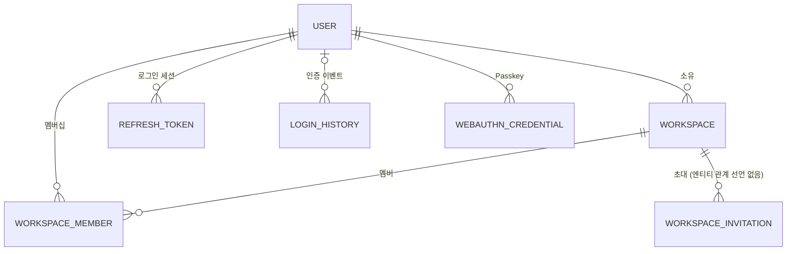

`auth_oauth_state` 는 다른 테이블과 FK 관계가 없는 단명 행이다. `workspace_invitation` 은 워크스페이스를 가리키지만 코드 엔티티(`WorkspaceInvitation`)에 관계가 선언되지 않아 워크스페이스 삭제 때 명시적으로 지운다. DB 에는 마이그레이션 V017 이 만든 FK(`workspace_id → workspace(id) ON DELETE CASCADE`)가 있다.

## 엔티티

### User

| 필드 | 타입 | 설명 |
| --- | --- | --- |
| id | UUID | PK |
| email | String | 고유, 로그인 식별자 |
| password_hash | String? | 비밀번호 bcrypt 해시. OAuth 전용 계정은 NULL |
| name | String | 표시 이름 |
| avatar_url | String? | 프로필 이미지 URL. 외부 URL(OAuth 제공자 사진 등) 또는 직접 올린 아바타의 공개 URL. 직접 올렸는지는 `avatars/{userId}/` 접두로 판별한다 |
| locale | String | 언어 설정 (기본 `"ko"`) |
| email_verified | Boolean | 이메일 인증 완료 여부 (기본 false, 인증 전 로그인 제한) |
| email_verify_token | String? | 이메일 인증 토큰 SHA-256 해시 (24시간 유효). 인증하면 NULL |
| email_verify_expires_at | Timestamp? | 이메일 인증 토큰 만료 시각 |
| pending_email | String? | 확인 대기 중인 새 이메일. 확정(email 로 승격)이나 취소 때 NULL |
| email_change_token | String? | 이메일 변경 확인 토큰 SHA-256 해시 (1시간 유효). 확인·취소·만료 때 NULL |
| email_change_expires_at | Timestamp? | 이메일 변경 확인 토큰 만료 시각 |
| password_reset_token | String? | 비밀번호 재설정 토큰 SHA-256 해시 (30분 유효). 사용·만료 때 NULL |
| password_reset_expires_at | Timestamp? | 재설정 토큰 만료 시각 |
| login_attempts | Integer | 연속 로그인 실패 횟수 (기본 0, 5회면 잠금) |
| locked_until | Timestamp? | 로그인 잠금 해제 시각 (10분 잠금) |
| oauth_provider | String? | OAuth 가입·연결 제공자 (예: `google`). 연결 안 했으면 NULL |
| oauth_provider_id | String? | 제공자 쪽 사용자 식별자 |
| notification_preferences | JSONB | 사용자 알림 환경설정 (기본 `{}`). 키는 [알림](../CLE-OBS/CLE-OBS-NOTIFY.md) |
| theme | Enum | `light` / `dark`. `system` 허용 여부는 정의가 갈린다. [미결 사항](#미결-사항) 참조 |
| two_factor_enabled | Boolean | TOTP 사용 여부. Passkey 등록과는 독립이라 Passkey 만 등록한 사용자는 false |
| two_factor_secret | String? | TOTP secret (base32, RFC 6238). 활성화 검증 전에는 값이 있어도 `two_factor_enabled = false`. 끄면 NULL |
| totp_recovery_codes | String[]? | TOTP 활성화 때 발급한 복구 코드 10개의 SHA-256 해시 배열. 쓰면 항목 제거 |
| webauthn_recovery_codes | String[]? | 첫 Passkey 등록 때 발급한 복구 코드 10개의 SHA-256 해시 배열. 모든 credential 을 지우면 NULL. 이 NULL 처리는 DB 트리거가 아니라 애플리케이션(`WebAuthnService.deleteCredential`) 책임이다. 사용자가 재발급해도 갱신 |
| created_at | Timestamp | 생성 시각 |
| updated_at | Timestamp | 수정 시각 |

- 제약: `email UNIQUE`(V001). 대소문자를 무시한 이메일 중복 조회(`emailTakenByOther`)를 위해 `LOWER(email)` 인덱스가 있다(V101).
- Passkey credential 은 별도 엔티티 [WebAuthnCredential](#webauthncredential) 에 둔다. User 행에는 `webauthn_recovery_codes` 와 간접적으로 credential 개수만 영향을 준다.

#### 응답에 싣지 않는 민감 컬럼 7개

아래는 API 응답과 엔티티 프로퍼티의 camelCase 이름이다. 위 표의 snake_case 컬럼과 1:1 로 대응한다(`password_hash` ↔ `passwordHash`). 시행 코드(`USER_SECRET_KEYS`)가 camelCase 를 쓰므로 대조하기 쉽게 그 이름을 쓴다.

`passwordHash`, `twoFactorSecret`, `totpRecoveryCodes`, `webauthnRecoveryCodes`, `emailVerifyToken`, `passwordResetToken`, `emailChangeToken` 은 어떤 API 응답에도 싣지 않는다. 해시나 토큰이라 평문은 아니지만 오프라인 크래킹, 재설정 토큰 탈취, 2단계 인증 우회의 입력이 된다. 응답 DTO 에 선언돼서도 안 되고 본문에 실려서도 안 된다.

- 컬럼 수준 `select: false` 는 쓰지 않는다. 이 7컬럼을 읽는 내부 경로(로그인 검증, 토큰 소비, 복구 코드 대조)가 값을 직접 쓰므로, 끄면 예외 없이 `undefined` 를 받아 조용히 오작동한다. 응답 경계에서 지운다. 같은 근거를 [시크릿 저장소](../CLE-INT/CLE-INT-SECRET.md) 가 트리거 계열에 대해 적고 있다.
- 시행 축은 두 개다. [HTTP API 규약](../CLE-API/CLE-API-CONV.md) 의 응답 검증 층 표에 있는 구조 축(`User` 를 투영 없이 관계로 싣는 자리)과 이름 축(응답 본문에 그 이름이 있는가)이다. 목록의 기준은 코드(`shared/testing/user-secret-absence.ts` 의 `USER_SECRET_KEYS`)다. 엔티티에 민감 컬럼을 더하면 이 배열에도 넣는다. 이름 축은 이름으로만 걸리므로 새 이름을 저절로 알지 못한다.
- [WebAuthnCredential](#webauthncredential) 의 `public_key`·`counter` 는 이 목록에 없다. 공개 키는 설계상 노출해도 된다. 목록을 "인증 관련 전부" 로 넓히지 않는 경계다.

### Workspace

| 필드 | 타입 | 설명 |
| --- | --- | --- |
| id | UUID | PK |
| name | String | 워크스페이스 이름 |
| type | Enum | `personal` / `team` |
| owner_id | UUID | FK → User (CASCADE) |
| slug | String | URL 슬러그. `UNIQUE`(V001). 만든 뒤 바꾸지 않는다 |
| settings | JSONB | 워크스페이스 설정. 알려진 키 `timezone`, `interactionAllowedOrigins`, `maxConcurrentExecutions` 의 뜻과 편집 경로는 [워크스페이스와 멤버](CLE-ACCT-WS.md) |
| created_at | Timestamp | 생성 시각 |
| updated_at | Timestamp | 수정 시각 |

개인 워크스페이스는 owner 당 하나다. 부분 유니크 인덱스 `uq_workspace_personal_owner ON workspace (owner_id) WHERE type='personal'`(V109, V108 사전 검증 가드가 먼저)로 DB 에서 강제하고 앱의 `findOrCreatePersonalWorkspace` 가 함께 막는다. 팀 워크스페이스는 한 사용자가 여러 개 소유할 수 있어 `(owner_id, type)` 전체 UNIQUE 는 두지 않는다.

### WorkspaceMember

| 필드 | 타입 | 설명 |
| --- | --- | --- |
| id | UUID | PK. 멤버 ID. 멤버 API 와 소유자 이양이 받는 식별자이고 사용자 ID 와 다르다 |
| workspace_id | UUID | FK → Workspace (CASCADE) |
| user_id | UUID | FK → User (CASCADE) |
| role | Enum | `owner` / `admin` / `editor` / `viewer` |
| invited_at | Timestamp | 초대 시각 |
| joined_at | Timestamp? | 합류 시각 |

제약과 인덱스: `(workspace_id, user_id) UNIQUE`, `(user_id)`(V129, 사용자별 워크스페이스 목록과 FK 조회).

### WorkspaceInvitation

코드 엔티티가 있지만 옛 데이터 모델 문서에는 정의가 없었다. 컬럼은 흐름 문서가 읽고 쓰는 컬럼이다. 타입·NULL 허용·FK·CHECK 는 현재 구현(마이그레이션 `V017__workspace_invitations.sql`)을 따른다.

| 필드 | 타입 | 설명 |
| --- | --- | --- |
| id | UUID | PK. 재발송·취소 API 의 `:invitationId` 이고 수락의 조건부 UPDATE 대상이다 |
| workspace_id | UUID | 초대한 팀 워크스페이스. DB FK → Workspace (CASCADE). 코드 엔티티에는 관계가 선언돼 있지 않다 |
| email | String(255) | 초대 대상 이메일 |
| role | String(20) | `admin` / `editor` / `viewer`. `CHECK (role IN ('admin', 'editor', 'viewer'))`. 소유자는 초대 역할로 줄 수 없다 |
| token | String(64) | 64자 base64url 초대 토큰. 원래 값으로 저장한다. `UNIQUE`(V017) |
| invited_by | UUID? | 초대한 사용자. FK → User (SET NULL). 재발송·재초대 때 갱신 |
| expires_at | Timestamp | 발급 시점 + 7일. 재발송·재초대 때 다시 잡는다 |
| accepted_at | Timestamp? | 수락 시각. NULL 이면 대기 중 |
| accepted_by | UUID? | 수락한 사용자. FK → User (SET NULL) |
| created_at | Timestamp | 생성 시각 |

인덱스: `token UNIQUE`(V017), `idx_workspace_invitation_email (email)`, `idx_workspace_invitation_workspace (workspace_id)`, 부분 UNIQUE `idx_workspace_invitation_pending_unique (workspace_id, email) WHERE accepted_at IS NULL`(대기 초대 중복 방지).

### RefreshToken

세션 단위는 `family_id` 다. 토큰 회전 때 행이 새로 생기지만 같은 `family_id` 는 하나의 로그인 세션이다. 사용자에게 보이는 활성 세션은 `is_revoked = false` 인 같은 `family_id` 의 가장 최신 행 메타데이터다.

| 필드 | 타입 | 설명 |
| --- | --- | --- |
| id | UUID | PK |
| user_id | UUID | FK → User (CASCADE) |
| token_hash | String | SHA-256(리프레시 토큰), UNIQUE |
| family_id | UUID | 로그인 세션 식별자 (회전 뒤에도 유지) |
| is_revoked | Boolean | 강제·자연 만료 여부 |
| expires_at | Timestamp | 만료 시각 (기본 7일, 로그인 유지 30일) |
| device_label | String? | UA 에서 만든 표시 라벨 ("Chrome on macOS") |
| user_agent | String? | 발급 시점 원래 UA |
| ip_address | String? | 발급 시점 클라이언트 IP. IP 추출 순서는 [세션과 토큰](CLE-ACCT-SESSION.md) |
| last_used_at | Timestamp? | 갱신 때마다 갱신 |
| last_used_ip | String? | 마지막 활동 IP |
| created_at | Timestamp | 발급 시각 |

인덱스: `token_hash UNIQUE`, `(user_id, family_id) WHERE is_revoked=false`(V040 메타데이터).

### LoginHistory

인증 이벤트를 사용자 단위로 시간순 기록한다. 이벤트의 뜻과 조회 API, 보존 정책은 [감사 로그](../CLE-OBS/CLE-OBS-AUDIT.md) 가 정한다.

| 필드 | 타입 | 설명 |
| --- | --- | --- |
| id | UUID | PK |
| user_id | UUID? | FK → User (CASCADE). 로그인 실패에서 맞는 사용자가 없으면 NULL |
| email | String | 시도된 이메일 (열거 추적용) |
| event | Enum | `login_success` / `login_failed` / `totp_failed` / `webauthn_failed` / `logout` / `session_revoked` / `token_reuse_detected` |
| ip_address | String? | 클라이언트 IP |
| user_agent | String? | 원래 UA |
| device_label | String? | UA 에서 만든 표시 라벨 |
| family_id | UUID? | 관련 로그인 세션 (해당할 때). 일괄 무효화는 NULL |
| failure_reason | String? | `INVALID_PASSWORD` / `ACCOUNT_LOCKED` / `TOTP_INVALID` / `WEBAUTHN_INVALID` / `WEBAUTHN_COUNTER_REGRESSION` 등 |
| created_at | Timestamp | 발생 시각 |

- CHECK 제약 이름은 `chk_login_history_event` 다(V040 도입). `webauthn_failed` 는 V058 에서 DROP CONSTRAINT 와 ADD CONSTRAINT 로 더했다.
- 인덱스: `(user_id, created_at DESC)`, `(email, created_at DESC)`(V040). 보존 배치용 인덱스는 [감사 로그](../CLE-OBS/CLE-OBS-AUDIT.md) 에 있다.
- 180일이 지난 행은 매일 배치로 지운다([Redis 와 배치](#redis-와-배치)).

### WebAuthnCredential

사용자가 등록한 Passkey·보안 키 인증기다. 사용자당 여러 개를 등록할 수 있다. 등록·인증·삭제 흐름은 [가입과 로그인](CLE-ACCT-SIGNIN.md) 을 따른다.

| 필드 | 타입 | 설명 |
| --- | --- | --- |
| id | UUID | PK |
| user_id | UUID | FK → User (CASCADE 삭제) |
| credential_id | String | UNIQUE. WebAuthn 표준 credential ID (base64url). 길이가 가변이라 TEXT |
| public_key | Bytes | CBOR-COSE 로 직렬화한 공개 키 (BYTEA) |
| counter | BigInt | 재전송 방어용 sign counter. 인증마다 갱신한다. 역행하면 그 행을 바로 지우고(suspend 컬럼은 두지 않는다) 로그인 이력에 `webauthn_failed`(`WEBAUTHN_COUNTER_REGRESSION`)를 남긴다 |
| transports | String[] | 표준 transport 힌트 (`usb`, `nfc`, `ble`, `internal`, `hybrid`) |
| aaguid | UUID? | 인증기 모델 식별자 (선택) |
| device_name | String? | 사용자가 붙인 표시 이름 (최대 100자). 없으면 UI 가 transport 와 등록일로 표시한다 |
| last_used_at | Timestamp? | 마지막 인증 성공 시각 |
| created_at | Timestamp | 등록 시각 |

인덱스: `credential_id UNIQUE`, `(user_id)`. 등록·인증 챌린지는 stateless JWT 로 발급하고 테이블에 두지 않는다. 만료 5분, payload `{ kind: 'webauthn_register'|'webauthn_auth', sub, challenge, exp }` 다.

### AuthOauthState

소셜 로그인 state 를 담는 단명 테이블 `auth_oauth_state` 다. 코드 엔티티가 있지만 옛 데이터 모델 문서에는 정의가 없었다. 컬럼은 흐름 문서가 읽고 쓰는 컬럼이다. 타입·제약은 현재 구현(마이그레이션 `V013__auth_oauth_state.sql`)을 따른다. 다른 테이블을 가리키는 FK 는 없다.

| 필드 | 타입 | 설명 |
| --- | --- | --- |
| id | UUID | PK |
| state | String(64) | 서버가 만든 state 값. `UNIQUE`(V013) |
| provider | String(32) | OAuth 제공자 (`google`, `github`) |
| mode | String(16) | 시작 요청의 모드. `CHECK (mode IN ('login', 'register'))` |
| remember_me | Boolean | 시작 요청의 로그인 유지 여부. 기본 `false` |
| expires_at | Timestamp | `now + 10분` |
| created_at | Timestamp | 생성 시각 |

인덱스: `state UNIQUE`(V013), `idx_auth_oauth_state_expires (expires_at)`.

## 인증 데이터 흐름

### 회원가입 (로컬)

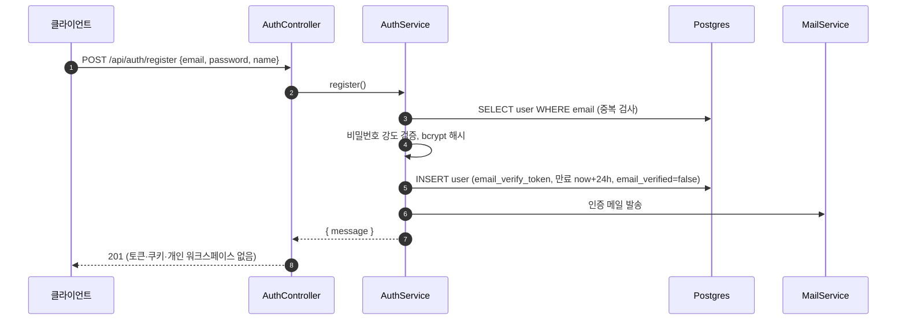

- 로컬 가입은 두 단계다. `register` 는 사용자 행과 인증 메일만 만들고 토큰을 발급하지 않는다. 개인 워크스페이스 생성과 토큰·`Set-Cookie` 는 `POST /api/auth/verify-email` 단계에서 한다. `auth.service.ts` 의 `verifyEmail` 트랜잭션이 `createPersonalWorkspace` 를 부르고 `generateTokens` 로 토큰을 만든다.
- 예외: `invitationToken` 을 담은 가입은 인증 메일 없이 한 트랜잭션에서 사용자와 초대받은 팀의 `workspace_member` 를 만들고 바로 로그인한다. 응답은 `{ message, accessToken }` 과 리프레시 쿠키이고 개인 워크스페이스는 만들지 않는다([초대 가입](#초대-가입-미가입자)).

### 로그인과 2단계 인증

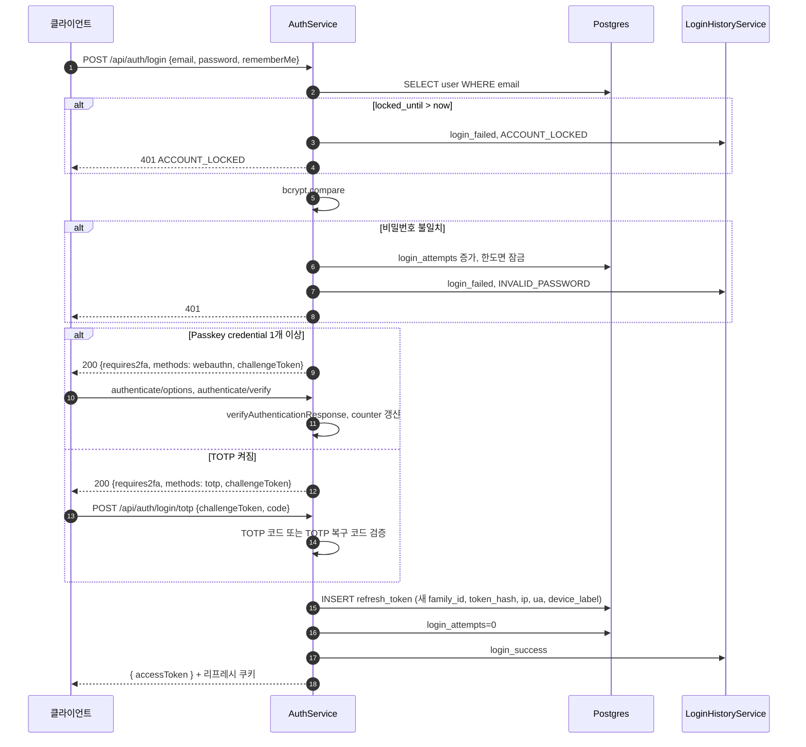

- 2단계 검증이 실패하면 Passkey 는 `webauthn_failed`, TOTP 는 `totp_failed` 를 기록하고 401 을 준다.
- 성공 응답 본문은 `{ accessToken }` 뿐이다. 리프레시 토큰은 httpOnly 쿠키로만 내려가고 `user` 객체는 없다(`auth.controller.ts` 의 `login`).
- Passkey 를 쓸 수 없는 사용자는 `POST /api/auth/2fa/webauthn/recovery` 로 등록 때 받은 복구 코드를 내 2단계를 통과한다(`webauthn/webauthn.controller.ts`).
- 인증 단계에서 counter 역행(복제 징후)이 감지되면 `webauthn/webauthn.service.ts` 의 `verifyAuthentication` 이 한 트랜잭션에서 그 credential 행을 지우고 사용자의 활성 리프레시 토큰을 모두 무효화한다. `login_history.event=webauthn_failed` 는 트랜잭션 밖에서 남긴다.

### 소셜 로그인

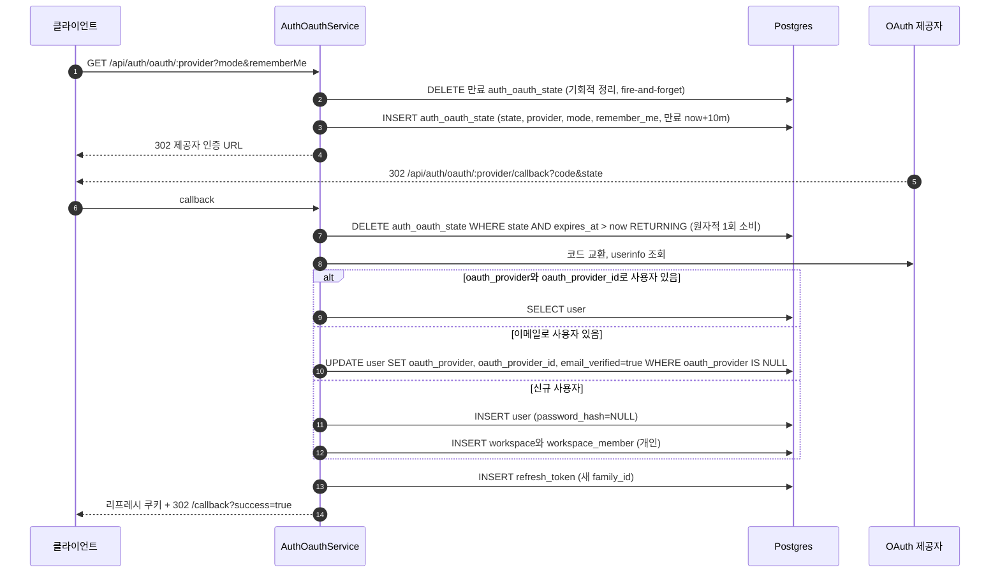

- state 행이 없으면(없음·만료·이미 소비) 서비스는 400 `OAUTH_STATE_MISMATCH` 예외를 던진다. 행의 `provider` 가 경로의 `:provider` 와 달라도 거부한다. 현재 구현은 컨트롤러가 이 예외를 `{frontendUrl}/callback?error=invalid_state` 리다이렉트로 바꾼다. 다른 실패도 `{frontendUrl}/callback?error={code}` 로 보낸다.
- 콜백은 액세스 토큰을 URL 에 싣지 않는다. 리프레시 토큰만 쿠키로 설정하고 프론트 `/callback` 페이지가 `POST /api/auth/refresh` 로 액세스 토큰을 받는다.
- 이메일 매칭 연결은 `oauth_provider IS NULL` 조건부 UPDATE 라 이미 다른 제공자에 묶인 계정을 덮어쓰지 않는다. 연결할 때 `email_verified=true` 와 아바타 URL 도 함께 설정한다(`auth-oauth.service.ts` 의 `resolveUser`).
- 신규 사용자 경로에서 첫 콜백이 동시에 와 unique index 충돌(23505)이 나면 이긴 쪽이 만든 행을 다시 조회해 복구한다.
- `OAUTH_STUB_MODE` 는 개발·테스트에서만 제공자 토큰·userinfo 호출을 stub 으로 바꾼다. 운영에서 켜면 부팅을 거부한다([세션과 토큰](CLE-ACCT-SESSION.md)).

### 토큰 회전

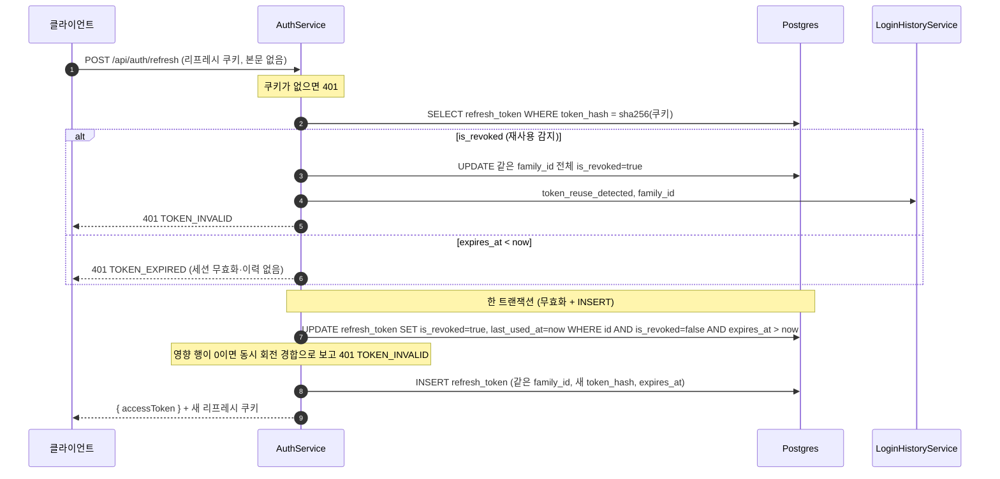

- 재사용 감지(같은 `family_id` 전체 무효화와 `token_reuse_detected` 기록)는 `is_revoked=true` 인 토큰이 다시 쓰일 때만 동작한다. 단순 만료는 부작용 없이 401 `TOKEN_EXPIRED` 만 준다(`auth.service.ts` 의 `refresh`). 현재 구현에서 워크스페이스 JWT 층의 `TOKEN_EXPIRED` 발행처는 이 갱신 경로 하나다. 만료된 액세스 토큰을 어떤 코드로 거부할지는 [에러 코드 규약과 카탈로그 §미결 사항](../CLE-API/CLE-API-ERRCODES.md#미결-사항) 에 있다.
- 재사용 분기의 전체 무효화는 단일 UPDATE 라 그 자체로 원자적이다. 로그인 이력 기록은 트랜잭션 밖에 둔다.
- 정상 회전은 로그인 이력에 남기지 않는다.

### 세션 강제 종료

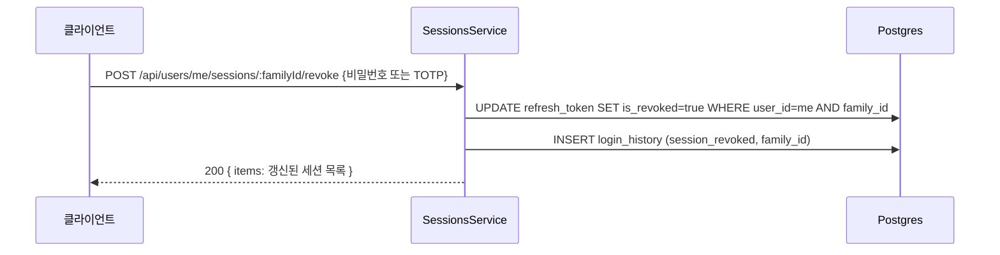

- 응답은 204 가 아니라 200 과 갱신된 세션 목록이다. 같은 컨트롤러에 일괄 종료 `POST sessions/revoke-others` 가 있다. 일괄 종료는 요청의 리프레시 쿠키가 없거나 그 쿠키로 현재 로그인 세션을 찾지 못하면 400 `CURRENT_SESSION_REQUIRED` 로 거부한다(현재 구현 `sessions.controller.ts`·`sessions.service.ts`).
- 세부 규칙(`sessions.service.ts`): 현재 요청의 리프레시 쿠키와 맞는 로그인 세션은 스스로 종료할 수 없다(400 `CANNOT_REVOKE_CURRENT_SESSION`, 로그아웃을 쓰게 한다). 재인증 수단이 없는 사용자(비밀번호 없음, 2단계 인증 없음)는 403 `REAUTH_NOT_AVAILABLE`. 남의 세션과 없는 세션은 똑같이 404 다(정보 누출 방지).
- 읽기 경로 `GET /api/users/me/sessions` 는 활성 세션을 로그인 세션 단위로 돌려주고 요청 쿠키와 맞는 세션에 `isCurrent=true` 를 표시한다. 쿠키 Path 와의 충돌은 [세션과 토큰](CLE-ACCT-SESSION.md) 의 미결 사항이다.
- 로그아웃은 요청 쿠키의 `family_id` 전체를 무효화하고 `login_history.event=logout` 을 남긴다. 절차는 [세션과 토큰](CLE-ACCT-SESSION.md).

### 비밀번호 재설정과 이메일 보조 엔드포인트

`auth.controller.ts`·`auth.service.ts` 의 `forgotPassword`·`resetPassword`·`resendVerification`·`checkEmail` 이다.

1. `POST /api/auth/forgot-password`(IP 당 분당 5회): 사용자가 있으면 30분짜리 재설정 토큰을 만들어 `password_reset_token`(SHA-256 해시)으로 저장하고 SMTP 로 보낸다. DB·메일 에러를 포함한 모든 실패를 드러내지 않고 존재 여부와 상관없이 같은 응답을 준다.
2. `POST /api/auth/reset-password`: 토큰과 비밀번호 강도를 검증한 뒤 `password_hash` 를 바꾸고 재설정 토큰 필드를 지운다. 그 사용자의 `refresh_token` 을 모두 무효화한다.
3. `POST /api/auth/resend-verification`(분당 5회): 미인증 계정에 24시간짜리 인증 토큰을 다시 발급해 보낸다. 재설정 요청과 같은 방식으로 항상 같은 응답을 준다.
4. `POST /api/auth/check-email`(분당 5회): 가입 전 이메일 사용 가능 여부 `{ available }` 을 돌려준다.

### 이메일 변경

모두 JWT 인증이 필요하다. `users.controller.ts` 가 받아 `AuthService` 로 넘긴다. 규칙과 이유는 [가입과 로그인](CLE-ACCT-SIGNIN.md) 에 있다.

1. `POST .../request { newEmail, password? | totpCode? }`(request·resend 분당 5회): `SessionsService.reauthenticate` 로 비밀번호 또는 TOTP 재인증을 하고 새 이메일을 검증(현재와 같음, 중복)한다. `pending_email` 과 `email_change_token`(SHA-256, 1시간)을 저장하고 새 이메일로 확인 메일을 보낸다. 발송이 실패하면 대기 필드 3개를 되돌리고(`clearPendingEmailChange`) 에러를 전파한다.
2. `POST .../verify { token }`(로그인한 본인 세션): 토큰 SHA-256 이 `email_change_token` 과 같고 만료되지 않았는지 확인한다. 트랜잭션에서 선점을 다시 검사하고 `email = pending_email`, `email_verified=true`, 대기 필드 3개 NULL 로 바꾼다. 이어서 모든 로그인 세션을 무효화(`revokeAllFamilies`)하고 현재 기기에 다시 발급한다(`{ accessToken }` 과 리프레시 쿠키 회전). 옛 이메일 통지(best-effort, 실패하면 `logger.warn`), 감사 로그 `user.email_changed`, `login_history` `session_revoked`(일괄, `family_id=null`)가 뒤따른다.
3. `POST .../resend`: 토큰을 다시 발급한다. 발송이 실패해도 토큰을 유지하고 재시도로 복구한다.
4. `POST .../cancel`: 대기 필드 3개를 NULL 로 지운다. 재인증이 필요 없고 멱등이다.

## 워크스페이스 데이터 흐름

코드 진입점은 `workspaces.service.ts`(워크스페이스 CRUD·멤버 관리), `workspace-invitations.service.ts`(초대 발급·수락·재발송·취소), `workspaces.controller.ts`(`@Controller('workspaces')`), `invitations.controller.ts`(`@Controller('invitations')`, 공개 토큰 메타 조회)다. 규칙과 에러 코드는 [워크스페이스와 멤버](CLE-ACCT-WS.md) 가 정한다.

### 팀 워크스페이스 생성

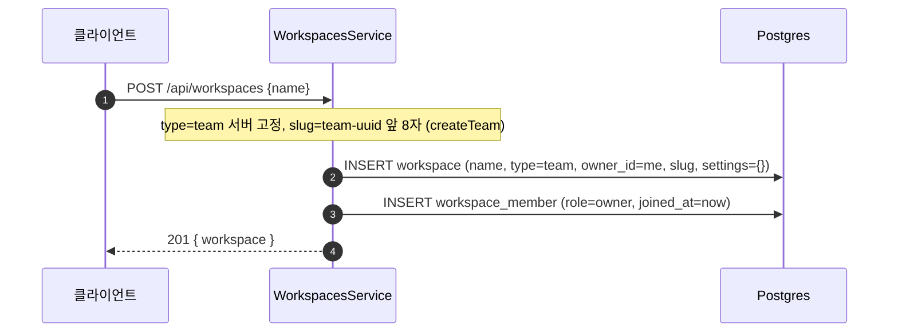

### 초대 발급

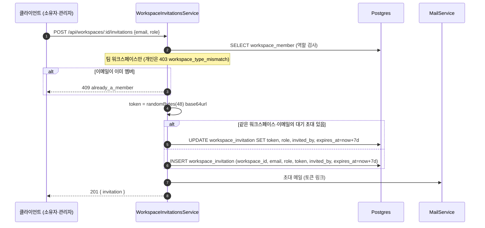

- 조회와 쓰기는 한 트랜잭션이다. 부분 UNIQUE 경합은 500 대신 409 `invitation_already_pending` 으로 바꾼다(`workspace-invitations.service.ts` 의 `create`).
- 메일 발송이 실패해도 초대 행을 되돌리지 않고 에러 로그만 남긴다. 관리자가 재발송할 수 있다(`MailService.sendWorkspaceInvitationEmail`).

### 초대 수락 (가입자)

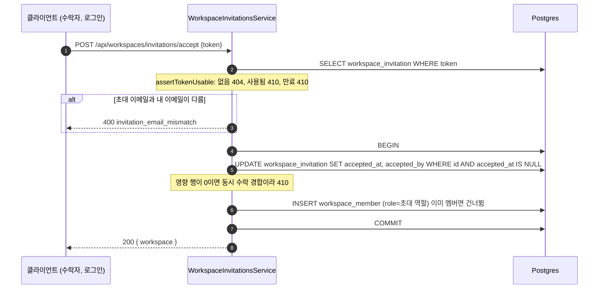

### 초대 가입 (미가입자)

`auth.service.registerWithInvitation()` 이 한 트랜잭션에서 다음을 한다.

1. `INSERT INTO "user"`.
2. `invitationsService.consumeForRegistration()` 이 초대받은 팀의 `workspace_member`(`role=invitation.role`)를 넣고 초대 수락(`accepted_at`, `accepted_by`)을 함께 처리한다.

이 경로에서는 개인 워크스페이스를 만들지 않는다. 초대받은 팀 워크스페이스가 가입 때 현재 워크스페이스의 기준이고, JWT `activeWorkspaceId` 도 그 팀으로 발급한다(`auth.service.ts` 의 `resolveTokenWorkspaceContext`).

### 워크스페이스 전환

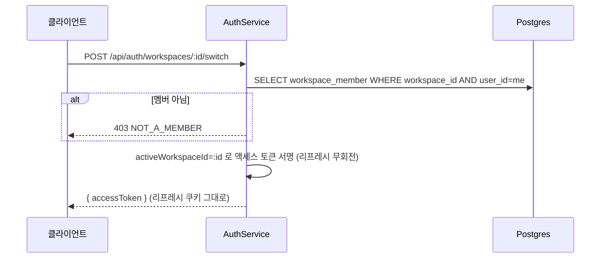

### 설정 변경

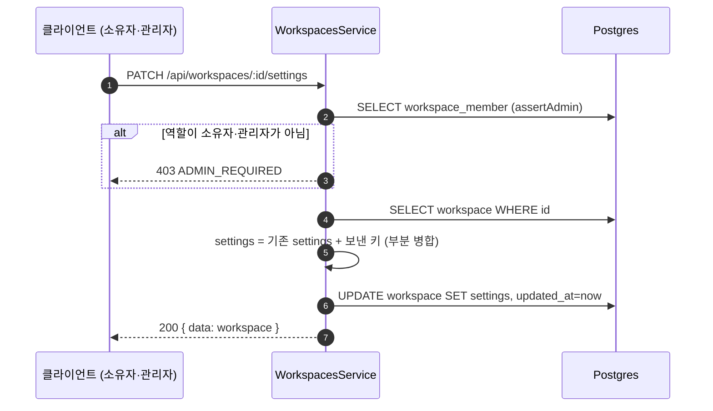

설정 변경은 `UPDATE workspace SET settings = settings || :patch` 형태의 부분 병합이다. origin 은 형식 검증 뒤 끝 슬래시를 정규화한다.

### 멤버 변경과 직접 추가

| 동작 | 테이블 쓰기 | 거부 (현재 구현) |
| --- | --- | --- |
| 역할 변경 `PATCH .../members/:memberId` | `UPDATE workspace_member.role` | 대상 없음 404 `MEMBER_NOT_FOUND`. 대상이나 새 역할이 소유자면 403 `OWNER_ROLE_PROTECTED` |
| 소유자 이양 `POST .../transfer-ownership` | 한 트랜잭션에서 현재 소유자 `role='admin'`, 대상 `role='owner'`, `workspace.owner_id = 대상 userId` | 개인 워크스페이스 403 `CANNOT_TRANSFER_PERSONAL`, 자기 자신 400 `TARGET_IS_SELF`, 대상 없음 404 `MEMBER_NOT_FOUND`, 대상이 이미 소유자 409 `TARGET_ALREADY_OWNER` |
| 멤버 제거 `DELETE .../members/:memberId` | `DELETE workspace_member`. 자기 자신은 나가기로 넘긴다 | 대상 없음 404 `MEMBER_NOT_FOUND`. 대상이 소유자면 403 `CANNOT_REMOVE_OWNER` |
| 직접 추가 `POST .../members`(`addMemberByEmail`) | 메일 없이 `INSERT workspace_member` | [워크스페이스와 멤버 §직접 추가](CLE-ACCT-WS.md#직접-추가) |
| 초대 재발송 | 새 `token`, `expires_at = now+7d`, `invited_by` 갱신과 메일 재발송(`resend`) | [워크스페이스와 멤버 §초대 에러 코드](CLE-ACCT-WS.md#초대-에러-코드) |
| 초대 취소 | 대기 초대 행 물리 삭제(`revoke`, repository `remove`) | 초대 재발송과 같다 |

거부 열의 상태 코드 가운데 `TARGET_IS_SELF`·`TARGET_ALREADY_OWNER` 말고는 원문에 상태 코드가 없어 현재 구현(`workspaces.service.ts`)에서 옮겼다. 가드 층의 역할 부족·비멤버 거부는 [워크스페이스와 멤버 §가드 거부 에러 코드](CLE-ACCT-WS.md#가드-거부-에러-코드) 에 있다.

### 워크스페이스 삭제와 나가기

워크스페이스 삭제(`DELETE /api/workspaces/:id`, `deleteWorkspace`)는 이 순서로 한다.

1. 권한 검사(소유자, 팀 워크스페이스)를 트랜잭션 밖에서 먼저 한다. 거부될 요청이 트리거 외부 자원부터 뜯지 않게 하기 위해서다.
2. 워크스페이스 트리거의 외부 자원(스케줄 job, 채팅 채널 해제, 리스너 레지스트리)을 해제한다([트리거 관리](../CLE-TRIG/CLE-TRIG-MANAGE.md)).
3. 한 트랜잭션에서 잠금 대기 상한(5초)을 건다. 워크스페이스 행을 비관적 잠금(`pessimistic_write`)으로 잡고 트리거를 열거한다. 워크스페이스, 멤버십 순으로 잠근 채 권한을 다시 검사한다.
4. 코드 엔티티에 관계가 선언되지 않은 `workspace_invitation` 을 명시적으로 DELETE 하고, `workspace_member` 를 DELETE 한 뒤, `workspace` 를 지운다. 트리거는 FK CASCADE 로 지워진다.
5. 커밋 뒤, 트랜잭션 안에서 열거한 트리거마다 `secret_store` 비밀을 지운다(`ref LIKE 'secret://triggers/<id>/%'`, `deleteByPrefix`). `secret_store` 는 FK 가 없어(V063) `workspace_id` 로 지우지 않는다.
6. 트랜잭션이 실패하면(재검사 거부 포함) 외부 해제가 이미 끝났다는 사실을 서버 로그에 남긴다.

잠금 순서(워크스페이스, 멤버십)는 소유자 이양과 같다. 둘이 겹칠 때 교착하지 않게 하기 위해서다.

나가기(`POST /api/workspaces/:id/leave`, `leaveWorkspace`)는 유일 소유자 판정과 멤버십 DELETE 를 비관적 잠금 트랜잭션 안에서 해 TOCTOU 를 막는다.

## 테이블 쓰기 매핑

흐름에서 읽고 쓰는 컬럼만 모았다.

| 테이블 | 흐름 | 읽기·쓰기 컬럼 | 인덱스·제약 |
| --- | --- | --- | --- |
| `user` | 가입 | INSERT `email, password_hash, name, locale, theme, email_verify_token, email_verify_expires_at, created_at` | `email UNIQUE`(V001) |
| `user` | 로그인 실패 | UPDATE `login_attempts, locked_until` | 없음 |
| `user` | OAuth 첫 연결 | UPDATE `oauth_provider, oauth_provider_id` | 없음 |
| `user` | TOTP 켜기·끄기 | UPDATE `two_factor_enabled, two_factor_secret, totp_recovery_codes` | 없음 |
| `user` | Passkey 복구 코드 발급·소진·재발급 | UPDATE `webauthn_recovery_codes` | 없음 |
| `user` | 이메일 변경 | UPDATE `pending_email, email_change_token, email_change_expires_at`, 확정 때 `email, email_verified` | `email UNIQUE`, `LOWER(email)`(V101) |
| `webauthn_credential` | 등록·이름 변경·삭제·인증 | INSERT(등록 검증), UPDATE `counter, last_used_at, device_name`, DELETE(개별) | `credential_id UNIQUE`, `(user_id)` |
| `refresh_token` | 로그인·갱신 | INSERT `user_id, token_hash, family_id, is_revoked=false, expires_at, device_label, user_agent, ip_address` | `token_hash UNIQUE`, `(user_id, family_id) WHERE is_revoked=false`(V040) |
| `refresh_token` | 토큰 회전 | 옛 행 UPDATE `is_revoked=true, last_used_at, last_used_ip`, 새 행 INSERT | 없음 |
| `refresh_token` | 재사용 감지 | 같은 `family_id` 전체 UPDATE `is_revoked=true` | 없음 |
| `auth_oauth_state` | OAuth 시작 | INSERT `state, provider, mode, remember_me, expires_at = now+10m` | `state UNIQUE`(V013) |
| `auth_oauth_state` | OAuth 콜백 | DELETE `WHERE state=? AND expires_at > now RETURNING`(원자적 1회 소비) | 없음 |
| `login_history` | 모든 이벤트 | INSERT `user_id, email, event, ip_address, user_agent, device_label, family_id, failure_reason, created_at` | `(user_id, created_at DESC)`, `(email, created_at DESC)`(V040) |
| `workspace` | 가입(이메일 인증 단계)·팀 생성 | INSERT `name, type, owner_id, slug, settings={}, created_at` | `slug UNIQUE`(V001), `uq_workspace_personal_owner`(V109) |
| `workspace` | 소유자 이양 | UPDATE `owner_id` | 없음 |
| `workspace` | 설정 변경 | UPDATE `settings`(부분 병합), `updated_at` | 없음 |
| `workspace` | 삭제 | DELETE(같은 트랜잭션에서 `workspace_invitation`·`workspace_member` 를 먼저 명시 삭제) | 없음 |
| `secret_store` | 워크스페이스 삭제 | 커밋 뒤 트리거마다 DELETE `ref LIKE 'secret://triggers/<id>/%'` | FK 없음(V063) |
| `workspace_member` | 가입·초대 수락·직접 추가 | INSERT `workspace_id, user_id, role, invited_at, joined_at` | `(workspace_id, user_id) UNIQUE`, `(user_id)`(V129) |
| `workspace_member` | 역할 변경 | UPDATE `role` | 없음 |
| `workspace_member` | 멤버 제거·나가기 | DELETE | 없음 |
| `workspace_invitation` | 발급 | INSERT `workspace_id, email, role, token, invited_by, expires_at, created_at`. 대기 초대가 있으면 그 행 UPDATE | `token UNIQUE`(V017), `(email)`, `(workspace_id)`, 부분 UNIQUE `(workspace_id, email) WHERE accepted_at IS NULL` |
| `workspace_invitation` | 재발송 | UPDATE `token, invited_by, expires_at` | 없음 |
| `workspace_invitation` | 수락 | UPDATE `accepted_at, accepted_by`(`WHERE accepted_at IS NULL`) | 없음 |
| `workspace_invitation` | 취소·만료 정리 | DELETE(취소 물리 삭제, `pruneExpired`) | 없음 |

## Redis 와 배치

이 영역은 BullMQ 반복 작업 큐 두 개를 등록한다. 큐 전체 목록은 [비동기 큐와 Redis 키 목록](../CLE-PLAT/CLE-PLAT-QUEUE.md) 에 있다.

| 큐 | 일정 | 동작 |
| --- | --- | --- |
| `login-history-pruner` | 매일 03:00 Asia/Seoul(`upsertJobScheduler` pattern `0 3 * * *`, 명시적 tz) | 180일이 지난 `login_history` 행을 배치 루프로 지운다(`login-history.service.ts` 의 `pruneOlderThanRetention`, `RETENTION_DAYS=180`). `auth.module.ts` 의 `BullModule.registerQueue`, `jobs/login-history-pruner.service.ts` |
| `workspace-invitations-pruner` | 매일 04:00 Asia/Seoul | 만료되고(`expires_at < now`) 수락되지 않은(`accepted_at IS NULL`) 초대 행을 지운다(`WorkspaceInvitationsPrunerService`, 비즈니스 로직은 `WorkspaceInvitationsService.pruneExpired(now)`). `MONITORED_QUEUES` 에 등재 |

두 큐 모두 멀티 인스턴스에서도 전역 1회만 돈다.

로그인 요청 한도는 Redis 가 아니라 `@nestjs/throttler` 의 in-memory 카운터로 구현했다.

| 범위 | 한도 | 위치 |
| --- | --- | --- |
| 전역 (모든 API) | IP 당 분당 100회(`NODE_ENV=test` 만 건너뜀). 집계 기준은 [미결 사항](#미결-사항) 참조 | `app.module.ts` 의 `ThrottlerModule.forRoot` |
| `register`·`login` | IP 당 분당 10회 | `auth.controller.ts` 의 `@Throttle` |
| `forgot-password`·`resend-verification`·`check-email` | IP 당 분당 5회 | `auth.controller.ts` |
| `sessions/:familyId/revoke`·`sessions/revoke-others` | IP 당 분당 10회·5회 | `sessions.controller.ts` |
| 초대 발급·재발송, 공개 초대 메타 조회 | 분당 10건, 분당 30건 | `workspaces.controller.ts`(`INVITATION_THROTTLE`), 초대 메타 컨트롤러 |

IP 단위 요청 한도는 계정 잠금(5회 실패, 10분)과 별개의 이중 방어다. 한 IP 가 여러 계정을 도는 credential stuffing 은 요청 한도가 먼저 막고, 여러 IP 에서 한 계정을 노리는 공격은 계정 잠금이 막는다.

## 외부 의존

| 의존 | 방향 | 쓰임 |
| --- | --- | --- |
| SMTP (`MailService`, `codebase/backend/src/modules/mail/mail.service.ts`, 전송기 `mail.transporter.ts`) | 내부에서 외부로 | 이메일 인증, 비밀번호 재설정, 초대 메일, 이메일 변경 확인(새 주소), 변경 통지(옛 주소). 알림 메일은 [알림](../CLE-OBS/CLE-OBS-NOTIFY.md) 이 같은 `MailService` 로 보낸다. 시스템 전역 SMTP 만 쓴다. `MAIL_TRANSPORT` 가 `console` 이 아니면(보통 `smtp`) `MailService` 가 보내는 모든 메일을 암호화한 연결로만 보낸다(`MAIL_SECURE` 가 `true` 가 아니면 STARTTLS 를 강제하고 `MAIL_REQUIRE_TLS=false` 로만 끈다). 워크스페이스 SMTP 통합(Send Email 노드)은 이 설정과 무관하고 [서비스별 인증 방식과 자격 증명](../CLE-INT/CLE-INT-AUTH.md) 의 `secure` 를 따른다 |
| OAuth 제공자 (Google, GitHub) | 외부에서 내부로(콜백) | authorize, token, userinfo(`auth-oauth.service.ts`). 셀프 호스팅용 LDAP·SAML 은 미구현(Planned)이다([가입과 로그인](CLE-ACCT-SIGNIN.md)) |
| 감사 로그 | 내부 참조 | 워크스페이스 컨텍스트가 있는 동작은 `audit_log`, 사용자 인증 이벤트는 `login_history`. 워크스페이스·멤버 액션(`workspace.transfer_ownership`, `workspace.created`, `workspace.updated`, `member.invited`, `member.role_changed`, `member.removed`)은 `workspaces.service.ts` 와 `workspace-invitations.service.ts` 가 남긴다. [감사 로그](../CLE-OBS/CLE-OBS-AUDIT.md) |

## 상태 전이

### `refresh_token.is_revoked`

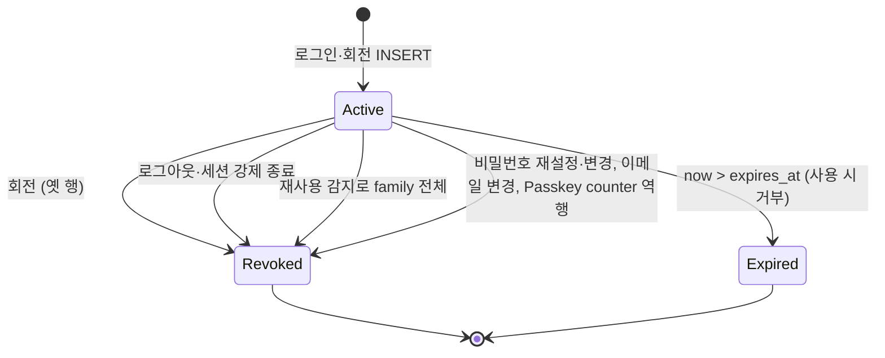

### `user.locked_until` (계정 잠금)

| 조건 | 동작 |
| --- | --- |
| 연속 로그인 실패 5회(`login_attempts >= 5`) | `locked_until = now + 10분` (`users.service.ts`) |
| `locked_until > now` 인 상태에서 로그인 | 401(`UnauthorizedException`) `ACCOUNT_LOCKED`, `login_history.event=login_failed`, `reason=ACCOUNT_LOCKED` |
| 로그인 성공 | `login_attempts = 0`, `locked_until = NULL` |

### OAuth state 수명

| 단계 | 동작 |
| --- | --- |
| 시작 | INSERT `expires_at = now + 10분`. 한 번만 쓴다. 호출마다 만료 행을 fire-and-forget `purgeExpired()` 로 기회적으로 지운다 |
| 콜백 | 단일 원자 쿼리 `DELETE ... WHERE state=? AND expires_at > now RETURNING *`. 만료·이미 소비된 state 는 같은 쿼리에서 거부되고 동시 콜백은 한쪽만 행을 얻는다 |
| 수명 경과 | 별도 정기 배치는 없다. 다음 시작의 기회적 정리나 콜백 때 거부로 정리된다 |

### `workspace_invitation.accepted_at`

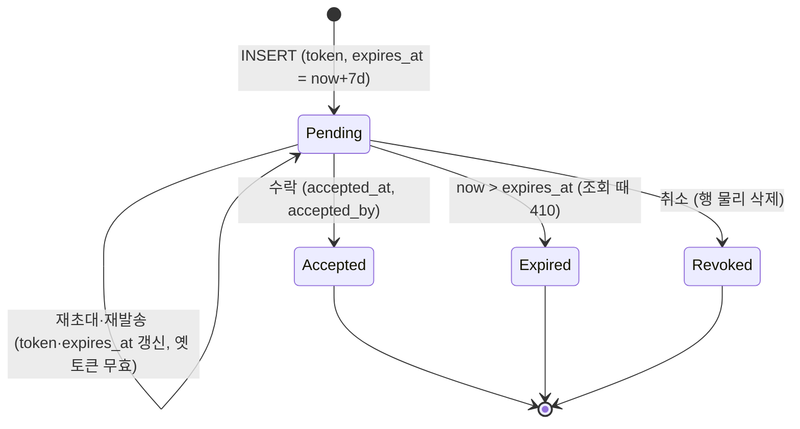

만료는 조회 시점 판정(`assertTokenUsable` 이 410 `invitation_expired`)일 뿐 바로 지우지 않는다. 만료되고 수락되지 않은 행은 `workspace-invitations-pruner` 가 주기적으로 지운다. 감사 보존이 필요하면 별도 감사 기록으로 다루고, 이 정리는 운영 위생 목적이다.

## 인가

요청마다 현재 워크스페이스와 역할을 판정하는 규칙(헤더 우선, 토큰 클레임, 가드의 멤버십 검증, 경로 파라미터 워크스페이스, 가드 거부 코드, UUID 검사 강도)과 그 결정 이유는 [워크스페이스와 멤버](CLE-ACCT-WS.md) 의 API 인가 절이 정한다. 권한 매트릭스도 그 문서에 있다.

## 미결 사항

- **`User.theme` 에 `system` 을 둘 수 있는가**: 데이터 모델과 DB CHECK 는 `light`·`dark` 두 값이고, 프로필 원문은 백엔드 DTO 가 `system` 을 저장·반환한다고 적는다. 자세한 내용과 선택지는 [내 프로필](CLE-ACCT-PROFILE.md) 의 미결 사항에 있다. 결정 필요.
- **전역 요청 한도의 집계 기준**: 이 흐름 원문은 전역 한도를 IP 당 분당 100회로, `forgot-password`·`resend-verification`·`check-email` 을 분당 5회로 적는다. [HTTP API 규약](../CLE-API/CLE-API-CONV.md) 은 일반 API 를 사용자 기준 분당 100회로, 인증 API 전체를 IP 기준 분당 10회로 묶는다. 전역 집계 키(IP 대 사용자)와 인증 라우트 한도(10 대 5)가 문서마다 다르다. 코드(`ThrottlerModule`, `UserThrottlerGuard`, `@Throttle`)를 확인해 한 곳으로 정리할지 결정 필요.

## 구현 위치

- `codebase/backend/src/modules/auth/auth.controller.ts`, `codebase/backend/src/modules/auth/auth.service.ts` (가입·로그인·갱신·로그아웃)
- `codebase/backend/src/modules/auth/auth-oauth.service.ts` (OAuth state 발급과 콜백)
- `codebase/backend/src/modules/auth/sessions.service.ts` (세션 목록과 강제 종료)
- `codebase/backend/src/modules/auth/login-history.service.ts`, `codebase/backend/src/modules/auth/jobs/login-history-pruner.service.ts`
- `codebase/backend/src/modules/auth/webauthn/webauthn.controller.ts`, `codebase/backend/src/modules/auth/webauthn/webauthn.service.ts`
- `codebase/backend/src/modules/auth/entities/*.entity.ts`, `codebase/backend/src/modules/users/entities/user.entity.ts`
- `codebase/backend/src/modules/workspaces/workspaces.service.ts`, `codebase/backend/src/modules/workspaces/workspace-invitations.service.ts`
- `codebase/backend/src/modules/workspaces/workspaces.controller.ts`, `codebase/backend/src/modules/workspaces/invitations.controller.ts`
- `codebase/backend/src/modules/mail/mail.service.ts`, `codebase/backend/src/modules/mail/mail.module.ts`, `codebase/backend/src/modules/mail/mail.transporter.ts` (SMTP 전송기와 TLS 강제)
- `codebase/backend/src/common/config/mail.config.ts` (`MAIL_*` 해석과 운영 경고 판정), `codebase/backend/src/main.ts` (운영 경고)
- `codebase/backend/src/modules/mail/mail.transporter.spec.ts`, `codebase/backend/src/common/config/mail.config.spec.ts` (TLS 강제 · 설정 기본값 · 운영 경고 판정 테스트)
- `codebase/backend/src/shared/testing/user-secret-absence.ts` (`USER_SECRET_KEYS`)

## Rationale

### 토큰 회전은 트랜잭션과 조건부 UPDATE 로 원자화한다

회전(정상 분기)은 옛 토큰 무효화와 새 토큰 INSERT 를 한 DB 트랜잭션으로 묶는다. 옛 구현은 무효화 뒤 따로 INSERT 해서, 그 사이에 크래시가 나면 옛 토큰만 무효가 되고 새 토큰이 없어 세션이 통째로 사라졌다. 트랜잭션으로 묶으면 중간 실패 때 둘 다 되돌아가 옛 토큰이 `is_revoked=false` 로 남는다. 가입 인증 `verifyEmail` 트랜잭션(사용자, 개인 워크스페이스, 토큰 발급을 한 번에)과 같은 원자성 정책이다.

무효화는 단순 `WHERE id` UPDATE 가 아니라 조건부 UPDATE(`is_revoked=false AND expires_at>now`)다. 조회, 검증, UPDATE 사이에는 TOCTOU 창이 있어 같은 토큰으로 동시에 온 두 갱신 요청이 모두 회전하려 할 수 있다. 조건부 UPDATE 의 영향 행이 0이면 다른 요청이 먼저 회전한 것이라 새 토큰을 주지 않고 `TOKEN_INVALID` 로 거부해 이중 회전을 막는다. 경합 판정을 DB 단일 UPDATE 의 원자성에 맡기는 것이다.

JWT 서명은 DB I/O 가 없는 순수 연산이라 트랜잭션의 커밋·롤백에 참여하지 않는다. 트랜잭션 범위를 무효화와 INSERT 로 좁게 두려는 개념상 분리다. 로그인 이력 기록도 회전 원자성과 무관해 트랜잭션 밖에 둔다. 정상 회전은 보안 이벤트가 아니라서 재사용 분기와 달리 기록하지 않는다.

### `login_history` 와 `audit_log` 를 나눈다

`audit_log` 는 워크스페이스 컨텍스트가 있는 변경을 기록한다. 로그인·로그아웃·2단계 인증 실패는 워크스페이스 없이도 일어나므로 별도 `login_history` 에 두고 사용자 본인이 직접 조회한다(180일 보존). 비밀번호 변경·2단계 인증 켜기와 끄기·이메일 변경처럼 로그인한 세션에서 일어나는 사용자 보안 동작은 그 세션의 현재 워크스페이스에 귀속해 `audit_log` 에 남긴다. 귀속 규칙은 [감사 로그](../CLE-OBS/CLE-OBS-AUDIT.md) 가 정한다.

### OAuth state 를 한 번의 DELETE 로 소비한다

CSRF 와 재전송을 막기 위해 `auth_oauth_state` 는 콜백 한 번에 소비한다. 조회와 삭제 두 쿼리 트랜잭션이 아니라 단일 원자 쿼리(`DELETE ... RETURNING`)를 쓰는 이유는 동시 콜백 경합에서도 정확히 한 요청만 state 를 얻게 하기 위해서다. 별도 정기 배치를 두지 않는 이유는 행 수가 아주 적고(10분 수명 × 동시 OAuth 시도 수) 매 시작의 기회적 정리만으로 충분하기 때문이다.

이 설계는 맞았지만 구현이 한동안 보장을 지키지 못했다. `DELETE … RETURNING` 의 결과는 행 배열이 아니라 `[rows, affectedCount]` 튜플인데 코드가 행 배열로 다뤄 소비한 state 를 한 번도 읽지 못했고 정상 콜백까지 모두 `OAUTH_STATE_MISMATCH` 로 실패했다. 튜플을 풀고 나서는 `rememberMe`(camelCase)를 읽었는데 raw 행의 실제 키는 `remember_me` 라 로그인 유지가 통째로 무시됐다. 두 결함 모두 고쳤고, 두 불변식은 이제 [raw SQL 결과 읽기 규약](../CLE-ENG/CLE-ENG-RAWQUERY.md) 이 정하고 발견형 가드가 집행한다.

### 보존 배치를 BullMQ 반복 작업으로 돌린다

예전 `@Cron` 인메모리 타이머는 replica 마다 따로 돌아 중복 실행됐다. 그래서 BullMQ Redis 중앙 스케줄로 옮겨 멀티 인스턴스에서도 전역 1회만 돌게 했다. 초대 정리 배치도 같은 패턴이다.

### 개인 워크스페이스 유일성은 부분 유니크 인덱스로 강제한다

지키려는 불변식은 "한 사용자가 개인 워크스페이스를 두 개 이상 가질 수 없다" 뿐이다. 팀 워크스페이스는 여러 개 소유할 수 있다. 과거의 `@Unique(['ownerId', 'type'])` 엔티티 데코레이터는 뜻이 틀렸다. `(owner_id, type)` 전체 UNIQUE 는 팀 다중 소유까지 막는다. 대응 마이그레이션도 없어(엔티티 synchronize 비활성) DB 에서 강제되지도 않았다. 이 데코레이터는 지웠다.

개인 유일성은 부분 유니크 인덱스 `uq_workspace_personal_owner ON workspace (owner_id) WHERE type='personal'`(V109)로 DB 에서 강제하고, 앱 계층 `WorkspacesService.findOrCreatePersonalWorkspace`(find-or-create 와 충돌 시 재조회 폴백)가 함께 막는다. 무결성 불변식이라 앱 단독 방어보다 DB 이중 방어가 맞다고 판단했다(2026-07-07 결정).

마이그레이션 안전: 인덱스는 `CREATE UNIQUE INDEX CONCURRENTLY`(트랜잭션 밖, V109 `.conf` 의 `executeInTransaction=false`)로 만든다. 그 직전 V108 은 사전 검증 가드다. owner 당 개인 워크스페이스가 중복이면 `RAISE EXCEPTION` 으로 배포를 바로 멈출 뿐 어떤 행도 자동으로 지우거나 옮기지 않는다. 중복이 나오면 운영자가 안내된 `array_agg` 조회로 확인해 손으로 병합하거나 지운 뒤 다시 배포해야 V109 인덱스가 만들어진다. 자동 정리를 뺀 이유는 `workspace(id)` 를 참조하는 `ON DELETE CASCADE` FK 가 약 20개 테이블에 걸쳐 있기 때문이다. 중복 개인 워크스페이스를 자동으로 지우면 하위 데이터가 함께 사라지고, 모든 자식 행을 남길 워크스페이스로 옮기는 것은 테이블 열거 누락이나 멤버십 중복 같은 새 위험을 만든다. 중복은 애초에 앱이 막는 불변식 위반이므로 자동 파괴보다 운영자 수동 처리가 안전하다.

### `workspace.deleted` 는 감사하지 않는다

감사 확대 결정은 워크스페이스 CRUD 전체를 감사하려 했지만 `workspace.deleted` 는 일부러 기록하지 않는다. `audit_log.workspace_id` 는 `REFERENCES workspace(id) ON DELETE CASCADE`(V001)라, 삭제 감사 행은 (a) 삭제 전에 쓰면 워크스페이스와 함께 cascade 로 지워지고 (b) 삭제 뒤에 쓰면 FK 대상이 없어 INSERT 가 실패한다. 어느 쪽이든 남길 수 없다. 워크스페이스 범위로 쌓이고 워크스페이스와 함께 사라지는 현재 감사 모델의 구조적 결과다. 그 모델에서는 `workspace.created`·`workspace.updated` 감사도 워크스페이스가 지워지면 함께 사라진다. 감사는 워크스페이스가 살아 있는 동안의 포렌식이다. 삭제 이력 자체를 남기려면 워크스페이스에 매이지 않는 별도 저장소가 필요하고, 이것은 이 결정 범위 밖이다. 자동 정리 대신 V108 사전 검증 가드를 택한 이유와 같은 계열의 제약이다.

### `User` 민감 컬럼은 응답 경계에서 지운다

2026-09-06 결정이다. `GET /api/audit-logs` 가 필드 3개를 광고하면서 `User` 엔티티를 통째로 내보내고 있었고, 같은 형태가 워크플로우 버전 상세에서도 났다. 세 안을 견줬다.

| 안 | 채택·기각 이유 |
| --- | --- |
| 컬럼 `select: false` | 기각. 조용히 실패한다. 민감 7컬럼은 내부 경로가 값을 직접 쓴다(로그인 검증, 토큰 소비, 복구 코드 대조). 컬럼 수준에서 끄면 그 경로가 예외 없이 `undefined` 를 받는다. 실측: `user.entity.ts` 에 `select: false`·`@Exclude()` 가 0건이었다 |
| 응답 DTO 를 손으로 좁히기 (단독) | 기각. 다음 자리가 열린다. 유출은 최상위가 아니라 중첩(`data.items[].user.…`)에서 났고 새 엔드포인트마다 같은 판단을 되풀이해야 한다 |
| 응답 경계 투영과 검출 2축 | 채택. 구조 축은 "엔티티를 통째로 실었다" 를, 이름 축은 "그 이름이 응답에 있다" 를 본다 |

두 축을 모두 세운 이유는 계약 검증기(`response-contract.ts`)가 배선된 엔드포인트에서만 동작하고 배선이 아직 전 엔드포인트에 닿지 않았기 때문이다. 이름 축은 선언·배선과 독립이라 실수로 `passwordHash` 를 DTO 에 선언까지 한 경우도 잡는다.

채택안이 코드에서 갖는 형태는 쿼리 범위 `select` 투영이다. 위 표 첫 줄이 기각한 것과 이름이 닮아 구분해 둔다. 실제 코드는 `select: { creator: { id, name, email } }` 처럼 그 쿼리 하나의 컬럼을 좁힌다. 첫 줄이 기각한 것은 엔티티 선언의 `@Column({ select: false })` 이고 성질이 반대다.

| | 첫 줄 (기각) | 채택안의 구현 형태 |
| --- | --- | --- |
| 적용 범위 | 엔티티 컬럼 선언, 모든 쿼리 | `find`·`findOne` 옵션, 그 쿼리 하나 |
| 값을 읽는 다른 내부 경로 | `undefined` 를 받는다 | 건드리지 않는다 |

사례는 `WorkflowVersionsService.findOne`(`CREATOR_PROJECTION`)과 `WorkspacesService.listMembers` 다. 후자는 전환하자 `user-entity-exposure-guard` 의 화이트리스트에서 빠졌다. 그 래칫은 양방향이라 목록에 남겨 두면 실패하므로 항목이 사라지는 것 자체가 전환의 기계적 증거다. 이 구분을 적는 이유는 표만 읽은 검토자가 `select: { … }` 를 첫 줄이 기각한 대안의 재도입으로 오판할 수 있어서다. 구현 완료 검토가 이 위험을 세 라운드 연달아 지적했다.

`select: false` 기각은 이 저장소의 일반 규칙이 아니다. 컬럼별 소비 패턴이 가른다. [알림](../CLE-OBS/CLE-OBS-NOTIFY.md) 의 `Notification.background_run_id` 는 `select: false` 로 선언돼 있고(V107) 그것이 맞다. 유일한 내부 소비자(`findByBackgroundRun`)가 WHERE 절에만 쓰고 값을 읽지 않기 때문이다.

| 내부 소비 패턴 | 처분 | 사례 |
| --- | --- | --- |
| 값을 읽는다 | 응답 경계에서 지운다(`select: false` 금지) | `User` 민감 7컬럼, `Trigger.notification_secret_v2`(교체 스윕이 승격에 쓴다) |
| WHERE 절에만 쓴다 | `select: false` 유효 | `Notification.background_run_id` |

이 결정을 "`select: false` 를 쓰지 마라" 의 선례로 인용하려면 그 컬럼의 소비 패턴이 앞쪽임을 먼저 보여야 한다. 조건 없이 인용하는 것이 이 결정의 실패 모드다.

### 로그인 이력 CHECK 변경을 한 문장 마이그레이션으로 했다

V058(`chk_login_history_event` 에 `webauthn_failed` 추가)은 `DROP/ADD CONSTRAINT` 한 문장으로 썼다. 마이그레이션 기본 규약은 NOT VALID 와 VALIDATE 두 단계지만([DB 마이그레이션 규약](../CLE-ENG/CLE-ENG-MIGRATION.md)), 이 건은 다음 조건을 모두 만족해 한 문장이 안전하다고 판단했다.

1. append-only 테이블이다. `login_history` 는 INSERT 만 한다(보존 배치의 DELETE 만 예외). 오래 도는 쓰기 트랜잭션이 ACCESS EXCLUSIVE 잠금과 부딪칠 가능성이 낮다.
2. enum 확장이다. 새 값(`webauthn_failed`)은 기존 행에 없으므로 NOT VALID 의 "기존 행 검증 건너뛰기" 이득이 없다. 전체 검증을 해도 위반은 0건이다.
3. 테이블이 아직 작다. 잠금 영향을 무시할 수 있는 규모다. 다만 커지면 다음 사후 점검을 권한다. 100만 행에 이르면 다음 CHECK 변경부터 NOT VALID 와 VALIDATE 로 나누는 것을 의무로 하고, 180일 보존 배치(`login-history-pruner`)가 제대로 도는지 모니터링한다.

이미 적용한 제약을 NOT VALID 로 다시 선언하는 것은 뜻이 없다(제약 이름이 같으면 `ERROR: relation already exists`). DROP, NOT VALID ADD, VALIDATE 세 단계로 우회하면 한 문장보다 잠금 창이 길어진다(ACCESS EXCLUSIVE 잠금 3회). 앞으로 같은 형태의 변경은 위 조건을 점검한 뒤 고르고, append-only 테이블도 100만 행 이후에는 두 단계를 권한다.

### 시스템 SMTP 는 STARTTLS 를 기본으로 강제한다

2026-10-04 결정이다(NERV Task `CLE-T-67BNAZ`). 진행 중에 아래 세 안을 사람에게 제시했고 첫 안이 선택됐다. 시스템 SMTP 로 나가는 메일에는 이메일 인증, 비밀번호 재설정, 초대 링크가 들어 있고 연결에는 SMTP 자격 증명이 실린다. 예전 전송기는 `MAIL_SECURE` 가 `true` 가 아닐 때(기본 포트 587) 서버가 STARTTLS 를 알릴 때만 암호화했다. 그래서 능동 중간자가 EHLO 응답에서 STARTTLS 를 지우면 링크와 자격 증명이 평문으로 나갔다. `@nestjs-modules/mailer` 를 쓰던 때도 같았다.

| 안 | 채택·기각 이유 |
| --- | --- |
| 기본 강제, 설정으로 끄기 | 채택. `MAIL_SECURE` 가 `true` 가 아니면 nodemailer `requireTLS` 를 켠다. STARTTLS 를 지원하지 않는 서버를 쓰는 운영자만 `MAIL_REQUIRE_TLS=false` 로 끈다. 값이 `false` 가 아니면(빈 값 포함) 강제한다 |
| 설정만 더하고 기본은 끄기 | 기각. 운영자가 켜지 않으면 보호가 없고 지금 배포의 기본 동작이 그대로 남는다 |
| 지금 동작 유지 | 기각. 위험을 문서로만 알리고 막지 않는다 |

이 결정은 [비기능 요구사항](../CLE-PLAT/CLE-PLAT-NFR.md) 의 전송 구간 암호화 요구(TLS 1.2 이상)를 시스템 메일에 적용한 것이다. Node 의 기본 최소 TLS 버전이 1.2 라 STARTTLS 업그레이드도 그 하한을 지킨다. `MAIL_REQUIRE_TLS=false` 는 STARTTLS 를 지원하지 않는 서버를 쓰는 셀프 호스팅 운영자 몫의 예외다.

범위는 시스템 메일(`MailService`)뿐이다. 워크스페이스 SMTP 통합의 `secure`(`none`, `starttls`, `tls`)는 통합마다 사용자가 고르고 이 결정이 바꾸지 않는다.

`MAIL_REQUIRE_TLS=false` 는 정당한 용도가 있는 완화 플래그라 부팅을 거부하지 않는다. 운영(`NODE_ENV=production`)에서 SMTP 전송인데 강제를 끄고 부팅하면 경고만 남긴다. [세션과 토큰](CLE-ACCT-SESSION.md) 의 운영 환경 가드 기준(정당한 용도가 있으면 throw 가 아니라 warn)과 같다.

STARTTLS 를 지원하지 않는 SMTP 서버로 보내던 배포는 이 결정 뒤 발송이 실패하므로 `MAIL_REQUIRE_TLS=false` 를 명시해야 한다. 이 실패(nodemailer 코드 `ETLS`)는 일시적인 실패가 아니라 설정을 고칠 때까지 모든 발송에서 난다. 실패가 드러나는 방식은 메일마다 다르고 기존 발송 실패 규칙을 그대로 따른다.

- 가입 인증 메일과 이메일 변경 확인 메일은 요청이 에러로 끝난다. 가입은 미인증 사용자 행이 남아 인증 메일 재발송으로 복구한다. 이메일 변경은 [가입과 로그인](CLE-ACCT-SIGNIN.md) 이 정한 대로 대기 중 변경 정보를 지운다.
- 비밀번호 재설정, 초대, 이메일 변경 통지, 알림 메일은 사용자에게 드러나지 않고 서버 로그에만 남는다. 알림 메일은 `email_sent_at` 이 비어 있다.

배포 뒤에는 `Failed to send … email` 로그의 stack 에 `Error upgrading connection with STARTTLS` 가 있는지 본다. `ETLS` 는 에러 객체의 코드라 로그 문자열에는 나오지 않는다. `console` 전송(로컬, e2e)은 SMTP 를 쓰지 않아 영향이 없다.
