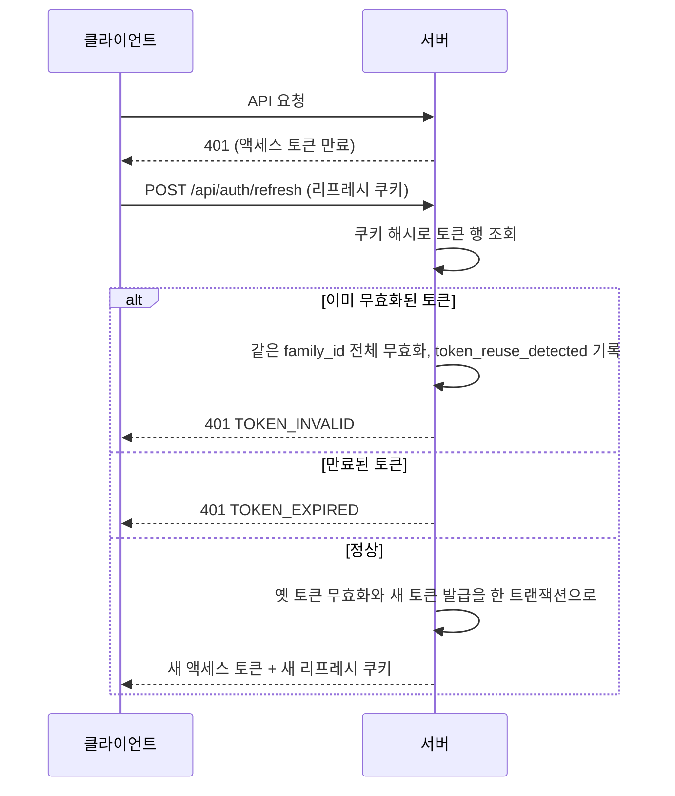

> 구현 상태: 부분 구현 (동시 세션 제한·비활동 만료는 구현 여부 미확인) · 원문: `spec/5-system/1-auth.md` (§2, §5 로그아웃·갱신 행, Rationale 2.3.A~D·Production fail-closed 가드), `spec/2-navigation/10-auth-flow.md` (§3.3, §7), `spec/2-navigation/9-user-profile.md` (§2.2 활성 세션 행, §6.1 세션 행), `spec/data-flow/2-auth.md` (§1.4~§1.6, Rationale family_id) · 용어: [용어 사전](../CLE-GLOSSARY.md)

## 개요

이 문서는 로그인한 뒤 사용자가 로그인 상태를 어떻게 유지하고 끝내는지 정한다. 액세스 토큰(access token, `accessToken`)과 리프레시 토큰(refresh token, `refreshToken`)의 형태와 수명, 로그인 세션(login session, `family_id`) 단위의 토큰 회전(refresh token rotation)과 재사용 감지, 리프레시 쿠키 속성, 세션 목록과 세션 강제 종료(session revoke), 계정 재인증(reauthentication, `verifyReauth`)과 비밀번호 재확인(password re-check, `verifyPasswordForUser`)의 에러 코드, 로그아웃, 프론트엔드 라우트 가드가 범위다.

범위 밖 주제는 다음 문서가 정한다.

- 로그인·2단계 인증·소셜 로그인으로 토큰을 처음 받는 과정: [가입과 로그인](CLE-ACCT-SIGNIN.md)
- 현재 워크스페이스를 바꾸는 토큰 재발급과 서버 인가 규칙: [워크스페이스와 멤버](CLE-ACCT-WS.md)
- `refresh_token`·`login_history` 테이블과 회전 시퀀스: [계정과 워크스페이스 데이터 흐름](CLE-ACCT-DATA.md)
- 로그인 이력 이벤트 목록·조회 API·180일 보존: [감사 로그](../CLE-OBS/CLE-OBS-AUDIT.md)
- 비밀번호 변경 화면: [내 프로필](CLE-ACCT-PROFILE.md)
- 전역 요청 한도: [HTTP API 규약](../CLE-API/CLE-API-CONV.md)

## 요구사항

- REQ-SESSION-001 WHEN 로그인에 성공하면 THE SYSTEM SHALL 15분짜리 액세스 토큰을 응답 본문으로 주고 리프레시 토큰은 HttpOnly·Secure 쿠키로 준다.
- REQ-SESSION-002 WHEN 클라이언트가 액세스 토큰을 받으면 THE SYSTEM SHALL 그 토큰을 JS 메모리에만 보관한다.
- REQ-SESSION-003 WHEN 로그인 유지를 켜고 로그인하면 THE SYSTEM SHALL 리프레시 토큰을 30일 동안 유효하게 하고, 끄면 7일 동안 유효하게 한다.
- REQ-SESSION-004 WHEN 액세스 토큰을 서명하면 THE SYSTEM SHALL 현재 워크스페이스를 `activeWorkspaceId` 클레임으로만 발행한다.
- REQ-SESSION-005 WHEN 액세스 토큰을 읽으면 THE SYSTEM SHALL `activeWorkspaceId ?? workspaceId` 로 옛 클레임 이름의 토큰도 받는다.
- REQ-SESSION-006 IF `NODE_ENV=production` 에서 `JWT_SECRET` 이 없거나 기본 sentinel·예시값이거나 32자 미만이면 THE SYSTEM SHALL 부팅을 거부한다.
- REQ-SESSION-007 WHEN 클라이언트가 API 에서 401 을 받아 액세스 토큰 만료를 감지하면 THE SYSTEM SHALL `POST /api/auth/refresh` 로 새 토큰을 받는다.
- REQ-SESSION-008 WHEN 리프레시 토큰으로 갱신을 요청받으면 THE SYSTEM SHALL 새 액세스 토큰과 같은 로그인 세션의 새 리프레시 토큰을 주고 옛 리프레시 토큰을 바로 무효화한다.
- REQ-SESSION-009 IF 이미 무효화된 리프레시 토큰이 다시 쓰이면 THE SYSTEM SHALL 그 로그인 세션 전체를 무효화하고 로그인 이력에 `token_reuse_detected` 를 남긴 뒤 401 `TOKEN_INVALID` 로 거부한다.
- REQ-SESSION-010 IF 리프레시 토큰이 단순히 만료됐으면 THE SYSTEM SHALL 세션 무효화나 이력 기록 없이 401 `TOKEN_EXPIRED` 로 거부한다.
- REQ-SESSION-011 IF 같은 리프레시 토큰으로 회전 요청이 동시에 오면 THE SYSTEM SHALL 한 요청만 회전시키고 나머지는 401 `TOKEN_INVALID` 로 거부한다.
- REQ-SESSION-012 IF 갱신 요청에 리프레시 쿠키가 없으면 THE SYSTEM SHALL 401 로 거부한다.
- REQ-SESSION-013 IF 갱신 요청의 `Origin` 이 CORS 허용 목록 밖이거나 `'null'` 이면 THE SYSTEM SHALL 403 으로 거부한다.
- REQ-SESSION-014 WHEN 갱신 요청에 `Origin` 헤더가 없으면 THE SYSTEM SHALL Origin 검사를 통과시킨다.
- REQ-SESSION-015 WHEN 리프레시 쿠키를 설정하거나 지우면 THE SYSTEM SHALL 같은 Path `/api/auth` 를 쓴다.
- REQ-SESSION-016 WHEN 리프레시 쿠키 Domain 을 정하면 THE SYSTEM SHALL `FRONTEND_URL`·`APP_URL` hostname 의 공통 상위 도메인을 자동으로 쓰고, 같은 host·localhost·IP·공통 도메인 없음이면 Domain 을 지정하지 않는다.
- REQ-SESSION-017 WHEN 리프레시 쿠키 SameSite 를 정하면 THE SYSTEM SHALL `COOKIE_SAMESITE` 값을 쓰고 설정이 없거나 알 수 없는 값이면 `none` 을 쓴다.
- REQ-SESSION-018 WHEN 세션·감사용 클라이언트 IP 를 읽으면 THE SYSTEM SHALL `TRUST_CF_CONNECTING_IP` 가 `true` 나 `1` 일 때만 `CF-Connecting-IP` 를 1순위로 쓰고 이어서 `X-Forwarded-For` 첫 IP, `req.ip`, `req.socket.remoteAddress` 순으로 쓴다.
- REQ-SESSION-019 WHEN 공개 웹훅 요청 한도·`ip_whitelist` 용 IP 를 읽으면 THE SYSTEM SHALL 헤더 기반 순서(CF 허용 시 `CF-Connecting-IP`, 그다음 `X-Forwarded-For` 첫 IP)만 쓰고 `req.ip`·socket 폴백을 쓰지 않는다.
- REQ-SESSION-020 WHEN 리프레시 토큰을 발급하면 THE SYSTEM SHALL 발급 시점의 IP·User-Agent·기기 라벨을 기록하고 갱신 때마다 마지막 사용 시각과 IP 를 갱신한다.
- REQ-SESSION-021 WHEN 사용자가 세션 목록을 조회하면 THE SYSTEM SHALL 로그인 세션 단위로 가장 최신 행의 메타데이터를 보여 주고 요청 쿠키와 맞는 세션에 `isCurrent` 를 표시한다. (현재 세션 식별은 [미결 사항](#미결-사항))
- REQ-SESSION-022 WHEN 사용자가 다른 로그인 세션을 강제 종료하면 THE SYSTEM SHALL 계정 재인증 뒤 그 세션의 리프레시 토큰을 모두 무효화하고 로그인 이력에 `session_revoked` 를 남긴다.
- REQ-SESSION-023 IF 사용자가 현재 로그인 세션을 강제 종료하려 하면 THE SYSTEM SHALL 400 `CANNOT_REVOKE_CURRENT_SESSION` 으로 거부하고 로그아웃을 쓰게 한다.
- REQ-SESSION-024 IF 다른 사용자의 세션이나 없는 세션을 강제 종료하려 하면 THE SYSTEM SHALL 같은 404 로 응답한다.
- REQ-SESSION-025 WHEN 계정 재인증을 하면 THE SYSTEM SHALL 비밀번호가 있는 계정은 비밀번호, 비밀번호가 없는 계정은 등록된 TOTP 코드로 확인하고 둘 다 있으면 하나만 통과해도 받는다.
- REQ-SESSION-026 IF 비밀번호도 2단계 인증도 없는 계정이 계정 재인증을 하려 하면 THE SYSTEM SHALL 403 `REAUTH_NOT_AVAILABLE` 로 막는다.
- REQ-SESSION-027 WHEN 비밀번호 변경이 성공하면 THE SYSTEM SHALL 사용자의 모든 로그인 세션을 무효화하고 현재 기기에 7일짜리 새 세션을 발급한다.
- REQ-SESSION-028 WHEN 비밀번호 변경이나 이메일 변경으로 모든 세션을 무효화하면 THE SYSTEM SHALL 로그인 이력에 `session_revoked`(`familyId=null`) 1건을 남긴다.
- REQ-SESSION-029 IF 비밀번호 변경 뒤 세션 무효화나 재발급이 실패하면 THE SYSTEM SHALL 이미 커밋한 비밀번호 변경을 유지하고 실패를 서버 로그에 남긴다.
- REQ-SESSION-030 WHEN 사용자가 로그아웃하면 THE SYSTEM SHALL 호출한 기기의 로그인 세션 전체를 무효화하고 리프레시 쿠키를 지우고 로그인 이력에 `logout` 을 남긴다.
- REQ-SESSION-031 WHEN 리프레시 쿠키 없이 로그아웃을 요청하면 THE SYSTEM SHALL 200 으로 응답한다.
- REQ-SESSION-032 WHEN 사용자가 로그아웃하면 THE SYSTEM SHALL 클라이언트 메모리의 액세스 토큰과 `has_session` 쿠키를 지우고 `/login` 으로 보낸다.
- REQ-SESSION-033 IF 동시 로그인 세션이 5개를 넘으면 THE SYSTEM SHALL 가장 오래된 세션을 자동 종료한다. (구현 여부 미확인, [미결 사항](#미결-사항))
- REQ-SESSION-034 IF 리프레시 토큰이 30일 동안 쓰이지 않으면 THE SYSTEM SHALL 그 토큰을 무효화한다. (구현 여부 미확인, [미결 사항](#미결-사항))
- REQ-SESSION-035 IF 로그인하지 않은 사용자가 공개 경로 밖 화면을 열면 THE SYSTEM SHALL 원래 URL 을 `redirect` 파라미터에 담아 `/login` 으로 보낸다.
- REQ-SESSION-036 IF 요청에 `has_session` 쿠키가 없으면 THE SYSTEM SHALL JS 를 내려보내기 전 서버 proxy 단계에서 `/login?redirect=<path>` 로 보낸다.
- REQ-SESSION-037 WHEN 로그인에 성공하면 THE SYSTEM SHALL 프론트엔드 JS 가 `has_session=1` 쿠키(non-httpOnly, path=/, max-age 30일, SameSite=Lax)를 설정한다.
- REQ-SESSION-038 WHEN 로그인에 성공하면 THE SYSTEM SHALL `redirect` 파라미터가 있으면 그 URL 로, 없으면 `/dashboard` 로 보낸다.
- REQ-SESSION-039 WHEN 사용자가 `/profile/sessions` 를 열면 THE SYSTEM SHALL 활성 로그인 세션 목록과 "현재" 배지, 개별 종료와 일괄 종료 버튼을 보여 준다.
- REQ-SESSION-040 WHEN 요청 경로가 `/auth/register`(끝 슬래시 포함)이면 THE SYSTEM SHALL 공개 경로 판정과 `has_session` 검사보다 먼저 쿼리를 보존한 채 `/register` 로 리다이렉트한다.

## 토큰

| 토큰 | 저장 위치 | 유효 기간 | 용도 |
| --- | --- | --- | --- |
| 액세스 토큰 | 메모리(JS 변수) | 15분 | API 요청 인증 |
| 리프레시 토큰 | HttpOnly·Secure 쿠키. SameSite 와 Path 는 아래 [세션 정책](#세션-정책) | 7일. 로그인 유지를 켜면 30일 | 액세스 토큰 갱신 |

액세스 토큰은 `JWT_SECRET` 으로 서명한다. `NODE_ENV=production` 에서 `JWT_SECRET` 이 없거나 기본 sentinel·예시값이거나 32자 미만이면 부팅을 거부한다(`main.ts` 의 `assertProductionConfig`). 개발·테스트·e2e(`NODE_ENV≠production`)는 개발용 기본값을 허용한다. 이유는 Rationale 의 [운영 환경 가드](#운영-환경-가드) 절에 있다.

리프레시 토큰은 워크스페이스와 무관한 opaque UUID 다. 클레임을 담지 않는다.

### 로그인 유지

로그인 유지(remember me, `rememberMe`)는 로그인 화면의 "Remember me" 체크박스다.

| 체크 | 리프레시 토큰 유효 기간 |
| --- | --- |
| 체크 안 함 | 7일 (기본) |
| 체크 | 30일 |

소셜 로그인은 시작 요청의 `rememberMe` 쿼리를 OAuth state 와 함께 저장해 같은 규칙을 적용한다.

### 액세스 토큰 payload

```json
{
  "sub": "user-uuid",
  "email": "user@example.com",
  "activeWorkspaceId": "workspace-uuid",
  "role": "editor",
  "iat": 1711406400,
  "exp": 1711407300
}
```

- 현재 워크스페이스(active workspace, `activeWorkspaceId`) 클레임은 토큰을 서명할 때 `activeWorkspaceId` 로만 발행한다(`auth.service.generateTokens`).
- 읽는 쪽(`jwt.strategy`, `websocket.gateway`)은 `activeWorkspaceId ?? workspaceId` 로 옛 클레임 이름의 토큰도 받는다. 옛 토큰이 사라지는 기간은 액세스 토큰 수명인 15분이고, 그 뒤 별도 정리 작업에서 옛 이름 폴백을 없앤다.
- 현재 워크스페이스를 바꾸는 `POST /api/auth/workspaces/:id/switch` 는 이 클레임만 바꾼 액세스 토큰을 재발급한다. 전환 규칙과 `X-Workspace-Id` 헤더 우선 규칙은 [워크스페이스와 멤버](CLE-ACCT-WS.md) 가 정한다.

## 세션 정책

| 항목 | 규칙 |
| --- | --- |
| 세션 단위 | `family_id`. 토큰 회전으로 행이 새로 생겨도 같은 `family_id` 는 하나의 로그인 세션이다 |
| 동시 세션 | 기본 5개(관리자 설정 가능). 구현 여부는 [미결 사항](#미결-사항) |
| 초과 시 | 가장 오래된 세션을 자동 종료한다. 구현 여부는 [미결 사항](#미결-사항) |
| 비활동 만료 | 30일 동안 쓰지 않으면 리프레시 토큰을 무효화한다. 구현 여부는 [미결 사항](#미결-사항) |
| 세션 강제 종료 | 사용자가 활성 세션 목록에서 세션을 하나씩 끝낼 수 있다. 그 `family_id` 전체를 무효화한다 |
| 강제 종료 재인증 | `SessionsService.verifyReauth` 로 본인을 확인한다. 비밀번호가 있는 계정은 비밀번호, 비밀번호가 없고 2단계 인증이 있는 계정은 등록된 TOTP 코드로 확인한다. 둘 다 있으면 비밀번호, TOTP 순으로 하나만 통과하면 된다. 비밀번호도 2단계 인증도 없는 OAuth 전용 계정은 `REAUTH_NOT_AVAILABLE` 로 막는다. Passkey 와 이메일 OTP 로 하는 재인증은 현재 지원하지 않는다. 이메일 변경과 일괄 종료도 같은 `verifyReauth` 를 쓴다 |
| 비밀번호 변경 시 | `POST /api/users/me/change-password` 가 성공하면 사용자의 모든 활성 로그인 세션을 무효화하고 변경한 현재 기기에 새 세션(액세스 토큰과 리프레시 쿠키 회전)을 바로 발급한다. 로그인 이력에 `session_revoked`(일괄, `familyId=null`) 1건을 남긴다. 새 세션은 표준 7일(`rememberMe=false`)이다. 현재 로그인 세션을 식별할 수 없어 직전 세션의 로그인 유지 여부를 이어받지 않는다 |
| 이메일 변경 시 | `POST /api/users/me/email-change/verify` 가 성공하면 비밀번호 변경과 같게 모든 세션을 무효화하고 현재 기기에 다시 발급한다. 이 요청은 `/api/users/me/*` 경로라 리프레시 쿠키가 붙지 않아 현재 세션을 식별할 수 없다. 로그인 이력 `session_revoked`(일괄, `familyId=null`) 1건. 기존 enum 값을 다시 쓰므로 DB CHECK·마이그레이션이 필요 없다 |
| 현재 세션 식별 | 서버가 요청의 리프레시 쿠키 해시를 조회해 `isCurrent` 로 응답한다. 원래 토큰은 JS 에 노출하지 않는다. 쿠키 Path 와의 충돌은 [미결 사항](#미결-사항) |
| 메타데이터 | 발급 시점의 IP·User-Agent·기기 라벨과 마지막 사용 시각·IP 를 리프레시 토큰 행에 기록한다 |
| 클라이언트 IP | `CF-Connecting-IP` 는 `TRUST_CF_CONNECTING_IP` 가 `true` 나 `1` 일 때만 1순위로 쓴다(기본 off, 위조 가능한 헤더). off 면 `X-Forwarded-For` 첫 IP, `req.ip`(trust proxy), `req.socket.remoteAddress` 순이다. 이 네 단계 순서는 세션·감사 IP 경로(`extractClientIp(req)`)에만 쓴다. 웹훅 요청 한도·`ip_whitelist` 경로는 헤더 기반(CF 허용 시 `CF-Connecting-IP`, 그다음 `X-Forwarded-For` 첫 IP)만 쓰고 `req.ip`·socket 폴백이 없다(`extractClientIpFromHeaders`). 헤더로 IP 를 알 수 없으면 공개 웹훅 요청 한도는 거부하지 않고 단일 공유 버킷의 완화 한도를 쓴다. `ip_whitelist` 는 반대로 거부한다. Cloudflare(Tunnel 포함) 뒤에 배포할 때만 켠다 |
| 리프레시 쿠키 Domain | `FRONTEND_URL`·`APP_URL` hostname 에서 자동으로 정한다(`common/config/app.config.ts` 의 `computeCookieDomain`). 같은 host·localhost·IP 면 Domain 을 지정하지 않는다(백엔드 origin 한정). 공통 상위 도메인이 있으면(예: `api.x.com`·`app.x.com`) `.x.com` 이다. 공통 도메인이 없으면 지정하지 않고 cross-origin 은 `withCredentials` 에 맡긴다. 별도 환경 변수는 없다 |
| 리프레시 쿠키 SameSite | `COOKIE_SAMESITE` 환경 변수. 기본 `none` 이다. 프론트와 API 의 사이트 경계(eTLD+1)가 다른 cross-site 배포를 지원하기 위해서다. `lax`·`strict` 면 그 배포에서 쿠키가 붙지 않아 세션이 끊긴다. 같은 사이트 배포는 `lax` 나 `strict` 로 조인다. 알 수 없는 값은 `none` 으로 처리한다 |
| 리프레시 쿠키 Path | `/api/auth` 로 한정한다. refresh·login·logout 같은 auth 엔드포인트에만 쿠키가 붙어 노출 표면이 줄어든다. 설정과 삭제는 같은 Path 를 써야 한다 |
| 갱신 CSRF | `SameSite=none` 에서 cross-site 강제 갱신을 막기 위해 갱신 요청의 `Origin` 을 CORS 허용 목록(`isOriginAllowed`)과 비교한다. 목록 밖이거나 불투명(`'null'`)한 Origin 은 403 이다. Origin 이 없으면(같은 origin·브라우저 아닌 도구) 통과한다. 다른 엔드포인트는 Bearer 액세스 토큰 기반이라 쿠키 CSRF 와 무관하다 |

## 본인 확인 에러 코드

본인 확인은 두 헬퍼로 나뉜다. 에러 코드와 상태가 서로 다르다.

| 헬퍼 | 쓰는 곳 | 에러 코드 |
| --- | --- | --- |
| 계정 재인증 `SessionsService.verifyReauth` | 세션 강제 종료, 일괄 종료, 이메일 변경 | 비밀번호·TOTP 어느 쪽도 없거나 충족 안 됨 `REAUTH_REQUIRED`(400), 비밀번호 불일치 `PASSWORD_INVALID`(401), TOTP 불일치 `TOTP_INVALID`(401), 재인증 수단 없음(OAuth 전용) `REAUTH_NOT_AVAILABLE`(403) |
| 비밀번호 재확인 `AuthService.verifyPasswordForUser` | 2단계 인증 끄기(`/api/auth/2fa/disable`), Passkey 복구 코드 재발급, Passkey credential 관리 | 비밀번호 미설정(OAuth 전용)·미입력 `PASSWORD_REQUIRED`(401), 불일치 `PASSWORD_INVALID`(401) |
| 비밀번호 변경 `UsersService.changePassword` | `POST /api/users/me/change-password` 의 현재 비밀번호 확인 | 비밀번호 미설정(`passwordHash` 없음) `PASSWORD_REQUIRED`(401), 불일치 `PASSWORD_INVALID`(401), 사용자 없음 `USER_NOT_FOUND`(404) |

- `PASSWORD_INVALID` 는 세 헬퍼가 같은 코드를 쓴다. `TOTP_INVALID` 는 로그인 2단계 TOTP 검증과 같은 코드다.
- 비밀번호 변경은 비밀번호 재확인 헬퍼와 같은 두 코드를 쓰지만 헬퍼는 다르다. 이유는 [Rationale](#rationale) 에 있다.
- OAuth 전용 계정이 비밀번호를 추가하려면 [가입과 로그인](CLE-ACCT-SIGNIN.md) 의 비밀번호 재설정 경로를 쓴다.
- 로그인 이력 `failure_reason` 의 `INVALID_PASSWORD` 는 로그인 실패 기록값(`AuthService.login`)이라 층이 다르다. 같은 이름의 wire 에러 코드는 2026-09-02 에 은퇴했다.
- 공용 에러 카탈로그 등재는 [에러 코드 규약과 카탈로그](../CLE-API/CLE-API-ERRCODES.md) 가 한다.

## 토큰 갱신



1. 클라이언트가 API 의 401 로 액세스 토큰 만료를 감지한다.
2. 리프레시 쿠키로 `POST /api/auth/refresh` 를 호출한다. 본문은 없다. 쿠키가 없으면 401 이다.
3. 서버가 새 액세스 토큰과 새 리프레시 토큰을 발급한다. 새 토큰은 같은 `family_id` 를 이어받는다.
4. 옛 리프레시 토큰은 바로 무효가 된다.
5. 무효화된 리프레시 토큰이 다시 쓰이면 탈취로 보고 그 로그인 세션 전체를 끝낸다.

- 재사용 감지는 `is_revoked=true` 인 토큰이 다시 쓰일 때만 동작한다. 단순 만료는 부작용 없이 401 `TOKEN_EXPIRED` 만 준다.
- 정상 회전은 조건부 UPDATE(`is_revoked=false AND expires_at>now`)로 옛 토큰을 무효화한다. 매칭 행이 0건이면 다른 요청이 먼저 회전한 것이라 새 토큰을 주지 않고 `TOKEN_INVALID` 로 거부한다.
- 정상 회전은 보안 이벤트가 아니라서 로그인 이력에 남기지 않는다.
- 현재 구현에서 인증 도메인의 `TOKEN_EXPIRED` 는 이 갱신 경로에서만 나온다. 만료된 액세스 토큰은 `JwtAuthGuard` 가 코드 없이 거부해 전역 필터 기본값 `AUTH_REQUIRED` 가 나간다. 에러 코드의 뜻은 [에러 코드 규약과 카탈로그](../CLE-API/CLE-API-ERRCODES.md) 가 정한다.

시퀀스와 트랜잭션 범위는 [계정과 워크스페이스 데이터 흐름](CLE-ACCT-DATA.md) 에 있다.

## 로그아웃

서버 동작(`auth.controller.ts` 의 `logout`, `auth.service.ts` 의 `logout`)은 다음과 같다.

1. 요청의 리프레시 쿠키를 SHA-256 으로 조회한다. 쿠키가 없어도 200 이다(멱등).
2. 행이 있으면 그 토큰 하나가 아니라 같은 `family_id` 전체를 무효화한다.
3. 로그인 이력에 `logout`(`family_id` 포함)을 남긴다.
4. 응답에서 리프레시 쿠키를 지운다(`clearRefreshTokenCookie`).

클라이언트 동작은 다음과 같다.

1. `POST /api/auth/logout` 을 호출한다.
2. 메모리의 액세스 토큰을 지우고 쿠키를 지운다. 로그인 힌트 쿠키 `has_session` 도 지운다.
3. `/login` 으로 이동한다.

## 세션 화면

로그인 세션 관리 화면은 `/profile/sessions` 다. 내 프로필의 보안 카드에서 링크로 들어온다.

| 영역 | 들어가는 요소 | 동작 |
| --- | --- | --- |
| 활성 세션 탭 | 로그인된 기기·브라우저 목록(로그인 세션 단위), 기기 라벨·IP·마지막 사용 시각, "현재" 세션 배지 | 다른 세션을 하나씩 종료하거나 현재 세션을 뺀 나머지를 한꺼번에 종료한다. 종료 전 `RevokeConfirmDialog` 가 비밀번호 또는 TOTP 로 계정 재인증을 받는다 |
| 로그인 이력 탭 | 성공·실패·강제 종료 같은 인증 이벤트를 시간 역순으로 표시 | 본인만 조회한다. 이벤트 종류·조회 API·180일 보존은 [감사 로그](../CLE-OBS/CLE-OBS-AUDIT.md) 가 정한다 |

## 라우트 가드

### 공개 경로와 가드

인증 페이지는 route group `(auth)` 로 묶여 실제 경로에 `/auth` 접두사가 없다.

| 라우트 | 인증 필요 | 미인증일 때 |
| --- | --- | --- |
| `/login`, `/register`, `/verify-email`, `/forgot-password`, `/reset-password` 등 `(auth)` 그룹 | 아니요 | 없음 |
| `/callback` (OAuth 콜백) | 아니요 | 없음 |
| 그 밖의 모든 라우트 | 예 | 원래 URL 을 `redirect` 파라미터에 담아 `/login` 으로 보낸다 |

미인증 리다이렉트는 두 층으로 동작한다.

| 층 | 구현 | 동작 |
| --- | --- | --- |
| 1. 서버 proxy | `codebase/frontend/src/proxy.ts` (Next 서버 미들웨어) | `has_session` 쿠키가 없으면 JS 를 내려보내기 전에 `/login?redirect=<path>` 로 보낸다. 공개 경로(`/login`·`/register`·`/forgot-password`·`/reset-password`·`/verify-email`·`/callback`)와 `/_next`·`/api`·`/_widget`(동봉 배포한 웹채팅 위젯 정적 번들, [웹채팅 구조](../CLE-WEBCHAT/CLE-WEBCHAT-ARCH.md))·정적 자산은 제외한다. 공개 경로 판정과 `has_session` 검사보다 먼저 옛 초대 링크 경로 `/auth/register`(끝 슬래시 포함)를 쿼리를 그대로 둔 채 `/register` 로 리다이렉트한다. 이 리다이렉트는 `has_session` 쿠키 유무와 상관없다. 이유는 [워크스페이스와 멤버](CLE-ACCT-WS.md#초대-메일-링크는-register-로-보내고-옛-경로는-리다이렉트한다) 의 Rationale 에 있다 |
| 2. 클라이언트 AuthProvider | `codebase/frontend/src/components/auth/auth-provider.tsx` | 실제 토큰 검증 기준의 최종 가드. 미인증이면 원래 URL 을 `redirect` 파라미터에 담아 `/login` 으로 보낸다 |

### 로그인 힌트 쿠키

로그인 힌트 쿠키(`has_session`)는 인증 수단이 아니라 화면 전환을 위한 힌트다. API 가 cross-domain 이라 Next 서버 미들웨어가 백엔드 세션을 직접 알 수 없다. 그래서 로그인에 성공하면 프론트엔드 JS 가 non-httpOnly 쿠키 `has_session=1`(path=/, max-age 30일, SameSite=Lax)을 설정하고 로그아웃할 때 지운다(`codebase/frontend/src/lib/stores/auth-store.ts`). 실제 인가 판정은 항상 토큰(2층 가드와 API 401)이 한다.

`(auth)` 라우트 그룹에는 세션 하이드레이션(AuthProvider)이 없다. 그래서 가입 페이지가 이미 로그인한 사용자를 알아볼 때도 이 쿠키를 본다. 쿠키만 남고 리프레시 토큰이 만료된 경우에는 다음 화면의 라우트 가드가 로그인 화면으로 돌려보낸다. 이 분기는 [워크스페이스와 멤버](CLE-ACCT-WS.md) 의 초대 가입 절에 있다.

### 로그인 뒤 이동

- 로그인에 성공하면 `redirect` 파라미터가 있으면 그 URL 로 간다. 슬러그 경로 `/w/<slug>/…` 는 그대로 가고, 슬러그 없는 옛 경로는 옛 경로 흡수 라우트(catch-all route)가 받는다.
- `redirect` 가 없으면 `/dashboard` 로 간다. 로그인 폼은 슬러그를 알기 전이라 `/dashboard` 로 보내고, `(main)/[...rest]` 옛 경로 흡수 라우트가 워크스페이스 목록을 읽은 뒤 현재 워크스페이스의 `/w/<slug>/dashboard` 로 넘긴다. 리다이렉트만 하는 중간 경로라 화면 깜빡임을 허용한다. 슬러그 라우팅 규칙은 [레이아웃과 내비게이션](../CLE-UI/CLE-UI-LAYOUT.md) 이 정한다.

## API

| 메서드 | 경로 | 설명 |
| --- | --- | --- |
| POST | `/api/auth/refresh` | 토큰 갱신. 리프레시 쿠키 사용, 본문 없음. 응답 `{ accessToken }` 과 새 리프레시 쿠키. 쿠키 없음 401, 재사용·동시 회전 401 `TOKEN_INVALID`, 단순 만료 401 `TOKEN_EXPIRED`, 허용 목록 밖 `Origin` 403 |
| POST | `/api/auth/logout` | 로그아웃. 호출한 기기의 로그인 세션 전체를 무효화한다. 쿠키가 없어도 200 |
| GET | `/api/users/me/sessions` | 활성 로그인 세션 목록. 로그인 세션 단위, `isCurrent` 포함. 응답 `{ data: { items: [...] } }`. 페이지 없는 고정 컬렉션이다([HTTP API 규약](../CLE-API/CLE-API-CONV.md)) |
| POST | `/api/users/me/sessions/:familyId/revoke` | 로그인 세션 하나 강제 종료. 그 `family_id` 전체를 무효화한다. 본문에 비밀번호 또는 TOTP 로 계정 재인증. 응답 200 과 갱신된 세션 목록. 분당 10회. 집계 키는 [HTTP API 규약](../CLE-API/CLE-API-CONV.md) §7 이 정한다. 현재 세션 400 `CANNOT_REVOKE_CURRENT_SESSION`, 남의 세션·없는 세션 404, 재인증 수단 없음 403 `REAUTH_NOT_AVAILABLE`. 일부 CDN·프록시가 DELETE 본문을 지우는 문제를 피하려고 DELETE 대신 POST `/revoke` 를 쓴다(`sessions.controller.ts`) |
| POST | `/api/users/me/sessions/revoke-others` | 현재 세션을 뺀 나머지 세션 일괄 종료. 비밀번호 또는 TOTP 로 계정 재인증. 분당 5회. 집계 키는 [HTTP API 규약](../CLE-API/CLE-API-CONV.md) §7 이 정한다 |

로그인 이력 조회 `GET /api/users/me/login-history` 는 [감사 로그](../CLE-OBS/CLE-OBS-AUDIT.md) 가 정한다. 세션 API 는 `SessionsController`(`@Controller('users/me')`)에 있다.

## 미결 사항

- **현재 세션 식별과 리프레시 쿠키 Path 가 함께 성립하지 않는다**: 쿠키 규칙은 리프레시 쿠키 Path 를 `/api/auth` 로 한정해 auth 엔드포인트 밖에는 쿠키가 붙지 않게 한다. 비밀번호 변경의 세션 처리 근거도 "`/api/users/me/*` 요청에는 쿠키가 붙지 않아 현재 세션을 식별할 수 없다" 는 것이다. 그런데 세션 API 는 `/api/users/me/sessions` 에 있으면서 같은 쿠키로 `isCurrent` 를 표시하고, 현재 세션 강제 종료를 막고, 일괄 종료에서 현재 세션을 뺀다고 정한다. 브라우저는 Path 밖 요청에 쿠키를 붙이지 않으므로 두 약속이 함께 성립하지 않는다(관련: [계정과 워크스페이스 데이터 흐름](CLE-ACCT-DATA.md)). 현재 구현은 쿠키 Path 가 `/api/auth`(`refresh-cookie.ts` 의 `COOKIE_PATH`)이고 `SessionsController` 는 `users/me` 아래에서 쿠키를 읽는다. 일괄 종료는 쿠키가 없으면 400 `CURRENT_SESSION_REQUIRED` 로 거부한다. 세션 API 를 `/api/auth` 아래로 옮길지, 쿠키 Path 를 넓힐지, 현재 세션 식별 수단을 바꿀지 결정 필요.
- **동시 세션 5개 제한과 30일 비활동 만료**: 세션 정책 표는 동시 세션 기본 5개(관리자 설정 가능), 초과 시 가장 오래된 세션 자동 종료, 30일 비활동 만료를 약속하고 제품 요구사항 표는 세션 관리를 구현 완료로 적는다(관련: [비기능 요구사항](../CLE-PLAT/CLE-PLAT-NFR.md)). 로그인 흐름과 `refresh_token` 상태 전이에는 이 동작이 없고, 원문 분석에서 `auth.service`·`sessions.service` 의 세션 수 제한·비활동 만료 로직을 찾지 못했다(실행 확인은 안 함). 리프레시 토큰 수명이 7일(로그인 유지 30일)이라 30일 비활동 만료는 사실상 뜻이 없다. "관리자 설정" 의 주체가 운영자 환경 변수인지 워크스페이스 관리자인지도 정해지지 않았다. 구현 여부를 확인해 미구현 표시를 달지, 흐름에 전이를 더할지 결정 필요.

## 구현 위치

- `codebase/backend/src/modules/auth/auth.controller.ts`, `codebase/backend/src/modules/auth/auth.service.ts` (refresh, logout, 토큰 발급)
- `codebase/backend/src/modules/auth/sessions.controller.ts`, `codebase/backend/src/modules/auth/sessions.service.ts` (세션 목록, 강제 종료, `verifyReauth`)
- `codebase/backend/src/modules/auth/utils/refresh-cookie.ts` (리프레시 쿠키 설정·삭제)
- `codebase/backend/src/modules/auth/utils/client-ip.ts` (`extractClientIp`)
- `codebase/backend/src/common/config/app.config.ts` (`computeCookieDomain`)
- `codebase/backend/src/common/config/production-guards.ts` (`assertProductionConfig`)
- `codebase/backend/src/common/guards/*.ts` (`JwtAuthGuard`)
- `codebase/frontend/src/proxy.ts`
- `codebase/frontend/src/components/auth/auth-provider.tsx`
- `codebase/frontend/src/lib/stores/auth-store.ts`
- `codebase/frontend/src/lib/api/client.ts`, `codebase/frontend/src/lib/api/sessions.ts`
- `codebase/frontend/src/app/(main)/[...rest]/page.tsx` (로그인 뒤 `/dashboard` 를 슬러그 경로로 넘긴다)
- `codebase/frontend/src/app/(main)/w/[slug]/profile/sessions/**`

## Rationale

### 로그인 세션을 `family_id` 로 묶는다

`refresh_token.family_id` 는 토큰 회전 뒤에도 유지돼 기기 하나의 로그인 상태를 가리킨다. 사용자에게 보이는 활성 세션 목록은 로그인 세션 단위로 가장 최신 행의 메타데이터를 보여 준다. 회전 중 재사용을 감지하면 그 `family_id` 전체를 무효화해 훔친 토큰의 피해 범위를 한 로그인 세션으로 한정한다.

### 현재 워크스페이스 클레임 이름을 `activeWorkspaceId` 로 바꿨다

2026-07-07 결정이다. 근거 계획의 권장안은 기존 이름 `workspaceId` 유지였다. 기존 코드와 문서가 모두 그 이름이라 이름을 바꾸는 이득은 문서로 메울 수 있고, 토큰 호환과 dual-read 과도기 비용은 실제로 든다는 이유였다. 사용자는 이름 변경을 명시적으로 골랐다. 전환이 곧 토큰 재발급인 모델에서는 "현재(active) 워크스페이스" 라는 뜻을 필드 이름이 바로 드러내는 편이 낫다고 판단했고, 과도기 비용은 dual-read 로 흡수한다. 읽는 곳은 정규화 지점인 `jwt.strategy` 와 독립적으로 디코드하는 `websocket.gateway` 두 곳이다.

### 리프레시 쿠키 Domain 을 자동으로 정한다

리프레시 쿠키 Domain 은 운영자 환경 변수가 아니라 `FRONTEND_URL`·`APP_URL` hostname 의 공통 상위 도메인에서 정한다. `api.x.com`·`app.x.com` 같은 서브도메인 분리 배포에서 별도 설정 없이 인증이 동작하게 하고, Domain 을 잘못 적어 쿠키가 전달되지 않는 운영 사고를 줄이기 위해서다. localhost·IP·공통 상위 도메인 없음이면 Domain 을 지정하지 않아 백엔드 origin 으로 좁힌다. 도메인이 완전히 다르면 쿠키를 공유할 수 없으므로 클라이언트의 `withCredentials` cross-origin 요청에 맡긴다.

### 리프레시 쿠키 SameSite 기본값을 `none` 으로 둔다

이 제품은 프론트와 API 의 사이트 경계(eTLD+1)가 다른 cross-site 배포를 지원한다. 이 배포에서 `lax`·`strict` 면 리프레시 쿠키가 cross-site 요청에 붙지 않아 세션이 끊긴다. 그래서 중단 없는 기본값은 `none` 이고, 같은 사이트 배포만 `lax`·`strict` 로 조인다. 웹채팅 위젯 같은 임베드는 Bearer EIA 토큰을 쓰고 리프레시 쿠키에 기대지 않으므로 `none` 이 필요한 주체가 아니다.

기각한 대안은 "기본 `Lax`, cross-site 배포만 `none` 을 opt-in" 한 원안이다. eTLD+1 이 다른 배포가 실제로 쓰이고 있음을 확인했고, `Lax` 기본값은 그 배포에서 첫 갱신부터 세션을 끊는다. 중단 없는 운영을 우선해 `none` 을 기본으로 하고 CSRF 는 Origin 검증으로 보완했다.

### `SameSite=none` 의 CSRF 는 Origin 검증으로 막는다

`SameSite=none` 은 cross-site 요청에 쿠키를 자동으로 붙이므로 갱신 요청에 강제 갱신 CSRF 가 성립할 수 있다. 다만 리프레시 쿠키는 갱신 한 곳에서만 쓰이고 다른 엔드포인트는 모두 Bearer 액세스 토큰 기반이라 쿠키 CSRF 와 무관하다. 또 credentials CORS 허용 목록이 cross-site 출처의 응답 읽기를 이미 막는다. 그래서 double-submit 같은 CSRF 토큰 인프라를 새로 두지 않고, 갱신 요청이 `Origin` 을 기존 CORS 허용 목록과 비교해 목록 밖·불투명(`'null'`, sandbox iframe 등) Origin 을 403 으로 먼저 막는 방어를 더했다. Origin 이 없는 요청(같은 origin, 브라우저 아닌 도구)은 통과한다. 프론트 변경이나 토큰 발급 인프라가 필요 없다. 쿠키 Path 를 `/api/auth` 로 좁혀 쿠키가 붙는 표면도 줄였다.

### 클라이언트 IP 는 명시적으로 신뢰할 때만 CF 헤더를 쓴다

`CF-Connecting-IP` 는 클라이언트가 마음대로 보낼 수 있는 헤더다. Cloudflare 뒤가 아닌 배포에서 무조건 믿으면 요청 한도 우회, `ip_whitelist` 우회, 감사 로그 IP 오염이 가능하다. 그래서 `TRUST_CF_CONNECTING_IP=true`(정확히 `true` 나 `1`)로 명시한 배포에서만 1순위로 쓰고, 기본(off)에서는 무시하고 `X-Forwarded-For`·`req.ip` 로 폴백한다. Cloudflare(Tunnel 포함) 뒤에서는 `X-Forwarded-For` 첫 IP 도 같은 실제 클라이언트 IP 라 off 폴백이 안전하다. 이 신뢰 플래그는 IP 를 읽는 세 경로(세션·감사 IP 의 `extractClientIp`, 공개 웹훅 요청 한도와 `ip_whitelist` 검증의 `extractClientIpFromHeaders`)에 같게 적용한다. origin 직접 접근 차단(인프라·터널) 전제는 유지하고, 강제 IP 허용 목록은 터널 배포에 필요 없어 권고에서 뺐다.

`ip_whitelist`·요청 한도의 IP 추출이 헤더 기반인 것은 의도한 결정이다. `req.ip`(Express `trust proxy 1`)를 우선하거나 대신 쓰자는 안은 기각했다. CF Tunnel 배포에서 `req.ip` 는 cloudflared·CF edge 주소라 실제 클라이언트가 아니어서 `ip_whitelist` 를 오히려 깨뜨린다. XFF 헤더 위조 방어는 인프라와 `trust proxy` 경계의 책임이다. 코드 리뷰가 "`req.ip` 폴백이 없다" 고 지적해도 이 절이 정한 의도된 설계다. 같은 이유로 공개 웹훅 요청 한도는 헤더로 IP 를 알 수 없을 때 `req.socket.remoteAddress` 폴백을 쓰지 않는다. trust proxy 뒤에서는 socket 피어가 프록시 주소라 모든 트래픽이 한 버킷으로 몰려 정상 사용자가 429 를 받기 때문이다. 대신 식별 못 한 요청을 단일 공유 버킷의 완화 한도로 처리한다. 무제한 통과가 아니다. 그 한도 규칙은 [웹채팅 보안](../CLE-WEBCHAT/CLE-WEBCHAT-SECURITY.md) 이 정한다.

### 비밀번호 변경은 모든 세션을 끊고 현재 기기에 다시 발급한다

비밀번호 변경의 보안 목적은 유출된 비밀번호로 이미 발급된 세션을 무효화하는 것이다. 이상적으로는 현재 세션만 남기고 나머지를 끊는 것이다. 그런데 리프레시 쿠키 Path 가 `/api/auth` 로 한정돼 `/api/users/me/change-password` 요청에는 쿠키가 붙지 않아 현재 세션을 식별할 수 없다. 그래서 모두 끊고 다시 발급해 현재 기기를 유지하는 같은 경험을 주면서, 현재 세션의 옛 리프레시 토큰까지 바꿔 더 강하게 무효화한다. OWASP Session Management 권고(비밀번호 변경 시 세션 무효화)와 맞다. 변경 직전 `currentPassword` bcrypt 검증으로 본인 확인이 끝나므로 별도 재인증은 요구하지 않는다. 응답으로 새 액세스 토큰을 주고 리프레시 쿠키를 바꿔 변경한 본인은 로그아웃 없이 계속 쓴다.

다시 발급하는 세션은 표준 7일이다. 현재 세션을 식별할 수 없어 직전 세션의 로그인 유지(30일) 여부를 이어받을 수 없다. 본인이 방금 한 동작이라 세션 수명이 줄어드는 것은 받아들일 만하다.

로그인하지 않은 비밀번호 재설정과 위협 모델이 다르다. 재설정은 "비밀번호를 잃어 계정 통제를 잃었을 수 있는" 경우라 모든 세션을 끊고 다시 발급하지 않고 로그인 화면으로 보낸다. 비밀번호 변경은 "현재 비밀번호를 아는 본인이 스스로 바꾸는" 경우라 현재 세션을 믿고 다시 발급한다. 두 흐름 모두 모든 세션을 끊는다는 원칙은 같고 다시 발급하는지만 다르다.

`session_revoked` enum 값은 그대로 다시 쓴다. 새 이벤트 종류가 아니라서 로그인 이력 스키마·DB CHECK·마이그레이션이 필요 없다.

기각한 대안은 두 가지다. (a) 모든 세션을 끊고 다시 발급하지 않는 방식은 방금 비밀번호로 확인한 본인 세션을 끊어도 보안 이득이 없고 재로그인 비용만 든다. (b) 현재 세션만 빼고 끊는 방식은 위 쿠키 Path 제약으로 비밀번호 변경 컨트롤러가 현재 세션을 식별할 수 없어 구현할 수 없다.

OAuth 전용 계정은 비밀번호가 없어 `POST /api/users/me/change-password` 자체가 `PASSWORD_REQUIRED`(401)로 막힌다. 이 정책은 비밀번호가 있는 사용자에게만 적용된다. 세션 무효화와 재발급이 실패해도 이미 커밋한 비밀번호 변경을 깨지 않도록 best-effort 로 처리하되, 실패는 서버 로그로 확인할 수 있어야 한다.

### 계정 재인증은 비밀번호 또는 TOTP 로만 한다

세션 강제 종료 재인증은 처음에 "OAuth 전용 계정은 TOTP·Passkey 또는 이메일 OTP 로 대체, Passkey 우선" 으로 적혀 있었다. 실제 구현(`SessionsService.verifyReauth`)과 이메일 변경 재인증 결정, 내 프로필 화면은 모두 비밀번호 또는 TOTP 만 지원한다. Passkey 로 하는 재인증은 challenge·response 흐름이 필요해 지원하지 않고, 이메일 OTP 는 코드에 없다. 그래서 세션 정책 표를 실제 지원 수단으로 고치고 Passkey·이메일 OTP 를 "현재 미지원" 으로 적었다. 새 결정이 아니라 벗어나 있던 서술을 이미 정한 이메일 변경 재인증 결정에 맞춘 것이다. 이 정정으로 세션 정책이 재인증 에러 코드(`REAUTH_REQUIRED`=400, `PASSWORD_INVALID`=401, `TOTP_INVALID`=401)의 기준이 됐다.

### 비밀번호 변경이 비밀번호 재확인 헬퍼를 재사용하지 않는 이유

비밀번호 변경(`UsersService.changePassword`)은 비밀번호 재확인(`AuthService.verifyPasswordForUser`)과 같은 두 코드를 내지만 헬퍼를 재사용하지 않는다. 순환 의존 때문이 아니다. `UsersModule` 은 이미 `forwardRef(() => AuthModule)` 을 import 하고 `UsersController` 가 그 방식으로 `AuthService` 를 주입받으므로 주입은 가능하다. 재사용하지 않는 이유는 그 헬퍼가 사용자를 다시 조회하고 `!user` 를 `PASSWORD_REQUIRED` 로 접기 때문이다. 변경 경로는 이미 조회한 사용자를 쓰므로 같은 질의가 두 번 되고, 변경 경로는 사용자 없음을 `USER_NOT_FOUND`(404)로 유지해야 한다. 세션 강제 종료·이메일 변경 재인증(`verifyReauth`)과도 별도 헬퍼이고 상태와 코드가 다르다.

### 운영 환경 가드

`NODE_ENV=production` 에서 핵심 비밀이나 플래그가 안전하지 않은 상태로 부팅하려 하면 바로 throw 해 기동을 거부한다(`common/config/production-guards.ts` 의 `assertProductionConfig`, `main.ts` 가 bootstrap 첫 단계에서 부른다). 대상은 다음과 같다.

- `JWT_SECRET`: 없거나 기본 sentinel(`dev-jwt-secret`)·`.env.example` placeholder 이거나 32자 미만(CWE-521 약한 비밀). 기본값이나 예측 가능한 비밀로 서명하면 누구나 액세스 토큰을 위조해 인증을 통째로 우회할 수 있다.
- `ENCRYPTION_KEY`: 없거나 공개된 `.env.example` 예시 키. 예시 키로 운영하면 시크릿 저장소가 사실상 평문이 된다([시크릿 저장소](../CLE-INT/CLE-INT-SECRET.md)).
- `MCP_ALLOW_INSECURE_URL`: true 면 throw 한다. [MCP 클라이언트](../CLE-INT/CLE-INT-MCP.md) 의 "운영 절대 금지" 를 실제로 막는다.
- `OAUTH_STUB_MODE`: true 면 throw 한다. 실제 OAuth 제공자 검증을 우회하는 stub 이라 운영에서 켜지면 소셜 로그인 인증이 무력해진다. 예전 `main.ts` 인라인 가드를 이 함수로 모았다.
- `LLM_STUB_MODE`: true 면 throw 한다. 실제 LLM 호출을 가짜 응답으로 바꾸는 stub 이라 운영에서 켜지면 AI 기능이 검증 없는 stub 출력을 준다.

한 블록에 모은 이유는 이렇다. 같은 성격의 비밀·stub(`INTERACTION_JWT_SECRET`, `OAUTH_STUB_MODE`, `LLM_STUB_MODE`)에 production throw 표준이 이미 있었고, 위치(`main.ts` 부팅)와 패턴이 같아 한 함수로 모으면 비밀을 추가할 때 빠뜨리는 것을 구조적으로 막는다. 환경 변수만으로 부팅 직전에 판정할 수 있는 절대 금지 항목만 넣는다. DI 나 요청 컨텍스트가 필요한 항목(예: `INTERACTION_JWT_SECRET` 생성자 throw)과 정당한 용도가 있는 항목(예: throw 가 아니라 warn 인 `ALLOW_PRIVATE_HOST_TARGETS`)은 일부러 뺐다. 설정이 없으면 기동을 거부하는 것은 안전하지 않은 부팅보다 낫다는 fail-closed 의도다. 개발·테스트·e2e 는 영향이 없다.

이 문서는 인증 계열의 공통 부팅 가드를 기록하는 곳이다. 도메인 고유 부팅 가드는 각 도메인 문서에 둔다. 예를 들어 EIA 의 종료 토큰 폐기 스케줄러 등록 fail-fast 는 [External Interaction API](../CLE-IX/CLE-EIA.md) 에 있다. 워크스페이스 멤버십 가드의 부팅 자가 검증은 [워크스페이스와 멤버](CLE-ACCT-WS.md) 에 있다.
