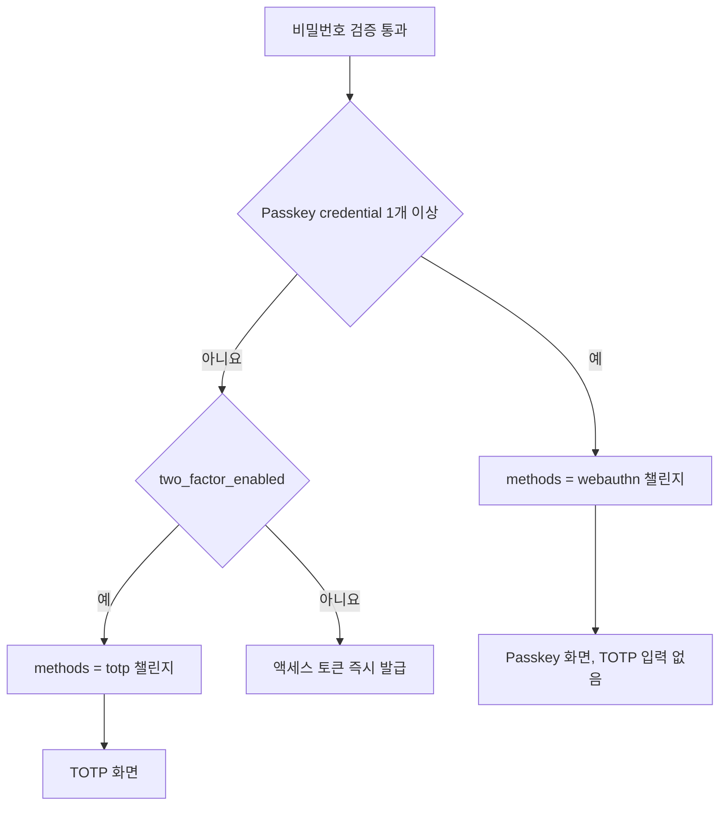
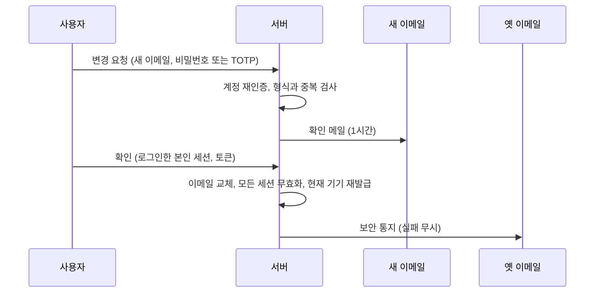
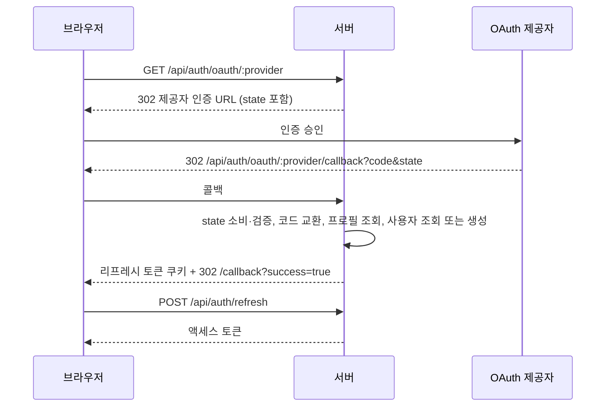

> 구현 상태: 부분 구현 (셀프 호스팅 LDAP·SAML 인증은 미구현) · 원문: `spec/5-system/1-auth.md` (§1.1~§1.4, §5, Rationale), `spec/2-navigation/10-auth-flow.md` (§1~§5, §8, Rationale), `spec/2-navigation/9-user-profile.md` (§2.0·§2.2 이메일 변경·2단계 인증 설정, §6.1 이메일 변경 행) · 용어: [용어 사전](../CLE-GLOSSARY.md)

## 개요

이 문서는 사용자가 계정을 만들고 로그인하는 방법을 정한다. 이메일·비밀번호 가입과 이메일 인증, 로그인, 2단계 인증(2FA, TOTP 와 Passkey·보안 키), 소셜 로그인(OAuth login, `auth_oauth_state`), 비밀번호 재설정(password reset), 이메일 변경(email change, `pendingEmail`)의 화면과 API 가 범위다.

인증 화면은 사이드바가 없는 전체 화면 레이아웃을 쓴다. 가입·로그인·2단계 인증·비밀번호 재설정·OAuth 콜백 화면이 모두 이 레이아웃 안에 있다. 이메일 변경은 로그인한 사용자가 내 프로필에서 시작하지만 로그인 식별자를 바꾸는 절차라서 이 문서가 흐름과 API 를 소유한다.

범위 밖 주제는 다음 문서가 정한다.

- 액세스 토큰·리프레시 토큰, 로그인 세션, 로그인 유지, 로그아웃, 계정 재인증 에러 코드, 라우트 가드: [세션과 토큰](CLE-ACCT-SESSION.md)
- 초대 링크로 하는 가입, 첫 개인 워크스페이스 자동 생성, 역할과 권한: [워크스페이스와 멤버](CLE-ACCT-WS.md)
- 내 프로필 화면과 비밀번호 변경: [내 프로필](CLE-ACCT-PROFILE.md)
- 테이블 컬럼, 서버 시퀀스, 상태 전이: [계정과 워크스페이스 데이터 흐름](CLE-ACCT-DATA.md)
- 감사 로그 액션(`user.*`)과 로그인 이력 이벤트·보존: [감사 로그](../CLE-OBS/CLE-OBS-AUDIT.md)
- 웹훅 호출자 인증인 인증 설정(AuthConfig): [외부 호출 인증 설정](../CLE-TRIG/CLE-TRIG-AUTHCFG.md)

## 요구사항

- REQ-SIGNIN-001 WHEN 사용자가 이메일과 비밀번호로 가입하면 THE SYSTEM SHALL 이메일 인증을 마친 뒤에만 계정을 활성화한다.
- REQ-SIGNIN-002 WHEN 사용자가 비밀번호를 정하면 THE SYSTEM SHALL 8자 이상이고 대문자·소문자·숫자·특수문자 중 3가지 이상을 섞은 비밀번호만 받는다.
- REQ-SIGNIN-003 WHEN 비밀번호를 저장하면 THE SYSTEM SHALL cost factor 12 이상의 bcrypt 해시로 저장하고 OAuth 전용 계정은 `password_hash` 를 NULL 로 둔다.
- REQ-SIGNIN-004 IF 로그인이 5번 연속 실패하면 THE SYSTEM SHALL 계정을 10분 동안 잠그고 `ACCOUNT_LOCKED` 로 거부한다.
- REQ-SIGNIN-005 IF 계정이 잠기면 THE SYSTEM SHALL 이메일 알림을 보내지 않고 로그인 이력과 `ACCOUNT_LOCKED` 에러 코드로만 알린다.
- REQ-SIGNIN-006 WHEN 이메일 인증·비밀번호 재설정·이메일 변경 토큰을 발급하면 THE SYSTEM SHALL 원래 토큰은 메일 링크로만 보내고 DB 에는 SHA-256 해시만 저장한다.
- REQ-SIGNIN-007 WHEN 가입 폼의 이메일 입력란에서 포커스가 빠지면 THE SYSTEM SHALL 형식을 검사하고 `POST /api/auth/check-email` 로 중복 여부를 확인한다.
- REQ-SIGNIN-008 IF 가입 폼의 약관 동의가 체크되지 않았으면 THE SYSTEM SHALL 가입 버튼을 비활성화한다.
- REQ-SIGNIN-009 WHILE 사용자가 비밀번호를 입력하는 동안 THE SYSTEM SHALL 5단계 비밀번호 강도 바를 보여 준다.
- REQ-SIGNIN-010 WHEN 초대 토큰 없이 가입이 성공하면 THE SYSTEM SHALL 토큰을 발급하지 않고 이메일 인증 안내 화면으로 보낸다.
- REQ-SIGNIN-011 WHEN 사용자가 이메일 인증 링크를 열면 THE SYSTEM SHALL 24시간 안의 토큰인지 검증하고 개인 워크스페이스를 만든 뒤 자동 로그인해 대시보드로 보낸다.
- REQ-SIGNIN-012 WHEN 인증 메일 재발송을 요청받으면 THE SYSTEM SHALL 계정 존재·인증 여부와 상관없이 같은 응답을 주고 24시간짜리 인증 토큰을 다시 보낸다.
- REQ-SIGNIN-013 WHEN 사용자가 인증 안내 화면이나 재설정 안내 화면에서 재발송 버튼을 누르면 THE SYSTEM SHALL 60초 쿨다운을 적용한다.
- REQ-SIGNIN-014 IF 로그인이 실패하면 THE SYSTEM SHALL 실패 이유를 드러내지 않는 같은 문구를 보여 준다.
- REQ-SIGNIN-015 WHEN 비밀번호 검증을 통과한 사용자에게 Passkey·보안 키가 1개 이상 있으면 THE SYSTEM SHALL `methods: ['webauthn']` 챌린지를 주고 TOTP 입력을 제공하지 않는다.
- REQ-SIGNIN-016 WHEN 비밀번호 검증을 통과한 사용자에게 Passkey 가 없고 TOTP 가 켜져 있으면 THE SYSTEM SHALL `methods: ['totp']` 챌린지를 준다.
- REQ-SIGNIN-017 WHEN 비밀번호 검증을 통과한 사용자에게 2단계 인증이 없으면 THE SYSTEM SHALL 바로 액세스 토큰을 발급한다.
- REQ-SIGNIN-018 IF Passkey 인증이 실패하면 THE SYSTEM SHALL 같은 화면에서 Passkey 복구 코드 입력만 제공하고 TOTP 화면으로 자동 전환하지 않는다.
- REQ-SIGNIN-019 WHEN 클라이언트가 로그인 응답을 받으면 THE SYSTEM SHALL `requires2fa` 와 `methods[0]` 만 보고 2단계 화면을 고른다.
- REQ-SIGNIN-020 WHEN TOTP 활성화 검증이 성공하면 THE SYSTEM SHALL TOTP 복구 코드 10개를 한 번만 평문으로 보여 주고 SHA-256 해시로 저장한다.
- REQ-SIGNIN-021 WHEN 사용자가 첫 Passkey 를 등록하면 THE SYSTEM SHALL TOTP 복구 코드와 분리된 Passkey 복구 코드 10개를 한 번만 평문으로 보여 준다.
- REQ-SIGNIN-022 WHEN 복구 코드로 2단계 인증을 통과하면 THE SYSTEM SHALL 그 코드를 해당 코드 묶음에서 지운다.
- REQ-SIGNIN-023 WHEN 사용자가 TOTP 를 끄면 THE SYSTEM SHALL 비밀번호 재확인과 TOTP 코드 확인을 모두 통과한 뒤에만 TOTP secret 과 TOTP 복구 코드를 비운다.
- REQ-SIGNIN-024 WHEN 사용자가 마지막 Passkey 를 삭제하면 THE SYSTEM SHALL 애플리케이션 계층에서 Passkey 복구 코드를 NULL 로 비운다.
- REQ-SIGNIN-025 WHEN 사용자가 Passkey 복구 코드 재발급을 요청하면 THE SYSTEM SHALL 비밀번호 재확인 뒤 기존 미사용 코드를 버리고 10개를 새로 발급한다.
- REQ-SIGNIN-026 IF `WEBAUTHN_RP_ID`·`WEBAUTHN_ORIGIN` 이 설정되지 않았고 `WEBAUTHN_ALLOW_FALLBACK=1` 도 아니면 THE SYSTEM SHALL 부팅은 계속하되 Passkey 엔드포인트를 모두 503 `WEBAUTHN_DISABLED` 로 응답한다.
- REQ-SIGNIN-027 WHILE Passkey 기능이 꺼져 있는 동안 THE SYSTEM SHALL 로그인 분기에서 credential 이 없는 것으로 취급하고 저장된 credential 행은 보존한다.
- REQ-SIGNIN-028 IF Passkey 인증기의 sign counter 가 저장값 이하로 돌아가면 THE SYSTEM SHALL 그 credential 행을 즉시 삭제하고 사용자의 활성 리프레시 토큰을 모두 무효화한다.
- REQ-SIGNIN-029 IF sign counter 역행으로 credential 을 삭제하면 THE SYSTEM SHALL 로그인 이력에 `webauthn_failed`(`failure_reason=WEBAUTHN_COUNTER_REGRESSION`)를 남긴다.
- REQ-SIGNIN-030 WHEN 같은 assertion 으로 Passkey 인증 요청이 동시에 오면 THE SYSTEM SHALL credential 행을 잠그는 단일 트랜잭션으로 처리해 한 요청만 통과시킨다.
- REQ-SIGNIN-031 WHEN 비밀번호 재설정을 요청받으면 THE SYSTEM SHALL 계정 존재·가입 경로와 상관없이 같은 응답을 주고 메일 발송 실패도 드러내지 않는다.
- REQ-SIGNIN-032 WHEN 이메일을 가진 사용자가 비밀번호 재설정을 요청하면 THE SYSTEM SHALL OAuth 전용 계정과 Passkey 보유 계정을 포함해 30분짜리 재설정 토큰을 메일로 보낸다.
- REQ-SIGNIN-033 WHEN 비밀번호 재설정이 성공하면 THE SYSTEM SHALL 그 사용자의 리프레시 토큰을 모두 무효화하고 새 세션 없이 로그인 화면으로 보낸다.
- REQ-SIGNIN-034 WHEN 비밀번호 재설정이 성공하면 THE SYSTEM SHALL Passkey credential 과 복구 코드를 그대로 보존한다.
- REQ-SIGNIN-035 IF 재설정 토큰이 만료됐거나 무효이면 THE SYSTEM SHALL 400 `VALIDATION_ERROR` 로 거부하고 화면에 재요청 링크를 보여 준다.
- REQ-SIGNIN-036 WHEN 재설정 토큰을 한 번 쓰면 THE SYSTEM SHALL 그 토큰을 바로 무효화한다.
- REQ-SIGNIN-037 WHEN 사용자가 이메일 변경을 시작하면 THE SYSTEM SHALL 비밀번호 또는 등록된 TOTP 로 계정 재인증을 요구한다.
- REQ-SIGNIN-038 IF 비밀번호도 2단계 인증도 없는 OAuth 전용 계정이 이메일 변경을 시작하면 THE SYSTEM SHALL 403 `REAUTH_NOT_AVAILABLE` 로 막는다.
- REQ-SIGNIN-039 WHEN 이메일 변경을 시작하면 THE SYSTEM SHALL 새 이메일로만 1시간짜리 확인 메일을 보내고 옛 이메일 확인을 차단 조건으로 쓰지 않는다.
- REQ-SIGNIN-040 WHEN 이메일 변경 확인 토큰을 소비하면 THE SYSTEM SHALL 로그인한 본인 세션의 요청만 받는다.
- REQ-SIGNIN-041 WHEN 이메일 변경이 확정되면 THE SYSTEM SHALL 모든 로그인 세션을 무효화하고 현재 기기에 새 세션을 발급한다.
- REQ-SIGNIN-042 WHEN 이메일 변경이 확정되면 THE SYSTEM SHALL 옛 이메일에 보안 통지를 보내고 발송 실패는 무시한다.
- REQ-SIGNIN-043 WHEN 이메일 변경이 확정되면 THE SYSTEM SHALL 감사 로그 `user.email_changed` 를 남기되 details 에 원래 이메일 값을 담지 않는다.
- REQ-SIGNIN-044 IF 새 이메일을 다른 계정이 쓰고 있으면 THE SYSTEM SHALL 409 `RESOURCE_CONFLICT` 로 거부한다.
- REQ-SIGNIN-045 IF 이메일 변경 시작 단계의 확인 메일 발송이 실패하면 THE SYSTEM SHALL 대기 중 변경 정보를 지우고 에러를 돌려준다.
- REQ-SIGNIN-046 IF 확인 메일 재발송이 실패하면 THE SYSTEM SHALL 새로 만든 토큰을 유지해 재발송으로 복구할 수 있게 한다.
- REQ-SIGNIN-047 WHEN 대기 중 이메일 변경이 있는 상태에서 다시 요청하면 THE SYSTEM SHALL 기존 토큰을 덮어써 유효한 토큰을 0~1개로 유지한다.
- REQ-SIGNIN-048 WHEN 가입·로그인 화면을 열면 THE SYSTEM SHALL 자격 증명이 설정된 OAuth 제공자만 소셜 로그인 버튼으로 보여 준다.
- REQ-SIGNIN-049 IF 활성 OAuth 제공자 목록 조회가 실패하면 THE SYSTEM SHALL 빈 목록으로 처리해 소셜 로그인 UI 를 숨긴다.
- REQ-SIGNIN-050 WHEN 소셜 로그인 이메일이 기존 계정 이메일과 같으면 THE SYSTEM SHALL 그 계정에 OAuth 제공자 정보를 연결한다.
- REQ-SIGNIN-051 WHEN 사용자가 처음 소셜 로그인하면 THE SYSTEM SHALL 자동으로 가입시키고 개인 워크스페이스를 만든다.
- REQ-SIGNIN-052 WHEN OAuth 콜백을 받으면 THE SYSTEM SHALL 서버가 발급한 `state` 를 한 번만 소비해 검증한다.
- REQ-SIGNIN-053 WHEN 소셜 로그인이 성공하면 THE SYSTEM SHALL 액세스 토큰을 URL 에 싣지 않고 리프레시 토큰만 쿠키로 설정한 뒤 `/callback?success=true` 로 보낸다.
- REQ-SIGNIN-054 IF OAuth 흐름이 실패하면 THE SYSTEM SHALL `/callback?error=<code>` 로 보내 에러 메시지와 다시 시도 버튼을 보여 준다.
- REQ-SIGNIN-055 IF 셀프 호스팅 운영자가 추가 인증 방식을 선택하면 THE SYSTEM SHALL LDAP·Active Directory 와 SAML 2.0 인증을 제공한다. (미구현)
- REQ-SIGNIN-056 WHEN TOTP 끄기 요청의 코드를 확인하면 THE SYSTEM SHALL 로그인 2단계와 같은 규칙으로 인증 앱의 6자리 코드나 TOTP 복구 코드를 받는다.
- REQ-SIGNIN-057 IF TOTP 끄기 요청의 코드가 맞지 않거나 TOTP 가 켜져 있지 않으면 THE SYSTEM SHALL 401 `TOTP_INVALID` 로 거부하고 2단계 인증 상태를 바꾸지 않는다.
- REQ-SIGNIN-058 WHEN 사용자가 TOTP 를 끄면 THE SYSTEM SHALL Passkey credential 과 Passkey 복구 코드를 그대로 둔다.
- REQ-SIGNIN-059 WHEN TOTP 끄기 요청을 받으면 THE SYSTEM SHALL 사용자당 분당 10회로 요청을 제한한다.

## 인증 화면 공통

인증 화면은 사이드바 없는 전체 화면 레이아웃에 가운데 카드 하나를 둔다.

| 영역 | 위치 | 들어가는 요소 | 동작 |
| --- | --- | --- | --- |
| 배경 | 화면 전체 | 제품 브랜드 색상 또는 그래디언트 | 현재 구현은 Shadcn neutral 그래디언트다 |
| 카드 | 화면 가운데 | 최대 너비 400px 카드 | 모바일에서는 전체 너비로 늘어난다 |
| 로고 | 카드 상단 | Full logo 변종 | 변종과 라이트·다크 선택은 [브랜드](../CLE-UI/CLE-UI-BRAND.md) 의 매트릭스를 따른다 |
| 폼 | 카드 본문 | 화면별 입력 폼 | 아래 각 절 |

인증 페이지는 Next.js route group `(auth)` 로 묶여 URL 에 `/auth` 접두사가 붙지 않는다. 실제 경로는 `/login`, `/register`, `/verify-email`, `/forgot-password`, `/reset-password`, `/callback` 이다. 이 문서에서 `/api/auth/...` 는 백엔드 API 경로이고 `/login` 같은 경로는 화면 경로다. 라우트 가드와 공개 경로 목록은 [세션과 토큰](CLE-ACCT-SESSION.md) 이 정한다.

## 가입

### 가입 화면

| 영역 | 위치 | 들어가는 요소 | 동작 |
| --- | --- | --- | --- |
| 제목 | 카드 상단 | "Create your account" | 없음 |
| 입력 폼 | 제목 아래 | Name, Email, Password 입력란과 비밀번호 강도 바 | 아래 필드 검증 표 |
| 약관 동의 | 입력 폼 아래 | "I agree to Terms of Service" 체크박스 | 체크하지 않으면 가입 버튼 비활성 |
| 가입 버튼 | 약관 아래 | "Create Account" | 가입 요청 |
| 소셜 로그인 | 가입 버튼 아래 | "or continue with" 구분선, Google·GitHub 버튼 | [소셜 로그인](#소셜-로그인) 의 제공자 노출 규칙 |
| 로그인 링크 | 카드 하단 | "Already have an account? → Sign in" | 로그인 화면으로 이동 |

### 필드 검증

| 필드 | 검증 규칙 | 실시간 피드백 |
| --- | --- | --- |
| Name | 필수, 2~50자 | 입력 즉시 |
| Email | 필수, 이메일 형식 | 포커스가 빠질 때 형식 검증과 `POST /api/auth/check-email` 중복 확인(가입 폼 `onBlur` 가 `checkEmailAvailability` 를 부른다) |
| Password | 필수, 8자 이상 100자 이하, 대문자·소문자·숫자·특수문자 중 3가지 이상 | 입력 중 강도 바 표시 |
| Terms | 필수 체크 | 체크하지 않으면 버튼 비활성 |

### 비밀번호 강도 바

8자 이상·소문자·대문자·숫자·특수문자 다섯 기준을 1점씩 더한 `score`(0~5)로 다섯 단계 라벨을 보여 준다(`codebase/frontend/src/lib/utils/password.ts`).

| 강도 라벨 (i18n key) | score | 색상 |
| --- | --- | --- |
| 약함 (`auth.register.strengthWeak`) | 0~1 | 빨강 (`bg-red-500`) |
| 보통 (`auth.register.strengthFair`) | 2 | 주황 |
| 양호 (`auth.register.strengthGood`) | 3 | 노랑 |
| 강함 (`auth.register.strengthStrong`) | 4 | 연초록 (`green-400`) |
| 매우 강함 (`auth.register.strengthVeryStrong`) | 5 | 진초록 (`green-600`) |

### 가입 처리

1. 클라이언트가 입력을 검증한다.
2. `POST /api/auth/register { name, email, password, termsAccepted, invitationToken? }` 을 호출한다. 서버는 `termsAccepted` 가 `true` 가 아니면 400 `VALIDATION_ERROR` 로 거부한다.
3. 초대 토큰 없는 가입이 성공하면 이메일 인증 안내 화면으로 이동한다. 서버는 사용자 행과 인증 메일만 만들고 토큰·쿠키·개인 워크스페이스는 만들지 않는다.
4. 실패하면 이메일 중복 같은 에러를 인라인으로 보여 준다.

`invitationToken` 을 담은 가입은 인증 메일 없이 한 트랜잭션에서 사용자와 멤버십을 만들고 바로 로그인한다. 이 경로의 화면과 규칙은 [워크스페이스와 멤버](CLE-ACCT-WS.md) 의 초대 절이 정한다.

### 이메일 인증 안내 화면

| 영역 | 위치 | 들어가는 요소 | 동작 |
| --- | --- | --- | --- |
| 제목 | 카드 상단 | "Verify your email" | 없음 |
| 안내 | 제목 아래 | 인증 링크를 보낸 이메일 주소 | 없음 |
| 재발송 버튼 | 안내 아래 | "Resend Email" | `POST /api/auth/resend-verification` 호출, 60초 쿨다운(`RESEND_COOLDOWN_SECONDS = 60`, `verify-email-content.tsx`) |
| 로그인 링크 | 카드 하단 | "Back to login" | 로그인 화면으로 이동 |

- 인증 링크는 `?token=` 쿼리로 토큰을 전달한다. 인증 페이지는 그 토큰을 요청 본문에 담아 `POST /api/auth/verify-email { token }` 을 호출한다.
- 인증에 성공하면 자동 로그인하고 개인 워크스페이스를 만든 뒤 대시보드(`/dashboard`)로 보낸다. 개인 워크스페이스 생성 규칙은 [워크스페이스와 멤버](CLE-ACCT-WS.md) 가 정한다.
- 인증 토큰은 24시간 동안 유효하다.
- 인증 메일 재발송 API 는 IP 당 분당 5회로 제한하고 이메일 존재 여부를 드러내지 않는 같은 응답을 준다.

## 이메일·비밀번호 인증 규칙

| 항목 | 규칙 |
| --- | --- |
| 가입 | 이메일과 비밀번호로 가입한다. 이메일 인증이 필수다 |
| 비밀번호 정책 | 8자 이상, 대문자·소문자·숫자·특수문자 중 3가지 이상 조합 |
| 비밀번호 저장 | bcrypt(cost factor 12 이상). `user.password_hash` 는 nullable 이고 OAuth 전용 계정(OAuth-only account, `password_hash IS NULL`)은 NULL 이다 |
| 로그인 | 이메일과 비밀번호를 검증한 뒤 JWT 를 발급한다. 토큰 형태는 [세션과 토큰](CLE-ACCT-SESSION.md) |
| 비밀번호 분실 | 이메일로 30분짜리 재설정 링크를 보낸다. 이메일이 있는 모든 사용자에게 발급한다([비밀번호 재설정](#비밀번호-재설정)) |
| 로그인 실패 | 5회 연속 실패하면 10분 잠금. 이메일 알림은 없다 |
| 토큰 저장 | 이메일 인증 토큰(`emailVerifyToken`)·비밀번호 재설정 토큰(`passwordResetToken`)·이메일 변경 토큰(`emailChangeToken`)은 SHA-256 해시로만 저장한다. 원래 토큰은 메일 링크로만 전달하고 DB 에 두지 않는다. 검증할 때는 입력 토큰을 같은 해시로 바꿔 비교한다 |
| 인증 메일 재발송 | `POST /api/auth/resend-verification`. IP 당 분당 5회, 이메일 존재 여부와 상관없이 같은 응답. 새 인증 토큰은 24시간 유효 |

계정 잠금(account lock, `ACCOUNT_LOCKED`)은 `login_attempts` 가 5에 이르면 `locked_until = now + 10분` 으로 건다. 잠긴 동안 로그인하면 401 `ACCOUNT_LOCKED` 를 돌려주고 로그인 이력에 `login_failed`(`reason=ACCOUNT_LOCKED`)를 남긴다. 로그인이 성공하면 카운터와 잠금을 지운다. 상태 전이는 [계정과 워크스페이스 데이터 흐름](CLE-ACCT-DATA.md) 에 있다. IP 단위 요청 한도는 계정 잠금과 별개의 방어다. 한 IP 가 여러 계정을 도는 credential stuffing 은 요청 한도가 먼저 막고, 여러 IP 에서 한 계정을 노리는 공격은 계정 잠금이 막는다.

## 로그인

### 로그인 화면

| 영역 | 위치 | 들어가는 요소 | 동작 |
| --- | --- | --- | --- |
| 제목 | 카드 상단 | "Sign in to your account" | 없음 |
| 입력 폼 | 제목 아래 | Email, Password 입력란 | 이메일 형식과 빈 비밀번호 검사 |
| 로그인 유지 | 입력 폼 아래 | "Remember me" 체크박스 | 리프레시 토큰 수명을 7일에서 30일로 늘린다([세션과 토큰](CLE-ACCT-SESSION.md)). 첫 토큰 회전 뒤 수명은 [세션과 토큰](CLE-ACCT-SESSION.md#미결-사항) 의 미결 사항이다(NERV Task `CLE-T-BYCGF1`) |
| 비밀번호 분실 링크 | 체크박스 옆 | "Forgot password?" | 비밀번호 재설정 화면으로 이동 |
| 로그인 버튼 | 폼 아래 | "Sign In" | 로그인 요청 |
| 소셜 로그인 | 버튼 아래 | "or continue with" 구분선, Google·GitHub 버튼 | [소셜 로그인](#소셜-로그인) |
| 가입 링크 | 카드 하단 | "Don't have an account? → Create account" | 가입 화면으로 이동 |

### 로그인 처리

1. 이메일 형식과 비밀번호가 비어 있지 않은지 검사한다.
2. `POST /api/auth/login { email, password, rememberMe }` 을 호출한다.
3. 2단계 인증이 없으면 서버는 `{ accessToken }` 과 리프레시 토큰 쿠키를 돌려주고 화면은 대시보드(`/dashboard`)로 이동한다. 응답 본문에 `user` 객체는 없다.
4. 2단계 인증이 있으면 서버는 `{ requires2fa, methods, challengeToken }` 을 돌려주고 화면은 2단계 인증 화면으로 이동한다.
5. 로그인이 실패하면 "Invalid email or password" 를 보여 준다. 구체적인 이유는 드러내지 않는다.
6. 5회 실패로 잠기면 "Account locked. Try again in 10 minutes." 를 보여 준다.

로그인 뒤 이동할 곳(`redirect` 파라미터와 기본 `/dashboard` 처리)은 [세션과 토큰](CLE-ACCT-SESSION.md) 이 정한다.

### 2단계 인증 방식 선택

비밀번호 검증을 통과하면 서버가 등록 상태를 보고 2단계를 고른다. Passkey·보안 키(WebAuthn, `WebAuthnCredential`)가 있으면 그것만 쓰고, 없을 때만 TOTP 를 쓴다. TOTP 로 자동 전환하지 않는 것이 핵심 규칙이다.

| 사용자 상태 | 응답 | 로그인 2단계 화면 |
| --- | --- | --- |
| Passkey credential 1개 이상 | `{ requires2fa: true, methods: ['webauthn'], challengeToken }` | Passkey 인증 화면. TOTP 코드 입력란은 숨긴다 |
| Passkey 0개이고 `two_factor_enabled = true` | `{ requires2fa: true, methods: ['totp'], challengeToken }` | TOTP 입력 화면 |
| 둘 다 없음 | `{ accessToken }` (즉시 로그인) | 없음 |

- Passkey 가 하나라도 등록된 사용자에게는 로그인 화면에서 TOTP 입력을 주지 않는다. TOTP 로 로그인하려면 보안 설정에서 Passkey 를 먼저 모두 삭제해야 한다.
- Passkey 인증이 실패하면 같은 화면의 "복구 코드 사용" 링크로 Passkey 전용 복구 코드 입력란을 연다. TOTP 화면으로 자동 전환하지 않는다.
- 클라이언트는 `requires2fa` 와 `methods` 만 본다. `requires2fa=true` 이면 챌린지 단계이고 `methods[0]` 으로 화면을 가른다. 로그인 응답에 `requiresTotp` 필드는 없다.
- 챌린지 토큰(`challengeToken`)은 비밀번호를 통과한 뒤 2단계 검증을 부를 때 쓰는 단기 토큰(`mfa_challenge` JWT)이다.

### TOTP 입력 화면

| 영역 | 위치 | 들어가는 요소 | 동작 |
| --- | --- | --- | --- |
| 제목·안내 | 카드 상단 | "Two-factor authentication", 인증 앱의 6자리 코드를 넣으라는 안내 | 없음 |
| 코드 입력 | 안내 아래 | 6칸 숫자 입력 | 한 칸을 채우면 다음 칸으로 포커스 이동 |
| 복구 코드 링크 | 입력 아래 | "Use a recovery code" | 단일 입력 필드로 바뀐다 |
| 버튼 | 카드 하단 | "Verify", "← Back" | 검증 요청, 로그인 화면으로 돌아가기 |

- `POST /api/auth/login/totp { challengeToken, code }` 로 검증한다. `code` 에는 6자리 코드나 TOTP 복구 코드를 넣는다.
- 성공하면 액세스 토큰과 리프레시 토큰을 발급하고 이동한다.
- 실패하면 "Invalid code. Please try again." 를 보여 주고 로그인 이력에 `totp_failed` 를 남긴다.

### Passkey 인증 화면

| 영역 | 위치 | 들어가는 요소 | 동작 |
| --- | --- | --- | --- |
| 제목·안내 | 카드 상단 | "Two-factor authentication", Passkey 나 보안 키로 로그인하라는 안내 | 없음 |
| 인증 버튼 | 안내 아래 | "Use Passkey / Key" | 브라우저 인증기 호출 |
| 복구 코드 링크 | 버튼 아래 | "Use a recovery code" | Passkey 복구 코드 입력란 표시 |
| 뒤로 | 카드 하단 | "← Back" | 로그인 화면으로 돌아가기 |

- 페이지가 열리면 자동으로 `navigator.credentials.get()` 흐름에 들어간다.
- `POST /api/auth/2fa/webauthn/authenticate/options { challengeToken }` 로 `optionsToken` 과 요청 옵션을 받는다.
- 사용자가 인증기를 쓰면 `POST /api/auth/2fa/webauthn/authenticate/verify { challengeToken, optionsToken, response }` 를 호출한다.
- 실패하면 같은 화면의 "Use a recovery code" 링크로 입력란을 열고 `POST /api/auth/2fa/webauthn/recovery { challengeToken, code }` 를 호출한다.
- 브라우저가 WebAuthn 을 지원하지 않거나 인증기에 접근할 수 없으면 안내문과 복구 코드 입력 링크만 보여 준다.

## 2단계 인증

두 방식을 지원한다. 한 사용자가 둘 다 등록할 수 있고 등록은 서로 독립이다.

| 방식 | 설명 |
| --- | --- |
| TOTP | 인증 앱이 만드는 시간 기반 6자리 코드. Google Authenticator·Authy 같은 RFC 6238 클라이언트와 호환한다. QR 코드를 스캔하고 6자리 코드를 넣으면 켜진다. `two_factor_enabled` 는 TOTP 사용 여부만 뜻한다 |
| Passkey·보안 키 | FIDO2·WebAuthn 표준. `@simplewebauthn/server` 와 `@simplewebauthn/browser` 로 구현한다. 한 사용자가 모바일·데스크톱·보안 키처럼 credential 을 여러 개 등록할 수 있다 |

### 2단계 인증 설정 화면

보안 설정 화면은 `/profile/security` 이다. 내 프로필의 보안 카드에서 링크로 들어온다. 화면은 두 카드로 나뉜다.

| 카드 | 들어가는 요소 | 동작 |
| --- | --- | --- |
| TOTP | QR 코드, 확인 코드 입력, 복구 코드 표시, 끄기 폼(비밀번호와 인증 코드 입력) | 인증 앱으로 QR 을 스캔하고 코드를 넣어 켠다. 켜질 때 복구 코드 10개를 한 번 보여 준다. 끌 때는 비밀번호와 인증 코드를 함께 넣는다([TOTP 끄기](#totp-끄기)) |
| Passkey · 보안 키 | credential 목록(이름·transport·마지막 사용·등록일), 등록 버튼, 이름 변경·삭제, 복구 코드 재발급 | credential 을 여러 개 등록하고 관리한다. 첫 등록 때 별도 복구 코드 10개를 한 번 보여 준다 |

- 프론트엔드는 보안 화면을 열 때 `GET /api/auth/2fa/webauthn/availability` 를 불러 Passkey 카드를 보일지 정한다.
- 비밀번호 재확인(password re-check, `verifyPasswordForUser`)의 에러 코드는 [세션과 토큰](CLE-ACCT-SESSION.md) 이 정한다.
- OAuth 전용 계정이 유일한 2단계 인증 수단을 끌 때 대안 로그인 경로를 어떻게 보장할지는 아직 정하지 않았다. TOTP 끄기는 비밀번호를 먼저 확인하므로 OAuth 전용 계정은 비밀번호를 추가하기 전에는 TOTP 를 끌 수 없다. Passkey 삭제에는 따로 막는 로직이 없다. 강제 2단계 인증 정책·계정 복구 흐름과 함께 정할 별개 사안이다.

### TOTP 끄기

TOTP 를 끄려면 비밀번호와 인증 코드를 함께 넣는다. 인증 코드는 로그인 2단계와 같이 인증 앱의 6자리 코드나 TOTP 복구 코드다. TOTP 가 켜져 있으면 TOTP 카드에 비밀번호 입력란, 코드 입력란, 끄기 버튼이 보인다. 비밀번호가 8자보다 짧거나 코드가 비어 있으면 화면은 요청을 보내지 않고 안내를 띄운다.

서버는 `POST /api/auth/2fa/disable { password, code }` 를 다음 순서로 처리한다.

1. 본문을 검증한다. `password` 는 8자 이상, `code` 는 6~32자 문자열이다. 빠지거나 형식이 틀리면 400 `VALIDATION_ERROR` 다.
2. 비밀번호를 확인한다(`AuthService.verifyPasswordForUser`). 비밀번호가 없는 계정은 401 `PASSWORD_REQUIRED`, 틀리면 401 `PASSWORD_INVALID` 다. 여기서 실패하면 코드는 확인하지 않는다.
3. 코드를 확인한다(`TotpService.verifyForDisable`). 로그인 2단계와 같은 `verifyForLogin` 을 쓴다. 복구 코드로 통과하면 로그인 때처럼 그 코드를 소비한다. 맞지 않으면 401 `TOTP_INVALID` 다. TOTP 가 켜져 있지 않을 때도 401 `TOTP_INVALID` 다.
4. TOTP 를 끈다. `two_factor_enabled` 를 false 로 바꾸고 TOTP secret 과 남은 TOTP 복구 코드를 NULL 로 비운다. 감사 로그 `user.2fa_disabled` 를 남기고 200 `{ ok: true }` 를 돌려준다.

- Passkey credential 과 Passkey 복구 코드는 건드리지 않는다. Passkey 복구 코드는 TOTP 복구 코드 묶음에 없으므로 코드 입력란에 넣으면 401 `TOTP_INVALID` 다.
- 요청은 사용자당 분당 10회로 제한한다(`SENSITIVE_ACTION_THROTTLE`). 비밀번호를 아는 사람이 6자리 코드를 추측하는 속도를 늦추기 위해서다.
- 코드 확인 실패는 로그인 이력에 남기지 않는다. 로그인 이력의 `totp_failed` 는 로그인 2단계 실패만 뜻한다.
- 화면은 비밀번호 실패와 코드 실패를 나누지 않고 같은 실패 안내를 보여 준다.
- OAuth 전용 계정은 비밀번호가 없어 2번에서 `PASSWORD_REQUIRED` 로 막힌다. [비밀번호 재설정](#비밀번호-재설정) 으로 비밀번호를 추가한 뒤 끈다.
- 켜진 상태의 setup/verify 가 닫히기 전까지는 로그인 세션을 가진 사람이 새 secret 으로 이 확인을 통과할 수 있다(NERV Task `CLE-T-94FTMV`). 이 문제는 [미결 사항](#미결-사항) 에 있다.

### 복구 코드

복구 코드(recovery code, `totp_recovery_codes`, `webauthn_recovery_codes`)는 2단계 인증 수단을 잃었을 때 쓰는 일회용 코드다. TOTP 와 Passkey 가 코드 묶음을 따로 쓴다.

| 항목 | TOTP | Passkey |
| --- | --- | --- |
| 발급 시점 | TOTP 활성화 검증 성공 시 | 첫 credential 등록 검증 성공 시 |
| 개수·형식 | 10개, `xxxx-xxxx-xxxx` | 10개, 같은 형식 |
| 저장 | `user.totp_recovery_codes`: SHA-256 해시 배열, 쓰면 항목 제거 | `user.webauthn_recovery_codes`: SHA-256 해시 배열, 쓰면 항목 제거. TOTP 와 분리 |
| 폐기 | TOTP 를 끄면 NULL | 모든 credential 을 삭제하면 NULL. 사용자가 명시적으로 재발급할 수도 있다 |
| 사용 화면 | 로그인 2단계의 "복구 코드 사용" 링크, [TOTP 끄기](#totp-끄기) 의 코드 입력란 | 로그인 2단계의 "복구 코드 사용" 링크. 별도 코드 묶음에서 검증한다 |

두 묶음을 나누는 이유는 한쪽을 꺼도 다른 쪽 복구가 계속 유효하게 하기 위해서다. TOTP 쪽 복구 코드 재발급 API 는 없다. 끄고 다시 켜면 새로 발급된다. 인증 앱을 잃은 사용자도 TOTP 복구 코드로 TOTP 를 끈 뒤 다시 켤 수 있다.

### Passkey 기능 켜기와 환경 변수

Passkey 는 운영자가 환경 변수를 설정해야 켜지는 선택 기능이다. 셀프 호스팅 도메인이 SaaS 와 다르다는 전제 때문이다. 두 핵심 변수가 모두 있을 때만 켜지고 빠지면 자동 폴백하지 않는다. 운영 도메인과 어긋난 rpID 로 등록하면 이후 인증이 모두 실패해 사용자가 잠기기 때문이다. 설정은 `codebase/backend/src/common/config/webauthn.config.ts` 의 `registerAs('webauthn', ...)` 로 등록한다.

| 변수 | 용도 | 예 |
| --- | --- | --- |
| `WEBAUTHN_RP_ID` | Relying Party ID. 포트·스킴 없는 호스트명 | `clemvion.example.com` |
| `WEBAUTHN_RP_NAME` | 사용자 다이얼로그에 보일 이름. 선택, 기본 `Clemvion` | `Clemvion` |
| `WEBAUTHN_ORIGIN` | 콤마로 구분한 허용 origin 목록. 같은 RP 의 여러 origin 을 지원한다 | `https://clemvion.example.com,https://app.clemvion.example.com` |
| `WEBAUTHN_ALLOW_FALLBACK` | 선택. `1` 이면 `WEBAUTHN_RP_ID`·`WEBAUTHN_ORIGIN` 이 없어도 `FRONTEND_URL` 로 폴백해 켠다. 개발·로컬·시연 전용이고 운영에서는 쓰지 않는다 | `0` (기본) |

| 상태 | 조건 | 동작 |
| --- | --- | --- |
| 켜짐 (`enabled=true`) | 두 변수가 모두 있거나 `WEBAUTHN_ALLOW_FALLBACK=1` | 모든 Passkey 엔드포인트가 동작한다. 로그인 응답이 `methods=['webauthn']` 로 갈릴 수 있다 |
| 꺼짐 (`enabled=false`) | 변수가 없고 폴백도 허용하지 않음 | 부팅은 정상이고 warn 로그만 남긴다. Passkey 엔드포인트는 모두 `503 WEBAUTHN_DISABLED` 다. 로그인은 credential 보유와 상관없이 `webauthnCount=0` 으로 보고 `methods=['totp']` 나 즉시 로그인으로 간다. 프론트엔드는 availability 응답을 보고 Passkey UI 를 숨긴다 |

`GET /api/auth/2fa/webauthn/availability` 는 인증이 필요 없는 공개 GET 이다. 논리 응답은 `{ enabled: boolean }` 이고, 전역 응답 봉투 규칙에 따라 wire 에서는 `{ "data": { "enabled": … } }` 로 싸인다([HTTP API 규약](../CLE-API/CLE-API-CONV.md)). 클라이언트는 `res.data.enabled` 로 읽는다.

운영자가 설정을 끈 상태에서 이미 credential 을 가진 사용자가 있으면 DB 행은 보존한다. 운영자가 변수를 다시 설정하면 그대로 다시 쓴다. 꺼져 있는 동안 사용자는 TOTP 나 일반 로그인으로 들어오므로 잠기지 않는다.

### Passkey 등록·인증 흐름

등록은 `/profile/security` 의 "Passkey 등록" 에서 시작한다.

1. `POST /api/auth/2fa/webauthn/register/options` (JWT 필수). 서버가 `generateRegistrationOptions` 를 만들고 `optionsToken` JWT(`kind=webauthn_register`, 5분)를 함께 준다.
2. 클라이언트가 `navigator.credentials.create(options)` 를 호출한다.
3. `POST /api/auth/2fa/webauthn/register/verify { optionsToken, response }`. 서버가 `verifyRegistrationResponse` 로 검증하고 `webauthn_credential` 행을 만든다. 첫 등록이면 복구 코드 10개를 발급해 평문으로 한 번 돌려준다.

로그인 2단계 인증은 다음 순서다.

1. `POST /api/auth/2fa/webauthn/authenticate/options { challengeToken }`. 서버가 챌린지 토큰을 검증하고 `generateAuthenticationOptions` 와 `optionsToken`(`kind=webauthn_auth`, 5분)을 준다.
2. 클라이언트가 `navigator.credentials.get(options)` 를 호출한다.
3. `POST /api/auth/2fa/webauthn/authenticate/verify { challengeToken, optionsToken, response }`. 서버가 `verifyAuthenticationResponse` 로 검증하고 counter 를 갱신한 뒤 액세스 토큰과 리프레시 토큰 쿠키를 발급한다.

복구 코드로 통과할 때는 `POST /api/auth/2fa/webauthn/recovery { challengeToken, code }` 를 부른다. 서버는 `webauthn_recovery_codes` 해시와 비교해 맞으면 그 항목을 지우고 JWT 를 발급한다.

챌린지는 stateless JWT(`optionsToken`)로 발급하고 별도 테이블에 두지 않는다. payload 는 `{ kind, sub, challenge, exp(5분) }` 이다.

### sign counter 역행과 동시성

sign counter 가 역행하면 `verifyAuthenticationResponse` 가 거부한다. 서비스는 그 credential 행을 바로 지운다. suspend 컬럼은 두지 않는다. 이어서 그 사용자의 활성 리프레시 토큰을 모두 무효화해 복제한 공격자가 기존 토큰으로 계속 접근하지 못하게 한다. 로그인 이력에는 `webauthn_failed`(`failure_reason='WEBAUTHN_COUNTER_REGRESSION'`)를 남긴다. 사용자가 같은 인증기를 다시 쓰려면 `/profile/security` 에서 다시 등록한다.

`verifyAuthentication` 은 credential 조회·검증·counter 갱신·역행 시 삭제·리프레시 토큰 무효화를 한 트랜잭션에서 처리한다. credential 행은 `SELECT ... FOR UPDATE` 로 잠근다. 같은 assertion 으로 두 요청이 동시에 오면 한쪽은 잠금을 기다린다. 첫 요청이 counter 를 갱신하면 두 번째 요청은 갱신된 counter 를 읽고 `counter <= stored` 로 거부된다. 로그인 이력 기록은 트랜잭션 밖에서 호출해 기록 실패가 credential 삭제와 토큰 무효화 커밋을 막지 않게 한다.

## 비밀번호 재설정

`POST /api/auth/forgot-password` 와 `POST /api/auth/reset-password` 는 가입 경로(이메일·비밀번호, OAuth, Passkey 보유)와 상관없이 같게 동작한다.

| 사용자 상태 | 재설정 요청 | 재설정 실행 |
| --- | --- | --- |
| 이메일·비밀번호 가입 | 재설정 토큰 발급과 메일 발송 | `password_hash` 갱신, 모든 리프레시 토큰 무효화 |
| OAuth 전용 계정 | 같은 방식으로 토큰과 메일을 보낸다. 이메일 존재 노출을 막으면서 "비밀번호 추가" 경로 역할도 한다 | NULL 이던 `password_hash` 가 채워진다. 이후 이메일·비밀번호 로그인이 된다 |
| Passkey 보유 | 같음 | `password_hash` 만 바꾼다. credential 과 복구 코드는 보존한다. 다음 로그인은 비밀번호 뒤에 Passkey 챌린지를 거친다 |
| Passkey 보유, 복구 코드와 비밀번호 분실 | 재설정 뒤 비밀번호 단계는 통과하지만 Passkey 단계를 못 넘으면 로그인할 수 없다 | 운영자가 credential 을 지워 주는 개입 경로가 필요하다 |
| 토큰 만료(30분 경과) | 다시 요청할 수 있다 | 400 `VALIDATION_ERROR` |
| 없는 이메일 | 같은 응답("If an account exists...") | 없음 |

설계 원칙은 다음과 같다.

- 재설정 요청은 사용자 존재와 가입 경로에 상관없이 같은 응답(`200 { data: { message } }`)을 준다. DB·메일 에러를 포함한 모든 실패를 드러내지 않는다.
- 비밀번호 재설정으로 Passkey credential 을 끄지 않는다. 비밀번호는 1단계 인증일 뿐이고 2단계의 신뢰 기반인 개인 키를 흔드는 사건이 아니다. 잃어버린 기기를 끄려면 사용자가 `/profile/security` 의 Passkey 카드에서 직접 삭제한다. credential 과 복구 코드를 모두 잃었으면 로그인할 수 없으므로 운영자 개입이 필요하다.
- 재설정이 성공하면 모든 활성 로그인 세션을 끝낸다. 탈취된 비밀번호 시나리오를 막기 위해서다. 새 세션은 발급하지 않고 로그인 화면으로 보낸다.
- 재설정 요청 API 는 IP 당 분당 5회로 제한한다.

### 재설정 화면

| 단계 | 화면 요소 | 동작 |
| --- | --- | --- |
| 1. 이메일 입력 | "Reset your password" 제목, 계정 이메일 입력란, "Send Reset Link" 버튼, "← Back to Sign In" 버튼 | `POST /api/auth/forgot-password { email }`. 성공과 실패 모두 같은 안내 화면으로 간다 |
| 2. 안내 | "Check your email" 제목, "If an account exists for {이메일}, we sent a password reset link." 안내, "Resend Email" 버튼, "← Back to Sign In" 버튼 | 재발송 버튼은 60초 쿨다운을 두고 `POST /api/auth/forgot-password` 를 다시 부른다(`forgot-password-form.tsx`) |
| 3. 새 비밀번호 입력 | 메일 링크로 연다. "Set new password" 제목, New Password 입력과 강도 바, Confirm Password 입력, "Reset Password" 버튼 | `POST /api/auth/reset-password { token, newPassword }` |

- 재설정이 성공하면 "Password updated. Sign in with your new password." 를 보여 주고 로그인 화면으로 이동한다.
- 토큰이 만료됐거나 무효하면 "This link has expired. Request a new one." 와 재요청 링크를 보여 준다.
- 재설정 토큰은 30분 동안 유효하고 쓰면 바로 무효가 된다.

로그인한 상태에서 현재 비밀번호를 알고 바꾸는 비밀번호 변경은 [내 프로필](CLE-ACCT-PROFILE.md) 이 정한다.

## 이메일 변경

로그인한 사용자가 자기 로그인 이메일을 바꾸는 별도 절차다. `/profile` 화면은 이메일을 읽기 전용으로 보여 주고 [변경하기 →] 로 전용 페이지 `/profile/change-email` 에 들어간다. 변경은 세 단계다.

1. 계정 재인증을 한다.
2. 새 이메일로 확인 메일을 보낸다.
3. 새 이메일의 링크를 눌러 확정한다.

### 핵심 규칙

- 계정 재인증(reauthentication, `verifyReauth`)을 거친 뒤 새 이메일만 확인한다. 변경을 시작할 때 세션 강제 종료와 같은 계정 재인증을 요구한다. 비밀번호가 있으면 비밀번호, 없으면 등록된 TOTP 코드로 확인한다. 확인 링크는 새 이메일로만 보낸다. 옛 이메일에는 막지 않는 보안 통지만 보낸다.
- 이메일 OTP 는 재인증 수단으로 쓰지 않는다. 바꾸려는 메일함과 순환되기 때문이다. Passkey 로 하는 재인증도 현재 지원하지 않는다.
- 재인증 수단이 없는 계정은 막는다. 비밀번호도 2단계 인증도 없는 OAuth 전용 계정은 `REAUTH_NOT_AVAILABLE` 로 변경할 수 없다. Passkey 만 등록한 계정은 비밀번호나 TOTP 를 설정한 뒤 이메일을 바꿀 수 있다.
- 변경 확인 토큰(`emailChangeToken`)은 SHA-256 해시로만 저장하고 원래 토큰은 메일 링크로만 전달한다. 유효 시간은 1시간이다.
- 확인은 인증이 필요하다. 새 이메일의 확인 토큰은 로그인한 본인 세션의 `POST /api/users/me/email-change/verify` 로만 소비한다. 토큰이 사용자에 묶여 있어 새어 나간 링크만으로는 쓸모가 없다. 가입 인증 `verify-email`(`@Public`)보다 강한 가드다.
- 확인이 성공하면 비밀번호 변경과 같이 모든 로그인 세션을 무효화하고 현재 기기에 새 세션을 발급한다. 로그인 이력 `session_revoked`(일괄, `familyId=null`) 1건과 감사 로그 `user.email_changed` 1건이 함께 남는다. 세션 처리 이유는 [세션과 토큰](CLE-ACCT-SESSION.md) 에 있다.
- 기존 OAuth 제공자 연결은 제공자 계정 ID 기준이라 이메일 변경과 독립이다.

### 동작 표

| 사용자 상태 | 변경 요청 | 확인 |
| --- | --- | --- |
| 비밀번호 있음 | 비밀번호 재확인 뒤 `pending_email` 저장, 새 이메일로 1시간짜리 확인 메일 | `email = pending_email`, `email_verified=true`, 모든 세션 무효화, 현재 기기 재발급(`{ accessToken }`) |
| 비밀번호 없음, TOTP 있음 | TOTP 코드 재확인 뒤 같음 | 같음 |
| OAuth 전용, 2단계 인증 없음 | 403 `REAUTH_NOT_AVAILABLE`. 변경할 수 없고 안내만 한다 | 없음 |
| 새 이메일이 현재 이메일과 같거나 형식이 틀림 | 400 `VALIDATION_ERROR` | 없음 |
| 새 이메일을 다른 계정이 씀 | 409 `RESOURCE_CONFLICT` (가입 중복과 같은 코드) | 트랜잭션 안에서 UNIQUE 를 다시 검사한다. 선점됐으면 409 를 주고 대기 정보를 NULL 로 지운다 |
| 토큰 만료(1시간 경과)나 무효 | 없음 | 400 `VALIDATION_ERROR` |

- 확정 뒤 옛 이메일 통지는 best-effort 이고 실패는 무시한다. 통지에는 "본인이 아니면 비밀번호 재설정으로 보안 조치" 안내가 들어간다.
- 대기 중 변경이 있을 때 다시 요청하면 기존 토큰을 덮어쓴다. 유효한 토큰은 항상 0~1개다.
- 취소(`email-change/cancel`)는 대기 중 변경이 없어도 멱등이다.
- 시작 단계(`request`)의 확인 메일 발송이 실패하면 대기 중 세 필드(`pending_email`, `email_change_token`, `email_change_expires_at`)를 NULL 로 되돌리고 에러를 전파한다. 사용자가 대기 정보 없이 깨끗하게 다시 시작하게 하기 위해서다.
- 재발송(`resend`)의 발송이 실패하면 새로 만든 토큰을 유지한다. 이미 진행 중인 변경을 발송 실패로 지우면 사용자 경험이 더 나빠지기 때문이다. 사용자는 재발송을 다시 불러 복구한다.

### 이메일 변경 화면

| 영역 | 위치 | 들어가는 요소 | 동작 |
| --- | --- | --- | --- |
| 제목·안내 | 상단 | "이메일 변경", 새 이메일로 확인 메일을 보내 변경을 마친다는 안내 | 없음 |
| 입력 | 안내 아래 | New email 입력, 재인증 입력(비밀번호 또는 TOTP 코드, 계정 상태에 따라) | 없음 |
| 버튼 | 입력 아래 | [취소], [확인 메일 보내기] | 변경 요청 |
| 대기 표시 | 발송 뒤 | "new@example.com 으로 확인 메일을 보냈어요. 메일 링크로 변경을 완료하세요.", [재발송], [취소] | 재발송·취소 요청 |

이메일 변경 페이지는 `/profile/change-password` 와 같은 sub-route 진입형이다. 대기 중 상태는 이 페이지와 `/profile` 의 사용자 정보 카드에 [재발송]·[취소] 와 함께 보인다. `/profile` 이 대기 상태를 표시할 때 쓰는 `GET /api/users/me` 의 `pendingEmail` 필드는 [내 프로필](CLE-ACCT-PROFILE.md) 이 정한다.

## 소셜 로그인

| 제공자 | 설명 |
| --- | --- |
| Google | Google OAuth 2.0 |
| GitHub | GitHub OAuth Apps |

- 소셜 로그인 이메일이 기존 이메일 계정과 같으면 그 계정에 자동으로 연결한다. 연결은 `oauth_provider IS NULL` 조건부 갱신이라 이미 다른 제공자에 묶인 계정을 덮어쓰지 않는다. 연결할 때 `email_verified=true` 와 아바타 URL 도 함께 설정한다.
- 처음 소셜 로그인하면 자동으로 가입시키고 개인 워크스페이스를 만든다.
- 소셜 로그인은 통합의 OAuth 연결과 다른 흐름이다. 통합 쪽은 [OAuth 연결과 토큰 갱신](../CLE-INT/CLE-INT-OAUTH.md) 이 정한다.

### 제공자 노출

가입·로그인 화면을 열면 `GET /api/auth/oauth/providers` 로 자격 증명이 설정된 제공자 목록을 받는다.

| 응답 | UI 동작 |
| --- | --- |
| `{ data: { providers: ["google", "github"] } }` | "Or continue with" 구분선과 두 버튼을 모두 보여 준다 |
| 일부만 포함 (예: `["google"]`) | 해당 버튼만 한 칸으로 보여 준다 |
| 빈 배열 `[]` | 구분선과 버튼을 모두 숨기고 이메일·비밀번호 폼만 보여 준다 |

- 제공자는 `OAUTH_STUB_MODE=true`(개발) 이거나 `{PROVIDER}_CLIENT_ID` 환경 변수가 설정됐을 때 켜진다.
- 응답은 `Cache-Control: private, max-age=300` 으로 5분 캐시한다. Next.js Server Component `fetch` 의 `revalidate: 300` 과 맞췄다. 공유 캐시에 저장되지 않게 `private` 을 쓴다(`auth.controller.ts` 의 `@Header`).
- 이 API 호출이 실패하면 안전한 기본값인 빈 배열로 처리해 소셜 로그인 UI 를 숨긴다. 이메일·비밀번호 로그인은 그대로 된다.

### 흐름

| 단계 | 동작 |
| --- | --- |
| 1 | 사용자가 "Continue with Google/GitHub" 버튼을 누른다 |
| 2 | `GET /api/auth/oauth/:provider`. 서버가 `state` 를 담은 OAuth URL 을 만든다 |
| 3 | 브라우저를 제공자의 인증 페이지로 보낸다(또는 팝업) |
| 4 | 사용자가 제공자에서 승인한다 |
| 5 | 제공자가 `GET /api/auth/oauth/:provider/callback?code=...&state=...` 로 보낸다 |
| 6 | 서버가 `code` 로 토큰을 교환하고 프로필을 조회한 뒤 사용자를 찾거나 만든다 |
| 7 | 리프레시 토큰을 쿠키로 설정하고 프론트엔드 콜백 URL 로 보낸다 |

### 콜백 처리

| 단계 | 처리 |
| --- | --- |
| state 검증 | 서버가 발급한 state 인지 확인한다(CSRF 방지). state 는 10분 동안 유효하고 콜백에서 한 번만 소비한다 |
| 코드 교환 | `code` 를 제공자 토큰 엔드포인트에서 `access_token` 으로 바꾼다 |
| 프로필 조회 | `access_token` 으로 이메일·이름·아바타를 조회한다 |
| 사용자 매칭 | 제공자 ID 로 먼저 찾고, 없으면 이메일로 기존 사용자를 찾는다 |
| 기존 사용자 | OAuth 제공자 정보를 연결하고 로그인 처리한다 |
| 신규 사용자 | 자동 가입하고 개인 워크스페이스를 만든 뒤 로그인 처리한다 |
| 토큰 발급 | 리프레시 토큰만 HttpOnly 쿠키로 발급한다. 액세스 토큰은 콜백 페이지가 따로 받는다 |
| 리다이렉트 | `{frontend_url}/callback?success=true`. 액세스 토큰은 URL 에 싣지 않는다. 콜백 페이지가 리프레시 쿠키로 `POST /api/auth/refresh` 를 불러 액세스 토큰을 받아 메모리에 둔다 |

서버 시퀀스와 `auth_oauth_state` 테이블 동작은 [계정과 워크스페이스 데이터 흐름](CLE-ACCT-DATA.md) 에 있다.

### 에러 처리

| 에러 | 리다이렉트 |
| --- | --- |
| state 불일치 | `{frontend_url}/callback?error=invalid_state` |
| 코드 교환 실패 | `{frontend_url}/callback?error=token_exchange_failed` |
| 이메일 미제공 (GitHub 비공개 이메일 등) | `{frontend_url}/callback?error=email_required` |
| 서버 에러 | `{frontend_url}/callback?error=server_error` |

state 행이 없거나 만료됐거나 이미 소비됐으면 서비스는 `OAUTH_STATE_MISMATCH` 예외를 던진다. 현재 구현은 컨트롤러가 이 예외를 `?error=invalid_state` 리다이렉트로 바꾼다. 사용자가 받는 것은 400 응답이 아니라 리다이렉트다.

`error=` 값은 응답 봉투의 `error.code` 가 아니라 리다이렉트 URL 쿼리 파라미터라서 `lower_snake_case` 다. 이 예외는 [에러 코드 규약과 카탈로그](../CLE-API/CLE-API-ERRCODES.md) 의 예외 등록 코드 목록에 올라 있다.

프론트엔드 `/callback` 페이지는 다음처럼 동작한다.

- `success=true` 이면 `refreshAccessToken()`(`POST /api/auth/refresh`)으로 액세스 토큰을 받아 메모리에 두고 대시보드(`/dashboard`)로 이동한다. refresh 가 실패하면 에러를 보여 준다.
- `error=*` 이면 에러 메시지, "다시 시도" 버튼, 로그인 화면 링크를 보여 준다.

## 셀프 호스팅 추가 인증 (미구현)

아래 두 방식은 아직 구현하지 않았다. 백엔드에 LDAP·SAML 핸들러, passport strategy, 의존성이 없다. 셀프 호스팅 운영자를 위한 선택 기능으로 계획만 정했다. 후속 Task 로 추적한다.

| 방식 | 설명 |
| --- | --- |
| LDAP | LDAP·Active Directory 연결 (선택, 미구현) |
| SAML 2.0 | 기업 SSO 연결 (선택, 미구현) |

## API

이 문서가 소유하는 엔드포인트다. 로그아웃·토큰 갱신·세션 목록은 [세션과 토큰](CLE-ACCT-SESSION.md), 워크스페이스 전환·초대는 [워크스페이스와 멤버](CLE-ACCT-WS.md), 감사 로그 조회는 [감사 로그](../CLE-OBS/CLE-OBS-AUDIT.md), 웹훅 수신 인증 설정(AuthConfig)의 CRUD·평문 보기 엔드포인트는 [외부 호출 인증 설정 §API](../CLE-TRIG/CLE-TRIG-AUTHCFG.md#api) 가 정한다.

### 가입과 로그인

| 메서드 | 경로 | 설명 |
| --- | --- | --- |
| POST | `/api/auth/register` | 가입. 인증 불요(`@Public`), IP 당 분당 10회. 본문 `{ name, email, password, termsAccepted, invitationToken? }`. `password` 는 8~100자다. `termsAccepted` 가 `true` 가 아니면 400 `VALIDATION_ERROR` 다. 초대 토큰이 없으면 사용자 행과 인증 메일만 만들고 토큰 없이 201 `{ message }` 를 준다. 활성화는 `verify-email` 에서 한다. 초대 토큰이 있으면 인증 메일 없이 바로 로그인하고 `{ message, accessToken }` 과 리프레시 쿠키를 준다. 개인 워크스페이스는 만들지 않는다([워크스페이스와 멤버](CLE-ACCT-WS.md)) |
| POST | `/api/auth/verify-email` | 본문 `{ token }` 으로 이메일 인증 토큰을 검증한다. 개인 워크스페이스를 만들고 액세스·리프레시 토큰을 바로 발급한다. 인증 불요(`@Public`). 토큰이 무효하거나 만료되면 400 |
| POST | `/api/auth/resend-verification` | 인증 메일 재발송(24시간 유효). 인증 불요(`@Public`), IP 당 분당 5회. 계정 존재·인증 여부와 상관없이 같은 응답 |
| POST | `/api/auth/check-email` | 가입 전 이메일 사용 가능 여부 `{ available }`. 인증 불요(`@Public`), IP 당 분당 5회 |
| POST | `/api/auth/login` | 로그인. IP 당 분당 10회. 본문 `{ email, password, rememberMe }`. 2단계 인증이 있으면 `{ requires2fa, methods, challengeToken }`, 없으면 `{ accessToken }` 과 리프레시 쿠키 |
| POST | `/api/auth/login/totp` | 로그인 2단계 TOTP 검증. 본문 `{ challengeToken, code }`(6자리 코드 또는 TOTP 복구 코드). 성공하면 액세스·리프레시 토큰 발급 |
| POST | `/api/auth/forgot-password` | 비밀번호 재설정 요청. IP 당 분당 5회. 항상 같은 응답 |
| POST | `/api/auth/reset-password` | 비밀번호 재설정. 본문 `{ token, newPassword }` |

### 2단계 인증

| 메서드 | 경로 | 설명 |
| --- | --- | --- |
| POST | `/api/auth/2fa/setup` | TOTP 설정 시작(인증 필수). secret 을 발급하고 QR data URL 을 돌려준다 |
| POST | `/api/auth/2fa/verify` | TOTP 활성화 검증(인증 필수). 켜고 TOTP 복구 코드 10개를 한 번 돌려준다 |
| POST | `/api/auth/2fa/disable` | TOTP 끄기. 인증 필수(JWT), 사용자당 분당 10회. 본문 `{ password, code }`. `code` 는 6~32자 문자열이고 로그인 2단계의 `code` 와 같이 인증 앱의 6자리 코드나 TOTP 복구 코드를 받는다. 비밀번호를 먼저 확인하고 이어서 코드를 확인한다. 성공하면 TOTP secret 과 TOTP 복구 코드를 비우고 200 `{ ok: true }`. 본문 누락·형식 오류 400 `VALIDATION_ERROR`, 비밀번호 실패 401 `PASSWORD_REQUIRED`·`PASSWORD_INVALID`, 코드 불일치·TOTP 꺼짐 401 `TOTP_INVALID`. 순서와 규칙은 [TOTP 끄기](#totp-끄기) |
| GET | `/api/auth/2fa/webauthn/availability` | Passkey 기능 켜짐 여부. 인증 불요(`@Public`). 응답 `{ enabled: boolean }` |
| POST | `/api/auth/2fa/webauthn/register/options` | Passkey 등록 옵션. 인증 필수(JWT). `optionsToken` JWT(`kind=webauthn_register`, 5분)를 함께 준다. 기능이 꺼져 있으면 503 `WEBAUTHN_DISABLED` |
| POST | `/api/auth/2fa/webauthn/register/verify` | Passkey 등록 검증. 인증 필수(JWT). credential 을 저장하고 첫 등록이면 복구 코드 10개를 평문으로 돌려준다. 이후에는 SHA-256 해시만 보관한다. 실패 400 `WEBAUTHN_VERIFY_FAILED`, `optionsToken` 무효 400 `INVALID_OPTIONS_TOKEN` |
| POST | `/api/auth/2fa/webauthn/authenticate/options` | 로그인 2단계 Passkey 옵션. 인증 불요(`@Public`). 본문의 `challengeToken` 으로 사용자를 식별한다. `optionsToken`(`kind=webauthn_auth`)을 준다. 챌린지 검증 실패 401 `CHALLENGE_INVALID` |
| POST | `/api/auth/2fa/webauthn/authenticate/verify` | 로그인 2단계 Passkey 검증. 인증 불요(`@Public`). `challengeToken` 과 `optionsToken` 을 함께 검증한다. 성공하면 액세스·리프레시 토큰 발급. 실패 401 `WEBAUTHN_INVALID`. counter 역행이면 401 과 함께 credential 행 삭제, 로그인 이력 `webauthn_failed`(`WEBAUTHN_COUNTER_REGRESSION`) |
| POST | `/api/auth/2fa/webauthn/recovery` | Passkey 복구 코드로 2단계 통과. 인증 불요(`@Public`). 본문 `{ challengeToken, code }`. 실패 401 `RECOVERY_CODE_INVALID` |
| GET | `/api/auth/2fa/webauthn/credentials` | 내 Passkey 목록. 인증 필수(JWT). 응답 `{ data: { items: [{ id, deviceName, transports, lastUsedAt, createdAt }] } }`. 페이지 없는 고정 컬렉션이다([HTTP API 규약](../CLE-API/CLE-API-CONV.md)). `publicKey`·`counter` 는 싣지 않는다 |
| PATCH | `/api/auth/2fa/webauthn/credentials/:id` | credential `device_name` 수정. 인증 필수(JWT). `:id` 는 UUID. 200 과 갱신된 행. 내 것이 아니면 404(존재 노출 방지) |
| DELETE | `/api/auth/2fa/webauthn/credentials/:id` | credential 삭제. 인증 필수(JWT). 마지막 credential 을 지우면 `WebAuthnService.deleteCredential` 이 `user.webauthn_recovery_codes` 를 NULL 로 바꾼다(DB 트리거가 아니다). 204 |
| POST | `/api/auth/2fa/webauthn/recovery-codes/regenerate` | Passkey 복구 코드 재발급. 인증 필수(JWT), 본문 `password` 로 비밀번호 재확인. 기존 미사용 코드를 버리고 10개를 새로 발급한다. TOTP 의 `/api/auth/2fa/disable` 과 같은 네임스페이스에 둔다 |

2단계 인증 활성화 API 는 `/api/auth/2fa/*` 만 있다. `/api/users/me/enable-2fa`·`/api/users/me/confirm-2fa` 같은 별칭 경로는 없다.

Passkey credential 목록 · 수정 · 삭제(`/api/auth/2fa/webauthn/credentials[/:id]`)는 본인 소유 자원 라우트지만 [HTTP API 규약](../CLE-API/CLE-API-CONV.md#22-명명-규칙) §2.2 의 `/api/auth/{action}` 예외에 드는 기존 예외다(2단계 인증 등록 · 해제 묶음).

### 소셜 로그인

| 메서드 | 경로 | 설명 |
| --- | --- | --- |
| GET | `/api/auth/oauth/providers` | 자격 증명이 설정된 OAuth 제공자 목록. 인증 불요(`@Public`), `Cache-Control: private, max-age=300`. 비어 있으면 클라이언트가 소셜 로그인 UI 를 숨긴다 |
| GET | `/api/auth/oauth/:provider` | OAuth 시작. 쿼리 `mode`, `rememberMe` 를 state 와 함께 저장하고 제공자로 리다이렉트한다 |
| GET | `/api/auth/oauth/:provider/callback` | OAuth 콜백. 성공과 실패 모두 프론트엔드 `/callback` 으로 리다이렉트한다 |

### 이메일 변경

모두 JWT 인증이 필요하다. `users.controller.ts` 가 받아 `AuthService` 로 넘긴다.

| 메서드 | 경로 | 설명 |
| --- | --- | --- |
| POST | `/api/users/me/email-change/request` | 이메일 변경 시작. 본문 `{ newEmail, password? \| totpCode? }`. 계정 재인증 필수(비밀번호 또는 등록 TOTP, Passkey 재인증은 미지원). OAuth 전용·2단계 인증 없음은 403 `REAUTH_NOT_AVAILABLE`. 새 이메일 형식·중복 검증 뒤 새 이메일로 1시간짜리 확인 메일을 보낸다. 분당 5회 |
| POST | `/api/users/me/email-change/verify` | 이메일 변경 확인. 본문 `{ token }`. 토큰을 검증한 뒤 `email` 교체, `email_verified=true`, 모든 세션 무효화, 현재 기기 재발급(`{ accessToken }` 과 리프레시 쿠키 회전), 옛 이메일 통지, 감사 로그 `user.email_changed`. 토큰 무효·만료 400 `VALIDATION_ERROR`, 새 이메일 선점 409 `RESOURCE_CONFLICT` |
| POST | `/api/users/me/email-change/resend` | 확인 메일 재발송. 대기 중인 새 이메일로 토큰을 다시 발급한다. 분당 5회. 대기 중 변경이 없으면 400 `VALIDATION_ERROR` |
| POST | `/api/users/me/email-change/cancel` | 진행 중인 이메일 변경 취소. 대기 필드를 NULL 로 지운다. 재인증 불요, 대기 중 변경이 없어도 멱등 |

### 에러 코드

| 코드 | HTTP | 상황 |
| --- | --- | --- |
| `ACCOUNT_LOCKED` | 401 | 잠긴 계정으로 로그인 |
| `VALIDATION_ERROR` | 400 | 재설정·이메일 변경 토큰 만료·무효, 새 이메일 형식 오류·현재 이메일과 같음, 대기 중 변경 없이 재발송, TOTP 끄기 본문의 `password`·`code` 누락이나 형식 오류 |
| `RESOURCE_CONFLICT` | 409 | 가입 이메일 중복, 새 이메일 선점 |
| `REAUTH_NOT_AVAILABLE` | 403 | 재인증 수단이 없는 OAuth 전용 계정의 이메일 변경 |
| `PASSWORD_REQUIRED`, `PASSWORD_INVALID` | 401 | 2단계 인증 끄기·Passkey 복구 코드 재발급의 비밀번호 재확인 실패. 정의는 [세션과 토큰](CLE-ACCT-SESSION.md) |
| `TOTP_INVALID` | 401 | 로그인 TOTP 검증 실패, TOTP 끄기의 코드 불일치(TOTP 가 꺼져 있을 때 포함). 계정 재인증과 같은 코드를 쓴다 |
| `TOTP_NOT_ENABLED` | 401 | 로그인 2단계 TOTP 검증(`POST /api/auth/login/totp`)에서 사용자가 없거나 TOTP 가 꺼져 있다. 메시지는 다시 로그인하라고 안내한다 |
| `TOTP_NOT_INITIALIZED` | 400 | TOTP 활성화 검증(`POST /api/auth/2fa/verify`)을 설정 시작(`POST /api/auth/2fa/setup`) 없이 불러 secret 이 없다 |
| `WEBAUTHN_DISABLED` | 503 | Passkey 기능이 꺼져 있다 |
| `WEBAUTHN_VERIFY_FAILED` | 400 | Passkey 등록 검증 실패 |
| `INVALID_OPTIONS_TOKEN` | 400 | `optionsToken` 무효 |
| `CHALLENGE_INVALID` | 401 | 챌린지 토큰 검증 실패 |
| `WEBAUTHN_INVALID` | 401 | Passkey 인증 실패 |
| `RECOVERY_CODE_INVALID` | 401 | Passkey 복구 코드 불일치 |
| `OAUTH_STATE_MISMATCH` | 서비스 예외 | OAuth state 없음·만료·이미 소비. 사용자에게는 `?error=invalid_state` 리다이렉트로 보인다 |

전체 카탈로그와 등재 규칙은 [에러 코드 규약과 카탈로그](../CLE-API/CLE-API-ERRCODES.md) 가 정한다.

## 미결 사항

- **TOTP 가 켜진 상태에서 설정을 다시 시작할 수 있다**: `POST /api/auth/2fa/setup` 과 `POST /api/auth/2fa/verify` 는 TOTP 가 이미 켜져 있는지 보지 않는다. setup 은 `two_factor_enabled` 를 그대로 둔 채 secret 을 새 값으로 바꾼다. 이어서 verify 를 부르면 TOTP 복구 코드도 새로 발급돼 기존 코드는 쓸 수 없게 된다. 두 요청 모두 로그인 세션만 있으면 된다. 그래서 비밀번호와 세션을 가진 사람은 setup 으로 받은 새 secret 의 코드로 [TOTP 끄기](#totp-끄기) 를 통과할 수 있다. 세션만 가진 사람도 원래 사용자의 인증 앱과 TOTP 복구 코드를 못 쓰게 만들 수 있다. 화면은 TOTP 가 켜져 있으면 설정 카드를 보여 주지 않지만 API 는 막지 않는다. 켜진 상태의 setup·verify 를 거부할지, 끄기와 같은 확인을 요구할지 정해야 한다. 후속 NERV Task `CLE-T-94FTMV` 로 추적한다.

## 구현 위치

- `codebase/backend/src/modules/auth/**` (가입·로그인·OAuth·TOTP)
- `codebase/backend/src/modules/auth/webauthn/**` (Passkey 서비스·엔티티·DTO·컨트롤러 파일)
- `codebase/backend/src/modules/mail/**` (인증·재설정·이메일 변경 메일)
- `codebase/backend/src/common/config/webauthn.config.ts`
- `codebase/backend/src/common/constants/throttle.ts` (`SENSITIVE_ACTION_THROTTLE`, TOTP 끄기 요청 한도)
- `codebase/backend/test/totp-disable.e2e-spec.ts` (TOTP 끄기의 비밀번호·코드 확인과 DB 상태)
- `codebase/frontend/src/app/(auth)/**`
- `codebase/frontend/src/components/auth/**` (`register-form.tsx` 포함)
- `codebase/frontend/src/lib/utils/password.ts`
- `codebase/frontend/src/lib/api/auth.ts`, `codebase/frontend/src/lib/api/auth-providers.ts`
- `codebase/frontend/src/app/(main)/w/[slug]/profile/change-email/**`, `codebase/frontend/src/app/(main)/w/[slug]/profile/security/**`

## Rationale

### 계정 잠금에 이메일 알림을 두지 않는다

원문 표가 한때 "5회 실패 시 10분 잠금, 이메일 알림" 이라고 적었지만 구현에는 알림이 없었다(2026-08-31 정정). 되살릴 요구사항이 아니라 표 문구가 틀린 것으로 판단했다. 근거는 다음 실측이다.

| 확인한 것 | 결과 |
| --- | --- |
| 인증 데이터 흐름의 잠금 절 | 잠금 동작을 자세히 적지만 알림 언급이 없다 |
| `users.service.ts` 잠금 설정부 | `MailService` 를 주입받지 않는다 |
| `MailService` 발송 메서드 6종 | verification·workspaceInvitation·passwordReset·emailChangeVerification·emailChangedNotice·notification. 잠금 알림이 없다 |
| 백엔드 전체의 잠금과 메일 연결 | 0건 |

사용자 통지는 로그인 이력과 `ACCOUNT_LOCKED` 에러 코드로 이미 설계돼 있다. 알림을 더하는 것은 별개 제품 결정이다.

### 이메일 변경: 옛 주소와 새 주소를 모두 확인하는 방식을 기각했다

옛 이메일 링크 클릭을 차단 조건으로 두면 옛 메일함을 잃은 사용자가 영원히 이메일을 바꾸지 못한다. 퇴사로 회사 메일을 잃거나 메일 서비스가 끝나는 경우가 이메일 변경의 주된 이유다. 옛 이메일의 두 역할 중 "통제 증명" 은 비밀번호·2단계 인증 재인증이 메일함 소유보다 강하게 대신한다. 그래서 옛 이메일은 막지 않는 통지 채널로만 둔다. 결과적으로 두 주소를 모두 확인하는 방식보다 본인 증명이 강하고 복구성도 낫다.

기각한 대안은 두 가지다. (a) 옛 주소와 새 주소를 모두 링크로 확인하는 방식은 위 잠김 문제가 있다. (b) 재인증 없이 새 주소만 확인하는 방식은 세션 탈취만으로 로그인 식별자를 바꿀 수 있게 한다.

### 이메일 변경 확인은 인증이 필요하다

가입 인증 `verify-email` 은 아직 세션이 없는 계정 활성화라 `@Public` 이다. 이메일 변경은 이미 로그인한 계정의 식별자를 바꾸는 동작이다. 확인 토큰을 인증된 사용자에 묶으면 새어 나간 링크만으로는 변경할 수 없다. 공격자가 그 사용자로 로그인해 있어야 한다. 비용은 다른 기기에서 링크를 열 때 옛 이메일로 한 번 로그인하는 것뿐이다. `@Public` 확인은 누구나 링크를 누르면 바로 커밋돼 링크가 새면 제3자가 피해자 이메일을 바꿀 수 있어 기각했다.

### 이메일 변경 토큰은 1시간 동안 유효하다

가입 인증 24시간(가입 직후 여유)과 비밀번호 재설정 30분(탈취 시나리오라 짧게) 사이로 정했다. 로그인한 상태에서 스스로 하는 동작이라 짧게 두되 새 메일함을 확인할 여유를 준다.

### 이메일 변경 재인증에서 이메일 OTP 를 뺀다

이메일 변경에서는 바꾸려는 메일함의 소유 자체가 증명 대상이다. 이메일 OTP 로 본인을 증명하면 공격자가 지정한 새 메일함의 OTP 로 통과하는 모순이 생긴다. 그래서 재인증을 비밀번호나 TOTP 로 좁히고, 세션 강제 종료와 같은 `SessionsService.verifyReauth` 를 재사용한다. Passkey 로 하는 재인증은 challenge·response 형태의 추가 인증 흐름이 필요해 `verifyReauth` 가 아직 지원하지 않는다. 그 일반화는 착수하지 않았고 별도 계획이 필요하다.

### 재인증 수단 없는 계정은 이메일 변경을 막는다

비밀번호도 2단계 인증도 없는 OAuth 전용 계정은 본인을 다시 확인할 수단이 없다. 이런 계정에 이메일 변경을 허용하면 세션 탈취만으로 로그인 식별자를 바꿔 계정을 빼앗을 수 있다. 그래서 `REAUTH_NOT_AVAILABLE` 로 막고 안내만 한다. 강제 2단계 인증과 계정 복구 흐름은 별개 결정이다.

### `user.email_changed` 감사 details 에 이메일 값을 싣지 않는다

`user.email_changed` 는 그 세션 워크스페이스의 관리자가 조회할 수 있다. 바꾸기 전후 주소를 details 에 넣으면 필요 이상으로 개인정보가 드러난다. 그래서 변경이 일어났다는 사실과 포렌식용 `ipAddress` 만 남긴다. 액션 이름 규칙은 [감사 action 명명](../CLE-OBS/CLE-OBS-AUDITNAME.md) 을 따른다.

### Passkey 라이브러리: `@simplewebauthn/server` 와 `@simplewebauthn/browser`

같은 메인테이너가 서버와 브라우저 모듈을 함께 관리한다. FIDO2 L3·WebAuthn 명세를 빨리 따라가고, 등록과 인증의 `generate`·`verify` 쌍이 대칭이라 코드가 단순하다. Node 18 이상에서 ESM·CJS 모두 동작한다. 서버 라이브러리가 origin·rpID·challenge 일관성 검증과 counter 역행 감지를 제공해 이 문서의 보안 요구를 그대로 만족한다.

### 복구 코드 묶음을 TOTP 와 Passkey 로 나눈다

사용자가 한쪽 방식만 끄거나 다시 설정해도 다른 쪽 복구가 유지돼야 한다. 공통 묶음이면 TOTP 를 끌 때 Passkey 복구도 함께 버려야 하는지가 모호해진다. Passkey 만 쓰는 사용자에게도 TOTP 없이 복구 수단을 줘야 한다. 공통 묶음은 "TOTP 가 항상 켜져 있다" 는 가정에 기댄다. 컬럼 하나를 더하는 비용은 작다. PostgreSQL 은 NULL 컬럼에 공간을 거의 쓰지 않는다.

### Passkey 챌린지를 stateless JWT 로 둔다

WebAuthn 명세의 challenge unique·fresh 요건은 challenge 가 random 이고 검증 때 클라이언트 응답과 맞는지 확인하면 충족된다. 서버 DB 의 단명 행이 필수는 아니다. JWT 만료 5분과 `kind` 검증으로 등록·인증 흐름의 교차 사용을 막는다. 단명 행 정리 배치와 인덱스도 필요 없다. 같은 5분 안에 같은 JWT 로 두 번째 검증을 시도해도 서버 라이브러리가 challenge·response 쌍의 암호학적 고유성으로 거부한다. counter 는 한 번만 오른다. JWT 재사용만으로는 인증을 통과할 수 없다.

### counter 역행이면 credential 을 지운다 (suspend 기각)

counter 역행은 인증기 복제 공격이나 인증기 firmware 에러 둘 중 하나다. 둘 다 신뢰가 깨진 상태라 바로 신뢰를 거둔다. suspend(`disabled_at` 컬럼과 명시적 재활성화)는 사용자에게 재활성화 선택지를 주는데, 복제한 공격자가 본인인 척 재활성화해도 효과가 같아 보안 이득이 작다. 추가 컬럼·UI 흐름·테스트가 줄어 운영이 단순하고 재등록 비용은 작다.

### 로그인에서 TOTP 로 자동 전환하지 않는다

Passkey 는 피싱에 강하고 TOTP 는 코드를 입력하는 순간 피싱에 약하다. 강한 수단을 등록한 사용자가 약한 수단으로 자동 우회할 수 있으면 등록한 의미가 약해진다. TOTP 로 바꾸고 싶으면 보안 설정에서 Passkey 를 모두 지우거나 Passkey 복구 코드를 쓴 뒤 다시 로그인한다. 의식적인 하향만 허용한다. 분실로 잠길 위험은 별도 복구 코드로 줄인다. 복구 코드까지 잃은 경우의 계정 복구는 이 문서 범위 밖이고 운영자 개입 경로다.

### Passkey 환경 변수가 없으면 기능만 끈다

`WEBAUTHN_RP_ID`·`WEBAUTHN_ORIGIN` 이 없고 `WEBAUTHN_ALLOW_FALLBACK` 이 `1` 이 아니면 부팅을 거부하지 않고 `enabled=false` 로 둔다. Passkey 엔드포인트만 503 을 주고 나머지는 정상 동작한다.

- Passkey 는 부가 인증 수단이지 인증의 핵심 경로가 아니다. 없어도 일반 로그인과 TOTP 가 동작해야 한다.
- 운영자가 환경 변수를 한 번에 다 설정하지 않는 셀프 호스팅 점진 도입을 막지 않는다.
- localhost 같은 잘못된 폴백으로 등록 데이터가 쌓이면 도메인을 정할 때 모두 무효가 된다. 자동 폴백보다 명시적 활성화가 안전하다.
- Passkey 만 쓰는 사용자는 설정이 꺼지면 접근하지 못할 수 있다. 운영자가 한 번 켰다면 그대로 두는 것이 정상 운영이다. 실수로 꺼지면 Passkey 복구 코드로 TOTP 를 등록하는 우회 경로가 없어 운영자 개입이 필요하다. 설정을 바꾸기 전에 사용자에게 공지하는 것을 권한다.
- 폴백이 필요한 개발·로컬·시연에는 `WEBAUTHN_ALLOW_FALLBACK=1` 을 남겨 둔다.

### Passkey 도메인 모듈을 분리한다

Passkey 관련 엔티티·서비스·DTO·컨트롤러·테스트는 `codebase/backend/src/modules/auth/webauthn/` 에 두고 `WebAuthnModule` 로 묶는다. `AuthModule` 이 `WebAuthnModule` 을 import 해 `WebAuthnService` 를 주입받는다. 의존 방향은 `AuthModule → WebAuthnModule` 한 방향이다.

| 위치 | 분류 |
| --- | --- |
| `auth/webauthn/webauthn.service.ts` | service |
| `auth/webauthn/entities/webauthn-credential.entity.ts` | entity |
| `auth/webauthn/dto/webauthn.dto.ts` | 요청 DTO |
| `auth/webauthn/dto/responses/webauthn-response.dto.ts` | 응답 DTO |
| `auth/webauthn/webauthn.module.ts` | NestJS module |
| `auth/webauthn/webauthn.controller.ts` | HTTP controller (`/auth/2fa/webauthn/...`) |

- `AuthService` 는 credential repository 를 직접 주입하지 않고 `WebAuthnService.countCredentials()` 를 쓴다. 이 함수가 기능이 꺼져 있으면 0 을 돌려주므로 `AuthService` 에 켜짐 분기가 필요 없다.
- `LoginHistoryService` 는 `AuthModule` 과 `WebAuthnModule` 양쪽에 provider 로 둔다. 두 인스턴스가 같은 테이블에 INSERT 만 하므로 동작이 같다. 별도 모듈 분리는 후속 과제다.
- `WebAuthnController` 파일은 `webauthn/` 폴더에 두지만 모듈 등록은 `AuthModule` 의 `controllers` 에 한다. 컨트롤러가 챌린지 토큰 소비와 2단계 뒤 토큰 발급에 `AuthService` 를 써야 하기 때문이다. `WebAuthnModule` 에 등록하면 역방향 의존이 생긴다.
- `setRefreshTokenCookie`·`clearRefreshTokenCookie` 는 두 컨트롤러가 함께 쓰므로 `auth/utils/refresh-cookie.ts` 의 모듈 함수로 뺐다.
- 채택 이유: 로그인·가입·OAuth·세션·TOTP 에 Passkey 까지 한 모듈에 있으면 응집도가 낮다. 도메인 모듈로 나눠 경계를 드러내고 한 방향 의존으로 순환을 막는다.

### 로그인 응답에서 `requiresTotp` 필드를 없앴다

로그인 2단계 챌린지 응답에는 `requiresTotp?: boolean` 이 없다. 백엔드 `LoginChallengeDto`·`AuthService.login()`·프론트엔드 `TwoFactorChallengeResponse` 모두 그렇다. 클라이언트는 `requires2fa` 와 `methods` 만으로 가른다(`lib/api/auth.ts` 의 `isTwoFactorChallenge()`). 같은 뜻을 두 필드로 표현하면 Swagger·클라이언트 타입·DTO·테스트 mock 에 잡음이 생기고 "두 필드가 다르면 무엇을 따르나" 같은 규칙을 유지해야 한다.

### TOTP 라이브러리: `otplib` v13

TOTP 발급과 검증은 `otplib` v13 을 쓴다(`totp.service.ts`). secret 은 base32(RFC 6238)라 라이브러리를 바꿔도 호환된다. v12 에서 올린 이유는 다음과 같다.

- v12 는 2021 년 이후 릴리스가 멈췄다. 보안에 중요한 경로에서 CVE 패치 라인이 없는 위험이 있다. v13 은 감사받은 `@noble/hashes`·`@scure/base` 플러그인 기반의 활성 라인이다.
- v13 은 ESM 전용 전면 재작성이고 `authenticator` preset 이 없어졌다. 다만 `verifySync`·`generateSync` 가 기본 crypto 플러그인에서 동작해 서비스 메서드를 동기로 유지했다.
- v12 와 v13 모두 RFC 6238 을 따르므로 기존 secret 이 그대로 검증된다. RFC 6238 Appendix B 벡터로 교차 버전 단위 테스트를 둬 기존 사용자가 잠기지 않게 했다.
- v12 의 `window:1` 허용 오차는 v13 의 `epochTolerance: 30`(앞뒤 1 time step)으로 같게 맞췄다.

### 복구 코드는 SHA-256 으로 해시한다 (KDF 기각)

복구 코드는 `randomBytes(9)`(72비트) 기반의 고엔트로피 일회용 비밀이다. argon2id·bcrypt·scrypt 같은 KDF 의 느린 해시와 솔트는 저엔트로피 사용자 비밀번호의 사전 공격을 늦추려는 것이라 고엔트로피 값에는 이득이 없다. 2^50 이상의 탐색 공간은 GPU 로도 비현실적이다(OWASP 복구 코드 지침과 맞다). KDF 로 바꾸면 코드별 솔트 때문에 검증이 배열 `indexOf` 에서 최대 10회의 느린 비교로 바뀌어 복구 로그인이 느려지고, TOTP 와 Passkey 두 묶음을 함께 바꿔야 한다. 이득에 비해 비용이 커서 SHA-256 을 유지한다.

### OAuth 콜백에서 액세스 토큰을 URL 에 싣지 않는다

2026-05-31 결정이다. URL 에 액세스 토큰을 실으면 브라우저 기록·Referer·프록시 로그에 남는다. 그래서 리프레시 토큰만 HttpOnly 쿠키로 설정하고 콜백 페이지가 `POST /api/auth/refresh` 로 액세스 토큰을 받는다.

### 인증 화면 배경과 로고 자리

인증 화면 배경은 "제품 브랜드 색상 또는 그래디언트" 다. 현재 `codebase/frontend/src/app/(auth)/layout.tsx` 는 `bg-gradient-to-br from-[hsl(var(--background))] via-[hsl(var(--muted))] to-[hsl(var(--background))]` 패턴의 Shadcn neutral 그래디언트를 쓴다. 로고는 `<Logo theme="auto">` 로 배경 박스 없이 그래디언트 위에 바로 놓는다. 이 문서는 로고가 놓이는 자리만 정한다. 자리에 들어갈 변종과 라이트·다크 자산 선택은 [브랜드](../CLE-UI/CLE-UI-BRAND.md) 의 매트릭스와 노출 자리 규정을 따른다.

### TOTP 끄기에 비밀번호와 인증 코드를 함께 받는다 (2026-10-10)

NERV Task `CLE-T-75TDTN` 의 결정이다. 원문 인증 명세는 두 곳이 서로 달랐다. 2단계 인증 표는 끌 때 "비밀번호 재확인과 코드 입력" 을 요구했고 API 표는 "인증과 비밀번호 재확인" 만 적었다. 구현(`Disable2faDto`)은 비밀번호만 받았고 이 문서는 그 차이를 미결 사항으로 두었다. 이번에 비밀번호와 코드를 모두 받기로 정하고 그 미결 항목을 닫았다.

- **코드를 함께 받는 이유**: 비밀번호만으로 끌 수 있으면 비밀번호와 로그인 세션을 손에 넣은 사람이 두 번째 요소를 지울 수 있다. 2단계 인증이 막으려는 상황이 바로 그것이다. 요소를 지우려면 그 요소를 가졌다는 것을 보여야 한다. 다만 켜진 상태의 setup/verify 가 닫히기 전까지는 로그인 세션을 가진 사람이 새 secret 으로 코드 확인을 통과할 수 있다([미결 사항](#미결-사항), NERV Task `CLE-T-94FTMV`).
- **복구 코드도 받는 이유**: 인증 앱을 잃은 사용자는 TOTP 복구 코드로 로그인한다. 그 사용자는 TOTP 를 끄고 새 기기로 다시 설정해야 한다. TOTP 복구 코드만 따로 재발급하는 API 도 없다. 6자리 코드만 받으면 이 사용자는 TOTP 를 끌 수도 다시 설정할 수도 없다. 그래서 로그인 2단계와 같은 `verifyForLogin` 을 쓰고 복구 코드도 로그인처럼 소비한다.
- **필드 이름 `code`**: 로그인 2단계 `POST /api/auth/login/totp` 의 본문 필드가 `code` 이고 길이 규칙(6~32자)과 받는 값이 같다. 활성화 검증 `POST /api/auth/2fa/verify` 도 `code` 를 쓴다(6자리만). 계정 재인증의 `totpCode` 는 등록된 TOTP 코드만 받는 필드라서 따르지 않았다. 이름이 같으면 받는 값도 같다고 읽히기 때문이다.
- **확인 순서**: 비밀번호를 먼저 확인한다. 비밀번호가 틀린 요청은 코드를 확인하지 않으므로 복구 코드를 소비하지 않는다.
- **에러 코드**: 코드 불일치에는 기존 `TOTP_INVALID`(401)를 쓴다. 뜻이 같은 코드가 이미 있다. 코드 누락은 본문 검증의 400 `VALIDATION_ERROR` 가 맡는다. TOTP 가 꺼진 계정의 끄기 요청도 `TOTP_INVALID` 로 묶었다. 끄기 화면은 TOTP 가 켜진 계정에만 보인다. 그래서 꺼짐은 다른 탭에서 먼저 끈 경합에서만 나고 클라이언트가 따로 할 동작이 없다. `TOTP_NOT_ENABLED` 는 로그인 2단계 챌린지 전용 코드(401, 다시 로그인 안내)라서 다시 쓰지 않았다. 새 코드나 409 도 같은 이유로 두지 않았다.
- **로그인 이력**: 끄기의 코드 실패는 로그인 이력에 남기지 않는다. `totp_failed` 는 로그인 2단계 실패를 뜻하는 값이라 설정 화면의 실패를 섞으면 그 뜻이 흐려진다. 추측 시도는 요청 한도(사용자당 분당 10회)가 막는다.
- **설정 화면의 OAuth 전용 계정 문장**: 「2단계 인증 설정 화면」 의 "현재는 따로 막는 로직이 없다" 를 다시 확인했다. TOTP 끄기는 이전에도 비밀번호를 먼저 확인해서 OAuth 전용 계정은 끌 수 없었다. 그 문장은 Passkey 삭제에만 맞아서 그 범위로 좁혔다.

기각한 대안은 다음과 같다.

- 비밀번호만 받고 원문의 2단계 인증 표를 API 표에 맞춰 고치기: 위 첫째 이유로 기각했다.
- 6자리 코드만 받고 복구 코드는 거부하기: 인증 앱을 잃은 사용자가 TOTP 를 끄지도 다시 설정하지도 못한다.
- 계정 재인증 `verifyReauth` 를 그대로 쓰기: 비밀번호와 TOTP 가운데 하나만 통과하면 되는 규칙이다. 비밀번호만으로 끄는 지금과 달라지지 않는다.
- Passkey 복구 코드도 받기: 「복구 코드 묶음을 TOTP 와 Passkey 로 나눈다」 의 결정과 어긋난다. 한쪽 수단의 복구 코드로 다른 쪽 수단을 지우게 된다.
- 비밀번호를 빼고 코드만 받기: 원문과 기존 구현이 모두 비밀번호 확인을 요구했다. 이를 약하게 할 이유가 없다.
- 코드 누락용 새 에러 코드(`TOTP_REQUIRED`): 본문 검증이 이미 400 으로 막는다. 같은 상황에 코드를 둘 두지 않는다.

### 계정 재인증과 TOTP 끄기는 코드 규칙이 다르다 (2026-10-10)

NERV Task `CLE-T-75TDTN` 에서 TOTP 끄기 규칙을 정하며 함께 따졌다. 이메일 변경과 세션 강제 종료의 계정 재인증은 등록된 TOTP 코드만 받고 TOTP 복구 코드는 받지 않는다([세션과 토큰](CLE-ACCT-SESSION.md) 의 「세션 정책」 표 「강제 종료 재인증」 행). TOTP 끄기는 복구 코드도 받는다. 두 규칙은 일부러 다르게 두었다.

- 계정 재인증은 비밀번호와 TOTP 가운데 하나만 통과하면 된다. 비밀번호가 있는 사용자는 인증 앱을 잃어도 비밀번호로 재인증한다. 복구 코드를 받지 않아도 잠기지 않는다.
- 비밀번호가 없는 OAuth 전용 계정만 TOTP 코드에 기댄다. 이 사용자도 [비밀번호 재설정](#비밀번호-재설정) 으로 비밀번호를 추가하면 비밀번호로 재인증할 수 있다.
- TOTP 끄기는 비밀번호와 코드를 모두 요구한다. 코드 자리에 다른 길이 없어서 복구 코드를 받지 않으면 인증 앱을 잃은 사용자가 막힌다.
- 계정 재인증이 복구 코드를 받으면 비밀번호 없이 복구 코드 한 장만으로 이메일을 바꿀 수 있다. 복구 코드는 종이나 파일로 오래 보관하는 고정 값이다. 그 보관 방식 때문에 단독 수단으로는 약하다.

그래서 계정 재인증 규칙은 바꾸지 않았다. 계정 재인증의 동작은 [세션과 토큰](CLE-ACCT-SESSION.md) 이 정한다. 요청 필드 이름도 받는 값에 따라 갈린다. 계정 재인증은 `totpCode`, TOTP 끄기와 로그인 2단계는 `code` 다.

계정 재인증에서 복구 코드를 막는 것은 지금 본문 검증이다. `totpCode` 는 6~8자로 묶여 있어 `xxxx-xxxx-xxxx` 꼴의 복구 코드가 서비스에 닿지 않는다. 서비스(`verifyReauth`)는 로그인과 같은 `verifyForLogin` 을 부른다. 그래서 이 길이 제한을 넓히면 계정 재인증에서도 복구 코드가 통과하고 소비된다.
