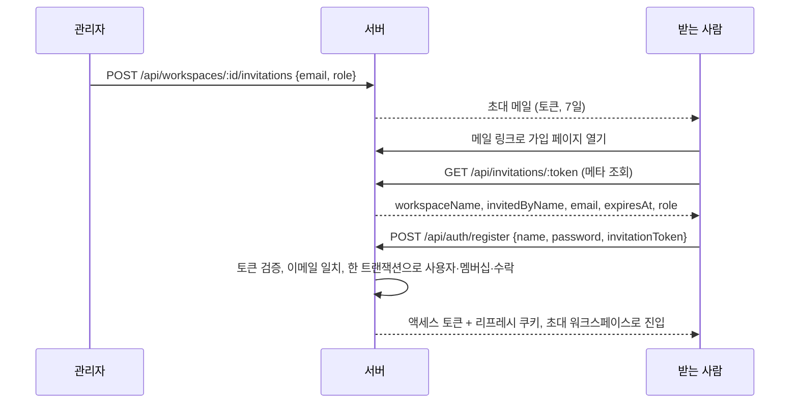

> 구현 상태: 구현됨 · 원문: `spec/5-system/1-auth.md` (§1.5, §3, §5 전환·초대 행, Rationale 1.5.A~D·멤버 관리 정정·부트 캐너리), `spec/2-navigation/9-user-profile.md` (§3, §4, §6.1 워크스페이스 행), `spec/2-navigation/10-auth-flow.md` (§2.6, §6), `spec/0-overview.md` (§4 사용 단위), `spec/data-flow/12-workspace.md` (규칙·Rationale 중 인가와 멤버 관리 부분) · 용어: [용어 사전](../CLE-GLOSSARY.md)

## 개요

워크스페이스(Workspace, `workspace`)는 워크플로우·통합·지식 저장소·모델 설정 같은 모든 리소스를 격리하는 단위다. 이 문서는 워크스페이스를 만들고 전환하고 설정하는 방법, 멤버(Member, `WorkspaceMember`)와 초대(Invitation, `WorkspaceInvitation`), 역할(Role, `WorkspaceMember.role`)과 권한 매트릭스(RBAC matrix, `RolesGuard`), 그리고 서버가 요청마다 워크스페이스와 역할을 판정하는 인가 규칙을 정한다.

제품은 두 가지 사용 단위를 지원한다.

- 개인: 개인 워크스페이스(personal workspace, `Workspace.type=personal`)에서 혼자 워크플로우를 만들고 관리한다. 개인 워크스페이스는 가입할 때 자동으로 생기고 사용자마다 하나다.
- 팀·조직: 팀 워크스페이스(team workspace, `Workspace.type=team`)에서 워크플로우를 공유하고, 역할과 권한을 관리하고, 공통 통합 설정을 함께 쓴다. 한 사용자가 여러 팀 워크스페이스에 속하고 여러 팀 워크스페이스를 소유할 수 있다.

범위 밖 주제는 다음 문서가 정한다.

- 액세스 토큰 구조와 `activeWorkspaceId` 클레임 이름: [세션과 토큰](CLE-ACCT-SESSION.md)
- 초대 없이 하는 가입·로그인: [가입과 로그인](CLE-ACCT-SIGNIN.md)
- 테이블 컬럼, 서버 시퀀스, 초대 상태 전이, 보존 배치: [계정과 워크스페이스 데이터 흐름](CLE-ACCT-DATA.md)
- `/w/<slug>` 슬러그 라우팅과 옛 경로 흡수 라우트(catch-all route): [레이아웃과 내비게이션](../CLE-UI/CLE-UI-LAYOUT.md)
- 워크스페이스·멤버 감사 액션: [감사 로그](../CLE-OBS/CLE-OBS-AUDIT.md)
- 임베드 허용 도메인의 CORS·임베드 검증 동작: [웹채팅 보안](../CLE-WEBCHAT/CLE-WEBCHAT-SECURITY.md)
- 동시 실행 제한(`maxConcurrentExecutions`) 동작: [큐 워커와 동시 실행 제한](../CLE-EXEC/CLE-EXEC-WORKER.md)
- API 공통 규약과 워크스페이스 스코핑: [HTTP API 규약](../CLE-API/CLE-API-CONV.md)

## 요구사항

- REQ-WSPACE-001 WHEN 사용자가 이메일 인증을 마치거나 처음 소셜 로그인하면 THE SYSTEM SHALL 개인 워크스페이스를 자동으로 만들고 그 사용자를 소유자로 넣는다.
- REQ-WSPACE-002 IF 사용자가 초대 토큰으로 가입하면 THE SYSTEM SHALL 개인 워크스페이스를 만들지 않고 초대받은 팀 워크스페이스를 현재 워크스페이스로 삼는다.
- REQ-WSPACE-003 WHEN 개인 워크스페이스를 만들면 THE SYSTEM SHALL 이름을 "{사용자 이름}'s Workspace" 로, 슬러그를 이메일 로컬 파트와 랜덤 4자리로 정한다.
- REQ-WSPACE-004 IF 한 사용자에게 두 번째 개인 워크스페이스를 만들려 하면 THE SYSTEM SHALL DB 부분 유니크 인덱스와 앱의 find-or-create 로 막는다.
- REQ-WSPACE-005 WHEN 사용자가 팀 워크스페이스를 만들면 THE SYSTEM SHALL 서버에서 종류를 `team` 으로 고정하고 슬러그를 `team-<uuid 앞 8자>` 로 만들고 요청자를 소유자로 넣는다.
- REQ-WSPACE-006 WHEN 워크스페이스 이름을 바꾸면 THE SYSTEM SHALL 슬러그를 바꾸지 않는다.
- REQ-WSPACE-007 WHEN 사용자가 워크스페이스 전환 블록에서 워크스페이스를 고르면 THE SYSTEM SHALL 바로 전환하고 `/w/<slug>/dashboard` 로 이동한다. (원본: NAV-UP-04)
- REQ-WSPACE-008 WHEN 워크스페이스 전환을 요청받으면 THE SYSTEM SHALL 대상 멤버십을 확인한 뒤 `activeWorkspaceId` 만 바꾼 액세스 토큰을 재발급하고 리프레시 토큰은 회전하지 않는다.
- REQ-WSPACE-009 IF 멤버가 아닌 워크스페이스로 전환하려 하면 THE SYSTEM SHALL 403 `NOT_A_MEMBER` 로 거부한다.
- REQ-WSPACE-010 WHEN `/w/<slug>` 화면을 처음 불러올 때 URL 의 워크스페이스가 저장된 현재 워크스페이스와 다르면 THE SYSTEM SHALL URL 을 기준으로 전환을 다시 맞춘다.
- REQ-WSPACE-011 IF URL 슬러그가 무효하거나 멤버가 아닌 워크스페이스를 가리키면 THE SYSTEM SHALL 기본 워크스페이스로 보낸다.
- REQ-WSPACE-012 WHEN 워크스페이스를 전환하면 THE SYSTEM SHALL 사이드바 메뉴의 데이터 범위를 고른 워크스페이스로 바꾼다.
- REQ-WSPACE-013 WHEN 멤버가 `/workspace/settings` 를 열면 THE SYSTEM SHALL 워크스페이스 종류 아이콘·이름·설명과 개요·멤버·위험 영역 탭을 보여 준다. (원본: NAV-UP-05)
- REQ-WSPACE-014 IF 사용자가 관리자 이상이 아니면 THE SYSTEM SHALL 개요 탭의 이름과 임베드 허용 도메인을 읽기 전용으로 보여 준다.
- REQ-WSPACE-015 WHEN 관리자 이상이 워크스페이스 설정을 바꾸면 THE SYSTEM SHALL 보낸 키만 `settings` 에 부분 병합하고 다른 키를 보존한다.
- REQ-WSPACE-016 IF 임베드 허용 도메인 항목이 `http(s)://host[:port]` 형식이 아니거나 path·query 를 담으면 THE SYSTEM SHALL 그 설정 변경을 거부한다.
- REQ-WSPACE-017 WHEN 임베드 허용 도메인 목록이 비어 있으면 THE SYSTEM SHALL `/api/external/*` CORS 에 built-in 위젯 origin 만 허용한다.
- REQ-WSPACE-018 IF 기본 시간대 값이 IANA 식별자가 아니면 THE SYSTEM SHALL 거부하고, 빈 문자열이면 설정을 지운다.
- REQ-WSPACE-019 WHEN 멤버가 워크스페이스 설정을 조회하면 THE SYSTEM SHALL 뷰어를 포함한 모든 멤버에게 돌려주고 비멤버는 403 `NOT_A_MEMBER` 로 막는다.
- REQ-WSPACE-020 WHEN 관리자 이상이 워크스페이스 이름을 바꾸면 THE SYSTEM SHALL 2~100자 이름만 받는다.
- REQ-WSPACE-021 WHEN 관리자 이상이 이메일로 초대하면 THE SYSTEM SHALL 64자 일회용 초대 토큰을 만들고 7일 만료로 시스템 SMTP 메일을 보낸다.
- REQ-WSPACE-022 IF 같은 워크스페이스와 이메일에 대기 중 초대가 있으면 THE SYSTEM SHALL 새 행을 만들지 않고 그 행의 토큰·역할·초대자·만료를 바꿔 옛 토큰을 무효로 만든다.
- REQ-WSPACE-023 IF 초대 대상 이메일이 이미 멤버이면 THE SYSTEM SHALL 409 `already_a_member` 로 거부한다.
- REQ-WSPACE-024 IF 개인 워크스페이스에서 초대하면 THE SYSTEM SHALL 403 `workspace_type_mismatch` 로 거부한다.
- REQ-WSPACE-025 WHEN 관리자 이상이 대기 중 초대를 재발송하면 THE SYSTEM SHALL 새 토큰을 발급하고 만료를 발급 시점부터 7일로 다시 잡고 메일을 다시 보낸다.
- REQ-WSPACE-026 WHEN 관리자 이상이 대기 중 초대를 취소하면 THE SYSTEM SHALL 그 초대 행을 물리 삭제한다.
- REQ-WSPACE-027 IF 이미 수락한 초대를 재발송하거나 취소하려 하면 THE SYSTEM SHALL 409 `invitation_already_accepted` 로 거부한다.
- REQ-WSPACE-028 WHEN 초대를 수락하거나 초대 토큰으로 가입하면 THE SYSTEM SHALL 로그인·가입 사용자 이메일이 초대 이메일과 같은지 확인하고 다르면 400 `invitation_email_mismatch` 로 거부한다.
- REQ-WSPACE-029 IF 초대 토큰이 없거나 형식이 틀리면 THE SYSTEM SHALL 404 `invitation_not_found` 로 거부한다.
- REQ-WSPACE-030 IF 초대 토큰이 만료됐거나 이미 쓰였으면 THE SYSTEM SHALL 410 `invitation_expired` 나 410 `invitation_already_used` 로 거부한다.
- REQ-WSPACE-031 WHEN 초대를 수락하면 THE SYSTEM SHALL `accepted_at IS NULL` 조건부 갱신으로 한 번만 소비하고 멤버십 추가와 한 트랜잭션으로 처리한다.
- REQ-WSPACE-032 WHEN 미가입자가 초대 링크로 가입하면 THE SYSTEM SHALL 사용자 생성·멤버십 추가·초대 수락을 한 트랜잭션으로 처리하고 실패하면 모두 되돌린다.
- REQ-WSPACE-033 WHEN 가입 페이지가 초대 토큰을 받으면 THE SYSTEM SHALL 초대 메타를 미리 조회해 이메일 입력란을 채우고 읽기 전용으로 고정한다.
- REQ-WSPACE-034 IF 이미 로그인한 사용자가 초대 가입 링크를 열면 THE SYSTEM SHALL 가입 폼 대신 초대 수락 페이지로 보낸다.
- REQ-WSPACE-035 IF 로그인 사용자 이메일과 초대 이메일이 다르면 THE SYSTEM SHALL 수락 페이지에 초대 대상 이메일 안내와 로그아웃 버튼만 보여 준다.
- REQ-WSPACE-036 WHEN 초대 발급·재발송을 요청받으면 THE SYSTEM SHALL 분당 10건으로 제한하고, 공개 초대 메타 조회는 분당 30건으로 제한한다.
- REQ-WSPACE-037 WHEN 매일 04:00(Asia/Seoul)이 되면 THE SYSTEM SHALL 만료되고 수락되지 않은 초대 행을 지운다.
- REQ-WSPACE-038 WHEN 관리자 이상이 이미 가입한 사용자를 이메일로 직접 추가하면 THE SYSTEM SHALL 메일 없이 바로 그 사용자를 팀 워크스페이스 멤버로 넣는다.
- REQ-WSPACE-039 IF 직접 추가 대상 이메일이 가입하지 않았으면 THE SYSTEM SHALL 404 `USER_NOT_FOUND` 로 거부하고 초대를 쓰게 한다.
- REQ-WSPACE-040 IF 직접 추가에서 소유자 역할을 지정하면 THE SYSTEM SHALL 403 `CANNOT_ASSIGN_OWNER` 로 거부한다.
- REQ-WSPACE-041 IF 역할 변경 대상이 소유자이거나 부여하려는 역할이 소유자면 THE SYSTEM SHALL `OWNER_ROLE_PROTECTED` 로 막고 소유자 이양을 쓰게 한다.
- REQ-WSPACE-042 IF 관리자 이상이 소유자를 멤버에서 제거하려 하면 THE SYSTEM SHALL `CANNOT_REMOVE_OWNER` 로 거부한다.
- REQ-WSPACE-043 WHEN 멤버 제거 대상이 요청자 자신이면 THE SYSTEM SHALL 워크스페이스 나가기로 넘긴다.
- REQ-WSPACE-044 IF 유일한 소유자가 팀 워크스페이스를 나가려 하면 THE SYSTEM SHALL 403 `SOLE_OWNER_CANNOT_LEAVE` 로 막는다.
- REQ-WSPACE-045 IF 개인 워크스페이스에서 나가거나 삭제하려 하면 THE SYSTEM SHALL 403 `CANNOT_LEAVE_PERSONAL` 이나 `CANNOT_DELETE_PERSONAL` 로 거부한다.
- REQ-WSPACE-046 WHEN 소유자가 소유자 이양을 하면 THE SYSTEM SHALL 한 트랜잭션에서 대상 멤버를 소유자로, 기존 소유자를 관리자로 바꾸고 `workspace.owner_id` 를 대상 사용자로 맞춘다.
- REQ-WSPACE-047 IF 소유자 이양 대상이 자기 자신이면 THE SYSTEM SHALL 400 `TARGET_IS_SELF` 로, 이미 소유자면 409 `TARGET_ALREADY_OWNER` 로 거부한다.
- REQ-WSPACE-048 WHEN 소유자가 팀 워크스페이스 삭제를 확인하면 THE SYSTEM SHALL 트리거 외부 자원을 해제한 뒤 초대·멤버·워크스페이스를 한 트랜잭션에서 지운다.
- REQ-WSPACE-049 WHEN 서버가 역할을 비교하면 THE SYSTEM SHALL 소유자·관리자·편집자·뷰어 순의 계층으로 보고 위 역할이 아래 역할의 권한을 모두 갖게 한다.
- REQ-WSPACE-050 IF 뷰어가 워크플로우 실행을 요청하면 THE SYSTEM SHALL 403 으로 거부한다.
- REQ-WSPACE-051 WHEN 인증된 요청이 워크스페이스 컨텍스트를 쓰면 THE SYSTEM SHALL `X-Workspace-Id` 헤더가 있으면 그 값을, 없으면 토큰의 `activeWorkspaceId` 를 현재 워크스페이스로 쓴다.
- REQ-WSPACE-052 IF 토큰의 워크스페이스 클레임이 없거나 그 멤버십이 사라졌으면 THE SYSTEM SHALL 개인 워크스페이스, 없으면 첫 멤버십을 현재 워크스페이스로 쓴다.
- REQ-WSPACE-053 WHEN `@Roles()` 나 `@WorkspaceId()` 를 쓰는 라우트에 요청이 헤더로 워크스페이스를 지정하면 THE SYSTEM SHALL 라우트의 `@Roles()` 유무와 상관없이 가드에서 멤버십을 확인한다.
- REQ-WSPACE-054 WHEN 라우트가 경로 파라미터로 워크스페이스를 받으면 THE SYSTEM SHALL 헤더·토큰이 아니라 경로 값을 인가 대상으로 삼아 멤버십을 항상 조회한다.
- REQ-WSPACE-055 IF 요청자가 대상 워크스페이스 멤버가 아니거나 워크스페이스가 없으면 THE SYSTEM SHALL 둘을 구분하지 않고 403 `NOT_A_MEMBER` 로 거부한다.
- REQ-WSPACE-056 IF 멤버의 역할이 라우트 요구 역할보다 낮으면 THE SYSTEM SHALL 403 `EDITOR_REQUIRED`·`ADMIN_REQUIRED`·`OWNER_REQUIRED` 중 요구 역할에 맞는 코드로 거부한다.
- REQ-WSPACE-057 IF `@Roles()` 나 `@WorkspaceId()` 를 쓰는 라우트에서 `X-Workspace-Id` 헤더가 UUID 형태가 아니면 THE SYSTEM SHALL 400 `VALIDATION_ERROR` 로, 헤더와 클레임이 모두 없으면 400 `WORKSPACE_ID_REQUIRED` 로 거부한다.
- REQ-WSPACE-058 WHEN 서버가 부팅하면 THE SYSTEM SHALL 워크스페이스 파라미터를 소비하는 라우트 수를 세고 0 이면 기동을 멈춘다.
- REQ-WSPACE-059 IF 컨트롤러 핸들러가 이름이 `workspaceId` 이거나 `WorkspaceId` 로 끝나는 파라미터를 `@Param` 으로 받으면 THE SYSTEM SHALL 저장소 가드로 CI 를 실패시킨다.

## 워크스페이스 종류와 생성

| 종류 | 만드는 방법 | 특징 |
| --- | --- | --- |
| 개인 | 가입할 때 자동 생성 | 사용자당 1개. 삭제·나가기·초대·소유자 이양을 할 수 없다 |
| 팀 | 사용자가 `POST /api/workspaces` 로 생성 | 요청자가 소유자가 된다. 한 사용자가 여러 개를 소유할 수 있다. 멤버를 초대한다 |

워크스페이스 슬러그(slug, `Workspace.slug`)는 만들 때 정하고 이후 바꾸지 않는다. 이름을 바꿔도 URL 이 바뀌지 않아 딥링크와 북마크가 유지된다.

### 첫 개인 워크스페이스 자동 생성

아래 경우에 개인 워크스페이스를 자동으로 만든다.

| 경로 | 조건 |
| --- | --- |
| 이메일 가입 | 이메일 인증을 마쳤을 때. `invitationToken` 으로 가입한 경우는 제외한다 |
| 소셜 로그인 (최초) | 신규 사용자를 자동 가입시킬 때 |

초대 토큰으로 가입한 사용자는 초대받은 팀 워크스페이스에 바로 멤버로 들어가므로 개인 워크스페이스를 만들지 않는다. 이때 JWT `activeWorkspaceId` 클레임도 그 팀 워크스페이스로 발급한다(`auth.service.ts` 의 `resolveTokenWorkspaceContext`). 그 사용자가 나중에 개인 워크스페이스를 원하면 워크스페이스 관리 화면에서 직접 만들 수 있다.

| 항목 | 값 |
| --- | --- |
| 이름 | "{사용자 이름}'s Workspace" |
| 슬러그 | 사용자 이메일 로컬 파트 + 랜덤 4자리 (예: `gehrig-a1b2`) |
| 종류 | `personal` |
| 멤버 역할 | `owner` |
| 기본 시간대 | 정의가 갈린다. [미결 사항](#미결-사항) 참조 |

개인 워크스페이스가 사용자마다 하나라는 규칙은 DB 부분 유니크 인덱스와 앱의 `WorkspacesService.findOrCreatePersonalWorkspace` 가 함께 지킨다. 자세한 내용은 [계정과 워크스페이스 데이터 흐름](CLE-ACCT-DATA.md) 에 있다.

### 팀 워크스페이스 생성

`POST /api/workspaces { name }` 으로 만든다. 서버는 종류를 `team` 으로 고정하고 슬러그를 `team-<uuid 앞 8자>` 로 만든다(`createTeam`). 요청자는 소유자 멤버가 되고 `settings` 는 빈 객체로 시작한다. 응답은 201 `{ workspace }` 다.

## 워크스페이스 전환

현재 워크스페이스(active workspace, `activeWorkspaceId`, `X-Workspace-Id`)는 화면과 요청이 대상으로 삼는 워크스페이스다. 화면 라우팅은 URL 슬러그로 정하고, 서버 인가는 `X-Workspace-Id` 헤더, 헤더가 없으면 액세스 토큰 클레임으로 정한다.

- 사용자 영역 위의 워크스페이스 전환 블록에서 워크스페이스를 고르면 바로 전환하고 새 슬러그 URL(`/w/<slug>/dashboard`)로 이동한다. 전환 블록은 개인·팀 그룹과 현재 워크스페이스 표시를 담는다.
- 현재 워크스페이스는 URL 경로(`/w/<slug>/...`, 예 `/w/team-alpha/workflows`)에 나타난다. `(main)/w/[slug]` layout 이 슬러그를 워크스페이스로 풀고 다음 흐름을 구동한다: `useWorkspaceStore.currentWorkspaceId`(localStorage 저장), axios 의 `X-Workspace-Id` 헤더 첨부, `POST /api/auth/workspaces/:id/switch` 로 토큰 재발급. 슬러그는 `GET /api/workspaces` 응답 필드다.
- 처음 불러올 때(딥링크·북마크)는 URL 이 우선이다. `[slug]` layout 이 마운트될 때 풀어낸 워크스페이스가 저장된 현재 워크스페이스와 다르면 URL 에 맞춰 `switchWorkspace` 로 다시 맞춘다. AuthProvider 는 경로가 `/w/` 로 시작하면 저장된 값 기준의 재조정을 건너뛴다. 슬러그 없는 화면에서는 localStorage 값 기준으로 재조정한다.
- 무효하거나 멤버가 아닌 슬러그는 기본 워크스페이스로 보낸다. 이것은 편의 기능이지 인가 경계가 아니다. 실제 차단은 서버 `RolesGuard` 의 403 이다([API 인가](#api-인가)).
- 고른 워크스페이스에 따라 사이드바 메뉴의 데이터 범위가 바뀐다.
- 사용자 가이드(`/docs`, 워크스페이스와 무관한 콘텐츠)와 인증 화면(`/login` 등 `(auth)` 그룹)은 슬러그 밖에 있다. 에디터는 `/w/<slug>/workflows/<id>` 로 렌더되고 같은 슬러그 게이트로 URL 우선 재조정을 한다.
- 슬러그 없는 옛 경로·알림 딥링크·`/` 를 현재 워크스페이스 슬러그 경로로 넘기는 규칙과 `/w/` 로 시작하는 경로를 흡수하지 않는 규칙은 [레이아웃과 내비게이션](../CLE-UI/CLE-UI-LAYOUT.md) 이 정한다.

### 전환 API 와 토큰

`POST /api/auth/workspaces/:id/switch` 는 `AuthService.switchWorkspace` 가 대상 워크스페이스 멤버십을 확인한다. 멤버가 아니면 403 `NOT_A_MEMBER` 다. 멤버면 `activeWorkspaceId=:id` 로 액세스 토큰만 재발급한다. 리프레시 토큰은 워크스페이스와 무관한 opaque UUID 라 회전하지 않는다. 전환마다 새 로그인 세션을 만들면 세션이 쌓이고 옛 토큰이 버려진 채 남기 때문이다.

- 전환이 효력을 가지려면 인증 전략이 토큰 클레임을 존중해야 한다. `jwt.strategy` 는 토큰의 `activeWorkspaceId`(없으면 옛 이름 `workspaceId`)를 읽어 멤버십을 확인하고 그 워크스페이스를 `request.user.workspaceId` 로 쓴다. 클레임이 없거나(옛 토큰, 가입 직후) 멤버십이 사라졌으면 개인 워크스페이스, 없으면 첫 멤버십으로 대체한다.
- 리프레시 토큰은 클레임을 담지 않으므로 전환 뒤 다음 갱신은 현재 워크스페이스를 DB 로 다시 푼다(개인 우선, 없으면 첫 멤버십). v1 에서는 필요하면 전환을 다시 부르는 것으로 충분하다. 갱신 뒤에도 현재 워크스페이스를 유지하는 기능은 후속 과제다.
- 프론트엔드 `workspace-store.switchWorkspace(id)` 는 전환 API 를 불러 재발급된 액세스 토큰을 저장하고 헤더 첨부도 계속한다. 불러올 때 저장된 `currentWorkspaceId` 와 토큰의 현재 워크스페이스가 다르면 전환 API 로 토큰을 다시 맞춘다. 프론트가 헤더 첨부를 없애면 토큰 클레임이 유일한 기준이 되고, 그때 옛 클레임 이름 dual-read 도 정리한다.

## 워크스페이스 관리 화면

`/workspace/settings` 한 페이지에 탭 세 개(개요·멤버·위험 영역)를 둔다. 멤버라면 누구나 들어오고 역할에 따라 탭과 동작이 제한된다. 페이지 헤더에는 현재 워크스페이스의 종류 아이콘(개인 👤, 팀 👥)과 이름, 한 줄 설명이 있어 무엇을 관리하는지 바로 알 수 있다. 팀 워크스페이스 설명 예는 "멤버와 함께 협업하는 공간이에요" 다.

| 탭 | 들어가는 요소 | 동작과 권한 |
| --- | --- | --- |
| 개요 | Name 입력, Slug(읽기 전용), Type(개인·팀), 내 Role, 임베드 허용 도메인 섹션 | 이름과 임베드 허용 도메인은 관리자 이상만 편집한다. 그 밖의 역할에는 읽기 전용으로 보인다 |
| 멤버 (팀 워크스페이스 전용) | 역할 범례(소유자 모든 권한, 관리자 멤버 관리, 편집자 워크플로우 편집, 뷰어 읽기만), 초대 입력(이메일, 역할 선택, [초대]), 대기 중 초대 목록(이메일·역할·만료일, [재발송]·[취소]), 현재 멤버 목록(이름·이메일·역할 드롭다운·제거) | [멤버 관리](#멤버-관리) 표의 권한을 따른다 |
| 위험 영역 | [워크스페이스 나가기], [소유자 이양], [워크스페이스 삭제] | 나가기는 소유자가 아닌 모든 멤버, 소유자 이양은 소유자만(새 소유자 이메일 재입력 확인), 삭제는 소유자만(이름 재입력 확인 필수) |

역할 이름은 사전 표준(소유자·관리자·편집자·뷰어)으로 적는다. 현재 화면 라벨은 편집자를 "멤버" 로 보여 준다. 이 차이는 [용어 사전 — 결정이 필요한 표기](../CLE-GLOSSARY-OPEN.md) 의 「editor 역할의 화면 라벨」 항목(D10)이다.

### 임베드 허용 도메인

개요 탭의 임베드 허용 도메인 섹션은 웹채팅 위젯을 넣을 수 있는 origin 목록(`Workspace.settings.interactionAllowedOrigins`)을 관리한다.

| 항목 | 내용 |
| --- | --- |
| 편집 권한 | 소유자와 관리자. 그 밖의 역할은 읽기 전용 표시. 화면은 `useHasRole("admin")` 로 판정하고 역할 계층상 소유자도 포함된다 |
| 동작 | `GET /api/workspaces/:id/settings`(멤버)로 현재 값을 불러와 origin 을 더하거나 뺀 뒤 [저장] 으로 `PATCH /api/workspaces/:id/settings`(관리자 이상)를 보낸다 |
| 검증 | 형식 `http(s)://host[:port]`(scheme 필수, path·query 불가). 클라이언트가 중복을 막는다. 서버는 형식을 다시 검사하고 끝 슬래시를 정규화한다 |
| 의미 | 목록의 origin 은 built-in 위젯 CDN origin 에 더해 `/api/external/*` CORS 와 임베드에 허용된다. 빈 목록이면 추가 origin 이 없다. CORS 는 built-in 만 허용하고, 임베드 soft 검증은 `enforce=false` 라 모두 허용한다. 두 층의 차이는 [웹채팅 보안](../CLE-WEBCHAT/CLE-WEBCHAT-SECURITY.md) 이 정한다 |
| 반영 지연 | 임베드 soft 검증 캐시가 최대 5분(`Cache-Control: max-age=300`) 이다 |

## 워크스페이스 설정

워크스페이스 설정(workspace settings, `Workspace.settings`)은 워크스페이스마다 두는 JSONB 키 묶음이다. 알려진 키는 다음과 같다. 모두 선택 키다.

| 키 | 뜻 | 기준 문서 |
| --- | --- | --- |
| `timezone` | 기본 시간대(default timezone). IANA 식별자. 서비스 계층이 `Intl.DateTimeFormat` 으로 검증하고 빈 문자열은 설정 해제다. 값이 없을 때의 폴백은 소비하는 쪽이 정한다: AI 노드 시스템 컨텍스트는 [AI 노드 공통](../CLE-NODE-AI/CLE-NODE-AI-COMMON.md), 스케줄은 [스케줄](../CLE-TRIG/CLE-TRIG-SCHEDULE.md). 폴백 값은 [미결 사항](#미결-사항) 참조 | 이 문서 |
| `interactionAllowedOrigins` | 임베드 허용 도메인. `/api/external/*` CORS 추가 허용 목록이면서 임베드 origin 허용 목록 | [웹채팅 보안](../CLE-WEBCHAT/CLE-WEBCHAT-SECURITY.md) |
| `maxConcurrentExecutions` | 워크스페이스당 동시 `running` 실행 상한. 없으면 기본 10 | [큐 워커와 동시 실행 제한](../CLE-EXEC/CLE-EXEC-WORKER.md) |

- 설정은 `PATCH /api/workspaces/:id/settings` 로 바꾼다. 관리자 이상만 할 수 있다. 서비스 계층 `assertAdmin` 이 소유자·관리자가 아니면 403 `ADMIN_REQUIRED` 로 거부한다.
- 보낸 키만 기존 `settings` 에 병합한다(`settings = { ...settings, 보낸 키 }`). 다른 키는 보존한다.
- 조회 `GET /api/workspaces/:id/settings` 는 뷰어를 포함한 모든 멤버가 할 수 있다. 설정 화면 표시에 쓴다.

## 멤버 관리

| 동작 | 권한 | 설명 |
| --- | --- | --- |
| 초대 | 관리자 이상 | 이메일로 초대 토큰을 보낸다. 받는 사람은 가입 페이지나 수락 페이지에서 합류한다. [초대](#초대) |
| 초대 재발송 | 관리자 이상 | 대기 중 초대의 토큰을 새로 발급하고 메일을 다시 보낸다. 만료도 재발급 시점부터 다시 7일이다 |
| 초대 취소 | 관리자 이상 | 대기 중(`acceptedAt IS NULL`) 초대만 취소한다. 행을 물리 삭제한다 |
| 직접 추가 | 관리자 이상 | 이미 가입한 사용자를 이메일로 메일 없이 바로 멤버로 넣는다 |
| 역할 변경 | 관리자 이상 | 드롭다운으로 역할을 바꾼다. 소유자 역할을 주거나 뺏는 것은 소유자 이양으로만 한다. 관리자가 관리자 역할을 줄 수 있는지는 [미결 사항](#미결-사항) |
| 제거 | 관리자 이상 | 확인 다이얼로그 뒤 멤버를 제거한다. 소유자는 제거할 수 없다. 자기 자신은 나가기로 넘긴다 |
| 나가기 | 본인 | 스스로 탈퇴한다. 유일한 소유자는 막는다. 먼저 다른 소유자를 정하거나 삭제로 간다 |
| 워크스페이스 삭제 | 소유자 | 이름 재입력 확인 뒤 삭제한다 |
| 소유자 이양 | 소유자 | 같은 워크스페이스의 소유자 아닌 멤버 중 한 명을 고르고 그 사람 이메일을 다시 입력해 확인한다 |

### 직접 추가

멤버 직접 추가(add member, `POST /api/workspaces/:id/members { email, role }`, `WorkspacesService.addMemberByEmail`)는 초대 토큰과 별개인 합류 경로다. 이미 가입한 사용자를 메일 없이 바로 멤버로 넣는다. 팀 워크스페이스에서만 된다.

| 상황 | 결과 |
| --- | --- |
| `role=owner` 지정 | 403 `CANNOT_ASSIGN_OWNER` |
| 가입하지 않은 이메일 | 404 `USER_NOT_FOUND`. 미가입자는 초대를 쓴다 |
| 이미 멤버 | 409 `ALREADY_A_MEMBER` |
| 팀이 아닌 워크스페이스 | 403 `WORKSPACE_TYPE_MISMATCH` |

이 경로는 `WorkspacesService` 가 코드를 내므로 `UPPER_SNAKE_CASE` 를 쓴다. 초대 흐름의 소문자 `already_a_member`·`workspace_type_mismatch` 와 뜻은 같지만 다른 wire 코드다. 모듈과 표기 관례가 달라 일부러 나눴고 합치지 않는다.

### 역할 변경·제거·소유자 이양

| 동작 | 권한 | 규칙 |
| --- | --- | --- |
| `PATCH /api/workspaces/:id/members/:memberId { role }` | 소유자·관리자 | `workspace_member.role` 을 바꾼다. 대상의 현재 역할이 소유자이거나 부여하려는 역할이 소유자면 무조건 `OWNER_ROLE_PROTECTED` 로 막는다. 소유자 부여·박탈은 소유자 이양으로만 한다 |
| `POST /api/workspaces/:id/transfer-ownership { newOwnerMemberId }` | 소유자(`@Roles('owner')` 가드와 서비스 재검증) | 한 트랜잭션에서 (1) 현재 소유자를 관리자로, (2) 대상 멤버를 소유자로, (3) `workspace.owner_id` 를 대상 사용자로 바꾼다. 자기 자신을 지정하면 400 `TARGET_IS_SELF`, 대상이 이미 소유자면 409 `TARGET_ALREADY_OWNER`, 개인 워크스페이스는 이양할 수 없다(`CANNOT_TRANSFER_PERSONAL`). `newOwnerMemberId` 는 사용자 ID 가 아니라 멤버 ID 다 |
| `DELETE /api/workspaces/:id/members/:memberId` | 소유자·관리자 | 멤버십을 지운다. 소유자는 제거할 수 없다(`CANNOT_REMOVE_OWNER`). 자기 자신 제거는 나가기(`leaveWorkspace`)로 넘겨 유일 소유자 보호 같은 공통 가드를 받는다 |

이 표에 나온 거부 코드의 HTTP 상태(현재 구현)는 [계정과 워크스페이스 데이터 흐름 §멤버 변경과 직접 추가](CLE-ACCT-DATA.md#멤버-변경과-직접-추가) 에 모았다.

### 나가기와 삭제

| 동작 | 권한 | 규칙 |
| --- | --- | --- |
| `POST /api/workspaces/:id/leave` | 멤버 본인 | 팀 워크스페이스만(개인은 403 `CANNOT_LEAVE_PERSONAL`). 유일한 소유자는 403 `SOLE_OWNER_CANNOT_LEAVE`. 유일 소유자 판정과 멤버십 삭제를 비관적 잠금 트랜잭션 안에서 해 TOCTOU 를 막는다 |
| `DELETE /api/workspaces/:id` | 소유자 | 팀 워크스페이스만(개인은 403 `CANNOT_DELETE_PERSONAL`). 트리거 외부 자원([트리거 관리](../CLE-TRIG/CLE-TRIG-MANAGE.md))을 해제한 뒤 한 트랜잭션에서 초대, 멤버, 워크스페이스 순으로 지운다. 권한 검사 시점, 잠금 순서, 트리거 시크릿 정리, 실패 처리는 [계정과 워크스페이스 데이터 흐름 §워크스페이스 삭제와 나가기](CLE-ACCT-DATA.md#워크스페이스-삭제와-나가기) |

## 초대

초대는 관리자 이상이 이메일로 보내는 팀 워크스페이스 합류 요청이다. 받는 사람이 가입했는지와 상관없이 같은 초대 API 를 쓴다. 미가입자는 초대 링크로 가입하면서 합류하고, 이미 가입한 사용자는 수락 페이지에서 합류한다. 이미 가입한 사용자를 메일 없이 바로 넣는 것은 [직접 추가](#직접-추가) 다.

### 토큰 정책

| 항목 | 값 | 비고 |
| --- | --- | --- |
| 토큰 생성 | `crypto.randomBytes(48)` 를 base64url 로 인코딩한 64자 | 추측할 수 없다 |
| 저장 | DB 에 토큰 원래 값을 저장한다(`WorkspaceInvitation.token`, UNIQUE) | URL 로 조회할 때 바로 찾는다 |
| 만료 | 발급 시점 + 7일 | 만료되면 410 |
| 사용 횟수 | 1회. 수락 트랜잭션이 `acceptedAt` 을 채우면서 사용 처리한다 | 동시 수락 경쟁은 `UPDATE … WHERE accepted_at IS NULL RETURNING …` 으로 직렬화한다. 진 쪽은 410 이다 |
| 재발송 | 같은 행의 토큰을 새 값으로 바꾸고 만료를 다시 7일로 잡는다 | 한 초대 행은 항상 유효 토큰이 0~1개다. 옛 토큰은 더 이상 조회되지 않아 `invitation_not_found`(404)가 된다 |
| 같은 이메일 중복 초대 | 새 초대가 들어오면 기존 대기 중 행의 토큰·역할·초대자·만료를 바꾼다 | 여러 토큰이 동시에 살아 있지 않게 한다. 대기 중 초대 목록에도 한 이메일에 한 줄만 있다 |
| 이메일 일치 강제 | 수락·가입 때 `토큰.email == 로그인·가입 사용자 이메일` 을 강제한다. 다르면 400 | 토큰이 새도 다른 사용자가 워크스페이스에 들어오지 못한다 |
| 초대 역할 | `admin`·`editor`·`viewer`. 소유자는 초대 역할로 줄 수 없다 | 관리자 역할 초대 가능 여부는 [미결 사항](#미결-사항) |
| 발송 채널 | 시스템 SMTP(`codebase/backend/src/modules/mail/`)만 쓴다. 워크스페이스 SMTP 통합은 쓰지 않는다 | 이유는 [Rationale](#rationale) |
| 발송 실패 | 초대 행을 되돌리지 않고 에러 로그만 남긴다 | 관리자가 재발송할 수 있다 |
| 요청 한도 | 초대 발급·재발송 분당 10건(`INVITATION_THROTTLE`, `workspaces.controller.ts`). 공개 토큰 메타 조회 분당 30건 | 이메일 폭탄과 토큰 열거를 막는다 |
| 만료 초대 정리 | 매일 04:00(Asia/Seoul) BullMQ 반복 작업(`WorkspaceInvitationsPrunerService`)이 만료되고 수락되지 않은 행을 지운다 | 운영 위생 목적 |

초대 발급은 대상 이메일이 이미 멤버인지 확인하지만 가입자인지는 확인하지 않는다. 기존 가입자(비멤버)를 초대하면 초대 링크 메일과 함께 인앱 알림 `team_invite` 가 간다. 알림 쪽은 [알림](../CLE-OBS/CLE-OBS-NOTIFY.md) 이 정한다.

### 미가입자 가입 경로

1. 관리자 이상이 `POST /api/workspaces/:id/invitations { email, role }` 을 보낸다. 서버는 토큰을 만들고 `expiresAt = now + 7일` 로 메일을 보낸다.
2. 받는 사람이 메일 링크를 누르면 프론트엔드 가입 페이지가 초대 토큰 쿼리와 함께 열린다. 링크 경로는 정의가 갈린다. [미결 사항](#미결-사항) 참조. 가입 페이지의 메타 조회와 입력란 고정은 아래 [초대 가입 화면](#초대-가입-화면) 에 있다.
3. 가입을 제출받으면 서버가 (a) 토큰이 있고 만료되지 않았고 쓰이지 않았는지, (b) 토큰 이메일과 가입 이메일이 같은지 본다. (c) 맞으면 사용자 생성, 멤버십 추가, `invitation.acceptedAt` 갱신을 한 트랜잭션에서 한다. 실패하면 모두 되돌린다. (d) 불일치나 만료면 가입 자체를 거부하고 사용자 행을 만들지 않는다.
4. 가입에 성공하면 인증 메일 없이 자동 로그인하고 초대받은 워크스페이스로 들어간다. 개인 워크스페이스 자동 생성은 일어나지 않는다.

### 이미 가입한 사용자의 수락 경로

1. 메일 링크를 누르면 프론트엔드가 토큰 메타를 조회한다.
2. 로그인해 있고 본인 이메일이 토큰 이메일과 같으면 수락 페이지에 [수락] 버튼을 보여 준다.
3. `POST /api/workspaces/invitations/accept { token }`. 서버는 토큰이 유효하고 본인 이메일이 토큰 이메일과 같은지 확인한 뒤 멤버십 추가와 `acceptedAt` 갱신을 한 트랜잭션에서 한다. 이미 멤버면 멤버십 추가는 건너뛴다.
4. 응답(200 `{ workspace }`)을 받으면 프론트엔드가 그 워크스페이스로 전환한다.

토큰 이메일과 로그인 사용자 이메일이 다르면 수락 페이지에 "이 초대는 {토큰.email} 에게 발송되었습니다. 해당 계정으로 로그인하세요" 안내와 로그아웃 버튼만 보여 준다.

수락 페이지 경로는 `/invitations/accept?token=<초대 토큰>` 이다(쿼리 파라미터 `token`). 이미 로그인한 사용자가 초대 가입 링크로 들어오면 가입 페이지가 로그인 상태를 알아채 이 수락 페이지로 보낸다. 로그인하지 않은 사용자는 위 가입 경로를 따른다.

### 초대 가입 화면

미가입자가 메일 링크를 누르면 가입 페이지는 `?invitationToken=…` 쿼리를 받아 아래처럼 처리한다. 가입 화면 자체의 필드와 검증은 [가입과 로그인](CLE-ACCT-SIGNIN.md) 이 정한다.

먼저 이미 로그인한 사용자를 가려낸다. 초대 메일 링크는 미가입자를 기준으로 하지만, 다른 계정으로 이미 로그인한 사용자가 같은 브라우저의 새 탭에서 누를 수도 있다. 이때는 가입 폼 대신 초대 수락 페이지 `/invitations/accept?token=…` 로 바로 보낸다. `(auth)` 라우트 그룹에는 세션 하이드레이션(AuthProvider)이 없어 클라이언트 스토어로 로그인을 알 수 없다. 그래서 로그인 힌트 쿠키 `has_session` 으로 판정한다([세션과 토큰](CLE-ACCT-SESSION.md)). 힌트가 낡았으면(쿠키만 남고 리프레시 토큰은 만료) 수락 페이지의 라우트 가드가 로그인 화면으로 돌려보낸다. 아래 표는 로그인하지 않은 미가입자 경로에만 적용한다.

| 단계 | 처리 |
| --- | --- |
| 1. 토큰 메타 미리 조회 | `GET /api/invitations/:token` 로 워크스페이스 이름·초대자·이메일·만료를 받는다. 404·410 같은 실패면 에러 화면으로 보낸다 |
| 2. 이메일 채우기와 고정 | 응답의 `email` 을 입력란에 채우고 읽기 전용으로 고정한다. 다른 이메일로는 가입할 수 없다 |
| 3. 헤더 안내 | "**{workspace}** 에 초대받으셨어요" 와 초대자 이름을 보여 준다 |
| 4. 가입 제출 | `POST /api/auth/register { name, password, invitationToken }`. 이메일은 서버가 토큰에서 믿고 쓴다 |
| 5. 트랜잭션 처리 | 서버가 사용자 생성, 멤버십 추가, `invitation.acceptedAt` 갱신을 한 트랜잭션에서 한다. 실패하면 모두 되돌린다 |
| 6. 가입 성공 뒤 | 이메일 인증 안내 화면 대신 초대받은 워크스페이스로 들어간다. 개인 워크스페이스 자동 생성은 일어나지 않는다 |
| 7. 에러 분기 | `invitation_email_mismatch`(서버가 거의 막지만 안전망), `invitation_expired`, `invitation_already_used` 면 "이 초대는 더 이상 유효하지 않아요. 워크스페이스 관리자에게 재발송을 요청하세요" 안내를 보여 준다 |

### 초대 에러 코드

| 상황 | HTTP | 코드 |
| --- | --- | --- |
| 토큰 없음·잘못된 형식 | 404 | `invitation_not_found` |
| 만료 | 410 | `invitation_expired` |
| 이미 사용됨 (동시 수락에서 진 쪽 포함) | 410 | `invitation_already_used` |
| 이메일 불일치 (수락 또는 가입) | 400 | `invitation_email_mismatch` |
| 개인 워크스페이스에서 초대 | 403 | `workspace_type_mismatch` |
| 이미 멤버인 이메일 초대 | 409 | `already_a_member` |
| 대기 초대 부분 UNIQUE 경합 | 409 | `invitation_already_pending` |
| 수락된 초대의 재발송·취소 | 409 | `invitation_already_accepted` |
| 권한 부족 (발송·재발송·취소) | 403 | `ADMIN_REQUIRED`. 비멤버는 `NOT_A_MEMBER` |
| 요청 한도 초과 | 429 | 원문은 `rate_limited`. 정의가 갈린다. [미결 사항](#미결-사항) 참조 |

초대 흐름 코드는 에러 코드 표기 규칙(`UPPER_SNAKE_CASE`)과 달리 `lower_snake_case` 다. v1 출시 때 이 형태로 굳었고 프론트엔드(`invitations.ts` 의 `INVITATION_ERROR_CODES`)가 `code` 값으로 바로 분기하므로 이름을 바꾸면 API 호환이 깨진다. "이름을 더 정확하게 하려고 바꾸지는 않는다" 는 규칙에 따라 예외 등록 코드(historical artifact)로 유지한다. 새 코드는 이 예외를 선례로 삼지 않고 처음부터 `UPPER_SNAKE_CASE` 를 쓴다. 권한 부족은 `RolesGuard` 가 `ADMIN_REQUIRED` 로 먼저 거부해 이 예외에 들지 않는다. 예외 목록은 [에러 코드 규약과 카탈로그](../CLE-API/CLE-API-ERRCODES.md) 가 관리한다.

## 역할과 권한

### 역할

| 역할 | 설명 |
| --- | --- |
| 소유자(Owner, `owner`) | 워크스페이스 소유자. 모든 권한과 워크스페이스 삭제, 소유자 이양 |
| 관리자(Admin, `admin`) | 멤버 관리, 설정 변경, 모든 리소스 CRUD |
| 편집자(Editor, `editor`) | 워크플로우·트리거·스케줄 CRUD 와 실행 |
| 뷰어(Viewer, `viewer`) | 읽기 전용 |

역할은 계층이다(`ROLE_HIERARCHY`, 뷰어 1 < 편집자 2 < 관리자 < 소유자). 위 역할은 아래 역할의 권한을 모두 갖는다. 화면은 `useHasRole("admin")` 처럼 최소 역할로 판정한다.

### 권한 매트릭스

이 표가 권한 매트릭스의 단일 기준이다. 다른 문서의 권한 요약은 이 표를 가리킨다.

| 리소스 | 소유자 | 관리자 | 편집자 | 뷰어 |
| --- | --- | --- | --- | --- |
| 워크스페이스 설정 | CRUD | RU | R | R |
| 워크스페이스 삭제 | D | — | — | — |
| 멤버 관리 † | CRUD | CRUD | R | R |
| 관리자 역할 부여 | ✅ | 정의가 갈린다([미결 사항](#미결-사항)) | — | — |
| 워크플로우 | CRUD | CRUD | CRUD | R |
| 워크플로우 실행 | ✅ | ✅ | ✅ | — |
| 폴더 | CRUD | CRUD | CRUD | R |
| 트리거 | CRUD | CRUD | CRUD | R |
| 스케줄 | CRUD | CRUD | CRUD | R |
| 스케줄 지금 실행 | ✅ | ✅ | ✅ | — |
| 통합 (조직) | CRUD | CRUD | R | R |
| 통합 (개인) ‡ | 자기 것 | 자기 것 | 자기 것 | 자기 것 |
| 지식 저장소 | CRUD | CRUD | CRUD | R |
| 인증 설정 | CRUD | CRUD | R | R |
| 인증 설정 평문 보기 | ✅ | ✅ | — | — |
| 모델 설정 | CRUD | CRUD | CRUD | R |
| 에이전트 메모리 | RD | RD | RD | R |
| 통계 | R | R | R | R |
| 시스템 상태 ※ | R | R | R | R |
| 마켓플레이스 설치 | ✅ | ✅ | ✅ | — |
| 감사 로그 | R | R | — | — |

- † 관리자의 멤버 삭제는 대상이 소유자면 거부된다(`CANNOT_REMOVE_OWNER`). 역할 권한이 아니라 대상 조건이라 각주로 적는다. 자기 자신 제거는 나가기로 넘긴다. "멤버를 제거할 수 있다" 와 "관리자 역할을 줄 수 있다" 는 다른 권한이다.
- ‡ 통합(개인)의 "자기 것" 에서 본인의 정의(`created_by`), 남의 개인 통합을 없는 통합처럼 다루는 규칙, 아직 강제되지 않는 부분은 [통합 관리 §권한](../CLE-INT/CLE-INT-MANAGE.md#권한) 이 정한다. 뷰어의 생성·수정·삭제는 라우트 가드(`@Roles('editor')`)에 막혀 이 표보다 좁다. 노드 실행 시점에는 소유자를 아직 검사하지 않는다.
- ※ 시스템 상태는 큐 적체 집계만 보여 주는 시스템 전역 읽기 API(`/api/system-status/overview`)라 워크스페이스 경계가 없다. 개별 job·payload·워크스페이스 식별자를 드러내지 않으므로 모든 역할이 똑같이 읽기만 한다(별도 관리자 가드 없음). [시스템 상태](../CLE-OBS/CLE-OBS-STATUS.md).
- 워크스페이스 설정·멤버 관리의 편집자·뷰어 R 은 조회 권한이다. 변경 권한 관점의 요약에서는 편집자·뷰어가 둘 다 변경할 수 없다고 적는다.
- 뷰어는 워크플로우를 실행할 수 없다. `POST /api/workflows/:id/execute` 가 `@Roles('editor')` 이고 역할 계층상 뷰어(1)가 편집자(2)보다 낮다.
- 인증 설정의 R(편집자·뷰어)은 마스킹된 응답 조회(`***<last4>`)를 포함한다. 평문 보기(`POST /api/auth-configs/:id/reveal`)는 별도 동작으로 관리자 이상만 할 수 있고 로그인 비밀번호 재확인과 감사 기록이 필요하다. 인증 설정 API 는 [외부 호출 인증 설정](../CLE-TRIG/CLE-TRIG-AUTHCFG.md) 이 정한다.
- 폴더·스케줄 지금 실행·에이전트 메모리 행은 각 API 의 권한을 옮긴 것이다([워크플로우 목록과 폴더 §폴더 API](../CLE-WF/CLE-WF-LIST.md#폴더-api), [스케줄 §API](../CLE-TRIG/CLE-TRIG-SCHEDULE.md#api), [에이전트 메모리 §관리 API](../CLE-AI/CLE-AI-MEMORY.md#관리-api)). 에이전트 메모리는 추출이 만들므로 API 에는 조회와 삭제만 있다. 지금 실행 버튼의 화면 노출은 [스케줄의 미결 사항](../CLE-TRIG/CLE-TRIG-SCHEDULE.md#미결-사항) 이다.
- 이 표에 없는 리소스의 권한은 그 리소스 문서가 정한다.

## API 인가

요청마다 서버가 워크스페이스와 역할을 판정하는 순서는 다음과 같다.

1. 요청을 받으면 액세스 토큰을 검증한다.
2. 현재 워크스페이스와 역할을 정한다. `jwt.strategy` 의 토큰 클레임 해석은 [전환 API 와 토큰](#전환-api-와-토큰) 과 같다. 워크스페이스 컨텍스트는 헤더 우선이다. `WorkspaceId` 데코레이터와 `RolesGuard` 는 `X-Workspace-Id` 헤더가 있으면 그 워크스페이스를 먼저 쓰고, 없으면 토큰 클레임을 쓴다. 두 곳이 같은 규칙이라 컨텍스트와 역할 검증 대상이 일치한다.
3. 요청 리소스가 그 워크스페이스에 속하는지 확인한다.
4. 역할이 그 동작의 권한을 갖는지 확인한다.
5. 권한이 없으면 403 이다.

### 멤버십 검증은 가드가 무조건 한다

- `RolesGuard` 는 전역(`APP_GUARD`) 가드다. 워크스페이스 컨텍스트를 쓰는 인증 라우트라면 라우트에 `@Roles()` 가 있든 없든 헤더로 지정한 워크스페이스의 멤버십을 확인한다. `@Roles()` 는 역할 계층 비교만 통제한다.
- 헤더가 없으면 워크스페이스 컨텍스트는 `jwt.strategy` 가 이미 멤버십을 확인한 값이라 추가 검사가 필요 없다. 검증이 필요한 경로는 헤더가 토큰 값을 덮을 때다.
- 가드는 `@Roles()` 가 붙었거나 `@WorkspaceId()` 를 소비하는(`handlerConsumesWorkspaceId`) 라우트에서 헤더 · 토큰이 가리키는 현재 워크스페이스를 검사한다. `@Roles()` 라우트는 파라미터로 드러내지 않아도 토큰의 `activeWorkspaceId` 클레임이 가리키는 현재 워크스페이스를 쓸 수 있어서다. 경로로 받는 워크스페이스(`@WorkspaceParam()`)는 아래 「경로 파라미터로 받는 워크스페이스」 가 다룬다.
- 제외 대상은 (a) `@Public()` 라우트와 `request.user` 가 없는 미인증 요청(판정은 `JwtAuthGuard` 몫), (b) `@Roles()` · `@WorkspaceId()` · `@WorkspaceParam()` 을 하나도 쓰지 않는 라우트다. 시스템 전역 API `GET /api/system-status/overview` 가 (b) 의 예이고 헤더가 와도 멤버십을 확인하지 않는다([시스템 상태](../CLE-OBS/CLE-OBS-STATUS.md)).

### 경로 파라미터로 받는 워크스페이스

- 경로로 워크스페이스를 받는 라우트(`/api/workspaces/:id/...` 14곳과 전환 `POST /api/auth/workspaces/:id/switch` 1곳)는 헤더·토큰이 아니라 경로 값이 인가 대상이다. 이 파라미터는 `@WorkspaceParam('<name>')` 으로 바인딩한다.
- `RolesGuard` 는 `@WorkspaceId()` 와 같은 방식(`ROUTE_ARGS_METADATA` 의 팩토리 identity)으로 이 소비를 알아보고 등록된 이름의 경로 값을 인가 대상으로 쓴다. 경로 값은 토큰이 확인한 적이 없으므로 멤버십을 항상 조회한다.
- 역할 요구는 서비스 계층과 같게 `@Roles()` 로 적는다. 소유자·관리자 요구 8곳은 `@Roles('admin')`, 소유자 요구 2곳(워크스페이스 삭제 `remove`, `transferOwnership`)은 `@Roles('owner')`, 멤버면 되는 곳은 `@Roles()` 없이 둔다.
- 컨트롤러 핸들러가 워크스페이스 ID 를 평범한 `@Param` 으로 받는 것은 저장소 가드가 금지한다. `@Param(...)` 으로 받은 파라미터 이름이 `workspaceId` 이거나 `WorkspaceId` 로 끝나면 CI 가 실패한다. 허용 목록은 없다. 이름이 규칙 밖(`id` 등)이면 가드가 알아보지 못한다. 이것이 가드의 한계다.
- Nest 는 가드를 파이프보다 먼저 돌린다. 가드가 받는 경로 값은 검증 전 원문이다. 가드는 헤더와 같은 `isUuidShaped` 로 형식만 보고, 형식이 아니면 판정하지 않고 넘긴다. 뒤의 `ParseUUIDPipe` 가 400 을 내고 핸들러는 돌지 않는다. 형식이 맞으면 파이프 범위 밖의 값이든 없는 워크스페이스든 가드가 멤버십을 조회해 403 이 된다.
- 서비스 계층의 `assertMembership`·`assertAdmin` 검사는 남긴다. 가드 인식이 깨져 조용히 통과될 때의 두 번째 방어선이다. `leaveWorkspace`·`addMemberByEmail`·`transferOwnership` 은 워크스페이스를 조회하기 전에 인가를 먼저 한다. 트랜잭션 안에서 잠금을 잡고 다시 검사하는 곳(`leaveWorkspace`, `transferOwnership`)은 그 재검사를 두고 앞에 잠금 없는 인가를 먼저 둔다.

### 가드 거부 에러 코드

| 거부 | 코드 |
| --- | --- |
| 대상 워크스페이스 멤버가 아니다(헤더 위조, 경로 워크스페이스, 없는 워크스페이스를 구분하지 않는다) | `NOT_A_MEMBER` |
| 멤버지만 `@Roles()` 가 요구하는 최소 역할에 못 미친다 | 요구 역할이 `editor` 면 `EDITOR_REQUIRED`, `admin` 이면 `ADMIN_REQUIRED`, `owner` 면 `OWNER_REQUIRED` |

- 상태 코드는 모두 403 이다. `@Roles('viewer')` 는 멤버십과 같다. 여러 역할을 주면 가장 낮은 역할이 요구 역할이다. 메시지는 서비스 계층과 같은 한국어다.
- 이 표는 경로 라우트뿐 아니라 `@Roles()` 가 붙은 모든 라우트와 헤더 위조 거부에 적용된다.
- 비멤버는 요구 역할과 상관없이 `NOT_A_MEMBER` 다. 부재와 비멤버도 구분하지 않는다. `getMemberRole` 이 `workspace_member` 만 보므로 둘 다 `NOT_A_MEMBER` 이고, 이것이 경로 라우트에서 워크스페이스 존재가 새는 것을 가드 층에서 막는다.
- 코드를 붙이지 않는 가드 거부 두 자리가 남는다. 미인증 요청이 `@Roles()` 라우트에 닿는 경우(`JwtAuthGuard` 가 먼저 401 을 내므로 실제로 닿지 않는다)와 `@Roles()` 라우트에 워크스페이스 컨텍스트가 전혀 없는 경우(가입 직후에도 토큰이 개인 워크스페이스를 갖는다)다. 도달 경로가 없어 범위 밖이다.

### `X-Workspace-Id` 형식 검사

| 입구 | 검사 | 통과 범위 |
| --- | --- | --- |
| `X-Workspace-Id` 헤더 | `isUuidShaped`(`common/utils/uuid.ts`) | canonical 8-4-4-4-12 hex. 버전·variant nibble 을 보지 않는다 |
| 워크스페이스 `:id` 경로 파라미터 | ① `RolesGuard` 의 `isUuidShaped`, ② `ParseUUIDPipe` | ① 형식이면 인가 판정(403), 아니면 넘김. ② Nest `ParseUUIDPipe` 의 기본 범위(버전 1~8 과 RFC variant, nil · max UUID) 밖이면 400 `VALIDATION_ERROR` |
| `:memberId`·`:invitationId` 경로 파라미터 | `ParseUUIDPipe`(`workspaces.controller.ts` 4곳) | Nest `ParseUUIDPipe` 의 기본 범위(버전 1~8 과 RFC variant, nil · max UUID). 밖이면 400 `VALIDATION_ERROR` |

- `ParseUUIDPipe` 의 기본 범위는 Nest 버전을 따라 바뀐다. 표는 Nest 12 기준이고 `common/utils/uuid.spec.ts` 의 "ParseUUIDPipe 기본 범위 (경로 파라미터)" 가 고정한다. `isValidUuid`(버전 1~5 와 RFC variant)와는 다른 검사다.
- 헤더 형식이 깨지면 400 `VALIDATION_ERROR`, 헤더와 클레임이 모두 없으면 400 `WORKSPACE_ID_REQUIRED`, 비멤버면 403 `NOT_A_MEMBER` 다. 카탈로그는 [에러 코드 규약과 카탈로그](../CLE-API/CLE-API-ERRCODES.md) 에 있다.
- 헤더 검사는 `@Roles()` 나 `@WorkspaceId()` 를 쓰는 인증 라우트에서만 돈다. `@WorkspaceParam(...)` 을 쓰는 라우트는 헤더를 보지 않고 경로 값에 같은 `isUuidShaped` 를 쓴다. 둘 다 없는 전역 라우트는 헤더 형식이 깨져도 400 이 아니라 무시한다.
- 헤더를 경로 파라미터 수준으로 조이지 않는다. 이유는 [Rationale](#rationale) 에 있다.

### 부팅 때 가드 인식 자가 검사

`main.ts` bootstrap 은 `assertWorkspaceIdReflectionWorks(app)`(`common/decorators/workspace-reflection-canary.ts`)를 부른다. `DiscoveryService` 로 등록된 모든 컨트롤러를 훑어 `@WorkspaceId()` 나 `@WorkspaceParam(...)` 을 소비하는 라우트 수를 세고, 0 이면 throw 해 기동을 멈춘다. 판정에는 `handlerConsumesWorkspaceId` 를 그대로 부른다. 인식 개수는 부팅 로그(`@WorkspaceId() 소비 라우트 N건 인식`)에 남긴다. 일부 라우트만 인식이 깨지는 부분 파손은 잡지 못하므로 로그의 급락으로 알아챈다. 이 검사는 `assertProductionConfig` 와 별도 단계이고 모든 환경에서 돈다.

## API

| 메서드 | 경로 | 권한 | 설명 |
| --- | --- | --- | --- |
| GET | `/api/workspaces` | 로그인 | 내 워크스페이스 목록. 슬러그를 싣는다 |
| POST | `/api/workspaces` | 로그인 | 팀 워크스페이스 생성. 본문 `{ name }`. 요청자가 소유자. 201 `{ workspace }` |
| PATCH | `/api/workspaces/:id` | 관리자 이상 | 이름 변경 전용. 본문 `{ name: string }`(2~100자) |
| GET | `/api/workspaces/:id/settings` | 멤버(뷰어 포함) | 설정 조회. 응답 `{ interactionAllowedOrigins: string[]; timezone?: string }`. 비멤버 403 `NOT_A_MEMBER` |
| PATCH | `/api/workspaces/:id/settings` | 관리자 이상 | 설정 변경. 본문 키는 모두 선택: `interactionAllowedOrigins?: string[]`, `timezone?: string`, `maxConcurrentExecutions?: number`. 보낸 키만 부분 병합한다. 키별 검증은 [워크스페이스 설정](#워크스페이스-설정) 과 [임베드 허용 도메인](#임베드-허용-도메인). 응답 200 `{ data: workspace }`. 권한 부족 403 `ADMIN_REQUIRED` |
| DELETE | `/api/workspaces/:id` | 소유자 | 팀 워크스페이스 삭제. 트랜잭션 처리 |
| POST | `/api/workspaces/:id/leave` | 본인 | 스스로 탈퇴. 유일한 소유자는 막는다 |
| POST | `/api/workspaces/:id/transfer-ownership` | 소유자 | 소유자 이양. 본문 `{ newOwnerMemberId }`(멤버 ID). 대상은 소유자가 아닌 멤버. 트랜잭션 안에서 역할 교환과 `ownerId` 동기화 |
| GET | `/api/workspaces/:id/members` | 멤버 | 멤버 목록 |
| POST | `/api/workspaces/:id/members` | 관리자 이상 | 이미 가입한 사용자 직접 추가. 본문 `{ email, role }` |
| PATCH | `/api/workspaces/:id/members/:memberId` | 관리자 이상 | 역할 변경. 본문 `{ role }` |
| DELETE | `/api/workspaces/:id/members/:memberId` | 관리자 이상 | 멤버 제거. 자기 자신이면 나가기로 넘긴다 |
| GET | `/api/workspaces/:id/invitations` | 관리자 이상 | 대기 중 초대 목록 |
| POST | `/api/workspaces/:id/invitations` | 관리자 이상 | 초대 토큰 발송. 본문 `{ email, role }`. 같은 이메일에 대기 중 초대가 있으면 그 행의 토큰을 바꾼다. 201 `{ invitation }`. 분당 10건 |
| POST | `/api/workspaces/:id/invitations/:invitationId/resend` | 관리자 이상 | 초대 재발송. 토큰 교체, 만료 재시작. 분당 10건 |
| DELETE | `/api/workspaces/:id/invitations/:invitationId` | 관리자 이상 | 초대 취소. `acceptedAt IS NULL` 인 행만 |
| GET | `/api/invitations/:token` | 공개(인증 불요) | 초대 토큰 메타 조회. 가입 페이지 입력란 채우기용. 응답 `{ workspaceName, invitedByName, email, expiresAt, role }`. 없음 404, 만료·사용됨 410. 분당 30건 |
| POST | `/api/workspaces/invitations/accept` | 로그인 | 초대 수락. 본문 `{ token }`. 본인 이메일과 토큰 이메일이 같아야 한다. 200 `{ workspace }` |
| POST | `/api/auth/workspaces/:id/switch` | 로그인(`JwtAuthGuard`) | 워크스페이스 전환. `:id` 는 `ParseUUIDPipe`. 비멤버 403 `NOT_A_MEMBER`. 액세스 토큰만 `activeWorkspaceId=:id` 로 재발급하고 리프레시 쿠키는 그대로다. 응답 `{ accessToken }` |

- 컨트롤러는 두 개다. `workspaces.controller.ts`(`@Controller('workspaces')`)가 생성·멤버·초대 발급·수락 등 대부분을 받고, `invitations.controller.ts`(`@Controller('invitations')`)가 공개 토큰 메타 조회 하나를 받는다.
- `POST /api/auth/register` 가 본문에 `invitationToken?` 을 받으면 위 [미가입자 가입 경로](#미가입자-가입-경로) 의 트랜잭션을 한다. 가입 API 는 [가입과 로그인](CLE-ACCT-SIGNIN.md) 에 있다.

## 미결 사항

- **관리자가 관리자 역할을 부여할 수 있는가**: 인증 명세의 권한 매트릭스와 프로필 원문의 역할 표는 "관리자 역할 부여" 를 소유자 전용으로 정하고, 인증 명세는 "그대로 Owner 전용이다" 라고 다시 강조한다. 반면 워크스페이스 데이터 흐름과 프로필 원문의 멤버 관리 표는 역할 변경을 관리자 이상에게 주고 소유자 역할만 막는다. 초대와 직접 추가도 관리자 이상이 `role=admin` 을 지정할 수 있다(관련: [계정과 워크스페이스 데이터 흐름](CLE-ACCT-DATA.md)). 현재 구현(`workspaces.service.ts` 의 `updateMemberRole`, `addMemberByEmail`)은 `assertAdmin` 뒤 소유자 역할만 막아 관리자가 다른 멤버를 관리자로 올리거나 관리자로 직접 추가할 수 있다. 소유자 전용이 맞으면 역할 변경·초대·직접 추가에 관리자 부여 제한을 넣어야 하고, 허용이 맞으면 매트릭스 행을 고쳐야 한다. 결정 필요.
- **초대 메일 링크 경로 `/auth/register` 와 실제 가입 경로 `/register`**: 인증 명세의 초대 흐름과 가입 화면 원문의 초대 절은 초대 메일 링크가 `/auth/register?invitationToken=` 으로 간다고 적는다. 같은 가입 화면 원문의 라우트 가드 절은 `(auth)` route group 이라 `/auth` 접두사가 붙지 않고 실제 경로와 proxy 공개 경로가 `/register` 라고 정한다(관련: [세션과 토큰](CLE-ACCT-SESSION.md), [알림](../CLE-OBS/CLE-OBS-NOTIFY.md)). 현재 구현은 메일 링크를 `/auth/register?invitationToken=` 으로 만들고(`mail.service.ts` 의 `acceptUrl`) 프론트엔드에는 `/register` 라우트만 있다. `/auth/register` 라우트·rewrite·redirect 가 없어 로그인하지 않은 받는 사람은 `/login` 으로, 로그인한 사용자는 옛 경로 흡수 라우트로 빠질 가능성이 크다(원문 분석 관찰, 실동작 미검증). 인증·재설정 메일은 `/verify-email`·`/reset-password` 로 접두사가 없다. 메일 링크와 문서를 `/register` 로 고칠지, `/auth/register` 호환 redirect 를 둘지 결정 필요.
- **개인 워크스페이스의 기본 시간대와 설정이 없을 때의 폴백**: 가입 화면 원문은 개인 워크스페이스를 만들 때 시간대를 "브라우저 타임존(Accept-Language 헤더에서 추론) 또는 UTC" 로 채운다고 적는다. 데이터 모델은 그런 컬럼 없이 `settings.timezone` 이 없으면 서버 기본 `process.env.TZ`, 없으면 `UTC` 이고 AI 노드 시스템 컨텍스트와 스케줄 기본 시간대가 이 값을 쓴다고 적는다. 스케줄 원문은 `settings.timezone` 다음 `'Asia/Seoul'` 로 폴백한다고 적는다(관련: [스케줄 §미결 사항](../CLE-TRIG/CLE-TRIG-SCHEDULE.md#미결-사항), [AI 노드 공통](../CLE-NODE-AI/CLE-NODE-AI-COMMON.md)). 현재 구현의 `createPersonalWorkspace` 는 `settings={}` 로 만든다. Accept-Language 헤더로는 시간대를 추론할 수도 없다. 기본값 하나를 정할지, 스케줄과 AI 가 서로 다른 폴백을 써도 되는지 결정 필요.
- **초대 요청 한도 초과 코드 `rate_limited`**: 초대 에러 표와 에러 코드 예외 목록은 초대 429 를 소문자 `rate_limited` 로 적고 예외 등록 코드로 올려 둔다. 원문 분석에 따르면 초대 한도는 `@Throttle` 로 걸리고 전역 필터가 429 를 `RATE_LIMITED` 로 바꾸며, 백엔드·프론트엔드 소스에 `'rate_limited'` 문자열은 0건이다(관련: [에러 코드 규약과 카탈로그](../CLE-API/CLE-API-ERRCODES.md)). 같은 표에서 발행처 없는 `forbidden` 을 뺀 선례가 있다. 표와 예외 목록에서 `rate_limited` 를 빼고 `RATE_LIMITED` 로 적을지 결정 필요.

## 구현 위치

- `codebase/backend/src/modules/workspaces/workspaces.controller.ts`, `codebase/backend/src/modules/workspaces/workspaces.service.ts` (워크스페이스 CRUD, 멤버 관리, 설정)
- `codebase/backend/src/modules/workspaces/workspace-invitations.service.ts`, `codebase/backend/src/modules/workspaces/invitations.controller.ts` (초대 발급·수락·재발송·취소, 공개 메타 조회)
- `codebase/backend/src/modules/auth/auth.service.ts` (`switchWorkspace`, `registerWithInvitation`, `resolveTokenWorkspaceContext`)
- `codebase/backend/src/modules/mail/**` (초대 메일)
- `codebase/backend/src/common/guards/*.ts` (`RolesGuard`, `JwtAuthGuard`)
- `codebase/backend/src/common/decorators/*.ts` (`@WorkspaceId()`, `@WorkspaceParam()`, `@Roles()`, `workspace-reflection-canary.ts`)
- `codebase/backend/src/common/utils/workspace-context.util.ts`, `codebase/backend/src/common/utils/uuid.ts`, `codebase/backend/src/common/utils/uuid.spec.ts`(경로 파라미터 `ParseUUIDPipe` 기본 범위 고정)
- `codebase/backend/src/repo-guards/__tests__/workspace-param-binding*.ts`, `codebase/backend/src/repo-guards/__tests__/fixtures/workspace-param-binding/**` (경로 워크스페이스 `@Param` 바인딩 금지 가드와 대조군)
- `codebase/backend/src/repo-guards/__tests__/workspace-roles-attachment.spec.ts` (`RolesGuard` 전역 등록과 핸들러별 `@Roles` 고정)
- `codebase/frontend/src/app/(main)/w/[slug]/workspace/settings/**`
- `codebase/frontend/src/app/(main)/w/[slug]/invitations/accept/**`
- `codebase/frontend/src/components/workspace/**`
- `codebase/frontend/src/components/auth/register-form.tsx` (초대 토큰 가입 분기)
- `codebase/frontend/src/lib/stores/workspace-store.ts`
- `codebase/frontend/src/lib/api/workspaces.ts`, `codebase/frontend/src/lib/api/invitations.ts`
- `codebase/frontend/src/lib/workspace/href.ts`

## Rationale

### 초대 수락·가입 때 이메일 일치를 강제한다

토큰 이메일과 가입·로그인 사용자 이메일이 다르면 가입과 수락을 모두 막는다.

- 토큰은 길고 무작위지만 URL·메일을 거쳐 샐 수 있다. 일치 검증이 없으면 샌 토큰만으로 워크스페이스에 들어갈 수 있어 권한 상승 위험이 크다. 초대받지 않은 사용자가 토큰을 가로채도 이메일이 다르면 거부된다.
- 가입 페이지에서 이메일을 채우고 읽기 전용으로 고정하면 정상 사용자에게는 마찰이 거의 없다. 이메일을 고를 필요가 없어진다.
- 다른 이메일로 가입하고 싶으면 초대 토큰 없는 일반 가입을 따로 거치면 되므로 안내가 단순하다.

### 초대 메일은 시스템 SMTP 만 쓴다

메일 모듈은 현재 시스템 전역 SMTP 만 지원한다. 워크스페이스 SMTP 통합을 초대 메일에 쓸지 검토했지만 시스템 SMTP 만 쓰기로 했다.

- 초대는 워크스페이스에 들어오기 전 단계의 시스템 진입 동작에 가깝다. 워크스페이스의 업무용 SMTP 가 끊겨도 초대는 계속 돼야 한다.
- 워크스페이스 SMTP 통합은 워크스페이스 안 워크플로우의 알림·메일 발송용으로 설계됐다. 초대 같은 시스템 메시지를 그쪽으로 보내면 책임 경계가 흐려진다.
- 운영과 디버깅이 한 채널로 단순해진다. 초대 메일 누락을 추적할 때 시스템 SMTP 로그만 보면 된다.

### 초대 토큰 만료는 7일이다

7일은 업계 표준이고 "주말을 끼고 가입" 같은 행동도 충분히 흡수한다. 24~48시간처럼 짧으면 재발송이 잦아 운영 부담이 늘고, 14일 이상으로 길면 토큰이 샜을 때 노출 기간이 길어진다. 재발송하면 만료가 새 토큰 발급 시점부터 다시 7일이므로 특수한 경우는 재발송으로 해결한다.

### 초대 토큰은 해시가 아니라 원래 값으로 저장한다

이메일 인증·비밀번호 재설정 토큰은 계정 자체를 탈취할 수 있는 자격 증명이라 DB 가 유출되면 피해가 직접적이다. 그래서 SHA-256 해시로만 저장한다. 초대 토큰은 사정이 다르다.

- 토큰만으로는 권한을 얻을 수 없다. 수락할 때 서버가 로그인 사용자 이메일과 토큰 이메일의 일치를 강제하므로 샌 토큰은 그 이메일 계정의 인증 없이는 쓸모가 없다.
- 한 번 쓰면 사라지고 7일이면 만료돼 노출 창이 좁다.
- 초대 관리 화면이 대기 중 초대의 재발송·취소를 위해 토큰을 조회한다.

해시로 바꾸는 보안 이득이 위협 모델에 비해 작아 원래 값 저장을 유지한다. DB 유출을 전제한 방어는 이메일 일치 강제(1차)와 만료(2차)가 맡는다.

### 멤버 관리에서 관리자는 삭제(D)까지 할 수 있다

2026-07-28 에 권한 매트릭스의 "멤버 관리" 행 관리자 열을 CRU 에서 CRUD 로 고쳤다. 표는 관리자에게 삭제를 주지 않았지만 구현은 처음부터 허용하고 있었다.

- `WorkspacesService.removeMember()` 는 `assertAdmin(workspaceId, requesterId)` 만 요구한다.
- `assertAdmin` 의 통과 집합은 `ADMIN_ROLES = new Set(['owner', 'admin'])` 이라 관리자가 통과한다.
- 실제로 거부되는 것은 대상이 소유자인 경우(`CANNOT_REMOVE_OWNER`)이지 요청자 역할이 아니다. 자기 자신 제거는 `leaveWorkspace` 로 넘긴다.

같은 문서의 관리자 역할 설명(멤버 관리가 핵심 권한), 프로필 원문의 멤버 관리 표, 워크스페이스 데이터 흐름의 권한 요약(`admin | ✓ (owner 제외)`)이 모두 삭제 가능 쪽이었고 표의 한 칸만 달랐다.

기각한 대안은 "멤버 관리" 행을 멤버 초대·멤버 제거·역할 변경으로 나누는 것이다. 더 정밀해지지만 매트릭스가 길어지고 다른 리소스 행과 입도가 어긋난다. 소유자 대상 제약은 역할 권한이 아니라 대상 조건이라 표가 아니라 각주가 맞는 자리다.

### 모델 설정은 편집자 CRUD, 인증 설정은 편집자 R 이다

모델 설정(`/api/model-configs`)은 provider·모델·파라미터 같은 AI 모델 설정이라 워크플로우 구축의 일부로 편집자가 직접 관리한다. 코드의 `@Roles('editor')` 와 맞다. 반면 인증 설정은 외부 인증 자격 증명이라 편집자를 R 로 좁힌다. 통합(조직)도 외부 자격 증명이라 같은 논리로 편집자 R 이다. 두 리소스의 민감도 차이를 반영한 의도적인 권한 분리다.

### 인증 설정 평문 보기를 관리자 이상으로 좁힌다

인증 설정의 R(편집자·뷰어)은 마스킹된 응답 조회를 포함한다. 자격 증명의 존재와 식별에는 마스킹으로 충분하고 평문이 새는 위험이 없다. 평문을 보는 동작은 별도로 떼어 관리자 이상으로 제한한다. 평문 보기는 현재 로그인 비밀번호 재확인과 감사 기록이 필요한 민감 동작이기 때문이다.

### 현재 워크스페이스는 토큰 클레임이 정하고 전환기에는 헤더가 먼저다

2026-07-07 결정이다. 현재 워크스페이스를 액세스 토큰의 `activeWorkspaceId` 클레임으로 정하고 전환을 토큰 재발급으로 한다. 목표는 토큰이 현재 워크스페이스의 유일한 기준이 되어 멤버십 검증이 인증 진입점 한 곳으로 모이는 것이다. 헤더 우선 모델에는 "멤버십 검증이 모든 핸들러에 빠짐없이 깔려 있다" 는 분산된 전제에 기대는 정보 누출 위험이 있었다. 이 결정은 그 위험을 풀기 위한 인프라(전환 엔드포인트, 클레임 존중)를 도입했다.

기존 클라이언트와 e2e 는 `X-Workspace-Id` 헤더로 워크스페이스를 바꾼다. 호환을 깨지 않도록 `WorkspaceId` 데코레이터와 `RolesGuard` 는 헤더가 있으면 그 값을 먼저 쓴다. 헤더 위조(멤버가 아닌 워크스페이스 지정)는 `RolesGuard` 가 라우트 `@Roles()` 유무와 상관없이 하는 멤버십 검증이 403 으로 막으므로 정보 누출이 커지지 않는다. 완전한 토큰 기준(과 검증의 한 곳 수렴)은 클라이언트가 헤더 첨부를 없앨 때 이뤄지고, 그때까지 헤더는 전환의 권위 있는 수단으로 남는다. 전환 API 는 그 사이에도 토큰 클레임을 현재 워크스페이스와 맞춰 둔다. 헤더가 사라지면 바로 기준이 되게 하기 위해서다.

### 멤버십 검증은 가드 한 곳에서 `@Roles()` 와 상관없이 한다

2026-08-08 결정이다. 헤더 위조가 `RolesGuard` 멤버십 검증으로 막힌다는 보장은 "워크스페이스 스코프 핸들러마다 `@Roles()` 가 빠짐없이 붙어 있다" 는 분산된 전제에 기대고 있었다. 전제는 충족되지 않았다. 그날 전수 실측에서 HTTP 라우트 222개 중 `@WorkspaceId()` 를 소비하면서 `@Roles()` 가 없는 라우트가 73개(변경 15, 조회 58)였다. `RolesGuard.canActivate` 가 `requiredRoles` 가 비면 멤버십 조회 전에 통과시켰기 때문이고, 인증된 사용자가 헤더만 위조해 다른 워크스페이스 리소스에 접근할 수 있었다(cross-tenant).

그래서 멤버십 검증을 라우트 데코레이터에서 떼어 가드가 무조건 하게 했다. `@Roles()` 는 역할 계층 비교만 통제한다. 헤더 우선 순서는 그대로다. 바뀐 것은 헤더로 들어온 값의 검증 시점이 라우트별 opt-in 에서 가드 무조건으로 옮겨진 것이고, "멤버십 검증이 인증 진입점 한 곳으로 모인다" 는 목표를 헤더 제거를 기다리지 않고 앞당긴 것이다. 토큰 우선으로 되돌아간 것이 아니다.

기각한 대안은 73개 라우트에 `@Roles('viewer')` 를 붙이는 것이다. opt-in 모델의 연장이라 74번째 라우트에서 같은 누락이 다시 생긴다. 이 저장소에서 이미 최소 두 번 일어났다. 원 보안 리뷰도 구조적 해소를 권고했다. 구현과 전수 목록은 `plan/complete/auth-workspace-membership-guard.md` 에 있다.

가드는 요청이 도는 워크스페이스만 본다. 요청 본문의 참조 id 는 저장 때 서비스가 본다([참조의 소속](../CLE-PLAT/CLE-PLAT-DATA.md#참조의-소속)).

워크스페이스와 무관한 전역 API 는 이 검증에서 뺀다. `@Roles()` · `@WorkspaceId()` · `@WorkspaceParam()` 을 하나도 쓰지 않는 라우트는 헤더가 와도 멤버십을 확인하지 않는다. 이런 라우트는 워크스페이스 값을 받을 통로가 없어 헤더를 위조해도 다른 워크스페이스 데이터에 닿지 않는다. 예외가 없으면 프런트엔드가 모든 요청에 붙이는 헤더 때문에 시스템 상태 같은 전역 API 가 헤더와 토큰의 워크스페이스가 다를 때마다 멤버십을 다시 조회하고, 헤더의 워크스페이스에 속하지 않은 사용자는 403 을 받는다. 2026-08-08 e2e 회귀(`test/system-status.e2e-spec.ts`)로 실측했다. 예외 여부는 가드가 세 데코레이터의 사용 여부를 reflection 으로 보고 정한다. 새 라우트가 `@WorkspaceId()` 를 쓰면 표시를 따로 달지 않아도 검사 대상이 되므로 위에서 기각한 라우트별 opt-in 과 달리 빠뜨려도 열리지 않는다. 다만 가드는 세 데코레이터만 알아본다. 핸들러가 `req.user.workspaceId` 를 직접 읽는 경우의 비대칭은 아래 「경로 파라미터 워크스페이스도 가드가 본다」 와 「부팅 때 가드 인식을 스스로 검사한다」 가 다룬다. `@Roles()` 라우트는 파라미터로 드러내지 않아도 토큰의 `activeWorkspaceId` 클레임이 가리키는 현재 워크스페이스를 쓸 수 있으므로 이 예외에서 뺀다.

### 경로 파라미터 워크스페이스도 가드가 본다

2026-09-25 결정이다. 위 결정은 헤더·토큰 컨텍스트만 봤다. 경로 `:id` 로 워크스페이스를 받는 라우트 15곳(`workspaces.controller.ts` 14, `auth.controller.ts` 전환 1)은 서비스 계층 `assertMembership`·`assertAdmin` 에만 기댔다. 그날 실측에서 인가 누락은 없었지만 세 메서드(`leaveWorkspace`, `addMemberByEmail`, `transferOwnership`)가 인가 전에 워크스페이스를 조회해 비멤버가 "없음·개인·팀" 을 구분할 수 있었다(존재·종류 오라클). `transferOwnership` 은 트랜잭션 안에서 워크스페이스를 먼저 읽어 "없음 404, 개인 `CANNOT_TRANSFER_PERSONAL`, 팀 비소유자 `OWNER_REQUIRED`" 로 갈렸고, 가드가 토큰 워크스페이스로 판정해 HTTP 로도 닿았다. `@Roles('owner')` 가 붙은 `transferOwnership` 조차 가드는 핸들러가 다루는 경로 워크스페이스가 아니라 헤더·토큰 워크스페이스를 검사했다.

그래서 경로 워크스페이스를 `@WorkspaceParam('<name>')` 으로 바인딩하고 가드가 그 값을 인가 대상으로 쓰게 했다.

`@WorkspaceParam` 도 라우트마다 쓰는 데코레이터라, 다음 경로 라우트가 평범한 `@Param('id')` 로 워크스페이스를 받으면 같은 빈칸이 생긴다. 데코레이터로는 74번째 라우트 문제가 닫히지 않는다. 그래서 컨트롤러가 워크스페이스 ID 를 `@Param` 으로 받는 것을 정적 저장소 가드로 막았다.

`@WorkspaceParam` 은 아래 부팅 자가 검사 결정이 다시 기각한 "opt-in 마커" 가 아니다. 그 결정이 `SetMetadata` 마커를 기각한 이유는 마커가 값 바인딩 옆에 따로 다는 메타데이터라 빠뜨려도 라우트가 멀쩡히 돈다는 것이었다. `@WorkspaceParam` 은 핸들러가 워크스페이스 ID 를 받는 방법 자체다. `@WorkspaceId()` 와 같은 자리이고 가드는 같은 소비 reflection 으로 알아본다. 빠뜨릴 수 있는 것은 데코레이터가 아니라 "같은 값을 평범한 `@Param` 으로 받는 것" 이고, 그것을 정적 가드가 막는다. 비대칭은 남는다. 헤더·토큰 모델에서 `@WorkspaceId()` 대신 `req.user.workspaceId` 를 직접 읽는 라우트도 가드가 알아보지 못하는 같은 모양인데, 그쪽에는 정적 가드가 없다. 그날 실측 4곳이고 모두 사용자 단위 동작의 감사 귀속용이라 워크스페이스 자원에 접근하지 않는다.

서비스 계층 검사는 남긴다. 이 메서드들의 HTTP 밖 호출자는 없다(그날 실측: 내부 위임 `removeMember → leaveWorkspace` 하나이고 가드를 거친 HTTP 요청 안이다). 그러니 서비스 검사가 막는 것은 다른 호출 경로가 아니라 가드 인식이 깨져 그냥 통과되는 경우다. 오라클이 있던 세 메서드도 인가를 앞으로 옮겨 두 번째 방어선에 같은 오라클이 남지 않게 했다.

기각한 대안은 두 가지이고, 실측과 함께 선택지를 제시해 사용자가 결정했다. (1) 오라클 두 곳만 서비스에서 인가를 먼저 하도록 고친다: 위 결정이 74번째 라우트 문제로 기각한 라우트별 패치의 연장이다. (2) 가드가 경로 파라미터도 보되 거부에 코드를 붙이지 않는다: 경로 라우트 13곳의 거부 본문이 서비스 코드에서 `FORBIDDEN` 으로 바뀌고, 프론트엔드가 `OWNER_REQUIRED` 로 소유자 이양 토스트를 가르는 분기가 깨진다. 채택안은 아래 에러 코드 결정과 함께다. 결정 기록은 `plan/complete/spec-draft-workspace-path-guard.md` 에 있다.

### 가드 거부에 에러 코드를 붙인다

2026-09-25 결정이다. 앞선 결정들은 가드 거부에 코드를 정하지 않았다. 새 경로에만 코드를 붙이면 같은 실패가 경로에 따라 다른 본문을 낸다는 이유였다. 코드를 정하지 않은 403 은 전역 필터가 기본값 `FORBIDDEN` 으로 채운다([에러 응답과 클라이언트 처리](../CLE-API/CLE-API-ERROR.md)). 경로 라우트를 가드로 옮기면 그 라우트들이 서비스에서 내던 코드(`NOT_A_MEMBER`, `ADMIN_REQUIRED`, `OWNER_REQUIRED`)가 `FORBIDDEN` 으로 바뀐다. 그래서 가드의 모든 멤버십·역할 거부에 코드를 함께 붙였다.

적용 범위는 전역이다. `RolesGuard` 는 `APP_GUARD` 라 경로 라우트 15곳만이 아니라 `@Roles()` 가 붙은 모든 라우트와 헤더 위조 거부에 적용된다. 결정 당시 `@Roles()` 라우트는 `editor` 63, `admin` 9, `owner` 3, `viewer` 4 로 합 79였고, 이 변경이 경로 라우트에 `admin` 8, `owner` 1 을 붙여 합 88이 됐다(AST 로 다시 셌다). 그 라우트들의 역할·멤버십 거부 wire 코드가 `FORBIDDEN` 에서 위 코드로 바뀌었고 상태 코드는 403 그대로다.

비멤버에게 어떤 코드를 줄지 두 규칙을 견줬다. (가) "라우트 요구 역할의 코드" 는 비멤버도 관리자 라우트에서 `ADMIN_REQUIRED` 를 받는다. (나) "비멤버는 항상 `NOT_A_MEMBER`, 멤버의 역할 미달만 역할 코드" 다. (가) 는 경로 라우트의 서비스 시절 본문을 비멤버까지 그대로 두지만, 헤더 위조 거부가 `editor` 라우트 63곳에서 `EDITOR_REQUIRED` 가 된다. 비멤버에게 "편집자 권한이 필요하다" 는 틀린 말이고, 프론트엔드가 "이 워크스페이스에 더는 속하지 않는다" 를 알아챌 단일 신호를 잃는다. 그래서 (나) 를 택했다. 대가로 경로 라우트 중 관리자·소유자 요구 10곳에서 비멤버가 받는 코드가 `ADMIN_REQUIRED`·`OWNER_REQUIRED` 에서 `NOT_A_MEMBER` 로 바뀌었다. 비멤버는 그 화면에 닿지 않고, 멤버가 받는 본문은 모두 보존된다.

### 슬러그는 화면 라우팅 기준이고 서버 인가 기준이 아니다

프론트는 현재 워크스페이스를 URL 경로(`/w/<slug>/...`)로 나타낸다. 이것은 헤더가 나오는 출처만 바꾼다.

- 층을 나눈다. 슬러그는 화면 라우팅의 기준일 뿐이고 서버 인가 기준이 아니다. 인가는 여전히 헤더 우선, 다음 토큰 클레임 모델이 정한다. 슬러그 라우팅이 토큰 우선으로 되돌아간다는 뜻이 아니다. 토큰 우선은 격리 회귀로 이미 기각됐다. 경로 파라미터로 워크스페이스를 받는 라우트만 예외로 경로 값이 인가 대상이다.
- `X-Workspace-Id` 헤더 유지가 전제다. 슬러그 라우팅은 axios 인터셉터의 헤더 첨부(`client.ts`)가 계속된다고 보고 설계했다. 헤더 제거는 별도 결정이고 라우팅이 그것을 앞당기지 않는다.
- 프론트의 멤버십 확인은 편의 기능이다. `[slug]` layout 이 무효·비멤버 슬러그를 기본 워크스페이스로 보내는 것은 인가 경계가 아니다. 헤더 위조는 `RolesGuard` 가 403 `NOT_A_MEMBER` 로 막는다.
- 재조정은 URL 이 우선이다. 처음 불러올 때 `[slug]` layout 이 URL 워크스페이스로 스토어와 토큰을 맞춘다. 경쟁을 막으려고 AuthProvider 는 경로가 `/w/` 로 시작하면 저장된 값 기준의 재조정을 건너뛴다.
- 슬러그는 바뀌지 않는다(`workspace.slug` UNIQUE). 이름을 바꿔도 URL 이 그대로라 딥링크가 안정적이다.

### `X-Workspace-Id` 헤더는 경로 파라미터보다 느슨하게 검사한다

2026-08-09 결정이다. 같은 워크스페이스 UUID 인데 두 입구의 검사 강도가 다르다. 의도한 비대칭이다.

- 헤더를 조이면 403 이 400 으로 바뀐다. 헤더 검사가 하는 일은 "Postgres 가 `uuid` 컬럼 값으로 파싱할 수 있는가" 하나다. 파싱할 수 있는 값을 미리 거르면 `getMemberRole` 이 정상 조회해 "그 워크스페이스 멤버가 아니다"(403)로 답해야 할 요청이 "요청이 잘못됐다"(400)가 된다. nil UUID·v7·비 RFC variant 가 바로 그 구간이다. Postgres 는 모두 받는데 `isValidUuid`(RFC v1~v5 와 variant)는 거부한다. 헤더는 인가 판정의 입력이므로 인가 결과(403)를 형식 에러(400)로 바꾸는 검사를 쓸 수 없다.
- `:memberId`·`:invitationId` 는 인가 판정의 입력이 아니라 리소스 지목이라 엄격해도 된다. 거기서 400 을 내도 바뀔 인가 응답이 없다. 없는 리소스는 어차피 404 이고 400 과 404 는 접근 가능 여부를 드러내지 않는다.
- 워크스페이스 `:id` 경로 파라미터는 2026-09-25 부터 인가 입력이 됐다. 그래서 가드 단계 검사는 헤더와 같은 `isUuidShaped` 이고 `ParseUUIDPipe` 는 가드 뒤에서 형식 파손만 400 으로 거른다. 없는 워크스페이스는 404 가 아니라 가드가 403 `NOT_A_MEMBER` 로 답해 존재가 새지 않는다.
- 경로 파라미터 쪽 범위는 2026-10-04 NestJS 12 상향(NERV Task `CLE-T-3X627J`)에서 좁아졌다. Nest 11 의 `ParseUUIDPipe` 는 8-4-4-4-12 hex 모양이면 모두 받아 `isUuidShaped` 와 같았다. Nest 12 는 버전 1~8 과 RFC variant, nil · max UUID 만 받는다. 이 문서의 표는 그 전부터 "RFC v1~v5" 라고 적었는데 어느 버전과도 맞지 않았다. 그래서 `:memberId`·`:invitationId` 에 모양만 맞는 비 RFC 값을 보내면 전에는 핸들러까지 갔고(없는 리소스면 404) 이제는 400 `VALIDATION_ERROR` 다. 위 둘째 항목의 이유대로 이 변화는 접근 가능 여부를 드러내지 않는다. 워크스페이스 `:id` 는 가드가 파이프보다 먼저 판정하므로 인가 응답이 바뀌지 않는다.
- "일관성" 을 이유로 헤더를 `ParseUUIDPipe` 수준으로 조이는 것은 회귀다. 두 검사의 경계는 단위 테스트가 고정한다. `common/utils/uuid.spec.ts` 의 "accepts UUID-shaped values that isValidUuid rejects (nil / v6+ / 비-RFC variant)" 가 경계 자체를, `common/utils/workspace-context.util.spec.ts` 의 "Postgres 가 파싱할 수 있는 값은 통과시킨다 (nil UUID — 403 이 400 으로 뒤바뀌지 않도록)" 가 헬퍼 수준을 지킨다.
- `test/system-status.e2e-spec.ts` 의 nil UUID 프로브는 이 검사에 닿지 않는다. `system-status` 컨트롤러에는 `@Roles()` 도 `@WorkspaceId()` 도 없어 `RolesGuard` 가 헬퍼 호출 전에 통과시킨다. 그 e2e 가 지키는 것은 "워크스페이스와 무관한 전역 라우트는 헤더를 무시한다" 는 별개 불변식이다. 진짜 회귀 감지는 위 두 단위 테스트가 한다.

### 부팅 때 가드 인식을 스스로 검사한다

2026-08-09 결정이다.

(a) 이 검사가 필요한 이유는 실패 방향이 fail-open 이기 때문이다. `RolesGuard` 는 라우트가 워크스페이스를 쓰는지 `handlerConsumesWorkspaceId` 로 판정해 멤버십 검증 대상을 좁힌다. 2026-09-25 부터는 `@WorkspaceParam(...)` 소비도 같은 방식으로 판정한다. 이 판정은 `@nestjs/common` 의 비공개 export `ROUTE_ARGS_METADATA` 와 함수 identity 비교에 기댄다. 이 가정은 (1) Nest 내부 메타데이터 형식 변경(`@nestjs/*` 를 caret 범위로 선언해 minor·patch 업그레이드로도 온다), (2) 핸들러를 감싸는 데코레이터 도입으로 `Function.name` 소실, (3) 빌드 minify·mangle 로 깨질 수 있다. 깨지면 판정이 모든 라우트에서 false 가 되어 멤버십 검증이 조용히 빠진다. cross-tenant 결함이 그대로 되살아난다. 런타임에 조용히 새는 것보다 배포가 멈추는 편이 낫다.

검사 대상은 라우트 목록이 아니라 "0건이 아님" 이다. 특정 라우트를 하드코딩하면 그 라우트가 정당하게 사라질 때 오탐이 나고, 결국 목록을 지우라는 압력이 된다. 판정에는 `handlerConsumesWorkspaceId` 를 그대로 부른다. 검사가 reflection 을 다시 구현하면 자기 복제본을 검사하게 되어 막으려던 파손을 통과시킨다.

이 검사가 세는 집합은 `@Roles()` 유무와 상관없이 `@WorkspaceId()` 나 `@WorkspaceParam(...)` 을 소비하는 라우트 전부다. 앞 결정의 73개는 그중 `@Roles()` 가 없어 cross-tenant 로 새던 부분집합이다. 두 수를 같은 것으로 읽으면 검사가 지키는 범위를 좁게 오해한다. 도입 PR 이 코드 주석에서 한 번 그렇게 섞었고 후속 PR 이 부팅 로그 실측으로 고쳤다. 구체 수치는 문서에 적지 않는다. 라우트가 늘고 줄면 변하는 값이라 문서에 박으면 조용히 낡는다. 현재 개수의 기준은 부팅 로그다.

(b) `SetMetadata` 와 `Reflector` 로 opt-in 마커를 다는 방식은 다시 기각했다. Nest 공식 확장점이지만 `@WorkspaceId()` 를 쓰는 곳마다 마커를 달아야 한다. 이것은 앞 결정이 이미 기각한 "라우트별 opt-in 마커" 모양이다(다음 라우트에서 같은 누락이 다시 생긴다). 이 검사는 호출부에 아무것도 요구하지 않으면서 같은 위험을 막는다.

(c) `assertProductionConfig` 와 합치지 않았다. 축이 다르다. 그쪽은 환경 변수 축이라 `NODE_ENV=production` 에서만 동작하고 개발·테스트에서는 아무 일도 하지 않는다. 이 검사는 환경과 무관한 구조 불변식이라 모든 환경에서 동작해야 뜻이 있다. 합치면 "production config" 라는 이름의 범위를 넘고, production 한정 조건이 이 검사까지 끌고 갈 위험이 생긴다.
