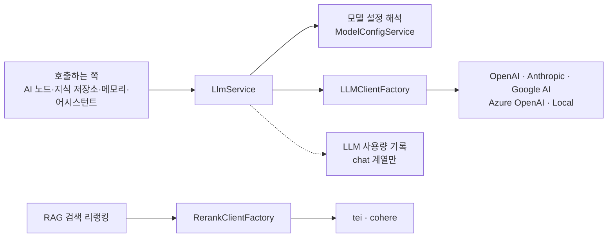

> 구현 상태: 구현됨 · 원문: `spec/5-system/7-llm-client.md`, `spec/4-nodes/3-ai/_product-overview.md` (§3.1), `spec/data-flow/7-llm-usage.md` (§1.1·§1.2 호출 계약), `spec/3-workflow-editor/4-ai-assistant.md` (harmony 제어 토큰 대응), `spec/4-nodes/3-ai/1-ai-agent.md` (§12.16 SDK 타임아웃과의 관계) · 용어: [용어 사전](../CLE-GLOSSARY.md)

## 개요

LLM 클라이언트(`LLMClient`, `LlmService`)는 여러 모델 프로바이더(model provider, `provider`)를 한 인터페이스로 부르는 계층이다. AI 에이전트 노드·텍스트 분류기 노드·정보 추출기 노드, 지식 저장소(Knowledge Base, `KnowledgeBase`)의 임베딩과 그래프 추출, 에이전트 메모리, 워크플로우 AI 어시스턴트가 모두 이 계층으로 모델을 부른다. 호출하는 쪽은 `chat`·`chatStream`·`embed` 세 가지 표면만 알면 되고, 프로바이더별 차이는 팩토리 한 곳에서 흡수한다.

이 문서는 인터페이스, 클라이언트 팩토리, 프로바이더별 API 매핑, 저장 전 모델 목록 미리보기 경로, SSRF 가드, 에러 매핑, API 키 보안, LLM 스텁 모드, 스트리밍, 서비스 계층(`LlmService`)의 호출 계약을 정한다. 리랭킹용 클라이언트(`RerankClient`)도 여기서 다룬다.

범위 밖 문서는 다음과 같다.

- 모델 설정(Model settings, `ModelConfig`) 화면·API·권한: [모델 설정](CLE-AI-MODELS.md). 프로바이더 관리 제품 요구사항(LLM-01~07)도 그 문서의 요구사항에 모았다.
- 모델 설정 엔티티와 LLM 사용량 기록·비용 계산: [LLM 사용량 기록](CLE-AI-USAGE.md)
- 비대칭 임베딩 입력 규칙과 지식 저장소 임베딩 파이프라인: [문서 임베딩](../CLE-KB/CLE-KB-EMBED.md)
- 리랭킹 적용 순서와 동적 점수 컷: [RAG 검색](../CLE-KB/CLE-KB-SEARCH.md)
- 취소 신호 전파 규약: [노드 취소](../CLE-EXEC/CLE-EXEC-CANCEL.md)

아래 그림은 호출 경로를 보여 준다. Chat·Embedding 호출은 `LlmService` 를 거쳐 `LLMClientFactory` 가 만든 클라이언트로 가고, 리랭킹은 `LlmService` 를 거치지 않는 별도 팩토리로 간다.



## 지원 프로바이더

| 프로바이더 | Chat | Embedding | 인증 | 비고 |
|-----------|------|-----------|------|------|
| OpenAI | ✅ | ✅ | API Key | GPT-4o, text-embedding-3-small 등 |
| Anthropic | ✅ | ❌ | API Key | Claude 4.x, Messages API |
| Google AI | ✅ | ✅ | API Key | Gemini 시리즈 |
| Azure OpenAI | ✅ | ✅ | API Key + Endpoint | OpenAI 호환, 커스텀 배포 |
| Local (Ollama/vLLM) | ✅ | ✅ | 없음 (선택) | OpenAI 호환 API |

위 표는 Chat·Embedding 종류(`kind=chat`, `kind=embedding`)의 프로바이더다. `local` 은 설정 값으로는 독립된 `provider` 값이다. 구현 클래스 `LocalClient` 가 `OpenAIClient` 를 상속해 OpenAI 호환 엔드포인트(Ollama·vLLM 등)를 `base_url` 로 부른다.

### 리랭커 프로바이더

리랭킹은 전용 `/rerank` 엔드포인트를 쓰므로 프로바이더 집합·설정 종류(`kind=rerank`)·팩토리를 Chat·Embedding 과 따로 둔다.

| 프로바이더 | 상태 | 인증 | 비고 |
|-----------|------|------|------|
| TEI (자가호스팅) | 구현됨 | 없음 (선택) | HuggingFace Text-Embeddings-Inference 가 서빙하는 `bge-reranker-v2-m3` / `dragonkue/bge-reranker-v2-m3-ko`. 자가호스팅 우선 경로 |
| Cohere | 구현됨 | API Key | `rerank-3.5` 등. 외부 API 경로 |

지원 범위는 `tei` 와 `cohere` 두 가지로 끝낸다. `jina`·`voyage`·`local`·`builtin` 은 지원하지 않는다(2026-06-05 결정, [Rationale](#리랭커-프로바이더를-두-가지로-끝낸-이유)). 리랭커 모델 설정 엔티티는 [LLM 사용량 기록](CLE-AI-USAGE.md), 리랭킹 적용은 [RAG 검색](../CLE-KB/CLE-KB-SEARCH.md) 에서 정한다.

## 인터페이스

### LLMClient

```typescript
interface LLMClient {
  /**
   * 채팅 완료 (Chat Completion).
   * `signal` 은 진행 중인 HTTP 요청을 abort 한다
   * (cancel-others-on-fail / 워크플로우 타임아웃 / 사용자 취소 정리).
   */
  chat(params: ChatParams, signal?: AbortSignal): Promise<ChatResult>;

  /** 텍스트 임베딩 생성. 입력 텍스트 배열 → 벡터 배열만 반환 (메타데이터 없음).
   *  `inputType` 은 비대칭 임베딩 모델에서 query/document 를 구분한다 */
  embed(
    texts: string[],
    model?: string,
    inputType?: "query" | "document",
  ): Promise<number[][]>;

  /** 사용 가능한 모델 목록 (`signal` 로 abort 가능) */
  listModels(signal?: AbortSignal): Promise<ModelInfo[]>;

  /** 연결 테스트 (모델 목록 조회 등 가벼운 API 호출) */
  testConnection(): Promise<boolean>;

  /**
   * 채팅 스트리밍 (선택). 지원하지 않는 프로바이더는 호출 즉시
   * `LLM_STREAMING_UNSUPPORTED` 를 throw 한다. 상세는 스트리밍 절.
   */
  stream?(params: ChatParams, signal?: AbortSignal): AsyncIterable<ChatStreamEvent>;
}
```

코드의 응답 타입 이름은 `ChatResult` 이고 아래 `ChatResponse` 와 구조가 같다. `Message` 인터페이스는 코드에서 `ChatMessage` 다. 취소 신호 전파 규약은 [노드 취소](../CLE-EXEC/CLE-EXEC-CANCEL.md) 에서 정한다.

### ChatParams / ChatResponse

```typescript
interface ChatParams {
  model: string;
  messages: Message[];
  temperature?: number;       // 0.0 ~ 2.0
  maxTokens?: number;
  topP?: number;              // 0.0 ~ 1.0
  responseFormat?: 'text' | 'json';
  jsonSchema?: object;        // responseFormat=json 일 때 스키마
  tools?: ToolDef[];          // function calling 도구 정의
  toolChoice?: 'auto' | 'required' | 'none';
}

interface Message {
  role: 'system' | 'user' | 'assistant' | 'tool';
  content: string;
  toolCallId?: string;        // role=tool 일 때 참조할 tool_call ID
  toolCalls?: ToolCall[];     // role=assistant 일 때 도구 호출 요청
}

interface ChatResponse {
  content: string | null;
  toolCalls?: ToolCall[];
  usage: TokenUsage;
  model: string;
  finishReason: 'stop' | 'tool_calls' | 'length' | 'content_filter';
}

interface TokenUsage {
  inputTokens: number;
  outputTokens: number;
  totalTokens: number;
  thinkingTokens?: number;    // reasoning/thought 토큰. OpenAI reasoning 모델·Gemini 2.5 에서만 채워진다
}
```

### embed 시그니처

임베딩은 파라미터·응답 객체를 쓰지 않는 평탄한 시그니처를 쓴다. `inputType?` 처럼 선택적 스칼라 위치 인자를 더하는 것은 이 원칙 안이다. 원칙이 막는 것은 `EmbedParams`·`EmbedResponse` 같은 감싸는 객체다([Rationale](#embed-에-위치-인자를-더한-이유)). 서비스 계층 `LlmService.embed` 의 배치·옵션 래퍼는 [서비스 계층](#서비스-계층) 에서 정한다.

```typescript
// embed(texts, model?, inputType?: 'query' | 'document'): Promise<number[][]>
//   texts     : 임베딩할 입력 배열 (배치)
//   model     : 모델 ID. 생략하면 클라이언트별 기본 임베딩 모델
//   inputType : 비대칭 검색 모델용 힌트. 생략하면 'document'(적재 경로 기본값).
//               검색 query 경로만 'query' 를 명시한다. 대칭 모델은 무시한다.
//   반환      : 입력 순서대로의 벡터 배열. usage·dimensions 같은 메타데이터는 반환하지 않는다
```

입력 유형(`inputType`)을 빠뜨리면 색인은 되지만 검색 품질이 조용히 떨어진다. 모델별 적용 규칙은 [문서 임베딩](../CLE-KB/CLE-KB-EMBED.md) 에서 정하고, 매핑 순수 함수는 `codebase/backend/src/modules/llm/embedding-input-type.ts` 에 있다. 요약하면 다음과 같다.

- e5 계열(multilingual-e5, e5-{small,base,large}): 입력 텍스트에 `query: ` / `passage: ` 접두사를 붙인다. OpenAI 호환 경로에서 처리한다.
- Google Gemini: `embedContent` 의 `taskType`(RETRIEVAL_QUERY / RETRIEVAL_DOCUMENT)으로 넘긴다. 텍스트는 바꾸지 않는다.
- 대칭 모델(OpenAI text-embedding-3, bge-m3 등)과 매칭되지 않는 모델: 아무것도 하지 않는다.

토큰 사용량·차원 메타데이터를 함께 돌려주는 `EmbedResponse` 는 미구현(Planned)이다. 임베딩 호출의 사용량은 현재 기록하지 않는다([LLM 사용량 기록](CLE-AI-USAGE.md)).

### ToolDef / ToolCall

```typescript
interface ToolDef {
  name: string;
  description: string;
  parameters: object;          // JSON Schema
}

interface ToolCall {
  id: string;
  name: string;
  arguments: string;           // JSON string
  signature?: string;          // 프로바이더 불투명 값 (Gemini 2.5+/3.x thought_signature). 다음 대화 기록 턴에 그대로 되돌려 보내야 한다
}
```

### ModelInfo

모델 목록 항목(`ModelInfo`)은 프로바이더 `listModels` 응답의 한 항목(DTO)이다. 저장된 프로바이더 설정 엔티티인 모델 설정(`ModelConfig`)과 접두어만 같고 다른 개념이다.

```typescript
interface ModelInfo {
  id: string;                  // 모델 식별자 (예: "gpt-4o")
  name: string;                // 표시 이름
  type: 'chat' | 'embedding';  // 용도
}
```

### RerankClient

cross-encoder 리랭킹은 Chat·Embedding 과 API 모양이 달라 `LLMClient` 에 넣지 않고 별도 인터페이스로 둔다. [RAG 검색](../CLE-KB/CLE-KB-SEARCH.md) 의 리랭킹 단계가 부른다.

```typescript
interface RerankClient {
  /**
   * (query, document) 쌍을 cross-encoder 로 점수화해 관련도 순 index+score 를 반환한다.
   * documents 순서와 상관없이 score 내림차순으로 정렬된 결과다.
   */
  rerank(query: string, documents: string[], model?: string,
         opts?: { topK?: number }): Promise<{ index: number; score: number }[]>;
}
```

`RerankService` 는 `rerank()` 를 부를 때 `topK = candidates.length` 로 후보 전체를 다시 점수화한다. 작은 `topK` 로 미리 줄이면 뒤따르는 동적 점수 컷이 의미가 없어지기 때문이다. 최종 주입 청크 수는 `RerankService` 의 동적 점수 컷(`applyDynamicCut`)이 정한다([RAG 검색](../CLE-KB/CLE-KB-SEARCH.md)). 따라서 `opts.topK` 는 클라이언트 수준 상한일 뿐이고 생성 주입 컷의 단일 기준이 아니다.

## 클라이언트 팩토리

설정은 한 테이블(`ModelConfig`)에 `kind` 로 구분해 두지만 팩토리는 `kind` 로 나뉜다. `kind='chat'|'embedding'` 은 `LLMClientFactory`, `kind='rerank'` 는 `RerankClientFactory` 가 맡는다. 리랭킹 호출의 `(query, docs[])` 입력, 점수 배열 출력, 스트리밍 없음 같은 모양 차이는 팩토리 층에서 흡수한다.

### LLMClientFactory

`LLMClientFactory` 는 Chat 종류 모델 설정에서 평탄하게 뽑은 옵션(`LLMClientCreateOptions`)으로 알맞은 `LLMClient` 구현체를 만든다. 엔티티 전체가 아니라 `{ provider, apiKey, defaultModel, baseUrl? }` 만 받아 클라이언트 클래스마다 필요한 인자로 옮긴다.

```typescript
interface LLMClientCreateOptions {
  provider: string;
  apiKey: string;
  defaultModel: string;
  baseUrl?: string;
}

class LLMClientFactory {
  create(options: LLMClientCreateOptions): LLMClient {
    switch (options.provider) {
      case 'openai':    return new OpenAIClient(options.apiKey, options.defaultModel, options.baseUrl);
      case 'anthropic': return new AnthropicClient(options.apiKey, options.defaultModel);
      case 'google':    return new GoogleClient(options.apiKey, options.defaultModel);
      case 'azure':     // baseUrl 필수. 없으면 throw
                        return new AzureOpenAIClient(options.apiKey, options.defaultModel, options.baseUrl!);
      case 'local':     // baseUrl 필수. 없으면 throw. OpenAI 호환
                        return new LocalClient(options.defaultModel, options.baseUrl!, options.apiKey);
      default:          throw new Error(`Unsupported LLM provider: ${options.provider}`);
    }
  }
}
```

- Google 클래스 이름은 코드에서 `GoogleClient` 다.
- 팩토리는 `provider` 만 검증한다. `azure`·`local` 의 `baseUrl` 이 없으면 `Error` 를 던지고, 미리보기 경로는 이를 `MODEL_CONFIG_INVALID` 로 감싼다.

### RerankClientFactory

리랭커는 별도 팩토리로 떼어 `LLMClientFactory` 의 Chat·Embedding 프로바이더 분기를 섞지 않는다. Rerank 종류 모델 설정에서 `{ provider, apiKey?, defaultModel, baseUrl? }` 를 받아 `RerankClient` 구현체를 만든다.

```typescript
class RerankClientFactory {
  create(options: { provider: string; apiKey?: string; defaultModel: string; baseUrl?: string }): RerankClient {
    switch (options.provider) {
      // tei 의 baseUrl, cohere 의 apiKey 가 없으면 팩토리가 명시적으로 Error 를 던진다
      case 'tei':    // baseUrl 필수 (자가호스팅 HF TEI)
                     return new TeiRerankClient(options.baseUrl!, options.defaultModel, options.apiKey);
      case 'cohere': // baseUrl 선택. 생략하면 기본 `https://api.cohere.com` (프록시·테스트 override 용)
                     return new CohereRerankClient(options.apiKey!, options.defaultModel, options.baseUrl);
      default:       throw new Error(`Unsupported rerank provider: ${options.provider}`);
    }
  }
}
```

지원하지 않는 프로바이더 구성은 구성 시점 검증 실패로 보고 `MODEL_CONFIG_INVALID` 계열로 감싼다. 클라이언트 계층에는 리랭킹 전용 런타임 에러 코드를 새로 두지 않는다. SSRF 가드는 [SSRF 가드](#ssrf-가드) 규칙을 그대로 쓴다.

리랭커 설정 에러 코드는 층마다 다르다.

| 층 | 코드 | 쓰는 때 |
|----|------|--------|
| 설정 CRUD(`/api/model-configs`) | `MODEL_CONFIG_INVALID`, `MODEL_CONFIG_NOT_FOUND` | 미지원 프로바이더·SSRF 차단 같은 구성 검증 실패, 없는 설정 |
| 검색 실행(리랭킹 호출) | `RERANK_CONFIG_INVALID` | 검색 중 Rerank 종류 설정이 없거나 프로바이더를 쓸 수 없을 때. 에러를 던지지 않고 그 지식 저장소를 코사인 경로로 강등한 뒤 검색 진단에 남긴다 |

`RERANK_CONFIG_INVALID` 는 검색 층 전용이고 `MODEL_CONFIG_*` 는 설정 CRUD 층 전용이다. 강등 규칙과 검색 진단 필드는 [RAG 검색](../CLE-KB/CLE-KB-SEARCH.md) 에서 정한다.

## 프로바이더별 매핑

### OpenAI

| 인터페이스 | OpenAI API |
|-----------|-----------|
| `chat()` | `POST /v1/chat/completions` |
| `embed()` | `POST /v1/embeddings`. e5 계열 모델(OpenAI 호환 자가호스팅)이면 입력에 `query:`/`passage:` 접두사를 붙이고, native 모델은 그대로 둔다 |
| `listModels()` | `GET /v1/models` |
| `responseFormat: 'json'` | `response_format: { type: "json_schema", json_schema }` |
| `tools` | `tools` 파라미터로 바로 옮긴다 |

### Anthropic

| 인터페이스 | Anthropic API |
|-----------|-------------|
| `chat()` | `POST /v1/messages` |
| `embed()` | ❌ 지원하지 않는다 (임베딩은 다른 프로바이더 모델을 써야 한다) |
| `listModels()` | `client.models.list()`. Anthropic 모델 조회 API 를 실시간으로 부른다 |
| `messages[].role` | `system` 은 별도 `system` 파라미터로 뺀다 |
| `tools` | Anthropic tool_use 형식으로 바꾼다 |
| `maxTokens` | `max_tokens` (필수 파라미터) |

### Google AI

| 인터페이스 | Google API |
|-----------|-----------|
| `chat()` | `ai.models.generateContent()` (`@google/genai` SDK) |
| `embed()` | `ai.models.embedContent()` 배치 지원. `config.taskType` = RETRIEVAL_QUERY / RETRIEVAL_DOCUMENT (`inputType` 매핑) |
| `listModels()` | `ai.models.list()`. Gemini 모델 조회 API 를 실시간으로 부른다. `supportedActions` 에 `generateContent` 가 있으면 chat, `embedContent` 가 있으면 embedding 으로 나눈다 |
| `stream()` | `ai.models.generateContentStream()` (새 SDK 는 평탄한 AsyncGenerator 를 돌려준다) |
| `tools` | `functionDeclarations` 로 옮기고, 스키마는 OpenAPI 3.0 서브셋으로 정리한다 |

### Local (Ollama/vLLM)

- OpenAI 호환 API 를 쓴다(`base_url` + OpenAI 클라이언트).
- `api_key` 는 선택이다. 없으면 빈 문자열을 쓴다.
- 모델 목록은 `GET {base_url}/v1/models` 또는 Ollama `GET /api/tags` 로 가져온다.

### 리랭커

| 프로바이더 | `rerank()` 엔드포인트 | 상태 |
|----------|--------------------|------|
| TEI | `POST {base_url}/rerank` (HF Text-Embeddings-Inference). 모델은 서버에 고정 로드돼 있어 본문에 싣지 않는다(`defaultModel` 은 식별·로깅 용도). `opts.topK` 를 지원하지 않아 호출하는 쪽이 정렬한 뒤 자른다 | 구현됨 |
| Cohere | `POST {base_url}/v2/rerank` (`{ model, query, documents, top_n }` → `{ results: [{ index, relevance_score }] }`). `base_url` 을 생략하면 `https://api.cohere.com` | 구현됨 |

## 모델 목록 미리보기

모델 설정 화면에서 기본 모델을 고르려면 아직 저장하지 않은 자격 증명으로 `listModels` 를 불러야 한다. 이 경로는 저장된 설정을 쓰는 `LlmService` 와 떨어진 전용 서비스 `LlmPreviewService.previewModels` 가 맡는다. 엔드포인트(`POST /api/model-configs/preview-models`)·권한·rate limit 은 [모델 설정](CLE-AI-MODELS.md) 에서 정한다.

- 요청 본문 `{ provider, apiKey, baseUrl? }` 로 `LLMClientFactory` 가 임시 클라이언트를 만들고 `client.listModels(signal)` 을 한 번 부른다.
- 반환 값은 저장된 설정용 `GET /api/model-configs/:id/models` 와 같은 `ModelInfo[]` 다. 보안 계약도 같다.
- 임시 클라이언트는 설정별 캐시에 넣지 않고 요청 범위에서만 쓴다.
- 타임아웃은 30초다.
- `local` 이 아닌 프로바이더에서 `apiKey` 가 비어 있으면 `LLM_CREDENTIALS_REQUIRED` 로 거부한다.
- 프로바이더 원본 에러는 [에러 처리](#에러-처리) 의 sanitize 규칙대로 가공해 400 `LLM_MODEL_LIST_FAILED` 로 돌려준다. 키와 엔드포인트 원문은 드러내지 않는다.
- 저장 전 `baseUrl` 은 [SSRF 가드](#ssrf-가드) 를 거친다.

### 모델 목록 결과 수 상한

프로바이더가 돌려준 모델 수는 방어적 상한 **500**(`MAX_MODEL_LIST_SIZE`, `llm/list-models-cap.ts`)에서 자른다. 미리보기와 저장된 설정의 `GET :id/models` 에 똑같이 적용한다. 정상 프로바이더(수십 개)에는 닿지 않는 값이다. 사용자가 지정한 `baseUrl`·local 처럼 비정상적으로 큰 응답에서 메모리와 페이로드를 지키려는 장치다. 넘치면 앞 500개만 남기고(프로바이더 순서 유지, 다시 정렬하지 않음) 경고 로그를 남긴다. 응답 계약(`ModelInfo[]`)은 바뀌지 않는다.

### API 키 로깅 금지

`apiKey` 는 로그·응답·캐시 어디에도 기록하지 않는다.

- 미리보기 엔드포인트는 `apiKey` 를 요청 본문으로 받는다. 운영 계약상 요청 본문은 로거·APM·에러 트래커가 캡처하면 안 된다.
- 나중에 요청 본문 로깅을 도입하면 `common/utils/mask-sensitive-fields.util.ts` 의 `maskSensitiveFields` 로 감싸 `apiKey`·`password`·`token` 계열 필드를 자동으로 가려야 한다.
- 키를 본문 대신 전용 헤더로 보내고 TTL 이 있는 임시 설정 프록시를 두는 완전한 분리는 별도 작업 범위다. 지금은 "본문에는 있지만 어느 경로에도 기록하지 않는다" 를 지킨다.

## SSRF 가드

모델 설정의 `baseUrl` 과 미리보기 요청의 `baseUrl` 은 SSRF 가드를 거친다. 모델 설정을 만들고 고칠 때와 미리보기에서 같은 규칙을 쓴다.

- 차단 대상: loopback(`127.0.0.0/8`, `::1`), RFC1918(`10/8`·`172.16/12`·`192.168/16`), link-local(`169.254/16`, `fe80::/10`), IPv6 ULA(`fc00::/7`), IPv4-mapped IPv6, `0.0.0.0/8`. 걸리면 `MODEL_CONFIG_INVALID` 로 거부한다.
- 도메인 hostname 은 `dns.lookup` 으로 먼저 해석한 뒤 같은 규칙을 다시 적용한다(DNS rebinding 1차 방어).
- 예외: 자가호스팅 프로바이더는 사설망·localhost 를 허용한다. Chat·Embedding 에서는 `local`(자가호스팅 Ollama·vLLM), Rerank 에서는 `tei` 가 해당한다. Rerank 에는 `local` 프로바이더가 없다.
- 외부 프로바이더(`cohere` 등)의 `baseUrl` 로는 복호화한 Bearer 키가 전송되므로 사설망·loopback 주소를 막는다.
- 한계: TTL 이 지난 뒤 다시 해석하는 DNS rebinding 2차 공격은 연결 시점에 개입해야 막을 수 있어 지금은 차단하지 않는다. 실제 차단이 필요하면 나가는 트래픽을 막는 방화벽이나 클라우드 네트워크 정책으로 보완한다.

현재 구현은 `LlmPreviewService` 의 `isPrivateHost`·`resolvesToPrivate` 와 `ModelConfigService` 의 생성·수정 경로가 이 가드를 적용한다.

## 에러 처리

클라이언트 계층(`*.client.ts`)은 프로바이더 원본 에러를 아래 코드로 좁혀 옮긴다. 현재 구현은 429 를 `LLM_RATE_LIMIT`, 그 밖의 실패를 `LLM_CONNECTION_ERROR` 로 나누는 두 갈래가 기본이다. OpenAI 계열 스트리밍에서 harmony 토큰이 섞여 나오면 `LLM_OUTPUT_MALFORMED` 로 따로 나눈다.

| 에러 유형 | HTTP 상태 | 코드와 처리 |
|----------|----------|------|
| 속도 제한 | 429 | `LLM_RATE_LIMIT`. 지수 백오프로 최대 3회 재시도(`withRetry`) |
| 네트워크·기타 실패 | - | `LLM_CONNECTION_ERROR`. 위 분기에 들지 않는 모든 클라이언트 호출 실패의 기본값이다(인증 실패·모델 없음·컨텍스트 초과 포함) |
| 출력 오염 | - | `LLM_OUTPUT_MALFORMED`. gpt-oss 계열 harmony 제어 토큰이 드러날 때(OpenAI 스트리밍 경로). 사용자에게는 안내문으로 바꿔 보여 준다([harmony 제어 토큰 거르기](#harmony-제어-토큰-거르기)) |
| 자격 증명 누락 | 400 | `LLM_CREDENTIALS_REQUIRED`. 미리보기 요청에서 local 이 아닌 프로바이더의 `apiKey` 가 없을 때 |
| 프로바이더 설정 에러 | 400 | `MODEL_CONFIG_INVALID`. 팩토리 생성 실패(azure·local 의 `baseUrl` 누락, 알 수 없는 프로바이더) 또는 SSRF 차단 |
| 모델 목록 조회 실패 | 400 | `LLM_MODEL_LIST_FAILED`. 미리보기·`:id/models` 호출 중 프로바이더 응답이 실패할 때. sanitize 한 메시지를 싣는다 |
| 스트리밍 미지원 | - | `LLM_STREAMING_UNSUPPORTED`. 지원하지 않는 프로바이더에 `stream()` 을 부를 때 |

- 세분화 코드 `LLM_AUTH_ERROR`(401), `LLM_MODEL_NOT_FOUND`(404), `LLM_CONTEXT_EXCEEDED`(400)는 미구현(Planned)이다. 지금은 모두 `LLM_CONNECTION_ERROR` 로 모인다.
- 타임아웃은 `withTimeout` 이 `AbortController` 로 진행 중인 요청을 취소하고 "Request timed out after {ms}ms" 에러를 던진다. 전용 `LLM_TIMEOUT` 코드로 옮기지 않는다. 노드 실행 계층(`nodes/core/error-codes.ts`)의 `LLM_TIMEOUT` 은 별개의 노드 분류다. 호출 타임아웃 기준은 정의가 갈린다. [미결 사항](#미결-사항) 참조.
- 노드 계층 에러 분류와 이 표의 대응은 [AI 노드 공통](../CLE-NODE-AI/CLE-NODE-AI-COMMON.md) 과 [에러 코드 규약과 카탈로그](../CLE-API/CLE-API-ERRCODES.md) 에서 다룬다.

### harmony 제어 토큰 거르기

gpt-oss 계열 모델(예: gpt-oss-120b)은 `<|channel|>final<|message|>...` 같은 harmony 제어 토큰을 응답에 드러낼 수 있다. 그대로 두면 OpenAI SDK 의 SSE 파서가 이 토큰을 파싱하다 "Failed to parse input at pos 0: ..." 예외를 던진다. 그러면 사용자에게 원시 `LLM_CONNECTION_ERROR` 가 보인다. `openai.client.ts` 는 이를 두 층으로 막는다.

1. 스트리밍 중에 `delta.content` 와 tool_call 인자에서 제어 토큰을 지운다(`stripHarmonyTokens`). 패턴은 두 개다.
   - `HARMONY_CHANNEL_PREAMBLE_REGEX = /<\|channel\|>[\s\S]*?<\|message\|>/g`: 채널 이름을 포함한 preamble 전체를 한 번에 지운다.
   - `HARMONY_STANDALONE_TOKEN_REGEX = /<\|(channel|start|end|message|return|constrain|...)\|>/g`: 남은 단독 토큰을 지운다.
2. catch 블록에서 에러 메시지가 harmony 패턴과 맞으면 `LLM_OUTPUT_MALFORMED` 로 분류하고 사용자용 한국어 안내문으로 바꾼다. 원시 메시지는 화면에 내보내지 않고 로그에만 남긴다.

새 제어 토큰이 관찰되면 `HARMONY_STANDALONE_TOKEN_REGEX` 의 선택지에 더한다. 어시스턴트 화면에서 렌더 직전에 한 번 더 거르는 규칙(`sanitizeAssistantText`)과 이 대응을 들인 경위는 [워크플로우 AI 어시스턴트](../CLE-WF/CLE-WF-ASSIST.md) 에서 다룬다.

## API 키 보안

- 저장: AES-256-GCM 으로 암호화한다(기존 `encrypt`/`decrypt` 유틸리티). 암호화 위치와 복호화 시점은 [LLM 사용량 기록](CLE-AI-USAGE.md) 의 모델 설정 엔티티 절에서 정한다.
- 암호화 키: 환경 변수 `ENCRYPTION_KEY`.
- API 응답: 필드 마스킹(`***<last4>`)을 적용한다. 현재 구현은 `****` 뒤에 마지막 4자를 붙인다.
- 로그: API 키를 절대 로깅하지 않는다.

### LLM 스텁 모드

LLM 스텁 모드(`LLM_STUB_MODE`)는 dockerized e2e(`execution-park-resume.e2e-spec.ts`)가 실제 LLM 키와 외부 호출 없이 멀티턴 AI 노드의 park·재개·rehydration 경로를 늘 같은 결과로 검증하게 하는 환경 변수 게이트 스텁 클라이언트다(`OAUTH_STUB_MODE` 선례).

- `LlmService.createClient` 는 ConfigService 의 `llm.stubMode`(env `LLM_STUB_MODE` 유래, `registerAs('llm')` 네임스페이스)가 켜져 있으면 캐시·복호화 경로보다 먼저 `StubLlmClient` 를 돌려준다. 스텁이 항상 먼저 잡히므로 실제 클라이언트가 먼저 캐시된 상태에서 생기는 오염을 막는다. 이 경로에서는 모델 설정의 `apiKey` 를 쓰지 않는다.
- 운영 차단: 부팅 가드가 `NODE_ENV=production` 과 `LLM_STUB_MODE=true` 조합을 fail-closed 로 throw 한다. 가드는 `main.ts` 가 부르는 `assertProductionConfig`(`common/config/production-guards.ts`)에 있다. 이 함수는 `JWT_SECRET`·`ENCRYPTION_KEY`·`MCP_ALLOW_INSECURE_URL`·`OAUTH_STUB`·`LLM_STUB` 을 모은 운영 환경 가드다([세션과 토큰](../CLE-ACCT/CLE-ACCT-SESSION.md) Rationale 「운영 환경 가드」). 운영 환경에서는 절대 켜지지 않는다.
- 스텁 응답 계약(`StubLlmClient`, `codebase/backend/src/modules/llm/clients/stub.client.ts`): `chat` 은 마지막 user 메시지를 `[stub] received: <msg>` 로 되돌려 주고 도구 호출을 만들지 않는다. 멀티턴 AI 노드가 응답을 내보낸 뒤 다시 park 하므로 매 턴의 cold rehydration 경로를 반복해서 검증할 수 있다. `embed` 는 0 벡터, `listModels` 는 `stub-model` 1건을 돌려준다.

## 스트리밍

워크플로우 AI 어시스턴트처럼 턴 지연이 사용 경험에 중요한 기능을 위해 `LLMClient` 는 선택적 `stream()` 메서드를 둔다. 시그니처는 [LLMClient](#llmclient) 절과 같다. `chat()` 과 독립적으로 구현하고, 스트리밍을 지원하지 않는 프로바이더는 호출 시 명시적 에러를 던진다.

### 스트림 이벤트

```typescript
type ChatStreamEvent =
  | { type: 'text_delta'; delta: string }
  | { type: 'tool_call_delta'; id: string; name?: string; argumentsDelta: string }
  | { type: 'tool_call_end'; id: string; name: string; arguments: string;
      signature?: string }   // 완성된 tool call 전체를 싣는다. signature 는 ToolCall.signature 와 같다
  | { type: 'done'; usage: TokenUsage; model: string;
      finishReason: ChatResponse['finishReason'] | 'aborted' }   // 'aborted' = 클라이언트 취소
  | { type: 'error'; code: string; message: string };
```

| 이벤트 | 의미 |
|--------|------|
| `text_delta` | assistant 텍스트의 부분 증분 |
| `tool_call_delta` | tool_call 인자의 부분 증분. 같은 `id` 로 여러 번 나온 뒤 `tool_call_end` 로 끝난다 |
| `tool_call_end` | tool_call 한 건 완성. 완성된 `name`·`arguments`(+`signature?`)를 싣는다. 호출하는 쪽이 shadow 실행·검증을 시작할 시점이다 |
| `done` | 스트림 전체 종료. usage 는 LLM 응답에 들어 있을 때만 정확하고, 없으면 `0` 으로 보고한다 |
| `error` | 스트림 중단 사유. 클라이언트는 이후 이벤트를 받지 않는다 |

### 프로바이더별 구현

| 프로바이더 | 지원 | 내부 매핑 |
|-----------|------|-----------|
| OpenAI | ✅ | `chat.completions.create({stream: true})`. `choices[0].delta.content` → `text_delta`, `choices[0].delta.tool_calls[].function.arguments` → `tool_call_delta`, `choices[0].finish_reason` → `done` |
| Anthropic | ✅ | `messages.stream()`. `content_block_delta`(text_delta/input_json_delta), `content_block_start`/`content_block_stop` 으로 `tool_call_end` 를 판정하고, `message_delta` 에서 usage 를 모은다 |
| Google AI | ✅ | 새 `@google/genai` SDK 의 `ai.models.generateContentStream()` 한 경로만 쓴다(별도 `ChatSession`·`GenerativeModel` 객체 없음). 스트림 조각마다 `candidates[].content.parts` 를 돌며 `text` part 는 `text_delta` 로 보낸다. `functionCall` part 는 인자가 완결된 JSON 으로 한 번에 오므로 `tool_call_delta` 와 `tool_call_end` 를 같은 자리에서 바로 보낸다(OpenAI 처럼 `arguments` 조각을 모으는 단계가 없다). usage 는 `usageMetadata` 에서 한 번 모은다 |
| Azure OpenAI | ✅ | OpenAI 호환 SDK 의 스트리밍 SSE 를 그대로 쓴다. `AzureOpenAIClient` 가 `OpenAIClient.stream` 을 상속하고 deployment name 과 `api-version` 만 base URL·헤더에 옮긴다 |
| Local (Ollama/vLLM) | ✅ | OpenAI 호환 엔드포인트로 같은 코드 경로(`LocalClient extends OpenAIClient`)를 쓴다. Ollama 11434, vLLM OpenAI 호환 모드에서 스트리밍을 검증했다 |

### 스트리밍 에러 매핑

| 경우 | 이벤트 | 비고 |
|--------|--------|------|
| 429 rate limit (스트리밍 시작 전) | `error` (code=`LLM_RATE_LIMIT`) | [에러 처리](#에러-처리) 의 재시도 정책을 쓴다 |
| 시작 뒤 네트워크 단절 | `error` (code=`LLM_CONNECTION_ERROR`) | 클라이언트가 다시 시작하도록 안내한다 |
| 클라이언트 취소 (사용자 Stop) | `done` (finishReason=`aborted`) | 서버는 usage 가 확인되는 만큼만 기록한다 |
| 지원하지 않는 프로바이더에 stream 요청 | 스트림 시작 전 `LLM_STREAMING_UNSUPPORTED` throw | 호출하는 쪽이 non-streaming 대체 경로를 쓸지 정한다 |

### chat() 과의 관계

- `chat()` 은 모든 프로바이더가 반드시 구현한다. 어시스턴트 밖의 AI 노드·임베딩·연결 테스트는 계속 `chat()` 을 쓴다.
- `stream()` 은 워크플로우 AI 어시스턴트 전용이다. AI 에이전트 노드의 스트리밍 응답 요구사항(`ND-AG-09`)이 필수가 되면 그때 넓혀 적용한다.

## 서비스 계층

`LlmService` 는 모든 LLM 호출이 지나는 단일 창구다. 설정 해석(`resolveConfig`)·`chat`·`chatStream`·`embed`·`listModels`·`testConnection` 을 제공한다.

```typescript
class LlmService {
  // chat / embed / resolveConfig 유지. testConnection 은 kind 별 probe 분기(아래 표).

  /** 배치 임베딩. 20개 단위로 나눠 보내고 내부 재시도를 한다. LLMClient.embed 의 래퍼.
   *  opts(timeoutMs/disableInnerRetry)는 서비스 래퍼 전용이라 LLMClient 인터페이스에는 없다.
   *  inputType 기본값은 'document'(적재), 검색 query 만 'query'. */
  embed(
    config: LlmConfig,
    texts: string[],
    model?: string,
    opts?: Pick<LlmCallOptions, 'timeoutMs' | 'disableInnerRetry'>,
    inputType?: 'query' | 'document',   // 생략하면 'document'
  ): Promise<number[][]>;

  /** 스트리밍 chat. client.stream 에 넘기고, done 이벤트에서 llmUsageLogService.record() 를 fire-and-forget 으로 부른다 */
  chatStream(
    config: LlmConfig,
    params: ChatParams,
    context?: LlmCallContext,
    signal?: AbortSignal,
  ): AsyncIterable<ChatStreamEvent>;
}
```

- `LlmCallOptions`(`timeoutMs`·`disableInnerRetry`·`signal`)는 코드(`llm.service.ts`)가 기준이다. `embed` 는 그중 `timeoutMs`·`disableInnerRetry` 만 받는다.
- 호출 예: `opts` 없이 query 임베딩만 원하면 네 번째 인자에 `undefined` 를 명시한다. `embed(config, texts, model, undefined, 'query')`. 위치 인자라서 `inputType` 만 넘길 때는 `opts` 자리를 비워야 한다.

### 호출 신뢰성 계약

`chat` 호출은 `LlmCallOptions` 로 다음을 제어한다.

- `timeoutMs`: 0 이거나 없으면 타임아웃을 걸지 않는다. 값이 있으면 `withTimeout` race 로 건다.
- 프로바이더 SDK 에도 요청 타임아웃이 따로 있다. OpenAI·Anthropic·Azure OpenAI·Local(OpenAI 계열) 클라이언트는 SDK 를 만들 때 약 120초 요청 타임아웃이 들어간다. `timeoutMs` 는 이 SDK 타임아웃과 나란히 걸리고 먼저 발화하는 쪽이 실제 상한이다. 앱 레벨 값을 1차 상한으로 쓰려면 SDK 타임아웃보다 낮게 준다. 원문은 Google 클라이언트의 SDK 타임아웃을 적지 않는다. 노드별 앱 레벨 기본값(예: `AI_AGENT_LLM_CALL_TIMEOUT_MS`)은 [AI 에이전트 노드](../CLE-NODE-AI/CLE-NODE-AGENT.md) 에서 정한다.
- `withTimeout` 은 콜백에 넘기는 내부 타임아웃 signal 을 호출자 `opts.signal` 과 `AbortSignal.any` 로 합쳐 SDK 요청에 넘긴다. 타임아웃이 나면 실제 프로바이더 HTTP 요청도 취소되므로 소켓이 남지 않는다(`listModels` 와 같은 방식). Google 클라이언트는 `chat(params, signal)` 로 받은 signal 을 `generateContent` 의 `abortSignal` 로 넘긴다. `embed` 경로는 `client.embed` 가 signal 을 받지 않아 이 배선 밖이다.
- `signal`: [노드 취소](../CLE-EXEC/CLE-EXEC-CANCEL.md) 규약을 따른다. 취소되면 SDK 가 바로 throw 하고 재시도 대상이 아니다.
- `disableInnerRetry`: 호출하는 쪽에 자체 재시도 층(예: 지식 저장소의 `retryWithBackoff`)이 있으면 내부 재시도를 꺼서 호출이 불어나지 않게 한다.
- 내부 `withRetry` 는 rate limit(HTTP 429 또는 "rate limit") 에만 최대 3회 재시도한다. RFC 7231 `Retry-After` 헤더(delta-seconds 또는 HTTP-date)가 있으면 그 값을 따르되 상한은 60초다. 없으면 지수 백오프를 쓴다.
- 스트리밍 도중에는 재시도하지 않는다. 시작 전 네트워크 초기화 단계에서만 위 백오프 규칙을 쓴다.
- 호출하는 쪽이 메시지에 붙인 `source` 마커(WebSocket emit 메타)는 프로바이더로 보내기 전에 떼어 낸다.
- chat 계열 호출은 끝난 뒤 사용량을 fire-and-forget 으로 기록한다. `chatStream` 은 `done` 이벤트에서만 기록한다. 적재 규칙은 [LLM 사용량 기록](CLE-AI-USAGE.md) 에서 정한다.

### 설정 해석과 캐시

- `resolveConfig(llmConfigId?, workspaceId)` 는 지정한 모델 설정을 찾고, 없으면 워크스페이스의 Chat 종류 기본 설정을 찾는다. 돌려주는 엔티티의 `api_key` 는 암호문 그대로다.
- `createClient` 가 클라이언트를 만들기 직전에 `getDecryptedApiKey` 로 복호화하고, 만든 클라이언트는 설정별로 캐시한다.
- `listModels` 결과는 설정마다 5분 캐시한다(키 `${workspaceId}|${configId}`). 호출 타임아웃은 30초다.
- 모델 설정을 고치거나 지우면 `ModelConfigService` 가 `notifyInvalidated(id)` 로 통지한다. `LlmService` 는 `onModuleInit` 에서 `onConfigInvalidated` 를 구독해 두었다가 `clearClientCache(id)` 로 클라이언트 캐시와 `listModels` 캐시를 함께 지운다.

### testConnection

`LlmService.testConnection(configId, workspaceId)` 는 저장된 설정으로 연결을 확인한다. 설정은 `ModelConfigService.findEntity(configId, workspaceId)` 로 종류와 상관없이 찾는다([Rationale](#종류와-상관없이-설정을-찾는-이유)).

| 종류 | probe | 반환 |
|------|-------|------|
| chat | `client.testConnection()` (모델 목록 조회 같은 가벼운 호출) | `{ success: true }` |
| embedding | `client.embed(['connection test'], defaultModel)`. 실제 임베딩으로 연결과 모델 유효성을 함께 확인한다 | `{ success: true, dimension? }`. 반환 배열 첫 요소 길이(`vectors[0].length`)를 `dimension` 에 싣는다(0 이면 뺀다) |

- `LLMClient.testConnection(): Promise<boolean>` 인터페이스는 바꾸지 않는다. 차원 추출은 서비스 계층 전용이며 `EmbedResponse`(미구현, `dimensions` 복수) 작업과 따로 간다.
- 감지한 `dimension` 의 자동 저장과 폼의 읽기 전용 표시는 [모델 설정](CLE-AI-MODELS.md) 에서 정한다.
- `rerank` 는 표준 테스트 API 가 없어 연결 테스트를 제공하지 않는다.
- `POST /api/model-configs/:id/test` 는 편집자 이상만 부를 수 있다. 컨트롤러 `LlmModelConfigController.testConnection` 의 `@Roles('editor')` 가 강제한다. 근거는 [모델 설정](CLE-AI-MODELS.md) 의 Rationale 에 있다.

모듈 의존은 `LlmModule → ModelConfigModule` 한 방향이다. 모델 설정 부속 엔드포인트(`preview-models`·`:id/test`·`:id/models`)는 llm 모듈의 `LlmModelConfigController`(`@Controller('model-configs')`, 공개 경로는 그대로)가 맡는다. CRUD 는 `model-config.controller.ts` 에 남는다.

## 미결 사항

- **LLM 호출 타임아웃 기준**: 120초의 근거가 층마다 다르다.
  - 제품 요구: AI 제품 요구사항 NF-AI-01 은 LLM API 호출 타임아웃을 120초(스트리밍 제외)로 요구한다([AI 노드 공통](../CLE-NODE-AI/CLE-NODE-AI-COMMON.md)).
  - 클라이언트 계층(이 문서): `timeoutMs` 를 넘기지 않으면 앱 타임아웃을 걸지 않는다. 120초는 OpenAI·Anthropic·Azure OpenAI·Local 클라이언트의 SDK 요청 타임아웃으로만 걸린다([호출 신뢰성 계약](#호출-신뢰성-계약)). 이 문서에는 120초 제품 규정이 없다. 타임아웃을 `LLM_TIMEOUT` 으로 옮기지도 않는다.
  - 호출하는 쪽: AI 에이전트 노드는 앱 레벨 기본값을 10분(`AI_AGENT_LLM_CALL_TIMEOUT_MS`)으로 두므로 위 프로바이더에서는 대개 SDK 의 120초가 먼저 발화한다([AI 에이전트 노드](../CLE-NODE-AI/CLE-NODE-AGENT.md)). 워크플로우 AI 어시스턴트 문서는 이 문서를 근거로 단일 턴 120초와 `LLM_TIMEOUT` 을 적는데, 어시스턴트는 스트리밍만 쓴다([워크플로우 AI 어시스턴트](../CLE-WF/CLE-WF-ASSIST.md)).

  120초 요구(NF-AI-01)를 SDK 기본값에 맡길지 앱 레벨 기본값으로 보장할지, 스트리밍 턴에 타임아웃을 둘지, 둔다면 값과 에러 코드를 무엇으로 할지 결정 필요.

## 구현 위치

- `codebase/backend/src/modules/llm/clients/*.ts` (프로바이더별 클라이언트, `stub.client.ts` 포함)
- `codebase/backend/src/modules/llm/llm-client.factory.ts`
- `codebase/backend/src/modules/llm/interfaces/llm-client.interface.ts`
- `codebase/backend/src/modules/llm/llm.service.ts`
- `codebase/backend/src/modules/llm/embedding-input-type.ts`
- `codebase/backend/src/modules/llm/llm-preview.service.ts`
- `codebase/backend/src/modules/llm/llm-model-config.controller.ts`
- `codebase/backend/src/modules/llm/list-models-cap.ts`
- `codebase/backend/src/modules/llm/llm-usage-log.service.ts`
- `codebase/backend/src/modules/llm/pricing.ts`
- `codebase/backend/src/modules/llm/rerank/rerank-client.factory.ts`
- `codebase/backend/src/modules/llm/rerank/rerank-client.interface.ts`
- `codebase/backend/src/modules/llm/rerank/clients/*.ts`
- `codebase/backend/src/modules/llm/utils/*.ts`

## Rationale

### 모든 호출을 LlmService 한 곳으로 모은 이유

프로바이더마다 SDK 와 API 규격이 다르지만 호출하는 쪽(노드·지식 저장소·어시스턴트)은 같은 표면(`chat`, `chatStream`, `embed`)만 알면 된다. 프로바이더 분기는 `LLMClientFactory` 한 곳에 모이므로 새 프로바이더를 더해도 호출하는 쪽은 바뀌지 않는다.

### embed 에 위치 인자를 더한 이유

`LLMClient.embed` 인터페이스는 파라미터·응답 객체가 없는 평탄한 시그니처를 지킨다. 그런데 서비스 계층 `LlmService.embed` 는 배치 분할·타임아웃·재시도를 감싼 계층이라서 운영 옵션(`timeoutMs`·`disableInnerRetry`)이 필요하다. 비대칭 검색 모델(e5·Gemini)을 위한 `inputType('query'|'document')` 힌트도 필요하다. 이를 옵션·응답 객체(`EmbedOptions`·`EmbedResponse`)로 묶지 않고 위치 인자로 더한 이유는 두 가지다.

- `EmbedResponse`(usage·dimensions 반환)가 아직 미구현이라 지금 객체로 바꾸면 리팩터링을 두 번 하게 된다.
- `inputType` 을 생략하면 `'document'` 가 되므로 기존 호출부가 그대로 동작하고 변경 범위가 가장 작다.

`EmbedOptions` 객체 통합은 `EmbedResponse` 를 도입할 때 함께 검토한다. 대가로 `opts` 없이 `inputType` 만 넘길 때 네 번째 자리에 `undefined` 를 적어야 한다. 호출부가 조금 불편해지지만 두 번 리팩터링하지 않고 하위 호환을 지키는 쪽이 낫다고 판단했다. `inputType` 의 프로바이더별 적용과 재임베딩 정합성은 [문서 임베딩](../CLE-KB/CLE-KB-EMBED.md) 에서 정한다.

### RerankClient 를 별도 인터페이스로 둔 이유

리랭커 API 모양은 chat·embed 와 근본적으로 다르다. `rerank(query, documents[])` 는 점수 배열을 돌려주고, 스트리밍·system prompt·tool call 같은 chat 개념이 없다. `supportsReranking?: boolean` 같은 기능 플래그로 `LLMClient` 에 넣으면 문제가 세 가지 생긴다.

- 타입 안전성이 떨어진다.
- 구현하지 않은 프로바이더의 런타임 throw 처리가 복잡해진다.
- 프로바이더 분기 하나가 리랭킹·chat·embed 를 함께 다뤄 단일 책임을 어긴다.

별도 인터페이스와 별도 팩토리가 더 명확하다.

### 설정 테이블을 합친 뒤에도 팩토리를 나눠 둔 이유

모델 설정은 한 테이블로 합쳤지만 리랭킹 호출은 입력 `(query, docs[])`·출력 점수 배열·스트리밍 없음이라는 점에서 chat·embedding 과 API 모양이 다르다. 그래서 `RerankClientFactory` 는 따로 두고 `ModelConfig.kind` 로 팩토리를 고른다. 테이블을 합친 이유는 [LLM 사용량 기록](CLE-AI-USAGE.md) 에 있다.

### SSRF 가드를 재사용하는 이유

자가호스팅 `tei` 리랭커는 사설망 엔드포인트를 받으므로 LLM 과 같은 SSRF 공격 면이 있다. Chat·Embedding 의 `local` 에 쓰는 사설망 예외 규칙을 그대로 적용해 인프라를 두 번 만들지 않는다. 시크릿 암호화 인프라도 같은 이유로 공유한다.

### 리랭커 프로바이더를 두 가지로 끝낸 이유

2026-06-05 사용자 결정이다. 1차 구현인 `tei`(자가호스팅)와 `cohere`(외부 API)가 자가호스팅과 외부 API 두 사용 경로를 이미 덮는다. 추가 프로바이더(`jina`·`voyage`·`local`·`builtin`)는 수요가 확인되지 않은 채 인증·에러 매핑·SSRF 예외 규칙 같은 유지보수 표면만 늘린다. 예전 "Planned" 표기는 미래 약속으로 읽혀 결정과 어긋났으므로 지원 안 함으로 정리했다. 수요가 생기면 같은 `/rerank` HTTP 호출 패턴(builtin 은 Transformers.js 인프로세스 추론)이라 다시 시작하는 비용은 낮다. 이 결정은 구조 변경이 아니라 범위를 닫은 것이다.

### testConnection 의 차원 추출이 EmbedResponse 와 따로 가는 이유

`EmbedResponse`(usage·`dimensions` 메타데이터 반환)는 아직 미구현이다. 그러나 Embedding 연결 테스트의 `dimension` 은 서비스 계층(`LlmService.testConnection`)이 평범한 `embed()` 반환 벡터의 길이(`vectors[0].length`)에서 뽑는다. 따라서 `LLMClient.embed`·`testConnection` 인터페이스를 바꾸지 않고 두 작업은 서로 독립이다. 단수 `dimension`(설정 한 건의 출력 차원)과 복수 `dimensions`(미구현 `EmbedResponse` 메타데이터)의 이름 차이는 의도한 것이다.

### 종류와 상관없이 설정을 찾는 이유

모델 설정 화면은 chat·embedding·rerank 어느 설정이든 테스트하고 모델을 불러온다. Chat 종류만 찾는 경로를 거치면 embedding·rerank 설정이 `MODEL_CONFIG_NOT_FOUND` 로 거부돼 연결 테스트와 모델 불러오기가 깨진다. 실제로 그런 회귀가 있었다. 그래서 `testConnection`·`listModels` 는 `ModelConfigService.findEntity`(종류 무관)를 바로 쓴다.

모듈 순환도 같은 작업에서 정리했다. 예전에는 모델 설정 컨트롤러가 부속 엔드포인트를 위해 `LlmService`·`LlmPreviewService` 를 주입하고, 수정·삭제에서 `LlmService.clearClientCache` 를 직접 불러 `LlmModule` 과 `ModelConfigModule` 이 서로 forwardRef 로 물려 있었다. 부속 엔드포인트를 llm 모듈의 `LlmModelConfigController` 로 옮기고(공개 경로는 그대로), 캐시 무효화를 `ModelConfigService.onConfigInvalidated` 옵저버로 뒤집어 한 방향 의존으로 만들었다.
