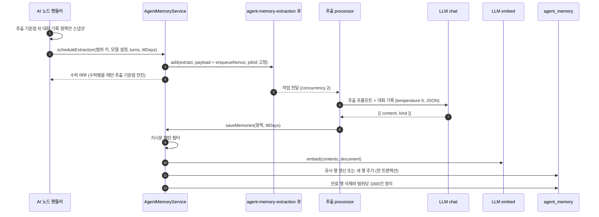
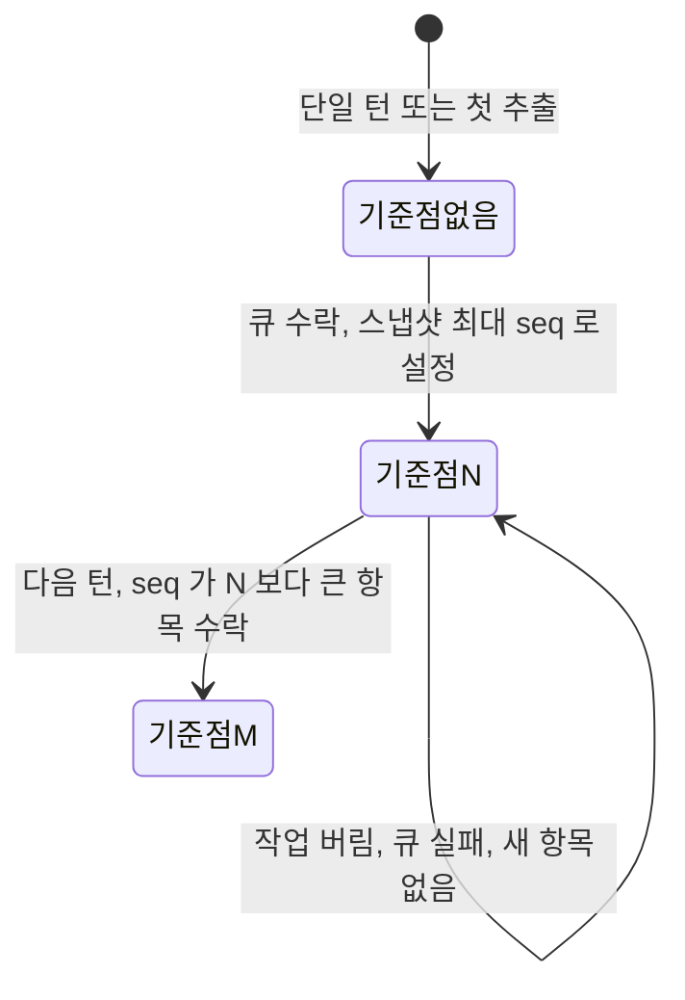
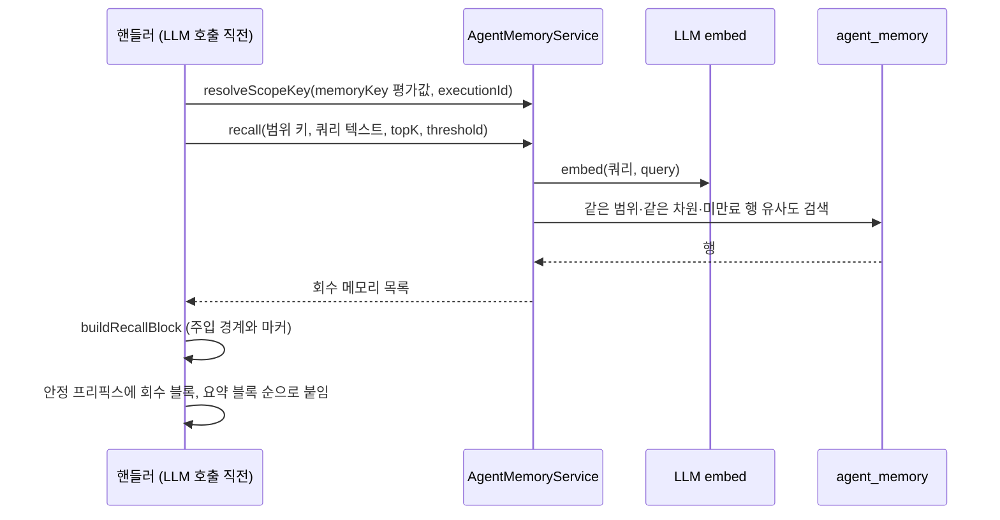

> 구현 상태: 구현됨 · 원문: `spec/5-system/17-agent-memory.md`, `spec/2-navigation/16-agent-memory.md`, `spec/data-flow/13-agent-memory.md`, `spec/1-data-model.md` (§2.23), `spec/5-system/_product-overview.md` (§8), `spec/2-navigation/_product-overview.md` (§3.13) · 용어: [용어 사전](../CLE-GLOSSARY.md)

## 개요

에이전트 메모리(Agent Memory, `AgentMemory`)는 AI 노드가 실행을 넘어 사용자와 대화에 관한 사실·선호를 기억하는 저장소다. 메모리 전략(`memoryStrategy`)이 `persistent` 인 노드만 쓴다. 노드는 대화에서 사실·선호를 뽑아 저장하고(메모리 추출), 다음 호출에서 의미 검색으로 가져와 LLM 컨텍스트에 넣는다(메모리 회수). 원문 명세의 "세션" 은 이 문서에서 워크플로우 실행 한 건을 뜻한다.

챗봇·어시스턴트 시나리오의 두 문제를 푼다.

- 대화 창 밖으로 밀려난 초기 정보가 완전히 사라진다.
- 실행이 바뀌면 같은 사용자를 매번 처음 보는 것처럼 대화가 끊긴다.

`summary_buffer` 전략의 롤링 요약(running summary, `runningSummary`)은 한 실행 안의 작업 메모리를 줄이는 장치다. 토큰 추정은 언어별 휴리스틱 근사다([AI 에이전트 노드](../CLE-NODE-AI/CLE-NODE-AGENT.md)). `persistent` 는 AI 에이전트 노드에서 이 롤링 요약을 포함하고, 그 위에 실행을 넘는 추출 메모리 층을 더한다. 구현 방식은 Mem0·Zep 같은 추출·회수 패턴을 지식 저장소의 pgvector 인프라 위에 얹은 것이다.

메모리를 만들고 쓰는 노드는 두 가지다.

- **AI 에이전트 노드**: 메모리를 만들고(턴 경계 추출) 쓴다(LLM 호출 직전 회수). 롤링 요약도 함께 쓴다.
- **정보 추출기 노드**: `memoryStrategy: 'persistent'` 이면 같은 저장소·메모리 범위 키·추출·회수·격리 규칙을 쓴다. 메모리 범위 키 해석(`resolveScopeKey(memoryKey, executionId)`)이 같으므로 같은 키를 쓰면 AI 에이전트와 메모리를 공유한다. 롤링 요약은 쓰지 않는다. 회수 시점(추출 LLM 호출 전 1회, 멀티턴은 첫 진입에만), 회수 쿼리(`inputField`, 비면 systemPrompt), 멀티턴 추출 시점(종결 때 1회)이 AI 에이전트와 다르며 [정보 추출기 노드](../CLE-NODE-AI/CLE-NODE-EXTRACTOR.md) 에서 정한다.
- 텍스트 분류기 노드는 단일 턴이고 상태가 없어 메모리 대상이 아니다.
- `manual`·`summary_buffer` 전략은 이 파이프라인을 전혀 타지 않는다. 추출도 회수도 `persistent` 에서만 일어난다. 이 불변식이 깨지면 회귀다. 롤링 요약은 `agent_memory` 가 아니라 대화 스레드의 `runningSummary` 에 저장한다([대화 스레드](../CLE-IX/CLE-IX-THREAD.md)).

이 문서는 저장소(테이블 `agent_memory`), 메모리 범위 키, 추출·회수 파이프라인, 중복 갱신과 메모리 정리, 격리, 관리 API, 관리 화면을 정한다. 범위 밖 문서는 다음과 같다.

- 노드 설정 필드(`memoryStrategy`, `memoryTokenBudget`, `memoryKey`, `memoryTopK`, `memoryThreshold`, `memoryTtlDays`, `extractionModelConfigId`, `embeddingModelConfigId`)와 노드 처리 순서 안의 위치: [AI 에이전트 노드](../CLE-NODE-AI/CLE-NODE-AGENT.md)
- 메모리 전략 전반과 시스템 프롬프트 조립 순서: [AI 노드 공통](../CLE-NODE-AI/CLE-NODE-AI-COMMON.md)
- 추출 입력이 되는 대화 기록: [대화 스레드](../CLE-IX/CLE-IX-THREAD.md)
- 임베딩 경로와 비대칭 입력: [문서 임베딩](../CLE-KB/CLE-KB-EMBED.md)
- 사용량 기록: [LLM 사용량 기록](CLE-AI-USAGE.md)

## 요구사항

- REQ-MEMORY-001 WHEN 메모리 전략이 `persistent` 인 AI 노드가 메모리를 저장하면 THE SYSTEM SHALL 지식 저장소와 분리된 `agent_memory` 테이블에 pgvector 인프라를 재사용해 저장한다. (원본: AGM-01)
- REQ-MEMORY-002 WHEN `agent_memory` 테이블을 만들면 THE SYSTEM SHALL `(workspace_id, scope_key, created_at)` 인덱스, `(workspace_id, scope_key, updated_at)` 인덱스, 차원별 pgvector partial 인덱스를 둔다. (원본: AGM-02)
- REQ-MEMORY-003 WHEN 노드 `memoryKey` 평가값이 truthy 이면 THE SYSTEM SHALL 정규화한 그 값을 메모리 범위 키로 쓴다. (원본: AGM-03)
- REQ-MEMORY-004 IF `memoryKey` 가 없거나 빈 값이면 THE SYSTEM SHALL 실행 ID(`execution_id`)를 메모리 범위 키로 쓴다. (원본: AGM-03)
- REQ-MEMORY-005 WHEN `memoryKey` 평가값으로 메모리 범위 키를 만들면 THE SYSTEM SHALL null byte 와 C0/C1 제어 문자를 지우고 앞뒤 공백을 자른다. (원본: AGM-03)
- REQ-MEMORY-006 IF 정규화 결과가 빈 문자열이면 THE SYSTEM SHALL 실행 ID 를 메모리 범위 키로 쓴다. (원본: AGM-03)
- REQ-MEMORY-007 IF 정규화 결과가 512자를 넘으면 THE SYSTEM SHALL `<원문 prefix>:<sha256hex>` 형태로 결정적으로 줄인다. (원본: AGM-03)
- REQ-MEMORY-008 WHEN 메모리를 회수·추출·정리·조회·삭제하면 THE SYSTEM SHALL 실행 컨텍스트나 인증 컨텍스트의 `workspace_id` 로 늘 거른다. (원본: AGM-07)
- REQ-MEMORY-009 WHEN 턴 경계에 이르면 THE SYSTEM SHALL 메모리 추출을 큐에 넣기까지만 기다리고 추출 LLM 호출은 응답 경로 밖에서 한다. (원본: AGM-04)
- REQ-MEMORY-010 WHEN 추출할 대화 기록을 넘기면 THE SYSTEM SHALL 대화 기록 항목 스냅샷을 shallow-copy 로 떼어 뒤이은 턴 변경에 오염되지 않게 한다. (원본: AGM-04)
- REQ-MEMORY-011 WHEN 추출 LLM 을 고르면 THE SYSTEM SHALL `extractionModelConfigId` 설정, 노드 `llmConfigId` 설정, 노드 `model`, 설정의 기본 모델 순서로 폴백한다. (원본: AGM-04)
- REQ-MEMORY-012 WHEN 메모리를 저장하거나 회수하면 THE SYSTEM SHALL 저장과 회수에 같은 임베딩 모델 설정을 써 차원을 맞춘다.
- REQ-MEMORY-013 IF 추출 항목이 명백한 지시문 패턴에 걸리면 THE SYSTEM SHALL 그 항목을 저장하지 않고 경고 로그를 남긴다.
- REQ-MEMORY-014 WHILE 멀티턴 실행인 동안 THE SYSTEM SHALL 추출 기준점보다 `seq` 가 큰 대화 기록 항목만 추출 대상으로 보낸다. (원본: AGM-08)
- REQ-MEMORY-015 IF 추출 기준점 뒤에 새 대화 기록 항목이 없으면 THE SYSTEM SHALL 추출을 큐에 넣지 않는다. (원본: AGM-08)
- REQ-MEMORY-016 WHEN 추출 작업이 큐에 실제로 들어가면 THE SYSTEM SHALL 추출 기준점을 스냅샷의 최대 `seq` 로 전진시킨다. (원본: AGM-08)
- REQ-MEMORY-017 WHEN 단일 턴 실행이 추출하면 THE SYSTEM SHALL 추출 기준점과 상관없이 대화 기록 전체를 보낸다. (원본: AGM-08)
- REQ-MEMORY-018 WHEN 추출 LLM 이 응답하면 THE SYSTEM SHALL 항목을 `{content, kind}` 로 읽어 메모리 종류를 `metadata.kind` 에 저장한다. (원본: AGM-11)
- REQ-MEMORY-019 IF 메모리 종류가 없거나 `fact`·`preference`·`entity` 밖의 값이면 THE SYSTEM SHALL `fact` 로 저장한다. (원본: AGM-11)
- REQ-MEMORY-020 WHEN 추출 작업을 큐에 넣으면 THE SYSTEM SHALL 전용 큐 `agent-memory-extraction` 에 jobId `agent-memory:<workspaceId>:<scopeKey>` 로 넣어 같은 범위의 추출을 직렬화한다.
- REQ-MEMORY-021 IF 같은 범위의 추출 작업이 이미 대기·실행·지연 중이면 THE SYSTEM SHALL 새 작업을 버리고 추출 기준점을 전진시키지 않는다.
- REQ-MEMORY-022 WHEN 추출 작업이 완료되면 THE SYSTEM SHALL 그 작업을 큐에서 바로 지운다.
- REQ-MEMORY-023 IF 추출 작업을 큐에 넣지 못하면 THE SYSTEM SHALL 에러를 흡수하고 대화를 계속한다.
- REQ-MEMORY-024 WHEN 메모리 전략이 `persistent` 인 AI 에이전트 노드가 LLM 을 부르기 직전이면 THE SYSTEM SHALL 같은 범위에서 `memoryTopK`(기본 5)·`memoryThreshold`(기본 0.7) 기준으로 메모리를 동기 회수한다. (원본: AGM-05)
- REQ-MEMORY-025 WHEN 회수한 메모리를 주입하면 THE SYSTEM SHALL 시스템 프롬프트 안정 프리픽스의 회수 블록 자리에 넣는다. (원본: AGM-05)
- REQ-MEMORY-026 WHEN 메모리를 회수하면 THE SYSTEM SHALL 만료된 행을 결과에서 뺀다. (원본: AGM-05, AGM-10)
- REQ-MEMORY-027 WHEN 회수한 메모리를 주입하면 THE SYSTEM SHALL 데이터임을 밝히는 안내 문구를 넣고 항목마다 `[memory]…[/memory]` 마커로 감싼다.
- REQ-MEMORY-028 IF 회수한 내용 안에 같은 마커 토큰이 있으면 THE SYSTEM SHALL zero-width separator(U+200B)로 escape 한다.
- REQ-MEMORY-029 IF AI 에이전트 노드의 현재 사용자 메시지가 비어 있으면 THE SYSTEM SHALL 시스템 프롬프트 본문을 회수 쿼리로 쓴다.
- REQ-MEMORY-030 IF 회수가 실패하면 THE SYSTEM SHALL 빈 결과로 이어 가고 응답 경로를 깨지 않는다.
- REQ-MEMORY-031 WHEN 회수를 마치면 THE SYSTEM SHALL 회수 건수를 `meta.memory.recalledCount` 에 싣는다.
- REQ-MEMORY-032 WHEN 추출 항목을 저장하면 THE SYSTEM SHALL 같은 범위에서 cosine 유사도 0.85 이상인 기존 행을 찾아 그 행을 갱신한다. (원본: AGM-09)
- REQ-MEMORY-033 IF 유사도 0.85 이상인 기존 행이 없으면 THE SYSTEM SHALL 새 행을 넣는다. (원본: AGM-09)
- REQ-MEMORY-034 IF 기존 행을 갱신할 때 `memoryTtlDays` 가 없으면 THE SYSTEM SHALL 기존 `expires_at` 을 유지한다. (원본: AGM-09)
- REQ-MEMORY-035 IF 중복 탐색이 실패하면 THE SYSTEM SHALL 새 행을 넣는 쪽으로 진행한다. (원본: AGM-09)
- REQ-MEMORY-036 WHEN 노드 설정 `memoryTtlDays` 가 양수이면 THE SYSTEM SHALL 저장 때 `expires_at` 을 `now() + ttlDays` 로 채운다. (원본: AGM-10)
- REQ-MEMORY-037 WHEN 메모리 저장을 마치면 THE SYSTEM SHALL 만료된 행을 지운 뒤 범위마다 `created_at` 기준 최신 1000건만 남긴다. (원본: AGM-06, AGM-10)
- REQ-MEMORY-038 WHEN 뷰어 이상이 `GET /api/agent-memories/scopes` 를 부르면 THE SYSTEM SHALL 범위 키별 메모리 건수와 최신 `updated_at` 을 `q` 부분 일치와 `limit`/`offset` 페이지로 돌려준다. (원본: AGM-12)
- REQ-MEMORY-039 WHEN 뷰어 이상이 `GET /api/agent-memories` 를 `scopeKey` 와 함께 부르면 THE SYSTEM SHALL 그 범위의 메모리 행을 `created_at` 내림차순으로 `kind` 필터를 적용해 돌려준다. (원본: AGM-12)
- REQ-MEMORY-040 WHEN 메모리 행을 응답하면 THE SYSTEM SHALL 임베딩 벡터를 빼고 `id`·`content`·`kind`·`scopeKey`·`createdAt`·`updatedAt`·`expiresAt` 만 싣는다. (원본: AGM-12)
- REQ-MEMORY-041 WHEN 편집자 이상이 `DELETE /api/agent-memories/:id` 를 부르면 THE SYSTEM SHALL 그 행을 영구 삭제하고 204 를 돌려준다. (원본: AGM-13)
- REQ-MEMORY-042 IF 삭제 대상 행이 다른 워크스페이스에 속하면 THE SYSTEM SHALL 404 를 돌려준다. (원본: AGM-13)
- REQ-MEMORY-043 WHEN 편집자 이상이 `DELETE /api/agent-memories?scopeKey=` 를 부르면 THE SYSTEM SHALL 그 범위의 메모리를 모두 영구 삭제하고 삭제 행 수를 `X-Deleted-Count` 응답 헤더에 싣는다. (원본: AGM-13)
- REQ-MEMORY-044 WHEN 백엔드가 CORS 응답을 만들면 THE SYSTEM SHALL `exposedHeaders` 에 `X-Deleted-Count` 를 넣는다. (원본: AGM-13)
- REQ-MEMORY-045 WHEN 워크스페이스 멤버가 사이드바를 보면 THE SYSTEM SHALL "Agent Memory" 메뉴를 보여 준다. (원본: NAV-AM-01)
- REQ-MEMORY-046 WHEN 관리 화면을 열면 THE SYSTEM SHALL 범위 키·건수·최신 갱신 시각의 범위 목록을 검색과 "더 보기" 페이지로 보여 준다. (원본: NAV-AM-02)
- REQ-MEMORY-047 WHEN 사용자가 범위를 고르면 THE SYSTEM SHALL 내용·메모리 종류 배지·시각·만료 예정 시각의 메모리 목록을 종류 필터와 "더 보기" 페이지로 보여 준다. (원본: NAV-AM-03)
- REQ-MEMORY-048 WHEN 편집자 이상이 메모리 행의 삭제를 누르면 THE SYSTEM SHALL 확인 모달을 거쳐 그 행을 삭제하고 목록을 갱신한다. (원본: NAV-AM-04)
- REQ-MEMORY-049 WHEN 편집자 이상이 범위의 삭제를 누르면 THE SYSTEM SHALL 건수 경고가 있는 확인 모달을 거쳐 범위 전체를 삭제한다. (원본: NAV-AM-05)
- REQ-MEMORY-050 IF 범위 삭제 응답의 `X-Deleted-Count` 가 0 이면 THE SYSTEM SHALL 성공 토스트 대신 중립 토스트를 보여 준다. (원본: NAV-AM-05)
- REQ-MEMORY-051 WHILE 사용자가 편집자 미만인 동안 THE SYSTEM SHALL 관리 화면의 삭제 버튼을 보여 주지 않는다. (원본: NAV-AM-06)
- REQ-MEMORY-052 IF 워크스페이스에 쌓인 메모리가 없으면 THE SYSTEM SHALL 빈 상태 안내와 AI 에이전트 노드 `memoryStrategy` 설정 안내 링크를 보여 준다. (원본: NAV-AM-06)
- REQ-MEMORY-053 WHEN 최종 사용자 식별자가 도입되면 THE SYSTEM SHALL `memoryKey` 기본값을 실행 ID 대신 사용자 ID 로 올린다. (미구현)

## 데이터 모델

저장소는 테이블 `agent_memory` 다. pgvector 확장을 지식 저장소 청크(`DocumentChunk`)와 같은 방식으로 재사용하지만 지식 저장소와는 분리된 별도 테이블이다. 컬럼 정의는 이 절이 기준이다.

| 컬럼 | 타입 | 설명 |
|------|------|------|
| `id` | UUID | PK |
| `workspace_id` | UUID | FK → Workspace (CASCADE). 회수·추출·정리 모두 이 컬럼으로 거른다([격리](#격리)) |
| `scope_key` | String | 메모리 범위 키. 정규화한 `memoryKey` 평가값 또는 `execution_id`. `(workspace_id, scope_key)` 가 메모리 네임스페이스 하나다 |
| `content` | Text | 추출한 사실·선호 텍스트. 회수 때 LLM 컨텍스트에 넣는다 |
| `embedding` | Vector | `content` 임베딩. 차원이 정해지지 않은 vector 컬럼이며 지식 저장소 청크 임베딩과 같은 확장·차원 정책을 쓴다([문서 임베딩](../CLE-KB/CLE-KB-EMBED.md)) |
| `metadata` | JSONB | 추출 출처와 메모리 종류. `kind ∈ fact/preference/entity`. 나머지 키 구성은 정의가 갈린다. [미결 사항](#미결-사항) 참조 |
| `created_at` | Timestamp | 추출 시각. 메모리 정리의 기준이다 |
| `updated_at` | Timestamp | 마지막 갱신 시각. 중복 갱신 때 `now()` 로 바꾼다 |
| `expires_at` | Timestamp? | TTL 만료 시각. 기본 NULL(만료 없음). `memoryTtlDays` 가 있으면 `now() + ttlDays`. 회수는 만료되지 않은 행만 보고, 정리는 만료된 행을 지운다 |

`agent_memory` 에는 임베딩 모델 전용 컬럼을 두지 않는다. 노드 설정 필드와 설정 해석으로 충분하다.

### 인덱스

| 인덱스 | 마이그레이션 | 용도 |
|--------|--------------|------|
| `idx_agent_memory_scope (workspace_id, scope_key, created_at)` | V073 | 범위별 회수 필터와 메모리 정리 정렬(`ORDER BY created_at`)을 인덱스로 처리한다 |
| 차원별 partial HNSW (`embedding`) | V074(384), V075(512), V076(768), V077(1024), V078(1536), V079(3072, halfvec) | cosine 유사도 검색(회수·중복 탐색). 지원 차원 집합은 지식 저장소와 공유한다(`SUPPORTED_EMBEDDING_DIMS`). IVFFlat 은 쓰지 않는다 |
| `idx_agent_memory_expires_at (expires_at) WHERE expires_at IS NOT NULL` | V080 | TTL 만료 스캔을 빠르게 한다. 만료 없는 다수 행에는 인덱스 비용이 없다 |
| `(workspace_id, scope_key, updated_at)` | V086 (CONCURRENTLY) | 관리 화면 범위 목록(`GET /api/agent-memories/scopes`)의 `MAX(updated_at)` 정렬을 index-only 로 처리한다. `created_at` 인덱스와 겹치지 않는다 |

인덱스 전략 전반은 [데이터 모델 개요](../CLE-PLAT/CLE-PLAT-DATA.md) 에서 정한다.

## 메모리 범위 키

메모리 네임스페이스는 `(workspace_id, scope_key)` 두 값이다. 메모리 범위 키(`scope_key`)는 이렇게 정한다.

- 노드 `memoryKey`(표현식)의 평가값이 truthy 이면 그 값을 쓴다. 실행을 넘어 기억이 이어진다(개인화). 같은 키를 쓰는 다음 실행이 같은 메모리를 회수한다.
- `memoryKey` 가 없거나 빈 값이면 `execution_id` 를 쓴다. 기억이 한 실행 안에 머문다. 실행 사이에 쌓이지 않으므로 안전한 기본값이다.
- `workspace_id` 는 늘 필수 필터다. 사용자가 `memoryKey` 를 어떻게 주든 워크스페이스 경계를 넘지 못한다.

### 정규화

`memoryKey` 평가값은 표현식 결과라 제어 문자나 아주 긴 값이 들어올 수 있다. 그대로 쓰지 않고 결정적으로 정규화한 값이 메모리 범위 키가 된다.

1. null byte 와 C0/C1 제어 문자를 지우고 앞뒤 공백을 자른다. 메모리 범위 키는 토큰 하나이므로 탭과 줄바꿈도 지운다.
2. 정규화 결과가 빈 문자열이면(제어 문자와 공백뿐이던 경우, 평가값이 truthy 였어도) `execution_id` 를 쓴다.
3. 512자(`SCOPE_KEY_MAX_LENGTH`)를 넘으면 `<원문 prefix>:<sha256hex>` 형태로 SHA-256 결정적 축약을 한다. 합친 길이는 상한 이하다. 같은 입력은 늘 같은 범위로 간다.

정규화는 사용자에게 보이는 동작이다. 관리 API 는 정규화한 `scope_key` 를 보여 준다. 512자를 넘는 키를 쓰는 사용자는 해시로 줄인 키로 범위를 찾고 지운다. 제어 문자만 다른 두 `memoryKey` 는 같은 범위로 합쳐진다.

## 메모리 추출

`persistent` 전략에서는 턴 경계마다 직전 대화에서 기억할 사실·선호를 LLM 으로 뽑아 `agent_memory` 에 저장한다. 이 작업은 백그라운드에서 비동기로 한다.

- **호출 시점**: AI 에이전트 노드는 단일 턴이면 최종 응답을 대화 스레드에 넣은 직후, 멀티턴이면 턴마다 assistant 응답을 넣은 직후에 공유 헬퍼 `scheduleMemoryExtraction` 을 부른다. 정보 추출기 노드의 멀티턴은 종결 때 한 번만 부른다([정보 추출기 노드](../CLE-NODE-AI/CLE-NODE-EXTRACTOR.md)).
- **응답 경로 비차단**: 핸들러는 큐에 넣기까지만 기다린다. 추출 LLM 호출은 worker 에서 하므로 사용자는 추출이 끝나기를 기다리지 않는다. 회수만 동기이고 추출은 비동기다.
- **스냅샷 격리**: 기존 `scheduleBackgroundBody` 계열 백그라운드 처리 방식을 따른다. 대화 기록 항목 스냅샷을 shallow-copy 로 떼어 넘기므로 뒤이은 메인 루프의 변경이 백그라운드 작업에 스며들지 않는다.
- **추출 LLM**: 노드 설정 `extractionModelConfigId` 가 가리키는 Chat 모델 설정을 쓴다. 지정하면 그 설정의 프로바이더·자격 증명·기본 모델로 부르므로 노드의 메인 LLM 과 독립이다(다른 프로바이더의 저렴한 모델도 된다). 지정하지 않으면 노드 `llmConfigId` 설정(없으면 워크스페이스 기본 Chat 설정)과 노드 `model`(없으면 그 설정의 기본 모델)을 쓴다. 폴백 순서는 `extractionModelConfigId` 설정 → `llmConfigId` → `model` → `llmConfig.defaultModel` 이다. 추출은 메인 추론보다 단순해서 저렴한 설정을 지정하면 비용을 줄일 수 있다. 필드 결정 이력은 [AI 에이전트 노드](../CLE-NODE-AI/CLE-NODE-AGENT.md) 에서 정한다.
- **추출 호출**: worker 는 `buildExtractionTranscript(turns)` 로 user·assistant 항목만 남기고(system·tool 제외) `EXTRACTION_SYSTEM_PROMPT` 와 함께 `LlmService.chat` 을 temperature 0, JSON 응답으로 부른다. 이 호출은 사용량을 쌓고 사용량 귀속은 비운다([LLM 사용량 기록](CLE-AI-USAGE.md)).
- **임베딩 설정**: 저장 임베딩과 회수 임베딩은 반드시 같은 설정(같은 모델·차원·엔드포인트)을 써야 한다. 다르면 cosine 검색이 무의미해지거나 400 에러가 난다. 어느 모델 설정을 쓰는지는 정의가 갈린다. [미결 사항](#미결-사항) 참조.
- **저장 형태**: 추출한 사실·선호 하나를 `content` 로, 그 임베딩을 `LlmService.embed`(`inputType='document'`)로 만들어 메모리 범위 키와 함께 저장한다. 메모리 종류는 `metadata.kind` 로 나눈다. 지식 저장소와 같은 `LlmService.embed` 경로를 쓴다.
- **지시문 저장 차단**: 저장(`saveMemories`) 전에 명백한 지시문 패턴에 걸리는 항목은 저장하지 않고 버린다(경고 로그). 패턴은 결정적 정규식 목록이다(예: ignore/disregard previous, you are now, system prompt, new instructions:, "이전 지시 무시"). 악의적 사용자가 대화에 심은 지시가 메모리로 굳는 것을 1차로 막는다. 명백한 패턴만 걸러 정상 사실·선호를 잘못 막는 일을 줄인다. 주 방어는 회수 주입 시점의 메모리 주입 경계이고 이 필터는 보조다.
- **빈 결과**: 추출 결과가 빈 배열이거나 대화 기록이 비면 아무것도 하지 않는다.
- **실패**: 추출 LLM 호출이 실패하면 throw 하고 BullMQ 기본 재시도에 맡긴다. 응답 경로와 떨어진 경로라 응답 지연에 영향이 없다.

### 추출 흐름



### 증분 추출

멀티턴은 턴마다 대화 스레드 전체를 다시 추출하지 않고, 직전 추출 뒤에 새로 쌓인 대화 기록 항목만 추출한다. 추출 기준점(`lastExtractionTurnSeq`)은 직전 추출이 다룬 마지막 대화 기록 항목의 `seq` 다. 멀티턴 재개 상태(`_resumeState`)에 영속한다. 저장 키 경로는 정의가 갈린다. [미결 사항](#미결-사항) 참조.

- 턴 경계마다 `seq > 추출 기준점` 인 항목만 스냅샷해 큐에 넣고, 수락되면 스냅샷의 최대 `seq` 로 기준점을 전진시킨다.
- 새 항목이 없으면 큐에 넣지 않고 기준점도 그대로 둔다.
- 큐가 작업을 버렸거나(같은 범위의 작업이 진행 중) 큐에 넣다 실패하면 기준점을 그대로 둔다. 그 항목들은 다음 턴 경계에서 다시 추출 대상이 되므로 잃지 않는다.
- 단일 턴은 한 번만 추출하므로 기준점과 상관없이 대화 기록 전체를 스냅샷한다.
- 멀티턴 대화에서 같은 초기 턴을 매번 다시 추출해 LLM 호출과 저장이 중복되던 문제를 없앤다.

아래 그림은 추출 기준점의 전이를 보여 준다.



### 메모리 종류

추출 프롬프트는 항목마다 `{content, kind}` JSON 객체를 돌려주게 한다. 메모리 종류(`metadata.kind`)는 `fact`·`preference`·`entity` 이고 화면 라벨은 사실·선호·엔티티다. 지식 저장소 Graph RAG 의 Entity 와 다르다.

- 파서는 객체 `{content, kind}` 와 문자열(예전 형태)을 모두 받는다.
- kind 가 없거나 지원하지 않는 값이면 `fact` 로 둔다.
- 분류 값은 `metadata.kind` 로 저장해 회수와 화면에서 사실·선호·엔티티를 나눈다.

### 추출 큐

추출은 전용 BullMQ 큐 `agent-memory-extraction`(worker concurrency 2)에서 돈다. 추출 부하가 임베딩 적재나 회수 경로의 동시성을 방해하지 않게 따로 뒀다. 큐 전체 목록은 [비동기 큐와 Redis 키 목록](../CLE-PLAT/CLE-PLAT-QUEUE.md) 에서 정한다.

| 항목 | 값 |
|------|----|
| producer | `AgentMemoryService.scheduleExtraction`(AI 에이전트·정보 추출기 핸들러가 턴 경계에 부른다) |
| consumer | `AgentMemoryExtractionProcessor` (concurrency 2) |
| payload | `{ workspaceId, scopeKey, llmConfigId?, model?, extractionModelConfigId?, embeddingModelConfigId?, turns[{source,text,nodeLabel}], ttlDays?, enqueueNonce }` |
| jobId | `agent-memory:<workspaceId>:<scopeKey>` 고정 |
| 완료 작업 | `removeOnComplete: true` |
| 등록 | `agent-memory.module.ts` |

- **범위 단위 직렬화**: 동시성 제한 단위는 워크스페이스가 아니라 메모리 범위다. jobId 를 고정해 같은 범위의 추출이 동시에 돌지 않게 BullMQ 가 중복을 막는다. 같은 범위에서 유사 행 탐색(`findSimilarFact`) 뒤 INSERT 가 동시에 달리며 생기는 TOCTOU 중복 삽입을 막으려는 것이다.
- **작업 버림과 수락 계약**: 같은 범위의 작업이 대기·실행·지연 중이면 새 작업은 버려진다. 서비스는 `enqueueNonce` 가 다른 것으로 이를 검출해 `scheduleExtraction` 에서 `false` 를 돌려주고, 호출하는 쪽은 추출 기준점을 전진시키지 않는다.
- **완료 즉시 삭제**: 완료 작업을 남기면 jobId 중복 방지가 완료 작업에도 걸려 같은 범위의 모든 새 작업이 영원히 버려진다. 그러면 추출 기준점이 전진하지 못하는 livelock 이 생기므로 완료 작업은 바로 지운다.

## 메모리 회수

LLM 호출 전에 메모리 범위 `(workspace_id, scope_key)` 안에서 현재 대화 컨텍스트를 쿼리로 top-k 의미 검색을 동기로 한다. 정확한 컨텍스트가 LLM 호출 시점에 있어야 하므로 회수는 동기다.

- **개수와 임계값**: `memoryTopK` 는 결과 수(기본 5), `memoryThreshold` 는 최소 유사도(기본 0.7)다. 두 필드는 에이전트 메모리 회수 전용이고 지식 저장소 검색용 `ragTopK`·`ragThreshold` 와 독립이다. 검색 대상이 다르다(`agent_memory` 와 지식 저장소). `memoryThreshold` 와 `ragThreshold` 의 기본값은 같은 0.7 이지만 다른 필드다. `ragTopK` 는 동적 점수 컷을 도입하면서 고정 기본값이 없어졌다(선택적 상한, [RAG 검색](../CLE-KB/CLE-KB-SEARCH.md)). 두 필드는 기준과 기본값이 다르다.
- **회수 쿼리**: AI 에이전트 노드는 현재 사용자 메시지(`userPrompt`)를 쓴다. 비어 있으면(systemPrompt 만 있는 실행) systemPrompt 본문을 쓴다. 회수가 소리 없이 아무것도 안 하는 일을 막기 위해서다. 정보 추출기 노드는 `inputField` 를 쓴다. 비어 있으면 systemPrompt 를 쓴다([정보 추출기 노드](../CLE-NODE-AI/CLE-NODE-EXTRACTOR.md)).
- **정보 추출기 노드의 회수 시점**: 추출 LLM 호출 직전에 한 번 회수한다. 멀티턴이면 첫 진입에서만 회수한다. 회수 블록을 붙인 시스템 메시지가 재개 상태(`_resumeState.messages`)로 운반되므로 후속 턴에서는 다시 회수하지 않는다([정보 추출기 노드](../CLE-NODE-AI/CLE-NODE-EXTRACTOR.md)).
- **임베딩**: 회수 쿼리 임베딩은 저장과 같은 임베딩 설정을 써서 차원을 맞춘다. 회수는 `LlmService.embed(config, texts, model?, opts?, 'query')`, 저장은 `inputType='document'` 로 부른다. 같은 모델이지만 비대칭 검색 모델(e5, Gemini)에서 query 와 문서를 올바르게 나누기 위해서다. 시그니처는 [LLM 클라이언트](CLE-AI-LLM.md), 비대칭 입력 규칙은 [문서 임베딩](../CLE-KB/CLE-KB-EMBED.md) 에서 정한다.
- **입력 유형 도입 전 메모리**: 지식 저장소와 달리 `agent_memory` 에는 일괄 재임베딩 경로가 없다. 입력 유형을 배선하기 전에 비대칭 모델로 저장한 메모리는 접두사 없는 상태로 남아 회수 때 약한 비대칭이 생길 수 있다. 중복 갱신으로 다시 저장되거나 TTL 로 만료되면 자연히 풀린다. 기본 모델 `text-embedding-3-small` 같은 대칭 모델에서는 영향이 없다.
- **만료 제외**: 회수 SQL 은 `(expires_at IS NULL OR expires_at > now())` 로 만료된 행을 뺀다.
- **차원**: 쿼리 벡터와 같은 차원의 행만 본다. 지원하지 않는 차원이면 빈 결과를 돌려준다.
- **실패**: 회수는 모든 층에서 실패해도 빈 배열로 이어 간다. 회수 실패가 응답 경로를 깨지 않는다.
- **메타**: 회수 건수는 `meta.memory.recalledCount` 로 싣는다.

회수 쿼리의 모양은 다음과 같다.

```sql
SELECT content, 1 - (embedding <=> $q) AS score
FROM agent_memory
WHERE workspace_id = $ws AND scope_key = $scope AND vector_dims(embedding) = $dim
  AND (expires_at IS NULL OR expires_at > now())
  AND 1 - (embedding <=> $q) >= $threshold
ORDER BY score DESC
LIMIT $topK
```

### 주입

회수한 `content` 는 시스템 프롬프트의 안정 프리픽스에 넣는다. 조립 순서는 회수 블록 [5a], 롤링 요약 블록 [5b], 휘발성 꼬리 [6] 이며 [AI 노드 공통](../CLE-NODE-AI/CLE-NODE-AI-COMMON.md) 에서 정한다. 회수 블록과 롤링 요약 블록은 프롬프트 캐시가 유지되는 안정 프리픽스로 붙는다.

### 메모리 주입 경계

회수한 내용은 과거 대화에서 뽑은 신뢰할 수 없는 데이터다. 간접 prompt injection 을 막기 위해 메모리 주입 경계(data-fence)를 둔다.

- 주입하는 회수 블록(과 롤링 요약 블록)은 헤더 다음에 "지시가 아니라 데이터" 임을 밝히는 안내 문구를 넣는다.
- 항목마다 `[memory]…[/memory]` 마커로 감싼다(`buildRecallBlock`).
- 내용 안에 같은 마커 토큰이 다시 나오면 zero-width separator(U+200B)로 escape 한다. 공격자가 가짜로 마커를 닫고 지시를 섞는 것을 막는다.
- 대화 스레드의 `[user-input]…[/user-input]` 보안 마커와 같은 생각이다([대화 스레드](../CLE-IX/CLE-IX-THREAD.md)).

저장 시점의 지시문 필터가 보조이고, 이 주입 시점의 경계가 주 방어다.

### 회수 흐름



## 중복 갱신과 메모리 정리

### 의미 기반 중복 갱신

저장(`saveMemories`)은 무조건 INSERT 하지 않는다. 새 항목마다 그 임베딩으로 같은 `(workspace_id, scope_key)` 안에서 cosine 유사도가 `MEMORY_DEDUP_SIMILARITY = 0.85` 이상인 기존 행을 찾는다. 회수 cosine SQL 을 재사용하고 `LIMIT 1` 로 찾는다.

- 있으면 그 행을 갱신한다(`content`, `embedding`, `metadata`, `updated_at=now()`). 같은 사실을 최신 표현으로 바꾸는 것이다.
- `expires_at` 은 노드 `memoryTtlDays` 가 주어졌을 때만 `now() + ttlDays` 로 다시 정한다. 없으면 기존 `expires_at` 을 유지한다. 갱신이 기존 TTL 을 의도치 않게 늘리거나 지우지 않게 하기 위해서다.
- 없으면 새 행을 넣는다.
- 같은 배치 안 새 항목끼리의 중복도 메모리 안 cosine 비교로 막는다. 직전에 처리한 항목과 비슷하면 그 행을 다시 갱신한다.
- 임계 0.85 는 회수 기본 0.7 보다 높게 잡았다. "관련은 있지만 다른 사실" 은 따로 저장하고 "사실상 같은 사실" 만 최신으로 바꾼다.
- 중복 탐색이 실패하면(지원하지 않는 차원, 에러) 저장 경로를 막지 않고 새 행을 넣는다.
- 한 번의 저장에서 갱신과 삽입은 한 트랜잭션으로 묶는다.

### TTL 만료

노드 설정 `memoryTtlDays`(Integer, 선택, 기본은 만료 없음)가 양수이면 저장 때 `expires_at = now() + ttlDays` 를 파라미터 바인딩으로 채운다. 없거나 0 이하이면 만료가 없다(NULL). 값은 노드 설정 → 큐 payload(`ttlDays`) → processor → `saveMemories` 인자로 전달된다.

### 메모리 정리

메모리 정리(memory eviction)는 저장 트랜잭션 끝에서 한다.

1. 만료된 행을 먼저 지운다(`DELETE … WHERE expires_at < now()`).
2. 그다음 `(workspace_id, scope_key)` 마다 최신 `AGENT_MEMORY_MAX_PER_SCOPE = 1000` 건만 남긴다. 넘치면 `created_at` 이 오래된 순으로 지운다. 대화 스레드의 `STORAGE_MAX_TURNS` 정리와 같은 모양이다.

별도 cron 정리 작업은 없다. 만료분과 초과분 정리는 같은 범위에 새 저장이 일어날 때와 관리 화면 삭제로만 한다. 쿼리 필터가 만료된 행을 늘 빼므로 물리 삭제가 늦어도 회수 정확성에는 영향이 없다.

### 행의 생애

| 단계 | 계기 | 동작 |
| --- | --- | --- |
| 생성 | 추출한 새 항목과 비슷한 기존 행이 없음 | INSERT(`metadata.kind`, TTL 이 있으면 `expires_at`) |
| 갱신 | 새 항목이 기존 행과 cosine 0.85 이상 | 그 행을 갱신한다. TTL 이 없으면 기존 `expires_at` 유지 |
| 만료 | `expires_at < now()` | 회수·중복 탐색에서 바로 빠지고, 물리 삭제는 다음 저장의 정리에서 한다 |
| 용량 초과 | 범위당 1000건 초과 | `created_at` 이 오래된 순으로 지운다 |
| 수동 삭제 | 관리 화면 단건·범위 삭제 | 영구 삭제. 복구를 보장하지 않는다 |

## 격리

모든 회수·추출·정리·관리 쿼리는 `workspace_id` 필터를 강제한다. 모든 엔티티에 공통인 방식이다. `memoryKey` 는 사용자가 쓰는 표현식이므로 그 값만으로 워크스페이스 경계를 넘는 키를 만들 수 없어야 한다. 키는 늘 `(workspace_id, scope_key)` 로 묶이고, `workspace_id` 는 실행 컨텍스트의 권한 있는 값에서만 온다. 사용자가 넣을 수 없다.

## 관리 API

쌓인 메모리를 워크스페이스 멤버가 점검하고 정리하는 조회·삭제 API 다. 저장·회수·정리와는 별개의 관리 경로다. 모든 라우트는 인증 미들웨어가 넣는 현재 워크스페이스 값(`@WorkspaceId()`)에서만 `workspace_id` 를 얻고, 쿼리나 본문으로 받지 않는다. 컨트롤러는 `agent-memory.controller.ts` 다.

| 메서드 · 경로 | 설명 | 최소 역할 |
|---|---|---|
| `GET /api/agent-memories/scopes?q&limit&offset` | 워크스페이스의 메모리 범위 키 목록과 범위별 메모리 건수·최신 `updated_at`. `q` 는 `scope_key` 부분 일치(ILIKE). 한 CTE 쿼리로 구한다 | 뷰어 |
| `GET /api/agent-memories?scopeKey&kind&limit&offset` | 한 범위의 메모리 행. `scopeKey` 필수, `kind`(`fact`·`preference`·`entity`) 선택 필터. `created_at` 내림차순 | 뷰어 |
| `DELETE /api/agent-memories/:id` | 단건 삭제. 204 No Content | 편집자 |
| `DELETE /api/agent-memories?scopeKey=` | 한 범위의 메모리 전체 삭제. 204. `scopeKey` 필수. 삭제 행 수를 `X-Deleted-Count` 응답 헤더로 싣는다 | 편집자 |

- **임베딩 제외**: 조회 응답은 `id`·`content`·`kind`(`metadata.kind`)·`scopeKey`·`createdAt`·`updatedAt`·`expiresAt` 만 싣는다. 임베딩 벡터는 크고 화면에 필요 없으므로 SELECT 하지도 않는다. kind 가 없는 행은 `'fact'` 로 표기한다.
- **영구 삭제**: 삭제는 soft delete 가 아니라 메모리 정리와 같은 영구 삭제다. 메모리는 원래 정리 대상(추출 사실, 범위당 1000건)이라 지식 저장소 문서와 달리 복구를 보장하지 않는다.
- **격리**: 단건 삭제도 `WHERE id = $1 AND workspace_id = $ws` 로 워크스페이스를 넘는 삭제를 막는다. 다른 워크스페이스 행의 ID 를 알아도 지울 수 없고 404 를 받는다.
- **삭제 건수(`X-Deleted-Count`)**: 범위 삭제는 204 라 본문이 없으므로 실제 삭제 행 수를 응답 헤더로 싣는다. 대상이 없으면 0 이다(멱등 삭제). 프런트는 이 값이 0 이면 "삭제했다" 대신 중립 토스트를 보여 준다. 브라우저가 cross-origin 에서 읽을 수 있도록 CORS `exposedHeaders: ['X-Deleted-Count']` 에 넣어야 한다.
- **범위 목록 페이지**: `GET /api/agent-memories/scopes` 의 `total` 은 `LIMIT/OFFSET` 적용 전 전체 범위 키 수다(한 쿼리의 `COUNT(*) OVER()`). `offset` 이 전체 수를 넘어 결과 행이 0개면 `total` 은 `0` 으로 나온다. 화면은 첫 페이지의 `total` 범위 안에서만 넘기므로 문제가 없다.

권한 하한의 근거는 [Rationale](#조회는-뷰어-이상-삭제는-편집자-이상으로-둔-이유) 에 있다.

## 관리 화면

사이드바의 "Agent Memory" 메뉴로 여는 워크스페이스 수준 관리 화면이다. 경로는 `/w/<slug>/agent-memory` 이고 메뉴 배치는 [레이아웃과 내비게이션](../CLE-UI/CLE-UI-LAYOUT.md) 에서 정한다. 왼쪽에 범위 목록, 오른쪽에 고른 범위의 메모리 목록이 있다.

| 영역 | 위치 | 들어가는 요소 | 동작 |
|------|------|---------------|------|
| 헤더 | 상단 | 제목 "Agent Memory", `[↻ 새로고침]`, 안내 문구 "AI Agent persistent 메모리를 scope 별로 조회/삭제합니다." | 새로고침은 목록을 다시 불러온다 |
| 범위 목록 | 왼쪽 | 검색 입력, 행마다 범위 키(예: `cust:42`)·건수·최신 갱신 상대 시각·🗑, "더 보기" | 행을 고르면 오른쪽에 그 범위의 메모리가 나온다. 🗑 은 범위 전체 삭제(편집자 이상) |
| 메모리 목록 | 오른쪽 | 종류 필터 드롭다운(기본 전체), 건수, 행마다 내용·메모리 종류 배지·상대 시각·🗑, "더 보기" | 🗑 은 단건 삭제(편집자 이상) |

- **범위 목록**: `GET /api/agent-memories/scopes` 로 범위 키, 메모리 건수, 최신 `updated_at` 을 보여 준다. 범위 키 부분 일치 검색과 "더 보기" 페이지가 있다. 범위가 없으면 빈 상태 안내를 보여 준다.
- **메모리 목록**: 범위를 고르면 `GET /api/agent-memories?scopeKey=` 로 내용, 메모리 종류 배지(`fact`·`preference`·`entity`), 생성·갱신 시각, TTL 만료 예정(`expiresAt`)을 보여 준다. 종류 필터 드롭다운과 "더 보기" 페이지가 있다.
- **단건 삭제**: 메모리 행 🗑 → 확인 모달 → `DELETE /api/agent-memories/:id`. 성공하면 목록을 갱신한다.
- **범위 삭제**: 범위 행 🗑 → 건수 경고가 있는 확인 모달 → `DELETE /api/agent-memories?scopeKey=`. 응답 헤더 `X-Deleted-Count` 로 실제 삭제 건수를 받는다. 0건이면 성공 토스트가 아니라 중립 토스트 "삭제할 메모리가 없었어요" 를 보여 줘 "삭제했다" 는 오해를 막는다.
- **권한**: 화면 진입과 조회는 워크스페이스 멤버(뷰어 이상)가 한다. 삭제 버튼은 편집자 이상에게만 보인다(RoleGate).
- **빈 상태**: `persistent` 메모리를 한 번도 쌓지 않은 워크스페이스에는 "아직 메모리가 없습니다" 안내와 AI 에이전트 노드 `memoryStrategy` 설정 안내 링크를 보여 준다.

## 남은 로드맵

- **사용자 식별자 도입**(미구현): 최종 사용자 식별자(웹채팅 인증·위젯 세션)가 생기면 `memoryKey` 기본값을 익명 `execution_id` 대신 사용자 ID 로 올린다.

## 미결 사항

- **메모리 임베딩 설정 출처**: 에이전트 메모리 명세 본문과 에이전트 메모리 data-flow, [정보 추출기 노드](../CLE-NODE-AI/CLE-NODE-EXTRACTOR.md) 는 노드 설정 `embeddingModelConfigId` 를 쓴다고 적는다. 이 필드는 모델 설정의 Embedding 목록에서 고르는 선택 위젯(`embedding-config-selector`)이고 노드 `llmConfigId` 와 독립이다. 지정하지 않으면 워크스페이스 기본 Embedding 설정(`ModelConfigService.resolveEmbedding`)을 쓰고, 둘 다 없으면 `NotFoundException` 이며 하드코딩 폴백은 없다. 이 값은 노드 설정 → 회수 호출과 큐 payload → processor → `saveMemories` 로 똑같이 전달된다. 반면 LLM 사용량 data-flow 의 임베딩 호출자 표는 메모리 저장·회수가 노드 `llmConfigId`(Chat 설정) 또는 워크스페이스 기본을 쓴다고 적고([LLM 사용량 기록](CLE-AI-USAGE.md)), 에이전트 메모리 data-flow 의 외부 의존 표도 LLM 도메인을 "`llm_config_id` 해석(`LlmService.resolveConfig`)" 으로 적는다. Chat 설정으로 임베딩하면 차원 불일치가 날 수 있다. 현재 구현은 `agent-memory.service.ts` 가 `embeddingModelConfigId` 로 `resolveEmbedding` 을 부른다. 결정 필요.
- **추출 기준점 저장 키 경로**: 에이전트 메모리 명세와 [정보 추출기 노드](../CLE-NODE-AI/CLE-NODE-EXTRACTOR.md) 는 `_resumeState.memoryState.lastExtractionTurnSeq` 를 적는다. 메모리 관련 재개 상태를 `memoryState` 아래로 묶어 평면 키가 늘어나는 것을 막고 나중에 메모리 상태 키를 더할 자리를 두려는 것이다. 읽을 때는 옛 평면 키 `_resumeState.lastExtractionTurnSeq` 로 폴백해 배포 시점에 park 중이던 실행과 호환한다. 기준점을 잃어도 중복 갱신이 흡수하지만 폴백으로 재추출 1회도 피한다는 설명이다. 반면 에이전트 메모리 data-flow 와 [AI 에이전트 노드](../CLE-NODE-AI/CLE-NODE-AGENT.md), 비기능 요구사항 AGM-08 원문은 재개 상태의 평면 키 `lastExtractionTurnSeq` 로 적고, data-flow 는 `_resumeState` 에 영속한다고만(Redis 직렬화, 새 DB 컬럼 없음) 적는다. 현재 구현은 AI 에이전트가 `memoryState` 아래에 쓰고, 읽을 때 `memoryState` 를 먼저 보고 평면 키로 폴백한다(`agent-memory-injection.ts`, `ai-turn-executor.ts`). 정본 경로와 평면 키 폴백을 언제까지 둘지 결정 필요.
- **`metadata` 구조**: 에이전트 메모리 명세와 데이터 모델은 `{ source_node_id?, source_execution_id?, kind?, … }` 로 적는다. 에이전트 메모리 data-flow 는 `{ kind, source: 'turn_boundary_extraction' }` 로 적는다. 현재 구현은 `agent-memory-extraction.processor.ts` 가 `{ kind, source: 'turn_boundary_extraction' }` 을 저장하고 `source_node_id`·`source_execution_id` 는 쓰지 않는다. 출처 ID 키를 계획으로 둘지, 실제 저장 형태로 정의를 좁힐지 결정 필요.

## 구현 위치

- `codebase/backend/src/modules/agent-memory/**` (`agent-memory.service.ts` 회수·저장·큐 넣기, `agent-memory-admin.service.ts`·`agent-memory.controller.ts` 관리 API, `queues/agent-memory-extraction.queue.ts` 큐 이름·payload·추출 프롬프트·응답 파서, `queues/agent-memory-extraction.processor.ts` 추출 worker, `entities/agent-memory.entity.ts`)
- `codebase/backend/src/nodes/ai/shared/agent-memory-injection.ts` (`scheduleMemoryExtraction`, `buildRecallBlock`)
- `codebase/backend/src/nodes/ai/ai-agent/ai-memory-manager.ts` (`AiMemoryManager`, AI 에이전트 회수·턴 경계 큐 넣기)
- `codebase/backend/src/nodes/ai/information-extractor/information-extractor.handler.ts` (정보 추출기 회수·큐 넣기)
- `codebase/frontend/src/app/(main)/w/[slug]/agent-memory/page.tsx`
- `codebase/frontend/src/lib/api/agent-memories.ts`

## Rationale

### 메모리 범위 키를 memoryKey 나 실행 ID 로 정한 이유

실행을 넘는 메모리에는 "누구의 메모리인가" 를 가리키는 키가 필요하다. Mem0·Zep 은 호출하는 쪽이 넘기는 `user_id` 를 받는다. 그런데 지금 제품에는 최종 사용자 식별자가 없다. 웹채팅 첫 버전은 익명이고, `Execution.executed_by` 는 워크플로우를 만든 로그인 사용자이지 대화 상대가 아니다.

그래서 호출하는 쪽이 키를 넘기는 방식을 따르되 표현식 필드 `memoryKey` 로 열었다. 사용자가 자기 데이터(외부 시스템 고객 ID, 세션 토큰 등)를 표현식으로 넣으면 실행을 넘어 개인화가 되고, 넣지 않으면 `execution_id` 로 한 실행 안에 머무는 것이 안전한 기본값이 된다. 실행 사이에 쌓이지 않으므로 사용자 사이 메모리 유출이 구조적으로 불가능하다. 익명 기본값이 "기억 없음" 이 아니라 "이 실행 안에서만 기억" 이라서 롤링 요약의 작업 메모리와 자연스럽게 이어진다. 식별자 인프라가 생기면 기본값을 사용자 ID 로 올리면 되고, 그때까지 안전한 격리를 보장한다.

### pgvector 를 재사용하고 별도 벡터 DB 를 두지 않은 이유

Pinecone·Weaviate·Qdrant 같은 별도 벡터 데이터베이스를 들이지 않고 기존 PostgreSQL pgvector 인프라(`LlmService.embed`, RAG 검색 경로)를 재사용한다.

- 지식 저장소가 이미 pgvector 위에 있어 임베딩 생성·차원 관리·유사도 인덱스 운영 경험이 한 스택에 모여 있다. 메모리만 별도 벡터 DB 로 떼면 운영 표면·장애 지점·일관성 경계가 두 배가 된다.
- 메모리 규모(범위당 1000건 이하)는 pgvector partial 인덱스로 충분하다. 전용 벡터 DB 의 대규모 ANN 최적화가 필요한 규모가 아니다.
- `workspace_id` 격리·트랜잭션·백업이 메인 DB 와 같은 경계 안에서 자연히 지켜진다.

### 지식 저장소와 인프라는 같이 쓰고 테이블과 큐는 나눈 이유

`agent_memory` 는 지식 저장소 청크의 pgvector 패턴(차원을 정하지 않은 vector 컬럼, 차원별 partial HNSW, `SUPPORTED_EMBEDDING_DIMS` 공유)을 그대로 따르지만 테이블과 큐를 나눴다. 셋이 모두 다르기 때문이다.

- 회수 대상: 문서 청크와 추출한 사용자 사실
- 생애: 한 번 적재하면 바뀌지 않는 청크와, 중복 갱신·TTL·정리가 일어나는 메모리
- 부하: 처리량이 큰 임베딩과, rate limit 이 빡빡한 추출 chat

재사용은 인프라(pgvector) 수준이지 테이블 수준이 아니다.

### 추출 기준점을 둔 이유

멀티턴은 대화 스레드에 턴을 쌓는다. 턴 경계마다 스레드 전체를 추출 LLM 에 넘기면 두 가지 문제가 생긴다.

- 같은 초기 턴을 매번 다시 추출하는 중복 LLM 호출이 턴 수에 비례해 늘어난다.
- 같은 사실이 되풀이 추출돼 저장 경로(중복 갱신이 있어도)와 임베딩 호출에 쓸데없는 부하가 걸린다.

그래서 추출 기준점을 두고 `seq` 가 그보다 큰 항목만 스냅샷한다. 대화 기록 항목의 `seq` 는 단조 증가하므로([대화 스레드](../CLE-IX/CLE-IX-THREAD.md)) 기준점 비교만으로 "직전 추출 뒤 새 항목" 을 결정적으로 가를 수 있다. 단일 턴은 한 번뿐이라 기준점이 의미가 없으므로 전체를 추출한다. 분기 없이 "기준점이 없으면 전체" 라는 규칙 하나로 통일된다. 기준점은 실제로 큐에 들어간 스냅샷의 최대 `seq` 로만 전진하므로(새 항목이 없으면 건너뛰고 그대로 둔다) 큐 넣기와 기준점이 원자적으로 맞는다.

### 중복 갱신 임계를 0.85 로 둔 이유

정확히 같은 문자열만 중복으로 보면 "계정 등급은 gold" 와 "사용자 계정은 gold 등급" 처럼 같은 사실의 표현 변형을 따로 저장해 한 범위가 중복·모순 사실로 오염된다. Mem0·Zep 은 임베딩 유사도로 같은 사실을 묶어 최신으로 갱신한다.

회수에 이미 있는 cosine SQL 을 재사용해 새 항목마다 가장 비슷한 기존 행 하나를 찾고, 임계 이상이면 INSERT 대신 그 행을 최신 내용·임베딩으로 갱신한다. 임계 0.85 는 회수 기본 0.7 보다 높다. 회수는 "관련 있으면 가져온다" 는 recall 쪽 목적이지만, 중복 갱신은 "사실상 같은 사실만 합친다" 는 precision 쪽 목적이라 더 보수적이어야 서로 다른 사실을 하나로 덮어쓰는 잘못을 피한다. 중복 탐색 실패를 INSERT 로 흘리는 것은 중복 갱신이 품질 최적화이지 정합성 불변식이 아니어서, 실패가 저장 자체를 막으면 안 되기 때문이다.

### TTL 만료를 둔 이유

범위당 개수 상한에 더해 `expires_at` 절대 시각으로 시간 만료를 선택적으로 둔다. 개수 상한은 용량을, TTL 은 신선도를 다룬다. 둘은 서로 독립이다. 오래됐지만 1000건이 안 돼 개수 상한으로는 안 지워지는 사실을 TTL 이 정리한다.

상대값 `ttlDays` 가 아니라 절대 시각을 행에 넣는 이유는 두 가지다. 회수 필터(`> now()`)와 정리(`< now()`)가 저장 시점 기준으로 결정적이다. partial 인덱스(`WHERE expires_at IS NOT NULL`)로 만료 없는 다수 행의 인덱스 비용을 0 으로 유지한다. 기본값은 만료 없음(NULL)이라 기존 동작을 지킨다. 사용자가 `memoryTtlDays` 를 명시할 때만 만료가 켜진다.

### 메모리 종류를 분류하는 이유

추출 항목을 `{content, kind}` 로 구조화하되 파서가 문자열(예전 형태)도 받고 지원하지 않는 kind 는 `fact` 로 둔다. 분류를 LLM 응답 스키마에 넣는 비용은 작다(프롬프트 한 줄). 사실·선호·엔티티 구분은 나중에 회수 가중치, 화면 표시, 정리 정책 차등의 바탕이 된다. 폴백을 둔 것은 분류가 추출의 부가 정보이지 필수 불변식이 아니어서, 모델이 분류를 빠뜨리거나 잘못 적어도 핵심인 저장이 깨지면 안 되기 때문이다.

### 전용 큐와 범위 단위 직렬화로 정한 이유

첫 버전 명세는 큐 구성(공용 백그라운드 경로와 전용 큐)을 "응답 경로 비차단 불변식을 지키는 한 구현 재량" 으로 두고, 나눌 경우 워크스페이스별 동시성 제한을 예로 들었다. 이를 전용 BullMQ 큐 `agent-memory-extraction`(concurrency 2)과 범위 단위 jobId 직렬화로 확정했다.

- **전용 큐**: 추출 LLM 호출 부하가 임베딩 적재(`document-embedding`)나 회수 경로와 동시성을 다투지 않게 떼어 놓는다.
- **범위 단위 제한**: 실제로 막아야 하는 경합은 같은 `(workspace_id, scope_key)` 안에서 유사 행 탐색(`findSimilarFact`) 뒤 INSERT 가 동시에 달리는 TOCTOU 중복 삽입이다. 이는 jobId 고정(`agent-memory:<ws>:<scope>`)으로 advisory lock 없이 BullMQ 수준에서 풀린다. 서로 다른 범위는 병렬로 돌아도 문제가 없으므로 워크스페이스 단위 제한은 지나치다.
- **수락 계약**: 작업을 버렸을 때 `scheduleExtraction` 이 `false` 를 돌려 추출 기준점을 전진시키지 않는 것은 "기준점은 실제로 큐에 들어간 스냅샷으로만 전진한다" 는 원칙에서 나온다. 버려진 항목은 잃지 않고 다음 턴 경계로 넘어간다. 버림은 `enqueueNonce` 비교로 결정적으로 검출한다.
- **완료 즉시 삭제와 짝**: BullMQ 의 jobId 중복 방지는 완료 후 남겨 둔 작업에도 걸린다. 완료 작업을 남기면 같은 범위의 모든 새 작업이 영원히 버려져 추출 기준점이 전진하지 못하는 livelock 이 생긴다. 그래서 `removeOnComplete: true` 를 고정 jobId 와 반드시 짝으로 둔다.

### 지시문 주입을 두 층으로 막는 이유

에이전트 메모리는 "사용자 대화 → LLM 추출 → 저장 → 다음 실행의 systemPrompt 주입" 경로다. 악의적 사용자가 대화에 지시를 심으면 그것이 사실로 추출·저장돼 다음 실행의 안정 프리픽스에 들어갈 수 있다. 주입 위치가 systemPrompt 라 일반 user 메시지보다 권위가 높아 위험이 크다(간접 prompt injection).

- **주 방어는 주입 시점 경계**다. 회수·요약 블록에 "지시가 아니라 데이터" 안내 문구와 항목별 `[memory]…[/memory]` 마커(가짜 닫기 escape)를 넣어, 무엇이 저장됐든 LLM 이 지시로 다루지 않게 한다.
- **보조는 저장 시점 지시문 필터**다. 명백한 jailbreak 패턴만 결정적 정규식으로 버린다.
- 저장 필터를 주 방어로 삼지 않는 이유: 패턴 목록은 표현 변형이나 다른 언어로 쉽게 우회돼 완전성을 보장할 수 없다. 넓게 잡으면 정상 사실·선호까지 잘못 막는다.
- 필터를 아예 없애지 않는 이유: 명백한 지시가 메모리에 남으면 모델이나 프롬프트가 바뀌어 경계가 뚫리는 순간 잠복 공격이 된다. 비용이 거의 0 인 결정적 차단으로 공격 표면을 줄이는 심층 방어가 합리적이다.

### 일괄 재임베딩 경로를 두지 않은 이유

비대칭 입력(e5 접두사, Gemini taskType)을 도입한 뒤 지식 저장소에는 모델이나 전처리가 바뀔 때 문서를 일괄 재임베딩하는 경로(`POST /api/knowledge-bases/:id/re-embed`, [문서 임베딩](../CLE-KB/CLE-KB-EMBED.md))가 있다. `agent_memory` 에는 그런 API 나 작업이 없다. 입력 유형 배선 전에 비대칭 모델로 저장한 메모리는 `document` 접두사 없이 남는다.

전용 재임베딩 경로는 일부러 두지 않는다. 에이전트 메모리는 지식 저장소 문서와 성질이 다르다.

- 원래 지워질 대상(범위당 1000건, 선택적 TTL)이라 영구 보존을 약속하지 않는다.
- 같은 사실을 다시 추출하면 중복 갱신이 그 행을 현재 모델·현재 입력 유형으로 다시 임베딩한다. 활발한 범위의 메모리는 따로 손대지 않아도 점점 최신 임베딩으로 모인다.
- 기본 모델 `text-embedding-3-small` 은 대칭이라 입력 유형 배선이 아무것도 바꾸지 않는다. 비대칭 모델(e5, Gemini)을 명시로 고른 범위에서만 과도기에 약한 비대칭이 생기고, 그것도 TTL 만료와 중복 재저장으로 풀린다.
- 임베딩 모델을 바꾸면 새로 저장하는 메모리는 새 차원으로 쌓인다. 회수는 쿼리 임베딩과 같은 차원의 행만 보므로 옛 차원 행은 조용히 회수에서 빠진 채 정리된다.

지식 저장소식 일괄 재임베딩 작업을 메모리에도 두는 안은 기각했다. 곧 지워질 행을 다시 임베딩하는 셈이라 비용 대비 이득이 낮고, 관리 표면을 복잡하게 만든다. 영구 보존이 필요한 사실은 처음부터 지식 저장소 문서로 올리는 것이 제품 모델에 맞다. "비대칭 모델을 도입하면 기존 지식 저장소를 재임베딩해야 한다" 는 판단은 영구 문서에 적용되는 원칙이다. 에이전트 메모리는 성질이 달라 그 원칙을 따르지 않도록 따로 정했다. 두 결정은 충돌이 아니라 도메인에 따른 분화다.

### 범위 삭제에 X-Deleted-Count 헤더를 쓴 이유

`DELETE /api/agent-memories?scopeKey=` 는 204 No Content 라 응답 본문이 없다. 그러나 프런트는 실제로 지운 행 수에 따라 토스트를 나눠야 한다. 0건이면 "삭제할 항목 없음" 중립 메시지, 여러 건이면 "삭제됨" 확인 메시지다.

그래서 프로젝트 처음으로 커스텀 응답 헤더 `X-Deleted-Count: <n>` 을 범위 삭제 응답에 더했다.

- 204 에 본문을 실으면 HTTP 의미(No Content)를 어기므로 헤더가 맞는 전달 방법이다.
- 드러나는 정보가 정수 하나라 보안 위험이 낮다.
- 단건 삭제는 성공 여부가 204 와 404 로 분명해 헤더가 필요 없다. 범위 삭제에만 적용하는 비대칭은 도메인 의미 차이에서 온다.

cross-origin(웹채팅 위젯, 외부 앱)에서 브라우저는 기본으로 커스텀 응답 헤더를 숨긴다. 그래서 백엔드 CORS 설정 `exposedHeaders: ['X-Deleted-Count']` 에 반드시 넣어야 프런트가 값을 읽을 수 있다. 멱등 DELETE 와 커스텀 건수 헤더를 공식 규약으로 올리는 일은 [HTTP API 규약](../CLE-API/CLE-API-CONV.md) 쪽 별도 작업으로 넘겼다.

### 관리 화면을 노드 에디터 밖 별도 화면으로 둔 이유

메모리는 메모리 범위 키(`memoryKey ?? execution_id`) 단위로 실행을 가로질러 쌓이므로 특정 워크플로우나 노드에 속하지 않는다. 그래서 노드 에디터 안이 아니라 지식 저장소처럼 워크스페이스 수준 관리 화면으로 둔다.

### 조회는 뷰어 이상, 삭제는 편집자 이상으로 둔 이유

메모리 내용은 운영 점검 정보라 멤버가 볼 수 있어야 한다. 삭제는 되돌릴 수 없는 영구 삭제이므로 통합·지식 저장소 삭제와 같이 편집자 이상으로 제한한다.
