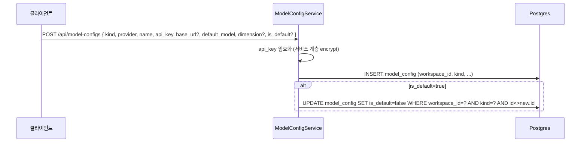
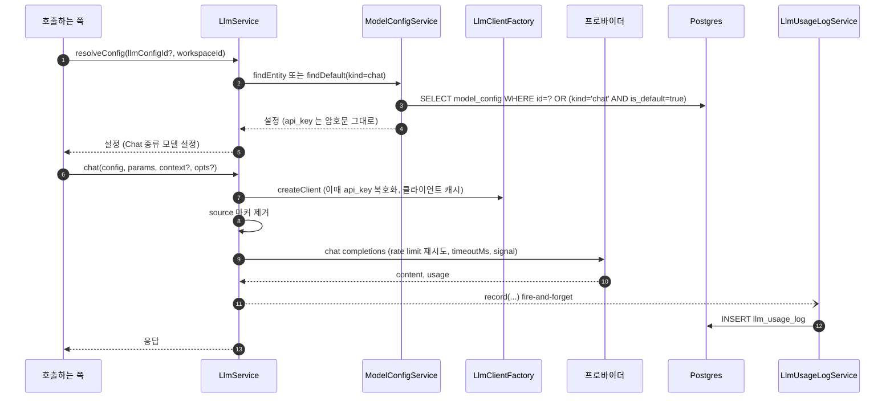

> 구현 상태: 구현됨 · 원문: `spec/data-flow/7-llm-usage.md`, `spec/1-data-model.md` (§2.16 ModelConfig, §2.24 LlmUsageLog) · 용어: [용어 사전](../CLE-GLOSSARY.md)

## 개요

이 문서는 AI 모델 호출에 쓰이는 두 엔티티와 사용량 적재 흐름을 정한다. 하나는 워크스페이스가 등록한 모델 연결인 모델 설정(Model settings, `ModelConfig`, 테이블 `model_config`)이다. 다른 하나는 호출마다 토큰과 비용을 쌓는 LLM 사용량(LLM usage, `LlmUsageLog`, 테이블 `llm_usage_log`)이다.

모든 LLM 호출은 LLM 클라이언트(`LlmService`)라는 한 창구를 지난다. 그중 Chat 계열 호출(`chat`, `chatStream`)의 토큰 수와 비용을 `llm_usage_log` 에 쌓아 통계·알림 규칙·사용량 추적의 기준으로 삼는다. 임베딩 호출(`embed`)은 같은 창구를 지나지만 사용량을 쌓지 않는다. Rerank 종류는 `LlmService` 를 거치지 않는 전용 `/rerank` 경로라 이 흐름 밖이다.

모델 설정은 예전 엔티티 이름이 `LLMConfig`(테이블 `llm_config`)였다. V088 에서 테이블 이름을 `model_config` 로 바꿨지만 이 테이블을 가리키는 필드 이름에는 옛 이름이 남아 있다. `llm_usage_log.llm_config_id`, AI 노드 `config.llmConfigId`, `AssistantSession.llm_config_id`, `KnowledgeBase.extraction_llm_config_id`, `KnowledgeBase.rerank_llm_config_id`, 서비스 코드의 `LlmConfig` 타입 이름이 그렇다. 이 필드들은 모델 설정 참조 필드(`llmConfigId`, `llm_config_id`)이며 코드 식별자라 이름을 바꾸지 않는다.

범위 밖 문서는 다음과 같다.

- 호출 인터페이스·캐시·재시도·타임아웃·API 키 보안: [LLM 클라이언트](CLE-AI-LLM.md)
- 모델 설정 화면·API·권한: [모델 설정](CLE-AI-MODELS.md)
- 사용량을 읽는 화면과 규칙: [통계](../CLE-OBS/CLE-OBS-STATS.md), [알림](../CLE-OBS/CLE-OBS-NOTIFY.md)
- 엔티티 관계 전체 지도: [데이터 모델 개요](../CLE-PLAT/CLE-PLAT-DATA.md)

## 모델 설정 엔티티

워크스페이스가 쓰는 모든 AI 모델 설정(chat, embedding, rerank)을 `kind` 판별자로 한 테이블에서 관리한다(V088). 프로바이더 자격 증명과 엔드포인트를 가진 리소스이고, API 키 암호화·마스킹과 SSRF 가드를 종류와 상관없이 함께 쓴다. Chat·Embedding·Rerank 의 API 모양 차이(특히 Rerank 의 `/rerank` 전용 호출)는 실행 층 팩토리(`LLMClientFactory`, `RerankClientFactory`)가 `kind` 로 나눠 흡수하고, 설정 테이블은 하나로 둔다([LLM 클라이언트](CLE-AI-LLM.md)).

모델 설정은 저장된 프로바이더 설정 행이다. 모델 목록 항목(`ModelInfo`)은 프로바이더 `listModels` 응답의 한 항목(DTO)이다. 접두어 `Model` 만 같고 다른 개념이다.

| 필드 | 타입 | 설명 |
|------|------|------|
| id | UUID | PK. Chat 행은 옛 `llm_config` UUID 를 그대로 유지한다 |
| workspace_id | UUID | FK → Workspace (CASCADE) |
| kind | Enum | `chat` / `embedding` / `rerank`. 모델 역할 판별자. 기본값 `chat`(V088) |
| provider | String | 종류별 허용 값. chat = `openai`/`anthropic`/`google`/`azure`/`local`. embedding = `openai`/`azure`/`google`/`local`(Anthropic 은 임베딩이 없어 제외). rerank = `tei`(자가호스팅)/`cohere`(외부 API). 리랭커의 `jina`·`voyage`·`local`·`builtin` 은 지원하지 않는다(2026-06-05 결정, [LLM 클라이언트](CLE-AI-LLM.md)) |
| name | String | 사용자가 정한 이름 |
| api_key | String? (encrypted) | API 키(암호화 저장). 자가호스팅(chat·embedding 은 `local`, rerank 는 `tei`)은 키가 필요 없어 선택이다. 외부 API(`openai`·`cohere` 등)는 필수. rerank 에는 `local` 프로바이더가 없으므로 rerank 행이 NULL 일 수 있는 이유는 `tei` 뿐이다 |
| base_url | String? | 커스텀 엔드포인트. `local`·`tei`·`azure` 는 필수. SSRF 가드를 거치고 `local`·`tei` 만 사설망을 허용한다 |
| default_model | String | 기본 모델 ID. rerank 예: `dragonkue/bge-reranker-v2-m3-ko`, `rerank-3.5` |
| default_params | JSONB | 기본 파라미터(temperature, max_tokens 등). chat 전용이고 embedding·rerank 는 쓰지 않는다 |
| dimension | Integer? | embedding 전용 벡터 차원(예: 384/512/768/1024/1536/3072). 모델 출력 차원이다. chat·rerank 는 NULL. Embedding 연결 테스트가 성공하면 probe 임베딩으로 감지해 자동 저장한다([모델 설정](CLE-AI-MODELS.md)). 지식 저장소의 `embedding_dimension` 과의 관계는 [문서 임베딩](../CLE-KB/CLE-KB-EMBED.md) 에서 정한다 |
| is_default | Boolean | `(workspace_id, kind)` 마다 최대 1개(partial unique). 종류별 워크스페이스 기본 설정 |
| created_at | Timestamp | 생성 시각 |
| updated_at | Timestamp | 수정 시각 |

### 종류별 참조 관계

| 종류 | 참조하는 필드 |
|------|---------------|
| chat | AI 노드 `config.llmConfigId`(JSONB, FK 없음), `AssistantSession.llm_config_id`, `llm_usage_log.llm_config_id`, `KnowledgeBase.extraction_llm_config_id`, `KnowledgeBase.rerank_llm_config_id` |
| embedding | `KnowledgeBase.embedding_model_config_id` (V091, FK `ON DELETE SET NULL`, NULL 이면 워크스페이스 기본 설정) |
| rerank | `KnowledgeBase.rerank_config_id` |

Chat 행은 UUID 를 유지했으므로 노드 `config.llmConfigId`·어시스턴트·사용량·그래프 추출·LLM 그레이딩의 참조는 합침 뒤에도 바뀌지 않았다. 지식 저장소 컬럼의 정의는 [지식 저장소 데이터와 흐름](../CLE-KB/CLE-KB-DATA.md) 에서 정한다.

### 인덱스와 제약

| 이름 | 정의 | 용도 |
|------|------|------|
| `model_config_workspace_kind_default_unique` | `(workspace_id, kind) WHERE is_default=true` partial UNIQUE (V089) | 종류별 기본 설정을 하나로 DB 에서 강제한다 |
| V130 인덱스 | `(workspace_id, kind)` | 종류별 목록 조회와 FK CASCADE 용. 위 partial UNIQUE 는 `is_default` 조건이 없는 조회에 쓰이지 않는다 |
| `uq_model_config_id_workspace_id` | `(id, workspace_id)` UNIQUE (V138 인덱스, V144 제약) | 어시스턴트 세션 · 지식 저장소의 모델 설정 참조 복합 FK 의 참조 대상이다([데이터 모델 개요 「참조의 소속」](../CLE-PLAT/CLE-PLAT-DATA.md#참조의-소속)). `id` 가 PK 라 유일성은 이미 참이다 |

### 마이그레이션

| 번호 | 내용 |
|------|------|
| V001 | Chat 설정 테이블 `llm_config` 생성 |
| V081 | 리랭커 설정 테이블 `rerank_config` 생성(`cross_encoder`·`cross_encoder_llm` 두 모드용) |
| V088 | `llm_config` → `model_config` 이름 변경, `kind`·`dimension` 추가 |
| V089 | `is_default` 유일성을 `(workspace_id, kind)` 기준으로 다시 정의 |
| V090 | `rerank_config` 행을 `model_config`(`kind=rerank`)로 흡수 |
| V091 | Embedding 1급 행 파생, 지식 저장소 `embedding_model_config_id` 추가 |
| V092 | 남은 `rerank_config` 테이블 삭제 |
| V093 | 모든 지식 저장소를 1급 Embedding 설정에 다시 연결 |
| V094 | 지식 저장소 옛 임베딩 컬럼 `embedding_llm_config_id`·`embedding_model` 비가역 삭제([문서 임베딩](../CLE-KB/CLE-KB-EMBED.md)) |
| V130 | `(workspace_id, kind)` 인덱스 추가 |
| V138 · V144 | `(id, workspace_id)` UNIQUE 추가. 모델 설정을 가리키는 FK 여섯 가운데 다섯(지식 저장소 넷, 어시스턴트 세션 하나)을 같은 워크스페이스 복합 FK 로 바꿨다. LLM 사용량 기록(`LlmUsageLog`)의 `llm_config_id` 는 단일 FK 그대로다 |

### 등록과 관리 흐름

모델 설정을 만들면 서비스가 API 키를 암호화해 저장한다. 기본 설정으로 지정하면 같은 워크스페이스·같은 종류의 다른 기본 설정을 같은 트랜잭션에서 해제한다.

- **암호화 위치**: 암호화는 TypeORM transformer 가 아니라 서비스 계층에서 한다. 생성·수정 때 `model-config.service.ts` 의 `create`·`update` 가 `encrypt(dto.apiKey, encryptionKey)`(`common/utils/crypto.util`)를 부른다. 복호화는 `LlmService.createClient` 가 클라이언트를 만들기 직전에 `getDecryptedApiKey` 로 한다.
- **마스킹**: 조회 응답의 `api_key` 는 필드 마스킹을 적용한다. 현재 구현은 `****` 뒤에 마지막 4자를 붙인다.
- **기본 설정 교체**: `create`·`update` 의 `saveWithDefaultSwap` 과 `PATCH :id/set-default` 모두 한 트랜잭션에서 기존 기본 설정을 해제한다.
- **캐시 무효화**: 설정을 고치거나 지우면 `ModelConfigService` 가 `notifyInvalidated(id)` 로 통지하고, `LlmService` 가 클라이언트 캐시와 `listModels` 캐시를 지운다([LLM 클라이언트](CLE-AI-LLM.md)).
- 미리보기·연결 테스트·모델 목록 같은 부속 엔드포인트는 [모델 설정](CLE-AI-MODELS.md) 에서 정한다.

## LLM 사용량 엔티티

Chat 계열 LLM 호출(`chat`/`chatStream`)이 끝나면 프로바이더 응답의 토큰 수를 append-only 로 한 행 쌓는다. 임베딩 호출은 프로바이더가 토큰 사용량을 돌려주지 않아 쌓지 않는다. 자매 로그인 통합 활동 로그(`IntegrationUsageLog`, [통합 데이터와 흐름](../CLE-INT/CLE-INT-DATA.md))와 대칭이다.

CASCADE 로 소유하는 부모는 워크스페이스(`workspace_id`)다. 나머지 FK(`workflow_id`, `execution_id`, `node_execution_id`, `llm_config_id`)는 모두 nullable 이고 `ON DELETE SET NULL` 이다.

| 필드 | 타입 | 설명 |
|------|------|------|
| id | UUID | PK |
| workspace_id | UUID | FK → Workspace (CASCADE). `config.workspaceId` 로 늘 채운다. 워크스페이스 단위 집계는 사용량 귀속이 빠져도 온전하다 |
| workflow_id | UUID? | FK → Workflow (SET NULL). AI 노드 호출은 채운다(첫 턴·단일 턴은 `context.*`, 재개 턴은 `state.*`). 워크플로우 밖 호출과 아직 배선하지 않은 호출은 NULL |
| execution_id | UUID? | FK → Execution (SET NULL). `workflow_id` 와 같다 |
| node_execution_id | UUID? | FK → NodeExecution (SET NULL). 현재 턴의 노드 실행(`NodeExecution`) 행 PK. `workflow_id` 와 같다 |
| llm_config_id | UUID? | FK → 모델 설정(Chat 종류), `ON DELETE SET NULL`. 물리 테이블은 `model_config` 다(V014 가 `llm_config` 를 가리키게 만들었고 V088 이름 변경을 따라갔다). 호출에 쓴 설정이며 JSONB `config.llmConfigId` 에서 올 수도 있다 |
| provider | varchar(50) | 프로바이더 |
| model | varchar(100) | 모델 ID |
| prompt_tokens | Integer | 입력 토큰(기본 0) |
| completion_tokens | Integer | 출력 토큰(기본 0) |
| total_tokens | Integer | 합계 토큰(기본 0) |
| thinking_tokens | Integer? | reasoning 토큰(V018, OpenAI reasoning·Gemini 2.5). 저장만 하고 `cost_usd` 계산에는 넣지 않는다 |
| cost_usd | Numeric(12,6)? | `pricing.ts` 단가표(`provider:model`)로 계산한다. 단가표에 없는 모델은 NULL(통계 `SUM` 에서 자연히 빠진다). 통계 응답에는 숫자로 싣는다. 서비스가 `::float` 와 `Number()` 로 명시 변환한다([OpenAPI 문서화](../CLE-API/CLE-API-SWAGGER.md)) |
| created_at | Timestamp | 기록 시각 |

- **인덱스**: `(workspace_id, created_at DESC)`, `(provider, model, created_at DESC)`, `(workflow_id, created_at DESC) WHERE workflow_id IS NOT NULL`(통계용 partial). FK SET NULL 용 partial 인덱스 `(node_execution_id)`(V115), `(execution_id)`(V116), `(llm_config_id)`(V122).
- **마이그레이션**: V014 생성, V018 `thinking_tokens` 추가.
- **상태**: 상태 머신이 없는 append-only 로그다.
- **호출 출처 컬럼 없음**: 호출 출처를 따로 구분하는 컬럼(`source` 등)은 없다. 워크플로우 AI 어시스턴트 사용량은 `workflow_id` 만 채운다. `LlmService` 가 떼어 내는 `source` 마커는 WebSocket emit 메타이고 사용량 행에 남지 않는다.

## 사용량 적재

호출하는 쪽이 설정을 해석해 `chat` 을 부르면, 응답을 받은 뒤 `LlmUsageLogService.record` 가 비동기로 한 행을 쌓는다.

- **실패 흡수**: `record` 는 fire-and-forget 이다. 기록이 실패해도 호출 결과에 영향이 없고 경고 로그만 남긴다(`llm-usage-log.service.ts`).
- **스트리밍**: `chatStream` 은 `done` 이벤트에 usage 가 실려 오고 `totalTokens > 0` 일 때만 기록한다. 취소나 에러로 끝난 불완전한 응답이 0건 행으로 남지 않게 하려는 것이다.
- **워크스페이스**: `workspaceId` 는 늘 `config.workspaceId` 로 채운다.
- **사용량 귀속**: `workflowId`·`executionId`·`nodeExecutionId` 는 호출하는 쪽이 사용량 귀속(`LlmCallContext`)으로 넘길 때만 채운다.
- **임베딩**: `embed` 는 같은 창구(20개 단위 배치, 배치별 타임아웃·재시도, `inputType` 힌트)를 지나지만 사용량을 기록하지 않는다. 프로바이더 임베딩 API 가 토큰 사용량을 주지 않고 `client.embed` 반환 형식도 `number[][]` 뿐이어서, 임베딩 비용은 지금 추적 범위 밖이다.
- **미리보기**: `LlmPreviewService` 는 모델 목록만 조회하고 `chat` 을 부르지 않으므로 사용량 행을 만들지 않는다.
- **리랭킹**: Rerank 종류 설정과 `RerankClientFactory`(`tei`·`cohere`)는 `LlmService` 를 거치지 않는 전용 `/rerank` 외부 호출이라 사용량을 쌓지 않는다. 단 `cross_encoder_llm` 모드의 LLM 그레이딩은 `LlmService.chat` 을 쓰므로 사용량이 쌓인다.

### 호출하는 쪽 목록

Chat 계열(사용량 적재):

| 호출하는 쪽 | 호출 종류 | 사용량 귀속 필드 |
| --- | --- | --- |
| AI 에이전트 노드(`ai-turn-executor.ts`: 단일 턴 `executeSingleTurn`, 멀티턴 재개 `processMultiTurnMessage` 의 메인 chat 과 도구 호출 뒤 chat) | chat (도구 호출 포함) | `workflow_id`·`execution_id`·`node_execution_id` 를 채운다. 단일 턴과 첫 턴은 `context.*`, 재개 턴은 재구성 `state.*`(엔진 `buildRetryReentryState` 가 현재 턴의 노드 실행 행 PK 를 state 에 넣는다) |
| 텍스트 분류기 노드(`text-classifier.handler.ts`) / 정보 추출기 노드(`information-extractor.handler.ts` `traceChat`) | chat | 채운다. 텍스트 분류기는 단일 턴(`context.*`), 정보 추출기는 첫 턴(`context.*`)과 재개 턴(`state.*`) |
| AI 에이전트 롤링 요약 압축(`nodes/ai/shared/agent-memory-injection.ts`) | chat | 채운다. 단일 턴과 첫 턴은 `context.*`, 재개 턴은 `state.*`. `AiMemoryManager.injectMemoryContext` 가 `buildSummaryBufferUpdate` 로 `llmContext` 를 넘긴다 |
| `WorkflowAssistantStreamService`(`workflow-assistant-stream.service.ts`) | chatStream | `workflow_id` 만 채운다(`{ workflowId: session.workflowId }`). 사용량은 어시스턴트 메시지 행(`AssistantTurnPersistenceService.persistAssistantTurn` → `appendMessage.usage`)과 사용량 로그 양쪽에 쌓인다 |
| `GraphExtractionService`(그래프 추출, `knowledge-base/graph/graph-extraction.service.ts`) | chat | 사용량 귀속을 넘기지 않아 모두 NULL. `timeoutMs` 와 `disableInnerRetry` 를 쓴다(바깥 `retryWithBackoff` 가 재시도를 맡는다) |
| `RerankService` LLM 그레이딩(`cross_encoder_llm` 에스컬레이션, `knowledge-base/search/rerank.service.ts`) | chat | 사용량 귀속을 넘기지 않아 모두 NULL |
| 에이전트 메모리 추출 processor(BullMQ, `agent-memory/queues/agent-memory-extraction.processor.ts`) | chat | 사용량 귀속을 넘기지 않아 모두 NULL |

임베딩 계열(사용량 미적재):

| 호출하는 쪽 | inputType | 모델 설정 선택 |
| --- | --- | --- |
| `EmbeddingService`(지식 저장소 청크 적재, `knowledge-base/embedding/embedding.service.ts`) | `document` | `resolveEmbedding(kb.embeddingModelConfigId)`. 1급 Embedding 설정이고, NULL 이면 워크스페이스 기본 Embedding 설정 |
| 지식 저장소 차원 probe(`knowledge-base.service.ts` `probeEmbedding`) | `document` | 요청에서 지정한 설정 또는 워크스페이스 기본 설정 |
| RAG 검색 query 임베딩(`knowledge-base/search/rag-search.service.ts`, 두 곳) | `query` | 그 지식 저장소(그룹)가 청크 임베딩에 쓴 설정. 차원 불일치를 막는다 |
| 에이전트 메모리 저장·회수(`agent-memory/agent-memory.service.ts`) | 저장 `document` / 회수 `query` | 정의가 갈린다. [에이전트 메모리 §미결 사항](CLE-AI-MEMORY.md#미결-사항) 참조 |

### 사용량 귀속 현황

- 노드 핸들러 세 가지(AI 에이전트, 텍스트 분류기, 정보 추출기)는 `workflow_id`·`execution_id`·`node_execution_id` 를 채운다. 멀티턴 노드(AI 에이전트, 정보 추출기)는 첫 턴과 재개 턴 모두 채우고, 텍스트 분류기(단일 턴, 재개 없음)는 호출 시점에 채운다.
- AI 에이전트 롤링 요약 압축 chat 도 노드에서 나온 호출이므로 같은 방식으로 채운다.
- 그래서 `WHERE workflow_id = ?` 로 묶는 워크플로우별 비용 집계(통계의 `workflowId` 필터, 알림 규칙 `llm_cost` 의 워크플로우 범위)는 노드에서 나온 사용량을 반영한다.
- 남은 NULL 은 두 종류다. (a) 워크플로우 밖 호출이라 노드 컨텍스트가 처음부터 없는 `GraphExtractionService`·에이전트 메모리 추출 processor 는 의도한 누락이다. (b) 노드 실행 중이지만 사용량 귀속을 아직 배선하지 않은 `RerankService` LLM 그레이딩은 나중에 배선할 여지가 있다.

## 비용 계산

- `LlmUsageLogService.record` 가 프로바이더 응답의 토큰 수를 받아 `pricing.ts` 의 `calculateCostUsd(provider, model, promptTokens, completionTokens)` 로 `cost_usd` 를 계산한다.
- 단가표 키는 `provider:model`(소문자 정규화)이고 값은 `(promptPer1k, completionPer1k)`(1K 토큰당 USD)다.
- 단가표에 없는 모델은 `cost_usd = NULL` 이다. 통계 집계(`SUM(cost_usd)`)에서 NULL 은 자연히 빠질 뿐이고 따로 unknown 분류를 두지 않는다.
- `thinking_tokens`(OpenAI reasoning, Gemini 2.5 등)는 V018 에서 더한 별도 컬럼으로 저장만 한다. `calculateCostUsd` 는 prompt·completion 토큰만 받으므로 비용에 넣지 않는다.

## 사용량을 읽는 쪽

| 의존 | 방향 | 내용 |
| --- | --- | --- |
| 지식 저장소 | 양쪽 참조 | 임베딩(청크 적재·query, 사용량 미적재)과 chat(그래프 추출·LLM 그레이딩, 사용량 적재, 귀속 NULL). 리랭커 cross-encoder 호출은 별도 경로다 |
| 에이전트 메모리 | 양쪽 참조 | 추출 processor chat(워크플로우 밖, 귀속 NULL)과 롤링 요약 압축 chat(노드에서 나온 호출, 귀속 채움)은 사용량을 쌓는다. 저장·회수 임베딩은 쌓지 않는다([에이전트 메모리](CLE-AI-MEMORY.md)) |
| 실행 | 양쪽 참조 | AI 노드 호출 진입점. 노드 핸들러(AI 에이전트, 텍스트 분류기, 정보 추출기)가 사용량 귀속으로 워크플로우·실행·노드 실행을 채운다. 첫 턴은 `ExecutionContext`, 재개 턴은 재구성 `state` 를 쓴다 |
| 워크플로우 AI 어시스턴트 | 양쪽 참조 | 턴이 끝날 때 사용량을 메시지 행과 로그에 쌓고 `workflow_id` 를 채운다([워크플로우 AI 어시스턴트 스트리밍과 세션 API](../CLE-WF/CLE-WF-ASSIST-PROTO.md)) |
| 통계 | 하류 | `llm_usage_log` 를 프로바이더·모델별, 일자별 SUM 으로 집계한다(`statistics.service.ts`). `workflowId` 필터는 노드와 어시스턴트 사용량을 잡는다([통계](../CLE-OBS/CLE-OBS-STATS.md)) |
| 알림 규칙 | 하류 | `llm_cost` 규칙이 기간 안 `SUM(cost_usd)` 를 임계값과 비교한다(`alerts-evaluator.service.ts`). 워크플로우 범위 규칙은 노드 사용량을 반영하고 노드 밖 호출만 빠진다([알림](../CLE-OBS/CLE-OBS-NOTIFY.md)) |

## 구현 위치

- `codebase/backend/src/modules/model-config/model-config.service.ts` (모델 설정 CRUD, 기본 설정 교체, API 키 암호화·복호화)
- `codebase/backend/src/modules/model-config/entities/model-config.entity.ts`
- `codebase/backend/src/modules/llm/llm-usage-log.service.ts` (Chat 계열 사용량 적재)
- `codebase/backend/src/modules/llm/entities/llm-usage-log.entity.ts`
- `codebase/backend/src/modules/llm/pricing.ts`
- `codebase/backend/migrations/V*.sql` (V014, V018, V088~V094, V115, V116, V122, V130, V138, V144)

## Rationale

### 모델 설정을 한 테이블에 kind 로 둔 이유

Chat·Embedding·Rerank 는 모두 "프로바이더 자격 증명 + 모델" 이라는 같은 뼈대다. 마스킹·SSRF 가드·암호화 인프라도 이미 함께 쓰고 있었다. 예전에는 API 모양 차이를 근거로 Chat 설정(`LLMConfig`)과 리랭커 설정(`RerankConfig`)을 나눴지만, 그 차이는 실행 층 관심사일 뿐 설정 테이블을 쪼갤 이유가 아니었다. 쪼갠 결과는 CRUD·DTO·컨트롤러·프런트 페이지·i18n 의 통째 중복과 설정 화면 분산뿐이었다. `kind` 로 흡수하면 관리 지점(테이블 둘과 빌려 쓰기 → 하나, 설정 화면 셋 → 하나)이 실제로 줄어든다. 화면을 합친 결정은 [모델 설정](CLE-AI-MODELS.md) 에 있다.

### Embedding 을 1급 행으로 둔 이유

예전에는 임베딩이 Chat 설정(`LLMConfig`) 행을 빌려 썼다. 같은 행이 역할에 따라 chat 도 되고 embedding 도 됐다. 임베딩 모델에는 pgvector 컬럼 차원과 묶인 차원이라는 고유 불변 속성이 있으므로, `dimension` 을 가진 1급 행(`kind=embedding`)이 맞다. 프로바이더 클라이언트는 기존 임베딩 경로(openai/azure/google/local)를 그대로 쓰므로 새 프로바이더를 더한 것은 아니다.

### 기본 설정을 partial UNIQUE 로 강제한 이유

워크스페이스마다 종류별 기본 모델 설정은 정확히 하나여야 한다. `(workspace_id, kind) WHERE is_default=true` partial unique index 로 DB 에서 강제하고(V089), 서비스는 새 기본 설정을 지정할 때 같은 `(workspace, kind)` 의 기존 기본 설정을 같은 트랜잭션에서 해제한다.

합치기 전 `llm_config` 에는 엔티티 `@Index` 선언만 있고 인덱스를 만드는 SQL 마이그레이션이 없었다(`synchronize: false`). 그래서 DB 강제가 없고 서비스 트랜잭션이 유일한 보호였다. 당시 `rerank_config` 만 V081 이 SQL 인덱스를 만들었다. V089 가 `(workspace_id, kind)` 기준 partial unique 를 SQL 로 실제로 만들면서 이 틈이 없어졌다.

### LLM 사용량을 모델 설정 아래가 아니라 워크스페이스 아래 둔 이유

사용량 행을 CASCADE 로 소유하는 부모는 워크스페이스다. `llm_config_id` 는 `SET NULL` 이라 모델 설정이 사용량 행을 소유하지 않는다. 모델 설정을 지워도 사용량 기록은 남아야 워크스페이스 비용 집계가 온전하다. 통합 활동 로그가 CASCADE 부모인 통합 아래 놓이는 것과 같은 원칙이다.

### 사용량 귀속 컬럼을 nullable 로 둔 이유

`workflow_id`·`execution_id`·`node_execution_id`·`llm_config_id` 가 모두 nullable 인 것은 호출 경로마다 컨텍스트가 다르기 때문이다. 그래프 추출과 메모리 추출처럼 워크플로우 밖에서 오는 호출이 실제로 있다.

"AI 노드 호출은 세 ID 를 모두 채운다" 는 요구는 집계 의미를 다시 정의하지 않고 코드를 고쳐서 실현했다. 핸들러가 `ExecutionContext` 의 ID 를 `LlmCallContext` 로 넘기도록 고쳤다. 첫 턴·단일 턴 경로를 먼저 고치고, 2026-07 에 멀티턴 재개 턴(정보 추출기, AI 에이전트)까지 마쳤다. 재개 턴은 핸들러가 `ExecutionContext` 대신 재구성 `state` 만 받는다. 그래서 엔진 `buildRetryReentryState` 가 state 에 `workflow_id` 와 현재 턴의 노드 실행 행 PK(`node_execution_id`)를 넣고, 핸들러가 이를 쓴다. 첫 턴이 쓰는 `context.nodeExecutionId` 와 대칭이다. 이때 정보 추출기 재개 턴이 `node_execution_id` 자리에 노드 정의 ID 를 잘못 넣던 회귀도 바로잡았다. AI 에이전트 롤링 요약 압축 chat 도 2026-07 에 같은 방식으로 배선했다.

남은 NULL 가운데 워크플로우 밖 호출은 의도한 누락이고, `RerankService` LLM 그레이딩은 나중에 배선할 여지다. 워크스페이스 단위 집계는 `config.workspaceId` 를 늘 채우므로 귀속이 빠져도 온전하다.

### 임베딩 사용량을 기록하지 않는 이유

사용량 적재는 Chat 계열에만 배선했다. 프로바이더 임베딩 API 는 응답에 토큰 사용량을 싣지 않고 `client.embed` 도 `number[][]` 만 돌려준다. 그래서 임베딩 비용 추적은 지금 범위 밖이다. 이것은 의도한 누락이 아니라 잴 수 없어서 생긴 현행 한계다. 사용량을 함께 돌려주는 `EmbedResponse` 는 미구현이다([LLM 클라이언트](CLE-AI-LLM.md)).
