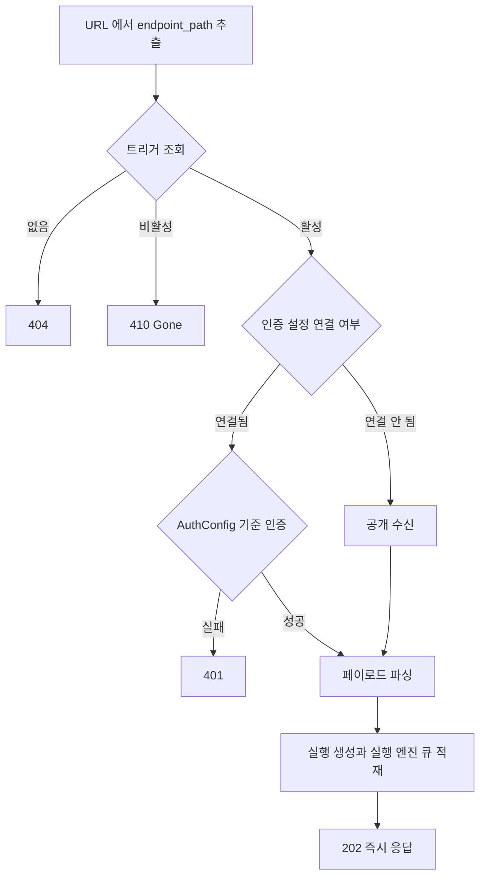

> 구현 상태: 구현됨 · 원문: `spec/5-system/2-api-convention.md` · 용어: [용어 사전](../CLE-GLOSSARY.md)

## 개요

이 문서는 Clemvion HTTP API 가 밖에서 어떻게 보이는지 정한다. URL 구조, 워크스페이스 스코핑(workspace scoping), 요청 형식, 응답 봉투(response envelope, `{ data }`), 값이 없음을 나타내는 부재 표현(absence representation), HTTP 상태 코드, 요청 빈도 제한(rate limit, `RATE_LIMITED`), 페이지네이션, 파일 업로드가 대상이다.

API 를 읽는 쪽은 웹 프론트엔드 하나가 아니다. External Interaction API(EIA, `/api/external/*`)·웹훅·생성된 SDK 가 같은 계약을 읽는다. 그래서 OpenAPI 문서가 실제 wire 와 어긋나면 그 차이가 소비자 코드로 그대로 번진다. 이 문서의 규칙 상당수는 "무엇을 보내는가" 와 함께 "보낸다고 문서에 적은 것과 실제로 보내는 것이 같은가" 를 다룬다. §5.5 부재 표현과 그 검증 층이 그 자리다.

이 문서가 정하지 않는 것은 아래 문서가 정한다.

- 에러 응답 봉투와 상태 코드별 기본 에러 코드, `details` 규칙: [에러 응답과 클라이언트 처리](CLE-API-ERROR.md)
- 에러 코드 이름 규칙과 전체 코드 목록: [에러 코드 규약과 카탈로그](CLE-API-ERRCODES.md)
- `@nestjs/swagger` 데코레이터로 OpenAPI 를 적는 방법: [OpenAPI 문서화](CLE-API-SWAGGER.md)
- WebSocket 연결·구독·재연결: [WebSocket 연결과 채널 구독](CLE-API-WS.md). 이벤트와 명령: [WebSocket 이벤트와 명령](CLE-API-WS-EVENTS.md)
- 응답에서 자격 증명을 가리는 규칙: [응답 자격 증명 마스킹](CLE-API-EGRESS.md)
- 웹훅 수신 엔드포인트의 상세 계약: [웹훅](../CLE-TRIG/CLE-TRIG-WEBHOOK.md)

관련 문서: [비기능 요구사항](../CLE-PLAT/CLE-PLAT-NFR.md) · [Clemvion 제품 개요](../CLE-VISION.md)

## 규칙

1. 리소스 API 는 `{base_url}/api/{resource}` 아래에 둔다. 리소스 이름은 복수형 명사이고 케밥 케이스로 쓴다. 경로 중첩은 2단계까지다.
2. 자원 액션 경로 `/api/{resource}/{id}/{action}` 의 마지막 세그먼트는 동사(구)다. 목적어는 경로에 두고 액션 이름에 넣지 않는다.
3. Boolean 상태 필드를 바꿀 때는 전용 엔드포인트를 만들지 않는다. `PATCH /:id { field: value }` 로 바꾼다.
4. 리소스 API 는 현재 워크스페이스 안에서만 동작한다. 현재 워크스페이스는 access token 의 `activeWorkspaceId` 클레임으로 정한다.
5. 성공 응답은 `{ data: ... }` 로 감싼다. 페이지 목록은 `{ data: [...], pagination }` 이고 작은 본인 목록은 `{ data: { items } }` 다.
6. 응답에서 값이 없을 때 기본 표현은 `null` 이다. 키를 빼는 것은 §5.5 의 두 기준 중 하나에 해당할 때만이고 그 필드를 문서화하는 절에 사유를 적는다.
7. DTO 선언은 wire 를 그대로 반영한다. TS 타입이 `| null` 이면 OpenAPI 에 `nullable: true` 를 반드시 선언한다.
8. 요청 PATCH 는 키 생략·`null`·값이 각각 다른 뜻인 PATCH 삼중 상태(tri-state)다. 응답 부재 표현 규칙을 요청 DTO 에 적용하지 않는다.
9. 큐에 넣고 바로 돌아오는 요청은 `202 Accepted` 와 ack 본문을 돌려준다. `202` 는 no-content 가 아니다.
10. `410 Gone` 은 존재했으나 사라졌거나 비활성인 리소스에 쓴다. 처음부터 없던 리소스는 `404` 다.
11. `502` 는 외부 제3자 API 호출 실패에, `503` 은 우리 인프라 의존성의 일시 장애에 쓴다.
12. 요청 빈도 제한 수치의 단일 기준(single source of truth)은 §7 표다. 한도를 넘으면 `429` 와 `Retry-After` 헤더를 돌려준다. 채팅 채널 인바운드만 예외로 `202` 를 돌려준다.
13. 목록 조회의 기본 페이지네이션은 offset 방식이다. 대량으로 쌓이는 데이터는 cursor 방식을 쓴다.
14. `PUT` 은 쓰지 않는다. 부분 수정은 `PATCH` 로 한다.

## 1. 기본 원칙

| 항목 | 규칙 |
|------|------|
| 프로토콜 | HTTPS (TLS 1.2 이상) |
| 스타일 | RESTful |
| 형식 | JSON (`Content-Type: application/json`) |
| 인코딩 | UTF-8 |
| 인증 | Bearer 토큰 (`Authorization: Bearer {access_token}`) |
| 버전 | URL 경로에 넣지 않는다. Accept 헤더를 쓰거나 단일 버전으로 운영한다 |

## 2. URL 구조

### 2.1 기본 패턴

```
{base_url}/api/{resource}
{base_url}/api/{resource}/{id}
{base_url}/api/{resource}/{id}/{sub-resource}
```

### 2.2 명명 규칙

| 규칙 | 예시 |
|------|------|
| 리소스는 복수형 명사 | `/api/workflows`, `/api/triggers` |
| 케밥 케이스 | `/api/knowledge-bases`, `/api/auth-configs` |
| 중첩은 2단계까지 | `/api/knowledge-bases/:id/documents` |
| 3단계 이상은 최상위로 분리 | `/api/documents/:docId` (필요할 때) |
| **자원 액션**: `/api/{resource}/{id}/{action}` 의 마지막 세그먼트는 자원이 아니라 동사(구)다. 앞 경로가 가리키는 자원에 가하는 동작이다. 케밥 케이스 복합 동사구도 포함한다(`run-now`, `transfer-ownership`, `set-default`). 목적어는 경로에 두고 액션 이름에 넣지 않는다. `/workflows/:id/nodes/:nodeId/execute` 가 맞고 `/workflows/:id/execute-node` 는 틀리다. Boolean 상태 필드의 단순 토글에는 이 형태를 쓰지 않는다(§12.1) | `/executions/:id/stop`, `/schedules/:id/run-now`, `/workflows/:id/nodes/:nodeId/execute` |
| **예외: RPC 형태 하위 채널 액션** `/api/{resource}/{id}/{channel}/{action}`. 자원 자체가 아닌 하위 채널에 가하는 부수 동작(`rotate-*`, `revoke-*`, `disable-*`, `switch` 등)이다. URL 만으로 자원·채널·동작을 식별할 수 있어야 해서 허용한다. 자원 액션에 `{channel}` 이 하나 더 끼는 자매 형태다 | `/api/triggers/:id/notification/rotate-secret`, `/api/triggers/:id/interaction/revoke-token`, `/api/triggers/:id/chat-channel/rotate-bot-token`, `/api/auth/workspaces/:id/switch` |
| **예외: 인증 family 전용 네임스페이스** `/api/external/{resource}`. 로그인 세션·워크스페이스 인증이 아니라 실행 단위 토큰(per_execution token, `iext_*`) 같은 인터랙션 토큰으로만 접근하는 별도 인증 family 다. 같은 자원이라도 인증 주체와 호출하는 쪽이 달라 경로를 나눈다. 규칙 위반이 아니라 명시한 예외다. 상세는 [External Interaction API](../CLE-IX/CLE-EIA.md), 요청 빈도 제한은 §7, 부재 표현은 §5.5 | `/api/external/executions/:id`, `/api/external/executions/:id/interact` |
| **예외: 인증 상태 전이와 capability 액션** `/api/auth/{action}`. 자원 CRUD 가 아니라 인증 상태 전이(자격 검증, 세션 발급·파기, 비밀번호 재설정, 2FA 등록·해제)이거나 그 전이에 필요한 읽기 전용 capability 조회(OAuth 시작, WebAuthn 가용성)다. 조작할 자원이 없거나(로그인) 자원을 노출하면 안 되므로(비밀번호 재설정 토큰) 복수형 명사로 표현할 수 없다. `/api/auth/workspaces/:id/switch` 는 RPC 형태 예외 쪽이다. 상세는 [가입과 로그인](../CLE-ACCT/CLE-ACCT-SIGNIN.md) | `/api/auth/login`, `/api/auth/refresh`, `/api/auth/2fa/verify`, `/api/auth/oauth/:provider` |

### 2.3 워크스페이스 스코핑

모든 리소스 API 는 현재 워크스페이스 컨텍스트에서 동작한다.

- 현재 워크스페이스는 access token 의 `activeWorkspaceId` 클레임으로 정한다. `jwt.strategy` 가 멤버십을 검증한 뒤 그 값을 `request.user.workspaceId` 로 채택한다.
- 워크스페이스 전환은 토큰 재발급(`POST /api/auth/workspaces/:id/switch`)으로 한다.
- **전환기 하위 호환(header-first)**: `X-Workspace-Id` 헤더가 있으면 `WorkspaceId` 데코레이터와 `RolesGuard` 가 그 워크스페이스를 먼저 쓴다. 헤더가 없으면 토큰 클레임을 쓴다. 클라이언트가 헤더를 떼면 토큰 클레임이 단일 기준이 된다.
- **예외: 경로 파라미터로 워크스페이스를 받는 라우트**(`/api/workspaces/:id/...`, `POST /api/auth/workspaces/:id/switch`)는 경로 값이 인가 대상이다. 헤더와 토큰 컨텍스트를 쓰지 않는다(2026-09-25). 가드가 경로 값도 검증하는 근거는 [계정과 워크스페이스 데이터 흐름](../CLE-ACCT/CLE-ACCT-DATA.md) 의 Rationale 에 있다.
- 결정 우선순위·전환 흐름·마이그레이션의 단일 기준은 [계정과 워크스페이스 데이터 흐름](../CLE-ACCT/CLE-ACCT-DATA.md) 의 워크스페이스 전환 절이다.
- 구현 상태: 구현됨(2026-07-07). `jwt.strategy` 는 토큰 클레임을 `activeWorkspaceId ?? workspaceId` 로 이중으로 읽고 그 멤버십을 검증해 현재 워크스페이스를 확정한다. 데코레이터와 `RolesGuard` 는 전환기 동안 헤더를 먼저 본다.

```
전환기: X-Workspace-Id 헤더가 있으면 header-first 로 먼저 쓴다
X-Workspace-Id: {workspace-uuid}

헤더가 없으면 토큰 클레임(activeWorkspaceId)이 현재 워크스페이스다
Authorization: Bearer {access-token}   (payload.activeWorkspaceId)
```

헤더가 없거나 형식이 잘못됐거나 비멤버일 때 돌려주는 에러 코드는 [에러 코드 규약과 카탈로그](CLE-API-ERRCODES.md) 의 유효성 검증 절(`X-Workspace-Id` 세 갈래)에 있다.

#### 시스템 전역 API 예외

일부 관측용 API 는 워크스페이스 경계가 없는 시스템 전역 집계를 돌려준다. 이 부류는 `X-Workspace-Id` 를 받더라도 무시한다. 개별 워크스페이스나 사용자를 식별할 수 있는 데이터(레코드 id, payload 등)는 내보내지 않는다.

| 전역 API | 설명 |
|----------|------|
| `GET /api/system-status/overview` | 전체 BullMQ 큐의 집계 카운트와 health. 상세는 [시스템 상태](../CLE-OBS/CLE-OBS-STATUS.md) |

## 3. HTTP 메서드

| 메서드 | 용도 | 멱등성 |
|--------|------|--------|
| GET | 리소스 조회 (목록·상세) | O |
| POST | 리소스 생성, 액션 실행 | X |
| PATCH | 리소스 부분 수정 | O |
| DELETE | 리소스 삭제 | O |
| PUT | 쓰지 않는다 (PATCH 를 쓴다) | 없음 |

## 4. 요청 형식

### 4.1 목록 조회 쿼리 파라미터

| 파라미터 | 타입 | 설명 | 기본값 |
|----------|------|------|--------|
| page | Integer | 페이지 번호 (1부터) | 1 |
| limit | Integer | 페이지 크기 (최대 100) | 20 |
| sort | String | 정렬 필드 (예: `created_at`) | `created_at` |
| order | `asc` / `desc` | 정렬 방향 | `desc` |
| search | String | 검색 키워드 | 없음 |

### 4.2 필터 파라미터

필터 파라미터는 리소스마다 따로 정한다. 예:

```
GET /api/workflows?status=active&tag=marketing
GET /api/triggers?type=webhook&status=active
```

## 5. 응답 형식

### 5.1 단일 리소스

```json
{
  "data": {
    "id": "uuid",
    "name": "My Workflow",
    "...": "..."
  }
}
```

### 5.2 목록 응답

```json
{
  "data": [
    { "id": "uuid-1", "...": "..." },
    { "id": "uuid-2", "...": "..." }
  ],
  "pagination": {
    "page": 1,
    "limit": 20,
    "totalItems": 45,
    "totalPages": 3
  }
}
```

- `data`(배열)와 `pagination` 은 최상위 형제다. 중첩하지 않는다.
- 목록 핸들러는 공용 `PaginatedResponseDto`(`{ data, pagination }`)를 돌려준다. 전역 `TransformInterceptor` 는 이미 `data` 키가 있는 객체를 더 감싸지 않고 그대로 통과시킨다(pass-through). 그래서 §5.1 단일 리소스의 `{ data: <obj> }` 와 달리 `data` 가 한 겹 더 감싸이지 않는다. 통과 분기의 동작과 데코레이터 표기는 [OpenAPI 문서화](CLE-API-SWAGGER.md) 의 응답 wrapping 절이 정한다.

### 5.3 고정 목록 응답

페이지를 나누는 의미가 없는 작은 본인 소유 목록(활성 로그인 세션 목록, WebAuthn credential 목록)은 고정 목록 응답(non-paginated collection)을 쓴다. `pagination` 없이 `items` 배열 하나를 `data` 아래에 중첩한 `{ "data": { "items": [ ... ] } }` 형태다.

- 핸들러가 `{ data: { items } }` 를 직접 돌려주면 이미 최상위 `data` 키가 있으므로 `TransformInterceptor` 가 그대로 통과시킨다. §5.2 와 같은 `'data' in data` 통과 경로다.
- §5.2 페이지 목록(`data` 가 배열 자체이고 `pagination` 이 형제)과 형태가 다르다.
- [OpenAPI 문서화](CLE-API-SWAGGER.md) 의 레거시 패턴 절이 버그로 지목한 `{ data: { items, totalItems, page, limit } }`(페이지 메타를 `items` 옆에 섞은 오용)과도 다르다. 이 형태에는 `pagination` 필드가 아예 없다.
- 이 형태를 유지하는 근거는 Rationale 의 "고정 목록 응답을 `{ data: { items } }` 로 유지" 에 있다.

### 5.4 에러 응답

HTTP 에러 응답은 에러 응답 봉투(error envelope) `{ "error": { "code", "message", "requestId", "details"? } }` 형식이다. 봉투 필드의 뜻, 상태 코드별 기본 에러 코드, `details` 를 싣는 규칙은 [에러 응답과 클라이언트 처리](CLE-API-ERROR.md) 가 정한다.

### 5.5 부재 표현: `null` 과 키 생략

**적용 범위는 응답 바디다.** 이 절은 서버가 내보내는 표현을 정한다. 요청 바디는 대상이 아니다.

- 특히 PATCH 부분 수정은 키 생략(값 유지)·`null`(초기화)·값(설정)이 각각 뜻을 갖는 PATCH 삼중 상태 계약이다. 아래 "DTO 선언 형태" 규칙을 요청 DTO 에 그대로 적용하면 `?` 가 사라져 "필드를 생략하면 값이 유지된다" 는 계약이 깨진다.
- 요청 DTO 에서는 `@ApiPropertyOptional({ nullable: true })` 와 `field?: T | null` 조합이 정당하다. 선례는 `UpdateAssistantSessionDto.llmConfigId` 다("null 전달 시 workspace default 로 폴백").

값이 없음을 나타내는 방식은 두 가지다. 한 응답 안에 섞여도 되지만 필드마다 근거가 있어야 한다.

| 표현 | 뜻 | 선택 기준 |
|------|------|----------|
| `null` (키는 있음) | 이 필드는 응답 계약에 늘 있고 지금은 값이 없다 | **기본값.** 소비자가 키가 있다고 전제하고 값만 분기하면 되는 스칼라·객체 필드 |
| **키 생략** | 값이 있을 때만 싣는다(present-when-available) | (a) 같은 데이터를 싣는 다른 표면(SSE·WebSocket wire)과 형식을 맞춰야 할 때. (b) 선택적인 부가 맥락이라 소비자가 부재를 정상 경로로 다룰 때 |

- **기본은 `null` 이다.** 키 생략은 (a)나 (b)에 해당할 때만 쓰고 그 필드를 문서화하는 절에 사유를 적는다.
- **DTO 선언이 wire 를 반영해야 한다.** 데코레이터 예시는 [OpenAPI 문서화](CLE-API-SWAGGER.md) 의 DTO 패턴 절에 있다. 판정 기준과 선언 형태는 이 절이 단일 기준이다.
  - 키를 생략하는 필드: `@ApiPropertyOptional()` 과 `field?: T` (`| null` 금지)
  - `null` 을 쓰는(늘 있는) 필드: `@ApiProperty({ nullable: true })` 와 `field: T | null`
  - TS 타입이 `| null` 인데 `nullable: true` 를 선언하지 않는 것은 어느 쪽에서도 틀리다. OpenAPI 가 null 가능성을 감춰 소비자가 null 이 올 수 없다고 믿게 된다.
- **`null` 필드에 `@ApiPropertyOptional` 을 쓰지 않는 이유**: 그 데코레이터는 `ApiProperty({ required: false })` 의 별칭이다(`@nestjs/swagger` 구현). 늘 있는 필드에 쓰면 OpenAPI 에 `required: false` 로 나가 "늘 있다" 는 정의와 모순된다. 생성기가 그 필드를 optional 로 만들어 소비자가 키 부재 분기를 쓰게 된다.
- 클라이언트는 두 표현을 모두 안전하게 다뤄야 한다. optional chaining(`a?.b`)은 `undefined` 와 `null` 을 함께 건너뛰므로 대개 가드 하나로 충분하다.
- **소급 적용하지 않는다.** 표현 선택과 DTO 선언 형태 모두 앞으로 도입하거나 바꾸는 필드에 적용한다. 이미 문서화된 키 생략 필드(`mcpDiagnostics`, Cafe24 `status`·`requiresCafe24Approval`, 채팅 채널 `details.statusCode` 등)는 기준 (b)를 충족하는 것으로 보고 사유 문구를 소급해 요구하지 않는다.

이 절은 새로 만든 규칙이 아니라 이미 쓰던 관행을 문서로 옮긴 것이다. 기존 선례는 아래와 같다.

| 표현 | 선례 |
|------|------|
| `null` | §8.2 `nextCursor`("없으면 `null`") · EIA 단발 상태 조회 `currentNode`·`result`·`error` ([EIA 수신 API와 SSE](../CLE-IX/CLE-EIA-INBOUND.md)) |
| 키 생략 | 에러 응답의 `details`("있을 때만 싣는다", [에러 응답과 클라이언트 처리](CLE-API-ERROR.md)) · EIA 단발 상태 조회 `context.conversationThread` |

실사례: EIA 단발 상태 조회(`GET /api/external/executions/:id`) 응답은 `currentNode`·`result`·`error` 를 `null` 로 두고 `context.conversationThread` 는 키를 생략한다. 뒤의 것은 기준 (a) 때문이다. 근거는 Rationale 의 "`conversationThread` 를 `null` 로 정규화하지 않는 이유" 에 있다.

#### 검증 층: 이 규칙을 무엇이 강제하는가

이 절은 선언과 실제가 같아야 한다고 정한다. 그런데 컨트롤러가 엔티티를 그대로 돌려주는 경로에서는 `tsc` 가 대조할 지점이 없다. 그 자리를 아래 검증자들이 나눠 맡는다. 이름이 비슷하니 어느 쪽인지 먼저 가려야 한다.

| 검증자 | 무엇과 무엇을 대조하나 | 언제 | 못 보는 것 |
|---|---|---|---|
| `swagger-dto-contract-guard.ts` (repo-guard) | **선언과 선언**: `@ApiProperty` 데코레이터와 TS 타입 | 정적 (AST) | 선언이 양쪽 다 틀린 경우. 실제 응답 값 |
| `response-contract.ts` (testing) | **값과 선언**: 실제 HTTP 응답과 생성된 OpenAPI 스키마 | 런타임 (e2e) | 배선되지 않은 엔드포인트 |
| `user-entity-exposure-guard.ts` (repo-guard) | **구조**: `User` 엔티티를 투영 없이 관계로 싣는 자리를 센다 | 정적 (AST) | 엔티티를 거치지 않고 손으로 조립한 유출 |
| `user-secret-absence.ts` (testing) | **이름**: 응답 바디 어디에도 `User` 민감 컬럼 이름이 없다(응답 노출 금지 민감 컬럼 목록은 [계정과 워크스페이스 데이터 흐름](../CLE-ACCT/CLE-ACCT-DATA.md)) | 런타임 (e2e) | 이름이 다른 새 비밀 컬럼. 목록(`USER_SECRET_KEYS`)에 넣어야 걸린다 |

- **개수를 세지 않는다.** 축이 늘 때마다 숫자가 낡는다. 원문 문서가 두 번 겪은 실패다. 문장은 나열을 가리키고 인벤토리는 위 표에 둔다.
- **두 축이 서로 다른 규칙을 시행한다.** `response-contract.ts` 의 판정 중 required/nullable 축은 이 절을 시행하고 "스키마에 선언하지 않은 키가 응답에 있다" 축은 [OpenAPI 문서화](CLE-API-SWAGGER.md) 의 응답 DTO 위치 절(엔티티를 그대로 노출하지 않는다)을 시행한다. 그래서 그 검증자는 두 문서의 구현 위치에 모두 등재한다. 한쪽에만 등재하면 다른 축의 변경이 재검토를 부르지 못한다.
- 판정 규칙의 상세 표는 코드 JSDoc 이 단일 기준이다. 여기에 옮겨 적으면 어긋날 원천이 하나 더 생길 뿐이다.
- `swagger-probe.ts` 는 스키마 생성 자체를 맡으므로 이 절과 무관한 이유로도 바뀔 수 있다. 그 변경이 이 문서를 재검토 대상으로 만드는 것은 의도한 과포함이다(판정 근거가 바뀌기 때문이다).

## 6. HTTP 상태 코드

| 코드 | 의미 | 사용 상황 |
|------|------|-----------|
| 200 | OK | 조회, 수정 성공 |
| 201 | Created | 생성 성공 |
| 202 | Accepted | **비동기 수락.** 큐에 넣고 바로 돌아오며 결과는 별도 채널(실행 상세·WebSocket·SSE)로 전한다. 웹훅 수신(§11)·실행 트리거·재임베딩 같은 긴 작업에 쓴다. no-content 가 아니다. `{ data: { executionId, ... } }` ack 본문을 싣는다([웹훅](../CLE-TRIG/CLE-TRIG-WEBHOOK.md), [EIA 수신 API와 SSE](../CLE-IX/CLE-EIA-INBOUND.md)) |
| 204 | No Content | 삭제 성공 |
| 400 | Bad Request | 잘못된 요청 (유효성 검증 실패) |
| 401 | Unauthorized | 인증 필요 또는 토큰 만료 |
| 403 | Forbidden | 권한 없음 |
| 404 | Not Found | 리소스 없음 |
| 409 | Conflict | 리소스 충돌 (중복 생성 등) |
| 410 | Gone | 리소스가 존재했으나 사라졌거나 비활성이다. 처음부터 없는 `404` 와 구분한다. 비활성 웹훅 트리거 `TRIGGER_INACTIVE`([웹훅](../CLE-TRIG/CLE-TRIG-WEBHOOK.md)) · 종료된 실행에 대한 명령 `EXECUTION_TERMINATED`([EIA 수신 API와 SSE](../CLE-IX/CLE-EIA-INBOUND.md)) · 만료되거나 사용된 초대 `invitation_expired`·`invitation_already_used`([워크스페이스와 멤버](../CLE-ACCT/CLE-ACCT-WS.md)). **예외**: `config.chatChannel` 트리거는 비활성이어도 `410` 이 아니라 `202` 와 `{ executionId: 'ignored' }` 를 돌려준다([채팅 채널](../CLE-CHAT/CLE-CHAT-CORE.md)). `410` 에는 기본 에러 코드가 없다([에러 응답과 클라이언트 처리](CLE-API-ERROR.md)) |
| 413 | Payload Too Large | 요청 본문이 body-parser 한도를 넘었다. 코드 `PAYLOAD_TOO_LARGE`. 웹훅 본문 크기 정책은 [웹훅](../CLE-TRIG/CLE-TRIG-WEBHOOK.md) |
| 422 | Unprocessable Entity | 비즈니스 로직 에러 |
| 429 | Too Many Requests | 요청 빈도 제한 초과 |
| 500 | Internal Server Error | 서버 에러 |
| 502 | Bad Gateway | **외부 제3자 API**(채팅 채널 provider 등) 호출 실패. 다시 시도할 수 있다. 코드: `CHAT_CHANNEL_SETUP_FAILED`(채팅 채널 `setupChannel` 실패, [채팅 채널](../CLE-CHAT/CLE-CHAT-CORE.md)). 아래 `503` 과 구분한다. `502` 는 외부 제3자, `503` 은 우리 인프라다. 노드 출력 안의 `statusCode` 와는 다른 축이다. 그쪽은 HTTP Request 노드가 받은 응답 상태이고 이 표는 우리 API 가 클라이언트에 주는 상태다 |
| 503 | Service Unavailable | 상위 의존성(Redis 등)의 일시 장애로 요청을 받을 수 없다. 다시 시도할 수 있다. 코드: `SERVER_SHUTTING_DOWN`(SIGTERM 뒤 새 실행 거부)·`EXECUTION_ENQUEUE_FAILED`(재개 메시지 발행 실패로 취소 미수락). 코드 정의는 [에러 코드 규약과 카탈로그](CLE-API-ERRCODES.md) 의 WebSocket 명령 절 |

자원을 만들지 않는 POST 액션의 성공 코드를 정하는 행은 아직 없다. [미결 사항](#미결-사항) 참조.

## 7. 요청 빈도 제한

> **한 행만 초과 응답이 다르다.** 채팅 채널 인바운드는 `429` 가 아니라 `202 Accepted` 와 `{ executionId: 'ignored' }` 를 돌려준다. Telegram 이 2xx 가 아닌 응답을 재시도나 웹훅 해제로 다루기 때문이다(근거: [채팅 채널](../CLE-CHAT/CLE-CHAT-CORE.md) 의 R-CC-19). 이 예외를 적어 두지 않으면 다음 사람이 "`429` 로 통일" 을 정합성 개선으로 착각한다.

| 범위 | 제한 | 헤더 |
|------|------|------|
| 일반 API | 100 req/min (사용자 기준) | `X-RateLimit-Limit`, `X-RateLimit-Remaining`, `X-RateLimit-Reset` |
| 인증 API (`POST /api/auth/register`, `POST /api/auth/login`) | 10 req/min (IP 기준). 라우트별 `@Throttle` 이다 | 같음 |
| 계정 확인·복구 (`POST /api/auth/forgot-password`, `POST /api/auth/resend-verification`, `POST /api/auth/check-email`) | 5 req/min (IP 기준). 라우트별 `@Throttle` 이다. 동작 정의는 [가입과 로그인](../CLE-ACCT/CLE-ACCT-SIGNIN.md) | 같음 |
| 초대 토큰 메타 조회 (`GET /api/invitations/:token`) | 30 req/min (공개 라우트라 IP 기준). 토큰 추측을 막는다. 동작 정의는 [워크스페이스와 멤버](../CLE-ACCT/CLE-ACCT-WS.md) | 같음 |
| 로그인 세션 강제 종료 (`POST /api/users/me/sessions/:familyId/revoke`, `POST /api/users/me/sessions/revoke-others`) | 10 req/min, 5 req/min (순서대로). 집계 키는 정의가 갈린다([미결 사항](#미결-사항)). 동작 정의는 [세션과 토큰](../CLE-ACCT/CLE-ACCT-SESSION.md) | 같음 |
| 이메일 변경 요청·재발송 (`POST /api/users/me/email-change/request`, `.../email-change/resend`) | 5 req/min. 동작 정의는 [내 프로필](../CLE-ACCT/CLE-ACCT-PROFILE.md) | 같음 |
| 웹훅 수신 | 100 req/min (전역 throttler `default`) | 같음 |
| 공개 웹훅 추가 한도 (`auth_config_id IS NULL` 트리거) | IP 단위 분당 10건, 시간당 누적 신규 20건(기본값). 전역 100 req/min 위에 얹히는 층이다. `PublicWebhookThrottleGuard` 가 걸고 넘으면 `429 PUBLIC_WEBHOOK_RATE_LIMIT`·`PUBLIC_WEBHOOK_HOURLY_LIMIT` 이다. 상세는 [웹훅](../CLE-TRIG/CLE-TRIG-WEBHOOK.md) | 웹훅 문서 참조 |
| 파일 업로드 (지식 저장소 문서, 아바타) | 전역 100 req/min 을 그대로 따른다. `POST /api/knowledge-bases/:id/documents` 와 `POST /api/users/me/avatar` 둘 다 별도 `@Throttle` 이 없다 | 같음 |
| Provider probe API (`POST /api/model-configs/preview-models`, `POST /api/model-configs/:id/test`, `GET /api/model-configs/:id/models`) | 10 req/min (사용자 기준). 실시간 provider 호출 비용과 provider 쪽 속도 제한을 보호하는 `@Throttle` 이다. 세 핸들러가 컨트롤러 상수 `PROVIDER_PROBE_THROTTLE` 을 함께 쓴다 | 같음 |
| 지식 저장소 재임베딩 (`POST /api/knowledge-bases/:id/re-embed`) | 3 req/min (사용자 기준). `@Throttle`, 편집자 이상. 동작 정의는 [문서 임베딩](../CLE-KB/CLE-KB-EMBED.md) | 같음 |
| 지식 저장소 실패 문서 재시도 (`POST /api/knowledge-bases/:id/retry-failed`) | 3 req/min. `@Throttle`, 편집자 이상. 동작 정의는 [지식 저장소 관리](../CLE-KB/CLE-KB-MANAGE.md) | 같음 |
| 임베딩 테스트 (`POST /api/knowledge-bases/embedding-probe`) | 30 req/min. `@Throttle`, 편집자 이상. 동작 정의는 [지식 저장소 관리](../CLE-KB/CLE-KB-MANAGE.md) | 같음 |
| 재실행 (`POST /api/executions/:id/re-run`) | 10 req/min (사용자 기준). `@Throttle`(60초에 10회). 넘으면 `429 RATE_LIMITED`. 동작 정의는 [재실행](../CLE-EXEC/CLE-EXEC-RERUN.md) | 같음 |
| 초대 발송·재발송 (`POST /api/workspaces/:id/invitations`, `.../invitations/:invitationId/resend`) | 10 req/min (사용자 기준). 메일 폭탄을 막는 `@Throttle` 이다. provider probe 와 공통 등급 상수 `SENSITIVE_ACTION_THROTTLE`(별칭 `INVITATION_THROTTLE`)을 쓴다 | 같음 |
| External Interaction 인바운드 (`POST /api/external/executions/:id/interact`, `GET /api/external/executions/:id`) | interact 60 req/min, 상태 조회 120 req/min. **실행 단위**다(IP 아님). 전역 100/min 위에 얹히는 층이다. `InteractionRateLimiterService`(Redis fixed-window)와 `InteractionRateLimitGuard` 가 걸고 넘으면 `429 RATE_LIMITED` 와 `Retry-After` 를 돌려준다. 상세는 [External Interaction API](../CLE-IX/CLE-EIA.md) 의 rate limit 절 | `Retry-After` |
| External Interaction SSE 동시 연결 (`GET /api/external/executions/:id/stream`) | 실행당 동시 연결 3개. 넘으면 `429 TOO_MANY_CONNECTIONS`(EIA 전용). 상세는 [EIA 수신 API와 SSE](../CLE-IX/CLE-EIA-INBOUND.md) | 없음 |
| 채팅 채널 인바운드 (채팅방 단위) | 채팅방당 분당 60건(기본값. `config.chatChannel.rateLimitPerMinute` 로 1~600 사이에서 바꾼다). 넘은 메시지는 버퍼링·재발사 없이 처리를 건너뛰고 `chat_channel_health=degraded` 로 표시한다. `ChatChannelRateLimiterService`(Redis fixed-window)이고 Redis 를 쓸 수 없으면 fail-open 이다. 상세는 [채팅 채널](../CLE-CHAT/CLE-CHAT-CORE.md) 의 CCH-NF-03 | 없음 (위 콜아웃) |
| WebSocket 명령 (`/ws` namespace 의 `@SubscribeMessage`) | **소켓당** 60 msg/min (in-memory fixed-window, HTTP 아님). `WsRateLimitGuard` 가 넘으면 `WsException(RATE_LIMITED)` 을 던지고 클라이언트는 `exception` 이벤트로 받는다(HTTP status 없음). `ping` 을 포함한 모든 핸들러와 등록되지 않은 이벤트(`onAny`)에 적용한다. 상세는 [WebSocket 연결과 채널 구독](CLE-API-WS.md) 의 에러 코드 절 | 없음 (전송: socket `exception`) |

- 한도를 넘으면 `429` 와 `Retry-After` 헤더를 돌려준다.
- **표의 범위**: 위 표는 전역 throttler 기본값(일반 API, 웹훅 수신, 파일 업로드 행)과, 그 위에 라우트별 `@Throttle` 이나 도메인 전용 rate limiter 로 덮어쓴 엔드포인트별 오버라이드를 한 곳에 모은 것이다. 개별 엔드포인트의 권한·부수 효과는 각 도메인 문서가 정하고 throttle 수치의 단일 기준은 이 표다.
- 인증된 요청은 전역 `UserThrottlerGuard` 가 `user:<sub>` 키로 사용자별로 센다. 인증되지 않은 요청만 IP 로 센다. 그래서 인증된 라우트의 제한은 사용자 기준이다.
- **키 결정 규칙(현재 구현)**: 전역 가드는 `JwtAuthGuard` → `UserThrottlerGuard` → `RolesGuard` 순서로 돈다. 추적 키는 `req.user` 의 `sub`(없으면 `userId`)가 있으면 `user:<id>`, 없으면 `req.ip` 다. `@Public()` 라우트는 `JwtAuthGuard` 가 사용자를 채우지 않아 IP 로 센다. 로그인 전 인증 라우트, 웹훅 수신, 인터랙션 토큰으로 인증하는 EIA 경로가 여기 든다. EIA 의 `InteractionGuard` 는 라우트 가드라 전역 가드보다 뒤에 돈다.
- External Interaction 인바운드는 `@Throttle` 이 아니라 도메인 전용 `InteractionRateLimiterService`(실행 단위 Redis 카운터)로 덮어쓴 사례다.
- **`NODE_ENV=test` 에서만 건너뛴다.** e2e 가 컨테이너 IP 하나에서 빠른 인증 호출을 연달아 보내 스스로 throttle 한계(100/60s)에 막히는 문제를 피하려고 test 환경에서는 `ThrottlerModule` 의 `skipIf` 가 throttle 을 전역으로 우회한다. production·development 동작은 바뀌지 않는다. 헬퍼는 `throttler-skip.ts` 다.

## 8. 페이지네이션

### 8.1 Offset 방식 (기본)

```
GET /api/workflows?page=2&limit=20
```

### 8.2 Cursor 방식 (대량 노드 실행 목록 등)

Background 노드 본문의 노드 실행(NodeExecution) 목록처럼 대량으로 쌓이는 데이터는 cursor 페이지네이션을 쓴다.

```
GET /api/executions/{executionId}/background-runs/{backgroundRunId}?cursor=eyJ...&limit=20
```

응답의 `nodeExecutions` 묶음이 cursor 페이지를 담는다. 키는 `nextCursor`(opaque base64, 없으면 `null`)와 `hasMore`(다음 페이지가 있는지)다.

```json
{
  "data": {
    "nodeExecutions": {
      "data": [...],
      "nextCursor": "eyJ...",
      "hasMore": true
    }
  }
}
```

워크플로우별 실행 목록(`GET /api/executions/workflow/:workflowId`)은 cursor 방식이 아니라 §8.1 offset 방식(`{ page, limit, totalItems, totalPages }`)이다. Background 본문 조회 API 의 전체 계약은 [Background 노드](../CLE-NODE-LOGIC/CLE-NODE-BACKGROUND.md) 에 있다.

## 9. 파일 업로드

| 항목 | 규칙 |
|------|------|
| 형식 | `multipart/form-data` (필드명 `file`) |
| 최대 크기 | 엔드포인트마다 다르다. 지식 저장소 문서 50MB, 아바타 2MB (각 `FileInterceptor` 의 `limits.fileSize`) |
| 허용 타입 | 엔드포인트마다 제한한다. 지식 저장소 문서는 PDF·Markdown·텍스트 등, 아바타는 `png`·`jpg`·`jpeg`·`webp`·`gif`(SVG 제외) |
| 응답 | 엔드포인트마다 다르다. 지식 저장소 문서는 올린 파일 메타데이터(id, status 등), 아바타는 `PATCH /users/me` 와 같은 프로필 응답([내 프로필](../CLE-ACCT/CLE-ACCT-PROFILE.md)) |

파일 업로드 엔드포인트는 둘이다. 지식 저장소 문서 업로드(`POST /api/knowledge-bases/:id/documents`)와 아바타 업로드(`POST /api/users/me/avatar`, [내 프로필](../CLE-ACCT/CLE-ACCT-PROFILE.md))다. 아바타는 `PATCH /api/users/me` 의 `avatarUrl` 로 외부 URL 을 넣는 경로도 함께 유지한다. 두 경로가 같은 컬럼을 쓴다.

## 10. WebSocket

HTTP API 와 같은 서버가 실시간 채널을 함께 연다. 전송 계층은 Socket.IO(namespace `/ws`)다. 연결·인증·메시지 형식·재연결은 [WebSocket 연결과 채널 구독](CLE-API-WS.md), 이벤트와 명령 목록은 [WebSocket 이벤트와 명령](CLE-API-WS-EVENTS.md) 이 정한다.

| 용도 | 방향 | 이벤트 |
|------|------|--------|
| 워크플로우 실행 상태 | Server → Client | `execution.*`, `execution.node.*` |
| 실행 제어 | Client → Server | 재개 명령(`execution.submit_form` 등)과 `execution.retry_last_turn`. 실행 시작·중단(`execution.start`·`execution.stop`)은 비채택이고 REST 가 대신한다. `execution.continue` 는 브레이크포인트 로드맵의 계획이며 미구현이다 |
| 지식 저장소 문서 상태 (임베딩·그래프 추출) | Server → Client | `document:embedding_*`, `document:graph_*` (구독 채널 `kb:{documentId}`) |

재연결 요약:

- **자동 재연결은 Socket.IO 클라이언트에 내장돼 있다.** 지수 백오프와 지터로 제한 없이 다시 시도한다. 구체 파라미터는 구현이 단일 기준이므로 여기에 숫자를 두지 않는다.
- **놓친 이벤트는 다시 구독할 때 받는 1회성 실행 스냅샷 이벤트(`execution.snapshot`)로 맞춘다.** native WebSocket 에는 이벤트 순번(`seq`) 기반 재전송 버퍼가 없다. 그 버퍼는 EIA 의 SSE 어댑터에 있고 `Last-Event-Id` 로 제공한다. 두 전송은 같은 `seq` 공간만 공유하고 버퍼는 공유하지 않는다.
- **자동 재연결이 되지 않는 경우**: 서버가 스스로 `disconnect()` 하면(토큰 만료 종료) Socket.IO 는 재연결을 시도하지 않는다. 클라이언트가 명시적으로 다시 연결해야 한다. 갈리는 것은 재연결 시작 여부뿐이고 복구 방식은 두 경우가 같다(위 스냅샷). 상세와 근거는 [WebSocket 연결과 채널 구독](CLE-API-WS.md) 에 있다.

## 11. 웹훅 수신 엔드포인트

외부 시스템이 워크플로우를 시작하려고 부르는 웹훅 수신 엔드포인트의 요점이다. URL·인증·입력 데이터·에러의 상세 계약은 [웹훅](../CLE-TRIG/CLE-TRIG-WEBHOOK.md) 이 단일 기준이고 이 절은 일반 API 규약 관점의 요약만 둔다.

### 11.1 URL 구조

```
POST {base_url}/api/hooks/{endpoint_path}
```

- `base_url`: SaaS 는 서비스 도메인(예: `https://api.example.com`), 셀프 호스팅은 설정한 도메인이다. 프론트엔드가 base 를 정하는 규칙은 [웹훅](../CLE-TRIG/CLE-TRIG-WEBHOOK.md) 의 WH-EP-02 다.
- `endpoint_path`: 트리거(Trigger) 엔티티의 `endpoint_path` 값이다. 트리거를 만들 때 v4 UUID 로 자동 발급하며 라우팅 식별자로 쓴다.
- 예시: `POST https://api.example.com/api/hooks/3f6c2a1e-8b4d-4e2f-9a7c-1d5e8f0b2c64`

### 11.2 지원 메서드

| 메서드 | 지원 | 설명 |
|--------|------|------|
| POST | ✓ | 표준 웹훅 수신 (유일하게 지원하는 메서드) |

웹훅 수신(워크플로우 트리거) 메서드는 POST 만 지원하고 그 밖의 메서드는 `405 Method Not Allowed` 다. GET·PUT 트리거 수신은 v1 에서 지원하지 않는다([웹훅](../CLE-TRIG/CLE-TRIG-WEBHOOK.md) 의 WH-EP-03). 같은 라우터에 웹채팅 위젯 부팅용 공개 읽기 엔드포인트 `GET /api/hooks/{endpoint_path}/embed-config` 가 따로 있다. 이것은 웹훅 수신이 아니라 임베드 허용 목록 조회용이다([웹채팅 보안](../CLE-WEBCHAT/CLE-WEBCHAT-SECURITY.md)).

### 11.3 요청 처리 흐름



1. URL 에서 `endpoint_path` 를 뽑아 트리거를 찾는다. 없으면 `404`, 비활성이면 `410 Gone` 이다.
2. `Trigger.auth_config_id` 가 가리키는 인증 설정(AuthConfig)으로 인증한다. 연결된 인증 설정이 없으면 공개 수신이고 인증에 실패하면 `401` 이다.
3. 페이로드를 파싱한다(`application/json`, `application/x-www-form-urlencoded`).
4. 실행(Execution)을 만들고 실행 엔진 큐에 넣는다.
5. 바로 `202` 를 돌려준다(비동기 실행).

인증 분기·파라미터 추출을 포함한 상세 처리 흐름은 [웹훅](../CLE-TRIG/CLE-TRIG-WEBHOOK.md) 의 처리 흐름 절이 정한다.

### 11.4 응답 형식

비동기 단일 모드다. 실행 큐에 넣은 뒤 바로 `202 Accepted` 를 돌려준다. 동기 `?wait=true` 모드는 지원하지 않는다. 모든 응답은 전역 `TransformInterceptor` 가 `{ data: ... }` 로 감싼다(§5).

```json
{
  "data": {
    "executionId": "550e8400-e29b-41d4-a716-446655440000",
    "message": "Webhook received, workflow execution started"
  }
}
```

`interaction.enabled=true` 트리거의 응답 확장 필드는 [웹훅](../CLE-TRIG/CLE-TRIG-WEBHOOK.md) 과 [External Interaction API](../CLE-IX/CLE-EIA.md) 의 웹훅 호출 응답 확장 절이 정한다.

### 11.5 인증 방식

웹훅 트리거는 인증 설정을 연결하지 않으면 공개로 받고 연결하면 그 인증 설정으로 인증한다(`api_key`, `bearer_token`, `basic_auth`, `hmac`). 인증 없음은 `AuthConfig.type` 의 값이 아니라 `auth_config_id IS NULL` 로 나타낸다([트리거 데이터와 흐름](../CLE-TRIG/CLE-TRIG-DATA.md)). 헤더·기본값·검증 방식의 단일 기준은 [웹훅](../CLE-TRIG/CLE-TRIG-WEBHOOK.md) 의 인증 방식 절이다. 예: HMAC 은 `AuthConfig.config.header`(기본 `X-Hub-Signature-256`) 헤더를, API Key 는 `AuthConfig.config.headerName`(기본 `X-API-Key`) 헤더를 검증한다.

### 11.6 워크플로우 실행 입력 데이터

웹훅 수신 데이터가 워크플로우 입력으로 들어가는 구조(`parameters`, `body`, `headers`, `query`, `method`)는 [웹훅](../CLE-TRIG/CLE-TRIG-WEBHOOK.md) 의 입력 데이터 구조 절이 단일 기준이다.

### 11.7 요청 빈도 제한

웹훅 수신은 전역 throttler 의 100 req/min 제한을 받는다(§7). 넘으면 `429 Too Many Requests` 다. 공개 웹훅에는 IP 단위 추가 한도가 걸린다. 수치는 §7 표에 있고 버킷·IP 식별 규칙은 [웹훅](../CLE-TRIG/CLE-TRIG-WEBHOOK.md) 이 정한다.

## 12. 공통 API 패턴

### 12.1 상태 토글 패턴

리소스의 상태 필드를 토글(활성·비활성 등)할 때는 전용 엔드포인트를 만들지 않는다. **PATCH 본문에 바꿀 필드를 넣는다.**

```
PATCH /api/{resource}/{id}
Content-Type: application/json

{ "is_active": false }
```

| 규칙 | 설명 |
|------|------|
| 패턴 | `PATCH /:id { field: value }` |
| 전용 엔드포인트 불필요 | `POST /:id/activate`, `POST /:id/deactivate` 같은 전용 엔드포인트를 만들지 않는다 |
| 적용 대상 | `is_active`(워크플로우, 트리거, 스케줄), `is_disabled`(노드), `is_read`(인앱 알림) 같은 Boolean 토글 필드 |

상태 토글이 아닌 동작(실행, 중단, 복제, 권한 이양 등)의 경로 형태는 §2.2 의 자원 액션 행이 정한다.

### 12.2 유니크 제약 범위

| 필드 | 유니크 범위 | 설명 |
|------|------------|------|
| `Trigger.endpoint_path` | 전역 | 모든 워크스페이스를 통틀어 중복될 수 없다. 라우팅 키(`/api/hooks/:endpointPath`)가 워크스페이스와 무관한 전역 키이기 때문이다(V132). 2026-09-18 이전에는 워크스페이스 단위였다 |

인덱스 정의는 [데이터 모델 개요](../CLE-PLAT/CLE-PLAT-DATA.md) 의 인덱스 전략 절에 있다.

## 미결 사항

- **전역 한도의 집계 키**: 이 문서는 인증된 요청을 사용자로, 인증되지 않은 요청을 IP 로 센다고 정하고(§7) 현재 구현도 같다. [계정과 워크스페이스 데이터 흐름](../CLE-ACCT/CLE-ACCT-DATA.md) 은 전역 한도를 IP 당 분당 100건으로, [세션과 토큰](../CLE-ACCT/CLE-ACCT-SESSION.md) 은 로그인 세션 강제 종료 한도를 IP 당으로 적는다. [External Interaction API](../CLE-IX/CLE-EIA.md) 도 전역 가드의 카운트 기준을 IP 로 적은 원문을 미결로 남겼다. EIA 경로는 `@Public()` 이라 현재 구현에서도 IP 로 센다(§7 키 결정 규칙). 인증된 라우트의 한도를 사용자 기준으로 읽을지 IP 기준으로 읽을지 결정이 필요하다. 라우트별 한도 수치는 §7 표에 모았다.
- **`204` 삭제 응답의 건수 헤더**: [에이전트 메모리](../CLE-AI/CLE-AI-MEMORY.md) 의 범위 삭제(`DELETE /api/agent-memories?scopeKey=`)가 프로젝트 첫 커스텀 응답 헤더 `X-Deleted-Count` 를 쓴다. `204` 라 본문이 없어 실제 삭제 행 수를 헤더로 싣고(0 가능, 멱등 삭제) cross-origin 에서 읽히도록 CORS `exposedHeaders` 에 넣는다. 그 문서는 이 방식을 이 규약의 공통 규칙(멱등 DELETE 와 커스텀 건수 헤더)으로 올리는 일을 별도 작업으로 넘겼다. 공통 규칙으로 올릴지 결정이 필요하다.
- **자원을 만들지 않는 POST 의 성공 코드**: §6 은 `200` 을 조회·수정에, `201` 을 생성에 배정한다. 저장소에는 `@HttpCode(200)` 을 단 액션 POST 가 여럿 있고 OAuth 시작(설치 대기 통합 행 생성)이나 초대 수락(멤버십 행 생성)처럼 부수적으로 행을 만드는 POST 도 `200` 이다. [OpenAPI 문서화](CLE-API-SWAGGER.md) 는 광고한 코드와 실제 코드의 짝만 강제하고 어느 코드가 맞는지는 정하지 않는다고 스스로 적는다. §6 에 "액션 POST(자원 생성 없음 또는 부수 생성) = `200`" 행을 둘지 결정이 필요하다.

## 구현 위치

- `codebase/backend/src/common/filters/http-exception.filter.ts`
- `codebase/backend/src/common/pipes/validation.pipe.ts`
- `codebase/backend/src/common/dto/*.ts`
- `codebase/backend/src/common/swagger/error-response.dto.ts`
- `codebase/backend/src/common/interceptors/transform.interceptor.ts` (성공 응답 `{ data }` 래핑과 pass-through)
- `codebase/backend/src/common/guards/user-throttler.guard.ts` (전역 throttle 키 결정)
- `codebase/backend/src/common/utils/throttler-skip.ts` (`NODE_ENV=test` skip)
- `codebase/backend/src/modules/hooks/hooks.controller.ts`
- `codebase/backend/src/modules/hooks/hooks.service.ts`
- `codebase/backend/src/repo-guards/__tests__/swagger-dto-contract*.ts` (선언과 선언 대조)
- `codebase/backend/src/shared/testing/response-contract*.ts` (값과 선언 대조)
- `codebase/backend/src/shared/testing/swagger-probe*.ts`
- `codebase/backend/src/repo-guards/__tests__/user-entity-exposure*.ts`
- `codebase/backend/src/shared/testing/user-secret-absence*.ts`
- 대조군(negative fixture). 위 가드가 강제하는 위반 형태의 실례다. 없으면 술어가 죽어도 테스트가 통과한다(실제로 그 상태로 한 라운드를 지났다).
  - `codebase/backend/src/repo-guards/__tests__/fixtures/dto/responses/optional-nullable*.ts`
  - `codebase/backend/src/repo-guards/__tests__/fixtures/user-eager-relation*.ts`
  - `codebase/backend/src/repo-guards/__tests__/fixtures/user-relation-load*.ts`

## Rationale

### WebSocket 재연결 요약에 예외를 복제하지 않고 위임한 이유 (2026-09-02, 2026-09-10 갱신)

§10 은 재연결을 두 줄로 요약한다. 한때 그 두 줄은 서버가 스스로 끊은 경우에 틀렸다. Socket.IO 는 서버가 보낸 `disconnect()` 에 자동 재연결을 시작하지 않고 복구도 마지막 이벤트 ID 재전송이 아니라 스냅샷이기 때문이다.

- **한때 이 절을 고치지 않기로 했다**(`#1265`). 근거는 "요약에 예외를 복제하면 두 곳이 갈릴 자리를 새로 만든다" 였고 그 논리 자체는 지금도 맞다.
- **바뀐 것은 전제다.** `#1266` 이 토큰 만료 종료를 구현하면서 그 예외가 access token 수명(15분)마다 늘 발동하게 됐다. 드물게 나는 예외를 요약에서 빼는 것과, 늘 도는 경로를 요약이 반대로 적는 것은 다르다.
- **그래서 복제가 아니라 위임이다.** 예외가 있다는 사실만 한 줄로 알리고 내용과 근거는 [WebSocket 연결과 채널 구독](CLE-API-WS.md) 에 둔다. 요약이 상세를 복제하기 시작하면 둘이 갈리는 것은 시간 문제이고 §10 은 처음부터 "상세는 WebSocket 문서" 구조로 서 있다.
- **폐기한 대안**: 재연결 규칙 전체를 이 절에 펼치는 안. §10 의 위임 구조를 깨고 WebSocket 문서에 이미 있는 재연결·복구 절과 이중 관리가 된다.

2026-09-10 에 위 진단이 한 칸 좁았다는 것이 드러났다. 첫 문장은 두 요약 줄이 "서버가 스스로 끊은 경우에" 틀리다고 적어 그 밖의 경우에는 맞다는 뜻을 담았다. 실제로 두 줄은 모든 경우에 틀렸고 §10 본문을 그에 맞춰 바꿨다.

- 백오프 수치 `(1s, 2s, 4s, … 30s)` 는 WebSocket 문서가 스스로 "초안 값이며 실제는 Socket.IO Manager 내장 알고리즘을 따른다" 고 부인한 값이다.
- 마지막 이벤트 ID 재전송은 native WebSocket 에 아예 없다. 끊긴 원인과 무관하게 복구는 늘 실행 스냅샷 이벤트이고 `seq` 기반 재전송 버퍼는 EIA SSE 어댑터에 있다.
- 이 사실은 새로 밝혀진 것이 아니었다. WebSocket 문서 Rationale 「재연결 복구: native WS 는 snapshot, seq 버퍼 재전송은 SSE 전송」이 2026-05-31 에 이미 "native WS lastSeq 버퍼 재전송 전면 구현" 을 폐기 대안으로 기록했다. 2026-09-02 판단은 그 폐기 선언을 인용하지 않은 채 "전송 계층 끊김" 이라는 부분집합에 그 설계를 남겨 뒀다.

위임한다는 결정은 그대로다. 바뀐 것은 위임 대상이 예외 하나가 아니라 재연결·복구 서술 전체라는 점이다.

### 웹훅 수신 절을 웹훅 문서로 위임하고 정합화한 이유

§11 은 웹훅 도메인 문서와 중복 서술돼 어긋남이 쌓였다. 코드(`hooks.controller.ts`, `hooks.service.ts`, `app.module.ts` 의 ThrottlerModule)를 기준으로 맞추고 상세는 [웹훅](../CLE-TRIG/CLE-TRIG-WEBHOOK.md) 으로 위임했다. 바로잡은 내용은 아래와 같다.

- URL `{base_url}/hooks/` 를 `{base_url}/api/hooks/` 로 고쳤다(코드: `@Controller('hooks')` 와 전역 prefix `api`). "`/hooks/*` 는 `/api/*` 와 분리" 라는 메모는 사실과 반대여서 지웠다.
- GET·PUT 메서드 행을 지웠다. 코드는 `@Post(':endpointPath')` 하나다(POST 전용).
- 동기 `?wait=true` 모드를 지웠다. 코드에 wait 파라미터와 동기 경로가 없다(옛 설계의 잔재).
- 응답 형태를 `{ data: { executionId, message } }` 로 고쳤다. 전역 `TransformInterceptor` 가 `{ data }` 로 감싼다. 옛 표기의 `status`·`triggeredAt` 필드는 실제 응답에 없다.
- HMAC 헤더 `X-Webhook-Signature` 고정을 `AuthConfig.config.header`(기본 `X-Hub-Signature-256`)로 고쳤고 API Key 의 `?api_key=` 쿼리 옵션을 지웠다(헤더 전용). 상세는 웹훅 문서로 위임했다.
- 입력 데이터의 `path` 필드를 지웠다. 웹훅 입력 구조에 없다.
- Content-Type `text/plain` 을 지웠다. 코드는 json·form 파라미터만 뽑는다.
- 요청 빈도 제한 `1000 req/min(워크스페이스)` 를 `100 req/min(전역 throttler default)` 로 고쳤다(§7 표 포함).

### 고정 목록 응답을 `{ data: { items } }` 로 유지

활성 로그인 세션과 WebAuthn credential 목록은 페이지를 나눌 의미가 없는 작은 본인 소유 목록이고 `{ data: { items: [...] } }` 를 돌려준다. §5.2 페이지 목록(`data` 가 배열 자체, `pagination` 이 형제)과 중첩 형태가 달라 일관성 면에서 이상적이지 않다. 그래도 이 형태를 유지하는 이유는 두 가지다.

1. 두 엔드포인트의 백엔드(`sessions.controller.ts`, `webauthn.controller.ts`, `WebAuthnCredentialListDto`, `SessionListDto`)와 프론트엔드(`lib/api/sessions.ts`, `passkey-card.tsx` 가 `res.data.data.items` 를 읽음)가 이미 이 계약에 기대고 있다.
2. 배열 하나로 평탄화하면 백엔드 2곳과 프론트엔드 2곳을 한꺼번에 바꾸는 호환성 파괴 변경이라 얻는 것에 비해 비용이 크다.

그래서 문서를 실제 계약에 맞춰 고쳤다. 고정 목록을 `{ data: [] }` 로 정규화하는 대안은 호환성을 깨므로 별도 결정이 날 때까지 미룬다. 이 형태는 [OpenAPI 문서화](CLE-API-SWAGGER.md) 가 기각한 페이지네이션 이중 래핑 버그(`{ data: { items, totalItems, page, limit } }`)와 무관하다. `pagination` 필드가 전혀 없는 고정 목록에만 해당한다.

### `conversationThread` 를 `null` 로 정규화하지 않는 이유 (§5.5)

`GET /api/external/executions/:id` 한 응답 안에서 `currentNode`·`result`·`error` 는 `null` 이고 `context.conversationThread` 는 키를 생략한다. 한 응답에 부재 표현이 섞이면 결함처럼 보이므로 정규화하지 않는 이유를 남긴다.

SSE `execution.waiting_for_input` 이벤트도 `conversationThread` 를 값이 있을 때만 싣는다. [External Interaction API](../CLE-IX/CLE-EIA.md) 는 REST `context` 를 SSE wire 와 같은 형식으로 유지하는 것을 명시 계약으로 두고 웹채팅 위젯이 두 표면에 같은 파서(`parseWaitingForInput`)를 쓰는 것이 그 계약 위에 서 있다. `conversationThread` 만 REST 에서 `null` 로 정규화하면 두 표면의 형식이 갈려 파서를 함께 쓸 수 없다. 응답 안의 겉보기 일관성을 얻는 대신 표면 사이의 실제 일관성을 잃는 교환이다.

그래서 이 경우는 §5.5 기준 (a)(다른 표면과의 wire 일치)의 원형 사례이고 정규화 대상이 아니라 규칙의 근거 사례로 둔다. 소비 쪽 안전성은 따로 확인했다. 위젯의 `threadToMessages` 가 optional chaining(`!thread?.turns?.length`)으로 `undefined` 와 `null` 을 함께 건너뛴다.
