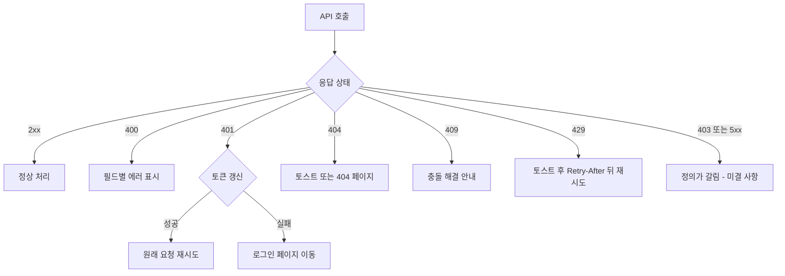

> 구현 상태: 구현됨 · 원문: `spec/5-system/3-error-handling.md` (Overview, §2, §5, Rationale 일부), `spec/5-system/2-api-convention.md` (§5.3, Rationale 일부) · 용어: [용어 사전](../CLE-GLOSSARY.md)

## 개요

이 문서는 HTTP API 가 에러를 어떤 모양으로 돌려주고 클라이언트가 그것을 어떻게 다루는지 정한다. 에러 분류 체계, 에러 응답 봉투(error envelope, `{ error: { code, message, requestId, details } }`), 상태 코드별 기본 에러 코드, 에러 상세(`details`)를 싣는 규칙, 실행 에러 응답 형식, 클라이언트의 상태 코드별 처리와 토스트가 대상이다.

에러는 층마다 표현이 다르다. 이 문서는 HTTP 에러 응답만 다룬다. 같은 이름의 `code` 가 다른 층에도 있으니 어느 층의 것인지 먼저 가린다.

| 층 | 어디에 실리나 | 기준 문서 |
|---|---|---|
| HTTP 에러 응답 | 응답 바디 `error.code` | 이 문서 |
| 노드 런타임 실패 | 노드 출력(`NodeHandlerOutput`)의 `output.error.code` | [노드 출력 규약](../CLE-NODE/CLE-NODE-OUTPUT.md) |
| 실행 종결 | `Execution.error.code`, 실행 이벤트의 `error.code` | [실행 상태 머신과 대기·재개](../CLE-EXEC/CLE-EXEC-STATE.md) |
| WebSocket 명령 ack | ack 의 `errorCode` 또는 `error.code` | [WebSocket 이벤트와 명령](CLE-API-WS-EVENTS.md) |

이 문서가 정하지 않는 것은 아래 문서가 정한다.

- 에러 코드 하나하나의 이름 규칙과 전체 목록: [에러 코드 규약과 카탈로그](CLE-API-ERRCODES.md)
- 노드 에러 처리 정책(Stop Workflow·Skip Node·Use Default Output·Retry·Route to Error Port)과 워크플로우 수준 자동 재시도: [노드 에러 처리 정책](../CLE-NODE/CLE-NODE-ERROR.md)
- 로그 레벨·로그 형식·로그 마스킹·`Error.cause` 부착 기준·헬스 체크: [로깅과 헬스 체크](../CLE-OBS/CLE-OBS-LOGGING.md)
- 전체 화면 오류 페이지와 빈 상태: [오류 화면과 빈 상태](../CLE-UI/CLE-UI-ERRORS.md)
- 응답 데이터 안의 자격 증명 마스킹: [응답 자격 증명 마스킹](CLE-API-EGRESS.md)
- HTTP 상태 코드를 고르는 기준: [HTTP API 규약](CLE-API-CONV.md)

## 규칙

1. 모든 HTTP 에러 응답은 에러 응답 봉투 `{ error: { code, message, requestId, details? } }` 형식이다.
2. `message` 는 사람이 읽을 짧은 설명이다. 라이브러리 예외 메시지·스택·파일 경로 같은 내부 구현 원문을 싣지 않는다(CWE-209).
3. 요청 ID(`requestId`)는 모든 에러 응답에 늘 싣는다.
4. 에러 상세(`details`)는 추가 맥락이 있을 때만 싣는다. 배열과 객체 두 형태가 모두 유효하고 어느 형태를 쓸지는 발행 지점이 정해 그 엔드포인트 문서에 적는다.
5. `details` 항목에 `field` 를 실으면 `code` 도 싣는다. 도메인 사유가 없으면 `INVALID_FIELD` 를 쓴다.
6. 도메인 세부 사유는 top-level `code` 를 바꾸는 자리와 `details[].code` 중 한 곳에만 싣는다. 같은 사유를 두 자리에 싣지 않는다.
7. 새 에러 코드는 어느 자리에 싣든 [에러 코드 규약과 카탈로그](CLE-API-ERRCODES.md) 에 등재한다. 등재하지 않은 코드는 소비자가 알 방법이 없다.
8. 코드를 지정하지 않은 예외에는 상태 코드별 기본 에러 코드가 붙는다. `410` 에는 기본값이 없으므로 `410` 을 돌려주는 경로는 코드를 반드시 명시한다.
9. 외부 표면(EIA `/api/external/*`, 웹훅 `/api/hooks/*`)은 기본 코드 대신 도메인 코드를 의도적으로 쓸 수 있다.

## 1. 에러 분류

에러 코드는 아래 부류로 나눈다. 각 부류의 코드 목록과 정의 문서는 [에러 코드 규약과 카탈로그](CLE-API-ERRCODES.md) 의 카탈로그 절에 있다.

| 부류 | 무엇 | 예 |
|---|---|---|
| 시스템 | 예상하지 못한 서버 에러, 요청 빈도 제한 | `INTERNAL_ERROR`, `RATE_LIMITED` |
| 인증·인가 | 토큰, 로그인, 역할·멤버십 거부(가드 거부 코드) | `AUTH_REQUIRED`, `NOT_A_MEMBER`, `EDITOR_REQUIRED` |
| 2FA·WebAuthn·계정 재인증 | 2단계 인증과 민감 동작 재확인 | `TOTP_INVALID`, `PASSWORD_INVALID` |
| 유효성 검증 | 요청 입력·상태 전이 거부 | `VALIDATION_ERROR`, `RESOURCE_CONFLICT`, `INVALID_STATE` |
| 워크플로우 실행 | 엔진 수준 실패와 노드 수준 런타임 실패 | `EXECUTION_TIME_LIMIT_EXCEEDED`, `HTTP_5XX` |
| WebSocket 명령 | 재개 명령·마지막 턴 재시도의 ack | `INVALID_EXECUTION_STATE`, `RETRY_STATE_NOT_FOUND` |
| 도메인 참조 | EIA REST, 웹훅 수신, 지식 저장소, 워크스페이스 멤버, 트리거, 채팅 채널 봇 토큰, 재실행 등 도메인 전용 코드 | `STATE_MISMATCH`, `INVALID_WEBHOOK_PAYLOAD` |

- **도메인 참조 방식**: 정의·트리거 조건이 도메인 문서에 있는 코드는 그 문서를 기준으로 삼는다. 카탈로그는 제품 전체에서 볼 수 있도록 등재만 한다.
- 외부 표면(EIA REST, 웹훅 수신) 코드는 §2.2 의 기본 코드를 의도적으로 바꾼 항목이다.
- 같은 뜻을 표면마다 다른 코드로 적는 경우가 있다. 예를 들어 상태 불일치는 REST 가 `INVALID_STATE`(422), WebSocket 이 `INVALID_EXECUTION_STATE`, EIA REST 가 `STATE_MISMATCH`(409)다. 라우팅 분기를 드러내려고 일부러 나눴다([에러 코드 규약과 카탈로그](CLE-API-ERRCODES.md)).

## 2. 에러 응답 봉투

### 2.1 형식

```json
{
  "error": {
    "code": "VALIDATION_ERROR",
    "message": "Input validation failed",
    "requestId": "f3b6d2e0-9d4a-4b77-9d19-7a0f8f4c1e2b",
    "details": [
      {
        "field": "name",
        "message": "name should not be empty",
        "code": "INVALID_FIELD"
      },
      {
        "field": "nodes[3].type",
        "message": "type must be a string",
        "code": "INVALID_FIELD"
      }
    ]
  }
}
```

| 필드 | 필수 | 설명 |
|------|------|------|
| `code` | ✓ | 클라이언트가 분기에 쓰는 에러 코드. 이름 규칙은 [에러 코드 규약과 카탈로그](CLE-API-ERRCODES.md) |
| `message` | ✓ | 사람이 읽을 짧은 설명. 내부 구현 원문을 싣지 않는다(아래) |
| `requestId` | ✓ | 서버 로그와 잇는 추적용 UUID. `GlobalExceptionFilter` 가 응답마다 발급한다 |
| `details` | 선택 | 검증 에러처럼 추가 맥락이 있을 때만 싣는다. 형태 규칙은 §2.4 |

**`message` 에 내부 원문을 싣지 않는다(CWE-209 정보 노출 방지).**

- body-parser 같은 http-errors 미들웨어가 던지는 4xx 는 상태별 고정 문구로 바꿔 보낸다. `413` 은 `"Request payload too large."`, 그 밖의 4xx 는 `"The request could not be processed."` 다.
- 5xx 는 일반 500 으로 가린다.
- 원문은 서버 로그(`logger.warn`)에만 남긴다.

**검증 에러 항목**: ValidationPipe 가 만드는 항목은 `{ field, message, code: "INVALID_FIELD" }` 구조다. `field` 는 중첩·배열 경로를 `nodes[3].type` 형식으로 유지한다.

현재 구현(`CustomValidationPipe`)은 `message` 에 고정 문자열 `"Input validation failed"`, `details[].message` 에 class-validator 제약 원문(영문), `details[].code` 에 `"INVALID_FIELD"` 하나만 싣는다. 사용자용 한국어 메시지와 세분화한 항목 코드(`REQUIRED`, `INVALID_FORMAT`)는 계획이며 미구현이다.

OpenAPI 에서는 `ErrorResponseDto` 가 `GlobalExceptionFilter` 출력을 1:1 로 표현한다. 참조 방법은 [OpenAPI 문서화](CLE-API-SWAGGER.md) 의 에러 응답 참조 절에 있다.

### 2.2 상태 코드별 기본 에러 코드

코드를 지정하지 않은 예외는 `GlobalExceptionFilter` 가 상태 코드를 보고 아래 기본 코드를 붙인다.

| 상태 | 기본 `code` |
|---|---|
| 400 | `VALIDATION_ERROR` |
| 401 | `AUTH_REQUIRED` |
| 403 | `FORBIDDEN` |
| 404 | `RESOURCE_NOT_FOUND` |
| 409 | `RESOURCE_CONFLICT` |
| 413 | `PAYLOAD_TOO_LARGE` |
| 422 | `INVALID_STATE` |
| 429 | `RATE_LIMITED` |
| 5xx | `INTERNAL_ERROR` |
| 410 | **없음** |

- `RolesGuard` 의 멤버십·역할 거부는 기본값이 아니라 전용 가드 거부 코드(`NOT_A_MEMBER`, `EDITOR_REQUIRED`, `ADMIN_REQUIRED`, `OWNER_REQUIRED`)를 쓴다. 2026-09-25 이전에는 코드를 지정하지 않아 기본값 `FORBIDDEN` 이 나갔다. 결정 근거는 [계정과 워크스페이스 데이터 흐름](../CLE-ACCT/CLE-ACCT-DATA.md) 의 "가드 거부의 오류 코드" Rationale 이다.
- **`410` 에는 기본값이 없다.** 위 표는 필터의 상태→코드 매핑을 옮긴 것이고 그 매핑에 `410` 항목이 없다. 코드를 명시하지 않은 `410` 응답은 4xx 인데도 `INTERNAL_ERROR` 로 떨어진다. 그래서 `410` 을 돌려주는 경로는 `code` 를 반드시 명시한다. 현재 `410` 발행 지점(`TRIGGER_INACTIVE`, `EXECUTION_TERMINATED`, `invitation_expired`, `invitation_already_used`)은 모두 코드를 명시한다. 기본값을 새로 만들지 않은 이유는 Rationale 에 있다.
- **외부 표면의 의도적 교체**: EIA REST(`/api/external/*`)와 웹훅 수신(`/api/hooks/*`)은 외부 호출자에게 보이는 표면이라 기본 코드 대신 도메인 코드를 쓴다(예: 400 에 `INVALID_COMMAND`·`INVALID_WEBHOOK_PAYLOAD`, 429 에 `TOO_MANY_CONNECTIONS`). `410` 은 교체가 아니라 명시 의무다. 교체할 기본값이 애초에 없다.

### 2.3 도메인 세부 사유를 어디에 싣는가: top-level `code` 교체와 `details[].code`

두 관례가 모두 있다. 판정 기준은 소비자가 그 값으로 무엇을 하는가다.

| 싣는 자리 | 쓸 때 | 선례 |
|---|---|---|
| **top-level `code` 교체** | 그 사유가 엔드포인트 결과 자체라 소비자가 `code` 하나로 분기하면 되는 경우. 한 요청에 사유가 하나뿐이다 | `DUPLICATE_NODE_LABEL`, `WORKFLOW_VERSION_CONFLICT`, `ALREADY_A_MEMBER`, `KB_REEXTRACT_IN_PROGRESS` |
| **`details[].code`** (top-level 은 §2.2 기본값 유지) | 사유가 어느 필드·항목에 붙는지가 정보의 일부이거나 한 응답에 사유가 여럿 실릴 수 있는 경우 | 검증 에러 `INVALID_FIELD`, 트리거 파라미터 검증 사유(`MISSING_REQUIRED_FIELD` 등), `TRIGGER_ENDPOINT_PATH_CONFLICT` |

- **둘을 겹쳐 쓰지 않는다.** top-level 을 특화 코드로 바꾸면서 같은 사유를 `details[].code` 에도 넣으면 소비자가 어느 쪽으로 분기할지 갈린다.
- 어느 쪽을 택하든 [에러 코드 규약과 카탈로그](CLE-API-ERRCODES.md) 에 등재한다.
- 이름은 `UPPER_SNAKE_CASE` 를 따른다([에러 코드 규약과 카탈로그](CLE-API-ERRCODES.md)).

### 2.4 `details` 의 형태

`details` 는 두 형태이고 둘 다 유효하다.

| 형태 | 쓰임 | 예 |
|---|---|---|
| **배열** `details: [{ field, message, code }]` | 여러 항목이 각각 실패할 수 있을 때 (ValidationPipe 다중 필드) | §2.1 예시 |
| **객체** `details: { field, code, … }` | 도메인 예외 하나가 사유 하나를 붙일 때 | `TRIGGER_ENDPOINT_PATH_CONFLICT` (`{ field: 'endpoint_path', code: … }`) |

`GlobalExceptionFilter` 는 `details` 를 값이 있을 때만 싣고 형태를 바꾸지 않고 그대로 넘긴다. OpenAPI 선언도 `type: 'object', additionalProperties: true` 로 열려 있다. 그래서 형태 선택은 발행 지점의 책임이고 그 엔드포인트를 문서화하는 절에 어느 형태인지 적는다.

### 2.5 `field` 를 실으면 `code` 도 싣는다 (2026-09-11)

`details` 항목에 `field` 가 있으면 그 항목은 어느 필드가 왜 거부됐는지를 알린다. §2.3 표가 이 경우를 `details[].code` 쪽에 이미 배정한다. 그런데 §2.4 표의 형태 예시가 예시로 읽혀 `code` 없이 `field` 만 싣는 관례가 두 형태 모두에 생겼다. `field` 만 실으면 사유가 기계가 읽을 수 있는 자리에 아예 없다. `message` 는 사람이 읽을 설명이라 소비자가 분기에 쓸 수 없다.

- 기본값은 `INVALID_FIELD` 다. `CustomValidationPipe` 가 이미 쓰는 일반 코드이고 카탈로그에 등재돼 있어 새로 등재할 필요가 없다.
- 도메인 특화 사유가 있으면 그 코드를 쓴다(선례: `TRIGGER_ENDPOINT_PATH_CONFLICT`). 이때는 카탈로그 등재가 함께 필요하다.
- `field` 가 없는 진단 payload 는 대상이 아니다. `details: { errors }`, `{ offenders }`, `{ reason }` 처럼 요청 전체나 집계를 서술하는 자리는 사유가 이미 top-level 특화 `code`(`GRAPH_VALIDATION_FAILED` 등)에 있다. 거기에 `details.code` 를 얹으면 §2.3 의 "겹쳐 쓰지 않는다" 를 어긴다.

### 2.6 top-level 이 이미 특화 코드일 때 (2026-09-11)

"겹쳐 쓰지 않는다" 가 막는 해악은 소비자가 어느 값으로 분기할지 갈리는 것이다. 그 일은 같은 사유가 두 자리에 실릴 때 생긴다. 그래서 판별 기준은 사유의 중복이고 `details[].code` 가 일반 표지이면 해당하지 않는다.

| `details[].code` | top-level 이 특화 코드일 때 | 이유 |
|---|---|---|
| top-level 과 같은 사유를 반복 (예: 둘 다 `KB_REEXTRACT_IN_PROGRESS`) | **금지** | 분기 대상이 둘이 되어 갈린다 |
| 일반 표지 (`INVALID_FIELD`) | **허용** | 사유를 싣지 않고 "필드 수준 문제다" 만 알린다 |

실례: `AUTH_CONFIG_NOT_FOUND` 와 `details: { field: 'authConfigId', code: 'INVALID_FIELD' }`(`TriggersService.assertAuthConfigInWorkspace`). 소비자는 top-level 로 분기하고 `details` 는 어느 필드인지와 필드 수준 문제라는 점을 덧붙인다. 경쟁하는 사유가 없다.

그래서 §2.5 규칙을 좁히지 않는다. 좁혀서 이 자리를 예외로 빼면 `authConfigId` 만 `details.field` 에 일반 표지가 없는 특례가 된다. 그러면 소비자가 필드 수준 문제를 균일하게 판정할 수 없다. 그 균일성이 규칙의 목적이다.

### 2.7 이름이 같은 다른 `details`

이 문서의 `details` 는 에러 응답 봉투의 것만 가리킨다. 같은 키 이름이 두 층에 더 있고 둘 다 이 규칙의 대상이 아니다.

| 층 | 무엇인가 | 기준 문서 |
|---|---|---|
| 감사 로그 `AuditLog.details` | 액션별 자유 형식 페이로드. 정상 완료 경로에 기록한다 | [감사 로그](../CLE-OBS/CLE-OBS-AUDIT.md) |
| 노드 출력 `output.error.details` | 노드 실행 실패의 진단 payload. HTTP 봉투가 아니며 사유는 형제 `error.code` 에 있다 | 각 노드 문서, [노드 출력 규약](../CLE-NODE/CLE-NODE-OUTPUT.md) |

### 2.8 이 규칙을 강제하는 가드는 없다

§2.4 대로 `GlobalExceptionFilter` 는 `details` 를 그대로 넘기고 OpenAPI 선언도 열려 있다. [HTTP API 규약](CLE-API-CONV.md) 의 부재 표현 검증 층에 있는 정적·런타임 검증자 어느 것도 이 축을 보지 않는다. 그래서 §2.5·§2.6 은 새 발행 지점부터 적용하고 `field` 만 싣는 기존 자리는 후속 작업으로 추적한다. 강제 없는 규칙이 조용히 지켜지지 않는 상태로 굳는 실패는 [OpenAPI 문서화](CLE-API-SWAGGER.md) 의 DTO 길이 Rationale 이 이미 기록했다("37% 미준수는 규칙이 안 지켜진다가 아니라 그건 규칙이 아니었다는 뜻").

## 3. 실행 에러 응답 형식

노드 실행 실패를 REST 로 감싸 돌려줄 때는 §2.1 봉투에 실행 식별 필드를 더한다.

```json
{
  "error": {
    "code": "LLM_CALL_FAILED",
    "message": "Node 'AI Agent' failed: LLM connection timeout",
    "nodeId": "uuid-of-node",
    "nodeLabel": "AI Agent",
    "nodeType": "ai_agent",
    "executionId": "uuid-of-execution",
    "stack": "...",
    "requestId": "f3b6d2e0-9d4a-4b77-9d19-7a0f8f4c1e2b"
  }
}
```

- 노드 이름 필드는 `nodeLabel` 이다. 엔진이 내보내는 값은 모두 `nodeLabel: node.label ?? node.type` 이다.
- AI 에이전트 노드는 LLM 타임아웃을 `LLM_CALL_FAILED` 로 분류한다([AI 에이전트 노드](../CLE-NODE-AI/CLE-NODE-AGENT.md)). 그래서 예시 코드도 그 값을 쓴다.
- 노드 핸들러가 돌려주는 표준 `output.error` 형태(`code`, `message`, `details`)는 이 봉투와 다른 층이다. 기준은 [노드 출력 규약](../CLE-NODE/CLE-NODE-OUTPUT.md) 이다.

## 4. 클라이언트 에러 처리

### 4.1 API 에러 처리 흐름

클라이언트는 API 응답의 상태 코드로 처리를 고른다.

| 응답 | 처리 |
|---|---|
| 200·201·204 | 정상 처리 |
| 400 | 유효성 에러를 필드별 메시지로 표시한다 |
| 401 | 토큰 갱신을 시도한다. 성공하면 원래 요청을 다시 보내고 실패하면 로그인 페이지로 이동한다 |
| 403 | 정의가 갈린다. [미결 사항](#미결-사항) 참조 |
| 404 | "리소스를 찾을 수 없습니다" 토스트 또는 404 페이지 |
| 409 | 충돌 해결 안내 (예: 이름 변경) |
| 429 | "요청이 너무 많습니다" 토스트를 띄우고 `Retry-After` 뒤에 자동으로 다시 보낸다 |
| 500 | 정의가 갈린다. [미결 사항](#미결-사항) 참조 |



### 4.2 토스트

| 유형 | 색 | 자동 닫힘 |
|------|--------|-----------|
| 성공 | 초록 | 3초 |
| 정보 | 파랑 | 5초 |
| 경고 | 노랑 | 수동 닫기 |
| 에러 | 빨강 | 수동 닫기 |

## 미결 사항

- **403·5xx 를 토스트로 보일지 전체 화면 오류 페이지로 보일지**: 원문 에러 처리 문서의 클라이언트 흐름은 403 에 "권한이 없습니다" 토스트를, 500 에 "서버 오류가 발생했습니다" 토스트와 에러 리포트 옵션을 규정한다. [오류 화면과 빈 상태](../CLE-UI/CLE-UI-ERRORS.md) 는 API 응답 403 을 받으면 권한 없음 오류 페이지를, 5xx 를 받으면 서버 오류 페이지를 보인다고 규정한다. 그 문서의 Rationale 은 페이지에서 전파된(잡히지 않은) 에러만 Next.js 에러 바운더리가 전체 화면으로 바꾸고 컴포넌트가 국소 처리한 에러는 화면을 덮지 않는다고 풀지만 이 문서의 흐름은 그 구분을 모른다. 현재 구현은 에러 바운더리(`errorToVariant()`)가 전파된 에러의 상태를 페이지 종류로 매핑한다. "전파된 에러는 페이지, 국소 처리한 에러는 토스트나 인라인" 을 규칙으로 올릴지, 어느 경우를 전파로 볼지 결정이 필요하다.

## 구현 위치

- `codebase/backend/src/common/filters/http-exception.filter.ts` (`GlobalExceptionFilter`: 봉투 조립, 상태별 기본 코드, 4xx 고정 문구, 5xx 가림)
- `codebase/backend/src/common/pipes/validation.pipe.ts` (`CustomValidationPipe`)
- `codebase/backend/src/common/swagger/error-response.dto.ts` (`ErrorResponseDto`)

## Rationale

### `410` 기본 코드를 만들지 않은 이유 (2026-09-02)

HTTP 상태 코드 표에 `410 Gone` 을 등재하면서 §2.2 기본값 목록에도 `410=<무언가>` 를 넣는 것이 자연스러워 보인다. 넣지 않는다.

그 목록은 바라는 규범이 아니라 `GlobalExceptionFilter` 의 상태→코드 매핑을 옮긴 서술이다. 그 매핑에는 `410` 항목이 없다(실측). 기본값을 적으면 문서가 구현에 없는 동작을 약속한다. 다음 사람이 그 약속을 믿고 `code` 를 빼는 순간 `410` 응답에 `INTERNAL_ERROR` 가 실린다. 문서가 만든 결함이다.

**기각한 대안**: 필터에 `case 410` 을 더하고 그 값을 문서화하는 것. 현재 발행 지점이 모두 도메인 코드를 명시하므로(`TRIGGER_INACTIVE`, `EXECUTION_TERMINATED`, `invitation_*`) 새 기본값은 도달하지 않는 코드를 하나 늘릴 뿐이다. 대신 "명시 의무" 를 규약으로 적어 누락이 리뷰에서 보이게 했다.

### 4xx http-error `message` 를 고정 문구로 바꾸는 이유 (CWE-209)

body-parser 같은 http-errors 미들웨어가 던지는 4xx(예: 413 `request entity too large`)는 `GlobalExceptionFilter` 가 원문을 싣지 않고 상태별 고정 문구로 바꾼다. 라이브러리 원문에는 경로·버퍼 한계·미들웨어 힌트 같은 구현 세부가 섞일 수 있어 그대로 내보내면 정보가 샌다. 운영 가시성은 원문을 `logger.warn` 에만 남겨 확보한다. WebSocket `EXECUTION_INTERNAL_ERROR` 의 고정 문구 결정(내부 예외 메시지 비노출)과 같은 원칙이고 5xx 가림과도 일관된다.

### 실행 에러 예시의 필드 이름을 `nodeLabel` 로 고친 이유 (2026-08-17)

옛 예시는 `nodeName` 이었다. 엔진이 내보내는 값은 모두 `nodeLabel: node.label ?? node.type` 이고 `nodeName` 을 쓰는 발행은 코드베이스에 0건임을 실측했다. WebSocket 실행 이벤트 표의 같은 어긋남을 고치면서 이 예시도 함께 맞췄다([WebSocket 이벤트와 명령](CLE-API-WS-EVENTS.md)).
