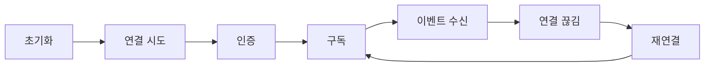

> 구현 상태: 구현됨 (raw WebSocket 전제 항목 일부는 비채택) · 원문: `spec/5-system/6-websocket-protocol.md` (Overview, §1~§3, §5~§9, Rationale 일부) · 용어: [용어 사전](../CLE-GLOSSARY.md)

## 개요

이 문서는 서버와 프론트엔드 사이의 양방향 실시간 채널인 WebSocket(`/ws`)의 연결 방식을 정한다. 전송 계층, 인증과 토큰 만료, 메시지 형식과 서버 이벤트 봉투, 구독 채널(subscription channel) 구독과 인가, heartbeat, 재연결과 놓친 이벤트 복구, 전송 계층 에러, 클라이언트 구현 지침이 대상이다.

채널의 무게중심은 실행이다. 서버가 실행 진행 상황을 밀어 보내고 클라이언트가 실행 제어 명령을 보내고 노드가 사용자 입력을 기다릴 때 그 왕복을 중개한다. 실행 밖에 지식 저장소 문서 처리 상태와 인앱 알림도 같은 채널 위에 있다. 이벤트는 구독한 리소스에 대해서만 전달되고 구독 채널은 `execution:`·`workflow:`·`kb:`·`notifications:`·`background:run:` 다섯 종이다. 끊긴 동안 놓친 것은 다시 구독할 때 받는 1회성 실행 스냅샷 이벤트(`execution.snapshot`)로 맞춘다. 이벤트 순번(`seq`) 기반 재전송 버퍼는 native WebSocket 에 없고 SSE 어댑터에 있다.

읽기 전에 두 가지를 알아야 한다.

- **전송 계층은 Socket.IO 다.** 문서의 `{ type, id, payload }` 프레임 표기는 논리적 메시지 형태를 보이는 추상화다. raw WebSocket 프레이밍을 전제한 항목 중 서브프로토콜 인증(§2.2)과 close 코드(§8)는 비채택이다. 다만 "raw WebSocket 전제니까 모두 비채택" 으로 뭉치지 않는다. 시스템 이벤트 가운데 `system.maintenance` 발행은 비채택이지만 서버가 보내는 `auth.token_expired` 는 구현됐다. 어느 항목이 어느 갈래인지는 §1 이 정한다.
- **같은 실행을 두 표면이 보고한다.** 내부 WebSocket 과 외부 EIA 의 REST·SSE·EIA 알림 웹훅이다. 명령·이벤트 매핑의 권위와 두 표면의 비대칭 규칙은 [WebSocket 이벤트와 명령](CLE-API-WS-EVENTS.md) 이 정한다.

이 문서가 정하지 않는 것은 아래 문서가 정한다.

- 서버 이벤트와 클라이언트 명령 목록, ack 형태, EIA 매핑: [WebSocket 이벤트와 명령](CLE-API-WS-EVENTS.md)
- 실행 상태 전이(실행·노드 실행 상태 머신, 블로킹·재개 계약): [실행 상태 머신과 대기·재개](../CLE-EXEC/CLE-EXEC-STATE.md)
- 외부 호출자용 표면(REST·SSE·EIA 알림 웹훅): [External Interaction API](../CLE-IX/CLE-EIA.md), [EIA 수신 API와 SSE](../CLE-IX/CLE-EIA-INBOUND.md)
- 에러 코드 이름 규칙과 카탈로그: [에러 코드 규약과 카탈로그](CLE-API-ERRCODES.md). 이 문서의 §7 은 그중 전송 계층의 `WsErrorCode` 가 wire 에서 어떤 프레임으로 보이는지만 다룬다
- 이벤트 페이로드의 자격 증명 마스킹: [응답 자격 증명 마스킹](CLE-API-EGRESS.md)
- HTTP API 규약 쪽 요약: [HTTP API 규약](CLE-API-CONV.md) 의 WebSocket 절

## 1. 전송 계층

채널은 **Socket.IO** 로 구현한다(`@WebSocketGateway({ namespace: '/ws' })`, 클라이언트 `socket.io-client`).

- 메시지는 Socket.IO 의 이벤트·ack 모델을 따른다. 클라이언트는 `socket.emit('<event>', data)` 로 보내고 명령 ack 는 `{ event, data }` 형태의 callback payload 로 받는다(§4.3, [WebSocket 이벤트와 명령](CLE-API-WS-EVENTS.md)).
- `{ type, id, payload }` JSON 프레임 표기는 논리 구조의 추상화다. 실제 wire 는 Socket.IO 가 감싼다. raw WebSocket 프레임, `Sec-WebSocket-Protocol` 서브프로토콜, raw close code 를 직접 다루지 않는다.

raw WebSocket 을 전제했던 초안 항목은 세 갈래로 처분했다.

| 갈래 | 항목 | 상태 | 근거 |
|---|---|---|---|
| raw WebSocket 전제 (전송 계층에 구조적으로 맞지 않음) | 서브프로토콜 인증(§2.2), raw close 코드(§8) | **비채택** | Rationale "raw WebSocket 전제·REST 대체 항목 비채택" |
| REST 로 충분 (중복 경로 회피) | in-band 토큰 갱신(§2.3), WebSocket 실행 시작·중단 명령 | **비채택** | 같은 Rationale |
| 발화 주체 없음 또는 전송 계층이 이미 채움 | 서버 발신 app ping(§5.2), `system.maintenance` 발행 | **비채택** | Rationale "`system.maintenance` 발행과 서버 발신 app ping 비채택" |
| 실재하는 인가 틈 | 서버 발신 `auth.token_expired` 발행 | **구현됨** (2026-09-02) | Rationale "소켓 수명을 토큰 수명에 묶는다" |

이 갈래에 남은 미구현은 없다.

## 2. 연결

### 2.1 엔드포인트

```
wss://{base_url}/ws        (Socket.IO namespace '/ws')
```

- 프로토콜은 `wss://`(TLS 필수)다. 개발 환경에서만 `ws://` 를 허용한다.
- 서버는 Socket.IO 게이트웨이로 핸드셰이크를 처리한다(transport: `websocket` 에서 `polling` 으로 폴백). 클라이언트 기본 transport 는 `['websocket', 'polling']` 이다.

### 2.2 인증

연결할 때 JWT access token 을 넘긴다. 구현은 아래 두 핸드셰이크 위치를 받고 (1), (2) 순서로 본다(`handleConnection` 의 `handshake.query.token || handshake.auth.token`).

| 방식 | 형태 | 예시 |
|------|------|------|
| (1) 쿼리 파라미터 | `?token={access_token}` | Socket.IO `io(url, { query: { token } })` 또는 URL 쿼리 |
| (2) Socket.IO auth payload | `handshake.auth.token` | 클라이언트 `io(url, { auth: { token } })` (프론트엔드 기본 경로) |

raw WebSocket 의 `Sec-WebSocket-Protocol: bearer, {token}` 서브프로토콜 인증은 **비채택**이다. Socket.IO 전송은 서브프로토콜 협상을 애플리케이션에 드러내지 않아 이 경로가 구조적으로 적용되지 않고 위 두 위치가 인증을 마친다. 전송을 raw WebSocket 으로 바꾸지 않는 한 도입하지 않는다.

**인증 실패 시**

- **핸드셰이크 단계**: 토큰이 없거나 무효면 서버가 `error` 이벤트(`{ message }`)를 보낸 뒤 `disconnect()` 로 연결을 끊는다. raw HTTP `401` 이 아니라 Socket.IO 연결 에러 경로다.
- **연결 중 토큰 만료**: 소켓 수명은 토큰 수명에 묶인다. 서버는 핸드셰이크에서 검증한 토큰의 `exp` 로 소켓별 타이머를 걸어 만료 **60초 전**에 `auth.token_expired` 를 1회 보내고 `exp` 에 `disconnect()` 한다(`handleDisconnect` 에서 타이머를 푼다). 구현됨(2026-09-02).
  - **클라이언트 계약(필수)**: 서버 동작만으로는 성립하지 않는다. 클라이언트는 `auth.token_expired` 를 구독해 통지 창(60초) 안에 REST `/auth/refresh` 로 새 토큰을 받고 `socket.auth.token` 을 바꾼 뒤 **명시적으로 `socket.connect()`** 한다. 통지를 놓친 경우의 폴백은 §9.2 를 따른다.
  - **자동 재연결에 기대지 않는다.** Socket.IO 는 서버가 `disconnect()` 를 부른 경우 자동 재연결을 시작하지 않는다(§6.1 예외).
  - **닫는 범위**: 이 모델은 토큰 자연 만료 경로만 닫는다. 명시적 폐기(비밀번호 변경, `token_reuse_detected` 로 refresh family 폐기, [세션과 토큰](../CLE-ACCT/CLE-ACCT-SESSION.md))는 이미 발급된 access token 을 무효로 만들지 않으므로 그 소켓은 자연 `exp` 까지(최대 15분) 산다. "즉시 종료" 가 필요하면 소켓에 폐기를 전파하는 별도 장치가 필요하며 이 결정은 그것을 약속하지 않는다.

`auth.token_expired` 이벤트의 페이로드는 [WebSocket 이벤트와 명령](CLE-API-WS-EVENTS.md) 의 시스템 이벤트 절에 있다.

### 2.3 토큰 갱신 (연결 유지)

별도의 in-band WebSocket 갱신 메시지(`auth.refresh`·`auth.refreshed`)는 **비채택**이다. 클라이언트는 토큰이 만료되거나 `connect_error` 가 나면 REST `/auth/refresh` 로 새 access token 을 받아 Socket.IO `auth.token` 을 바꾸고 **다시 연결**해 세션을 유지한다(`ws-client.ts` 의 `connect_error` 핸들러). 이 REST 와 재연결 모델이 정식 채택안이다. 끊김 없는 in-band 갱신의 이득(짧은 재연결 창 제거)이 별도 WebSocket 인증 프로토콜 유지 비용에 못 미친다.

비채택한 in-band 갱신 프로토콜은 참고로만 남긴다. backend 에 이 메시지 핸들러와 발행이 없다.

```json
// 클라이언트 → 서버
{ "type": "auth.refresh", "payload": { "token": "{new_access_token}" } }
// 서버 → 클라이언트
{ "type": "auth.refreshed", "payload": { "expiresAt": "2026-03-29T14:30:00Z" } }
```

연결 중 만료의 구체 동작은 §2.2 를 따른다. 서버가 `exp` 60초 전에 `auth.token_expired` 를 알리고 `exp` 에 끊으면 클라이언트는 그 창 안에 REST 재발급과 **명시적 재연결**을 마친다(§9.2).

## 3. 메시지 형식

메시지의 `type` 은 별도 JSON 필드가 아니라 **Socket.IO 이벤트 이름**으로 전달한다. 서버는 `socket.emit(eventType, envelope)`, 클라이언트는 `socket.on(eventType, handler)` 를 쓴다. 그래서 아래 `{ type, id, payload }` 표기는 논리 구조이고 실제 wire 는 "이벤트 이름 = `type`" 과 "payload = 봉투" 다. 명령의 요청과 응답도 `id` 필드가 아니라 Socket.IO ack callback 으로 짝짓는다.

### 3.1 기본 프레임 (논리 구조)

```json
{
  "type": "string",
  "id": "string (optional)",
  "payload": {}
}
```

| 필드 | 타입 | 필수 | 설명 |
|------|------|------|------|
| `type` | String | ✓ | 이벤트·명령 종류(네임스페이스.액션 형태). wire 에서는 Socket.IO 이벤트 이름이다 |
| `id` | String | 선택 | 메시지 고유 ID. 계획이며 일부 미구현이다. 구현된 명령 ack 는 `id` echo 대신 Socket.IO ack callback 으로 짝짓는다 |
| `payload` | Object | ✓ | 이벤트·명령별 데이터 |

### 3.2 서버 → 클라이언트 이벤트 봉투

서버가 보내는 실행·노드 이벤트의 wire 이벤트 봉투는 `type`·`payload` 를 중첩하지 않는다. `executionId`(노드 이벤트는 `nodeId` 도), payload 필드, `seq`, `timestamp` 를 **평면으로 합친** 객체다(`emitExecutionEvent`, `emitNodeEvent`). 이벤트 이름은 Socket.IO 이벤트 이름으로 따로 간다.

```js
// Socket.IO event name: "execution.node.completed"
{
  "executionId": "550e8400-...",
  "nodeId": "...",
  /* ...payload 필드 평면 병합... */
  "seq": 42,
  "timestamp": "2026-03-29T14:00:01.234Z"
}
```

| 추가 필드 | 설명 |
|-----------|------|
| `executionId` | 채널의 실행 ID. 봉투 최상위에 자동으로 붙는다 |
| `timestamp` | 서버 이벤트 발생 시각 (ISO 8601) |
| `seq` | 채널 안 이벤트 순번. 재연결 때 놓친 이벤트를 감지하는 데 쓴다. 자세한 규칙은 아래 |

**이벤트 순번 `seq`**

- `execution:{executionId}` 채널에서는 실행 안에서 1씩 늘어나는 카운터다(`ExecutionSeqAllocator`, Redis `INCR exec:seq:<executionId>`). 키 정의와 TTL 은 [비동기 큐와 Redis 키 목록](../CLE-PLAT/CLE-PLAT-QUEUE.md) 에 있다. 슬라이딩 TTL 은 환경 변수 `EXECUTION_SEQ_TTL_SECONDS`(기본 86400)다.
- 외부 SSE 의 `id:` 와 EIA 알림 웹훅의 `seq` 가 같은 값을 쓴다([External Interaction API](../CLE-IX/CLE-EIA.md) 의 R7).
- **저장 정책은 Redis 전용이다(2026-06-02 결정, DB 폴백 없음).** Redis 를 쓸 수 없으면 인스턴스별 메모리 카운터로 내려가 발행을 멈추지 않는다. 그 구간에는 인스턴스 사이 단조 증가를 보장하지 않는다(받아들인 trade-off, `logger.warn` 기록). 정상 경로에서도 자기 인스턴스가 발급한 값을 미러링해 장애 전환 때 최고값을 이어받는다.

## 4. 채널 구독

### 4.1 채널 개념

클라이언트는 관심 있는 리소스의 **구독 채널을 구독**해야 이벤트를 받는다. 구독하지 않은 리소스의 이벤트는 보내지 않는다.

### 4.2 채널 패턴

| 채널 | 패턴 | 설명 |
|------|------|------|
| 워크플로우 실행 | `execution:{executionId}` | 특정 실행의 모든 이벤트 |
| 워크플로우 편집 | `workflow:{workflowId}` | 에디터에서 실행 시작·완료 알림 |
| 지식 저장소 문서 상태 | `kb:{documentId}` | 지식 저장소 문서별 임베딩·그래프 추출 상태. 지식 저장소 ID 가 아니라 **문서 ID** 가 키다 |
| 인앱 알림 | `notifications:{userId}` | 사용자 인앱 알림 실시간 수신 |
| Background 본문 실행 | `background:run:{id}` | Background 노드 본문 실행의 진행·완료 이벤트. 이벤트 정의는 [Background 노드](../CLE-NODE-LOGIC/CLE-NODE-BACKGROUND.md) |

각 채널의 이벤트 목록은 [WebSocket 이벤트와 명령](CLE-API-WS-EVENTS.md) 에 있다.

### 4.3 구독과 구독 해제

구독과 해제는 Socket.IO 이벤트 `subscribe`·`unsubscribe` 로 보내고 서버는 ack callback 으로 `{ event, data }` 를 돌려준다.

```js
// 구독 요청 (클라이언트)
socket.emit("subscribe", { channel: "execution:550e8400-e29b-41d4-a716-446655440000" });

// 구독 확인 (ack callback payload)
{ "event": "subscribed", "data": { "success": true, "channel": "execution:550e8400-e29b-41d4-a716-446655440000" } }

// 구독 해제
socket.emit("unsubscribe", { channel: "execution:550e8400-e29b-41d4-a716-446655440000" });
// ack: { "event": "unsubscribed", "data": { "success": true, "channel": "..." } }
```

이 ack 는 `{ type, id, payload }` 가 아니라 Socket.IO ack callback 의 `{ event, data }` 형태다(`handleSubscribe` 반환).

### 4.4 구독 인가

서버는 구독할 때 해당 리소스에 대한 접근 권한을 확인한다(IDOR 차단). 채널별 인가 전략(`channelAuthorizers`)은 배열에 항목을 더해 넓히는 구조다.

| 채널 | 검증 |
|------|------|
| `execution:{executionId}` | 워크스페이스 소유 검증 (UUID 가 아니면 먼저 차단) |
| `workflow:{workflowId}` | 워크스페이스 소유 검증 (`WorkflowsService.findById(workflowId, workspaceId)`, UUID 가 아니면 먼저 차단) |
| `kb:{documentId}` | 워크스페이스 문서 소유 검증 |
| `background:run:{id}` | 워크스페이스 소유 검증 (UUID 가 아니면 먼저 차단) |
| `notifications:{userId}` | **사용자 단위**. JWT `sub` 와 채널의 `userId` 가 같은지 검증한다(fail-closed). `notification.new` 발행은 `emitNotificationEvent` 로 구현됐다 |

- `execution:` 구독 인가는 워크스페이스 소유만 보고 역할을 구분하지 않는다. 그래서 이 채널의 수신 인구는 `GET /api/executions/:id` 와 같고 이벤트 페이로드 마스킹 범위가 이 사실에서 나온다([응답 자격 증명 마스킹](CLE-API-EGRESS.md)).
- 권한이 없으면 별도 `error` 메시지가 아니라 같은 `subscribed` ack 에 `success: false`, 평문 `error` 문자열, 구조화 `code` 를 실어 돌려준다. `code` 는 평문 `error` 에 **더해** 붙는 확장이라 옛 클라이언트는 계속 `error` 로 동작한다.

```json
{ "event": "subscribed", "data": { "success": false, "error": "Not authorized for this execution", "code": "FORBIDDEN" } }
```

**거부 코드 매핑** (`handleSubscribe`, §7.1)

| 상황 | `code` |
|---|---|
| 채널이 유효하지 않거나 필수 필드 누락 | `INVALID_MESSAGE` |
| 인증되지 않음 | `UNAUTHENTICATED` |
| 인가 실패 | `FORBIDDEN`. IDOR 차단 핸들러의 `NOT_FOUND` 관례와 다르다. [미결 사항](#미결-사항) 참조 |
| 구독 한도(20) 초과 | `SUBSCRIPTION_LIMIT_EXCEEDED` (§4.5) |
| join 실패 | `INTERNAL_ERROR` |

독립된 범용 에러 프레임 `{ type:'error', ... }` 는 여전히 보내지 않는다(§7.2).

### 4.5 최대 구독 수

- 연결당 최대 동시 구독은 **20개**다(`MAX_SUBSCRIPTIONS_PER_CONNECTION`).
- 넘으면 구독 ack 에 `{ success: false, error: "Maximum subscriptions (20) reached", code: "SUBSCRIPTION_LIMIT_EXCEEDED" }` 를 돌려준다. 평문 `error` 에 더해 구조화 `code` 를 싣는다.

## 5. Heartbeat

### 5.1 전송 계층 heartbeat (Socket.IO 내장)

전송 계층 heartbeat 는 **Socket.IO/Engine.IO 내장 ping/pong** 이 맡는다. 서버가 Engine.IO ping 을 보내고 클라이언트가 pong 으로 답한다. 기본값은 `pingInterval` 25s, `pingTimeout` 20s 이고 게이트웨이에서 따로 바꾸지 않는다.

초안의 "서버 30s 간격, 10s pong 타임아웃, 미응답 시 close 1001" 수치는 raw WebSocket 전제였고 구현과 다르다. raw WebSocket 프로토콜 수준 Ping/Pong 을 30s/10s 로 직접 돌리고 미응답 시 close code 1001 로 끊는 동작은 구현에 없다(Socket.IO 가 자체 transport ping 으로 대신한다).

### 5.2 애플리케이션 수준 ping

구현에는 **클라이언트 → 서버 방향** app 수준 `ping` 핸들러가 있다(`@SubscribeMessage('ping')`, `handlePing`). 서버는 `pong` ack 를 돌려준다.

```js
// 클라이언트 → 서버
socket.emit("ping");
// 서버 ack (callback payload)
{ "event": "pong", "data": { "timestamp": 1711706400000 } }
```

서버가 주기적으로 app `ping` 을 보내는 경로는 **비채택**이다. §5.1 의 Socket.IO 내장 heartbeat 가 이미 그 자리를 채우고 그 위의 앱 수준 ping 은 소비처도 주기도 정의되지 않은 주기적 브로드캐스트를 하나 더 만든다.

## 6. 재연결

### 6.1 클라이언트 재연결 (Socket.IO 내장)

재연결은 **Socket.IO 클라이언트 내장 reconnection** 이 맡는다(`ws-client.ts`: `reconnection: true`, `reconnectionDelay: 1000`, `reconnectionDelayMax: 30000`, `reconnectionAttempts: Infinity`).

| 항목 | 값 (구현) |
|------|-----|
| 재연결 시도 | 자동 (Socket.IO Manager) |
| 백오프 전략 | Socket.IO 내장 지수 백오프 (`reconnectionDelay` 1s 에서 `reconnectionDelayMax` 30s 까지) |
| 지터 | Socket.IO 내장 randomizationFactor (기본 0.5). 초안의 "±500ms" 는 비율 기반 지터로 바뀌었다 |
| 최대 재시도 | 제한 없음 (`reconnectionAttempts: Infinity`) |

- 클라이언트는 첫 `connect_error` 때 REST `/auth/refresh` 로 토큰을 한 번 받아 `auth.token` 을 바꾸고 명시적으로 다시 연결해 낡은 토큰 인증 경합을 막는다(`ws-client.ts`).
- 초안의 구체 백오프 순서(1/2/4/8/16s)는 초안 값이고 실제는 Socket.IO Manager 의 내장 알고리즘을 따른다.

**예외: 서버가 보낸 `disconnect()` 는 자동 재연결 대상이 아니다.** 서버가 `disconnect()` 를 부르면 클라이언트는 reason `"io server disconnect"` 를 받고 Socket.IO 는 재연결을 시도하지 않는다. 클라이언트가 명시적으로 `socket.connect()` 를 불러야 한다. 토큰 만료 종료(§2.2)가 이 경로이므로 그 처리는 §9.2 의 재연결 패턴을 따른다. 이 예외를 모르면 소켓이 조용히 끊긴 채 남는다.

### 6.2 놓친 이벤트 복구

**native WebSocket 의 복구 모델은 실행 스냅샷 이벤트다.** 다시 연결한 뒤 채널을 다시 구독하면 서버는 그 실행의 **현재 전체 상태**를 1회성 `execution.snapshot` 이벤트로 보낸다(`ExecutionEventType.EXECUTION_SNAPSHOT`, `websocket.gateway.ts`). 클라이언트는 이 스냅샷으로 노드별 최종 상태와 종결 상태를 맞춘다. 끊긴 동안의 중간 이벤트를 모두 순서대로 재생하는 대신 재구독 시점의 권위 있는 현재 상태를 한 번에 받는 방식이다.

```js
// 재구독 — 누락 복구 트리거 (payload 는 channel 만 필요)
socket.emit("subscribe", { channel: "execution:550e8400..." });

// 서버 응답 (1회성 현재 상태 스냅샷 — Socket.IO 이벤트)
// event: "execution.snapshot"
{ "executionId": "550e8400...", "execution": { "status": "running", "nodeExecutions": [ /* ... */ ] }, "timestamp": "2026-..." }
```

- 스냅샷 페이로드는 `{ executionId, execution, timestamp }` 이고 `status`·`nodeExecutions[]` 는 `execution` 객체(`ExecutionsService.findById` 반환) 안에 중첩된다(`emitExecutionSnapshot`). 페이로드 정의는 [WebSocket 이벤트와 명령](CLE-API-WS-EVENTS.md) 에 있다.
- **소켓의 첫 구독에서만 1회 보낸다.** 같은 소켓이 이미 구독한 채널을 다시 구독해도 중복으로 보내지 않는다(`isNewSubscription` 가드). 연결 자체가 아니라 구독이 발행 시점이다.
- **`seq` 기반 정밀 재전송은 SSE 표면의 장치다.** 끊긴 구간의 개별 이벤트를 `seq > lastSeq` 단위로 손실 없이 재생하는 경로(5분 SSE 재전송 버퍼)는 native WebSocket 구독이 아니라 SSE 어댑터(`sse-adapter.service.ts`)가 `Last-Event-Id` 헤더로 제공한다([EIA 수신 API와 SSE](../CLE-IX/CLE-EIA-INBOUND.md)). 두 전송은 같은 `seq` 공간만 공유하고 버퍼는 공유하지 않는다.
- **`execution.replay_unavailable` 은 SSE 에만 있다.** SSE 는 버퍼가 요청 범위를 채우지 못하면(만료, 폐기) 이 신호를 1회 보내고 클라이언트는 REST 로 다시 조회한다. native WebSocket 은 `seq` 버퍼 자체가 없어 만료 신호가 구조적으로 필요 없으므로 대응 이벤트를 두지 않는다.

## 7. 에러 처리

### 7.1 에러 코드

`ws-error-codes.ts` 의 `WsErrorCode` enum 이 전송·인증·소유 코드(`UNAUTHENTICATED`, `FORBIDDEN`, `NOT_FOUND`, `INTERNAL_ERROR`)와 메시지 검증·구독 한도·빈도 제한 코드(`INVALID_MESSAGE`, `UNKNOWN_TYPE`, `SUBSCRIPTION_LIMIT_EXCEEDED`, `RATE_LIMITED`)를 담는다. 구독·한도 거부는 평문 `error` 문자열에 더해 구조화 `code` 를 싣고(§4.4, §4.5), 빈도 제한과 등록되지 않은 이벤트는 `WsException`·`error` 이벤트의 `{ code, message }` 로 나간다. 코드의 카탈로그 등재는 [에러 코드 규약과 카탈로그](CLE-API-ERRCODES.md) 의 WebSocket 절에 있다.

| 코드 | 구현 | 설명 |
|------|------|------|
| `UNAUTHENTICATED` | ✅ | 소켓에 사용자 ID 가 없음 |
| `FORBIDDEN` | ✅ (정의) | 권한 없음(일반). IDOR 차단 핸들러는 존재 추론을 막으려고 일부러 `NOT_FOUND` 를 쓴다 |
| `NOT_FOUND` | ✅ | 리소스가 없거나 소유 검증 실패 (`verifyOwnership` 으로 통일) |
| `INTERNAL_ERROR` | ✅ | 서버·전송 내부 실패(큐 적재 실패 등). `retry_last_turn` 의 중첩 `error.code` 같은 `WsErrorCode` 전송 수준 코드다. 재개 명령 평면 ack 의 `EXECUTION_INTERNAL_ERROR`(`ErrorCode` enum)와 **별개 범위**다 |
| `INVALID_EXECUTION_STATE` | ✅ | 재개 명령의 평면 `errorCode`. 발행 쪽 사전 검증 실패 |
| `RETRY_*`·`RESUME_*` | ✅ | 마지막 턴 재시도와 재개의 도메인 코드. `nodes/core/error-codes.ts` 의 `ErrorCode` enum. 뜻과 전달 방식은 [WebSocket 이벤트와 명령](CLE-API-WS-EVENTS.md) |
| `INVALID_MESSAGE` | ✅ | 채널이 유효하지 않거나 필수 필드가 없을 때 구독 ack 의 `code` (§4.4) |
| `UNKNOWN_TYPE` | ✅ | 등록되지 않은 이벤트. 게이트웨이 `onAny` 가 잡아 `error` 이벤트 `{ code, message }` 를 보낸다(Socket.IO 가 조용히 버리는 것을 보완) |
| `SUBSCRIPTION_LIMIT_EXCEEDED` | ✅ | 구독 한도(20) 초과 시 구독 ack 의 `code` (§4.5) |
| `RATE_LIMITED` | ✅ | WebSocket 명령 빈도 제한(**소켓당 분당 60건**, 메모리 fixed-window). `WsRateLimitGuard` 가 넘으면 `WsException` 을 던지고 클라이언트는 `exception` 이벤트 `{ code, message }` 로 받는다. **클래스 수준 가드**라 `ping` 을 포함한 모든 `@SubscribeMessage` 핸들러에 걸리고 등록되지 않은 이벤트(`onAny` 경로)도 같은 소켓 예산을 쓴다(우회 차단). 소켓은 인스턴스에 머문다(sticky)는 전제라 Redis 가 필요 없다. 사용자·워크스페이스 단위 총량 제한이 아니라 소켓당 명령 폭주 방지다 |

### 7.2 에러 메시지 형식

- 명령 ack 의 실패 형태는 Socket.IO ack callback 의 `{ event, data }` 다. 재개 명령 넷은 평면 `{ success: false, error, errorCode? }`, `retry_last_turn` 은 중첩 `{ success: false, ..., error: { code, message } }` 를 쓴다([WebSocket 이벤트와 명령](CLE-API-WS-EVENTS.md)).
- 구독 거부는 `{ event: 'subscribed', data: { success: false, error, code } }` 다(§4.4).
- **빈도 제한 초과(`RATE_LIMITED`)와 등록되지 않은 이벤트(`UNKNOWN_TYPE`)** 는 ack 가 아니라 각각 NestJS `exception` 이벤트와 `error` 이벤트의 `{ code, message }` 로 나간다.
- 연결 수준 에러는 시스템 이벤트 `error`(`{ message }`)로만 나간다.

```json
// retry_last_turn 실패 ack (nested error.code)
{ "event": "execution.retry_last_turn.ack", "data": { "success": false, "executionId": "...", "nodeExecutionId": "...", "resumed": false, "error": { "code": "NOT_FOUND", "message": "Execution not found" } } }
```

초안의 독립 범용 프로토콜 에러 프레임 `{ type: 'error', id, payload: { code, message } }` 는 계획이며 미구현이다. 보내지 않는다.

## 8. WebSocket close 코드 (비채택)

raw WebSocket close code(1000·1001·1008·4000·4001 등)를 애플리케이션 수준에서 드러내는 것은 **비채택**이다. Socket.IO 전송은 close code 협상을 애플리케이션에 드러내지 않고 구현은 인증 실패나 에러 때 `error` 이벤트를 보낸 뒤 `socket.disconnect()` 를 부른다(close code 매핑 없음). 클라이언트는 close code 가 아니라 Socket.IO 의 `disconnect`·`connect_error` 이벤트로 재연결을 판단한다(§6.1). 아래 표는 raw WebSocket 전제의 참고 설계이며 전송을 raw WebSocket 으로 바꾸지 않는 한 도입하지 않는다.

| 코드 | 설명 | 재연결 |
|------|------|--------|
| 1000 | 정상 종료 | 안 함 |
| 1001 | 서버 종료·유지보수 | 함 |
| 1008 | 인증 실패·토큰 만료 | 토큰 갱신 후 함 |
| 1011 | 서버 내부 에러 | 함 |
| 4000 | 빈도 제한 초과 | 30초 후 함 |
| 4001 | 비정상 메시지 반복 | 안 함 |

## 9. 클라이언트 구현 지침

### 9.1 연결 생명 주기

클라이언트는 초기화, 연결 시도, 인증, 구독, 이벤트 수신을 거친다. 연결이 끊기면 재연결한 뒤 다시 구독해 이벤트 수신으로 돌아온다.



### 9.2 권장 구현 패턴

아래는 Socket.IO 클라이언트 기준 권장 패턴이다(프론트엔드 `ws-client.ts`).

1. **연결**: `io(url + '/ws', { auth: { token } })` 로 Socket.IO 인스턴스를 만들고 토큰을 넘긴다.
2. **인증 확인**: `connect` 이벤트로 확인한다. 실패는 `connect_error` 로 온다.
3. **구독**: `socket.emit('subscribe', { channel })` 을 보내고 ack callback 의 `data.success` 를 확인한다.
4. **이벤트 처리**: `socket.on('<event>', handler)` 로 이벤트별로 나눈다(이벤트 이름 = 논리 구조의 `type`).
5. **Heartbeat**: Socket.IO 내장 transport ping/pong 이 자동으로 처리한다(§5). app 수준 `ping` 은 클라이언트가 보내고 서버 `pong` ack 를 받는 선택 경로다.
6. **토큰 갱신**: `connect_error` 때 REST `/auth/refresh` 로 새 토큰을 받아 `socket.auth.token` 을 바꾸고 다시 연결한다(§2.3). in-band `auth.refresh` 메시지는 비채택이다.
7. **재연결**: Socket.IO 내장 reconnection(`reconnection: true`)에 맡기고 다시 구독할 때 한 번 받는 `execution.snapshot`(현재 상태)으로 맞춘다(§6.2). raw `onclose` 처리는 필요 없다.
8. **토큰 만료 종료 대응(§2.2)**: 7 의 자동 재연결은 **서버가 보낸 `disconnect()` 에는 시작되지 않는다**(§6.1 예외). 두 경로를 모두 구현한다.
   - **사전 통지(정상)**: `socket.on('auth.token_expired', …)` 로 구독하고 `expiresAt` 까지의 창(60초) 안에 REST `/auth/refresh` 로 새 토큰을 받아 `socket.auth.token` 을 바꾼 뒤 **명시적으로 `socket.connect()`** 한다. 성공하면 사용자에게 끊김이 보이지 않는다.
   - **폴백(통지를 놓친 경우)**: `socket.on('disconnect', reason => …)` 에서 `reason === 'io server disconnect'` 이면 같은 재발급과 명시적 재연결을 한다. 백그라운드 탭이나 일시 정지로 통지를 못 받을 수 있으므로 이 경로가 없으면 소켓이 끊긴 채 남는다.
9. **정리**: 페이지를 떠날 때 `unsubscribe` 를 보내고 `socket.disconnect()` 한다(raw close code 1000 은 쓰지 않는다).

## 미결 사항

- **구독 인가 실패 코드 `FORBIDDEN` 과 IDOR 차단 `NOT_FOUND` 관례**: §4.4 는 구독 인가 실패(IDOR 차단 목적)에 `FORBIDDEN` 을 돌려준다고 적는다. §7.1 은 IDOR 차단 핸들러가 존재 추론을 막으려 일부러 `NOT_FOUND` 를 쓴다고 적는다. 구독 경로만 예외인지, 그렇다면 왜 존재 추론 방지를 적용하지 않는지 문서에 이유가 없다. 구독 경로를 `NOT_FOUND` 로 맞출지, 예외로 두고 이유를 적을지 결정이 필요하다.

## 구현 위치

- `codebase/backend/src/modules/websocket/websocket.gateway.ts` (핸드셰이크 인증, `armExpiryTimers`, 구독·인가, `ping`, `onAny`, 스냅샷 발행)
- `codebase/backend/src/modules/websocket/websocket.service.ts` (이벤트 봉투 조립과 발행)
- `codebase/backend/src/modules/websocket/execution-seq-allocator.service.ts` (`seq` 발급)
- `codebase/backend/src/modules/websocket/ws-error-codes.ts` (`WsErrorCode`)
- `codebase/backend/src/modules/external-interaction/sse-adapter.service.ts` (SSE 재전송 버퍼, 비교 대상)
- `codebase/frontend/src/lib/websocket/ws-client.ts` (재연결 설정, 토큰 갱신, 토큰 만료 대응)

## Rationale

### 전송 계층을 Socket.IO 로 바로잡은 경위 (2026-06-03)

초안은 native·raw WebSocket 프로토콜을 전제로 `{ type, id, payload }` 프레임, `Sec-WebSocket-Protocol` 서브프로토콜 인증, `auth.refresh`·`auth.refreshed` in-band 갱신, `execution.start`·`execution.stop` WebSocket 명령, 서버 발신 30s/10s app ping, raw close code(1000·1001·1008·4000·4001), `{type:'error',code}` 프레임을 약속했다. 그러나 구현(`websocket.gateway.ts`, `websocket.service.ts`, 프론트엔드 `ws-client.ts`)은 Socket.IO(namespace `/ws`) 기반이고 위 표면 다수가 없거나 형태가 달랐다.

- **구현에 맞춰 바로잡은 사실**: 전송 = Socket.IO. 인증 = `handshake.query.token || handshake.auth.token`(서브프로토콜 경로 없음). 구독 ack = `{ event:'subscribed', data:{ success, channel?, error? } }`. 스냅샷 페이로드 = `{ executionId, execution, timestamp }`(`status`·`nodeExecutions` 는 `execution` 안). app ping = 클라이언트 → 서버(`handlePing`). heartbeat = Socket.IO 내장. 재연결 = Socket.IO 내장 백오프. 토큰 갱신 = REST refresh 와 재연결. 서버 발신 이벤트 wire = `{ executionId, ...payload, seq, timestamp }` 평면과 이벤트 이름 분리.
- **미구현으로 나눴던 약속의 처분**
  - 2026-07-07 구현: WebSocket 에러 처리 강화. 전용 에러 코드 넷(`INVALID_MESSAGE`, `UNKNOWN_TYPE`, `SUBSCRIPTION_LIMIT_EXCEEDED`, `RATE_LIMITED`)과 소켓당 분당 60건 빈도 제한이다. 구독 ack 는 평문 `error` 에 구조화 `code` 를 더했고 빈도 제한은 `WsRateLimitGuard`(클래스 수준, 메모리, 소켓별), 등록되지 않은 이벤트는 `onAny` → `error{code}` 다.
  - 2026-07-08 비채택: raw WebSocket 전제 둘(서브프로토콜 인증, close code)과 REST 대체 둘(in-band 갱신, WebSocket 실행 시작·중단·start ack). 근거는 아래 "raw WebSocket 전제·REST 대체 항목 비채택".
  - 2026-09-02 비채택: `system.maintenance` 발행과 서버 발신 app ping. 근거는 아래 해당 항목.
  - 2026-09-02 구현: 서버 발신 `auth.token_expired` 발행(백엔드 타이머와 프론트엔드 구독·명시 재연결).
  - `notification.new` 발행은 이후 구현됐다.
  - **남은 항목은 없다.** 2026-06-03 에 미구현으로 나눈 항목이 모두 처분됐다.
- 재개·재시도 코드(`INVALID_EXECUTION_STATE`, `RESUME_*`, `RETRY_*`)는 처음부터 코드와 맞았다.

### raw WebSocket 전제·REST 대체 항목 비채택 (2026-07-08)

전송 계층을 바로잡은 뒤 미구현으로 나눠 둔 항목 가운데 **넷을 정식 비채택**으로 종결했다. "언젠가 구현할 backlog" 가 아니라 현 아키텍처에서 도입하지 않기로 결정한 항목이다.

- **raw WebSocket 전제(전송 계층에 구조적으로 맞지 않음)**: 전송이 Socket.IO 인 한 애플리케이션에 드러나지 않는 표면이다.
  - `Sec-WebSocket-Protocol: bearer, {token}` 서브프로토콜 인증: Socket.IO 는 서브프로토콜 협상을 앱에 드러내지 않는다. query·auth 두 핸드셰이크 위치가 인증을 마치므로 대체도 필요 없다.
  - raw close code 매핑: Socket.IO 는 close code 를 앱 수준에 드러내지 않는다. 클라이언트는 `disconnect`·`connect_error` 이벤트로 재연결을 판단한다.
  - 전송을 raw WebSocket 으로 바꾸지 않는 한 구현할 대상이 없다. 바꾸는 것은 Socket.IO 의 재연결·멀티플렉싱·폴백 이점을 버리는 큰 결정이라 계획에 없다.
- **REST 로 충분(중복 경로 회피)**: 정식 REST 경로가 같은 기능을 이미 마친다.
  - in-band `auth.refresh`·`auth.refreshed`: 토큰이 만료되면 REST `/auth/refresh` 와 Socket.IO 재연결이 세션을 유지한다. in-band 갱신의 이득(짧은 재연결 창 제거)은 별도 WebSocket 인증 프로토콜(핸들러, 발행, 재생 공격 방어, 테스트) 유지 비용에 못 미친다.
  - `execution.start`·`execution.stop`·`execution.start.ack` WebSocket 명령: 실행 시작은 REST `POST /workflows/:id/execute`, 중단은 REST `POST /executions/:id/stop` 이 정식 경로다. WebSocket 시작·중단은 REST 와 순수하게 중복되는 표면이라 유지 부채만 늘린다(진행 상황은 `execution:{id}` 구독으로 받으므로 시작을 WebSocket 으로 둘 이점이 없다).
- **폐기한 대안**: 넷을 계속 "계획" 으로 두는 안. 전송이 Socket.IO 로 정해진 이상 raw WebSocket 둘은 영구히 도입하지 않고 REST 대체 둘은 의도적으로 도입하지 않으므로 "계획" 표기는 언젠가 구현한다는 잘못된 기대를 남긴다. 명시적 비채택이 정직하다.
- 당시 이 결정은 서버 발신 `auth.token_expired`, `system.maintenance`, app ping 을 범위 밖으로 두었다. "트리거 소스 설계가 필요한 실제 기능 backlog" 로 보았기 때문이다. 이 셋은 뒤의 두 결정으로 처분됐다.

### `system.maintenance` 발행과 서버 발신 app ping 비채택 (2026-09-02)

2026-07-08 결정이 범위 밖으로 남긴 셋 중 둘을 정식 비채택으로 종결했다. 그 결정이 이 둘을 다루지 않은 이유는 "트리거 소스 설계가 필요하다" 였는데 2026-08-31 착수 시도에서 설계가 필요한 것이 아니라 **대상이 없다**는 것이 실측됐다.

- **`system.maintenance` 발행: 발화 주체가 없다.**
  - 실측(2026-09-02): `system.maintenance` 는 문서에만 있고 백엔드 코드에는 0건이다. 유지보수를 선언하는 관리자 API·설정·스케줄이 어디에도 없고 계획에도 없다.
  - 페이로드의 `scheduledAt` 은 사람이 미래 시점을 선언해야 성립한다. 그 표면을 만드는 것은 문서와 구현의 틈을 메우는 일이 아니라 새 제품 기능이다.
  - 유일한 기존 후보인 `onApplicationShutdown(signal)`(SIGTERM)에 연결하는 안은 **기각**한다. SIGTERM 은 사전 예고가 없어 `scheduledAt`("예정된")이 뜻하는 사건과 다르다. 거기 묶으면 페이로드가 약속하는 것보다 좁은 보장을 넓은 이름으로 내보내게 된다.
- **서버 발신 app ping: 전송 계층이 이미 그 자리를 채운다.** §5.1 이 전송 계층 heartbeat 를 Socket.IO/Engine.IO 내장 ping/pong 으로 정했다. 그 위의 앱 수준 서버 발신 ping 은 소비처도 주기도 정의되지 않은 주기적 브로드캐스트를 하나 더 만든다. 이 항목은 2026-07-08 에 종결한 raw WebSocket 둘과 같은 초안 전제에서 왔고 다시 물어도 답이 같다.
- **폐기한 대안**
  - 두 항목을 계속 "계획" 으로 두는 안: 주인 없는 계획 배지는 언젠가 구현한다는 잘못된 기대를 남긴다. 2026-07-08 에 넷에 대해 이미 같은 판단을 했다.
  - `system.maintenance` 를 위해 관리자 API 부터 만드는 안: 순서가 뒤집힌다. 운영상 필요가 생겨 관리자 표면이 만들어지면 그때 이 이벤트를 다시 등재하는 비용은 작다. 페이로드 형태를 시스템 이벤트 표에 남겨 두는 이유가 그것이다.
- 이때 서버 발신 `auth.token_expired` 는 "트리거 부재" 가 아니라 실재하는 인가 틈으로 보고 계획으로 남겼다. 소켓이 핸드셰이크 뒤에 토큰을 다시 검증하지 않아 만료된 토큰으로도 이벤트를 계속 받는 문제였다. 소켓 수명을 토큰 수명에 묶을지는 제품 결정이라 별도로 다뤘고 아래 결정으로 확정돼 같은 날 구현됐다.

### 소켓 수명을 토큰 수명에 묶는다 (2026-09-02)

`auth.token_expired` 를 **보내고 끊는다.** 서버는 핸드셰이크에서 검증한 토큰의 `exp` 로 소켓별 타이머를 걸어 만료 **60초 전**에 1회 알리고 `exp` 에 `disconnect()` 한다.

- **왜 필요한가(실측 2026-09-02)**: `modules/websocket/` 의 `jwtService.verify` 호출부는 **1곳**(`handleConnection`)뿐이고 게이트웨이에 `exp` 참조·타이머·인증 가드가 **모두 0건**이었다. access token 수명은 **900초**인데 한 번 연결된 소켓은 만료 뒤에도 무기한 인가된 채 이벤트를 받았다. 옛 복구 서술(`connect_error` → REST refresh → 재연결)은 새 연결 시도에서만 시작돼 살아 있는 소켓을 다루지 않았다.
- **기각한 대안**
  - 알리기만 하고 끊지 않음: "만료됐다" 고 알리고도 그 소켓을 인가된 채로 둔다. 틈을 문서화할 뿐 닫지 않는다.
  - 명령마다 다시 검증(가드): 명령은 막지만 **수신을 못 막는다.** WebSocket 은 push 중심이라 구독만 하는 소켓은 만료된 토큰으로 계속 데이터를 받는다.
  - 비채택: 인가 틈을 알고도 두는 것이다.
- **왜 60초 앞서 알리나**: 끊기만 하면 살아 있던 소켓이 예고 없이 끊기는 동작 변경이 된다. 사전 통지가 있으면 클라이언트가 만료 전에 재발급과 재연결을 마쳐 끊김이 보이지 않는다. 60초는 900초의 약 6.7% 로, 재발급·재연결에 드는 시간(수백 ms 규모)의 넉넉한 배수이면서 유효 창을 크게 줄이지 않는다.
- **클라이언트 계약이 결정의 일부다**: Socket.IO 는 서버가 보낸 `disconnect()` 에 자동 재연결을 시작하지 않는다(§6.1 예외). 착수 시점 실측으로 프론트엔드에 `auth.token_expired` 구독이 0건이었고 `disconnect` 재연결 경로도 없었다. 서버만 바꾸면 사용자가 조용히 연결을 잃는다. 그래서 §9.2 에 사전 통지 경로와 통지를 놓친 경우의 폴백을 함께 정했다.
- **닫지 않는 것(범위 명시)**: 이 결정은 토큰 자연 만료 경로만 닫는다. 명시적 폐기는 이미 발급된 access token 을 무효로 만들지 않으므로 그 소켓은 자연 `exp` 까지(최대 15분) 산다. 즉시 종료에는 소켓으로 폐기를 전파하는 별도 장치가 필요하며 이 결정은 그것을 약속하지 않는다.
- **타이머가 견디는 범위**: 이 타이머는 소켓을 들고 있는 프로세스에 로컬이다. 프로세스가 죽으면 소켓 자체가 끊겨 클라이언트가 새 핸드셰이크로 새 타이머를 받으므로 다중 인스턴스 사이 상태 불일치(EIA 의 R10·R15·R19 가 다루는 부류)에 해당하지 않는다.
- **구현됨(2026-09-02)**: 백엔드 소켓별 타이머(`armExpiryTimers`)와 프론트엔드 구독·명시 재연결. 서버만으로 성립하지 않는 계약이라 양쪽이 다 들어간 뒤 구현됨으로 표시했다.
- **페이로드 `expiresAt`**: ISO 8601 문자열이고 이 소켓이 강제로 끊기는 시각이다. 선례는 구현된 `_retryState.expiresAt` 이고 `auth.refreshed.expiresAt`(§2.3 비채택)과는 이름만 같다. 발행 전이던 이벤트라 wire 호환 부담 없이 그때 정의하는 것이 가장 쌌다.

### 재연결 복구: native WebSocket 은 스냅샷, `seq` 버퍼 재전송은 SSE (§6.2, 2026-05-31)

초기 §6.2 초안은 native WebSocket `subscribe.lastSeq` 로 5분 버퍼에서 `seq > lastSeq` 를 다시 보내고 만료되면 `replay.unavailable` 을 보낸다고 약속했다. 구현은 native WebSocket 에 버퍼를 두지 않고 재구독 때 `execution.snapshot`(현재 전체 상태)을 1회 보내는 방식으로 모였다. 문서를 구현에 맞췄다.

- **결정**: native WebSocket 복구는 스냅샷 모델이다. `seq` 단위 정밀 재전송(5분 버퍼)은 SSE 표면(`Last-Event-Id`, `sse-adapter.service.ts`)이 맡는다. 두 전송은 같은 `seq` 공간만 공유하고 버퍼 인스턴스는 공유하지 않는다.
- **근거**: WebSocket 채널의 실제 쓰임은 에디터와 실행 모니터링 화면이다. 스냅샷은 노드별 최종 상태와 종결 상태를 권위 있게 맞추므로 재연결 뒤 화면 복구에 충분하다. 잃는 것은 끊긴 짧은 창의 중간 이벤트(`node.started`, 진행, 도구 진행) 입자뿐이고 다음 이벤트나 스냅샷으로 곧 수렴한다. native WebSocket 버퍼 재전송을 따로 배선하는 비용(WebSocket room 단위 `seq` 버퍼 신설, 다중 인스턴스 fan-out 미해결. SSE 어댑터도 같은 한계)은 그 한계 이득에 비해 크다.
- **폐기한 대안**: native WebSocket lastSeq 버퍼 재전송 전면 구현. 분산 환경 미해결과 낮은 ROI 로 보류했다. 외부 클라이언트용 손실 없는 재전송 요구(EIA-NF-03)는 SSE 버퍼 재전송으로 이미 충족된다.
- **버퍼 만료 신호는 SSE 에만 둔다**: SSE 는 `execution.replay_unavailable` 을 보낸다(구현됨). native WebSocket 은 `seq` 버퍼가 없어 만료 신호가 구조적으로 필요 없으므로 대응 `replay.unavailable` 을 두지 않는다. 초기 초안의 "두 전송에 함께 도입" 문구는 WebSocket 에 버퍼가 있다는 폐기된 전제였으므로 철회했다([External Interaction API](../CLE-IX/CLE-EIA.md) 의 R-replay-unavailable 도 같은 정정을 적는다).

### `workflow:`·`notifications:` 채널 인가를 더한 이유 (refactor 04 M-6)

§4.4 의 소유 검증 채널 목록에 `workflow:{workflowId}`(워크스페이스 소유 검증, `execution:` 과 같은 형태)와 `notifications:{userId}`(JWT `sub` 일치 검증)를 더했다. `channelAuthorizers` 는 배열에 항목을 더하는 것만으로 따로따로 넓힐 수 있는 구조다.

- **`workflow:` 는 실재하던 IDOR 를 막는다**: 에디터 실행 알림 발행(`workflow:{workflowId}`)이 실제로 있어서 다른 워크스페이스의 `workflowId` 를 추측한 사용자가 이벤트를 받을 수 있었다. `WorkflowsService.findById(workflowId, workspaceId)`(소유하지 않았거나 없으면 NotFound. ID 열거 차단)로 join 전에 막는다.
- **`notifications:` 는 발행을 도입하기 전에 인가를 먼저 두었다(fail-closed)**: `notification.new` 발행 경로가 없던 시점에 인가를 **먼저** 배치했다. 발행이 뒤 단계에서 들어올 때 인가가 빠지면 사용자 사이 알림 유출로 바로 이어지는 패턴(집행 비대칭)을 구조적으로 막기 위해서다. "발행이 없을 때 인가 먼저" 가 fail-closed 원칙에 맞고 JWT `sub` 비교라 구현 비용도 몇 줄이었다. **기각한 대안**: 발행을 구현할 때 인가를 함께 더하기. 발행 작업이 인가 추가를 기억해야 하는 절차 의존이라 누락이 재발할 위험이 커서 기각했다. 이후 발행(`emitNotificationEvent`)이 실제로 들어오면서 이 선제 배치가 의도대로 인가를 갖춘 채 활성화됐다.
