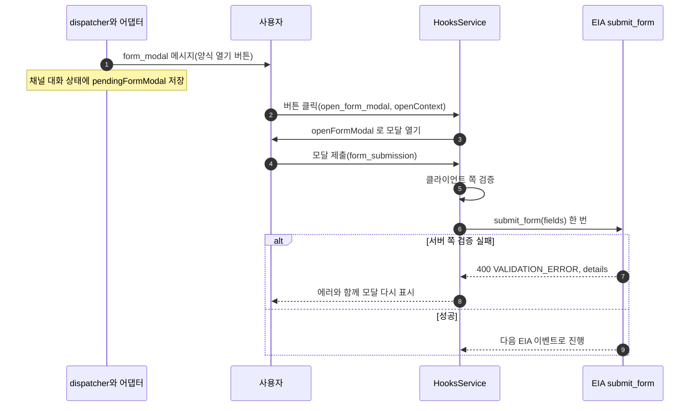

> 구현 상태: 부분 구현 · 원문: `spec/conventions/chat-channel-adapter.md` · 용어: [용어 사전](../CLE-GLOSSARY.md)

## 개요

이 규약은 외부 메신저(Telegram, Slack, 카카오 등)마다 있는 채널 어댑터(`ChatChannelAdapter`)가 구현해야 하는 함수 시그니처와 데이터 타입 계약을 정한다. 모든 어댑터가 이 인터페이스를 지키면 [채팅 채널](CLE-CHAT-CORE.md) 의 시스템 동작과 저절로 맞는다.

어댑터가 여러 프로바이더에 공통으로 따르는 동작도 여기서 정한다. 이벤트별 렌더 매핑, 실행 실패 안내 분류 알고리즘, Form 입력 흐름(네이티브 모달과 다단계 질문)이다. 프로바이더별 API 호출, 길이 한도, escape, 모달 수용 필드 타입 같은 세부는 [Telegram 어댑터](CLE-CHAT-TELEGRAM.md), [Slack 어댑터](CLE-CHAT-SLACK.md), [Discord 어댑터](CLE-CHAT-DISCORD.md) 가 정한다.

다음은 다른 문서가 정한다. `Trigger.config.chatChannel` 필드 계약과 안내 문구 기본값은 [채팅 채널 데이터와 흐름](CLE-CHAT-DATA.md) 이, 요구사항·봇 토큰 재발급 API·인바운드 응답 계약은 [채팅 채널](CLE-CHAT-CORE.md) 이, EIA 이벤트 페이로드는 [EIA 알림 웹훅](../CLE-IX/CLE-EIA-NOTIFY.md) 이 정한다.

## 규칙

1. 모든 채널 어댑터는 [어댑터 인터페이스](#어댑터-인터페이스) 의 필수 함수를 구현한다. 선택 함수(`revokeBotToken?`, `openFormModal?`, `buildFormSubmissionResponse?`)는 프로바이더가 해당 기능을 지원할 때만 구현한다.
2. `parseUpdate`, `renderNode`, `escapeControlText`, `buildFormSubmissionResponse` 는 순수 함수다. DB 에 접근하지 않고 외부 API 를 부르지 않는다. 부수 효과는 `setupChannel`, `teardownChannel`, `sendMessage`, `ackInteraction`, `revokeBotToken`, `openFormModal` 이 맡는다.
3. `parseUpdate` 는 해석할 수 없거나 무시할 update 에 `null` 을 돌려준다. `null` 의 뜻은 "어댑터가 해석하지 않음" 하나뿐이다. 안내 메시지를 보낼지는 호출자(`HooksService`)가 raw body 의 프로바이더 메타(예: Telegram `chat.type`, `from.is_bot`)를 보고 정한다.
4. `setupChannel` 은 같은 설정으로 다시 불러도 등록이 깨지지 않아야 한다(멱등). 이 멱등은 발급 시크릿 값이 그대로라는 뜻이 아니다([setupChannel 멱등의 뜻](#setupchannel-멱등의-뜻)).
5. `setupChannel`·`teardownChannel` 이 자격 증명 거부로 실패하면 던지는 `Error` 에 `code: 'BOT_TOKEN_INVALID'` 를 싣는다. 호출자는 `err.code === 'BOT_TOKEN_INVALID'` 정확 일치로만 분류하고 `message` 를 해석하지 않는다([setupChannel 실패 판별](#setupchannel-실패-판별)).
6. `renderNode` 의 입력은 `EiaEvent | ChatChannelInternalEvent` union 이다. 구현체는 `event.type` 으로 나눈다. 새 이벤트를 받으려면 새 함수가 아니라 union variant 를 더한다(R-CCA-7).
7. 제어 안내(control-plane message)를 `renderNode` 를 거치지 않고 보낼 때 호출자는 발송 직전 `escapeControlText` 로 escape 한다. `renderNode` 출력은 렌더러가 이미 escape 했으므로 `sendMessage` 가 다시 escape 하지 않는다.
8. 실행 실패 안내는 프로바이더와 무관한 순수 함수 `classifyExecutionFailure` 하나로 분류한다. 입력은 `error.code` 와 `error.details.statusCode` 뿐이다([실행 실패 안내 분류](#실행-실패-안내-분류)).
9. Form 입력 대기는 [Form 입력 흐름](#form-입력-흐름) 을 따른다. 네이티브 모달 조건에 맞지 않으면 모든 어댑터가 같은 다단계 질문을 쓴다.
10. 봇 토큰과 인바운드 서명 자료는 시크릿 저장소 참조로만 들고 다닌다. 평문을 설정 JSON, 로그, metric 에 내놓지 않는다. `SetupResult.issuedInboundSigning` 한 번만 예외다. 클라이언트가 만든 실패 문장은 `chat_channel_last_error` 에 저장되고 로그에도 남는다. 그래서 프로바이더 API 클라이언트(`providers/<프로바이더>/<프로바이더>-client.ts`)는 그 문장(fetch 예외, 재시도 소진 사유)을 돌려주거나 로그에 남기기 전에 그 호출에 쓴 봇 토큰을 지운다(알려진 비밀 치환, `replaceKnownSecret`, [응답 자격 증명 마스킹](../CLE-API/CLE-API-EGRESS.md) §1.1). 지우는 대상은 토큰과 글자 그대로 같은 부분과 양끝 공백을 뗀 토큰이다(fetch 는 헤더 값 양끝 공백을 떼고 원문에 싣는다). 프로바이더가 돌려준 4xx 본문은 실패 판별(규칙 5, 「setupChannel 실패 판별」)의 입력이라 바꾸지 않는다. 호출자가 `message` 를 해석하지 않는다는 규칙과는 다른 층이다(클라이언트가 `code` 를 정하는 단계다).
11. `sendMessage` 는 프로바이더별 고정 URL 만 부른다. 사용자가 정하는 URL 은 쓰지 않는다(SSRF 차단).
12. `provider` 식별자는 소문자 kebab-case 이고 [어댑터 레지스트리](#어댑터-레지스트리) 에 등록한다.
13. 인터페이스를 바꾸면 [채팅 채널](CLE-CHAT-CORE.md), 영향받는 모든 프로바이더 문서, 채널 프로바이더 카탈로그를 함께 고친다([변경 관리](#변경-관리)).

## 어댑터 인터페이스

```typescript
interface ChatChannelAdapter {
  /** 채널 식별자. config.chatChannel.provider 와 1:1. 소문자 kebab-case. */
  readonly provider: string;

  /**
   * 프로바이더가 네이티브 폼 UI(Slack `views.open` 모달, Discord MODAL)를 지원하는가.
   * true 이고 uiMapping.formMode 가 auto·native_modal 이며, 모든 필드가 그 프로바이더의
   * 모달 수용 타입이고 fields.length <= 5 면 네이티브 모달 경로를 탄다.
   * false(Telegram 등)면 늘 다단계 질문이다.
   * 값은 어댑터 구현체가 선언한다. 모달 수용 타입 범위는 프로바이더 문서가 정한다(R-CCA-8).
   */
  readonly supportsNativeForm: boolean;

  /**
   * 트리거 생성·활성화 때 부른다. 외부 채널의 webhook·long-poll 등록.
   * @returns 어댑터별 setup 결과(예: bot identity). 일부는 config 에 캐시한다.
   */
  setupChannel(config: ChatChannelConfig, callbackUrl: string): Promise<SetupResult>;

  /** 트리거 비활성화·삭제 때 부른다. 외부 hook 해제. 부분 실패는 허용한다. */
  teardownChannel(config: ChatChannelConfig): Promise<void>;

  /**
   * 외부 채널 update → 워크플로우 입력. 웹훅 진입점이 부른다.
   * 순수 함수(DB 미접근, 외부 API 미호출). 무시 대상(그룹 대화, 봇 자기 메시지 등)은 null.
   */
  parseUpdate(raw: unknown, config: ChatChannelConfig): Promise<ChannelUpdate | null>;

  /**
   * EIA 이벤트와 채팅 채널 내부 이벤트 → 외부 채널 메시지. 순수 함수.
   * 단일 sink WebsocketService.executionEvents$ 를 구독하는 ChatChannelDispatcher 가 부른다.
   * 구현체는 event.type 판별 union 으로 나눈다(R-CCA-7).
   */
  renderNode(
    event: EiaEvent | ChatChannelInternalEvent,
    config: ChatChannelConfig,
  ): Promise<ChannelMessage[]>;

  /** 외부 채널 API 호출(sendMessage, sendPhoto, answerCallbackQuery 등). 재시도·rate limit·에러 처리 책임. */
  sendMessage(message: ChannelMessage, config: ChatChannelConfig): Promise<SendResult>;

  /**
   * 인터랙션 수신 ack 가 의무인 채널(Telegram answerCallbackQuery)을 위한 함수.
   * 인바운드 interact 명령 처리 직후 부른다. ack 가 의무가 아니면 빈 구현이어도 된다.
   */
  ackInteraction(update: ChannelUpdate, config: ChatChannelConfig): Promise<void>;

  /**
   * 제어 안내 텍스트를 프로바이더 표면에 맞게 escape 한다. 순수 함수.
   * HooksService 가 renderNode 를 거치지 않고 sendMessage 로 바로 보내는 문구
   * (surfaceMismatch, executionStillRunning, groupChatRefusal, unsupportedMessageKind,
   * help, formValidationFailed, formNextField)에 발송 직전 적용한다.
   *   - telegram → MarkdownV2 escape(escapeMarkdownV2, renderNode 와 같은 규칙)
   *   - slack → mrkdwn escape(<, >, & 만)
   *   - discord → 그대로(렌더러도 escape 하지 않는다)
   * 그래서 languageHints 기본값과 덮어쓰기는 모두 평문으로 쓴다.
   */
  escapeControlText(text: string): string;

  /**
   * (선택) 봇 토큰 재발급과 관련해 이전 토큰을 외부 프로바이더에서 revoke 한다.
   * Slack auth.revoke 처럼 revoke API 가 있는 프로바이더만 구현하고 Telegram·Discord 는 구현하지 않는다(undefined).
   * 호출자는 존재 여부를 type-guard 로 확인하고 실패해도 흐름을 막지 않는다.
   * 호출 시점(재발급 즉시 또는 24시간 유예 종료 정리)은 정의가 갈린다. 미결 사항 참조.
   * @param oldBotToken 재발급 직전에 가지고 있던 평문 봇 토큰.
   * @returns 외부 API 응답과 무관하게 void. 내부 에러는 호출자에 전파하지 않고 흡수한다(logger.warn).
   */
  revokeBotToken?(oldBotToken: string): Promise<void>;

  /**
   * (선택, supportsNativeForm=true 만) 네이티브 모달을 연다.
   * open_form_modal 명령이 오면 HooksService 가 부른다. 채널 대화 상태의
   * pendingFormModal.fields 와 openContext(trigger_id·interaction token)로 모달을 만든다.
   * Slack 은 views.open 을 부르고 httpResponse 를 비운다. Discord 는 모달을
   * 웹훅 HTTP 응답 본문({ type: 9 })으로 돌려준다(OpenFormModalResult.httpResponse).
   * ackInteraction 에 넣지 않는 이유는 R-CCA-8 (b).
   */
  openFormModal?(params: OpenFormModalParams): Promise<OpenFormModalResult>;

  /**
   * (선택, supportsNativeForm=true 만) 모달 제출의 프로바이더 HTTP 응답을 만든다. 순수 함수.
   * EIA submit_form 호출은 HooksService 가 한다. 이 함수는 ack 나 검증 실패 재표시 본문만 만든다.
   */
  buildFormSubmissionResponse?(params: {
    config: ChatChannelConfig;
    validationError?: { field?: string; message: string };
  }): FormSubmissionResult;
}
```

### 함수 책임

| 함수 | 책임 | 부수 효과 | 멱등성 |
|---|---|---|---|
| `setupChannel` | 외부 채널의 인바운드 hook 등록(Telegram `setWebhook`)과 bot identity 조회. 실패 사유를 `code` 로 선언한다 | 외부 API 호출 1회 이상 | 같은 설정으로 다시 불러도 된다. 뜻은 [setupChannel 멱등의 뜻](#setupchannel-멱등의-뜻) |
| `teardownChannel` | 외부 채널 hook 해제. 부분 실패 허용 | 외부 API 호출 | 멱등 |
| `parseUpdate` | raw body → `ChannelUpdate \| null`. `null` 은 "해석하지 않음" 하나의 뜻이다. 안내 발송 여부는 호출자가 정한다 | 없음 | 순수 |
| `renderNode` | `EiaEvent \| ChatChannelInternalEvent` → `ChannelMessage[]` | 없음 | 순수 |
| `sendMessage` | 외부 API 호출. 재시도·rate limit 책임 | 외부 API 호출 | 원문은 "중복 제거는 호출자가 EIA `seq` 와 `X-Clemvion-Delivery` 로 한다" 고 적었다. 정의가 갈린다([미결 사항](#미결-사항)) |
| `ackInteraction` | 프로바이더가 요구하는 ack(Telegram `answerCallbackQuery`). 함수는 필수지만 빈 구현이어도 된다 | 프로바이더에 따라 외부 API 호출 | 멱등 |
| `escapeControlText` | 제어 안내 텍스트를 프로바이더 표면에 맞게 escape | 없음 | 순수 |
| `revokeBotToken?` | 이전 봇 토큰의 외부 revoke(Slack `auth.revoke`). API 가 없으면 구현하지 않는다. 실패는 흡수한다 | 프로바이더에 따라 외부 API 호출 | 멱등 |
| `openFormModal?` | `form_modal` 버튼 클릭(`open_form_modal` 명령) 때 모달을 연다. Slack 은 `views.open(trigger_id, view)`, Discord 는 웹훅 응답 본문 `{ type: 9 }`. 모달 합성에 채널 대화 상태의 `pendingFormModal.fields` 가 필요해 호출자는 `HooksService` 다 | 외부 API 호출 또는 HTTP 응답 본문 합성 | 멱등 |
| `buildFormSubmissionResponse?` | 모달 제출(`form_submission`)의 HTTP 응답 합성. ack(Slack 빈 200, Discord `{ type: 4 }` ephemeral)나 검증 실패 재표시(Slack `response_action: errors`)만 만든다 | 없음 | 순수 |

### setupChannel 멱등의 뜻

`setupChannel` 의 멱등은 "같은 설정으로 다시 불러도 등록이 깨지지 않는다" 는 뜻이다. 발급되는 시크릿 값이 그대로라는 뜻이 아니다. Telegram 어댑터는 부를 때마다 `randomBytes` 로 새 `secret_token` 을 만들어 `setWebhook` 에 등록하고, 호출자가 그것을 `inboundSigningRef` 에 다시 저장한다. 이것이 정상 동작이며 저장을 건너뛰면 인바운드 서명 검증이 모두 깨진다([Telegram 어댑터](CLE-CHAT-TELEGRAM.md), [채팅 채널](CLE-CHAT-CORE.md) 의 인바운드 서명 자료 변경).

이 구분은 표현 정리가 아니라 등록과 값 두 층을 가르는 규약이다. 2026-09-10(`#1313`)에 "PATCH 는 비밀을 쓰지 않는다" 결정이 멱등을 값 불변으로 읽고 Telegram 재저장까지 막으려 했다. 그대로 구현했다면 모든 Telegram 인바운드가 401 이 됐다.

### setupChannel 실패 판별

`setupChannel` 이 자격 증명 거부로 실패하면 던지는 `Error` 에 `code: 'BOT_TOKEN_INVALID'` 를 실어 사유를 선언한다. 원문은 `teardownChannel` 과 `revokeBotToken` 도 같이 적었으나 `revokeBotToken` 은 에러를 흡수한다고도 적어 어긋난다([미결 사항](#미결-사항)). 호출자는 `code` 로만 분류하고 `message` 를 해석하지 않는다. `code` 가 없는 에러는 일반 실패로 다룬다. 응답 분류(`400 BOT_TOKEN_INVALID`, `502 CHAT_CHANNEL_SETUP_FAILED`)는 [채팅 채널](CLE-CHAT-CORE.md) 의 봇 토큰 재발급 API 가 정한다(근거 R-CCA-9).

`code` 라는 이름은 이 호출 스택에서 네 가지 뜻으로 쓰인다. 섞으면 조용히 잘못 분기한다.

| 무엇 | 소유 | 값 |
|---|---|---|
| 이 절의 `code` | 어댑터가 새로 던지는 `Error` 의 프로퍼티 | 우리 문자열(`'BOT_TOKEN_INVALID'`) |
| 실행 실패 안내 분류의 `event.error.code` | EIA 이벤트 페이로드 | 실행 실패 분류용, 다른 네임스페이스 |
| `app.code`·`res.code` | 프로바이더 원본 API 응답 필드(Discord) | 숫자 |
| Node·undici 시스템 에러의 `code` | 런타임이 붙인다 | `'ENOTFOUND'`, `'ECONNREFUSED'`, `'UND_ERR_*'` |

세 번째는 이름이 가깝다. Discord 어댑터는 이미 `'code' in app` 으로 원본 응답을 검사한다. 네 번째는 판별을 뒤집는다. DNS 가 죽은 `Error` 도 `.code` 가 있으므로 `if (err.code)` 같은 참거짓 판별은 네트워크 단절을 "토큰이 잘못됐다" 로 보고한다. 그래서 판별은 허용 목록 정확 일치(`err.code === 'BOT_TOKEN_INVALID'`)여야 한다. `telegram-client.ts` 주석이 이미 적고 있듯 undici 는 `ENOTFOUND` 를 이 자리로 보낸다. 구현은 `ENOTFOUND → 502` 테스트로 이 오분류를 막는다.

호출자가 프로바이더 신호 방식을 추측하지 않는 이유는 방식이 서로 다르기 때문이다. Slack 은 HTTP 200 과 `{ok:false, error:'invalid_auth'}`, Discord 는 `verify_key` 불일치(상태 코드 자체가 없다), Telegram 은 `HTTP 401` 로 알린다. 문자열에서 상태 숫자를 찾는 방식은 세 프로바이더 중 두 곳에서 원리적으로 실패한다(2026-09-12 실측).

**한시 예외: 호출자의 401/403 fallback.** `code` 가 없는 에러에 대해 호출자는 message 의 401/403 을 보고 `BOT_TOKEN_INVALID` 로 분류한다. "message 원문으로 분기하지 않는다"(R-CCA-5, [채팅 채널](CLE-CHAT-CORE.md) R-CC-15, 실행 엔진 보안 게이트, 에러 코드 카탈로그의 `FILE_REQUIRED` 주석)에 대한 의도적 예외다. `code` 를 아직 붙이지 않은 경로가 조용히 502 로 빠지는 것보다 400 이 사용자에게 낫다.

제거 조건은 v1 프로바이더 셋(Telegram·Slack·Discord)이 모두 `code` 를 붙이는 것이다. 조건만 적고 추적하지 않으면 한시 예외가 영구 예외가 되므로 제거 판정을 별도 후속 항목으로 추적한다. 2026-09-12 에 세 프로바이더 모두 부착을 마쳤지만 실측 판정은 "아직 지우지 말 것" 이다. 부착은 각 프로바이더의 주 경로에 한정되고, fallback 이 유일한 방어인 경로가 남아 있다. 대표적으로 Slack 4xx 응답이 JSON 이 아닐 때 클라이언트가 만드는 `error: 'HTTP 401'` 은 자격 증명 값 허용 목록에 없다. 즉 위 조건은 제거의 충분조건이 아니다. 조건만 보고 지우면 그 경로들이 조용히 502 로 바뀐다.

## 입력 이벤트

### EiaEvent

`EiaEvent` 는 [EIA 알림 웹훅](../CLE-IX/CLE-EIA-NOTIFY.md) 이 정한 아웃바운드 이벤트 다섯 가지의 union 이다. 새 타입을 만들지 않고 EIA 페이로드 모양을 그대로 쓴다(R3).

```typescript
type EiaEvent =
  | { type: "execution.waiting_for_input"; executionId: string; triggerId: string; workflowId: string;
      node: { id: string; type: string; interactionType: "form" | "buttons" | "ai_conversation" | "ai_form_render" };
      interaction: { /* ... */ };
      context: { formConfig?: unknown; buttonConfig?: unknown; conversationConfig?: unknown; conversationThread?: unknown };
      timestamp: string; seq: number }
  | { type: "execution.ai_message"; executionId: string; triggerId: string; workflowId: string;
      message: string; turnCount: number; messages: unknown[]; metadata?: unknown;
      /** AI 에이전트 render_* 표시 도구 턴에만 실린다. */
      presentations?: PresentationPayload[];
      timestamp: string; seq: number }
  | { type: "execution.completed"; executionId: string; triggerId: string; workflowId: string; status: "completed";
      result?: { outputs?: unknown }; durationMs?: number | null; timestamp: string; seq: number }
  | { type: "execution.failed"; executionId: string; triggerId: string; workflowId: string; status: "failed";
      error: { code: string | null; message: string; nodeId: string | null; details?: unknown } | string;
      durationMs?: number | null; timestamp: string; seq: number }
  | { type: "execution.cancelled"; executionId: string; triggerId: string; workflowId: string; status: "cancelled";
      result?: { cancelledBy?: "user" | "system" | "timeout" }; error?: { code: string; message?: string };
      durationMs?: number | null; timestamp: string; seq: number };
```

- 필드의 기준은 EIA 페이로드다. 종결 세 가지(`completed`·`failed`·`cancelled`)의 필드 집합과 행동 계약도 EIA 가 기준이다. 위 variant 는 그것을 TypeScript 로 옮긴 것이고, 어긋나면 EIA 가 맞다. 같은 계약을 두 곳에 적었더니 실제로 어긋나서 여기서는 다시 나열하지 않는다. 봉투는 평평한 WebSocket 계열이고 `result` 중첩은 유지된다.
- `waiting_for_input` 의 `node`·`interaction`·`context` 는 EIA 의 논리 표기다. 실제 wire 는 `waitingNodeId`·`interactionType`·`nodeOutput` 같은 평평한 필드이고, dispatcher 가 `toChatChannelEvent` 로 바꿔 어댑터에 넘긴다. `interaction` 블록은 EIA 에서 아직 보내지 않는다(Planned).
- 대기 표면(`interactionType`)은 네 값이다([인터랙션 타입 레지스트리](../CLE-IX/CLE-IX-TYPES.md)). `ai_form_render` 는 AI 에이전트 `render_form` 의 블로킹 하위 상태이고 채팅 채널에서는 `ai_conversation` 과 같은 경로다. 채널 어댑터는 서버 안 소비자라 네 값을 받는다. 현재 구현(dispatcher)도 그대로 넘기고, 레지스트리가 이 위치들을 값별 분기 위치로 등록한다([인터랙션 타입 레지스트리 §서버 안 소비자: 채팅 채널](../CLE-IX/CLE-IX-TYPES.md#서버-안-소비자-채팅-채널)). EIA 외부 경로에서 `ai_form_render` 가 어떻게 보이는지는 [인터랙션 타입 레지스트리 §미결 사항](../CLE-IX/CLE-IX-TYPES.md#미결-사항) 에서 다룬다.
- 디버그 전용 `llmCalls` 는 fanout 단계에서 지워져 어댑터에 오지 않는다([WebSocket 이벤트와 명령](../CLE-API/CLE-API-WS-EVENTS.md)).
- `presentations` 의 기준은 [AI 에이전트 노드 출력과 디버그](../CLE-NODE-AI/CLE-NODE-AGENT-OUTPUT.md) 다.
- `result` 가 선택인 이유: 현재 발행은 `status`(`cancelled` 는 `cancelledBy` 포함)와 `durationMs` 를 채우고 `outputs` 만 Planned 다. `durationMs` 는 2026-08-15 에 종결 세 가지 모두 구현됐고, 모르면 `null` 이다.
- `failed` 의 `error` 가 `| string` 을 품는 이유는 따로 있다. 발행은 2026-08-14 부터 모든 경로가 object(`toTerminalErrorPayload`)다. union 은 배포 경계에서 재생되는 옛 이벤트를 받으려고 일부러 남겼다. 지우면 그 창 동안 실행 실패 안내가 조용히 빠진다.

### ChatChannelInternalEvent

채널 어댑터가 EIA 다섯 가지 밖에 더 받는 서버 안 이벤트다. 외부 SDK 에 드러나지 않고 EIA 알림 웹훅 허용 목록과도 별개다. 구독 원천은 단일 sink `WebsocketService.executionEvents$` 다.

```typescript
type ChatChannelInternalEvent =
  | {
      type: "execution.node.completed";   // WebSocket 이벤트와 같은 이름, 채팅 채널 안에서만 소비
      executionId: string;
      triggerId: string;
      workflowId: string;
      node: { id: string; type: "carousel" | "table" | "chart" | "template"; label?: string };
      /**
       * 노드 출력(NodeHandlerOutput) 전체(= NodeExecution.outputData)다.
       * 도메인 값은 한 겹 아래 output.output 에 있다(예: Template 의 {rendered, …}, Carousel 의 {items, …}).
       * dispatcher 가 wire 의 p.output 을 그대로 넘기기 때문이다.
       */
      output: Record<string, unknown>;
      meta?: Record<string, unknown>;
      timestamp: string;
      seq: number;
    };
```

- `output` 주석은 한때 이 필드를 `NodeHandlerOutput.output` 이라 적어 한 겹 얕았다. 렌더러가 여러 위치를 훑어 실제 파손은 없었지만, 그 주석을 믿고 `output.rendered` 를 바로 읽으면 `undefined` 다. 노드 출력과 wire 의 구분 기준은 [노드 출력 규약](../CLE-NODE/CLE-NODE-OUTPUT.md) 이다.
- `node.type` 은 표시 전용 Presentation 네 가지뿐이다. Form, AI 에이전트, LLM, Code 같은 다른 노드는 받지 않는다.
- 버튼 때문에 입력 대기로 들어간 경우(`nodeExec.outputData.status === 'waiting_for_input'`)는 미리 걸러 낸다. 그 경우는 `execution.waiting_for_input`(buttons)이 따로 나간다. 현재 구현은 dispatcher 가 이벤트를 바꿀 때(`toChatChannelEvent`) 이 거름을 한다.

## 데이터 타입

### ChannelUpdate

어댑터 입력 쪽 공통 타입이다.

```typescript
interface ChannelUpdate {
  conversationKey: string;        // 대화 키(Telegram: chat_id)
  channelUserKey: string;         // 채널 사용자 키(Telegram: user_id)
  command:
    | { kind: "start" }                                          // /start
    | { kind: "cancel" }                                         // /cancel
    | { kind: "text_message"; text: string }                     // 일반 텍스트
    | { kind: "button_callback"; callbackData: string; callbackQueryId: string; messageId?: string }
        // 인라인 키보드 탭. callbackQueryId 는 ackInteraction(answerCallbackQuery) 대상(Telegram).
        // ack 의무가 없는 프로바이더(Slack·Discord)는 빈 문자열.
        // messageId(선택)는 버튼이 달린 원본 메시지 id. ack 뒤 키보드를 지워 중복 클릭을 막는다(Telegram callback_query.message.message_id)
    | { kind: "file_upload"; fileId: string; mimeType: string }  // 파일 첨부
    | { kind: "contact_share"; phone: string }                   // 연락처 공유
    | { kind: "open_form_modal"; openContext: Record<string, string> }
        // 네이티브 모달 게이팅, "양식 작성하기" 버튼 클릭. openContext 는 이 시점에만 쓸 수 있는
        // trigger_id(Slack)·interaction token(Discord). HooksService 가 openFormModal 로 모달을 연다
    | { kind: "form_submission"; fields: Record<string, string> }; // 네이티브 모달 일괄 제출(Slack view_submission, Discord MODAL_SUBMIT)
  idempotencyKey: string;         // 중복 제거 키. 프로바이더 update id 등에서 만든다(Telegram: update_id)
  receivedAt: string;             // ISO8601
}
```

`form_submission` 평탄화는 `parseUpdate` 안에서 한다. 프로바이더별 모달 제출 payload(Slack `view.state.values`, Discord `data.components[].components[]`)를 `{ [fieldName]: rawValue }` 로 편다. 순수 계약은 지키고 payload 변환만 한다. 선택 필드가 비어 있으면 그 키를 뺀다(다단계 질문에서 선택 필드를 답하지 않은 경우와 같이 `submit_form(data)` 에 넣지 않는다). 서버 쪽 필수·형식 검증은 EIA `submit_form` 계약이 기준이다.

### ChannelMessage

어댑터 출력 쪽 공통 타입이다.

```typescript
interface ChannelMessage {
  conversationKey: string;
  body:
    | { kind: "text"; text: string; chunked?: boolean }
    | { kind: "buttons"; text: string; buttons: ChannelButton[] }
    | { kind: "form_prompt"; fieldName: string; label: string; hint?: KeyboardHint }
    | { kind: "form_modal"; openLabel: string; formConfig: unknown }  // "양식 열기" 버튼 메시지. 클릭하면 어댑터가 formConfig 로 모달을 만든다
    | { kind: "image"; bytes: Buffer; caption?: string; fallbackText: string }
    | { kind: "typing" };                // sendChatAction 등
  replyToExternalId?: string;            // 선택. 프로바이더별 답장·스레드
}

interface ChannelButton {
  id: string;                            // EIA click_button 의 buttonId
  label: string;
  type: "callback" | "link";             // callback → click_button, link → 외부 URL
  url?: string;                          // type=link
  style?: "primary" | "danger" | "none"; // 선택. 시각 강조. 프로바이더별 매핑(Discord PRIMARY·DANGER, Telegram ✅·⚠️ 라벨 접두). 없으면 프로바이더 기본
}

type KeyboardHint =
  | "text"
  | "number"
  | "email"
  | "phone"
  | "date"
  | "file_upload"
  | "share_contact";
```

`form_modal` 은 Form 입력 대기가 네이티브 모달 경로로 갈 때 `renderNode` 가 만드는 "양식 작성하기" 버튼 메시지 1건이다. 서버가 먼저 보내는 시점에는 trigger_id·interaction token 이 없어 모달을 바로 열 수 없으므로(R-CCA-8), 버튼으로 사용자 클릭을 받고 그 클릭을 `open_form_modal` 명령으로 해석해 `HooksService` 가 `openFormModal` 로 연다.

- `openLabel`: 버튼 라벨. `languageHints.formOpenLabel` 덮어쓰기 → `languageLocale` 기본값(KO "양식 작성하기", EN "Open form") → `ko` 순서로 찾는다.
- `formConfig`: `execution.waiting_for_input.context.formConfig` 원본(`fields[]` 포함). 타입은 EIA 가 기준이라 `unknown` 으로 둔다(R3). 어댑터가 클릭 때 [Form 노드](../CLE-NODE-PRES/CLE-NODE-FORM.md) 의 fields 모양으로 읽어 프로바이더 모달 view(Slack input block, Discord TEXT_INPUT)로 바꾼다.

### ChatChannelConfig

`Trigger.config.chatChannel` 의 메모리 표현이다. 필드 계약은 [채팅 채널 데이터와 흐름](CLE-CHAT-DATA.md) 이 기준이고 여기서는 타입 시그니처만 둔다.

```typescript
interface ChatChannelConfig {
  provider: string;
  /**
   * 시크릿 참조(secret://triggers/{id}/bot-token). 평문은 어댑터의 부수 효과 함수가 SecretResolver 로 푼다.
   * 선택: 트리거 최초 생성 시점(setupChannel·rotate-bot-token 이전)에는 undefined.
   * 옛 행은 웹훅 수신 때 botTokenRef === undefined 면 건너뛴다.
   */
  botTokenRef?: string;
  /**
   * 인바운드 서명 자료 참조(secret://triggers/{id}/inbound-signing). 프로바이더 공통 단일 슬롯이고,
   * 검증 알고리즘과 발급 주체는 백엔드가 프로바이더별로 나눈다(아래 표).
   * 선택: 서명 자료 없이 URL 무작위성만으로 인증하는 프로바이더가 생길 수 있어 ? 로 둔다. v1 세 프로바이더는 모두 필수다.
   */
  inboundSigningRef?: string;
  /**
   * setupChannel 결과 캐시. botId·username 은 공통이고 teamId 는 workspace·team 개념이 있는
   * 프로바이더(Slack workspace, Discord guild 등)만 채운다.
   * publicKey(선택)는 Discord GET /applications/@me 의 verify_key 캐시(ed25519 공개키, 비민감).
   */
  botIdentity?: { botId: number; username: string; teamId?: string; publicKey?: string };
  uiMapping?: {
    /** Form 입력 표면. 기본 "auto". 뜻은 Form 입력 흐름. 옛 DB 값 "multi_step" 은 뜻이 같다(상위 호환). */
    formMode?: "multi_step" | "native_modal" | "auto";
    /**
     * 시각형 노드 표시 모드. 기본 "auto". KeyboardHint 의 "text"(입력 힌트)와 뜻이 다르다.
     * v1 에서 photo 를 고르면 텍스트로 대신 보내고 warning 로그를 남긴다.
     * DB 의 옛 "text_only" 는 어댑터가 읽을 때 "text" 로 바꾼다(마이그레이션 전 과도기).
     */
    visualNode?: "text" | "photo" | "auto";
    buttonLayout?: "auto" | "vertical" | "horizontal";
  };
  rateLimitPerMinute?: number;
  /**
   * languageHints 가 비어 있는 키의 기본 문구 locale. 기본 "ko".
   * 찾는 순서: (1) languageHints[key] → (2) 이 locale 의 기본 문구 → (3) "ko".
   * 이 조회는 어댑터 책임이다. classifyExecutionFailure 는 key 만 정한다.
   */
  languageLocale?: "ko" | "en";
  languageHints?: Record<string, string>;
}
```

`inboundSigningRef` 의 프로바이더별 성격은 다음과 같다. 동작 기준은 각 프로바이더 문서의 보안 절이다.

| 프로바이더 | 자원 성격 | 발급 주체 | 검증 알고리즘 |
|---|---|---|---|
| Telegram | shared secret(서버 발급) | 어댑터 `setupChannel` 의 `randomBytes` | `X-Telegram-Bot-Api-Secret-Token` 헤더 동일성 |
| Slack | HMAC-SHA256 signing secret | Slack 앱 설치 때 발급, 사용자가 직접 입력 | `X-Slack-Signature` = HMAC-SHA256(secret, "v0:" + ts + ":" + body) |
| Discord | ed25519 application public key | Discord Developer Portal 발급, 사용자가 직접 입력 | `X-Signature-Ed25519` ed25519 검증(raw body + timestamp) |

### SetupResult와 SendResult

```typescript
interface SetupResult {
  registeredAt: string;               // ISO8601
  externalHookUrl?: string;           // 어댑터별 디버깅용(Telegram getWebhookInfo 결과)
  identity?: Record<string, unknown>; // botId, username 등(config.botIdentity 에 캐시)
  /** setupChannel 동안 확정한 config 갱신분(botIdentity 등). issuedInboundSigning 평문은 여기 넣지 않는다. */
  configUpdates?: Partial<ChatChannelConfig>;
  /**
   * setupChannel 직후 한 번만 드러나는 인바운드 서명 자료 평문. 서버 발급만 해당한다
   * (v1 에서는 Telegram 이 setWebhook.secret_token 을 randomBytes 로 만든다).
   * 호출자(ChatChannelBinderService.setupChatChannel, TriggersService 가 생성·수정 경로에서 부른다)가
   * 곧바로 SecretResolver.rotate(secret://triggers/{id}/inbound-signing, ...) 로 저장하고
   * 참조를 inboundSigningRef 에 넣는다. 평문이 config 로 흘러가지 않게 분리한다(SS-SE-01).
   * Slack·Discord 처럼 사용자가 직접 입력하는(프로바이더 발급) 경우는 채우지 않는다.
   */
  issuedInboundSigning?: string;
}

interface SendResult {
  externalMsgId: string;              // 프로바이더가 붙인 메시지 id(Telegram message_id)
  sentAt: string;                     // ISO8601
}
```

## 이벤트별 렌더 매핑

`renderNode(event)` 가 처리하는 EIA 이벤트 다섯 가지와 채팅 채널 내부 이벤트, 그리고 출력 `ChannelMessage[]` 는 다음과 같다. EIA 알림 웹훅 표면은 다섯 가지 그대로이고 마지막 행은 내부 이벤트다.

| 이벤트 | 입력 | 출력 메시지 |
|---|---|---|
| `execution.waiting_for_input`(form) | `formConfig.fields[]` | 폼 모드 분기([Form 입력 흐름](#form-입력-흐름)). 네이티브 모달이면 `form_modal` 1건(양식 열기 버튼) → 클릭 때 모달을 열고 → 제출 때 `form_submission` 을 한 번에 모아 → EIA `submit_form` 한 번 호출. 다단계 질문이면 첫 필드 `form_prompt` 1건, 이후 답할 때마다 다음 필드 |
| `execution.waiting_for_input`(buttons) | `buttonConfig.buttons[]`, `buttonConfig.nodeOutput` | `buttons` 1건. 노드가 시각형(carousel·table·chart)이면 그 앞에 시각 메시지를 붙인다. `uiMapping.visualNode`(`text`·`photo`·`auto`, 기본 `auto`)에 따라 나누고, v1 은 프로바이더별 텍스트 fallback, v2 는 SSR PNG 다. v1 에서 `photo` 를 고르면 텍스트로 대신 보내고 warning 로그를 남기며 건강도는 바꾸지 않는다. 버튼 달린 Template 의 처리는 [미결 사항](#미결-사항) 참조 |
| `execution.waiting_for_input`(ai_conversation) | 없음 | 빈 배열(조용히 넘김). 이유는 R-CCA-6 |
| `execution.waiting_for_input`(ai_form_render) | 없음 | `ai_conversation` 과 같이 빈 배열. 채팅 채널의 인라인 폼 처리는 후속이다 |
| `execution.ai_message` | `message`(필수), `presentations?[]` | `text` 1건 이상(나눠 보낼 수 있다). `presentations` 가 있으면 표시물마다 v1 fallback 으로 렌더해 텍스트 뒤에 하나씩 `await` 하며 보낸다(`Promise.all` 금지, rate limit 과 표시 순서). 표시 전용 네 가지(`carousel`·`table`·`chart`·`template`)는 시각형 fallback 을 다시 쓴다. `render_form`(`type === 'form'`)은 필드 목록과 답변 안내를 담은 v1 임시 텍스트다(R-CC-17). 기준은 [AI 에이전트 노드 출력과 디버그](../CLE-NODE-AI/CLE-NODE-AGENT-OUTPUT.md) 와 [EIA 알림 웹훅](../CLE-IX/CLE-EIA-NOTIFY.md) |
| `execution.completed` | 없음(`status` 만). `result.outputs` 는 EIA 에서 Planned | `text` 1건. `languageHints.executionCompleted` |
| `execution.failed` | `error.code`, `error.details.statusCode`(다른 필드 금지) | `text` 1건. [실행 실패 안내 분류](#실행-실패-안내-분류) 결과 `(key, placeholders)` 로 `languageHints[key]` 를 찾고 자리표시자를 채운다. 시스템 의무는 [채팅 채널](CLE-CHAT-CORE.md) 이 정한다 |
| `execution.cancelled` | `cancelledBy`, `error?.code` | `text` 1건. `error.code` 가 `RESUME_*` 접두 코드면 무엇이든(재개 실패 시스템 취소, [장애 복구와 안전 종료](../CLE-EXEC/CLE-EXEC-RECOVERY.md)) 대화 세션 만료 안내 `languageHints.sessionExpired` 를 보내고, 그 밖은 일반 취소 안내를 보낸다. 이 안내 범위(`RESUME_*` 전부)의 기준은 이 규약이다 |
| `execution.node.completed`(내부, 표시 전용 Presentation 만) | `node.type ∈ {template, carousel, table, chart}`, `output` | `template` 은 `output.output.rendered` 를 `text` 1건으로(MarkdownV2 escape). 실제 `extractRendered` 는 `rendered` → `payload.rendered` → `output.rendered` 를 훑어 옛 평평한 모양도 받는다. `carousel`·`table`·`chart` 는 시각형 v1 fallback(`renderCarouselFallback`·`renderTableFallback`·`renderChartFallback`)을 그대로 쓴다. 버튼 있는(블로킹) 경우는 buttons 대기 행이 처리하므로 미리 거른다. Form 노드는 늘 블로킹이라 대상이 아니다 |

`execution.completed` 행은 원문이 `result.outputs` 나 result summary 를 쓴다고 적었으나, EIA 가 `result.outputs` 를 아직 보내지 않으므로(Planned) 현재는 `executionCompleted` 문구만 쓴다.

### 시각형 렌더 입력

시각형 v1 fallback 은 세 진입점에서 함께 쓴다. 버튼 대기(`execution.waiting_for_input` buttons), 표시 전용 완료(`execution.node.completed`), AI 표시물(`execution.ai_message.presentations[]`)이다. 노드 유형 × `visualNode` × 버전 매트릭스, 길이 한도, 분할 규칙은 프로바이더 문서가 정한다.

프로바이더 매트릭스에 적힌 `output.payload.*`, `output.items[]`, `output.{rows, columns}`, `output.rendered` 는 노드가 무엇을 만드는지를 적은 것이다(노드 출력의 `output` 기준). 렌더러가 읽는 경로가 아니다. wire 로 실릴 때는 한 겹이 더 붙어 `nodeOutput.output.<field>` 가 된다. 렌더러(`renderPresentationByType`, `extractRendered`, `extractVisualPayload`)는 다음 순서로 찾고 처음 찾은 값을 쓴다.

1. `nodeOutput.payload.<field>`: AI 에이전트 `presentations[i]` 포장
2. `nodeOutput.output.<field>`: 그래프 노드 핸들러 반환
3. `nodeOutput.config.<field>`: Carousel 정적 모드처럼 config 에만 있는 값
4. `nodeOutput.<field>`: 평평한 옛 모양

노드 출력과 wire 의 구분 기준은 [노드 출력 규약](../CLE-NODE/CLE-NODE-OUTPUT.md) 이다. 프로바이더 매트릭스가 적은 Chart·Carousel 입력 모양이 노드 출력([Chart 노드](../CLE-NODE-PRES/CLE-NODE-CHART.md), [Carousel 노드](../CLE-NODE-PRES/CLE-NODE-CAROUSEL.md))과 다르다. [미결 사항](#미결-사항) 참조.

## 실행 실패 안내 분류

`execution.failed` 를 안내 메시지로 바꾸기 전에 프로바이더와 무관한 순수 함수가 `(key, placeholders)` 를 정한다. 어댑터(`renderNode`)는 그 결과로 `languageHints` 문구를 찾아 채우고 `text` 메시지 1건을 만든다.

```typescript
interface ExecutionFailureClass {
  /** languageHints 조회 키. 실행 실패 안내 키 여섯 개 가운데 하나. */
  key:
    | "executionFailedThirdParty4xx"
    | "executionFailedThirdParty5xx"
    | "executionFailedThirdParty"
    | "executionFailedTimeout"
    | "executionFailedRateLimit"
    | "executionFailedInternal";
  /** 자리표시자 값. 허용 목록은 {statusCode} 하나(정수). */
  placeholders: { statusCode?: number };
}

/**
 * 순수 함수. 부수 효과 없음. 프로바이더 무관.
 * 입력 허용 목록(CCH-ERR-02): event.error.code 와 event.error.details?.statusCode 만.
 * details 는 unknown 이므로 statusCode 를 읽기 전에 런타임 type-guard 를 한다:
 * typeof details === 'object' && details !== null && 'statusCode' in details
 *   && typeof (details as any).statusCode === 'number'.
 * 가드가 실패하면 placeholders.statusCode 를 뺀다.
 */
function classifyExecutionFailure(event: Extract<EiaEvent, { type: "execution.failed" }>): ExecutionFailureClass;
```

분류 매핑은 다음과 같다. `error.code` enum 의 기준은 [에러 코드 규약과 카탈로그](../CLE-API/CLE-API-ERRCODES.md) 다.

| `error.code` | 추가 조건 | 결과 `key` | placeholders |
|---|---|---|---|
| `HTTP_4XX` | `details.statusCode` ∈ [400, 499], 있을 때만 | `executionFailedThirdParty4xx` | `{ statusCode }`(없으면 뺀다) |
| `HTTP_5XX` | `details.statusCode` ∈ [500, 599], 있을 때만 | `executionFailedThirdParty5xx` | `{ statusCode }`(없으면 뺀다) |
| `HTTP_TIMEOUT`(발행 안 됨) | 없음 | `executionFailedTimeout` | `{}` |
| `HTTP_TRANSPORT_FAILED` | 없음 | `executionFailedThirdParty` | `{}` |
| `LLM_RATE_LIMIT` | 없음 | `executionFailedRateLimit` | `{}` |
| `LLM_TIMEOUT` | 없음 | `executionFailedTimeout` | `{}` |
| `LLM_CALL_FAILED` · `LLM_RESPONSE_INVALID` · `MAX_COLLECTION_RETRIES_EXCEEDED` | 없음 | `executionFailedThirdParty` | `{}` |
| `EMAIL_SEND_FAILED` | 없음 | `executionFailedThirdParty` | `{}` |
| `EXECUTION_TIMEOUT`(Code 노드 스크립트) · `EXECUTION_TIME_LIMIT_EXCEEDED`(엔진 누적 실행 시간) · `CODE_TIMEOUT` | 없음 | `executionFailedTimeout` | `{}` |
| `CODE_EXECUTION_FAILED` · `CODE_MEMORY_LIMIT` · `HTTP_BLOCKED`(SSRF 차단) · `SUB_WORKFLOW_FAILED` · `WORKFLOW_FORBIDDEN_WORKSPACE`(워크스페이스 격리 차단) · `DB_*` · `RECURSION_DEPTH_EXCEEDED` · `MAX_ITERATIONS_EXCEEDED` · `CYCLE_DETECTED` · `INVALID_EXPRESSION` · `VARIABLE_NOT_FOUND` · `TYPE_MISMATCH` · `ERROR_PORT_FALLBACK` | 없음 | `executionFailedInternal` | `{}` |
| `WORKER_HEARTBEAT_TIMEOUT` | 분류 미정([미결 사항](#미결-사항)) | 현재는 아래 행과 같이 `executionFailedInternal` | `{}`(백엔드 `warn` 로그) |
| 그 밖의 모든 code(`error.code === null` 포함) | 알 수 없음 | `executionFailedInternal` | `{}`(백엔드 `warn` 로그, CCH-ERR-04) |

- **`HTTP_TIMEOUT`(발행 안 됨)**: HTTP Request 핸들러는 timeout reject 를 `HTTP_TRANSPORT_FAILED` 로 합쳐 발행하므로 EIA 페이로드에 `HTTP_TIMEOUT` 이 올 경로는 지금 없다. enum 보존과 방어를 위해 행을 둔다.
- **timeout 행의 층 구분**: 입력은 엔진 수준의 `execution.failed.error.code` 다. Code 노드 스크립트가 시간을 넘기면 엔진은 `EXECUTION_TIMEOUT` 을 발행한다. 노드 출력 층의 `output.error.code` 는 같은 상황을 `CODE_TIMEOUT` 으로 정규화하며, 이 토큰이 EIA 페이로드로 오는 경우까지 방어적으로 함께 매핑한다(두 층의 구분 기준은 에러 코드 카탈로그). `EXECUTION_TIME_LIMIT_EXCEEDED` 는 엔진 누적 실행 시간 초과로 다른 코드다. 세 코드 모두 `executionFailedTimeout` 으로 모이므로 사용자 영향은 같다.
- **`statusCode` 생략**: `details.statusCode` 가 없거나 정수가 아니면 4xx·5xx 분기는 `error.code` 만으로 정한다(HTTP 노드 핸들러는 두 값을 일관되게 넣는다고 가정한다). 자리표시자가 빠지면 어댑터는 `{statusCode}` 를 `"?"` 로 바꾸거나 `({statusCode})` 괄호 구간을 통째로 지운다(어댑터 재량). 사용자 영향은 거의 없다.
- **위치**: `codebase/backend/src/modules/chat-channel/shared/execution-failure-classifier.ts` 한 파일이다. 어댑터는 부르기만 하고 프로바이더별 분기는 없다.
- **locale**: 함수는 `key` 만 정한다. locale 별 기본 문구 조회는 어댑터 책임이고 순서는 `languageHints[key]` → `languageLocale` 기본값 → `ko` 다([채팅 채널 데이터와 흐름](CLE-CHAT-DATA.md) 의 기본 문구 표).

## Form 입력 흐름

Form 입력 대기(`execution.waiting_for_input` form)가 오면 어댑터는 `uiMapping.formMode`, `supportsNativeForm`, 필드 구성으로 두 경로 중 하나를 고른다.

- **네이티브 모달**: `supportsNativeForm === true`, `formMode !== "multi_step"`, 모든 필드가 그 프로바이더의 모달 수용 타입(프로바이더 문서가 정한다), `formConfig.fields.length <= 5` 를 모두 만족할 때.
- **다단계 질문**: 그 밖의 모든 경우(Telegram 처럼 모달 미지원, 필드 6개 이상, 모달이 받지 않는 타입 포함, 사용자가 `multi_step` 선택).

진입 조건은 어댑터가 판단한다. 사용자가 버튼을 누르지 않거나 모달을 닫아도 실행은 입력 대기를 유지한다. 어댑터는 다단계 질문으로 자동 강등하지 않고 버튼 메시지를 남겨 다시 누를 수 있게 한다. 대기 시간 초과는 EIA 정책을 따르고 따로 만들지 않는다.

### 네이티브 모달 경로

프로바이더가 네이티브 폼 UI(Slack `views.open`, Discord MODAL)를 지원하면 필드 5개 이하 폼을 모달 하나로 받는다. trigger_id(Slack 3초)와 interaction token(Discord 15분)은 사용자 클릭 때만 생기므로 버튼으로 먼저 받아야 한다.



1. 폼이 오면 `renderNode` 가 `form_modal` 메시지 1건(`openLabel` 버튼과 `formConfig`)을 만든다. 채널 대화 상태에 `pendingFormModal`(`fields`, 모드 `native_modal`)을 저장한다.
2. 사용자가 버튼을 누르면 `parseUpdate` 가 `open_form_modal` 명령을 돌려준다(openContext 는 Slack `{ triggerId }` 3초, Discord `{ interactionId, interactionToken }` 15분). `HooksService` 가 `openFormModal` 로 곧바로 모달을 연다(Slack `views.open(trigger_id, view)`, Discord interaction 응답 `type: 9` MODAL). view 는 `fields[]` 를 프로바이더 입력 요소로 바꾼다. `block_id`·`custom_id` 는 필드 이름이다.
3. 제출(Slack `view_submission`, Discord `MODAL_SUBMIT`)하면 `parseUpdate` 가 `{ kind: "form_submission", fields }` 로 한 번에 편다.
4. 클라이언트 쪽 검증(모든 필드의 type, pattern, minLength·maxLength, 숫자 min·max)을 한다. 프로바이더 네이티브 검증을 먼저 쓰고 나머지는 어댑터 schema 검증이다. 통과하면 EIA `submit_form(data: fields)` 을 한 번 부른다.
5. 서버 쪽 검증이 실패하면(`400 VALIDATION_ERROR` + `error.details[{field, message, code}]`) 에러와 함께 모달을 다시 보여 준다. Slack 은 `view_submission` 응답으로 `{ response_action: "errors", errors: { <block_id>: <msg> } }` 를 돌려줘 모달을 유지한다. Discord 는 같은 interaction 에 모달을 다시 보낼 수 없어 후속 메시지의 버튼으로 다시 열게 한다([Discord 어댑터](CLE-CHAT-DISCORD.md)).
6. 성공하면 다음 EIA 이벤트로 넘어간다.

모달에서도 프로바이더 네이티브 검증(Slack input `min_length`·`max_length`, Discord TEXT_INPUT `min_length`·`max_length`·`required`)을 먼저 쓰고, pattern·email 같은 나머지 schema 검증은 제출 직후 어댑터가 한다. 실패하면 5단계의 재표시 경로를 탄다. "틀린 필드만 다시" 라는 다단계 질문의 원칙은 모달에서도 같다(모달 전체를 유지하고 틀린 필드만 에러로 강조한다).

### 다단계 질문

모달을 쓰지 않는 폼은 모든 어댑터가 필드별 질문을 차례로 보내는 같은 흐름으로 받는다.

1. `formConfig.fields[0]` 의 `form_prompt` 를 보낸다. 채널 대화 상태에 현재 필드 인덱스를 저장한다(`currentFieldIdx=0`).
2. 사용자가 답하면(`text_message`, `contact_share` 등) 어댑터는 EIA `submit_form` 을 바로 부르지 않고 자체 버퍼에 채운다(`partialFormData[fields[0].name] = value`).
3. 필드 단위 클라이언트 쪽 검증(type, pattern, minLength·maxLength, 숫자 min·max 같은 schema 수준)을 한다. 실패하면 같은 필드의 `form_prompt` 를 다시 보낸다. `parseUpdate` 는 순수 계약을 지키므로 어댑터가 `sendMessage` 를 직접 부르지 않고, 재질문 메시지 생성과 발송은 호출자(`ChatChannelDispatcher`·`HooksService`)가 한다. 성공하면 `currentFieldIdx` 를 올리고 다음 필드를 묻는다.
4. 마지막 필드의 답이 검증을 통과하면 EIA `submit_form(data: partialFormData)` 을 부른다.
5. EIA 가 서버 쪽 검증 실패(`400 VALIDATION_ERROR` + `error.details[{field, message, code}]`)로 답하면 `details[0].field` 로 `currentFieldIdx` 를 되돌리고 그 필드를 다시 묻는다. 실행은 입력 대기를 유지한다(EIA-RL-03).
6. 성공하면 다음 입력 대기, `ai_message`, `completed` 이벤트가 온다.

서버 쪽 검증이 실패해도 인덱스를 되돌리므로 사용자는 처음부터가 아니라 틀린 필드만 다시 답한다.

각 필드 질문의 본문은 세 프로바이더가 같다.

```text
{field.label}{required ? " *" : ""}
{field.description || ""}
```

`field.description` 은 Form 노드의 필드 정의에 없다. [미결 사항](#미결-사항) 참조.

## 어댑터 레지스트리

```typescript
interface ChannelAdapterRegistry {
  register(adapter: ChatChannelAdapter): void;
  get(provider: string): ChatChannelAdapter;
  has(provider: string): boolean;
}
```

`provider` 문자열은 소문자 kebab-case 다(예: `"telegram"`, `"slack"`, `"kakao-talk"`). 새 어댑터를 더하는 절차는 다음과 같다.

1. 프로바이더 문서를 만든다(구체 명세).
2. `codebase/backend/src/modules/chat-channel/providers/<name>/<name>.adapter.ts` 에 `ChatChannelAdapter` 를 구현한다.
3. `ChatChannelModule` 의 `onModuleInit` 에서 레지스트리에 `register()` 한다.
4. [채팅 채널](CLE-CHAT-CORE.md) 의 채널 프로바이더 카탈로그에 행을 더한다.
5. 어댑터 구현체에 `supportsNativeForm` 값을 선언한다. 지원하면 모달 수용 필드 타입 범위를 프로바이더 문서에 적는다.

## 보안

- `botTokenRef`·`inboundSigningRef` 같은 자격 증명은 [시크릿 저장소](../CLE-INT/CLE-INT-SECRET.md) 참조만 둔다(CCH-SE-03). 평문은 설정 JSON, 로그, metric 에 절대 드러내지 않는다(실패 원문 속 토큰은 규칙 10 이 정한다). `SetupResult.issuedInboundSigning` 한 번 외에는 어떤 경로로도 평문이 어댑터 밖으로 나가지 않는다.
- `sendMessage` 의 외부 API 호출은 프로바이더별 고정 URL 만 쓴다. 사용자가 정한 URL 은 쓰지 않는다(SSRF 차단).
- `parseUpdate` 는 raw body 의 출처를 검증한 뒤에 부른다. 진입점 핸들러가 프로바이더별 인바운드 서명(Telegram `X-Telegram-Bot-Api-Secret-Token` 등)을 먼저 검증한다.

## 변경 관리

이 규약은 [채팅 채널](CLE-CHAT-CORE.md) 의 시스템 동작과 함께 바뀐다. 인터페이스를 바꾸면 [채팅 채널](CLE-CHAT-CORE.md) 과 영향받는 모든 프로바이더 문서([Telegram 어댑터](CLE-CHAT-TELEGRAM.md), [Slack 어댑터](CLE-CHAT-SLACK.md), [Discord 어댑터](CLE-CHAT-DISCORD.md))를 함께 고친다. 채널 프로바이더 카탈로그도 함께 고친다. "영향받는 모든" 의 해석은 R-CCA-9 를 본다.

## 미결 사항

- **시각형 렌더러 입력 모양과 노드 출력의 불일치**: 세 프로바이더 문서의 시각형 매트릭스는 Chart 입력을 `output.payload.{title, series, labels}`, Carousel 카드를 `imageUrl` 로 적고 "노드가 무엇을 만드나" 기준이라고 못박았다. 그러나 [Chart 노드](../CLE-NODE-PRES/CLE-NODE-CHART.md) 출력은 `output.data`(`{ x, y? }[]`, 제목은 `config.title`)이고, [Carousel 노드](../CLE-NODE-PRES/CLE-NODE-CAROUSEL.md) 출력은 `output.items[].image`(동적 모드, 정적 모드는 `config.items`)다. 현재 구현(렌더러)도 `series`·`labels`·`imageUrl` 을 찾으므로 그래프의 Chart 노드 출력이 채널에서 비어 보일 수 있다. 노드 출력 계약에 맞춰 매트릭스와 렌더러를 고칠지, 렌더러 앞에 변환 층을 둘지 결정 필요. 같은 충돌이 [Presentation 노드 공통 §미결 사항](../CLE-NODE-PRES/CLE-NODE-PRES-COMMON.md#미결-사항) 에도 올라 있다.
- **버튼 달린 Template 의 입력 대기 처리**: Template 도 버튼이 있으면 블로킹 대기로 들어가지만([Template 노드](../CLE-NODE-PRES/CLE-NODE-TEMPLATE.md)), 위 buttons 대기 행과 CCH-MP-04 는 시각형 앞 메시지를 carousel·table·chart 로만 열거한다. 현재 구현(Telegram 렌더러)은 template 도 처리한다. buttons 행과 CCH-MP-04 에 template 을 더할지 결정 필요. 같은 충돌이 [Template 노드 §미결 사항](../CLE-NODE-PRES/CLE-NODE-TEMPLATE.md#미결-사항) 에도 올라 있다.
- **Form 필드 `description`**: 다단계 질문의 둘째 줄과 Discord 모달 placeholder 가 `field.description` 을 쓰지만 [Form 노드](../CLE-NODE-PRES/CLE-NODE-FORM.md) 의 필드 정의와 `formFieldSchema` 에는 없다. 현재 구현은 스키마 passthrough 로 통과한 값을 `form-mode.ts` 가 읽는다. 설정 화면에서 넣을 방법도 없다. 정식 필드로 둘지 프로바이더 문서에서 뺄지 결정 필요.
- **`revokeBotToken` 호출 시점**: 인터페이스 원문은 호출자를 `TriggersService.rotateBotToken` 으로, v2 토큰을 새 토큰으로 적어 재발급 시점에 이전 토큰을 revoke 한다고 읽힌다. [채팅 채널 데이터와 흐름](CLE-CHAT-DATA.md) 과 현재 구현(`cleanupRotatedChatChannelTokens`)은 24시간 유예가 끝난 정리 작업에서 v2 토큰을 revoke 한다. 즉시 revoke 하면 유예가 의미를 잃는다. [채팅 채널](CLE-CHAT-CORE.md) 의 미결 사항과 함께 결정 필요.
- **`revokeBotToken` 이 `code` 를 던지는지**: 실패 판별 절은 `revokeBotToken` 도 `BOT_TOKEN_INVALID` 를 실어 던진다고 적었고, 인터페이스와 함수 책임 표는 내부 에러를 흡수해 호출자에 전파하지 않는다고 적었다. 흡수로 정리해 판별 대상에서 뺄지 결정 필요.
- **`sendMessage` 의 중복 제거 책임**: 원문은 "호출자가 EIA `seq` 와 `X-Clemvion-Delivery` 로 중복을 거른다" 고 적었다. 어댑터는 서버 안 `executionEvents$` 를 받아 웹훅 헤더가 없고, 현재 구현(chat-channel 모듈)에서 해당 헤더 참조는 0건이며 `seq` 는 전달만 된다. [채팅 채널](CLE-CHAT-CORE.md) 의 미결 사항과 함께 결정 필요.
- **`WORKER_HEARTBEAT_TIMEOUT` 분류**: EIA 는 `execution.failed` 가 `WORKER_HEARTBEAT_TIMEOUT` 을 실을 수 있다고 적었지만 분류 표에 없어 매번 알 수 없는 코드(`executionFailedInternal` 과 warn 로그)로 처리된다. timeout 이나 internal 행을 더할지 결정 필요.

## 구현 위치

- `codebase/backend/src/modules/chat-channel/**`

관련 후속 계획(미구현): 401/403 message fallback 제거 판정, Discord Gateway, Slack Socket Mode, 시각형 SSR PNG.

## Rationale

### R1 어댑터 인터페이스의 책임 분리

`parseUpdate`·`renderNode` 는 순수 함수, `setupChannel`·`teardownChannel`·`sendMessage`·`ackInteraction` 은 부수 효과가 있는 함수로 나눈다. 이 분리가 테스트 가능성을 정한다. 순수 함수는 fixture 기반 단위 테스트로, 부수 효과 함수는 HTTP 클라이언트 mock 통합 테스트로 검증한다. Cafe24 메타데이터 규약([Cafe24 operation 메타데이터](CLE-C24-META))과 같은 층 분리다.

### R2 필수 함수에 ack 와 escapeControlText 를 따로 둔다

ack 의무는 프로바이더마다 다르다(Telegram 은 callback_query 에 `answerCallbackQuery` 가 의무, Slack 은 일반 답장에 ack 가 없다). `ackInteraction` 을 따로 두면 프로바이더가 구체 동작을 드러낼 수 있고 빈 구현도 된다. `sendMessage` 에 흡수하면 어댑터마다 `sendMessage` 책임이 늘고, 옵션 플래그로 처리하면 시그니처가 여러 관심사를 섞는다.

`escapeControlText` 도 같은 이유로 따로 둔 순수 함수다. 제어 안내(`/help`, Form 검증 실패, 표면 불일치 등)는 `renderNode` 를 건너뛰고 raw 텍스트를 바로 `sendMessage` 로 보내는데, escape 규칙(Telegram MarkdownV2, Slack mrkdwn, Discord 평문)이 프로바이더마다 달라 발송 직전 escape 가 필요하다. `sendMessage` 에 넣으면 `renderNode` 가 이미 escape 한 출력을 다시 escape 해 이중 escape 가 된다("`renderNode` 출력은 `sendMessage` 가 escape 하지 않는다" 는 계약과 부딪친다). `renderNode` 에 넣으면 그것을 거치지 않는 제어 안내 경로가 escape 를 받지 못한다. 그래서 "발송 직전 raw 텍스트 escape" 만 하는 순수 함수를 인터페이스에 두고 우회 경로 호출자(`hooks.service`)가 명시적으로 쓴다. R-CCA-5 의 인터페이스 최소주의에 대한 정당한 예외다. escape 규칙이 프로바이더 본질이라 공용 순수 helper 로 나눌 수 없고, 함수 안쪽 분기로도 흡수할 수 없다.

### R3 EiaEvent 를 별도 타입으로 정의하지 않고 EIA 에 맡긴다

EIA 페이로드가 기준이고 이 규약은 union 만 정한다. 두 문서 사이의 타입 어긋남을 피하려는 것이다. 필드를 바꿀 때는 늘 EIA 가 먼저다.

### R4 다단계 질문을 규약 수준에서 강제한다

모든 어댑터가 같은 흐름을 따라야 채널이 달라도 사용자 경험이 같다. 프로바이더마다 네이티브 폼 UI(Telegram Mini App, Slack Block Kit 등)가 있을 수 있지만 v1 기본은 다단계 질문으로 통일한다. 일반적인 네이티브 UI 분기는 v2 옵션이었고, "지원 프로바이더, 필드 5개 이하, 모든 필드가 모달 수용 타입" 인 경우만 v1 에서 예외로 모달을 허용한다(R-CCA-8).

이 예외(R-CCA-8)는 R4 가 기각한 대안을 되살린 것이 아니라 R4 가 적어 둔 미래 경로를 연 것이다. R4 의 핵심 가치(채널 간 다단계 질문의 일관성)는 (a) `formMode: "multi_step"` 선택, (b) 모달 미지원 프로바이더(Telegram)의 자동 다단계, (c) 필드 6개 이상이나 모달 미수용 타입일 때의 다단계 fallback 으로 지켜진다.

### R-CCA-5 실행 실패 분류 함수를 규약에 둔다

분류는 프로바이더가 달라도 같은 알고리즘이라(입력은 EIA 페이로드, 출력은 안내 키와 자리표시자) 규약의 순수 함수로 둔다. Form 다단계 질문과 같은 층이고 어댑터별 중복 구현을 피한다. 인터페이스에 `renderError(event)` 를 새로 만들면 R2 의 최소화 원칙에 어긋나 인터페이스가 흔들리고, 분류가 프로바이더와 무관하니 함수를 나눌 이득도 없다. 알고리즘 상세(입력 타입, fallback, 자리표시자 정책)는 형식 규약이라 시스템 문서보다 규약이 자연스럽다(Cafe24 형식 규약과 노드 정의를 나눈 방식과 같다). `error.message` 를 가려서라도 넘기지 않는 이유는 노드 핸들러가 URL, query, DB 컬럼명, stack, API 키 일부를 흘릴 수 있고, 가림 지침을 문서로 강제하려면 모든 핸들러를 감사해야 해 현실적이지 않기 때문이다. 그래서 미리 검증한 일반 문구만 노출한다. 위험 평가 상세는 [채팅 채널](CLE-CHAT-CORE.md) R-CC-15 다.

- (a) `renderNode` 시그니처는 그대로다. 분류 결과는 어댑터 안에서 `renderNode` 가 직접 받아 조회·치환한다. dispatcher 가 밖에서 분류와 렌더를 잇지 않는다. 프로바이더별 mrkdwn·MarkdownV2·평문 차이를 어댑터 안에서 흡수해야 하기 때문이다.
- (b) 프로바이더별 텍스트 합성 차이는 각 프로바이더 문서의 실행 실패 절이 기준이다. 분류 결과 자체는 프로바이더와 무관하다.

### R-CCA-6 ai_conversation·ai_form_render 대기는 채팅 채널에서 조용히 넘긴다

빈 배열을 돌려준다. AI 에이전트 멀티턴은 턴마다 (a) `ai_message` 로 응답 본문을 내고 (b) 바로 뒤 `waiting_for_input(ai_conversation).conversationConfig.message` 가 같은 본문을 되풀이한다(프론트엔드 조정용). 둘 다 보내면 사용자에게 같은 메시지가 두 번 간다. `ai_message` 가 본문을 보내고 대기 이벤트는 다음 입력을 기다린다는 신호로만 쓴다. 메신저에서는 텍스트 입력 자체가 기본 프롬프트라 따로 안내하지 않는다. `conversationConfig.message` 를 그대로 보내면 늘 중복이 된다. dispatcher 에 내용 기반 중복 제거 캐시를 두면 의도한 중복 발송까지 막는다. AI 에이전트가 `conversationConfig.message` 를 비우게 바꾸면 프론트엔드 조정·복원과 EIA SSE 외부 소비자가 그 값을 다르게 쓰고 있을 수 있어 영향이 크다.

- (a) 정상 AI 에이전트 노드는 첫 턴에 `ai_message` 를 내고 대기한다. `ai_message` 없이 대기만 오는 경우는 정상 흐름이 아니고, 생기더라도 사용자가 바로 텍스트를 입력하면 된다.
- (b) 메신저에서는 텍스트 입력이 기본 프롬프트라 "메시지를 보내 주세요" 같은 안내는 소음이다.
- (c) buttons·form 대기는 영향이 없다. 인라인 키보드와 폼 질문은 AI 응답과 다른 자원이라 그대로 보낸다.

### R-CCA-7 renderNode 시그니처를 union 으로 넓혀 내부 이벤트를 받는다

표시 전용 Presentation 노드(버튼 없는 Template·Carousel·Table·Chart)의 본문이 채널로 나가야 해서 어댑터가 `execution.node.completed` 도 받아야 한다. 입력 union 을 `renderNode(event: EiaEvent | ChatChannelInternalEvent)` 로 넓힌다. 새 함수를 더하지 않아 R-CCA-5 의 "새 함수 = 인터페이스 흔들림" 원칙을 지킨다. union 패턴은 이미 EIA 다섯 가지로 자리 잡았으므로 variant 하나를 더하는 셈이고, 구현체는 기존과 같이 `event.type` 분기를 더한다. `renderPresentationNode` 를 따로 만들면 R-CCA-5 가 기각한 "함수가 늘어 모든 프로바이더 계약이 바뀜" 패턴이 되돌아온다. `EiaEvent` 에 `execution.node.completed` 를 넣으면 R3 의 "EIA 가 기준" 에 어긋나고 `EiaEvent` 라는 이름의 뜻(EIA 다섯 가지)이 무너지므로 `ChatChannelInternalEvent` 로 따로 둔다. EIA 알림 웹훅 허용 목록을 여섯 가지로 늘리지 않는 이유는 외부 SDK 에 깨지는 변경이고 이 공백이 채팅 채널 전용 UX 이기 때문이다. `escapeControlText` 는 나중에 제어 안내 escape 를 근본적으로 고치면서 따로 생긴 필수 함수다. escape 규칙이 프로바이더마다 본질적으로 달라 함수 안쪽 분기로 흡수할 수 없어 최소주의의 예외로 받아들였다.

- (a) 구독 원천은 단일 sink `executionEvents$` 그대로다. 표시 전용 거름만 더한다. 새 sink 가 아니라 기존 sink 의 소비자다.
- (b) 발행 함수 `WebsocketService.emitToExecution` 은 트랜잭션 커밋 뒤 불리고 그 값이 `executionEvents$` 로 나간다(EIA-RL-04). EIA 알림 웹훅 발송기와 같은 fan-out 경로라 `execution.node.completed` 도 같은 보장을 받는다.
- (c) 트리거 단위 레지스트리 가드([채팅 채널](CLE-CHAT-CORE.md) R8)가 그대로 적용된다.
- (d) 버튼 때문에 블로킹으로 들어간 경우는 buttons 대기 이벤트가 처리하므로 미리 걸러 중복을 막는다.
- (e) Form 노드는 늘 블로킹이라 대상이 아니고 `node.type` 은 네 가지로 한정한다.
- (f) Telegram 은 시각형 MarkdownV2 fallback, Slack·Discord 도 같은 fallback 정책이다. v2 SSR PNG 는 후속이다.

### R-CCA-8 네이티브 폼 모달 예외: 필드 5개 이하 모달 하나

R4 가 예고한 "네이티브 UI 분기" 를 실현한 것이다. capability(`supportsNativeForm`)로 프로바이더 능력을 드러내고 `uiMapping.formMode`(`auto`·`native_modal`·`multi_step`)로 사용자가 제어한다. 모달을 곧바로 열 수 없는 문제는 `form_modal` 버튼으로 해결하고, Telegram 은 `supportsNativeForm=false` 라 다단계를 유지해 R4 의 일관성을 지킨다. 모든 프로바이더에 모달을 강제하지 않는 이유는 Telegram 이 네이티브 모달을 지원하지 않아(Mini App 은 별도의 큰 작업) 채널 간 UX 가 너무 갈리기 때문이다. 필드 6개 이상을 여러 페이지 모달로 받지 않는 이유는 Discord 모달이 ACTION_ROW 5개 × TEXT_INPUT 1개로 5개가 한계이기 때문이다. Slack 이 더 많은 input block 을 받더라도 공통 분모를 5로 맞춰 프로바이더 간 동작을 같게 한다. 버튼 없이 폼 도착 즉시 모달을 열 수 없는 이유는 입력 대기 이벤트가 서버가 먼저 보내는 push 라 그 시점에 trigger_id(Slack)·interaction token(Discord)이 없기 때문이다. 반드시 사용자 인터랙션으로 토큰을 얻은 뒤 연다.

- (a) 모달 수용 필드 타입은 프로바이더마다 다르다. Slack 모달은 `plain_text_input`·`static_select`·`datepicker`·`checkboxes` 를 input block 으로 받고, Discord 모달은 TEXT_INPUT 만 받는다(SELECT_MENU·datepicker 는 모달 밖 요소). 그래서 진입 조건에 "모든 필드가 모달 수용 타입" 이 들어간다. Discord 는 select·radio·checkbox·date·file 이 하나라도 있으면 필드가 5개 이하여도 다단계다(file 은 Discord v1 미지원과 같은 결론).
- (b) 모달 열기는 선택 함수 `openFormModal?`(와 `buildFormSubmissionResponse?`)로 둔다. `ackInteraction(update, config)` 시그니처는 모달 합성에 필요한 폼 필드(채널 대화 상태의 `pendingFormModal.fields`)를 받지 못한다. 모달 합성에는 필드와 프로바이더 토큰이 둘 다 필요한데 ack 시점에는 토큰만 있다. "함수 추가 = 모든 프로바이더 계약 변경" 이라는 우려는 선택(`?`) 시그니처로 피한다. 모달 미지원 프로바이더는 구현하지 않고 기존 필수 계약은 그대로다.
- (c) 서버 쪽 검증 재표시는 "틀린 필드만 다시" 를 모달에서도 지킨다(Slack `response_action: errors`, Discord 모달 다시 열기).
- (d) 운영 데이터가 없어 `formMode` 기본값을 `auto` 로 바꿔도 옛 `"multi_step"` 값의 뜻은 같고 마이그레이션이 필요 없다.

### R-CCA-9 실패 사유를 message 가 아니라 code 로 선언한다

어댑터가 자격 증명 거부를 `Error.code` 로 선언하고 호출자는 `message` 를 해석하지 않는다. 기각한 대안은 둘이다.

| 대안 | 기각 이유 |
|---|---|
| 호출자가 `message` 에서 상태 숫자를 찾는다(예전 구현) | 프로바이더가 숫자를 주지 않으면 원리적으로 실패한다. v1 세 프로바이더 중 두 곳이 그랬다. 규칙이 조용히 틀리고 다음 프로바이더에서도 같은 일이 난다 |
| 어댑터가 `message` 를 `'BOT_TOKEN_INVALID:'` 접두로 시작한다 | Discord 어댑터가 실제로 쓰던 방식이라 관례를 승격하자는 제안이었다. 여전히 문자열 해석으로 제어 흐름을 가르고, 이 저장소는 같은 문제에서 이미 세 번 반대로 결정했다(R-CCA-5 와 R-CC-15, 실행 엔진 보안 게이트, 에러 코드 카탈로그의 `FILE_REQUIRED` 주석). 그 접두는 관례가 아니라 규칙이 없던 흔적이었다 |

`code` 가 나은 이유는 컴파일러와 리팩터링 도구가 볼 수 있어서다. 문자열 접두는 오타, 번역, 문구 정리에 조용히 깨지고 깨졌다는 신호도 없다.

변경 관리의 "모든 구체 어댑터 문서를 함께 고친다" 는 "영향받는 모든" 으로 읽는다. 이 결정은 프로바이더 문서 가운데 Slack 만 고쳤다. Slack 의 실패 응답 모양(HTTP 200 과 `{ok:false}`)이 이 결정의 실질 동기인데 문서에 없었기 때문이다. [setupChannel 멱등의 뜻](#setupchannel-멱등의-뜻) 도 Telegram 문서 하나만 고친 선례가 있다.

### R-CC-11 uiMapping.visualNode 를 세 값으로 바꾼다

`"text" | "photo" | "auto"`(기본 `"auto"`)를 택했다. 기본값이 합리적인 휴리스틱(Chart·Table 은 텍스트, Carousel 은 이미지 URL 이 있으면 이미지)이라 사용자가 고르지 않아도 알맞게 동작한다. `text_only` 를 `text` 로 바꿔 `photo`·`auto` 와 같은 급의 단어로 맞췄다. 두 값(`"photo" | "text_only"`)을 유지하면 기본값이 모호하다(v1 에서 `photo` 를 텍스트로 대신 보내야 해서). `auto` 하나만 두면 데이터 가독성이나 시각적 인상을 우선하려는 사용자가 텍스트나 이미지를 강제할 수 없다.

- (a) `text_only` → `text`: 영문 표기를 맞춘다. 운영 영향은 어댑터가 읽을 때 바꿔 흡수한다.
- (b) `auto` 신설: v1 에서도 사용자가 미리 판단하지 않아도 합리적 기본 동작을 받게 한다.
- (c) Chart·Table 의 `auto` 가 v2 에서도 텍스트 우선인 이유: 수치를 정확히 보여 주는 데는 PNG 보다 monospace 텍스트가 더 읽기 쉽다.
- (d) v1 `photo` fallback 이 채널 건강도를 바꾸지 않는 이유: `degraded` 가 되는 원인은 [채팅 채널 「채널 건강도」](CLE-CHAT-CORE.md#채널-건강도) 가 정하고 fallback 은 그 원인이 아니다. 옛 근거 «`degraded` 는 외부 API 실패 신호다» 는 원인이 늘어 낡아 2026-10-05 에 고쳐 적었다(NERV Task `CLE-T-K9S0TE`). v1 에 인프라가 없는 것은 사용자 에러가 아니라 정상 fallback 이다.
- (e) `text` 에서 Carousel 이미지 URL 을 무시하는 이유: 사용자가 "텍스트만" 을 명시했으므로 이미지 URL 이 있어도 텍스트만 보낸다. `auto` 는 이미지 URL 이 있으면 이미지로 나눈다.

이 변경은 이 규약, [채팅 채널](CLE-CHAT-CORE.md), 프로바이더 문서를 함께 고쳤다. 카탈로그는 프로바이더 목록이 아니라 enum 필드 하나의 변경이라 고치지 않았다.

### R-CC-17 render_form v1 임시 텍스트와 렌더러 입력 모양

1. Form 표시물: AI 에이전트 `render_form` 도 v1 임시 텍스트로 보낸다. AI 에이전트가 `render_form` 을 부르고 응답 텍스트가 비어 있는 정상 패턴에서 폼을 건너뛰면, 빈 텍스트가 `isEmptyTextBody` 가드에 걸려 사용자에게 메시지가 0건 간다. v1 임시 텍스트와 v2 네이티브 UI 두 단계로 나눈다.
2. 렌더러 입력 모양: Template·Carousel 핸들러는 `{config, output: {rendered/items/...}}` 모양으로 돌려주는데 `nodeOutput.payload` 만 보면 본문과 항목을 찾지 못해 "(카드가 없습니다.)" 가 잘못 보였다. 그래서 렌더러가 [시각형 렌더 입력](#시각형-렌더-입력) 의 순서로 여러 위치를 훑는다. 본문 규칙은 바꾸지 않고 R-CCA-7 의 union 입력 처리 안에서 렌더러를 강화한 것이다.

AI 에이전트 핸들러가 빈 `ai_message` 를 내지 못하게 막는 안은 `render_form` 턴에 텍스트가 없을 수 있는 정상 동작을 막아 UX 가 퇴행한다. `isEmptyTextBody` 가드를 없애는 안은 다른 경로의 빈 텍스트 발송(Telegram 400 "message text is empty")이 되살아날 위험이 있다. 그래서 가드는 두고 표시물만 따로 보낸다.

- (a) 폼 fallback 모양: "📝 입력이 필요해요:" 한 줄, 필드마다 한 줄(라벨, 필수 표시, 타입), 마지막 "답변을 메시지로 보내주세요." 안내. v1 한정이다.
- (b) 사용자 답은 AI 에이전트 멀티턴의 일반 `ai_message` 흐름으로 처리한다(자연 텍스트로 답한다). LLM 이 답을 toolCallId 와 맞춰 폼으로 처리한다. 이 결정은 발송 표면만 다룬다.
- (c) 이 임시 텍스트는 AI 에이전트 `render_form` 표시물(표시 도구 턴) 표면이다. 모달 격상은 블로킹 Form 노드(`execution.waiting_for_input` form) 표면이라 경로가 다르다. 블로킹 Form 노드는 폼 모드 분기(모달 또는 다단계)를 타고, `render_form` 표시물은 이 임시 텍스트를 유지한다. `ai_message` 표시물 경로의 네이티브 UI 격상은 후속 작업이다.
