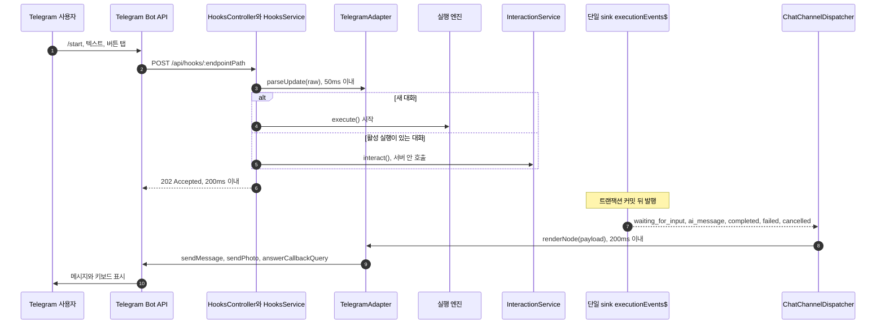

> 구현 상태: 부분 구현 · 원문: `spec/5-system/15-chat-channel.md` (Overview, §3 처리 흐름, §5–§8, Rationale), `spec/4-nodes/7-trigger/providers/_overview.md` · 용어: [용어 사전](../CLE-GLOSSARY.md)

## 개요

채팅 채널(Chat Channel, `config.chatChannel`)은 워크플로우를 Telegram·Slack·Discord 같은 외부 메신저 봇 위에서 챗봇처럼 돌리는 서버 쪽 어댑터 계층이다. 사용자는 봇 토큰(bot token, `botToken`)만 등록한다. 메신저에서 들어온 update 를 워크플로우 입력으로 바꾸는 일과 워크플로우 응답을 메신저 메시지로 바꾸는 일은 모두 채널 어댑터(`ChatChannelAdapter`)가 맡는다.

[External Interaction API](../CLE-IX/CLE-EIA.md) 는 웹훅, EIA 알림 웹훅, REST·SSE 표면을 제공한다. 하지만 외부 메신저와 붙이려면 사용자가 변환 계층을 직접 운영해야 한다. 채팅 채널은 그 변환 계층을 서버 안에 두고 EIA 의 소비자로 격리한 편의 계층이다. 새 트리거 유형을 만들지 않고 [웹훅](../CLE-TRIG/CLE-TRIG-WEBHOOK.md) 트리거의 `config.chatChannel` 옵션 하나로 동작한다.

이 문서는 채팅 채널의 요구사항, 처리 흐름, 인증과 보안, 봇 토큰 재발급 API, 인바운드 HTTP 응답 계약, EIA 와의 관계, 채널 프로바이더(`provider`) 카탈로그를 정한다.

다음 주제는 다른 문서가 정한다.

- `Trigger.config.chatChannel` 필드, 안내 문구(`languageHints`) 기본값, 트리거 컬럼, 채널 대화 상태(`ChannelConversation`), Redis 키, 데이터 흐름은 [채팅 채널 데이터와 흐름](CLE-CHAT-DATA.md) 이 정한다.
- 어댑터 함수 시그니처, 입출력 타입, 이벤트별 렌더 매핑, 실행 실패 안내 분류 알고리즘, Form 입력 흐름은 [채팅 채널 어댑터 규약](CLE-CHAT-ADAPTER.md) 이 정한다.
- 메신저별 API 호출, 명령, UI 매핑은 [Telegram 어댑터](CLE-CHAT-TELEGRAM.md), [Slack 어댑터](CLE-CHAT-SLACK.md), [Discord 어댑터](CLE-CHAT-DISCORD.md) 가 정한다.
- 웹채팅 위젯은 채팅 채널 모듈을 거치지 않는다. [웹채팅](../CLE-WEBCHAT/CLE-WEBCHAT.md) 을 본다.

## 사용 시나리오

| 시나리오 | 설명 |
|---|---|
| 텔레그램 봇 위의 AI 어시스턴트 | 사용자가 `/start` 를 보내면 워크플로우가 시작된다. 멀티턴 AI 노드와 자연스럽게 대화한 뒤 결과를 안내한다 |
| 텔레그램 봇 위의 결재 흐름 | 사용자가 메시지를 보내면 워크플로우가 Form 노드로 필드마다 질문하고 마지막에 결과를 알린다 |
| 텔레그램 봇 위의 데이터 시각화 | 사용자 명령에 워크플로우가 Chart·Table·Carousel 을 렌더한다. v1 은 MarkdownV2 monospace 텍스트와 선택 버튼이고 v2 는 SSR PNG `sendPhoto` 다 |

## 요구사항

### 어댑터 라이프사이클

- REQ-CHAT-001 WHEN 웹훅 트리거에 `config.chatChannel` 이 있으면 THE SYSTEM SHALL `provider` 값으로 채널 어댑터를 고른다. (원본: CCH-AD-01)
- REQ-CHAT-002 WHEN 채팅 채널 트리거를 새로 만들거나 `chatChannel` 이 실린 일반 PATCH 를 받으면 THE SYSTEM SHALL 채널 어댑터의 `setupChannel()` 을 자동으로 부른다. (원본: CCH-AD-02)
- REQ-CHAT-003 WHEN 채팅 채널 트리거를 활성화하면 THE SYSTEM SHALL 채널 어댑터의 `setupChannel()` 을 자동으로 부른다. (원본: CCH-AD-02) (부분 구현)
- REQ-CHAT-004 WHEN 채팅 채널 트리거를 삭제하면 THE SYSTEM SHALL 채널 어댑터의 `teardownChannel()` 을 자동으로 부른다. (원본: CCH-AD-03)
- REQ-CHAT-005 WHEN 채팅 채널 트리거를 비활성화하면 THE SYSTEM SHALL 채널 어댑터의 `teardownChannel()` 을 자동으로 부른다. (원본: CCH-AD-03) (부분 구현)
- REQ-CHAT-006 WHEN `config.chatChannel` 이 있는 트리거로 `POST /api/hooks/:endpointPath` 요청이 오면 THE SYSTEM SHALL raw body 를 `parseUpdate(raw)` 로 워크플로우 입력으로 바꾸고 `parseUpdate`, 트리거 조회, `202 Accepted` 반환 순서로 처리해 웹훅 200ms 응답 시한을 지킨다. (원본: CCH-AD-04)
- REQ-CHAT-007 WHILE 서버가 동작하는 동안 THE SYSTEM SHALL `ChatChannelDispatcher` 가 단일 sink `WebsocketService.executionEvents$` 를 `onModuleInit` 에서 직접 구독해 `execution.waiting_for_input`·`execution.ai_message`·`execution.completed`·`execution.failed`·`execution.cancelled` 를 `renderNode()` 와 `sendMessage()` 로 넘기게 한다. (원본: CCH-AD-05)
- REQ-CHAT-008 WHEN 메신저에서 인터랙션 응답(답장, 버튼 탭, 다단계 Form 답변)이 오면 THE SYSTEM SHALL HTTP 표면을 거치지 않고 `InteractionService.interact(ctx, dto)` 를 서버 안에서 직접 부른다. (원본: CCH-AD-06)
- REQ-CHAT-009 WHEN 표시 전용 Presentation 노드(`carousel`·`table`·`chart`·`template`)가 끝나 `execution.node.completed` 가 발행되면 THE SYSTEM SHALL 채팅 채널 내부 listener 로 그 결과를 받아 채널에 보낸다. (원본: CCH-AD-07)
- REQ-CHAT-010 IF Presentation 노드가 버튼 때문에 입력 대기(`outputData.status === 'waiting_for_input'`)로 들어갔으면 THE SYSTEM SHALL 그 노드의 `execution.node.completed` 를 걸러 입력 대기 이벤트 흐름으로만 보낸다. (원본: CCH-AD-07)

### 대화 매핑

- REQ-CHAT-011 WHEN 채널에서 대화가 시작되면 THE SYSTEM SHALL `(provider, conversationKey)` 를 채널 대화 상태 하나에 1:1 로 잇는다. (원본: CCH-CV-01)
- REQ-CHAT-012 WHEN 대화의 첫 메시지나 `/start` 명령이 오면 THE SYSTEM SHALL 채널 대화 상태를 만들고 워크플로우의 새 실행을 시작한다. (원본: CCH-CV-02)
- REQ-CHAT-013 WHEN 같은 대화의 다음 메시지가 오고 활성 실행이 입력 대기(`waiting_for_input`)이면 THE SYSTEM SHALL 그 메시지를 재개 명령으로 전달한다. (원본: CCH-CV-03)
- REQ-CHAT-014 WHEN 같은 대화의 다음 메시지가 오고 활성 실행이 `running` 이나 `pending` 이면 THE SYSTEM SHALL `languageHints.executionStillRunning` 안내를 보내고 update 를 큐에 쌓지 않고 버린 뒤 `202` 로 응답한다. (원본: CCH-CV-03)
- REQ-CHAT-015 WHEN 같은 대화의 다음 메시지가 오고 실행이 `completed`·`failed`·`cancelled` 이거나 대화가 없으면 THE SYSTEM SHALL 새 실행을 시작한다. (원본: CCH-CV-03)
- REQ-CHAT-016 WHEN 채널 대화를 저장하면 THE SYSTEM SHALL 채널 사용자 키(`channelUserKey`)를 대화 스레드가 아니라 Redis 채널 대화 상태에만 둔다. (원본: CCH-CV-04)
- REQ-CHAT-017 IF group·supergroup·channel 대화의 update 가 오면 THE SYSTEM SHALL `parseUpdate` 가 `null` 을 돌려주게 하고 호출자(`HooksService`)가 `languageHints.groupChatRefusal` 안내를 따로 보낸 뒤 update 를 버린다. (원본: CCH-CV-05)

### 노드와 채널 UI 매핑

- REQ-CHAT-018 WHEN `execution.ai_message` 가 오면 THE SYSTEM SHALL 메시지를 프로바이더 길이 한도에 맞춰 나눈 텍스트 메시지 1건 이상으로 보낸다. (원본: CCH-MP-01)
- REQ-CHAT-019 WHEN `execution.ai_message` 의 `presentations[]` 가 비어 있지 않으면 THE SYSTEM SHALL 텍스트 뒤에 표시물마다 v1 fallback 메시지를 하나씩 순서대로 `await` 하며 보내고 `Promise.all` 로 동시에 보내지 않는다. (원본: CCH-MP-01)
- REQ-CHAT-020 WHEN `presentations[*].type === 'form'`(`render_form`)이면 THE SYSTEM SHALL 필드 목록과 답변 안내를 담은 v1 임시 텍스트로 보낸다. (원본: CCH-MP-01)
- REQ-CHAT-021 WHEN 버튼 대기(`interactionType=buttons`)의 `execution.waiting_for_input` 이 오면 THE SYSTEM SHALL 채널의 인라인 키보드로 바꾸고 탭을 `click_button` 명령으로 전달한다. (원본: CCH-MP-02)
- REQ-CHAT-022 WHEN Form 대기(`interactionType=form`)의 `execution.waiting_for_input` 이 오면 THE SYSTEM SHALL 폼 모드 조건에 따라 네이티브 모달 하나나 다단계 질문으로 입력을 받는다. (원본: CCH-MP-03)
- REQ-CHAT-023 IF Form 제출 검증이 실패하면 THE SYSTEM SHALL 틀린 필드만 다시 묻거나 모달에 에러를 다시 표시한다. (원본: CCH-MP-03)
- REQ-CHAT-024 WHEN 시각형 노드(Carousel·Chart·Table)의 `execution.waiting_for_input` 이 오면 THE SYSTEM SHALL `uiMapping.visualNode` 값에 따라 채널 메시지로 바꾸고 v1 에서는 MarkdownV2 텍스트·monospace 표현으로 보낸다. (원본: CCH-MP-04)
- REQ-CHAT-025 IF v1 에서 `visualNode` 가 `photo` 이면 THE SYSTEM SHALL 텍스트로 대신 보내고 warning 로그를 남기며 채널 건강도(`chat_channel_health`)는 바꾸지 않는다. (원본: CCH-MP-04)
- REQ-CHAT-026 WHEN `visualNode` 가 `auto` 이고 Carousel 카드에 이미지 URL 이 있으면 THE SYSTEM SHALL 그 카드를 이미지 메시지로 보낸다. (원본: CCH-MP-04) (미구현)
- REQ-CHAT-027 WHEN `visualNode` 가 `photo` 나 `auto` 이면 THE SYSTEM SHALL v2 에서 어댑터가 원본 데이터로 만든 SSR PNG 이미지를 보낸다. (원본: CCH-MP-04) (미구현)
- REQ-CHAT-028 WHEN 채널에서 Form 필드를 물으면 THE SYSTEM SHALL 필드 `type` 에 맞는 키보드 힌트(숫자 키패드, 연락처 공유, 파일 업로드 안내)를 붙이고 해당 키보드가 없으면 일반 텍스트 입력을 쓴다. (원본: CCH-MP-05) (부분 구현)
- REQ-CHAT-029 WHEN 표시 전용 Presentation 노드의 `execution.node.completed` 가 오면 THE SYSTEM SHALL 시각형은 `visualNode` 분기로, Template 은 `output.output.rendered` 텍스트로 채널 메시지를 보낸다. (원본: CCH-MP-06)
- REQ-CHAT-030 WHEN 노드 결과 텍스트를 채널에 보내면 THE SYSTEM SHALL 이벤트 발행 단계에서 자격 증명 패턴을 `***` 로 가린 값을 어댑터에서 따로 가공하지 않고 보낸다. (원본: CCH-MP-06)

### 신뢰성과 보안

- REQ-CHAT-031 WHEN 채널 어댑터가 외부 API(`sendMessage` 등)를 부르면 THE SYSTEM SHALL 5초 타임아웃과 지수 백오프로 총 3회까지 시도한다. (원본: CCH-SE-01)
- REQ-CHAT-032 IF 외부 API 호출이 끝내 실패하면 THE SYSTEM SHALL 트리거의 `chat_channel_health` 를 `degraded` 로 바꾸고 트리거를 자동으로 비활성화하지 않는다. (원본: CCH-SE-01)
- REQ-CHAT-033 WHEN 인바운드 update 가 들어오면 THE SYSTEM SHALL 프로바이더 update id 로 만든 중복 제거 키(`idempotencyKey`)가 30초 안에 다시 오면 그 update 를 무시한다. (원본: CCH-SE-02)
- REQ-CHAT-034 IF 중복 제거에 쓰는 Redis 를 쓸 수 없으면 THE SYSTEM SHALL 중복 제거 없이 update 를 통과시킨다. (원본: CCH-SE-02)
- REQ-CHAT-035 WHEN 봇 토큰과 인바운드 서명 자료(`inboundSigning`)를 저장하면 THE SYSTEM SHALL `SecretResolver` 가 관리하는 시크릿 저장소에 AES-256-GCM 으로 암호화해 두고 `config.chatChannel` 에는 시크릿 참조(`botTokenRef`·`inboundSigningRef`)만 둔다. (원본: CCH-SE-03)
- REQ-CHAT-036 WHEN 봇 토큰 재발급(`POST /api/triggers/:id/chat-channel/rotate-bot-token`)이 성공하면 THE SYSTEM SHALL 24시간 유예 동안 옛 봇 토큰도 함께 받는다. (원본: CCH-SE-04)
- REQ-CHAT-037 WHEN 봇 토큰 재발급 뒤 24시간이 지나면 THE SYSTEM SHALL 매시간 도는 `ChatChannelTokenRotatorService` 가 v2 참조의 시크릿 저장소 행을 지우고 `chat_channel_token_v2`·`chat_channel_rotated_at` 을 NULL 로 만든다. (원본: CCH-SE-04-C)

### 실행 실패 안내

- REQ-CHAT-038 WHEN `execution.failed` 를 받으면 THE SYSTEM SHALL 실행 실패 안내 분류(`classifyExecutionFailure`) 결과 키로 `languageHints[key]` 를 찾아 자리표시자를 채운 텍스트 메시지 1건을 보낸다. (원본: CCH-ERR-01)
- REQ-CHAT-039 IF `languageHints[key]` 가 설정되지 않았으면 THE SYSTEM SHALL `languageLocale` 의 기본 문구를 쓰고 locale 이 없으면 `ko` 를 쓴다. (원본: CCH-ERR-01)
- REQ-CHAT-040 WHEN 실패를 분류하면 THE SYSTEM SHALL `error.code` 와 `error.details.statusCode` 두 필드만 분류 입력으로 쓴다. (원본: CCH-ERR-02)
- REQ-CHAT-041 WHEN 실패 안내를 만들거나 기록하면 THE SYSTEM SHALL `error.message` 원문, `details.url`·`details.endpoint`·`details.query`·`details.stack`, `nodeId`·`executionId`·`workflowId` 를 메시지 본문, `info` 이상 로그, metric 어디에도 넣지 않는다. (원본: CCH-ERR-03)
- REQ-CHAT-042 IF `error.code` 가 분류 표에 없거나 `null` 이면 THE SYSTEM SHALL `executionFailedInternal` 로 안내하고 `level=warn` 구조화 로그를 남긴다. (원본: CCH-ERR-04)
- REQ-CHAT-043 IF 실패 안내 발송이 끝내 실패하면 THE SYSTEM SHALL 추가 안내를 시도하지 않고 로그만 남긴다. (원본: CCH-ERR-05)

### 비기능

- REQ-CHAT-044 WHEN 인바운드 update 를 변환하면 THE SYSTEM SHALL `parseUpdate` 부터 워크플로우 입력까지 평균 50ms 안에 끝낸다. (원본: CCH-NF-01)
- REQ-CHAT-045 WHEN 단일 sink 에서 이벤트를 받으면 THE SYSTEM SHALL 채널 `sendMessage` 호출까지 평균 200ms 안에 끝낸다. (원본: CCH-NF-02)
- REQ-CHAT-046 IF 대화 하나의 인바운드가 분당 한도(`rateLimitPerMinute`, 기본 60, 1–600)를 넘으면 THE SYSTEM SHALL 넘친 update 를 쌓거나 다시 보내지 않고 `202`·`{ executionId: 'ignored' }` 로 건너뛴 뒤 `chat_channel_health` 를 `degraded` 로 바꾼다. (원본: CCH-NF-03)
- REQ-CHAT-047 IF 분당 한도 카운터용 Redis 를 쓸 수 없으면 THE SYSTEM SHALL 한도를 적용하지 않고 정상 처리한다. (원본: CCH-NF-03)

### 봇 토큰과 PATCH

- REQ-CHAT-048 IF PATCH 본문에 `config.chatChannel.botTokenRef` 나 `config.chatChannel.botToken` 이 있으면 THE SYSTEM SHALL `400 VALIDATION_ERROR` 로 거부한다. (원본: 15-chat-channel §5.4.1)
- REQ-CHAT-049 IF `chatChannel` 이 없는 트리거에 PATCH 로 `chatChannel` 을 붙이려 하면 THE SYSTEM SHALL `400 VALIDATION_ERROR`(`details.field='chatChannel'`)로 거부한다. (원본: 15-chat-channel §5.4.1.2)
- REQ-CHAT-050 IF PATCH 가 `provider` 를 다른 값으로 바꾸려 하면 THE SYSTEM SHALL `400 VALIDATION_ERROR`(`details.field='provider'`)로 거부한다. (원본: 15-chat-channel §5.4.1.2)
- REQ-CHAT-051 IF PATCH 본문에 `config.chatChannel.inboundSigningPlaintext` 나 `inboundSigning` 이 있으면 THE SYSTEM SHALL `400 VALIDATION_ERROR` 로 거부한다. (원본: 15-chat-channel §5.4.1.1)
- REQ-CHAT-052 WHEN `chatChannel` 이 실린 PATCH 를 처리하면 THE SYSTEM SHALL 시크릿 저장소의 봇 토큰과 Slack·Discord 인바운드 서명 값을 바꾸지 않는다. (원본: 15-chat-channel §5.4.1, R-CC-21)
- REQ-CHAT-053 WHEN Telegram 트리거의 `setupChannel()` 이 새 `secret_token` 을 발급하면 THE SYSTEM SHALL 그 값을 `inboundSigningRef` 에 다시 저장한다. (원본: 15-chat-channel §5.4.1.1)
- REQ-CHAT-054 WHEN `GET /api/triggers/:id` 가 채팅 채널 설정을 돌려주면 THE SYSTEM SHALL `hasBotToken` 파생 필드만 싣고 `botTokenRef` 와 `botToken` 평문은 싣지 않는다. (원본: 15-chat-channel §5.4.2)
- REQ-CHAT-055 IF 봇 토큰 재발급 중 `setupChannel` 이 실패하면 THE SYSTEM SHALL 자격 증명 거부는 `400 BOT_TOKEN_INVALID`, 그 밖은 `502 CHAT_CHANNEL_SETUP_FAILED` 로 돌려주고 프로바이더 원문은 응답에 싣지 않는다. (원본: 15-chat-channel §5.4, R-CC-23)

### 인바운드 HTTP

- REQ-CHAT-056 WHEN 채팅 채널 경로의 웹훅 요청을 처리하면 THE SYSTEM SHALL 인증 실패(`401`), 엔드포인트 미존재(`404`), 프로바이더별 응답 예외를 뺀 모든 경우에 `202 Accepted` 로 응답한다. (원본: 15-chat-channel §5.5, R-CC-12)
- REQ-CHAT-057 WHEN 비활성 채팅 채널 트리거에 update 가 오면 THE SYSTEM SHALL 인바운드 서명을 먼저 검증하고 통과하면 `202`·`{ executionId: 'ignored' }` 로 조용히 버린다. (원본: 15-chat-channel §5.5, WH-EP-07)
- REQ-CHAT-058 IF 프로바이더가 특정 응답 형식만 성공으로 인정하고 그 사유와 응답 본문이 프로바이더 문서에 적혀 있으면 THE SYSTEM SHALL 그 경우에만 `202` 대신 `200 OK` 응답을 허용한다. (원본: 15-chat-channel §5.5.1)

### 요구사항 보충 설명

- 관련 REQ-CHAT-001: 지원 목록은 [채널 프로바이더 카탈로그](#채널-프로바이더-카탈로그) 가 정한다(v1: `telegram`·`slack`·`discord`).
- 관련 REQ-CHAT-002~005: 세 경로의 기준은 [봇 토큰 변경 단일 경로](#봇-토큰-변경-단일-경로) 다. `setupChannel()` 은 멱등이라 다시 불러도 된다(R8). Telegram 은 이때 `setWebhook` 을 부른다. 활성화·비활성화 때의 호출은 정의가 갈린다. [미결 사항](#미결-사항) 참조.
- 관련 REQ-CHAT-007·008: [단일 sink 구독](#단일-sink-구독) 과 [인증과 보안](#인증과-보안) 참조.
- 관련 REQ-CHAT-009·010: 이 listener 는 채팅 채널 안에서만 쓰며 EIA 알림 웹훅 이벤트 허용 목록(다섯 가지)은 그대로다. 커밋 뒤 호출(EIA-RL-04)과 트리거 단위 레지스트리 가드(R8)가 그대로 적용된다. 입력 타입은 [채팅 채널 어댑터 규약](CLE-CHAT-ADAPTER.md) 의 `ChatChannelInternalEvent` 다.
- 관련 REQ-CHAT-014: 기본 문구는 "워크플로우가 처리 중입니다. 잠시만 기다려 주세요." 이고 한국어 기본값만 있다. 현재 구현은 `HooksService.getActiveExecutionStatus` 가 종결 전 상태를 돌려주고, 입력 대기일 때만 전달한다. `running`·`pending` 이면 `sendExecutionStillRunningNotice` 로 안내하고 `{ executionId: 'ignored' }` 로 끝낸다. 세 갈래 모두 구현됐다.
- 관련 REQ-CHAT-017: 안내 발송 책임은 어댑터가 아니라 호출자에 있다. `parseUpdate` 는 부수 효과 없는 계약을 지킨다.
- 관련 REQ-CHAT-018~020: `presentations?: PresentationPayload[]` 는 AI 에이전트가 표시 도구(`render_*`)를 부른 턴에만 실린다([AI 에이전트 노드 출력과 디버그](../CLE-NODE-AI/CLE-NODE-AGENT-OUTPUT.md)). 표시 전용 네 가지는 REQ-CHAT-024 의 v1 fallback 을 다시 쓴다. `render_form` 텍스트는 v2 네이티브 모달·Mini App 전까지의 임시 정책이다. 디버그 전용 `llmCalls` 는 fanout 에서 지워져 dispatcher 에 오지 않으므로 변환은 `message`·`presentations` 만 쓴다([WebSocket 이벤트와 명령](../CLE-API/CLE-API-WS-EVENTS.md)).
- 관련 REQ-CHAT-022·023: 폼 모드 조건과 흐름은 [채팅 채널 어댑터 규약](CLE-CHAT-ADAPTER.md) 이 정한다. 네이티브 모달은 모달 지원 프로바이더(`supportsNativeForm`), 모든 필드가 모달 수용 타입, 필드 5개 이하, `formMode ≠ multi_step` 일 때만 쓴다(Slack `views.open`, Discord MODAL). 그 밖(Telegram, 6개 이상, 미수용 타입, `multi_step`)은 필드마다 묻는 다단계 질문이다. 틀린 필드만 다시 묻는 동작은 EIA-RL-03(검증 실패 시 입력 대기 유지)에 기댄다.
- 관련 REQ-CHAT-024~027: `visualNode` 는 `"text" | "photo" | "auto"`, 기본 `"auto"` 다. v1 에서 Chart 는 monospace 미니 막대 차트, Table 은 열을 맞춘 monospace 표(행 상한), Carousel 은 카드 N장을 차례로 보낸다. `text` 는 이미지 URL 을 무시한다. v2 는 `output.rendered` 스냅샷이 폐기된 뒤라 어댑터가 원본 데이터로 SSR 을 맡는다. 매트릭스는 [Telegram 어댑터](CLE-CHAT-TELEGRAM.md) 가 정한다. REQ-CHAT-026 은 세 프로바이더 모두 현재 텍스트 카드만 보낸다(Telegram·Discord 문서는 Planned, Slack 은 렌더러 코드 기준). `text` 에서 시각 메시지를 실제로 보내는지는 [미결 사항](#미결-사항) 참조. 버튼 달린 Template 도 이 대상에 넣을지는 [Template 노드 §미결 사항](../CLE-NODE-PRES/CLE-NODE-TEMPLATE.md#미결-사항) 에서 정한다.
- 관련 REQ-CHAT-028: `phone` → 연락처 공유(`share_contact`)는 미구현이다. Form 의 `validation.preset`(ValidationPreset)이 [Form 노드](../CLE-NODE-PRES/CLE-NODE-FORM.md) 기준 아직 없어 동작하지 않는다.
- 관련 REQ-CHAT-029·030: wire `output` 은 [노드 출력](../CLE-NODE/CLE-NODE-OUTPUT.md)(`NodeHandlerOutput`) 전체라 도메인 값은 `output.output` 에 있다. "따로 가공하지 않는다" 는 DB 원문과 같다는 뜻이 아니다. 발행 시점에 자격 증명 패턴이 `***` 로 바뀌므로 `Bearer …` 같은 텍스트는 채널에서도 가려져 보인다([응답 자격 증명 마스킹](../CLE-API/CLE-API-EGRESS.md)). REQ-CHAT-019·024 도 같고, `execution.ai_message` 가 이미 받아들인 trade-off 와 같은 방향이다.
- 관련 REQ-CHAT-031·032: 대기 간격은 1초, 2초 두 번이고 세 번째 실패 뒤에는 기다리지 않는다. `degraded` 로 바꾸는 경로는 외부 API 호출 실패와 분당 한도 초과(REQ-CHAT-046) 두 가지이며 둘 다 자동 비활성화하지 않는다(웹훅 WH-MG-04, EIA-NX-07 과 같은 정책).
- 관련 REQ-CHAT-033·034: 서비스는 `ChatChannelDedupService` 다. 키·TTL·게이트 순서는 [채팅 채널 데이터와 흐름](CLE-CHAT-DATA.md) 이 정한다. Redis 가 없는 동안에는 중복 처리가 생길 수 있다.
- 관련 REQ-CHAT-035: 참조 형식은 `secret://triggers/{triggerId}/bot-token`·`secret://triggers/{triggerId}/inbound-signing` 이고 DB 에는 암호문(BYTEA)만 남는다([시크릿 저장소](../CLE-INT/CLE-INT-SECRET.md)).
- 관련 REQ-CHAT-036·037: Telegram 은 재발급 때 `setWebhook` 을 다시 부른다. 정리 스케줄러는 BullMQ repeatable 이고 `NotificationSecretRotatorService` 와 같은 패턴이다. 재발급은 primary 참조를 바로 새 토큰으로 바꾸고 v2 참조(`bot-token.v2`)에 옛 토큰을 24시간 백업한다. v2 를 primary 로 올리는 단계는 없다(CCH-SE-04-C).
- 관련 REQ-CHAT-046·047: 카운터는 대화 단위 fixed-window 다. `PublicWebhookQuotaService` 와 같은 `INCR`+`EXPIRE` pipeline 을 별도 키에 써서 여러 서버 인스턴스에서도 정확하다. 60 은 Telegram group rate limit 과 맞춘 값이고, 초과 안내 메시지는 v1 범위 밖이다. 현재 구현은 `ChatChannelRateLimiterService.consume` 이 세고 `HooksService.handleChatChannelWebhook` 이 `parseUpdate`·중복 제거 게이트 뒤에 확인하며, 이미 `degraded` 면 다시 쓰지 않는다(`markChatChannelRateLimited`).

## 처리 흐름

### 전체 시퀀스

Telegram 을 예로 든 전체 흐름이다. 인바운드는 웹훅 요청을 받자마자 `202` 로 답하고, 아웃바운드는 트랜잭션 커밋 뒤 단일 sink 에서 나온 이벤트를 받아 보낸다.



새 대화로 실행을 시작할 때 채팅 채널 경로는 트리거 파라미터 해석(`resolveTriggerParameters`)을 거치지 않고 `parameters: {}` 와 `chatChannel` 키(`provider`·`conversationKey`·`channelUserKey`)로 실행한다(현재 구현, `hooks.service.ts`). 필수 파라미터를 요구하는 워크플로우에서 이 동작을 정책으로 둘지는 [트리거 노드 공통 §미결 사항](../CLE-NODE-TRIG/CLE-NODE-TRIG-COMMON.md#미결-사항) 에서 다룬다.

`execution.failed` 는 `classifyExecutionFailure()`(어댑터 규약의 순수 함수)로 키를 고른 뒤 `languageHints[key]` 에 `{statusCode}` 를 채우고, 그다음은 다른 이벤트와 같이 `renderNode()` → `sendMessage()` 경로를 탄다.

### 단일 sink 구독

`ChatChannelDispatcher` 는 `onModuleInit` 에서 실행 엔진의 단일 sink `WebsocketService.executionEvents$`(RxJS Subject)를 직접 구독한다. 이 Subject 에 값을 넣는 발행 함수는 `WebsocketService.emitToExecution` 이다. dispatcher 는 EIA 알림 웹훅 발송기(`NotificationDispatcher`), SSE 어댑터와 같은 facade 계층의 형제 listener 이고 그 하위 소비자가 아니다. 같은 프로세스 안에서는 Redis pub/sub 을 거치지 않는다. EIA 알림 웹훅과 채널 발송은 같은 단일 sink 에서 커밋 뒤 fan-out 되므로 둘 다 EIA-RL-04(트랜잭션 커밋 뒤 발송)를 지킨다. 어댑터는 엔진 내부 코드를 부르지 않는다. 이 추가 facade 사용은 [External Interaction API](../CLE-IX/CLE-EIA.md) R10 이 허용하며, SSE 어댑터의 구독 방식(현재 서버 안 직접 구독, Redis pub/sub 경유는 Planned)도 R10 이 정한다.

## 실행 실패 안내

`execution.failed` 를 받으면 어댑터는 채널 사용자에게 일반 안내 메시지 1건을 보낸다. 분류 알고리즘과 입력 허용 목록은 [채팅 채널 어댑터 규약](CLE-CHAT-ADAPTER.md) 이 정한다. 안내 키 여섯 개의 한국어·영어 기본 문구는 [채팅 채널 데이터와 흐름](CLE-CHAT-DATA.md) 이 정한다.

- 허용 자리표시자는 `{statusCode}` 한 가지다. 정수라서 개인정보나 비밀이 아니다.
- 책임은 어댑터 규약의 구분을 따른다. 분류 함수 호출과 문구 합성은 `renderNode`(순수 함수)가 맡고, 재시도와 타임아웃은 `sendMessage`(부수 효과)가 맡는다.
- 안내 발송이 끝내 실패하면 REQ-CHAT-032 의 일반 정책에 따라 `chat_channel_health` 가 `degraded` 가 된다. 이때 원인은 `sendMessage` 의 외부 API 호출 실패다. `execution.failed` 를 받은 것 자체는 건강도를 바꾸지 않는다(R-CC-15 (d)).

실행 실패 안내 정책과 어댑터 외부 API 호출 실패(REQ-CHAT-031·032)는 뜻이 다르다. 앞쪽의 자원은 실행 결과의 `output.error.code`(엔진·노드 핸들러 결과)이고, 뒤쪽의 자원은 `chat_channel_health`(어댑터 외부 호출 상태)다.

## 인증과 보안

- **웹훅 진입점**: 채팅 채널 경로는 [외부 호출 인증 설정](../CLE-TRIG/CLE-TRIG-AUTHCFG.md)(AuthConfig) 인증 대신 프로바이더별 인바운드 서명을 검증한다. Telegram 은 HMAC 을 지원하지 않아 `setWebhook` 때 `secret_token` 을 등록하고 `X-Telegram-Bot-Api-Secret-Token` 헤더로 검증한다. Slack 은 `X-Slack-Signature`, Discord 는 `X-Signature-Ed25519` 다. 세부는 프로바이더 문서가 정한다.
- **EIA 인바운드 facade**: 어댑터는 EIA 외부 토큰(`iext_*`, `itk_*`) 발급을 건너뛰고 `InteractionService.interact(ctx: InteractionRequestContext, dto: InteractDto)` 를 서버 안에서 직접 부른다. 근거는 내부 신뢰 호출(`in_process_trusted`) 예외 EIA-AU-08 이고, EIA HTTP 표면은 외부 클라이언트 전용이다.
- **접근 제어**: 이 우회는 서버 안 신뢰 호출자에게만 열리고 외부 HTTP 경로는 구조상 닿을 수 없다. `InteractionRequestContext` 판별 union(`isInternalCtx()`)과 "HTTP guard 의 ctx 는 `scope === undefined`" 불변식은 [External Interaction API](../CLE-IX/CLE-EIA.md) 가 정하고 컴파일러가 강제하므로 여기 다시 적지 않는다. `scope` 는 신뢰 영역을 나타내며 토큰 종류(`tokenFamily`)와 뜻이 다르다.
- **SSRF**: 아웃바운드 URL 은 프로바이더마다 고정(예: `api.telegram.org`)이라 사용자가 정하는 URL 이 아니다. EIA SSRF 허용 목록(EIA-NX-10)과 따로 간다.
- **EIA R5(외부 WebSocket 보류)**: 채널 어댑터는 외부 표면을 더하지 않는 서버 안 구독자라 R5 재논의 조건과 관계없다.

## 봇 토큰 재발급 API

`POST /api/triggers/:id/chat-channel/rotate-bot-token` 은 봇 토큰 재발급(`rotate-bot-token`)의 유일한 경로다(REQ-CHAT-036).

요청 본문은 다음과 같다.

```jsonc
{
  "newBotToken": "<bot-father-issued-token>"   // 필수. 새 봇 토큰
}
```

성공 응답(200 OK)은 [HTTP API 규약](../CLE-API/CLE-API-CONV.md) 의 `{ data }` 응답 봉투와 `TransformInterceptor` 를 따른다. `rotateBotToken`(`triggers.service.ts`)은 `rotatedAt` 과 함께 `triggerId`, `chatChannelHealth`(`setupChannel` 재호출 결과, 성공하면 `'healthy'`), `botIdentity`(`setupChannel` 의 `configUpdates.botIdentity` 로 갱신한 getMe 캐시, 돌려주지 않는 프로바이더는 `null`)를 싣는다.

```jsonc
{
  "data": {
    "rotatedAt": "<ISO8601>",
    "triggerId": "<trigger-uuid>",
    "chatChannelHealth": "healthy",          // 'unknown' | 'healthy' | 'degraded'
    "botIdentity": { "botId": 123, "username": "mybot" }  // 또는 null
  }
}
```

실패 응답은 `{ error: { code, message, details? } }` 에러 응답 봉투를 따른다([에러 응답과 클라이언트 처리](../CLE-API/CLE-API-ERROR.md)).

| HTTP | error.code | 사유 |
|---|---|---|
| 404 | `RESOURCE_NOT_FOUND` | 트리거가 없거나 워크스페이스 권한이 없다(`findById`). 재발급 도중 트리거가 삭제돼(워크플로우·워크스페이스 삭제의 FK CASCADE 포함, advisory lock 으로 못 막는다) 잠금 안 병합 쓰기가 0행에 맞은 경우도 같다([트리거 관리](../CLE-TRIG/CLE-TRIG-MANAGE.md) 동시 쓰기 직렬화) |
| 400 | `INVALID_BOT_TOKEN` | `newBotToken` 이 없거나 문자열이 아니다(controller 입력 검증) |
| 400 | `WORKSPACE_ID_REQUIRED` | `X-Workspace-Id` 헤더와 JWT `workspaceId` 가 둘 다 없다(공용 `@WorkspaceId()`) |
| 400 | `VALIDATION_ERROR` | `X-Workspace-Id` 헤더가 있으나 UUID 가 아니다(공용 헬퍼 `workspace-context.util.ts` 가 먼저 거부). 헤더가 없는 경우와 다르다. PATCH 본문 필드 거부의 같은 코드와도 다른 경우다 |
| 400 | `CHAT_CHANNEL_NOT_CONFIGURED` | `config.chatChannel` 이 없는 트리거 |
| 400 | `CHAT_CHANNEL_PROVIDER_UNKNOWN` | 레지스트리에 없는 프로바이더 |
| 400 | `CHAT_CHANNEL_ENDPOINT_REQUIRED` | 트리거에 `endpointPath` 가 없다 |
| 400 | `BOT_TOKEN_INVALID` | `setupChannel` 이 자격 증명 거부로 실패했다. 신호가 401/403 이든 `{ok:false, error:'invalid_auth'}`(HTTP 200)든 `verify_key` 불일치든 같은 분류이고, 어댑터가 `code` 로 선언한다([채팅 채널 어댑터 규약](CLE-CHAT-ADAPTER.md), R-CC-23) |
| 502 | `CHAT_CHANNEL_SETUP_FAILED` | 그 밖의 `setupChannel` 실패(프로바이더 5xx, 네트워크, 타임아웃). 클라이언트가 입력으로 고칠 수 없고 재시도 뒤에도 실패한 경우다. 우리 인프라 일시 장애인 `503` 과 구분한다 |

실패 응답에는 프로바이더 원문을 싣지 않는다. `message` 는 고정 문자열이고 `code` 가 판별자이며, 원본 문구는 서버 로그에만 남긴다. 에러 원문은 URL, query, DB 컬럼명, stack, API 키 조각을 흘릴 수 있다([실행 엔진 개요와 그래프 순회](../CLE-EXEC/CLE-EXEC-ENGINE.md) 의 보안 게이트, R-CC-15).

24시간 유예는 `chat_channel_token_v2` 컬럼과 `setWebhook` 재호출(Telegram)로 구현한다. 컬럼과 정리 흐름은 [채팅 채널 데이터와 흐름](CLE-CHAT-DATA.md) 이 정한다.

## 봇 토큰 변경 단일 경로

봇 토큰의 신규 등록과 변경은 한 경로로 모은다.

| 시점 | 방식 | 토큰 변화 |
|---|---|---|
| 트리거 생성(`POST /api/triggers`) | 요청 본문의 `config.chatChannel.botToken` 평문을 `SecretResolver.rotate()`(UPSERT)로 저장하고 참조로 바꾼다. `setupChannel()` 의 부수 효과로 `botTokenRef` 가 생긴다. `setupChannel()` 은 생성·활성화·`chatChannel` PATCH 세 경로에서 다시 불리는 멱등 함수라서, 중복이면 에러를 던지는 `store()` 로는 두 번째 호출부터 깨진다([시크릿 저장소](../CLE-INT/CLE-INT-SECRET.md)) | 처음 한 번 |
| 트리거 활성화(`PATCH /api/triggers/:id` 본문 `{ isActive: true }`) | 기존 `botTokenRef` 로 `setupChannel()` 을 다시 부른다. 이 재호출이 실제로 일어나는지는 정의가 갈린다. [미결 사항](#미결-사항) 을 본다 | 변경 없음 |
| 토큰 변경 | 늘 [봇 토큰 재발급 API](#봇-토큰-재발급-api) 만 쓴다. PATCH 본문의 `config.chatChannel.botTokenRef`(참조)와 `config.chatChannel.botToken`(평문)은 모두 `400 VALIDATION_ERROR` 다. `details.field` 의 모양은 아래 표를 본다 | 24시간 유예 적용 |
| `chatChannel` 이 실린 PATCH(`uiMapping`, `rateLimitPerMinute` 등 편집) | `setupChannel()` 을 다시 불러 프로바이더 등록만 갱신한다. 시크릿 저장소의 봇 토큰은 바꾸지 않아 요청 전후 값이 같다. `botTokenRef` 는 설정에서 보존되는 것이 아니라 트리거 id 에서 다시 만든다(`buildSecretRef`). 이 행은 봇 토큰만 다룬다. 인바운드 서명 자료는 [인바운드 서명 자료 변경](#인바운드-서명-자료-변경) 을 본다 | 변경 없음 |

PATCH 가 비밀 필드를 거부할 때 `details.field` 모양은 보낸 값의 형태에 따라 갈린다. 두 갈래 모두 `details[].code='INVALID_FIELD'` 를 싣는다. 이 동작은 단위 테스트(`trigger-dto-validation.spec.ts`)로 확인했고 HTTP 왕복은 아직 e2e 로 확인하지 않았다.

| 보낸 값 | 거부하는 층 | `details.field` | `details` 모양 |
|---|---|---|---|
| 비어 있지 않은 문자열 | 전역 `CustomValidationPipe` | 중첩 경로 `chatChannel.<field>` | 배열 |
| `null` 이나 `''` | `@IsEmpty()` 를 통과한 뒤 서비스 가드 | 평평한 `<field>` | 단일 object |

`details.field` 의 기준을 하나로 고르지 않는 것은 확정된 설계다. DTO 선언(전역 파이프)과 서비스 가드는 서로 다른 입력을 받으므로, 하나를 고르면 다른 입력에서 문서가 틀리게 된다.

PATCH 로 토큰 값을 바꾸면 다음 피해가 생긴다. (a) 외부 프로바이더(Telegram)에 등록된 웹훅은 그대로라 수신이 바로 끊긴다. (b) 재발급 API 의 24시간 유예 정책과 어긋난다. (c) 감사 로그가 `trigger.updated` 와 `trigger.chat_channel_bot_token_rotated` 로 섞인다. 그래서 한 경로만 둔다. 차단 기준은 필드 이름이 아니라 "PATCH 요청자가 자기 비밀로 값을 바꾸는가" 다. 프로바이더가 등록 동작의 일부로 강제하는 재발급(Telegram `secret_token`)은 이 기준의 대상이 아니다. 근거는 R-CC-10 과 R-CC-21 에 있다.

트리거 목록 화면의 PATCH 설명에는 "`config.chatChannel.botTokenRef`·`botToken` 은 PATCH 로 바꿀 수 없고 재발급 API 를 쓴다" 는 안내가 붙는다([트리거 관리](../CLE-TRIG/CLE-TRIG-MANAGE.md)).

### 채팅 채널 부착과 프로바이더 변경

위 표는 봇 토큰만 다룬다. PATCH 가 거부하는 나머지 두 경우는 다음과 같다.

| 시도 | 응답 | 이유 |
|---|---|---|
| `chatChannel` 이 없는 트리거에 PATCH 로 나중에 붙이기 | `400 VALIDATION_ERROR`(`details.field='chatChannel'`) | 최초 설정은 생성(`POST /api/triggers`) 때만 한다. PATCH 는 비밀을 받지 않으므로(R-CC-21) 채널을 새로 붙일 방법이 없다 |
| `provider` 를 다른 값으로 바꾸기 | `400 VALIDATION_ERROR`(`details.field='provider'`) | `botTokenRef` 는 트리거 id 로만 다시 만들어지므로 그 참조 뒤의 평문은 여전히 옛 프로바이더의 토큰이다. 새 어댑터가 그 토큰으로 외부 API 를 부르게 된다. 바꾸려면 트리거를 지우고 다시 만든다([트리거 관리](../CLE-TRIG/CLE-TRIG-MANAGE.md)) |

두 제약은 R-CC-21(PATCH 는 비밀을 받지 않는다)에서 저절로 따라 나온 것이라 새 결정이 아니다. 나중에 붙이기를 막지 않으면 `setupChannel` 이 반드시 실패하고, 그 실패가 REQ-CHAT-032 의 실패 흡수에 묻혀 `chatChannelHealth='degraded'` 로 200 이 된다. 사용자에게는 저장된 것처럼 보이는데 봇은 죽어 있게 된다. 명시적 400 이 이 조용한 실패를 막는다.

최상위 코드는 기존 `VALIDATION_ERROR` 를 다시 쓰므로 [에러 코드 규약과 카탈로그](../CLE-API/CLE-API-ERRCODES.md) 에 새로 올릴 코드는 없다. `details[].code` 는 두 경우 모두 `INVALID_FIELD` 다([HTTP API 규약](../CLE-API/CLE-API-CONV.md) 의 "`field` 를 실으면 `code` 도 싣는다"). 최상위가 이미 도메인 코드인 자리(`authConfigId` 의 `AUTH_CONFIG_NOT_FOUND`)의 판정은 HTTP API 규약의 판별 기준을 따르며 이 두 경우와 관계없다.

### 인바운드 서명 자료 변경

Slack signing secret 과 Discord ed25519 public key 는 프로바이더가 발급하고 서버에 저장하는 인바운드 서명 자료다. 변경 정책은 다음과 같다.

| 시점 | 방식 | 비고 |
|---|---|---|
| 트리거 생성(`POST /api/triggers`) | 요청 본문의 `chatChannel.inboundSigningPlaintext` 평문을 `SecretResolver.rotate(inboundSigningRef, ws, plaintext)` 로 저장하고 본문에서 지운다. 설정에는 `inboundSigningRef` 만 둔다(SS-SE-01) | 처음 한 번 |
| 트리거 활성화(`PATCH` 본문 `{ isActive: true }`) | Slack·Discord 는 기존 `inboundSigningRef` 를 그대로 쓴다. Telegram 은 아래 행을 본다. 재호출이 실제로 일어나는지는 [미결 사항](#미결-사항) 을 본다 | 변경 없음 |
| 변경(Slack·Discord) | v1 에서 정하지 않았다. PATCH 본문의 `config.chatChannel.inboundSigningPlaintext`·`inboundSigning` 은 `400 VALIDATION_ERROR` 로 막는다. 생성(POST)에서만 받는다. `chatChannel` 이 실린 PATCH 는 저장된 서명 값을 바꾸지 않는다. 바꾸려면 트리거를 지우고 다시 만든다. `details.field` 모양은 봇 토큰과 같다 | v2 에서 따로 결정 |
| Telegram(서버 발급) | `setupChannel()` 이 불릴 때마다 `randomBytes` 로 새 값을 만들어 `setWebhook` 의 `secret_token` 으로 등록하고, 호출자가 그 값을 `inboundSigningRef` 에 다시 저장한다. 따라서 `chatChannel` 이 실린 PATCH 는 Telegram 의 서명 값을 바꾼다. 이것은 우회가 아니라 프로바이더 등록과 한 동작이다. 저장을 건너뛰면 인바운드 서명 검증이 모두 깨진다(헤더 불일치로 401). 기준은 [Telegram 어댑터](CLE-CHAT-TELEGRAM.md) 다 | v1·v2 결정 대상이 아니다 |

현재 구현은 위 표와 같다. PATCH 는 `inboundSigningPlaintext`·`inboundSigning` 을 400 으로 거부한다.

v1 에서 막는 이유는 다음과 같다. 봇 토큰 단일 경로(R-CC-10)와 자원 성격이 달라 같은 패턴을 그대로 쓰지 않는다.

- 봇 토큰은 외부 프로바이더(Telegram BotFather, Slack OAuth, Discord Developer Portal)에 등록된 토큰이다. PATCH 로 바꾸면 외부 등록 토큰과 바로 어긋나므로 단일 경로와 24시간 유예가 정당하다.
- 인바운드 서명 자료는 외부 프로바이더가 발급하지만 우리 쪽에는 저장만 된다. 프로바이더가 회전 API 를 주지 않거나(Slack signing secret 은 수동 재발급 뒤 사용자가 다시 입력) 회전이 사용자 워크플로우 밖에서 일어난다.
- v1 은 변경 빈도가 낮다고 본다. 재발급 API 를 새로 만드는 비용(24시간 유예, revoke, 감사)을 사용 빈도로 확인한 뒤 v2 에서 정한다. 그동안은 보수적으로 막아 정책 모호성을 피한다.

v2 결정 후보는 Slack·Discord 의 프로바이더 발급 서명 자료에만 해당한다. Telegram 의 서버 발급 자료는 포함하지 않는다.

- (A) 봇 토큰 단일 경로 패턴을 그대로 쓴다. `POST /api/triggers/:id/chat-channel/rotate-inbound-signing` 을 새로 만든다.
- (B) PATCH 본문을 허용한다(유예 없이 바로 교체). 외부 프로바이더가 유예를 주지 않으므로 우리 쪽 유예도 의미가 없다.
- (C) 트리거 삭제·재생성을 강제한다(v1 과 같다). UX 부담은 있지만 단순하다.

## 응답 파생 필드 hasBotToken

`GET /api/triggers/:id` 응답의 `config.chatChannel` 에는 `hasBotToken: boolean` 파생 필드가 들어간다.

- 규칙: `botTokenRef` 가 NULL 이 아니면 `true`, 아니면 `false` 다.
- 용도: 화면이 "재발급" 버튼을 켤지 "신규 등록" 폼을 보여 줄지 판단한다.
- 위치: 응답 DTO 전용 파생 필드다. DB 컬럼이 아니고 어댑터 규약의 메모리 표현 `ChatChannelConfig` 에도 넣지 않는다. 변환은 백엔드 response interceptor 가 맡는다.
- 보안: `botTokenRef` 자체와 `botToken` 평문은 응답에 절대 싣지 않는다. 화면은 참조가 있는지만 알면 된다. 응답 비노출 규범의 기준은 [시크릿 저장소](../CLE-INT/CLE-INT-SECRET.md) 다.

## 인바운드 HTTP 응답 계약

`config.chatChannel` 이 설정된 트리거의 `POST /api/hooks/:endpointPath` 응답 정책은 아래 표로 정한다. `chatChannel` 이 없는 일반 웹훅 경로는 [웹훅](../CLE-TRIG/CLE-TRIG-WEBHOOK.md) 을 따른다. 두 경로의 응답 정책을 나눈 것은 프로바이더 특성 차이 때문이다(R-CC-12).

| 경우 | HTTP | 본문 | 어댑터 동작 |
|---|---|---|---|
| 1:1 대화, 정상 update(새 실행 시작) | `202 Accepted` | `{ executionId }`(웹훅 처리 흐름과 같은 형식) | 실행 시작 |
| 1:1 대화, 정상 update(기존 실행에 전달) | `202 Accepted` | `{ executionId }`(활성 실행 id) | `InteractionService.interact` 호출, 새 실행 없음 |
| group·supergroup·channel 대화 | `202 Accepted` | `{ executionId: 'ignored' }` | `languageHints.groupChatRefusal` 안내 발송 |
| 봇이 보낸 메시지(`from.is_bot === true`, Slack `bot_id`, Discord `member.user.bot === true`) | `202 Accepted` | `{ executionId: 'ignored' }` | 조용히 건너뜀 |
| `parseUpdate` 가 지원하지 않는 update | `202 Accepted` | `{ executionId: 'ignored' }` | 조용히 건너뜀(웹훅 처리 흐름과 같다) |
| 대화 단위 분당 한도 초과 | `202 Accepted` | `{ executionId: 'ignored' }` | `rateLimitPerMinute`(기본 60)를 넘으면 쌓거나 다시 보내지 않고 건너뛴 뒤 `chat_channel_health=degraded`(REQ-CHAT-046, R-CC-19). 안내 메시지는 v1 범위 밖 |
| 비활성 트리거 | `202 Accepted` | `{ executionId: 'ignored' }` | `HooksService.handle` 의 채팅 채널 분기가 비활성 검사보다 먼저 돌고, `handleChatChannelWebhook` 이 서명 검증(`chatChannelInboundAuthenticator.verify`)을 먼저 한 뒤 비활성이면 조용히 건너뛴다. 서명이 틀리면 401(WH-EP-07 채팅 채널 예외, R-CC-12 (d)) |
| 트리거 없음(잘못된 `endpointPath`) | `404 Not Found` | 표준 에러 응답 봉투 | 일반 경로와 같다(WH-RS-02). 2xx 로 답하면 낡은 웹훅이 계속 남는다 |
| 웹훅 인증 실패(Telegram `X-Telegram-Bot-Api-Secret-Token`, Slack `X-Slack-Signature`, Discord `X-Signature-Ed25519` 누락·불일치) | `401 Unauthorized` | 표준 에러 응답 봉투 | WH-SC-04 와 같다. 비활성 트리거도 인증한다 |
| 어댑터 내부 에러(`sendMessage` 실패 등) | `202 Accepted` | 실패 단계에 따라 `{ executionId: 'ignored' }` 나 `{ executionId }` | 백그라운드 처리, `chat_channel_health='degraded'`. 외부 API 호출 실패 영역이고 실행 실패 안내는 [실행 실패 안내](#실행-실패-안내-1) 를 본다 |
| Slack URL Verification(`type: "url_verification"`) | `200 OK` | `{ challenge: <받은 값> }` JSON | 프로바이더별 예외. Slack 이 challenge 를 응답에서 꺼내야 한다([Slack 어댑터](CLE-CHAT-SLACK.md)) |
| Slack Interactivity ack(`payload.type ∈ {block_actions, view_submission, ...}`) | `200 OK` | 빈 body 나 `{ response_action }` | 프로바이더별 예외. Slack 의 3초 ack 시한이고 `202` 를 인정하지 않는다 |
| Discord PING(`type: 1`) | `200 OK` | `{ type: 1 }` JSON | 프로바이더별 예외. Interactions endpoint 등록 때 1회, 그 뒤 주기적으로 온다([Discord 어댑터](CLE-CHAT-DISCORD.md)) |
| Discord Interactivity ack(`type ∈ {2, 3, 5}`) | `200 OK` | `{ type: 5 \| 6 }`(DEFERRED)나 `{ type: 4, data: {...} }`(즉시) | 프로바이더별 예외. Discord 의 3초 ack 시한 |

에러 응답 봉투 형식(`{ error: { code, message, details? } }`)은 [HTTP API 규약](../CLE-API/CLE-API-CONV.md) 이 정한다.

새 실행을 만들지 않은 경우의 본문은 `{ ignored: true }` 가 아니라 `executionId` 에 표시 문자열을 넣은 `{ executionId: 'ignored' }` 다(`state?.executionId ?? 'ignored'`). 기존 실행에 전달한 경우는 활성 실행 id 를 돌려준다. 웹훅 문서의 처리 흐름이 이 인증 방식과 맞지 않는 점은 [미결 사항](#미결-사항) 을 본다.

### 프로바이더별 응답 예외

`202 Accepted` 고정 정책의 예외(Slack URL Verification, Slack Interactivity ack, Discord PING, Discord Interactivity ack)는 다음 두 조건을 모두 만족할 때만 허용한다.

1. 프로바이더가 특정 응답 형식만 성공으로 인정한다. Telegram 처럼 2xx 면 무엇이든 되는 경우가 아니다.
2. 프로바이더 문서 본문에 사유와 응답 본문 형식이 적혀 있다.

예외를 새로 더하려면 프로바이더 문서와 위 표를 함께 고친다.

## EIA 와의 관계

| EIA 요구사항 | 채팅 채널에서의 해석 |
|---|---|
| EIA-NX-*(EIA 알림 웹훅) | 어댑터는 서버 안 구독자다. HTTP POST 와 HMAC 검증 단계를 거치지 않는다(네트워크 왕복 없음). `seq` 정렬과 `X-Clemvion-Delivery` 중복 제거를 어댑터가 하는지는 정의가 갈린다. [미결 사항](#미결-사항) 을 본다 |
| EIA-IN-*(인바운드 인터랙션) | 어댑터는 서버 안 호출자다. `submit_form`·`click_button`·`submit_message`·`end_conversation`·`cancel` 다섯 명령은 같다 |
| EIA-AU-*(인증) | 어댑터는 외부 토큰(`iext_*`, `itk_*`) 발급·검증을 건너뛴다. EIA-AU-08 예외 조항을 쓴다. EIA HTTP 표면은 외부 클라이언트 전용이다 |
| EIA-RL-*(신뢰성) | 그대로 적용한다. 특히 EIA-RL-03(Form 검증 실패 시 입력 대기 유지)이 틀린 필드만 다시 묻는 동작의 바탕이다 |
| EIA-NF-*(비기능) | 어댑터 단계가 하나 더 붙는다(REQ-CHAT-044·045). 채널 외부 API 호출이 더해지므로 EIA 비기능 위에 어댑터 비기능이 쌓인다 |

## 채널 프로바이더 카탈로그

웹훅 트리거의 `config.chatChannel.provider` 로 고를 수 있는 외부 메신저 목록이다. 각 프로바이더의 API 매핑, UI 매핑, 명령 처리는 프로바이더 문서가 정한다.

### 지원 프로바이더(v1)

`supported` 는 프로바이더 문서, 어댑터 구현체, 레지스트리 등록, e2e 테스트를 모두 마친 상태다.

| provider 식별자 | 문서 | 상태 |
|---|---|---|
| `telegram` | [Telegram 어댑터](CLE-CHAT-TELEGRAM.md) | supported (v1) |
| `slack` | [Slack 어댑터](CLE-CHAT-SLACK.md) | supported (v1) |
| `discord` | [Discord 어댑터](CLE-CHAT-DISCORD.md) | supported (v1) |

### 명세만 있는 프로바이더

문서는 있으나 어댑터 구현체가 아직 등록되지 않은 프로바이더다. v1 에서는 없다.

### 향후 후보(문서 없음)

사용자 요청이 있으면 문서부터 만든다.

- `kakao-talk`: 카카오 i 오픈빌더와 채널 채팅
- `whatsapp`: WhatsApp Business Cloud API

### 새 프로바이더 추가 절차

1. 문서 작성: 기존 프로바이더 문서와 같은 구성(개요, API 호출 매핑, 명령 매핑, 노드 UI 매핑, 보안, 명령 처리, 비기능, Rationale)으로 쓴다. 이 카탈로그의 "명세만 있는 프로바이더" 에 올린다.
2. 구현: 어댑터 구현, 레지스트리 등록, e2e 테스트를 마친다. 등록 절차는 [채팅 채널 어댑터 규약](CLE-CHAT-ADAPTER.md) 의 어댑터 레지스트리를 따른다.
3. 지원 승격: "명세만 있는 프로바이더" 에서 빼고 "지원 프로바이더" 에 `supported (v1)` 로 올린다. 프로바이더 문서의 구현 위치에 코드 경로를 적는다.

### provider 식별자 규칙

- 소문자
- kebab-case(단어 사이 `-`)
- 외부 플랫폼 브랜드를 알아보기 쉽게 쓴다(예: `telegram`, `kakao-talk`, `whatsapp`)

`provider` 문자열의 기준은 위 지원 목록과 어댑터 구현체의 `ChatChannelAdapter.provider` 필드다.

## 호환성

- `Trigger.config.chatChannel` 이 없으면 일반 웹훅 트리거다. 기존 트리거에는 영향이 없다.
- `chat_channel_*` 컬럼 5개를 더했다. NOT NULL 컬럼에는 DEFAULT 가 있어 기존 행에 영향이 없다.
- `POST /api/triggers/:id/chat-channel/rotate-bot-token` 을 더했다. 기존 엔드포인트는 바뀌지 않았다.
- 내부 `InteractionService.interact()` 의 시그니처는 그대로다. `InteractionRequestContext` 는 판별 union 이며 타입 정의는 [External Interaction API](../CLE-IX/CLE-EIA.md) 가 정한다. 외부 HTTP guard 의 ctx 조립은 바뀌지 않았다.
- `ChatChannelDispatcher` 가 기존 단일 sink `WebsocketService.executionEvents$` 를 하나 더 구독한다(`onModuleInit`). 기존 sink, EIA 알림 웹훅 발송기, SSE 발송 경로는 바뀌지 않는다. listener 가 늘었을 뿐 새 sink 는 없다.

## 미결 사항

- **트리거 활성화·비활성화 때 setupChannel·teardownChannel 호출**: REQ-CHAT-003·005(CCH-AD-02/03), [채팅 채널 어댑터 규약](CLE-CHAT-ADAPTER.md), [트리거 관리](../CLE-TRIG/CLE-TRIG-MANAGE.md) 는 활성화 때 setup, 비활성화 때 teardown 을 부른다고 적었다. 원문 §5.4.1 표는 순수 `isActive` 토글이 setup 을 타지 않을 수 있다고 적었고, 인바운드 응답 계약은 비활성 트리거에도 update 가 와서 `202` 로 버린다고 정한다(비활성화 때 웹훅을 해제했다면 오지 않는다). 현재 구현(`TriggersService.update`)은 본문에 `chatChannel` 이 있을 때만 setup 을 부르고 teardown 은 삭제와 `chatChannel` 제거 때만 부른다. [채팅 채널 데이터와 흐름](CLE-CHAT-DATA.md) 도 최초 setup 을 생성 때로만 적는다. 현행 동작을 기준으로 할지 요구사항대로 구현할지 결정 필요.
- **`revokeBotToken` 호출 시점**: [채팅 채널 어댑터 규약](CLE-CHAT-ADAPTER.md) 은 재발급 시점에 `rotateBotToken` 이 이전 토큰을 revoke 한다고 적었고, [채팅 채널 데이터와 흐름](CLE-CHAT-DATA.md)·[Slack 어댑터](CLE-CHAT-SLACK.md) 는 24시간 유예가 끝난 정리 작업에서 v2 토큰을 revoke 한다고 적었다. 즉시 revoke 하면 유예 창이 의미를 잃는다. 현재 구현은 정리 작업(`cleanupRotatedChatChannelTokens`)에서 부른다. 결정 필요.
- **활성 실행 중 `/start`·일반 메시지 처리**: CCH-CV-03 은 두 번째 이후 메시지를 실행 상태로만 나누고 `/start` 예외가 없다. 세 프로바이더 문서의 명령 처리 표는 활성 실행이 있어도 `/start` 면 기존 실행을 취소하고 새로 시작한다고 적었다. Slack 문서만 일반 DM 메시지도 취소 후 새로 시작한다고 적었는데, 같은 문서의 다른 절과 CCH-CV-03 은 DM 텍스트를 대기 노드로 전달한다. 현재 구현(`hooks.service`)은 `text_message` 를 전달하거나 처리 중 안내를 보낸다. 명령 우선 규칙을 여기 둘지 프로바이더 문서 소관으로 둘지 결정 필요.
- **`visualNode=text` 에서 시각 메시지 발송 여부**: REQ-CHAT-024 와 [Telegram 어댑터](CLE-CHAT-TELEGRAM.md) 매트릭스는 `text` 에서도 Chart·Table·Carousel 을 텍스트로 보낸다고 정한다(R-CC-11 (e) 는 "텍스트만" 을 뜻한다). 현재 구현(Telegram 렌더러)은 `visualNode !== 'text'` 일 때만 시각 메시지를 만들어, 버튼 대기에서 `text` 를 고르면 시각 내용이 빠진다. 결정 필요.
- **아웃바운드 `seq` 정렬과 `X-Clemvion-Delivery` 중복 제거**: 원문 §6 과 [채팅 채널 어댑터 규약](CLE-CHAT-ADAPTER.md) 은 어댑터가 이 둘을 내장한다고 적었다. 어댑터는 서버 안 `executionEvents$` 를 받으므로 웹훅 헤더 `X-Clemvion-Delivery` 가 없고, 데이터 흐름에도 그런 단계가 없다. 현재 구현(chat-channel 모듈)에서 해당 헤더 참조는 0건이고 `seq` 는 전달만 된다. 보장을 지울지 Planned 로 둘지 결정 필요.

## 구현 위치

- `codebase/backend/src/modules/chat-channel/**`: 모듈, 어댑터 레지스트리(`channel-adapter.registry.ts`), 트리거 단위 listener 레지스트리(`channel-listener.registry.ts`), dispatcher(`chat-channel.dispatcher.ts`), 인바운드 서명 검증(`chat-channel-inbound-authenticator.ts`), 중복 제거(`chat-channel-dedup.service.ts`), 분당 한도(`chat-channel-rate-limiter.service.ts`), 채널 대화 상태(`channel-conversation.service.ts`), `types.ts`, 공용 로직(`shared/execution-failure-classifier.ts`, `shared/form-mode.ts`, `shared/language-hint-defaults.ts`), 프로바이더별 adapter·client·parser·renderer(`providers/telegram/`, `providers/slack/`, `providers/discord/`, Slack·Discord 는 `*-signing.ts`·`*.types.ts` 추가)
- `codebase/backend/src/modules/triggers/chat-channel-*.ts`: `chat-channel-binder.service.ts`(어댑터 setup·teardown, 시크릿 쓰기와 참조 보존), `chat-channel-input-rules.ts`(입출력 도메인 규칙 순수 함수, R-CC-21 입력 규칙과 `translateSetupChannelError`), `chat-channel-rejection-messages.const.ts`(PATCH 금지 필드와 거부 문구의 단일 기준), `chat-channel-token-rotator.service.ts`(봇 토큰 정리 매시간 워커)
- `codebase/backend/src/modules/triggers/dto/**/chat-channel-*.dto.ts`: `chat-channel-config.dto.ts`(생성·수정 검증 분리), `responses/chat-channel-rotate-bot-token-response.dto.ts`
- `codebase/backend/src/modules/triggers/trigger-callback-url*.ts`: 웹훅 콜백 URL 조립 순수 함수
- `codebase/backend/src/modules/triggers/triggers.service.ts`(재발급·정리 오케스트레이션), `triggers.controller.ts`(`rotateBotToken` 엔드포인트), `dto/create-trigger.dto.ts`
- `codebase/backend/src/modules/hooks/hooks.service.ts`, `hooks.controller.ts`: `config.chatChannel` 분기
- `codebase/backend/test/chat-channel-slack.e2e-spec.ts`, `codebase/backend/test/chat-channel-discord.e2e-spec.ts`, `codebase/backend/test/chat-channel-trigger-create.e2e-spec.ts`
- `codebase/frontend/src/app/(main)/w/[slug]/triggers/page.tsx`, `codebase/frontend/src/components/triggers/trigger-detail-drawer.tsx`, `codebase/frontend/src/lib/i18n/dict/{ko,en}/triggers.ts`

`chat-channel/` 모듈은 `external-interaction/` 모듈과 같은 facade 계층이고 둘 다 엔진 밖이다. 후속 계획(미구현): Discord Gateway, Slack Socket Mode, 시각형 SSR PNG.

## Rationale

### R1 새 트리거 유형을 만들지 않는다

웹훅 트리거와 `chatChannel` 설정을 택했다. 트리거 유형(수동·웹훅·스케줄)은 그대로 두고 어댑터는 설정 한 갈래로 둔다. 사용자 멘탈 모델은 "Telegram 어댑터를 켠 웹훅 트리거" 다. 새 노드로 두면 트리거 종류가 늘고 웹훅 트리거와 90% 가 겹친다. 어댑터 인터페이스 없이 Telegram 을 1급 모듈로 두면 Slack·카카오를 더할 때 같은 모듈이 반복된다. 사용자가 명시한 입장이고 EIA facade 원칙과 맞다. 스케줄 트리거는 cron 으로 시작하므로 이 옵션을 쓰지 않는다.

### R2 채팅 채널을 EIA 의 소비자로만 둔다

EIA HTTP 표면을 새로 만들지 않고 서버 안 facade 호출만 쓴다. HTTP 왕복을 하나 줄여야 REQ-CHAT-045 의 200ms 에 들어가고, 신뢰 호출자라 토큰 발급·검증을 건너뛴다. 인바운드 명령 facade 하나가 외부 HTTP 와 서버 안 호출을 모두 받는다. 어댑터가 EIA HTTP 엔드포인트를 부르는 안은 같은 프로세스 안의 의미 없는 왕복과 토큰 부담이라 택하지 않았다.

### R3 v1 은 1:1 DM 만 지원한다

그룹 대화는 누가 답했는지 가려야 하는데 채널 대화 상태의 `channelUserKey` 는 사용자 한 명을 가정한다. v1 은 1:1 DM 만 받고 그룹은 명시적으로 거부한다. v2 에서 여러 사용자 대화를 도입할 때 다시 논의한다.

### R4 단일 sink 를 직접 구독한다

같은 프로세스 안에서는 외부 인프라 없이 가장 단순하고 단일 sink 가 이미 커밋 뒤 fan-out 진입점이다(`executionEvents$.subscribe(adapter.handle)`). Redis pub/sub 은 같은 프로세스 안에서 왕복 낭비이고, 커밋 뒤 hook 을 따로 두면 엔진의 단일 sink 정책을 어겨 어댑터가 엔진 코드를 알아야 한다. EIA R10 의 "엔진 밖 facade 한 곳, 단일 sink" 원칙을 지킨다.

### R5·R6 문서를 세 층으로 나눈다

| 문서 | 역할 |
|---|---|
| [채팅 채널 어댑터 규약](CLE-CHAT-ADAPTER.md) | 모든 프로바이더 어댑터가 따르는 함수 시그니처와 데이터 타입 계약 |
| 이 문서 | 시스템 동작, 라이프사이클, EIA 관계, 요구사항 |
| 프로바이더 문서 | 프로바이더별 API 매핑, 명령, UI 매핑 |

어댑터 규약은 노드 출력 규약·대화 스레드 규약처럼 "여러 구체 구현이 따르는 공통 계약" 층이다. Cafe24 의 형식 규약·노드 정의·endpoint 카탈로그 3분할([Cafe24 operation 메타데이터](CLE-C24-META), [Cafe24 노드](../CLE-NODE-INT/CLE-NODE-CAFE24.md))과 같은 구조다. 프로바이더 문서는 카탈로그와 Telegram 하나로 시작해 카탈로그를 갱신하며 늘렸다.

### R7 동사를 rotate-bot-token 으로 둔다

EIA `notification/rotate-secret`(알림 서명 시크릿 교체)과 자원이 달라 같은 동사는 헷갈린다. URL 만으로 자원을 알 수 있고 [HTTP API 규약](../CLE-API/CLE-API-CONV.md) 의 RPC 스타일(`/<resource>/<verb>-<noun>`)과 같다.

### R8 트리거 단위 listener 정책

fan-out 원천은 `executionEvents$` 이고 listener 는 셋이다. (1) `NotificationDispatcher`: EIA 알림 웹훅 HTTP POST. (2) SSE 어댑터: SSE fan-out, 구독 방식은 EIA R10 이 정한다. (3) `ChatChannelDispatcher`: 서버 안 구독, 채팅 채널 전담.

`ChatChannelDispatcher` 는 모듈 단위 1회 구독을 유지하면서 트리거 단위 `ChannelListenerRegistry` 로 다음을 보장한다.

- `setupChannel()` 때 같은 `triggerId` 항목이 있으면 덮어쓴다(멱등, 키는 `triggerId`, 값은 `(triggerId, provider)`). 프로바이더 변경은 지원하지 않고 재생성으로 처리한다.
- `teardownChannel()` 때와 트리거 행을 없애는 경로(트리거·워크플로우·워크스페이스 삭제의 행 삭제 전 외부 해제 단계, [트리거 관리](../CLE-TRIG/CLE-TRIG-MANAGE.md))에서 항목을 반드시 해제한다. 스케줄 트리거는 채팅 채널을 못 가져 등록되지 않는다.
- `handle()` 은 DB 조회 전에 `registry.has(triggerId)` 로 거르고 미등록 트리거는 조용히 건너뛴다.
- 재시작하면 `onApplicationBootstrap` 에서 `isActive=true AND config.chatChannel IS NOT NULL` 트리거를 한 번에 등록한다.

효과는 (a) 삭제 뒤 들어오는 이벤트 차단, (b) 재시작 직후 미등록 race 회피, (c) DB 왕복 절감이다. 라우팅은 여전히 `handle()` 안에서 한다. `executionEvents$` 를 EventEmitter 로 바꾸는 식의 분리는 범위 밖이다.

### R9 처리 중 메시지는 큐에 쌓지 않고 바로 안내한다

실행이 도는 중에 메시지가 오는 경우만 다룬다(분당 한도 초과는 R-CC-19). `running`·`pending` 은 보통 짧고 다음 입력은 대개 입력 대기 뒤에 온다. 큐에 쌓았다가 다시 보내면 (a) 노드가 기대하지 않은 시점에 입력이 들어오고 (b) 같은 메시지를 두 번 보낸 경우의 중복 제거 책임이 모호하다. 큐 TTL·폐기·순서 정렬도 필요해 v1 단순성과 맞지 않는다. 입력 대기까지 HTTP 연결을 잡아 두면 200ms 응답 시한과 부딪치고 Telegram 이 재시도를 쏟아낸다. "처리 중에 보낸 메시지는 다시 보낸다" 가 봇 UX 의 일반적 기대다. 입력 대기 직전 노드가 오래 걸릴 때 `sendChatAction(typing)` 을 주기적으로 보내는 방안은 v2 에서 검토한다.

### R-CC-10 봇 토큰 변경은 재발급 API 한 경로로만

토큰 변경은 늘 재발급 API 이고 PATCH 는 `botTokenRef`·`botToken` 을 모두 막는다(R-CC-21). Telegram 의 서버 발급 서명 자료는 대상이 아니다. PATCH 와 재발급을 함께 허용하는 웹훅 HMAC 시크릿 패턴(이후 폐기됐지만 "서버가 가진 비밀" 이라는 자원 성격 대조는 그대로다)과 결론이 다른 이유는 자원 위치다. HMAC 시크릿은 우리가 가진 비밀이지만 봇 토큰은 외부 프로바이더에 등록된 토큰이라 PATCH 로 바꾸면 우리 DB 만 바뀌고 수신이 바로 깨진다. 두 경로가 함께 있으면 24시간 유예 정책이 어긋나고 감사 로그가 섞이며, PATCH 만 두면 무중단 교체를 잃는다.

감사 action 은 `trigger.chat_channel_bot_token_rotated` 다. 한때 `chat-channel.rotate-bot-token` 으로 적혀 있었는데 `<resource>.<verb>` 구조, 밑줄 구분자, 과거분사 시제를 모두 어겼고 `chat-channel` resource 는 없다. 세 회전 엔드포인트가 모두 `/api/triggers/:id/…` 아래라 resource 는 `trigger` 다(2026-08-11 정정, [감사 action 명명](../CLE-OBS/CLE-OBS-AUDITNAME.md)).

### R-CC-11 uiMapping.visualNode 를 세 값으로 바꾼다

근거는 UI 매핑 규약과 함께 [채팅 채널 어댑터 규약](CLE-CHAT-ADAPTER.md) 의 Rationale 에 둔다.

### R-CC-12 인바운드 응답은 202 로 고정하고 401·404 만 예외로 둔다

웹훅 처리 흐름이 이미 `202` 를 기준으로 정해 일관성을 지킨다. `200` 을 새로 들이면 Telegram 에는 차이가 없는데 웹훅 문서도 고쳐야 한다. 일반 웹훅의 410 Gone(WH-EP-07)을 쓰면 프로바이더가 non-2xx 에 웹훅을 자동 비활성화하고 재시도를 쏟아낸다(Telegram Bot API 문서화 동작).

- (a) 202 는 WH-RS-01(웹훅 수신 응답 표준)과 맞다.
- (b) 일반 웹훅의 410 정책은 호출자가 사람이나 일반 HTTP 클라이언트라는 가정인데 채팅 채널 프로바이더는 그 가정에서 벗어난다.
- (c) 채팅 채널을 쓰지 않는 웹훅(Cafe24, 사용자 클라이언트)은 404·410 이 디버깅에 필요하므로 두 경로를 나눈다. 웹훅 문서의 "처리 흐름 분기만 정의" 범위 안이다.
- (d) 인증 실패 401: 조용한 2xx 는 무차별 대입 공격자에게 차이를 숨기는 이점이 있지만 운영자가 "봇이 왜 응답하지 않는지" 알려면 401 이 보여야 한다. Telegram 은 `secret_token` 실패에 재시도하지 않는다는 문서화 동작에 기대므로 재시도 폭주도 없다.
- (e) 404 는 일반 경로와 같다. 없는 엔드포인트에 2xx 로 답하면 낡은 웹훅이 끝없이 남는다(WH-RS-02).

현재 구현은 정상 update, 인증 실패, 404, 비활성 트리거 모두에서 이 정책과 같다.

[웹훅 §처리 흐름](../CLE-TRIG/CLE-TRIG-WEBHOOK.md#처리-흐름) 도 채팅 채널 분기를 활성 확인·인증 설정 인증보다 앞에 두고 provider 서명으로 검증하게 고쳐져, 두 문서가 인증 단계에서 갈린다던 미결을 닫았다.

### R-CC-13 Discord v1 은 CCH-MP-01 입력을 일부 미룬다

Discord v1 은 Interactions Webhook 만 써서 `MESSAGE_CREATE` 를 받지 못한다([Discord 어댑터](CLE-CHAT-DISCORD.md) R-D-3). 아웃바운드는 `POST /channels/{id}/messages` 로 `execution.ai_message` 와 `presentations[]` 를 보낼 수 있어 CCH-MP-01 을 모두 만족한다. 인바운드 답장은 (a) `/<prefix> reply <message>` slash command 나 (b) `Reply` 버튼 뒤의 Modal TEXT_INPUT 으로만 가능하고 일반 DM 텍스트는 받지 못한다. CCH-MP-01 정의는 바꾸지 않는다. 프로바이더가 의무를 채우는 방식의 차이이고 Discord 문서가 유예를 규범으로 적는다. 완전한 자연 대화는 v2 Gateway 때 해결된다. CCH-MP-01 에 "Gateway 없는 프로바이더는 모달·slash 허용" 예외를 넣으면 프로바이더 한계가 시스템 문서로 새어 나오고(R-D-9 와 같은 생각), v1 에 Gateway 를 들이면 R-D-3 의 기각 사유(오래 유지되는 연결 관리)가 그대로 적용된다.

### R-CC-15 실행 실패 안내의 입력과 자리표시자를 허용 목록으로 제한한다

`error.code` 와 `details.statusCode` 만 분류 입력으로 쓰고 자리표시자는 `{statusCode}` 하나만 둔다. 분류 결정과 메시지 본문 두 경로가 모두 허용 목록이 되고, 분류가 enum 이라 `switch` exhaustive check 로 정적 검증된다. `{statusCode}` 는 공개 정보인 정수다.

`error.message` 원문은 URL, query, DB 컬럼명, stack, API 키 일부를 흘릴 수 있다. 대표 사례는 `HTTP_TRANSPORT_FAILED` 의 `"ENOTFOUND api.internal.example.com"` 이다. 문서로 가림을 강제하려면 모든 노드 핸들러 message 를 감사해야 해 현실적이지 않다. `nodeId`·`nodeLabel` 은 작성자가 정한 내부 라벨이라 외부 사용자에게 의미가 없고 구조가 드러난다. `executionId` 는 UUID 라 입력하기 부담스럽고 `traceCode` 는 매핑 테이블이 필요해 후속 검토로 미룬다. 안내의 효용보다 누출 위험이 훨씬 크다. 자세한 정보는 운영자에게 묻고, 운영자는 백엔드 로그에서 원문을 본다.

- (a) 분류 입력 enum 의 기준은 [에러 코드 규약과 카탈로그](../CLE-API/CLE-API-ERRCODES.md) 이고 이 영역은 매핑 규칙만 정한다.
- (b) 알 수 없는 코드를 조용히 넘기지 않는 것은 새 노드 분류가 빠졌을 때 로그에서 바로 알기 위해서다.
- (c) 모르는 자리표시자(`{nodeId}` 등)는 DTO validator 가 등록 때 `400 VALIDATION_ERROR` 로 거부한다. `CustomValidationPipe.flattenErrors` 는 `details[].code` 를 모든 제약 위반에 `INVALID_FIELD` 로 고정하고, validator 의 `UNKNOWN_PLACEHOLDER:<field>:<placeholder>` 문자열을 `details[].message` 에 그대로 넣는다. 그래서 `UNKNOWN_PLACEHOLDER` 는 `details[].message` 접두로만 드러나고 최상위 코드 목록에는 올리지 않는다.
- (d) `chat_channel_health` 는 어댑터 외부 호출 실패 신호이고 실패 안내는 실행 실패 안내라 서로 직교한다. 안내 발송 자체가 끝내 실패하면 외부 호출 실패이므로 `degraded` 가 된다.
- (e) MCP 전용 에러 코드는 아직 없다. 생기면 분류 표에 행과 안내 키를 더하고, 입력 허용 목록은 그대로 쓴다.

### R-CC-16 표시 전용 Presentation 노드와 AI 표시물을 채널로 보낸다

(1) CCH-AD-07·CCH-MP-06 을 만들어 `execution.node.completed` 의 표시 전용 완료를 채팅 채널 내부 listener 로 받는다. EIA 알림 웹훅 허용 목록은 그대로라 외부 SDK 영향이 없다. (2) CCH-MP-01 을 보강해 `ai_message` 의 `presentations[]` 를 v1 fallback 으로 차례로 보낸다. 처음에는 표시 전용 네 가지만 대상이었고 R-CC-17 에서 `render_form` 을 더해 다섯 가지가 됐다.

EIA 알림 웹훅 허용 목록에 `node.completed` 를 더하는 안은 외부 SDK 에 깨지는 변경이라 과하다. 표시 전용 노드에 가짜 `continue` 버튼을 강제하면 본문만 보여 주는 UX 를 막는다. `render_*` 를 별도 이벤트로 보내면 같은 턴의 텍스트와 표시물의 도착 순서가 어긋날 수 있어 한 payload 에 담는다.

- (a) 새 함수 대신 `renderNode(event: EiaEvent | ChatChannelInternalEvent)` 로 시그니처만 넓힌다. 뒤에 생긴 필수 함수 `escapeControlText` 는 프로바이더별 escape 규칙 때문에 인정한 예외다(어댑터 규약 R-CCA-7).
- (b) 버튼 때문에 입력 대기로 들어간 노드는 버튼 대기 흐름이 처리하므로 미리 걸러 중복 발송을 막는다.
- (c) `render_form` 은 v1 에서 폼의 존재조차 알리지 못하면 메시지가 0건이라 임시 텍스트로 보낸다(R-CC-17).
- (d) 텍스트 → presentations[0] → presentations[1] 순서로 하나씩 `await` 한다. REQ-CHAT-045 의 200ms 는 시작 지연 기준이다.
- (e) 시각형 v1 fallback 은 [Telegram 어댑터](CLE-CHAT-TELEGRAM.md) 매트릭스를 다시 쓰고 v2 SSR PNG 는 대상이 아니다.
- (f) 발행 함수 `WebsocketService.emitToExecution` 은 커밋 뒤 불리고 그 값이 `executionEvents$` 로 나간다(EIA-RL-04). R8 가드가 그대로 적용된다.
- (g) listener 가 늘 뿐 새 sink 는 없다.

### R-CC-17 render_form v1 임시 텍스트와 렌더러 입력 모양

근거는 렌더 매핑과 함께 [채팅 채널 어댑터 규약](CLE-CHAT-ADAPTER.md) 의 Rationale 에 둔다.

### R-CC-18 rotate-bot-token 의 워크스페이스 검증은 공용 데코레이터로 한다

워크스페이스 문맥이 없으면 `400 WORKSPACE_ID_REQUIRED`(공용 `@WorkspaceId()`)다. 옛 구현은 헤더만 보고 `401 WORKSPACE_REQUIRED` 를 던졌다. 문맥 부재는 인증 실패가 아니고, JWT `workspaceId` fallback 을 놓쳤으며, 표준 코드 이름과 달라 클라이언트가 같은 조건을 두 번 나눠야 했다. 공용 데코레이터로 옮겨 셋을 함께 없앴다(PR #566). 옛 코드는 [에러 코드 규약과 카탈로그](../CLE-API/CLE-API-ERRCODES.md) 의 은퇴 코드에 올렸고, 클라이언트 하드코딩 분기가 없어 깨지는 영향은 없다.

### R-CC-19 분당 한도 초과분은 재발송 큐 대신 건너뛰고 degraded 로 표시한다

R9 는 한도 초과용 큐를 기각하지 않았고 두 경우를 나눴을 뿐이다. 이 결정은 한도 초과 안에서 큐와 건너뛰기를 고른다. (a) 200ms 응답 시한 때문에 인바운드를 동기로 쌓거나 잡아 둘 수 없고 Telegram 은 늦은 응답에 재시도를 쏟아낸다. (b) 재발송 버퍼는 입력 순서, 중복 제거, TTL·정렬 장치를 요구해 v1 에 비해 이득이 적다. 그래서 건너뛰고(`202 { executionId: 'ignored' }`) 가시성은 `degraded` 로 확보한다. fixed-window 와 Redis 는 `PublicWebhookQuotaService` 패턴을 다시 써서 일관되고 여러 인스턴스에서 정확하다. 분 경계 몰림은 fixed-window 의 표준 trade-off 로 받아들인다. Redis 가 없으면 통과시킨다. 한도는 방어 기능이라 없을 때 막기보다 통과가 안전하다. `degraded` 는 외부 호출 실패와 한도 초과가 함께 쓰는 "정상 범위를 벗어남" 신호이고 자동 비활성화 금지는 공통이다.

### R-CC-20 인바운드 중복 제거는 전용 서비스로 한다

원래 CCH-SE-02 는 "어댑터가 EIA `Idempotency-Key` 를 자동 발급한다" 여서 EIA HTTP `IdempotencyInterceptor` 가 막아 준다는 뜻으로 읽혔다. 채팅 채널 인바운드는 `scope: 'in_process_trusted'` 로 `InteractionService` 를 직접 불러 그 인터셉터를 지나지 않으므로 그 전제로는 누구도 중복을 막지 않는다. 실제로 `ChannelUpdate.idempotencyKey` 는 파서 셋이 채우기만 하고 읽는 곳이 없었다. 그래서 전용 `ChatChannelDedupService`(Redis `SET NX EX 30`, 키 `cc:dedup:{triggerId}:{idempotencyKey}`)를 둔다. `SET NX` 한 번이라 원자적이고 두 인스턴스가 동시에 받아도 하나만 통과한다. 위치는 `parseUpdate` 직후이자 분당 한도 앞이다. 재도착은 같은 트래픽이라 한도를 쓰면 안 된다. Redis 가 없으면 통과시키고 warn 을 남긴다. 프로바이더는 2xx 를 못 받으면 update 를 다시 보내므로(R-CC-12) 막지 않으면 같은 입력으로 워크플로우가 두 번 재개된다.

### R-CC-21 PATCH 는 비밀을 쓰지 않는다

이 항목은 R-CC-10 을 뒤집지 않는다. 여기서 "비밀" 은 `botToken` 과 Slack·Discord 의 `inboundSigningPlaintext` 두 가지다. Telegram 의 서버 발급 `issuedInboundSigning` 은 `setupChannel()` 이 새 `secret_token` 을 등록하므로 다시 저장해야 하며, 건너뛰면 인바운드가 모두 401 이 된다(2026-09-10 정정).

**우회의 모양.** 차단이 `botTokenRef` 라는 필드 이름에만 걸려 있었는데 값을 나르는 필드는 `botToken` 이었다. 이 필드는 PATCH·POST 공용 DTO 에서 필수였고, `chatChannel` 이 실린 PATCH 는 재발급의 24시간 유예 백업, 전용 감사 action, `chatChannelRotatedAt` 갱신을 모두 건너뛰고 시크릿 저장소를 덮어썼다. 인바운드 서명 자료도 같았다. 문서는 v1 변경 차단을 선언했지만 구현은 Slack·Discord 에서 `inboundSigningPlaintext` 가 없으면 400 으로 막아 PATCH 마다 금지된 변경을 강제했다(2026-09-10 에 구현을 맞췄다).

**처방의 함정.** "PATCH DTO 에서 `botToken` 을 뺀다" 만 하면 더 나쁘다. `setupChatChannel` 은 `secrets.rotate(botTokenRef, ws, cfg.botToken ?? '')` 를 조건 없이 실행하고 `SecretResolver.rotate` 에는 빈 값 가드가 없어, 필드가 없으면 빈 문자열로 토큰을 지운다. 이어지는 `setupChannel` 은 401 을 받아 조용히 `degraded` 가 된다. 당시에는 `botToken` 이 필수라 요청이 400 으로 막혀 이 일이 일어나지 않았다. 결함이 토큰을 지키고 있었던 셈이다. 그래서 D-1(필드를 받지 않는다)과 D-2(그 경로가 두 비밀을 쓰지 않는다)를 함께 정한다. 검증 함수가 생성·수정 경로에 공유돼 있어 차단을 거기 넣으면 Slack·Discord 생성이 깨지므로 PATCH 전용 경로를 나눠야 한다.

**기각한 대안.** `botToken` 을 선택 필드로 두고 무시하면 사용자가 설정했다고 믿은 비밀을 말없이 버린다. `SecretResolver.rotate` 에 빈 값 가드를 넣어 이 경로만 막으면 원인을 남긴다(그 가드는 다른 호출부를 위해 따로 검토한다). Telegram 도 `rotate-inbound-signing` 전용 API 로 나누는 안은 회전 주체가 Telegram 등록 동작이라 `setupChannel` 재호출 경로가 그대로 남는다. 어댑터가 기존 서명을 다시 쓰게 하는 안은 Slack·Discord 전용 v2 유예를 Telegram 에 미리 집행하고 Telegram 어댑터 문서와 어댑터 규약을 함께 뒤집는다. `chatChannel` PATCH 에서 `setupChannel` 을 아예 부르지 않는 안은 CCH-AD-02 멱등 전제를 깨고 `endpointPath` 변경의 웹훅 재등록을 끊는다.

**세 축.** 차단 기준은 "PATCH 요청자가 자기 비밀로 값을 바꾸는가" 다. 이 축은 봇 토큰과 인바운드 서명의 자원 성격 대조(외부 등록 여부)와 직교하고, "회전 주체가 누구인가" 축과도 직교한다. 회전 주체 축은 서버 발급(Telegram)·프로바이더 발급(Slack·Discord) 구분과 같다. v2 가 인바운드 서명 회전을 정해도 봇 토큰(R-CC-10 유지)과 Telegram 서버 발급 자료(우리 정책 대상이 아니고, 휩쓸면 서명 검증이 깨진다)에는 닿지 않는다. v2 후보 A·B·C 는 Slack·Discord 축 전용이다.

**`details[].code` 이력.** 서비스 가드 갈래는 한때 `code` 를 싣지 않았다(`#1314` 단위 테스트). `#1317`(2026-09-11)이 "`field` 를 실으면 `code` 도 싣는다" 를 배선해 지금은 두 갈래 모두 `INVALID_FIELD` 다.

### R-CC-22 triggers 모듈 안의 구현 경로를 글로브로 적는다

`#1317`·`#1319`·`#1320` 이 새 파일을 만들었는데 세 번 모두 구현 위치 목록에서 빠졌고, 빠진 파일이 8개까지 늘었다. 목록에 없으면 그 파일을 고친 변경이 이 문서와 대조되지 않는다. 이 결정을 내린 2026-09-11 에는 push 리뷰 가드가 목록에 걸린 파일의 변경에 구현 완료 검토를 요구했다. 2026-10-03 에 근거를 고쳐 적었다. 그 가드는 NERV 정본 전환 단계 2(NERV Task `CLE-T-4ABTG7`)에서 없어졌다. 지금은 일관성 검토의 `--impl-done` 을 돌리면 `## 구현 위치` 가 바뀐 파일을 덮는 문서가 검토 대상에 든다(NERV Task `CLE-T-VP5KDJ`). 이 실행을 강제하는 것은 없다. NERV done 게이트는 Task 에 묶인 consistency 라운드가 있고 통과했는지만 보고 그 라운드가 이 문서를 대상으로 했는지는 보지 않는다. 대조가 강제에서 절차로 약해졌어도 목록에서 빠진 파일이 대조에서 빠진다는 점은 같아서 결정을 유지한다. 늘어날 예정인 집합은 나열이 아니라 술어로 잡는다. 통째 글로브(`modules/triggers/**`)는 무관한 파일 17개를 끌어들였고, 좁은 글로브 셋은 의도한 파일을 정확히 덮었다(2026-09-11 10개, 2026-09-12 `dto/**` 로 넓힌 뒤 11개, 차집합 0). [스펙과 구현 근거 규약](../CLE-ENG/CLE-ENG-SPECEVIDENCE.md) 규칙 19 · 20 은 글로브를 허용하되 넓은 트리 글로브는 아무것도 가리키지 않는 것과 같다고 본다. 이 결정은 그 취지를 따른다. 결정을 내릴 때 그 취지는 옛 규칙 6 이었고 전환 단계 5 에서 규칙 19 로 옮겼다. 남는 위험은 없어진 파일을 가리키던 글로브가 다른 파일에 맞는 것이고 보완은 정기 커버리지 점검이다.

### R-CC-23 setupChannel 실패는 전송 방식이 아니라 원인으로 분류한다

기준을 "401/403 이면 `BOT_TOKEN_INVALID`" 에서 "자격 증명 거부면 `BOT_TOKEN_INVALID`, 그 밖이면 `502 CHAT_CHANNEL_SETUP_FAILED`" 로 바꾸고, 판별은 어댑터가 `code` 로 선언한다. 옛 술어 `/\b(401|403)\b/` 는 Slack(HTTP 200 과 `{ok:false, error:'invalid_auth'}`)과 Discord(`verify_key` 불일치, 상태 코드 없음)에서 걸리지 않고 Telegram(`HTTP {status}` 를 메시지에 싣는다)에서만 걸렸다(2026-09-12 실측). 그래서 가장 흔한 실패인 잘못된 토큰이 Slack 에서 "상류 고장" 으로 나가 사용자가 재시도만 반복했다.

4xx·5xx 경계는 누가 고칠 수 있는가로 정한다. 잘못된 토큰은 클라이언트가 고치므로 4xx, 프로바이더 장애는 재시도뿐이라 5xx 다. 전송 방식을 기준으로 삼으면 프로바이더가 방식을 바꿀 때 규칙이 조용히 틀린다. 실행 엔진의 "Redis 장애는 502 가 아니라 503" 결정과도 부딪치지 않는다. 503 사용처(`WEBAUTHN_DISABLED`, `SERVER_SHUTTING_DOWN`, `EXECUTION_ENQUEUE_FAILED`)는 모두 우리 쪽이고, 이 결정은 비어 있던 자리(외부 프로바이더 실패)를 채운다. 프로바이더 타임아웃은 두 축이 갈릴 수 있으나 지금은 재시도 뒤 일반 실패라 502 이고, 실제로 갈리면 그때 정한다. 502 는 이 저장소에서 처음 쓰여(2026-09-12 실측 0건) [HTTP API 규약](../CLE-API/CLE-API-CONV.md) 상태 코드 카탈로그와 [OpenAPI 문서화](../CLE-API/CLE-API-SWAGGER.md) 데코레이터 표에 행을 새로 둔다.

같은 때 문서는 502 인데 구현은 두 분기 모두 400 을 돌려주던 결함을 찾았다(테스트가 `getStatus()` 를 보지 않았다). `#1324` 가 `BadGatewayException` 배선, `details.reason` 제거, 상태 코드 확인을 마쳤다. 예전 구현은 `details.reason: message.slice(0, 256)` 으로 프로바이더 원문을 응답에 실었는데, 실행 엔진의 보안 게이트와 R-CC-15 가 막는 것과 같은 누출이라 멈췄다. 옛 "401/403 에서 드러난다" 서술이 세 문서에 복제돼 있던 것은 다시 적지 않고 링크로 바꿨다. 남은 401/403 message fallback 의 제거 조건은 [채팅 채널 어댑터 규약](CLE-CHAT-ADAPTER.md) 이 갖는다.

### 카탈로그를 v1 부터 둔 이유

프로바이더가 Telegram 하나뿐일 때도 카탈로그를 만들었다. 두 번째 프로바이더 때 카탈로그 도입을 미루면 빠뜨리기 쉽고, 미리 자리를 잡아 두면 갱신만 하면 된다. Cafe24 API 카탈로그와 같은 패턴이고 짧아서 비용도 거의 없다.

### 지원·명세만·후보 세 단계를 둔 이유

명세만 있는 프로바이더와 동작하는 프로바이더를 한 표에 두면 사용자가 명세만 있는 것을 고를 수 있다고 오해한다. 사용자 가이드에서도 두 단계를 나눠야 하고, 카탈로그가 단계를 드러내지 않으면 문서와 실제가 어긋난다. 문서 작성과 구현 등록의 라이프사이클을 나누는 것은 옛 스펙 트리의 표준 패턴(`status: spec-only`)과 같은 생각이다. 그 상태 값은 전환 단계 5 에서 옛 트리와 함께 걷었다([스펙과 구현 근거 규약](../CLE-ENG/CLE-ENG-SPECEVIDENCE.md)). 문서 단위의 구현 단계는 머리 줄의 구현 상태(구현됨 · 부분 구현 · 미구현)로 이어졌다. `spec-only` 와 `backlog` 를 가르는 세분은 없다. 프로바이더 행 단위의 세 단계는 이 문서의 카탈로그가 따로 맡는다.
