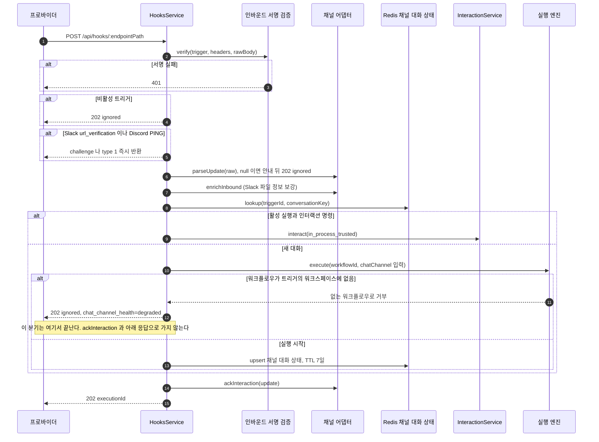
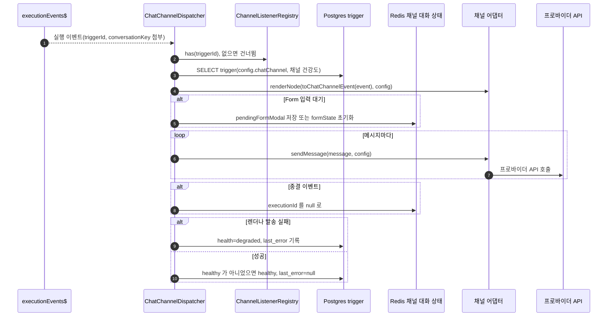
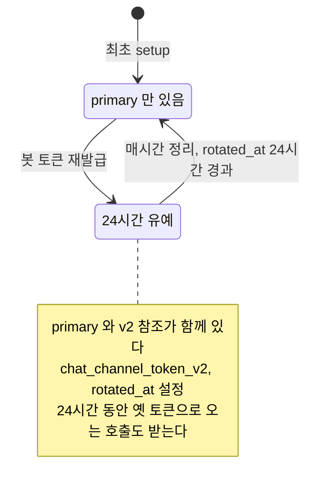

> 구현 상태: 부분 구현 · 원문: `spec/5-system/15-chat-channel.md` (§4 데이터 모델), `spec/data-flow/14-chat-channel.md` · 용어: [용어 사전](../CLE-GLOSSARY.md)

## 개요

이 문서는 [채팅 채널](CLE-CHAT-CORE.md) 이 저장하는 데이터와 그 데이터가 흐르는 경로를 정한다. 다루는 것은 `Trigger.config.chatChannel` 필드, 안내 문구(`languageHints`) 기본값, 트리거의 `chat_channel_*` 컬럼, 채널 대화 상태(`ChannelConversation`)와 Redis 키, 인바운드·아웃바운드 흐름, 봇 토큰 라이프사이클, 상태 전이다.

저장 모델의 핵심 사실이 하나 있다. 채널 대화 상태는 Postgres 테이블이 아니라 Redis 키-값(`chat-channel:{triggerId}:{conversationKey}`, TTL 7일)이다. Redis 를 쓸 수 없으면 조용히 기능을 낮춘다(조회는 null, 저장은 no-op 이라 update 마다 새 실행이 시작된다). 영속 데이터는 `trigger` 테이블의 `chat_channel_*` 컬럼 5개와 `trigger.config.chatChannel` JSON, 그리고 [시크릿 저장소](../CLE-INT/CLE-INT-SECRET.md) 의 행뿐이다.

웹훅 진입에서 채팅 채널로 갈라지는 지점은 [트리거 데이터와 흐름](../CLE-TRIG/CLE-TRIG-DATA.md) 이 정하고, 이 문서는 그 분기 뒤의 흐름을 맡는다. 요구사항과 API 계약은 [채팅 채널](CLE-CHAT-CORE.md), 프로바이더별 응답 JSON·서명 알고리즘·Form 모달 세부는 [채팅 채널 어댑터 규약](CLE-CHAT-ADAPTER.md) 과 프로바이더 문서가 정한다. 웹채팅 위젯은 채팅 채널 모듈을 거치지 않는다([웹채팅 경로](#웹채팅-경로)).

## Trigger.config.chatChannel

`chatChannel` 이 없으면 일반 웹훅 트리거다(기존 동작 그대로). 이 필드는 [웹훅](../CLE-TRIG/CLE-TRIG-WEBHOOK.md) 트리거의 `config` JSONB 안에 있다. 메모리 표현 타입(`ChatChannelConfig`)은 [채팅 채널 어댑터 규약](CLE-CHAT-ADAPTER.md) 이 정하고, 필드 계약은 이 절이 정한다. `languageLocale` 을 포함한 `chatChannel` 필드 전체 목록의 기준도 이 절이다([트리거 관리](../CLE-TRIG/CLE-TRIG-MANAGE.md) 가 여기를 가리킨다).

```jsonc
{
  "chatChannel": {
    "provider": "telegram",                    // 채널 프로바이더. 지원 목록은 채팅 채널 문서의 카탈로그(v1: telegram / slack / discord)
    "botToken": "<provider 발급 plaintext>",   // 입력 전용. POST /api/triggers 요청 본문에서만 받는다. 서비스가 SecretResolver.rotate 로 옮긴 뒤 지운다. 응답·DB JSONB 에 없다(SS-SE-01).
                                               // telegram = BotFather `\d+:[A-Za-z0-9_-]+` (입력 안내일 뿐 서버 형식 검증은 없다. 잘못된 토큰은 setupChannel 실패 때 BOT_TOKEN_INVALID 로 드러난다)
                                               // slack = `xoxb-*` / discord = Developer Portal Bot Token
    "inboundSigningPlaintext": "<provider-issued plaintext>",  // 입력 전용, slack·discord 만(telegram 은 서버가 발급). slack = 소문자 hex 32자(signing secret), discord = 소문자 hex 64자(ed25519 application public key).
                                               // 서비스가 SecretResolver.rotate(inboundSigningRef, ws, plaintext) 뒤 지운다. telegram 에 넣으면 400 VALIDATION_ERROR(field='inboundSigningPlaintext')
    "botTokenRef":      "secret://triggers/{triggerId}/bot-token",       // DB JSONB 에만 둔다. 응답에서는 지운다. 프로바이더 공통
    "inboundSigningRef": "secret://triggers/{triggerId}/inbound-signing",  // DB JSONB 에만 둔다. 응답에서는 지운다. 프로바이더 공통 단일 슬롯(검증 알고리즘은 백엔드가 프로바이더별로 나눈다)
    "botIdentity": {                            // setupChannel 결과 캐시(생성 뒤 읽기 전용)
      "botId": 123456789,
      "username": "myworkflow_bot",
      "teamId": "T012ABCDE",                    // 선택. workspace·team 개념이 있는 프로바이더(Slack 등)만
      "publicKey": "<verify_key>"               // 선택. Discord 의 GET /applications/@me verify_key 캐시(비민감 공개키)
    },
    "uiMapping": {                              // 선택. 노드를 채널 UI 로 바꾸는 옵션
      "formMode": "auto",                       // "multi_step" | "native_modal" | "auto"(기본). 뜻은 어댑터 규약의 Form 입력 흐름
      "visualNode": "auto",                     // "text" | "photo" | "auto"(기본). 예전 "text_only" 는 읽을 때 "text" 로 바꾼다
      "buttonLayout": "auto"                    // "auto" | "vertical" | "horizontal"
    },
    "rateLimitPerMinute": 60,                   // 대화 단위 분당 한도(기본 60, 1–600). 넘치면 건너뛰고 degraded
    "languageLocale": "ko",                     // "ko" | "en", 기본 "ko". languageHints 가 비어 있는 키의 기본 문구 언어
    "languageHints": {                          // 봇이 스스로 보내는 안내 문구(사용자 덮어쓰기). 모두 평문으로 쓴다
      "groupChatRefusal":              "이 봇은 1:1 대화만 지원합니다.",
      "unsupportedMessageKind":        "지원하지 않는 메시지 형식입니다.",
      "executionStarted":              "워크플로우를 시작합니다…",
      "executionCompleted":            "워크플로우가 완료되었습니다.",
      "executionStillRunning":         "워크플로우가 처리 중입니다. 잠시만 기다려 주세요.",
      "help":                          "사용 가능한 명령: /start, /cancel, /help",
      "formValidationFailed":          "입력값을 다시 확인해주세요.",
      "formNextField":                 "다음 항목을 입력해주세요.",
      "formOpenLabel":                 "양식 작성하기",
      "sessionExpired":                "대화 세션이 만료되어 재개할 수 없습니다. 새 메시지를 보내면 새 대화가 시작됩니다.",
      "surfaceMismatch":               "지금은 이 입력을 받을 수 없어요 화면에 표시된 양식이나 버튼을 사용해 주세요",
      "executionFailedThirdParty4xx":  "외부 서비스 요청이 거부되었습니다 ({statusCode}). 잠시 후 다시 시도해 주세요.",
      "executionFailedThirdParty5xx":  "외부 서비스에 일시적인 문제가 발생했습니다 ({statusCode}). 잠시 후 다시 시도해 주세요.",
      "executionFailedThirdParty":     "외부 서비스 응답을 받지 못했습니다. 잠시 후 다시 시도해 주세요.",
      "executionFailedTimeout":        "처리 시간이 초과되었습니다. 잠시 후 다시 시도해 주세요.",
      "executionFailedRateLimit":      "요청량이 많아 잠시 후 다시 시도해 주세요.",
      "executionFailedInternal":       "서비스에 일시적 문제가 발생했습니다. 잠시 후 다시 시도해 주세요."
    }
  }
}
```

`languageHints` 키의 쓰임은 다음과 같다.

| 키 | 쓰임 |
|---|---|
| `groupChatRefusal` | 그룹 대화 거절 안내 |
| `unsupportedMessageKind` | 그룹이 아닌 미지원 update 안내 |
| `executionStarted` · `executionCompleted` | 실행 시작·완료 안내 |
| `executionStillRunning` | 처리 중(`running`·`pending`) 메시지 안내 |
| `help` | `/help` 기본 도움말 |
| `formValidationFailed` · `formNextField` | 다단계 질문의 검증 실패 재질문, 다음 필드 질문 |
| `formOpenLabel` | 네이티브 모달을 여는 `form_modal` 버튼 라벨 |
| `sessionExpired` | 멀티턴 재개 실패(`RESUME_*`) 안내 |
| `surfaceMismatch` | 대기 표면과 명령 불일치(409 `STATE_MISMATCH`) 안내 |
| `executionFailed*` 여섯 개 | 실행 실패 안내. 분류 결과 키이고, 허용 자리표시자는 `{statusCode}`(정수) 하나다. 그 밖의 자리표시자는 DTO validator 가 등록 때 거부한다 |

프로바이더 문서는 이 목록에 없는 키도 참조한다. [Telegram 어댑터](CLE-CHAT-TELEGRAM.md) 는 일반 취소 안내로 `executionCancelled` 를, [Discord 어댑터](CLE-CHAT-DISCORD.md) 는 모달 제목 fallback 으로 `formModalTitle` 을 쓴다. [미결 사항](#미결-사항) 참조.

`botTokenRef`·`inboundSigningRef` 는 `SecretResolver` 가 풀어 쓴다. 설정 JSON 에는 참조만 두고, 평문은 백엔드가 AES-256-GCM 으로 암호화해 `secret_store` 테이블의 `encrypted BYTEA` 컬럼에 둔다. EIA 알림 웹훅의 `notification.signing.secretRef` 와 같은 정책, 같은 백엔드다([EIA 데이터와 흐름](../CLE-IX/CLE-EIA-DATA.md)). 두 참조는 응답에 싣지 않는다. 응답은 파생 필드 `hasBotToken` 만 싣는다([채팅 채널](CLE-CHAT-CORE.md) 의 응답 파생 필드). `inboundSigningRef` 의 프로바이더별 자원 성격·발급 주체·검증 알고리즘(Telegram 서버 발급 shared secret, Slack HMAC key, Discord ed25519 공개키)은 [채팅 채널 어댑터 규약](CLE-CHAT-ADAPTER.md) 이 정한다.

## 안내 문구 기본값

실행 실패 안내 키 여섯 개의 기본 문구는 한국어와 영어 두 locale 모두 백엔드가 가진다. 어댑터가 문구를 찾는 순서는 (1) `languageHints[key]` 사용자 덮어쓰기, (2) `languageLocale` 의 기본 문구, (3) locale 이 없을 때 `ko` 다. 처음부터 있던 다섯 키(`groupChatRefusal` 등)의 영어 기본값은 범위 밖이다. `formOpenLabel` 은 네이티브 모달과 함께 들어와 두 locale 을 모두 가진다.

| key | KO 기본값 | EN 기본값 |
|---|---|---|
| `executionFailedThirdParty4xx` | "외부 서비스 요청이 거부되었습니다 ({statusCode}). 잠시 후 다시 시도해 주세요." | "The external service rejected the request ({statusCode}). Please try again later." |
| `executionFailedThirdParty5xx` | "외부 서비스에 일시적인 문제가 발생했습니다 ({statusCode}). 잠시 후 다시 시도해 주세요." | "The external service is temporarily unavailable ({statusCode}). Please try again later." |
| `executionFailedThirdParty` | "외부 서비스 응답을 받지 못했습니다. 잠시 후 다시 시도해 주세요." | "Couldn't reach the external service. Please try again later." |
| `executionFailedTimeout` | "처리 시간이 초과되었습니다. 잠시 후 다시 시도해 주세요." | "The request timed out. Please try again later." |
| `executionFailedRateLimit` | "요청량이 많아 잠시 후 다시 시도해 주세요." | "Too many requests. Please try again later." |
| `executionFailedInternal` | "서비스에 일시적 문제가 발생했습니다. 잠시 후 다시 시도해 주세요." | "The service is temporarily unavailable. Please try again later." |
| `formOpenLabel` | "양식 작성하기" | "Open form" |
| `sessionExpired` | "대화 세션이 만료되어 재개할 수 없습니다. 새 메시지를 보내면 새 대화가 시작됩니다." | "This conversation session has expired and cannot be resumed. Send a new message to start a fresh conversation." |
| `surfaceMismatch` | "지금은 이 입력을 받을 수 없어요 화면에 표시된 양식이나 버튼을 사용해 주세요" | "This input can't be accepted here right now, please use the form or buttons shown above" |

`{statusCode}` 는 두 locale 에서 같은 자리에 있다. 그래서 치환 코드가 locale 분기 없이 한 경로로 동작한다.

`sessionExpired` 는 멀티턴 AI 대화가 서버 재시작이나 체크포인트 부재로 재개할 수 없을 때(`execution.cancelled` 와 `RESUME_*` 코드) 일반 취소 안내 대신 보낸다([장애 복구와 안전 종료](../CLE-EXEC/CLE-EXEC-RECOVERY.md)). 찾는 순서는 `formOpenLabel` 과 같다. 사용자의 다음 메시지는 새 실행으로 시작한다(취소된 실행은 새 실행을 시작시킨다).

`surfaceMismatch` 는 인바운드 명령이 현재 대기 노드의 표면과 맞지 않아 재개 명령 발행기가 409 `STATE_MISMATCH` 로 거부했을 때 보내는 부수 안내다. 예를 들어 Form·버튼 대기 중에 자유 텍스트가 오면 `text_message → submit_message` 고정 매핑이 거부된다([실행 상태 머신과 대기·재개](../CLE-EXEC/CLE-EXEC-STATE.md) 의 표면 매트릭스). 로그만 남기던 경우에도 사용자에게 알려 주려는 것이다. 현재 구현은 `HooksService.forwardToInteractionService` 가 거부를 흡수하면서 `sendSurfaceMismatchNotice` 로 보낸다.

### 제어 안내의 프로바이더별 escape

`HooksService` 가 렌더러(`renderNode`)를 거치지 않고 `adapter.sendMessage` 로 바로 보내는 제어 안내 키는 `help`, `groupChatRefusal`, `unsupportedMessageKind`, `executionStillRunning`, `surfaceMismatch`, `formValidationFailed`, `formNextField` 일곱 개다. 발송 직전 `adapter.escapeControlText(text)` 로 프로바이더 표면에 맞게 escape 한다.

- Telegram: `escapeMarkdownV2`(예약 문자 backslash escape, `renderNode` 경로와 같은 규칙)
- Slack: `escapeSlackMrkdwn`(`<`, `>`, `&` 만)
- Discord: 평문 그대로(렌더러도 escape 하지 않는다)

그래서 기본 문구와 운영자 덮어쓰기는 모두 평문으로 쓴다. `\.` 같은 수동 escape 는 필요 없다. 예전에는 Telegram escape 가 들어간 문구가 Slack·Discord 에서 그대로 보이던 공백이 있었는데 이 방식으로 없어졌다. `formOpenLabel` 은 버튼 라벨이라 MarkdownV2 대상이 아니고, `sessionExpired` 와 실행 실패 안내는 `renderNode` 경로라 렌더러가 escape 한다. 함수 계약은 [채팅 채널 어댑터 규약](CLE-CHAT-ADAPTER.md) 이 정한다.

## 트리거 컬럼

`trigger` 테이블에 다음 컬럼 5개가 있다. 엔티티 전체는 [트리거 데이터와 흐름](../CLE-TRIG/CLE-TRIG-DATA.md) 을 보고, 채팅 채널 컬럼의 정의는 그 문서가 이 절로 위임한다.

```sql
ALTER TABLE trigger
  ADD COLUMN chat_channel_health     VARCHAR(16) NOT NULL DEFAULT 'unknown',  -- 'unknown'|'healthy'|'degraded'
  ADD COLUMN chat_channel_last_error TEXT NULL,
  ADD COLUMN chat_channel_setup_at   TIMESTAMPTZ NULL,
  ADD COLUMN chat_channel_token_v2   TEXT NULL,   -- 24시간 유예 동안 옛 봇 토큰을 백업한 시크릿 참조(secret://triggers/{id}/bot-token.v2). 토큰이 아니라 참조만 둔다. primary 로 올리는 단계는 없다(CCH-SE-04-C)
  ADD COLUMN chat_channel_rotated_at TIMESTAMPTZ NULL;
```

- `chat_channel_health` 의 값(`unknown`/`healthy`/`degraded`)은 EIA 알림 웹훅의 `notification_health` 와 같다. 공용 DB 타입으로 합치는 것을 나중에 검토한다.
- `chat_channel_token_v2` 는 24시간 뒤 `ChatChannelTokenRotatorService` 가 참조와 시크릿 저장소 행을 함께 정리한다. 이름 패턴은 `notification_secret_v2` 와 같다(R-K).

컬럼과 설정 JSON 의 읽기·쓰기는 다음과 같다.

| 저장소 | 흐름 | 읽기·쓰기 |
|---|---|---|
| `trigger` | setup·설정 | `config.chatChannel` JSON(`provider`, `botTokenRef`, `inboundSigningRef`, `botIdentity`, `uiMapping`, `rateLimitPerMinute`, `languageLocale`, `languageHints`). 평문 비밀 필드는 저장 전에 지운다(SS-SE-01) |
| `trigger` | setup 완료 | UPDATE `chat_channel_setup_at` |
| `trigger` | 채널 건강도 | UPDATE `chat_channel_health`(`healthy`/`degraded`), `chat_channel_last_error`(1024자에서 자른다. 봇 토큰은 프로바이더 API 클라이언트가 먼저 지운다) |
| `trigger` | 봇 토큰 재발급 | UPDATE `chat_channel_token_v2`(v2 시크릿 참조 문자열, 토큰 아님), `chat_channel_rotated_at`. 정리 때 둘 다 NULL |
| `trigger` | 인바운드로 새 실행 시작 | UPDATE `last_triggered_at` |
| `secret_store` | setup·재발급·정리 | `secret://triggers/{id}/bot-token`(primary), `.../bot-token.v2`(유예 슬롯), `.../inbound-signing`(서명 검증 자료) |
| `execution` | 새 대화 | INSERT. 입력에 `chatChannel:{provider, conversationKey, channelUserKey}` 를 찍는다([실행 데이터와 흐름](../CLE-EXEC/CLE-EXEC-DATA.md)) |

## 채널 대화 상태

채널 대화 상태는 "이 채팅방이 지금 어느 실행에 이어져 있는가" 를 담는 Redis 값이다. 대화 스레드([대화 스레드](../CLE-IX/CLE-IX-THREAD.md) 의 `ConversationThread`)와 다르다.

```text
key:    chat-channel:{triggerId}:{conversationKey}
value:  {
  executionId:      string | null,   // 활성 실행. 종결되면 null
  threadId:         string,          // 대화 스레드 id(v1 은 "default")
  channelUserKey:   string,          // 채널 사용자 키(Telegram: user_id)
  startedAt:        ISO8601,
  lastUpdateAt:     ISO8601,
  formState?:       object,          // 다단계 질문 진행 상태
  pendingFormModal?: object          // 네이티브 모달 대기 상태(fields 등)
}
TTL: 7일(저장할 때마다 갱신, 사용자가 떠나면 자동 만료)
```

- 대화 키(`conversationKey`)는 프로바이더마다 다르다. Telegram 은 `chat_id`, Slack 은 DM 채널 ID(`channel_id`, 1:1 DM 이라 `thread_ts` 는 쓰지 않는다, [Slack 어댑터](CLE-CHAT-SLACK.md)), 후보인 카카오는 `user_id` 다.
- 같은 `triggerId + conversationKey` 의 다음 메시지는 활성 실행이 있으면 전달하고 없으면 새 실행을 시작한다.
- 키는 콜론으로 나눈 계층형이라 다른 모듈 접두와 겹치지 않는다.
- `channelUserKey` 는 이 Redis 값에만 둔다. `ConversationThread` 에는 필드를 더하지 않고, 여러 사용자 대화(v2) 때 다시 논의한다.
- `formState` 와 `pendingFormModal` 은 서로 배타적이다([상태 전이](#상태-전이)).

## Redis 키

| key·큐 | 쓰는 쪽 | 읽는 쪽 | 내용 |
|---|---|---|---|
| `chat-channel:{triggerId}:{conversationKey}` | `HooksService`(저장), `ChatChannelDispatcher`(`pendingFormModal`·`executionId` 갱신) | 양쪽 조회 | 채널 대화 상태 JSON. TTL 7일(저장마다 갱신). Redis 가 없으면 기능을 낮춘다 |
| `chat-channel-lock:{triggerId}:{conversationKey}:formsubmit` | `form_submission` 처리(`SET NX EX 30`) | 같다 | 네이티브 모달 중복 제출 방지 잠금. Lua 로 소유권을 확인하고 푼다. Redis 가 없으면 통과 |
| `cc:dedup:{triggerId}:{idempotencyKey}` | `HooksService.handleChatChannelWebhook`(`SET NX EX 30`) | 같다(반환값이 곧 판정) | 인바운드 중복 제거(CCH-SE-02). `parseUpdate` 직후이자 분당 한도 앞이다. 재도착은 같은 트래픽이라 한도를 쓰지 않는다. TTL 30초. Redis 가 없으면 통과하고 warn |
| `cc:rl:{triggerId}:{conversationKey}` | `ChatChannelRateLimiterService.consume`(`INCR`+`EXPIRE NX`) | 같다 | 대화 단위 분당 한도(CCH-NF-03). TTL 60초(fixed-window). 넘치면 건너뛰고 `degraded`. Redis 가 없으면 통과 |
| `chat-channel-token-rotator`(BullMQ) | repeatable job scheduler(`0 * * * *`) | `ChatChannelTokenRotatorService` | payload 없음. 매시간 정리 |

위 네 Redis 키의 용도·TTL·실패 정책은 이 표가 기준이다. 키 모양 규칙은 [Redis 키 명명 규약](../CLE-ENG/CLE-ENG-REDIS.md), 전역 목록은 [비동기 큐와 Redis 키 목록](../CLE-PLAT/CLE-PLAT-QUEUE.md) 이 가진다. 새 키를 만들면 양쪽을 함께 고친다.

## 인바운드 흐름

진입 라우팅(`trigger.config.chatChannel` 이 있으면 일반 웹훅 흐름을 건너뜀)은 [트리거 데이터와 흐름](../CLE-TRIG/CLE-TRIG-DATA.md) 이 정한다. 분기 뒤의 처리는 다음과 같다.



서명 검증이 먼저이고, 비활성 트리거는 검증을 통과한 뒤 조용히 버린다(R-CC-12). 새 대화의 `execute()` 입력에는 `__triggerSource:'webhook'` 과 `chatChannel:{provider, conversationKey, channelUserKey}` 가 들어가고 `trigger.last_triggered_at` 을 갱신한다. `parseUpdate` 가 `null` 이면 `maybeNotifyIgnored` 로 필요한 안내를 보낸 뒤 `202 ignored` 로 끝낸다. 중복 제거와 분당 한도 게이트는 `parseUpdate` 직후에 이 순서로 선다([Redis 키](#redis-키)).

`ChannelUpdate.command` 종류별 처리는 다음과 같다(`hooks.service.ts`).

| command | 처리와 저장 |
|---|---|
| `text_message` 가 `/help` | 대화 조회 전에 정적 안내를 `adapter.sendMessage` 로 보내고 `202 ignored`(실행 없음) |
| `cancel` | 활성 실행이 있으면 `executionsService.stop` 하고 채널 대화 상태의 `executionId` 를 null 로 |
| `text_message`·`button_callback`·`contact_share`·`file_upload`(활성 실행) | `formState` 가 진행 중이면 다단계 질문 단계를 처리하고, 아니면 `InteractionService.interact` 로 서버 안 전달(EIA-AU-08) |
| `open_form_modal` | 채널 대화 상태의 `pendingFormModal.fields` 와 프로바이더 openContext 로 `adapter.openFormModal`. Discord 는 웹훅 HTTP 응답 본문으로 모달을 돌려준다. `channelUserKey` 가 다르면 거부한다(그룹 안 가로채기 방어) |
| `form_submission` | 대화 단위 Redis 잠금(`SET NX EX 30`)을 잡고 필드 허용 목록 필터와 클라이언트 쪽 검증을 한 뒤 `interact(submit_form)`. 성공하면 `pendingFormModal` 을 지운다. 실패하면 "양식 작성하기" 버튼을 다시 보내고 `pendingFormModal` 은 둔다 |
| 새 대화(그 밖) | `execute()` 와 채널 대화 상태 저장. 트리거의 워크플로우가 트리거의 워크스페이스에 없으면 실행 없이 `chat_channel_health=degraded` 와 고정 문구의 `chat_channel_last_error` 를 남기고 `202 ignored` 로 끝낸다. 채널 대화 상태는 저장하지 않는다([채팅 채널](CLE-CHAT-CORE.md#r-cc-25-워크플로우가-다른-워크스페이스에-있으면-202-ignored-와-degraded-로-답한다) 의 「워크플로우가 다른 워크스페이스에 있으면 202 ignored 와 degraded 로 답한다」) |

분당 한도는 구현됐다. `ChatChannelRateLimiterService.consume` 가 `INCR`+`EXPIRE NX` 한 pipeline 으로 세고, `HooksService` 가 `parseUpdate` 뒤 초과분을 `202 ignored` 로 건너뛰고 `chat_channel_health=degraded` 로 바꾼다. 공개 웹훅의 IP 한도(`PublicWebhookThrottleGuard`)와는 별개의 대화 단위 카운터다. 채팅 채널 트리거는 인바운드 서명 인증을 쓰므로 그 가드의 "인증 없음" 조건에 기댈 수 없다.

## 아웃바운드 흐름

`ChatChannelDispatcher` 는 `WebsocketService.executionEvents$` 를 `onModuleInit` 에서 직접 구독한다(단일 sink, [채팅 채널](CLE-CHAT-CORE.md) R8). 받는 이벤트는 EIA 다섯 가지(`execution.waiting_for_input`·`ai_message`·`completed`·`failed`·`cancelled`)와 채팅 채널 내부 `execution.node.completed`(표시 전용 `carousel`·`table`·`chart`·`template` 완료만)다.



- **라우팅 키**: 이벤트의 `triggerId` 와 `chatChannel.conversationKey` 다. `HooksService` 가 `execute()` 입력에 넣은 값이 WebsocketService 의 라우팅 문맥 레지스트리를 거쳐 fanout 봉투에 자동으로 붙는다. 둘 중 하나라도 없으면 건너뛴다(수동 실행은 채널 대상이 아니다).
- **빈 텍스트**: 본문이 빈 텍스트 메시지는 조용히 건너뛰고 warn 을 남긴다.
- **트리거 단위 레지스트리**: `setupChatChannel` 이 성공하면 등록한다. 재시작 때는 `chat-channel.module.ts` 의 `onApplicationBootstrap` 이 활성 채팅 채널 트리거를 DB 에서 한꺼번에 복원한다(`bulkRegister`). 미등록 트리거의 이벤트는 DB 왕복 없이 건너뛴다.
- **자동 비활성화 없음**: 실패해도 `degraded` 만 기록하고 트리거를 끄지 않는다(CCH-SE-01).

## 봇 토큰 라이프사이클

봇 토큰 평문은 `trigger.config` 에 저장하지 않고 시크릿 참조로만 가리킨다(SS-SE-01, [시크릿 저장소](../CLE-INT/CLE-INT-SECRET.md)). 각 단계의 소유 파일이 다르다. 최초 setup·teardown 은 `chat-channel-binder.service.ts`, PATCH 검증은 `chat-channel-input-rules.ts`, 재발급·정리는 `triggers.service.ts` 다.

| 단계 | 흐름 | 저장 |
|---|---|---|
| 최초 setup(생성 `POST /api/triggers` 때만) | `setupChatChannel` 이 평문(`botToken`, 프로바이더 발급 `inboundSigningPlaintext`)을 시크릿 저장소에 UPSERT 하고 `adapter.setupChannel(config, callbackUrl)` 을 부른다. Telegram 은 서버 발급 `issuedInboundSigning` 을 돌려주므로 따로 저장한다. 설정에 `botTokenRef`·`inboundSigningRef`·`botIdentity` 를 합친다 | `secret_store` 행, UPDATE `trigger.config`·`chat_channel_setup_at`·`chat_channel_health='healthy'`, 레지스트리 등록 |
| `chatChannel` 이 실린 PATCH | `setupChannel()` 을 다시 불러 프로바이더 등록만 갱신한다. 사용자가 보낸 비밀은 쓰지 않아 봇 토큰과 Slack·Discord 서명 값은 그대로다. Telegram 은 새 `secret_token` 이 등록되므로 `inboundSigningRef` 가 매번 갱신된다(건너뛰면 인바운드 401). 두 참조는 트리거 id 에서 다시 만든다(`buildSecretRef`) | UPDATE `trigger.config`·`chat_channel_setup_at`·건강도. `secret_store` 는 봇 토큰·Slack·Discord 서명 무변경, Telegram `inbound-signing` 행만 갱신 |
| PATCH 거부 | 비밀 필드를 실었거나, 채팅 채널을 나중에 붙이려 했거나, `provider` 를 바꾸려 했으면 `400 VALIDATION_ERROR` 로 아무것도 쓰지 않고 끝난다. 기준은 [채팅 채널](CLE-CHAT-CORE.md) 의 봇 토큰 변경 단일 경로 | 무변경(DB·시크릿 저장소) |
| 재발급 | `POST /api/triggers/:id/chat-channel/rotate-bot-token` → `rotateBotToken` 6단계: ① 기존 토큰 resolve(없으면 ② 건너뜀) ② v2 참조(`bot-token.v2`)에 토큰 보관 ③ primary 참조에 새 토큰 UPSERT ④ 새 토큰으로 `setupChannel` 재호출(서명 자료 재발급) ⑤ `issuedInboundSigning` 저장 ⑥ 트리거 컬럼 갱신. ② 에서 v2 참조에 옛 토큰을 백업하고 ③ 에서 primary 를 새 토큰으로 바꾸므로 v2 를 primary 로 올리는 단계는 없다(CCH-SE-04-C) | UPDATE `chat_channel_token_v2`(v2 참조), `chat_channel_rotated_at`, `chat_channel_health='healthy'` |
| 유예 종료 정리 | BullMQ `chat-channel-token-rotator` 큐의 repeatable job(`0 * * * *`, `upsertJobScheduler` 라 여러 인스턴스에서도 전역 1회)이 `cleanupRotatedChatChannelTokens` 를 부른다. `chat_channel_token_v2 IS NOT NULL AND chat_channel_rotated_at <= now-24h` 후보마다 프로바이더 `revokeBotToken?` 을 실패 흡수 방식으로 부르고(Slack `auth.revoke` 만, Telegram·Discord 는 revoke API 없음) `secrets.delete(v2Ref)` 한다. revoke 시점은 정의가 갈린다([미결 사항](#미결-사항)) | `secret_store` v2 행 DELETE, UPDATE `chat_channel_token_v2=NULL`·`chat_channel_rotated_at=NULL` |

재발급 실패의 응답 분류(자격 증명 거부 `400 BOT_TOKEN_INVALID`, 그 밖 `502 CHAT_CHANNEL_SETUP_FAILED`)는 [채팅 채널](CLE-CHAT-CORE.md) 의 봇 토큰 재발급 API 가 기준이라 여기 다시 적지 않는다. 봇 토큰 변경은 재발급 API 한 경로다.



`PrimaryOnly` 는 primary 참조(`bot-token`)만 있는 상태, `Grace` 는 primary 와 v2 참조(`bot-token.v2`)가 함께 있는 24시간 유예 상태다. 정리는 v2 시크릿 행을 지우고 프로바이더 revoke 를 시도한 뒤 컬럼을 NULL 로 만든다. v2 가 NULL 이면 아무 일도 하지 않으므로 멱등이다.

## 상태 전이

### 채널 대화 상태

| 전이 | 계기 |
|---|---|
| 없음 → 활성 | 새 대화에서 `execute()` 직후 저장(`executionId` 설정) |
| `executionId` → null | 종결 이벤트(completed·failed·cancelled) 도착 때 dispatcher 가 비움, `/cancel` 처리 때 |
| `formState` ↔ `pendingFormModal` | 서로 배타적이다. Form 입력 대기 렌더 결과가 `form_modal` 이면 `pendingFormModal` 을 저장하고 `formState` 를 지운다. 다단계 질문(`form_prompt`)이면 `formState` 를 초기화하고 `pendingFormModal` 을 지운다 |
| 소멸 | TTL 7일 만료(사용자 이탈)나 명시적 `clear` |

상태가 남아 있는 동안 같은 `conversationKey` 의 다음 update 는 같은 실행의 재개(서버 안 `interact`)로 흐르고, 만료되거나 실행이 끝나면 새 실행이 시작된다. 멀티턴 대화의 park·재개를 잇는 고리다. 실행 쪽 대기·재개 모델은 [실행 데이터와 흐름](../CLE-EXEC/CLE-EXEC-DATA.md) 을 본다.

### 채널 건강도

| 상태 | 전이 |
|---|---|
| `unknown` | 컬럼 기본값. 아직 setup·발송 결과가 없다 |
| `healthy` | setup·재발급 성공 때, 또는 아웃바운드 첫 성공 때 올린다(`chat_channel_last_error=null`) |
| `degraded` | 원인은 [채팅 채널 「채널 건강도」](CLE-CHAT-CORE.md#채널-건강도) 가 정한다. 트리거를 자동으로 끄지 않는다(CCH-SE-01). 다음 성공 때 다시 `healthy` |

## 웹채팅 경로

웹채팅은 채팅 채널이 아니다. 위젯은 채널 어댑터가 아니라 EIA 의 순수 외부 HTTP 소비자라 채팅 채널 모듈을 거치지 않는다. 위젯 부팅(`GET /api/hooks/:endpointPath/embed-config` 공개 조회), 대화 시작(일반 웹훅 경로와 202 응답의 인터랙션 토큰), 실시간 수신(`/api/external/executions/:id/stream` SSE 와 `interact`)은 [EIA 데이터와 흐름](../CLE-IX/CLE-EIA-DATA.md) 의 흐름을 그대로 쓴다.

웹채팅의 서버 쪽 구성 요소와 그 쓰기 경로는 [웹채팅 구조 §서버 쪽 구성 요소](../CLE-WEBCHAT/CLE-WEBCHAT-ARCH.md#서버-쪽-구성-요소) 가 목록의 기준이다. 임베드 설정 공개 조회, `/api/external/*` 경로별 CORS 처리, 공개 웹훅 가드(`PublicWebhookThrottleGuard`)가 있고, 실행 상태를 바꾸는 쓰기 경로는 유휴 입력 대기 회수(`WebChatIdleReaperService`, BullMQ `webchat-idle-reaper`)뿐이다. 회수 규칙은 [External Interaction API](../CLE-IX/CLE-EIA.md) 가 정한다.

임베드 허용 목록과 `/api/external/*` CORS 허용 목록은 같은 키(`workspace.settings.interactionAllowedOrigins`, [계정과 워크스페이스 데이터 흐름](../CLE-ACCT/CLE-ACCT-DATA.md))를 쓰지만 빈 목록일 때의 뜻이 다르다. 그 차이는 [웹채팅 보안](../CLE-WEBCHAT/CLE-WEBCHAT-SECURITY.md) 이 정한다.

## 외부 의존

| 의존 | 방향 | 참고 |
|---|---|---|
| 트리거 | 인바운드 진입 | 웹훅 분기([트리거 데이터와 흐름](../CLE-TRIG/CLE-TRIG-DATA.md)) |
| 실행 | 양방향 | 새 대화의 `execute()` 진입과 실행 이벤트 아웃바운드([실행 데이터와 흐름](../CLE-EXEC/CLE-EXEC-DATA.md)) |
| EIA(`InteractionService`) | 인바운드 재개 | `scope:'in_process_trusted'` 서버 안 전달(EIA-AU-08). 실행 토큰·SSE·EIA 알림 웹훅 흐름은 [EIA 데이터와 흐름](../CLE-IX/CLE-EIA-DATA.md) |
| 시크릿 저장소 | 토큰 보관 | `secret://triggers/{id}/...` 참조 세 가지([시크릿 저장소](../CLE-INT/CLE-INT-SECRET.md)) |
| Telegram API | 아웃바운드·setup | `setWebhook`(setup), `sendMessage` 등(아웃바운드). 인바운드 검증은 `X-Telegram-Bot-Api-Secret-Token` 동일성 |
| Slack API | 아웃바운드·모달·정리 | `auth.test`·`views.open`·`chat.postMessage`, `auth.revoke`(토큰 정리). 인바운드 검증은 `X-Slack-Signature` HMAC |
| Discord API | 아웃바운드·setup | 애플리케이션 메타데이터. 모달은 웹훅 HTTP 응답 본문으로 돌려준다. 인바운드 검증은 `X-Signature-Ed25519` |

## 미결 사항

- **`revokeBotToken` 호출 시점**: 데이터 흐름 원문과 [Slack 어댑터](CLE-CHAT-SLACK.md) 는 24시간 유예가 끝난 정리에서 v2 토큰을 revoke 한다고 적었고, [채팅 채널 어댑터 규약](CLE-CHAT-ADAPTER.md) 은 재발급 시점에 이전 토큰을 revoke 한다고 적었다. 현재 구현은 정리 작업에서 부른다. 결정 필요.
- **최초 setup 시점**: 이 문서의 표는 최초 setup 을 생성 때로만 적는다. 활성화 때 setup 을 다시 부르는지는 [채팅 채널](CLE-CHAT-CORE.md) 의 미결 사항을 본다.
- **`languageHints` 키 목록**: 프로바이더 문서가 참조하는 `executionCancelled`(Telegram 일반 취소 안내)와 `formModalTitle`(Discord 모달 제목 fallback)이 필드 목록에 없다. 코드 주석에는 `slashPrefix` 키도 있다(현재 구현). 목록에 올리고 기본 문구를 둘지 결정 필요.

## 구현 위치

- `codebase/backend/src/modules/hooks/hooks.service.ts`: `handleChatChannelWebhook`(인바운드 전체 조율)
- `codebase/backend/src/modules/chat-channel/channel-conversation.service.ts`: Redis 채널 대화 상태 CRUD 와 Form 제출 잠금
- `codebase/backend/src/modules/chat-channel/chat-channel.dispatcher.ts`: 아웃바운드 구독(`WebsocketService.executionEvents$`)
- `codebase/backend/src/modules/triggers/chat-channel-token-rotator.service.ts`: `chat-channel-token-rotator` 큐(매시간 정리, 정리 로직과 같은 triggers 모듈)
- `codebase/backend/src/modules/triggers/chat-channel-binder.service.ts`: `setupChatChannel`·`teardownChatChannel`(어댑터 바인딩, 시크릿 쓰기와 참조 보존)
- `codebase/backend/src/modules/triggers/triggers.service.ts`: `rotateBotToken`·`cleanupRotatedChatChannelTokens`
- `codebase/backend/src/modules/web-chat-cors/web-chat-cors-origin.resolver.ts`, `codebase/backend/src/modules/hooks/embed-config.service.ts`: 웹채팅 경로(소유 문서는 웹채팅)

## Rationale

### 대화 상태를 Redis 에만 둔다

채널 대화 상태는 "지금 이 채팅방이 어느 실행에 이어져 있는가" 라는 휘발성 라우팅 정보다. TTL 7일이 곧 이탈 정리 정책이다. Redis 를 쓸 수 없어도 워크플로우 실행 자체는 막지 않는다. update 마다 새 실행으로 넘어가는 것이 의도한 기능 저하다. 영속이 필요한 것은 채널 설정, 토큰 참조, 건강도뿐이라 `trigger` 컬럼으로 충분하다.

### chat_channel_token_v2 에 토큰이 아니라 참조를 둔다

컬럼에는 시크릿 참조 문자열만 둔다. 평문이 DB 에 닿지 않게 하는 SS-SE-01 을 그대로 적용한 것이다. 24시간 유예는 재발급 직후 옛 토큰으로 오는 프로바이더 쪽 진행 중 호출과 캐시를 위한 안전 창이다. 유예 종료를 별도 cron 프로세스가 아니라 BullMQ repeatable job 으로 둔 것은 스케줄 발사, 알림 서명 시크릿 교체와 같은 "Redis 중앙 등록, 여러 인스턴스에서 전역 1회" 패턴을 다시 쓰려는 것이다.

### R-K chat_channel_token_v2 이름을 notification_secret_v2 와 같은 패턴으로 둔다

`notification_secret_v2` 는 EIA 알림 웹훅 서명 시크릿의 v2 이고 `chat_channel_token_v2` 는 외부 프로바이더 봇 토큰 참조의 v2 다. 두 컬럼은 뜻이 다르지만(서명 시크릿 대 외부 봇 토큰) 이름 패턴(`<channel>_<resource>_v2`)은 같게 둔다. 이름 일관성을 앞세우고 뜻 차이는 컬럼 설명에 적는다. 나중에 공용 회전 패턴으로 합치면 두 컬럼 모두 영향을 받는다.

원문 R-K 는 `chat_channel_token_v2` 를 "유예 기간의 신규 token" 으로 적었다. 그러나 CCH-SE-04-C, 원문 컬럼 정의, 데이터 흐름 원문, 현재 구현(`rotateBotToken`)은 모두 v2 에 옛 토큰을 24시간 백업하고 승격 단계를 두지 않는다. 그래서 요구사항 쪽으로 맞추고 R-K 의 그 표현을 고쳤다. [시크릿 저장소](../CLE-INT/CLE-INT-SECRET.md) 도 같은 규칙을 적는다. 이름 패턴은 같아도 두 v2 의 뜻은 반대다. `notification_secret_v2` 는 유예 기간의 새 서명 시크릿이고 승격 때 기준 참조를 바꾼다. `chat_channel_token_v2` 는 옛 봇 토큰 백업이고 유예가 끝나면 지운다.

### 웹채팅을 채팅 채널 모듈 밖에 둔다

위젯은 서버 쪽 어댑터(봇 토큰, 서명 검증, 프로바이더 API)가 필요 없는 브라우저 클라이언트다. 그래서 채널 어댑터 인터페이스 대신 EIA 표면(웹훅 202 의 인터랙션 토큰, `interact`·SSE)을 그대로 쓴다. 채팅 채널을 EIA 소비자로만 둔 결정([채팅 채널](CLE-CHAT-CORE.md) R2)과 대칭이다. 웹채팅의 서버 쪽 구성 요소 목록은 [웹채팅 구조](../CLE-WEBCHAT/CLE-WEBCHAT-ARCH.md) 가 정한다.
