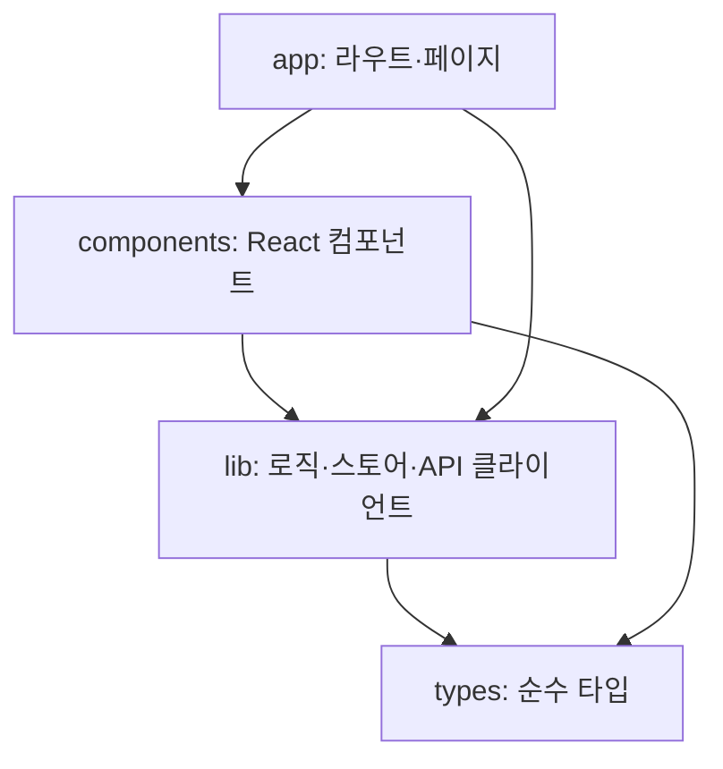

> 구현 상태: 구현됨 · 원문: `spec/conventions/frontend-layering.md` · 용어: [용어 사전](../CLE-GLOSSARY.md)

## 개요

프론트엔드 소스(`codebase/frontend/src/`) 안에서 디렉터리끼리 import 할 수 있는 방향을 정한다. 이 문서에서 프론트엔드 레이어(frontend layers)는 프론트엔드 디렉터리 사이의 의존 방향만 뜻한다. [시스템 아키텍처](../CLE-PLAT/CLE-PLAT-ARCH.md) 의 데이터 계층이나 [실행 컨텍스트](../CLE-EXEC/CLE-EXEC-CONTEXT.md) 의 세 층 분류와는 관계가 없다.

규약의 일부는 CI(ESLint)가 막고 나머지는 코드 리뷰에서 사람이 본다. 규약이 곧 집행은 아니다. 어느 방향을 기계가 막고 어느 방향을 사람이 보는지 이 문서에 함께 적는다.

범위 밖: 노드 출력 필드가 화면마다 어떻게 복원되는지는 [실행 화면 복원 규약](../CLE-EXEC/CLE-EXEC-HYDRATION.md) 이 정한다. 이 문서의 [적용 사례](#위반-해소법)인 `conversation-utils.ts` 가 그 복원 함수들이 있는 파일이다.

## 규칙

1. 의존은 위 레이어에서 아래 레이어로만 흐른다. 순서는 위에서부터 `src/app/**` → `src/components/**` → `src/lib/**` → `src/types/**` 다.
2. 각 레이어는 자기보다 위에 있는 레이어를 import 하지 않는다. `types → lib`, `types → components`, `lib → components`, `components → app` 이 모두 금지 방향이다.
3. CI 는 금지 방향 중 `src/lib/**`·`src/types/**` 에서 `@/components/**` 로 가는 import 만 막는다. `types → lib` 와 `components → app` 은 규약상 금지지만 가드가 없다. 이 두 방향은 코드 리뷰에서 사람이 본다.
4. 가드가 없는 방향에 역전 압력이 생기면 그때 가드를 더한다. 가드는 관측된 역전 압력에 비례해 둔다.
5. 레이어 역전이 생기면 import 방향을 뒤집지 않는다. 필요한 대상을 아래 레이어로 옮긴다([위반 해소법](#위반-해소법)).
6. 가드가 살아 있는지는 lint 통과로 판단하지 않는다. 가드 테스트가 규칙의 발동 자체를 검증한다([가드 테스트](#가드-테스트가-고정하는-것)).

## 레이어

| 레이어 | 디렉터리 | 역할 | 아래로 의존 | 위로 의존 |
| --- | --- | --- | --- | --- |
| 최상위 | `src/app/**` | Next.js App Router 라우트·페이지 | 허용 | 없음 |
| 상위 | `src/components/**` | React 컴포넌트(UI·JSX) | 허용 | **금지** |
| 하위 | `src/lib/**` | 도메인 로직·유틸·스토어·API 클라이언트·타입 | 허용 | **금지** |
| 최하위 | `src/types/**` | 프레임워크에 기대지 않는 순수 타입 정의 | 없음 | **금지** |

- `src/lib/types/`(예: `trigger.ts`)는 `src/types/` 와 다르다. 앞의 것은 `lib` 레이어 안의 타입 모듈이고 뒤의 것은 그 아래에 있는 독립 레이어다.
- `src/content/**`(사용자 가이드 MDX)·`src/test/**`·`src/__tests__/**` 는 의존 축 밖이라 이 규약의 대상이 아니다.
- `src/app/**` 을 import 하는 파일은 없다(0건). 라우트 정의 디렉터리라 애초에 import 대상이 아니므로 별도 CI 가드를 두지 않는다.

그림의 화살표는 허용된 import 방향이다. 거꾸로 가는 화살표는 모두 금지다. 그중 `lib`·`types` 에서 `components` 로 가는 것만 CI 가 막는다.

## CI 가드

### 막는 형태

CI 가 막는 `{lib, types} → components` import 의 우회 형태는 다음이 전부다.

- 정적 `import` / `import type` / `export ... from`
- alias 경로(`@/components/...`)와 상대 경로 우회(`../components/...`, `../../components/...`)
- 서브패스 없는 형태(`@/components`, `../components`)
- 동적 `import("@/components/...")`. 문자열 리터럴과 백틱 리터럴 모두
- CJS `require("@/components/...")`. 문자열 리터럴과 백틱 리터럴 모두

### 가드 구성

`codebase/frontend/eslint.config.mjs` 의 `files: LOWER_LAYERS`(= `["src/lib/**", "src/types/**"]`) 블록이다.

| 규칙 | 막는 대상 |
| --- | --- |
| `no-restricted-imports` (`patterns[].group`) | 정적 `import` / `import type` / `export ... from` |
| `no-restricted-syntax` (`ImportExpression` selector 2개) | 동적 `import()`. 문자열 리터럴 / 백틱 리터럴 |
| `no-restricted-syntax` (`CallExpression[callee.name='require']` selector 2개) | CJS `require()`. 문자열 리터럴 / 백틱 리터럴 |

문자열과 백틱은 AST 형태가 달라 selector 를 따로 둔다. 백틱은 `TemplateLiteral` 노드라 `.value` 프로퍼티가 없다. 그래서 문자열용 `[source.value=/.../]` 매칭은 백틱에서 에러 없이 빗나간다. 백틱용 selector 는 `quasis[0].value.raw` 를 본다.

### 커버리지 한계

- 규칙은 **리터럴 specifier** 만 매칭한다. 경로가 런타임 계산값이면(`import(someVar)`, 보간이 있는 `` import(`@/components/${name}`) ``) 정적 분석 밖이라 어떤 규칙도 막지 못한다.
- `eslint-disable` 주석으로 일부러 우회하는 것도 막지 않는다.
- 이 가드는 정직한 실수를 막는 용도다.

## 가드 테스트가 고정하는 것

지금 위반이 0건이라 `npx eslint src/lib` 는 규칙이 로드·매칭·발동하든 말든 늘 통과한다. lint 통과는 가드가 살아 있다는 증거가 못 된다. 그래서 `src/lib/__tests__/eslint-layering-guard.test.ts` 가 **실제 config 객체를 ESLint `Linter#verify` 에 넣어** 규칙의 발동 자체를 검증한다. 아래 항목은 모두 실제 mutation 으로 탐지를 확인했다.

| 항목 | 고정하는 것 |
| --- | --- |
| 규칙 발동 | 금지 형태 전부(정적·서브패스 없는 형태·동적·백틱·`import type`·re-export)가 error 를 낸다. |
| 오탐 방지 | 비슷한 경로(`@/components-legacy`)와 계산 경로는 잡지 않는다. |
| flat config 병합 | 가드 블록을 **전부** 병합해 검증한다. 배열 뒤쪽 override 가 규칙을 `off` 로 되돌리면 실패해야 한다. 첫 블록만 보면 fail-open 이다. |
| severity | 두 규칙이 `error` 여야 한다. `warn` 으로 내려가면 `lint` 스크립트에 `--max-warnings` 제한이 없어 CLI 는 exit 0 으로 통과한다. 이때 단위 테스트가 유일한 방어선이다. |
| 메시지 내용 | 위반 메시지가 실제 레이어 라벨(`LOWER_LAYERS`)·규약 링크·진입점(정적/동적/require)을 정확히 담는다. 세 진입점 메시지는 공통 부분 문자열을 공유해 positive `toContain` 만으로는 상수가 뒤바뀐 것을 못 잡는다. 그래서 각 진입점 메시지가 다른 진입점의 고유 문구를 담지 않는지(negative)까지 보고 서로 배타적으로 식별한다. |
| 파서 정합 | 운영 config 의 파서를 그대로 꺼내 쓴다. 기본 espree 로 물러나면 `import type` fixture 가 파싱조차 안 되고 그 fatal 이 `ruleId` 필터에 걸러져 "위반 0건" 으로 위장한다. |
| 스코프 | 규칙이 어느 경로에 걸리는지 본다. 위 항목들은 합성 config 로 규칙 내용을 검증하느라 `files:` glob 을 우회하므로 glob 오타·스코프 축소(`src/types/**` 누락)·`/**` 누락으로 생기는 중첩 미매칭을 원리적으로 못 잡는다. 그래서 별도 스위트가 **실제 `ESLint` API 로 config 를 resolve** 해 레이어별 경로 매칭을 확인한다. 이 스위트의 기대 레이어 목록은 config 에서 가져오지 않고 따로 하드코딩한 뒤 `LOWER_LAYERS` 와 같은지 단언한다. config 에서 가져오면 glob 을 지우는 순간 검증 대상도 함께 사라져 false green 이 된다. |

## 위반 해소법

레이어 역전이 생겼다면 상위 레이어의 무언가가 하위 레이어에 필요하다는 뜻이다. 그 무언가는 **처음부터 하위에 있었어야 하는 것**이다.

1. 필요한 타입·유틸을 `src/lib/`(또는 레이어상 맞는 위치)로 **옮긴다**.
2. 기존 소비처를 그대로 둬야 하면 원래 `components/` 경로에 **re-export** 를 남긴다. 소비처는 그대로 두고 정본은 `lib` 에 둔다.
3. JSX·React 훅에 기대는 코드라면 진짜 컴포넌트 관심사다. 하위 레이어에 그것이 필요하다면 설계가 잘못된 것이다. 옮기지 말고 **호출 관계를 다시 설계**한다(하위가 값을 돌려주고 상위가 렌더링한다).

적용 사례: `conversation-utils.ts` 의 정본은 `@/lib/conversation/` 에 있고 `@/components/editor/run-results/conversation-utils.ts` 는 re-export 껍데기다. 그 함수가 받는 타입(`rag-types.ts`)도 같은 이유로 `lib` 에 있다.

## 구현 위치

- `codebase/frontend/eslint.config.mjs` (`LOWER_LAYERS` 블록)
- `codebase/frontend/src/lib/__tests__/eslint-layering-guard.test.ts`

## Rationale

### 방향은 관측된 의존 그래프에서 나왔다

레이어 순서는 실측에서 나왔다(2026-07-17, main `099f63cc` 기준).

| 방향 | 건수 |
| --- | --- |
| `components → lib` | 248개 파일 |
| `app → lib` | 97개 파일 |
| `app → components` | 64개 파일 |
| `lib → components` | **0** (판정 기준: `npx eslint src/lib` 0 errors) |
| `lib → app` · `components → app` | **0** |
| `types → (무엇이든)` | **0** (import 문이 없는 leaf) |

이 규약은 새 제약을 들인 것이 아니다. 이미 성립해 있던 사실을 CI fitness function 으로 고정한 것이다. 248:0 이라는 비대칭이 방향을 정했다.

`grep` 으로 `lib → components` 를 세면 1건이 잡힌다. 그것은 가드 테스트(`eslint-layering-guard.test.ts`)의 fixture 문자열이지 실제 import 가 아니다. 이 축의 판정 기준은 `npx eslint src/lib` 다.

### 계기는 구체적인 필요였다

`@/lib/websocket/` 이 `conversation-utils` 의 함수를 써야 했다. 그 함수가 `components/` 에 있으면 `lib → components` 역전이 된다. 그래서 정본을 `@/lib/conversation/` 으로 옮겼고 그 함수가 받는 타입(`TurnRagDelta[]`)도 같은 이유로 `rag-types.ts` 와 함께 옮겼다. 규약은 이 판단을 나중에 일반화한 것이다.

### `src/types/**` 도 범위에 넣은 이유 (2026-07-17 결정)

`src/types/` 에는 `transform.ts` 하나뿐이고 위반도 0건이라 당장의 실익은 없다. 그래도 넣은 이유는 `src/types` 가 `src/lib` 보다도 아래이기 때문이다. `lib`(2개 파일)과 `components`(5개 파일)가 함께 쓰는 leaf 라 `types → components` 역전은 `lib → components` 보다 더 나쁘다. 범위를 `src/lib/**` 로만 두면 규칙의 근거가 레이어의 위치에서 벗어나 `lib` 이라는 디렉터리 이름에 우연히 묶인다.

이 가드를 만든 원래 사건도 **타입 모듈**(`rag-types.ts`)이었다. "타입이라서 안전하다" 는 직관은 이미 한 번 깨졌다. import 가 0건인 leaf 라 오탐 위험이 없고 비용은 glob 한 줄이므로 의도를 코드에 확정했다.

기각한 대안: **`src/types/transform.ts` 를 `src/lib/types/` 로 합치기**. 타입 위치가 두 곳인 문제를 없애는 안이지만 import 7곳을 건드리는 코드 이동이라 규약 문서화의 범위를 넘는다. 레이어가 문서로 정해진 지금은 따로 다시 평가할 수 있다.

### `app` 경계를 가드하지 않는 이유

`src/app` 을 import 하는 파일은 0건이다. 이것은 규율의 성과가 아니라 App Router 의 `app/` 이 라우트 정의 디렉터리라 애초에 import 대상이 아니기 때문이다. 가드는 관측된 역전 압력에 비례해야 한다. 압력이 없는 경계에 규칙을 두면 유지보수 비용만 남는다. 그래서 레이어 표에는 적되 CI 는 `lib`·`types` → `components` 에만 건다.

`src/types` 와 `app` 은 둘 다 위반 0건인데 결론이 갈리는 이유는 0 의 성격이 다르기 때문이다. `types` 의 0 은 우연이라 누군가 타입 하나를 잘못된 방향으로 참조하면 바로 깨진다. `app` 의 0 은 구조적이다. 라우트 파일에는 import 해 쓸 표면이 없어 압력이 늘 0 이다. 앞의 것은 고정할 가치가 있고 뒤의 것은 없다.

### `types → lib` 가 규약에만 있고 가드가 없는 이유

레이어 순서상 `types → lib` 도 금지 방향이지만 CI 가드는 `{lib, types} → components` 만 막는다. `types` 는 import 문이 하나도 없는 leaf 라 이 방향의 압력이 지금 0 이다. 가드를 더하려면 `no-restricted-imports` group 에 `@/lib` 을 넣어야 한다. 그러면 `src/lib/**` 가 자기 내부를 import 하는 정상 경로까지 걸리지 않도록 스코프를 `src/types/**` 전용 블록으로 쪼개야 한다. 압력이 0 인 경계에 블록을 하나 더 만드는 비용이 이득보다 크다.

원칙은 `app` 경계와 같다(압력에 비례한다). 결론의 성격은 다르다. `app` 은 압력이 구조적으로 0 이라 앞으로도 가드 대상이 아니다. `types → lib` 는 압력이 우연히 0 일 뿐이라 `src/types` 에 import 문이 생기는 순간 다시 평가한다. 그때는 `types` 전용 블록을 두거나 경계 쌍이 늘어난 것을 신호로 보고 zone 기반 도구(아래)로 한 번에 옮기는 편이 낫다.

### 규칙 두 종류를 조합한 이유

경계가 한 쌍(`lib`+`types` → `components`)인 지금 규모에서는 `no-restricted-imports`(glob)와 `no-restricted-syntax`(정규식) 조합이 알맞다. 두 규칙이 "components 경로" 라는 같은 개념을 다른 문법으로 두 번 표현하는 비용이 있다. ESLint API 에서 glob 과 esquery 정규식은 한 소스로 합칠 수 없다. 경계 쌍이 둘 이상으로 늘면 규칙이 선형으로 늘어나므로 `eslint-plugin-import` 의 `no-restricted-paths` 같은 zone 기반 선언형 도구를 다시 평가한다. 지금 들이는 것은 과설계다.

### 백틱 selector 를 따로 둔 경위

백틱 리터럴 경로는 가드를 처음 들일 때부터 뚫려 있었다. 문자열용 selector 가 `TemplateLiteral` 에서 빗나갔기 때문이다. 나중에 `quasis[0].value.raw` 기반 selector 를 더해 막았다(#969). 가드 테스트가 문자열과 백틱을 따로 fixture 로 두는 것도 이 때문이다.
