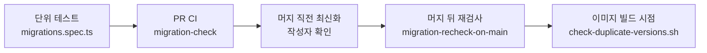

> 구현 상태: 구현됨 · 원문: `spec/conventions/migrations.md`, `spec/0-overview.md` (§2.8 DB 마이그레이션, Rationale «DB 마이그레이션 도구로 Flyway 채택») · 용어: [용어 사전](../CLE-GLOSSARY.md)

## 개요

PostgreSQL 스키마를 바꾸는 마이그레이션(migration, `V<N>__*.sql`)을 Flyway 로 운영하는 규약이다. 규칙과 도구는 모두 아래 세 가지 안전 기준을 지키는 수단이다.

1. **충돌 방지**: 여러 PR 이 동시에 진행될 때 같은 V번호를 함께 차지하는 사고를 미리 막는다.
2. **순서 보장**: 마이그레이션 적용 순서를 작성 의도와 같게 한다. `V<N+1>` 이 `V<N>` 의 컬럼을 참조하는 것 같은 의존성 사고를 막는다.
3. **운영 안전성**: 이미 운영에 적용된 마이그레이션을 고쳐 Flyway checksum 이 어긋나 부팅이 실패하는 일을 막는다.

이 문서는 도구 선택과 실행 방식, 파일 이름, 마이그레이션 번호 정책, 머지 race 안전망을 정한다.

범위 밖:

- SQL 작성 가이드(트랜잭션 모드, `NOT VALID` 패턴, extension 의존성, `.conf` 사용법, repair 절차)는 코드 저장소의 `codebase/backend/migrations/README.md` 가 맡는다.
- 엔티티 컬럼 정의와 스키마의 기준은 [데이터 모델 개요](../CLE-PLAT/CLE-PLAT-DATA.md) 가 정한다.
- 런타임에 raw SQL 결과를 읽는 방법은 [raw SQL 결과 읽기 규약](CLE-ENG-RAWQUERY.md) 이 정한다. 스키마 변경 절차와는 축이 다르다.

이 문서에서 CI 워크플로우(GitHub Actions)는 GitHub Actions 파이프라인을 뜻한다. 제품의 워크플로우와 다르다.

## Flyway 운영 방식

백엔드 ORM 은 TypeORM 이지만 스키마를 ORM 이 만들게 두지 않는다(`synchronize: false`). 스키마는 Flyway SQL 마이그레이션이 만든다.

| 항목 | 방식 |
| --- | --- |
| 도구 | **Flyway** |
| 버전 관리 | SQL 기반 마이그레이션 파일. 이름은 `V{version}__{description}.sql` |
| 롤백 정책 | **forward-only**. 별도 undo 스크립트(`U{version}__...sql`)를 두지 않는다. 운영 사고에 대비한 롤백 SQL 은 각 마이그레이션 파일 하단에 `-- DOWN:` 주석으로 남긴다(`codebase/backend/migrations/README.md` §2) |
| CI/CD 연동 | 배포 파이프라인에서 `flyway migrate` 를 자동 실행한다. 마이그레이션이 실패하면 배포를 멈춘다. 저장소에는 배포 파이프라인이 아직 없다([비기능 요구사항](../CLE-PLAT/CLE-PLAT-NFR.md) 의 NF-DP-05, 부분 구현) |
| 실행 방식 | 전용 Flyway Docker 이미지(`codebase/backend/migrations/Dockerfile`, `flyway/flyway:10-alpine`)에 `V*.sql` 과 마이그레이션별 `V*.conf` 를 COPY 한다. DB 접속 정보는 CLI 인자(`-url` / `-user` / `-password`)로 넣는다. 환경별 `flyway-{env}.conf` 파일은 쓰지 않는다 |
| 기준선 | 최초 배포 때 `flyway baseline` 으로 기준점을 정한다 |

## 규칙

1. 파일 이름은 `codebase/backend/migrations/V<번호>__<snake_case_descriptor>.sql` 이다. `executeInTransaction=false` 처럼 설정이 필요할 때만 같은 base name 의 `.conf` 를 함께 둔다.
2. 번호는 단조 증가하는 정수다. `V001__initial_schema.sql` 부터 시작해 1씩 늘린다.
3. 설명자는 `snake_case` 다. 권장 문자집합은 영문 소문자·숫자·`_` 이고 모든 실제 파일(`V001`~)이 이를 따른다. 가드 정규식은 이보다 넓게 허용하므로 일관성은 이 규약으로 지킨다([가드의 허용 범위](#가드의-허용-범위)).
4. `.conf` 는 항상 `.sql` 과 같은 base name(`V<NNN>__<descriptor>`)을 쓴다. 예: `V033__embedding_hnsw_1024.sql` ↔ `V033__embedding_hnsw_1024.conf`.
5. **정수가 아닌 접미사를 붙이지 않는다**(`V035a`, `V035_1` 등). Flyway 기본 version 파서가 매치에 실패해 `schema_history` 에 등록되지 않은 채 조용히 건너뛴다(silent skip). `codebase/backend/src/migrations.spec.ts` 가 빌드·CI 마다 검증한다.
6. 새 V번호는 항상 현재 main 의 max(V) **+1** 이다.
7. 번호를 건너뛰지 않는다(gap 금지). 두 개를 더하면 `+1`, `+2` 여야 한다.
8. 한 번 main 에 들어간 V번호를 다른 마이그레이션에 다시 쓰지 않는다.
9. **append-only**: 이미 main 에 들어간 `V<N>` 의 `.sql`·`.conf` 는 고치지 않는다. 컬럼·인덱스·제약을 더하거나 바꾸거나 지우려면 새 `V<N+k>` 로 `ALTER`·`DROP`·`CREATE` 를 쓴다.
10. 운영 사고로 checksum 을 어쩔 수 없이 다시 맞춰야 하면 `migrate-repair` 서비스를 쓴다(절차는 `codebase/backend/migrations/README.md` §6 끝부분).
11. Flyway `outOfOrder` 옵션을 쓰지 않는다. Flyway 기본값 `false` 를 유지한다.
12. 롤백은 forward-only 다. undo 스크립트를 두지 않고 롤백 SQL 은 파일 하단 `-- DOWN:` 주석으로 남긴다.
13. `CREATE INDEX CONCURRENTLY` 를 쓰는 파일은 교체든 신규 추가든 `CREATE` 앞에 invalid 잔재 정리(`DROP INDEX CONCURRENTLY IF EXISTS <새 인덱스 이름>`)를 둔다(`codebase/backend/migrations/README.md` §5).
14. 새 마이그레이션은 [추가 절차](#새-마이그레이션-추가-절차)를 따른다.
15. PR 을 연 뒤에는 되도록 빨리 리뷰·머지해 다른 PR 과 V번호를 함께 차지하는 기간을 짧게 한다.
16. 머지 직전 확인은 작성자 책임이다([머지 직전 최신화](#머지-직전-최신화)).
17. Python 가드와 빌드 시점 가드는 같은 V번호 정규화 규칙(`V0*([0-9]+)__`)을 쓴다. 정책이 바뀌면 두 가드를 함께 고친다.

## 규칙 보충

### append-only 와 checksum

Flyway 는 부팅할 때 적용된 마이그레이션마다 SQL 내용의 checksum 을 `flyway_schema_history` 와 비교한다. 파일이 한 글자라도 바뀌면 `Migration checksum mismatch for migration version NNN` 으로 부팅이 실패한다. 규칙 9 가 이것을 막는다.

적용된 마이그레이션의 주석에 남은 옛 스펙 경로와 지운 `plan/` 경로도 고치지 않는다. `.sql` 은 주석만 바꿔도 checksum 이 달라져 부팅이 실패한다. `.conf` 는 규칙 9(append-only)를 따라 고치지 않는다. 규칙 10 의 `migrate-repair` 는 운영 사고로 checksum 을 어쩔 수 없이 다시 맞출 때 쓴다. 주석 정리는 그 범위에 들지 않는다.

아래 옛 경로 래칫은 파일별 기준값보다 늘어도 줄어도 실패하는 양방향 래칫이다([용어 사전 — 다의어 구분](../CLE-GLOSSARY-POLY.md)). 줄면 통과하는 단방향 래칫과의 차이는 [스펙과 구현 근거 규약](CLE-ENG-SPECEVIDENCE.md) R-15 에 있다. codebase 텍스트 파일에서 옛 스펙 경로나 지운 `plan/` 경로를 적은 줄은 옛 경로 래칫(`legacy-path-ratchet.test.ts`, [스펙과 구현 근거 규약](CLE-ENG-SPECEVIDENCE.md) R-15 «codebase 의 옛 경로는 래칫으로 막고 고칠 때 바꾼다»)이 파일별로 센다. 적용된 마이그레이션(`V*.sql` · `V*.conf`)의 언급은 이 기준값에 영구히 남는다. 수치는 스펙과 구현 근거 규약 R-15 에 있다. 새 마이그레이션의 주석에는 옛 경로 대신 미러에 있는 문서의 NERV 키와 절 제목을 쓴다. 새 마이그레이션이 옛 경로를 적으면 래칫이 실패한다.

### `outOfOrder=false` 를 유지하는 이유

`outOfOrder=true` 는 옛 V번호가 늦게 들어와도 실행을 허용한다. 이 환경에서 두 PR 이 동시에 `V<N+1>` 을 만들고 한쪽이 `V<N+2>` 로 양보한 뒤 늦게 머지되면 의도한 의존성 순서와 실제 적용 순서가 어긋난다. 이 규약은 PR CI 단계에서 V번호 충돌을 잡아내므로 `outOfOrder` 를 켤 필요가 없다.

### 인덱스 마이그레이션의 invalid 잔재

`IF NOT EXISTS` 는 이름만 본다. 그것만 두면 실패 뒤 재실행이 교체에서는 **쓸 수 있는 인덱스를 0개로** 만들고(V056), 신규 추가에서는 invalid 인덱스를 **계속 유효하지 않은 채로** 남긴다(V106). 규칙 13 의 `DROP INDEX CONCURRENTLY IF EXISTS` 가 이 잔재를 치운다.

### 가드의 허용 범위

가드 정규식의 허용 문자집합은 위치마다 권장 집합보다 넓다.

| 가드 | 정규식 | 권장 집합보다 더 받는 것 |
| --- | --- | --- |
| `codebase/backend/src/migrations.spec.ts` 의 `SQL_NAME_RE` | `[a-z0-9_-]+` | 하이픈 |
| `scripts/check-migration-versions.py` 의 `SQL_RE` | `[A-Za-z0-9_]+` | 대문자 |

권장 집합을 벗어나도 두 가드는 통과한다. 그래서 규칙 3 의 일관성은 이 규약으로 지킨다.

## 새 마이그레이션 추가 절차

1. `git fetch origin main` 뒤 `git merge origin/main` 으로 base 를 최신으로 맞춘다. 코드 리뷰를 내기 전이면 `git rebase origin/main` 도 된다([리뷰 게이트와의 관계](#리뷰-게이트와의-관계)).
2. `ls codebase/backend/migrations | tail -2` 로 현재 max V 를 확인한다.
3. `V<max+1>__<descriptor>.sql` 을 쓴다. 필요하면 같은 base name 의 `.conf` 를 함께 둔다(`codebase/backend/migrations/README.md` §4·§5). 주석은 옛 스펙 경로나 지운 `plan/` 경로를 적지 않고 NERV 키와 절 제목으로 가리킨다. 그 키는 미러에 있어야 한다. 없으면 같은 PR 에서 미러로 받는다. 키 언급 가드 `spec-key-mentions` 가 `.sql` 과 `.conf` 도 확인한다([append-only 와 checksum](#append-only-와-checksum)).
4. 로컬에서 `python3 scripts/check-migration-versions.py --base origin/main` 으로 V번호 가드를 통과시킨다.
5. `make e2e-test` 로 미리 적용해 본다. e2e 컨테이너의 Flyway 가 실제 마이그레이션을 적용한다.
6. PR 을 연다. CI 의 `migration-check` 가 같은 검사를 다시 돌린다.

## 충돌 검출과 머지 race 안전망

V번호 충돌과 머지 race 는 여러 단계로 막는다. 한 단계를 우회할 수 있으면 다음 단계가 fail-fast 로 잡도록 층을 쌓았다.



### PR CI 가드

`pull_request` 이벤트마다 CI 워크플로우(GitHub Actions) `.github/workflows/migration-check.yml` 이 `scripts/check-migration-versions.py` 를 실행해 다음을 검사한다. 모든 위반 메시지는 `[migration-guard] ` 접두로 시작한다.

| 검사 | 위반 예 | 메시지 |
| --- | --- | --- |
| 중복 | 같은 `V<N>__*.sql` 두 개 | `[migration-guard] FAIL: V041 is duplicated` |
| 단조성 | 새 `V<N>` 이 main 의 max 이하 | `[migration-guard] FAIL: V040 is not greater than base (origin/main) max V040` |
| 연속성 | 번호를 건너뜀(예: V041 없이 V042) | `[migration-guard] FAIL: V042 leaves a gap (expected V041 after base max V040)` |
| `.conf` 짝 | `.conf` 의 base name 이 `.sql` 과 다름 | `[migration-guard] FAIL: V041 .conf base name does not match its .sql` |

위반하면 CI 워크플로우가 exit 1 로 끝나 PR 머지가 막힌다. 작성자가 base 를 최신으로 맞춰 V번호를 다시 정하면 바로 다시 검증된다. 로컬에서 같은 검사를 돌리려면 다음을 실행한다.

```bash
python3 scripts/check-migration-versions.py --base origin/main
```

### 머지 직전 최신화

PR CI 가 통과한 바로 뒤에 다른 PR 이 먼저 머지되면 main 의 max(V) 가 앞질러질 수 있다(merge race). 저장소 설정으로 "머지 전 브랜치 최신화" 를 강제할 수 없어(Rationale «운영 규약으로 race 를 막는 이유» 참조) 아래 운영 규약으로 대신한다.

작성자는 머지 직전에 다음을 확인한다.

1. `git fetch origin main && git merge origin/main` 으로 base 를 최신으로 맞춘다. 코드 리뷰를 내기 전이면 `git rebase origin/main` 도 된다. 리뷰를 낸 뒤에 rebase 하면 리뷰를 다시 내야 한다([리뷰 게이트와의 관계](#리뷰-게이트와의-관계)).
2. push 한 뒤 PR 의 최신 커밋에서 `migration-check` 가 통과했는지 확인한다.
3. 이 PR 에 `migration-recheck-on-main` 알림 코멘트가 달려 있으면 무조건 1·2 를 다시 한다.

이 규약은 `.github/PULL_REQUEST_TEMPLATE.md` 의 Migration checklist 와 짝을 이룬다. 작성자는 체크박스로 스스로 확인한다. 템플릿 체크박스, `migration-recheck-on-main` 알림 코멘트, `scripts/check-migration-versions.py` 의 안내 문구는 이 절과 같이 merge 최신화를 안내하고 이 문서를 가리킨다(2026-10-03, NERV Task `CLE-T-VP5KDJ`).

#### 리뷰 게이트와의 관계

마이그레이션 파일은 `codebase/**` 아래라 push 훅과 CI `review-gate` 가 NERV 코드 리뷰 라운드를 요구한다(전환 단계 2 부터). 게이트는 리뷰 라운드의 head 커밋이 지금 HEAD 의 조상이어야 통과시킨다.

- `git merge origin/main` 은 라운드 head 를 조상으로 남긴다. 기준 브랜치에서 온 커밋과 충돌 없이 끝난 merge 커밋은 게이트가 리뷰 뒤 변경으로 세지 않는다. 변경 종류에 따라 붙는 강제 리뷰어도 라운드가 본 파일(라운드 head 와 기준 브랜치의 merge-base 이후)로만 판정하므로 main 에서 들어온 파일 때문에 리뷰어가 더 필요해지지 않는다. 그래서 리뷰를 낸 PR 은 merge 로 최신화한다.
- `git rebase origin/main` 은 커밋을 다시 써서 라운드 head 가 조상이 아니게 된다. 코드 리뷰를 지금 HEAD 로 다시 내야 한다. 다시 낼 때는 필수 6역할에 더해 변경 종류에 따라 붙는 강제 리뷰어(마이그레이션 SQL 이면 database, 문서를 바꿨으면 documentation 등)도 함께 낸다.
- merge 충돌을 손으로 풀었거나 V번호를 바꾸려고 파일 이름을 바꾸거나 고친 커밋은 리뷰 뒤 변경이다. 리뷰 발견을 고친 커밋으로 처분했거나 커밋 메시지가 그 발견을 `finding <발견 전체 ID>` 로 인용했거나 새 라운드를 내야 게이트가 통과시킨다.

판정 규칙의 정본은 저장소 `.claude/hooks/_lib/review_guard.py` docstring 이다.

### 머지 뒤 안전망 (`migration-recheck-on-main`)

`codebase/backend/migrations/**` 가 main 에 push 되면(마이그레이션 PR 이 머지된 직후) CI 워크플로우(GitHub Actions) `.github/workflows/migration-recheck-on-main.yml` 이 두 가지를 자동으로 한다.

- **머지 뒤 점검**: main 에서 `python3 scripts/check-migration-versions.py --base HEAD~1` 를 실행한다. 중복·gap·단조성·`.conf` 짝 위반이 main 에 실제로 들어왔으면 CI 워크플로우가 실패해 Actions 탭에 빨간불이 켜진다. Slack·이메일 알림이 연동돼 있으면 자동으로 알린다.
- **자동 알림 코멘트**: 열린 PR 중 변경 목록에 `codebase/backend/migrations/**` 파일이 있는 PR 에 최신화하고 CI 를 다시 돌리라는 코멘트를 자동으로 단다. 작성자가 race 가능성을 바로 알고 머지 직전 최신화 규약을 따르게 한다. 코멘트는 `git merge origin/main` 으로 최신화하라고 안내한다. 코드 리뷰를 내기 전이면 rebase 도 된다([리뷰 게이트와의 관계](#리뷰-게이트와의-관계)).

두 작업 모두 머지 자체를 막지는 못한다. 지금 환경에서 가능한 최대 강도는 즉시 드러내고 알리는 것이다. 유료 플랜으로 바꾸면 branch protection 을 머지 직전 규약 자리로 올리고 이 안전망은 백업으로 둘 수 있다(Rationale «기각한 대안 4»).

### 빌드 시점 가드 (`check-duplicate-versions.sh`)

마이그레이션 Docker 이미지(`codebase/backend/migrations/Dockerfile`) 빌드의 마지막 RUN 단계에서 `/flyway/sql` 의 `V*.sql` 을 검사한다. 같은 V번호가 둘 이상이면 **빌드 자체를 실패**시킨다. 같은 정수로 정규화되는 모든 형태(`V41` 과 `V041`, `V050__a.sql` 과 `V050__b.sql` 등)가 중복으로 잡힌다.

용도는 PR CI·머지 뒤 재검사와 같은 중복 검출이지만 검사 시점이 다르다. 그래서 다음 경우에도 막는다.

- 단위 테스트·PR CI 를 거치지 않은 빌드: 긴급 hotfix, 로컬 운영자의 임시 빌드, 외부 환경의 직접 `docker build`.
- CI 가드 스크립트나 이 규약이 잘못 고쳐져 PR CI 가드가 의미를 잃은 경우. 빌드 단계 가드는 같은 이미지를 쓰는 모든 환경에 똑같이 걸리므로 정책이 잠시 어긋나도 안전하다.

위반 출력 예(stderr):

```text
ERROR: duplicate Flyway migration version(s) detected in /flyway/sql:
  V041:
    - /flyway/sql/V041__one.sql
    - /flyway/sql/V041__two.sql

Policy: CLE-ENG-MIGRATION (spec/CLE-ENG/CLE-ENG-MIGRATION.md), V번호 단조성·중복 방지.
Add a new migration with a unique V<N+1> prefix instead.
```

출력의 `Policy:` 줄은 이 문서의 키와 저장소 미러 경로를 찍는다. 경로는 편의 표시이고 기준은 키다. 이 문서의 미러 경로가 바뀌면(다른 영역으로 옮기면) 스크립트의 출력도 함께 고친다. 전환 단계 4g(NERV Task `CLE-T-M7K35H`)에서 옛 저장소 문서 경로를 바꿨다.

코드도 이 문서를 인용한다. 절 제목(「충돌 검출과 머지 race 안전망」 · 「빌드 시점 가드」 · «기각한 대안 4»)은 `check-duplicate-versions.sh` · 마이그레이션 `Dockerfile` · `README.md` · `codebase/backend/src/migrations.spec.ts` · 두 CI 워크플로우가 적는다. 미러 경로는 `scripts/check-migration-versions.py` 의 안내에도 있다. `.github/PULL_REQUEST_TEMPLATE.md` 와 `migration-recheck-on-main` 알림 코멘트는 미러 경로와 앵커로 링크한다. 이 문서의 절 제목이나 미러 경로를 바꾸면 이 인용도 함께 고친다.

로컬에서 이미지를 빌드하지 않고 같은 검사를 돌리려면 다음을 실행한다.

```bash
codebase/backend/migrations/check-duplicate-versions.sh codebase/backend/migrations
```

이 가드는 Python 가드와 같은 V번호 정규화 규칙(`V0*([0-9]+)__`)을 쓴다(규칙 17).

## 구현 위치

- `codebase/backend/migrations/**` (마이그레이션 파일, `Dockerfile`, `check-duplicate-versions.sh`, `README.md`)
- `codebase/backend/src/migrations.spec.ts` (파일 이름·`.conf` 짝·중복·정수가 아닌 접미사 검사)
- `scripts/check-migration-versions.py`
- `.github/workflows/migration-check.yml`
- `.github/workflows/migration-recheck-on-main.yml`
- `.github/PULL_REQUEST_TEMPLATE.md` (Migration checklist)

## Rationale

### DB 마이그레이션 도구로 Flyway 를 쓴다

- **배경**: 백엔드 ORM 은 TypeORM 이고 스키마를 ORM 이 만들게 두지 않는다(`synchronize: false`). ORM 이 엔티티에서 만드는 마이그레이션 대신 SQL 을 직접 쓴다.
- **채택**: SQL 기반 Flyway(`V<NNN>__<descriptor>.sql`)를 별도 도구로 들였다. SQL 기반을 쓰는 이유는 셋이다. (a) 운영 DB 에 적용되는 SQL 을 PR 에서 그대로 리뷰할 수 있다. (b) `ALTER` 의 잠금 동작과 트랜잭션 모드를 세밀하게 다룰 수 있다. (c) extension·partial index·CHECK 제약·`NOT VALID` 같은 Postgres 고유 기능을 표현할 수 있다.
- **trade-off**: TypeORM 엔티티 데코레이터와 Flyway SQL 두 곳에 스키마가 있어 drift 위험이 있다. `codebase/backend/src/migrations.spec.ts` 가 CI 마다 파일 이름 규칙을 검증해 silent skip(`schema_history` 미등록)을 막는다. 그래도 스키마 정의가 두 곳에 있는 것은 받아들인 비용이다. 그 drift 는 e2e 가드 `entity-schema-declarations` 가 잡는다. 인덱스·제약은 선언에서 DB 한 방향으로, 컬럼 정의는 양방향으로 대조한다([데이터 모델 개요](../CLE-PLAT/CLE-PLAT-DATA.md)).

### forward-only 롤백

별도 undo 스크립트(`U{version}__...sql`)를 두지 않는다. 운영 사고 때 빠른 복구는 각 파일 하단의 `-- DOWN:` 주석으로 충분하다. 자동 undo 체인을 유지하는 비용과 위험(부분 적용 상태에서 down 이 실패하는 것) 대비 이득이 낮다고 판단했다. 옛 초안은 `U{version}` undo 스크립트를 전제했으나 이 결정으로 버렸다.

### DB 접속 정보는 CLI 인자로 넣는다

환경별 `flyway-{env}.conf` 파일 대신 전용 Flyway Docker 이미지에 DB 접속 정보를 CLI 인자(`-url`/`-user`/`-password`)로 넣는다. 컨테이너 오케스트레이션의 시크릿 주입 방식과 자연스럽게 맞는다. 환경별 conf 파일을 저장소에 두지 않아 시크릿이 드러날 곳도 줄어든다. 옛 초안은 환경별 conf 파일을 전제했으나 이 결정으로 버렸다.

### 운영 규약으로 race 를 막는 이유

이 결정을 내릴 때 저장소는 GitHub 무료 플랜의 private 저장소였다. 이 환경에서는 branch protection 의 "Require branches to be up to date before merging" 옵션을 쓸 수 없다. 그래서 머지 직전 최신화(작성자 책임)와 `migration-recheck-on-main`(머지 뒤 안전망)으로 race 를 대신 막는다. 자세한 제약은 아래 «기각한 대안 4» 에 있다.

### 최신화에 merge 를 허용한 이유 (2026-10-01)

처음 규약은 머지 직전 최신화를 `git rebase origin/main` 하나로 적었다. 그때 리뷰 게이트는 커밋된 리뷰 산출물의 시각과 코드 커밋의 author 시각을 견줬다. rebase 는 author 시각을 그대로 두므로 게이트는 일부러 rebase 에 영향받지 않게 설계돼 있었다. 전환 단계 2 의 NERV 판정은 그렇지 않다. rebase 는 커밋을 다시 써서 리뷰 라운드의 `head_sha` 를 HEAD 의 조상에서 빼고, `fixed` 처분에 적힌 `commit_sha` 도 브랜치에서 닿지 않게 만든다. 그래서 리뷰를 낸 PR 이 rebase 하면 전체 재리뷰가 필요하다. merge 는 두 해시를 그대로 둔다. 단계 2 의 일관성 검토(finding 01a0f6c1-82ed-755d-b6ae-6c3af354438a)가 이 충돌을 찾았다.

race 를 막는 데 필요한 것은 base 를 최신으로 맞추는 일이고 그 방법이 rebase 일 필요는 없다. 그래서 merge 를 허용했다. 2026-10-03(NERV Task `CLE-T-VP5KDJ`)에 PR 템플릿 Migration checklist · `migration-recheck-on-main` 알림 코멘트 · PR CI 가드 `scripts/check-migration-versions.py` 의 안내 문구를 같은 내용으로 맞췄다. 빌드 시점 가드(`check-duplicate-versions.sh`)의 안내는 그때 바꾸지 않았다. 그 안내와 `Dockerfile` · `README.md` · `migrations.spec.ts` 의 정책 인용은 전환 단계 4g(2026-10-03, NERV Task `CLE-T-M7K35H`)에서 옛 경로 래칫과 함께 이 문서 키로 바꿨다. 게이트가 rebase 를 받아 주게 하는 안은 «기각한 대안 5» 에 있다.

### 적용된 마이그레이션의 옛 경로 주석을 고치지 않는다 (2026-10-03)

전환 단계 4g(NERV Task `CLE-T-M7K35H`)에서 codebase 의 옛 스펙 경로와 지운 `plan/` 경로를 옛 경로 래칫으로 막았다. 다른 파일은 고칠 때 그 언급을 바꾼다. 적용된 마이그레이션의 주석은 바꾸지 않고 래칫 기준값에 남긴다. 규칙 9(append-only)가 적용된 파일의 수정을 막는다. `.sql` 은 주석 한 글자만 바뀌어도 checksum 이 어긋나 부팅이 실패한다. 규칙 10 의 `migrate-repair` 는 운영 사고 때 checksum 을 다시 맞추는 수단이라 주석 정리에는 쓰지 않는다. 래칫의 판정과 기준값은 [스펙과 구현 근거 규약](CLE-ENG-SPECEVIDENCE.md) R-15 에 있다.

### 기각한 대안 1: 타임스탬프 접두 (`V<YYYYMMDDHHMMSS>__...`)

고유성을 자연스럽게 보장하는 장점이 있지만 다음 단점으로 버렸다.

- 타임스탬프 순서가 실제 의도한 실행 순서와 어긋날 수 있다. 작성자 시계 차이·머지 순서·cherry-pick 때문에 의존성이 깨진다.
- Flyway 의 단조 정수 모델과 잘 맞지 않아 `outOfOrder` 위험을 떠안게 된다.
- 한 PR 의 마이그레이션을 다른 PR 의 마이그레이션 사이에 끼워 넣을 동기가 생겨(시계상 뒤 순서) append-only 원칙이 흔들린다.

### 기각한 대안 2: `flyway.outOfOrder=true`

옛 V번호가 늦게 들어와도 실행한다. PR 충돌 부담은 줄지만 다음 문제가 있다.

- **의존성 사고 위험**: `V<N+1>` 이 `V<N>` 의 컬럼을 참조하도록 코드를 써 두었는데 운영에는 `V<N>` 이 더 늦게 들어가는 경우가 생긴다.
- 환경마다 적용 이력이 달라져 디버깅과 재현이 어렵다.

그래서 `outOfOrder=false` 를 유지하고 PR CI 가드로 충돌을 미리 막는다.

### 기각한 대안 3: GitHub Merge Queue

자동화 강도는 가장 높지만 다음 이유로 택하지 않았다.

- GitHub 플랜에 달려 있고 설정 비용이 작지 않다. private 저장소의 merge queue 는 유료 플랜에서만 된다.
- 이 저장소 규모에서는 머지 직전 규약과 머지 뒤 안전망만으로 race 빈도 대비 비용 효율이 더 낫다.
- PR 동시성이 늘어 race 가 잦아지면 다시 검토할 후보로 둔다.

### 기각한 대안 4: GitHub branch protection "Require branches to be up to date"

race 를 막는 정공법이지만 GitHub 무료 플랜 private 저장소에는 다음 제약이 있다.

- Settings → Branches → Branch protection rules 의 일부 옵션(특히 required status checks, "up to date" 강제)이 무료 private 에서 꺼져 있다.
- `gh api -X PUT repos/<owner>/<repo>/branches/main/protection` CLI 도 같은 플랜 제약으로 실패한다.

그래서 지금은 머지 직전 규약과 `migration-recheck-on-main` 으로 대신한다. 유료 플랜으로 바꾸면 다음 순서로 올리는 것을 검토한다.

1. Settings → Branches → main → "Require branches to be up to date before merging" 을 켠다.
2. `migration-check / guard` 를 required status check 로 등록한다.
3. 머지 직전 작성자 책임 규약을 자동 차단으로 흡수한다.
4. `migration-recheck-on-main` 은 백업으로 둔다. race 가 나중에라도 main 에 들어왔을 때 드러내는 역할은 branch protection 이 대신하지 못한다.

### 기각한 대안 5: 게이트가 rebase 전후 커밋을 patch-id 로 짝짓기

단계 2 의 일관성 검토(finding 01a0f6c1-82ed-755d-b6ae-6c3af354438a)가 함께 낸 안이다. 게이트가 rebase 전후 커밋을 patch-id 로 짝지어 같은 변경이면 리뷰 라운드와 처분을 이어 준다. 택하지 않았다.

- rebase 가 충돌을 풀면 patch-id 가 달라져 짝을 찾지 못한다. 결국 재리뷰가 필요하다.
- 게이트가 "같은 변경" 을 판정하는 범위가 넓어진다. merge 로 최신화하면 이 판정이 필요 없다.
