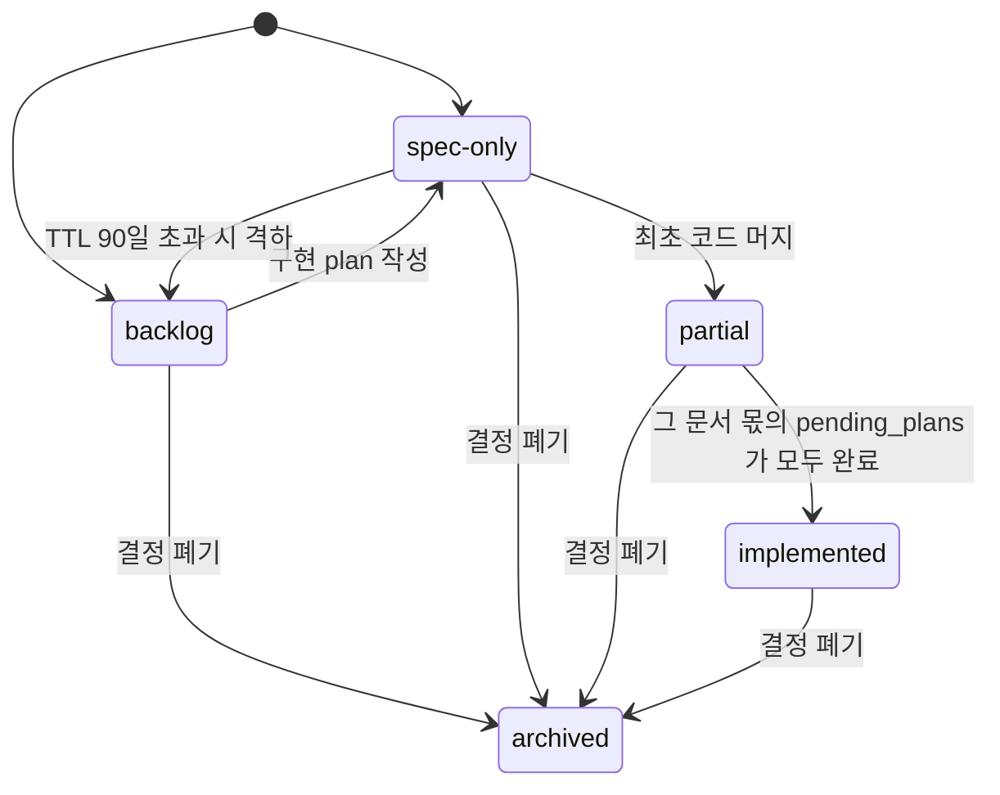

> 구현 상태: 구현됨 · 원문: `spec/conventions/spec-impl-evidence.md` · 용어: [용어 사전](../CLE-GLOSSARY.md)

## 개요

스펙 문서가 약속한 표면(surface)과 실제 구현 코드 사이의 정적 근거(evidence)를 스펙 파일 frontmatter 에 적고 빌드에서 검증하는 규약이다. 텔레그램 채팅 채널 UI 가 스펙에 약속된 채 오래 구현되지 않았던 사례처럼 "스펙 약속과 구현 부재" 사이의 갭을 빌드 가드로 막는다.

이 규약 전의 검사는 모두 변경을 계기로 돌았다.

- `/consistency-check`: 스펙 초안과 구현 착수 시점에만 돈다.
- `/ai-review`: PR diff 안만 본다.
- `user-guide-sync-reviewer`: 코드에서 가이드로 가는 한 방향만 본다.
- `nodes-coverage`·`hydration-coverage` 같은 빌드 가드: 등록부 열거만 본다.

그래서 "스펙이 약속한 표면이 **지금** 구현돼 있는가" 는 어떤 검사도 묻지 않았다. 이 규약은 스펙 파일 frontmatter 에 스펙 상태(spec status, `status`)·`code:`·`pending_plans:` 를 의무로 두고 [frontmatter 근거 가드 4건](#빌드-가드--frontmatter-근거-4건)으로 정합성을 강제한다. 스펙 문서 저장소(링크·영역 index)와 plan 의 무결성을 지키는 [별도 가드 가족](#빌드-가드--스펙-문서-저장소와-plan-무결성)도 이 문서가 정한다.

이 규약의 규칙은 스펙이 저장소 `spec/**.md` 파일이고 작업 추적이 `plan/**` 파일이라는 전제 위에 있다. 스펙을 NERV 로 옮기면서 전제가 바뀌는 부분은 [NERV 이전 영향](#nerv-이전-영향) 에 모았다.

범위 밖:

- 사용자 가이드 본문이 약속한 코드의 실재는 [사용자 가이드 근거 규약](CLE-ENG-GUIDEEVIDENCE.md) 이 정한다.
- plan frontmatter 필드 정의와 plan 라이프사이클은 저장소 `.claude/docs/plan-lifecycle.md` §4·§5 가 정한다.
- spec-coverage 정기 감사의 절차와 산출물은 저장소 `.claude/skills/spec-coverage/SKILL.md` 가 정한다.

## 규칙

1. [적용 대상](#적용-대상) 스펙 파일에는 frontmatter 가 있어야 한다. `id`·`status` 는 늘 의무이고 `code:`·`pending_plans:` 는 상태에 따라 의무다.
2. 적용 대상 목록을 바꿀 때는 이 문서의 목록과 `spec-frontmatter-parse.ts` 의 `INCLUDE_PREFIXES` 를 함께 고친다.
3. `id` 는 kebab-case 이고 파일 basename(확장자 제외) 기반을 권장한다. 같은 basename 이 영역을 달리해 겹치면 나중에 온 문서가 영역 접두를 붙여 피한다.
4. `status` 는 `backlog`·`spec-only`·`partial`·`implemented`·`archived` 다섯 값 중 하나이고 [라이프사이클](#스펙-상태-라이프사이클)을 따른다.
5. `status` 가 `partial` 이나 `implemented` 면 `code:` 글로브가 파일 1개 이상에 매치해야 한다.
6. `code:` 경로는 저장소 루트 기준 상대 경로이고 글로브를 허용한다. 넓은 트리 글롭으로 가드만 통과시키지 않는다. 그것은 아무것도 가리키지 않는 것과 같다.
7. 강제하는 코드가 없는 순수 문서형 규약은 `code:` 에 **그 규약을 실제로 지키는 예시 파일**을 적는다. 한 문서 안에서도 축마다 강제 여부가 갈릴 수 있으므로 이 판단은 축 단위로 한다. 그런 문서의 `code:` 에는 준수 예시와 시행 코드를 섞어 담아도 되고 범주를 인라인 YAML 주석으로 갈라도 된다(선례: [리뷰 산출물 인용 규약](CLE-ENG-REVIEWCITE.md)).
8. `status: partial` 이면 `pending_plans:` 를 적는다. 각 경로는 `plan/in-progress/` 에 있거나 in-progress 를 complete 로 바꾼 경로로 `plan/complete/` 에 있어야 한다.
9. `spec-only` 는 90일 안에 구현 plan 을 쓰고 `pending_plans:` 에 올린다. 90일을 넘기면 빌드가 실패한다. 그때는 PR 로 구현하거나 `backlog` 로 내린다.
10. `backlog` 의 `id` 는 저장소 `spec/0-overview.md` 본문에 나와야 한다. §6.3 로드맵 항목에 올리는 것을 권장한다.
11. `partial` 의 `pending_plans` 가 모두 `complete/` 로 옮겨지면 `implemented` 로 올린다. 마지막 plan 을 옮기는 커밋 안에서 올린다.
12. `pending_plans` 가 여러 문서가 함께 쓰는 공유 트래커면 트래커 파일 이동 대신 **그 문서 몫의 미구현 표면이 0 이 된 커밋**에서 올리고 트래커를 `pending_plans` 에서 뺀다. 판정 근거를 그 승격 커밋에 남긴다([전이 규칙](#전이-규칙)).
13. `archived` 는 본문 끝에 폐기 사유를 적는다.
14. `user_guide:` 에 가이드 페이지를 적을 때 가이드가 한국어·영어로 모두 있으면 로케일 쌍(`<name>.mdx` + `<name>.en.mdx`)을 모두 적는다.
15. `started` 가 2026-06-04 이후인 완료 plan(`plan/complete/`)은 frontmatter 에 `spec_impact` 를 선언한다(Gate C). 값은 실존하는 스펙 경로 목록이거나 의도적 no-op 표시(`none`·`없음`·`n/a`·`na`)다.
16. Gate C 의 cutoff 값(2026-06-04)은 이 문서·`plan-lifecycle.md`·테스트 세 곳에 같게 둔다. 바꿀 때는 세 곳을 함께 고친다.
17. 스펙 문서가 `plan/**` 을 링크하면 그 plan 을 옮길 때 링크도 함께 고친다. 고치지 않으면 링크 무결성 가드가 빌드를 깬다.

## 적용 대상

다음 경로의 스펙 파일에 frontmatter 가 의무다(포함 목록).

- `spec/2-navigation/**.md`
- `spec/3-workflow-editor/**.md`
- `spec/4-nodes/**.md`
- `spec/5-system/**.md`
- `spec/7-channel-web-chat/**.md`
- `spec/conventions/**.md`

포함 목록에 없는 영역은 frontmatter 근거 가드에서만 일부러 뺀 것이다(가드 `INCLUDE_PREFIXES` 에 없음). 대표로 `spec/data-flow/**` 는 데이터 흐름 그림과 엔티티·흐름 매핑 문서라 구현 라이프사이클(`backlog`→`implemented`)을 추적할 제품 표면이 아니다. 그래서 frontmatter(`id`/`status`/`code`) 의무가 없고 해당 파일에는 frontmatter 자체가 없다. 단 [링크 무결성·영역 index 가드](#빌드-가드--스펙-문서-저장소와-plan-무결성)는 `spec/data-flow/` 에도 그대로 걸린다. 제외는 frontmatter 근거 가드에 한정된다.

포함 목록 안에서도 다음 파일은 빠진다. 가드 구현(`spec-frontmatter-parse.ts`)은 basename 으로 매칭한다.

| 제외 | 이유 |
| --- | --- |
| basename `0-overview.md` | 전체·영역 진입 문서. 루트 `spec/0-overview.md` 와 `spec/<영역>/0-overview.md`(예: `spec/4-nodes/0-overview.md`) 모두 해당. `EXCLUDE_BASENAMES` 에 등재 |
| basename `1-data-model.md` · `6-brand.md` | 단순 개요 성격. `EXCLUDE_BASENAMES` 에 등재 |
| `spec/_*.md` 와 `spec/<영역>/_*.md` | 밑줄 접두. leaf 가 아닌 layout·index 성격(예: `_layout.md`, `_product-overview.md`, `_overview.md`) |
| `spec/conventions/<name>-api-catalog/<resource>/**/*.md` | 카탈로그 디렉터리 뒤에 경로 세그먼트가 **하나 이상** 있는 모든 `.md`(`<resource>/` 한 단계든 더 깊은 중첩이든). API 레퍼런스 카탈로그의 필드 단위 파일이다. 생성기 산출물이고 frontmatter 가 `resource`/`entity`/`cafe24_docs`/`source` 인 비추적 레퍼런스다. 카탈로그 최상위 `<name>-api-catalog/<resource>.md` 인덱스(세그먼트 0개)는 `id`/`status` 가 있는 정식 스펙이라 **검증을 유지**한다(Rationale R-7) |

## frontmatter 스키마

```yaml
---
id: chat-channel                          # kebab-case. 파일 basename 기반 권장
status: implemented                        # 5 값 중 하나
code:                                      # status 에 따라 검증 다름
  - codebase/backend/src/modules/chat-channel/**
  - codebase/frontend/src/components/triggers/trigger-detail-drawer.tsx
  - codebase/frontend/src/app/(main)/w/[slug]/triggers/page.tsx
pending_plans:                             # status: partial 일 때 의무
  - plan/in-progress/<name>.md
user_guide:                                # 선택. 가이드 페이지 cross-link
  - codebase/frontend/src/content/docs/06-integrations-and-config/telegram.mdx
---
```

### 필드 정의

| 필드 | 타입 | 의무 | 의미 |
| --- | --- | --- | --- |
| `id` | string (kebab-case) | ✓ | 스펙 식별자. 파일 basename(확장자 제외) 기반 권장. 같은 basename 이 영역을 달리해 겹치면 나중에 온 문서가 영역 접두로 피한다. 예: `spec/5-system/17-agent-memory.md` 가 `agent-memory` 를 쓰므로 `spec/2-navigation/16-agent-memory.md` 는 `nav-agent-memory` 다. basename 과 달라 보여도 의도한 패턴이다 |
| `status` | enum (5 값) | ✓ | [라이프사이클](#스펙-상태-라이프사이클) 참조 |
| `code` | string[] (글로브 허용) | 상태에 따라 다름 | 이 스펙이 약속한 표면의 구현 경로. 저장소 루트 기준 상대 경로. 강제하는 코드가 없는 순수 문서형 규약은 준수 예시 파일을 적는다(규칙 7). 목록 안에 빈 줄과 `#` 주석을 넣어도 모든 항목이 읽힌다(Rationale «`code:` 목록에 주석을 허용한 경위») |
| `pending_plans` | string[] (경로) | `status: partial` 일 때 ✓ | 미구현 표면을 책임지는 plan 경로. `plan/in-progress/` 또는 `plan/complete/`(in-progress 를 complete 로 바꾼 경로)에 실존해야 한다 |
| `user_guide` | string[] (경로) | 선택 | 이 스펙의 가이드 페이지 cross-link. 로케일 쌍을 모두 적는다(규칙 14). **빌드 가드가 없다**. 선언용 cross-link 라 경로 오기는 빌드에서 걸리지 않는다(Rationale R-10) |

`code:` 의 준수 예시 선례인 [리뷰 산출물 인용 규약](CLE-ENG-REVIEWCITE.md) 은 축마다 강제 여부가 다르다. 날짜 없는 시각 인용 금지 축에는 강제하는 가드가 없다. 응답 DTO JSDoc 축은 `dto-jsdoc-citation-guard.ts` 가 2026-09-06 부터 강제한다. 같은 절의 컨트롤러 JSDoc 축은 강제하지 않는다.

### 뜻이 다른 같은 이름

- **`code:` 키**: 사용자 가이드 MDX frontmatter 에도 같은 이름의 `code:` 가 있다. 뜻은 비슷하지만 대상 문서가 `.md`(스펙)와 `.mdx`(가이드)로 갈린다. 두 가드(`spec-code-paths.test.ts`, `registry.test.ts`)는 각자 자기 대상만 검증한다.
- **`status:` 키(엔티티 컬럼)**: [데이터 모델 개요](../CLE-PLAT/CLE-PLAT-DATA.md) 의 엔티티 `status` 컬럼(Integration·Execution 등)과 층이 다르다. 스펙 frontmatter 가드는 엔티티 컬럼을 건드리지 않는다.
- **`status:` 키(plan frontmatter)**: 2026-08-09 부터 `plan/complete/**` 의 `status` 도 빌드 가드 대상이 되면서 스펙 `status` 와 `implemented` 값을 함께 쓰게 됐다. 뜻은 다르다. 스펙 쪽은 "그 문서가 약속한 표면이 구현됨", plan 쪽은 "그 작업이 끝남" 이다. 두 영역은 문서 종류로 완전히 갈리고 가드도 각각이다(`spec-frontmatter.test.ts`, `plan-frontmatter.test.ts`). plan 쪽 허용값은 `plan-scan.ts` 의 `TERMINAL_PLAN_STATUSES` 가 기준이다. 두 쪽의 값 어휘를 맞출 의무는 없다.
- **`archived`**: [Cafe24 API 카탈로그](CLE-C24-CATALOG) 의 `deprecated`(Cafe24 endpoint 폐기 상태)와 뜻이 다르다. 이 규약의 `archived` 는 스펙 문서 자체의 폐기다(Rationale R-4).

## 스펙 상태 라이프사이클

| 값 | 뜻 | `code:` 검증 | `pending_plans:` | TTL / 가드 |
| --- | --- | --- | --- | --- |
| `backlog` | 장기 로드맵. 아직 구현 의도를 정하지 않음 | 비어도 됨 | 선택 | TTL 없음. `id` 가 `spec/0-overview.md` 본문 텍스트에 나와야 함(가드. §6.3 로드맵 항목 등재 권장) |
| `spec-only` | 작성했고 구현 의도를 정함 | 비어도 됨 | 권장 | **TTL 90일**. 넘기면 빌드 실패(PR 로 구현하거나 `backlog` 로 내림) |
| `partial` | 일부 구현됨 | 1개 이상 매치 의무 | **의무** | 모든 `pending_plans` 가 `complete/` 로 옮겨지면 `implemented` 로 올림(가드) |
| `implemented` | 약속을 모두 구현함 | 1개 이상 매치 의무 | 없음 | 없음 |
| `archived` | 폐기한 스펙 | 비어도 됨 | 없음 | 본문 끝에 폐기 사유. 마지막 커밋 뒤 90일이 지나면 파일 삭제 권장(INFO) |



### 전이 규칙

- `backlog` → `spec-only`: 구현 plan 을 쓸 때 올린다.
- `spec-only` → `partial`: 첫 코드가 머지될 때 올린다.
- `partial` → `implemented`: 마지막 `pending_plans` 가 `complete/` 로 옮겨지는 커밋 안에서 올린다(가드).
  - **`pending_plans` 가 공유 트래커일 때**: 여러 문서의 항목을 함께 담는 plan 은 다른 문서 몫 때문에 오래 `in-progress/` 에 남는다. 이때 승격 시점은 트래커 파일의 이동이 아니라 **그 문서 몫의 미구현 표면이 0 이 된 커밋**이다. 판정은 트래커에서 그 문서를 가리킨 **열린 항목을 모두 열어** 하나씩 가른다. 각 항목이 미구현 표면(문서가 이미 약속한 동작의 구현 미완)인지, 아니면 문서 위생·`code:` 등재 질문·아직 문서에 없는 새 규칙 제안인지 본다. 뒤의 것만 남으면 올리고 `pending_plans` 에서 트래커를 뺀다. 가드는 "전부 `complete/` 면 승격" 만 강제하고 이 방향은 보지 않는다. 그래서 **판정 근거를 승격 커밋에 남긴다**(Rationale R-11).
- 모든 상태 → `archived`: 스펙 결정을 폐기하면 바로 옮긴다. Rationale 본문에 사유를 더한다.

## 빌드 가드 — frontmatter 근거 (4건)

아래 단위 테스트 4개가 이 규약의 정합성을 강제한다. 실패하면 빌드가 막힌다. 모두 `codebase/frontend/src/lib/docs/__tests__/` 에 있다. plan frontmatter·링크·index·plan 완료 가드는 [별도 가족](#빌드-가드--스펙-문서-저장소와-plan-무결성)이다(Rationale R-9).

| 가드 | 검증 |
| --- | --- |
| `spec-frontmatter.test.ts` | 적용 대상 스펙 모두에 frontmatter 가 있고 의무 필드(`id`/`status`)가 유효하다 |
| `spec-code-paths.test.ts` | `status ∈ {partial, implemented}` 인 스펙의 `code:` 글로브가 파일 1개 이상에 매치한다 |
| `spec-status-lifecycle.test.ts` | (a) `spec-only` TTL 90일 초과 (b) `partial` 의 `pending_plans:` 미작성 (c) `partial` 의 `pending_plans` 가 모두 complete 인데 상태를 올리지 않음 (d) `backlog` 의 `id` 가 `0-overview.md` 본문 텍스트에 없음. 0-overview 가 없으면 경고만 낸다 |
| `spec-pending-plan-existence.test.ts` | `pending_plans:` 의 모든 경로가 `plan/in-progress/` 나 `plan/complete/`(in-progress 를 complete 로 바꾼 경로)에 실존한다. 현재 구현은 실존을 보기 전에 경로가 plan 파일(`plan/in-progress/**.md` 또는 `plan/complete/**.md`)인지 `isPendingPlanPath` 로 먼저 본다. 그래서 실재하는 다른 파일(예: `.sql`)을 적으면 통과하지 못한다 |

### 다른 가드와의 관계

- `registry.test.ts`(사용자 가이드 MDX 의 `spec:`/`code:` 경로 실존)와는 **대상 문서 종류**로 갈린다. 이 가드는 `spec/**.md` 만, `registry.test.ts` 는 `codebase/frontend/src/content/docs/**.mdx` 만 본다.
- `nodes-coverage.test.ts`(백엔드 노드가 가이드 본문에 나오는지)와는 방향이 직교한다. `nodes-coverage` 는 노드 열거에서 가이드로, 이 가드는 스펙 약속에서 구현 코드로 간다.
- `impl-anchor-existence.test.ts`·`integrations-coverage.test.ts`·`triggers-coverage.test.ts`([사용자 가이드 근거 규약](CLE-ENG-GUIDEEVIDENCE.md) 의 역방향 가드 3건)와도 검증 영역이 직교한다. 그 가드들은 가이드 약속에서 코드 심볼로(guide → code), 이 가드는 스펙 약속에서 코드 경로로(spec → code) 간다. 두 가족은 독립이고 서로를 대신하지 않는다.

## 빌드 가드 — 스펙 문서 저장소와 plan 무결성

frontmatter 근거 가드와 **다른 가족**이다. 스펙 문서 저장소(링크·영역 index)·plan frontmatter·plan 완료 정합을 지키는 빌드 차단 4건과 권고 1건이다. 이 절이 규약의 기준이고 도입 경위와 로드맵은 저장소 `plan/complete/knowledge-base-quality-improvements.md` 에 있다. 빌드 가드 4건의 구현 파일은 [구현 위치](#구현-위치)에 있다(Rationale R-9).

| 가드 | 대상 / 검증 | 예외 / 비고 |
| --- | --- | --- |
| `spec-link-integrity.test.ts` (빌드 차단) | 저장소 경로를 대상으로 하는 마크다운 링크의 타깃이 있는지, `#anchor` 가 헤딩 slug 와 맞는지 본다. slug 는 실제 렌더러(`rehype-slug` = `mdast` + `github-slugger`) 파이프라인과 같게 만든다. 대상 범위는 아래 세 가지다 | 생성형 `*-api-catalog/` 트리와 NERV 미러(`spec/README.md` · `spec/CLE-*`)는 뺀다(Rationale R-12). 범위별 세부는 표 아래 |
| `spec-area-index.test.ts` (빌드 차단) | 영역 폴더(형제 문서 2개 이상)마다 index 문서가 있고 모든 형제 스펙이 index 에서 링크된다 | `spec/conventions/`(평면 레퍼런스라 index 없음)와 카탈로그 · NERV 미러는 면제(Rationale R-12) |
| `plan-frontmatter.test.ts` (빌드 차단) | 세 가지를 본다. (1) top-level `plan/in-progress/*.md` 의 `worktree`(표시값 `(unstarted)` 허용)·`started`(ISO)·`owner` 필수 (2) `plan/complete/**` 가 `status` 를 선언했다면 종료 상태(`complete`/`implemented`/`applied`/`superseded`)여야 함 (3) 살아 있는 top-level plan 의 상대 링크 무결성. 판정 로직은 `plan-scan.ts`(수집·frontmatter·status)와 `spec-links.ts`(링크)에 있고 이 파일은 호출부다. 셋 다 `plan-scan.test.ts`/`spec-links.test.ts` 의 합성 fixture 가 음성 경로를 증명한다 | 하위 폴더 묶음과 `0-`/`_` index 는 면제. `status` 는 선택 필드라 없어도 위반이 아니다. 링크 검사는 `plan/complete/**` 를 보지 않는다. 시점 기록 문서는 옛 경로를 그대로 두는 것이 정상이다(plan-lifecycle §3). 이 가드의 규약 기준은 `.claude/docs/plan-lifecycle.md` §4 이고 이 절은 가드 파일 위치만 밝힌다 |
| `spec-plan-completion.test.ts` (**Gate C**, 빌드 차단) | `started ≥ 2026-06-04` 인 완료 plan(`plan/complete/`)은 frontmatter `spec_impact` 선언이 필수다. 값은 실존하는 스펙 경로 목록이거나 no-op 표시(`none`/`없음`/`n/a`/`na`)다. plan 과 스펙의 정합 결정을 완료 시점에 강제한다 | cutoff 전에 시작한 plan 은 면제(grandfather). plan frontmatter 가드라 frontmatter 근거 가족이 아니다(Rationale R-8) |
| **Gate D** (권고. 빌드를 막지 않음) | `/spec-coverage --mode reverse`(orchestrator `--mode` 인자로 구현됨). 스펙이 가리키지 않는 controller route·이벤트·환경변수를 찾는다(구현에서 스펙으로 가는 역커버리지) | NLP 휴리스틱이라 보고만 하고 CI 를 막지 않는다 |

`spec-link-integrity.test.ts` 의 대상 범위:

1. **`spec/**.md` 본문.** 이 범위에는 타깃 필터가 없다. 스펙 문서가 쓴 `plan/**` 링크도 검사하므로 plan 을 in-progress 에서 complete 로 옮길 때 링크를 고치지 않으면 빌드가 깨진다(규칙 17). NERV 미러(`spec/README.md` · `spec/CLE-*`)는 이 범위에서 뺀다(Rationale R-12).
2. **codebase 소스의 JSDoc·주석.** `codebase/{backend,frontend,channel-web-chat,packages}` 의 `.ts`/`.tsx` 를 본다. 이 범위만 `spec/**.md` 를 가리키는 링크로 거른다(스펙이 아닌 상대 링크는 뺀다). 빌드 출력(`dist`/`.next`/`build`/`node_modules`)도 뺀다.
3. **거버넌스 문서.** 루트 `*.md`(`CLAUDE.md`·`PROJECT.md` 등, 재귀하지 않음)와 `.claude/**.md` 를 본다. `.claude/worktrees/` 는 저장소 사본이라 빼고 `node_modules` 도 뺀다.

`plan/**` 문서 안의 링크 위생은 이 가드가 아니라 `plan-frontmatter.test.ts` 의 (3) 이 맡는다(살아 있는 top-level plan 한정). `plan-coherence-checker` 의 실제 체크리스트는 ① 미해결 결정 충돌 ② 선행 plan 미해소 ③ 후속 항목 누락 셋뿐이고 링크 검증은 없다. 스펙에서 plan 으로 가는 링크는 둘 다 보지 않고 위 범위 1 이 본다.

## 사용 예시

### 새 스펙을 쓸 때

```yaml
---
id: voice-trigger
status: spec-only
code: []
---
```

90일 안에 구현 plan 을 쓰고 `pending_plans:` 에 올린다. 그동안은 `code:` 가 비어도 가드를 통과한다.

### 일부 구현을 머지할 때

```yaml
---
id: chat-channel
status: partial
code:
  - codebase/backend/src/modules/chat-channel/**
  - codebase/frontend/src/components/triggers/trigger-detail-drawer.tsx
pending_plans:
  - plan/in-progress/<name>.md
---
```

백엔드와 일부 프론트엔드를 구현했고 visual SSR 후속 plan 이 남은 상태다. `pending_plans` 가 실존하고 `code:` 가 1개 이상 매치해 가드를 통과한다.

### 구현을 끝내고 머지할 때

```yaml
---
id: chat-channel
status: implemented
code:
  - codebase/backend/src/modules/chat-channel/**
  - codebase/frontend/src/components/triggers/trigger-detail-drawer.tsx
  - codebase/frontend/src/app/(main)/w/[slug]/triggers/page.tsx
user_guide:                                # 선택 필드. 로케일 쌍을 모두 적는다
  - codebase/frontend/src/content/docs/06-integrations-and-config/telegram.mdx
  - codebase/frontend/src/content/docs/06-integrations-and-config/telegram.en.mdx
---
```

약속을 모두 구현했다. `pending_plans` 는 비우거나 지운다. 모든 가드를 통과한다.

## NERV 이전 영향

이 규약의 규칙은 스펙이 저장소 `spec/**.md` 파일이고 작업 추적이 `plan/**` 파일이고 가드가 그 파일을 읽는 프론트엔드 단위 테스트라는 전제 위에 있다. 스펙이 NERV 로 옮겨지면 아래 전제가 바뀐다. 이 절은 바뀌는 전제만 적고 새 규칙은 정하지 않는다.

| 규칙 | 지금의 전제 | NERV 에서 바뀌는 점 |
| --- | --- | --- |
| 적용 대상(경로 포함 목록·basename 제외) | 스펙을 저장소 경로와 파일 이름으로 식별한다 | NERV 문서는 키(`CLE-…`)·종류(`vision`·`area`·`feature`·`design`·`convention` 등)·트리의 부모로 식별한다. 경로와 basename 이 없다 |
| frontmatter `id` | basename 기반 kebab-case | NERV 문서 키가 식별자다. NERV 로 옮긴 문서 본문에는 frontmatter 가 없다 |
| 스펙 상태 `status`(5 값) | 구현 단계를 뜻한다 | NERV 문서 상태(`doc_status`: `draft`·`in_review`·`approved`)는 문서 승인 단계다. 이번 이전에서 구현 단계는 본문 머리 줄의 "구현 상태"(구현됨·부분 구현·미구현 세 값)로 옮겼고 `feature` 문서의 요구사항 줄에는 `(미구현)`·`(부분 구현)` 표시를 붙였다. `backlog` 와 `spec-only` 의 구분, `archived` 에 해당하는 값은 머리 줄에 없다 |
| `code:` 와 `spec-code-paths` 가드 | frontmatter 글로브가 파일에 매치하는지 빌드가 검사한다 | 이번 이전에서 `code:` 는 본문의 `## 구현 위치` 절(텍스트)로 옮겼다. NERV 에서 구현 작업은 스펙 버전에서 나온 Task 가 맡고 Task 를 완료(`done`)하려면 증적(`evidence`)이 있어야 한다. 증적 종류는 `code_path`·`test`·`pr`·`commit`·`review`·`user_guide` 여섯이다 |
| `pending_plans:` 와 plan 실존 가드 | 미구현 표면을 plan 파일 경로로 가리킨다 | NERV 는 구현 작업을 Task 로 추적한다. Task 는 기준 스펙 버전(`spec_key`·`version_no`)을 가진다 |
| `user_guide:` | 가드 없는 선언용 cross-link | NERV Task 증적 종류에 `user_guide` 가 있다 |
| Gate C `spec_impact` | 완료 plan frontmatter 에 선언한다 | NERV Task 의 `done` 전이도 `spec_impact` 선언을 요구한다. 값은 바꾼 스펙 목록(`{changed: [...]}`)이나 `{none: true}` 이고 비어 있으면 게이트가 막는다 |
| `backlog` 가드 | `id` 가 저장소 `spec/0-overview.md` 본문에 나오는지 본다 | 0-overview 의 내용은 NERV 에서 [Clemvion 제품 개요](../CLE-VISION.md) 와 여러 영역 문서로 나뉘었다 |
| 링크 무결성 가드 범위 1 | 스펙 본문의 저장소 상대 경로 링크와 헤딩 slug 를 대조한다 | NERV 는 본문에서 문서 키(`CLE-…`)를 대상으로 하는 마크다운 링크만 읽어 references 관계를 만든다. 없는 문서를 가리킨 링크는 저장 응답의 `relations.unknown` 으로 알린다. 앵커(`#…`)는 관계 판정에서 무시한다 |
| 링크 무결성 가드 범위 2 | 코드 주석이 저장소 `spec/**.md` 파일을 가리킨다 | 가리킬 스펙이 저장소 파일에서 NERV 문서로 바뀌면 이 범위가 검사할 타깃의 전제가 바뀐다 |
| 영역 index 가드 | 영역 폴더마다 index 문서가 형제 문서를 링크한다 | NERV 는 `area` 종류 문서와 트리의 부모 관계로 영역을 묶는다. 이번 이전에서 `area` 문서는 자식 문서 목록을 `## 문서` 절에 둔다 |
| 저장소 미러와 링크 · 영역 index 가드 | 저장소 `spec/` 에는 옛 트리만 있다 | 전환 단계 1(2026-09-29)부터 NERV 미러(`spec/<영역 키>/<KEY>.md` · `spec/README.md`)가 옛 트리 옆에 있다. 두 가드는 미러를 대상에서 빼고(`spec-links.ts` 의 `inNervMirror`), 미러 무결성은 `.claude/tools/nerv-mirror/pull.py --check`(CI `spec-mirror-integrity`)가 본다(Rationale R-12) |
| Gate D spec-coverage | 산출물을 `review/spec-coverage/**` 에 둔다 | NERV 리뷰 레코드의 종류(`kind`)에 `spec_coverage` 가 있다. NERV 리뷰는 저장소에 파일로 커밋하지 않는다([리뷰 산출물 인용 규약](CLE-ENG-REVIEWCITE.md)) |
| 스펙 편집 경로 | 사람이 저장소 `spec/` 파일을 직접 고친다 | NERV 플러그인의 스펙 스킬은 저장소 `spec/**` 를 NERV 가 내보낸 읽기 전용 미러로 보고 직접 편집을 금지한다. 스펙 변경은 초안 저장·사전 검토(`nerv_spec_check`: cross-spec·rationale-continuity·convention-compliance·requirement-shape·task-coherence 5개 검사기)·사람 승인 경로로 한다 |

## 구현 위치

- `codebase/frontend/src/lib/docs/__tests__/spec-frontmatter-parse.ts` (`INCLUDE_PREFIXES`·`EXCLUDE_BASENAMES`·`CATALOG_FIELD_FILE`)
- `codebase/frontend/src/lib/docs/__tests__/spec-frontmatter-parse.test.ts`
- `codebase/frontend/src/lib/docs/__tests__/spec-frontmatter.test.ts`
- `codebase/frontend/src/lib/docs/__tests__/spec-code-paths.test.ts`
- `codebase/frontend/src/lib/docs/__tests__/spec-status-lifecycle.test.ts`
- `codebase/frontend/src/lib/docs/__tests__/spec-pending-plan-existence.test.ts`
- `codebase/frontend/src/lib/docs/__tests__/spec-plan-completion.test.ts` (Gate C)
- `codebase/frontend/src/lib/docs/__tests__/spec-link-integrity.test.ts`
- `codebase/frontend/src/lib/docs/__tests__/spec-area-index.test.ts`
- `codebase/frontend/src/lib/docs/__tests__/plan-frontmatter.test.ts`
- `codebase/frontend/src/lib/docs/__tests__/plan-scan.ts`
- `codebase/frontend/src/lib/docs/__tests__/spec-links.ts` (`inNervMirror`)
- `codebase/frontend/src/lib/docs/__tests__/tree-walk.ts`
- `codebase/frontend/src/lib/docs/__tests__/tree-walk.test.ts`
- `.claude/tools/nerv-mirror/pull.py` (`--check`, CI `spec-mirror-integrity`)

## Rationale

### R-1. `code:` 에 글로브를 허용한다

명시 파일만 받는 안 대신 글로브를 허용했다. 영역 단위 책임(예: `codebase/backend/src/modules/chat-channel/**`)을 자연스럽게 적을 수 있고 옮기는 부담이 적다. 단점은 stale 글로브다. 없어진 파일을 가리키던 글로브가 다른 파일에 매치해 통과하는 경우를 이 가드만으로는 못 잡는다. 이 약점은 `/spec-coverage` 정기 감사가 보완한다. NLP 휴리스틱으로 스펙 본문이 약속한 UI·API 표면에 맞는 코드가 없는지 찾는다.

### R-2. `spec-only` TTL 90일과 `backlog` 값

`spec-only` TTL 90일과 `backlog` 값 신설로 안전망을 둘 뒀다.

- 30일 같은 짧은 TTL 은 backlog 항목까지 억지로 분류하게 해 거짓 압박을 만든다.
- 90일은 스펙을 쓴 뒤 분기에 한 번 검토하는 주기다. Phase 를 나누는 결정 주기와 맞는다.
- `backlog` 는 `id` 가 `0-overview.md` 본문에 나오도록 가드로 강제해 아무렇게나 보류하는 것을 막는다(§6.3 로드맵 등재 권장. 가드 매칭 세부는 R-3).

### R-3. `backlog` 값을 새로 둔 근거

0-overview §6.3 로드맵 항목(마켓플레이스, 고급 권한 모델 등)은 결정 뒤 스펙을 썼지만 구현 plan 은 분기나 해 단위 뒤에 나오는 것이 자연스럽다. 이런 문서를 `spec-only`(90일 카운터)와 떼어 카운터 압박에서 보호한다([Clemvion 제품 개요](../CLE-VISION.md)).

가드: `backlog` 의 `id` 가 `0-overview.md` 본문 텍스트에 `includes` 로 매칭돼야 한다. 현재 구현은 §6.3 절에 한정하지 않고 문서 전체 텍스트를 검사한다. 로드맵 항목에 올리는 것을 권장한다. §6.3 절 단위로 좁히려면 가드를 고쳐야 한다.

### R-4. `archived` 라는 이름 (Cafe24 `deprecated` 와 구분)

`archived` 로 이름을 지어 [Cafe24 API 카탈로그](CLE-C24-CATALOG) 의 `deprecated`(Cafe24 endpoint 폐기 상태)와 뜻을 분명히 갈랐다.

- 이 규약의 `archived`: 스펙 문서 자체의 폐기
- Cafe24 `deprecated`: 외부 API endpoint 의 폐기(다른 영역)

### R-5. `status: partial` 에 `pending_plans:` 를 의무로 둔다 (plan 라이프사이클을 거꾸로 강제)

기존 plan 라이프사이클은 plan 이 스펙을 가리키는 한 방향이었다(plan frontmatter `worktree`, plan 본문이 스펙 참조). 이 규약은 거꾸로 스펙이 자기를 책임지는 plan 을 가리키게 한다(`pending_plans:`).

근거: 텔레그램 채팅 채널 사례에서 스펙이 plan 을 가리키지 않아 "어떤 plan 도 책임지지 않는 빈 약속" 으로 오래 빠져 있었다. 거꾸로 가는 링크가 있었으면 plan 추적이 자연스럽게 찾아냈을 것이다. `spec-pending-plan-existence.test.ts` 가 스펙에서 plan 으로 가는 링크의 유효성을 강제한다.

### R-6. `code:` 의 뜻 (스펙 frontmatter 와 가이드 MDX)

두 곳 모두 `code:` 키가 있다. 뜻은 비슷하지만 검증 가드가 나뉜다.

- 가이드 MDX `code:` → `registry.test.ts`. 가이드가 **설명하는** 코드(참조용)
- 스펙 `.md` `code:` → `spec-code-paths.test.ts`. 스펙이 **약속한** 구현 표면(책임용)

같은 키를 검증하지만 대상 문서(`*.mdx`, `*.md`)가 다르고 검증 강도도 다르다. 가이드는 stale 을 허용하고 스펙은 `implemented`/`partial` 일 때 매치가 의무다. 같은 이름이지만 다른 불변식이라 합치지 않는다.

### R-7. API 레퍼런스 카탈로그의 필드 파일을 뺀다 (`<name>-api-catalog/<resource>/**`)

`spec/conventions/cafe24-api-catalog/<resource>/<entity>.md` 같은 필드 단위 카탈로그는 외부 API 문서를 기계로 뽑은 **생성기 산출물**(카탈로그 개요의 `_generator.py`)이다. frontmatter 는 `resource`/`entity`/`cafe24_docs`/`source` 다. 제품 표면의 구현 라이프사이클(`backlog`→`implemented`)을 추적하는 정식 스펙이 아니다. 그래서 `id`/`status` 를 주는 것은 (a) 추적할 구현 라이프사이클이 없어 뜻이 맞지 않고 (b) 생성기가 다시 만들 때마다 수백 개 파일에 의미 없는 메타를 찍어야 해 유지보수 부담이다.

반면 카탈로그 최상위 `<resource>.md` 인덱스(`application.md` 등 18개)는 해당 리소스군의 메타데이터 구현(`code:`)을 약속하는 정식 스펙이라 `id` 와 `status: implemented` 가 있고 검증을 유지한다. 그래서 제외는 카탈로그 디렉터리 뒤에 경로 세그먼트가 하나 더 있는 중첩 경로(`<name>-api-catalog/<resource>/…`)로 한정한다. `_*.md`(밑줄 접두, leaf 아님) 제외와는 논리가 다르다(생성물과 layout·index). 그래서 따로 항목을 둔다. 가드 구현은 `spec-frontmatter-parse.ts` 의 `CATALOG_FIELD_FILE` 정규식이 제외 목록과 맞춘다.

### R-8. Gate C — plan 완료 시점에 `spec_impact` 선언을 의무로 둔다

원안(`plan/complete/spec-drift-gates.md` §C)은 "완료 plan 이 건드린 `code:` 코드가 바뀌었으면 스펙 갱신을 강제" 였다. 빌드 테스트가 "어떤 코드를 건드렸나" 를 알려면 git 이력을 분석해야 해 깨지기 쉽다. 대신 **plan frontmatter `spec_impact` 선언**으로 바꿨다. 완료할 때 작성자가 정합 결정(스펙 경로 목록 또는 `none`)을 밝히고 빌드 테스트는 그 선언의 유무와 실존만 결정적으로 검증한다.

- **grandfather cutoff `2026-06-04`**: 기존 백로그 수십 개를 소급해 강제하면 대량으로 빨간불이 난다. `started ≥ cutoff` 인 새 plan 부터 적용한다. `spec-only` TTL 과 같은 날짜 cutoff 패턴(R-2)이라 선례와 맞는다. cutoff 값은 세 곳에 같게 둔다(규칙 16).
- **no-op 표시(`none`/`없음`/`n/a`/`na`)를 택하고 빈 문자열을 버렸다**: 빈 값은 "쓰지 않음(누락)" 과 "의도적 no-op" 을 가르지 못해 게이트의 의도(의식적 결정 강제)를 약하게 한다. 명시 표시여야 "검토했고 바꿀 것 없음" 이 드러난다.
- **분류**: plan/complete frontmatter 를 검증하므로 frontmatter 근거 가족(스펙 frontmatter)이 아니라 plan 무결성 가족이다.

### R-9. 스펙 문서 저장소·plan 무결성 가드를 별도 가족으로 둔다

링크 무결성·영역 index·plan frontmatter·plan 완료(Gate C) 가드는 frontmatter 근거 가드(스펙이 약속한 표면의 구현 근거)와 **검증 대상이 다르다**. 스펙·plan 문서 자체의 구조와 연결의 무결성을 본다. 그래서 한 표에 섞지 않고 별도 가족으로 둔다.

- **이 문서를 기준으로 삼은 이유와 기각한 대안**: (a) 새 규약 문서로 떼기. 가드 4건에 새 스펙 파일은 과하고 frontmatter 근거와 가까운 영역이라 한 문서에 두는 편이 응집적이다. (b) `plan-lifecycle.md` 에 합치기. plan frontmatter 만 plan 영역이고 링크·영역 index 는 스펙 영역이라 맞지 않는다. 그래서 이 문서에 묶되 `plan-frontmatter` 가드의 **규약** 기준만 `plan-lifecycle.md` §4 에 맡겼다(필드 정의가 거기 있다).
- **Gate D 를 권고로 둔 이유**: NLP 휴리스틱의 거짓 양성 부담을 빌드 차단으로 지우면 마찰이 가치를 넘는다(spec-coverage R-1 과 같은 판단). 보고형으로 둔다.

### R-10. `user_guide:` 에는 빌드 가드를 두지 않는다 (선언용 cross-link)

`user_guide:` 는 `code:`/`pending_plans:` 와 달리 빌드 경로 실존 가드 대상이 아니다. frontmatter 근거 가드 표에 들어가지 않는다. 근거는 셋이다.

- `code:` 는 스펙이 약속한 구현 표면이라 stale 경로가 "약속과 구현" 정합(이 규약의 핵심 불변식)을 바로 해친다. 빌드 차단 가치가 마찰보다 크다. `user_guide:` 는 가이드 페이지로 가는 선언용 cross-link 일 뿐이라 경로가 stale 이어도 스펙의 표면 정의와 라이프사이클 추적을 해치지 않는다.
- 가이드와 스펙의 정합은 다른 방향의 가드(`registry.test.ts` = MDX `spec:`/`code:` 실존, [사용자 가이드 근거 규약](CLE-ENG-GUIDEEVIDENCE.md) 가족)가 이미 맡는다. `user_guide:` 에 가드를 더하면 같은 관계를 양방향으로 두 번 강제해 유지보수 부담만 는다.
- 그래서 `user_guide:` 는 가드 없이 두고 오기는 리뷰와 `/consistency-check` 의 휴리스틱 검토에 맡긴다. 가이드 경로 stale 이 실제 문제로 드러나면 전용 가드(`spec-user-guide-paths.test.ts`)를 무결성 가족에 더하고 필드 정의 표와 가드 표를 함께 고친다.

### R-11. 공유 트래커를 가리키는 `partial` 의 승격 시점

[R-5](#r-5-status-partial-에-pending_plans-를-의무로-둔다-plan-라이프사이클을-거꾸로-강제) 의 거꾸로 가는 링크는 "어떤 plan 도 책임지지 않는 빈 약속" 을 막으려고 있다. 그런데 트래커 파일 하나가 여러 문서의 `pending_plans` 에 걸리면 문제가 생긴다. 이 규칙을 세운 2026-09-18 에 스펙 4개([워크플로우 목록과 폴더](../CLE-WF/CLE-WF-LIST.md)·[트리거 관리](../CLE-TRIG/CLE-TRIG-MANAGE.md)·[시크릿 저장소](../CLE-INT/CLE-INT-SECRET.md)·[채팅 채널 어댑터 규약](../CLE-CHAT/CLE-CHAT-ADAPTER.md) 의 원문 파일)가 같은 트래커를 가리켰다. 이때 파일 이동을 승격 신호로 쓰는 전이 규칙은 **이미 구현된 문서를 트래커가 닫힐 때까지 `partial` 로 묶어** 반대 방향의 거짓을 만든다. 그래서 신호를 파일에서 그 문서 몫의 항목으로 옮겼다. 빈 약속을 다시 만들지 않도록 판정 기준은 필드 정의의 "미구현 표면" 으로 고정했다.

가드가 보던 자리를 사람이 본다. `spec-status-lifecycle.test.ts` 는 "전부 `complete/` 면 승격" 만 강제하므로 이 방향의 승격은 기계가 검사하지 않는다. 그래서 판정 근거(열린 항목 전부와 항목별 분류)를 승격 커밋에 남기게 했다.

이해상충도 밝혀 둔다. 이 규칙의 첫 적용 대상은 규칙을 세운 같은 변경의 [시크릿 저장소](../CLE-INT/CLE-INT-SECRET.md) 원문이다. 트리거 삭제 때 자원 정리 하나 때문에 `partial` 로 내려갔다가 그 구현이 머지된 뒤 올라갔다. 규칙을 결론에 맞춰 만들었다는 의심을 덜려고 판정(열린 항목 6개 전부, 미구현 표면 0)을 규칙 없이도 따라갈 수 있게 `plan/complete/spec-draft-deletion-release-current-tense.md` 에 표로 남겼다. 또 그 문서는 같은 항목들이 열린 채로 2026-09-05~09-17 에 이미 `implemented` 였다. 규칙이 새 결론을 만든 것이 아니라 트리거 정리 전 상태로 되돌린 것이다.

### R-12. NERV 미러를 링크 무결성 · 영역 index 가드에서 뺀다 (2026-09-29)

NERV 정본 전환 단계 1 에서 저장소 `spec/` 에 NERV 미러(`spec/<영역 키>/<KEY>.md` 169편과 `spec/README.md`)가 옛 트리 옆에 들어왔다. 미러를 두 가드에 그대로 태우자 49건이 빨간불이 됐다(영역 폴더마다 index 문서 없음, 링크 무결성). 미러가 옛 트리 규칙을 따르게 만드는 안은 기각했다.

- 카탈로그 영역은 미러하지 않아서 카탈로그 키를 가리키는 링크 125개가 풀리지 않는다.
- 앵커 1,372개(다른 문서 530 · 같은 문서 842)가 옛 가드의 slug 규칙과 맞는지 보장할 수 없다. NERV 는 앵커를 관계 판정에서 무시한다.
- 영역 index 규칙은 폴더마다 목차 파일을 요구한다. 미러는 구현 PR 이 조금씩 갱신하는 스냅샷이라 폴더 목차가 병렬 PR 의 충돌 지점이 된다.

그래서 미러는 두 가드의 대상에서 빼고, 무결성은 미러 도구의 `--check`(본문 지문 `mirror_sha256` 과 파일 위치)로 본다. 이 검사는 링크를 보지 않는다. 링크 대상의 실재는 NERV 가 저장할 때 `relations.unknown` 으로 알린다. 옛 트리를 지우는 전환 단계 5 에서 두 가드의 옛 트리 범위와 이 예외를 함께 정리한다.

### `code:` 목록에 주석을 허용한 경위 (2026-09-06)

`code:` 에 준수 예시와 시행 코드를 섞고 범주를 인라인 YAML 주석으로 가르는 것은 2026-09-06 부터 안전하다. 그 전에는 `review_guard._parse_frontmatter_code` 의 블록 리스트 루프가 `- ` 로 시작하지 않는 첫 줄에서 멈춰 **주석 뒤 항목이 에러 없이 사라졌다**. 실측하니 스펙 387개 중 7개 파일에서 41개 항목이 빠져 있었다. 그중 하나는 당시 작업 중이던 PR 자신이 고치던 파일을 덮고 있었다. 하루 전에 "주석을 쓰지 않는 것으로 피한다" 는 산문 규율을 적었지만 그 규율은 다음 제안을 막지 못했다.

그래서 문서 규율 대신 파서를 고쳤다. 블록 리스트가 빈 줄과 `#` 주석을 건너뛴다. gray-matter 를 쓰는 프론트엔드 파서는 처음부터 주석 뒤를 읽었으므로 이 수정은 두 파서의 답을 맞춘 것이기도 하다(수정 뒤 731 대 731, 답이 갈리는 파일 0). 회귀 테스트는 `.claude/tests/test_review_guard.py` 에 있다.

### 링크 무결성 가드가 거버넌스 문서를 보는 범위 (2026-08-27)

거버넌스 문서 범위(루트 `*.md` 비재귀 + `.claude/**.md`)는 2026-08-27 에 더했다. 루트를 재귀하지 않는 이유는 `spec/`·`plan/`·`codebase/` 가 딸려 들어와 다른 두 범위와 겹치고 깨진 링크가 정상인 `plan/complete/**` 까지 빨아들이기 때문이다. 예전 `scripts/check-doc-links.py` 가 내세우던 역할을 이 범위가 대신하고 그 스크립트는 지웠다. 배선된 적이 없어 실제로 아무것도 지키지 못했고 오탐도 2건 있었다.

같은 날 `plan/**` 문서 안 링크 위생의 담당도 바로잡았다. `plan-coherence-checker` 가 맡는다고 적었던 서술은 틀렸다. 그 에이전트 정의에는 링크 검증이 없다(에이전트 정의 grep 0건). 담당은 `plan-frontmatter.test.ts` 의 (3) 이다.

### 도입할 때 쓴 절차

이 규약을 처음 들일 때의 일괄 적용 절차다.

1. 적용 대상 스펙 60여 개에 한 PR 안에서 frontmatter 를 한꺼번에 더했다.
2. 처음 `status` 는 이렇게 나눴다.
   - 이미 머지된 PR 로 구현을 끝낸 스펙 → `implemented` 와 `code:` 채움
   - 0-overview §6.3 로드맵에 맞는 스펙 → `backlog`
   - 일부 구현 + 후속 plan 있음 → `partial` 과 `pending_plans:` 채움
   - 그 밖 → `spec-only`
3. frontmatter 근거 가드(4건)를 함께 썼다. 스펙 문서 저장소·plan 무결성 가족(빌드 4건 + 권고 Gate D)과 Gate C 는 나중에 스펙 문서 저장소 품질 개선 작업(`plan/complete/knowledge-base-quality-improvements.md`)에서 더했다(R-8·R-9).
4. `PROJECT.md` 의 자동 가드 표에 해당 행을 더했다.
