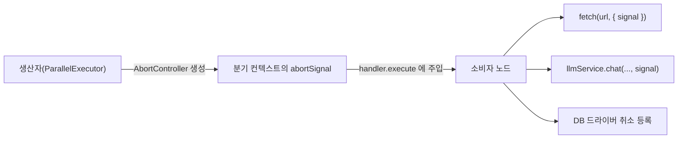

> 구현 상태: 부분 구현 · 원문: `spec/conventions/node-cancellation.md` (전체) · 용어: [용어 사전](../CLE-GLOSSARY.md)

## 개요

오래 걸리는 외부 I/O 를 하는 노드(HTTP, DB, AI, Email, 이커머스 통합 Cafe24·MakeShop)는 실행 도중 바깥에서 온 취소를 받을 수 있어야 한다. 그래야 다음 기능이 동작한다.

- **Parallel `cancel-others-on-fail`**: 첫 분기가 실패하면 다른 분기의 외부 I/O 를 바로 멈춘다(parallel-p2 결정 A).
- **워크플로우 시간 한도**: 실행 시간 한도를 넘으면 진행 중인 노드의 외부 I/O 를 멈춘다.
- **사용자 실행 중지**: UI 에서 실행 중인 워크플로우를 멈춘다. 2026-05-31 에 구현됐다. 에디터 툴바의 Stop 버튼이 `running`·`waiting_for_input` 상태에서 보이고 `POST /executions/:id/stop` 을 부른다. 최종 `cancelled` 는 WebSocket `execution.cancelled` 이벤트로 확정된다.
- **안전 종료**: 서버가 끝날 때 진행 중인 노드의 외부 I/O 를 멈춘다. 신호 연동은 아직 없다(규칙 8).

이 규약은 노드 취소(node cancellation)의 두 메커니즘을 정한다. 하나는 실행 컨텍스트의 노드 취소 신호(`ExecutionContext.abortSignal`)를 전파하는 것이고 다른 하나는 신호를 만들지 않는 취소(사용자 실행 중지)를 엔진이 DB 를 다시 읽어 알아채는 것이다.

범위 밖:

- `abortSignal` 이 실행 컨텍스트의 어느 분류(안정 핵심)에 속하는지는 [실행 컨텍스트](CLE-EXEC-CONTEXT.md) 가 정한다. 이 문서는 동작 계약(전파 의무, best-effort, 에러 분류)을 정한다.
- 실행·노드 실행의 상태 전이는 [실행 상태 머신과 대기·재개](CLE-EXEC-STATE.md) 가 정한다.
- Stop 버튼의 위치와 표시 조건은 [에디터 실행과 디버깅](CLE-EXEC-RUN.md) 에, 역할별 권한은 [워크스페이스와 멤버](../CLE-ACCT/CLE-ACCT-WS.md) 에 있다.
- 워크플로우 시간 한도의 판정은 [큐 워커와 동시 실행 제한](CLE-EXEC-WORKER.md), 안전 종료 절차는 [장애 복구와 안전 종료](CLE-EXEC-RECOVERY.md) 에 있다.

## 규칙

### 노드 핸들러 의무

1. `NodeHandler.execute(input, config, context)` 는 `context.abortSignal?: AbortSignal` 을 받는다.
2. **외부 I/O 노드**는 오래 걸리는 외부 호출에 `context.abortSignal` 을 전파한다.

   | 호출 | 신호 전파 | 상태 |
   | --- | --- | --- |
   | `fetch(url, init)` | `init.signal` 에 넣는다. 자체 타임아웃과 함께 쓰면 연쇄 패턴을 따른다(아래 [fetch 자체 타임아웃과의 연쇄](#fetch-자체-타임아웃과의-연쇄)) | 구현됨(HTTP 노드). 신호 전파까지만 구현됐다. 취소 에러 분류는 [미결 사항](#미결-사항) 참조 |
   | LLM 호출 | AI 노드(AI 에이전트·Text Classifier·정보 추출기)는 `llmService.chat` 에 `signal` 을 넘기고 프로바이더 클라이언트가 진행 중인 요청을 끊는다([LLM 클라이언트](../CLE-AI/CLE-AI-LLM.md)). 첫 멀티턴 경로(`executeMultiTurn`)는 `context.abortSignal` 을 그대로 넘긴다. 멀티턴 재개 경로(`processMultiTurnMessage`)는 아래 턴 경계 DB 관측으로 취소를 처리한다. 그 경로에는 전파할 신호가 없기 때문이다. `ResumableMessageOptions.signal` 은 지금 늘 `undefined` 인 자리다. 나중에 신호를 만드는 곳이 생기면 전파되도록 열어 둔 것이지 도입이 예정된 것은 아니다 | 구현됨 |
   | PostgreSQL(`pg`)·MySQL(`mysql2`) | `signal.addEventListener('abort', ...)` 로 진행 중 쿼리 취소를 등록한다. 취소되면 **별도 풀 연결**로 PG `SELECT pg_cancel_backend(<pid>)`·MySQL `KILL QUERY <threadId>` 를 보내 진행 중 쿼리만 끊는다(연결은 유지). 취소로 난 드라이버 에러(PG `57014`·MySQL `ER_QUERY_INTERRUPTED`)는 catch 에서 `AbortError` 로 다시 던져 `cancelled` 로 분류되게 한다. 취소 권한(PG 소유자·MySQL `PROCESS`)과 타이밍에 따라 실패할 수 있지만 무해하다. 정상 완료하면 리스너를 해제한다 | 구현됨 |
   | MongoDB | 드라이버의 `signal` 옵션에 바로 넘긴다 | 미구현(Planned). 지금 DB 노드는 pg·mysql 만 지원한다 |
   | Email(nodemailer) | 진행 중 중단은 일부러 택하지 않았다. 전송 중에 `transporter.close()` 를 부르면 일부만 가거나 두 번 갈 위험이 있어 들어가기 직전 `abortSignal?.aborted` 사전 확인만 한다. SMTP 전송은 보통 짧다. 안전한 중단 방법이 확인되면 다시 검토한다 | 부분 구현 |

   AI 에이전트는 신호와 별도로 모든 `chat` 호출(단일 턴, 멀티턴 재개 포함)에 앱 수준 타임아웃(`AI_AGENT_LLM_CALL_TIMEOUT_MS`, 기본 10분)을 건다. `withTimeout` 이 **자체 `AbortController`** 로 동작해 신호가 있든 없든 무기한 대기를 막는다([AI 에이전트 노드](../CLE-NODE-AI/CLE-NODE-AGENT.md)).
3. 취소 때 나는 `AbortError` 류는 노드가 그대로 던진다. 엔진의 `errorPolicyHandler` 가 그 에러를 취소로 분류하므로 노드가 따로 처리하지 않는다. 에러를 잡아 다른 코드로 바꾸면 엔진이 취소로 분류하지 못한다. 적용 여부는 노드마다 다르다. [미결 사항](#미결-사항) 참조.
4. **CPU 위주이거나 바로 끝나는 노드**는 신호를 지원하지 않아도 된다(best-effort). 작업을 끝까지 해도 되지만 시작 직전에 `context.abortSignal?.aborted` 를 확인하기를 권한다. 시작 전에 이미 취소됐으면 바로 끝낸다.

### 신호를 만드는 쪽

5. **`ParallelExecutor`**(구현됨): `errorPolicy === 'cancel-others-on-fail'` 이면 내부 `AbortController` 를 만들고 첫 분기가 실패하면 `controller.abort()` 를 부르며 각 `branchContext.abortSignal` 에 넣는다. 위쪽 `context.abortSignal` 이 있으면 그 취소도 그룹 controller 로 이어 준다(`parallel-executor.ts`).
6. **워크플로우 시간 한도**: **입력 대기 시간을 뺀 누적 실행 시간 한도**로 구현했다(PR2a). 벽시계 타이머와 취소 신호는 쓰지 않는다. dispatch 루프가 노드 사이마다 `assertActiveTimeWithinLimit` 를 불러 한도를 넘으면 `EXECUTION_TIME_LIMIT_EXCEEDED` 로 끝낸다. 판정 규칙은 [큐 워커와 동시 실행 제한](CLE-EXEC-WORKER.md) 에 있다. 진행 중 노드의 외부 I/O 를 바로 끊는 신호 연동은 미구현(Planned)이고 지금은 다음 노드 경계에서 판정한다.
7. **사용자 실행 중지**(구현됨 2026-05-31): REST `POST /executions/:id/stop` 이 실행을 멈춘다. `running`·`pending` 은 `cancelled` 로, `waiting_for_input` 은 재개 취소로 처리한다. 에디터 툴바 Stop 버튼이 진입점이고 **편집자 이상**만 쓸 수 있다. 뷰어에게는 버튼이 보이지 않고(프론트엔드 `canEdit` 가드) 서버도 `@Roles('editor')` 로 403 을 낸다. **이 경로는 `AbortController` 를 만들지 않고 실행 행만 UPDATE 한다**. 진행 중 dispatch 를 실제로 멈추는 일은 아래 DB 관측 가드가 맡는다.
8. **안전 종료**: 지금은 grace 시간을 넘긴 노드를 `failed` 와 `SERVER_INTERRUPTED` 로 마감한다([장애 복구와 안전 종료](CLE-EXEC-RECOVERY.md)). 안전 종료를 취소 신호 생산자로 통합하는 것은 예정 과제다. 마감 상태를 `failed` 와 `SERVER_INTERRUPTED` 로 둘지 `cancelled` 로 바꿀지는 정의가 갈린다. 안전 종료 절차가 쓰는 에러 처리 정책 값 `continue` 가 무엇을 뜻하는지도 정해지지 않았다. 두 문제는 [장애 복구와 안전 종료 §미결 사항](CLE-EXEC-RECOVERY.md#미결-사항) 에서 다룬다.
9. `context.abortSignal` 을 채우는 생산자는 `ParallelExecutor` 하나뿐이다. HTTP 노드의 자체 타임아웃이나 AI 에이전트의 `withTimeout` 도 `AbortController` 를 만들지만 이들은 자기 호출 안에서만 쓰고 `context.abortSignal` 을 채우지 않는다. 그래서 선형 경로와 재개 경로에서 `context.abortSignal` 은 늘 `undefined` 다.

### 신호 전파 흐름



생산자는 `AbortController` 를 만든 뒤 그 `signal` 을 취소 범위의 컨텍스트(예: 분기 컨텍스트)의 `abortSignal` 에 넣는다. 소비자는 자기 호출에 전파한다.

### fetch 자체 타임아웃과의 연쇄

HTTP 노드는 설정의 `timeout` 을 위해 별도 `AbortController` 를 쓴다. `context.abortSignal` 과는 다음처럼 잇는다.

```ts
const controller = new AbortController();
const timeoutId = setTimeout(() => controller.abort(), timeout);
fetchOptions.signal = controller.signal;

const upstream = context.abortSignal;
if (upstream) {
  if (upstream.aborted) {
    controller.abort();
  } else {
    const onAbort = () => controller.abort();
    upstream.addEventListener('abort', onAbort, { once: true });
    controller.signal.addEventListener(
      'abort',
      () => upstream.removeEventListener('abort', onAbort),
      { once: true },
    );
  }
}
```

위쪽이나 자체 타임아웃 어느 쪽이 취소해도 fetch 는 바로 예외를 던진다. 정리는 fetch API 가 보장한다.

### DB 관측 취소 가드

이 절은 신호를 만들지 않는 취소(사용자 실행 중지)를 엔진이 알아채는 방식을 정한다. 위의 신호 생산자와 **메커니즘이 다르다**. 두 절을 섞으면 "신호 사전 확인이 있으니 실행 중지도 걸린다" 는 오해가 생기고 실제로 그 오해가 결함의 배경이었다.

| | 취소 신호(`abortSignal`) | DB 관측 |
| --- | --- | --- |
| 신호 | 표준 `AbortSignal` API | 실행 행 `status` 다시 읽기 |
| 알아채는 쪽 | 핸들러가 `signal.aborted` 를 읽거나 SDK·fetch 에 넘김 | 엔진이 경계마다 DB 를 다시 읽음 |
| 필요한 이유 | 병렬 분기 취소 | `abortSignal` 은 `ParallelExecutor` 가 분기 컨텍스트에만 넣어 선형 경로에서는 늘 `undefined` 다. 실행 중지는 신호를 만들지 않으므로 다시 읽기가 유일한 수단이다 |
| 던지는 것 | `error.name === 'AbortError'`(핸들러) | `ExecutionCancelledError`(엔진, `workflow-errors.ts`) |

10. **노드 경계 확인**(구현됨 2026-07-26): `assertExecutionNotCancelled()` 를 dispatch 순회 루프 세 곳(`runExecution`·`runNodeDispatchLoop`·`executeInline`)과 컨테이너·Parallel 반복(`executeContainerBody` 항목 경계, `executeParallelBranchBody` 노드 경계)에서 부른다. 바깥 취소를 보면 `ExecutionCancelledError` 로 dispatch 를 멈춘다.
11. **컨테이너 항목 경계는 250ms 로 묶는다**: 컨테이너 안에서는 항목 경계마다 확인한다. `CONTAINER_CANCEL_CHECK_THROTTLE_MS = 250` 안에 다시 부르면 직전 결과를 쓴다. 선형 노드 경계와 Parallel 분기 노드 경계는 묶지 않고 매번 조회한다.
12. **턴 경계 확인**(구현됨 2026-07-27): 멀티턴 AI 는 턴마다 park 로 세그먼트가 끝나 노드 경계 확인에 닿지 않는다. 그래서 `AiTurnOrchestrator` 가 **턴 경계**에서 같은 가드를 직접 부른다. 이 호출은 턴 실패를 `FAILED` 로 마감하는 try/catch **바깥**에 있어야 한다. 안에 두면 취소가 실패로 잘못 분류된다.
13. **park·재개 짝 전이의 종결 가드**(구현됨 2026-07-27): 실행과 노드 실행을 한 트랜잭션으로 옮기는 경로는 같은 트랜잭션에서 대상 행을 `SELECT … FOR UPDATE` 로 잠그고 **비종결 상태를 확인한 뒤에만** 쓴다. 확인 없이 쓰면 턴 진행 중 도착한 실행 중지가 덮여 **취소가 사라진다**. 선점을 보면 짝 노드 실행을 `cancelled` 로 표시한 뒤 `ExecutionCancelledError` 를 전파한다. 이 가드를 쓰는 곳은 짝 전이, `finalizeFailedExecution`, `failFirstSegmentSetup`, `executeSync` 타임아웃이다. 마지막 턴 재시도 재진입에 한해 비종결 판정에 `failed` 가 조건부로 들어간다(`allowRetryReentry` opt-in). 자세한 내용은 [실행 상태 머신과 대기·재개](CLE-EXEC-STATE.md) 의 원자성 보장에 있다.
14. **마지막 턴 재시도 종결 가드**(구현됨 2026-07-28): 재진입의 종결(`completed`·`failed`·`cancelled`)은 메모리 엔티티를 믿지 않는다. 재진입 전이(`failed → running`)가 **다른 엔티티 인스턴스**에 적용돼 종결 시점의 메모리 `status` 가 낡았을 수 있다. 그래서 종결 직전에 **행을 다시 읽어 비종결을 확인**하고 그 상태에서 목표로 옮길 수 없거나 조건부 UPDATE 가 0행이면 **저장과 종결 이벤트 발행을 모두 건너뛴다**. 확인 없이 쓰면 턴 진행 중 도착한 실행 중지가 `failed`·`completed` 로 덮여 취소가 사라진다. `retry-turn.service.ts` 의 `completeRetryExecution`·`failRetryExecution` 이 공용 `finalizeGuarded` 로 처리한다.
15. **최상위 취소 종결 가드**(`finalizeCancelledExecution`): 조건부 UPDATE(`status IN (비종결)`)가 0행이면 **행을 다시 읽어 DB 값으로 가른다**. 이미 `CANCELLED` 면 **이벤트를 낸다**. `stop()` 은 `running`·`pending` 경로에서 이벤트를 내지 않으므로 여기가 유일한 알림 지점이다. 다른 종결자가 `FAILED`·`COMPLETED` 로 먼저 마감했으면 건너뛴다. 형제 `finalizeFailedExecution` 은 진입만 같고 0행 뒤의 방향이 반대다. 그쪽은 "덮어쓰지 말라" 가 목적이라 무조건 건너뛴다. 새 취소 마감 경로를 만들 때 무조건 건너뛰기를 기본으로 가정하지 않는다.
16. 이미 `cancelled` 인 행에 종결 경로가 다시 닿아도 **먼저 커밋된 취소 시각(`finishedAt`·`durationMs`)이 기준**이다. 취소할 때 `error` 는 저장하지 않는다. 취소를 실패와 가르고 REST 로 내부 예외 메시지가 나가지 않게 하려는 것이다.
17. 조건부 UPDATE 결과는 `[rows, affectedCount]` 튜플이다. 0행 판정은 이 규칙을 따라야 한다([raw SQL 결과 읽기 규약](../CLE-ENG/CLE-ENG-RAWQUERY.md)).

### 취소 에러 분류

18. **두 sentinel 은 같은 상태로 끝난다**. 핸들러가 던지는 `error.name === 'AbortError'` 와 엔진 경계 가드가 던지는 `ExecutionCancelledError` 는 나는 곳이 다르지만 둘 다 `NodeExecution.status = cancelled`·`Execution.status = cancelled` 로 끝난다. 분류는 `instanceof` 나 `error.name` 으로 하고 에러 문구는 판정에 쓰지 않는다.
19. **`AbortError` 는 실패가 아니라 중단이다**. 엔진은 노드 실행 상태를 `failed` 가 아닌 `cancelled` 로 기록한다. dispatch 직전에 `context.abortSignal?.aborted` 가 이미 참이면 핸들러를 실행하지 않고 바로 `cancelled` 로 기록한다. 끝날 때 `execution.node.cancelled` 이벤트를 내 타임라인이 `running` 에 남지 않게 한다([WebSocket 이벤트와 명령](../CLE-API/CLE-API-WS-EVENTS.md)). `output.error` 는 표준 형태에 `code: 'AbortError'` 로 기록하고 `meta.success = false` 를 둔다. `AbortError` 는 에러 코드 이름 규칙(UPPER_SNAKE_CASE)의 예외다. 웹 표준 `AbortSignal` 이 던지는 `DOMException.name` 을 그대로 옮긴 값이기 때문이다([에러 코드 규약과 카탈로그](../CLE-API/CLE-API-ERRCODES.md)).
20. **취소된 노드 뒤의 워크플로우 흐름**: 노드 실행이 `cancelled` 로 끝난 뒤의 흐름은 두 층으로 나눠 정한다.
    - **노드 자신의 에러 처리 정책**(`config.errorHandling.policy`, [노드 에러 처리 정책](../CLE-NODE/CLE-NODE-ERROR.md))은 `AbortError` 에 쓰지 않는다. 현재 구현의 엔진은 정책과 상관없이 노드 실행을 `cancelled` 로 기록하고 `AbortError` 를 다시 던진다. `retry` 정책이어도 다시 시도하지 않는다. `skip_node`·`use_default_output`·`route_to_error_port` 정책도 취소를 흡수하지 않는다.
    - **Parallel 의 항목 에러 정책**(`config.errorPolicy`, [Parallel 노드](../CLE-NODE-LOGIC/CLE-NODE-PARALLEL.md))이 흐름을 정한다. 다시 던진 `AbortError` 는 그 노드가 속한 병렬 분기의 실패가 되고 Parallel 이 정책에 따라 모은다.
      - `stop`(기본): 취소가 위쪽 취소 범위에서 왔으면 워크플로우는 그 원인대로 마감한다. 사용자 취소면 실행 `cancelled`, cancel-others-on-fail 이면 최초 실패 원인으로 실행 `failed` 다. 노드 하나의 `AbortError` 자체가 워크플로우를 새로 실패시키지는 않는다.
      - `continue`: 그 노드를 `cancelled` 로 기록하고 뒤 분기를 계속한다.
      - `cancel-others-on-fail`: 이미 취소 중이므로 취소된 뒤 분기도 `cancelled` 로 기록한다. 근본 원인(최초의 취소가 아닌 실패)은 `ParallelExecutor` 가 따로 드러낸다.
    - 여기의 `continue` 는 Parallel 항목 에러 정책의 값이다. 노드 에러 처리 정책에는 `continue` 가 없다. 두 정책의 층 구분은 [Logic 노드 공통 §항목 에러 정책](../CLE-NODE-LOGIC/CLE-NODE-LOGIC-COMMON.md#항목-에러-정책) 이 정한다.
21. **`ExecutionCancelledError` 는 에러 정책을 따르지 않는다**. 위 흐름 규칙은 핸들러가 던진 `AbortError` 에만 적용된다. 엔진이 던진 `ExecutionCancelledError` 는 정책과 상관없이 늘 다시 던진다. `ForEachExecutor`·`ParallelExecutor` 는 항목 에러 정책을 판정하기 **전에** 이 sentinel 을 다시 던지므로 항목 에러 정책이 `skip`·`continue` 여도 계속하지 않는다. 사용자 실행 중지가 `continue` 정책 때문에 조용히 무시되면 안 되기 때문이다.
22. **rehydration 실패는 취소가 아니다**. 재개 인프라 실패(`RESUME_*`)는 신호 경로가 아니므로 노드 실행을 `failed` 로 끝낸다([실행 상태 머신과 대기·재개](CLE-EXEC-STATE.md)).

## 구현 현황

2026-07-28 코드 대조 기준이다.

| 항목 | 상태 | 비고 |
| --- | --- | --- |
| `ExecutionContext.abortSignal?: AbortSignal` 필드 | ✅ | `node-handler.interface.ts`. 분류는 [실행 컨텍스트](CLE-EXEC-CONTEXT.md), 동작 계약은 이 문서 |
| 규약 신설 | ✅ | 이 문서 |
| HTTP 노드 신호 전파(fetch 연쇄) | ✅ | `http-request.handler.ts`, 단위 테스트 `http-request.handler.spec.ts`. 취소 에러 분류는 [미결 사항](#미결-사항) 참조 |
| AI 노드 신호 전파 | ✅ | `ai-agent.handler.ts`·`text-classifier.handler.ts`·`information-extractor.handler.ts` 가 `signal: context.abortSignal` 을 넘긴다. 단위 테스트가 `context.abortSignal` 이 `llmService.chat` 으로 가는지 확인한다(정보 추출기는 단일 턴, 멀티턴 첫 경로는 후속) |
| Parallel `cancel-others-on-fail` 통합 | ✅ | `parallel-executor.ts` |
| 사용자 실행 중지(`POST /executions/:id/stop`, 툴바 Stop) | ✅ | `executions.controller.ts`·`executions.service.ts`·`editor-toolbar.tsx`. 실행 행 UPDATE 까지가 이 행의 범위이고 dispatch 를 멈추는 것은 아래 가드 행이다 |
| DB 노드 신호 전파 | ✅ | 사전 확인과 진행 중 쿼리 취소(`database-query.handler.ts`). 단위 테스트 `database-query.handler.spec.ts` |
| Email 노드 신호 전파 | 🚧 | 사전 확인만(`send-email.handler.ts`). 진행 중 SMTP 중단은 일부러 택하지 않았다 |
| MakeShop 노드 신호 전파 | ✅ | `makeshop-api.client.ts` 의 연쇄(이미 취소된 경우 포함)와 `makeshop.handler.ts` 의 `AbortError` 재던짐이 둘 다 있어야 엔진이 `cancelled` 로 분류한다 |
| Cafe24 노드 신호 전파 | ✅ | MakeShop 과 같은 구조(`cafe24-api.client.ts`·`cafe24.handler.ts`) |
| 노드 실행 `cancelled` 상태, `AbortError` 분류, dispatch 사전 확인, `execution.node.cancelled` 이벤트 | ✅ | `NodeExecutionStatus.CANCELLED` enum 과 V069 마이그레이션. 신호 경로 한정이고 실행 중지는 아래 가드 행이 맡는다 |
| 노드 경계 취소 확인(`assertExecutionNotCancelled`) | ✅ | 선형 세 곳과 컨테이너(250ms 묶음)·Parallel 반복 루프. mutation 검증 완료 |
| 멀티턴 AI 턴 경계 취소 확인 | ✅ | `ai-turn-orchestrator.service.ts` |
| park·재개 짝 전이 종결 가드 | ✅ | `execution-engine.service.ts`. mutation 6/6 |
| 최상위 취소 종결 가드(`finalizeCancelledExecution`) | ✅ | 회귀 테스트 세 갈래(이미 취소, 다른 종결자 선점, 다시 읽기 실패) |
| 마지막 턴 재시도 종결 가드 | ✅ | `retry-turn.service.ts`. mutation 13/13 |
| 워크플로우 시간 한도·안전 종료의 노드 신호 연동 | — | 미구현(Planned). 시간 한도 자체는 PR2a 로 구현됐다(노드 경계 판정) |

chat-channel 은 노드가 아니다. `webhook` 트리거의 `config.chatChannel` 변형이고 구현체는 실행 이벤트를 구독하는 나가는 어댑터다. 그래서 신호 연쇄 대상이 아니다. 취소 때 이 어댑터가 할 일은 `execution.cancelled` 를 채널로 보내는 것이다([채팅 채널](../CLE-CHAT/CLE-CHAT-CORE.md)).

남은 신호 전파 과제는 plan `node-cancellation-residual-signal-propagation` 이 추적한다.

## 미결 사항

- **HTTP 노드가 취소를 에러 포트로 보낸다**: 이 규약은 외부 I/O 노드가 취소 때 `AbortError` 를 그대로 던져 엔진이 노드 실행을 `cancelled` 로 분류한다고 정하고 HTTP 노드를 구현 완료로 표시한다. 반면 [HTTP Request 노드](../CLE-NODE-INT/CLE-NODE-HTTP.md) 는 위쪽 취소를 전송 실패와 묶어 `port: 'error'` 와 `HTTP_TRANSPORT_FAILED` 로 돌려준다고 적는다. 현재 구현(`http-request.handler.ts` catch 블록)도 HTTP 문서대로 `AbortError` 를 다시 던지지 않는다. MakeShop 핸들러 주석은 바로 이 방식이 `cancelled` 분류를 막는다고 경고한다. 그래서 cancel-others-on-fail 로 멈춘 HTTP 분기가 `cancelled` 대신 에러 포트 라우팅(정상 종료)으로 기록된다. HTTP 핸들러를 Cafe24·MakeShop 처럼 위쪽 신호로 생긴 `AbortError` 만 다시 던지도록 맞출지, 이 규약에 HTTP 예외를 명시할지 결정해야 한다. 같은 충돌이 [HTTP Request 노드 §미결 사항](../CLE-NODE-INT/CLE-NODE-HTTP.md#미결-사항) 에도 올라 있다. 결정 전까지 구현 현황 표의 HTTP 행은 신호 전파만 구현된 것으로 읽는다.
- **에디터의 강제 중단(Force)**: [에디터 실행과 디버깅](CLE-EXEC-RUN.md) 은 Stop 버튼을 3초 이상 누르면 진행 중인 노드를 바로 멈추는 Force 모드를 약속한다. 이 규약에서 사용자 실행 중지는 신호를 만들지 않고 실행 행만 UPDATE 하며 다음 노드·턴 경계에서만 관측된다. Force 에 대응하는 생산자가 없고 현재 코드(`editor-toolbar.tsx`·`executions.controller.ts`)에도 Force 경로가 없다. External Interaction API 도 force 옵션을 지원하지 않는다고 적는다. Force 를 만들지(그러면 이 규약에 생산자를 더해야 한다), 에디터 문서에서 지우거나 미구현으로 둘지 결정해야 한다.

## 구현 위치

- `codebase/backend/src/nodes/core/node-handler.interface.ts` (`ExecutionContext.abortSignal`)
- `codebase/backend/src/nodes/integration/http-request/http-request.handler.ts`
- `codebase/backend/src/nodes/integration/database-query/database-query.handler.ts`
- `codebase/backend/src/modules/executions/executions.controller.ts`, `executions.service.ts` (`stop()`)
- `codebase/backend/src/modules/execution-engine/execution-engine.service.ts` (`assertExecutionNotCancelled`, 짝 전이 가드, `finalizeCancelledExecution`)
- `codebase/backend/src/modules/execution-engine/ai-turn-orchestrator.service.ts` (턴 경계 가드)
- `codebase/backend/src/modules/execution-engine/retry-turn.service.ts` (`finalizeGuarded`)
- `codebase/backend/src/modules/execution-engine/containers/parallel-executor.ts`
- `codebase/backend/src/modules/execution-engine/workflow-errors.ts` (`ExecutionCancelledError`)
- `codebase/frontend/src/components/editor/toolbar/editor-toolbar.tsx`
- `codebase/frontend/src/lib/api/executions.ts`

## Rationale

### 취소를 노드 공통 기반으로 따로 둔다

이 규약은 parallel-p2 결정 A 의 `cancel-others-on-fail` 요구에서 시작했다. 그러나 노드 단계 취소는 워크플로우 시간 한도, 사용자 실행 중지, 안전 종료 같은 여러 기능이 함께 다시 쓰는 기반이다. 그래서 별도 plan 으로 떼어 냈다(parallel-p2 결정 H).

### 표준 `AbortSignal` API 를 쓴다

- 주요 SDK·fetch·드라이버가 모두 표준으로 지원해 별도 래퍼가 필요 없다.
- 외부 타임아웃과의 연쇄가 표준 패턴이다(`AbortController` 의 취소가 이어진다).
- `AbortSignal.any([...])`(Node.js 18+)나 `AbortSignal.timeout(ms)` 같은 표준 도구를 나중에 쓸 수 있다.

### 핸들러 시그니처를 바꾸지 않고 실행 컨텍스트 필드로 전파한다

- 운영 핸들러 24개의 시그니처를 바꾸면 모든 모듈이 영향을 받아 기반 변경 PR 이 너무 커진다.
- 실행 컨텍스트는 이미 엔진이 dispatch 직전에 넣어 주는 통합 진입점이라 필드 하나를 더하는 비용이 작다.
- 모듈마다 조금씩 도입할 수 있다. 노드 핸들러가 `context.abortSignal` 을 읽는지만 다르고 시그니처는 그대로다.

### 취소 뒤 흐름을 정하는 정책을 두 층으로 나눠 적는다

원문 규칙은 "노드의 `errorPolicy` 가 dispatch 진행을 정한다" 고만 적었다. 일반 노드의 에러 처리 정책(`config.errorHandling.policy`)에는 `continue`·`cancel-others-on-fail` 값이 없어 어느 정책을 뜻하는지 문장만으로는 알 수 없었다. 원문이 든 세 값(`stop`·`continue`·`cancel-others-on-fail`)은 Parallel 의 항목 에러 정책 값 집합과 같다. 현재 구현(`parallel-executor.ts` 의 `ParallelErrorPolicy`)도 이 세 값으로 병렬 분기 실패를 모은다. 엔진의 `executeNode` 는 `AbortError` 를 노드 에러 처리 정책보다 먼저 가로채 `cancelled` 로 기록하고 다시 던진다. 그래서 규칙 20 은 노드 자신의 정책과 Parallel 항목 에러 정책을 나눠 적었다.

### 사용자 실행 중지는 DB 관측으로 알아챈다 (2026-07-27)

사용자 실행 중지(`POST /executions/:id/stop`)는 **`AbortController` 를 만들지 않고** 실행 행을 UPDATE 할 뿐이다. `context.abortSignal` 을 채우는 곳은 `parallel-executor.ts`(cancel-others-on-fail) 하나뿐이라 **선형 경로와 재개 경로에서 `context.abortSignal` 은 늘 `undefined`** 다. "신호를 전파하면 된다" 는 접근은 전파할 신호가 없어 성립하지 않는다. 엔진이 경계마다 행을 다시 읽는 것이 유일한 수단이다.

이 사실은 두 번 틀린 뒤에 확정됐다. "선형 경로 취소 전파" 티켓 초안은 `context.abortSignal?.throwIfAborted()` 를 보장 근거로 들었으나 그 필드가 늘 `undefined` 라 근거가 되지 못했다. 정보 추출기 재개 티켓은 "신호가 전파되지 않는 것이 문제이고 타임아웃으로 완화된다" 고 적었으나 실제 결함은 취소가 사라지는 것이었다. 2026-07-26 이전에는 노드 경계 가드가 없어 실행 중지 뒤에도 하류 노드가 계속 dispatch 됐다.

### 짝 전이에 종결 가드를 둔다 (2026-07-27)

park·재개 경로는 실행을 메모리에 읽은 뒤 **다시 읽지 않는다**. 그래서 턴이 도는 동안(LLM 호출은 수 초에서 수 분) 도착한 실행 중지가 DB 를 `cancelled` 로 바꿔도 메모리 엔티티는 `running` 이고 상태 전이 검사는 `running → waiting_for_input` 을 정상으로 통과시킨다. 가드가 없으면 그 쓰기가 `cancelled` 를 덮어 **사용자가 누른 실행 중지가 그대로 사라진다**.

같은 트랜잭션 안에서 행을 잠그는(`SELECT … FOR UPDATE`) 것은 확인과 쓰기 사이의 창을 없애기 위해서다. 다시 읽기와 쓰기를 따로 하면 그 사이에 실행 중지가 끼어들 수 있다. 실제로 그런 남은 창이 리뷰에서 지적돼 원자화로 다시 닫았다.

### 취소 시각을 지키는 방식이 두 가지다 (2026-07-28)

이미 `cancelled` 인 행에 종결 경로가 다시 닿을 때 `stop()` 이 쓴 `finishedAt`·`durationMs` 를 지키는 방식이 소비자마다 다르다.

- `finalizeCancelledExecution` 은 **앱 수준 `??` 병합**을 쓴다. 메모리 값이 비었을 때만 채운다. 조건부 UPDATE 가 0행이면 행을 다시 읽어 DB 가 `CANCELLED` 면 이벤트를 내고 다른 종결이면 건너뛴다.
- `finalizeGuarded`(마지막 턴 재시도)는 **SQL `COALESCE(col, :new)`** 를 쓴다. 다시 읽기(`SELECT`)와 `UPDATE` 사이의 창을 믿지 않으려는 것이다. UPDATE 문이 그 순간의 DB 값을 다시 평가하므로 그 사이 다른 트랜잭션이 값을 채웠어도 덮지 않는다. 앱 수준 병합은 `SELECT` 시점 스냅샷으로 판단하므로 같은 창을 닫지 못한다.

두 방식 모두 "먼저 커밋된 취소 시각이 기준" 이라는 같은 계약을 지킨다.

`finalizeCancelledExecution` 의 0행 처리는 2026-08-15 에 두 번 고쳤다. 처음에는 호출자가 UPDATE 결과를 읽지 않아 이미 선점된 실행에도 `EXECUTION_CANCELLED` 가 나갔다. 1차 수정은 형제 `finalizeFailedExecution` 을 그대로 따라 0행이면 무조건 건너뛰게 했는데 그러자 **사용자가 누른 실행 중지가 바깥에 알려지지 않았다**. `stop()` 이 `running`·`pending` 경로에서 이벤트를 내지 않아 이 함수가 유일한 알림 지점이었기 때문이다. 그래서 0행의 두 가지 뜻(`stop()` 이 이미 마감함, 다른 종결자가 이김)을 DB 에 실제로 남은 값으로 가르게 했다. UPDATE 가 썼는지만으로는 둘을 가를 수 없다.

### 컨테이너 항목 경계 확인을 250ms 로 묶는다

`assertExecutionNotCancelled` 는 컨테이너(ForEach·Loop·Map)에서 **항목 경계마다** 불린다. ForEach 입력 배열에는 길이 상한이 없고 중첩 컨테이너는 곱으로 늘어나, 묶지 않으면 항목 수에 비례하는 순차 DB 왕복이 쌓인다.

개수 기준(예: N 개마다 한 번)은 항목마다 걸리는 시간이 고르지 않아 기각했다. 빠른 항목 1000개와 느린 항목 10개에서 같은 개수가 전혀 다른 지연을 뜻한다. 시간 기준은 "취소 관측이 최대 250ms 늦어진다" 는 상한을 항목 특성과 상관없이 보장한다.

### 0행 분기가 넉 달 동안 닿지 않았다 (2026-08-30)

규칙 13·14 의 "조건부 UPDATE 가 0행이면 건너뛴다" 판정에 쓴 반환값은 `[rows, affectedCount]` 튜플이었다. 그래서 `length > 0` 이 늘 참이었고 0행 분기는 운영에서 닿지 않았다. `8332d9a20`(2026-08-13)이 고쳤다.

영향은 좁다. 노드 경계와 턴 경계의 `assertExecutionNotCancelled()` 는 반환값으로 가르지 않아 영향이 없다. 짝 전이의 `SELECT … FOR UPDATE` 잠금 자체도 정상 동작했다. 영향을 받은 것은 짝 전이의 "0행이면 건너뜀" 과 마지막 턴 재시도 종결의 "0행이면 저장·발행 모두 건너뜀" 이다. 원인은 소비자들이 함께 쓰는 드라이버 메서드(`updateExecutionStatus`) 한 곳이었다. 전체 목록은 plan `update-returning-tuple-shape` 이 기준이다. `finalizeCancelledExecution` 은 이 영향 밖이다. 반환값으로 가르기 시작한 것이 수정 뒤(#1172, 2026-08-15)라 동작하지 않은 적이 없다.

구현 현황 표의 mutation 6/6·13/13 은 드라이버 mock 경계 **안쪽**의 로직 검증이다. mock 이 불리언을 정직하게 돌려주는 세계에서 가드 로직은 옳았다. 그러나 그때 실제 드라이버는 튜플을 행 배열로 오해해 늘 참을 돌려줬다. "mutation N/N 검증" 은 로직이 옳다는 뜻이지 그 분기가 실제로 탔다는 뜻이 아니다. 헬퍼 경계 안쪽 검증은 그 경계 **밖**의 계약이 참일 때만 결론으로 이어진다. 불변식은 [raw SQL 결과 읽기 규약](../CLE-ENG/CLE-ENG-RAWQUERY.md) 이 정한다.
