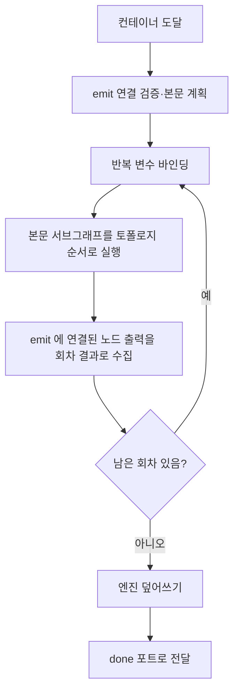
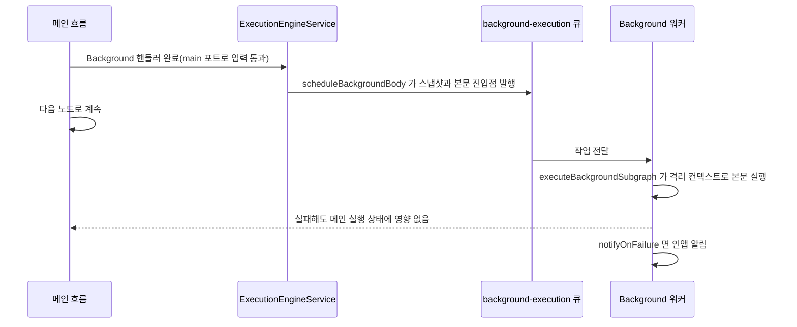

> 구현 상태: 부분 구현 · 원문: `spec/5-system/4-execution-engine.md` (§3.0~§3.4), 엔진 덮어쓰기 대조: `spec/conventions/node-output.md` (Principle 9), `spec/4-nodes/1-logic/0-common.md` (§4, §9.1) · 용어: [용어 사전](../CLE-GLOSSARY.md)

## 개요

컨테이너(container)는 자식 노드를 반복 실행하는 Loop·ForEach·Map 세 노드다. 자식은 `containerId` 로 소속을 나타낸다. 이 문서는 엔진이 컨테이너 본문(container body)을 어떻게 반복 실행하는지, 반복 결과를 어떻게 모으고 노드 출력을 어떻게 덮어쓰는지, 중첩된 컨테이너의 변수 스코프를 어떻게 다루는지 정한다.

Parallel 노드는 컨테이너가 아니지만 끝날 때 엔진 덮어쓰기(engine override)를 받는다. 이 문서는 Parallel 의 덮어쓰기 결과만 다룬다. Background 노드도 컨테이너가 아니다. 이 문서는 엔진이 Background 본문을 별도 큐로 넘기는 부분만 다룬다.

범위 밖:

- 노드별 설정·포트·출력 예시는 [Loop 노드](../CLE-NODE-LOGIC/CLE-NODE-LOOP.md), [ForEach 노드](../CLE-NODE-LOGIC/CLE-NODE-FOREACH.md), [Map 노드](../CLE-NODE-LOGIC/CLE-NODE-MAP.md), [Parallel 노드](../CLE-NODE-LOGIC/CLE-NODE-PARALLEL.md), [Background 노드](../CLE-NODE-LOGIC/CLE-NODE-BACKGROUND.md) 가 정한다.
- 컨테이너 공통 포트 표와 항목 에러 정책 값은 [Logic 노드 공통](../CLE-NODE-LOGIC/CLE-NODE-LOGIC-COMMON.md) 이 정한다.
- 캔버스에서 컨테이너를 만들고 지우는 규칙은 [워크플로우 에디터와 캔버스](../CLE-WF/CLE-WF-EDITOR.md) 에 있다.
- 본문 노드를 글로벌 그래프에서 빼고 따로 정렬하는 규칙은 [실행 엔진 개요와 그래프 순회](CLE-EXEC-ENGINE.md) 에 있다.
- 반복 변수(`$loop`·`$item` 등)의 표현식 표면은 [표현식 언어](../CLE-WF/CLE-WF-EXPR.md) 가 정한다.

## 공통 실행 모델

컨테이너는 `body` 출력 포트로 본문에 들어가 본문 서브그래프를 반복 실행한다. 반복마다 본문 안에서 **`emit` 입력 포트에 연결된 노드**의 출력을 그 회차의 결과로 모은다. 반복이 끝나면 엔진이 노드 출력을 모은 결과로 덮어쓰고 `done` 출력 포트로 내보낸다.

### emit 수집 규칙

컨테이너마다 `emit` 이라는 **입력 포트**가 있다. 본문 서브그래프의 한 노드가 출력을 컨테이너의 `emit` 포트로 연결하면 그 노드의 회차별 출력이 결과 배열의 원소가 된다.

엔진은 컨테이너 실행을 시작하기 전에 다음을 검사한다.

| 조건 | 결과 |
| --- | --- |
| `emit` 에 연결된 본문 노드가 0개 | `CONTAINER_MISSING_EMIT` 에러로 실행 실패 |
| `emit` 에 연결된 본문 노드가 2개 이상 | `CONTAINER_MULTIPLE_EMIT` 에러로 실행 실패 |
| `emit` 소스가 포트 라우팅 때문에 그 회차에 도달하지 못함 | 그 회차의 수집 값은 `undefined` |

### 본문 제약

- **되돌아가는 연결선(순환) 금지**: 본문에 순환이 있으면 `Container body contains back-edges` 에러로 실패한다.
- **입력 대기 노드 금지**: 본문에 Form·버튼·멀티턴 AI(`form`·`buttons`·`ai_conversation`) 노드를 둘 수 없다. 본문 안에서 입력 대기가 생기면 반복의 뜻이 흐려지기 때문이다. 입력 대기 여부의 판정 기준은 [인터랙션 타입 레지스트리](../CLE-IX/CLE-IX-TYPES.md) 를 따른다.
- **중첩 허용**: 본문 안에 다른 컨테이너를 둘 수 있다. 스코프 규칙은 [중첩 컨테이너 스코프](#중첩-컨테이너-스코프) 에 있다.

### 결과 배열의 인덱스

ForEach 와 Map 의 결과 배열은 원본 배열과 **같은 인덱스**를 유지한다. 실패한 항목도 자리를 비우지 않는다. 그래서 뒤 노드가 원본 항목과 결과를 인덱스로 맞춰 볼 수 있다.

## 엔진 덮어쓰기

엔진 덮어쓰기 대상 노드(Loop·ForEach·Map·Parallel)의 노드 출력은 시점에 따라 `output` 이 다르다.

1. **시작 시점(본문 진입 직전)**: 핸들러가 한 번 실행돼 결과를 돌려준다. ForEach·Map 은 `output: items[]` 를 돌려주고 엔진이 이 배열을 회차별 본문 입력으로 나눈다.
2. **완료 시점(모든 회차 종료 뒤)**: 엔진이 핸들러를 다시 부르지 않고 `output` 을 `{ <컬렉션 키>: [...], count: N }` 으로 직접 덮어쓴다.

| 노드 | 컬렉션 키 | 시작 시점 핸들러 반환 | 완료 시점 엔진 덮어쓰기 |
| --- | --- | --- | --- |
| Loop | `iterations` | 없음(입력을 나누지 않음) | `{ iterations: [...], count }` |
| ForEach | `items` | `items[]`(본문 입력 분배) | `{ items: [...], count }`, 실패 항목이 있으면 `skipped` 도 |
| Map | `mapped` | `items[]`(본문 입력 분배) | `{ mapped: [...], count }` |
| Parallel | `branches` | 없음(분기별 빈 입력) | `{ branches: [...], count }` |

시작 시점의 `output: items[]` 는 엔진 내부 전용 중간 표현이다. 본문에 나눈 직후 덮어쓰기로 교체되므로 뒤 노드의 표현식(`$node["X"].output.*`)이나 외부 관찰자(실행 내역 API, 웹훅 페이로드 등)는 원시 배열을 보지 않는다. `done` 포트 뒤의 노드는 항상 `{ <컬렉션 키>, count }` 형태를 본다. 노드 출력 다섯 필드 계약은 [노드 출력 규약](../CLE-NODE/CLE-NODE-OUTPUT.md) 이 정한다.

## Loop 실행

1. `count` 를 평가해 반복 횟수 N 을 정한다.
2. `planContainerBody(loopNode, nodes, edges)` 로 본문을 계획한다. `emit` 검증도 여기서 한다.
3. i = 0 부터 N - 1 까지 반복한다.
   1. 반복 컨텍스트(`$loop`)에 현재 인덱스를 바인딩한다. 표현식에 노출하는 키는 [표현식 언어 §`$loop` 속성](../CLE-WF/CLE-WF-EXPR.md#loop-속성) 이 정하고 `$loop.count` 는 그 안에 없다. 엔진 내부 `loopContext` 에는 반복 횟수 `count` 도 있지만 표현식으로 넘기지 않는다. 총 반복 횟수를 읽는 방법은 [Loop 노드](../CLE-NODE-LOGIC/CLE-NODE-LOOP.md) 에 있다.
   2. 본문 서브그래프를 토폴로지 순서로 실행한다.
   3. `emit` 소스의 출력을 i 번째 회차 결과로 모은다.
   4. `breakCondition` 을 평가해 참이면 일찍 끝낸다. `breakCondition` 은 엔진이 미리 평가하지 않고 회차마다 다시 평가한다([노드 핸들러 계약](CLE-EXEC-HANDLER.md)).
4. 엔진이 출력을 `{ iterations, count }` 로 덮어쓰고 `done` 포트로 넘긴다.

- 회차마다 노드 실행 행 묶음이 따로 생기고 회차 인덱스를 기록한다.
- `maxIterations` 를 넘으면 `MAX_ITERATIONS_EXCEEDED` 에러다.
- Loop 가 중첩되면 `LoopExecutor` 가 바깥 `$loop` 를 저장했다가 되돌린다.
- 회차 사이의 입력 전달 등 노드 동작은 [Loop 노드](../CLE-NODE-LOGIC/CLE-NODE-LOOP.md) 에 있다.

## ForEach 와 Map 실행

ForEach 와 Map 은 같은 `ForEachExecutor` 를 쓰고 뜻만 다르다. ForEach 는 항목마다 부수 효과를 내고 Map 은 항목을 변환한다.

1. `arrayField`(Map 은 `inputField`)를 평가해 배열을 얻는다.
2. `planContainerBody(containerNode, nodes, edges)` 로 본문을 계획한다. `emit` 검증도 여기서 한다.
3. 배열의 항목마다 다음을 한다.
   1. `$item` 에 현재 항목, `$itemIndex` 에 인덱스를 바인딩한다. `$itemIsFirst`·`$itemIsLast` 도 함께 둔다.
   2. 본문 서브그래프를 토폴로지 순서로 실행한다.
   3. `emit` 소스의 출력을 같은 인덱스의 회차 결과로 모은다.
   4. 항목 에러 정책(`config.errorPolicy`)에 따라 에러를 처리한다.
4. 엔진이 출력을 `{ items, count }`(Map 은 `{ mapped, count }`)로 덮어쓰고 `done` 포트로 넘긴다. ForEach 는 실패 항목이 있으면 `skipped` 도 싣는다.

항목 에러 정책:

| 값 | 동작 |
| --- | --- |
| `stop` (기본) | 바로 실행 실패 |
| `skip` | 실패한 인덱스에 자리 표시 값을 두어 인덱스를 지키고 실패 정보는 노드별 위치로 보낸다 |
| `continue` | `skip` 과 같은 위치로 실패 정보를 보낸다. 에러 정보는 노드 실행 기록에도 남긴다 |

실패 정보를 두는 위치는 노드마다 다르다. ForEach 는 `output.items[i]` 를 `null` 로 두고 실패 정보를 `output.skipped: [{ index, error: { code, message } }]` 로 따로 모으며 `meta.skippedCount` 에 개수를 싣는다([ForEach 노드](../CLE-NODE-LOGIC/CLE-NODE-FOREACH.md)). Map 은 `output.mapped[i] = { _skipped: true, error: { code, message } }` 로 그 자리에 적는다([Map 노드](../CLE-NODE-LOGIC/CLE-NODE-MAP.md)).

ForEach 가 중첩되면 `ForEachExecutor` 가 바깥 `$item`·`$itemIndex` 를 저장했다가 되돌린다.

항목 에러 정책(`config.errorPolicy`)은 컨테이너 전용이다. 일반 노드의 에러 처리 정책(`config.errorHandling.policy`)과 다른 층이다([Logic 노드 공통](../CLE-NODE-LOGIC/CLE-NODE-LOGIC-COMMON.md)).

## 중첩 컨테이너 스코프

컨테이너가 중첩되면(예: Loop 안의 ForEach) 안쪽 컨테이너는 스코프 체인으로 바깥 컨텍스트를 읽을 수 있다.

| 규칙 | 설명 |
| --- | --- |
| 읽기 | 안쪽 컨테이너에서 바깥 컨테이너의 반복 변수를 읽을 수 있다 |
| 쓰기 불가 | 안쪽 컨테이너에서 바깥 컨테이너의 반복 변수를 직접 바꿀 수 없다 |
| 가림(shadowing) | 같은 이름의 변수가 있으면 안쪽(현재 스코프)이 우선한다 |
| 바깥 컨테이너 명시 참조 없음 | 한 단계 바깥 컨테이너를 가리키는 `$parent` 변수는 없다([표현식 언어 §`$loop` 속성](../CLE-WF/CLE-WF-EXPR.md#loop-속성)). 바깥 반복 변수는 안쪽 컨테이너가 같은 이름을 만들지 않을 때만 그 이름으로 읽는다 |

Loop 안에 ForEach 가 있을 때:

| 참조 | 가리키는 것 |
| --- | --- |
| ForEach 안의 `$loop` | 바깥 Loop 의 `$loop`. ForEach 는 `$loop` 를 만들지 않으므로 가려지지 않는다 |
| ForEach 안의 `$item` | ForEach 자신의 현재 항목 |
| `$itemIndex`·`$itemIsFirst`·`$itemIsLast` | ForEach 의 인덱스와 처음·마지막 여부. 최상위 변수다 |
| `$item.index` | `$item` 이 객체일 때 그 객체의 `index` 속성. ForEach 인덱스와 무관하다 |

## Background 본문 실행

Background 노드는 컨테이너 소속(`container_id`) 모델을 쓰지 않는다. `background` 포트 연결선으로 본문 진입점을 찾고 별도 BullMQ 큐 `background-execution` 과 워커가 본문을 비동기로 실행한다(PRD ND-BG-05 평면 구조). 노드 동작·격리 계약·모니터링 API 는 [Background 노드](../CLE-NODE-LOGIC/CLE-NODE-BACKGROUND.md) 가 기준이다. 이 절은 엔진 쪽 동작만 적는다.

1. `main` 포트로 입력을 바로 넘겨 메인 흐름이 계속된다.
2. 핸들러가 끝난 직후 `ExecutionEngineService.scheduleBackgroundBody()` 가 현재 컨텍스트 스냅샷과 본문 진입점을 `background-execution` 큐에 넣는다. 스냅샷은 `variables`·`nodeOutputCache`·`expressionContext` 의 얕은 복사와 메인 입력이고 항목의 기준은 [Background 노드 §실행 로직](../CLE-NODE-LOGIC/CLE-NODE-BACKGROUND.md#실행-로직) 이다. 엔진은 여기에 대화 스레드를 `{ ...thread, turns: [...thread.turns] }` 형태로 `turns` 배열까지 새로 복사해 싣는다.
3. 워커의 `executeBackgroundSubgraph()` 가 `background` 포트 연결선에서 앞으로 닿는 서브그래프를 격리된 컨텍스트로 실행한다. 본문 노드 실행은 `parentNodeExecutionId` 로 묶인다.
4. 본문이 끝나거나 실패하면 설정에 따라 `NotificationsService` 로 알린다.

- 본문은 메인 실행과 같은 `execution_id` 를 쓴다. 노드 실행 묶음, WebSocket 채널, 권한의 1차 키가 모두 이것이다. 다만 **메모리의 실행 컨텍스트 Map 키만** 따로 `bg:<executionId>:<backgroundRunId>` 를 써서 부모 컨텍스트와 격리하고 `executeBackgroundSubgraph` 가 자기 `finally` 에서 정리한다. 이 키의 분류는 [실행 컨텍스트](CLE-EXEC-CONTEXT.md) 가 정한다.
- 본문 노드의 `parentNodeExecutionId` 는 Background 노드 자신의 노드 실행 ID 를 가리킨다.
- 본문 실패는 메인 실행 상태에 영향을 주지 않는다.
- 대화 스레드는 발행 시점 스냅샷으로 격리된다. 본문에서 생긴 턴은 메인 스레드에 영향이 없고 반대도 같다([대화 스레드](../CLE-IX/CLE-IX-THREAD.md)).
- 본문이 실패하고 `notifyOnFailure=true` 이면 **워크스페이스 관리자에게 인앱 알림**을 보낸다. 알림은 `type: background_failed`, `channel: in_app` 이다. 이메일 채널과 실행자(`executed_by`) 수신은 현재 지원하지 않고 불리언 `notifyOnFailure` 하나로만 켜고 끈다.
- 실행 상세 화면은 성공·실패와 상관없이 Background 본문 결과를 별도 섹션으로 보인다. 화면은 [에디터 실행과 디버깅](CLE-EXEC-RUN.md) 의 실행 결과 드로어에 있다.

## 구현 위치

- `codebase/backend/src/modules/execution-engine/containers/loop-executor.ts`
- `codebase/backend/src/modules/execution-engine/containers/foreach-executor.ts` (ForEach·Map 공용)
- `codebase/backend/src/modules/execution-engine/containers/parallel-executor.ts`
- `codebase/backend/src/modules/execution-engine/execution-engine.service.ts` (`planContainerBody`, 엔진 덮어쓰기, `scheduleBackgroundBody`, `executeBackgroundSubgraph`)
- `codebase/backend/src/modules/execution-engine/queues/background-execution.queue.ts`, `background-execution.processor.ts`

## Rationale

### 본문에 입력 대기 노드를 두지 않는다

컨테이너는 회차마다 결과를 모아 한 번에 `done` 으로 내보낸다. 본문 안에서 입력 대기가 생기면 어느 회차가 끝났는지, 결과 배열을 언제 확정하는지가 모호해진다. 그래서 본문 안의 입력 대기 노드를 금지한다. 글로벌 그래프의 순환은 이런 수집 구조가 없어 입력 대기 노드를 허용한다([실행 엔진 개요와 그래프 순회](CLE-EXEC-ENGINE.md)).

본문의 입력 대기를 금지한 덕분에 중첩 실행에서 park 가 생길 수 있는 곳은 서브 워크플로우 호출 체인뿐이다. 그래서 중첩 park 의 호출 스택은 선형 목록으로 충분하고 회차·분기 상태를 저장할 필요가 없다([장애 복구와 안전 종료](CLE-EXEC-RECOVERY.md)).

### 결과 배열이 원본 인덱스를 지킨다

ForEach·Map 뒤의 노드는 원본 항목과 결과를 짝지어 쓰는 경우가 많다. 실패한 항목을 빼고 배열을 당기면 짝이 어긋나므로 실패한 자리도 채워 인덱스를 지킨다. 실패 정보를 어디에 두는지는 노드마다 다르게 정했다. ForEach 는 성공과 실패가 한 배열에 섞이지 않도록 `skipped` 로 따로 모은다.

### 반복 변수 표면은 표현식 언어를 따른다

엔진 원문은 Loop 회차마다 `$loop.count` 를 바인딩하고 안쪽 컨테이너가 `$parent.loop`·`$parent.item` 으로 한 단계 바깥 컨텍스트를 명시 참조한다고 적었다. [표현식 언어](../CLE-WF/CLE-WF-EXPR.md) 와 [Loop 노드](../CLE-NODE-LOGIC/CLE-NODE-LOOP.md) 는 `$loop` 에 네 키만 두고 `$parent` 를 두지 않는다. 현재 구현의 표현식 resolver 도 `$loop` 에 네 키만 만들고 `$parent` 는 코드에 없다. 반복 변수의 표현식 표면은 표현식 언어가 소유하므로 이 문서는 그 기준을 따르고 엔진 원문의 두 서술은 옮기지 않았다.

### 완료 시점 덮어쓰기를 엔진이 한다

ForEach·Map 핸들러는 본문에 나눌 배열을 `output` 으로 돌려준다. 노드 출력 다섯 필드 계약을 깨지 않고 분배용 데이터를 엔진에 넘기기 위한 방식이다. 핸들러 반환 형태와 외부에 보이는 형태가 다른 것은 의도한 설계다. 엔진이 완료 시점에 핸들러를 다시 부르지 않고 덮어쓰므로 외부에는 항상 `{ <컬렉션 키>, count }` 만 보인다(Logic 공통 D2 결정).

### Background 본문은 컨테이너 소속 모델을 쓰지 않는다

Background 본문은 메인 흐름과 따로 끝나며 결과가 메인으로 돌아오지 않는다. 반복하며 결과를 모으는 컨테이너 구조와 맞지 않아 `background` 포트 연결선으로 본문을 찾는 평면 구조를 택했다(PRD ND-BG-05). 본문이 부모와 같은 `executionId` 를 Map 키로 쓰던 때 먼저 끝난 부모가 본문 컨텍스트를 지우는 경쟁이 있었다. 그래서 메모리 Map 키만 따로 둔다. 결정 경위는 [실행 컨텍스트](CLE-EXEC-CONTEXT.md) 에 있다.
