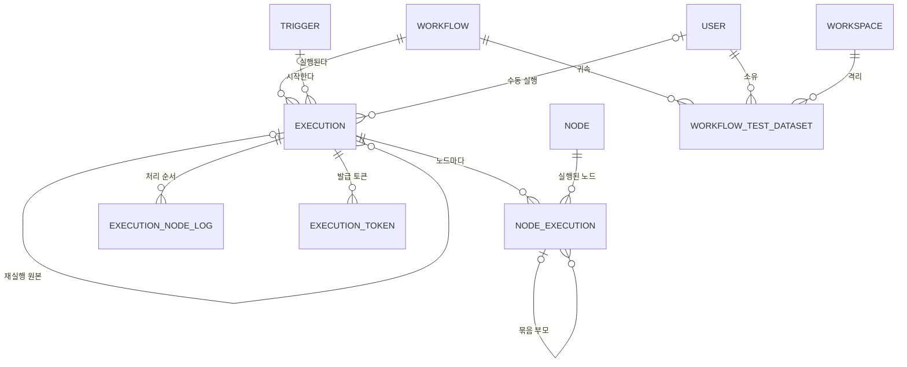
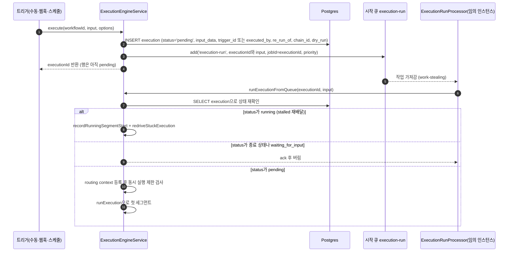
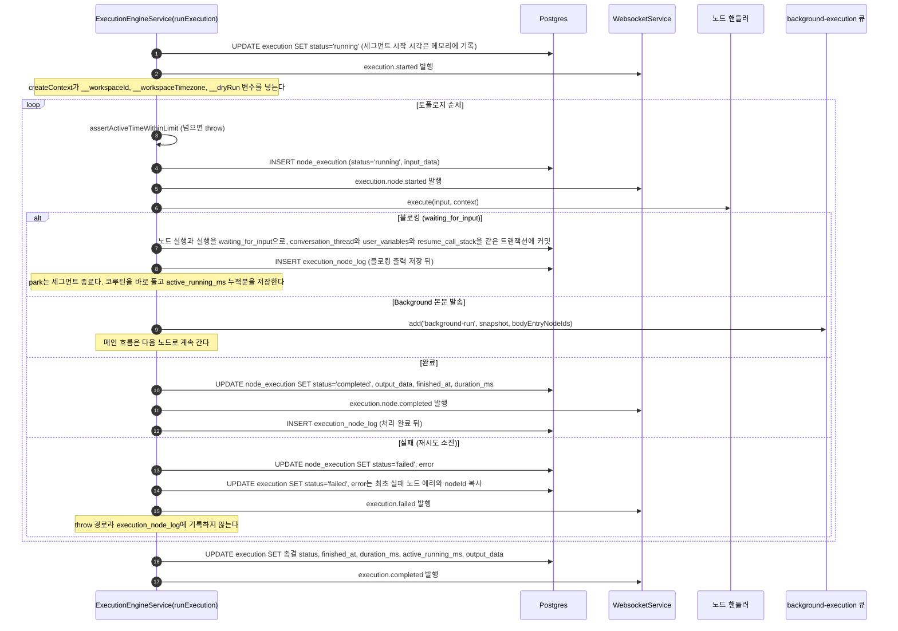
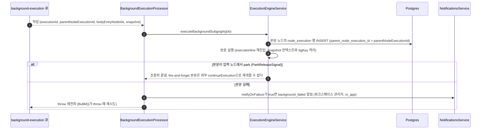
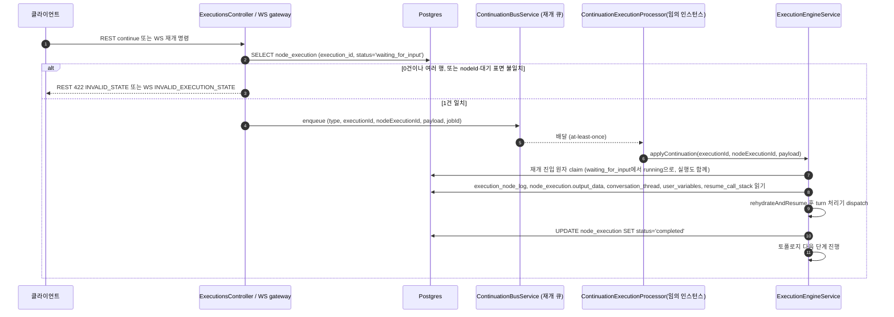

> 구현 상태: 구현됨 · 원문: `spec/data-flow/3-execution.md`, `spec/1-data-model.md` (§2.13 Execution, §2.13.1 ExecutionNodeLog, §2.13.3 WorkflowTestDataset, §2.14 NodeExecution, Rationale "삭제 연쇄의 FK 인덱스 다섯", "Execution.execution_path → ExecutionNodeLog"), `spec/5-system/4-execution-engine.md` (§7.4 `execution_node_log` 모델) · 용어: [용어 사전](../CLE-GLOSSARY.md)

## 개요

워크플로우 한 번의 실행이 어떤 데이터를 남기고 그 데이터가 어디로 흐르는지 정한다. 실행은 트리거(수동·웹훅·스케줄)에서 시작해 시작 큐(`execution-run`)를 거친다. 임의 인스턴스의 워커가 노드 그래프를 토폴로지 순서로 돌며 노드 핸들러를 부르고 결과를 Postgres, Redis, WebSocket 에 반영한다. Background 노드 본문과 재개 신호는 별도 BullMQ 큐로 나뉜다.

이 문서가 소유하는 엔티티는 넷이다.

- 실행(Execution, `execution`): 워크플로우가 한 번 도는 단위와 그 기록
- 노드 실행(NodeExecution, `node_execution`): 한 실행 안에서 노드가 한 번 도는 단위와 그 기록
- 노드 실행 순서 로그(`ExecutionNodeLog`): 노드가 처리된 순서를 쌓는 append-only 테이블
- 테스트 데이터셋(`WorkflowTestDataset`): 이름을 붙여 저장한 테스트 입력(Mock Input)

범위 밖:

- 실행 상태와 노드 실행 상태의 전이 규칙과 상태도는 [실행 상태 머신과 대기·재개](CLE-EXEC-STATE.md) 가 정한다. 이 문서는 상태 값을 컬럼으로만 다룬다.
- 시작 큐·재개 큐의 계약, 동시 실행 제한, 실행 시간 한도는 [큐 워커와 동시 실행 제한](CLE-EXEC-WORKER.md) 에 있다.
- 크래시 재구동, rehydration, 안전 종료는 [장애 복구와 안전 종료](CLE-EXEC-RECOVERY.md) 에 있다.
- 실행 컨텍스트 필드와 park 때 무엇을 커밋하는지는 [실행 컨텍스트](CLE-EXEC-CONTEXT.md) 에 있다.
- EIA 토큰 테이블 `execution_token` 은 [EIA 데이터와 흐름](../CLE-IX/CLE-EIA-DATA.md), 재실행 컬럼의 정책은 [재실행](CLE-EXEC-RERUN.md), 응답 마스킹은 [응답 자격 증명 마스킹](../CLE-API/CLE-API-EGRESS.md), 테스트 데이터셋의 화면·권한·API 는 [에디터 실행과 디버깅](CLE-EXEC-RUN.md) 에 있다.
- 엔티티 전체 지도와 공통 컬럼 규칙은 [데이터 모델 개요](../CLE-PLAT/CLE-PLAT-DATA.md) 에 있다.

## 엔티티 관계

그림은 실행 데이터를 중심으로 한 관계다. 실행은 워크플로우에 속하고 노드 실행과 노드 실행 순서 로그를 거느린다. 서브 워크플로우 실행과 재실행은 실행끼리 자기 참조로 잇는다.

## 실행

| 필드 | 타입 | 설명 |
| --- | --- | --- |
| id | UUID | PK |
| workflow_id | UUID | FK → Workflow (CASCADE). 워크플로우를 지우면 실행도 지워진다. |
| trigger_id | UUID? | FK → Trigger (SET NULL). 트리거로 시작한 실행 |
| status | Enum | pending / running / completed / failed / cancelled / waiting_for_input. 전이 규칙은 [실행 상태 머신과 대기·재개](CLE-EXEC-STATE.md) |
| queued_at | Timestamp? | 시작 큐 대기에 들어간 시각(`execute()` 가 `pending` 행을 INSERT 한 시점). 큐 대기 한도(`now - queued_at` 가 5분 초과) 판정 기준이다. `started_at`(`running` 전이 시각)과 별개다. 마이그레이션 V104(PR2b). 규칙은 [큐 워커와 동시 실행 제한](CLE-EXEC-WORKER.md) |
| started_at | Timestamp | 실행 시작 시각. 부팅 복구 스캔의 stale 판정과 re-claim 에도 쓴다([장애 복구와 안전 종료](CLE-EXEC-RECOVERY.md)). |
| finished_at | Timestamp? | 실행 종료 시각 |
| duration_ms | Integer? | 실행 소요 시간(wall-clock, 시작부터 종료까지). **취소·타임아웃으로 끝난 경로에서는 실행 시간이 아니라 대기 경과 시간**이다. 기준은 [External Interaction API](../CLE-IX/CLE-EIA.md) §6.5 다. 컬럼이 `INTEGER`(int4, 약 24.8일)라 쓰는 쪽은 상한을 반드시 잘라야 한다. |
| active_running_ms | Integer | 세그먼트 누적 시간(ms). 워커가 노드를 전진시킨 구간의 합이며 입력 대기 park 시간은 뺀다. 기본 0. 실행 시간 한도(`EXECUTION_TIME_LIMIT_EXCEEDED`)의 측정 기준이다(V083). |
| input_data | JSONB? | 실행 입력. **응답·발행 때 자격 증명 값 패턴을 가린다**(DB 는 원문 보존). 자매 `NodeExecution.input_data` 와 같은 규칙이다. 범위는 [응답 자격 증명 마스킹](../CLE-API/CLE-API-EGRESS.md) 이 정한다. 서버도 2층으로 거부한다. 수동 실행 경로(저작 주체 기준, 재제출뿐 아니라 직접 입력도 포함)에서 값 leaf 가 마스킹 마커와 정확히 같으면 `400` `details[].code = MASKED_VALUE_RESUBMITTED` 로 거부한다(UI 를 거치지 않은 API 직접 호출 대비). 프론트엔드 마커 가드(프리필 건너뜀, 제출 차단)는 [재실행](CLE-EXEC-RERUN.md) 과 [에디터 실행과 디버깅](CLE-EXEC-RUN.md) 에 있다. |
| output_data | JSONB? | 실행 최종 출력. 응답·발행 때 자격 증명 값 패턴을 가린다(DB 는 원문 보존). 범위는 [응답 자격 증명 마스킹](../CLE-API/CLE-API-EGRESS.md) |
| error | JSONB? | 에러 정보. 최초 `failed` 노드 실행의 에러를 복사하거나 엔진이 직접 쓴다. [실행 에러와 노드 실행 에러](#실행-에러와-노드-실행-에러) 참조 |
| executed_by | UUID? | FK → User (NO ACTION). 수동 실행 때 |
| parent_execution_id | UUID? | FK → Execution (SET NULL). 서브 워크플로우 실행의 부모 실행 |
| recursion_depth | Integer | 서브 워크플로우 호출 깊이(root = 0) |
| re_run_of | UUID? | FK → Execution (SET NULL). 재실행의 바로 앞 실행(원본 실행). NULL 이면 이 실행이 재실행 체인의 시작이다. 정책은 [재실행](CLE-EXEC-RERUN.md) |
| chain_id | UUID? | NULL 허용(V067). v1 은 NULL 허용이 정식 모델이다. 같은 재실행 체인(re-run chain)의 실행을 모두 묶는 식별자다. 일반 실행(원본, 서브 워크플로우, Background)은 `chain_id = NULL` 이다. 재실행으로 만든 실행만 `chain_id = <체인 root id>`(= 원본 실행 id)다. 체인 전체 조회는 `id = rootId OR chain_id = rootId` 다. `re_run_of` 도 NULL 허용이며 재실행 행만 바로 앞 부모 id 를 가리킨다. 체인 깊이 32 제한은 애플리케이션이 지킨다. 초기 설계(NOT NULL, 자기 참조)에서 NULL 허용으로 바꾼 근거는 [재실행](CLE-EXEC-RERUN.md#chain_id-는-nullable-이다-2026-05-31-결정-f2) 과 `migrations/V067__execution_re_run_chain.sql` 헤더에 있다. |
| dry_run | Boolean | `NOT NULL DEFAULT false`(V068). dry-run 재실행(RR-PL-01)으로 만든 실행만 true 다. 엔진이 `createContext` 때 `variables.__dryRun` 으로 넣어 부수효과 노드가 모의 출력을 돌려주게 한다. rehydration 때도 되살린다. 기준은 [재실행](CLE-EXEC-RERUN.md) |
| conversation_thread | JSONB? | NULL 허용(V084). 입력 대기 park 에 들어갈 때 대화 스레드(`ExecutionContext.conversationThread`) 전체 스냅샷을 커밋하는 영속 재개 매체다. rehydration 이 여기서 대화 스레드를 손실 없이 되살린다(`runningSummary` / `summarizedUpToSeq` 포함). park 밖 단계에서는 낡을 수 있다(마지막 park 때 쓴 값). 실행 내역 타임라인의 분산 기준(`NodeExecution.output_data` / `interaction_data`)과 목적·소비처가 다르다. 정책은 [대화 스레드](../CLE-IX/CLE-IX-THREAD.md) |
| user_variables | JSONB? | NULL 허용(V085). park 에 들어갈 때 실행 컨텍스트 변수 중 **시스템 예약 변수(`__*`)를 뺀 사용자 정의분**(변수 선언 노드·변수 수정 노드 값)을 커밋하는 영속 재개 매체다. rehydration 이 되살려 park 뒤 노드가 park 전 변수를 손실 없이 참조한다(`$var.X`). 시스템 `__*` 변수는 rehydration 이 따로 다시 넣으므로 담지 않는다. park 밖 단계에서는 낡을 수 있다. 커밋 규칙은 [실행 컨텍스트](CLE-EXEC-CONTEXT.md) |
| resume_call_stack | JSONB? | NULL 허용(V087, 사용 중, PR-B2b 2026-06-06). **중첩 서브 워크플로우(`executeInline`) 안의 블로킹 노드**가 park 할 때 재개에 필요한 `executeInline` 호출 체인(바깥쪽부터 입력 대기 안쪽 직전까지, `{version, frames:[{workflowId, invokerNodeId, recursionDepth}]}`)을 커밋하는 영속 재개 매체다. rehydration 이 이 스택을 따라 가장 안쪽 입력 대기 노드부터 frame 단위로 재진입한다. **NULL = 최상위 park(중첩 깊이 0), park 한 적 없는 실행, 배포 이전 행**이며 단일 수준으로 재개한다. 컨테이너 본문 블로킹이 금지라 선형 스택만 담는다(반복 회차·분기 상태 없음). `version` 은 `CALL_STACK_SCHEMA_VERSION`(체크포인트와 독립)이다. 재진입 절차는 [장애 복구와 안전 종료](CLE-EXEC-RECOVERY.md) |
| source_ip | Varchar(45)? | NULL 허용(V096). 웹훅·채팅 채널 트리거가 발화할 때 `hooks.service` 의 `extractClientIpFromHeaders` 결과다(CF-Connecting-IP 를 믿을 때, 아니면 X-Forwarded-For 첫 IP. 헤더 기반이며 `req.ip` 로 대신하지 않는다). HTTP 가 아닌 트리거(스케줄), 수동 실행, 배포 이전 행은 NULL 이다. [외부 호출 인증 설정](../CLE-TRIG/CLE-TRIG-AUTHCFG.md) 사용 내역의 호출 이력 "소스 IP" 컬럼 출처다. 길이 45 는 IPv6 표기 최대(IPv4-mapped 포함)다. |
| response_code | Varchar(10)? | NULL 허용(V096). 웹훅 호출이 받는 **실제 HTTP 응답 코드** 문자열이다(실행 생성 성공 경로 = `'202'` Accepted. 인증·검증 실패는 execute 전에 throw 해 행이 생기지 않는다). HTTP 가 아닌 트리거는 HTTP 코드가 없어 NULL 이고 `getUsage` 가 실행 `status` 로 대신 표시한다. [외부 호출 인증 설정](../CLE-TRIG/CLE-TRIG-AUTHCFG.md) 호출 이력 "응답 코드" 컬럼 출처다([웹훅](../CLE-TRIG/CLE-TRIG-WEBHOOK.md) WH-MG-05 이행). |
| single_node_id | UUID? | NULL 허용(V098). 단일 노드 실행(`single_node_id`)의 대상 노드 id 다. 값이 있으면 엔진(`runExecution`)이 그 노드만 실행하고 하류로 가지 않는다. 선택 노드부터 실행과 다르다. NULL 이면 일반 실행이나 선택 노드부터 실행이다. `_node_id` 접미사는 Node FK 도메인을, `single_` 한정자는 `fromNodeId`(컬럼이 아니라 `input_data` 로 전달)와의 구분을 나타낸다. `dry_run` / `re_run_of` 와 같은 모드 표시 컬럼이다. 명시적 FK 제약과 인덱스가 없다(`re_run_of` 선례, 디버그 전용이라 조회 패턴 없음). `dry_run` 과 직교하며 단일 노드 실행은 항상 `dry_run = false` 다(두 모드 조합 미지원, v1). 기준은 [에디터 실행과 디버깅](CLE-EXEC-RUN.md) |
| previous_execution_id | UUID? | NULL 허용(V098). 단일 노드 실행 때 입력 seed 를 가져올 직전 실행 id 다. 그 실행에서 대상 노드의 직속 선행 노드 실행 `output_data` 를 현재 실행 컨텍스트에 되살려 상류 출력을 자동으로 넣는다. NULL 이면 seed 가 없다(수동 입력만). `re_run_of`(재실행 부모)와 뜻이 다르다. 입력 주입 참조일 뿐 체인 관계가 아니다. API 응답 DTO 에는 없다(whitelist 매핑에서 저절로 빠진다). |

**인증 설정 호출 집계**: 인증 설정 사용 내역(`GET /api/auth-configs/:id/usage`)의 `totalCalls` / `periodCounts` / `recentCalls` 는 **전용 로그 엔티티 없이** `Execution.trigger_id → Trigger.auth_config_id` 조인으로 계산한다. 인증 설정에 연결된 트리거들의 실행 행이 곧 "호출" 이다. `periodCounts` 는 `Execution.started_at` 의 롤링 윈도 조건부 집계(`COUNT(*) FILTER`), `recentCalls` 는 최근 20건의 `triggerName` / `status` / `source_ip` / `response_code` / `started_at` 이다. 화면과 API 는 [외부 호출 인증 설정](../CLE-TRIG/CLE-TRIG-AUTHCFG.md) 에 있다.

**`dryRun` 응답 필드의 출처**는 `dry_run` 컬럼(V068)이다. 응답 DTO(`ExecutionDto.dryRun`)는 이 컬럼을 그대로 내보낸다. 노드 실행을 집계해 만든 값이 아니다. 노드 실행 수준의 `output_data._dryRun` 은 노드별 결과 표시용으로 별개다. 기준은 [재실행](CLE-EXEC-RERUN.md) 이다.

**`error` 의 엔진 인프라 코드**: `error.code` 어휘는 노드 핸들러가 정한 코드([노드 출력 규약](../CLE-NODE/CLE-NODE-OUTPUT.md) 의 `output.error` 표준 형태)에 더해 엔진 인프라 코드를 포함한다. 아래 여섯 코드는 **등재처가 서로 다르다.** 이 목록이 단일 등재처를 뜻하지 않는다.

| 코드 | 등재처 | 뜻 | 기준 문서 |
| --- | --- | --- | --- |
| `SERVER_INTERRUPTED` | `EngineErrorCode` const | 안전 종료 때 끝나지 못한 노드 | [장애 복구와 안전 종료](CLE-EXEC-RECOVERY.md) |
| `WORKER_HEARTBEAT_TIMEOUT` | `EngineErrorCode` const | 세그먼트 작업이 stalled 재배달(`maxStalledCount=1`) 시도를 모두 소진함. 워커 쪽 최종 실패이며 PR4(2026-07-04)에서 구현됐다. 부팅 복구 스캔 재구동은 이 코드를 쓰지 않는다(재구동 불가는 `RESUME_CHECKPOINT_MISSING`). | [장애 복구와 안전 종료](CLE-EXEC-RECOVERY.md) |
| `EXECUTION_TIME_LIMIT_EXCEEDED` | `ErrorCode` const | 엔진 수준 세그먼트 누적 시간 초과(입력 대기 시간 제외) | [큐 워커와 동시 실행 제한](CLE-EXEC-WORKER.md) |
| `RESUME_FAILED` / `RESUME_CHECKPOINT_MISSING` / `RESUME_INCOMPATIBLE_STATE` | `RehydrationError.code` 리터럴 유니온 | 재개 rehydration 실패 | [장애 복구와 안전 종료](CLE-EXEC-RECOVERY.md) |

상수로 한 번 더 옮기지 않는 이유는 `codebase/backend/src/nodes/core/error-codes.ts` 의 JSDoc 에 있다. 에러 코드 전체 카탈로그는 [에러 코드 규약과 카탈로그](../CLE-API/CLE-API-ERRCODES.md) 다.

## 노드 실행

| 필드 | 타입 | 설명 |
| --- | --- | --- |
| id | UUID | PK |
| execution_id | UUID | FK → Execution (CASCADE) |
| node_id | UUID | FK → Node (CASCADE) |
| parent_node_execution_id | UUID? | FK → NodeExecution (SET NULL). 이 행을 묶는 그룹 노드의 노드 실행이다. 서브 워크플로우(인라인 실행), Background(본문), Parallel(분기) 노드가 자기 행 id 를 자식 행에 찍는다. 실행 결과 타임라인은 이 값으로 자식을 부모 아래에 묶는다. 부모 행이 지워져도 자식 이력은 남고 묶음만 잃는다(V012). |
| status | Enum | pending / running / completed / failed / cancelled / skipped / waiting_for_input. `cancelled` 는 노드가 실패한 것이 아니라 **중단된** 상태다. 두 경로가 여기로 온다. (1) 외부 `abortSignal` 로 외부 I/O 가 끊겨 핸들러가 던진 `AbortError`. (2) 엔진이 노드 경계, AI 턴 경계, park 짝 전이에서 실행 행을 다시 읽어 외부 취소를 알아채고 던진 `ExecutionCancelledError`. 사용자 실행 중지는 신호를 만들지 않으므로 선형 경로와 재개 경로에서는 (2)가 유일한 관측 수단이다. 규칙은 [노드 취소](CLE-EXEC-CANCEL.md) 와 [실행 상태 머신과 대기·재개](CLE-EXEC-STATE.md) |
| started_at | Timestamp | 실행 시작 시각 |
| finished_at | Timestamp? | 실행 종료 시각 |
| duration_ms | Integer? | 소요 시간 |
| input_data | JSONB | 노드 입력. **응답·발행 때 자격 증명 값 패턴을 가린다**(DB 는 원문 보존). 상위 `Execution.input_data` 와 **같은 규칙**이다. 한쪽만 가리면 REST 폴링이 WS 의 가린 값을 덮어 값이 번갈아 바뀐다. 범위는 [응답 자격 증명 마스킹](../CLE-API/CLE-API-EGRESS.md) |
| output_data | JSONB? | 노드 출력. 응답·발행 때 자격 증명 값 패턴을 가린다(DB 는 원문 보존). 범위는 [응답 자격 증명 마스킹](../CLE-API/CLE-API-EGRESS.md) |
| error | JSONB? | 에러 정보 `{ code, message, stack? }` |
| retry_count | Integer | 재시도 횟수 |
| interaction_data | JSONB? | 사용자 인터랙션 기록(Form 제출이나 버튼 클릭). `{ interactionType: "form_submitted" \| "button_click" \| "button_continue", buttonId?, buttonLabel?, clickedAt, clickedBy }`. 여기의 `interactionType` 은 **사용자가 한 행동의 기록**(사용자 행동 기록) enum 이다. 노드의 대기 상태를 나누는 대기 표면(`WaitingInteractionType`: `form` / `buttons` / `ai_conversation` / `ai_form_render`)과 **이름만 같고 다른 enum** 이다. 기준은 [인터랙션 타입 레지스트리](../CLE-IX/CLE-IX-TYPES.md). 이 필드와 AI 노드의 `output_data.messages` 가 [대화 스레드](../CLE-IX/CLE-IX-THREAD.md) 의 분산 기준이며 실행 뒤 타임라인 UI 가 이것으로 다시 구성한다. |

**행 생성**:

- 엔진은 노드 실행 행을 처음부터 `status='running'` 으로 INSERT 한다(`executeNode`, `createNodeExecution` 호출부). 비활성(`is_disabled`) 노드는 `status='skipped'` 로 바로 INSERT 한다(`running` 을 거치지 않는다).
- `pending` 은 엔티티 기본값일 뿐 어떤 엔진 경로도 쓰지 않는다(현재 구현, 데이터 흐름 원문의 코드 관찰). 엔진 원문의 상태 설명과 정의가 갈린다. [미결 사항](#미결-사항) 참조.
- 노드 실행에는 실행의 `ALLOWED_TRANSITIONS` 같은 코드 수준 전이표가 없다. 노드 실행 상태 전이는 [실행 상태 머신과 대기·재개](CLE-EXEC-STATE.md) 가 정한다.
- 크래시 재구동이 미완료 노드를 다시 실행할 때와 마지막 턴 재시도가 턴을 다시 돌릴 때는 **새 노드 실행 행**을 만든다. 규칙은 [장애 복구와 안전 종료](CLE-EXEC-RECOVERY.md) 와 [실행 상태 머신과 대기·재개](CLE-EXEC-STATE.md) 에 있다.

## 실행 에러와 노드 실행 에러

| 항목 | 설명 |
| --- | --- |
| 원본 | `NodeExecution.error`. 개별 노드 실행이 실패할 때 기록한다. |
| 복사 | `Execution.error`. 실행이 `failed` 로 바뀔 때 **최초 `failed` 노드 실행**의 에러 정보에 `nodeId` 를 붙여 복사한다. |
| 직접 기록 | **복사가 유일한 채움 경로는 아니다.** 엔진 인프라 사유로 끝날 때는 복사할 노드 에러가 없어 엔진이 `Execution.error` 를 직접 쓴다. 큐 대기 한도 초과는 노드가 시작된 적이 없어 `Execution.error = { code: EXECUTION_QUEUE_WAIT_TIMEOUT, message }` 를 직접 UPDATE 한다. 이 경로의 종결 상태는 `failed` 가 아니라 **`cancelled`** 라 에러 코드 문서의 "엔진 수준 에러"(실패) 목록에는 나오지 않는다. rehydration 실패(`RESUME_*`, `cancelled`), stalled 재배달 소진(`WORKER_HEARTBEAT_TIMEOUT`, `failed`), 실행 시간 한도 초과(`EXECUTION_TIME_LIMIT_EXCEEDED`, `failed`), 안전 종료(`SERVER_INTERRUPTED`, `failed`)도 노드 에러 복사가 아니다. 경로 전체는 [상태별 종결 코드](#상태별-종결-코드) 에 있다. |
| 구조 | `{ nodeId: "uuid" \| null, code: "ERROR_CODE" \| null, message: "에러 설명", details?: {...} }`. `nodeId` 는 노드 없는 엔진 인프라 실패(워커 크래시 등)에서 `null` 이다. `code` 는 분류할 코드가 없는 일반 `catch` 경로에서 `null` 이다. `details` 는 노드 핸들러 결과의 `output_data.error.details`([노드 출력 규약](../CLE-NODE/CLE-NODE-OUTPUT.md))에서 오며 `NodeExecution.error` 표에는 없다. 억지 대체 코드를 넣지 않는 이유는 [External Interaction API](../CLE-IX/CLE-EIA.md) §6.4 에 있다. |
| 용도 | 실행 목록에서 노드 실행을 조회하지 않고도 실행 단위로 에러 원인을 바로 볼 수 있다. |
| 응답 마스킹 | **열거된 경로에서만** 자격 증명 값 패턴을 가린다. DB 는 원문을 보존한다. 위 "복사" 관계 때문에 **한쪽만 가리면 같은 문자열이 같은 응답에 함께 실려 방어가 뚫린다.** 그래서 가리는 경로에서는 `Execution.error` 와 `NodeExecution.error` 를 반드시 함께 가린다. "어디로 나가든 가려진다" 로 읽으면 안 된다. 적용 표면과 남은 틈은 열거로만 정의하며 목록과 개수를 여기 다시 적지 않는다. 기준은 [응답 자격 증명 마스킹](../CLE-API/CLE-API-EGRESS.md) 의 "적용 범위는 총칭이 아니라 열거다" 항목이다. 2026-08-16 부터 WebSocket `execution.node.*` 와 종결이 아닌 `execution.*` **발행** 경로도 가림 대상이다([WebSocket 이벤트와 명령](../CLE-API/CLE-API-WS-EVENTS.md)). |

## 노드 실행 순서 로그

노드 실행 순서 로그(`ExecutionNodeLog`, `execution_node_log`)는 노드가 처리된 순서를 쌓는 append-only 테이블이다. `(execution_id, id)` 정렬이 곧 노드 실행 순서다.

| 필드 | 타입 | 설명 |
| --- | --- | --- |
| id | BIGSERIAL | PK. PostgreSQL sequence 가 매기는 순서가 곧 실행 순서다. |
| execution_id | UUID | FK → Execution (ON DELETE CASCADE) |
| node_id | UUID | 실행된 노드 ID |
| created_at | TimestampTZ | append 시각(기본 `NOW()`) |

**인덱스**: `(execution_id, id)`(V035). 한 실행의 노드 순서를 조회한다.

- **다중 인스턴스 안전**: BIGSERIAL `id` 는 PostgreSQL sequence 가 매기므로 여러 백엔드 인스턴스가 동시에 INSERT 해도 순서가 결정적이다.
- **처리 완료 로그다**: 진입 로그가 아니다. `appendExecutionPath` 호출 지점은 핸들러 실행이 끝난 뒤(`completed` 마감이나 블로킹 출력 저장 뒤) 한 곳뿐이다. 노드가 throw 해 catch 로 빠지면 기록하지 않는다. rehydration 이 이 로그를 "실행된 노드 집합" 으로 다시 읽는 의미와 맞는다.
- **응답의 `executionPath`**: 외부 API 응답의 `executionPath: string[]` 모양은 유지한다. `findById` 가 이 테이블의 정렬 쿼리(`(execution_id, id) ASC`)로 채운다. 목록 조회 응답은 N+1 을 피하려고 빈 배열을 돌려준다.
- **옛 컬럼 없음**: 실행 테이블의 `execution_path` 컬럼은 없다(V036 에서 DROP). 이행 경위는 [Rationale](#rationale) 에 있다.

## 테스트 데이터셋

테스트 데이터셋(`WorkflowTestDataset`)은 워크플로우 에디터의 테스트 입력(Mock Input)을 이름 붙여 저장하고 다시 쓰는 데이터셋이다(V097). 권한과 소유 모델의 기준은 [에디터 실행과 디버깅](CLE-EXEC-RUN.md) 이다.

| 필드 | 타입 | 설명 |
| --- | --- | --- |
| id | UUID | PK |
| workflow_id | UUID | FK → Workflow (CASCADE, 같은 워크스페이스). 데이터셋이 속한 워크플로우 |
| owner_id | UUID | FK → User (CASCADE). 소유 사용자. 만들 때 항상 요청 사용자이며 수정·삭제 권한의 단일 기준이다. |
| workspace_id | UUID | FK → Workspace (CASCADE). 워크스페이스 격리와 공유 목록 쿼리용(워크플로우의 워크스페이스를 비정규화). 복합 FK `fk_workflow_test_dataset_workflow_id`(V141)가 워크플로우의 워크스페이스와 같게 지킨다([데이터 모델 개요 「참조의 소속」](../CLE-PLAT/CLE-PLAT-DATA.md#참조의-소속)) |
| visibility | Enum | `private`(기본, 소유자만) / `workspace`(워크스페이스에 읽기 전용 공유). 소유자가 아니면 공유본을 복제해 고친다. |
| name | Varchar(255) | 데이터셋 이름 |
| data | JSONB | 테스트 입력 JSON(`POST /workflows/:id/execute` 본문의 `input` 으로 쓴다). **API 표면 키는 `input`** 이다. TransformInterceptor 의 최상위 `data` 키 감싸기 휴리스틱과 부딪치지 않게 하려는 것이다(DB 컬럼은 `data`, 엔티티·DTO 속성은 `input`). |
| created_at / updated_at | TimestampTZ | 생성·수정 시각 |

**제약**: `(workflow_id, owner_id, name)` UNIQUE. 한 사용자가 같은 워크플로우에 같은 이름을 두 번 저장할 수 없다(어기면 409 `DUPLICATE_NAME`).

**인덱스**: `(owner_id, workflow_id)` 는 사용자의 그 워크플로우 데이터셋 조회용이다. `(workspace_id, visibility)` 는 워크스페이스 공유본 목록 필터용이다.

## 실행 데이터 흐름

코드 진입점은 `ExecutionEngineService` 의 `execute` / `runExecutionFromQueue` / `runExecution` / `executeInline` / `executeSync` / `executeAsync` 다. 아래 시퀀스에서 `Eng` 는 한 actor 로 그렸다. 재개 턴 처리와 마지막 턴 재시도는 같은 프로세스 안의 협력 서비스(`FormInteractionService` / `ButtonInteractionService` / `AiTurnOrchestrator` / `RetryTurnService`)에 in-process `EngineDriver` 로 맡긴다. 분산 분리가 아니라 클래스 경계 정리다. 배경은 [실행 엔진 개요와 그래프 순회](CLE-EXEC-ENGINE.md) 에 있다.

### 실행 시작

`execute()` 는 실행을 **직접 시작하지 않는다.** 실행 행을 `pending` 으로 저장하고 시작 큐에 작업을 발행한 뒤 executionId 를 바로 돌려준다. 반환 직후 실행이 곧바로 시작된다는 보장은 없다. 첫 세그먼트는 임의 인스턴스의 워커가 work-stealing 으로 처리한다.

그림은 실행 행이 만들어지고 워커가 첫 세그먼트를 시작하기까지다. 우선순위, jobId, 작업 옵션, 세 갈래 분기의 규칙은 [큐 워커와 동시 실행 제한](CLE-EXEC-WORKER.md) 에 있다. `running` 분기의 재구동은 [장애 복구와 안전 종료](CLE-EXEC-RECOVERY.md) 에 있다.

### 첫 세그먼트

그림은 첫 세그먼트에서 노드마다 어떤 행이 쓰이는지 보여 준다.

- **노드 실행 순서 로그는 처리 완료 로그다.** 기록 시점은 [노드 실행 순서 로그](#노드-실행-순서-로그) 에 있다.
- **세그먼트 시간 누적(PR2a)**: `updateExecutionStatus` 가 `running` 에 들어가고 나올 때마다 세그먼트 시간을 `execution.active_running_ms` 에 더한다. dispatch 반복문은 노드 사이마다 `assertActiveTimeWithinLimit` 를 부른다. 누적(저장분 + 진행 중 세그먼트 경과분)이 한도(`EXECUTION_MAX_ACTIVE_RUNNING_MS`, 기본 30분, `0`=무제한, `execution-limits.ts`) 이상이면 `ExecutionTimeLimitError` 를 던져 `error.code='EXECUTION_TIME_LIMIT_EXCEEDED'` 로 `failed` 마감한다. 입력 대기 park 시간은 `running` 이 아니므로 누적에서 저절로 빠진다(불변식).
- 노드 실행은 try 첫 줄에서 `ShutdownStateService.registerInFlight` 로 등록되고 finally 에서 해제된다. 안전 종료 drain 이 이 목록을 추적한다([장애 복구와 안전 종료](CLE-EXEC-RECOVERY.md)).
- 비활성(`is_disabled`) 노드는 `status='skipped'` 로 **바로 INSERT** 된다(`running` 을 거치지 않는다).

### Background 본문

그림은 Background 본문이 메인 실행과 따로 도는 흐름이다.

- `background_failed` 알림을 보내는 주체는 엔진이 아니라 **`BackgroundExecutionProcessor.process` 의 catch** 다(`dispatchFailureNotification`, 정리된 에러 메시지 포함). 알림 속성은 [알림](../CLE-OBS/CLE-OBS-NOTIFY.md) 에 있다.
- 본문 실패는 메인 실행의 상태를 바꾸지 않는다(격리).
- Processor 는 `background:run:<id>` WebSocket 채널로 `execution.background_run.started` / `completed` 이벤트도 발행한다(모니터링). 본문 실행 규칙과 모니터링은 [Background 노드](../CLE-NODE-LOGIC/CLE-NODE-BACKGROUND.md) 와 [컨테이너 실행](CLE-EXEC-CONTAINER.md) 에 있다.

### 입력으로 재개

그림은 입력 대기 실행에 재개 명령이 들어와 다시 진행되기까지 읽고 쓰는 데이터다.

- 재개 진입점은 두 가지다. (1) REST `POST /executions/:id/continue` 는 본문 `{ formData? }` 만 받고 입력 대기가 아니면 동기 422 `INVALID_STATE` 로 응답한다(`executions.controller.ts` `continueExecution`). (2) WebSocket `execution.submit_form` / `execution.click_button` / `execution.submit_message` / `execution.end_conversation`(`websocket.gateway.ts`). ack 이름과 wire 형식은 [WebSocket 이벤트와 명령](../CLE-API/CLE-API-WS-EVENTS.md) 이 기준이다.
- `type` / `nodeExecutionId` / `payload` 는 클라이언트가 보내는 필드가 아니다. 발행자가 노드 실행 조회 뒤 구성해 재개 큐에 싣는 내부 메시지 필드다. 사전 검증 규칙은 [큐 워커와 동시 실행 제한](CLE-EXEC-WORKER.md) 에 있다.
- claim 이 affected=0 이면 작업을 ack 하고 버린다. 턴 처리의 LLM throw 는 `running → failed`, rehydration 과정 실패는 `RESUME_*` 종결이다. rehydration 실패는 뒤따르는 `execution.cancelled` 이벤트로 알린다. 절차는 [장애 복구와 안전 종료](CLE-EXEC-RECOVERY.md) 에 있다.
- **마지막 턴 재시도(`execution.retry_last_turn`)는 이 흐름과 다르다.** 대상 실행은 `failed` 여야 하고 입력 대기 조회를 거치지 않는다. 새 `running` 노드 실행 행을 만들어 재개 큐로 넘기며 claim 도 `_retryState` 키 조건부 소비로 따로 한다. 규칙은 [실행 상태 머신과 대기·재개](CLE-EXEC-STATE.md) 와 [큐 워커와 동시 실행 제한](CLE-EXEC-WORKER.md) 에 있다.

### 서브 워크플로우 호출

Workflow 노드(`flow.workflow`)가 서브 워크플로우를 부를 때의 진입점이다. 모드 정의는 [워크플로우 호출 노드](../CLE-NODE-FLOW/CLE-NODE-SUBWF.md) 가 기준이다.

| 모드 | 진입점 | 데이터 |
| --- | --- | --- |
| 동기 | `executeInline` | 서브 워크플로우를 **부모 executionId 와 실행 컨텍스트를 공유해** 같은 실행 내역 타임라인 안에서 돌린다. 새 실행 행을 만들지 않는다. 중첩 인라인 안에서 park 하면 호출 체인을 `resume_call_stack` frame 으로 영속하고 rehydration 이 frame 단위로 재진입한다. Background 본문도 이 경로를 다시 쓴다. |
| 비동기(fire-and-forget) | `executeAsync` | 부모는 바로 다음 노드로 간다. 자식 실행 행을 INSERT 한 뒤(`parent_execution_id = parent.id`, `recursion_depth = parent + 1`) **`runExecution` 을 자체 promise 로 실행**한다(`.catch` 는 로그만). 결과는 별도 행으로 볼 수 있다. `MAX_RECURSION_DEPTH` 로 깊이를 막는다. 시작 큐를 거치지 않는다. |

엔진에는 `executeSync` 진입점도 있다. 자식 실행 행을 `pending` 으로 INSERT 한 뒤 **`runExecution` 을 직접 await** 하고 `timeoutMs`(기본 300초, `0`=무제한)와 `Promise.race` 한다. timeout 뒤에는 행을 다시 읽어 상태를 비교해 TOCTOU 를 막는다. 시작 큐를 거치지 않는다. 현재 구현의 Workflow 노드 핸들러는 동기 모드에 `executeInline`, 비동기 모드에 `executeAsync` 를 부르며 `executeSync` 는 부르지 않는다.

메인 워크플로우와 서브 워크플로우의 실제 실행 본체는 모두 `runExecution` 이다. `executeInline` 은 "부모 실행 안의 인라인 실행" 전용이며 메인 실행 경로의 이름이 아니다. 서브 워크플로우 자식 실행에 동시 실행 제한이 적용되는지는 [큐 워커와 동시 실행 제한](CLE-EXEC-WORKER.md) 의 미결 사항에 있다.

## 저장소 매핑

### Postgres

| 테이블 | 흐름 | 읽고 쓰는 컬럼 | 인덱스·제약 |
| --- | --- | --- | --- |
| `execution` | 실행 진입 | INSERT `workflow_id, trigger_id?, status='pending', input_data, started_at, executed_by?, parent_execution_id?, recursion_depth, re_run_of?, chain_id?, dry_run`. `re_run_of`/`chain_id` 는 재실행 체인(decision F2), `dry_run` 은 컨텍스트 변수 `__dryRun` 으로 핸들러에 넣는다(V068). | `(workflow_id, started_at DESC)`, `(status)` |
| `execution` | 상태 전이 | UPDATE `status, finished_at, duration_ms, output_data, error, active_running_ms`. `active_running_ms` 는 `running` 을 떠날 때마다 더한다(PR2a). `error` 는 최초 `failed` 노드 실행의 에러 + nodeId 복사다. **`status IN (종료 아닌 상태)` 조건부 UPDATE 이며 트랜잭션 안에서 실행한다**(2026-08-30). 결과 shape 확인이 throw 하면 이 UPDATE 도 함께 롤백된다. 원자성 규칙은 [실행 상태 머신과 대기·재개](CLE-EXEC-STATE.md), 결정 배경은 [장애 복구와 안전 종료](CLE-EXEC-RECOVERY.md) 의 Rationale 에 있다. | 없음 |
| `execution` | park 진입(영속 재개) | UPDATE `conversation_thread, user_variables, resume_call_stack`. `waiting_for_input` 전이와 같은 트랜잭션으로 커밋한다(V084/V085/V087). | 없음 |
| `node_execution` | 노드 실행 시작 | INSERT `execution_id, node_id, status='running', started_at, input_data, retry_count=0, parent_node_execution_id?`(V006/V012). 건너뛴 노드는 `status='skipped'` 로 바로 INSERT | `(execution_id)`, V034 `(execution_id, node_id, started_at DESC)` 복합, V095 `(execution_id, status) WHERE status IN ('waiting_for_input','running')` 부분 인덱스(활성 노드 조회·전이), V112 `(node_id)`(FK CASCADE, 캔버스 노드 삭제·워크플로우 삭제) |
| `node_execution` | 노드 완료 | UPDATE `status, finished_at, duration_ms, output_data, error, retry_count, interaction_data`(V004) | 없음 |
| `execution_node_log` | 노드 **처리 완료 때** | INSERT `execution_id, node_id, created_at`(append-only). `completed` 마감이나 블로킹 출력 저장 뒤 기록하고 throw 경로는 기록하지 않는다. | `(execution_id, id)`(V035). bigserial PK 가 인스턴스 사이 결정적 순서를 보장한다. |

### Redis

실행 엔진은 BullMQ 큐 세 개를 쓴다.

| 큐 | 발행 | 소비 | payload 핵심 필드 |
| --- | --- | --- | --- |
| `execution-run`(시작 큐) | `ExecutionEngineService.execute`(실행 행 `pending` 저장 뒤) | `ExecutionRunProcessor` → `runExecutionFromQueue`(work-stealing) | `{executionId, input?}`. jobId, 우선순위, 작업 옵션은 [큐 워커와 동시 실행 제한](CLE-EXEC-WORKER.md) |
| `execution-continuation`(재개 큐) | `ContinuationBusService.publish`(WS gateway, REST controller 경유) | `ContinuationExecutionProcessor` | `{type, executionId, nodeExecutionId, payload}`. jobId 와 수명은 [큐 워커와 동시 실행 제한](CLE-EXEC-WORKER.md) |
| `background-execution` | `ExecutionEngineService.scheduleBackgroundBody` | `BackgroundExecutionProcessor` | `executionId, parentNodeExecutionId, backgroundRunId?, workspaceId, workflowId, bodyEntryNodeIds[], input, variables, nodeOutputCache, expressionContext, conversationThread?, config{notifyOnFailure, maxDurationMs}`(`background-execution.queue.ts`). `backgroundRunId?` 와 `conversationThread?` 는 하위 호환용 선택 필드이며 옛 큐 메시지에는 없다. |

- 재개 큐는 `removeOnFail:false` 라 시도(`RESUME_BULLMQ_ATTEMPTS`, 기본 3)를 소진한 작업이 `failed`(DLQ)로 쌓인다. `ContinuationDlqMonitorService` 가 `failed`/`delayed` 적재량을 주기적으로 보고 임계를 넘으면 구조화된 `logger.error` 경고를 cooldown 단위로 남긴다. 설정은 [비동기 큐와 Redis 키 목록](../CLE-PLAT/CLE-PLAT-QUEUE.md) 에 있다.
- 보조 키 `exec:recover:lock`(부팅 복구 스캔 전역 lock, TTL 60초)과 `exec:cont:seq:<executionId>`(재개 큐 jobId 용 단조 seq, `CONTINUATION_SEQ_TTL_SECONDS` 기본 24시간 sliding TTL)의 정의는 [비동기 큐와 Redis 키 목록](../CLE-PLAT/CLE-PLAT-QUEUE.md) 이 기준이다.
- 재개 신호는 재개 큐로 전달한다. 옛 Redis pub/sub 채널 `execution:<executionId>` 는 폐기했다. 결정 근거는 [장애 복구와 안전 종료](CLE-EXEC-RECOVERY.md) 의 Rationale 에 있다.

### WebSocket

| 이벤트 | 발행 시점 | 구독 room |
| --- | --- | --- |
| `execution.started` / `completed` / `failed` / `cancelled` | 실행 상태 전이 | `workflow:<id>` 또는 `execution:<id>` |
| `execution.node.started` / `completed` / `failed` / `cancelled` / `skipped`, `execution.waiting_for_input` | 노드 실행 상태 전이 | 같음 |
| `execution.snapshot` | 소켓이 `execution:<id>` 채널을 처음 구독할 때 한 번(재연결 뒤 재구독 포함). 연결 시점이 아니라 구독 시점이다. 같은 소켓이 이미 구독한 채널을 다시 구독하면 보내지 않는다. 규칙은 [WebSocket 연결과 채널 구독 §6.2](../CLE-API/CLE-API-WS.md#62-놓친-이벤트-복구) | `execution:<id>` |
| `execution.background_run.started` / `completed` | Background 본문 시작·종료 | `background:run:<id>` |

- 이벤트 이름과 발행 조건의 기준은 [WebSocket 이벤트와 명령](../CLE-API/CLE-API-WS-EVENTS.md) 이다. 위 표는 요약이며 어긋나면 그 문서가 우선한다. room 이름(`workflow:<id>` / `execution:<id>`)은 socket.io room 이름공간으로 이벤트 이름과 별개다.
- 모든 발행은 `WebsocketService` 한 곳을 거친다. 정책은 [큐 워커와 동시 실행 제한](CLE-EXEC-WORKER.md) 의 실행 이벤트 발행 경로에 있다.

## 상태별 종결 코드

실행 상태 값의 전이 규칙은 [실행 상태 머신과 대기·재개](CLE-EXEC-STATE.md) 가 정한다. 여기서는 종결 때 `Execution.error.code` 에 남는 값을 모은다.

| 종결 상태 | `error.code` | 경로 | 기준 문서 |
| --- | --- | --- | --- |
| `failed` | 노드 에러 복사 | 어떤 노드든 재시도를 소진하고 실패. 최초 `failed` 노드 실행의 에러 + nodeId 복사 | 이 문서 |
| `failed` | `EXECUTION_TIME_LIMIT_EXCEEDED` | 노드 사이 `assertActiveTimeWithinLimit` 검사에서 세그먼트 누적 시간 한도 초과(PR2a) | [큐 워커와 동시 실행 제한](CLE-EXEC-WORKER.md) |
| `failed` | `WORKER_HEARTBEAT_TIMEOUT` | stalled 재배달(`maxStalledCount=1`) 소진 때 `finalizeStalledExhausted` 가 표시(PR4). 부팅 복구 스캔 재구동은 이 코드를 쓰지 않는다. | [장애 복구와 안전 종료](CLE-EXEC-RECOVERY.md) |
| `failed` | `SERVER_INTERRUPTED` | SIGTERM 안전 종료 유예 시간 초과 | [장애 복구와 안전 종료](CLE-EXEC-RECOVERY.md) |
| `cancelled` | `EXECUTION_QUEUE_WAIT_TIMEOUT` | 큐 대기 5분 초과. 작업을 가져갈 때 검사하거나 작업을 잃은 경우 부팅 복구 스캔이 회수한다. 취소 주체는 `timeout` 이다. | [큐 워커와 동시 실행 제한](CLE-EXEC-WORKER.md) |
| `cancelled` | `RESUME_CHECKPOINT_MISSING` / `RESUME_FAILED` / `RESUME_INCOMPATIBLE_STATE` | rehydration 실패. 짝 노드 실행은 `failed` | [장애 복구와 안전 종료](CLE-EXEC-RECOVERY.md) |
| `cancelled` | `WEBCHAT_IDLE_TIMEOUT` | 공개 웹채팅 위젯 입력 대기 회수(익명 per_execution 토큰 영구 만료 + 유예, EIA-RL-07) | [External Interaction API](../CLE-IX/CLE-EIA.md) |

사용자 실행 중지로도 `cancelled` 가 된다. 큐에서 기다리던 실행이 중지되면 `runExecutionFromQueue` 가 작업을 ack 하고 버린다. 중지 규칙은 [에디터 실행과 디버깅](CLE-EXEC-RUN.md) 과 [노드 취소](CLE-EXEC-CANCEL.md) 에 있다.

비정상 종료 회수(stalled 재배달, 부팅 복구 스캔, 안전 종료)는 입력 대기 실행을 건드리지 않는다. 입력이 도착하면 rehydration 으로 재개한다. 세 경로의 규칙은 [장애 복구와 안전 종료](CLE-EXEC-RECOVERY.md) 가 한 곳에서 정한다.

## 외부 의존

| 의존 | 방향 | 참고 |
| --- | --- | --- |
| 트리거 | 진입 | 웹훅·스케줄·수동 트리거가 실행을 만든다. [트리거 데이터와 흐름](../CLE-TRIG/CLE-TRIG-DATA.md) |
| LLM 사용량 | AI 노드 호출 때 | LLM 호출 뒤 `llm_usage_log` 적재. [LLM 사용량 기록](../CLE-AI/CLE-AI-USAGE.md) |
| 통합 | HTTP Request·Database Query·Send Email 노드 | 자격 증명 해석. [통합 데이터와 흐름](../CLE-INT/CLE-INT-DATA.md) |
| 지식 저장소 | AI 에이전트의 지식 저장소 도구(`kb_*`) 호출 | RAG 검색 진입. [지식 저장소 데이터와 흐름](../CLE-KB/CLE-KB-DATA.md) |
| 알림 | `execution_failed` / `background_failed` | [알림](../CLE-OBS/CLE-OBS-NOTIFY.md) |
| WebSocket | 모든 상태 전이 발행 | 단일 발행 경로. [WebSocket 이벤트와 명령](../CLE-API/CLE-API-WS-EVENTS.md) |

## 삭제와 보존

- 실행 이력을 보존 기간으로 정리하는 배치는 없다. 보존 배치는 `integration_usage_log` 90일 하나뿐이다. 그래서 노드 실행은 아래 두 경로로만 지워진다.

| 삭제 경로 | 빈도 | 연쇄 |
| --- | --- | --- |
| 캔버스 저장이 노드를 뺀다(제출 목록에 없는 `Node` 를 지운다) | 캔버스 저장마다 | `node` → `node_execution`(CASCADE, `node_id`) → 지워지는 노드 실행 **행마다** `integration_usage_log`(CASCADE) · `llm_usage_log`(SET NULL) 를 `node_execution_id` 로 찾는다. |
| 워크플로우 삭제 | 관리 동작 | 위 연쇄 + `execution` 행마다 `llm_usage_log`(SET NULL, `execution_id`) + `integration_usage_log`(CASCADE, `workflow_id`) |

- 실행이 지워지면 노드 실행(CASCADE), 노드 실행 순서 로그(ON DELETE CASCADE), EIA 토큰(ON DELETE CASCADE)이 함께 지워진다. 테스트 데이터셋은 워크플로우·소유 사용자·워크스페이스 가운데 하나가 지워지면 함께 지워진다(모두 ON DELETE CASCADE).
- 두 연쇄에서 비용을 내던 FK 다섯에 선두 인덱스를 두었다(V112~V116). `node_execution(node_id)`, `integration_usage_log(node_execution_id)`, `integration_usage_log(workflow_id)`, `llm_usage_log(node_execution_id)`(부분), `llm_usage_log(execution_id)`(부분)다. 실측과 판단 근거는 [Rationale](#rationale) 에 있다. FK 인덱스 전체의 처분은 [데이터 모델 개요](../CLE-PLAT/CLE-PLAT-DATA.md) 가 다룬다.

## 미결 사항

- **노드 실행 `pending` 사용 여부**: 엔진 원문의 노드 실행 상태 설명은 `pending`(실행 대기, 선행 노드 완료 대기) → `running` 전이를 그리고 `skipped` 도 `running` 에서 갈라진다고 그린다. 데이터 흐름 원문은 코드 관찰로 엔진이 노드 실행을 처음부터 `running`(또는 `skipped`)으로 INSERT 하며 `pending` 은 엔티티 기본값일 뿐 어떤 엔진 경로도 쓰지 않는다고 적는다(관련: [실행 상태 머신과 대기·재개](CLE-EXEC-STATE.md)). 현재 구현은 `running` 직행 INSERT 다(데이터 흐름 원문 기준). `pending` 을 "엔티티 기본값, 엔진 미사용" 으로 정리할지 정해야 한다.

## 구현 위치

- `codebase/backend/src/modules/executions/entities/execution.entity.ts` (실행 엔티티)
- `codebase/backend/src/modules/node-executions/entities/node-execution.entity.ts` (노드 실행 엔티티)
- `codebase/backend/src/modules/execution-engine/entities/execution-node-log.entity.ts` (노드 실행 순서 로그)
- `codebase/backend/src/modules/workflow-test-datasets/entities/workflow-test-dataset.entity.ts` (테스트 데이터셋)
- `codebase/backend/src/modules/execution-engine/execution-engine.service.ts` (`execute / runExecutionFromQueue / runExecution / executeInline / executeSync / executeAsync`)
- `codebase/backend/src/modules/execution-engine/queues/execution-run.queue.ts`, `execution-run.processor.ts` (시작 큐)
- `codebase/backend/src/modules/execution-engine/queues/background-execution.queue.ts`, `background-execution.processor.ts` (Background 본문 큐와 실패 알림)
- `codebase/backend/src/modules/execution-engine/continuation/continuation-bus.service.ts` (재개 큐)
- `codebase/backend/src/modules/execution-engine/state/state-machine.ts` (실행 상태 전이 `ALLOWED_TRANSITIONS`. 노드 실행 전이표는 코드에 없음)
- `codebase/backend/src/modules/execution-engine/shutdown/shutdown-state.service.ts` (안전 종료 drain, `SERVER_INTERRUPTED` 표시)
- `codebase/backend/migrations/V*.sql` (V035, V036, V067, V068, V083, V084, V085, V087, V096, V097, V098, V104, V112~V116, V141)
- `codebase/backend/test/deletion-cascade-indexes.e2e-spec.ts` (삭제 연쇄 인덱스 가드)

## Rationale

### `execution_path` 배열 대신 노드 실행 순서 로그 (V035 → V036)

V001 은 `execution.execution_path UUID[]` 컬럼에 노드 실행 순서를 담았다. 단일 인스턴스에서는 동작했지만 여러 백엔드 인스턴스가 동시에 `array_append()` 로 갱신하면 인스턴스 사이 절대 순서가 보장되지 않았다. 배열 append 는 read-modify-write 를 줄 세워야 해 충돌과 성능 모두 문제였다. 대신 append-only 테이블 `execution_node_log` 를 들였다. BIGSERIAL `id` 를 PostgreSQL sequence(동시성 안전)가 매기므로 `(execution_id, id)` 정렬이 곧 노드 실행 순서다.

운영 DB 의 DDL lock 영향을 줄이려고 이행을 두 단계로 나눴다.

- `codebase/backend/migrations/V035__execution_node_log_create.sql`: 테이블을 만들고 `UNNEST WITH ORDINALITY` 로 기존 배열 데이터를 옮긴다. `executeInTransaction=false`.
- `codebase/backend/migrations/V036__execution_drop_execution_path.sql`: 컬럼을 지운다. `lock_timeout=3s` 로 운영 영향을 줄인다.
- Flyway 규약상 알파벳 접미사(V035a 등)는 조용히 건너뛰므로 항상 정수 prefix 를 쓴다. 규약은 [DB 마이그레이션 규약](../CLE-ENG/CLE-ENG-MIGRATION.md) 에 있다.

외부 API 응답의 `executionPath: string[]` 모양은 유지했다. `findById` 가 이 테이블의 정렬 쿼리로 채운다(`execution.entity.ts` 주석).

### 실행 입력도 응답에서 가린다 (2026-08-20)

`Execution.input_data` 는 2026-08-20 전까지 응답 마스킹의 예외였다. 재실행 프리필이 이 값을 읽어 다시 제출하므로 가리면 `***` 가 실제 입력이 됐기 때문이다. 프론트엔드 마커 가드(프리필 건너뜀, 제출 차단)가 생기면서 그 조건이 사라져 가리는 쪽으로 바꿨다. 같은 날부터 서버도 수동 실행 경로에서 마스킹 마커를 그대로 다시 보낸 값을 `MASKED_VALUE_RESUBMITTED` 로 거부한다. UI 를 거치지 않은 API 직접 호출에 대비한 것이다. 노드 실행 `input_data` 는 그전부터 가리고 있었으므로 이 전환으로 두 필드의 규칙이 같아졌다. 한쪽만 가리면 REST 폴링이 WS 의 가린 값을 덮어 값이 번갈아 바뀐다.

### `dryRun` 응답은 컬럼에서 읽는다

응답의 `dryRun` 을 노드 실행 집계로 만드는 방식은 택하지 않았다. 부수효과 노드가 없는 dry-run 워크플로우를 `false` 로 잘못 도출하기 때문이다. 그래서 `dry_run` 컬럼(V068)을 그대로 내보낸다.

### 인증 설정 호출 집계는 실행 행을 다시 쓴다

통합은 전용 `IntegrationUsageLog` 를 두지만 인증 설정의 "호출" 은 워크플로우 실행과 1:1 이다. 전용 로그를 두면 같은 사실을 두 번 기록하게 된다. 그래서 인증 설정 사용 내역은 실행 행을 트리거 조인으로 다시 쓴다.

### 삭제 연쇄의 FK 인덱스 다섯 (2026-09-18)

부모 행을 지울 때 Postgres 의 FK 트리거는 **지워지는 부모 행마다** 자식을 한 번씩 찾는다. 선두 인덱스가 없는 FK 의 비용은 그래서 «자식 테이블 크기 × 연쇄로 지워지는 부모 행 수» 다. 단일 컬럼 FK 87개 가운데 선두 인덱스가 없는 것이 37개였다(카탈로그 `pg_index.indkey[0]` 대조, 부모를 한정하지 않은 전수이며 **부분 인덱스도 «있음» 으로 센 수**다. FK 조회가 쓸 수 없는 부분 인덱스만 가진 셋을 더하면 40개다). 그중 다섯이 [삭제와 보존](#삭제와-보존) 의 두 삭제 경로 연쇄에서 비용을 냈다.

실측(PostgreSQL 18, V001~V111 적용, 워크플로우마다 노드 10 · 실행 20 · 실행당 노드 실행 10 · 통합 로그 20 · LLM 로그 40, 워밍 뒤 1회):

| 규모(`node_execution` / 통합 로그 / LLM 로그) | 캔버스 노드 하나 삭제 | 워크플로우 삭제 |
| --- | --- | --- |
| 200k / 20k / 40k | 45.7 ms | 444.7 ms |
| 800k / 80k / 160k | 206.6 ms | 2,225 ms |
| 800k + 인덱스 넷(`node_execution_id` 두 · `node_id` · `execution_id`) | **0.79 ms** | **6.96 ms** |

800k 워크플로우 삭제에서 FK 별로 `llm_usage_log.node_execution_id` 1,296.9 → 0.80 ms(200회), `integration_usage_log.node_execution_id` 530.6 → 0.50 ms(200회), `node_execution.node_id` 271.3 → 0.19 ms(10회), `llm_usage_log.execution_id` 116.9 → 0.39 ms(20회), `integration_usage_log.workflow_id` 2.56 → 0.028 ms(1회, 다섯째 인덱스)였다. 두 경로의 나머지 FK 트리거는 200k 에서 각 0.5 ms 미만이었다. 그중 선두 인덱스가 없는 `alert_rule.workflow_id` 와 `edge.target_node_id` 는 작은 테이블이라 넣지 않았다. **그 측정의 연결선은 약 1만 행이었다**(실행 이력이 많고 워크플로우가 적은 구성). 워크플로우 10만 규모에서는 `edge.target_node_id` 가 캔버스 저장 경로의 가장 큰 비용이라 별도 처분에서 인덱스를 넣었다(V121). `alert_rule.workflow_id` 는 그 규모에서도 1.3 ms 라 대상에서 뺐다. FK 인덱스 전체 처분은 [데이터 모델 개요](../CLE-PLAT/CLE-PLAT-DATA.md) 에 있다.

쓰기 비용(10만 행 INSERT 5회 중앙값, FK 컬럼을 모두 채운 최악 조건):

| 테이블 | 더하는 인덱스 | 없음 | 있음 | 행당 |
| --- | --- | --- | --- | --- |
| `node_execution` | `(node_id)` | 975 ms | 1,060 ms | +0.85 µs (+8.7%) |
| `integration_usage_log` | `(node_execution_id)` · `(workflow_id)` | 1,080.7 ms | 1,188.6 ms | +1.08 µs (+10.0%) |
| `llm_usage_log` | 부분 `(node_execution_id)` · `(execution_id)` | 1,500.5 ms | 1,635.3 ms | +1.35 µs (+9.0%) |

노드 한 번 실행이나 외부 호출 한 번에 1행이라 행당 1 µs 대는 무시할 만하다. `node_id` 는 바뀌지 않는 컬럼이라 상태 전이 UPDATE 의 HOT 갱신도 막지 않는다. «없음» 을 먼저 쟀으므로 오버헤드가 약간 적게 잡혔을 수 있다.

**`llm_usage_log` 두 인덱스만 부분 인덱스인 이유**: 두 컬럼은 NULL 을 허용한다(노드 밖·실행 밖 LLM 호출). FK 트리거의 쿼리는 등치라 `IS NOT NULL` 을 함의해 부분 인덱스를 쓸 수 있다. `(workflow_id, created_at DESC) WHERE workflow_id IS NOT NULL` 과 같은 이유다. 나머지 셋의 컬럼은 NOT NULL 이다.

**Trigger `(workflow_id)` 인덱스 검토와의 관계**: 그 검토의 «같은 클래스 전수» 는 부모를 `workflow`·`workspace` 둘로 한정했고 «`integration_usage_log` 는 쓰기 비용과 맞바꾸는 판단이라 따로 잰다» 고 예고했다. 이 절이 그 검토다. 다시 재 보니 예고 대상이던 `integration_usage_log.workflow_id` 는 삭제 한 번에 0.55 ms(200k)였고 비용은 한정 밖의 FK(`node_execution` 을 가리키는 것)에 있었다. 나머지 32개 FK 는 트래커에 전수로 남겼다. 같은 날 그래프 RAG 삭제 연쇄의 FK 인덱스 넷이 닫혀 28개가 남았다. 그 28개와 셈법이 놓친 셋은 이후 모두 처분됐다(인덱스 열, 비대상 스물하나). 처분 내역은 [데이터 모델 개요](../CLE-PLAT/CLE-PLAT-DATA.md) 에 있다.

출처: 트래커 `plan/in-progress/spec-draft-nullable-notation-followups.md`, 실측 절차 `plan/complete/spec-draft-deletion-cascade-indexes.md`, 구현 V112~V116.

### Background 본문에 스냅샷 컨텍스트를 싣는다

Background 본문이 도는 동안 메인 흐름이 변수를 바꿔도 본문에 영향이 없어야 한다. 그래서 발송 시점에 메인의 `variables / nodeOutputCache / expressionContext` 를 얕은 복사로 떠서 payload 에 담는다(`background-execution.queue.ts` 주석). 소비자는 이 스냅샷으로 다시 만든 컨텍스트 위에서 `executeBackgroundSubgraph` 를 부른다.
