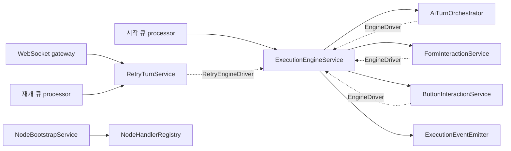
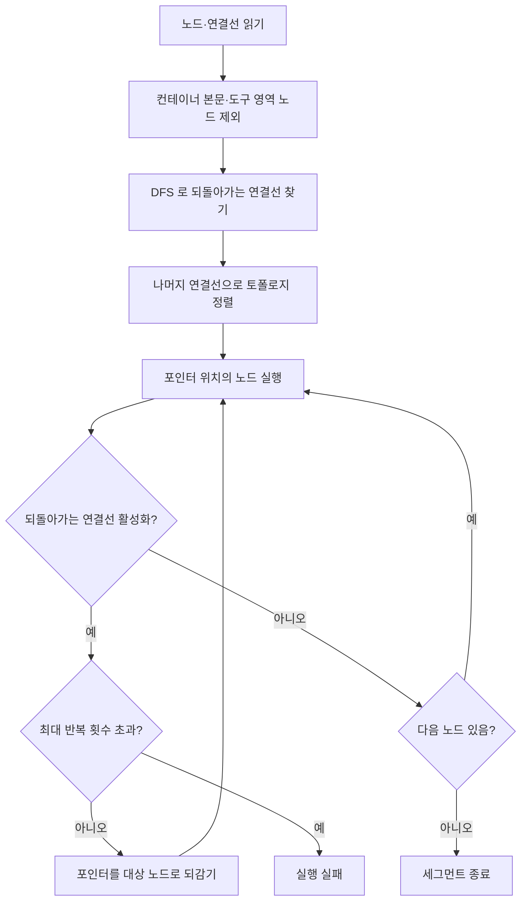

> 구현 상태: 부분 구현 · 원문: `spec/5-system/4-execution-engine.md` (Overview, §2, Rationale "C-1 god-class strangler-fig 분할"·"park 즉시 해제 + slow-path 일원화" 중 registry 항목과 `runNodeDispatchLoop` 반환 계약) · 용어: [용어 사전](../CLE-GLOSSARY.md)

## 개요

실행 엔진(execution engine)은 워크플로우 그래프를 실제로 구동하는 백엔드 코어다. 노드 dispatch·상태 전이·입력 대기와 재개·장애 복구가 모두 엔진에서 정해지며 엔진이 이 동작들의 단일 기준이다.

이 문서는 엔진이 어떤 구성 요소로 나뉘는지와 그래프를 어떤 순서로 순회하는지를 정한다. 엔진의 나머지 계약은 아래 문서들이 나눠 맡는다.

| 주제 | 문서 |
| --- | --- |
| 실행·노드 실행 상태와 전이, 입력 대기와 재개, 마지막 턴 재시도 | [실행 상태 머신과 대기·재개](CLE-EXEC-STATE.md) |
| Loop·ForEach·Map 본문 실행, 엔진 덮어쓰기, 중첩 스코프, Background 본문 | [컨테이너 실행](CLE-EXEC-CONTAINER.md) |
| `NodeHandler` 인터페이스, 표현식 해석 단계, 핸들러 레지스트리 | [노드 핸들러 계약](CLE-EXEC-HANDLER.md) |
| 실행 컨텍스트 필드·저장 전략·트리거 입력 seeding·재실행 조회 정책 | [실행 컨텍스트](CLE-EXEC-CONTEXT.md) |
| 노드 취소 신호 전파와 DB 관측 취소 가드 | [노드 취소](CLE-EXEC-CANCEL.md) |
| 시작 큐·세그먼트 워커·이벤트 발행 sink·동시 실행 제한 | [큐 워커와 동시 실행 제한](CLE-EXEC-WORKER.md) |
| rehydration·stalled 재배달·부팅 복구 스캔·안전 종료 | [장애 복구와 안전 종료](CLE-EXEC-RECOVERY.md) |
| 엔진이 쓰는 Redis 키와 BullMQ 큐 목록 | [비동기 큐와 Redis 키 목록](../CLE-PLAT/CLE-PLAT-QUEUE.md) |
| 통합 노드 핸들러가 엔진에서 받는 계약 | [통합 노드 공통](../CLE-NODE-INT/CLE-NODE-INT-COMMON.md) |

외부 REST 진입점은 [External Interaction API](../CLE-IX/CLE-EIA.md) 가, WebSocket 명령과 응답(ack)은 [WebSocket 이벤트와 명령](../CLE-API/CLE-API-WS-EVENTS.md) 이 정한다. 에러 코드 이름 규칙은 [에러 코드 규약과 카탈로그](../CLE-API/CLE-API-ERRCODES.md) 를 따른다. 실행 데이터의 엔티티 구조는 [실행 데이터와 흐름](CLE-EXEC-DATA.md) 에 있다.

## 엔진 구성 요소

엔진은 하나의 중심 서비스와 다섯 개의 협력 서비스로 나뉜다. 모두 같은 프로세스 안에서 돈다. 서비스를 나눈 것은 클래스 경계를 정리한 것이지 실행을 여러 프로세스로 분산한 것이 아니다.

실선은 호출 방향이다. 점선은 협력 서비스가 엔진 내부 계약(`EngineDriver`)으로 엔진의 남은 메서드를 부르는 방향이다.

| 구성 요소 | 맡는 일 |
| --- | --- |
| `ExecutionEngineService` | dispatch 루프(`runExecution`·`runNodeDispatchLoop`·`executeInline`), 상태 전이 지점(`updateExecutionStatus`), 재개 분기 registry, park 진입 분기 registry, 체크포인트 빌더(`buildRetryReentryState`·`buildResumeCheckpoint`·`isCheckpointEligibleNodeType`) |
| `NodeBootstrapService` | 노드 컴포넌트 부팅. `onModuleInit` 에서 `NodeComponentRegistry.bootstrap(ALL_NODE_COMPONENTS, …)` 을 부른다. 노드 폴더 구조는 [노드 시스템 구조와 카탈로그](../CLE-NODE/CLE-NODE-ARCH.md) 에 있다 |
| `AiTurnOrchestrator` | 멀티턴 AI 노드의 턴 수명주기. `waitForAiConversation`·`processAiResumeTurn`·`handleAiResumeTurn`·`handleAiMessageTurn`·`finalizeAiNode`·`emitAiWaitingForInput` |
| `FormInteractionService` | Form 노드의 park 진입(`waitForFormSubmission`)과 재개 턴(`processFormResumeTurn`) |
| `ButtonInteractionService` | 버튼 대기의 park 진입(`waitForButtonInteraction`)과 재개 턴(`processButtonResumeTurn`). 재개 요청에서 포트와 사용자 행동 기록을 정하는 순수 함수 `resolveButtonInteraction`(네 가지 경우)·`buildResumedStructuredOutput`, 판별 유니온 `ButtonClickPayload` 와 가드 `isButtonClickPayload` 도 여기 있다 |
| `RetryTurnService` | 마지막 턴 재시도 실행. `retryLastTurn`·`applyRetryLastTurn`·`resumeGraphAfterRetry`·`completeRetryExecution`·`failRetryExecution`. 진입점(`websocket.gateway`·`continuation-execution.processor`)이 엔진을 거치지 않고 직접 부른다 |
| `ExecutionEventEmitter` | 이벤트 발행 호출 지점을 한곳으로 모은 얇은 래퍼. 실제 sink 는 `WebsocketService` 하나다. 발행 정책은 [큐 워커와 동시 실행 제한](CLE-EXEC-WORKER.md) 에서 정한다 |

### 엔진 내부 계약 `EngineDriver`

협력 서비스는 엔진 내부 전용 계약 `EngineDriver`(토큰 `ENGINE_DRIVER`, `useExisting: ExecutionEngineService`)로 엔진의 남은 메서드를 부른다. 이 계약은 같은 프로세스 안의 클래스 경계만 정리한다.

코드는 이 계약을 소비자별 부분 인터페이스로 나눈다(`engine-driver.interface.ts`).

| 부분 인터페이스 | 멤버 | 소비자 |
| --- | --- | --- |
| `CoreEngineDriver` | `updateExecutionStatus`, `contextKeyOf` | 공통 기반 |
| `InteractionEngineDriver` | Core + `stageDurableResumeSnapshot` | Form·Button 서비스 |
| `ReentryStateDriver` | `buildRetryReentryState` | AiTurn·Retry 공유 |
| `AiTurnEngineDriver` | Interaction + Reentry + `buildResumeCheckpoint`, `isCheckpointEligibleNodeType`, `applyPortSelection`, 취소 가드 3종(`assertExecutionNotCancelled`, `markNodeCancelled`, `tryLockActiveExecutionAndSaveNodeExec`) | `AiTurnOrchestrator` |
| `RetryEngineDriver` | Core + Reentry + `rehydrateContext`, `loadAndBuildGraph`, `runNodeDispatchLoop`, `findActivatedBackEdge`, `clearLlmDefaultConfigCache` | `RetryTurnService` |
| `EngineDriver` | AiTurn + Retry 전체 | 엔진만 구현한다 |

2026-07-27 기준으로 `EngineDriver` 의 서로 다른 멤버는 15개, `AiTurnEngineDriver` 는 10개다. 취소 가드 3종은 `AiTurnOrchestrator` 만 쓰므로 공유 기반이 아닌 그 인터페이스에 둔다. 정확한 멤버 목록의 기준은 언제나 `engine-driver.interface.ts` 의 타입 정의다. 스펙이 정하는 것은 "엔진 내부 계약은 `EngineDriver` 하나다" 라는 점까지이고 부분 인터페이스 분해는 코드 수준의 설계다.

엔진이 노드 핸들러에 주는 계약 `WorkflowExecutor` 는 엔진 내부 통신에 쓰지 않는다. 부팅 때 엔진 자신을 핸들러 의존성으로 넘기는 경로는 별도 토큰 `WORKFLOW_EXECUTOR` 로 주입한다.

### 재개와 park 진입의 분기 registry

입력 대기 노드의 종류(form·buttons·AI)에 따라 달라지는 처리는 두 registry 로 모은다. 두 registry 모두 form → buttons → ai 순서로 먼저 맞는 항목을 쓴다. `ai_form_render` 대기는 `ai_conversation` 경로를 함께 쓴다.

| registry | 진입점 | 쓰는 곳 |
| --- | --- | --- |
| `resumeTurnRegistry` (`resume-turn-dispatch.ts`) | `dispatchResumeTurn` | 재개 턴 처리. 최상위 재개(`driveResumeAwaited`)와 중첩 재개(`driveResumeFrame`) |
| `parkEntryRegistry` (`park-entry-dispatch.ts`) | `dispatchParkEntry` | 처음 입력 대기에 들어갈 때의 `waitForX` 선택. 메인 루프(`runExecution`)·중첩 실행(`executeInline`)·재개 구동(`runNodeDispatchLoop`) |

park 진입 registry 는 `ProcessTurnResult` 만 돌려준다. park 뒤의 흐름 처리는 호출 지점마다 다르다. 메인 루프는 바로 반환하고 중첩 실행은 `ParkReleaseSignal` 을 던지고 재개 구동은 `{ parked: true }` 를 돌려준다. 새 입력 대기 노드 유형은 두 registry 에 항목을 하나씩 더해 붙인다. `PARK_RELEASED`·`ParkSignal`·`ProcessTurnResult` 타입은 `shared/execution-resume/process-turn-result.ts` 에 있다.

재개 경로 전체는 [장애 복구와 안전 종료](CLE-EXEC-RECOVERY.md) 가 정한다.

## 그래프 순회

### 실행 순서 결정

엔진은 워크플로우 그래프를 토폴로지 정렬(topological sort)해 실행 순서를 정한다. 순환을 허용하려고 되돌아가는 연결선(back-edge)을 따로 떼어 낸 뒤 정렬한다.

1. 워크플로우의 모든 노드와 연결선을 읽는다.
2. 컨테이너 본문 노드(`container_id` 가 있는 노드)를 글로벌 그래프에서 뺀다. 본문은 [컨테이너 본문 정렬](#컨테이너-본문-정렬) 에서 따로 정렬한다.
3. 도구 영역 노드(`tool_owner_id` 가 있는 노드)를 글로벌 그래프에서 뺀다. 도구 영역 기능은 제거됐고 이 제외 조건만 남았다. [도구 영역 노드](#도구-영역-노드) 참고.
4. DFS 로 되돌아가는 연결선(순환을 만드는 연결선)을 찾는다.
5. 되돌아가는 연결선을 뺀 나머지 연결선으로 DAG 를 만들고 토폴로지 정렬한다.
6. 포인터를 앞으로 옮기며 노드를 차례로 실행한다.
   - 분기 노드는 선택된 포트 쪽만 실행한다.
   - 노드를 실행한 뒤 되돌아가는 연결선이 활성화되면(포트가 맞으면) 포인터를 되감아 대상 노드부터 다시 실행한다.
   - 노드별 최대 반복 횟수를 넘으면 실행을 에러로 멈춘다.

이 순회는 한 세그먼트 안에서 같은 프로세스가 직접 돈다. 노드마다 큐 작업을 만드는 모델은 쓰지 않는다. 세그먼트 단위 워커 모델은 [큐 워커와 동시 실행 제한](CLE-EXEC-WORKER.md) 에서 정한다.

dispatch 루프 `runNodeDispatchLoop` 는 `Promise<{ parked: boolean }>` 를 돌려준다. `parked: true` 는 입력 대기 노드에서 `PARK_RELEASED` 를 받아 park 로 루프를 끝냈다는 뜻이고 호출자(`runExecution`·`driveResumeAwaited`)가 세그먼트를 끝낸다. `parked: false` 는 더 실행할 노드가 없어 정상으로 끝났다는 뜻이다.

### 순환 반복 한도

| 설정 | 환경 변수 | 기본값 | 설명 |
| --- | --- | --- | --- |
| 노드별 최대 반복 횟수 | `MAX_NODE_ITERATIONS` | `100` | 한 노드가 한 실행에서 반복될 수 있는 최대 횟수. `0` 이면 제한이 없다. 모듈을 읽을 때 한 번만 읽으므로 값을 바꾸면 인스턴스를 다시 시작해야 반영된다 |

### 되돌아가는 연결선의 활성화 조건

- 소스 노드 출력에 `_selectedPort` 가 있으면 연결선의 `sourcePort` 가 선택된 포트와 같을 때만 활성화한다.
- `_selectedPort` 가 배열이면(Parallel·Text Classifier 처럼 여러 포트를 한 번에 여는 경우) `sourcePort` 가 배열에 들어 있을 때 활성화한다. 포트 활성화 모델은 [노드 출력 규약](../CLE-NODE/CLE-NODE-OUTPUT.md) Principle 5 를 따른다.
- 소스 노드 출력에 `_selectedPort` 가 없으면 연결선은 항상 활성화된다.
  - 그래서 `_selectedPort` 를 내지 않는 일반 노드(값을 그대로 넘기는 노드)에 되돌아가는 연결선을 달면 빠져나올 수 없는 무한 루프가 된다.
  - 이 루프는 `MAX_NODE_ITERATIONS` 한도에 걸려 결국 실패로 끝난다.
  - 순환은 반드시 분기 노드(Switch, If/Else 등)의 특정 포트에서 되돌아가게 연결해야 안전하다. 에디터의 경고 규칙은 [그래프 경고 규칙](../CLE-WF/CLE-WF-WARN.md) 에 있다.
- 활성화된 되돌아가는 연결선이 있으면 대상 노드부터 다시 실행한다. 다시 실행하는 구간의 포트 라우팅 건너뜀 상태는 초기화한다.

### 순환 안의 입력 대기 노드

컨테이너 본문에는 입력 대기 노드(form·버튼·멀티턴 AI)를 둘 수 없다([컨테이너 실행](CLE-EXEC-CONTAINER.md)). 반면 글로벌 그래프의 순환은 입력 대기 노드를 본문에 포함하거나 대상으로 삼을 수 있고 엔진은 이를 막지 않는다.

- 순환이 입력 대기 노드를 다시 지나면 그 노드는 다시 실행되고 사용자에게 입력을 다시 요청한다. 이것은 의도된 루프 동작이다. 반복마다 새 노드 실행 행이 생기고 이전 반복의 행은 `completed` 로 남는다.
- 다시 묻는 횟수는 `MAX_NODE_ITERATIONS` 로 제한된다. 순환은 분기 노드의 포트 라우팅으로만 빠져나오므로 입력 대기 노드가 있는 순환도 분기 노드의 특정 포트에서 되돌아가야 한다.
- 마지막 턴 재시도로 재진입한 경우도 같다. 재시도에 성공한 AI 에이전트 노드가 되돌아가는 연결선의 소스이면 이어지는 순회는 일반 실행처럼 순환에 다시 들어간다. 실패 전에 이미 응답이 끝난 입력 대기 노드가 순환 본문에 있으면 다시 묻는다. 재진입이 끝난 뒤의 그래프 진행은 일반 `completed` 노드와 같다는 정책의 결과다. 재진입 흐름은 [실행 상태 머신과 대기·재개](CLE-EXEC-STATE.md) 에 있다.

### `_selectedPort` 처리

`_selectedPort` 는 그 노드의 연결선 라우팅에만 쓰는 내부 메타데이터다. 포트 하나를 고르면 문자열이고 여러 포트를 동시에 열면 `string[]` 다. 모양은 노드 출력의 `port` 필드와 같다. 연결선 활성화는 `sourcePort` 가 문자열과 같은지(하나) 또는 배열에 들어 있는지(여럿)로 판정한다.

다음 노드의 입력으로 넘길 때 `_selectedPort` 는 자동으로 지운다. 그래서 값을 그대로 넘기는 노드(변수 선언 노드, 변수 수정 노드 등)를 거쳐도 뒤 노드가 잘못 건너뛰어지지 않는다. `_selectedPort` 를 기록하는 단계는 [노드 핸들러 계약](CLE-EXEC-HANDLER.md) 의 포트 선택에 있다.

### 컨테이너 본문 정렬

컨테이너 노드(Loop·ForEach·Map) 본문의 자식 노드는 따로 토폴로지 정렬한다. Background 노드는 `container_id` 소속 모델을 쓰지 않고 `background` 포트 연결선으로 본문을 찾는다([컨테이너 실행](CLE-EXEC-CONTAINER.md)).

- 컨테이너를 실행할 때 본문 노드의 실행 순서를 따로 계산한다.
- 본문 그래프는 글로벌 순환 검사에서 뺀다.
- 컨테이너 경계를 넘는 연결선의 취급은 정의가 갈린다. [미결 사항](#미결-사항) 참조. 본문과 바깥의 데이터는 컨테이너 포트(`body`·`emit`·`done`)로 오간다.

### 도구 영역 노드

도구 영역(Tool Area) 기능은 제거됐다. AI 에이전트 노드의 도구 연결 필드(`toolNodeIds`·`toolOverrides`)는 설정 스키마에서 빠졌고 새 도구 연결 방식이 정해질 때까지 비활성이다([AI 에이전트 노드](../CLE-NODE-AI/CLE-NODE-AGENT.md)). 현재 구현은 `tool_owner_id` 가 있는 노드를 글로벌 그래프에서 빼는 조건만 남겨 두었다. 이 노드들을 실행하는 경로는 없다.

## 미결 사항

- **컨테이너 경계를 넘는 연결선**: 엔진 원문(§2.2)은 "컨테이너 경계를 넘는 연결선은 존재하지 않는다" 를 실행 전제로 둔다. [연결선](../CLE-WF/CLE-WF-EDGE.md) 문서도 본문 안에서 바깥으로 가는 연결선을 금지한다. 반면 [워크플로우 에디터와 캔버스](../CLE-WF/CLE-WF-EDITOR.md) 의 소속 전파 규칙은 양 끝이 서로 다른 컨테이너에 속한 연결선을 거부하지 않고 소속만 바꾸지 않는다. 에디터가 거부하는 경우는 source 가 `body` 이거나 target 이 `emit` 인 경우뿐이라 경계를 넘는 연결선이 저장될 수 있다. 에디터에서 막을지, 허용하고 엔진이 어떻게 다룰지 결정이 필요하다.

## 구현 위치

- `codebase/backend/src/modules/execution-engine/**` (엔진 전체)
- `codebase/backend/src/modules/execution-engine/execution-engine.service.ts` (dispatch 루프, 상태 전이 지점)
- `codebase/backend/src/modules/execution-engine/graph/` (`graph-builder.ts`, `graph-traversal.service.ts`, `back-edge-identifier.ts`, `topological-sort.ts`, `cycle-detector.ts`)
- `codebase/backend/src/modules/execution-engine/node-bootstrap.service.ts`
- `codebase/backend/src/modules/execution-engine/ai-turn-orchestrator.service.ts`
- `codebase/backend/src/modules/execution-engine/form-interaction.service.ts`, `button-interaction.service.ts`
- `codebase/backend/src/modules/execution-engine/retry-turn.service.ts`
- `codebase/backend/src/modules/execution-engine/engine-driver.interface.ts`
- `codebase/backend/src/modules/execution-engine/resume-turn-dispatch.ts`, `park-entry-dispatch.ts`
- `codebase/backend/src/modules/execution-engine/events/execution-event-emitter.service.ts`
- `codebase/backend/src/shared/execution-resume/**`

## Rationale

### 엔진 god-class 를 협력 서비스로 나눈다 (C-1, 2026-06-18~19)

`ExecutionEngineService` 는 9,670줄에 생성자 의존성 약 20개, 메서드 약 70개로 단일 책임 원칙을 크게 어기고 있었다(refactor 02-architecture C-1 Critical). 옵션 A(strangler-fig 단계 분할)를 골라 PR 4개(#622·#625·#626·#627)로 5개 협력 서비스를 떼어 냈고 엔진은 7,035줄이 됐다. 리뷰에서 나온 후속 작업은 #629·#630·#631·#632·#637·#638 이다.

- 모든 단계는 동작을 바꾸지 않는 이동이었고 PR 마다 e2e 게이트로 확인했다. 구현 착수 전 검토 네 번 모두 차단 없이 통과했다.
- 스펙 본문은 바뀌지 않았다. 메서드가 어느 클래스에 있는지는 스펙이 정하지 않는 구현 재량이다. 먼저 있었던 `resume-turn-dispatch.ts` 분리(#507)도 스펙 변경 없이 들어갔다.
- 이벤트 경로는 바뀌지 않는다. 떼어 낸 서비스도 `ExecutionEventEmitter` 를 직접 주입받는다. 단일 sink 정책이 금지하는 것은 외부 이벤트 sink 의 추상화이고 엔진 내부 클래스 분할은 그 대상이 아니다.

### 엔진 내부 통신은 `EngineDriver` 로 하고 `WorkflowExecutor` 를 재사용하지 않는다

`WorkflowExecutor` 는 스펙상 엔진과 노드 사이의 계약이다. 이것을 엔진 내부 통신에 다시 쓰면 그 계약의 뜻이 여러 가지로 겹친다. 그래서 엔진 내부 전용 계약 `EngineDriver` 를 따로 두었다. 부팅 때의 엔진 자기 참조(`handlerDeps.build(this)`)는 `WORKFLOW_EXECUTOR` 토큰으로 바꿨다. 이쪽은 `WorkflowExecutor` 계약을 원래 뜻대로 쓰는 경우라 의미가 그대로 남는다. 이 변경으로 노드에서 엔진으로 향하던 역의존도 없어졌다(m-3).

`EngineDriver` 멤버 수는 리팩터 때마다 바뀌어 문서의 숫자가 금방 낡았다. 그래서 정확한 멤버 목록은 타입 정의를 기준으로 한다고 적어 둔다.

### 엔진에서 `RetryTurnService` 로 향하는 순환 주입을 없앤다 (후속 ④, 2026-06-19, PR #638)

엔진과 협력 서비스 사이의 주입 방향 네 개 가운데 엔진 → Retry 방향만 없앨 수 있었다. AiTurn·Form·Button 은 dispatch 루프와 재개 registry 가 그래프를 순회하는 도중에 위임해야 해서 구조상 남는다.

모듈이 `RetryTurnService` 를 export 하고 외부 진입점(`websocket.gateway.ts`·`continuation-execution.processor.ts`)이 이를 직접 부르도록 바꿨다. 엔진에 있던 얇은 위임 메서드(`retryLastTurn`·`applyRetryLastTurn`)와 `forwardRef(() => RetryTurnService)` 주입은 지웠다. 이제 방향은 Retry → 엔진(`RetryEngineDriver`) 하나다.

import 를 옮기자 `ws.service` ↔ `gateway` ↔ `retry` ↔ `event-emitter` 사이의 ES 모듈 순환이 드러났다. 이 순환은 `ExecutionEventEmitter → WebsocketService` 를 `forwardRef` 로 늦게 풀어 막았다. 동작은 바뀌지 않았고 전체 코드 리뷰(architecture·concurrency 관점 포함)와 dockerized e2e 를 통과했다.

### 입력 대기 분기를 registry 로 모은다 (#507, M-4)

재개 턴 분기(form·buttons·ai)는 원래 `driveResumeAwaited` 와 `driveResumeFrame` 두 곳에 하드코딩돼 있었다. #507(2026-06-06)이 이를 순서 있는 `resumeTurnRegistry` 와 단일 진입점 `dispatchResumeTurn` 으로 뽑았다. 처리기 매핑·우선순위·에러 코드는 그대로다. 같은 변경에서 `PARK_RELEASED`·`ParkSignal`·`ProcessTurnResult` 를 `shared/execution-resume/process-turn-result.ts` 로 옮겼다.

처음 park 에 들어갈 때의 `waitForX` 선택도 메인 루프·중첩 실행·재개 구동 세 곳에 같은 분기가 있었다. M-4(2026-06-24)가 같은 방식으로 `parkEntryRegistry` 와 `dispatchParkEntry` 를 만들었다. #507 과 같은 방식을 이은 것이라 결정 번복이 아니다. park 뒤의 흐름 처리는 호출 지점마다 달라서 registry 는 결과만 돌려주고 흐름 처리는 호출 지점에 남겼다. 두 변경 모두 동작을 바꾸지 않았고 새 입력 대기 노드를 항목 하나로 붙일 수 있게 했다. park 진입 쪽은 `buildParkEntryRegistry` 에 한 줄을 더하면 된다.

두 registry 는 park 즉시 해제 결정(Phase B, 모든 재개를 rehydration 한 경로로 모음)을 구현하는 과정에서 나왔다. 그 결정의 경위는 [장애 복구와 안전 종료](CLE-EXEC-RECOVERY.md) 의 Rationale 에 있다.

### dispatch 루프가 park 여부를 돌려준다 (PR-B1)

`runNodeDispatchLoop` 의 반환은 Phase B 전의 `Promise<void>` 에서 `Promise<{ parked: boolean }>` 로 바뀌었다. park 가 곧 세그먼트 종료가 되면서 호출자(`runExecution`·`driveResumeAwaited`)가 세그먼트를 끝낼지 이 값으로 판단해야 했기 때문이다. 코드가 먼저 바뀌었고 스펙을 코드에 맞췄다.

### 서브 워크플로우 워크스페이스 격리를 fail-closed 로 바꾼다 (후속 ★, 2026-06-19, PR #637)

서브 워크플로우 진입점(`executeInline`·`executeSync`·`executeAsync`)의 `assertSameWorkspace` 는 원래 호출자 워크스페이스 정보가 없으면 로그만 남기고 통과시켰다(fail-open). 이제 `callerWorkspaceId` 가 없어도 `WORKFLOW_FORBIDDEN_WORKSPACE` 로 거부한다(fail-closed).

착수 전에 운영 코드의 호출처 세 곳을 모두 따라가 워크스페이스 정보가 항상 채워진다는 것을 확인했다. 그래서 일괄 fail-closed 가 안전하다고 판단했다. 거부는 `WorkflowForbiddenWorkspaceError` 로 던지고 워크플로우 호출 노드 핸들러가 `ErrorCode.WORKFLOW_FORBIDDEN_WORKSPACE` 로 에러 포트에 싣는다. 노드 쪽 계약은 [워크플로우 호출 노드](../CLE-NODE-FLOW/CLE-NODE-SUBWF.md) 에, 에러 코드는 [에러 코드 규약과 카탈로그](../CLE-API/CLE-API-ERRCODES.md) 에 있다.

### 글로벌 순환 안의 입력 대기 노드를 막지 않는다

컨테이너 본문은 반복 회차마다 결과를 모으는 구조라서 입력 대기가 끼면 반복의 뜻이 흐려진다. 글로벌 순환은 사용자가 분기 노드로 만든 루프이고 루프를 돌 때마다 다시 묻는 것이 사용자가 기대하는 동작이다. 그래서 금지하지 않고 `MAX_NODE_ITERATIONS` 로 횟수만 제한한다. 반복마다 노드 실행 행이 새로 생기므로 이전 응답 기록도 남는다.

### 세그먼트 안의 노드는 같은 프로세스가 직접 dispatch 한다

엔진은 컨테이너·중첩 스코프·되돌아가는 연결선·Parallel 이 "한 실행이 한 프로세스 안에 있다" 는 전제로 동작한다. 노드마다 큐 작업을 만들려면 노드마다 실행 컨텍스트 전체를 직렬화하고 되살려야 해서 엔진을 다시 짜야 한다. 그래서 워커는 세그먼트 하나를 통째로 처리한다. 결정 경위는 [큐 워커와 동시 실행 제한](CLE-EXEC-WORKER.md) 의 Rationale 에 있다.

### 도구 영역 실행 규칙을 지운다

원문 §2.3 은 도구 영역 노드를 AI 에이전트가 요청할 때만 실행하고 노드 실행 기록을 남긴다고 적었다. 도구 영역과 도구 연결 필드가 제거된 뒤에도 이 절이 현행 규칙처럼 남아 있었다. 제거 결정은 [AI 에이전트 노드](../CLE-NODE-AI/CLE-NODE-AGENT.md) 가 기준이므로 실행 규칙은 옮기지 않았다.
