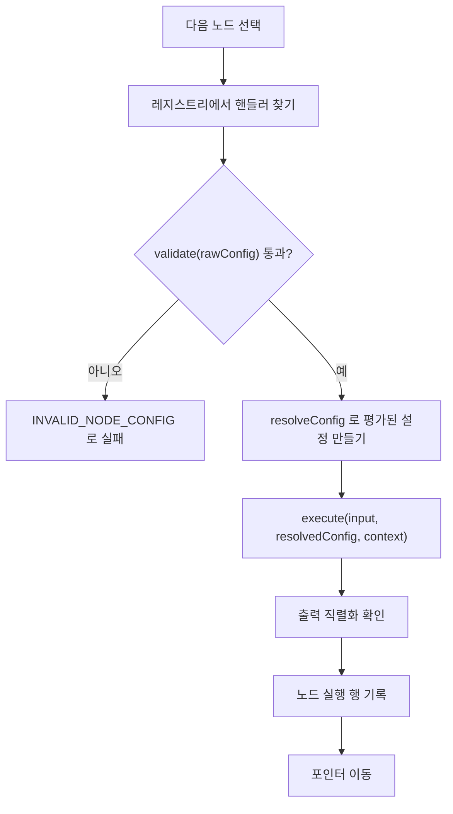

> 구현 상태: 부분 구현 · 원문: `spec/5-system/4-execution-engine.md` (§5.1~§5.7, Rationale "Engine Raw Config Exposure"), `spec/4-nodes/_product-overview.md` (§11 ENG-RC-01~04) · 용어: [용어 사전](../CLE-GLOSSARY.md)

## 개요

노드 핸들러(node handler, `NodeHandler`)는 노드 유형마다 있는 실행 코드다. 이 문서는 엔진이 핸들러를 부르는 계약을 정한다. 핸들러 인터페이스, 엔진이 핸들러에 넘기는 원본 설정(`rawConfig`)과 평가된 설정(`resolvedConfig`), 핸들러 레지스트리와 노드 유형별 dispatch, 표현식 해석 단계, 노드 한 번의 실행 흐름이 여기에 들어간다.

범위 밖:

- 노드 출력(`NodeHandlerOutput`) 다섯 필드의 뜻과 배치 규칙은 [노드 출력 규약](../CLE-NODE/CLE-NODE-OUTPUT.md) 이 정한다. 이 문서는 엔진이 그 필드를 어떻게 읽는지만 다룬다.
- 흐름 지시 상태(`status`)의 값과 입력 대기·재개 계약은 [실행 상태 머신과 대기·재개](CLE-EXEC-STATE.md) 에 있다.
- 핸들러에 넘기는 실행 컨텍스트의 필드는 [실행 컨텍스트](CLE-EXEC-CONTEXT.md) 가 정한다.
- 표현식 문법·내장 변수·함수는 [표현식 언어](../CLE-WF/CLE-WF-EXPR.md) 가 정한다.
- 노드 에러 처리 정책과 노드 재시도는 [노드 에러 처리 정책](../CLE-NODE/CLE-NODE-ERROR.md) 이 정한다.
- 통합 노드 핸들러의 추가 계약은 [통합 노드 공통](../CLE-NODE-INT/CLE-NODE-INT-COMMON.md) 에 있다.
- 노드 폴더 구조와 부팅 등록 절차는 [노드 시스템 구조와 카탈로그](../CLE-NODE/CLE-NODE-ARCH.md) 에 있다.

## 핸들러 인터페이스

모든 노드 유형은 같은 핸들러 인터페이스를 구현한다.

```ts
interface NodeHandler {
  validate(config: Record<string, unknown>): ValidationResult;
  execute(
    input: unknown,
    config: Record<string, unknown>,
    context: ExecutionContext,
  ): Promise<NodeHandlerOutput>;
}

interface NodeHandlerOutput {
  /** 평가 전 원본 설정의 에코. 표현식이 든 필드는 평가 전 모양 그대로 두고 평가 결과는 output 에 둔다. 자격 증명 본체는 넣지 않는다. */
  config: Record<string, unknown>;
  /** 실제로 만든 결과. 배열·객체·원시값 모두 된다. */
  output: unknown;
  /** 실행 부가 정보. durationMs, statusCode, tokensUsed 같은 관측 메타데이터. */
  meta?: Record<string, unknown>;
  /** 라우팅 지시. 값은 노드 정의의 출력 포트 ID. 여러 포트를 한 번에 열면 string[]. */
  port?: string | string[];
  /** 흐름 지시 상태. 'waiting_for_input' | 'requires_integration' | 'requires_playwright' 등. */
  status?: string;
}
```

| 메서드 | 설명 |
| --- | --- |
| `validate(config)` | 노드 설정의 유효성을 검사한다. 워크플로우 저장·실행 전에 부른다. 문제가 있으면 `{ valid: false, errors: [...] }` 를 돌려준다 |
| `execute(input, config, context)` | 노드를 실행한다. `config` 는 표현식을 평가한 뒤의 값이다. `context.rawConfig` 로 평가 전 원본도 함께 받는다. `NodeHandlerOutput` 을 돌려준다 |

### 설정과 출력의 역할

- `NodeHandlerOutput.config` 는 노드가 **어떻게 설정됐는가**다. 워크플로우 작성자가 입력한 원본(평가 전) 모양이다. 뒤 노드는 `$node["X"].config.<field>` 로 읽는다.
- `output` 은 노드가 **무엇을 만들거나 썼는가**다. 표현식 평가 결과와 실행 결과다. 뒤 노드는 `$node["X"].output.<field>` 로 읽는다.
- 그래서 표현식이 든 필드는 두 곳의 값이 다르다. 예: `config.subject = "Hello {{ name }}"`, `output.subject = "Hello Alice"`.
- `meta` 는 실행 부산물(시간, 외부 상태 코드, 토큰 사용량)이다. 비즈니스 로직이 아닌 관측 정보다.
- `port` 와 `status` 는 엔진이 읽어 흐름을 정하는 지시다. 일반적인 뒤 노드 참조에는 권하지 않는다.

### 민감 정보

- `config` 에는 통합 ID(`integrationId` UUID), 액션 이름, 파라미터만 에코한다.
- 자격 증명 객체(access_token, password, api_key, private_key 등)는 핸들러 안에서만 쓰고 반환값에 넣지 않는다.
- AES-256-GCM 으로 저장된 자격 증명을 복호화해 외부 서비스에 넘긴 뒤 반환값을 만들 때는 자격 증명을 뺀다.
- `config` 에는 저장 시점 마스킹이 없다. 엔진 → 핸들러 → `NodeExecution.outputData` 저장까지 원문이 유지되고 마스킹은 나가는 응답(REST·WebSocket)에서만 한다. 표현식(`$node["X"].config.<field>`)도 원문을 읽는다. 응답 마스킹은 [응답 자격 증명 마스킹](../CLE-API/CLE-API-EGRESS.md) 이 정한다.

## 원본 설정 노출 요구

엔진은 표현식(`{{ ... }}`)의 평가 전과 평가 후 두 값을 핸들러가 모두 쓸 수 있게 넘긴다. 설정 에코는 원본(평가 전), `output.*` 는 평가 결과라는 직교성을 지키기 위한 요구다.

| ID | 요구 | 우선순위 | 상태 |
| --- | --- | --- | --- |
| ENG-RC-01 | 엔진은 `node.config` 에 표현식이 들어 있으면 평가 전 원본을 따로 보존해 핸들러가 읽을 수 있게 노출한다(`ExecutionContext.rawConfig`) | 필수 | ✅ |
| ENG-RC-02 | 핸들러는 `NodeHandlerOutput.config` 에 원본 설정(`rawConfig`)을 에코하고 표현식 평가 결과는 `output.*` 에 둔다 | 필수 | ✅ |
| ENG-RC-03 | 평가 전(`context.rawConfig`)과 평가 후(`config` 인자)를 모두 핸들러 인자로 넘겨 핸들러가 에코와 실제 동작에 쓸 값을 분명히 나눌 수 있게 한다 | 필수 | ✅ |
| ENG-RC-04 | 이행은 한 번에 바꾼다. 모든 핸들러가 같은 방식을 따른다. 표현식이 없는 필드(예: `mode`, `chartType`)는 원본과 평가 결과가 같아 영향이 없고 표현식을 쓰는 필드(템플릿·표현식 위젯)만 뜻이 바뀐다 | 필수 | ✅ |

영향 범위:

- 기존 워크플로우의 `$node["X"].config.<표현식 필드>` 가 평가된 값을 읽고 있었다면 이행 뒤에는 원본 템플릿이 나온다. 호환이 깨지는 변경이므로 릴리스 노트가 필요하다.
- 이 변경 전에 저장된 `NodeExecution.outputData` 기록은 그대로 두고 소급 변환하지 않는다. 실행 내역 화면에는 "기록 당시의 설정 모양" 이라는 안내가 필요할 수 있다. 옛 기록의 처리는 [실행 컨텍스트](CLE-EXEC-CONTEXT.md) 의 재실행·조회 정책에 있다.
- 응답 DTO 의 `config` 를 평가된 값으로 가정한 API 클라이언트(외부 통합)는 영향을 받는다.

## `$node` 표현식 네임스페이스

표현식 resolver 는 각 노드의 노드 출력을 그대로 `$node[nodeKey]` 에 노출한다. 옛 `$node[key] = { output: ... }` 래퍼는 없앴다.

| 표현식 | 반환 |
| --- | --- |
| `$node["SendEmail"].output.messageId` | 메일 발송 결과 messageId |
| `$node["SendEmail"].config.subject` | 설정의 **원본** 제목(예: `"Hello {{ name }}"`, 평가 전) |
| `$node["SendEmail"].output.subject` | 실제로 보낸 제목(예: `"Hello Alice"`, 평가 결과) |
| `$node["HTTP"].meta.statusCode` | HTTP 응답 상태 코드 |
| `$node["HTTP"].output.response` | 응답 본문 |
| `$node["IfElse"].port` | 실행 때 고른 포트(`'true'` 또는 `'false'`) |
| `$node["Form"].status` | `'waiting_for_input'` 같은 흐름 지시 상태 |

표현식이 든 필드는 `.config.*` 에서 원본을, `.output.*` 에서 평가 결과를 얻는다. 표현식이 없는 필드(예: `mode`, `chartType`)는 두 값이 같으므로 `.config.*` 만 써도 된다.

`nodeKey` 는 노드 라벨(겹치면 `#N` 접미사)과 노드 UUID 를 모두 받는다. `.output`·`.config`·`.meta`·`.port`·`.status` 밖의 필드는 정의하지 않는다. 라벨 규칙은 [표현식 언어](../CLE-WF/CLE-WF-EXPR.md) 에 있다.

현재 구현은 실행 컨텍스트의 `structuredOutputCache` 에 있는 노드 출력 다섯 필드 객체를 노출하고 그 캐시가 없을 때만 `{ output: <평평한 출력> }` 으로 대신한다.

## 포트 선택

조건 분기 노드(`if_else`, `switch`, `text_classifier`, `http_request`, `ai_agent` 조건 라우팅)는 반환값에 `port` 를 함께 넣는다.

```ts
return {
  config: { condition: "..." },
  output: forwardedData, // 뒤 노드로 넘길 입력
  port: "true" | "false", // 엔진이 이 포트의 연결선만 연다
};
```

엔진의 `applyPortSelection(output)` 은 `output.port` 를 읽어 `_selectedPort` 에 기록하고 뒤 노드의 입력은 `output.output` 이 된다. `_selectedPort` 로 연결선을 여는 규칙은 [실행 엔진 개요와 그래프 순회](CLE-EXEC-ENGINE.md) 에 있다.

옛 `{ port, data }` 반환 방식은 없앴다. 이행 기간 호환을 위해 `output.data` 가 있으면 `output.output` 으로 자동 보정한다.

## 핸들러 레지스트리

```ts
interface NodeHandlerRegistry {
  register(nodeType: string, handler: NodeHandler, metadata?: NodeTypeMetadata): void;
  get(nodeType: string): NodeHandler;
  getMetadata(nodeType: string): NodeTypeMetadata; // 등록되지 않은 metadata 는 { kind: 'standard' } 를 돌려준다
  assertConsistency(): void;                       // 부팅 때 등록 일관성 검증
}
```

- 시스템이 시작할 때 모든 기본 노드 핸들러를 레지스트리에 등록한다.
- 마켓플레이스로 설치한 사용자 정의 플러그인 노드를 같은 레지스트리에 등록하는 것은 **Planned** 다. [노드 시스템 구조와 카탈로그](../CLE-NODE/CLE-NODE-ARCH.md) 의 마켓플레이스 로드맵과 같은 단계다.
- 등록되지 않은 `nodeType` 을 찾으면 `UNKNOWN_NODE_TYPE` 에러다.

### 노드 유형 메타데이터 기반 dispatch

`register` 의 세 번째 인자 `metadata`(`node-type-metadata.ts`)는 엔진 dispatch 가 노드 유형별 특수 실행 경로를 고르는 데 쓰는 판별 유니온이다. 예전의 하드코딩된 노드 유형 분기를 대신한다(PR-G). `NodeTypeMetadata.kind` 는 핸들러 런타임 출력의 `executionMetadata.kind`(예: ForEach 의 `'container'`)와 같은 어휘를 쓰지만 **다른 객체이고 쓰는 곳도 다르다**. 앞의 것은 등록 때 정적 dispatch 선택에, 뒤의 것은 실행 결과 메타에 쓴다.

| `kind` | 뜻 | 지금 등록된 유형 |
| --- | --- | --- |
| `standard` | 일반 노드. 특수 dispatch 없음 | 대부분(미등록 시 기본값) |
| `container` | 컨테이너. `containerId` 로 자식을 묶고 회차마다 본문을 다시 실행([컨테이너 실행](CLE-EXEC-CONTAINER.md)) | `foreach`, `loop`, `map` |
| `background` | `background` 포트 서브그래프를 비동기 큐로 실행([컨테이너 실행](CLE-EXEC-CONTAINER.md)) | `background` |
| `parallel` | N 개 분기를 동시에 실행(`p-limit` 세마포어) | `parallel` |
| `blocking` | 늘 입력 대기(`interaction: 'form'`). 버튼과 멀티턴 AI 는 이 메타데이터가 아니라 런타임 `meta.interactionType` 으로 가른다 | `form` |
| `trigger` | 워크플로우 진입점 | `manual_trigger` |

- `getMetadata(type)` 는 메타데이터가 없는 유형에 `{ kind: 'standard' }` 를 돌려준다. 그래서 dispatch 분기가 명시 분기 없이도 안전하게 동작한다.
- **부팅 검증 `assertConsistency()`**: `onApplicationBootstrap` 에서 등록 일관성(등록된 모든 유형의 메타데이터 보유, 전용 executor 주입 등)을 검사한다. production 에서는 어기면 예외를 던지고 그 밖의 환경에서는 경고 로그만 남긴다.

## 표현식 해석 단계

노드를 실행하기 전에 설정 객체의 문자열 필드에 든 `{{ }}` 표현식을 푼다. 엔진은 원본(`rawConfig`)과 평가 결과(`resolvedConfig`)를 모두 핸들러에 넘겨 핸들러가 에코와 실행을 나눌 수 있게 한다.

1. `handler.validate(rawConfig)` 로 원본 설정의 구조를 검사한다.
2. `resolvedConfig = ExpressionResolver.resolveConfig(rawConfig, exprContext, nodeType)` 로 평가한다.
   - 설정 객체를 재귀로 돌며 문자열 값의 `{{ }}` 를 평가한다.
   - 값 전체가 `{{ expr }}` 하나면 평가 결과의 원래 타입(숫자, 객체 등)을 유지한다.
   - 글자와 표현식이 섞이면 결과는 늘 문자열이다.
   - 숫자·불리언·null 은 그대로 둔다.
   - 한 번만 평가하고 결과를 다시 평가하지 않는다.
3. `handler.execute(input, resolvedConfig, { ...context, rawConfig })` 로 실행한다.

`context.rawConfig` 는 평가 전 원본 설정의 참조다. 핸들러가 `NodeHandlerOutput.config` 에코에 쓴다. 핸들러는 평가된 값으로 동작하고 에코는 원본을 지켜 뒤 노드의 `$node["X"].config.*` 와 `$node["X"].output.*` 가 서로 겹치지 않게 한다.

### 표현식 컨텍스트 구성

| 변수 | 채우는 곳 |
| --- | --- |
| `$input` | 이전 노드 출력(`gatherNodeInput` 결과). 트리거 노드에서는 `{ parameters, ...(트리거별 메타) }` |
| `$params` | `$input.parameters` 의 줄임. 수동 트리거 노드가 만든 구조화 입력 파라미터 |
| `$node` | nodeMap 과 출력 캐시로 만든 노드 라벨 키 맵. `$node["Label"].output` 처럼 쓴다 |
| `$var` | `context.variables`(변수 선언 노드·변수 수정 노드가 관리) |
| `$execution` | `{ id, workflowId, startedAt, mode }`. `mode` 의 값 집합은 정의가 갈린다. [표현식 언어 §미결 사항](../CLE-WF/CLE-WF-EXPR.md#미결-사항) 참조 |
| `$now` | 표현식 컨텍스트를 만들 때의 현재 시각(ISO 8601, UTC). 현재 구현은 컨텍스트를 만들 때마다 새 시각을 잡는다. 같은 실행 안에서 고정할지는 정의가 갈린다. [표현식 언어 §미결 사항](../CLE-WF/CLE-WF-EXPR.md#미결-사항) 참조 |
| `$loop` | `loopContext`(Loop 본문 안) |
| `$item`, `$itemIndex`, `$itemIsFirst`, `$itemIsLast` | `itemContext`(ForEach 본문 안) |
| `$thread` | `context.conversationThread` 의 읽기 전용 뷰. `turns`·`length`·`text` 만 노출한다([대화 스레드](../CLE-IX/CLE-IX-THREAD.md)) |

엔진은 이 밖에도 `$trigger`·`$env` 와 Table 노드 한정 변수(`$sourceItem` 등)를 넣는다. 내장 변수의 목록과 모양은 [표현식 언어](../CLE-WF/CLE-WF-EXPR.md) 가 정하고 이 표는 엔진이 어디서 값을 채우는지만 보인다.

**Template 노드 예외(입력 최상위 펼치기)**: `template` 노드에 한해 입력이 배열이 아닌 객체면 엔진이 `buildExpressionContext` 직후 그 최상위 키들을 컨텍스트 최상위 변수로 펼친다. `{{ name }}` 이 `{{ $input.name }}` 과 같아진다. 다만 `$` 내장 변수 등 기존 키와 이름이 같으면 기존 키를 남긴다(`Object.hasOwn` 가드). 입력이 배열이나 원시값이면 펼치지 않는다. 기준 코드는 `execution-engine.service.ts` 의 `NODE_TYPES.TEMPLATE` 분기이고 노드 동작은 [Template 노드](../CLE-NODE-PRES/CLE-NODE-TEMPLATE.md) 에 있다.

**엔진이 미리 평가하지 않는 키**: `code.code`(원시 JavaScript, 자체 런타임 사용), `table.columns`(항목마다 평가), `filter.conditions`(항목 기준 필드 경로), `loop.breakCondition`(회차마다 다시 평가) 는 미리 평가하지 않는다. `loop.breakCondition` 을 dispatch 시점에 미리 평가하면 `i=0` 으로 고정되고 첫 회차 전에는 `$loop` 가 없어 예외가 난다. 기준은 코드 상수 `EXPRESSION_EXCLUSIONS`(`expression-exclusions.ts`)이고 목록과 이유는 [표현식 언어](../CLE-WF/CLE-WF-EXPR.md) 가 정한다. `template` 노드는 자체 `{{ }}` 파서를 쓰지만 이는 핸들러 내부 동작이고 제외 목록에는 없다.

## 노드 실행 흐름

이 흐름은 세그먼트 안에서 dispatch 루프가 노드마다 같은 프로세스에서 직접 돈다(in-process dispatch). 노드마다 큐 작업을 만들지 않는다([큐 워커와 동시 실행 제한](CLE-EXEC-WORKER.md)). 노드 단위 큐를 기각한 근거는 [큐 워커와 동시 실행 제한 §노드 단위 큐 대신 실행 단위 시작 큐](CLE-EXEC-WORKER.md#노드-단위-큐-대신-실행-단위-시작-큐-2026-06-04-결정-pr1) 에 있다.

1. dispatch 루프가 포인터를 옮겨 다음 노드를 고른다.
2. `registry.get(nodeType)` 으로 핸들러를 찾는다.
3. `handler.validate(rawConfig)` 가 실패하면 바로 실패한다(`INVALID_NODE_CONFIG`).
4. `ExpressionResolver.resolveConfig(rawConfig)` 로 `resolvedConfig` 를 만든다.
5. `handler.execute(input, resolvedConfig, { ...context, rawConfig })` 로 출력을 받는다.
6. 출력이 JSON 으로 직렬화되는지 확인한다.
7. 노드 실행 행에 입력·출력·상태를 기록한다.
8. 그래프 순회에 따라 포인터를 옮긴다.



## 노드 재시도 기본값

사용자는 노드 설정 패널의 에러 처리 정책에서 Retry 를 골라 재시도를 켤 수 있다. 기본 정책은 워크플로우 중단이고 재시도는 사용자가 Retry 를 고를 때만 적용한다. 재시도 설정의 기본값(`maxRetries` 3 등)은 노드 카테고리와 상관없이 같다. 값과 규칙은 [노드 에러 처리 정책 §3. 노드 재시도 설정](../CLE-NODE/CLE-NODE-ERROR.md#3-노드-재시도-설정) 과 [노드 포트와 설정 패널](../CLE-WF/CLE-WF-NODEPANEL.md) 이 정한다. 엔진 원문의 카테고리별 기본 재시도 표를 옮기지 않은 이유는 [Rationale](#rationale) 에 있다.

## 구현 위치

- `codebase/backend/src/nodes/core/node-handler.interface.ts` (`NodeHandler`, `NodeHandlerOutput`)
- `codebase/backend/src/nodes/core/node-handler.registry.ts`
- `codebase/backend/src/nodes/core/node-type-metadata.ts`
- `codebase/backend/src/modules/execution-engine/expression/expression-resolver.service.ts`
- `codebase/backend/src/modules/execution-engine/expression/expression-exclusions.ts`
- `codebase/backend/src/modules/execution-engine/execution-engine.service.ts` (`executeNode`, `applyPortSelection`, Template 입력 펼치기)
- `codebase/backend/src/modules/execution-engine/handler-output.adapter.ts`

## Rationale

### 핸들러에 원본 설정을 노출한다 (Engine Raw Config Exposure)

- 엔진은 평가 전 원본 설정을 `ExecutionContext.rawConfig`(멀티턴 재개 턴은 `state.rawConfig`)로 핸들러에 넘긴다.
- 핸들러는 `NodeHandlerOutput.config` 에 원본을 에코하고 표현식 평가 결과는 `output.*` 에 둔다.
- 재실행 정책은 조회(저장된 평가 결과 표시)와 재실행(원본을 다시 평가해 새 실행)으로 나눈다. 멀티턴 재개는 재실행이 아니다([실행 컨텍스트](CLE-EXEC-CONTEXT.md)).
- 설정과 출력 양쪽에 같은 평가 결과를 두는 안은 설정·출력 직교성을 어겨 기각했다.
- 2026-08-24 에 `config` 에는 저장 시점 마스킹이 없고 마스킹은 나가는 응답에서만 한다는 점을 명문화했다.

남은 후속 과제:

- AI 에이전트 `buildMultiTurnFinalOutput`·`buildConditionOutput` 의 원본 설정 전달(멀티턴 캐시 수명주기 영향 분석 필요)
- 정보 추출기 `multiTurnConfigEcho` 의 원본 설정 전달
- Carousel·Table 에 256KB 상한을 적용하는 정책

### 노드 유형 분기를 메타데이터로 바꾼다 (PR-G)

엔진 dispatch 에 노드 유형 이름을 하드코딩하면 새 특수 노드를 넣을 때마다 엔진 분기를 고쳐야 한다. 등록 때 `kind` 를 함께 받으면 엔진은 `kind` 만 보고 경로를 고른다. 메타데이터가 없는 유형은 `standard` 로 처리해 명시 분기 없이도 안전하다.

부팅 검증을 production 에서만 예외로 막는 것은 테스트가 메타데이터 없이 핸들러를 등록할 수 있게 하려는 것이다. 그런 등록은 기본값으로 안전하게 동작한다.

### 노드 카테고리별 기본 재시도 표를 옮기지 않는다

엔진 원문 §5.7 에는 카테고리별 기본 재시도 표가 있었다. Integration 은 최대 3회, AI 는 최대 2회, Flow 는 최대 1회를 지수 백오프로 재시도하고 Logic·Data·Presentation 은 재시도하지 않으며 설정도 막는다는 내용이다. 노드 에러 처리 정책을 소유한 [노드 에러 처리 정책](../CLE-NODE/CLE-NODE-ERROR.md) 과 [노드 포트와 설정 패널](../CLE-WF/CLE-WF-NODEPANEL.md) 은 모든 노드의 기본 정책을 워크플로우 중단으로 두고 재시도는 사용자가 고를 때만 적용한다. 현재 구현(`error-policy.handler.ts`)에도 카테고리별 기본값은 없고 Retry 를 고를 때의 `maxRetries` 기본값 3 만 있다. 그래서 이 문서는 소유 문서를 따르고 카테고리 표는 옮기지 않았다.
