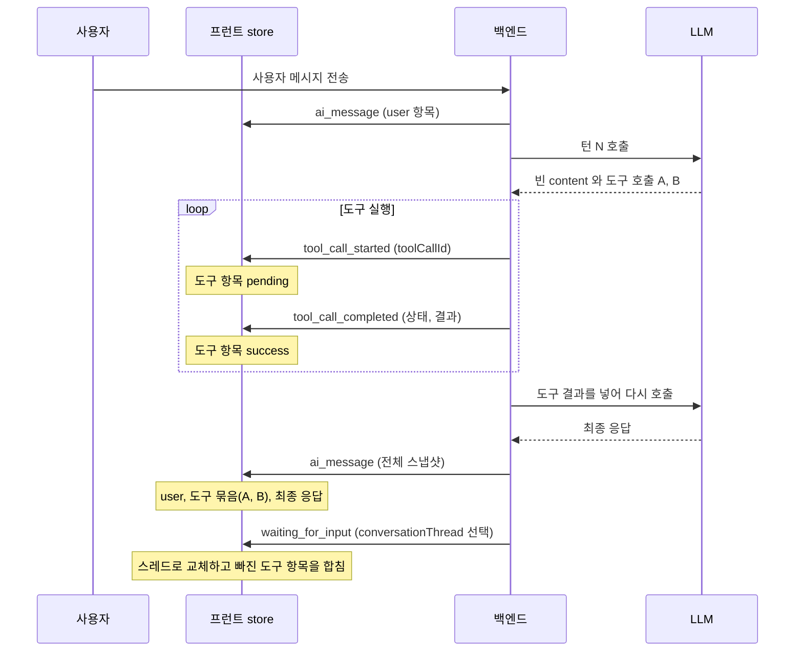

> 구현 상태: 구현됨 · 원문: `spec/conventions/conversation-thread.md` (§9 미리보기 UI 렌더 규칙, 줄 433–756. 근거는 §8.1·§8.2·§8.3·§8.5·§8.6) · 용어: [용어 사전](../CLE-GLOSSARY.md)

## 개요

대화 미리보기(Conversation Preview)는 실행 결과의 미리보기 탭 안에서 대화 스레드(`ConversationThread`)를 항목 출처별 모양으로 그리는 화면이다. 이 문서는 대화 미리보기와 실행 트리의 대화 타임라인이 지켜야 하는 렌더 규칙을 정한다. 두 축으로 나뉜다.

- **시각 매핑**: 항목 출처(`ConversationTurnSource`)마다 어떤 모양으로 그리는지, 무엇으로 서로 구분하는지, 어떤 데이터를 1차 소스로 쓰는지.
- **UI 계약**: 실시간 이벤트가 프런트 store 를 어떻게 바꾸는지, 실행 단계별 store 초기화, 빈 content 판정, UI 불변량(Inv-1~Inv-9), 회귀 차단 시나리오(CT-S1~CT-S20), 변환 함수 계약, 요소별 시각 표시.

대상 화면은 에디터와 콘솔의 디버깅 화면이다. 실행 결과 드로어의 미리보기 탭과 실행 트리, 실행 내역 화면의 실행 상세가 여기에 들어간다. 탭 가시성과 기본 탭 고르기는 [에디터 실행과 디버깅](CLE-EXEC-RUN.md) 이 정한다.

범위 밖:

- 대화 스레드 자료구조, 대화 기록 항목(`ConversationTurn`)의 필드, 항목 출처 값의 정의, 자동 누적 규칙, 영속화, AI 노드 주입은 [대화 스레드](../CLE-IX/CLE-IX-THREAD.md) 가 정한다.
- 실시간 이벤트의 필드 계약은 [WebSocket 이벤트와 명령](../CLE-API/CLE-API-WS-EVENTS.md), 출처 값이 여러 계층에서 갈리는 위치는 [인터랙션 타입 레지스트리](../CLE-IX/CLE-IX-TYPES.md) 가 정한다.
- 노드 출력 필드가 실시간·대기·내역 화면에서 복원되는 경로 목록은 [실행 화면 복원 규약](CLE-EXEC-HYDRATION.md) 이 정한다.
- 임베드 웹채팅 위젯의 말풍선 렌더는 [웹채팅 위젯](../CLE-WEBCHAT/CLE-WEBCHAT-WIDGET.md) 이 정한다. 이 문서는 위젯이 따라야 하는 최소 규칙만 적는다.

## 요구사항

- REQ-CONVPV-001 WHEN 대화 미리보기가 대화 기록 항목을 그리면 THE SYSTEM SHALL 항목 출처마다 정해진 시각 형식 하나로 렌더한다. (원본: CT §9.1)
- REQ-CONVPV-002 IF `ai_assistant` 항목에 도구 호출이 하나 이상 있고 본문이 비어 있으면 THE SYSTEM SHALL 그 항목을 말풍선이 아니라 도구 호출 묶음의 부모 칩으로 렌더한다. (원본: CT §9.1, §9.6)
- REQ-CONVPV-003 WHEN `ai_assistant` 항목에 `presentations[]` 가 있으면 THE SYSTEM SHALL 말풍선 안에 캐러셀·차트·테이블·템플릿·폼을 인라인으로 렌더한다. (원본: CT §9.1)
- REQ-CONVPV-004 IF `type: 'form'` 페이로드가 `pendingFormToolCall.toolCallId` 와 맞으면 THE SYSTEM SHALL 인터랙티브 `DynamicFormUI` 를 렌더한다. (원본: CT §9.1)
- REQ-CONVPV-005 IF `type: 'form'` 페이로드가 활성 폼과 맞지 않으면 THE SYSTEM SHALL `FormSubmittedContent` 로 렌더한다. (원본: CT §9.1)
- REQ-CONVPV-006 WHEN `presentation_user` 항목을 그리면 THE SYSTEM SHALL `text` 의 동사 접두(`clicked:`, `continued:`)를 머리 라벨로 옮기고 본문에 다시 표시하지 않는다. (원본: CT §9.1)
- REQ-CONVPV-007 IF `system_error` 항목의 `data.retryable` 이 true 면 THE SYSTEM SHALL 오른쪽 액션 영역에 [다시 시도] 버튼과 `data.retryAfterSec` 카운트다운을 표시한다. (원본: CT §9.1)
- REQ-CONVPV-008 IF `system_error` 항목의 `data.retryable` 이 false 면 THE SYSTEM SHALL 액션 영역을 비워 둔다. (원본: CT §9.1)
- REQ-CONVPV-009 WHEN `rag` 항목을 그리면 THE SYSTEM SHALL 점선 테두리 전체 폭 줄에 `KB · <N> chunk(s)` 칩과 중복을 뺀 문서 이름 목록을 표시한다. (원본: CT §9.1)
- REQ-CONVPV-010 WHEN 사용자가 `rag` 줄을 누르면 THE SYSTEM SHALL 참조 탭의 해당 턴 그룹으로 이동한다. (원본: CT §9.1)
- REQ-CONVPV-011 WHEN 대화 미리보기가 항목을 그리면 THE SYSTEM SHALL 아이콘·컨테이너 형식·출처 칩 세 신호를 동시에 적용해 출처를 구분한다. (원본: CT §9.2)
- REQ-CONVPV-012 WHEN 대화 미리보기 탭이 대화 턴을 그리면 THE SYSTEM SHALL `conversationThread.turns` 스냅샷을 1차 소스로 쓴다. (원본: CT §9.3)
- REQ-CONVPV-013 WHEN LLM 사용량·요청·응답 탭이 데이터를 그리면 THE SYSTEM SHALL `ai_message.messages[]` 를 소스로 쓴다. (원본: CT §9.3)
- REQ-CONVPV-014 WHEN `rag` 줄과 📚 참조 칩을 그리면 THE SYSTEM SHALL `meta.turnDebug[].ragSources` 만 읽고 형제 필드 `llmCalls` 는 대화 미리보기에 쓰지 않는다. (원본: CT §9.3)
- REQ-CONVPV-015 WHEN 실행 상세 화면이 끝난 대화를 복원하면 THE SYSTEM SHALL `output.result.messages` 와 `output.interaction` 을 합쳐 스레드 스냅샷과 같은 모양을 다시 만든다. (원본: CT §9.3)
- REQ-CONVPV-016 IF store 에 오류로 끝난 노드의 `system_error` 가 있으면 THE SYSTEM SHALL store 를 우선하고 없으면 영속된 노드 출력으로 복원한다. (원본: CT §9.3)
- REQ-CONVPV-017 WHEN 대화 미리보기나 대화 타임라인이 메시지를 표시하면 THE SYSTEM SHALL `ai_message.messages[]` 의 `content` 원문을 그대로 노출하지 않는다. (원본: CT §9.4)
- REQ-CONVPV-018 IF 디버그 패널이 원문을 보여 줘야 하면 THE SYSTEM SHALL "Raw payload" 토글을 켰을 때만 원문을 노출한다. (원본: CT §9.4)
- REQ-CONVPV-019 WHEN 미리보기 렌더러가 텍스트를 표시하면 THE SYSTEM SHALL `[user-input]`·`[/user-input]` 마커를 지우고 안쪽 내용은 남긴다. (원본: CT §9.5)
- REQ-CONVPV-020 WHEN `ai_assistant` 항목이 도구 호출 묶음 부모로 분류되면 THE SYSTEM SHALL 뒤따르는 아직 묶이지 않은 도구 항목을 `toolCalls.length` 개까지 자식으로 묶는다. (원본: CT §9.6)
- REQ-CONVPV-021 IF 항목 출처가 `system_error` 나 `rag` 면 THE SYSTEM SHALL 그 항목을 도구 호출 묶음에 넣지 않고 제자리에 따로 표시한다. (원본: CT §9.6)
- REQ-CONVPV-022 WHEN 대화 미리보기와 실행 트리가 같은 항목을 받으면 THE SYSTEM SHALL `groupToolCallItems` 한 함수의 결과로 같은 묶음 구성·자식 수를 표시한다. (원본: Inv-5)
- REQ-CONVPV-023 WHEN `execution.tool_call_started` 를 받으면 THE SYSTEM SHALL `toolCallId` 로 도구 항목을 pending 상태로 추가하거나 갱신한다. (원본: CT §9.7)
- REQ-CONVPV-024 WHEN `execution.tool_call_completed` 를 받으면 THE SYSTEM SHALL `toolCallId` 로 항목의 상태·결과·소요 시간·에러를 갱신한다. (원본: CT §9.7)
- REQ-CONVPV-025 WHEN `execution.user_message` 를 받으면 THE SYSTEM SHALL 같은 발화의 말풍선이 이미 있으면 권위 `receivedAt` 만 찍고 없을 때만 `ai_user` 항목을 붙인다. (원본: CT §9.7)
- REQ-CONVPV-026 WHEN `execution.ai_message` 를 받으면 THE SYSTEM SHALL 항목을 `messages` 스냅샷으로 교체하면서 같은 `toolCallId` 항목의 `toolStatus`·`durationMs`·`error` 를 이어받는다. (원본: CT §9.7)
- REQ-CONVPV-027 WHEN `interactionType` 이 `ai_conversation` 인 입력 대기 이벤트를 받으면 THE SYSTEM SHALL 스레드 스냅샷으로 교체하고 스냅샷에 없는 도구·중간 assistant 항목을 합친다. (원본: CT §9.7)
- REQ-CONVPV-028 IF 이미 적용한 `nextSeq` 의 스냅샷이 다시 오면 THE SYSTEM SHALL 그 스냅샷을 적용하지 않는다. (원본: CT §9.7)
- REQ-CONVPV-029 WHEN `interactionType` 이 `ai_form_render` 인 입력 대기 이벤트를 받으면 THE SYSTEM SHALL `ai_conversation` 과 같이 적용하고 `pendingFormToolCall` 을 store 에 저장한다. (원본: CT §9.7)
- REQ-CONVPV-030 WHEN 멀티턴 AI 에이전트 노드가 `node.failed` 로 끝나거나 `port: 'error'` 와 `output.error` 를 실은 `node.completed` 가 오면 THE SYSTEM SHALL `payload.output.output.error` 로 `system_error` 항목을 만들어 대화 끝에 붙인다. (원본: CT §9.7)
- REQ-CONVPV-031 WHEN 새 실행이 시작되면 THE SYSTEM SHALL 입력 대기 UI 상태와 대화 스냅샷을 모두 초기화한다. (원본: CT §9.7.1)
- REQ-CONVPV-032 WHEN 실행이 정상 종료되거나 실패하면 THE SYSTEM SHALL 입력 대기 UI 상태만 초기화하고 대화 스냅샷은 보존한다. (원본: CT §9.7.1, Inv-6)
- REQ-CONVPV-033 WHEN `render_form` 활성 폼이 제출되면 THE SYSTEM SHALL `pendingFormToolCall` 만 비우고 나머지 멀티턴 대기 상태를 보존한다. (원본: Inv-7)
- REQ-CONVPV-034 WHEN 대화 UI 가 assistant content 가 비었는지 판정하면 THE SYSTEM SHALL `null`·`undefined`·빈 문자열·공백만 있는 문자열을 모두 빈 값으로 본다. (원본: CT §9.8)
- REQ-CONVPV-035 WHEN 도구 행 상태가 pending·success·error 로 바뀌면 THE SYSTEM SHALL 행 배치를 유지하고 상태 배지만 바꾼다. (원본: Inv-1)
- REQ-CONVPV-036 IF 도구 행이 부모 묶음에 합쳐지는 경우가 아니면 THE SYSTEM SHALL 한 번 표시한 도구 행을 없애지 않는다. (원본: Inv-2)
- REQ-CONVPV-037 WHILE 스레드 스냅샷이 도구 항목을 뺀 lean 형태인 동안 THE SYSTEM SHALL store 의 라이브 도구 행을 보존한다. (원본: Inv-4)
- REQ-CONVPV-038 IF 대화형 노드가 오류로 끝났으면 THE SYSTEM SHALL `result.status` 와 상관없이 그 대화를 대화 미리보기에서 볼 수 있게 한다. (원본: Inv-8)
- REQ-CONVPV-039 WHEN `rag` 줄·📚 칩·참조 탭이 같은 `turnIndex` 를 표시하면 THE SYSTEM SHALL 같은 `sources[]` 를 보여 준다. (원본: Inv-9)
- REQ-CONVPV-040 WHEN 대화 타임라인 관련 코드를 고치는 PR 이 올라오면 THE SYSTEM SHALL 회귀 차단 시나리오 CT-S1~CT-S20 의 단위 테스트 통과를 요구한다. (원본: CT §9.10)
- REQ-CONVPV-041 WHEN 새 변환 경로를 도입하면 THE SYSTEM SHALL 변환 함수 계약 표를 갱신하고 등가성 정의를 만족하는지 검토한다. (원본: CT §9.11)
- REQ-CONVPV-042 WHEN 디버깅 화면이 멀티턴 대화 항목을 표시하면 THE SYSTEM SHALL 항목마다 절대 발생 시각을 표시하고 assistant·tool 항목에는 소요 시간도 표시한다. (원본: CT §9.12)
- REQ-CONVPV-043 IF 항목에 발생 시각이나 소요 시간이 없으면 THE SYSTEM SHALL 그 표기를 생략하고 배치를 깨지 않는다. (원본: CT §9.12)
- REQ-CONVPV-044 WHEN 라이브 화면과 실행 내역 화면이 같은 항목을 표시하면 THE SYSTEM SHALL 같은 절대 시각을 보여 준다. (원본: CT §9.12)
- REQ-CONVPV-045 WHEN 임베드 웹채팅 위젯이 대화를 그리면 THE SYSTEM SHALL 출처를 user·assistant 두 말풍선으로 줄여 렌더한다. (원본: CT §9 스코프 예외)
- REQ-CONVPV-046 WHEN 임베드 웹채팅 위젯이 대화를 그리면 THE SYSTEM SHALL 1차 소스 선택·원문 노출 금지·마커 제거 규칙은 그대로 지킨다. (원본: CT §9 스코프 예외)
- REQ-CONVPV-047 IF `system_error` 항목에 `nodeExecutionId` 가 없으면 THE SYSTEM SHALL `data.retryable` 과 상관없이 [다시 시도] 버튼을 숨긴다. (원본: CT §1.2.1, §9.3)

## 적용 범위

이 문서의 규칙은 에디터와 콘솔의 **디버깅 화면**에 강제된다.

- 실행 결과 드로어의 미리보기 탭 안 대화 미리보기(`SummaryView`)와 선택 항목 상세(`SelectedItemDetail`)
- 실행 결과 드로어 왼쪽 실행 트리의 대화 항목(`ResultTimeline`, `ConversationTimelineItem`)
- 실행 내역 화면의 실행 상세(`/executions/:id`)

**임베드 웹채팅 위젯은 예외다.** 위젯은 호스트 페이지 안 좁은 패널에서 최종 사용자에게 보인다. 그래서 [출처별 시각 매핑](#출처별-시각-매핑) 과 [세 가지 구분 신호](#세-가지-구분-신호) 를 따르지 않고 user·assistant 두 말풍선으로 줄여 렌더한다. 항목 출처를 어느 말풍선으로 보내는지는 [웹채팅 위젯 §패널](../CLE-WEBCHAT/CLE-WEBCHAT-WIDGET.md#패널) 이 정한다.

출처별 시각 매핑 표는 일곱 행이지만 `system_error` 와 `rag` 는 프런트가 합성하는 출처라 위젯이 받는 데이터에 오지 않는다. `rag` 는 위젯 코드가 `mergeRagRetrievalItems` 를 부르지 않는다는 코드 분리에도 기댄다. 위젯이 받는 값은 백엔드 enum 다섯 값뿐이다. 다만 [데이터 소스](#데이터-소스) 의 1차 소스(`conversationThread.turns`), [원문 노출 금지와 마커 제거](#원문-노출-금지와-마커-제거) 규칙은 위젯에도 그대로 강제된다.

## 한 턴이 표시되는 흐름

멀티턴 AI 에이전트의 한 턴에서 실행 트리 항목은 아래 순서로 바뀐다. `conversationThread` 는 백엔드가 입력 대기 이벤트에 골라서 함께 싣는다.



1. 사용자 메시지를 보내면 `ai_message` 로 user 항목이 들어온다.
2. LLM 이 빈 content 와 도구 호출을 돌려주면 도구마다 `tool_call_started` 로 pending 항목이 생기고 `tool_call_completed` 로 success 가 된다.
3. 최종 응답이 오면 `ai_message` 전체 스냅샷으로 항목을 다시 만든다. 빈 content 의 중간 assistant 는 도구 묶음의 부모가 된다.
4. 입력 대기 이벤트가 스레드 스냅샷을 실어 오면 그것으로 교체하고 스냅샷에 없는 도구 항목을 합친다.

## 출처별 시각 매핑

항목 출처와 UI 형식은 1:1 이다. 출처 값의 정의는 [대화 스레드](../CLE-IX/CLE-IX-THREAD.md) 가 정한다.

| 항목 출처 | UI 형식 | 머리 | 본문 |
| --- | --- | --- | --- |
| `ai_user` | 👤 user 말풍선(오른쪽 정렬, 강조 배경) | 없음 | `text` |
| `ai_assistant` | 🤖 assistant 말풍선(왼쪽 정렬, 일반 배경). 단 `toolCalls?.length ≥ 1` 이고 `isAssistantContentBlank(text)` 면 [도구 호출 묶음](#도구-호출-묶음) 의 **부모** 칩으로 바꾼다 | 없음 | `text`(markdown 렌더). `presentations[]` 가 있으면 말풍선 안에 캐러셀·차트·테이블·템플릿·폼을 인라인으로 렌더한다. `type: 'form'` 페이로드는 `pendingFormToolCall.toolCallId` 와 맞으면 **인터랙티브 `DynamicFormUI`**, 아니면 `FormSubmittedContent` 로 렌더한다. 활성 폼 UI 의 기준은 [AI 에이전트 노드](../CLE-NODE-AI/CLE-NODE-AGENT.md) 다 |
| `presentation_user` | 🧩 회색 시스템 카드(전체 폭) | `<노드 유형 아이콘> <nodeLabel>` 칩과 인터랙션 라벨(`button clicked`, `form submitted`, `link continue`) | `data` 메타에서 뽑는다(대화 스레드 문서의 인터랙션 표 참조). `text` 의 동사 접두(`clicked:`, `continued:`)는 머리로 옮겨 본문에 다시 쓰지 않는다 |
| `ai_tool` | 🔧 도구 호출 카드(`mcp_*` 카드와 같은 모양). 부모 묶음의 자식이든 단독이든 같은 행 배치다(Inv-1) | 도구 이름과 상태 배지(`pending`, `success`, `error`). 단계와 상관없이 배치는 같고 상태만 바뀐다 | 결과 미리보기(JSON 또는 텍스트, 토글) |
| `rag` | 🔎 **점선 테두리 전체 폭 줄**. 말풍선도 실선 카드도 아니다(`ai_tool` 과 컨테이너로 구분). 세 가지 구분 신호를 모두 적용한다. 도구 호출 묶음 분류 **대상이 아니다** | `KB · <N> chunk(s)` 칩 | 중복을 뺀 문서 이름 목록(📚 칩과 같은 규칙, `MAX_VISIBLE_DOC_NAMES` 를 넘으면 `+N`). 누르면 참조 탭의 해당 턴 그룹으로 이동 |
| `system` | ℹ️ 가운데 정렬 알림 줄(얇은 회색 텍스트). **v1 은 자동으로 쌓지 않는다**(예약 값). 수동으로 쌓거나 v2 에서 자동으로 쌓을 때 쓰이며 UI 는 이 형식을 미리 구현해 둔다 | "System note" | `text` |
| `system_error` | ❌ 가운데 정렬 얇은 빨간 전체 폭 줄. system 알림과 같은 급의 컨테이너지만 빨간 강조다. 말풍선이 아니다. 세 가지 구분 신호를 모두 적용한다. 오른쪽 액션 영역은 `data.retryable === true` 면 `[다시 시도]` 버튼과 `data.retryAfterSec` 카운트다운, `false` 면 비어 있다 | `<nodeLabel> · <code>` 칩(예: `CS Bot · LLM_RATE_LIMIT`) | `data.message`(LLM 프로바이더의 에러 텍스트). markdown 으로 렌더하지 않는다 |

`system_error` 와 `rag` 는 백엔드가 쌓는 값이 아니라 프런트가 합성하는 출처다. `system_error` 는 노드 출력의 `output.error` 로부터, `rag` 는 `meta.turnDebug[].ragSources` 로부터 만든다. `system_error` 의 `data` 형태는 [대화 스레드](../CLE-IX/CLE-IX-THREAD.md) 가 정한다.

`rag` 줄이 나타내는 검색이 엔진이 LLM 호출 전에 자동으로 한 검색인지 LLM 도구 호출이 가져온 청크인지는 정의가 갈린다. 결정 전까지 이 문서의 `rag` 서술은 원문 정의를 옮긴 것이다. [대화 스레드 §미결 사항](../CLE-IX/CLE-IX-THREAD.md#미결-사항) 과 [RAG 검색 §미결 사항](../CLE-KB/CLE-KB-SEARCH.md#미결-사항) 참조.

### [다시 시도] 버튼 조건

`system_error` 줄의 [다시 시도] 버튼은 두 조건을 모두 만족할 때만 보인다.

1. `data.retryable === true` 다.
2. 항목에 `nodeExecutionId` 가 있다. 이 값은 마지막 턴 재시도 명령(`execution.retry_last_turn`)의 payload 키다([대화 스레드 §`system_error` 데이터](../CLE-IX/CLE-IX-THREAD.md#system_error-데이터)). 실시간 이벤트로 만든 store 항목에만 있고 내역 화면이 `output.error` 로 합성한 항목에는 없다([데이터 소스](#데이터-소스)).

현재 구현(`conversation-inspector.tsx`)은 이 두 조건에 더해 재시도 명령 콜백(`onRetry`)이 연결돼 있는지도 확인한다. 실시간 `system_error` 는 AI 에이전트 노드(`ai_agent`)이고 store 에 대화가 이미 있을 때만 붙인다(`use-execution-events.ts` 의 `isMultiTurnAiContext`). 정보 추출기는 멀티턴 실패를 `retryable=true` 로 내지만 마지막 턴 재시도 상태(`_retryState`)를 만들지 않는다. 지금은 정보 추출기 실패에 실시간 `system_error` 가 붙지 않아 버튼도 나타나지 않는다. 이 노드 유형 조건이 없으면 정보 추출기에서 버튼을 눌렀을 때 `RETRY_STATE_NOT_FOUND` 가 난다. 정보 추출기에 마지막 턴 재시도를 들일지는 [정보 추출기 §미결 사항](../CLE-NODE-AI/CLE-NODE-EXTRACTOR.md#미결-사항) 에서 다룬다.

## 세 가지 구분 신호

사용자가 진짜 user 메시지와 다른 출처를 헷갈리지 않도록 세 신호를 **동시에** 적용한다. 한 신호만으로 구분하지 않는다. 색약·다크 모드·작은 화면을 고려한 규칙이다.

1. **아이콘**: 👤(user), 🤖(assistant), 🧩(presentation), 🔧(tool), 🔎(rag), ℹ️(system), ❌(system_error). 서로 겹치지 않는 글리프다.
2. **컨테이너 형식**: 말풍선(둥근 배경, 좌우 정렬), 전체 폭 회색 카드, 전체 폭 **점선** 줄(rag), 가운데 정렬 줄(system 회색, system_error 빨간 강조).
3. **출처 칩**: presentation·tool·rag·system·system_error 는 머리에 칩을 단다. system_error 는 `<nodeLabel> · <code>`, rag 는 `KB · <N> chunk(s)` 형식이다. user·assistant 말풍선에는 칩이 없다.

`rag` 와 `ai_tool` 은 세 신호가 모두 달라야 한다. 둘 다 "지식 저장소를 조회했다" 는 같은 관심사를 표현하지만 인과가 다르다. `ai_tool` 은 LLM 이 호출하기로 정한 것이고 `rag` 는 엔진이 LLM 호출 전에 자동으로 한 것이다. 한 신호(예: 아이콘)만 다르면 사용자가 "LLM 이 지식 저장소를 호출했다" 는 잘못된 인과를 읽는다. 그래서 아이콘(🔎/🔧), 컨테이너(점선 줄/실선 카드), 칩(`KB · N chunk(s)`/도구 이름)이 모두 다르다. 이 인과 구분은 `rag` 를 엔진의 자동 검색으로 보는 정의에 기대고 그 정의는 미결이다([대화 스레드 §미결 사항](../CLE-IX/CLE-IX-THREAD.md#미결-사항)).

이 규칙은 [WebSocket 이벤트와 명령](../CLE-API/CLE-API-WS-EVENTS.md) 의 전송 출처 표시(`live`·`injected`)에 대한 옛 권장(injected 칩)을 강제로 올린 것이다. 근거는 [Rationale](#rationale) 에 있다.

## 데이터 소스

| 용도 | 1차 소스 | 비고 |
| --- | --- | --- |
| 대화 미리보기 탭(`meta.interactionType: "ai_conversation"`) | `conversationThread.turns` 스냅샷([WebSocket 이벤트와 명령](../CLE-API/CLE-API-WS-EVENTS.md) 의 입력 대기 스레드 스냅샷) | source·nodeLabel·data 메타를 바로 쓴다. 언제 어떻게 적용하는지는 [이벤트별 store 변환](#이벤트별-store-변환) 이 정한다 |
| LLM 사용량·요청·응답 탭(디버그) | `ai_message.messages[]` | 전송 출처 표시(`live`·`injected`)와 접두가 LLM 으로 간 모양 그대로 보인다. "Raw payload" 토글로 접두와 마커를 드러낸다 |
| 대화 미리보기의 **보조 관찰성 레인**: 🔎 `rag` 줄과 📚 참조 칩 | **`meta.turnDebug[].ragSources` 만**(라이브와 내역이 같다) | 위 첫 행을 **대신하지 않고 더한다.** 대화 턴의 1차 소스는 여전히 스레드 스냅샷이고 이 레인은 턴을 대신하지 않는 별도 축이다. `meta.turnDebug` 전체가 아니라 `ragSources` 만이다. 형제 필드 `llmCalls` 는 원문 디버그 페이로드로 정해진 필드라 보호 대상이다. 노출 정책은 [RAG 검색](../CLE-KB/CLE-KB-SEARCH.md) 이 정한다. 라이브 출처는 입력 대기 이벤트의 `nodeOutput.meta.turnDebug`, 내역 출처는 영속된 `outputData.meta` 다 |
| 실행 내역(`/executions/:id`) 복원 | 노드 실행의 `output.result.messages`(DB 영속)와 `output.interaction` | 두 경로는 각자 기준이다. `output.result.messages` 는 LLM 호출 결과 누적, `output.interaction` 은 Presentation 인터랙션 한 건이다. 화면이 복원할 때 둘을 합쳐 `conversationThread.turns` 와 같은 모양을 다시 만든다. 여러 노드를 가로지르는 재구성 정책은 [실행 내역](CLE-EXEC-HISTORY.md) 의 EH-DETAIL-12(v2)로 미룬다. 디버그 탭만 emit 형태로 다시 만든다. **오류로 끝난 노드(`output.error` 있음)도 이 행을 따르고 `status` 로 가르지 않는다.** 엔진은 실패해도 `outputData` 를 저장·전송하고 오류 종료 출력에는 `output.error` 와 일부 `output.result.*` 가 함께 있어 다시 만들 수 있다([AI 에이전트 노드 출력과 디버그](../CLE-NODE-AI/CLE-NODE-AGENT-OUTPUT.md)). `system_error` 는 `output.error` 로 합성하며 `nodeExecutionId` 를 싣지 않으므로 재시도 버튼이 자동으로 숨는다. Inv-8 참조 |
| 오류 종료 · **라이브** 세션 | store `conversationMessages`([store 초기화 정책](#store-초기화-정책) 의 권위 사본) | 위 내역 행과 같은 대화지만 라이브에서는 store 의 `system_error` 에만 `nodeExecutionId` 가 있어 [다시 시도] 를 켤 수 있다. 그래서 store 에 그 노드의 `system_error` 가 있으면 store 를 우선하고 없으면(새로고침·내역) 위 행으로 되돌아간다. 두 소스는 같은 스레드의 다른 매체이지 서로 다른 기준이 아니다 |

## 원문 노출 금지와 마커 제거

**emit 메시지 원문 노출 금지**: 대화 미리보기 탭과 모든 대화 타임라인 UI 는 `ai_message.messages[]` 의 `content` 를 원문 그대로 노출하지 않는다. 원문이 필요한 디버그 패널(LLM 요청·응답)만 예외이고 그 패널은 "Raw payload" 토글로 원문임을 밝힌다.

**LLM 전용 마커 제거**: 백엔드는 프롬프트 주입 방어용으로 사용자 입력 마커(`[user-input]…[/user-input]`)를 LLM 페이로드에 일부러 넣고 그대로 전송·저장한다. 미리보기 렌더러는 사용자에게 보이기 전에 정규식 `/\[\/?user-input\]/g` 로 마커를 지운다. 안쪽 내용은 남긴다. 마커를 넣는 규칙은 [대화 스레드](../CLE-IX/CLE-IX-THREAD.md) 가 정한다. 지우는 곳은 네 군데다.

- `messagesToConversationItems`: emit 메시지 `user`·`assistant` content
- `threadTurnsToConversationItems`: `conversationThread.turns` 의 프런트 출처 일곱 값 전부(`system_error`·`rag` 포함). switch 에 case 가 일곱 개 있다. 합성 출처 두 값은 전송 데이터에 오지 않지만 `_exhaustive: never` 가 case 를 강제한다
- `parseHistoryMessages`: 내역 재구성 경로
- `mergeOrphanToolItems`: 부모-자식 묶음을 다시 만들 때 이전 항목의 제거 결과를 보존한다

원문이 필요한 탭(LLM 요청·응답·LLM 사용량)만 "Raw payload" 토글로 마커가 있는 원문을 보여 준다. 새 인라인 마커를 도입하려면 [대화 스레드](../CLE-IX/CLE-IX-THREAD.md) 의 마커 규칙을 먼저 고쳐야 한다.

## 도구 호출 묶음

LLM 호출 한 번이 `ai_assistant` 항목 하나다. 다음 조건을 모두 만족하면 그 항목을 **도구 호출 묶음 부모**로 분류한다.

1. `source === 'ai_assistant'`(전송 데이터) 또는 store `type === 'assistant'`
2. `turn.toolCalls?.length >= 1`(전송 데이터) 또는 store `item.assistantToolCalls?.length >= 1`
3. `isAssistantContentBlank(text|content)` 가 참([빈 content 판정](#빈-content-판정))

같은 턴에서 뒤따르는 `ai_tool` 항목(store 에서는 `type: "tool"`) 가운데 아직 다른 부모에 묶이지 않은 것을 `toolCalls.length`(store: `assistantToolCalls.length`) 개까지 **자식**으로 묶는다. 부모가 나열한 자식 수만큼 뒤따르는 미묶음 도구를 순서대로 가져간다. `assistantToolCalls` 의 `id` 는 앞으로의 호환을 위해 버려져 있어서 순서·개수 매칭이 기준이다.

**단일 결정 함수**: `groupToolCallItems(items: ConversationItem[]): { claimedToolIndices: Set<number>; childrenByParent: Map<number, number[]> }` 를 `codebase/frontend/src/lib/conversation/conversation-utils.ts` 에서 export 한다. 이 함수가 분류와 순서 매칭 결과를 두 화면에 똑같이 공급한다(Inv-5). 묶음 정책을 바꾸면 이 함수 하나만 고치고 모든 화면에 저절로 반영된다.

**`system_error` 와 `rag` 는 묶음 분류 대상이 아니다.** `groupToolCallItems` 는 두 출처 항목을 묶지 않은 상태로 두고 들여쓰기 트리에 넣지 않는다. 부모로도 자식으로도 분류하지 않고 `isAssistantContentBlank` 도 평가하지 않는다. 두 항목은 제자리에 독립 줄로 표시된다(`system_error` 는 빨간 줄, `rag` 는 점선 줄). "묶음 단위로만 줄어든다"(Inv-2)와 맞는다. `rag` 가 `ai_tool` 처럼 보인다고 부모의 `toolCalls.length` 순서 매칭 대상에 넣지 않는다. `rag` 는 LLM 이 나열한 도구 호출이 아니어서 그 개수에 애초에 없고 넣으면 실제 도구 자식 하나가 밀려난다.

| 영역 | 모양 |
| --- | --- |
| 부모 | 작은 칩 머리: `🤖 AI · 🔧 N개 도구 호출`. 둥근 말풍선이 아니라 inline-flex 칩이다 |
| 자식 컨테이너 | 왼쪽 세로줄(`border-l-2`)과 `ml-3 pl-3` 들여쓰기 |
| 각 자식 | `ai_tool` 행 모양 그대로(🔧, 이름, 상태 배지, 결과 미리보기) |

content 가 비어 있지 않은 assistant(LLM 의 생각 텍스트 등)는 부모로 분류하지 않는다. 표준 `ai_assistant` 말풍선으로 렌더하고 본문 아래에 `ToolCallBadge` 를 단다. 자식 행도 누를 수 있다. `onSelectMessage(childIndex)` 가 그대로 불려 `SelectedItemDetail` 의 `ToolDetail` 로 들어간다.

**적용 화면**: 이 정책은 두 타임라인 화면에 **동시에** 적용한다.

1. 미리보기 탭의 대화 미리보기(`SummaryView`, 말풍선형 타임라인). 작은 칩 머리와 들여쓴 자식 그대로다.
2. 왼쪽 실행 트리(`ResultTimeline`, AI 에이전트 노드 아래 대화 항목). 한 줄 형태에 맞춰 부모 행은 `🤖 AI · 🔧 N개 도구 호출` 한 줄이고 자식은 왼쪽 세로줄과 `pl-3` 들여쓰기로 넣는다. 칩과 전체 말풍선 두 형태가 한 화면에 섞이지 않게 해 세 가지 구분 신호의 동치를 지킨다.

두 화면의 모양이 다르면 사용자가 "어느 쪽이 진짜 호출 결과냐" 를 헷갈린다. 그래서 **`groupToolCallItems` 가 낸 분류 결과는 같아야 한다**(Inv-5). 행 모양 차이(칩과 한 줄)는 허용하지만 묶음 구성·자식 수·순서 매칭 결과는 같다.

## 이벤트별 store 변환

`useExecutionStore.conversationMessages` 를 바꾸는 규칙이다. 모든 이벤트의 의미는 [WebSocket 이벤트와 명령](../CLE-API/CLE-API-WS-EVENTS.md) 을 따른다. 표의 이벤트 이름은 `execution.` 접두를 뺐다(정식 이름은 `execution.tool_call_started` 등).

| 이벤트 | store 변경 | 목적 |
| --- | --- | --- |
| `tool_call_started` | `toolCallId` 로 UPSERT(status=pending) | 라이브 표시 시작 |
| `tool_call_completed` | `toolCallId` 로 UPDATE(status, result, durationMs, error) | 라이브 상태 전이 |
| `user_message` | optimistic `ai_user` 항목(`text=payload.message`)을 APPEND 한다. `receivedAt` 으로 중복(재전송·재구독)을 막는다. **단, 같은 발화의 말풍선이 이미 있으면**(클라이언트가 직접 보내 즉시 optimistic 말풍선을 띄운 경우) 새 항목을 붙이지 않고 그 말풍선에 권위 `receivedAt` 을 찍어 맞춘다. 이 찍기는 턴 종료 `ai_message` 교체의 보조 준비 단계다. 말풍선이 없을 때(채널 텍스트 수신 등)만 붙인다 | 사용자 발화를 일찍 보여 주기 |
| `ai_message` | `messagesToConversationItems(payload.messages, …)` 로 REPLACE 한다. 단 `toolStatus`·`durationMs`·`error` 는 이전 목록의 같은 `toolCallId` 항목에서 이어받는다. 교체는 직전 `user_message` 의 optimistic 말풍선을 권위 스냅샷의 같은 user 메시지로 자연스럽게 대신한다 | 스냅샷 정합 |
| `waiting_for_input`(`ai_conversation`) | `threadTurnsToConversationItems(payload.conversationThread.turns)` 로 REPLACE 하고 **남은 도구·중간 assistant 항목을 MERGE** 한다([변환 함수 계약](#변환-함수-계약)). `lastAppliedThreadSeqRef` 로 같은 `nextSeq` 재전송은 건너뛴다 | lean 스레드 보존 |
| `waiting_for_input`(`ai_form_render`) | 위 `ai_conversation` 행과 같은 REPLACE·MERGE 에 더해 `conversationConfig.pendingFormToolCall: { toolCallId, formConfig }` 를 store 의 `waitingConversationConfig.pendingFormToolCall` 에 저장한다. 이 값이 있는 동안 `SummaryView`·`SelectedItemDetail` 의 `AssistantPresentationsBlock` 은 `payload.toolCallId` 가 맞는 폼을 인터랙티브로 렌더한다 | AI 에이전트 멀티턴의 `render_form` 블로킹 |
| `waiting_for_input`(`form`·`buttons`) | `conversationThread` 가 함께 실려 왔을 때만 위 `ai_conversation` 행과 같이 적용한다. 라이브 도구 행 보존 의무도 같다(Inv-4) | Form·버튼 노드 |
| `node.failed`(`ai_conversation` 맥락의 AI 에이전트 멀티턴) | `system_error` 항목을 `conversationMessages` 끝에 APPEND 한다. **전송 데이터 최상위 `error` 는 문자열(메시지만)이다**([WebSocket 이벤트와 명령](../CLE-API/CLE-API-WS-EVENTS.md)). 구조화된 에러 객체는 **`payload.output.output.error`** 에만 있고 `output` 이 함께 실리는 두 경로(에러 포트 종료, AI 턴 종료)에서만 닿는다. 그것을 `system_error` 의 `data` 모양으로 옮긴다. 기존 항목은 바꾸지 않는다(Inv-6) | 에러 인라인 표시 |
| `node.completed`(멀티턴 `port: 'error'` 와 `output.error` 있음) | 위 `node.failed` 와 같다. `system_error` 를 APPEND 하고 에러 정보는 **`output.output.error`** 에서 꺼낸다. 전송 데이터의 `output` 은 노드 출력(`NodeHandlerOutput`) 전체라 도메인 값이 한 겹 아래에 있다([AI 에이전트 노드 출력과 디버그](../CLE-NODE-AI/CLE-NODE-AGENT-OUTPUT.md) 의 `buildMultiTurnFinalOutput` 에러 종료 형태) | 에러 인라인 표시 |

REPLACE 는 배열을 무조건 바꾸는 것이 아니라 **이어받을 값이 정해진 교체**다. Inv-1·Inv-4 를 깨지 않도록 이전 목록의 일부 상태를 보존한다. 이어받는 필드(`toolStatus`, `durationMs`, `error`)는 store 안 `ConversationItem` 의 런타임 필드(`codebase/frontend/src/lib/stores/execution-store.ts`)이고 대화 기록 항목 전송 스키마를 넓힌 것이 아니다. 이어받기는 먼저 도착한 라이브 이벤트 정보를 빈 스냅샷이 덮어쓰지 않게 하려는 규칙이다.

노드 출력 래퍼와 도메인 값의 구분은 [노드 출력 규약](../CLE-NODE/CLE-NODE-OUTPUT.md) 이 정한다. 위 두 에러 행은 그 계약을 다시 적지 않고 인용한다. 현재 구현의 `use-execution-events.ts` `extractNodeErrorPayload` 는 문자열 `error` 를 보지 않고 `output.output.error` 만 읽는다.

### store 초기화 정책

`useExecutionStore` 의 실행 단계 액션마다 두 묶음을 따로 초기화한다.

| 묶음 | 대상 필드 |
| --- | --- |
| **입력 대기 UI 초기화** | 사용자 입력 대기 UI 상태: `waitingNodeId`, `waitingFormConfig`, `waitingInteractionType`, `waitingButtonConfig`, `waitingConversationConfig`, `isWaitingAiResponse`, `selectedConversationItemIndex` |
| **대화 스냅샷 초기화** | `conversationMessages` 배열(라이브 대화 스레드의 store 쪽 권위 사본) |

| 단계 액션 | 입력 대기 UI 초기화 | 대화 스냅샷 초기화 |
| --- | --- | --- |
| `startExecution`(새 실행 시작) | 적용 | 적용(이전 실행의 대화는 의미가 없다) |
| `completeExecution`(정상 종료) | 적용 | **적용 안 함, 대화 보존** |
| `failExecution`(실행 실패) | 적용 | **적용 안 함, 대화 보존**(Inv-6) |
| `resumeFromForm`, `resumeFromButtons`, `resumeFromConversation`(입력 대기 해제) | 적용 | 적용 안 함, 대화 진행 중 |
| `resumeFromAiRenderForm`(`render_form` 제출 뒤) | **적용 안 함, 대화·AI 응답 대기 상태 보존** | 적용 안 함, 대화 진행 중 |

`resumeFromAiRenderForm` 을 따로 두는 것은 의도한 비대칭이다. `render_form` 제출은 멀티턴 AI 대화 도중의 폼 입력 한 건이 끝난 것이지 입력 대기 자체가 풀린 것이 아니다. `waitingNodeId`, `waitingInteractionType: 'ai_form_render'`, `waitingConversationConfig`, `isWaitingAiResponse: true` 는 보존하고 `waitingConversationConfig.pendingFormToolCall` 만 null 로 비운다(중첩 patch). 그러면 UI 가 폼 페이로드를 `FormSubmittedContent` 로 자연스럽게 바꾸면서 AI 응답 대기 스피너가 유지된다. 옛 동작(`resumeFromForm` 으로 입력 대기 UI 전체를 비움)에서는 대화 미리보기가 라이브에서 완료 분기로 떨어져 타임라인이 깜빡였다. 그 회귀를 막는 규칙이다([AI 에이전트 노드](../CLE-NODE-AI/CLE-NODE-AGENT.md) 의 `render_form` 타임라인 인라인 표현).

이 정책의 기준은 이 절이다. [에디터 실행과 디버깅](CLE-EXEC-RUN.md) 의 라이프사이클 표는 이 정책을 가리킨다. 두 묶음의 프런트 구현 식별자(상수 이름 등)는 구현 세부라 여기 적지 않는다. 스펙과 코드가 어긋나는 것을 피하려는 것이다.

## 빈 content 판정

`isAssistantContentBlank(content: unknown): boolean` 이 **단일 결정 함수**다.

```ts
function isAssistantContentBlank(content: unknown): boolean {
  return typeof content !== "string" || content.trim() === "";
}
```

**구현 위치 의무**: `codebase/frontend/src/lib/conversation/conversation-utils.ts` 에서 export 한다. UI 컴포넌트(`conversation-inspector.tsx`)와 변환 함수(`messagesToConversationItems`, `threadTurnsToConversationItems`, `mergeOrphanToolItems`)가 같은 함수를 import 해서 쓴다. 여러 곳에 정의하지 않는다.

다음 네 가지를 모두 **같은 빈 값**으로 처리한다.

- `null`
- `undefined`
- `""`(빈 문자열)
- `" "`, `"\n"`, `"   \t\n"` 처럼 공백만 있는 문자열

입력은 대화 기록 항목의 `text` 다. Anthropic 의 별도 `extended_thinking` content block 은 `turn.text` 에 합쳐지지 않으므로 이 판정에 영향이 없다(extended_thinking 처리는 별도 항목이다).

이 판정을 쓰는 곳은 세 군데다.

1. **묶음 분류**([도구 호출 묶음](#도구-호출-묶음)): `ai_assistant` 가 부모인지 정한다.
2. **머리 라벨**(`SelectedItemDetail`): `hasToolCalls && isAssistantContentBlank(content)` 면 "Tool Call — Turn N", 아니면 "AI Response — Turn N".
3. **자리 표시**(타임라인 말풍선): content 와 toolCalls 가 모두 없을 때만 `(empty)` 를 표시한다.

LLM 프로바이더가 content 를 어떤 모양으로 보내든(Anthropic `null`, OpenAI `null`, Google `null`, 공백 text block) UI 동작은 **같아야** 한다.

## UI 불변량

다음 아홉 불변량은 이 문서의 규칙, 구현, store 단계 정책을 바꿀 때 반드시 지킨다. `Inv-N` 라벨은 이 절 안에서만 쓴다.

| ID | 불변량 |
| --- | --- |
| Inv-1 | 도구 행 모양(🔧, 이름, 상태 배지, 결과 미리보기)은 단계(pending, success, error)와 상관없이 같은 배치를 유지한다. 상태만 바뀐다 |
| Inv-2 | 타임라인 항목 수는 *묶음 단위*로만 줄어든다. 부모-자식 묶기는 허용한다. 한 번 표시한 도구 행은 부모 묶음에 합쳐지는 경우 말고는 사라지지 않는다 |
| Inv-3 | `SummaryView` 와 `SelectedItemDetail` 의 "Tool Call"·"AI Response" 라벨 판정은 같은 `isAssistantContentBlank` 에서 나온다 |
| Inv-4 | 스레드 스냅샷이 lean(`includeToolTurns: false`)이어도 라이브 도구 행은 store 에 보존한다. [이벤트별 store 변환](#이벤트별-store-변환) 의 MERGE 가 맡는다 |
| Inv-5 | 도구 호출 묶음 분류와 순서 매칭 결과는 단일 결정 함수 `groupToolCallItems` 에서 나온다. 대화 미리보기(`SummaryView`)와 실행 트리(`ResultTimeline`)가 같은 결과를 쓴다. 행 모양 차이(칩과 한 줄)는 허용하지만 묶음 구성·자식 수·매칭 결과는 같다 |
| Inv-6 | 노드 실패나 실행 실패 때 store `conversationMessages` 를 비우지 않는다. 대화 스냅샷을 비우는 것은 `startExecution` 뿐이다([store 초기화 정책](#store-초기화-정책)). `system_error` 항목은 스레드 끝에 APPEND 하고 기존 user·assistant·tool 항목은 바꾸지 않는다(불변) |
| Inv-7 | AI 에이전트 `render_form` 활성 폼을 제출한 직후 store 의 멀티턴 맥락(`waitingNodeId`, `waitingInteractionType: 'ai_form_render'`, `pendingFormToolCall` 을 뺀 `waitingConversationConfig`, `isWaitingAiResponse: true`)을 보존한다. `pendingFormToolCall` 만 null 로 비운다. `resumeFromAiRenderForm` 의 중첩 patch 가 맡는다. 옛 `resumeFromForm` 은 입력 대기 UI 전체를 비워, 서버에서 대기 중(`result.status !== 'completed'`)인데도 대화 미리보기가 라이브에서 완료 분기로 떨어져 미리보기가 null 로 깜빡였다. 기준은 [store 초기화 정책](#store-초기화-정책) 표의 `resumeFromAiRenderForm` 행이다 |
| Inv-8 | **렌더 층 도달성**: 오류로 끝난(`output.error` 가 있어 `system_error` 가 붙은) 대화형 노드의 대화는 **`result.status` 로 막지 않고** 대화 미리보기로 볼 수 있어야 한다. Inv-6 은 store 의 **보존**을 보장하고 이 불변량은 그 보존분과 `outputData` 로 영속된 같은 대화의 **도달성**을 보장한다. 둘은 별개다. 보존만으로는 "왜 대화가 사라졌지?" 증상을 막지 못한다. 데이터 소스는 [데이터 소스](#데이터-소스), 탭 가시성·기본 탭 규칙은 [에디터 실행과 디버깅](CLE-EXEC-RUN.md) 이 정한다. 회귀 차단: CT-S15~CT-S17 |
| Inv-9 | **RAG 표시 정합성**: 같은 `meta.turnDebug[].ragSources` 를 쓰는 표면(🔎 `rag` 줄, 📚 참조 칩, 참조 탭)은 **같은 `turnIndex` 에 같은 `sources[]`** 를 보여야 한다. 어긋나면 사용자가 "참조 탭에는 청크가 있는데 미리보기 줄에는 없다" 같은 모순을 본다. 같은 소스 함수를 다시 써서(`turnRefIndex` 파생) 보장하고 별도 매칭 로직을 만들지 않는다. 회귀 차단: CT-S18 |

**취소된 대화 노드는 Inv-8 대상이 아니다.** `handleNodeCancelled` 는 `conversationMessages` 를 건드리지 않고 `execution.node.cancelled` 는 `node.failed` 와 다른 이벤트다. 취소는 오류가 아니므로 `system_error` 가 없는 것이 정상이다. 그 결과 취소된 대화 노드에는 귀속 신호가 없어 Inv-8 판정에 들지 않는다. "진행 중 대화를 중지하면 대화가 안 보인다" 는 같은 계열 증상은 별도 귀속 방식이 필요한, 아직 손대지 않은 표면이다.

**여러 노드가 섞인 스레드는 의도한 동작이다.** 대화 미리보기는 노드별로 거르지 않고 스레드 전체를 그린다. 스레드가 실행 범위로 노드 사이에 이어지고 1차 소스가 스레드 스냅샷 전체이며 single-turn AI 에이전트도 스레드에 항목을 쌓기 때문이다([대화 스레드](../CLE-IX/CLE-IX-THREAD.md)). Presentation 노드의 `presentation_user` 항목이 AI 노드 미리보기에 함께 보이는 것도 같은 설계다. 노드 필터가 없는 것은 누락이 아니라 의도다.

**🔎 `rag` 줄은 선택한 노드의 턴에만 붙는다.** 스레드는 실행 범위로 공유되지만 `meta` 는 **노드 범위**다. 화면에는 선택한 노드의 `meta` 만 있으므로 그 노드가 만든 턴에만 줄이 붙는다. 위 "노드 필터 없음" 원칙의 예외가 아니라 두 데이터의 범위가 원래 다르기 때문이다(CT-S20).

## 회귀 차단 시나리오

이 문서의 규칙이나 대화 타임라인 관련 코드(`conversation-inspector.tsx`, `conversation-utils.ts`, `use-execution-events.ts`, `result-timeline.tsx`, `conversation-timeline-item.tsx`, 그리고 탭 가시성·데이터 소스 선택의 렌더 게이트가 있는 **`result-detail.tsx`**)를 고치는 PR 은 아래 시나리오의 **단위 테스트 통과가 의무**다. 사용자가 눈으로 확인하는 것에 기대지 않는다. `CT-S*` ID 는 이 절 안에서만 쓴다. 두 화면의 시각 일관성 시나리오(CT-S8)도 의무다.

| ID | 시나리오 | 검증 | 1차 테스트 파일 |
| --- | --- | --- | --- |
| CT-S1 | LLM 이 공백 content 와 tool_use 를 함께 보낸다(Anthropic 의 빈 text block) | content 빈 값 동치, 부모 묶음으로 분류 | `conversation-utils.test.ts` |
| CT-S2 | `includeToolTurns: false` 와 도구 호출 1개 | lean 스레드 스냅샷 적용 뒤에도 🔧 도구 행 보존 | `use-execution-events.test.ts` |
| CT-S3 | `includeToolTurns: false` 와 한 턴 안 LLM 호출 2회 × 도구 N개 | 부모마다 자기 도구만 묶고 중복 묶음 없음 | `conversation-inspector.test.tsx` |
| CT-S4 | `includeToolTurns: true` | 스레드가 이미 나열한 도구·중간 항목이 중복 추가되지 않음(`mergeOrphanToolItems` 무동작) | `conversation-utils.test.ts` |
| CT-S5 | LLM 이 생각 텍스트와 tool_use 를 함께 보낸다 | 부모 묶음 아님. 본문과 `ToolCallBadge` 가 함께 보임 | `conversation-inspector.test.tsx` |
| CT-S6 | 멀티턴(턴 1 도구, 턴 2 도구) | 턴 경계를 넘어 부모-자식이 매칭되지 않음 | `conversation-inspector.test.tsx` |
| CT-S7 | `tool_call_completed` 가 `ai_message` 보다 늦게 도착 | `toolStatus` 이어받기로 success 가 pending 으로 되돌아가지 않음 | `use-execution-events.test.ts` |
| CT-S8 | 대화 미리보기와 실행 트리가 같은 항목을 받음 | `groupToolCallItems` 결과의 `claimedToolIndices`·`childrenByParent` 가 두 화면에서 같음(Inv-5) | `conversation-utils.test.ts`, `result-timeline.test.tsx` |
| CT-S9 | 멀티턴 AI 에이전트가 retryable 에러(예: HTTP 429, `details.retryable=true`)로 종료(`port: 'error'`, `status: 'ended'`) | (a) store `conversationMessages` 가 비지 않음(Inv-6) (b) 스레드 끝에 `system_error` APPEND (c) `[다시 시도]` 와 `retryAfterSec` 카운트다운 표시. 라이브와 내역 양쪽 검증(`parseHistoryMessages` 가 `output.error` 로 `system_error` 합성) | `execution-store.test.ts`, `use-execution-events.test.ts`, `conversation-utils.test.ts` |
| CT-S10 | 멀티턴 AI 에이전트가 retryable 이 아닌 에러(예: 인증 실패, `details.retryable=false`)로 종료 | (a) Inv-6 (b) `system_error` APPEND (c) `[다시 시도]` **없음**, 액션 영역 비어 있음 | `conversation-inspector.test.tsx`, `use-execution-events.test.ts` |
| CT-S11 | `execution.retry_last_turn` 을 보낸 뒤 새 `ai_assistant` 턴 수신 | (a) 기존 `system_error` 항목 그대로 보존 (b) 새 턴이 `system_error` 아래에 자연 순서로 추가 (c) 재시도 버튼 자리가 스피너로 바뀌었다가 새 응답이 오면 사라짐 | `use-execution-interaction-commands.test.ts` |
| CT-S12 | AI 에이전트 멀티턴의 `render_form` 활성 폼 제출 뒤 LLM 다음 응답까지 | (a) `resumeFromAiRenderForm` 뒤 `waitingNodeId`·`waitingInteractionType: 'ai_form_render'`·`waitingConversationConfig`(`pendingFormToolCall` 만 null)·`isWaitingAiResponse: true` 보존(Inv-7) (b) 대화 미리보기가 라이브 분기를 유지해 타임라인이 비지 않음 (c) 응답이 오면 새 `ai_assistant` 턴이 자연스럽게 붙음 | `execution-store.test.ts`, `assistant-presentations-block.test.tsx` |
| CT-S13 | 한 스레드에서 여러 턴에 걸쳐 `render_form` 활성·제출·재활성 | (a) `pendingFormToolCall.toolCallId` 와 맞는 턴 하나의 폼만 인터랙티브 `DynamicFormUI` (b) 나머지 폼(이미 제출됐거나 다른 도구 호출)은 `FormSubmittedContent` (c) `pendingFormToolCall` 이 null 이면 모든 폼이 `FormSubmittedContent` | `assistant-presentations-block.test.tsx` |
| CT-S14 | `render_form` 활성 중 사용자가 일반 텍스트 메시지를 보냄(폼 건너뜀) | (a) 백엔드 `processMultiTurnMessage` 가 `pendingFormToolCall` 과 맞는 도구의 tool_result 를 `{type:'cancelled', reason:'user_sent_message_instead'}` 로 채움 (b) `_resumeState.pendingFormToolCall` 비움 (c) 받은 텍스트가 `ai_user` 항목으로 쌓임 (d) 다음 LLM 응답에서 폼이 `FormSubmittedContent`(cancelled)로 바뀜 | `ai-agent.handler.test`, 통합 테스트 |
| CT-S15 | 멀티턴 AI 에이전트가 `node.failed` 와 `details.retryable === true` 로 종료 | (a) Inv-6 (b) **미리보기 탭 표시**(Inv-8), 대화 전체와 마지막 `system_error` (c) `nodeExecutionId` 가 있어 `[다시 시도]` 표시. 이벤트의 `output` 이 `NodeResult.outputData` 로 전달되는지도 함께 검증(엔진이 `node.failed` 에 대화 출력을 함께 싣는다, [AI 에이전트 노드 출력과 디버그](../CLE-NODE-AI/CLE-NODE-AGENT-OUTPUT.md)) | `use-execution-events.test.ts`, `result-detail.test.tsx` |
| CT-S16 | 멀티턴 AI 에이전트가 `node.failed` 와 `details.retryable === false` 로 종료(CT-S10 과 같은 조건) | (a) Inv-8 탭 표시 (b) **기본 탭이 미리보기**(retryable 무관 예외, [에디터 실행과 디버깅](CLE-EXEC-RUN.md)) (c) `[다시 시도]` 없음 (d) **대화형이 아닌 노드(`http_request` 등)는 여전히 오류 탭이 기본**. 일반 원칙 ED-EX-13 보존 회귀 | `result-detail.test.tsx` |
| CT-S17 | 오류로 끝난 대화 노드를 **새로고침 뒤 내역 화면**(`/executions/:id`, store 비어 있음)에서 조회 | (a) `outputData`(REST 스냅샷)로 미리보기 재구성, `status: 'failed'` 는 게이트가 아님(Inv-8) (b) `parseHistoryMessages` 가 `output.error` 로 `system_error` 합성 (c) `nodeExecutionId` 가 없어 `[다시 시도]` 자동 숨김 | `result-detail.test.tsx`, `conversation-utils.test.ts` |
| CT-S18 | 한 턴에 **자동 지식 저장소 검색**(`turnDebug[].ragSources` 가 비어 있지 않음)과 **지식 저장소 도구 호출**(`ai_tool`)이 함께 일어남 | (a) 🔎 `rag` 줄과 🔧 `ai_tool` 줄이 **각각 독립 행** (b) 세 가지 구분 신호가 모두 다름 (c) `groupToolCallItems` 가 `rag` 를 묶지 않아 도구 자식이 밀려나지 않음 (d) 📚 칩 병존 (e) **대화 미리보기와 실행 트리 두 화면에 동시에 표시** (f) **Inv-9**, 같은 turnIndex 에서 🔎 줄·📚 칩·참조 탭의 `sources[]` 가 같음 | `conversation-utils.test.ts`, `result-detail.test.tsx`, `result-timeline.test.tsx` |
| CT-S19 | `meta.turnDebug` 없음(옛 실행, legacy payload) | 🔎 줄 **생략**, 배치 손상 없음([요소별 시각과 소요 시간](#요소별-시각과-소요-시간) 의 결측 허용). 나머지 턴 렌더는 영향 없음 | `conversation-utils.test.ts`, `result-detail.test.tsx` |
| CT-S20 | **여러 노드가 공유하는 스레드**: 다른 노드(Presentation, 다른 AI 노드)의 턴이 섞인 스레드에서 선택한 노드의 `meta.turnDebug` 만 있음 | 선택한 노드가 만들지 않은 턴 앞에는 🔎 줄이 **붙지 않는다**. 스레드는 실행 범위지만 `meta` 는 노드 범위라 두 데이터의 범위가 다름을 고정한다. "노드 필터 없음" 원칙의 **예외가 아니다** | `conversation-utils.test.ts` |

시나리오의 **입력 fixture** 는 `codebase/frontend/src/components/editor/run-results/__tests__/fixtures/conversation-scenarios.ts` 에 한 export 로 둔다. 새 시나리오를 찾으면 이 표, fixture, 해당 테스트를 함께 추가하는 것이 PR 리뷰의 의무다.

**충족 테스트 매핑**: 아래 표는 CT-S1~CT-S8 을 채우는 기존 단위 테스트다. CT-S9~CT-S20 은 위 시나리오 표의 "1차 테스트 파일" 열이 대응 파일을 가리키고 테스트 이름 단위 매핑은 아직 이 표에 적지 않았다. 새 시나리오를 더하면 이 표의 충족 테스트도 함께 갱신한다.

| ID | 충족 테스트 |
| --- | --- |
| CT-S1 | `conversation-utils.test.ts`(`mergeOrphanToolItems` 공백 회귀 케이스와 `groupToolCallItems` describe), `conversation-inspector.test.tsx`("blank intermediate assistant 는 도구 호출 부모 헤더로 묶이고…") |
| CT-S2 | `conversation-utils.test.ts`(`mergeOrphanToolItems` "includeToolTurns:false 시 누락된 tool 아이템을…") |
| CT-S3 | `conversation-utils.test.ts`(`mergeOrphanToolItems` "같은 turn 에 tool 이 여러 개면…"), `conversation-inspector.test.tsx`("동일 turn 에 intermediate assistant 가 여러 개…") |
| CT-S4 | `conversation-utils.test.ts`(`mergeOrphanToolItems` "thread 가 이미 같은 toolCallId 를 들고 있으면 (includeToolTurns:true) no-op") |
| CT-S5 | `conversation-utils.test.ts`(`mergeOrphanToolItems` "content 가 있는 intermediate assistant…"), `conversation-inspector.test.tsx`("assistant content + toolCalls 가 둘 다 있으면…") |
| CT-S6 | `conversation-utils.test.ts`(`mergeOrphanToolItems` "multi-turn: 각 turn 의 tool 은 그 turn 의 final assistant 직전에…") |
| CT-S7 | `use-execution-events.test.ts`("ai_message snapshot preserves toolStatus from prior tool_call_completed events", "tool_call_completed creates a synthetic item when no started arrived first (out-of-order)") |
| CT-S8 | `conversation-utils.test.ts`(`groupToolCallItems` "CT-S8 — 양 surface 가 같은 items 에서 동일 결과"), `result-timeline.test.tsx`("live 대화 노드 expand 시 blank intermediate assistant + tool 이 parent-child tree 로 묶인다 (Inv-5)") |

## 변환 함수 계약

두 1차 변환 함수는 **같은 턴의 `ConversationItem` 다중집합으로서 동치**여야 한다.

```text
threadTurnsToConversationItems(turns) ⊆ messagesToConversationItems(messages)
```

- 두 쪽의 차이는 **lean 스레드(`includeToolTurns: false`)인 경우에만** 생긴다. 스레드는 `ai_tool` 과 중간 `ai_assistant` 를 뺄 수 있고 messages 에는 항상 모든 항목이 있다.
- 빠진 항목은 `mergeOrphanToolItems(threadItems, prev)` 가 채운다. `prev` 는 직전 `ai_message` 가 채워 둔 messages 기반 스냅샷이다.
- 두 함수의 **공통 불변량**: 같은 턴 안 항목의 부분 순서(user → 중간 assistant → tool → 최종 assistant)를 보존한다.

| 함수 | 입력 | 쓰는 곳 |
| --- | --- | --- |
| `messagesToConversationItems(messages, opts)` | `ai_message.messages[]`(전체 대화 기록) | `handleAiMessage`(라이브), `parseHistoryMessages`(내역 재구성) |
| `threadTurnsToConversationItems(turns)` | `conversationThread.turns` 스냅샷 | `handleWaitingForInput`(라이브 1차 소스), `parseHistoryMessages`(내역 화면의 스레드 재구성) |
| `mergeOrphanToolItems(threadItems, prev)` | 스레드 항목과 store 이전 목록 → 합친 항목 | `handleWaitingForInput` 안, REPLACE 직전 |
| `mergeRagRetrievalItems(items, ragDeltas)` | 항목과 `meta.turnDebug[]` 의 `TurnRagDelta[]` → 🔎 `rag` 항목을 끼운 항목 | `ResultDetail` 의 항목 배선. 미리보기와 실행 트리 두 화면에 공급하기 직전 |

새 변환 경로를 도입하면 이 표를 갱신하고 위 등가성 정의를 만족하는지 검토한다.

**`mergeRagRetrievalItems` 는 1차 변환이 아니다.** 위 등가성 정의는 같은 턴을 표현하는 두 1차 변환의 관계다. `mergeRagRetrievalItems` 는 `mergeOrphanToolItems` 와 같은 **후처리 병합** 계열이다. 대화 턴을 만들지 않고 보조 관찰성 레인의 🔎 줄을 끼워 넣는다. 그래서 등가성 정의의 양쪽에 들어가지 않고 대신 Inv-9(참조 표면들과 `sources[]` 동일성)가 정합성을 정한다.

## 요소별 시각과 소요 시간

디버깅 화면은 멀티턴 AI 노드의 **모든 대화 요소**에 절대 발생 시각을 표시하고 의미 있는 요소에는 소요 시간도 표시한다. 노드 단위가 아니라 **요소(턴) 단위**로 표시하는 것이 기준이다.

| store `type`(전송 출처) | 발생 시각 출처 | 소요 시간 출처 |
| --- | --- | --- |
| `user`(`ai_user`) | `item.timestamp`(WebSocket `user_message.receivedAt` 또는 `turns[].timestamp`) | 없음(즉시 수신, 표시 안 함) |
| `assistant`(`ai_assistant`), 도구 호출만 있는 응답 포함 | `item.timestamp`(`llmCalls[].startedAt`, [WebSocket 이벤트와 명령](../CLE-API/CLE-API-WS-EVENTS.md)) | `item.durationMs`(`llmCalls[].durationMs`, LLM 지연 시간) |
| `tool`(`ai_tool`) | `item.timestamp`(`tool_call_started.startedAt` 또는 `turnDebug[].toolCalls[].startedAt`) | `item.durationMs`(`tool_call_completed.durationMs`) |
| `presentation`(`presentation_user`) | `item.timestamp`(`turns[].timestamp`) | 없음 |
| `system`, `system_error` | `item.timestamp`(`turns[].timestamp` 또는 노드 `finishedAt`) | 없음 |
| `rag` | 같은 `turnIndex` 의 **부모 assistant 턴 `llmCalls[0].startedAt`** 을 대신 쓴다. `RagSource` 스키마([Graph RAG](../CLE-KB/CLE-KB-GRAPH.md))에 시각 필드가 없기 때문이다. 자동 지식 저장소 검색은 그 LLM 호출 **직전**에 일어나므로 의미가 맞다. 이 전제는 `rag` 정의와 함께 미결이다([출처별 시각 매핑](#출처별-시각-매핑)) | 없음(즉시 주입, 표시 안 함) |

**표시 규칙**

1. **절대 시각**: `@/lib/utils/date` 의 `formatDate(item.timestamp, "time-seconds")`(좁은 행, 같은 분 안 여러 턴을 가르려고 초까지) 또는 `"datetime"`(상세 머리)으로 렌더한다. `toLocaleString` 을 직접 부르지 않는다(AGENTS.md 날짜·시간 규약).
2. **소요 시간**: `assistant`·`tool` 의 `durationMs` 를 `formatDuration` 으로 렌더한다. 도구 호출만 있는 assistant 응답도 LLM 지연 시간을 똑같이 표시한다.
3. **동시 적용 화면**: 도구 호출 묶음의 적용 화면 두 곳과 상세·내역 화면에 모두 적용한다.
   - 미리보기 탭의 대화 미리보기(`SummaryView`)와 `SelectedItemDetail`
   - 왼쪽 실행 트리(`ResultTimeline` → `ConversationTimelineItem`)
   - 실행 내역 화면(`/executions/:id`)의 노드·요소 목록과 상세 머리

   라이브와 영속(실행 내역) 양쪽이 **같은 절대 시각**을 보여야 한다.
4. **결측 허용**: `timestamp`·`durationMs` 는 선택 필드다. 없으면(옛 데이터, 아직 받지 않은 pending) 그 표기를 생략한다(`—` 또는 비표시). 시각이 없어도 배치가 깨지지 않는다.

데이터 모델(`startedAt`·`finishedAt` 함께 싣기)과 영속 정책은 [WebSocket 이벤트와 명령](../CLE-API/CLE-API-WS-EVENTS.md) 이 정하고 그 근거도 그 문서의 "요소별 절대 발생 시각·소요 시간 노출" 항목에 있다.

## 구현 위치

- `codebase/frontend/src/lib/conversation/conversation-utils.ts` (`isAssistantContentBlank`, `groupToolCallItems`, 변환 함수)
- `codebase/frontend/src/lib/stores/execution-store.ts` (`conversationMessages`, 단계 액션과 초기화)
- `codebase/frontend/src/lib/websocket/use-execution-events.ts` (이벤트별 store 변환)
- `codebase/frontend/src/components/editor/run-results/conversation-inspector.tsx`
- `codebase/frontend/src/components/editor/run-results/result-timeline.tsx`
- `codebase/frontend/src/components/editor/run-results/conversation-timeline-item.tsx`
- `codebase/frontend/src/components/editor/run-results/result-detail.tsx`
- `codebase/frontend/src/components/editor/run-results/renderers/assistant-presentations-block.tsx`

## Rationale

### 렌더 규칙을 데이터 모델과 분리한다

`ConversationTurn` 스키마는 그대로 두고 UI 렌더 규칙만 이 문서로 명문화했다. emit 메시지와 스레드 스냅샷의 역할을 나누고 출처별 시각 매핑을 강제한다. 데이터 모델을 바꾸지 않는다. 스레드 스냅샷은 이미 입력 대기 이벤트로 전송되고 source·nodeLabel·data 메타가 있어 원문을 파싱하지 않고도 분기할 수 있다.

- **기각: `displayKind` 필드 신설.** `source` enum 에서 이미 1:1 로 도출되므로 중복이다.
- **기각: emit 메시지 원문을 그대로 표시.** 출처 접두(`[from <nodeLabel>]`)와 사용자 입력 마커가 그대로 보여 사용자 오인의 근본 원인이 된다.
- **마커는 지우되 없애지 않는다.** 사용자 입력 마커는 다언어 프롬프트 주입 방어용으로 백엔드가 일부러 넣는다. 마커를 없애면 주입 표면이 넓어진다. 사용자 오인 문제는 마커를 없애는 대신 UI 에 보이기 직전에 지워서 푼다. 백엔드는 LLM 쪽 보안을 유지하고 UI 는 사용자에게 보이기 전에 지운다.
- **출처 칩을 "권장" 에서 "필수" 로 올린 이유.** 사용자 오인을 없애려면 칩 한 신호로는 부족하다. 색약·다크 모드·작은 화면·스크롤 상태 모두에서 안정적으로 구분하려면 아이콘, 컨테이너 형식, 칩 세 신호를 동시에 적용해야 한다.
- **emit 메시지를 대화 미리보기에서 떼어 낸 이유(D4).** 대화 미리보기의 대화 턴 1차 소스를 스레드 스냅샷으로 두고 emit 메시지는 LLM 디버그 패널 전용으로 뗐다. emit 메시지는 LLM 으로 간 페이로드와 1:1 로 맞는 것이 목적이라 출처 접두가 들어 있다. 그대로 표시하면 사용자가 오인하고 매 렌더마다 원문을 정리해야 한다. 스레드 스냅샷은 source·nodeLabel·data 메타가 살아 있어 원문 파싱 없이 시각 분기가 자연스럽다. D4 의 대립 축은 "무엇이 대화 턴을 표현하는가"(스레드냐 emit 메시지냐)이지 "미리보기가 스레드 밖 데이터를 전혀 읽지 못한다" 가 아니다(2026-07-17 명확화, 번복 아님).

### UI 계약을 이 문서 한 곳에 모은다

데이터 모델과 LLM 맥락 정책만 적혀 있던 규약을 UI 라이프사이클·렌더 계약의 기준으로 넓혔다. 도구 호출 묶음, 이벤트별 store 변환, 빈 content 판정, UI 불변량, 회귀 차단 시나리오, 변환 함수 계약이 여기에 들어간다.

- **배경**: 대화 미리보기 UI 가 같은 영역에서 되풀이해 회귀했다. 공통 원인은 스펙에 데이터 모델과 LLM 맥락 정책만 있고 UI 의 동적 라이프사이클이 없어 구현자가 매번 짐작으로 결정한 것이었다. 시각 매핑과 UI 계약을 한 문서에 두면 서로 바로 링크되고 회귀가 생기면 회귀 시나리오 표만 갱신해 추적할 수 있다.
- **기각: 시각 매핑 표 비고만 조금 보태기.** 그 표는 정적 매핑이지 라이프사이클 계약이 아니라 효과가 없다.
- **기각: 별도 스펙 파일 신설.** 데이터 모델과 UI 계약이 같은 도메인이라 링크 부담과 어긋남 위험이 커진다. (이번 NERV 이전에서 데이터 모델은 [대화 스레드](../CLE-IX/CLE-IX-THREAD.md), UI 계약은 이 문서로 나눴다. 두 문서가 서로 링크해 같은 위험을 줄인다.)
- **기각: storybook 도입.** 회귀 시나리오의 fixture 인프라는 단위 테스트 입력만 export 한다. 시각 회귀를 자동화하려면 storybook 이나 playwright 스냅샷 통합이 필요한데 별도 인프라 의존이 크다. 그래서 [대화 스레드](../CLE-IX/CLE-IX-THREAD.md) v2 로드맵의 "시각 회귀 인프라" 항목으로 넘겼다.
- **적용 범위**: 세 신호 강제와 UI 계약은 모두 에디터·콘솔 디버깅 화면을 대상으로 한 결정이다. 임베드 위젯이 두 말풍선으로 줄여 렌더하는 것은 결정을 뒤집은 것이 아니라 적용 범위를 나눈 것이다. 세 신호가 막으려던 "사용자 발화 오인" 은 위젯의 user 말풍선 매핑([웹채팅 위젯 §패널](../CLE-WEBCHAT/CLE-WEBCHAT-WIDGET.md#패널))으로 그대로 피한다.

### 새 실행만 대화를 지운다 (Inv-6)

실행이 실패할 때 대화 전체를 지우면 사용자가 "왜 대화가 사라졌지?" 하고 혼란스러워한다(예: 할당량 에러로 멀티턴 대화 전체가 사라짐). 대화 스레드는 사용자가 직접 한 발화, LLM 응답, 도구 호출을 합친 것이라 노드 실패와 상관없이 가치가 있다. `startExecution` 만 지우면 세 가지를 한 정책으로 얻는다. (a) 사용자 발화가 보존되고 (b) `system_error` 가 스레드의 자연 위치에서 끊긴 곳을 보여 주고 (c) 재시도하면 자연스럽게 이어진다.

`system_error` 는 system 알림과 모양이 다르다. system 알림은 얇은 회색 텍스트, `system_error` 는 얇은 빨간 줄과 오른쪽 액션 영역이다. 한 신호(예: 색)만으로 구분하지 않는 세 신호 원칙을 `system_error` 에도 똑같이 강제한다. 출처 값 `system_error` 를 새로 둔 결정 자체는 [대화 스레드](../CLE-IX/CLE-IX-THREAD.md) 가 다룬다.

### 보존과 도달성을 나눈다 (Inv-8)

store 보존(Inv-6)과 별도로 렌더 층 도달성을 Inv-8 로 두고 [데이터 소스](#데이터-소스) 에 오류 종료 경로를 적었다. 탭 가시성과 기본 탭 규칙은 [에디터 실행과 디버깅](CLE-EXEC-RUN.md) 이 정하고 이 문서는 그 예외를 넓힌 근거만 준다. 기준이 두 곳에 생기지 않게 하려는 것이다.

- **배경**: Inv-6 은 `failExecution` 이 `conversationMessages` 를 지우지 않음을 보장했고 구현도 지켰다. 그런데도 사용자에게는 대화가 통째로 사라져 보였다. 보존과 도달성은 별개 불변량인데 Inv-6 이 store 층만 정했기 때문이다. 실제 결함은 두 겹이었다. (a) 프런트 `node.failed` 핸들러가 엔진이 함께 실은 `output`(대화 전체)을 이벤트 타입에 선언하지도 않아 버리고 `outputData: null` 로 고정했다. 바로 옆 `node.completed` 는 `payload.output` 을 쓰는 비대칭이었다. (b) 대화 미리보기의 표시 조건이 `status === 'completed'` 를 요구해 오류 종료를 처음부터 뺐다. 그 결과 store 에 대화가 온전히 있고 DB 에도 저장돼 있는데 UI 로 가는 길만 없었다.
- **`status` 를 게이트로 쓰지 않는 이유**: 엔진은 실패해도 `nodeExec.outputData` 를 저장하고 `node.failed` 이벤트에 함께 싣는다. 즉 `status` 는 대화 데이터가 있는지와 상관없는 축이다. 데이터 유무(`isConversationOutput(outputData)` 또는 store 의 `system_error` 보유)로 판정해야 매체가 있는 한 늘 닿을 수 있다. `status` 로 막으면 데이터가 있는데도 막는 거짓 음성이 생긴다.
- **retryable 과 상관없이 넓힌 이유**: 원래 예외의 근거는 [다시 시도] 버튼에 묶여 있어 저절로 넓어지지 않는다. 그래서 따로 근거를 둔다. 대화 시간축을 보존하는 가치는 재시도 가능성과 독립이다. retryable 이 아닌 종료(예: 인증 실패)에서도 사용자는 "어느 턴에서 어떤 맥락으로 끊겼는지" 를 먼저 봐야 한다. `system_error` 는 retryable 여부와 상관없이 스레드에 인라인으로 표시된다(retryable 이 아니면 액션 영역만 빈다). 오류 탭은 명시적으로 골라 계속 열 수 있어 에러 정보에 닿는 길은 줄지 않는다. 원래 예외가 기본 탭 일반 원칙(ED-EX-13)과의 긴장을 푼 것과 같은 논증이다.
- **기각: 백엔드가 실패 노드에 대화 페이로드를 더 싣기.** 이미 싣고 있다(실측). 프런트가 버렸을 뿐이라 백엔드 계약을 바꿀 필요가 없다. `node.failed` 는 노드와 상관없는 공통 실패 경로라 AI 전용 페이로드를 더하면 계층을 침범한다.

### `rag` 줄을 보조 관찰성 레인으로 둔다

엔진이 LLM 호출 전에 자동으로 한 지식 저장소 검색을 대화 타임라인의 일급 이벤트(🔎 `rag` 줄)로 표시하고 LLM 이 호출한 지식 저장소 도구(🔧 `ai_tool`)와 세 신호로 구분한다. 1차 소스는 `meta.turnDebug[].ragSources` 이고 "대화 턴 1차 소스는 스레드" 원칙(D4)을 유지한 채 보조 관찰성 레인으로 정식화한다. 이 결정이 전제한 "LLM 호출 전 자동 검색" 이 실제로 있는지는 미결이다. 현재 구현에서 검색 서비스를 부르는 곳은 지식 저장소 도구 경로와 디버그 API 뿐이다([RAG 검색 §미결 사항](../CLE-KB/CLE-KB-SEARCH.md#미결-사항)).

- **기각: `ai_tool` 재사용.** 자동 검색은 LLM 이 호출한 도구가 아니라 엔진이 LLM 호출 전에 맥락을 붙인 것이다. `ai_tool` 로 표현하면 (a) 맞출 `toolCallId` 가 없고 (b) 묶음 분류가 부모 assistant 의 `toolCalls.length` 로 자식을 순서대로 가져가는데 `rag` 는 그 개수에 없어 실제 도구 자식 하나가 밀려나며 (c) 사용자에게 "LLM 이 지식 저장소를 호출했다" 는 잘못된 인과를 전한다. 두 경로를 나눠 보여 달라는 요구의 핵심이 바로 이 인과 구분이다.
- **기각: `system` 과 구분 필드.** `system_error` 때 기각한 논리가 그대로 적용된다. 출처의 1:1 시각 매핑을 1:N 으로 나눠 매핑 표가 단순하지 않게 된다.
- **D4 와 충돌하지 않는 이유**: D4 가 막으려던 것은 emit 메시지 원문 노출이다. 출처 접두와 사용자 입력 마커가 들어간 LLM 페이로드를 미리보기가 그대로 보여 사용자가 오인하고 매 렌더마다 정리해야 하는 문제다. `ragSources` 는 마커도 접두도 없는 구조화 관찰 데이터(`documentName`, `score`, `content` 미리보기, [Graph RAG](../CLE-KB/CLE-KB-GRAPH.md))라 그 위험 요소가 구조적으로 없다. 또 `rag` 줄은 턴을 대신하지 않고 더해지는 별도 레인이다.
- **범위를 `ragSources` 로 좁힌 이유**: `meta.turnDebug` 전체를 열면 형제 필드 `llmCalls` 까지 열린다. `llmCalls` 는 원문 디버그 페이로드(에디터 전용)로 정해진 필드라 D4 가 막으려던 바로 그 대상이다. 전체를 열면 D4 보호가 다른 경로로 다시 들어온다.
- **새 예외가 아니라 기존 관행의 정식화**: `ragSources` 는 이미 대화 미리보기의 소스였다. 📚 참조 칩이 그 데이터로 assistant 말풍선 아래에 렌더되고 있었고 [RAG 검색](../CLE-KB/CLE-KB-SEARCH.md) 이 그 표면을 명시적으로 승인해 두었다. 문제는 두 문서가 서로를 가리키지 않아 데이터 소스 규칙과 D4 가 그 사실을 모른 채 적혀 있었던 것이다(2026-07-17 발견). 문구만 고치면 같은 어긋남이 다시 생기므로 양방향 링크를 함께 두었다.
- **소스로 `turnDebug` 를 고른 이유(옛 `### Relevant Knowledge` 마커 대신)**: 옛 프런트 인라인 파서는 `role:'system'` 메시지의 마커로 지식 저장소 줄을 합성했다. 그런데 그 마커를 만드는 `RagSearchService.buildContext` 는 운영 호출부가 없어 새 실행에서 생기지 않는다. `turnDebug` 는 참조·LLM 사용량 탭이 이미 쓰는 현행 데이터이고 라이브(입력 대기 이벤트의 `nodeOutput.meta`)와 내역(영속 `outputData.meta`) 양쪽에 있어 두 표면이 어긋나지 않는다. 그 인라인 파서는 변환 함수 계약에 없는 넷째 경로여서 Inv-8 작업 때 따로 제거했다.
- **📚 칩을 함께 두는 이유**: 줄과 칩은 답하는 질문이 다르다. 🔎 줄은 "언제 무엇이 검색됐나"(시간축 이벤트), 📚 칩은 "이 응답이 무엇에 근거했나"(출처 귀속)와 참조 탭 진입점이다. 칩을 없애면 응답과 출처의 연결과 진입점을 잃는다.
- **옛 데이터 한계**: `turnDebug` 가 없던 시절 실행에는 🔎 줄이 생기지 않는다. 결측 허용 규칙대로 생략한다(CT-S19). 옛 마커까지 덮는 이중 변환 경로는 단일 결정 함수 원칙에 어긋나 도입하지 않는다.

### 전송 데이터의 래퍼와 도메인 값을 구분해 적는다

`node.failed` 전송 데이터 최상위 `error` 는 문자열이고 구조화 객체는 `output.output.error` 에만 있다. 예전 규약 문구는 최상위 `error` 를 객체처럼 적었고 그 문구가 그대로 파싱 규칙(`extractNodeErrorPayload`)으로 옮겨져 라이브 경로에서 `system_error` 배너가 한 번도 뜨지 않는 결함이 생겼다(2026-08-24 발견, 2026-08-28 수정). 스펙 문장이 곧 파싱 규칙으로 옮겨 적히는 자리라는 증거다. 그래서 이 문서는 래퍼와 도메인 값을 구분해 적고 그 구분의 기준은 [노드 출력 규약](../CLE-NODE/CLE-NODE-OUTPUT.md) 을 인용한다.
