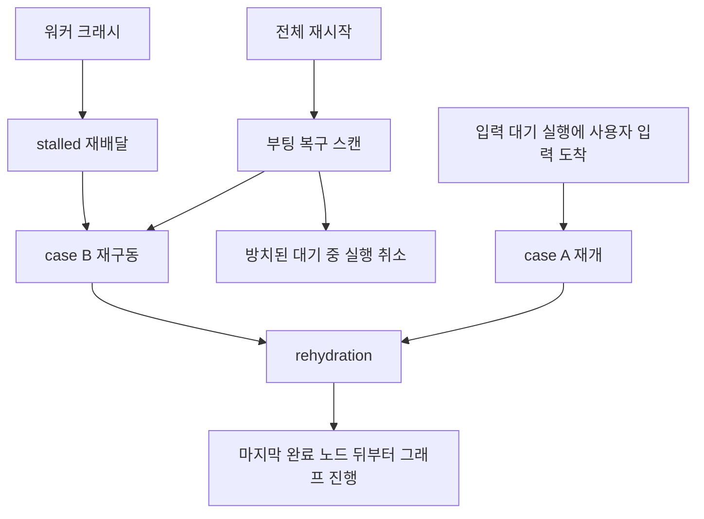

> 구현 상태: 부분 구현 · 원문: `spec/5-system/4-execution-engine.md` (§7.1–§7.5, §11, Rationale), `spec/data-flow/3-execution.md` (§3.3, Rationale) · 용어: [용어 사전](../CLE-GLOSSARY.md)

## 개요

서버 인스턴스가 죽거나 다시 시작되거나 배포로 내려가도 실행(Execution, `execution`)을 잃지 않고 이어 가는 규칙을 정한다. 다루는 것은 네 가지다.

- **재구동(re-drive)**: 실행 중(`running`)이던 세그먼트를 다른 워커가 다시 굴린다. 운영 중 워커 크래시는 stalled 재배달(stalled redelivery)이, 전체 재시작은 부팅 복구 스캔(`recoverStuckExecutions`)이 맡는다.
- **체크포인트와 멱등성**: 무엇을 남겨 두기에 이어 갈 수 있는지, 같은 턴이나 세그먼트가 두 번 돌지 않게 무엇이 막는지.
- **rehydration(`rehydrateContext`)**: DB 에 남긴 내용으로 실행 컨텍스트를 되살리는 단일 경로. 입력 대기 실행의 재개(resume)와 크래시 재구동이 함께 쓴다.
- **안전 종료(graceful shutdown)**: SIGTERM 을 받았을 때의 절차.

범위 밖:

- 시작 큐·재개 큐의 계약, 재개 명령 발행과 사전 검증, ack 에러 표면은 [큐 워커와 동시 실행 제한](CLE-EXEC-WORKER.md) 이 정한다.
- 실행과 노드 실행의 상태 전이, 블로킹·재개 계약, AI 재개 체크포인트(`_resumeCheckpoint`)는 [실행 상태 머신과 대기·재개](CLE-EXEC-STATE.md) 가 정한다.
- park 때 무엇을 커밋하는지(저장 전략)는 [실행 컨텍스트](CLE-EXEC-CONTEXT.md), 노드 실행 순서 로그(`ExecutionNodeLog`) 스키마는 [실행 데이터와 흐름](CLE-EXEC-DATA.md) 에 있다.
- 노드 취소(`abortSignal`)와 사용자 중지의 관측은 [노드 취소](CLE-EXEC-CANCEL.md) 가 정한다.
- Redis 키(`exec:recover:lock` 등)와 DLQ 모니터 설정은 [비동기 큐와 Redis 키 목록](../CLE-PLAT/CLE-PLAT-QUEUE.md) 에 있다.

## 복구 경로 한눈에

| 상황 | 트리거 | 대상 | 처리 | 끝내지 못할 때 |
| --- | --- | --- | --- | --- |
| 운영 중 워커 크래시 | stalled 재배달(PR4) | stall 된 세그먼트 작업의 실행(아직 `running`) | 같은 jobId 로 1회 재배달 → case B 재구동 | 재배달 소진: `failed` + `WORKER_HEARTBEAT_TIMEOUT` |
| 전체 재시작, Redis 비영속, 작업 유실 | 부팅 복구 스캔(PR3) | `running` 이고 `started_at` 이 30분보다 오래된 실행 | row 단위 원자 re-claim → case B 재구동 | 재구동 불가: `RESUME_CHECKPOINT_MISSING` |
| 작업을 잃은 대기 중 실행 | 같은 부팅 복구 스캔 | `pending` 이고 `queued_at` 이 큐 대기 한도(5분)보다 오래된 실행 | `cancelled` + `EXECUTION_QUEUE_WAIT_TIMEOUT` | 없음 |
| 입력 대기 중 재시작 | 사용자 입력 도착 | 입력 대기 실행 | case A rehydration 재개 | `cancelled` + `RESUME_*` |
| 배포·정상 종료 | SIGTERM | 이 인스턴스의 진행 중 노드 실행 | 유예 시간 동안 완료 대기 | `failed` + `SERVER_INTERRUPTED` |

입력 대기(`waiting_for_input`) 실행은 어느 복구 트리거도 건드리지 않는다. 사용자 입력은 며칠 뒤에 올 수 있다. 입력이 오면 rehydration 으로 재개한다.

그림은 복구 트리거가 rehydration 한 경로로 모이는 모습이다. case A 와 case B 는 도착 입력의 유무만 다르다.

## 크래시 재구동

크래시한 세그먼트는 두 트리거로 재구동한다. 둘 다 구현됐다.

### 운영 중 stalled 재배달

2026-07-04 PR4 에서 구현됐다.

- 시작 큐(`execution-run`) 설정은 `maxStalledCount: 1`, `stalledInterval: 30초` 다.
- 워커가 크래시하면 작업이 stall 된다. BullMQ 가 **같은 jobId 로 1회** 다른 워커에 자동 재배달한다.
- 작업을 받은 워커의 `runExecutionFromQueue` 는 실행이 이미 `running` 인 것을 보고 `running` 분기로 들어간다. `recordRunningSegmentStart` 와 `redriveStuckExecution` 으로 [case B](#두-진입-경우) 재구동을 한다. 완료 노드는 건너뛰므로 멱등이다.
- 검출 대상은 세그먼트 작업(`execution-run` / `execution-continuation`)뿐이다.
- 재배달을 소진하면 `onFailed → finalizeStalledExhausted` 가 `status='running'` 조건으로 실행을 `failed` + `error.code='WORKER_HEARTBEAT_TIMEOUT'` 으로 마감한다.
- **이 마감은 단일 트랜잭션이다(2026-08-15).** 실행을 `failed` 로 쓰는 UPDATE 와 자식 `running` 노드 실행을 함께 마감하는 cascade UPDATE 를 `dataSource.transaction` 하나로 묶는다. 이벤트는 커밋 뒤에 발행한다. 같은 두 테이블 쓰기를 하는 `cancelParkedExecution` 과 `markWebChatIdleTimeout` 도 같은 방식이다.
- 관측은 시작 큐 DLQ 모니터(`ExecutionRunDlqMonitorService`)가 한다. 설정은 [비동기 큐와 Redis 키 목록](../CLE-PLAT/CLE-PLAT-QUEUE.md) 에 있다.

### 부팅 복구 스캔으로 재구동

2026-07-04 PR3 에서 구현됐다.

- 서버가 뜰 때 `recoverStuckExecutions()` 가 `status='running' AND started_at < now() - STUCK_RECOVERY_STALE_MS(30분)` 인 실행을 찾는다.
- 일괄 `failed` 로 표시하지 않는다. 행마다 **원자 re-claim** 을 한다. `UPDATE … SET started_at=now() WHERE status='running' AND started_at < :threshold RETURNING` 에서 affected=1 인 인스턴스만 그 실행을 맡는다.
- 가진 실행을 [case B](#두-진입-경우) 로 재구동한다. rehydrate 한 뒤 마지막 완료 노드 다음부터 `runNodeDispatchLoop` 로 진행한다.
- **PR4 뒤에도 은퇴하지 않고 함께 둔다.** stalled 재배달은 stall 된 작업이 있을 때만 동작한다. 전체 재시작(모든 워커가 동시에 내려감), Redis 비영속(작업 자체 소실), 작업 유실은 stall 된 작업이 없어 이 스캔이 맡는다.
- 같은 스캔이 작업을 잃은 대기 중 실행도 회수한다. 규칙은 [부팅 복구 스캔](#부팅-복구-스캔) 에 있다.

### heartbeat 채널을 두지 않는다

워커가 5초마다 신호를 보내고 중앙에서 검사하는 heartbeat 채널은 **만들지 않는다.** 세그먼트가 이미 BullMQ 작업이므로 워커 크래시는 곧 작업 stall 이다. BullMQ 내장 stalled 검출이 그 작업을 다른 워커에 다시 배달한다. 그 워커가 rehydration 과 체크포인트로 세그먼트를 이어 간다. 별도 heartbeat 인프라는 이 메커니즘과 기능이 겹친다. 근거는 [Rationale](#rationale) 의 "워커 크래시 복구를 stalled 재배달로 일원화" 에 있다.

### 경계와 마감

| 항목 | 동작 |
| --- | --- |
| 입력 대기 | 대상이 아니다. 큐 작업이 없으므로 stall, 재발행, 만료 어디에도 걸리지 않는다. 기한 없이 park 한다. |
| 재구동 자체가 불가 | 체크포인트가 없거나 손상됐으면 `RESUME_CHECKPOINT_MISSING` 으로 끝낸다([rehydration 실패](#rehydration-실패)). |
| 계속 실패하는 poison 세그먼트 | 부팅 트리거는 부팅마다 최대 1회라 저절로 속도가 제한된다. 운영 중 stalled 트리거는 `maxStalledCount:1` 이라 1회 재배달 뒤 `WORKER_HEARTBEAT_TIMEOUT` 으로 DLQ 에 간다. 누적되면 실행 시간 한도 초과(`EXECUTION_TIME_LIMIT_EXCEEDED`)가 2차 경계로 작동한다. 이 2차 경계는 best-effort 다(시간이 덜 세어질 수 있다, [Rationale](#rationale) 참조). |
| stalled 재배달 소진 | `onFailed → finalizeStalledExhausted` 가 `status='running'` 조건부로 실행을 `failed` + `WORKER_HEARTBEAT_TIMEOUT` 으로 마감한다. 부팅 재구동은 이 코드를 쓰지 않는다. |

### 남은 zombie race

정상 크래시는 BullMQ lock 만료 기반 재배달로 막힌다. 원래 워커가 lock 만료 뒤 되살아나는 zombie(hang 이나 네트워크 단절 뒤 부활)는 완전히 배제되지 않는다. 그러면 stale 판정 때문에 한 실행의 세그먼트 두 개가 동시에 돌 수 있다. 피해 범위는 다음으로 묶인다.

- 부팅 트리거는 부팅마다 1회, 운영 중 stalled 는 `maxStalledCount:1` 이라 어느 쪽도 빠르게 반복 재구동하지 않는다.
- stale 임계가 30분이라 짧은 hang 은 부팅 스캔 대상이 아니다.
- 노드 실행마다 `completed` 여부를 다시 보고 건너뛰므로 두 번 돌아도 완료 노드는 다시 실행되지 않는다.

이 노출은 예전의 실패 처리 방식에도 똑같이 있었으므로 새 회귀가 아니다. 완전한 차단은 세그먼트 시작 시각이나 소유자 토큰을 영속하는 후속 작업에 달려 있다.

## 부팅 복구 스캔

부팅 복구 스캔(`recoverStuckExecutions`)은 `onApplicationBootstrap` 에서 한 번 돈다. 여러 인스턴스가 함께 뜰 때 다른 인스턴스가 정상 처리 중인 실행을 잘못 건드리지 않도록 보수적으로 막는다.

- **분산 lock**: `redis SET 'exec:recover:lock' <hostname:uuid-token> EX 60 NX`. TTL 은 60초다. lock 을 못 잡은 인스턴스는 건너뛴다. 컨테이너끼리 PID 가 겹쳐도 `hostname + UUID` 로 주인을 가린다. 키 목록에서의 등재는 [비동기 큐와 Redis 키 목록](../CLE-PLAT/CLE-PLAT-QUEUE.md) 에 있다.
- **명시적 해제**: 작업이 끝나면 주인을 확인하는 Lua script 로 lock 을 바로 푼다. TTL 만료를 기다리지 않고 다음 인스턴스가 처리할 수 있다. 주인이 다르면(이미 만료돼 다른 인스턴스가 잡은 lock) 절대 지우지 않는다.
- **두 겹의 보호**: 전역 부팅 lock 은 스캔이 동시에 시작되는 것을 막는다. 행 단위 `started_at` 조건부 re-claim 은 그 안의 추가 방어다. 늦은 부팅 스캔이나 lock 만료 경합으로 스캔이 겹쳐도 한 행이 두 번 재구동되지 않는다. 두 장치는 층이 달라 함께 둔다.

| 상태 | 임계 | 기준 컬럼 | 처리 |
| --- | --- | --- | --- |
| `running` | `STUCK_RECOVERY_STALE_MS`(30분) | `started_at` | row 단위 re-claim 뒤 case B 재구동. 부분 완료 노드라는 진행 흔적이 있다. |
| `pending`(작업을 잃은 것) | `EXECUTION_QUEUE_WAIT_TIMEOUT_MS`(5분) | `queued_at` | `recoverOrphanPendingExecutions` 가 `markQueueWaitTimeout`(조건부 UPDATE `WHERE status='pending'`)으로 `cancelled` 마감. `error.code='EXECUTION_QUEUE_WAIT_TIMEOUT'`, `cancelledBy='timeout'`, `releaseExecutionRouting`. 작업을 가져갈 때의 큐 대기 한도 처리와 같다. |
| `waiting_for_input` | 없음 | 없음 | 무시한다. 기한 없이 보존하고 입력이 오면 rehydration 으로 재개한다. |

- 작업을 잃은 대기 중 실행은 동시 실행 제한에 걸려 지연 재발행된 작업이 Redis 비영속이나 eviction 으로 사라진 경우다. 큐 대기 한도는 작업을 가져갈 때만 검사하므로 이런 실행은 그 검사를 받지 못한다. 규칙 전체는 [큐 워커와 동시 실행 제한](CLE-EXEC-WORKER.md) 의 동시 실행 제한 절에 있다.
- `queued_at IS NULL`(V104 이전 행)은 저절로 빠진다.
- 스캔 시점에 아직 한도 안쪽인 작업 없는 대기 중 실행은 다음 부팅 스캔에서 한도를 넘었으면 회수한다. 드문 경우이고 부팅 때만 도는 best-effort 다.
- 동시에 소비자가 그 실행을 `running` 으로 들이거나 취소해도 affected=0 으로 끝나 결과가 같다. `pending → running` 과 `pending → cancelled` 는 서로 배타적인 전이라 두 번 처리되지 않는다.
- 공개 웹채팅 위젯의 익명 토큰 영구 만료로 생긴 입력 대기 실행의 회수는 이 스캔이 아니라 EIA 계층의 반복 sweep 이 맡는다. 규칙은 [External Interaction API](../CLE-IX/CLE-EIA.md) 의 EIA-RL-07 에 있다. 기한 없는 보존이 지키는 정상 대기(입력이 실제로 올 실행)는 바뀌지 않는다.

## 체크포인트와 멱등성

### 체크포인트

노드가 완료될 때마다 체크포인트를 append-only 로 남긴다.

- 노드 실행 순서 로그(`execution_node_log`): 처리된 노드의 순서
- 완료 노드 실행의 `NodeExecution.outputData`: 노드별 출력
- 실행의 영속 컨텍스트: park 때 커밋하는 항목. 목록은 [실행 컨텍스트](CLE-EXEC-CONTEXT.md) 에 있다.

노드 실행 순서 로그의 스키마와 기록 시점은 [실행 데이터와 흐름](CLE-EXEC-DATA.md) 에 있다.

### 재구동 절차

크래시한 `running` 세그먼트(case B)는 다음 순서로 재구동한다.

1. 소유권을 얻는다. stalled 재배달은 BullMQ 가 같은 jobId 로 재배달한 작업을 받은 워커가, 부팅 복구 스캔은 `started_at` 조건부 re-claim 에서 affected=1 인 인스턴스가 맡는다.
2. `rehydrateContext` 가 같은 executionId 의 노드 실행 순서 로그로 `_executedNodes` Set 과 완료 노드 출력을 되살린다.
3. 도착한 입력이 없으므로 turn 핸들러(`dispatchResumeTurn`)를 거치지 않는다. `runNodeDispatchLoop` 를 마지막 완료 노드 다음부터 진행한다.
4. 완료 노드는 다시 실행하지 않는다(`_executedNodes` 기준).
5. 크래시 시점에 아직 완료되지 않은 노드는 다시 실행된다(at-least-once).
6. 재구동 도중 새 블로킹 노드에 닿으면 정상적으로 park 하고 세그먼트를 끝낸다.

이 절차는 노드 타입과 관계없다. `rehydrateContext` 와 `runNodeDispatchLoop` 가 이미 노드 타입을 가리지 않는다. 입력 대기 노드 재개(case A, `dispatchResumeTurn`)와 달리 도착 입력과 turn 핸들러를 거치지 않고 바로 그래프를 진행한다.

### 멱등성 계약

재개(case A)와 재구동(case B)에서 "같은 턴·세그먼트 이중 실행 0" 을 지키는 계약은 넷이다.

- **jobId 멱등**: 세그먼트·재개 작업의 jobId 는 `executionId`(시작 큐) 또는 `executionId:nodeExecutionId:seq`(재개 큐)다. BullMQ 가 중복 작업을 거른다.
- **재개 진입 원자 claim(affected=1)**: 입력 대기 재개는 `waiting_for_input → running`(`claimResumeEntry`)으로, 크래시 재구동은 `running → running` `started_at` 조건부 re-claim 으로 소유권을 얻는다. 둘 다 affected=1 인 워커나 인스턴스만 진행한다. `_retryState` 의 "affected=1 인 쪽만 진행" 방식을 일반화한 것이다.
- **완료 노드 미재실행(엔진 보장, exactly-once)**: 재개나 재구동 때 노드 실행 순서 로그와 완료 노드 출력으로 되살린 `_executedNodes` 로 완료 노드를 건너뛴다. 추가로 dispatch 직전 대상 노드 실행이 이미 `completed` 면 건너뛴다(메모리 Set 과 겹치는 DB 재확인 방어).
- **크래시 시점 미완료 노드는 at-least-once**: 크래시 때 아직 `completed` 가 아니던 노드는 재구동 때 **다시 실행된다.** 그 노드의 외부 부수효과(`send_email`, HTTP POST 같은 통합 쓰기)가 이미 일어났는지 엔진은 알 수 없다. 그래서 exactly-once 를 보장하지 않는다. 외부 API 를 부르는 통합 노드의 멱등성은 노드 설정에서 관리한다(idempotency key 등). 엔진 보장은 "완료 노드 미재실행" 까지다. 분산 트랜잭션 없이 무손실로 이어 가려면 피할 수 없는 대가다.
  - **남은 행 마감**: 다시 실행은 **새 노드 실행 행**으로 한다. 크래시 때의 옛 `running` 노드 실행 행은 case B 재구동에 들어갈 때 `failed` 로 마감한다(`failOrphanRunningNodeExecutions`). 완료 노드는 `completed` 라 대상이 아니다. 이 마감은 부모 실행이 끝난 뒤에도 `running` 노드가 타임라인과 진행률 집계에 남지 않게 한다.
  - **적용 범위**: 이 마감은 **case B 재구동에 들어가는 시점에만** 돈다. 마지막 턴 재시도(`retry_last_turn`)의 2차 claim 이 버려서 남는 행은 대상이 아니다. 그때 실행은 이미 `failed` 로 끝나 있기 때문이다. 자세한 내용은 [실행 상태 머신과 대기·재개](CLE-EXEC-STATE.md) Rationale 의 "마지막 턴 재시도에 배달 단위 claim 을 둔다" 에 있다.

## rehydration

### 두 진입 경우

rehydration 은 두 트리거로 들어온다. 공통 기반은 같다. `rehydrateContext` 로 DB 에서 컨텍스트를 손실 없이 되살린다. affected=1 원자 claim 으로 소유권을 얻는다. `runNodeDispatchLoop` 로 진행한다. 트리거와 도착 입력의 유무만 다르다.

- **case A, 입력 대기 노드 재개**: 입력 대기 상태에서 인스턴스가 내려간 뒤 **사용자 입력이 도착**한다. BullMQ 가 임의 인스턴스에 재개 큐 작업을 배달한다. `waiting_for_input → running` 원자 claim(`claimResumeEntry`) 뒤 rehydrate 한다. 도착 입력을 `dispatchResumeTurn`(form·button·ai turn 핸들러)으로 처리한 다음 진행한다.
- **case B, 크래시·재시작 `running` 세그먼트 재구동**: 도착 입력도 입력 대기 노드도 **없다.** 두 트리거가 같은 재구동 로직으로 들어온다. 부팅 복구 스캔은 `running → running` `started_at` 조건부 re-claim 으로, 운영 중 stalled 재배달은 `runExecutionFromQueue` 가 `status==='running'` 을 보고 `recordRunningSegmentStart` + `redriveStuckExecution` 으로 들어온다. 이후는 [재구동 절차](#재구동-절차) 와 같다.

모든 재개는 rehydration 한 경로로 간다. 같은 인스턴스가 우연히 작업을 가져가도 마찬가지다. park 에서 코루틴을 바로 풀어 주므로 in-process resolver 가 없기 때문이다(Phase B).

### 재개 절차

case A 는 다음 순서로 재개한다. case B 는 7단계의 "도착 입력으로 turn 핸들러 호출" 만 "turn 핸들러를 건너뛰고 진행" 으로 바꾸고 나머지(claim, rehydrate, routing 재등록, 진행)를 공유한다.

1. 클라이언트의 재개 명령이 controller 나 WS gateway 에 들어오고 재개 큐에 들어간다. 발행 쪽 규칙은 [큐 워커와 동시 실행 제한](CLE-EXEC-WORKER.md) 에 있다.
2. 임의 워커가 작업을 가져가 **재개 진입 원자 claim** 을 한다. `waiting_for_input` 조건부 UPDATE 로 `running` 으로 바꾼다. affected=0 이면 작업을 ack 하고 버린다([재개 진입 원자 claim](#재개-진입-원자-claim)).
3. **outbound routing context 를 다시 등록한다**(`triggerId` 와 `workflowId` 가 있을 때). 영속된 실행 행의 `triggerId` / `workflowId` / `input_data.chatChannel` 로 `execute()` 최초 등록과 같은 형태로 등록한다(CCH-AD-05). 등록이 실패해도 warn 로그만 남기고 rehydration 은 계속한다(best-effort). 종료 이벤트를 발행할 때 저절로 해제된다.
4. `NodeExecution.outputData` 에서 원본 설정(`rawConfig`) 스냅샷과 멀티턴 AI 재개 체크포인트(`_resumeCheckpoint`)를 읽는다.
5. `Execution.conversation_thread` 에서 대화 스레드 스냅샷을 손실 없이 되살린다. 영속 규칙은 [대화 스레드](../CLE-IX/CLE-IX-THREAD.md) 에 있다.
6. `Execution.user_variables` 에서 사용자 정의 변수를 되살린다. 시스템 예약 변수(`__*`)는 여기 없고 따로 다시 넣는다.
7. 실행 컨텍스트를 **항상 DB 에서** 다시 만든다. park 가 세그먼트 종료이므로 메모리의 컨텍스트는 이미 사라졌다. Redis 컨텍스트 저장소도 없다. 같은 인스턴스가 우연히 컨텍스트를 아직 들고 있으면(`getContext` hit) 다시 쓰지만 이는 최적화일 뿐 정합성 전제가 아니다. 대화 스레드와 변수는 위 컬럼에서 되살린다. 완료 노드 출력은 노드 실행 순서 로그와 `NodeExecution.outputData` 에서 되살린다.
8. `driveResumeAwaited`(최상위, await)나 `driveCallStackResume`(중첩)가 도착 입력으로 그 노드의 turn 핸들러를 부른다. form·buttons·ai 분기는 단일 진입점 `dispatchResumeTurn`(순서가 있는 `resumeTurnRegistry`, `resume-turn-dispatch.ts`)이 먼저 맞는 항목으로 보낸다. form 은 `processFormResumeTurn`, button 은 `processButtonResumeTurn`, AI 는 `handleAiResumeTurn` 을 거쳐 `processAiResumeTurn` 으로 간다. 메모리 resolver 등록이나 replay 없이 바로 구동한다.
9. 이후 그래프를 평소처럼 진행한다(`runNodeDispatchLoop`).

### 중첩 서브 워크플로우 재개

park 한 노드가 중첩 서브 워크플로우(`executeInline`) 안에 있으면 `Execution.resume_call_stack` 이 NULL 이 아니다. 이때는 단일 수준 재진입 대신 `driveCallStackResume` 이 호출 스택(`resume_call_stack`)을 따라 재개한다. 2026-06-06 PR-B2b 에서 구현됐다. 호출 체인은 park 커밋 때 영속되며 컬럼은 V087 이다.

1. **버전 확인**: `resume_call_stack.version` 이 `CALL_STACK_SCHEMA_VERSION` 보다 크면 `RESUME_INCOMPATIBLE_STATE` 로 안전하게 끝낸다. 롤링 배포 중 옛 인스턴스가 새 형식을 가져가는 경우를 막는다. AI 재개 체크포인트와 같은 방식이지만 **서로 다른 상수**다.
2. **frame 확인**: frame 마다 `workflowId` · `invokerNodeId` 가 비어 있지 않은 문자열인지 본다. 하나라도 비면 조회와 상태 전이 전에 `RESUME_CHECKPOINT_MISSING` 으로 실행을 취소한다. 두 값은 재개 조회의 조건이라 비면 조회가 일반 예외로 끝나 원인이 흐려진다([데이터 모델 개요 §조회 조건의 null · undefined](../CLE-PLAT/CLE-PLAT-DATA.md#조회-조건의-null--undefined)).
3. **frame 단위 재진입(가장 안쪽부터, 바깥으로)**: `executeInline` 을 다시 부르지 않는다. `driveCallStackResume` 이 `frames` 를 직접 구동한다.
   - **가장 안쪽 frame**: 입력 대기 노드의 턴을 처리한다. 최상위와 같이 `dispatchResumeTurn` 으로 보낸다. 이어서 `driveResumeFrame` 이 그 frame 의 나머지 그래프를 `runNodeDispatchLoop` 로 진행한다.
   - **바깥 frame**: 안쪽 frame 이 끝나면 그 서브 워크플로우 출력을 부모 frame 의 호출 노드(Workflow 노드) 출력으로 넣고(`injectInvokerOutput`) `driveResumeFrame` 으로 부모 frame 의 나머지를 진행한다. `i = frames.length-2` 부터 `i=0` 까지 되풀이한다.
   - **최상위 진행**: 모든 frame 이 끝나면 `frames[0].invokerNodeId` 노드 출력을 넣고 최상위 그래프의 나머지를 진행한 뒤 실행을 `completed` 로 마감한다.
   - 진행 중에 새 블로킹 노드가 park 하면 `executeInline` 이 `ParkReleaseSignal` 을 던지고 `runNodeDispatchLoop` 가 `{parked:true}` 로 받아 세그먼트를 끝낸다. 실행은 입력 대기로 남고 새 호출 스택을 다시 영속한다. 다음 재개가 같은 절차로 이어 간다.
   - **완료 노드 목록**: 각 frame 의 완료 노드 집합(`executedNodes`)은 따로 노드 실행 순서 로그에서 읽지 않는다. `rehydrateContext` 가 되살린 `context._executedNodes` 를 다시 쓴다. 그 Set 도 같은 executionId 의 노드 실행 순서 로그에서 왔으므로 결과는 같다. 완료 노드는 다시 실행하지 않는다.

**선형 스택 불변식**: 컨테이너(Loop/ForEach/Map/Parallel) 본문에 블로킹 노드를 둘 수 없으므로 `frames` 는 항상 **선형**이다(분기나 반복 회차 상태가 없다). 금지 규칙은 [컨테이너 실행](CLE-EXEC-CONTAINER.md) 에 있다. 깊이는 `recursionDepth` 한도 안이다. `resume_call_stack IS NULL`(최상위 park, park 한 적 없는 실행, 배포 이전 행)이면 단일 수준 절차로 재개한다.

`exec-park D6` 라는 이름은 `exec-park-durable-resume` plan 의 결정 D6(중첩 호출 스택 영속)이다. AI 노드 문서의 같은 이름 `D6`(AI 노드 출력 경로 단일화)와 관계없다.

### 재개 진입 원자 claim

- BullMQ jobId 가 멱등 키다. 같은 jobId 의 중복 처리는 BullMQ 가 막는다.
- 워커는 처리 전에 재개 진입을 **DB 원자 claim** 으로 얻는다. 대상 행을 `waiting_for_input` 조건으로 `running` 으로 바꾸는 단일 UPDATE(`… WHERE status='waiting_for_input' RETURNING`)를 실행한다. **affected=1** 인 워커만 재개한다. **affected=0**(다른 워커가 이미 얻었거나 끝남)이면 바로 ack 하고 버린다.
- 이 claim 은 BullMQ 멱등성을 보완해 **정상 경로의 race 까지 기계적으로 막는다.** 비원자 SELECT 재확인과 달리 확인과 실행 사이 틈이 없다. 그래서 여러 인스턴스(인스턴스마다 동시성 1이어도 인스턴스끼리는 병렬)와 재개 큐 동시성 상향 양쪽에서 "같은 턴 이중 실행 0" 불변식이 유지된다.
- `waiting_for_input → running` 전이는 실행과 짝 노드 실행을 **단일 트랜잭션**으로 바꾼다. 원자성 규칙은 [실행 상태 머신과 대기·재개](CLE-EXEC-STATE.md) 에 있다.
- claim 을 얻은 **뒤**의 실패는 두 가지로 나뉜다.
  - **rehydration 과정 실패**(체크포인트 없음·손상, 시도 소진 등): [rehydration 실패](#rehydration-실패) 의 `RESUME_*` 종결(실행 `cancelled` + 노드 실행 `failed`)로 원자 마감한다.
  - **턴 처리 실패**(재개한 턴의 LLM throw: 429, timeout, connection): 노드 실행을 `running → failed` 로 끝낸다. claim 으로 이미 `running` 이므로 직접 `waiting_for_input → failed` 가 아니다.
- 두 경우 모두 `running` 을 남기지 않는다. claim 뒤 워커 크래시로 예외적으로 남은 `running` 행은 부팅 복구 스캔이 회수한다. 정상 흐름에서는 claim 바로 뒤에 rehydration 이 이어지므로 30분 stale 창에 노출되는 것은 비정상 경우뿐이다.
- **case B 원자 re-claim**: 위 claim 은 입력 대기 재개를 전제로 한다. 크래시 재구동은 대상이 이미 `running` 이므로 부팅 복구 스캔이 **`running → running` `started_at` 조건부 re-claim**(`UPDATE … SET started_at=now() WHERE status='running' AND started_at < :threshold RETURNING`)으로 소유권을 얻는다. 두 인스턴스(예: 늦은 부팅 스캔이 전역 lock 만료와 겹침)가 같은 stale 행을 동시에 잡아도 affected=1 인 쪽만 재구동한다. 상태 값이 바뀌는 것이 아니라 소유권(`started_at`)이 옮겨 가는 것이라 상태 전이표는 바뀌지 않는다. claim 뒤 재구동 실패는 case A 와 같이 `RESUME_*` 종결로 원자 마감한다(**claim 뒤 `running` 잔류 금지**). 남은 zombie race 는 [남은 zombie race](#남은-zombie-race) 에 있다.
- 재개 큐 작업 옵션(`removeOnComplete: true`, `removeOnFail: false`, `attempts: RESUME_BULLMQ_ATTEMPTS`)과 DLQ 처리는 [큐 워커와 동시 실행 제한](CLE-EXEC-WORKER.md) 에 있다. 모든 시도가 실패하면 실행을 `cancelled` + `error.code='RESUME_FAILED'` 로 표시한다. 실패 작업을 남기므로 DLQ 적재량을 관측할 수 있다.

### rehydration 실패

재개 진입 claim 을 얻은 **뒤** 아래 실패가 나면 `running` 으로 둔 상태를 그대로 두지 않는다. 반드시 `RESUME_*` 종결(실행 `cancelled` + 노드 실행 `failed`)로 원자 마감한다. 빠뜨리면 실행이 `running` 에 묶인다. 턴 처리 자체의 LLM throw 는 따로 `running → failed` 로 끝낸다.

| 경우 | 처리 |
| --- | --- |
| `NodeExecution.outputData` 가 없거나 손상 | 실행 `cancelled` + `error.code='RESUME_CHECKPOINT_MISSING'`, 짝 노드 실행 `failed` |
| 중첩 재개의 호출 스택이 손상: frame 목록이 비었거나 frame 의 `workflowId` · `invokerNodeId` 가 비었거나 그 호출 노드 · 시작 노드가 그래프에 없음 | 실행 `cancelled` + `error.code='RESUME_CHECKPOINT_MISSING'`, 짝 노드 실행 `failed` |
| BullMQ 시도 소진 | 실행 `cancelled` + `error.code='RESUME_FAILED'`, 짝 노드 실행 `failed` |
| 멀티턴 AI 노드의 AI 재개 체크포인트가 **없음**(이 기능 배포 전에 들어간 입력 대기 행), **손상**(schema drift 로 `buildRetryReentryState` 재구성 실패), **미래 버전**(`schemaVersion` 이 현재 코드 `CHECKPOINT_SCHEMA_VERSION` 보다 큼, 롤링 배포 중 옛 인스턴스가 새 형식을 가져감) | 실행 `cancelled` + `error.code='RESUME_INCOMPATIBLE_STATE'`, 짝 노드 실행 `failed`. 체크포인트가 있고 버전이 맞으면 재구성에 성공해 재개하며 이 에러는 나지 않는다. |

- 세 경우 모두 워커 쪽 **비동기**(enqueue 뒤) 실패다. 동기 ack 가 아니라 뒤따르는 `execution.cancelled` 이벤트(`error.code = RESUME_*`)로 사용자에게 알린다. 동기 ack 에 실리는 실패는 발행 전 사전 검증(`INVALID_EXECUTION_STATE`)뿐이다. 규칙은 [큐 워커와 동시 실행 제한](CLE-EXEC-WORKER.md) 에 있다.
- 채팅 채널 어댑터는 세 경우 모두(`RESUME_*` 접두 코드 전부) raw 에러 대신 대화 세션 만료 안내(`sessionExpired`)를 보낸다. 사용자의 다음 메시지는 새 대화로 시작한다(텔레그램 등). 렌더 매핑은 [채팅 채널 어댑터 규약](../CLE-CHAT/CLE-CHAT-ADAPTER.md) 이 정한다.
- 세 종결의 상태 분류(실행 `cancelled`, 노드 실행 `failed`)의 결정 근거는 [실행 상태 머신과 대기·재개](CLE-EXEC-STATE.md) 의 Rationale 에 있다.
- **채널 전달의 선행 조건**: `RESUME_*` 안내가 외부 채널(텔레그램 등)에 실제로 닿으려면 재개 절차 3단계(routing context 재등록)가 먼저 돼 있어야 한다. 재개는 다른 프로세스나 재시작 뒤의 워커가 가져가므로 routing context 가 사라진 상태다. 재등록 없이 `cancelled` 이벤트를 발행하면 conversationKey 가 없어 채널 dispatcher 가 outbound 를 건너뛴다.

### 재시도 층의 합산

- 재개 큐의 `attempts: 3` 은 **큐 전달 층**의 재시도다. 핸들러를 부르기 직전 단계의 인프라 재시도다.
- AI 핸들러의 재시도(예: 2회)는 **핸들러 안 LLM 호출 층**의 재시도다. 두 층은 따로 적용된다. 노드 재시도 규칙은 [노드 에러 처리 정책](../CLE-NODE/CLE-NODE-ERROR.md) 에 있다.
- **최악의 경우**: 재개 큐가 시도마다 다른 인스턴스로 배달하고 그 인스턴스가 LLM 호출 단계에서 죽으면 큐 3회 × LLM 2회 = 최대 6회 LLM 호출이 생길 수 있다. `NodeExecution.status` 확인이 결과 중복 저장을 막지만 **호출 비용은 생긴다.**
- 운영 관측: 재개 큐 DLQ 적재량이 임계를 넘으면 경고 로그를 남긴다. 임계는 재시도 비율이 아니라 DLQ(`failed`) 작업 건수다(`CONTINUATION_DLQ_ALARM_THRESHOLD`, 기본 50). 주기와 나머지 설정은 [비동기 큐와 Redis 키 목록](../CLE-PLAT/CLE-PLAT-QUEUE.md) 의 DLQ 모니터가 정한다.
- **AI 대화 노드의 비용**: rehydration 자체는 LLM 을 부르지 않는다. 사용자 메시지가 도착한 뒤 다음 턴부터 LLM 을 부른다. BullMQ 재시도가 메시지를 중복 배달해도 위 멱등성 확인이 LLM 중복 호출을 막는다. 핸들러 실행 중 워커가 죽는 경우는 위 최악의 경우에 해당한다.

## 안전 종료

SIGTERM 을 받았을 때의 절차다. k8s 재배포, Docker Compose `docker compose down` 등 모든 정상 종료에 적용한다.

1. **새 실행 시작을 거부한다.** 새 실행을 시작하는 HTTP 진입점(`POST /api/workflows/:id/execute`, 단일 노드 실행 `POST /api/workflows/:id/nodes/:nodeId/execute`)이 **503 Service Unavailable** 로 응답한다. 본문은 표준 에러 응답 봉투(`{ error: { code: 'SERVER_SHUTTING_DOWN', message: '...' } }`)이고 `Retry-After: <ceil(SIGTERM_GRACE_MS / 1000)>` 헤더를 함께 싣는다. 에러 응답 봉투의 기준은 [에러 응답과 클라이언트 처리](../CLE-API/CLE-API-ERROR.md) 다. 로드 밸런서 drain 동안 트래픽은 다른 인스턴스로 간다.
   - 실행 시작은 REST 로만 하므로 이 두 진입점 거부로 완결된다. WebSocket `execution.start` 는 비채택(won't-do)으로 끝났다(REST 로 대체, 핸들러 없음). 근거는 [WebSocket 이벤트와 명령](../CLE-API/CLE-API-WS-EVENTS.md) 에 있다.
2. `execution-run` / `execution-continuation` / `background-execution` 의 진행 중 작업을 처리하는 워커는 현재 세그먼트(노드)를 완료까지 진행한다. 새 작업은 가져가지 않는다. 한 세그먼트 안의 노드 dispatch 는 큐를 거치지 않는 in-process 반복문이다.
3. **입력 대기 실행은 건드리지 않는다.** DB 상태를 그대로 둔다. park 에서 이미 메모리를 비웠으므로 잃는 것이 없다. 사용자 입력이 오면 rehydration 으로 재개한다.
4. **실행 중 노드**는 다음과 같이 처리한다.
   - `SIGTERM_GRACE_MS`(기본 30초)까지 완료를 기다린다.
   - 완료하면 평상시 흐름대로 다음 노드로 진행한다. 재개 큐가 영속이므로 이후 재개는 다른 인스턴스가 가져간다.
   - 완료하지 못하면 그 노드 실행을 `failed` + `error.code='SERVER_INTERRUPTED'` 로 표시한다. 실행은 노드의 에러 처리 정책에 따라 처리한다(원문: `stop` 이면 실행 `failed`, `continue` 면 다음 노드로 진행). 체크포인트 기반 재개로 다른 인스턴스가 미완료 세그먼트를 이어받을 수도 있다.
   - **현재 구현**: 정책 분기 없이 모두 `stop` 과 같이 처리한다(노드 실행과 실행 모두 `failed`). `continue` 분기는 미구현이다. `continue` 값의 정의가 갈린다. [미결 사항](#미결-사항) 참조.
5. `SIGTERM_GRACE_MS` 가 지나면 강제로 끝낸다.

**구현**: `ShutdownStateService.onApplicationShutdown` 이 종료를 처리한다.

- 노드 실행은 실행 시작 때 `ShutdownStateService.registerInFlight` 로 등록되고 끝날 때 해제된다(try 첫 줄과 finally).
- 종료 때는 **이 인스턴스가 추적 중인** 노드 실행과 실행만 대상으로 한다(`WHERE id IN (...)`). 유예 시간 동안 drain 을 기다리고 남은 것을 노드 실행과 실행 각각 원자 UPDATE 로 `failed` + `error.code='SERVER_INTERRUPTED'` 로 표시한다.
- 종료 중 들어온 새 실행은 503 + `Retry-After` 로 거부한다.

SIGTERM 종료를 `failed` 로 볼지 `cancelled` 로 볼지는 정의가 갈린다. [미결 사항](#미결-사항) 참조.

| 환경 변수 | 기본값 | 설명 |
| --- | --- | --- |
| `SIGTERM_GRACE_MS` | `30000`(30초) | k8s `terminationGracePeriodSeconds` 와 맞춰 설정한다. 셀프 호스팅 Helm Chart 권장값은 `terminationGracePeriodSeconds = ceil(SIGTERM_GRACE_MS / 1000) + 5` 다(5초는 readiness drain 여유). |

워커 동시성, 실행 시간 한도, 재개 큐 시도 횟수는 [큐 워커와 동시 실행 제한](CLE-EXEC-WORKER.md) 의 환경 변수 표에 있다.

## 미결 사항

- **SIGTERM 종료 상태 분류**: 엔진 원문 안전 종료 절은 유예 시간을 넘긴 노드 실행과 실행을 `failed` + `SERVER_INTERRUPTED` 로 마감하는 것을 확정 계약으로 적는다. 데이터 흐름 원문은 이것이 현재 구현일 뿐이고 `cancelled` 로 다시 정할지는 `plan/in-progress/spec-update-node-cancellation-shutdown-classification.md` 의 (a)/(b) 택일 결정에 달렸다고 적는다. 노드 취소 규약은 안전 종료를 `abortSignal` 생산자로 도입할 계획이라고 적는다. 그렇게 되면 노드가 `cancelled` 로 분류된다(관련: [노드 취소](CLE-EXEC-CANCEL.md), [실행 데이터와 흐름](CLE-EXEC-DATA.md)). 함께 추적 중인 실측 틈이 있다. 취소 확인 `assertExecutionNotCancelled` 가 `FAILED` / `SERVER_INTERRUPTED` 를 보지 못해 안전 종료가 표시한 상태를 dispatch 반복문이 바로 반영하지 못할 수 있다(`plan/in-progress/node-cancellation-residual-signal-propagation.md`). 결정이 `cancelled` 쪽으로 가면 이 틈의 처리도 바뀐다. 현재 구현은 `failed` + `SERVER_INTERRUPTED` 다. 결정 필요.
- **안전 종료의 `continue` 에러 처리 정책**: 안전 종료 절차는 노드 에러 처리 정책 값으로 `stop` / `continue` 를 쓴다. 노드 공통 정책 enum 은 `stop_workflow` / `skip_node` / `use_default_output` / `retry` / `route_to_error_port` 이고 `continue` 가 없다(관련: [노드 에러 처리 정책](../CLE-NODE/CLE-NODE-ERROR.md), [노드 포트와 설정 패널](../CLE-WF/CLE-WF-NODEPANEL.md)). 컨테이너 에러 처리 정책(`config.errorPolicy`)과도 이름이 겹친다. PR3 Rationale 도 "spec 의 'continue' 용어가 실제 enum 에 없다" 고 인정한다. 현재 구현은 정책 분기 없이 모두 `stop` 으로 처리한다. 어느 정책을 뜻했는지 정해야 한다.
- **rehydration 실패를 `cancelled` 로 두는 결정의 유지 여부**: 원문 근거 "재실행 UI 가 `cancelled` 상태에서 활성화된다" 는 재실행 문서와 맞지 않아 빠졌다. 남은 근거로 이분 결정을 유지할지는 [실행 상태 머신과 대기·재개](CLE-EXEC-STATE.md#미결-사항) 에서 다룬다.

## 구현 위치

- `codebase/backend/src/modules/execution-engine/**` (`recoverStuckExecutions`, `recoverOrphanPendingExecutions`, `rehydrateContext`, `redriveStuckExecution`, `driveCallStackResume`, `finalizeStalledExhausted`)
- `codebase/backend/src/modules/execution-engine/queues/execution-run.processor.ts` (stalled 재배달 설정과 소진 처리)
- `codebase/backend/src/modules/execution-engine/continuation/continuation-execution.processor.ts` (재개 큐 소비자, 취소 경로)
- `codebase/backend/src/modules/execution-engine/resume-turn-dispatch.ts` (재개 turn 분기)
- `codebase/backend/src/modules/execution-engine/park-entry-dispatch.ts` (park 진입 분기)
- `codebase/backend/src/modules/execution-engine/shutdown/shutdown-state.service.ts` (안전 종료)
- `codebase/backend/src/shared/execution-resume/**` (`ProcessTurnResult` 등 재개 공용 타입)

## Rationale

### 워커 크래시 복구를 stalled 재배달로 일원화 (2026-06-04 결정)

별도 heartbeat 채널(워커 5초 emit + 중앙 검사)을 **포기하고 BullMQ 내장 stalled 검출로 일원화**한다. 옛 초안의 "heartbeat 미응답으로 판정" 전제는 폐기했다. 세그먼트가 이미 BullMQ 작업이므로 워커 크래시는 곧 작업 stall 이다. BullMQ stalled 검출이 그 작업을 다른 워커에 다시 배달하고 그 워커가 rehydration 으로 세그먼트를 이어 간다. 별도 heartbeat 발신·검사 인프라는 이 메커니즘과 **기능이 겹쳐** YAGNI 다.

- stalled 재배달은 **세그먼트 작업에만** 걸린다. 입력 대기는 작업이 없으므로 stall, 재발행, 만료에 걸리지 않고 기한 없이 park 한다.
- 절대 시간 방식은 (a) 정상적으로 오래 도는 실행을 일찍 실패시키는 오탐과 (b) 입력 대기 실행을 일괄 종결하는 운영 회귀의 원인이었다. stalled 는 "워커가 실제로 죽었을 때만" 다시 배달하므로 둘 다 사라진다. 살아 있는 워커의 긴 세그먼트는 stall 로 판정되지 않는다.
- 부팅 복구 스캔의 "절대 시간 30분 일괄 실패" 는 PR3(2026-07-04)에서 제어된 재구동으로 바뀌었다. PR4(2026-07-04)에서 운영 중 즉시 재배달(`maxStalledCount:1`)이 더해졌다. 부팅 복구 스캔은 은퇴하지 않고 함께 둔다.
- `WORKER_HEARTBEAT_TIMEOUT` 코드는 유지하되 PR4 에서 뜻을 바꿨다. "30분 절대 stale" 이 아니라 "세그먼트가 stalled 재배달 시도를 모두 소진함(워커 쪽 최종 실패)" 이다. 부팅 재구동은 이 코드를 쓰지 않는다. 재구동이 불가하면 `RESUME_CHECKPOINT_MISSING` 이다.

### 크래시 세그먼트는 실패 대신 제어된 재구동 (PR3, 2026-07-04)

크래시나 재시작으로 멈춘 `running`(입력 대기가 아닌) 세그먼트를 부팅 복구 스캔이 원자 re-claim 한 뒤 case B rehydration 으로 **재구동**하도록 바꿨다. 옛 "일괄 `failed` 표시" 를 대체한다. 사용자 결정(2026-07-03): Q1 = 제어된 재구동(당시 BullMQ 자동 stalled 는 끔), Q2 = 에러 처리 정책 `continue` 는 미룸.

- **지금 복구 반복 재구동인 이유**: 체크포인트 기반 재개는 "재시작 때 `running` 을 체크포인트에서 이어 간다" 고 이미 약속했다. 그런데 부팅 복구 스캔이 반대로 **일괄 실패** 처리해 약속을 어기고 있었다. PR3 는 이 위반을 없앤다. 입력 대기 재개(`dispatchResumeTurn`)는 이미 모든 노드 타입으로 일반화돼 있었다. 크래시 세그먼트는 입력 대기가 아니라 dispatch 도중의 `running` 이라 turn 핸들러가 아닌 그래프 진행으로 재구동해야 했다. `rehydrateContext` 와 `runNodeDispatchLoop` 가 노드 타입을 가리지 않아 다룰 만했다. 노드 단위 큐를 다시 들이는 것이 아니며 "한 세그먼트 = 한 프로세스" 전제는 유지한다.
- **PR3 에서 stalled 자동 재배달을 켜지 않은 이유(PR4 로 분리)**: `maxStalledCount>0` 자동 재배달은 **poison 이나 비멱등 세그먼트를 운영 중 사람 없이 다시 실행**시킨다. 크래시 시점의 통합 노드 부수효과를 자동으로 불릴 위험이 있다. PR3 는 제어된 트리거(부팅 스캔)로 먼저 들어가 멱등 재구동 메커니즘과 경계를 검증했다.
- **세그먼트 직렬화 불변식 재검증(필수)**: 크래시 재구동은 원래 작업이 끝나지 않은 채 같은 실행에 새 세그먼트를 시작하는 재진입 경로다. 정상 경우(원래 워커가 정말 죽음)에는 `jobId=executionId` 중복 제거, `started_at` re-claim, 노드 실행별 `completed` 건너뛰기로 같은 턴 이중 실행 0 이 유지된다. 남은 zombie race 와 그 한계는 본문 [남은 zombie race](#남은-zombie-race) 에 있다.
- **종결 경계(무한 재구동 방지)**: 1차 경계는 실행 시간 한도가 아니라 **트리거 자체**다. 부팅 때 한 번 도는 스캔이므로 poison 세그먼트는 부팅마다 최대 1회만 재구동된다. 빠른 반복이 아니며 배포가 버그를 고칠 수도 있다. 실행 시간 한도(`active_running_ms` 누적)는 크래시 때 시간이 덜 세어지므로 **best-effort 2차** 경계로만 작동한다. rehydration 자체가 불가하면 `RESUME_CHECKPOINT_MISSING` 으로 끝낸다.
- **새 마이그레이션 없음**: re-claim 은 기존 `started_at`(부팅 복구 스캔 stale 판정과 같은 컬럼) 조건부 UPDATE 다. 완료 노드 건너뛰기는 기존 노드 실행 순서 로그(V035/V036), 2차 경계는 기존 `active_running_ms`(V083)를 쓴다.
- **at-least-once 경계**: 엔진은 완료 노드 미재실행(exactly-once)만 보장하고 크래시 시점 미완료 노드는 at-least-once 로 다시 실행한다. 통합 노드의 멱등을 노드 설정에 맡기는 기존 모델과 맞는다.
- **에러 처리 정책 `continue` 세그먼트 재개는 미룬다**: `execution-engine-residual-gaps.md` G2 의 세 장애물(에러 처리 정책 스키마 노출 선행 미충족, spec 의 `continue` 용어가 실제 enum 에 없음, 인스턴스 간 재개 인프라)은 크래시 재구동 인프라와 관계가 없다. PR3 는 토대(멱등 재구동)를 주지만 G2 자체는 별건이다.
- **기각한 대안**: (a) 새 owner·heartbeat 컬럼으로 정확히 크래시를 검출: 마이그레이션과 heartbeat 인프라 비용이 크고 BullMQ stalled 가 같은 역할을 표준으로 주므로 PR4 로 흡수했다. (b) 복구 반복문에 주기 스캔 추가: 부팅 트리거로 재시작 재개는 성립하고 운영 중 크래시는 PR4 stalled 가 본래 담당이라 범위 밖이다.

### 운영 중 stalled 자동 재배달은 한 번만 (PR4, 2026-07-04)

PR3 의 제어된 재구동으로 멱등 재구동 메커니즘을 검증한 뒤 운영 중 워커 크래시를 다른 워커가 바로 이어받는 **BullMQ 기본 stalled 재배달**을 켰다. 사용자 결정(2026-07-03): Q1 = 진행(횟수 제한), Q2 = 세그먼트 시작 시각 영속은 미룸(마이그레이션 없이).

- **기본 stalled 는 같은 jobId 재처리라 seq·재발행이 필요 없다**: 처음 스케치는 크래시 재개를 `<executionId>:run:<seq>` 재발행으로 그렸다. BullMQ stalled 검출은 lock 이 만료된 **같은 작업을 그대로 다시 처리**한다(새 발행이 아니다). 그래서 `exec:run:seq` 키는 PR4 에서도 쓰지 않고 jobId=executionId 를 유지한다. 스케치보다 단순해졌다. `runExecutionFromQueue` 는 다시 처리하는 작업의 실행이 이미 `running` 이면 case B 재구동으로 나눈다(`pending` = 첫 실행, 종료 상태 = ack 후 버림과 함께 세 갈래).
- **`maxStalledCount=1`(피해 범위를 묶는다)**: `maxStalledCount>1` 은 poison·비멱등 세그먼트를 운영 중 사람 없이 여러 번 다시 실행해 크래시 시점 통합 노드의 중복 부수효과를 키운다. 1이면 재배달은 정확히 1회다. 소진하면 `onFailed → finalizeStalledExhausted` 가 `status='running'` 조건부로 `failed` + `WORKER_HEARTBEAT_TIMEOUT` 으로 DLQ 에 보낸다. setup 단계 throw 경로는 이미 종료 상태라 affected=0 no-op 이다. 관측은 `ExecutionRunDlqMonitorService`(재개 큐 DLQ 모니터와 같은 구조, failed ≥ 임계 경고 + cooldown)가 한다.
- **부팅 복구 스캔은 은퇴하지 않는다**: stalled 재배달은 **stall 된 작업이 있을 때만** 동작한다. 전체 재시작(모든 워커가 동시에 내려가 재배달할 살아 있는 워커가 없음), Redis 비영속(작업 자체 소실), 작업 유실은 stall 된 작업이 없다. 그래서 부팅 때 한 번 도는 스캔을 둔다. 지식 저장소 파이프라인(`graph-extraction` stalled + `stuck-document-recovery` 부팅 스캔)도 두 메커니즘을 함께 두는 선례다.
- **DLQ 마감의 원자성(2026-08-15 원자화)**: `finalizeStalledExhausted` 는 실행 `FAILED` UPDATE 와 자식 `running` 노드 실행 cascade UPDATE **둘**을 쓴다. PR4 때는 둘이 각각 autocommit 이라 **일부만 커밋되면 자식이 영원히 `running` 으로 남을** 수 있었다. 같은 두 테이블 쓰기를 하는 `cancelParkedExecution` · `markWebChatIdleTimeout` 은 이미 `dataSource.transaction` 으로 원자화돼 있었고 **이 경로만 열려 있었다.** 트랜잭션 하나로 통일했다(트랜잭션 안에서 두 UPDATE, 커밋 뒤 발행).
- **`updateExecutionStatus` else 분기 원자화(2026-08-30)는 위 DLQ 건과 목적이 다르다**: DLQ 마감 원자화는 두 테이블의 부분 커밋을 막는다. else 분기 원자화는 결과 확인 코드의 throw 가 자기 UPDATE 를 되돌리게 한다. 결정은 [실행 상태 머신과 대기·재개](CLE-EXEC-STATE.md) Rationale 의 "짝 없는 직접 마감도 트랜잭션 안에서 한다" 에 있다.
- **at-least-once 경계는 PR3 모델을 이어받는다**: 완료 노드는 건너뛰고(exactly-once) 크래시 시점 미완료 노드는 다시 실행한다(at-least-once). PR4 는 이 경계를 바꾸지 않는다.
- **Q2 미룸, 시간 과소 계산은 남는다**: 세그먼트 시작 시각 영속(`active_running_ms` 정밀 flush)은 마이그레이션이 필요해 PR4 범위에서 뺐다. 아래 "영속 재개 큐와 안전 종료" 의 시간 과소 계산 항목 참조.
- **남은 zombie race**: 본문 [남은 zombie race](#남은-zombie-race) 참조. 같은 종류의 좁은 race 가 하나 더 있다. `finalizeStalledExhausted` 가 발동하는 순간 부팅 복구 스캔이 같은 stale `running` 을 re-claim 해 재구동 중이면 조건부 UPDATE(`WHERE status='running'`)가 정상 재구동을 `WORKER_HEARTBEAT_TIMEOUT` 으로 잘못 마감할 수 있다. "작업 stalled 소진" 과 "부팅 스캔" 이 겹치는 아주 좁은 창에 한정되며 노드 실행별 건너뛰기로 완료 노드는 보존된다. 완전한 차단은 세그먼트 시작 시각·owner 토큰 영속(미룸)에 달려 있다.

### 작업을 잃은 대기 중 실행은 부팅 스캔이 취소한다 (2026-07-04)

동시 실행 제한에 걸려 지연 재발행된 작업은 jobId 없는 자동 id 다. Redis 비영속이나 eviction 으로 **사라지면 다시 가져갈 작업이 없어** 그 `pending` 행이 영원히 남는다. 큐 대기 한도는 소비자가 작업을 가져갈 때만 검사하므로 이런 실행은 검사를 받지 못한다. 이 틈을 부팅 복구 스캔(`recoverOrphanPendingExecutions`)으로 막는다.

- **같은 함수와 트리거를 다시 쓴다(별도 스캐너·주기 tick 없음)**: 부팅 복구 스캔(`onApplicationBootstrap` 1회 + 전역 lock)에 `pending` 스캔을 더한다. "heartbeat 대신 stalled 로 일원화, 새 주기 스캐너는 두지 않는다" 원칙을 유지한다. 작업을 잃은 대기 중 실행도 부팅 때만 도는 best-effort 다(드문 경우). 별도 lock·env·마이그레이션이 없다.
  - **원칙의 범위는 작업이 있는 엔진 복구에 한정된다**: "새 주기 스캐너를 두지 않는다" 는 BullMQ 작업이 있는 `running`/`pending` 의 엔진 복구에 대한 원칙이다(stalled 재배달이 본래 담당이라 주기 스캔이 필요 없다). 입력 대기 park 의 클라이언트 이탈 회수(공개 위젯 토큰 영구 만료, EIA-RL-07)는 이 원칙과 **관계없다.** park 는 정의상 작업이 없어 엔진 복구 대상이 아니다. 그 회수는 엔진 스캐너가 아니라 EIA 계층의 토큰 수명 반복 sweep(EIA-RL-06 의 짝, `execution_token` 만료 기반)이 맡는다. 원칙을 뒤집거나 예외를 만든 것이 아니라 원칙이 다루지 않는 다른 층·다른 신호의 작업이다.
- **`pending` 은 취소, `running` 은 재구동(상태마다 다름)**: `running` stale 은 부분 완료 노드라는 **진행 흔적**이 있어 case B 로 손실 없이 재구동한다. `pending` 은 첫 세그먼트도 시작하지 않아 재구동할 흔적이 없고 큐 대기 한도를 **이미 넘었다.** 그래서 큐 대기 한도의 `cancelled`(`EXECUTION_QUEUE_WAIT_TIMEOUT`)를 그대로 적용한다. 소비자가 가져갔을 때의 결과와 같다. 재발행 → 재검사 → 취소와 같으므로 바로 취소하는 편이 단순하고 안전하다. 오래된 실행을 `running` 으로 되살리지 않는다.
- **멱등하고 race 에 안전하다**: 대상은 `queued_at < now − EXECUTION_QUEUE_WAIT_TIMEOUT_MS` 인 `pending` 뿐이다(V104 이전의 `queued_at IS NULL` 은 저절로 빠진다). 회수는 기존 `markQueueWaitTimeout`(조건부 UPDATE `WHERE status='pending'`)을 다시 쓴다. 동시에 소비자가 들이거나 취소해도 affected=0 no-op 으로 끝난다.
- **한도 안쪽의 작업 없는 실행**: 부팅 때만 돌므로 아직 한도 전인 실행은 다음 부팅 스캔에서 한도를 넘었으면 회수한다. 운영 중 필요할 때 도는 복구 트리거는 PR4 관측성과 함께 따로 검토한다.

### 재개 진입을 DB 원자 claim 으로 (2026-07-02)

rehydration 은 "재확인 가드가 정상 경로 race 까지 막는다"(불변식: 같은 턴 이중 실행 0)고 선언했다. 그 가드는 비원자 SELECT 로 확인한 뒤 실행하는 방식이었다. 여러 인스턴스(인스턴스마다 동시성 1이어도 인스턴스끼리는 병렬)와 재개 큐 동시성 상향에서 불변식을 **기계적으로 보장하지 못했다.** 확인과 실행 사이 틈에 두 워커가 함께 통과할 수 있었다. 재개 **진입**을 조건부 원자 UPDATE(`… WHERE status='waiting_for_input' RETURNING`, affected=0 → ack 후 버림)로 막아 이 틈을 닫는다.

- **`running` 을 거치는 두 단계 전이를 기각했던 결정과의 관계**: [실행 상태 머신과 대기·재개](CLE-EXEC-STATE.md) 의 "`waiting_for_input → failed` 전이 추가" 결정은 AI 턴 실패 마감에서 `running` 을 거치는 방식을 "쓸모없는 복잡성 + 두 트랜잭션 분리로 원자성 약화" 라며 기각했다. 그때는 `running` 을 거칠 **이득이 전혀 없었다.** 이 결정은 그 경유에 **새 이득**을 준다. 재개 진입의 동시성 race 안전(여러 인스턴스와 동시성 상향에서 이중 실행을 기계적으로 차단)이다.
- **원자성 우려에 대한 답**: claim 은 **단일 조건부 UPDATE** 다(두 트랜잭션 분리가 아니다). claim 뒤 rehydration 과정 실패는 `RESUME_*` 종결로 원자 마감해 `running` 을 남기지 않는다. 크래시로 남은 `running` 행은 부팅 복구 스캔이 회수한다.
- **결과**: 재개한 턴의 LLM throw 는 claim 뒤 `running → failed` 로 끝낸다. 옛 "직접 `waiting_for_input → failed`" 를 **재개 경로에 한해** 부분 수정한 것이다. claim 이 끼지 않는 마감 서술은 바뀌지 않는다.
- **기존 방식의 일반화**: 낙관적 claim 은 `_retryState` 소비("affected=1 인 쪽만 진행")에서 이미 쓰는 방식을 넓힌 것이지 새 동시성 프레임워크가 아니다. 동시성 1 전제를 유지하는 대안은 불변식을 운영 구성(단일 인스턴스)에 기대게 만든다. 동시성을 올릴 때 결국 이 변경이 필요해 비용만 뒤로 밀리므로 기각했다.
- **구현**: 재개 진입 claim 은 affected 기반 race 판정이 필요해 `updateExecutionStatus`/`assertTransition` choke point 를 **거치지 않는** raw 조건부 UPDATE 로 실행과 노드 실행을 `waiting_for_input → running` 짝 전이한다. `ALLOWED_TRANSITIONS` 는 실행 전용이고 `waiting_for_input → running` 은 이미 표에 있다. 새 전이를 더한 것이 아니라 claim 이 그 전이를 조건부·원자로 하는 것이다. claim 뒤 rehydration 실패는 `RESUME_*` 종결로 되돌린다(입력 대기·실행 중 둘 다 대상). 실행 짝 UPDATE 가 종료 상태(동시 취소 등) 때문에 affected=0 이면 노드 claim 도 트랜잭션을 롤백해 버린다.
- **착수 조건과 추적**: 같은 (executionId, nodeExecutionId) 를 동시에 두 번 재개하면 한쪽만 진행하는 unit 테스트와, form park 에 재개 작업 2건을 인위로 넣고 턴 이중 실행 0 을 확인하는 dockerized e2e. 추적은 `plan/complete/refactor/06-concurrency.md` C-2(Option A, 사용자 승인 2026-07-02)다.

### 마지막 턴 재시도에도 원자 claim 을 둔다 (2026-07-28)

재개 claim 은 `waiting_for_input → running` 조건부 전이로 race 를 판정하지만 마지막 턴 재시도(`retry_last_turn`)는 대상이 이미 `running` 인 새 행이라 그 전이가 성립하지 않는다. 그래서 `applyRetryLastTurn` 이 새 행의 `inputData._retryState` 키를 조건부 UPDATE 로 원자 소비하는 배달 단위 claim 을 따로 둔다. 결정 경위, 대가(크래시 재배달 차단과 남는 `running` 행), 열린 범위는 [실행 상태 머신과 대기·재개](CLE-EXEC-STATE.md) Rationale 의 "마지막 턴 재시도에 배달 단위 claim 을 둔다" 에 있다.

### park 즉시 해제와 rehydration 단일 경로 (Phase B)

**배경, 코루틴이 쌓이는 위험**: 초기 모델은 park 뒤 `runExecution` 코루틴을 in-process 로 **살려 두고** detached 코루틴과 `firstSegmentBarriers` 단발 배리어로 워커 작업만 ack 했다. 같은 인스턴스의 재개는 손실 없는 빠른 경로(메모리 `pendingContinuations` resolve), 재시작이나 다른 인스턴스는 rehydration 느린 경로로 **나뉘어** 있었다. 사용자 입력 시점을 알 수 없어 **응답 없는 park 실행의 코루틴과 컨텍스트가 메모리에 끝없이 쌓이는** 운영 위험이 있었다(#468 후속).

**결정, park = 세그먼트 종료, 모든 재개 = rehydration**: park 때 영속한 뒤 `runExecution` 세그먼트를 **바로 반환하고 풀어 준다.** in-process resolver 가 없으므로 **모든 재개가 rehydration 한 경로**다. 효과는 두 가지다. (a) **메모리가 제한된다**: park 수와 관계없이 코루틴과 컨텍스트가 메모리를 쓰지 않는다. (b) **재개 경로가 하나다**: 빠른 경로와 느린 경로의 이원화를 없애 추론, 테스트, 운영이 단순해지고 여러 인스턴스·재시작·스케일 아웃에 똑같이 동작한다.

- **B1 과 B2 는 나눌 수 없다**: "코루틴 해제"(B1)는 park 에서 `await` 를 없애는 것이다. 그러면 코루틴을 깨울 메모리 resolve 가 사라져 "모든 재개 = rehydration"(B2)이 **강제된다.** 한 덩어리 변경이다. `firstSegmentBarriers` / `armFirstSegmentBarrier` / `settleFirstSegment` / `signalParkBarrier` 와 `pendingContinuations` Map(워커 쪽 빠른 경로)은 park 가 곧 세그먼트 종료가 되면서 필요 없어져 제거됐다(B3).
- **워커 쪽과 발행 쪽은 다르다**: 아래 "영속 재개 큐와 안전 종료" 의 sticky fast-path 제거는 **발행 쪽**("내 인스턴스에 키가 있으면 큐를 건너뜀")을 없앴다. 이 결정은 그 **워커 쪽** 짝(작업을 가져간 뒤 로컬 Map 에 키가 있으면 바로 resolve)을 마저 없애 "항상 rehydration" 을 완성한다.
- **손실 없는 재개의 전제, 영속(Phase A)**: rehydration 을 손실 없이 하려는 전제가 먼저 채워졌다. 대화 스레드(`Execution.conversation_thread` V084, A1), 멀티턴 AI 재개 체크포인트(A2a, 정보 추출기 노드 A2b), 사용자 정의 변수(`Execution.user_variables` V085, A3)다. 그래서 모든 재개를 rehydration 으로 돌려도 상태를 잃지 않는다.
- **D4, 멀티턴은 턴 단위로 park 한다**: `runAiConversationLoop` 의 오래 도는 반복문을 **턴마다 입력 대기에서 풀어 준다.** 한 턴 처리가 한 세그먼트이고 다음 메시지가 오면 rehydration 으로 재개한다. 응답 없는 대화도 메모리를 쓰지 않는다. 기각한 대안("대화 전체를 한 입력 대기로 두고 코루틴 누적을 받아들임")은 메모리 제한 목표와 정면으로 부딪친다. 턴마다 rehydration 비용은 사람 속도라 받아들인다.
- **D3, 턴마다 새 설정**: 매 턴 rehydration 이 `node.config` 를 새로 유도하므로 park 중 편집이 다음 턴부터 반영된다. 결정과 기각한 대안은 [실행 컨텍스트](CLE-EXEC-CONTEXT.md) Rationale 의 "멀티턴 설정은 턴마다 새로 만든다 (D3)" 에 있다.
- **불변식은 유지된다**: 같은 턴 이중 실행 0(영속된 `WAITING_FOR_INPUT` + 재개 진입 **DB 원자 claim**, 비원자 재확인 가드를 대체), 재개 명령 유실 0(영속 재개 큐), 멱등(jobId). park → 워커 종료 → 손실 없는 재개는 dockerized e2e 회귀 테스트로 보증한다.
- **단계 적용(B1 → B2a → B2b, 2026-06-05/06, 완료)**: park 지점 단위로 "해제와 느린 경로를 함께" 적용했다. PR-B1 은 form·button(`waitForFormSubmission` / `waitForButtonInteraction`)을, PR-B2a 는 최상위 멀티턴 AI(`waitForAiConversation('release')` 첫 턴 park + `processAiResumeTurn` 재개 턴 처리와 재-park)를, PR-B2b 는 중첩 `executeInline` 블로킹의 영속(아래 D6)과 메모리 머신 완전 제거(`pendingContinuations`, `firstSegmentBarriers` 일가, `firePayload` scheduler, `runAiConversationLoop`, detached)를 맡았다. 응답 없는 park 누적 차단이라는 핵심 이득은 단발 park 와 최상위 멀티턴이 대부분인 HITL 패턴에서 B1 + B2a 로 대부분 얻었고 B2b 가 중첩까지 넓혔다.
- **재개 turn 분기와 park 진입 분기의 registry 추출(#507 2026-06-06, M-4 2026-06-24)**: 두 곳·세 곳에 하드코딩된 form·buttons·ai 분기를 순서 있는 registry 와 단일 진입점(`dispatchResumeTurn`·`dispatchParkEntry`)으로 뽑은 동작 보존 리팩터링이다. 결정은 [실행 엔진 개요와 그래프 순회](CLE-EXEC-ENGINE.md) Rationale 의 "입력 대기 분기를 registry 로 모은다 (#507, M-4)" 에 있다.
- **`runNodeDispatchLoop` 반환 계약(PR-B1)**: park 로 끝났는지를 `{ parked: boolean }` 으로 돌려주도록 바꿨다. 계약과 경위는 [실행 엔진 개요와 그래프 순회](CLE-EXEC-ENGINE.md) 에 있다.
- **exec-park D6, 중첩 서브 워크플로우 블로킹 영속(2026-06-06, 사용자 결정 "호출 스택 영속 정공법")**: 중첩 서브 워크플로우(`executeInline`) 안의 블로킹 노드도 park 해제 + rehydration 으로 모아 **메모리 의존을 완전히 없앴다.** 빠진 조각은 **호출 체인 구조뿐**이었다. 노드 출력은 같은 executionId 타임라인으로 DB 에 남고 대화 스레드·변수는 V084/V085 로 남는다. 그래서 새 `Execution.resume_call_stack jsonb`(V087)로 호출 체인을 영속하고 frame 단위로 재진입한다.
  - **선형 스택으로 충분한 이유**: 컨테이너(Loop/ForEach/Map/Parallel) 본문 블로킹은 금지돼 있다. 남는 중첩은 서브 워크플로우 호출 체인뿐이라 선형이다(반복 회차·분기 상태 영속이 필요 없다).
  - **`_continuationCheckpoint` 컬럼 기각과 다른 범주**: 저장 전략이 기각한 `_continuationCheckpoint` 는 재개 명령을 *운반*하는 컬럼이었다(운반은 영속 재개 큐가 맡아 필요 없다). `resume_call_stack` 은 운반이 아니라 **park 시점의 중첩 실행 위치**(호출 체인)를 남긴다. 목적이 달라 그 기각을 뒤집은 것이 아니다.
  - **노드 단위 큐 기각과 다른 범주**: 기각된 것은 *모든 노드*를 워커로 나누는(노드마다 컨텍스트 전체를 직렬화하는) 노드 단위 큐다. D6 는 **park 지점(입력 대기 노드)에서만** 직렬화하는 "입력 대기 뒤 재개" 의 중첩 확장이다. dispatch 반복문 in-process 전제(한 세그먼트 = 한 프로세스가 호출 스택을 **재귀 in-process** 로 구동)를 유지한다. 그래서 기각 대안을 다시 들인 것이 아니다.
  - **함께 고친 틈**: 예전 `driveResumeAwaited` 는 `executeInline` 스택에 다시 들어가지 않아 중첩 블로킹은 재시작 뒤 재개할 수 없었다(같은 인스턴스 메모리 한정). D6 가 이 숨은 틈도 닫았다. `version` 확인은 `CALL_STACK_SCHEMA_VERSION`(체크포인트와 독립)으로 롤링 배포를 막는다.
  - **직접 구동과 `executeInline` 재호출(W2)**: 재진입은 바깥에서 안쪽으로 `executeInline` 을 다시 부르는 방식이 아니다. `driveCallStackResume` 이 영속된 `frames` 를 따라 **가장 안쪽 frame 부터 직접 구동하고 바깥으로 올라간다.** `executeInline` 재호출은 frame 마다 `_callStack` push/pop, 서브 워크플로우 DB 조회, 재귀 깊이 증가 같은 초기화 비용이 든다. 재진입 시점의 호출 스택 상태가 영속 스냅샷과 어긋나는 재진입 위험(중첩 park 스냅샷 시점 race)도 있다. `driveResumeFrame` 은 이미 rehydrate 된 컨텍스트와 영속된 frame 정보로 그래프만 진행하므로 더 안전하고 단순하다.

### rehydration 실패의 종결 상태는 실행 `cancelled`, 노드 실행 `failed`

rehydration 실패 3종(`RESUME_CHECKPOINT_MISSING` / `RESUME_FAILED` / `RESUME_INCOMPATIBLE_STATE`)은 인프라 실패라 실행을 `cancelled` 로, 정상 완료하지 못한 짝 노드 실행을 `failed` 로 끝낸다. 상태 분류의 결정 근거와 기각한 대안은 [실행 상태 머신과 대기·재개](CLE-EXEC-STATE.md) Rationale 의 "rehydration 실패의 종결 상태를 실행 `cancelled`, 노드 실행 `failed` 로 나눈다" 에 있다.

### 영속 재개 큐와 안전 종료 (Durable Continuation)

**운영 회귀**: k8s 재배포 때 입력 대기 실행이 한꺼번에 "Execution failed: server restarted while waiting for user input" 으로 끝났다. 원인은 셋이었다. (a) 재개 resolver 가 메모리에만 있었다(`pendingContinuations: Map`). (b) 부팅 복구 스캔이 입력 대기도 stale 대상에 넣었다. (c) SIGTERM 안전 종료가 구현되지 않았다.

**채택, BullMQ 영속 재개 큐(`execution-continuation`) + rehydration**: `background-execution` 큐로 같은 방식이 이미 검증됐다. 멱등 키와 DLQ 까지 BullMQ 에 내장돼 있고 새 인프라가 없다. 폼 제출, 버튼 클릭, AI 메시지 응답은 어느 인스턴스로 들어올지 모른다. 입력 대기 실행을 깨우려면 인스턴스 사이 신호 전달이 필요하다. 영속 큐는 at-least-once 의미, jobId 멱등 키, DLQ 를 모두 준다. 메모리 resolver 만 쓰던 방식은 컨테이너가 죽으면 fan-out 수신자 누구도 resolve 하지 못해 사용자 입력이 조용히 사라졌다. 신호가 영속되므로 인스턴스가 죽었다 살아나도 다음 인스턴스가 rehydration 으로 재개한다. 이 결정은 원본 설정 노출 결정([노드 핸들러 계약](CLE-EXEC-HANDLER.md))과 관계가 없다. 그것은 핸들러 층, 이것은 엔진 인프라 층 결정이다.

검토 후 택하지 않은 방향:

- **Temporal·Inngest 같은 전용 워크플로우 엔진으로 이전**: 엔진은 표현식 해석, 멀티턴, 컨테이너, 채팅 채널 트리거 등 도메인 코드를 노드 핸들러 30여 개에 나눠 두고 있어 전면 이전 비용이 너무 크다. durable timer, signal, child workflow 요구가 쌓이면 다시 검토한다.
- **`WAITING_FOR_INPUT → INTERRUPTED` 새 상태 값 도입**: 실행 상태 enum 을 넓히면 DB 마이그레이션, 프론트엔드 상태 표시, 외부 API 응답, 재실행, 실행 내역 필터 등 여러 문서가 함께 흔들린다. 외부 상태는 그대로 두고 안에서 rehydrate 하는 편이 바꿀 곳이 적다.
- **Redis pub/sub 유지 + "Map 에 키가 없으면 기다렸다 재시도"**: 대기·재시도 조정이 작업마다 다르고 at-most-once 한계를 돌아갈 뿐 근본 해결이 아니다.

**sticky fast-path 제거, "항상 큐에 넣는다" 원칙 유지**: 초기 검토안에는 "발행자 인스턴스에 키가 있으면 큐를 건너뛰고 바로 resolve" 하는 sticky fast-path 가 있었다. 옛 원칙 "모든 진입점은 항상 발행한다. '내 Map 에 있으면 바로' 분기는 race 창이다" 와 정면으로 부딪친다. 채택안은 sticky fast-path 를 없애고 "항상 재개 큐에 넣는다" 로 통일한다. 로컬 resolve 로 아끼는 마이크로초는 운영 단순성과 디버깅 가능성보다 가치가 낮다. 옛 원칙은 BullMQ 시대에도 유효하다.

**"키가 없으면 즉시 throw 하지 않는다" 원칙의 확장**: 옛 pub/sub 시대에 "키 없음 → 조용히 건너뜀" 으로 정한 것은 다른 인스턴스의 Map 에 있을 가능성 때문이었다. BullMQ 로 영속한 뒤에는 "키 없음 = DB 에서 다시 만든다" 로 뜻이 강해져 case A rehydration 경로가 됐다. 원칙은 폐기되지 않고 자연스럽게 이어진다.

**새 WebSocket 이벤트를 만들지 않는다**: `execution.resumed_after_restart` 같은 새 이벤트는 만들지 않는다. 기존 `execution.resumed`(transient)와 뜻이 비슷해 클라이언트가 헷갈릴 위험이 크고 SSE 매핑까지 고쳐야 한다. 재개 사실은 평상시의 `execution.node.completed` / `execution.node.started` 이벤트로 충분히 보인다. 디버깅용 백엔드 인스턴스 id 가 필요하면 백엔드 로그나 별도 텔레메트리 export 로 처리한다.

**재개 경로에서 outbound routing context 를 다시 등록한다**: 느린 경로 재개는 다른 프로세스나 재시작 뒤의 워커가 가져가므로 `execute()` 때 등록한 routing context(triggerId / workflowId / chatChannel)가 항상 사라져 있다. 특히 `RESUME_INCOMPATIBLE_STATE` 는 "인스턴스 재시작으로 멀티턴 상태를 잃은" 경우다. routing context 를 다시 등록하지 않고 취소를 표시하고 발행하면 채널 어댑터 안내(CCH-AD-05)가 conversationKey 없이 나가 채널에서 조용히 사라진다. 사용자는 "응답 없음" 을 겪고 다음 메시지가 새 대화로 시작된다. 그래서 rehydration 은 실행 행을 확인한 직후 영속된 triggerId / workflowId / `input_data.chatChannel` 로 routing context 를 다시 등록한다(`execute()` 최초 등록과 같은 형태). 새 WS 이벤트 없이 기존 발행 경로의 fan-out 봉투만 되살리므로 위 원칙과 맞는다.

- **best-effort 교환**: 재등록이 예외를 던져도 rehydration 을 막지 않고 warn 로그만 남기고 진행한다. 등록 실패는 "안내가 채널에 닿지 못함" 이라는 부작용이 있지만 그것만으로 실행 재개(또는 취소 표시)를 실패시킬 이유는 아니다. 알림 전달과 실행 정합성을 나눈다.

**안전 종료 때 세그먼트 시간이 덜 세어지는 것을 허용한다(PR2a 결정)**: 실행 시간 한도는 세그먼트 진행 경과분을 메모리의 `segmentStartMs` Map 에 두었다가 세그먼트가 끝날 때(`updateExecutionStatus` 가 `running` 을 떠날 때) `Execution.active_running_ms` 에 flush 한다. SIGTERM 안전 종료로 진행 중 세그먼트가 멈추면 그 경과분이 DB 에 쓰이지 않고 사라질 수 있다. 그 세그먼트가 stalled 로 다른 워커에 재배달되면 새 워커는 `segmentStartMs` 가 없어 그 구간을 세지 못한다. 크래시 재구동(PR3)과 stalled 재배달(PR4)도 세그먼트 시작 시각을 영속하지 않으므로 같은 과소 계산이 남는다. 이 교환을 일부러 허용한다.

- 안전 종료는 드문 인프라 이벤트이고 단일 세그먼트 길이(초~분)는 총 한도(기본 30분)보다 작다. 한도 우회 효과는 미미하다.
- flush 훅(`OnModuleDestroy` + 부분 누적 + DB 저장)을 더하면 SIGTERM 경로가 복잡해지고 재배달 워커의 `segmentStart` 재기록과 경합한다.
- 경합 없는 flush(세그먼트 시작 시각을 Redis·DB 에 영속)는 세그먼트 시작 시각 영속에 달려 있다. PR4 는 사용자 결정(Q2 미룸)으로 마이그레이션 없이 진행해 이를 영속하지 않았다. 과소 계산은 PR4 로도 풀리지 않았고 후속 후보로 남는다.
- 그래서 무한 재구동을 막는 1차 경계는 실행 시간 한도가 아니라 **트리거 자체**다(부팅 때 한 번, stalled 1회). 실행 시간 한도는 과소 계산을 감안한 best-effort 2차 경계다. 과소 계산은 "한도를 덜 적용" 하는 방향이라 fail-open 이 아니라 보수적인 과소 적용이며 조용히 과하게 끊을 위험은 없다.

### DLQ 경고는 로그로 남긴다 (Phase 3.1)

재개 큐 DLQ 모니터(`ContinuationDlqMonitorService`)가 OTel 메트릭 대신 구조화된 `logger.error` 경고를 쓰는 근거다.

- Phase 3.1 당시 백엔드는 OTel traces 만 있었다(MeterProvider 미구성, custom 메트릭 0건). DLQ 적재량 경고 하나를 위해 metrics SDK 파이프라인 전체를 들이는 것은 지나쳤다. 지금은 MeterProvider 와 PrometheusExporter 가 구성돼 있고 큐 깊이(DLQ 의 `failed`/`delayed` 포함)는 `clemvion.queue.depth` ObservableGauge 로 나간다. 메트릭 카탈로그는 [비기능 요구사항](../CLE-PLAT/CLE-PLAT-NFR.md) 의 NF-OB-07 에 있다. 그래도 **임계 초과 경고(능동 통지)는 로그 기반을 유지한다.** gauge 는 "관측" 이고 cooldown 경고는 "통지" 라 역할이 다르다. 경고 규칙은 Prometheus/Grafana 나 로그 경고 어느 쪽으로도 만들 수 있다.
- 로그 기반 경고는 기존 운영 인프라에서 바로 쓸 수 있다. `logger.error('[DLQ ALARM] ...')` 는 로그 수집·경고 파이프라인(Sentry, 로그 기반 alert)이 별도 코드 없이 잡는다. cooldown 으로 경고 폭주를 막는다.
- `/health` 엔드포인트에 DLQ 적재량을 싣지 않는다. readiness probe 가 DLQ 누적으로 unhealthy 가 되면 정상 트래픽까지 막힌다. 적재량은 gauge 관측과 경고의 대상이지 readiness 대상이 아니다.
- DLQ 모니터 환경 변수 4종(`CONTINUATION_DLQ_*`)은 안전 종료 유예 시간과 같은 `useFactory` 주입 방식을 따른다. 서비스가 `process.env` 를 직접 읽지 않는다. 안전 종료 쪽의 DI 토큰 이름은 `SHUTDOWN_GRACE_MS` 이고 그 값을 주는 환경 변수는 `SIGTERM_GRACE_MS` 다.
