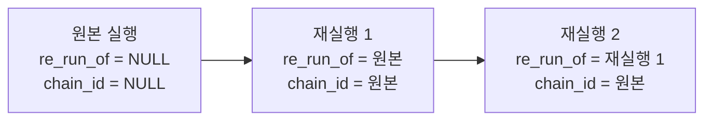

> 구현 상태: 부분 구현(REQ-RERUN-028 미구현, [미결 사항](#미결-사항)) · 원문: `spec/5-system/13-replay-rerun.md` · 용어: [용어 사전](../CLE-GLOSSARY.md)

## 개요

재실행(Re-run)은 기존 실행을 바탕으로 새 실행을 만드는 기능이다. 새 실행은 원본 실행과 재실행 체인(`chain_id`)으로 묶인다.

**배경**: [실행 컨텍스트](CLE-EXEC-CONTEXT.md) 의 실행 기록 재사용 정책은 조회(View), 재실행(Re-run), 멀티턴 재개를 서로 다른 방식으로 나눈다. 사용자는 실행 상세 화면에서 "이 실행을 같은 입력으로 다시 돌려 결과를 비교하고 싶다", "시간에 따라 달라지는 결과(`$now`, `random()`)를 다시 계산하고 싶다", "외부 호출 없이 흐름만 재현하고 싶다" 같은 요구가 있다. 이 기능이 없을 때는 워크플로우를 수동 트리거 패널에서 다시 시작하는 식으로 우회해야 했다.

| 시나리오 | 재실행으로 얻는 것 |
| --- | --- |
| **디버그·재현** | 실패한 실행을 같은 입력으로 다시 돌려 원인을 찾는다. 외부 호출까지 다시 일어나지 않게 끄고(dry-run) 흐름만 보고 싶을 때 안전장치가 있다 |
| **재시도** | 일시적 실패(외부 API 5xx, 네트워크 끊김)를 빠르게 한 번 더 시도한다. 입력을 고치지 않고 한 번 클릭으로 끝난다 |
| **테스트** | 입력 일부만 바꿔 다시 돌리고 결과 차이를 비교한다(예: 다른 사용자 ID 로 같은 흐름 재현) |
| **시간 재계산** | `$now`·`random()`·외부 응답에 따라 달라지는 결과를 새 실행 시점으로 다시 고정한다 |

이 문서는 재실행의 API, 외부 부수효과 안전장치(확인 모달과 dry-run 토글), 입력 데이터 모달, 체인 데이터 모델, 권한, AI 어시스턴트와의 경계, 멀티턴·Form·버튼 노드의 재실행 방식, 진입점을 정한다.

범위 밖(향후 확장, [향후 확장](#향후-확장) 참조):

- 부분 재실행(실패 지점부터 이어 실행, 단일 노드 디버그). 단일 노드 실행은 별도 진입점으로 이미 있다([에디터 실행과 디버깅](CLE-EXEC-RUN.md)).
- 표현식만 다시 평가하는 방식, 멀티턴 입력 재사용(자동 진행), AI 어시스턴트 재실행 도구, 노드별 멱등성 키 자동 부여, 노드별 재실행 정책 메타.

두 진입점(실행 상세 화면 실행 결과 드로어)의 화면 배치는 [실행 내역](CLE-EXEC-HISTORY.md) 과 [에디터 실행과 디버깅](CLE-EXEC-RUN.md) 이 정한다. 모달·정책·API 의 기준은 이 문서 하나다.

## 요구사항

- REQ-RERUN-001 WHEN 사용자가 재실행 버튼을 누르면 THE SYSTEM SHALL 원본 실행 정보, 외부 부수효과 노드 수, 입력 데이터 폼, dry-run 토글, 재실행·취소 버튼이 있는 확인 모달을 연다. (원본: RR-PL-01)
- REQ-RERUN-002 WHILE dry-run 토글이 켜진 동안 THE SYSTEM SHALL 부수효과 노드가 외부 호출을 건너뛰고 모의 출력을 돌려주게 한다. (원본: RR-PL-01)
- REQ-RERUN-003 IF dry-run 토글이 꺼져 있으면 THE SYSTEM SHALL 외부 호출을 그대로 다시 일으킨다. (원본: RR-PL-01)
- REQ-RERUN-004 WHEN 모달이 열리면 THE SYSTEM SHALL 원본 실행의 `inputData.parameters` 를 수동 트리거 파라미터 스키마 기반 폼에 미리 채운다. (원본: RR-PL-02)
- REQ-RERUN-005 WHEN 사용자가 "원본 입력 그대로 사용" 토글을 켜면 THE SYSTEM SHALL 폼을 읽기 전용으로 바꾸고 원본 입력으로 재실행한다. (원본: RR-PL-02)
- REQ-RERUN-006 IF 수동 트리거 파라미터 스키마가 없으면 THE SYSTEM SHALL 원본 `inputData.parameters` 키를 타입 없는 텍스트 필드로 보여 준다.
- REQ-RERUN-007 IF 원본 입력 값이 마스킹 마커면 THE SYSTEM SHALL 그 필드를 비워 두고 사용자가 채울 때까지 제출을 막는다.
- REQ-RERUN-008 IF 구조(object·array) 필드의 값이 JSON 으로 파싱되지 않으면 THE SYSTEM SHALL 재실행 제출을 막는다.
- REQ-RERUN-009 IF `inputOverride` 의 값 가운데 마스킹 마커와 정확히 같은 값이 있으면 THE SYSTEM SHALL `400 INVALID_TRIGGER_PARAMETERS` 와 `details[].code = MASKED_VALUE_RESUBMITTED` 로 거부한다.
- REQ-RERUN-010 WHEN 재실행을 요청하면 THE SYSTEM SHALL 워크플로우 전체를 실행한다. (원본: RR-PL-03)
- REQ-RERUN-011 WHEN 원본 실행이 멀티턴 AI·Form·버튼 노드를 거쳤으면 THE SYSTEM SHALL 재실행을 새 입력 대기 세션으로 시작하고 원본의 사용자 응답을 다시 쓰지 않는다. (원본: RR-PL-04)
- REQ-RERUN-012 WHEN 재실행 실행을 만들면 THE SYSTEM SHALL `re_run_of` 에 원본 실행 ID 를, `chain_id` 에 체인 루트 실행 ID 를 채운다. (원본: RR-PL-05)
- REQ-RERUN-013 IF `re_run_of` 를 거슬러 올라간 깊이가 32 를 넘으면 THE SYSTEM SHALL `409 RERUN_CHAIN_DEPTH_EXCEEDED` 로 거부한다. (원본: RR-PL-05)
- REQ-RERUN-014 IF 호출자가 워크스페이스 멤버가 아니면 THE SYSTEM SHALL `403 NOT_A_MEMBER` 로 거부한다. (원본: RR-PL-06)
- REQ-RERUN-015 IF 호출자가 뷰어면 THE SYSTEM SHALL `403 EDITOR_REQUIRED` 로 거부한다. (원본: RR-PL-06)
- REQ-RERUN-016 IF 원본이 다른 사용자가 시작한 실행이고 호출자가 소유자나 관리자가 아니면 THE SYSTEM SHALL `403 RERUN_PERMISSION_DENIED` 로 거부한다. (원본: RR-PL-06)
- REQ-RERUN-017 IF 원본 실행의 `executed_by` 가 NULL 이면 THE SYSTEM SHALL 편집자 이상이면 누구에게나 재실행을 허용한다. (원본: RR-PL-06)
- REQ-RERUN-018 WHILE dry-run 모드인 동안 THE SYSTEM SHALL 일반 재실행과 같은 권한 조건을 적용한다. (원본: RR-PL-06)
- REQ-RERUN-019 IF 사용자에게 재실행 권한이 없으면 THE SYSTEM SHALL 실행 상세 화면의 재실행 버튼을 비활성화하고 툴팁으로 안내한다. (원본: RR-PL-06)
- REQ-RERUN-020 IF 사용자에게 재실행 권한이 없으면 THE SYSTEM SHALL 실행 결과 드로어의 재실행 버튼을 숨긴다.
- REQ-RERUN-021 WHEN 사용자가 AI 어시스턴트에게 실행을 다시 돌려 달라고 하면 THE SYSTEM SHALL 재실행을 트리거하지 않고 실행 상세 화면에서 직접 하라고 안내한다. (원본: RR-PL-07)
- REQ-RERUN-022 WHEN dry-run 실행의 컨텍스트를 만들면 THE SYSTEM SHALL 첫 노드 실행 전에 `variables.__dryRun = true` 를 넣는다.
- REQ-RERUN-023 WHEN 입력 대기 뒤 rehydration 하면 THE SYSTEM SHALL `Execution.dry_run` 으로 `variables.__dryRun` 을 복원한다.
- REQ-RERUN-024 WHEN 부수효과 노드가 dry-run 으로 실행되면 THE SYSTEM SHALL 외부 호출 없이 `_dryRun: true` 모의 출력을 저장하고 노드 실행을 `completed` 로 끝낸다.
- REQ-RERUN-025 IF dry-run 요청인데 워크플로우에 `supportsDryRun` 이 true 가 아닌 부수효과 노드가 있으면 THE SYSTEM SHALL `400 RERUN_DRY_RUN_NOT_APPLICABLE` 로 재실행 전체를 거부한다.
- REQ-RERUN-026 IF 워크플로우에 dry-run 을 지원하지 않는 노드가 있으면 THE SYSTEM SHALL 모달의 dry-run 토글을 비활성화하고 툴팁으로 안내한다.
- REQ-RERUN-027 WHILE dry-run 모드인 동안 THE SYSTEM SHALL AI 노드의 LLM 호출은 그대로 한다.
- REQ-RERUN-028 WHILE dry-run 모드인 동안 THE SYSTEM SHALL AI 에이전트가 부르는 부수효과 도구에 모의 응답을 돌려준다. (미구현)
- REQ-RERUN-029 WHEN dry-run 실행 결과를 표시하면 THE SYSTEM SHALL 노드 카드에 `🧪 dry-run` 배지를 달고 `_dryRun: true` 가 있는 출력을 강조한다.
- REQ-RERUN-030 WHEN 실행 상세 화면이 dry-run 실행을 표시하면 THE SYSTEM SHALL `_dryRun` 표시가 없는 노드에도 `Execution.dry_run` 으로 배지를 단다.
- REQ-RERUN-031 WHEN 재실행이 만들어지면 THE SYSTEM SHALL `201` 과 함께 새 실행을 `reRunOf`·`chainId`·`dryRun` 을 포함해 돌려준다.
- REQ-RERUN-032 IF `executionId` 가 없거나 다른 워크스페이스의 실행이면 THE SYSTEM SHALL `404 RERUN_EXECUTION_NOT_FOUND` 로 거부한다.
- REQ-RERUN-033 IF 원본 실행의 워크플로우가 삭제됐으면 THE SYSTEM SHALL `404 RERUN_WORKFLOW_DELETED` 로 거부한다.
- REQ-RERUN-034 IF `inputOverride` 가 수동 트리거 파라미터 스키마와 맞지 않으면 THE SYSTEM SHALL `400 INVALID_TRIGGER_PARAMETERS` 로 거부하고 필드별 사유를 `error.details[]` 에 싣는다.
- REQ-RERUN-035 WHEN 체인 조회를 요청하면 THE SYSTEM SHALL 같은 체인의 모든 실행을 `started_at` 오름차순으로 돌려준다.
- REQ-RERUN-036 WHEN 재실행이 만들어지면 THE SYSTEM SHALL 감사 로그에 `execution.re_run` 을 남긴다.
- REQ-RERUN-037 IF 감사 로그 기록이 실패하면 THE SYSTEM SHALL 재실행을 그대로 진행한다.
- REQ-RERUN-038 IF 한 사용자가 1분에 재실행을 10번 넘게 요청하면 THE SYSTEM SHALL `429 RATE_LIMITED` 로 거부한다.
- REQ-RERUN-039 WHEN 재실행하면 THE SYSTEM SHALL 원본 실행 시점 스냅샷이 아니라 현재 워크플로우 정의로 실행한다.
- REQ-RERUN-040 WHEN 재실행하면 THE SYSTEM SHALL 트리거를 다시 발화하지 않고 수동 경로로 진행하며 `executed_by` 를 호출자로, `trigger_id` 를 NULL 로 채운다.
- REQ-RERUN-041 WHEN 모달이 새 실행 ID 를 받으면 THE SYSTEM SHALL 실행 상세 화면에서는 새 실행 상세 경로로 이동한다.
- REQ-RERUN-042 WHEN 사용자가 모달의 원본 실행 ID 를 누르면 THE SYSTEM SHALL 새 탭에서 원본 실행 상세를 연다.
- REQ-RERUN-043 WHILE dry-run 모드인 동안 AI 에이전트가 같은 실행 컨텍스트 안에서 MCP 도구(외부 MCP 서버 도구와 Cafe24 · MakeShop 내부 MCP 브리지 도구)를 부르면 THE SYSTEM SHALL 외부 호출 없이 `_dryRun: true` 와 `executed: false` 가 든 `success` 결과를 LLM 에 돌려준다. (임시 가드)
- REQ-RERUN-044 WHILE dry-run 모드인 동안 THE SYSTEM SHALL AI 에이전트의 MCP 메타 도구(`list_resources` · `read_resource` · `list_prompts` · `get_prompt`)와 내장 `kb_*` · `render_*` 도구는 그대로 실행한다.
- REQ-RERUN-045 WHEN dry-run 실행의 AI 에이전트가 멀티턴 재개 턴이나 마지막 턴 재시도로 다시 들어가면 THE SYSTEM SHALL AI 재개 체크포인트(`_resumeCheckpoint`)가 아닌 실행 컨텍스트의 `variables.__dryRun` 에서 dry-run 여부를 다시 구해 REQ-RERUN-043 의 가드를 이어 적용한다.
- REQ-RERUN-046 WHEN REQ-RERUN-043 의 가드가 도구 호출을 건너뛰면 THE SYSTEM SHALL 통합 활동 로그와 `mcpDiagnostics.errors[]` 를 남기지 않는다.
- REQ-RERUN-047 WHEN 워크스페이스 멤버가 체인 조회를 요청하면 THE SYSTEM SHALL 멤버의 역할과 원본 실행의 시작자와 상관없이 조회를 허용한다.

## 결정 요약

| 항목 | 결정 | 정책 ID |
| --- | --- | --- |
| A. 외부 부수효과 안전장치 | **A5**: 확인 모달과 dry-run 토글(기본 꺼짐). 부수효과 노드는 노드 메타로 분류한다 | `RR-PL-01` |
| B. 입력 데이터 방식 | **B2**: 원본 미리보기와 편집 모달이 기본. "원본 입력 그대로 사용" 토글로 B1 도 된다 | `RR-PL-02` |
| C. 부분 재실행 | **C1**: v1 은 워크플로우 전체만 | `RR-PL-03` |
| D. 멀티턴 노드 처리 | **D1**: 사용자가 새로 입력(새 멀티턴 세션) | `RR-PL-04` |
| E. 체인 추적 모델 | **E3**: `re_run_of` 자기 참조 FK 와 `chain_id` UUID 둘 다. 체인 깊이 32 제한 | `RR-PL-05` |
| F. 권한 | 재실행은 원본 실행 시작자이면서 워크스페이스 편집자 이상. dry-run 도 같다. 체인 조회 권한은 REQ-RERUN-047 이고 워크스페이스 멤버 전원이다(실행 상세 조회와 같다) | `RR-PL-06`(재실행 권한) |
| G. AI 어시스턴트 | **G1**: 재실행을 트리거하지 않는다(읽기 전용 정책 유지) | `RR-PL-07` |

정책마다 근거는 [Rationale](#rationale) 에 있다.

## 정책

### RR-PL-01 외부 부수효과 안전장치 (A5)

재실행은 두 단계 안전장치를 거친다.

1. **확인 모달**: 사용자가 재실행 버튼을 누르면 모달이 열린다. 모달에는 늘 다음이 있다.
   - 원본 실행의 기본 정보(실행 ID, 시작 시각, 상태)
   - 워크플로우에 든 외부 부수효과 노드 수(예: "이 워크플로는 외부 호출 노드 3개 — Send Email × 1, HTTP Request × 2 — 를 포함합니다")
   - 입력 데이터 폼(RR-PL-02)
   - "dry-run 모드" 토글(기본 꺼짐)
   - "재실행"·"취소" 버튼
2. **dry-run 토글**: 켜면 부수효과 노드([부수효과 노드 분류](#부수효과-노드-분류))는 외부 호출을 건너뛰고 모의 출력을 돌려준다. "외부 호출 없이 흐름만 검증" 하고 싶을 때 쓴다.

dry-run 을 끈 일반 재실행은 외부 호출을 그대로 다시 일으킨다. 그로 인한 부수효과(이메일 재발송, HTTP 재호출 등)는 의도한 동작이다.

### RR-PL-02 입력 데이터 방식 (B2)

- 원본 실행의 입력 데이터를 폼에 미리 채워 보여 준다. 폼은 수동 트리거 노드의 `parameters` 스키마로 만든다. 검증은 [실행 컨텍스트](CLE-EXEC-CONTEXT.md) 의 트리거 입력 파라미터 처리(`resolveTriggerParameters`)를 그대로 쓴다.
- 사용자는 필드를 고쳐 다른 입력으로 재실행할 수 있다.
- 모달 위쪽의 **"원본 입력 그대로 사용"** 토글(기본 꺼짐, 편집 가능 상태)을 켜면 폼이 읽기 전용이 되고 "재실행" 버튼 한 번으로 끝난다.

**예외: 마스킹된 값은 미리 채우지 않는다.** 원본 값이 응답 마스킹 마커면 그 필드는 비워 두고 다시 입력받으며 채워지기 전까지 제출을 막는다. 토글을 켠 경로는 서버가 원본을 직접 읽으므로 영향이 없다. 자세한 규칙은 [마스킹된 입력 처리](#마스킹된-입력-처리) 에 있다.

### RR-PL-03 부분 재실행 미지원 (C1)

v1 은 워크플로우 전체만 재실행한다. 실패한 노드부터 이어 실행(resume-from-failure)과 단일 노드만 다시 실행(single-node debug)은 [향후 확장](#향후-확장) 으로 나눴다.

### RR-PL-04 멀티턴 노드 재실행 방식 (D1)

원본 실행이 멀티턴 흐름(AI 에이전트 멀티턴, 정보 추출기 멀티턴, Form, 버튼)을 거쳤어도 재실행은 **새 멀티턴 세션**으로 시작한다.

- AI 에이전트 멀티턴은 첫 턴부터 다시 시작하고 사용자가 새 메시지를 입력한다.
- Form·버튼은 새로 입력을 기다린다.
- 원본 세션의 사용자 응답을 자동으로 다시 쓰지 않는다.

멀티턴 입력 재사용(D2)은 별도 계획으로 나눴다.

### RR-PL-05 체인 추적 모델 (E3)

실행 행마다 컬럼 두 개가 더 있다([데이터 모델](#데이터-모델)).

- `re_run_of UUID NULL REFERENCES execution(id)`: 직계 부모. NULL 이면 원본이다.
- `chain_id UUID NULL`: 체인 루트 실행 ID. v1 은 재실행 행에만 채운다(일반 실행은 NULL).

재실행하면 새 실행은 `re_run_of = <원본 ID>`, `chain_id = <원본의 체인 루트 ID>` 로 채워진다. 같은 체인 안에서 깊이가 한 단계씩 늘어난다.

**체인 깊이 32 제한**: `re_run_of` 를 거슬러 올라가 32 단계를 넘는 재실행은 `RERUN_CHAIN_DEPTH_EXCEEDED` 로 거부한다. 새 체인을 시작하려면 워크플로우를 새로 실행하거나 원본을 직접 재실행한다.

### RR-PL-06 권한 (F)

다음을 **모두** 만족해야 재실행할 수 있다.

- 호출자가 같은 워크스페이스의 멤버이고 편집자 이상(소유자, 관리자, 편집자)이다.
- 호출자가 원본 실행(`execution.executed_by`)의 시작자이거나 워크스페이스의 소유자·관리자다.

거부하는 층은 둘이다. 첫 조건은 `RolesGuard` 가 막는다(라우트 `@Roles('editor')`, 비멤버는 `NOT_A_MEMBER`, 뷰어는 `EDITOR_REQUIRED`). 둘째 조건은 서비스가 `RERUN_PERMISSION_DENIED` 로 막는다. 가드 거부 에러 코드의 근거는 [계정과 워크스페이스 데이터 흐름](../CLE-ACCT/CLE-ACCT-DATA.md) 에 있다.

**`executed_by = NULL` 인 자동 실행(트리거·스케줄·웹훅)**: 시작자가 없는 자동 실행은 "다른 사람의 실행" 이 아니다. 그래서 워크스페이스 편집자 이상이면 누구나 재실행할 수 있다(워크스페이스 자원으로 취급). 소유자·관리자로 더 좁혀야 한다면 후속 정책 결정이 필요하다. 현재 구현(`executions.service.ts` 의 reRun)은 이 정책을 따른다.

위 조건은 dry-run 에도 똑같이 적용한다. 안전한 방식이라도 다른 사용자의 실행 흐름을 자동으로 재현하면 정보가 드러날 위험이 있다.

재실행 권한이 없으면 화면은 재실행 버튼을 비활성화하고 툴팁으로 안내한다(실행 결과 드로어는 숨긴다, [진입점](#진입점)). 화면의 판정(`canReRun`)은 역할과 원본 실행의 시작자를 함께 본다. 백엔드도 같은 조건을 적용하고 허가되지 않은 재실행 요청에 `EDITOR_REQUIRED` 나 `RERUN_PERMISSION_DENIED` 를 돌려준다.

### RR-PL-07 AI 어시스턴트 비트리거 (G1)

AI 어시스턴트의 읽기 전용 도구(`get_workflow_executions`, `get_execution_details`, [AI 어시스턴트 도구](../CLE-WF/CLE-WF-ASSIST-TOOLS.md))는 재실행을 트리거하지 않는다. 새 도구(`re_run_execution` 등)는 이 문서에서 정의하지 않는다. 신뢰 단계(Trust) 도입 뒤 별도 계획(G2)에서 다룬다.

사용자가 어시스턴트에게 "이 실행을 다시 돌려 줘" 라고 하면 어시스턴트는 다음 순서로 답한다.

1. `get_execution_details` 로 원본 실행 정보를 조회해 요약해 준다.
2. "Re-run 은 사용자가 실행 상세 페이지에서 직접 트리거해야 합니다 (정책 RR-PL-07)" 라고 안내한다.
3. 실행 상세 화면으로 가는 딥 링크를 준다. 링크 형식은 [AI 어시스턴트 도구](../CLE-WF/CLE-WF-ASSIST-TOOLS.md#재실행-요청-처리) 에 있다.

사용자가 "AI 에게 재실행 권한 부여" 를 명시적으로 켜는 신뢰 단계를 도입한 뒤 G2 를 별도 계획으로 검토한다. 이 문서 범위 밖이다.

### 체인 조회 권한 (REQ-RERUN-047)

체인 조회(`GET /api/executions/:executionId/chain`)의 권한은 실행 상세 조회(`GET /api/executions/:id`, [실행 내역](CLE-EXEC-HISTORY.md))와 같다(2026-10-10). [RR-PL-06](#rr-pl-06-권한-f) 은 재실행 권한만 정하고 이 라우트에는 적용하지 않는다. 워크스페이스 멤버면 역할과 원본 실행의 시작자와 상관없이 조회할 수 있다. 비멤버는 `RolesGuard` 가 `NOT_A_MEMBER` 로 막는다. 그래서 실행 상세 화면의 체인 배지와 "View chain" 드롭다운은 뷰어를 포함한 멤버 모두에게 보인다. 재실행 권한이 없는 사용자에게는 재실행 버튼만 비활성화된다. 근거는 [Rationale](#체인-조회-권한은-실행-상세-조회와-같다-2026-10-10) 에 있다.

## dry-run

### 부수효과 노드 분류

다음 노드를 **부수효과 노드**로 분류한다. dry-run 에서 외부 호출을 건너뛰는 대상이다.

| 카테고리 | 노드 | 건너뛰는 조건 | `supportsDryRun` |
| --- | --- | --- | --- |
| Integration | [HTTP Request 노드](../CLE-NODE-INT/CLE-NODE-HTTP.md) | 외부 호출 | true |
| Integration | [Send Email 노드](../CLE-NODE-INT/CLE-NODE-EMAIL.md) | 메일 발송 | true |
| Integration | [Database Query 노드](../CLE-NODE-INT/CLE-NODE-DBQUERY.md) | write 작업만. write 판정(쿼리 유형과 SQL 첫 동사 목록)은 노드 문서가 정한다. read(SELECT)는 부수효과가 없어 dry-run 에서도 그대로 호출한다 | true |
| Integration | [Cafe24 노드](../CLE-NODE-INT/CLE-NODE-CAFE24.md) | GET 이 아닌 operation(POST·PUT·DELETE). GET 은 그대로 호출한다 | true |
| Integration | [MakeShop 노드](../CLE-NODE-INT/CLE-NODE-MAKESHOP.md) | GET 이 아닌 operation. MakeShop Shop API 는 GET·POST 만 쓰므로 POST 가 대상이다([MakeShop operation 메타데이터](CLE-MKS-META)). GET 은 그대로 호출한다 | true |
| Trigger 외부 발신 | 해당 없음(v1 트리거는 모두 수신 쪽이다) | 없음 | 없음 |

다음은 **내부 부수효과가 없다**고 보고 dry-run 에서도 그대로 실행한다.

- Logic, Flow, Data, AI(LLM 호출은 외부지만 워크플로우 결과 재현에 필요하다, [LLM 호출](#llm-호출)), Presentation(UI 렌더), Trigger(이미 발화된 뒤의 재실행이라 트리거는 다시 발화하지 않는다)

AI 에이전트 노드 자체는 그대로 실행한다. 이 노드가 부르는 MCP 도구는 [LLM 호출](#llm-호출) 의 임시 가드를 따른다.

분류 기준은 노드 메타 `category`([노드 시스템 구조와 카탈로그](../CLE-NODE/CLE-NODE-ARCH.md))와 노드별 boolean 메타 `supportsDryRun` 이다. 모든 부수효과 노드는 v1 에서 `supportsDryRun: true` 를 기본으로 제공한다. 각 핸들러가 모의 출력을 돌려줄 수 있어야 한다. 모달의 "외부 호출 노드 N개" 집계도 이 메타로 센다. AI 에이전트의 MCP 도구는 이 집계에 들지 않는다([미결 사항](#미결-사항)). 위 표의 노드 목록은 이 메타에서 나온다. 현재 구현에서 `supportsDryRun: true` 를 선언한 노드 스키마는 위 다섯 노드뿐이다(각 노드의 `*.schema.ts`). 부수효과 노드를 새로 더하면 이 표도 함께 고친다.

### 동작

엔진은 `createContext` 때 실행 컨텍스트의 런타임 변수로 `variables.__dryRun: boolean` 을 넣는다. `__workspaceId` 같은 시스템 예약 변수와 같은 `__` 접두 규칙이다([실행 컨텍스트](CLE-EXEC-CONTEXT.md)). 값은 실행 행의 `dry_run` 컬럼([dry-run 표시](#dry-run-표시))에서 오고 입력 대기 뒤 rehydration 에서도 똑같이 복원된다. 핸들러는 `context.variables.__dryRun === true` 로 나눈다. 공통 헬퍼 `nodes/core/dry-run.util.ts` 의 `isDryRun(context)`·`buildDryRunMock(kind, wouldHaveCalled)` 를 쓴다.

- 핸들러가 `isDryRun(context)` 이고 자기 노드가 부수효과 노드면:
  - 외부 호출을 **하지 않는다**.
  - 모의 객체를 노드 출력의 `output` 값으로 돌려준다.

    ```json
    {
      "_dryRun": true,
      "skippedReason": "dry-run mode",
      "wouldHaveCalled": {
        "kind": "http_request",
        "method": "POST",
        "url": "https://api.example.com/users",
        "bodyPreview": "..."
      }
    }
    ```

  - 노드 실행 상태는 `completed` 다(건너뜀이 아니다, 흐름은 정상으로 진행). 노드 실행 행의 `outputData.output` 에 이 모의 객체를 그대로 저장한다. 그래서 판정 키는 `outputData.output._dryRun` 이다.
- 부수효과 노드인데 `supportsDryRun !== true` 인 노드가 워크플로우에 하나라도 있으면 재실행 서비스가 들어가기 전 사전 점검(`assertDryRunSupported`)에서 `RERUN_DRY_RUN_NOT_APPLICABLE`(400)로 재실행 전체를 거부한다. 권장 UX 는 모달 단계에서 미리 찾아 dry-run 토글을 비활성화하고 툴팁으로 안내하는 것이다. v1 의 부수효과 노드는 모두 `supportsDryRun: true` 라 정상 워크플로우는 통과한다.

### LLM 호출

AI 노드(AI 에이전트, 텍스트 분류기, 정보 추출기)의 LLM 호출은 외부 호출이지만 dry-run 에서도 **그대로 한다**.

- LLM 응답이 하류 분기 결정에 바로 쓰인다(예: AI 에이전트의 도구 선택, 텍스트 분류기의 카테고리).
- LLM 호출은 보통 부수효과가 아니다. 응답을 받을 뿐 외부 시스템 상태를 바꾸지 않는다.

AI 에이전트가 부르는 도구는 목표 동작과 현재 동작이 다르다. 아래에 나눠 적는다.

**목표 동작(REQ-RERUN-028, 미구현)**: AI 에이전트가 부르는 도구 가운데 부수효과가 있는 도구는 dry-run 때 모의 응답을 돌려준다. LLM 에는 모의 결과가 전달되고 LLM 은 그것으로 다음 턴을 진행한다. 도구마다 부수효과를 나누는 기준과 모의 응답의 모양은 후속 Task CLE-T-G62XJS 가 정한다.

AI 에이전트에는 노드를 도구로 연결하는 입력 경로가 없다([AI 에이전트 노드](../CLE-NODE-AI/CLE-NODE-AGENT.md#도구-연결-입력-경로-제거)). 그래서 HTTP Request 노드나 Send Email 노드는 AI 에이전트의 도구가 되지 않는다. AI 에이전트가 외부 시스템에 닿는 도구는 MCP 도구다. 외부 MCP 서버의 도구와 Cafe24 · MakeShop 내부 MCP 브리지의 operation 이 여기에 든다([MCP 클라이언트](../CLE-INT/CLE-INT-MCP.md)).

**현재 동작: 임시 가드(2026-10-10)**: 모의 응답이 들어갈 때까지 dry-run 실행에서는 MCP 도구를 외부로 부르지 않는다(REQ-RERUN-043~046). 막는 대상은 외부 MCP 서버의 도구 호출(`tools/call`)과 Cafe24 · MakeShop 내부 MCP 브리지의 모든 operation 이다. 브리지의 GET operation 도 막는다. 대상 도구를 부르면 외부 호출 없이 `success` 상태이고 `executed: false` 인 결과를 LLM 에 돌려준다. 건너뛴 호출도 `turnDebug[].toolCalls` 에 `success` 로 남고 `maxToolCalls` 에 센다. 결과의 모양, `wouldHaveCalled` 의 필드, 활동 로그와 진단 집계 규칙은 [MCP 클라이언트](../CLE-INT/CLE-INT-MCP.md#dry-run-재실행) 의 「dry-run 재실행」 절이 정한다.

- 도구 이름 · 인자 검증 실패(`INVALID_TOOL_ARGUMENTS`, `CAFE24_MISSING_FIELDS` 등)와 알 수 없는 도구(`MCP_UNKNOWN_TOOL`, `CAFE24_UNKNOWN_OPERATION` 등)는 dry-run 확인보다 먼저 판정해 평소대로 보고한다. 외부 MCP 도구의 인자 검증은 JSON 파싱뿐이다(`inputSchema` 검증 미구현, [MCP 클라이언트](../CLE-INT/CLE-INT-MCP.md#미결-사항) 의 미결 사항).
- MCP 메타 도구(`list_resources` · `read_resource` · `list_prompts` · `get_prompt`)는 읽기 전용이라 막지 않는다. 내장 `kb_*`(지식 저장소 검색)와 `render_*`(표시) 도구도 외부 시스템 상태를 바꾸지 않아 그대로 실행한다.
- 도구 목록 구성(`buildTools`) 단계는 dry-run 에서도 평소처럼 돈다. 가드는 도구 실행(`execute`) 단계에만 있다. 이 단계에서 나가는 외부 호출은 [MCP 클라이언트 미결 사항](../CLE-INT/CLE-INT-MCP.md#미결-사항) 이 다룬다([미결 사항](#미결-사항)).
- 가드는 같은 실행 컨텍스트 안에서만 동작한다. 비동기 서브 워크플로우로 시작한 자식 실행은 dry-run 을 물려받지 않는다([미결 사항](#미결-사항)).

**dry-run 여부를 넘기는 길**: 도구 프로바이더 실행 문맥(`ProviderExecCtx`)의 `dryRun` 으로 넘긴다. 값은 턴마다 다음에서 구한다.

| 턴 | 값의 출처 |
| --- | --- |
| 단일 턴 | `isDryRun(context)`(`variables.__dryRun === true`) |
| 멀티턴 재개 턴 | 엔진이 다시 만든 `_resumeState.dryRun` |
| 마지막 턴 재시도 재진입 | 엔진이 다시 만든 `_resumeState.dryRun` |

멀티턴 첫 진입은 LLM 을 부르지 않아 도구 호출이 없다.

엔진은 `_resumeState` 를 다시 만들 때(`buildRetryReentryState`, 재개와 재시도가 함께 쓴다) `dryRun` 을 AI 재개 체크포인트에서 읽지 않는다. 실행 컨텍스트의 `variables.__dryRun` 에서 다시 구한다. `variables.__dryRun` 은 입력 대기 뒤 `Execution.dry_run` 으로 복원된다([동작](#동작)). 그래서 값의 출처는 실행 행 하나다. `dryRun` 은 AI 재개 체크포인트에 넣지 않는 컨텍스트 필드 목록(`CREDENTIAL_CONTEXT_FIELDS`)에 들어 있다.

**GET 과잉 차단**: 임시 가드는 부수효과 분류 없이 MCP 도구를 모두 막는다. 그래서 브리지의 GET operation 도 막혀 노드 dry-run 과 동작이 다르다. [Cafe24 노드](../CLE-NODE-INT/CLE-NODE-CAFE24.md) 와 [MakeShop 노드](../CLE-NODE-INT/CLE-NODE-MAKESHOP.md) 는 dry-run 에서도 GET 을 그대로 부른다([부수효과 노드 분류](#부수효과-노드-분류)). CLE-T-G62XJS 가 부수효과 분류와 모의 응답을 넣으면 이 차이는 없어진다. 근거는 [Rationale](#dry-run-에서-ai-에이전트의-mcp-도구를-막는다-2026-10-10) 에 있다.

**배지**: 가드 결과의 `_dryRun: true` 는 LLM 에 돌려주는 도구 결과 본문에 있다. AI 에이전트 노드 출력의 `output` 에는 `_dryRun` 이 없다. 그래서 이 노드의 배지는 [결과 표시](#결과-표시) 의 비부수효과 노드 규칙을 따른다.

### 결과 표시

실행 결과 드로어와 실행 상세 화면은 dry-run 으로 실행된 노드 실행을 눈에 띄게 구분한다.

- 노드 카드에 `🧪 dry-run` 배지를 단다.
- 노드 출력의 `output` 에 `_dryRun: true` 가 있으면(`outputData.output._dryRun`) 출력을 자동으로 강조한다.
- 체인 배지에도 "dry-run" 을 붙인다(`#3-th re-run · dry-run`).

**배지 판정 범위**: `_dryRun` 표시는 실제로 모의 처리한 노드(`supportsDryRun` 부수효과 노드)의 출력에만 들어간다. 그래서 **실행 상세 화면**은 노드별 `_dryRun` 표시에 더해 실행 수준의 **`Execution.dry_run`** 도 함께 반영한다. 표시가 없는 비부수효과 노드(Logic·Flow·Data·AI 등)도 dry-run 실행에 속하면 배지를 단다. "이 실행 전체가 dry-run 이었다" 를 개별 노드 상세에서도 알 수 있게 하려는 것이다. **에디터 실행 결과 드로어**는 실행 수준 플래그를 받지 않아 노드 표시로만 판정한다. 두 화면의 차이는 의도한 비대칭이다.

## API

API 는 [HTTP API 규약](../CLE-API/CLE-API-CONV.md) 의 응답 봉투와 [에러 응답과 클라이언트 처리](../CLE-API/CLE-API-ERROR.md) 의 에러 모양을 따른다.

### POST /api/executions/:executionId/re-run

원본 실행을 바탕으로 새 실행을 시작한다.

**경로 파라미터**: `executionId`(UUID, 필수). 재실행할 원본 실행 ID. 같은 체인의 어느 실행이어도 된다(그 실행이 직계 부모가 된다).

**원본 실행 상태**: 이 문서는 재실행할 수 있는 원본 실행의 상태(`status`)를 제한하지 않는다. 현재 구현(`executions.service.ts` 의 `reRun`)도 원본 상태를 검사하지 않는다. 화면에서 재실행 버튼을 어느 상태에서 보일지는 진입점 문서가 정한다([진입점](#진입점)).

**요청 본문**

```typescript
{
  // 원본 입력을 그대로 쓸지(true), inputOverride 를 쓸지(false). 기본 true
  useOriginalInput?: boolean;

  // useOriginalInput=false 일 때 쓸 입력. 수동 트리거 parameters 스키마와 호환.
  // resolveTriggerParameters 와 같은 검증을 거친다
  inputOverride?: Record<string, unknown>;

  // dry-run 으로 실행할지. 기본 false
  dryRun?: boolean;
}
```

화면은 토글 상태로 `useOriginalInput` 을 **늘 명시해서 보낸다.** 그래서 API 기본값 `true` 는 필드를 빼고 API 를 직접 부르는 호출자를 위한 안전한 기본값일 뿐이고 UI 기본값(꺼짐, `false`)과 모순되지 않는다.

**응답 201 Created**: 새로 만든 실행을 [실행 내역](CLE-EXEC-HISTORY.md) 의 실행 상세 응답 모양 그대로 돌려준다. 기본 실행 응답 필드 가운데 다음 세 필드가 재실행 정보를 담는다.

```typescript
{
  ...Execution,           // 기본 실행 응답
  reRunOf: string;        // 직계 부모 실행 ID. 재실행 직후의 행이라 null 이 아니다
  chainId: string;        // 체인 루트 실행 ID. 재실행 직후의 행이라 null 이 아니다
  dryRun: boolean;        // 이 실행이 dry-run 인지
}
```

기본 실행 응답에서 `reRunOf` · `chainId` 의 타입은 `string | null` 이다. 재실행 응답은 방금 만든 재실행 행이라 두 필드에 늘 값이 있다.

**에러 코드**

| HTTP | code | 뜻 |
| --- | --- | --- |
| 401 | `AUTH_REQUIRED` | 인증 토큰이 없거나 만료됨 |
| 403 | `NOT_A_MEMBER` | RR-PL-06 첫 조건. 워크스페이스 멤버가 아님(`RolesGuard`) |
| 403 | `EDITOR_REQUIRED` | RR-PL-06 첫 조건. 뷰어(`RolesGuard`, 라우트가 `@Roles('editor')`) |
| 403 | `RERUN_PERMISSION_DENIED` | RR-PL-06 둘째 조건. 다른 사용자가 시작한 실행이고 소유자·관리자가 아님(서비스) |
| 404 | `RERUN_EXECUTION_NOT_FOUND` | `executionId` 가 없거나 다른 워크스페이스의 실행 |
| 404 | `RERUN_WORKFLOW_DELETED` | 원본 실행의 워크플로우가 삭제됨(재실행의 전제인 현재 워크플로우 정의가 없다). 방어용이다. 데이터 모델에서 `Execution.workflow_id` 는 워크플로우 삭제 시 CASCADE 라([실행 데이터와 흐름 §삭제와 보존](CLE-EXEC-DATA.md#삭제와-보존)) 원본 실행도 함께 지워진다. 그래서 정상 경로에서는 `RERUN_EXECUTION_NOT_FOUND` 가 먼저 나고 이 코드에는 도달하지 않는다 |
| 409 | `RERUN_CHAIN_DEPTH_EXCEEDED` | RR-PL-05 체인 깊이 32 초과 |
| 400 | `RERUN_DRY_RUN_NOT_APPLICABLE` | dry-run 요청인데 워크플로우에 `supportsDryRun: false` 노드가 있음 |
| 400 | `INVALID_TRIGGER_PARAMETERS` | `inputOverride` 가 수동 트리거 parameters 스키마와 맞지 않음(`resolveTriggerParameters` 가 던지는 것과 같은 에러), **또는 마스킹된 값을 그대로 다시 보냄**([마스킹된 입력 처리](#마스킹된-입력-처리)). 필드별 사유는 `error.details[]` 에 싣고 항목 코드는 [에러 코드 규약과 카탈로그](../CLE-API/CLE-API-ERRCODES.md) 의 카탈로그를 따른다(`MISSING_REQUIRED_FIELD`, `TYPE_COERCION_FAILED`, `INVALID_SCHEMA`, `MASKED_VALUE_RESUBMITTED`) |

`INVALID_TRIGGER_PARAMETERS` 만 `RERUN_` 접두가 없는 이유는 [Rationale](#rationale) 에 있다.

### GET /api/executions/:executionId/chain

같은 체인의 모든 실행을 시간순으로 돌려준다. 실행 상세 화면의 체인 배지가 쓴다.

**응답 200**: `{ data: Execution[] }`. 배열을 `data` 로 감싸는 모양은 [OpenAPI 문서화](../CLE-API/CLE-API-SWAGGER.md#5-2-공용-래퍼-헬퍼) 의 배열 응답 헬퍼(`ApiOkWrappedArrayResponse`)를 따른다. `data` 는 체인의 모든 행을 `started_at ASC` 로 정렬한 배열이다. 항목은 위 재실행 응답과 같은 필드를 담고 `nodeExecutions` 는 뺀다. 다만 체인 루트(원본) 실행도 항목에 들어가므로 `reRunOf` · `chainId` 는 null 일 수 있다. 항목은 실행 상세 응답과 같은 마스킹 관문(`toResponseExecution`)을 거친다.

```typescript
{
  data: Array<{
    ...Execution,              // 기본 실행 응답(nodeExecutions 제외)
    reRunOf: string | null;    // 직계 부모 실행 ID. 체인 루트(원본)면 null
    chainId: string | null;    // 체인 루트 실행 ID. 체인 루트(원본)면 null
    dryRun: boolean;           // 이 실행이 dry-run 인지
  }>;
}
```

**권한**: 워크스페이스 멤버(REQ-RERUN-047, 실행 상세 조회와 같다). 멤버의 역할과 원본 실행의 시작자는 보지 않는다. RR-PL-06 은 이 라우트에 적용하지 않는다([체인 조회 권한](#체인-조회-권한-req-rerun-047)).

**에러 코드**

| HTTP | code | 뜻 |
| --- | --- | --- |
| 401 | `AUTH_REQUIRED` | 인증 토큰이 없거나 만료됨 |
| 403 | `NOT_A_MEMBER` | 헤더로 지정한 워크스페이스의 멤버가 아님(`RolesGuard`. 이 라우트는 `@Roles()` 없이 `@WorkspaceId()` 만 쓴다) |
| 404 | `RERUN_EXECUTION_NOT_FOUND` | `executionId` 가 없거나 다른 워크스페이스의 실행 |

## 데이터 모델

실행 엔티티 전체 컬럼은 [실행 데이터와 흐름](CLE-EXEC-DATA.md) 이 정한다. 이 절은 재실행이 더한 컬럼의 뜻과 불변식을 정한다.

### 체인 컬럼

| 컬럼 | 타입 | NULL | 설명 |
| --- | --- | --- | --- |
| `re_run_of` | `UUID` | NULL | 직계 부모 실행. NULL 이면 이 실행이 체인의 시작(원본)이다. `REFERENCES execution(id) ON DELETE SET NULL` |
| `chain_id` | `UUID` | NULL | 체인 루트 실행 ID. **v1 은 재실행으로 만든 행에만 채운다.** 일반 실행(원본·서브 워크플로우·Background)은 NULL 이다. 체인 루트 ID 는 체인 맨 위(원본) 실행의 ID 다 |

**인덱스**

- `(re_run_of)`: 직계 부모 조회(체인 배지의 직계 부모 표시)
- `(chain_id, started_at)`: 체인 전체 조회(`/chain` 엔드포인트가 자주 쓴다)

**불변식**

- 체인 루트는 `re_run_of = NULL` 인 맨 위 원본 실행이다. 체인 전체 조회는 `id = rootId OR chain_id = rootId` 다(`rootId = exec.chain_id ?? exec.id`).
- 재실행 행의 `chain_id` 는 같은 체인 루트를 가리킨다. 다른 체인으로 넘어가는 재실행은 없다(애플리케이션 수준).
- 체인 깊이 32 제한은 **애플리케이션 수준**에서 지킨다(`computeChainDepth`). `re_run_of` 를 루트까지 따라가며 깊이를 세는 재귀 CTE 단일 쿼리이고 순환을 막는 탐색 상한이 있다.



원본을 재실행하면 재실행 1 이 생기고 재실행 1 을 다시 재실행하면 재실행 2 가 생긴다. 두 재실행 모두 `chain_id` 로 원본을 가리키고 `re_run_of` 로 바로 앞 실행을 가리킨다.

마이그레이션 `codebase/backend/migrations/V067__execution_re_run_chain.sql` 이 이 컬럼과 인덱스를 만든다.

### dry-run 표시

- **노드 실행**: dry-run 으로 실행된 노드 실행은 `outputData.output._dryRun === true` 로 알아본다. 모의 객체가 노드 출력의 `output` 값이기 때문이다. 화면은 이 키로 배지를 단다. 화면의 판정(`result-detail.tsx` 의 `isDryRunOutput`)은 최상위 `_dryRun` 도 보지만 모의 객체가 실리는 곳은 `output` 이다.
- **실행**: 부모 실행 행에는 `dry_run: boolean` 컬럼이 있다(V068, `NOT NULL DEFAULT false`).

두 표시는 역할이 다르다. 노드 실행의 `_dryRun` 은 결과 표시용이고 실행의 `dry_run` 은 실행 제어용(엔진 주입과 복원)이다. 다만 **실행 상세 화면 배지**는 `Execution.dry_run` 을 표시 목적으로도 쓴다. `_dryRun` 표시가 없는 비부수효과 노드도 dry-run 실행에 속하면 배지를 달기 위해서다. 실행 상세에서는 제어와 표시를 겸하고 에디터 드로어는 노드 표시만 쓴다. 구현과 테스트는 `result-detail.tsx`, `execution-detail-waiting.test.tsx` 에 있다.

## UI

### 진입점

| 화면 | 위치 | 권한이 없을 때 |
| --- | --- | --- |
| 실행 상세 화면([실행 내역](CLE-EXEC-HISTORY.md)) | 요약 카드 오른쪽 머리 | 버튼을 비활성화하고 툴팁 "Re-run 권한이 없습니다 (정책 RR-PL-06)" |
| 실행 결과 드로어([에디터 실행과 디버깅](CLE-EXEC-RUN.md)) | 드로어 머리 오른쪽 | 버튼을 숨긴다(드로어는 워크플로우를 만드는 도중의 화면이라 소음을 줄인다) |

두 진입점 모두 같은 모달을 띄운다.

### 재실행 모달

| 영역 | 위치 | 들어가는 요소 |
| --- | --- | --- |
| 머리 | 위 | 제목 "Re-run Execution", 원본 실행(`#1234 · 2026-05-12 14:02:30 · ✅ Completed`) |
| 안내 | 머리 아래 | "이 워크플로는 외부 호출 노드 3개 — Send Email × 1, HTTP × 2 — 를 포함합니다." |
| 입력 데이터 | 가운데 | "원본 입력 그대로 사용 (RR-PL-02)" 토글, 파라미터별 필드(예: `name`, `count`, `extra.flag`) |
| dry-run | 입력 아래 | "dry-run 모드 (RR-PL-01) — 외부 호출 skip + mock 출력" 토글 |
| 버튼 | 아래 | 취소, 재실행 |

| 요소 | 기본값 | 동작 |
| --- | --- | --- |
| 원본 실행 머리 | 없음 | 원본 ID, 시작 시각, 최종 상태를 표시한다. ID 를 누르면 **새 탭**에서 원본 상세를 연다. 실행 상세 화면의 체인 배지 원본 링크는 **같은 탭**이다([실행 내역](CLE-EXEC-HISTORY.md)). 모달은 편집 맥락을 벗어나지 않으려고 새 탭, 체인 배지는 내비게이션이라 같은 탭이다(의도한 구분) |
| 외부 호출 노드 안내 | 없음 | 워크플로우의 `supportsDryRun: true` 노드 수를 노드 유형별로 모아 보여 준다(`grouped by node.type`) |
| 입력 데이터 폼 | 원본의 `inputData.parameters` | 수동 트리거 parameters 스키마 기반 동적 폼. 필드 라벨과 타입은 워크플로우의 수동 트리거 노드 설정에서 가져온다. **스키마가 없으면**(수동 트리거 노드를 지운 경우 등) 원본 `inputData.parameters` 키를 타입 없는 텍스트 필드로 보여 줘 데이터가 숨지 않게 한다. 타입별 위젯은 string 텍스트, number 숫자, boolean 체크박스, object·array JSON 이다 |
| "원본 입력 그대로 사용" 토글 | 꺼짐(편집 가능) | 켜면 폼이 읽기 전용이 되고 "재실행" 버튼 한 번으로 끝난다. 화면은 토글 상태로 `useOriginalInput` 을 늘 명시해서 보낸다 |
| "dry-run 모드" 토글 | 꺼짐 | 워크플로우에 `supportsDryRun: false` 노드가 있으면 비활성화하고 툴팁 "이 워크플로는 dry-run 미지원 노드를 포함합니다 (RR-PL-01)" 를 단다 |
| "재실행" 버튼 | 없음 | 누르면 권한을 확인하고 `POST /api/executions/:id/re-run` 을 부른다. 실행 상세 화면에서는 응답의 새 실행 ID 로 `/w/<slug>/workflows/:workflowId/executions/:newId` 로 이동한다(현재 워크스페이스 slug 기준, [레이아웃과 내비게이션](../CLE-UI/CLE-UI-LAYOUT.md)). 드로어에서는 이동하지 않고 에디터 안에서 새 실행을 지켜본다([에디터 실행과 디버깅](CLE-EXEC-RUN.md)) |
| "취소" 버튼 | 없음 | 모달을 닫고 바꾼 입력을 버린다 |

### 마스킹된 입력 처리

`Execution.inputData` 는 응답 단계에서 마스킹돼 내려온다. 입력 데이터 폼은 원본 `inputData.parameters` 를 미리 채우고 "원본 입력 그대로 사용" 토글의 UI 기본값은 꺼짐이다. 그래서 사용자가 폼을 건드리지 않아도 그 값이 `inputOverride` 로 다시 전송된다. 마스킹 마커가 그대로 다시 가면 리터럴 `'***'` 가 새 실행의 **실제 입력값**이 된다. 가시성이 떨어지는 문제가 아니라 데이터 오염이다. 그래서 모달과 서버가 마커를 막는다.

- **프리필하지 않는다**: 미리 채울 값이 마스킹 마커면 채우지 않고 그 필드를 비운 채 다시 입력하라고 안내한다.
- **제출을 막는다**: 사용자가 그 필드를 채우고 값에 마커가 남아 있지 않고 구조(object·array) 필드면 JSON 파싱에 성공할 때까지 제출을 막는다. 무효 JSON 으로 두면 파싱이 원문 문자열로 돌아가 마커 감지를 비켜 가므로 그 상태도 막는다. 안내만 하고 빈 문자열을 통과시키면 오염 값만 `'***'` 에서 `''` 로 바뀔 뿐이다. 그래서 "다시 입력하게 강제한다" 를 문구대로 구현한다.
- **토글을 켜는 것이 오히려 정답이다**: `useOriginalInput: true` 면 서버가 원본 엔티티를 직접 읽어 마스킹과 상관없이 원문으로 재실행한다. 이때는 차단도 풀린다.
- **서버가 한 번 더 막는다**: 위 차단은 화면 경로에 있어 UI 를 거치지 않는 클라이언트(`curl` 등)는 비켜 갈 수 있다. 그래서 서버가 `inputOverride` 의 값 가운데 마커와 **정확히 같은** 값이 있으면 `400 INVALID_TRIGGER_PARAMETERS` 와 `details[].code = MASKED_VALUE_RESUBMITTED` 로 거부한다. 오염이 실제로 일어나지 않는다. 화면 차단은 어느 필드가 문제인지 그 자리에서 보여 주는 안내로 남는다.

에디터의 "히스토리에서 불러오기" 는 같은 컬럼을 JSON 텍스트 전체로 채우므로 필드 단위로 비울 수 없다. 그쪽은 마커를 그대로 보여 주고 남아 있는 동안 실행을 막는다([에디터 실행과 디버깅](CLE-EXEC-RUN.md)). 마스킹 범위와 근거는 [응답 자격 증명 마스킹](../CLE-API/CLE-API-EGRESS.md) 이 정한다.

### 체인 표시

실행 상세 화면 요약 카드에 체인 정보를 표시한다. 화면 배치는 [실행 내역](CLE-EXEC-HISTORY.md) 이 정한다. 체인 배지와 드롭다운은 REQ-RERUN-047([체인 조회 권한](#체인-조회-권한-req-rerun-047))을 따르므로 뷰어를 포함한 워크스페이스 멤버 모두에게 보인다.

| 요소 | 표시 조건 | 내용 |
| --- | --- | --- |
| 체인 배지 | `re_run_of != null` | "#N-th re-run"(체인의 N번째 재실행)과 원본 실행 ID 링크. dry-run 이면 "· dry-run" 을 붙인다 |
| "View chain" 드롭다운 | 체인의 실행이 2개 이상 | 누르면 같은 체인의 모든 실행을 펼친다. 항목마다 ID, 시작 시각, 최종 상태, dry-run 여부 |

### i18n 키

| 키 | 한국어 | 영어 |
| --- | --- | --- |
| `history.actions.rerun` | 재실행 | Re-run |
| `history.rerun.modal.title` | 실행 다시 시작 | Re-run Execution |
| `history.rerun.modal.originalLabel` | 원본 실행 | Original Execution |
| `history.rerun.modal.sideEffectWarning` | 이 워크플로는 외부 호출 노드 {{count}}개를 포함합니다 | This workflow includes {{count}} external-call node(s) |
| `history.rerun.useOriginalInput` | 원본 입력 그대로 사용 | Use original input |
| `history.rerun.maskedInputBlocked` | 자격증명으로 판별돼 가려진 입력이 있어요. 해당 항목을 직접 입력하거나 '원본 입력 그대로 사용'을 켜 주세요. | Some inputs were masked as credentials. Enter them directly, or turn on "Use original input". |
| `history.rerun.dryRunToggle` | dry-run 모드 (외부 호출 skip) | Dry-run mode (skip external calls) |
| `history.rerun.dryRunDisabledTooltip` | 이 워크플로는 dry-run 미지원 노드를 포함합니다 | This workflow contains nodes that don't support dry-run |
| `history.rerun.confirmButton` | 재실행 | Re-run |
| `history.rerun.cancelButton` | 취소 | Cancel |
| `history.rerun.chainBadge` | #{{n}}-th re-run | #{{n}}-th re-run |
| `history.rerun.chainBadgeDryRun` | dry-run | dry-run |
| `history.rerun.chainOrigin` | 원본 | original |
| `history.rerun.viewChain` | chain 보기 ({{count}}) | View chain ({{count}}) |
| `history.rerun.permissionDenied` | Re-run 권한이 없습니다 (정책 RR-PL-06) | You don't have permission to re-run (RR-PL-06) |
| `history.rerun.chainDepthExceeded` | 같은 체인의 재실행이 한도(32)에 도달했습니다 | This chain has reached the re-run depth limit (32) |
| `history.rerun.workflowDeleted` | 원본 실행의 워크플로가 삭제되어 재실행할 수 없습니다 | The workflow of the original execution has been deleted |
| `history.rerun.dryRunNotApplicable` | 이 워크플로는 dry-run 모드로 재실행할 수 없습니다 | This workflow cannot be re-run in dry-run mode |
| `history.rerun.assistantBlocked` | Re-run 은 사용자가 실행 상세 페이지에서 직접 트리거해야 합니다 (RR-PL-07) | Re-run must be triggered manually on the execution detail page (RR-PL-07) |

화면 문구 자체의 기준은 i18n 사전이다([다국어와 화면 문구](../CLE-UI/CLE-UI-I18N.md)).

## 감사 로그

`audit_log` 테이블에 재실행 이벤트 `execution.re_run` 을 남긴다. `audit_log.action` 은 enum 제약이 없는 `varchar(100)` 이라 DB 마이그레이션 없이 새 action 문자열을 더할 수 있다. 다만 애플리케이션에서는 `AuditAction` union(`audit-logs/audit-action.const.ts` 의 `AUDIT_ACTIONS`)에 더해야 한다. action 이름 규칙(`<resource>.<verb>`, resource 접두 필수)은 [감사 action 명명](../CLE-OBS/CLE-OBS-AUDITNAME.md) 이 정한다.

아래는 논리 필드와 실제 `audit_log` 컬럼의 대응이다(entity: `AuditLogsService.record`).

| 논리 필드 | 실제 컬럼 | 값 |
| --- | --- | --- |
| `event_type` | `action` | `execution.re_run` |
| `actor_user_id` | `user_id` | 호출자 사용자 ID |
| `target_type` | `resource_type` | `execution` |
| `target_id` | `resource_id` | **새로 만든** 실행 ID |
| `metadata` | `details`(jsonb) | `{ "originalExecutionId": "<UUID>", "chainId": "<UUID>", "dryRun": boolean, "inputModified": boolean }` |
| 워크스페이스 격리 | `workspace_id` | 재실행 요청의 워크스페이스 ID |

`inputModified` 는 `useOriginalInput === false` 이고 해석한 입력이 원본 `inputData.parameters` 와 다를 때 `true` 다. 큰 입력은 details 에 저장하지 않고 바뀌었는지만 boolean 으로 남긴다. 감사 로그 기록 실패는 `AuditLogsService.record` 안에서 삼켜 재실행 주 동작을 깨지 않는다. 감사 로그 표준 스키마는 [감사 로그](../CLE-OBS/CLE-OBS-AUDIT.md) 가 정한다.

## rate limit

한도의 단일 기준은 [HTTP API 규약](../CLE-API/CLE-API-CONV.md#7-요청-빈도-제한) §7 표다. 이 문서의 요구사항은 REQ-RERUN-038 이다. 한도를 넘으면 §7 의 공통 정책대로 429 기본 코드 `RATE_LIMITED` 로 거부한다. 현재 구현은 라우트의 `@Throttle` 이고 사용자 단위로 센다.

## AI 어시스턴트와의 관계

AI 어시스턴트의 읽기 전용 도구(`get_workflow_executions`, `get_execution_details`)는 재실행을 트리거하지 않는다. 이 문서는 새 재실행 도구를 정의하지 않는다. 사용자가 요청할 때 어시스턴트가 답하는 순서는 [RR-PL-07](#rr-pl-07-ai-어시스턴트-비트리거-g1) 에 있다. 도구 정의는 [AI 어시스턴트 도구](../CLE-WF/CLE-WF-ASSIST-TOOLS.md) 가 정한다.

## 다른 정책과의 관계

### 워크플로우 정의는 현재 시점을 쓴다

재실행은 [실행 컨텍스트](CLE-EXEC-CONTEXT.md) 의 실행 기록 재사용 정책대로 **원본 실행 시점의 스냅샷이 아니라 현재 시점의 워크플로우 정의**를 쓴다. 원본 실행 뒤 워크플로우가 바뀌었다면 "원본 이후 워크플로가 N회 수정되었습니다 — 결과가 다를 수 있습니다" 를 모달 머리에 표시하는 안은 v2 이후 검토한다. v1 은 일반 안내만 한다.

### 설정 에코가 재실행의 전제다

재실행이 "현재 워크플로우 정의의 원래 설정을 다시 평가" 하려면 [실행 컨텍스트](CLE-EXEC-CONTEXT.md) 의 `rawConfig` 설정 에코가 모든 노드 핸들러에서 일관되게 동작해야 한다. 이 문서는 모든 노드 핸들러에 설정 에코가 적용돼 있다고 전제한다.

### 멀티턴 스냅샷과 겹치지 않는다

멀티턴 재개는 진행 중인 실행의 다음 턴을 같은 실행 행 안에서 진행한다(`state.rawConfig` 고정 스냅샷 사용). 재실행은 새 실행 행을 만들므로 두 방식은 겹치지 않는다. 같은 워크플로우의 멀티턴 노드도 RR-PL-04 에 따라 새 세션으로 시작한다. 고정 스냅샷은 **한 턴** 동안만 적용된다. park 뒤 재개할 때 [실행 컨텍스트](CLE-EXEC-CONTEXT.md) 의 rawConfig 스냅샷 정책(D3, 턴마다 설정을 새로 가져옴)에 따라 `node.config` 를 다시 만들므로 park 중 워크플로우를 고치면 다음 턴부터 새 정의가 적용된다. 재실행의 "현재 시점 정의" 정책과 같은 방향이다.

### 마지막 턴 재시도와 다르다

마지막 턴 재시도(`execution.retry_last_turn`, [WebSocket 이벤트와 명령](../CLE-API/CLE-API-WS-EVENTS.md), [AI 에이전트 노드 출력과 디버그](../CLE-NODE-AI/CLE-NODE-AGENT-OUTPUT.md))도 재실행과 겹치지 않는다.

| 구분 | 재실행 | 마지막 턴 재시도 |
| --- | --- | --- |
| 단위 | 워크플로우 전체(RR-PL-03) | 한 노드의 마지막 LLM 호출 |
| 실행 행 | 새 실행 행을 만든다 | 같은 실행 안에서 새 노드 실행 행으로 다시 들어간다 |
| 체인 | `re_run_of`·`chain_id` 를 채우고 깊이가 늘어난다 | 체인 컬럼에 관여하지 않고 체인 배지도 없다 |
| 성공 뒤 | 새 실행이 처음부터 진행된다 | 그 노드의 하류가 일반 노드 `COMPLETED` 와 같이 진행된다([AI 에이전트 노드](../CLE-NODE-AI/CLE-NODE-AGENT.md)) |
| 시간 범위 | 체인 깊이 32 까지 | 노드 단위로 좁고 빠른 회복(60분 TTL) |

둘은 같은 사용자 가치("실패한 흐름 다시")의 다른 단위다.

### 트리거를 다시 발화하지 않는다

재실행은 **트리거를 다시 발화하지 않는다.** 원본 실행이 웹훅으로 시작됐어도 재실행은 웹훅 발화 없이 수동 경로로 진행한다. 새 실행 행은 `executed_by = <재실행 호출자>`, `trigger_id = NULL` 로 채워진다([실행 컨텍스트](CLE-EXEC-CONTEXT.md) 의 수동 경로와 같다). 실행 출처 분류([실행 내역](CLE-EXEC-HISTORY.md))는 이 실행을 `manual` 로 표시하고 체인 배지가 함께 보여 출처가 재실행임을 따로 알린다.

## 향후 확장

이 문서 범위 밖이다. 별도 계획으로 추적한다.

| 옵션 | 설명 | 막힌 이유 |
| --- | --- | --- |
| **C2** resume-from-failure | 실패한 노드부터 이어 실행 | 표현식 컨텍스트 복원, 분기 합류 처리, 블로킹 노드 재진입까지 엔진 안전성 검증이 별도 계획 분량이다 |
| **B3** 표현식만 다시 평가 | 외부 호출은 그대로 하고 모든 표현식만 다시 평가 | dry-run 과 뜻이 헷갈려 UX 를 따로 검토해야 한다 |
| **D2** 멀티턴 입력 재사용 | 원본의 사용자 응답을 자동으로 다시 씀 | 테스트 자동화 도구 계획(별도). 재실행이 "테스트" 가 아니라 "다시 실행" 이라는 v1 의도와 결이 다르다 |
| **G2** AI 어시스턴트 재실행 도구 | 어시스턴트가 재실행을 트리거 | 신뢰 단계(사용자가 명시적으로 권한을 주는 토글)가 먼저 있어야 한다 |
| **A3** 멱등성 키 자동 부여 | 재실행 때 외부 호출에 idempotency key 를 자동으로 붙임 | 외부 시스템 호환성(이메일·DB write 는 대부분 idempotency 미지원). 노드별 선택 메타로 v2 이후 |
| **A4** 노드별 재실행 정책 메타 | 노드마다 "다시 호출·건너뜀·확인 필요" 표시 | 모든 노드 스키마 확장, 마이그레이션, UI 변경이 필요해 비용이 크다 |

C3(single-node debug, 단일 노드만 실행)는 2026-06-15 에 재실행 체인이 아닌 별도 진입점으로 구현됐다([에디터 실행과 디버깅](CLE-EXEC-RUN.md) 의 단일 노드 실행). "입력 데이터 격리" 는 `previousExecutionId` 의 직속 상류 출력 복원, "하류 미진행" 은 도달 가능 노드 한정, "표현식 컨텍스트 mock" 은 직속 상류 출력 복원으로만 채웠다(전체 mock 아님). 인접하지 않은 컨텍스트·블로킹 노드·컨테이너 안 노드는 그 문서의 범위 한계로 적혀 있다.

## 비기능 요구

| 항목 | 정책 |
| --- | --- |
| 권한 | 재실행은 RR-PL-06 이다(워크스페이스 편집자 이상이면서 원본 시작자이거나 소유자·관리자). 체인 조회는 REQ-RERUN-047 이고 워크스페이스 멤버 전원이다(실행 상세 조회와 같다) |
| 감사 로그 | `execution.re_run` 이벤트([감사 로그](#감사-로그)) |
| rate limit | [rate limit](#rate-limit) 절(REQ-RERUN-038) |
| 관측 | 노드 실행의 dry-run 표시와 체인 배지로 재실행 트래픽을 일반 수동 실행과 구분할 수 있다 |
| 회귀 방지 | 단위·통합·e2e 테스트가 다음을 지킨다. 입력 같음·수정·dry-run 경우, 재실행 권한 거부(`NOT_A_MEMBER`, `EDITOR_REQUIRED`, `RERUN_PERMISSION_DENIED`), 체인 조회의 뷰어 허용(남이 시작한 실행도 200), 삭제된 워크플로우(`RERUN_WORKFLOW_DELETED`), 체인 깊이 32 초과(`RERUN_CHAIN_DEPTH_EXCEEDED`), 멀티턴 노드 새 세션(RR-PL-04), AI 어시스턴트 비트리거(RR-PL-07), dry-run 에서 AI 에이전트의 MCP 도구를 외부로 부르지 않음(단일 턴 · 재개 턴 · 마지막 턴 재시도 재진입) |

## 미결 사항

- **dry-run 때 AI 에이전트 도구의 모의 응답**: 부수효과가 있는 도구에만 모의 응답을 주는 목표 동작(REQ-RERUN-028)은 아직 구현되지 않았다. 지금은 2026-10-10 에 들어간 임시 가드가 대신한다. 이 가드는 MCP 도구를 외부로 부르지 않는다([LLM 호출](#llm-호출), REQ-RERUN-043~046). 목표 동작은 후속 Task CLE-T-G62XJS 가 맡는다. 그 Task 가 도구마다 부수효과를 나누는 기준, 모의 응답의 모양, 브리지의 GET operation 을 다시 통과시킬지를 정한다. 그때까지 브리지의 GET operation 도 막힌다. 외부 MCP 도구의 분류는 [향후 확장](#향후-확장) 표의 A4(노드별 재실행 정책 메타)와 같이 검토한다.
- **도구 목록 구성 단계의 외부 호출**: 임시 가드는 도구 실행(`execute`) 단계에만 있다. 도구 목록 구성(`buildTools`) 단계는 dry-run 재실행에서도 평소대로 돈다. 이 단계에서 나가는 외부 호출과 그 결과로 바뀌는 상태는 [MCP 클라이언트 미결 사항](../CLE-INT/CLE-INT-MCP.md#미결-사항) 의 「dry-run 재실행의 도구 목록 구성 단계」가 정본이다. 담당 Task 는 CLE-T-8B66BK 다.
- **비동기 서브 워크플로우 자식 실행의 dry-run 상속**: dry-run 여부는 실행 컨텍스트의 `variables.__dryRun` 과 실행 행의 `dry_run` 으로만 전해진다. 비동기 서브 워크플로우로 시작한 자식 실행은 이 값을 물려받지 않는다. 그래서 dry-run 재실행이어도 자식 실행의 부수효과 노드와 AI 에이전트 도구는 외부를 그대로 부른다. 2026-10-10 임시 가드 이전부터 있던 차이다. 동기 서브 워크플로우가 값을 물려받는지는 확인 필요다. Background 노드 본문 실행도 같은 갭이 있는지 확인이 필요하다. 자식 실행에 dry-run 을 넘길지, REQ-RERUN-025 의 원칙(안전하게 dry-run 할 수 없으면 재실행 전체를 거부한다)대로 서브 워크플로우가 있는 워크플로우의 dry-run 을 거부할지 결정이 필요하다. 담당 Task 는 CLE-T-Y2F1NG 다.
- **재실행 모달의 외부 호출 집계와 MCP 도구**: 모달의 "외부 호출 노드 N개" 는 `supportsDryRun: true` 인 노드만 센다(`rerun-modal.tsx`). AI 에이전트에 연결된 MCP 서버와 Cafe24 · MakeShop 도구는 세지 않는다. 그래서 dry-run 을 끈 일반 재실행에서 AI 에이전트가 외부 데이터를 바꿀 수 있어도 모달 안내에는 드러나지 않는다. 안내에 MCP 도구를 넣을지 결정이 필요하다.
- **dry-run 재실행의 메모리 추출**: 메모리 전략이 `persistent` 인 AI 에이전트 · 정보 추출기는 추출한 메모리를 `agent_memory` 에 쓴다([에이전트 메모리](../CLE-AI/CLE-AI-MEMORY.md)). dry-run 재실행에서도 `agent_memory` 에 저장한다. 메모리 관리 코드(`ai-memory-manager.ts`, `agent-memory-extraction` 큐)에 dry-run 분기가 없다. dry-run 에서 이 저장을 막을지 결정이 필요하다. 담당 Task 는 CLE-T-C9GF9F 다.

## 구현 위치

- `codebase/backend/src/modules/executions/executions.controller.ts` (`POST :id/re-run`, `GET :id/chain` 의 getChain. 체인 조회 라우트는 `@Roles` 없이 멤버 전원이 조회한다)
- `codebase/backend/src/modules/executions/executions.service.ts` (reRun 과 재실행 권한, getChain, `computeChainDepth`, `assertDryRunSupported`)
- `codebase/backend/src/modules/executions/dto/re-run.dto.ts`
- `codebase/backend/migrations/V067__execution_re_run_chain.sql`
- `codebase/backend/migrations/V068__execution_dry_run.sql`
- `codebase/backend/src/nodes/core/dry-run.util.ts` (`isDryRun`, `buildDryRunMock`)
- `codebase/backend/src/nodes/ai/ai-agent/tool-providers/agent-tool-provider.interface.ts` (`ProviderExecCtx.dryRun`)
- `codebase/backend/src/nodes/ai/ai-agent/tool-providers/dry-run-tool-result.ts` (`buildDryRunSkippedToolResult`)
- `codebase/backend/src/nodes/ai/ai-agent/tool-providers/mcp-tool-provider.ts` (외부 MCP 도구의 dry-run 임시 가드)
- `codebase/backend/src/nodes/ai/ai-agent/tool-providers/cafe24-mcp-tool-provider.ts` (Cafe24 브리지 도구의 dry-run 임시 가드)
- `codebase/backend/src/nodes/ai/ai-agent/tool-providers/makeshop-mcp-tool-provider.ts` (MakeShop 브리지 도구의 dry-run 임시 가드)
- `codebase/backend/src/nodes/ai/ai-agent/ai-turn-executor.ts` (턴마다 `dryRun` 을 도구 프로바이더에 넘긴다)
- `codebase/backend/src/modules/execution-engine/execution-engine.service.ts` (`buildRetryReentryState` 의 `dryRun` 재유도)
- `codebase/backend/src/modules/execution-engine/utils/resume-state.schema.ts` (`CREDENTIAL_CONTEXT_FIELDS` 의 `dryRun`)
- `codebase/frontend/src/components/executions/rerun-modal.tsx`
- `codebase/frontend/src/lib/executions/can-rerun.ts` (`canReRun`, 재실행 버튼 판정)

## Rationale

### 왜 A5(확인 모달과 dry-run 토글)인가

- A1(확인 모달만)은 결제 노드처럼 운영 사고 가능성이 큰 경우의 안전판이 약하다. 사용자가 모달을 무심코 넘기면 결제가 그대로 다시 일어난다.
- A4(노드별 재실행 정책 메타)는 가장 정밀하지만 모든 노드 스키마 확장, 마이그레이션, 워크플로우 작성자에게 새 메타 필드 노출이 필요해 v1 비용이 크다. v2 이후의 진화 경로로 둔다.
- A5 는 노드 카테고리 메타만으로 부수효과 노드를 나누고(카테고리는 [노드 시스템 구조와 카탈로그](../CLE-NODE/CLE-NODE-ARCH.md) 에 이미 있다), dry-run 을 토글로 줘 사용자가 디버그 의도와 운영 의도를 분명히 나누게 한다. 추가 스키마 비용은 노드의 `supportsDryRun: boolean` 과 핸들러의 dry-run 분기(`variables.__dryRun` 확인, 노드 실행 출력 `outputData.output._dryRun`)뿐이라 면적이 작다.

### 왜 B2(원본 미리보기와 편집)가 기본인가

가장 흔한 쓰임은 디버그·재현이고 디버그·재현은 입력을 조금씩 바꿔 결과 차이를 비교하는 경우가 많다. B1(늘 원본 그대로)은 한 번 클릭의 장점이 있지만 모달의 토글로 똑같이 줄 수 있다. B3(표현식만 다시 평가)는 dry-run 과 뜻이 겹쳐 UX 가 헷갈리므로 v1 에서 뺐다.

### 왜 C1(워크플로우 전체만)인가

resume-from-failure(C2)는 표현식 컨텍스트 복원, 분기 합류 처리(특히 Parallel·Merge), 블로킹 노드 재진입(Form·버튼·AI 멀티턴)의 엔진 안전성 검증이 별도 계획 분량이다. v1 은 워크플로우 전체 재실행만으로도 디버그·재시도·테스트 쓰임의 80% 를 덮는다.

### 왜 D1(멀티턴 새 입력)인가

멀티턴 노드의 사용자 응답을 자동으로 다시 쓰면(D2) 외부 부수효과(사용자 응답에 따른 분기, 예: AI 에이전트가 사용자 메시지에 따라 결제 도구를 부름)를 통제할 수 없다. RR-PL-01 의 안전 원칙과 부딪친다. D1 은 "재실행은 사용자가 일부러 흐름을 다시 진행하는 것" 이라는 v1 의도에 맞다. D2 는 테스트 자동화 도구 계획으로 나누는 것을 권한다.

### 왜 E3(`re_run_of` 와 `chain_id` 둘 다)인가

E1(`re_run_of` 만)은 직계 부모 조회는 빠르지만 체인 전체 조회에 재귀 CTE 가 필요해 느려진다(깊이 32 까지 가능). E2(`chain_id` 만)는 체인 전체 조회는 빠르지만 직계 부모를 알려면 같은 체인의 모든 행을 정렬해야 한다. E3 는 컬럼 하나(`chain_id`)와 인덱스 하나(`(chain_id, started_at)`)를 더하는 비용으로 두 조회를 모두 빠르게 한다. 체인 배지가 직계 부모와 체인 안 위치를 함께 보여 주는 UX 에 잘 맞는다.

### `chain_id` 는 NULLABLE 이다 (2026-05-31, 결정 F2)

초기 설계는 `chain_id NOT NULL` 에 원본이 자기를 가리키는(`chain_id = id`) 모델이었다. 그런데 실행 행은 서브 워크플로우·Background·재시도 등 **여러 경로**에서 INSERT 된다. 모든 경로에 `chain_id` 채우기를 강제하면 핵심 실행 경로가 회귀할 위험이 크다. 그래서 v1 은 `chain_id` 를 NULLABLE 로 두고 재실행 행만 채운다(일반 실행 NULL, 체인 루트는 원본 ID). 백필은 필요 없다. NOT NULL·자기 체인으로 강화하는 것은 모든 생성 경로를 정리한 뒤 v2 에서 검토한다.

### 실행에 `dry_run` 컬럼을 둔다

초안에서는 이 컬럼을 v2 이후로 미뤘다. dry-run 을 게이트가 아니라 완전한 구현으로 채택하면서(도구 모의 응답은 REQ-RERUN-028 로 아직 남아 있다) 두 제약 때문에 v1 컬럼으로 정했다.

- 엔진은 **첫 노드 실행 전** `createContext` 때 `variables.__dryRun` 을 넣어야 한다. 이 값은 노드 실행이 하나도 없을 때 정해져야 하므로 노드 실행의 `_dryRun` 으로는 알 수 없다. 실행 단위 플래그가 먼저 있어야 한다.
- 입력 대기 뒤 **rehydration** 경로에서도 같은 dry-run 모드를 복원해야 하므로 메모리 플래그가 아니라 **영속 컬럼**이어야 한다.

### 체인 깊이 32

운영 쓰임을 보면 디버그 때 같은 입력으로 5~10번 반복하는 경우는 흔하지만 32번을 넘는 경우는 거의 없다. 보통 사용자는 입력을 바꾸거나 워크플로우를 고치러 떠난다. 32 는 "안전한 방어 한도" 이고 그 이상은 무한 루프나 잘못된 자동화 스크립트일 가능성이 높아 거부하는 것이 사용자를 지키는 길이다. 운영 뒤 한도를 조정할 수 있다.

### 왜 G1(AI 어시스턴트 비트리거)인가

AI 어시스턴트의 읽기 전용 정책([AI 어시스턴트 도구](../CLE-WF/CLE-WF-ASSIST-TOOLS.md))은 사용자가 의도하지 않은 부수효과를 어시스턴트가 일으키지 않게 하는 안전판이다. 재실행은 외부 호출을 다시 일으킬 수 있다는 것(RR-PL-01)이 본질이라 이 안전판 안쪽에 둔다. G2(어시스턴트 신뢰 단계)는 별도 계획에서 검토한다. 신뢰 단계 자체가 이 문서 범위를 넘는다.

### 자동 실행(`executed_by = NULL`)은 편집자 이상이면 재실행할 수 있다 (v1, 2026-05-31)

시작자가 없는 자동 실행은 "다른 사람의 실행" 이 아니어서 워크스페이스 자원으로 취급했다. 더 보수적으로 소유자·관리자로 좁힐지는 후속 결정으로 남겼다.

### `INVALID_TRIGGER_PARAMETERS` 만 `RERUN_` 접두가 없다

형제 코드(권한, 체인 깊이, 워크플로우 삭제, dry-run 부적용 등)는 재실행 **고유** 실패라 경로 이름을 붙였다. 이 코드는 반대로 수동 실행(`POST /workflows/:id/execute`)·저장(`POST /workflows/:id/save`) 경로와 **같은 검증 실패를 같은 코드로 내기 위한** 것이다. 경로별 접두를 붙이면 통일이 의미 없어진다. 2026-08-22 이전에는 이 자리가 `INVALID_INPUT` 이었다. 이름 변경 이력은 [에러 코드 규약과 카탈로그](../CLE-API/CLE-API-ERRCODES.md) 에 있다.

### 입력 데이터 마스킹을 예외로 두지 않고 마커를 막는다 (2026-08-20)

2026-08-20 이전에는 `Execution.inputData` 만 응답 마스킹에서 뺐다. 마스킹하면 모달이 미리 채운 `'***'` 가 새 실행의 실제 입력값이 되기 때문이다. 이제는 이 컬럼도 마스킹하고 대신 모달이 마커를 미리 채우지 않으며 서버가 마커 재전송을 거부한다([마스킹된 입력 처리](#마스킹된-입력-처리)). 마스킹 정책의 근거는 [응답 자격 증명 마스킹](../CLE-API/CLE-API-EGRESS.md) 에 있다.

### dry-run 에서 AI 에이전트의 MCP 도구를 막는다 (2026-10-10)

**문제**: 이전 판의 [LLM 호출](#llm-호출) 은 AI 에이전트가 부르는 부수효과 도구가 dry-run 때 모의 응답을 준다고 적었다. 실제로는 도구 프로바이더 실행 문맥에 dry-run 표시가 없었다. 그래서 dry-run 재실행에서도 외부 MCP 서버의 도구와 Cafe24 · MakeShop 내부 MCP 브리지의 쓰기 operation 이 실제로 불렸다. "외부 호출 없이 흐름만" 보려고 dry-run 을 켠 사용자의 쇼핑몰 데이터가 바뀔 수 있었다. 이 차이는 finding 01a0e5a0-434d-76ff-867b-bbcb31190c32 로 올라왔다. 2026-10-10 에 사람이 아래 셋 가운데서 골랐다.

| 선택지 | 내용 | 결정 |
| --- | --- | --- |
| 1 | 도구 프로바이더에 dry-run 을 넘기고 부수효과 도구에만 모의 응답을 준다 | 목표로 채택했다. 도구마다 부수효과를 나누는 기준과 응답 모양을 정해야 해서 후속 Task CLE-T-G62XJS 로 나눴다 |
| 2 | dry-run 에서 MCP 도구 호출을 막는다 | 1 이 들어갈 때까지 쓰는 임시 가드로 먼저 넣었다(CLE-T-8BX1HK) |
| 3 | 문서만 실제 동작에 맞추고 경고한다 | 실제 쇼핑몰 데이터가 바뀌는 위험이 그대로 남아 2026-10-10 결정 때 기각했다 |

**가드 범위**: 가드는 같은 실행 컨텍스트에서 LLM 이 고른 도구 호출의 실행(`execute`) 단계를 막는다. 업무 데이터를 외부 시스템에 쓰는 위험이 가장 큰 경로라서 이 단계를 막는다. 가드 밖에 남은 경로는 셋이고 [미결 사항](#미결-사항) 과 Task 로 추적한다. (a) 비동기 서브 워크플로우로 시작한 자식 실행은 dry-run 을 물려받지 않는다(CLE-T-Y2F1NG). (b) 도구 목록 구성(`buildTools`) 단계의 목록 조회와 `expired` 통합의 토큰 갱신(CLE-T-8B66BK). (c) `persistent` 메모리 추출의 저장(CLE-T-C9GF9F). 이 셋을 남긴 것은 선택지 3 을 기각한 판단과 어긋나지 않는다. 세 경로는 가드 이전부터 있던 갭이다. 또 업무 데이터를 외부에 쓰지 않거나(목록 조회 · 토큰 갱신 · 내부 메모리 저장) 특정 구성에서만 생긴다(비동기 서브 워크플로우로 시작한 자식 실행). 그래서 이번 가드에 넣지 않고 Task 로 추적한다.

**GET 도 막는다**: 임시 가드에는 도구마다 읽기와 쓰기를 가르는 분류가 아직 없다. 그래서 MCP 도구를 모두 막고 브리지의 GET operation 도 함께 막힌다. 노드 dry-run 은 Cafe24 · MakeShop 의 GET 을 그대로 부르므로 노드와 도구의 동작이 다르다. 안전을 위해 재현 충실도(GET 도 실제로 부르지 않음)를 일시적으로 낮춘 것이다. CLE-T-G62XJS 가 부수효과 분류와 모의 응답을 넣으면 이 넓은 차단을 풀고 충실도를 되돌린다.

**에러가 아닌 `success` 로 돌려준다**: 에러로 돌려주면 LLM 이 도구 실패로 보고 같은 도구를 다시 부르거나 사용자에게 실패를 알릴 수 있다. 그래서 결과 상태는 `success` 로 두고 본문에 `executed: false` 와 이번 실행에서 다시 부르지 말라는 안내를 넣었다. 실패 모양을 쓰지 않은 것은 [AI 에이전트 노드](../CLE-NODE-AI/CLE-NODE-AGENT.md#render_form-제출-뒤-같은-폼-재호출을-막은-방법) Rationale 이 `render_form` 제출 결과에서 `rendered: false` 를 기각한 것과 같은 이유다. LLM 이 그 값을 실패로 읽고 같은 도구를 다시 부를 수 있다. 실패가 아니므로 새 에러 코드는 만들지 않았다. 건너뛴 호출이 활동 로그를 남기지 않는 이유는 [MCP 클라이언트](../CLE-INT/CLE-INT-MCP.md#dry-run-재실행에서-건너뛴-호출의-기록-2026-10-10) 의 Rationale 에 있다. 노드 경로(REQ-CAFENODE-035)와 다르게 정한 이유도 거기 있다.

**메타 도구와 `kb_*` · `render_*` 는 막지 않는다**: MCP resources · prompts 메타 도구는 MCP 프로토콜이 읽기 전용으로 정한 요청이다. 도구 분류가 없어도 외부 상태를 바꾸지 않는다는 것을 안다. 이 판단은 프로토콜을 지키는 서버를 전제하고 지키지 않는 서버의 부수효과는 이 가드가 막지 않는다. 반면 `tools/call` 은 서버가 무엇을 하는지 알 수 없다. `kb_*` 는 워크스페이스 안 지식 저장소를 검색하고 `render_*` 는 화면 표시용 결과만 만든다. 둘 다 외부 시스템에 닿지 않는다.

**재개 · 재진입 턴은 컨텍스트에서 다시 구한다**: 멀티턴 재개 턴과 마지막 턴 재시도는 엔진이 `_resumeState` 를 다시 만들어 이어 간다. 실행 컨텍스트에 묶인 값(워크스페이스 ID, 노드 실행 ID 등)은 AI 재개 체크포인트에 영속하지 않고 엔진이 컨텍스트에서 다시 구한다는 기존 규칙이 있다(`CREDENTIAL_CONTEXT_FIELDS`). dry-run 여부도 실행 행의 `dry_run` 에서 복원되는 컨텍스트 값이라 같은 규칙을 따랐다. 첫 턴은 `isDryRun(context)` 로 구하고 재개 턴은 엔진이 다시 만든 `_resumeState.dryRun` 을 쓴다.

**도구 예시를 MCP 도구로 바꿨다**: 이전 판의 [LLM 호출](#llm-호출) 은 부수효과 도구의 예로 HTTP Request 도구와 Send Email 도구를 들었다. 노드를 도구로 연결하던 입력 경로가 제거돼 AI 에이전트에는 그런 도구가 없다([AI 에이전트 노드](../CLE-NODE-AI/CLE-NODE-AGENT.md#도구-연결-입력-경로-제거)). 그래서 2026-10-10 개정에서 예시를 MCP 도구로 바꿨다.

### 체인 조회 권한은 실행 상세 조회와 같다 (2026-10-10)

**문제**: 이전 판의 체인 조회 본문은 권한이 RR-PL-06 과 같다고 적었다. 같은 절의 에러 표와 구현은 라우트에 `@Roles()` 가 없어 뷰어도 가드를 통과했고 서비스가 `RERUN_PERMISSION_DENIED` 만 판정했다. 실행 상세 화면은 뷰어도 보는데 체인 배지와 "View chain" 드롭다운을 뷰어에게 어떻게 보일지도 정해지지 않았다. 이 차이는 finding 01a0e599-78b8-71f9-b59a-8c1abe73a21c 로 올라왔다. 2026-10-10 에 사람이 «뷰어의 체인 조회 허용» 을 골랐다.

**기각한 대안 1: 라우트에 `@Roles('editor')` 를 단다**: 2026-10-10 결정 때 문서대로 막는 안으로 검토했다. 체인 조회는 읽기만 하는 기능이고 뷰어도 실행 상세를 본다. 같은 화면의 체인 배지만 뷰어에게 막을 이유가 없어 기각했다.

**기각한 대안 2: 뷰어만 예외로 허용한다**: 같은 결정 때 RR-PL-06 은 그대로 두고 뷰어만 풀어 주는 안으로 검토했다. 이 안이면 시작자가 아닌 편집자는 403 을 받고 뷰어는 200 을 받는다. 권한이 높은 역할이 더 적게 보는 역전이 생겨 기각했다.

**채택**: 체인 조회 권한을 실행 상세 조회(`GET /api/executions/:id`)와 같게 둔다. 워크스페이스 멤버면 역할과 원본 실행의 시작자와 상관없이 조회할 수 있다. 체인의 항목은 멤버가 실행 상세에서 이미 하나씩 열 수 있는 실행이다. 체인 조회는 그 목록을 한 번에 돌려줄 뿐이라 새로 드러나는 정보가 없다. RR-PL-06 이 dry-run 에도 권한을 거는 근거(다른 사용자의 실행 흐름을 자동으로 재현하면 정보가 드러난다)는 재실행에만 해당한다. 체인 조회는 흐름을 재현하지 않는다.

**전제**: 응답 마스킹은 `toResponseExecution` 관문이 역할과 무관하게 적용한다([응답 자격 증명 마스킹](../CLE-API/CLE-API-EGRESS.md)). 이 전제가 바뀌면 체인 조회 권한도 다시 본다. 재실행 권한(RR-PL-06)은 이 결정으로 바뀌지 않는다.
