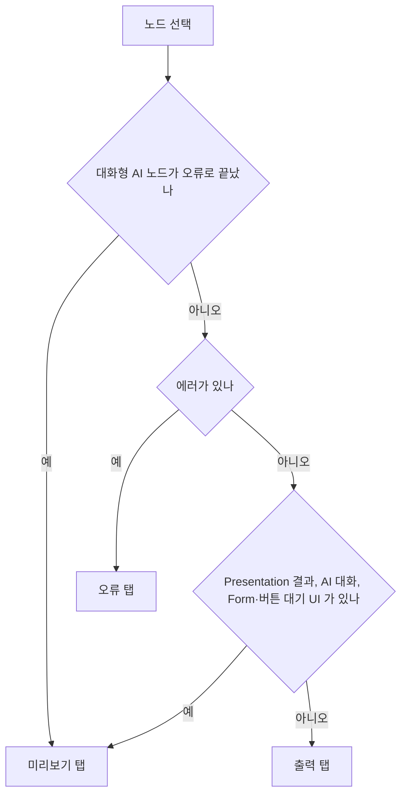

> 구현 상태: 구현됨 (브레이크포인트만 미구현 로드맵) · 원문: `spec/3-workflow-editor/3-execution.md`, `spec/3-workflow-editor/_product-overview.md` (§7 워크플로우 실행, §8 실행 디버깅), `spec/2-navigation/14-execution-history.md` (§3.4.1·§3.4.2 AI 탭 설명과 R-3) · 용어: [용어 사전](../CLE-GLOSSARY.md)

## 개요

이 문서는 워크플로우 에디터 안에서 워크플로우를 실행하고 결과를 살펴보는 방법을 정한다. 실행 방식 세 가지(전체 실행·선택 노드부터 실행·단일 노드 실행), 테스트 입력(Mock Input)과 테스트 데이터셋(`WorkflowTestDataset`), 캔버스의 실행 표시, 실행 중지, 실행 결과 드로어(Run Results drawer), 에디터 안 실행 내역 패널, 재실행 진입점, Background 본문 결과 표시가 범위다.

실행 결과 드로어는 에디터 아래쪽에 펼쳐지는 2단 패널이다. 왼쪽 실행 트리(Run Tree)에 실행된 노드가 순서대로 쌓이고 오른쪽 결과 상세 탭(`ResultDetail`)에 고른 노드의 결과가 표시된다. 실행 내역 화면의 실행 상세도 같은 결과 상세 탭을 쓴다.

범위 밖:

- 실행 이벤트와 명령의 필드·ack 형식은 [WebSocket 이벤트와 명령](../CLE-API/CLE-API-WS-EVENTS.md) 이 정한다. 이 문서는 에디터가 어떤 이벤트에 어떻게 반응하는지만 적는다.
- 실행 상태와 전이, 입력 대기와 재개 계약은 [실행 상태 머신과 대기·재개](CLE-EXEC-STATE.md), 실행 중지의 서버 쪽 관측 방식은 [노드 취소](CLE-EXEC-CANCEL.md) 가 정한다.
- 대화 미리보기의 출처별 시각 규칙·store 변환·UI 불변량은 [대화 미리보기](CLE-EXEC-PREVIEW.md), 노드 출력 필드가 화면마다 복원되는 방식은 [실행 화면 복원 규약](CLE-EXEC-HYDRATION.md) 이 정한다.
- 워크플로우별 실행 목록·실행 상세 화면과 API 는 [실행 내역](CLE-EXEC-HISTORY.md), 재실행 정책·모달·API 는 [재실행](CLE-EXEC-RERUN.md) 이 정한다.
- 에디터 전체 단축키 목록과 캔버스 컨텍스트 메뉴 구성은 [워크플로우 에디터와 캔버스](../CLE-WF/CLE-WF-EDITOR.md), 인터랙션 타입 값은 [인터랙션 타입 레지스트리](../CLE-IX/CLE-IX-TYPES.md) 가 정한다.

## 요구사항

- REQ-EXECRUN-001 WHEN 사용자가 툴바의 실행 버튼을 누르면 THE SYSTEM SHALL 워크플로우 전체를 실행한다. (원본: ED-EX-01)
- REQ-EXECRUN-002 WHEN 사용자가 노드를 고르고 툴바 실행 드롭다운의 "선택된 노드부터 실행" 을 누르면 THE SYSTEM SHALL 그 노드부터 하류 끝까지 실행한다. (원본: ED-EX-02)
- REQ-EXECRUN-003 IF 고른 노드가 없으면 THE SYSTEM SHALL 실행 드롭다운의 "선택된 노드부터 실행" 항목을 비활성화한다.
- REQ-EXECRUN-004 WHEN 사용자가 노드 우클릭 메뉴의 "이 노드 실행" 을 누르면 THE SYSTEM SHALL 그 노드 하나만 실행하고 하류로 진행하지 않는다. (원본: ED-EX-03)
- REQ-EXECRUN-005 WHEN 단일 노드 실행 요청에 `previousExecutionId` 가 있으면 THE SYSTEM SHALL 그 실행의 직속 상류 노드 출력을 노드 출력 캐시에 복원해 대상 노드의 입력을 정상 실행과 같은 경로로 재구성한다.
- REQ-EXECRUN-006 IF 단일 노드 실행 요청에 `previousExecutionId` 가 없으면 THE SYSTEM SHALL 요청 본문의 `input` 을 대상 노드의 수동 입력으로 쓴다.
- REQ-EXECRUN-007 IF 단일 노드 실행의 대상 노드가 워크플로우에 없거나 `previousExecutionId` 가 다른 워크플로우의 실행이면 THE SYSTEM SHALL 400 으로 거부한다.
- REQ-EXECRUN-008 IF 단일 노드 실행의 대상이 비활성 노드면 THE SYSTEM SHALL 일반 실행과 같이 건너뛰고 빈 결과로 완료한다.
- REQ-EXECRUN-009 WHILE 실행이 진행되는 동안 THE SYSTEM SHALL 캔버스와 실행 결과 드로어에 노드별 상태를 실시간으로 표시한다. (원본: ED-EX-04)
- REQ-EXECRUN-010 WHEN 편집자 이상 사용자가 실행 상태 바의 중지 버튼을 누르면 THE SYSTEM SHALL 현재 노드가 끝난 뒤 실행을 멈추고 실행 상태를 `cancelled` 로 바꾼다. (원본: ED-EX-05)
- REQ-EXECRUN-011 IF 사용자가 뷰어면 THE SYSTEM SHALL 중지 버튼을 표시하지 않고 서버에서도 403 으로 거부한다.
- REQ-EXECRUN-012 WHEN 실행이 끝나면 THE SYSTEM SHALL 노드를 눌러 그 노드의 최근 입력·출력 데이터를 확인할 수 있게 한다. (원본: ED-EX-06, ED-DB-01)
- REQ-EXECRUN-013 WHEN 사용자가 에디터 더보기(⋮) 메뉴의 "실행 히스토리" 를 누르면 THE SYSTEM SHALL 최근 실행 20건을 시작 시각 내림차순으로 나열한 실행 내역 패널을 연다. (원본: ED-EX-07)
- REQ-EXECRUN-014 WHEN 사용자가 실행 내역 패널의 항목을 누르면 THE SYSTEM SHALL 그 실행의 노드 결과로 실행 결과 드로어와 캔버스 상태 표시를 채운다.
- REQ-EXECRUN-015 WHEN 사용자가 "입력과 함께 실행" 을 고르면 THE SYSTEM SHALL 테스트 입력 JSON 을 편집하는 대화상자를 연다. (원본: ED-EX-08)
- REQ-EXECRUN-016 WHILE 테스트 입력이 유효한 JSON 이 아닌 동안 THE SYSTEM SHALL 인라인 오류를 표시하고 실행 버튼을 비활성화한다.
- REQ-EXECRUN-017 IF 테스트 입력의 값 자리에 마스킹 마커(`***`, `[REDACTED]`, `[REDACTED_DEPTH]`)와 정확히 같은 값이 있으면 THE SYSTEM SHALL 에디터에서 실행을 막고 서버에서 `400` 과 `details[].code = MASKED_VALUE_RESUBMITTED` 로 거부한다.
- REQ-EXECRUN-018 WHEN 사용자가 "히스토리에서 불러오기" 로 이전 실행을 고르면 THE SYSTEM SHALL 그 실행의 `inputData` 를 입력란에 채운다.
- REQ-EXECRUN-019 WHEN 사용자가 테스트 입력을 데이터셋으로 저장하면 THE SYSTEM SHALL 공개 범위를 기본 `private` 로 두고 소유자만 조회·수정·삭제하게 한다.
- REQ-EXECRUN-020 WHEN 소유자가 데이터셋을 `workspace` 로 공유하면 THE SYSTEM SHALL 같은 워크스페이스 멤버에게 그 데이터셋을 읽기 전용으로 보여 준다.
- REQ-EXECRUN-021 WHEN 멤버가 조회할 수 있는 데이터셋을 복제하면 THE SYSTEM SHALL 그 멤버 소유의 `private` 사본을 만든다.
- REQ-EXECRUN-022 IF 한 사용자가 같은 워크플로우에 같은 이름의 데이터셋을 저장하거나 복제하면 THE SYSTEM SHALL 409 `DUPLICATE_NAME` 으로 거부한다.
- REQ-EXECRUN-023 IF 소유자가 아닌 사용자가 데이터셋을 수정하거나 삭제하면 THE SYSTEM SHALL 403 으로 거부한다.
- REQ-EXECRUN-024 WHEN AI 에이전트 노드가 멀티턴 입력 대기에 들어가면 THE SYSTEM SHALL 실행 결과 드로어를 펼치고 그 노드를 골라 메시지 입력란을 표시한다. (원본: ED-EX-09)
- REQ-EXECRUN-025 WHILE 멀티턴 대화가 진행되는 동안 THE SYSTEM SHALL 실행 트리에 사용자 메시지·AI 응답·도구 호출을 미리보기 카드로 표시한다. (원본: ED-EX-10)
- REQ-EXECRUN-026 WHEN 사용자가 멀티턴 대화가 끝난 실행을 다시 열면 THE SYSTEM SHALL 전체 대화 기록을 다시 보여 준다. (원본: ED-EX-11)
- REQ-EXECRUN-027 WHEN 사용자가 completed·failed·cancelled·waiting_for_input 상태의 노드를 고르면 THE SYSTEM SHALL 미리보기·입력·출력·설정·오류 결과 상세 탭을 표시하고 AI 노드에는 LLM 사용량 탭을 더한다. (원본: ED-EX-12)
- REQ-EXECRUN-028 WHEN 사용자가 실행 트리에서 노드를 고르면 THE SYSTEM SHALL 오류, 미리보기, 출력 순서로 기본 탭을 고른다. (원본: ED-EX-13)
- REQ-EXECRUN-029 IF 대화형 AI 노드가 오류로 끝났으면 THE SYSTEM SHALL retryable 여부와 상관없이 미리보기 탭을 기본 탭으로 고른다. (원본: ED-EX-13)
- REQ-EXECRUN-030 WHEN 사용자가 멀티턴 타임라인에서 assistant 메시지를 고르면 THE SYSTEM SHALL 탭 구성을 미리보기·응답·요청·LLM 사용량으로 바꾼다. (원본: ED-EX-14)
- REQ-EXECRUN-031 IF 한 턴에 LLM 호출이 여러 개면 THE SYSTEM SHALL 호출 선택기를 표시하고 응답·요청·LLM 사용량 탭 사이를 오가도 고른 호출을 유지한다. (원본: ED-EX-14)
- REQ-EXECRUN-032 IF 고른 탭이 선택 변경으로 사라지면 THE SYSTEM SHALL 미리보기 탭이나 남은 첫 탭으로 바꾼다.
- REQ-EXECRUN-033 IF 노드 실행이 실패하면 THE SYSTEM SHALL 캔버스에서 실패 노드를 빨간색으로 강조하고 에러 메시지를 표시한다. (원본: ED-DB-02)
- REQ-EXECRUN-034 WHEN 실행이 진행되거나 끝나면 THE SYSTEM SHALL 실행된 노드·연결선과 선택된 분기를 강조하고 실행되지 않은 경로를 흐리게 표시한다. (원본: ED-DB-03)
- REQ-EXECRUN-035 WHEN 노드 실행이 끝나면 THE SYSTEM SHALL 캔버스 노드와 실행 트리 항목에 실행 시간을 표시한다. (원본: ED-DB-04)
- REQ-EXECRUN-036 WHEN 사용자가 노드에 브레이크포인트를 설정하면 THE SYSTEM SHALL 그 노드 실행 직전에 실행을 일시 정지한다. (원본: ED-DB-05) (미구현)
- REQ-EXECRUN-037 WHEN 컨테이너 본문 노드가 여러 반복 회차에서 실행되면 THE SYSTEM SHALL 회차마다 실행 트리 항목을 따로 만들고 라벨에 `(iter N)` 을 붙인다.
- REQ-EXECRUN-038 WHEN 블로킹 노드가 입력 대기에 들어가면 THE SYSTEM SHALL 드로어에서 그 노드를 자동으로 고르고 미리보기 탭에 입력 UI 를 표시한다.
- REQ-EXECRUN-039 WHEN 사용자가 입력 대기 중인 Form 노드의 폼을 제출하면 THE SYSTEM SHALL `execution.submit_form` 명령을 보내고 실행이 재개되면 상태 바를 실행 중으로 바꾼다.
- REQ-EXECRUN-040 WHEN 사용자가 버튼 대기 노드의 port 버튼을 누르면 THE SYSTEM SHALL `execution.click_button` 명령을 보내 그 포트로 실행을 재개한다.
- REQ-EXECRUN-041 WHEN 사용자가 버튼 대기 노드의 link 버튼을 누르면 THE SYSTEM SHALL 새 탭에서 URL 을 열고 실행 상태를 바꾸지 않는다.
- REQ-EXECRUN-042 IF 대화 스레드의 마지막 항목이 `retryable === true` 인 `system_error` 면 THE SYSTEM SHALL 메시지 입력란 자리에 [다시 시도] 버튼과 `retryAfterSec` 카운트다운을 표시한다.
- REQ-EXECRUN-043 WHEN 사용자가 [다시 시도] 를 누르면 THE SYSTEM SHALL `execution.retry_last_turn` 명령을 보내고 노드 상태를 `running` 으로 바꾼다.
- REQ-EXECRUN-044 WHEN 새 실행이 시작되면 THE SYSTEM SHALL 이전 실행 트리와 대화 스냅샷을 비운다.
- REQ-EXECRUN-045 WHEN 실행이 완료되거나 실패하면 THE SYSTEM SHALL 드로어와 대화 스냅샷을 그대로 유지한다.
- REQ-EXECRUN-046 WHEN 사용자가 드로어의 닫기 버튼을 누르면 THE SYSTEM SHALL 드로어를 숨기고 실행 상태를 초기화한다.
- REQ-EXECRUN-047 IF 사용자에게 재실행 권한이 없으면 THE SYSTEM SHALL 드로어의 재실행 버튼을 숨긴다.
- REQ-EXECRUN-048 WHEN 재실행 모달이 새 실행 ID 를 받으면 THE SYSTEM SHALL 드로어를 초기화하고 현재 에디터에서 새 실행을 추적한다.
- REQ-EXECRUN-049 WHEN Background 노드 카드가 처음 표시되면 THE SYSTEM SHALL `background:run:<backgroundRunId>` 채널을 구독한다.
- REQ-EXECRUN-050 WHEN `execution.background_run.completed` 를 받으면 THE SYSTEM SHALL 카드 배지를 최종 상태로 바꾸고 그 채널 구독을 해제한다.
- REQ-EXECRUN-051 IF Background 본문 노드가 50개를 넘으면 THE SYSTEM SHALL "Load more" 버튼을 표시하고 누르면 다음 페이지를 이어 붙인다.
- REQ-EXECRUN-052 WHEN 사용자가 Ctrl+Shift+R 을 누르면 THE SYSTEM SHALL 드로어 펼침을 토글하고 브라우저 강력 새로고침을 막는다.
- REQ-EXECRUN-053 WHEN 드로어에 포커스가 있을 때 사용자가 Escape 를 누르면 THE SYSTEM SHALL 포커스를 캔버스로 돌린다.
- REQ-EXECRUN-054 IF Escape 를 누를 때 드로어 안 편집 가능한 필드에 포커스가 있으면 THE SYSTEM SHALL 그 필드가 Escape 를 처리하게 둔다.

## 실행 방식

에디터에는 실행 방식이 세 가지 있다. 셋 모두 실행(`Execution`) 한 건을 새로 만들고 결과는 같은 실행 결과 드로어에 표시된다.

### 전체 실행

| 항목 | 설명 |
| --- | --- |
| 시작 | 툴바의 실행(Run) 버튼. Ctrl+Enter 단축키는 정의가 갈린다. [미결 사항](#미결-사항) 참조 |
| 시작점 | 워크플로우의 루트 노드(들어오는 연결선이 없는 노드) |
| 입력 데이터 | 테스트 입력 또는 빈 입력 |
| 종료 | 모든 리프 노드 실행이 끝나거나 에러가 나면 끝난다 |

### 선택 노드부터 실행

| 항목 | 설명 |
| --- | --- |
| 시작 | 노드를 고른 뒤 툴바 실행 드롭다운의 "선택된 노드부터 실행"(Run from Selected). 노드를 고르지 않으면 비활성 |
| 시작점 | 고른 노드 |
| 입력 데이터 | `POST /api/workflows/:id/execute` 본문의 `input.fromNodeId` 로 시작 노드를 넘긴다. 부분 실행 전용 엔드포인트는 없다 |
| 범위 | 고른 노드부터 하류(downstream) 끝까지 |

진입점은 툴바 드롭다운 하나다. 노드 우클릭 메뉴에는 이 항목이 없다.

### 단일 노드 실행

| 항목 | 설명 |
| --- | --- |
| 시작 | 노드 우클릭 메뉴의 "이 노드 실행" (`workflow-canvas.tsx` 컨텍스트 메뉴) |
| 엔드포인트 | `POST /api/workflows/:id/nodes/:nodeId/execute` ([API](#api)) |
| 범위 | 그 노드만 실행한다. 하류로 진행하지 않는다. 선택 노드부터 실행과 다르다 |
| 입력 데이터 | 직전 실행(`previousExecutionId`)의 직속 상류(predecessor) 노드 출력을 자동으로 넣는다. 엔진이 노드 출력 캐시(`nodeOutputCache`)에 미리 채워 두므로 정상 실행과 같은 방식으로 입력이 재구성된다. `previousExecutionId` 가 없으면 요청 본문 `input` 을 수동 입력으로 쓴다 |
| 출력 | 새 실행으로 기록한다. 설정 패널 Info 탭에 결과(출력·오류·소요 시간)가 표시되고 드로어 실행 트리에는 대상 노드만 나온다. `GET /api/executions/:id` 로도 조회할 수 있다 |

**동작 방식**: 엔진(`runExecution`)은 `single_node_id` 가 채워진 실행에서 대상 노드만 도달 가능 노드로 등록한다. 하류 전파(`propagateReachability`)·컨테이너 본문·Parallel 분기·되돌아가는 연결선 재진입은 하지 않는다. `previous_execution_id` 가 있으면 대상 노드의 직속 상류 출력을 `nodeOutputCache`·`structuredOutputCache` 에 복원한다. 그래서 `$node['predecessor']` 표현식과 입력 게이트가 정상 실행과 똑같이 동작한다.

**범위 한계 (v1)**: 대상은 최상위(top-level) 비블로킹 노드다(표준·AI·코드·HTTP 등). 다음은 채워 주는 범위 밖이다.

- 블로킹 대화형 노드(form·buttons·AI 멀티턴)의 park
- 컨테이너 안 노드
- 직속 상류가 아닌 노드를 가리키는 `$node[...]` 와 트리거 컨텍스트

비활성(disabled) 노드를 대상으로 하면 일반 실행과 같이 건너뛰고 빈 결과로 완료된다. 근거는 [Rationale](#rationale) 의 "단일 노드 실행" 항목에 있다.

## 테스트 입력과 테스트 데이터셋

### 입력과 함께 실행 대화상자

툴바의 "입력과 함께 실행"(Run with Input)을 고르면 테스트 입력 대화상자가 열린다.

| 영역 | 위치 | 들어가는 요소 | 동작 |
| --- | --- | --- | --- |
| 머리 | 위 | 제목, "히스토리에서 불러오기"(Load from History) 버튼 | 누르면 이전 실행 목록이 펼쳐진다. 고른 실행의 입력 데이터가 입력란에 채워진다 |
| 입력란 | 가운데 | JSON textarea | 입력할 때마다 JSON 유효성을 검사한다. 무효면 빨간 인라인 오류를 표시한다 |
| 데이터셋 | 입력란 옆 | "데이터셋으로 저장"(이름 + 워크스페이스 공유 선택), "데이터셋" 목록(불러오기·복제·삭제) | [테스트 데이터셋](#테스트-데이터셋) 참조 |
| 버튼 | 아래 | 취소, 실행 | JSON 이 무효하거나 마스킹 마커가 남아 있으면 실행이 비활성 |

### 기능

| 기능 | 상태 | 설명 |
| --- | --- | --- |
| JSON 편집 | 구현 | 테스트 입력을 JSON 으로 직접 편집한다(textarea) |
| 실시간 검증 | 구현 | 입력 중 JSON 유효성을 검사한다. 무효면 인라인 오류를 표시하고 실행을 비활성화한다 (`editor-toolbar.tsx`) |
| 히스토리 불러오기 | 구현 | 이전 실행 목록(`GET /api/executions/workflow/:id`)을 펼쳐 고르면 그 실행의 `inputData` 를 입력란에 채운다 |
| 데이터셋 저장 | 구현 | 자주 쓰는 테스트 입력을 이름 붙여 저장하고 다시 쓴다 (`WorkflowTestDataset`, V097) |

### 마스킹 마커 차단

마스킹 마커 세 문자열(`***`, `[REDACTED]`, `[REDACTED_DEPTH]`)은 값 자리에서 예약어다. 히스토리에서 왔든 직접 입력했든 에디터가 실행을 막고 서버도 `400` 과 `details[].code = MASKED_VALUE_RESUBMITTED` 로 거부한다. 정확히 일치하는 값만 보므로 `a***b` 처럼 다른 문자와 섞이면 통과한다.

- **히스토리에서 불러온 입력**: 실행의 `inputData` 는 응답 마스킹을 거쳐 내려온다. 그래서 자격 증명 자리에 마커가 실려 온다. 그대로 실행하면 마커가 새 실행의 실제 입력이 되므로 입력에 마커가 남아 있는 동안 실행 버튼이 비활성이다. 마커를 실제 값으로 바꾸면 풀린다. 표시는 실시간 검증과 같은 인라인 오류 자리를 쓴다 (`editor-toolbar.tsx`).
- **서버 2층 차단**: 에디터의 차단은 화면 경로에만 있어 API 를 직접 부르면 우회된다. 그래서 서버가 같은 값을 한 번 더 거부한다. 에디터 차단은 어느 필드가 문제인지 그 자리에서 보여 주는 안내로 남는다.

마스킹 범위와 근거는 [응답 자격 증명 마스킹](../CLE-API/CLE-API-EGRESS.md) 이 정한다. 재실행 모달의 같은 차단은 [재실행](CLE-EXEC-RERUN.md) 에 있다.

### 테스트 데이터셋

테스트 데이터셋은 워크플로우에 딸린 이름 있는 테스트 입력이다. 엔티티 컬럼은 [실행 데이터와 흐름](CLE-EXEC-DATA.md) 이 정한다.

| 규칙 | 설명 |
| --- | --- |
| 기본 공개 범위 | `private`. 소유자만 조회·수정·삭제한다 |
| 워크스페이스 공유 | 소유자가 `workspace` 로 올리면 같은 워크스페이스 멤버가 불러오기만 할 수 있다(읽기 전용) |
| 복제 | 다른 멤버는 공유본을 복제(clone)해 자기 소유 `private` 사본을 만든 뒤 고친다. 원본은 소유자만 바꾼다 |
| 이름 중복 | `(workflow_id, owner_id, name)` 이 UNIQUE 다. 같은 이름으로 저장하거나 복제하면 409 `DUPLICATE_NAME` |
| 워크스페이스 격리 | `workspace_id` 를 비정규화해 저장한다. 공유 목록 조회와 격리에 쓴다 |
| 권한 | 목록·저장·수정·삭제·복제 모두 편집자 이상 |

## 캔버스 실행 표시

### 실행 상태 바

실행이 시작되면 에디터 위쪽에 실행 상태 바가 나타나고 모든 노드가 대기 표시로 초기화된다.

| 상태 | 상태 바 표시 | 캔버스 표시 |
| --- | --- | --- |
| 실행 중 | `▶ Running...  0.5s elapsed  [■ Stop]` | 실행 중 노드는 파란 테두리 펄스. 완료 노드는 아래에 초록 체크와 실행 시간. 연결선에는 점이 움직이는 데이터 흐름 애니메이션 |
| 완료 | `✅ Completed  2.3s  10/10 nodes  [Details]` | 실행된 경로만 강조 |
| Form·버튼 입력 대기 | `⏸ Waiting for input  "Approval Form"  [Results ↑] [■]` | 대기 노드에 입력 대기 아이콘(⏸)과 분홍 테두리 펄스 |
| 멀티턴 대화 | `💬 Conversing  "CS Bot"  Turn 2/20  [Results ↑] [■]` | AI 에이전트 노드에 💬 아이콘과 초록 테두리 펄스 |
| 실패 | `❌ Failed at "Node C"  1.2s  5/10 nodes` 와 `Error: Connection timeout  [Details]` | 실패 노드를 빨간색으로 강조. 누르면 에러 상세 |

### 실행 경로 표시

- 실행된 노드와 연결선을 강조하고 실행되지 않은 노드와 연결선은 흐리게 표시한다.
- If/Else·Switch 처럼 분기하는 노드는 어느 분기를 탔는지 분명히 보인다.
- Presentation 노드가 끝나면 노드 오른쪽 아래에 👁 배지가 붙는다. 누르면 드로어에서 그 노드로 이동한다.

### 입력 대기 중 동작

Form 노드가 입력을 기다리면 다음처럼 동작한다.

1. 실행 결과 드로어가 자동으로 펼쳐지고 그 노드의 미리보기 탭이 선택된다.
2. 미리보기 탭에 실제 폼 UI 가 렌더되고 사용자가 제출할 수 있다.
3. 제출하면 실행이 자동으로 재개된다. 미리보기 탭은 제출 결과 표시로 바뀌고 상태 바는 "▶ Running..." 으로 돌아간다.

AI 에이전트 노드가 멀티턴으로 입력을 기다리면 다음처럼 동작한다.

1. 드로어가 자동으로 펼쳐지고 그 AI 에이전트 노드가 선택된다.
2. 실행 트리에 대화 메시지(사용자 메시지·AI 응답·도구 호출)가 미리보기 카드로 표시된다.
3. 결과 상세 아래쪽에 메시지 입력 UI(textarea, 보내기, 종료 버튼)가 나온다.
4. 사용자 메시지를 보내면 실행 트리에 즉시 추가되고(optimistic), AI 응답을 기다리는 동안 입력이 비활성이다.
5. AI 응답이 오면 실행 트리에 추가되고 입력이 다시 활성화된다.
6. 종료를 누르면 대화가 끝나고 실행이 재개된다. 상태 바는 "▶ Running..." 으로 바뀐다.

버튼이 설정된 Presentation 노드(Carousel·Table·Chart·Template)도 입력 대기로 멈춘다. 이때도 드로어가 펼쳐지고 그 노드가 선택되며 미리보기 탭에 렌더된 콘텐츠와 버튼 바가 표시된다. port 버튼을 누르면 그 포트로 실행이 재개된다. 버튼별 동작은 [라이프사이클](#라이프사이클) 의 버튼 행을 따른다.

## 실행 중지

| 항목 | 설명 |
| --- | --- |
| 버튼 | 실행 상태 바의 중지 버튼 |
| 동작 | 현재 실행 중인 노드가 끝난 뒤 멈춘다 (graceful) |
| 강제 중단 | 중지 버튼을 3초 이상 누르면 즉시 중단한다(Force). 정의가 갈린다. [미결 사항](#미결-사항) 참조 |
| 결과 상태 | 실행 상태 `cancelled` |
| 권한 | 편집자 이상. 뷰어에게는 중지 버튼이 보이지 않고(프런트 `canEdit` 가드), 서버도 `@Roles('editor')` 로 403 을 낸다. 근거는 [워크스페이스와 멤버](../CLE-ACCT/CLE-ACCT-WS.md) 권한 매트릭스의 "Workflow 실행" 행(소유자·관리자·편집자 허용, 뷰어 불가)이다 |

중지는 REST `POST /api/executions/:id/stop` 으로 보낸다. 진행 중인 노드가 중지를 언제 알아채는지는 [노드 취소](CLE-EXEC-CANCEL.md) 가 정한다.

## 노드 결과 조회

캔버스에서 노드를 누르면 설정 패널 아래쪽(또는 Info 탭)에 마지막 실행 결과가 표시된다.

| 영역 | 들어가는 요소 |
| --- | --- |
| 머리 | "Last Execution", 상태와 소요 시간(예: `✅ Completed (0.12s)`) |
| 입력 | 접을 수 있는 Input JSON |
| 출력 | 접을 수 있는 Output JSON |
| 버튼 | Copy Input, Copy Output |

Presentation 노드 결과는 실행 결과 드로어와 설정 패널 Info 탭 양쪽에 렌더된 모양으로 표시된다. 렌더 방식은 [Presentation 노드 콘텐츠](#presentation-노드-콘텐츠) 를 따른다. 실행 중이거나 끝난 뒤 Presentation 노드 결과를 보는 주 경로는 실행 결과 드로어다.

## 실행 결과 드로어

실행 결과 드로어는 워크플로우를 실행하면 **모든 노드**의 실행 상태와 결과를 실시간으로 보여 주는 하단 패널이다.

### 원칙

- 실행된 모든 노드가 실행 트리에 표시된다. Trigger·Logic·Data·AI·Integration·Presentation 이 모두 포함된다.
- 실행을 멈추는 노드는 블로킹 노드뿐이다. Form 노드, 버튼이 설정된 Presentation 노드, 멀티턴 AI 노드가 입력 대기에 들어간다. 나머지 노드는 실행을 멈추지 않는다. 멈추는 조건은 [실행 상태 머신과 대기·재개](CLE-EXEC-STATE.md) 가 정한다.
- 드로어는 2단이다. 왼쪽이 실행 트리, 오른쪽이 결과 상세다.
- Presentation 노드는 전용 렌더러(테이블·차트 등)로, 나머지 노드는 JSON 뷰어로 표시한다.

### 레이아웃

| 영역 | 위치 | 들어가는 요소 | 동작 |
| --- | --- | --- | --- |
| 드래그 핸들 | 맨 위 | 핸들 | 끌어서 높이를 바꾼다. 높이는 localStorage 에 저장한다 |
| 머리 | 위 | 상태 아이콘, 상태 라벨, 노드 카운터, 재실행 버튼, 최소화 `[−]`, 닫기 `[✕]` | [헤더](#헤더) 참조 |
| 실행 트리 | 왼쪽 | 노드 항목 목록 | 폭 280–640px, 기본 400px. 폭도 localStorage 에 저장한다 |
| 결과 상세 | 오른쪽 | 선택한 노드의 탭과 내용 | 남은 폭을 모두 쓴다 |

| 속성 | 값 |
| --- | --- |
| 기본 높이 | 420px |
| 최소 높이 | 240px |
| 최대 높이 | 뷰포트의 60% |
| 위치 | 캔버스 영역 아래, 전체 폭 |
| 접힌 상태 | 36px 높이 바. 상태 아이콘, 라벨, 노드 카운터만 남는다 |
| 쌓임 순서 | 캔버스 위, 모달·대화상자 아래 |

### 헤더

| 요소 | 설명 |
| --- | --- |
| 상태 아이콘 | 🔄 Running, ✅ Completed, ❌ Failed, ⏸ Waiting |
| 상태 라벨 | "Running...", "Completed", "Failed", "Waiting for input..." |
| 노드 카운터 | `N/M nodes`. 완료 수와 전체 수다. 실패 노드가 있으면 `(N failed)` 를 붙인다 |
| 최소화 `[−]` | 드로어를 접힌 상태로 줄인다 |
| 닫기 `[✕]` | 드로어를 완전히 숨기고 실행 상태를 초기화한다 |

상태 바 예시는 다음과 같다.

| 상태 | 표시 |
| --- | --- |
| 실행 중 | `🔄 Running...   3/10 nodes   [−] [✕]` |
| 완료 | `✅ Completed    10/10 nodes   [−] [✕]` |
| 입력 대기 | `⏸ Waiting for input...   5/10 nodes   [−] [✕]` |
| 실패 | `❌ Failed       5/10 nodes (1 failed)   [−] [✕]` |

### 실행 트리

실행 트리는 실행된 노드를 시간순으로 나열하는 좁은 목록이다.

| 요소 | 설명 |
| --- | --- |
| 카테고리 색 점 | Trigger 🟡, Logic 🔵, Flow 🟣, AI 🟢, Integration 🟠, Data 🔵, Presentation 🩷 |
| 노드 라벨 | 사용자가 붙인 라벨 또는 노드 유형 이름. 길면 자른다 |
| 상태 아이콘 | ⏳ Running(스피너), ✅ Completed, ❌ Failed, ⏸ Waiting, — Skipped |
| 실행 시간 | 예: "142ms", "1.2s" |
| 클릭 | 그 노드를 결과 상세에 표시한다 |

새 항목이 추가되면 자동으로 아래로 스크롤한다. 첫 노드가 자동으로 선택된다. 블로킹 노드가 입력 대기에 들어가면 그 노드가 자동으로 선택된다.

**컨테이너 본문 노드의 반복 표시**: Loop·ForEach·Map 같은 컨테이너의 본문 노드는 한 실행 안에서 여러 반복 회차에 걸쳐 실행된다. 반복 회차마다 **실행 트리 항목이 따로** 생긴다.

- 같은 노드가 여러 번 나오면 라벨에 `(iter N)` 이 자동으로 붙는다. 예: `Transform (iter 1)`, `Transform (iter 2)`.
- 항목 하나는 노드 실행(`NodeExecution`) 행 하나에 대응하고 `nodeExecutionId` 로 구분한다.
- 항목마다 입력·출력을 따로 볼 수 있다. 특정 회차의 실패 원인을 찾을 때 쓴다.
- 한 번만 실행된 노드에는 접미사가 붙지 않는다.
- 컨테이너 안 Presentation 노드의 표시는 정의가 갈린다. [미결 사항](#미결-사항) 참조.

노드 이벤트(`execution.node.started`·`completed`·`skipped`·`failed`·`cancelled`)와 `execution.waiting_for_input` 에는 `nodeExecutionId` 가 실려 있어 에디터가 회차를 구분한다. REST 폴링도 `nodeExecution.id` 로 합쳐지므로 같은 회차가 두 번 생기지 않는다. 필드 정의는 [WebSocket 이벤트와 명령](../CLE-API/CLE-API-WS-EVENTS.md) 이 정한다.

**AI 멀티턴 노드**: AI 에이전트 멀티턴 노드는 접고 펼 수 있는(►/▼) 트리 항목으로 표시된다. 펼치면 대화 턴이 미리보기 카드로 들어간다.

| 항목 | 아이콘 | 미리보기 | 배지 |
| --- | --- | --- | --- |
| AI 에이전트 부모(접힘) | ► 🤖 | 노드 라벨 | `Turn N/M` 과 상태 |
| AI 에이전트 부모(펼침) | ▼ 🤖 | 노드 라벨 | `Turn N/M` 과 상태 |
| 사용자 메시지 | 👤 | 메시지 앞 두 줄 | 없음 |
| AI 응답 | 🤖 | 응답 앞 두 줄 | `📚 N`, `🔧 N` (있을 때만) |
| 도구 호출 | 🔧 | 도구 이름 | 🔄 pending, ✓ success, ✗ error |
| 시스템 에러(`system_error`) | ❌ | `<code>`(예: `LLM_RATE_LIMIT`)와 메시지 첫 줄 | retryable 이면 `[다시 시도]`, 아니면 없음 |

대화가 진행 중일 때(Live)는 자동으로 펼치고 새 메시지가 오면 자동으로 스크롤한다. 대화가 끝난 뒤(History)에는 접힌 상태가 기본이고 눌러서 편다. 항목별 시각 규칙과 도구 호출 묶음은 [대화 미리보기](CLE-EXEC-PREVIEW.md) 가 정한다.

### 결과 상세 탭

결과 상세의 머리에는 카테고리 색 점, 노드 라벨, 노드 유형 이름, 상태 배지, 실행 시간이 표시된다.

completed·failed·cancelled·waiting_for_input 상태 노드는 머리 아래에 탭 바를 표시한다. `cancelled` 노드는 `failed` 와 같은 입력·출력·오류 탭 배치를 쓰고 오류 탭에 취소(`AbortError`) 내용을 표시한다. AI 에이전트·정보 추출기·텍스트 분류기 같은 AI 노드도 같은 탭 UI 를 쓴다. 대화형 노드는 미리보기 탭 안에 대화 미리보기를 렌더한다.

탭 구성은 선택 대상에 따라 세 가지다.

| 선택 대상 | 탭 바 |
| --- | --- |
| 일반 노드 | `[미리보기]  입력  출력  설정` |
| AI 노드(노드 수준, 메시지 미선택) | `[미리보기]  입력  출력  LLM 사용량  설정` |
| 멀티턴 AI 노드에서 assistant 메시지 선택 | `[미리보기]  응답  요청  LLM 사용량` |

| 탭 | 표시 조건 | 내용 |
| --- | --- | --- |
| 미리보기(Preview) | Presentation 노드이고 `outputData` 가 있을 때, AI 대화형 노드일 때, Form·버튼 대기 UI 가 있을 때. **AI 대화형 노드는 `status` 로 가르지 않는다.** 대화 데이터(`outputData` 의 대화 형태 또는 live store 스냅샷)가 있으면 오류로 끝난(`failed`) 노드에서도 표시한다 ([대화 미리보기](CLE-EXEC-PREVIEW.md) Inv-8) | 시각 미리보기. 테이블·캐러셀·차트, 폼·버튼 대기 UI, 대화 미리보기. 출력 JSON 은 출력 탭에서 본다 |
| 입력(Input) | 노드 수준에서 항상 | 노드에 전달된 `inputData` JSON. 폴링으로 받기 전에는 "Loading..." |
| 출력(Output) | 노드 수준에서 항상 | 노드의 `outputData` JSON. AI 노드는 Model·Tokens·Turn Count·Tool Calls 메타데이터 표를 위에 함께 표시한다 |
| 응답(Response) | AI 노드에서 assistant 메시지를 골랐을 때 | 그 턴 LLM 호출의 `responsePayload` JSON. 한 턴에 호출이 여러 개(도구 루프·재시도)면 위쪽 호출 선택기로 고른다 |
| 요청(Request) | AI 노드에서 assistant 메시지를 골랐을 때 | 그 턴 LLM 호출의 `requestPayload` JSON. 응답 탭과 호출 선택기를 같이 쓴다 |
| LLM 사용량(LLM Usage) | AI 노드 | 노드 수준은 노드 전체 합계(Model, Total·Request·Response·Thinking Tokens, Turn Count, Tool Calls, LLM Calls). 메시지 수준은 고른 호출의 토큰·지연 시간 |
| 설정(Config) | 노드 수준에서 항상 | 핸들러가 싣는 설정 에코(`config`). 새 출력 형태를 쓰는 노드만 있다. 지원하지 않는 노드는 안내 문구 |
| 참조(References) | AI 노드에서 지식 저장소 검색을 시도했을 때(노드 수준, 또는 assistant 메시지를 고르면 그 턴) | 턴별로 쓰인 지식 저장소 청크 |
| 메타(Meta) | 노드 출력에 실행 메트릭 `meta`(durationMs·statusCode·토큰 등)가 있을 때(노드 수준) | 실행 메트릭 표 |
| 포트(Port) | 노드 출력에 `port` 값이 있을 때(노드 수준) | 엔진이 고른 출력 포트 |
| 상태(Status) | 노드 출력에 흐름 지시 상태 `status` 가 있을 때(노드 수준) | 흐름 지시 상태 값 |
| 오류(Error) | 에러가 있을 때만(노드 수준) | 에러 정보 JSON |

**기본 탭 고르기**: 실행 트리에서 노드를 누르면 다음 순서로 기본 탭을 고른다.

1. 에러가 있으면 오류 탭.
2. Presentation 노드이고 `outputData` 가 있거나 AI 대화형·Form·버튼 대기 UI 가 있으면 미리보기 탭.
3. 그 밖에는 출력 탭.

예외가 하나 있다. 대화형 AI 노드가 **오류로 끝났으면**(`output.error` 가 채워짐, retryable 여부와 상관없음) 미리보기 탭이 먼저다. 대화 스레드 안에 `system_error` 항목이 인라인으로 표시되므로 사용자는 대화 흐름 안에서 에러를 보고 retryable 이면 [다시 시도] 버튼까지 그 자리에서 쓸 수 있다. 오류 탭은 디버깅용으로 계속 열 수 있다.

이 예외는 `execution.node.failed` 로 판정한다. 엔진은 대화형 AI 노드의 턴 오류를 예외 없이 `finalizeAiNode(finalStatus: 'FAILED')` 로 FAILED 처리하므로([AI 에이전트 노드 출력과 디버그](../CLE-NODE-AI/CLE-NODE-AGENT-OUTPUT.md)) 실제로 오는 경로는 `execution.node.failed` 뿐이다. 핸들러 출력의 `port: 'error'`·`status: 'ended'` 만으로는 `node.completed` 가 발생하지 않는다. 그래서 `port: 'error'` 를 기본 탭 판정 조건으로 쓰지 않는다.

**AI 노드의 출력 탭**: AI 노드(AI 에이전트, 정보 추출기, 텍스트 분류기)의 출력 탭은 JSON 위에 다음 요소를 더 표시한다.

- **AI 메타데이터 표**: Model, Total·Request·Response·Thinking Tokens, Turn Count(멀티턴), Tool Calls(AI 에이전트).
- **추출 필드 카드**(정보 추출기 전용): 수집한 필드를 라벨-값 표로 보여 준다. 아직 수집하지 않은 필드는 흐린 "—" 로 자리만 둔다. 입력 대기 중에는 재수집 횟수(`재수집 n/m`)도 위에 표시한다.

**LLM 사용량·응답·요청 탭**: AI 노드에서만 나오는 최상위 탭이다.

- 노드 수준(메시지 미선택)에서는 LLM 사용량 탭 하나만 나온다. 노드 전체 합계를 보여 준다. 백엔드 핸들러가 호출별 기록(`_llmCalls` 또는 `_turnDebugHistory`)을 저장하지 않은 실행(옛 기록 포함)은 "정보 없음" 자리 표시를 보여 준다.
- 메시지 수준(AI 에이전트·정보 추출기 멀티턴에서 assistant 메시지 선택)에서는 응답(`responsePayload` 전체 JSON), 요청(`requestPayload` 전체 JSON, model·messages·tools·responseFormat 등), LLM 사용량(고른 호출의 Model, Input·Output·Total·Thinking Tokens, Latency)이 나온다.
- **호출 선택기**: 같은 턴에 LLM 호출이 2개 이상일 때(도구 호출 루프, 정보 추출기 재수집 반복) 각 탭 위에 드롭다운이 나온다. 호출이 하나뿐이면 숨긴다.

**탭 자동 전환**: 사용자가 고른 탭이 선택 변경으로 사라지면(예: 노드 수준에서 메시지 수준으로 바뀌어 입력·출력·설정이 사라질 때) 미리보기 탭이나 남은 첫 탭으로 자동으로 바꾼다. 호출 선택기의 선택은 응답·요청·LLM 사용량 탭 사이를 오가도 유지된다.

**입력 대기 노드의 탭**:

- Form 입력 대기: 미리보기 탭에 인터랙티브 폼 UI. 입력·출력 탭도 열 수 있다.
- 버튼 대기: 미리보기 탭에 렌더된 콘텐츠와 버튼 바. 입력·출력 탭도 열 수 있다.
- AI 멀티턴 대기: 미리보기 탭에 대화 미리보기(메시지 입력 포함). 다른 탭은 일반 AI 노드와 같다.
- 기본 탭은 미리보기다. 인터랙티브 콘텐츠가 있기 때문이다.

**탭이 없는 경우**: running·pending 상태의 비대화형 노드는 탭 없이 평면 배치로 표시한다.

**입력 데이터 흐름**:

- `execution.node.completed` 이벤트는 `input` 필드에 `NodeExecution.inputData` 를 싣는다. 값 패턴 마스킹이 적용된다([응답 자격 증명 마스킹](../CLE-API/CLE-API-EGRESS.md)).
- REST 폴링(2초 간격)도 **같은 store 자리**를 채운다. 두 경로의 마스킹 정책이 다르면 폴링이 마스킹된 값을 원문으로 덮는 flip-flop 이 생긴다. 지금은 REST 와 WebSocket 이 같은 규칙을 써서 그런 일이 없다.
- 늦게 오는 WebSocket 이벤트가 이미 받은 값을 지우지 않도록 합칠 때 `??` 로 기존 값을 보존한다.

#### Presentation 노드 콘텐츠

| 노드 유형 | 렌더 |
| --- | --- |
| Carousel | 가로 스크롤 텍스트 중심 카드 목록. 제목·설명·버튼 라벨, `layout` 배지, lazy 썸네일(이미지 매핑 확인용). 시각 레이아웃 재구성은 대화형 채널이 맡는다([Presentation 노드 공통](../CLE-NODE-PRES/CLE-NODE-PRES-COMMON.md)) |
| Carousel(버튼 대기 중) | 카드 목록과 **버튼 바**. port 버튼을 누르면 `execution.click_button` 명령을 보내고 link 버튼을 누르면 새 탭에서 URL 을 연다. link 버튼만 있으면 암시적 `[Continue →]` 를 표시한다. 타임아웃이 설정되면 남은 시간 카운트다운을 표시한다는 서술은 정의가 갈린다. [미결 사항](#미결-사항) 참조 |
| Carousel(버튼 클릭 후) | 누른 버튼 라벨, 누른 시각과 누른 사람 |
| Table | 테이블. 컬럼 헤더와 행 데이터. 최대 표시 행 수는 정의가 갈린다. [미결 사항](#미결-사항) 참조 |
| Table(버튼 대기 중·클릭 후) | Carousel 과 같은 버튼 바 동작과 클릭 후 표시 |
| Chart | `output.data` 와 `config`(차트 유형·제목)로 화면에서 차트를 다시 그린다. 렌더 규칙은 [Chart 노드](../CLE-NODE-PRES/CLE-NODE-CHART.md) 가 정한다 |
| Chart(버튼 대기 중·클릭 후) | Carousel 과 같은 버튼 바 동작과 클릭 후 표시 |
| Template | `outputFormat` 에 따라 HTML 로 렌더하거나 텍스트 코드 블록으로 표시한다 |
| Template(버튼 대기 중·클릭 후) | Carousel 과 같은 버튼 바 동작과 클릭 후 표시 |
| Form(대기 중) | **인터랙티브 폼 UI**. 제목, 설명, 동적으로 만든 필드 목록, 제출 버튼. 제출하면 `execution.submit_form` 명령을 보낸다 |
| Form(제출 후) | 제출된 데이터를 키-값으로 표시 |

노드별 데이터 필드와 버튼 동작의 기준은 [Presentation 노드 공통](../CLE-NODE-PRES/CLE-NODE-PRES-COMMON.md) 이다.

#### AI 멀티턴 콘텐츠

실행 트리에서 대화 항목을 누르면 결과 상세의 탭 구성과 내용이 선택 대상에 따라 바뀐다.

| 누른 대상 | 탭 구성 | 표시 내용 |
| --- | --- | --- |
| AI 에이전트 부모 노드(메시지 미선택) | 미리보기·입력·출력·LLM 사용량·설정·(오류) | 미리보기에 대화 미리보기. 출력은 요약(Model, Turns, Tokens, Tool Calls, End Reason)과 최종 응답. LLM 사용량은 노드 전체 토큰·호출 수 |
| 사용자 메시지 | 미리보기만 | 대화 미리보기에서 그 메시지를 강조하고 전체 텍스트를 표시 |
| AI 응답(assistant) | 미리보기·응답·요청·LLM 사용량 | 미리보기는 응답 텍스트. 응답·요청은 그 턴 LLM 호출 페이로드 JSON. LLM 사용량은 그 호출의 토큰·지연 시간. 한 턴에 호출이 여럿이면 위쪽 호출 선택기로 바꾼다 |
| 도구 호출 | 미리보기만 | 대화 미리보기에 도구 이름, Arguments JSON, Result JSON |

대화가 진행 중일 때는 결과 상세 아래쪽에 메시지 입력 UI(textarea, 보내기, 종료)가 고정된다. AI 응답을 기다리는 동안 입력은 비활성이고 로딩이 표시된다. 실행 트리의 어느 항목을 눌러도 입력 영역은 남는다.

**재시도 가능한 에러로 끝났을 때 입력 영역**: 대화 스레드의 마지막 항목이 `system_error` 이고 `data.retryable === true` 면 textarea 와 보내기 버튼 자리에 `[다시 시도]` 버튼과 `data.retryAfterSec` 카운트다운이 나온다.

1. 누르면 `execution.retry_last_turn` 명령을 보낸다. 노드 상태가 `running` 으로 바뀌고 버튼 자리가 스피너로 바뀐다.
2. 새 `ai_assistant` 턴이 오면 스레드에 자연 순서로 추가되고 입력 영역이 일반 textarea 로 돌아온다.
3. `retryable === false` 이거나 `system_error` 가 스레드 마지막이 아니면 일반 입력 영역을 표시한다.

이 매핑의 시각 규칙과 회귀 시나리오(CT-S9~S11)는 [대화 미리보기](CLE-EXEC-PREVIEW.md) 가 정한다.

정보 추출기 노드의 멀티턴 모드도 같은 탭 구성을 따른다. 텍스트 분류기 노드는 호출이 한 번뿐이라 실행 트리에 assistant 메시지 항목이 없고 노드 수준 탭(LLM 사용량 포함)만 있다.

#### 일반 노드 콘텐츠

Presentation 이 아닌 노드는 일반 렌더러로 표시한다.

| 요소 | 설명 |
| --- | --- |
| 에러 표시 | 실패하면 에러 메시지를 빨간 배경으로 강조 |
| 상태·실행 시간 | Status 와 Duration 텍스트 |
| 출력 | 접고 펼 수 있는 JSON 뷰어. 노드의 `outputData` 를 구조화해 표시 |

노드를 고르지 않았으면 "Select a node to view details" 안내를 표시한다.

### 라이프사이클

| 이벤트 | 드로어 동작 |
| --- | --- |
| 실행 시작 | 드로어를 표시하고 실행 트리를 비운다. "Waiting for nodes..." 를 표시한다 |
| 노드 실행 시작 | 실행 트리에 running 항목을 추가하고 자동으로 스크롤한다 |
| 노드 실행 완료 | 항목 상태를 completed·failed·skipped 로 바꾼다. `output.error` 가 채워진 멀티턴 AI 에이전트 종료면 대화 스레드 마지막에 `system_error` 항목을 붙인다 |
| 노드 취소(`execution.node.cancelled`) | 외부 `abortSignal`(AbortError)로 멈춘 노드를 종료 상태로 처리한다. 항목이 running 에 남지 않는다 ([실행 상태 머신과 대기·재개](CLE-EXEC-STATE.md)) |
| Form 노드 입력 대기 진입 | 그 노드를 자동으로 고르고 결과 상세에 폼 UI 를 표시한다 |
| Form 제출 | 실행이 재개되고 상태 바가 "🔄 Running..." 으로 바뀐다 |
| 버튼 Presentation 노드 입력 대기 진입 | 그 노드를 자동으로 고르고 결과 상세에 렌더된 콘텐츠와 버튼 바를 표시한다. 캔버스에는 `⏸` 아이콘과 분홍 테두리 펄스 |
| 버튼 클릭(port) | `execution.click_button` 명령을 보낸다. 그 포트로 실행이 재개되고 상태 바가 "🔄 Running..." 으로 바뀐다 |
| 버튼 클릭(link) | 새 탭에서 URL 을 연다. 실행 상태는 바뀌지 않는다 |
| Continue 클릭 | `execution.click_button`(`__continue__`)을 보낸다. `continue` 포트로 실행이 재개된다 |
| 실행 재개(`execution.resumed`) | 입력 대기 뒤 실행이 다시 진행된다 |
| AI 멀티턴 입력 대기 진입 | 그 노드를 자동으로 고르고 펼친다. 실행 트리에 대화 미리보기를, 결과 상세에 입력 UI 를 표시한다 |
| 멀티턴 사용자 메시지 전송 | 실행 트리에 사용자 메시지를 optimistic 으로 추가하고 입력을 비활성화한다 |
| 도구 호출 시작(`execution.tool_call_started`) | 실행 트리에 pending 상태 🔧 도구 항목을 추가한다(스피너) |
| 도구 호출 완료(`execution.tool_call_completed`) | `toolCallId` 로 항목을 찾아 success·error 로 바꾸고 결과 상세에 인자·결과·에러를 표시한다 |
| 멀티턴 AI 응답 수신(`execution.ai_message`) | `messages` 스냅샷으로 실행 트리를 다시 만든다. user·assistant·tool 이 모두 들어가고 `toolCallId` 로 중복을 없앤다. 입력을 다시 활성화한다 |
| 멀티턴 대화 종료(종료 버튼·maxTurns) | 실행이 재개되고 상태 바가 "🔄 Running..." 으로 바뀐다 |
| 멀티턴 오류 종료(`output.error` 채워짐, 엔진이 `node.failed` 발생) | 노드 상태를 `failed` 로 바꾸고 대화 스레드 마지막에 `system_error` 항목을 자동으로 붙인다. **미리보기 탭을 유지하고 기본으로 고른다**(retryable 무관, Inv-8). `details.retryable === true` 면 입력 영역이 `[다시 시도]` 와 `retryAfterSec` 카운트다운으로 바뀌고 `false` 면 액션 영역이 비어 있다. 노드 `outputData` 는 실패해도 저장·전송되므로 새로고침 뒤 내역 화면에서도 대화가 복원된다. 이때는 재시도 버튼만 숨는다 |
| 멀티턴 재시도 클릭(`execution.retry_last_turn`) | 노드 상태를 `running` 으로 바꾸고 `system_error` 항목의 `[다시 시도]` 버튼을 스피너로 바꾼다. 새 `ai_assistant` 턴이 오면 자연 순서로 추가하고 입력 영역을 일반 textarea 로 되돌린다 |
| 끝난 멀티턴 노드 클릭(내역) | 접힘·펼침을 바꾸고 대화 기록 미리보기를 표시한다. 입력 영역은 없다 |
| 실행 완료 | 드로어를 유지한다. 실행 트리에서 노드를 눌러 결과를 살펴본다. **대화 스냅샷을 보존한다** |
| 실행 실패 | 드로어를 유지하고 실패 시점까지의 노드 기록을 표시한다. **대화 스냅샷을 보존한다**(Inv-6). 멀티턴 AI 에이전트의 대화가 노드 실패와 함께 사라지지 않는다 |
| 새 실행 시작 | 이전 기록을 지우고 드로어를 초기화한다. **대화 스냅샷도 지운다.** 이 초기화는 `startExecution` 에만 적용된다 |
| 드로어 닫기(`[✕]`) | 실행 상태를 초기화한다 |
| 노드 없는 실행 | "No nodes executed" 를 표시한다 |

멀티턴 관련 행(`tool_call_started`·`tool_call_completed`·`ai_message`·`waiting_for_input`)이 대화 UI 에서 store 의 `conversationMessages` 를 어떻게 바꾸는지(UPSERT·UPDATE·REPLACE 와 carry-over), 실행 단계별 store 초기화 정책은 [대화 미리보기](CLE-EXEC-PREVIEW.md) 가 한 곳에서 정한다. 위 표의 "다시 만든다" 는 그 계약을 따른다.

### 노드 결과 수집

에디터는 모든 노드 이벤트(`execution.node.started`·`completed`·`failed`·`skipped`·`cancelled`)를 받아 실행 트리에 반영한다. REST 폴링으로도 노드 관계가 포함된 `NodeExecution` 데이터를 받아 맞춘다. 각 이벤트에 어떤 필드가 실리는지는 [WebSocket 이벤트와 명령](../CLE-API/CLE-API-WS-EVENTS.md) 이 정한다.

### 설정 패널과 함께 쓰기

실행 결과 드로어와 오른쪽 설정 패널은 동시에 표시될 수 있다. 설정 패널은 오른쪽, 드로어는 아래쪽에 있고 그만큼 캔버스 영역이 줄어든다.

### 단축키

에디터 전역 키 핸들러(`workflow-editor.tsx`)가 드로어 단축키 두 개를 처리한다. 드로어 펼침 상태는 `execution-store.drawerExpanded` 에 있어 단축키와 헤더 펼침 버튼이 같은 상태를 쓴다. 에디터 단축키 전체 목록은 [워크플로우 에디터와 캔버스](../CLE-WF/CLE-WF-EDITOR.md) 가 정한다.

| 단축키 | 동작 |
| --- | --- |
| Ctrl + Shift + R | 드로어 펼침·접힘 토글. 브라우저 강력 새로고침 기본 동작은 `preventDefault` 로 막는다 |
| Escape(드로어 포커스 시) | 캔버스로 포커스를 돌린다. 드로어 안 편집 가능한 필드(input·textarea·select·contenteditable)에 포커스가 있으면 그 요소가 Escape 를 처리하게 둔다 |

## 에디터 안 실행 내역 패널

에디터 더보기(⋮) 메뉴의 "실행 히스토리" 항목을 누르면 모달 형태의 실행 내역 패널이 열린다 (`editor-toolbar.tsx` → `run-results/execution-history-panel.tsx`). 새 백엔드나 엔티티 없이 기존 API 를 다시 쓴다. 목록은 `GET /api/executions/workflow/:id`, 상세는 `GET /api/executions/:id` 다. 페이지네이션·필터·정렬이 필요한 탐색은 [실행 내역](CLE-EXEC-HISTORY.md) 화면이 맡는다.

| 영역 | 위치 | 들어가는 요소 | 동작 |
| --- | --- | --- | --- |
| 머리 | 위 | 제목 "Execution History", "전체 실행" 링크, 닫기 `[✕]` | "전체 실행" 은 실행 내역 화면으로 이동한다 |
| 목록 | 가운데 | 최근 실행 20건(시작 시각 내림차순) | 항목을 누르면 아래처럼 그 실행을 불러온다 |

각 항목에는 상태 아이콘, 실행 출처(아이콘과 라벨, [실행 내역](CLE-EXEC-HISTORY.md) 의 실행 출처 분류와 같다), 소요 시간, 노드 카운트(`완료/전체`, 실패가 있으면 `(N failed)`), 상대 시각이 표시된다.

항목을 누르면 다음처럼 동작한다.

- 그 실행의 상세(`GET /api/executions/:id`)를 받아 모든 노드 결과로 실행 결과 드로어를 채운다. 라이브 실행과 같은 store 채우기 경로(`applyExecutionSnapshot`)를 쓴다.
- 캔버스 노드마다 그 실행의 상태 링을 겹쳐 표시한다(`custom-node.tsx` 의 `nodeStatuses`). 라이브 실행 표시와 같다. 노드별 시간과 입출력은 드로어에서 본다.
- "이 입력으로 다시 실행" 은 드로어 머리의 재실행 버튼이 맡는다. 불러온 실행에 대해 그 실행의 입력으로 [재실행](CLE-EXEC-RERUN.md) 모달을 띄운다. 새 버튼은 두지 않는다. 재실행으로 새 실행이 시작되면 드로어는 초기화된다.

**범위 한계 (v1)**: 연결선에 흐른 데이터의 hover 미리보기는 라이브 실행에도 없어 이 패널에서도 뺀다. 노드별 입출력은 드로어 상세 탭에서 본다. 패널은 페이지네이션 없이 최근 20건만 보여 주고 그 이상은 "전체 실행" 링크의 실행 내역 화면이 맡는다.

## 재실행 진입점

실행 결과 드로어 머리 오른쪽에 재실행(Re-run) 버튼이 있다. 워크플로우를 만드는 도중에 직전 실행을 빠르게 다시 돌리는 보조 진입점이다. 실행 상세 화면의 진입점([실행 내역](CLE-EXEC-HISTORY.md))과 같은 모달을 띄운다.

| 요소 | 표시 조건 | 동작 |
| --- | --- | --- |
| `[⟳ Re-run]` 버튼 | 드로어가 끝난 실행을 보여 줄 때. 어느 상태까지 "끝난 실행" 으로 볼지는 정의가 갈린다. [미결 사항](#미결-사항) 참조 | 권한이 없으면 숨긴다. 누르면 [재실행](CLE-EXEC-RERUN.md) 모달을 연다 |
| 진행 중 실행 | `running` 이거나 멀티턴 대화가 진행 중일 때 | 버튼을 숨긴다 |
| 새 실행 시작 뒤 | 모달이 새 실행 ID 를 받았을 때 | 드로어를 초기화하고 [라이프사이클](#라이프사이클) 의 실행 시작 순서로 들어간다. 실행 상세 화면으로 이동하지 않고 지금 에디터에서 새 실행을 지켜본다 |

진입점이 두 곳이어도 모달·정책·API 의 기준은 [재실행](CLE-EXEC-RERUN.md) 하나다.

## Background 본문 결과

실행 트리에서 Background 노드 카드를 고르면 결과 상세에 본문 서브그래프의 실행 결과가 펼침 섹션으로 표시된다. 데이터는 Background 모니터링 API 로 가져온다. API·채널·권한은 [Background 노드](../CLE-NODE-LOGIC/CLE-NODE-BACKGROUND.md) 가 정한다.

**카드 표시(실행 트리)**:

- Background 노드는 일반 카드처럼 한 줄로 표시한다. 컨테이너 박스로 그리지 않는다. 격리 계약을 사용자에게 보이는 방식이다.
- 카드 오른쪽에 본문 상태 배지를 단다. 예: `🟢 main`(메인 흐름 완료)과 `⏳ bg: 3/8 running`(본문 진행도). 진행 중에는 스피너를 표시한다.
- 본문이 끝나면 `🟢 main` 과 함께 실패 시 `❌ bg: failed at "Send Email"`(처음 실패한 노드 라벨), 성공 시 `✅ bg: 8 nodes, 12.4s` 를 표시한다.

**결과 상세(Background 노드 선택 시)**:

| 영역 | 들어가는 요소 | 데이터 출처 |
| --- | --- | --- |
| Main 섹션 | 메인 상태·소요 시간(예: `✅ completed (0ms)`), "Input pass-through → 다음 노드로 전달" | Background 노드 자체의 `NodeExecution`(status, durationMs, output) |
| Status·Run ID·Started | 본문 상태와 소요 시간, `backgroundRunId`(복사 버튼), 시작 시각 | 모니터링 API 의 `status`, `backgroundRunId`, `startedAt` |
| Body timeline | 본문 노드 목록(유형·라벨·상태·시간), "Load more (5 of 8)" | `nodeExecutions.data`. 커서 페이지네이션, 기본 50, 더 보기는 `nextCursor` |
| Notifications | 알림 수와 목록(없으면 "No failures") | 모니터링 API 의 `notifications` |

**실시간 갱신**:

- Background 노드 카드가 처음 표시되면 `background:run:<backgroundRunId>` 채널을 자동으로 구독한다.
- 본문 안 개별 노드 이벤트(`execution.node.started`·`completed`·`failed`)는 기존 `execution:<id>` 채널로 받는다. 에디터는 `parentNodeExecutionId === <Background 노드의 NodeExecution.id>` 로 걸러 본문 타임라인을 갱신한다.
- `execution.background_run.completed` 를 받으면 카드 배지를 최종 상태로 바꾸고 `background:run:<id>` 채널 구독을 해제한다. 최종 상태 값은 [Background 노드](../CLE-NODE-LOGIC/CLE-NODE-BACKGROUND.md) 의 이벤트 정의를 따른다.
- 드로어를 닫거나 다른 실행으로 옮기면 활성 Background 채널을 모두 구독 해제한다.

**페이지네이션**: 본문 노드가 50개를 넘으면 "Load more" 버튼을 표시한다. 누르면 `?cursor=<nextCursor>` 로 다음 페이지를 이어 붙인다. 무한 스크롤이 아니라 명시적 버튼이다. 사용자가 본문 노드 수를 알아차리게 하려는 것이다.

**권한**: Background 카드와 본문 섹션은 메인 실행을 조회할 수 있는 사용자에게 표시한다. 조회 권한은 [Background 노드](../CLE-NODE-LOGIC/CLE-NODE-BACKGROUND.md) 의 모니터링 API 권한을 따른다.

실행 상세 화면에도 드로어와 같은 모양으로 Background 본문 결과 섹션이 표시된다([실행 내역](CLE-EXEC-HISTORY.md), [컨테이너 실행](CLE-EXEC-CONTAINER.md)).

## 실행 이벤트와 명령

채널 구독·인증·heartbeat·재연결·메시지 형식은 [WebSocket 연결과 채널 구독](../CLE-API/CLE-API-WS.md), 이벤트와 명령의 필드·ack 는 [WebSocket 이벤트와 명령](../CLE-API/CLE-API-WS-EVENTS.md) 이 정한다. 에디터가 받는 이벤트와 그 반응은 [라이프사이클](#라이프사이클) 에 있다. 입력 대기 이벤트의 `interactionType` 값은 [인터랙션 타입 레지스트리](../CLE-IX/CLE-IX-TYPES.md) 가 정한다.

실행 **시작**은 WebSocket 명령이 아니라 REST `POST /api/workflows/:id/execute` 이고 **중지**는 REST `POST /api/executions/:id/stop` 이다. WebSocket 명령은 채널 구독과 입력 대기 상호작용에만 쓴다 (`websocket.gateway.ts` 의 `@SubscribeMessage` 핸들러는 subscribe·unsubscribe·ping 과 아래 상호작용 명령이다).

| 사용자 동작 | 보내는 명령 |
| --- | --- |
| 실행·Background 채널 구독과 해제 | `subscribe`, `unsubscribe` |
| Form 폼 제출 | `execution.submit_form` |
| 버튼 대기 노드의 버튼 클릭 | `execution.click_button`. `buttonId` 는 port 버튼 UUID 또는 `__continue__` |
| 멀티턴 메시지 전송 | `execution.submit_message` |
| 멀티턴 대화 종료 | `execution.end_conversation` |
| `system_error` 의 [다시 시도] | `execution.retry_last_turn` |

명령마다 어떤 식별자를 싣는지(예: `retry_last_turn` 은 `nodeExecutionId`)는 [WebSocket 이벤트와 명령](../CLE-API/CLE-API-WS-EVENTS.md) 을 따른다.

## API

| 메서드 | 경로 | 설명 |
| --- | --- | --- |
| POST | `/api/workflows/:id/execute` | 워크플로우 실행. 선택 노드부터 실행은 본문 `input.fromNodeId` 로 시작 노드를 정한다. 단일 노드 실행은 아래 전용 경로를 쓴다 |
| POST | `/api/workflows/:id/nodes/:nodeId/execute` | 단일 노드 실행. 대상 노드만 실행하고 하류로 진행하지 않는다. 본문 `{ previousExecutionId?, input? }`. `previousExecutionId` 는 상류 출력을 가져올 실행, `input` 은 수동 입력이다. 대상 노드가 워크플로우에 없거나 `previousExecutionId` 가 다른 워크플로우의 실행이면 400. 결과는 `GET /api/executions/:id`. 편집자 이상 |
| POST | `/api/executions/:id/continue` | 입력 대기(`waiting_for_input`) 실행을 폼 데이터로 이어 간다. `/continue` 는 폼 제출 전용이다. 실행이 입력 대기가 아니거나 대기 노드가 Form 표면이 아니면 422 `INVALID_STATE` (보내는 쪽 사전 검증, [장애 복구와 안전 종료](CLE-EXEC-RECOVERY.md) 의 표면 매트릭스) |
| POST | `/api/executions/:id/stop` | 실행 중지. 편집자 이상 |
| GET | `/api/workflows/:workflowId/test-datasets` | 데이터셋 목록(내 것과 워크스페이스 공유본, 최근 갱신순). 항목에 `isOwner` 포함. 편집자 이상 |
| POST | `/api/workflows/:workflowId/test-datasets` | 데이터셋 저장. 본문 `{ name, input, visibility? }`(`input` 은 테스트 입력 JSON, `visibility` 기본 `private`). 같은 이름이면 409 `DUPLICATE_NAME`. 편집자 이상 |
| PATCH | `/api/test-datasets/:id` | 데이터셋 수정. 소유자만, 아니면 403. 본문 `{ name?, input?, visibility? }`. 편집자 이상 |
| DELETE | `/api/test-datasets/:id` | 데이터셋 삭제. 소유자만. 편집자 이상 |
| POST | `/api/test-datasets/:id/clone` | 조회할 수 있는 데이터셋(내 것·워크스페이스 공유본)을 자기 소유 `private` 사본으로 복제. 같은 이름 사본이 있으면 409 `DUPLICATE_NAME`. 편집자 이상 |

실행 목록(`GET /api/executions/workflow/:workflowId`)과 실행 상세(`GET /api/executions/:id`)는 [실행 내역](CLE-EXEC-HISTORY.md), 버전 목록과 복원은 [버전 기록](../CLE-WF/CLE-WF-VERSION.md) 이 정한다.

## 브레이크포인트 (미구현 로드맵)

> 상태: 미구현. 프런트·백엔드·실행 엔진 어디에도 구현돼 있지 않다. `execution.continue`·`execution.step` 명령, `execution.paused` 이벤트, `execution.start.breakpoints`, 브레이크포인트 설정 UI 가 모두 없다. 엔진에 "임의 노드 경계에서 일시 정지·재개" 라는 새 능력이 필요한 큰 작업이라 v1 범위 밖이다. 별도 계획과 스펙 개정으로 다시 도입할 때까지 설계 참고용으로만 둔다. 지금의 입력 대기(`waiting_for_input`, Form·버튼이 설정된 Presentation 노드·AI 멀티턴) 멈춤과는 관계가 없다.

**설정**: 노드 왼쪽을 누르거나 우클릭 메뉴의 "브레이크포인트 설정" 으로 건다. 브레이크포인트가 있는 노드에는 빨간 점(●)이 붙는다.

| 동작 | 설명 |
| --- | --- |
| 일시 정지 | 브레이크포인트 노드 실행 직전에 멈춘다 |
| 상태 바 | "⏸ Paused at Node C" 와 [Continue] [Step Over] [Stop] 버튼 |
| Continue | 다음 브레이크포인트나 완료까지 실행한다 |
| Step Over | 현재 노드만 실행하고 다시 멈춘다 |
| 데이터 확인 | 멈춘 상태에서 현재 노드의 입력 데이터를 확인한다 |

계획된 실시간 표면은 `execution.paused` 이벤트(브레이크포인트 도달)와 `execution.continue`(다음 브레이크포인트까지 계속)·`execution.step`(한 노드만 실행) 명령이다.

## 미결 사항

- **Ctrl+Enter 전체 실행 단축키**: 옛 에디터 실행 문서는 실행 버튼과 함께 Ctrl+Enter 로 전체 실행한다고 적는다. 에디터 전역 단축키 목록([워크플로우 에디터와 캔버스](../CLE-WF/CLE-WF-EDITOR.md))에는 Ctrl+Enter 가 없다. 현재 구현(`workflow-editor.tsx`, `editor-toolbar.tsx`)에도 바인딩이 없다. 단축키를 만들지, 이 서술을 지울지 결정이 필요하다.
- **중지 버튼 3초 누르기 강제 중단(Force)**: 옛 에디터 실행 문서는 중지 버튼을 3초 이상 누르면 진행 중인 노드를 즉시 중단한다고 적는다. [노드 취소](CLE-EXEC-CANCEL.md) 와 [실행 상태 머신과 대기·재개](CLE-EXEC-STATE.md) 는 사용자 중지가 `AbortController` 를 만들지 않고 실행 행만 갱신하며 진행 중 노드는 다음 노드·턴 경계에서 알아챈다고 정한다. force 경로는 정의돼 있지 않다. WebSocket 의 `force` 옵션은 채택하지 않은 `execution.stop` 명령에만 있고([WebSocket 이벤트와 명령](../CLE-API/CLE-API-WS-EVENTS.md)), [EIA 수신 API와 SSE](../CLE-IX/CLE-EIA-INBOUND.md) 도 `force` 를 지원하지 않는다. 현재 구현(`editor-toolbar.tsx`, `executions.controller.ts`)에도 길게 누르기와 force 경로가 없다. 강제 중단을 만들지(만든다면 REST stop 의 force 계약과 취소 규약의 생산자 추가가 필요하다), 이 서술을 지울지 결정이 필요하다.
- **버튼 대기 타임아웃 카운트다운**: 옛 에디터 실행 문서는 버튼 대기 중 "타임아웃 설정 시 잔여 시간 카운트다운" 을 표시한다고 적는다. [Presentation 노드 공통](../CLE-NODE-PRES/CLE-NODE-PRES-COMMON.md) 과 [Form 노드](../CLE-NODE-PRES/CLE-NODE-FORM.md) 는 config 에 타임아웃 필드가 없고 외부 cancel·종료 전까지 무제한 대기라고 정한다. 옛 노드 PRD 의 요구사항(ND-CL-07·TB-07·CH-07·TP-06·FM-05)은 대기 타임아웃 설정을 구현됨으로 적는다. 타임아웃을 새 기능으로 둘지, 카운트다운 서술과 PRD 상태를 정리할지 결정이 필요하다.
- **Table 최대 표시 행 수**: 옛 에디터 실행 문서는 드로어의 Table 을 "최대 50행 표시" 라고 적는다. [Presentation 노드 공통](../CLE-NODE-PRES/CLE-NODE-PRES-COMMON.md) 은 같은 드로어 Table 에 "페이지네이션 강제(최대 200행/페이지)" 를 적는다. 현재 구현(`presentation-renderers.tsx`)은 앞 50행만 렌더한다. 어느 쪽을 규칙으로 둘지 결정이 필요하다.
- **드로어 재실행 버튼의 표시 상태**: 옛 에디터 실행 문서는 드로어의 재실행 버튼을 "completed·failed·cancelled·waiting_for_input 종료" 상태에서 보인다고 적으면서, 같은 표에서 진행 중 멀티턴(입력 대기 상태)은 숨긴다고 적는다. `waiting_for_input` 은 엔진에서 종결 상태가 아니다([실행 상태 머신과 대기·재개](CLE-EXEC-STATE.md)). [재실행](CLE-EXEC-RERUN.md) 은 재실행할 수 있는 원본 상태를 제한하지 않는다. 현재 구현(`run-results-drawer.tsx`)은 store 상태가 `completed`·`failed` 일 때만 버튼을 보인다. 드로어에서 버튼을 보일 상태 집합을 결정해야 한다.
- **컨테이너 안 Presentation 노드의 반복 표시**: 옛 에디터 실행 문서 §10.5 는 컨테이너 본문 노드의 반복 회차마다 실행 트리 항목을 따로 만들고 라벨에 `(iter N)` 을 붙인다고 적는다. 같은 문서 §10.9 는 Loop·ForEach 안 Presentation 노드를 `"Table (Iteration 3/5)"` 처럼 표시하고 기본으로 마지막 회차 결과를 보이며 이전 회차는 결과 상세의 반복 드롭다운으로 탐색한다고 적는다. 현재 구현(`timeline-tree.ts`, `result-timeline.tsx`)은 Presentation 노드도 §10.5 방식으로 `(iter N)` 항목을 따로 만들고 반복 드롭다운은 없다. §10.9 를 Presentation 노드 예외로 구현할지, §10.9 서술을 지울지 결정이 필요하다.

## 구현 위치

- `codebase/frontend/src/components/editor/run-results/*.tsx` (실행 결과 드로어, 실행 트리, 결과 상세 탭, 실행 내역 패널)
- `codebase/frontend/src/components/editor/toolbar/editor-toolbar.tsx` (실행 버튼, 테스트 입력 대화상자, 중지)
- `codebase/frontend/src/components/editor/workflow-editor.tsx` (드로어 단축키)
- `codebase/frontend/src/components/editor/canvas/workflow-canvas.tsx` (노드 컨텍스트 메뉴 "이 노드 실행")
- `codebase/backend/src/modules/websocket/websocket.gateway.ts`
- `codebase/backend/src/modules/websocket/websocket.service.ts`
- `codebase/backend/src/modules/websocket/websocket-events.types.ts`
- `codebase/backend/src/modules/workflows/workflows.controller.ts` (실행, 단일 노드 실행)
- `codebase/backend/src/modules/executions/executions.controller.ts` (continue, stop)
- `codebase/backend/src/modules/workflow-test-datasets/**`
- `codebase/frontend/src/lib/api/workflow-test-datasets.ts`

## Rationale

### 에디터 안 실행 내역 패널은 프런트만으로 만들고 기존 API 를 다시 쓴다 (2026-06-16)

- **새 엔드포인트 없음**: 목록은 `GET /api/executions/workflow/:id`, 상세는 `GET /api/executions/:id` 를 그대로 쓴다. 둘 다 실행 내역 화면이 이미 쓰는 검증된 경로다.
- **라이브 실행과 같은 store 채우기 경로**: 항목을 누르면 `applyExecutionSnapshot`(WebSocket 스냅샷과 REST 폴링이 함께 쓰는 진입점)을 그대로 불러 드로어와 캔버스 `nodeStatuses` 를 채운다. 내역 전용 렌더 경로를 만들지 않아 라이브와 내역 표시가 저절로 같아진다. 끝난 실행은 `applyExecutionSnapshot` 이 `executionId`·`startedAt` 을 채우지 않으므로 그 직전에 `startHistoryView`(executionId·과거 startedAt 설정과 실행별 상태 초기화)를 부르는 얇은 래퍼 `loadHistoricalExecution` 만 더했다.
- **"이 입력으로 다시 실행" 은 드로어 재실행을 쓴다**: 버튼을 새로 두지 않고 불러온 실행의 `executionId` 를 채워 드로어 재실행 버튼이 그 역할을 하게 했다. 모달·정책·API 의 기준은 [재실행](CLE-EXEC-RERUN.md) 하나다.
- **실행 내역 화면과 중복하지 않는다**: 패널은 최근 20건만 보여 주는 에디터 안 진입점이다. 깊은 탐색은 "전체 실행" 링크로 [실행 내역](CLE-EXEC-HISTORY.md) 화면에 넘긴다.
- **연결선 데이터 미리보기는 v1 에서 뺀다**: 라이브 실행에도 없어서 내역 패널에서도 뺐다. 노드별 입출력은 드로어 상세 탭으로 충분하다.

### 단일 노드 실행은 전용 진입점과 상류 출력 복원으로 만든다 (2026-06-15)

- **전용 엔드포인트**: 선택 노드부터 실행은 `execute` 본문 `input.fromNodeId` 로 "노드부터 하류 끝까지" 를 실행한다. 단일 노드는 범위가 분명히 달라서(하류 미진행) 본문 플래그로 나누면 두 방식이 헷갈린다. 그래서 진입점을 따로 두었다. 경로는 [HTTP API 규약](../CLE-API/CLE-API-CONV.md) 의 자원 액션 패턴(`/execute`·`/stop` 선례)을 따라 노드 하위 자원의 `execute` 액션으로 지었다. 그 패턴이 정하는 것은 동사의 개수가 아니라 목적어의 위치다. 목적어(노드)는 경로에 두고 액션 이름에 넣지 않는다(`execute-node` 를 피함).
- **입력은 직전 실행의 상류 출력을 자동으로 넣는다**: 단일 노드를 의미 있게 테스트하려면 상류 입력이 필요하다. `previousExecutionId` 의 직속 상류 `NodeExecution.output_data` 를 현재 실행의 `nodeOutputCache`·`structuredOutputCache` 에 복원하면 `gatherNodeInput` 과 표현식 해석기가 정상 실행과 같은 경로로 입력을 만든다. 별도 입력 격리 로직이 필요 없다. 지정하지 않으면 본문 `input` 으로 대신해 "입력을 직접 준 단발 테스트" 도 지원한다.
- **하류로 진행하지 않는다**: `single_node_id` 가 채워지면 도달 가능 노드를 대상 노드로 한정하고 그 노드 실행 직후 루프를 끝낸다. 하류 전파·컨테이너 본문·Parallel·되돌아가는 연결선을 하지 않아 선택 노드부터 실행과의 구분을 엔진 수준에서 보장한다.
- **호출 기록 엔티티를 따로 두지 않는다**: 단일 노드 실행도 일반 실행으로 기록해 기존 실행 이벤트·드로어·`GET /api/executions/:id` 를 그대로 쓴다. nullable 컬럼 `single_node_id`·`previous_execution_id` 두 개만 더했다(`dry_run`·`re_run_of` 처럼 실행 방식을 컬럼에 담은 선례).
- **범위 한계**: 블로킹 대화형 노드의 park, 컨테이너 안 노드, 인접하지 않은 컨텍스트는 디버그 도구 v1 범위 밖으로 두었다. [재실행](CLE-EXEC-RERUN.md) 향후 확장의 C3(single-node debug) 중 "표현식 컨텍스트 mock" 을 직속 상류 출력 복원으로만 채운다. 전체 mock 은 아니다.

### 테스트 데이터셋은 사용자 소유, 워크스페이스 읽기 전용 공유, 복제 모델로 둔다 (2026-06-14)

- **기본은 사용자 소유(`private`)**: 테스트 입력은 개인 디버깅 자료다. 작성자 전용이 기본이어야 사생활과 목록 소음 면에서 자연스럽다. 워크스페이스 공유를 기본으로 하면 다른 사람의 임시 데이터셋이 목록을 어지럽힌다.
- **워크스페이스 공유는 읽기 전용**: 공유본을 여러 사람이 직접 고치면 "누구의 테스트인가" 가 흐려지고 동시 수정 충돌이 생긴다.
- **다른 멤버는 복제해서 고친다**: 공유본을 바꾸려면 복제해 자기 소유 사본을 만든다. 원본은 소유자만 바꿔 출처가 분명하고 충돌이 없다. 워크플로우 복제와 같은 "복제 후 자기 소유" 패턴이다.
- **워크플로우에 딸리고 `(workflow_id, owner_id, name)` 이 UNIQUE**: 데이터셋은 특정 워크플로우의 입력이다. 한 사용자가 같은 워크플로우에 같은 이름을 두 번 저장하면 409 다. `workspace_id` 는 격리와 공유 목록 조회를 위해 비정규화해 저장한다.
- **모든 작업이 편집자 이상**: 테스트 입력 자체가 에디터(편집자 이상) 기능이라 데이터셋 CRUD 와 복제도 편집자 이상으로 맞췄다.
- 이 결정은 "사용자 소유 + 워크스페이스 읽기 전용 공유 + 복제" 권한 모델의 코드베이스 첫 사례다.

### 대화형 AI 노드가 오류로 끝나면 미리보기 탭이 먼저다

대화 스레드 안에 `system_error` 항목이 인라인으로 표시되므로 사용자는 대화 흐름 안에서 에러를 그 자리에서 보고 retryable 이면 [다시 시도] 를 바로 쓸 수 있다. 오류 탭은 명시적으로 골라 계속 열 수 있어 에러 정보에 닿는 길은 줄지 않는다. 이 예외를 retryable 여부와 상관없이 넓힌 근거와, 판정에 `status` 를 쓰지 않는 근거는 [대화 미리보기](CLE-EXEC-PREVIEW.md) 의 Rationale(Inv-8)에 있다.

### LLM 탭은 하나의 탭 아래에 두지 않고 최상위로 편다

예전에는 `LLM Information` 탭 하나 아래에 `Response`·`Request`·`Usage` 하위 탭이 있었다. 멀티턴 타임라인에서 assistant 메시지를 고른 뒤 원문 요청을 보려면 탭을 두 번 들어가야 했다. 특정 턴의 요청·응답 페이로드를 확인하는 메시지 수준 검사는 실패 진단에서 가장 자주 쓰는 동선이다. 그래서 응답·요청·LLM 사용량을 최상위 탭으로 펴 클릭 수를 줄였다. 노드 수준(메시지 미선택)에서는 합계 성격의 LLM 사용량만 의미가 있어 그것만 보여 준다.

### 드로어의 재실행 버튼은 권한이 없으면 숨긴다

실행 상세 화면은 권한이 없을 때 버튼을 비활성화하고 툴팁을 단다. 드로어는 워크플로우를 만드는 도중의 화면이라 쓸 수 없는 버튼이 소음이 된다. 그래서 드로어에서는 숨긴다. 두 화면의 차이는 의도한 것이다.

### 브레이크포인트는 v1 에서 빼고 로드맵으로 둔다

브레이크포인트와 단계 실행(`execution.continue`·`execution.step`·`execution.paused`·`execution.start.breakpoints`)은 프런트·백엔드·실행 엔진 어디에도 구현돼 있지 않다(2026-05-31 확인). 실행 엔진이 임의 노드 경계에서 멈추고 재개하는 새 능력이 필요한 큰 작업이라 v1 범위에서 뺐다.

- **근거**: 약속한 표면이 하나도 없는데 구현됨으로 두면 거짓 약속이 되고 맡은 계획도 없어 영원히 부분 구현 부채로 남는다. 설계는 이 문서에 남기되 미구현임을 밝혀 문서 전체의 구현 상태와 맞춘다. 나머지 기능은 모두 구현됐다.
- **함께 정리한 곳**: WebSocket 이벤트·명령의 브레이크포인트 행, 옛 에디터 PRD 의 ED-DB-05, 사용자 가이드의 브레이크포인트 안내를 모두 미구현 표기로 맞췄다(가이드 안내는 삭제).
- **다시 도입하는 길**: 우선순위가 올라가면 별도 계획과 스펙 개정으로 정식 기능으로 올리고 위 표기를 되돌린다.
