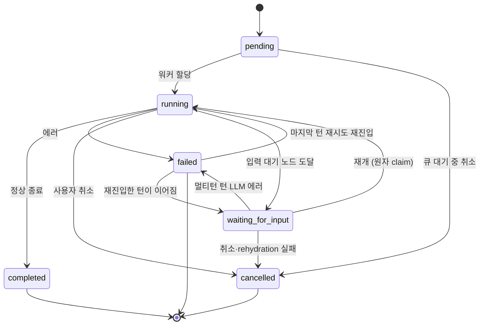
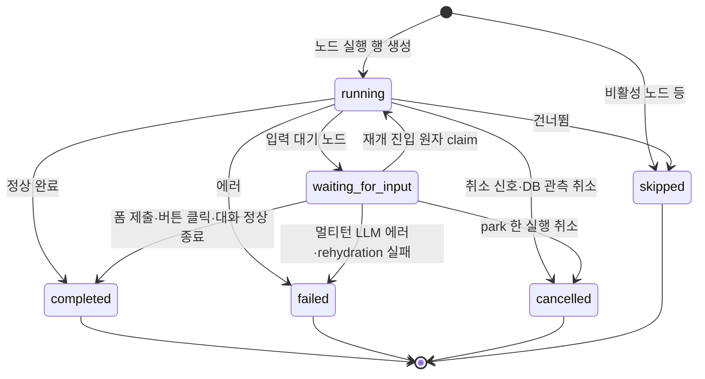
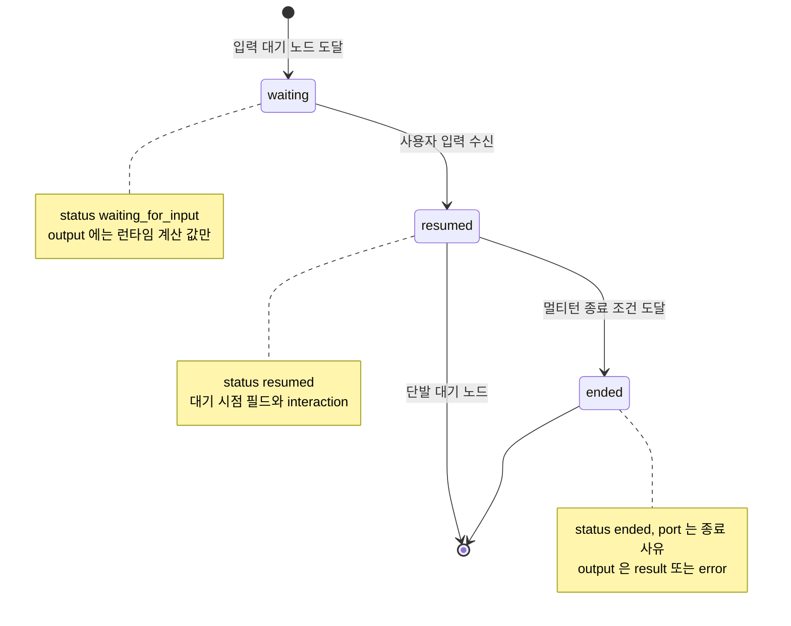
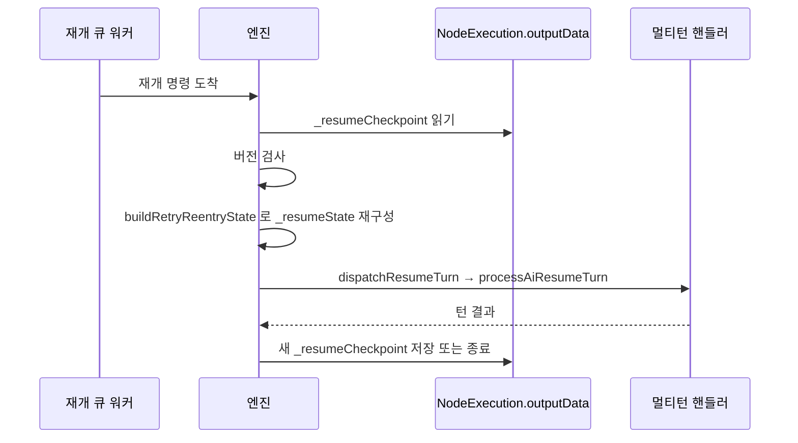
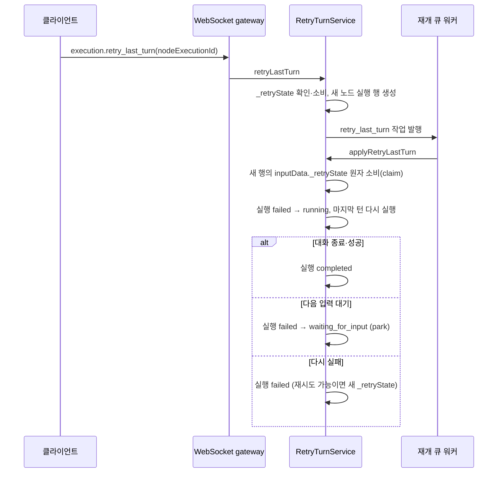

> 구현 상태: 부분 구현 · 원문: `spec/5-system/4-execution-engine.md` (§1.1~§1.3, Rationale 중 상태 전이·대기·재개·마지막 턴 재시도 항목) · 용어: [용어 사전](../CLE-GLOSSARY.md)

## 개요

이 문서는 실행(Execution)과 노드 실행(NodeExecution) 두 층의 상태와 전이를 정한다. 노드 핸들러가 엔진 흐름을 바꾸는 흐름 지시 상태(`NodeHandlerOutput.status`)와 입력 대기·재개 계약, 멀티턴 AI 노드의 재개 상태 보존, 마지막 턴 재시도(`retry_last_turn`)의 재진입 흐름도 여기서 정한다.

입력 대기(`waiting_for_input`)에 들어간 실행은 세그먼트를 끝내고 DB 에만 남는다. 이 동작을 park 라고 부른다. park 한 실행에는 큐 작업·heartbeat·TTL 이 없고 기한 없이 보존된다. 사용자 입력이 도착해야만 재개 명령(`execution.submit_form`·`execution.click_button`·`execution.submit_message`·`execution.end_conversation`)이 재개 큐 작업을 만들고 다음 세그먼트가 시작된다. 재개 때는 DB 에 저장한 내용으로 실행 컨텍스트를 되살린다(rehydration).

입력 대기가 아닌 실행에 재개 명령을 보내면 상태 불일치 에러(invalid execution state)로 거부한다. 같은 뜻을 진입점마다 다른 코드로 알린다. WebSocket 은 `INVALID_EXECUTION_STATE`, REST 는 422 `INVALID_STATE`, EIA 는 409 `STATE_MISMATCH` 다. 검사 규칙은 [큐 워커와 동시 실행 제한](CLE-EXEC-WORKER.md#발행-전-사전-검증) 에 있다.

범위 밖:

- park 가 세그먼트를 끝내는 방식과 세그먼트 워커는 [큐 워커와 동시 실행 제한](CLE-EXEC-WORKER.md) 에서 정한다.
- 재개 명령의 발행 전 사전 검증(상태 불일치 에러, 대기 표면과 명령의 조합, nodeId 검사 범위)과 ack 에러 표면은 [큐 워커와 동시 실행 제한](CLE-EXEC-WORKER.md) 의 재개 큐 절에서 정한다.
- rehydration 절차, 재개 진입의 원자 claim, 크래시 재구동은 [장애 복구와 안전 종료](CLE-EXEC-RECOVERY.md) 에서 정한다. 재개 진입 claim 의 결정 근거도 그 문서 Rationale 에 있다. 마지막 턴 재시도 claim 의 결정 근거는 이 문서 [Rationale](#rationale) 에 있다.
- 노드 출력의 다섯 필드와 재개 출력의 모양은 [노드 출력 규약](../CLE-NODE/CLE-NODE-OUTPUT.md) 이 정한다.
- 취소 신호와 DB 관측 취소 가드의 동작은 [노드 취소](CLE-EXEC-CANCEL.md) 가 정한다.
- 재개 명령의 wire 형식과 응답은 [WebSocket 이벤트와 명령](../CLE-API/CLE-API-WS-EVENTS.md) 이 정한다.
- 실행·노드 실행 엔티티의 컬럼은 [실행 데이터와 흐름](CLE-EXEC-DATA.md) 에 있다.

## 실행 상태



`failed` 에서 나가는 두 전이는 마지막 턴 재시도에만 열린다. 다른 입력으로 다시 입력 대기를 잇는 rehydration 은 `waiting_for_input` 안의 내부 전이다. 상태 값은 바뀌지 않으므로 그림에 자기 전이로 그리지 않는다.

| 상태 | 본문 표기 | 설명 | 들어오는 조건 |
| --- | --- | --- | --- |
| `pending` | 대기 중 | 실행이 요청됐고 워커 할당을 기다린다 | 트리거 발화·수동 실행 시 생성 |
| `running` | 실행 중 | 실행 중 | 워커가 작업을 가져감 |
| `waiting_for_input` | 입력 대기 | Form 노드, 버튼이 설정된 Presentation 노드, 멀티턴 AI 노드가 사용자 입력을 기다린다 | 해당 노드 도달 또는 멀티턴 대화 턴 대기 |
| `completed` | 완료 | 정상 종료 | 모든 노드 실행 완료 |
| `failed` | 실패 | 실패 | 노드 에러와 Stop Workflow 정책, 또는 시스템 에러 |
| `cancelled` | 취소됨 | 사용자나 시스템 사유로 멈춤 | 실행 중지 요청 등 |

건너뜀(`skipped`)은 노드 실행 전용이다. 실행 층에는 `skipped` 가 없다. 모든 노드가 건너뜀(노드 비활성·분기 미선택·도달 불가)으로 끝나 에러 없이 dispatch 루프가 끝나면 실행은 `completed` 로 마감한다. 그래서 [실행 내역](CLE-EXEC-HISTORY.md) 필터에도 실행 층 `skipped` 는 없고 모든 노드가 건너뛴 실행은 `completed` 로 보인다.

시스템 에러로 끝나는 경로의 에러 코드는 다른 문서가 정한다. 실행 시간 한도 초과(`EXECUTION_TIME_LIMIT_EXCEEDED`)와 큐 대기 한도 초과(`EXECUTION_QUEUE_WAIT_TIMEOUT`)는 [큐 워커와 동시 실행 제한](CLE-EXEC-WORKER.md), stalled 재배달 소진(`WORKER_HEARTBEAT_TIMEOUT`)·안전 종료 중단(`SERVER_INTERRUPTED`)·rehydration 실패(`RESUME_*`)는 [장애 복구와 안전 종료](CLE-EXEC-RECOVERY.md) 에 있다. 취소 주체(`result.cancelledBy`)와 사유 코드의 대응은 [External Interaction API](../CLE-IX/CLE-EIA.md) 가 정한다.

### 허용 전이

| 이전 | 다음 | 조건 |
| --- | --- | --- |
| `pending` | `running` | 워커 할당 |
| `pending` | `cancelled` | 큐 대기 중 취소 |
| `running` | `completed` | 정상 종료 |
| `running` | `failed` | 에러 발생 |
| `running` | `cancelled` | 사용자 취소 |
| `running` | `waiting_for_input` | Form 노드 도달, 버튼이 설정된 Presentation 노드 도달, 멀티턴 대화 턴 대기 |
| `waiting_for_input` | `running` | 폼 제출, 버튼 클릭, AI 대화 메시지 수신이나 대화 종료로 재개. 재개 진입은 DB 원자 claim(`… WHERE status='waiting_for_input' RETURNING`)으로 조건부로 일어나고 affected=1 인 워커 하나만 진행한다. 동시 재개 경쟁을 이 조건이 막는다 |
| `waiting_for_input` | `failed` | 멀티턴 턴 처리 중 LLM 에러(429·타임아웃·연결 실패). `handleAiTurnError` 가 `port='error', status='ended'` 모양으로 마감한다([AI 에이전트 노드 출력과 디버그](../CLE-NODE-AI/CLE-NODE-AGENT-OUTPUT.md)). 재개 턴의 LLM 에러는 claim 으로 이미 `running` 이므로 `running → failed` 로 마감한다. 이 행은 claim 을 거치지 않는 경로에만 해당한다 |
| `waiting_for_input` | `waiting_for_input` | rehydration 재개. 상태 값은 그대로이고 사용자 입력이 오면 아무 워커나 컨텍스트를 되살려 다음 세그먼트를 시작한다. park 하면 코루틴을 해제하므로 같은 인스턴스가 우연히 받아도 같은 경로를 탄다 |
| `waiting_for_input` | `cancelled` | 사용자 취소, 공개 웹채팅 유휴 실행 회수(`cancelledBy='timeout'`, `error.code='WEBCHAT_IDLE_TIMEOUT'`, [External Interaction API](../CLE-IX/CLE-EIA.md)), rehydration 실패(`RESUME_CHECKPOINT_MISSING`·`RESUME_FAILED`·`RESUME_INCOMPATIBLE_STATE`). 노드별 입력 대기 타임아웃은 현재 없다. 둘지는 정의가 갈린다([Presentation 노드 공통](../CLE-NODE-PRES/CLE-NODE-PRES-COMMON.md#미결-사항)) |
| `failed` | `running` | 마지막 턴 재시도 재진입 전용(`allowRetryReentry` opt-in). [마지막 턴 재시도 재진입](#마지막-턴-재시도-재진입) 참고 |
| `failed` | `waiting_for_input` | 마지막 턴 재시도 재진입 전용(`allowRetryReentry` opt-in). 재진입한 턴이 끝나지 않고 다음 사용자 입력을 기다리면 `reparkAiResumeTurn` 이 세그먼트를 끝내며 park 한다 |

`failed → running` 과 `failed → waiting_for_input` 은 일반 노드 실패 경로에는 없다. 코드는 상태 머신의 `allowRetryReentry` opt-in 으로만 이 두 전이를 허용한다. 실패로 끝난 실행이 일반 `updateExecutionStatus` 경로로 우연히 되살아나는 것을 막기 위해서다.

### 원자성 보장

1. `running ↔ waiting_for_input` 전이는 짝이 되는 노드 실행 상태 변경(`waiting_for_input` 또는 `completed`)과 **한 DB 트랜잭션**으로 묶어 함께 커밋하거나 함께 되돌린다. 두 저장 사이에 서버가 죽어도 실행과 노드 실행의 상태가 어긋나지 않는다(구현: `ExecutionEngineService.updateExecutionStatus` 의 `linkedNodeExec` 인자). WebSocket 이벤트는 커밋 뒤에 발행한다.
2. `waiting_for_input → failed` 도 같은 원자성을 따른다. 노드 실행 `FAILED` 저장과 실행 `FAILED` 저장을 한 트랜잭션으로 묶고 이벤트는 `NODE_FAILED` → `EXECUTION_FAILED` 순서로 낸다.
3. 재개 진입의 `waiting_for_input → running` claim 도 이 원자성에 들어간다. 조건부 UPDATE 가 실행과 노드 실행의 짝 상태를 한 트랜잭션으로 바꾼다. affected=0 이면 어느 쪽도 바꾸지 않고 작업을 받은 뒤 버린다. claim 뒤 rehydration 이 실패하면 `RESUME_*` 종결로 원자 마감해 `running` 이 남지 않게 한다. 절차는 [장애 복구와 안전 종료](CLE-EXEC-RECOVERY.md) 에 있다.
4. 짝 없이 `running`·`completed`·`failed`·`cancelled` 로 바로 마감하는 경로(else 분기)의 조건부 UPDATE 도 `dataSource.transaction` 안에서 돈다. 짝 전이와 목적이 다르다. 결과 모양 가드가 예외를 던질 때 그 UPDATE 도 함께 되돌리려는 것이다. 되돌리지 않으면 행은 종결 상태로 커밋된 채 종결 이벤트만 사라지고 비종결 상태만 살피는 부팅 복구 스캔에도 걸리지 않는다.
5. 짝 전이는 방향과 상관없이 아무것도 하지 않고 끝날 수 있다. 재개 방향 claim 뿐 아니라 park 방향(`running → waiting_for_input`)도 대상 행이 이미 종결 상태면 적용하지 않는다. 짝 전이는 같은 트랜잭션 안에서 실행 행을 `SELECT … FOR UPDATE` 로 잠그고 비종결 상태를 확인한 뒤에만 두 행을 저장한다. 선점이 보이면 아무것도 쓰지 않고 `false` 를 돌려준다. 호출자는 이때 park·종결 이벤트 발행을 건너뛰고 짝 노드 실행을 `cancelled` 로 표시한 뒤 취소 전파 경로로 넘긴다.
6. 마지막 턴 재시도 재진입은 예외다. 위 "비종결 확인" 의 종결 정의가 `allowRetryReentry` opt-in 에 따라 바뀐다. 재진입에 한해 DB 가드(짝 전이의 `FOR UPDATE` 잠금과 else 분기 조건부 UPDATE)가 `failed` 행도 대상에 넣는다(`NON_TERMINAL_OR_FAILED_STATUSES_SQL`). opt-in 을 상태 머신(`canTransition`)에만 반영하고 DB 가드에 전달하지 않으면 재진입 짝 전이가 늘 0행이 돼 기능이 동작하지 않는다. opt-in 이어도 `completed`·`cancelled` 는 대상에서 빠지므로 실제 동시 취소는 계속 막힌다.
7. 이 가드가 없으면 park·재개 경로가 실행을 다시 읽지 않아 메모리의 엔티티가 낡은 상태에서 전체 엔티티 저장이 동시에 도착한 취소를 덮어쓴다. 그러면 사용자의 실행 중지가 그대로 사라진다. 같은 이유로 `finalizeFailedExecution` 등 종결 마감 경로도 조건부 UPDATE(`status IN (비종결)`)를 거친다. 가드의 근거는 [노드 취소](CLE-EXEC-CANCEL.md) 에 있다.

조건부 UPDATE 결과를 읽을 때는 `RETURNING` 결과가 `[rows, affectedCount]` 튜플이라는 점을 지켜야 한다. 이 규칙은 [raw SQL 결과 읽기 규약](../CLE-ENG/CLE-ENG-RAWQUERY.md) 에 있다.

### 대기 진입 직전의 읽기 창 정규화

`executeNode` 의 입력 대기 분기는 핸들러 출력(`NodeHandlerOutput.status='waiting_for_input'`)을 `NodeExecution.outputData` 에 **먼저** 저장한다. 이때 `NodeExecution.status` 컬럼은 `running` 그대로다. 바로 뒤에 `waitForButtonInteraction`·`waitForFormSubmission`·`waitForAiConversation` 이 상태를 원자 전이한다.

두 저장 사이에 스냅샷을 조회하면 같은 행이 `status='running'` 인데 `outputData.status='waiting_for_input'` 인 행 내부 불일치로 보인다. 앞의 실행 ↔ 노드 실행 원자성은 이 창을 막지 못한다. `findById` 의 REPEATABLE READ 트랜잭션도 두 조회에 걸친 불일치만 막고 같은 행 안의 컬럼과 출력 사이 불일치는 잡지 못한다.

이 창은 두 층에서 막는다.

1. **백엔드 읽기 정규화** (`ExecutionsService.findById` 의 `reconcilePreParkWaitingStatus`): 스냅샷 응답 직전에 `status` 가 `running`·`pending` 이면서 `outputData.status==='waiting_for_input'` 인 행은 응답 상태를 `waiting_for_input` 으로 올린다. DB 쓰기와 엔진 원자성은 바꾸지 않는다. 모든 스냅샷 소비자(웹 앱, 웹채팅, External Interaction API)에 똑같이 적용된다.
2. **프론트엔드 이중 방어** (`codebase/frontend/src/lib/websocket/apply-execution-snapshot.ts` 의 `isNodeWaitingForInput`): WebSocket `execution.snapshot` 이벤트, read replica, 옛 응답 모양처럼 백엔드 정규화가 닿지 않는 경로에서도 불일치를 잡는다. `ne.status` 하나만 믿지 않고 `running`·`pending` 행에 한해 `ne.outputData.status==='waiting_for_input'` 도 본다. 종결 행은 제외한다.

두 층의 판정 조건(노드 상태, 출력 상태, 종결 제외)은 일부러 똑같이 둔다. 한쪽만 바꾸면 불일치 창이 다시 열리므로 `reconcilePreParkWaitingStatus` 와 `isNodeWaitingForInput` 은 반드시 함께 바꾼다.

## 노드 실행 상태



현재 구현은 노드 실행 행을 처음부터 `running` 으로 만든다. 비활성 노드는 처음부터 `skipped` 행으로 만든다. `pending` 은 엔티티 기본값으로 남아 있지만 엔진 경로는 이 값을 쓰지 않는다. 노드 실행에는 실행의 `ALLOWED_TRANSITIONS` 같은 코드 수준 전이 표가 없다.

| 상태 | 설명 |
| --- | --- |
| `pending` | 실행 대기(선행 노드 완료 대기). 엔티티 기본값이며 현재 엔진은 쓰지 않는다 |
| `running` | 실행 중 |
| `waiting_for_input` | 사용자 입력 대기. Form 노드, 버튼이 설정된 Presentation 노드, 멀티턴 AI 노드. 턴 처리 중 LLM 에러(429·타임아웃·연결 실패)가 나면 `failed` 로 바뀐다(`handleAiTurnError`). rehydration 실패(`RESUME_CHECKPOINT_MISSING`·`RESUME_FAILED`·`RESUME_INCOMPATIBLE_STATE`)에도 `failed` 로 바뀌고 함께 있는 실행은 `cancelled` 로 마감한다. park 한 실행이 취소되면 짝 노드 실행도 `cancelled` 로 표시한다 |
| `completed` | 정상 완료 |
| `failed` | 노드 핸들러 에러와 Stop 또는 에러 포트 정책, 또는 시스템 에러. rehydration 인프라 실패도 취소가 아닌 결함이므로 `failed` 다 |
| `cancelled` | 노드가 실패한 것이 아니라 중단된 상태. 신호 경로(핸들러가 던진 `AbortError`, dispatch 직전 이미 취소된 신호 포함)와 DB 관측 경로(엔진이 노드 경계·턴 경계·짝 전이에서 실행 행을 다시 읽고 `ExecutionCancelledError` 를 던짐)가 같은 상태로 끝난다. 사용자 실행 중지는 신호를 만들지 않으므로 선형 경로와 재개 경로에서는 DB 관측이 유일한 수단이다. 끝날 때 `execution.node.cancelled` 이벤트를 낸다. 규칙은 [노드 취소](CLE-EXEC-CANCEL.md) 가 정한다 |
| `skipped` | 건너뜀(노드 비활성, Skip Node 정책, 조건 분기 미선택) |

마지막 턴 재시도는 새 노드 실행 행을 만든다. 재시도 가능한 에러로 `failed` 가 된 멀티턴 노드 실행 행은 전이시키지 않고 그대로 둔다. `execution.retry_last_turn` 은 같은 노드의 **새 노드 실행 행을 `running` 으로 만들어** 마지막 턴을 다시 돌린다. 그래서 한 노드에 행이 여러 개일 수 있고 재시도 명령은 `nodeExecutionId` 로 행을 가리킨다(`nodeId` 로는 행 하나를 고를 수 없다). 실행 층의 `failed → running` 은 이 새 행을 구동하려는 실행 엔티티의 전이이고 기존 `failed` 행의 전이가 아니다.

## 흐름 지시 상태

노드 핸들러는 노드 출력의 `status` 필드로 엔진에 흐름 지시를 보낸다. 이것을 흐름 지시 상태라고 부르고 실행·노드 실행 기록의 상태와 층이 다르다.

| `status` | 본문 표기 | 의미 | 내는 때 |
| --- | --- | --- | --- |
| 없음(`undefined`) | 일반 완료 | 대부분의 노드 | 입력 대기가 없는 노드의 최종 출력 |
| `waiting_for_input` | 입력 대기 | 사용자 입력 대기 | Form, 버튼이 설정된 Carousel·Chart·Table·Template, 멀티턴 AI 에이전트, 멀티턴 정보 추출기 |
| `resumed` | 재개 출력 | 사용자 입력을 받은 직후 | 재개 시점. 관측용이며 라우팅에 영향이 없다 |
| `ended` | 대화 종료 | 멀티턴 종료 | LLM 대화가 `completed`·`user_ended`·`max_turns`·`max_retries`·`error` 중 하나로 끝날 때 |
| `requires_integration` | 통합 필요 | 외부 통합이 연결되지 않아 준비가 필요함 | Send Email 등이 통합 없이 실행될 때 |
| `requires_playwright` | PDF 렌더러 필요 | PDF 렌더러가 필요함 | PDF 노드 |

### 입력 대기와 재개의 출력 흐름



- **입력 대기**: `status: "waiting_for_input"`. `output` 에는 런타임에 계산한 값만 둔다.
- **재개 출력**: `status: "resumed"`. `output` 은 대기 시점의 런타임 필드를 그대로 두고 `interaction: { type, data, receivedAt }` 를 더한다. `type` 은 `form_submitted`·`button_click`·`button_continue`·`message_received` 중 하나다. 타입별 `data` 모양과 적용 노드는 [노드 출력 규약](../CLE-NODE/CLE-NODE-OUTPUT.md) 의 `interaction.data` 규격이 정한다.
- **대화 종료**: 멀티턴 LLM 이 종료 조건에 닿으면 `status: "ended"` 와 종료 사유에 따른 `port`, `output: { result }` 또는 `output: { error }` 를 낸다.

Presentation 노드의 재개 출력도 `status: 'resumed'` 를 쓴다. 사용자가 무엇을 했는지는 `interaction.type` 으로만 나타낸다.

Presentation 노드의 `interaction` 과 멀티턴 AI 노드의 `message_received` 는 모두 [대화 스레드](../CLE-IX/CLE-IX-THREAD.md) 에 자동으로 쌓인다. 뒤의 AI 에이전트가 이를 자동으로 주입받을 수 있다. 쌓는 시점은 `nodeOutputCache` 갱신과 같은 트랜잭션이다.

### 재개 상태 `_resumeState`

- 멀티턴 AI 노드(AI 에이전트, 정보 추출기) 핸들러가 다음 턴을 처리하려고 들고 있는 내부 상태다. 노드 출력 다섯 필드 밖의 최상위 필드로 허용된 예외다.
- 엔진은 `_resumeState` 를 읽어 다음 턴을 다시 만든다.
- 표현식 resolver 는 이 필드를 노출하지 않는다.
- 최종 출력을 저장할 때 엔진(`stripControlFields()`)이 `_resumeState` 를 지운다. 옛 키 `_multiTurnState` 도 지움 대상에 남아 있지만 옛 페이로드 호환을 위한 방어일 뿐 현재 경로는 이 키를 만들지 않는다.

### 보존 예외 `_resumeCheckpoint`

`_resumeCheckpoint` 는 서버가 다시 시작된 뒤나 다른 인스턴스에서 멀티턴 대화를 이어 가려고 DB 에 남기는 재개 상태의 일부다. rehydration 절차는 [장애 복구와 안전 종료](CLE-EXEC-RECOVERY.md) 에 있다.

- **적용 범위**: `ai_agent` 와 `information_extractor` 의 멀티턴(`ai_conversation`). 저장 허용 목록은 두 핸들러 런타임 상태의 합집합이다. `ai_agent` 는 messages·turnCount·토큰·RAG·MCP·`pendingFormToolCall` 을, `information_extractor` 는 여기에 `partialResult`·`collectionRetryCount`(둘 다 자격 증명 없는 런타임 값)를 더한다. 설정 필드는 노드마다 다르지만(`ai_agent`: `llmConfigId`·`maxTurns`·`conditions`·`presentationTools`, `information_extractor`: `outputSchema`·`examples`·`instructions`·`maxCollectionRetries`) 재구성 때 공통 함수 `resolveRetryNodeConfig` 가 `node.config` 에서 다시 만든다. `buildRetryReentryState` 는 두 모양의 합집합을 채우고 각 핸들러의 `processMultiTurnMessage` 가 자기 필드만 읽는다. 그 밖의 `ai_conversation` 핸들러는 고유 런타임 상태가 허용 목록에 없어 체크포인트를 남기지 않는다. 이런 노드는 재시작 뒤 재개하면 `RESUME_INCOMPATIBLE_STATE` 로 정리된다.
- **저장 시점**: 입력 대기에 들어갈 때(`emitAiWaitingForInput`)와 턴마다(`handleAiMessageTurn`) 엔진이 `_resumeState` 의 자격 증명을 뺀 부분집합을 `_resumeCheckpoint` 로 옮겨 `NodeExecution.outputData._resumeCheckpoint` 에 저장한다.
- **지움 예외**: `stripControlFields()` 는 `_resumeCheckpoint` 를 남긴다. 다음 노드 입력으로 넘길 때는 `_resumeState` 와 함께 지운다.
- **모양**: `_retryState` 와 같은 부분집합(messages·turnCount·model·temperature·maxTokens·knowledgeBases·RAG·MCP·`pendingFormToolCall?` 등)이다. 다만 `expiresAt`(TTL)이 없다. 입력 대기 실행은 기한 없이 보존되므로 대화는 오래 쉰 뒤에도 이어져야 한다. `lastUserMessage` 도 없다. 재개할 때 도착한 사용자 메시지를 그대로 첫 턴으로 처리한다.
- **자격 증명 제외**: 자격 증명과 컨텍스트 결속 필드는 싣지 않는다. `buildRetryState`·`buildResumeState` 가 옮길 키를 하나씩 열거하는 허용 목록 방식이다.
- **두 재유도 경로**: 재개할 때 **조작 필드**(`llmConfigId`·`maxTurns`·`conditions`·`presentationTools` 등)는 `node.config` 를 다시 평가해 만든다. **식별 필드**는 호출하는 쪽 컨텍스트에서 다시 만든다. `workflowId` 는 `execution.workflowId` 에서, 재개 대상 `nodeExecutionId` 는 대기·재시도 노드 실행 행의 PK 를 `buildRetryReentryState` 옵션으로 넣어서 `workspaceId` 는 실행 컨텍스트에서 가져온다.
- **스키마 버전**: 체크포인트는 정수 `CHECKPOINT_SCHEMA_VERSION` 을 함께 싣는다. 재개할 때 버전이 없거나(기능 배포 전 행) 현재 코드 버전 이하이면 빠진 필드를 기본값으로 채워 다시 만든다. 현재 코드 버전보다 크면(롤링 배포 중 옛 인스턴스가 새 형식을 받음) 안전하게 만들 수 없으므로 `RESUME_INCOMPATIBLE_STATE` 로 정리한다.
- **소비**: rehydration 이 `outputData._resumeCheckpoint` 를 읽고 버전을 검사한 뒤 `buildRetryReentryState`(`_retryState` 와 공유)로 `_resumeState` 를 다시 만든다. 핵심 필드가 빠졌으면 기본값으로 채운다. `driveResumeAwaited`·`driveResumeFrame` 이 도착한 재개 페이로드를 `dispatchResumeTurn` 을 거쳐 `handleAiResumeTurn` → `processAiResumeTurn`(한 턴 처리기)에 넘긴다. 체크포인트가 없거나(기능 배포 전 행) 손상됐거나 미래 버전이면 `RESUME_INCOMPATIBLE_STATE` 로 정리한다.
- **재개 payload 기준**: 재개 큐 `'continue'` 메시지 payload 의 표시 값(폼 제출이면 `{ type: 'form_submitted', formData }`)과 `processAiResumeTurn` 이 이 값으로 나누는 분기는 [Presentation 노드 공통](../CLE-NODE-PRES/CLE-NODE-PRES-COMMON.md#폼-제출-wire-format) 이 기준이다.



**사용량 귀속 불변식**: 재개·재시도 턴의 provider 도구 `logUsage` 귀속(`IntegrationUsageLog.node_execution_id`)은 위 식별 필드 `nodeExecutionId`·`workflowId` 가 `buildRetryReentryState` 재구성 결과에 다시 들어가야 성립한다. 두 필드는 자격 증명 제외 허용 목록(`CREDENTIAL_CONTEXT_FIELDS`)에 따라 체크포인트에서 빠진다. 재구성 때 호출 쪽 컨텍스트에서 다시 넣지 않으면 provider 도구의 사용 로그 조건(`ctx.nodeExecutionId && ctx.workflowId`)이 거짓이 돼 재개·재시도 턴의 통합 사용 로그가 조용히 빠진다(회귀 #501).

소비하는 곳은 노드 유형마다 다르다. `ai_agent` 의 provider 도구 `IntegrationUsageLog` 는 조건부라 필드가 없으면 로그가 빠진다. 두 노드의 LLM 호출이 남기는 `llm_usage_log`(`LlmUsageLogService.record`, `?? null`)는 조건이 없어 필드가 없거나 틀리면 로그가 빠지지 않고 귀속이 오염된다. provider 도구가 없는 `information_extractor` 재개가 이 경우다. 현재 이 불변식은 회귀 테스트로만 강제되므로 `CREDENTIAL_CONTEXT_FIELDS`·`resumeStateSchema` 를 고칠 때 반드시 지킨다. 사용량 기록 구조는 [LLM 사용량 기록](../CLE-AI/CLE-AI-USAGE.md) 과 [통합 노드 공통](../CLE-NODE-INT/CLE-NODE-INT-COMMON.md) 에 있다.

### 보존 예외 `_retryState`

- 멀티턴 AI 에이전트가 재시도 가능한 에러(HTTP 429·5xx·네트워크 타임아웃, `output.error.details.retryable === true`)로 끝나면 `buildMultiTurnFinalOutput` 이 `_resumeState` 스냅샷을 `_retryState` 로 옮긴다. 최상위 필드이며 노드 출력 다섯 필드의 예외다.
- `stripControlFields()` 는 `_retryState` 를 남긴다. `NodeExecution.outputData._retryState` 로 DB 에 저장된다.
- 모양은 `_resumeState` 의 부분집합에 `expiresAt: ISO 8601` 을 더한 것이다. TTL 기본값은 60분이고 환경 변수 `AI_RETRY_STATE_TTL_MINUTES` 로 바꾼다. 자격 증명 제외 방식은 `_resumeState` 와 같다(허용 목록). 표현식 resolver 와 자동완성에 노출하지 않는다. 필드 목록 전체(`lastUserMessage` 등)는 [노드 출력 규약](../CLE-NODE/CLE-NODE-OUTPUT.md) 의 보존 예외 절에 있다.
- **소비(원자적)**: WebSocket 명령 `execution.retry_last_turn` 이 `nodeExecutionId` 로 `_retryState` 를 찾는다. `expiresAt` 을 확인한 뒤 **같은 트랜잭션에서 `_retryState` 키를 지우고(소비) 새 노드 실행 행을 만든다**. 이어 재개 큐(`execution-continuation`)에 `retry_last_turn` 작업을 발행하고 워커가 새 행을 `_retryState` 로 채워 멀티턴 루프에 다시 들어간다. 키 삭제가 affected=1 인 쪽만 진행하므로 동시에 온 재시도가 행을 두 번 만들지 않는다. TTL 이 지났거나 이미 소비된 `_retryState` 는 `RETRY_STATE_NOT_FOUND` 다. 재진입에는 워커 컨텍스트가 필요해 WebSocket gateway 가 동기로 처리할 수 없으므로 재개 큐로 넘긴다.
- 사용자 쪽 흐름은 [AI 에이전트 노드 출력과 디버그](../CLE-NODE-AI/CLE-NODE-AGENT-OUTPUT.md) 의 멀티턴 에러 포트 절에 있다.

## 마지막 턴 재시도 재진입

마지막 턴 재시도(`retry_last_turn`)는 재시도 가능한 에러로 끝난 멀티턴 AI 노드의 마지막 LLM 호출을 같은 실행 안에서 다시 돌린다. [재실행](CLE-EXEC-RERUN.md) 과 다르다.



1. 재시도는 **새 노드 실행 행을 만들어** 마지막 턴을 다시 돌린다. 기존 `failed` 행은 그대로 둔다. 새 행의 턴이 `node.started`·`node.completed` 를 내려면 실행이 `running` 이어야 하므로 실행은 `failed → running` 으로 간다.
2. 재진입한 턴이 대화를 끝내지 않으면 `reparkAiResumeTurn` 이 실행을 `waiting_for_input` 으로 park 하고 세그먼트를 끝낸다. 멀티턴 재진입에서 가장 흔한 경로다. 이후 재개는 일반 `waiting_for_input → running` 경로(원자 claim)로 합류하므로 opt-in 은 이 한 번의 park 에만 필요하다.
3. 재진입이 성공하면 실행은 `completed` 로, 다시 실패하면 `failed` 로 마감한다. 재시도 가능한 에러로 다시 실패하면 새 `_retryState` 를 남겨 다시 재시도할 수 있다.
4. **작업 배달 claim**: `applyRetryLastTurn` 은 새 행의 `inputData._retryState` 키를 조건부 UPDATE 로 원자 소비한다. affected=1 인 배달만 진행한다.

   ```sql
   UPDATE node_execution SET input_data = input_data - '_retryState'
    WHERE id = :id AND status = 'running' AND jsonb_exists(input_data, '_retryState')
   ```

   두 조건이 모두 필요하다. `jsonb_exists` 가 경쟁을 가른다. `status = 'running'` 이 없으면 이미 끝난 턴을 다시 돌린다. `inputData` 에 쓰는 지점은 행을 만들 때뿐이라 턴이 `completed` 로 끝나도 키가 남기 때문이다.
5. claim 은 크래시로 중단된 턴의 BullMQ 재배달도 막는다. 이 claim 에서 버려진 새 행은 `running` 으로 남을 수 있다. 버려지는 시점의 실행은 이미 `failed` 라 부팅 복구 스캔의 재구동 대상(오래 멈춘 `running` 실행)이 아니기 때문이다. 이 남은 행의 정리는 후속 과제다(plan `retry-turn-terminal-guard` #15). "크래시로 중단된 턴" 에 claim 과 턴 진입 사이의 일반 예외까지 들어가는지는 아직 열려 있다(같은 plan #17).
6. **재진입 때 설정 표현식 재평가**: 재진입은 노드 설정의 `{{ }}` 표현식을 가능한 만큼 다시 평가해 조작 필드(`llmConfigId`·`maxTurns` 등)를 일반 dispatch 와 맞춘다. `_retryState` 는 턴 직전 `_resumeState` 스냅샷에서 나와 원래 노드 입력이 없으므로 `$input.*` 는 풀리지 않는다. 되살린 컨텍스트에서 `$node`·`$var`·`$thread`·`$execution`·`$now` 만 풀린다. 재평가에 실패하면 원본 설정으로 돌아가므로 정적 설정은 영향이 없다. `output.config` 설정 에코는 항상 원본(`rawConfig` 고정 스냅샷)이고 재평가 값은 실행에만 쓴다.
7. 재진입한 노드 이후의 그래프 진행은 일반 `completed` 노드와 같다. 순환 안이면 순환에 다시 들어간다([실행 엔진 개요와 그래프 순회](CLE-EXEC-ENGINE.md)).

### 재진입 중 취소

- 재진입이 `running` 으로 도는 동안 도착한 취소는 **진행 중인 턴을 바로 끊지 않는다**. `running` 상태의 재개·재진입 구동에는 깨울 메모리 코루틴이 없기 때문이다.
- 취소 **기록은 늦어지지 않는다**. `stop()` 의 `running`·`pending` 경로가 조건부 UPDATE 로 `cancelled` 와 `finishedAt`·`durationMs` 를 바로 커밋한다.
- 재진입은 다음 **턴 경계**의 `assertExecutionNotCancelled` 에서 취소를 보고 끝난다. park 에 닿으면 `cancelParkedExecution` 의 `status = WAITING_FOR_INPUT` 가드가 짝 노드 실행까지 `cancelled` 로 표시한다.
- park 없이 그 턴에서 끝나도 취소가 우선한다. 종결 경로가 모두 조건부 UPDATE(`status IN (비종결)`)를 거치므로 이미 `cancelled` 인 행은 `completed`·`failed` 로 덮이지 않고 종결 이벤트도 나가지 않는다. 취소 시각(`finishedAt`·`durationMs`)은 `stop()` 이 쓴 값이 기준이다. 가드 규칙은 [노드 취소](CLE-EXEC-CANCEL.md) 에 있다.

## 미결 사항

- **rehydration 실패를 실행 `cancelled` 로 두는 결정의 유지 여부**: 원문 결정은 Re-run 버튼이 `cancelled` 상태에서 켜지므로 인프라 실패를 `cancelled` 로 두어야 다시 시도할 수 있다는 것을 근거로 들었다. 반면 [실행 내역](CLE-EXEC-HISTORY.md) 은 Re-run 버튼을 상태와 상관없이 항상 보이고 [에디터 실행과 디버깅](CLE-EXEC-RUN.md) 의 드로어는 `failed` 에서도 보인다. [재실행](CLE-EXEC-RERUN.md) API 에도 상태 제한이 없다. 그래서 [Rationale](#rationale) 에서 그 근거를 뺐다. 남은 근거(인프라 실패와 비즈니스 실패의 뜻 구분, Re-run 진입점의 원인 판별 부담)만으로 실행 `cancelled` · 노드 실행 `failed` 로 나누는 결정을 유지할지 다시 판단해야 한다. 결정 전까지 본문 규칙은 이분 결정을 따른다.

## 구현 위치

- `codebase/backend/src/modules/execution-engine/state/state-machine.ts` (`ALLOWED_TRANSITIONS`, `canTransition`, `allowRetryReentry`)
- `codebase/backend/src/modules/execution-engine/execution-engine.service.ts` (`updateExecutionStatus`, `stripControlFields`, `buildRetryReentryState`, `buildResumeCheckpoint`)
- `codebase/backend/src/modules/execution-engine/ai-turn-orchestrator.service.ts`
- `codebase/backend/src/modules/execution-engine/retry-turn.service.ts`
- `codebase/backend/src/modules/execution-engine/form-interaction.service.ts`, `button-interaction.service.ts`
- `codebase/backend/src/shared/execution-resume/**`
- `codebase/backend/src/modules/executions/executions.service.ts` (`findById`, `reconcilePreParkWaitingStatus`)
- `codebase/frontend/src/lib/websocket/apply-execution-snapshot.ts` (`isNodeWaitingForInput`)
- `codebase/frontend/src/lib/websocket/use-execution-events.ts`
- `codebase/frontend/src/lib/websocket/ws-client.ts`

## Rationale

### `waiting_for_input → failed` 전이를 더한다

옛 정책은 입력 대기의 끝을 `running` 이나 `cancelled` 로만 정했다. 멀티턴 AI 턴이 LLM 에러(429·타임아웃·연결 실패)로 끝나면 엔진의 `handleAiTurnError` → `finalizeAiNode('FAILED')` 가 실행을 바로 `failed` 로 옮겨야 `port='error', status='ended'` 모양으로 제대로 마감된다.

이 전이가 없을 때 `handleAiMessageTurn` 의 예외가 대기 루프를 빠져나가지 못해 `finalizeAiNode` 가 불리지 않았다. 노드 실행은 입력 대기에 영원히 남고 실행만 최상위 catch 에서 실패가 돼, 화면은 헤더 "실패" 와 노드 "Waiting" 이 함께 보이는 모순 상태가 됐다.

그래서 `waiting_for_input → failed` 를 한 번에 옮기고 노드 실행 `FAILED` 저장과 `NODE_FAILED` → `EXECUTION_FAILED` 이벤트 순서를 한 트랜잭션으로 묶었다. `running` 을 거쳐 `failed` 로 가는 두 단계 전이는 트랜잭션이 둘로 나뉘어 원자성이 깨지고 복잡해져서 택하지 않았다. 구현은 `state-machine.ts` 의 `ALLOWED_TRANSITIONS` 다.

2026-07-02 에 재개 진입을 DB 원자 claim 으로 바꾸면서 재개 턴에 한해 이 결정을 부분 수정했다. 재개 턴의 LLM 에러는 claim 뒤 `running → failed` 로 마감한다. claim 이 개입하지 않는 마감은 그대로다. 결정 경위는 [장애 복구와 안전 종료](CLE-EXEC-RECOVERY.md) 에 있다.

### 짝 없는 직접 마감도 트랜잭션 안에서 한다 (2026-08-30)

else 분기의 조건부 UPDATE 는 원래 트랜잭션 밖의 단발 쿼리였다. 결과 모양 가드(`updateReturningRows`, `8332d9a20` 도입)가 예외를 던져도 UPDATE 는 이미 커밋된 뒤였다. 가드가 발동하면 행은 종결 상태로 커밋된 채 종결 이벤트만 사라지고 그 실행은 부팅 복구 스캔에도 걸리지 않는다. 가드가 막으려던 무기한 대기가 가드가 발동한 순간 생기는 셈이었다.

UPDATE 를 `dataSource.transaction` 안에서 돌리도록 바꿨다. 예외가 롤백을 부르고 행은 비종결로 남아 재구동 대상이 된다. 짝 전이 분기는 이미 트랜잭션을 쓰고 있어 두 분기가 대칭이 됐고 공통 종결부를 `finishStatusTransition` 으로 뽑아 두 분기가 따로 어긋날 여지도 없앴다. 상태 전이 지점마다 BEGIN/COMMIT 왕복이 붙지만 롤백 보장이 그 비용보다 크다고 판단했다. 창은 `8332d9a20`(2026-08-13)부터 이 수정까지 약 17일이었다. 결과 모양 위반은 드라이버 계약이 바뀌어야 나는 일이라 실제로 발동했는지는 확인되지 않았다.

### 종결 이벤트 선점 감지가 넉 달 동안 동작하지 않았다

종결 경로는 조건부 UPDATE(`status IN (비종결)`) 결과로 "동시 취소가 먼저 종결시켰으면 종결 이벤트를 내지 않는다" 를 가른다. 그런데 그 UPDATE 의 반환은 `[rows, affectedCount]` 튜플이라 `updated.length > 0` 이 늘 참이었고 건너뛰는 분기가 한 번도 타지 않았다. `8332d9a20`(2026-08-13)이 고쳤다.

DB 는 깨지지 않았다. `WHERE status IN (...)` 조건이 쓰기 자체를 지켰다. 틀린 것은 앱이 자기가 적용했는지 아는 쪽이었고 증상은 취소된 실행에도 종결 이벤트가 나간 것이다. 영향 범위는 이 반환으로 분기하는 11곳·3파일(수정 시점 기준)이었고 원인은 그들이 함께 쓰는 드라이버 메서드 한 곳이었다. 같은 결함의 반대 부호는 [큐 워커와 동시 실행 제한](CLE-EXEC-WORKER.md) 의 동시 실행 제한에 있었다. 불변식은 [raw SQL 결과 읽기 규약](../CLE-ENG/CLE-ENG-RAWQUERY.md) 이 정한다.

### 재진입 opt-in 은 DB 가드까지 전달해야 한다 (2026-07-30)

`allowRetryReentry` opt-in 을 상태 머신에만 반영하고 DB 가드에 전달하지 않으면 재진입 짝 전이가 늘 0행이 돼 기능이 전혀 동작하지 않는다. 실제로 2026-07-30 까지 그 상태였다(코드 리뷰 8차 CRITICAL). 그래서 종결 정의 자체를 opt-in 에 따라 바꾸도록 했다. opt-in 에서도 `completed`·`cancelled` 는 빼므로 진짜 동시 취소는 계속 막힌다.

같은 날 `failed → waiting_for_input` 도 더했다. 재진입한 턴이 이어지는 경우가 멀티턴 재진입에서 가장 흔한데, 그때까지 상태 머신과 DB 가드 어느 쪽도 이 전이를 허용하지 않아 호출마다 동기 예외가 났다. 예외 메시지가 `EXECUTION_FAILED` 페이로드로 노출됐다(코드 리뷰 CRITICAL #1). 동시성과 무관하게 매번 실패하는 결함이었다.

### 대기 진입 직전 읽기 창은 읽기 쪽에서 정규화한다

입력 대기 노드(Carousel·Form·AI)는 핸들러 출력을 먼저 저장하고 노드 실행 상태 컬럼은 바로 뒤 대기 함수의 원자 트랜잭션에서 바꾼다. 프론트엔드 `applyExecutionSnapshot` 은 `ne.status` 하나를 대기 판정의 기준으로 믿었다. 그래서 불일치 스냅샷이 오면 대기 화면이 채워지지 않거나, 먼저 도착한 `waiting_for_input` 이벤트가 만든 대기 상태를 재개로 오해해 지웠다. 그 결과 Carousel 버튼이 콜백 없이 비활성으로 멈췄다. 턴 단위 park 구조가 들어온 뒤 이 창이 더 자주 보여 다시 나타났다.

- **쓰기 쪽 전이를 앞당기지 않는다**: 출력을 저장하는 순간 노드 실행 상태를 `waiting_for_input` 으로 올리면 짝 실행 상태 전이는 아직 대기 함수에서 일어난다. 그 사이 서버가 죽으면 실행은 `running`, 노드 실행은 `waiting_for_input` 인 불일치가 저장돼 원자성 보장이 깨진다. 그래서 쓰기 경로와 엔진 원자성은 그대로 두고 읽기 경로에서 출력 상태를 올린다.
- **백엔드 정규화를 1차로 둔다**: 스냅샷이 다시 실행 `running`·노드 실행 `waiting_for_input` 형태가 되므로 프론트엔드의 검증된 조정 경로가 그대로 동작한다.
- **프론트엔드 판정을 2차로 둔다**: 백엔드 정규화가 닿지 않는 경로를 위해 한 층에만 기대는 단일 실패 지점을 없앤다.

읽기 창 자체를 없애는 일(출력 저장과 상태 전이를 한 트랜잭션으로 묶기)은 별도 작업으로 남긴다.

### 재시도 가능한 에러로 끝나면 `_retryState` 를 남긴다 (R1)

재시도 가능한 에러(HTTP 429·5xx·네트워크 타임아웃)로 끝날 때의 처리 두 안 가운데 **R1**(상태 `ended` 와 `port: 'error'` 는 그대로 두고 `_retryState` 를 함께 싣기)을 골랐다.

- **R2(새 상태 `waiting_for_retry`) 기각**: 입력 대기 계열을 넓히는 일이라 흐름 지시 계약이 다른 노드까지 번지고 포트 활성화 모델과의 정합도 다시 따져야 해 스펙 범위가 커진다.
- R1 은 `ended` 와 `port: 'error'` 의 뜻을 그대로 두므로 에러 포트 뒤 노드(알림 등)의 의미가 바뀌지 않는다. 재시도 가능 여부는 `output.error.details.retryable` 하나로 충분히 전달되고 재시도는 에러 라우팅 뒤의 별도 사용자 행동(`execution.retry_last_turn`)으로 들어온다.
- `_retryState` 는 `_resumeState` 처럼 표현식에 노출하지 않고 자격 증명을 뺀다. TTL(기본 60분)이 사실상 재시도 상한이다.

### `_resumeCheckpoint` 를 남긴다 (옛 "WARN #6 미영속" 번복)

도입 초기(코드 주석 "WARN #6")에는 `_resumeState` 가 원본 설정·턴 디버그·모델 상태 같은 잠재 자격 증명을 담을 수 있다는 우려로 DB 에 남기지 않고 메모리에만 두었다. 그러자 배포·오토스케일·크래시로 인스턴스가 다시 시작되면 진행 중인 멀티턴 대화를 영원히 이어 갈 수 없었다(`RESUME_INCOMPATIBLE_STATE`). 텔레그램처럼 오래 이어지는 채널에서는 대화 중 백엔드가 한 번 배포되면 그 대화가 끝나 버렸다. 실행 행 자체는 기한 없이 보존되지만 재개에 필요한 `_resumeState` 가 사라져 쓸모가 없었다.

자격 증명을 뺀 부분집합 `_resumeCheckpoint` 를 평문으로 남기는 안을 골랐다.

- **암호화(`ENCRYPTION_KEY` 기반 시크릿 저장소) 기각**: 대화 메시지는 이미 `output.result.messages` 로 평문 저장되고 있어 암호화가 더 지켜 주는 것이 적다. `_resumeState` 는 원시 시크릿을 담지 않고 `llmConfigId` 같은 참조 ID 만 담는다. provider 시크릿은 시크릿 저장소 참조로 따로 있다. 매 턴 시크릿 저장소 쓰기와 대화 종료 뒤 정리도 복잡도를 더한다.
- **선례 일반화**: `_retryState`(R1)가 같은 일(자격 증명을 뺀 부분집합을 평문으로 남기고 재개 때 다시 만들기)을 재시도 경로에서 이미 검증된 채로 하고 있었다. `_resumeCheckpoint` 는 이 선례를 매 대기 턴 경로로 넓힌 것이다. 자격 증명 제외는 `buildRetryState`·`buildResumeState` 가 옮길 키를 열거하는 허용 목록 방식이다. 원래 `maskSensitiveFields` 와 같은 정책이라고 적었으나 그 함수는 키 이름 목록으로 값을 가리는 마스커였고 해당 경계도 2026-08-24 에 없어졌다.
- **재구성기 공유**: 두 필드는 자격 증명을 뺀 부분집합과 `node.config` 재유도라는 같은 재구성 형태로 모이므로 `buildRetryReentryState` 를 함께 쓴다. 차이(재시작 재개인지 재시도 명령인지, `lastUserMessage`·`expiresAt` 유무)는 재구성 결과에 영향이 없다. 체크포인트에는 `lastUserMessage` 가 없어 다시 돌리지 않고 도착한 재개 페이로드를 다음 턴으로 처리한다(`resumeMode` 플래그로 재시도 전용 경고만 나눈다).
- **TTL 을 두지 않는다**: 입력 대기 실행은 기한 없이 보존되므로 대화는 오래 쉰 뒤에도 이어져야 한다. 시간이 지나는 것만으로 만료되면 이 결함의 원형이 다시 생긴다.
- **정보 추출기로 넓힌다**: 처음에는 `ai_agent` 모양에 맞춰 `ai_agent` 에만 냈다. 엔진 dispatch 가 이미 `handler.processMultiTurnMessage` 로 다형적이고 `resolveRetryNodeConfig`·`buildRetryReentryState` 가 노드 유형과 무관해 설정 재유도가 정보 추출기에도 그대로 동작한다. 정보 추출기 고유 상태(`partialResult`·`collectionRetryCount`)는 자격 증명이 없고 작아 허용 목록에 더하는 비용이 낮다. 새 멀티턴 핸들러는 자기 런타임 상태를 허용 목록에 등록해야 지원된다.
- **별도 컬럼 `_continuationCheckpoint` 기각**: 기존 기준인 `NodeExecution.outputData`(JSONB)에 키로 남겨 스키마 변경과 마이그레이션을 피한다.

체크포인트가 없거나 재구성이 실패하면 `RESUME_INCOMPATIBLE_STATE` 로 끝내고 채널 어댑터는 원시 에러 대신 "대화 세션 만료, 새로 시작" 안내를 보인다.

### 재개·재시도 턴의 식별 필드를 다시 넣는다 (#501, 2026-07)

위 체크포인트 항목은 "`node.config` 에서 다시 만든다" 고 단순하게 적어 갭을 가렸다. 실제로 `node.config` 재평가로 다시 만들어지는 것은 조작 필드뿐이고 식별 필드는 호출 쪽 컨텍스트에서 다시 만들어야 한다. 그래서 `buildRetryReentryState` 가 `workflowId`(실행)와 `nodeExecutionId`(옵션)를 재구성 결과에 다시 넣도록 하고 이를 불변식으로 적었다. 코드는 PR #877(재구성 복원)과 PR #879(`llm_usage_log` 소비 지점 교정)로 이미 맞춰져 있었다.

정보 추출기는 provider 도구가 없어(도구는 `finalize_extraction` 하나) 유일한 소비처가 `llm_usage_log` 다. 교정 전에는 재개 `llmContext` 가 `nodeExecutionId=state.nodeId`(노드 정의 ID)이고 `workflowId` 가 빠져 귀속이 오염됐다. 이 교정과 `ai_agent` 메인 대화 재개의 비슷한 NULL 누락 교정은 PR #879 에서 함께 끝났다.

**기각한 대안: 재개 식별 필드 전용 헬퍼**. 두 노드의 재개 `llmContext` 조립부를 공용 타입 `ResumeIdentificationFields` 와 `pickResumeIdentificationFields()` 로 뽑는 안을 검토했지만 택하지 않았다.

- 오탈자를 컴파일 때 막는 목적은 이미 이뤘다. `ai_agent` 는 PR #907 의 `narrowResumeState(state)` 가 `resumeStateSchema` 에서 나온 `ResumeState` 로 필드 이름을 검사하고 소비 쪽은 PR #900 의 `LlmCallContext` 타입 주석이 받친다. `information_extractor` 는 자체 `MultiTurnState` interface 가 필드를 강제한다.
- 두 노드의 타입 구조가 이미 다르다. 공용 헬퍼는 서로 다른 구조 위에 억지 공통 타입을 얹어 표면을 늘린다.
- 세 조립 지점의 모양이 실제로 다르다(3필드, 5필드와 `?? ''` 대체값과 `workspaceId`, 조건부 `undefined` 3필드). 헬퍼 하나로 묶으면 이 차이를 인자로 되살려야 해 이득이 작다.
- 막 안정된 코드를 흔드는 비용이 작은 이득보다 크다.

### `failed → running` 재진입 전이를 둔다 (옛 "park 도달 후 발효" 철회, 2026-07-28)

R1 의 마지막 턴 재시도가 실제로 실행될 때의 전이다. 재시도는 새 노드 실행 행을 만들어 마지막 턴을 다시 돌리고 새 행이 이벤트를 내려면 실행이 `running` 이어야 하므로 `failed → running` 을 더했다. R2 와는 무관한 경로이고 입력을 기다리지 않고 새 행을 바로 구동한다는 점에서 재개 흐름과도 다르다. 일반 노드 실패로 번지지 않도록 `allowRetryReentry` opt-in 으로만 허용한다.

이 절은 처음 쓸 때(`5e0c5e449`) "재진입이 park 없이 끝나면 취소는 효과 없이 흘려보낸다" 고 적었다. 당시 구현(조건 없는 전체 엔티티 `save()`)을 그대로 적은 것이었다. 그러나 #1021(취소 뒤에도 하류 dispatch 계속), #1022(엔진의 조건 없는 종결 쓰기 5경로), #1024(재시도 턴 종결 2경로)가 그 동작을 결함으로 보고 막았다. 세 PR 모두 "사용자 실행 중지가 사라진다" 를 수정 이유로 들었다. 그래서 park 도달 여부는 취소가 효과를 내는 조건이 아니다. 문서가 반대 내용을 계약으로 남기면 나중에 구현이 가드를 되돌리는 근거로 오해할 수 있어 철회했다.

### 마지막 턴 재시도에 배달 단위 claim 을 둔다 (2026-07-28)

재개 진입 claim 은 `waiting_for_input → running` 조건부 전이로 경쟁을 가른다. 마지막 턴 재시도의 대상은 `retryLastTurn` 이 이미 `running` 으로 만든 새 행이라 이 전이가 성립하지 않는다. 그래서 이 유형만 claim 에서 빠져 있었고 대신 `applyRetryLastTurn` 첫머리의 `status !== RUNNING → 버림` 검사가 멱등 가드로 쓰였다.

그 검사는 원자적이지 않았다. `findOneBy` 다음 `if` 로 가르는 방식은 확인과 실행 사이에 창을 남겨 BullMQ stalled 재배달, `CONTINUATION_WORKER_CONCURRENCY` 상향, 여러 인스턴스 환경에서 두 배달이 모두 통과할 수 있었다. 그러면 잠금 없는 인스턴스 로컬 실행 컨텍스트를 함께 써 대화 상태가 망가지고 LLM 호출과 뒤의 도구(Cafe24·MakeShop·MCP 등 실제 부수 효과)가 두 번 실행된다.

행을 만드는 단계의 원자성만으로는 모자란다. `retryLastTurn` 은 원본 행의 `outputData._retryState` 를 JSONB `-` 로 원자 소비하며 행을 만들므로 행은 한 번만 생긴다. 하지만 재개 큐로 넘기는 순간부터 작업 배달 횟수는 별개 축이다. 작업 ID 가 `${executionId}:${nodeExecutionId}:${seq}` 로 발행마다 달라 BullMQ 중복 제거도 걸리지 않는다. "한 번만 만들었다" 와 "그 행을 한 번만 구동한다" 는 서로 다른 보장이고 뒤쪽에는 별도 claim 이 필요하다.

**대가(의도한 교환, 2026-07-30 서술 정정)**: 크래시로 멈춘 턴의 BullMQ 재배달까지 막힌다. 형제 재개 명령 네 가지도 재개 진입 claim(`claimResumeEntry`)으로 같은 성질을 받아들이고 그 복구는 부팅 복구 스캔(오래 멈춘 `running` 실행의 re-claim, case B)이 맡는다. 그러나 이 2차 claim(`claimSpawnedRetryRow`) 경로에는 그 스캔이 닿지 않는다. claim 실패로 버리는 시점에 대상 실행은 이미 `failed` 로 끝나 있어 스캔의 재구동 대상이 아니다(실측 확인). 그래서 버린 새 행 자체가 `running` 으로 남을 수 있다. [장애 복구와 안전 종료](CLE-EXEC-RECOVERY.md#멱등성-계약) 의 "남은 행 마감" 은 case B 재구동에 들어갈 때의 옛 `running` 행을 다루므로 이 경로는 대상이 아니다. 두 서술은 범위가 달라 모순이 아니다. 후속은 plan `retry-turn-terminal-guard` #15 다.

그래도 버리는 편이 옳다. 살아 있는 작업을 두 번 돌리는 것(claim 도입 전 결함)이 이론상의 남은 행보다 늘 더 나쁘다. 마지막 턴 재시도만 claim 을 만들지 않으면 "중복 실행 0" 보장이 그 유형에서만 거짓이 된다. 그 자기모순이 2026-07-28 까지 실제로 남아 있었다. 이것은 claim 을 두느냐의 문제이고 위의 남은 행 문제와는 다른 사안이다.

"크래시로 멈춘 턴" 의 범위(프로세스 크래시뿐 아니라 claim 과 턴 진입 사이의 일반 예외까지 드는지)는 따로 열려 있다(같은 plan #17).

이전 구현 판정(`exec-intake-queue-impl`, 2026-06-06 통과)은 이 축을 검증한 적이 없다. 재개 진입 claim 자체가 2026-07-03(`44f956e9c`)에 들어왔으므로 그보다 앞선 판정이다. 무효가 된 것이 아니라 검증 범위 밖이었다.

### 재진입 때 설정 표현식을 다시 평가하되 설정 에코는 원본으로 둔다

재진입한 턴의 조작 필드가 일반 dispatch 와 다르면 같은 노드가 경로에 따라 다른 모델이나 최대 턴 수로 돈다. 그래서 가능한 만큼 다시 평가한다. 설정 에코를 원본으로 두는 것은 [노드 핸들러 계약](CLE-EXEC-HANDLER.md) 의 원본 설정 노출 결정을 따른 것이다. 두 가지를 함께 지켜 같은 입력의 재현성과 설정·출력의 직교성을 모두 보존한다.

### rehydration 실패의 종결 상태를 실행 `cancelled`, 노드 실행 `failed` 로 나눈다

rehydration 실패 세 경우(`RESUME_CHECKPOINT_MISSING`·`RESUME_FAILED`·`RESUME_INCOMPATIBLE_STATE`)에서 실행은 `cancelled`, 함께 있는 노드 실행은 `failed` 로 끝낸다.

- **실행 `cancelled`**: 세 코드 모두 체크포인트 손상·큐 소진·스키마 변경 같은 인프라 실패다. 사용자가 뜻을 갖고 취소한 것과 다르지만 `cancelled` 를 골랐다. `failed` 는 비즈니스·노드 에러로 워크플로우가 정상 종결된 경우이고 인프라 실패는 다시 시도하면 성공할 수 있는 범주라는 판단이다.
- **빼낸 근거**: 원문은 여기에 "Re-run UI 가 `cancelled` 상태에서 활성화된다" 를 근거로 덧붙였다. 이 근거는 성립하지 않아 뺐다. 재실행 API 는 원본 실행의 상태를 제한하지 않고([재실행](CLE-EXEC-RERUN.md)) 실행 상세의 재실행 버튼은 상태와 관계없이 항상 보인다([실행 내역](CLE-EXEC-HISTORY.md)). 남은 근거만으로 이분 결정을 유지할지는 [미결 사항](#미결-사항) 참조.
- **노드 실행 `failed`**: 노드는 정상 완료하지 못했으므로 `completed` 일 수 없다. 노드 실행 `cancelled` 는 취소 신호와 DB 관측 취소 경로 전용이고 rehydration 실패는 취소가 아닌 인프라 결함이므로 `failed` 다. 두 종결의 뜻(취소와 실패)을 가른다. 노드 실행 `cancelled` 값은 2026-06-03 노드 취소 경로용으로 새로 생겼고([노드 취소](CLE-EXEC-CANCEL.md)) rehydration 실패는 그 경로가 아니다.

실행도 `failed` 로 통일하는 안은 Re-run 진입점이 `failed` 원인(인프라인지 비즈니스인지)을 코드 밖에서 판별해야 해 UX 가 복잡해져서 택하지 않았다.

이 결정의 본문 처리(실패 경우별 코드와 원자 마감)는 [장애 복구와 안전 종료](CLE-EXEC-RECOVERY.md#rehydration-실패) 에 있다.
