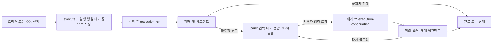
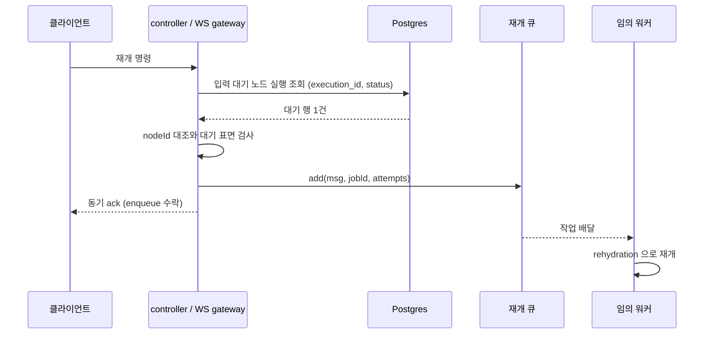

> 구현 상태: 부분 구현 · 원문: `spec/5-system/4-execution-engine.md` (§4, §7.4 Continuation Bus, §7.5.1, §7.5.2, §8, §11 환경 변수 표, Rationale), `spec/data-flow/3-execution.md` (§1.1, §1.5, Rationale) · 용어: [용어 사전](../CLE-GLOSSARY.md)

## 개요

실행 엔진은 실행(Execution, `execution`) 한 건을 여러 서버 인스턴스의 워커에 나눠 맡긴다. 한 실행은 워커가 노드를 실제로 전진시키는 세그먼트(active segment)들과 그 사이의 park 로 이루어진다. 세그먼트는 BullMQ 큐 두 개가 운반한다. 첫 세그먼트는 시작 큐(`execution-run`)가, 재개 세그먼트는 재개 큐(`execution-continuation`)가 맡는다. 입력 대기(waiting for input, `waiting_for_input`) 동안에는 어느 큐에도 작업이 없고 실행 행만 DB 에 남는다.

이 문서는 세그먼트 모델, 두 큐의 계약, 재개 명령(continuation command)의 발행과 사전 검증, 발행 결과의 ack 에러 표면, 수평 확장, park 규칙, 실행 이벤트 발행 경로, 동시 실행 제한(admission gate, `maxConcurrentExecutions`)과 실행 시간 한도(`EXECUTION_MAX_ACTIVE_RUNNING_MS`)를 정한다.

범위 밖:

- 워커가 죽은 뒤의 재구동, rehydration 절차, 안전 종료는 [장애 복구와 안전 종료](CLE-EXEC-RECOVERY.md) 가 정한다.
- 실행 상태와 노드 실행 상태의 전이는 [실행 상태 머신과 대기·재개](CLE-EXEC-STATE.md) 가 정한다.
- 저장소 전체의 BullMQ 큐 목록, Redis 키, DLQ 모니터 설정은 [비동기 큐와 Redis 키 목록](../CLE-PLAT/CLE-PLAT-QUEUE.md) 이 정한다.
- 실행·노드 실행 테이블과 데이터 흐름 시퀀스는 [실행 데이터와 흐름](CLE-EXEC-DATA.md) 에 있다.
- 세그먼트 안의 그래프 순회는 [실행 엔진 개요와 그래프 순회](CLE-EXEC-ENGINE.md), Background 본문 큐(`background-execution`)는 [컨테이너 실행](CLE-EXEC-CONTAINER.md) 과 [Background 노드](../CLE-NODE-LOGIC/CLE-NODE-BACKGROUND.md) 가 다룬다.
- WebSocket 명령과 ack 의 wire 형식은 [WebSocket 이벤트와 명령](../CLE-API/CLE-API-WS-EVENTS.md), 에러 코드 카탈로그는 [에러 코드 규약과 카탈로그](../CLE-API/CLE-API-ERRCODES.md) 가 기준이다.

## 세그먼트와 park

한 실행은 세그먼트들이 이어진 것이다. 세그먼트 사이에는 park(`waiting_for_input`)가 끼어 있다.

- **세그먼트**: 워커가 실행을 한 번 이어서 진행하는 구간이다. 시작이나 재개에서 출발해 다음 블로킹 노드에 닿거나 실행이 끝나면 멈춘다. 한 세그먼트는 한 워커 프로세스 안에서 처음부터 끝까지 돈다.
- **두 운반 큐**: 시작 큐(`execution-run`)가 첫 세그먼트(시작부터 첫 BLOCK 또는 완료까지)를, 재개 큐(`execution-continuation`)가 매 재개 세그먼트를 운반한다.
- **park**: 입력 대기는 큐에 들어가지 않는 DB 상태다. 규칙은 [입력 대기 park](#입력-대기-park) 에 있다.
- **세그먼트 안의 노드 dispatch**: `runExecution` 의 in-process 반복문이 노드를 차례로 부른다. 노드 한 개를 워커 한 개에 보내는 노드 단위 큐(per-node task queue, 1 워커 = 1 노드 실행)는 두지 않는다. 근거는 [Rationale](#rationale) 의 "노드 단위 큐 대신 실행 단위 시작 큐" 에 있다.

실행 엔진이 쓰는 BullMQ 큐는 `execution-run`, `execution-continuation`, `background-execution` 세 개다. 셋 다 실행이나 세그먼트 단위 작업을 나른다. 노드 단위 작업을 나르는 큐는 없다.



그림은 실행 하나의 수명을 보여 준다. 시작 큐와 재개 큐가 세그먼트를 운반하고 park 동안에는 큐에 아무것도 없다.

## 시작 큐

시작 큐(`execution-run`)는 실행 시작 요청을 받아 워커에 나눈다. PR1(`impl-exec-intake-queue`)에서 구현됐다.

### 발행

- `execute()` 는 실행 행을 대기 중(`pending`)으로 저장하고 시작 큐에 "실행 시작" 작업을 발행한 뒤 executionId 를 바로 돌려준다(비동기). 반환 직후 실행이 곧바로 시작된다는 보장은 없다.
- 백엔드·워커 인스턴스 N 개가 work-stealing 으로 작업을 가져간다. 웹훅이나 이벤트가 몰리면 시작 큐가 버퍼 역할을 해 backpressure 가 생긴다.
- 시작 큐는 `background-execution`, `execution-continuation` 과 같은 BullMQ 인프라를 쓴다.
- 작업 메시지:

```json
{
  "executionId": "uuid",
  "input": { }
}
```

- **jobId = `executionId`**: 실행 행을 만들 때마다 정확히 한 번 발행하므로 executionId 만으로 유일하다. BullMQ 가 같은 jobId 의 중복 발행을 자동으로 거른다(`buildExecutionRunJobId`). seq 는 쓰지 않는다. stalled 재배달도 같은 jobId 작업을 그대로 다시 처리하므로 seq 가 필요 없다. `<executionId>:run:<seq>` 형식은 명시적 재발행을 도입하는 미래 변경에서만 쓴다. 그 키(`exec:run:seq:<executionId>`)의 예약 상태는 [비동기 큐와 Redis 키 목록](../CLE-PLAT/CLE-PLAT-QUEUE.md) 에 있다.
- **우선순위**: BullMQ job priority 로 `manual`(1) > `webhook`(2) > `schedule`(3) 순서를 둔다(`EXECUTION_RUN_PRIORITY`). 2026-07-04 에 구현됐다.
  - `execute()` 는 `executedBy` 를 먼저 본다. `executedBy` 가 있으면 `manual` 이다. 수동 실행과 스케줄의 "지금 실행"(`runNow`)이 여기에 든다.
  - 그 밖에는 호출부(웹훅·채팅 채널·스케줄)가 `ExecuteOptions.triggerType` 으로 넘긴 값(`Trigger.type` 어휘 `webhook`/`schedule`)을 쓴다. 넘기지 않으면 `webhook` 으로 본다. 이 값을 `resolveExecutionRunPriority` 에 넘긴다.
  - `triggerType` 은 작업 payload 에 싣지 않는다. 우선순위 계산에만 쓴다. 실행 내역에 보이는 실행 출처(`triggerSource`)와는 다른 값이다. 실행 출처 규칙은 [실행 내역](CLE-EXEC-HISTORY.md) 에 있다.
- **작업 옵션**: `attempts: 1`(작업이 throw 해도 자동 재시도 없음), `maxStalledCount: 1`, `stalledInterval: 30초`, `removeOnComplete: true`, `removeOnFail: false`. stalled 재배달의 동작과 소진 처리는 [장애 복구와 안전 종료](CLE-EXEC-RECOVERY.md) 에 있다.

### 소비

`ExecutionRunProcessor` 가 작업을 가져와 `runExecutionFromQueue` 에 넘긴다. `runExecutionFromQueue` 는 실행 상태를 다시 읽어 세 갈래로 나눈다.

| 다시 읽은 실행 상태 | 처리 |
| --- | --- |
| `pending` | 트리거가 있으면 routing context 를 작업을 가져간 인스턴스에 등록한다. [동시 실행 제한](#동시-실행-제한) 검사를 통과하면 `runExecution` 으로 첫 세그먼트를 시작한다. |
| `running` | stalled 재배달로 본다. `recordRunningSegmentStart` 와 `redriveStuckExecution` 으로 재구동한다. 절차는 [장애 복구와 안전 종료](CLE-EXEC-RECOVERY.md) 에 있다. |
| 그 밖(종료 상태, `waiting_for_input`) | 큐에서 기다리는 동안 취소되거나 park 한 경우다. 작업을 ack 하고 버린다. 다시 실행하지 않는다. |

- BullMQ job lock 이 같은 작업의 동시 처리를 막으므로 이 분기에 별도 DB claim 은 없다.
- 세그먼트가 끝나는 방식은 두 가지다. (a) 실행이 완료나 실패로 끝나면 작업을 정상 ack 한다. (b) 노드가 BLOCK(`waiting_for_input`)하면 park 처리 뒤 작업을 정상 ack 한다.
- 워커는 첫 세그먼트(시작부터 첫 BLOCK 또는 완료까지)만 await 한다. park 동안 BullMQ 작업을 붙잡지 않는다.

### 서브 워크플로우 자식 실행

서브 워크플로우 호출은 시작 큐를 거치지 않는다. 비동기 호출(`executeAsync`)은 자식 실행 행을 만든 뒤 `runExecution` 을 자체 promise 로 실행한다. 동기 호출은 부모 실행 안에서 `executeInline` 으로 돈다. 모드 정의는 [워크플로우 호출 노드](../CLE-NODE-FLOW/CLE-NODE-SUBWF.md), 진입점별 데이터 흐름은 [실행 데이터와 흐름](CLE-EXEC-DATA.md) 에 있다. 자식 실행에 동시 실행 제한과 stalled 재배달이 적용되는지는 정의가 갈린다. [미결 사항](#미결-사항) 참조.

## 재개 큐

재개 큐(`execution-continuation`)는 재개 명령을 워커로 넘기는 영속 BullMQ 큐다. 옛 Redis pub/sub 채널 `execution:continuation` 을 대체했다. 영속 큐를 고른 이유는 [장애 복구와 안전 종료](CLE-EXEC-RECOVERY.md) 의 Rationale "영속 재개 큐와 안전 종료" 에 있다.

### 계약

| 항목 | 값 |
| --- | --- |
| 큐 이름 | `execution-continuation`. `background-execution` 과 같은 BullMQ 인프라를 쓴다. |
| 메시지 타입 | `continue` / `cancel` / `button_click` / `ai_message` / `ai_end_conversation` / `retry_last_turn` (`ContinuationType`, `continuation-bus.service.ts`). `continue` 메시지 payload 안의 표시 값(폼 제출이면 `{ type: 'form_submitted', formData }`)은 [Presentation 노드 공통](../CLE-NODE-PRES/CLE-NODE-PRES-COMMON.md#폼-제출-wire-format) 이 기준이다. |
| 메시지 스키마 | `{ type: ContinuationType, executionId: string, nodeExecutionId: string, payload?: unknown }` |
| jobId | `${executionId}:${nodeExecutionId}:${monotonic-seq}`. seq 는 executionId 마다 Redis INCR 로 받는 멱등 키다. 키와 TTL 은 [비동기 큐와 Redis 키 목록](../CLE-PLAT/CLE-PLAT-QUEUE.md) 의 `exec:cont:seq:<executionId>` 에 있다. |
| 큐 재시도 | `attempts: RESUME_BULLMQ_ATTEMPTS`(기본 3), exponential backoff(1초 / 4초 / 16초) |
| 작업 보존 | `removeOnComplete: true`, `removeOnFail: false`. 실패 작업을 남겨 DLQ 적재량을 관측한다. |
| DLQ | 모든 시도를 소진하면 실행을 `cancelled` + `error.code='RESUME_FAILED'` 로 마감한다. 처리는 [장애 복구와 안전 종료](CLE-EXEC-RECOVERY.md) 에 있다. |
| 워커 동시성 | `CONTINUATION_WORKER_CONCURRENCY`(기본 1). 아래 [워커 동작](#워커-동작) 참조. |

`retry_last_turn` 은 AI 에이전트 멀티턴의 마지막 턴 재시도(`retry_last_turn`, WebSocket `execution.retry_last_turn`) 전용이다. 대상 행은 입력 대기 행이 아니라 새로 만든 `running` 행이다. 그래서 입력 대기 사전 검증과 `claimResumeEntry` 의 `waiting_for_input → running` 조건부 전이가 적용되지 않는다. 대신 `applyRetryLastTurn` 이 자체 원자 claim 을 한다(2026-07-28). 마지막 턴 재시도의 상태 전이는 [실행 상태 머신과 대기·재개](CLE-EXEC-STATE.md) 에 있다.

### 발행 흐름

재개 명령이 들어오는 진입점은 다음과 같다.

- REST `POST /executions/:id/continue`: 본문은 `{ formData? }` 뿐이다(폼 제출 전용).
- REST `POST /executions/:id/stop` 의 입력 대기 취소 분기
- WebSocket `execution.submit_form` / `execution.click_button` / `execution.submit_message` / `execution.end_conversation` / `execution.retry_last_turn`
- External Interaction API(EIA) `/interact`: 규칙은 [EIA 수신 API와 SSE](../CLE-IX/CLE-EIA-INBOUND.md) 에 있다.
- 채팅 채널의 in-process 전달(`scope: 'in_process_trusted'`)

엔진 쪽 메서드 `continueExecution` / `cancelWaitingExecution` / `continueButtonClick` / `continueAiConversation` / `endAiConversation` 은 모두 같은 순서를 따른다. `execution.retry_last_turn` 은 이 순서를 따르지 않는다. 기대 상태가 `failed` 이고 새 `running` 행을 만든 뒤 재개 큐에 넣는다.

1. 입력 수신부(controller 또는 WS gateway)가 `resolveWaitingNodeExecutionId` 로 현재 입력 대기 노드 실행을 DB 에서 찾는다. 조회 조건은 `execution_id + status='waiting_for_input'` 이다.
2. 찾은 단일 대기 행으로 [발행 전 사전 검증](#발행-전-사전-검증) 을 한다. nodeId 는 조회 조건이 아니라 조회 뒤 대조하는 값이다.
3. 대기 행의 `nodeExecutionId` 로 메시지를 채워 재개 큐에 넣는다(`bus.add(msg, { jobId, attempts })`).
4. 임의 인스턴스의 워커가 작업을 가져가 rehydration 으로 재개한다. 절차는 [장애 복구와 안전 종료](CLE-EXEC-RECOVERY.md) 에 있다.

`type`, `nodeExecutionId`, `payload` 는 클라이언트가 보내는 필드가 아니다. 발행자가 노드 실행 조회 뒤 구성하는 내부 메시지 필드다.



그림은 입력 대기 실행에 재개 명령이 들어와 워커에 닿기까지의 순서다. 동기 ack 는 enqueue 수락까지만 알린다.

- **라우팅 원칙**: 모든 진입점은 항상 재개 큐에 넣는다. 같은 인스턴스에서 바로 처리하는 분기는 없다. in-process `pendingContinuations` Map 이 제거돼 그런 분기 자체가 존재하지 않는다. 워커는 어느 인스턴스에서 작업을 가져가든 rehydration 으로 재개한다.
- **"No pending continuation" 즉시 throw 는 쓰지 않는다**: 단일 인스턴스에서는 이 상황을 정확히 판단할 수 없다. 처리할 대상이 메모리에 없으면 rehydration 이 DB 에서 다시 만든다.
- **입력 대기 사전 검증은 발행자 책임이다.**

### 워커 동작

- 임의 인스턴스가 작업을 가져가 항상 rehydration 경로로 재개한다. park 할 때 코루틴을 바로 풀어 주므로 in-process resolver 가 없다. 워커는 `runExecution` 을 직접 await 한다. 배리어(`firstSegmentBarriers`)도 `pendingContinuations` Map 도 없다. 이것이 발행 쪽 원칙 "항상 재개 큐에 넣는다" 의 워커 쪽 짝이다.
- **취소**: 메모리에 코루틴이 없으므로 park 취소는 `ContinuationExecutionProcessor` 가 `await applyCancellation(executionId)` 로 처리한다. 그 안에서 `cancelParkedExecution` 이 실행과 짝 입력 대기 노드 실행을 직접 `cancelled` 로 표시한다.
- **동시성**: `CONTINUATION_WORKER_CONCURRENCY` 기본값은 1(인스턴스당 직렬)이다. 대량 동시 재개에서 rehydration·그래프 빌드가 줄을 서 지연이 보이면 올린다. 재개 진입을 DB 원자 claim 으로 막으므로 동시성을 올리거나 인스턴스를 늘려도 "같은 턴 이중 실행 0" 불변식이 유지된다. 이 기본값은 성능 값이지 정합성 전제가 아니다. claim 지점은 메시지 타입마다 다르다.

| 메시지 타입 | claim 지점 |
| --- | --- |
| `continue` / `button_click` / `ai_message` / `ai_end_conversation` | `claimResumeEntry` 의 `waiting_for_input → running` 조건부 전이 |
| `retry_last_turn` | `applyRetryLastTurn` 의 `_retryState` 키 조건부 소비(`status='running'` + `jsonb_exists`) |
| `cancel` | claim 대상이 아니다. `cancelParkedExecution` 자체가 조건부 UPDATE 다. |

2026-07-28 전에는 `retry_last_turn` 만 읽고 나서 분기하는 방식이라 이 불변식이 그 타입에서 성립하지 않았다. 재개 진입 claim 의 결정 근거는 [장애 복구와 안전 종료](CLE-EXEC-RECOVERY.md) 의 Rationale 에, 마지막 턴 재시도 claim 의 결정 근거는 [실행 상태 머신과 대기·재개](CLE-EXEC-STATE.md) 의 Rationale 에 있다.

### 발행 전 사전 검증

입력 수신부는 발행 직전에 대기 노드 실행을 조회하고 도착 명령의 **nodeId 와 대기 표면**을 검사한다. `resolveWaitingNodeExecutionId` 가 `execution_id + status='waiting_for_input'` 로 단일 대기 행(정상 1건)을 찾은 뒤 검사한다. 아래 경우에는 재개 큐에 넣지 않고 바로 동기 응답한다.

| 경우 | 응답 코드(WS ack) | 원인 |
| --- | --- | --- |
| 일치하는 행 0건 | `INVALID_EXECUTION_STATE` | 실행이 다른 상태(`running` / `completed` / `cancelled` / `failed`)라 입력 대기 노드 실행이 없다. |
| 일치하는 행 2건 이상(불변식 위반) | `INVALID_EXECUTION_STATE` + `logger.warn` | 정상이라면 일어나지 않는다. race 나 데이터 손상을 의심한다. |
| nodeId 불일치 | `INVALID_EXECUTION_STATE` | 명령이 지정한 `nodeId` 가 실제 대기 노드와 다르다. 낡거나 잘못 지정한 제출을 현재 대기 노드에 적용하지 않고 거부한다. 호출자가 nodeId 를 지정할 때만 적용한다. 근거는 [EIA 수신 API와 SSE](../CLE-IX/CLE-EIA-INBOUND.md) 의 `STATE_MISMATCH`("다른 nodeId") 와 `InteractDto.nodeId` 계약이다. |
| 대기 표면(`interactionType`) 불일치 | `INVALID_EXECUTION_STATE` | 대기 노드의 대기 표면이 도착 명령을 받지 않는다. `form` 대기는 `submit_form` 만, `buttons` 대기는 `click_button` 만 받는다. `ai_conversation` / `ai_form_render` 대기는 네 명령을 모두 받는다. 표면을 판정할 수 없는 행(`form` 이 아니면서 `interactionType` 이 없는 행)도 거부한다(fail-closed). |

대기 표면(`WaitingInteractionType`) 값의 기준은 [인터랙션 타입 레지스트리](../CLE-IX/CLE-IX-TYPES.md) 다.

nodeId 불일치 검사는 `resolveWaitingNodeExecutionId(executionId, expectedCommand, expectedNodeId?)` 의 선택 인자 `expectedNodeId` 로 켠다. 호출자가 이 값을 채울 때만 동작한다. 대기 표면 검사는 모든 진입점에 적용한다.

| 진입점 | nodeId 검사 | 이유 |
| --- | --- | --- |
| EIA REST `/interact` | 적용(`InteractDto.nodeId` 전달) | 외부 토큰 호출자는 SSE `waiting_for_input` 의 `waitingNodeId` 를 받으므로 대상 nodeId 를 지정할 수 있다. |
| 채팅 채널 `scope: 'in_process_trusted'` | 면제 | 신뢰하는 합성 컨텍스트는 scope 단위로 면제한다(진입점 판정이 아니다). `HooksService.forwardToInteractionService` 의 고정 매핑(`text_message → submit_message` 등)은 대기 nodeId 를 모른다. 면제가 scope 전체에 적용되므로 nodeId 를 아는 채팅 채널 폼 제출(`handleFormStep`, `pendingFormModal.nodeId`)도 함께 면제된다. |
| WebSocket 재개 명령(`execution.*`) | nodeId 를 실었을 때 적용(F-6) | `execution.submit_message` / `click_button` / `end_conversation` 은 명령 본문에 `nodeId` 를 실을 수 있다. 실으면 대기 노드와 대조하고 없으면 건너뛴다(하위 호환). `execution.submit_form` 에는 nodeId 필드가 없다. 세 handler 가 `data.nodeId` 를 `expectedNodeId` 로 넘긴다. 프론트엔드는 `submit_message` / `end_conversation` 에 대기 노드 `nodeId` 를 이미 싣는다. |
| REST `/continue` | 미적용 | 요청 본문에 `nodeId` 파라미터가 없다(폼 제출 전용). |

"면제"와 "미적용"은 결과적으로 둘 다 nodeId 검사를 건너뛴다. 앞의 것은 신뢰 컨텍스트의 의도된 정책이고 뒤의 것은 진입점에 nodeId 계약이 없어서다. 어느 쪽도 대기 표면 검사는 건너뛰지 않는다.

**진입점별 코드**: `resolveWaitingNodeExecutionId` 는 조회가 잘못되면(0건 또는 여러 행) `InvalidExecutionStateError` 를 던진다. 발행 진입점은 이것을 동기로 돌려준다.

| 진입점 | 코드 |
| --- | --- |
| WebSocket gateway 재개 handler 4개 | ack `errorCode='INVALID_EXECUTION_STATE'` |
| REST `POST :id/continue` | 422 `INVALID_STATE` |
| EIA 외부 진입점(`interaction.service`) | 409 `STATE_MISMATCH` |

- 세 코드는 같은 뜻(상태 불일치 에러, invalid execution state)이다. WebSocket 과 REST 이름을 따로 두는 이유는 [Rationale](#rationale) 에 있다. REST 코드의 기준은 [에러 코드 규약과 카탈로그](../CLE-API/CLE-API-ERRCODES.md) 다.
- DB 조회 자체의 인프라 실패는 `INVALID_EXECUTION_STATE` 로 바꾸지 않고 원래 에러로 올린다(재시도 가능).
- `__no_node_exec__` sentinel 은 워커 쪽에만 남아 있다. 취소 계열(nodeExecutionId 없음)과 배포 전에 넣은 옛 작업을 처리하기 위해서다.
- `INVALID_EXECUTION_STATE` 는 입력 대기 진입점 밖에서도 "기대 상태가 아님" 의 일반 표현으로 쓴다. `execution.retry_last_turn`(기대 상태 `failed`)이 그 예다.
- 이 동기 거부는 rehydration 실패 코드 `RESUME_*` 와 다른 축이다. `INVALID_EXECUTION_STATE` 는 ack 동기 응답이고 `RESUME_*` 는 뒤따르는 `execution.cancelled` 이벤트로 온다.

### 발행 결과와 ack 에러 표면

**발행 결과**: 재개 진입점은 발행 결과 `ContinuationPublishResult`(`queued:false` 는 `jobId:null` 과 짝)를 호출자에게 돌려준다.

- WebSocket 재개 handler 4종은 `queued:false` 를 ack 에 싣는다.
- REST `POST /executions/:id/stop` 의 입력 대기 취소 분기(WS ack 가 아님)는 `queued:false` 이면 **503 `EXECUTION_ENQUEUE_FAILED`** 로 응답해 클라이언트가 다시 시도하게 한다. 안전 종료 중의 `SERVER_SHUTTING_DOWN` 503 과 같은 모양이다.
- 성공(`queued:true`) 직후 다시 조회하면 실행이 아직 `pending` 이나 `running` 일 수 있다. 최종 취소는 뒤따르는 `execution.cancelled` 이벤트로 확인한다.
- seq 발급(Redis INCR)이 실패하면 무작위 seq 로 대신하지 않는다. `publish` 가 `null`(`queued:false`)을 돌려준다(fail-fast).

**ack 의 뜻**: ack 의 `resumed` / `queued` 는 enqueue 수락 신호다. 동기 ack 가 실패를 싣는 경우는 [발행 전 사전 검증](#발행-전-사전-검증) 뿐이다. 워커 쪽에서 나중에 실패하는 rehydration(`RESUME_CHECKPOINT_MISSING` / `RESUME_FAILED` / `RESUME_INCOMPATIBLE_STATE`)은 뒤따르는 `execution.cancelled` 이벤트의 `error.code` 로 알린다.

**ack 에러 변환**: 재개 handler 4종(`execution.submit_form` / `click_button` / `submit_message` / `end_conversation`)은 발행 경로에서 던져진 에러를 공통 ack 빌더로 바꾼다. 변환은 에러 타입에 따라 둘로 갈린다. 클라이언트에 보여도 되는 표면과 내부 진단 정보를 나눈다.

- **typed `ExecutionError`**: 실행 엔진이 클라이언트 경계로 던지는 에러는 `ExecutionError` 추상 기반(`{ code, message, serverDetail? }`)을 따른다. `code` 는 중앙 `ErrorCode` enum 값(또는 prefix 없는 안정 시스템 코드)이다. `message` 는 고정된 client-safe 영문 문자열이다. `serverDetail` 은 서버 로그 전용 진단 정보이고 클라이언트에 보내지 않는다. ack 는 `{ success:false, error: <message>, errorCode: <code> }` 다. `InvalidExecutionStateError`, `RetryLastTurnError`, `ExecutionTimeLimitError`, `FormValidationError`(`submit_form` 필드 검증, code `VALIDATION_ERROR`)가 이 계약의 선례이며 차례로 `ExecutionError` 기반으로 옮긴다(code 값과 동작은 유지).
- **그 밖의 `Error` 나 알 수 없는 값**: DB 드라이버 예외, 서드파티 에러 원문, 내부 식별자를 담을 수 있다. 내부 `error.message` 를 클라이언트에 보내지 않는다. ack 는 호출부가 정한 고정 문구와 `errorCode: 'EXECUTION_INTERNAL_ERROR'` 로 내보낸다. 원래 `error.message` 와 stack 은 서버 로그(`logger.warn`)에만 남긴다. 스택 힌트, DB·서드파티 에러 원문, 내부 식별자의 누출을 이 규칙이 막는다.

| 에러 종류 | ack `error` | ack `errorCode` | 서버 로그 |
| --- | --- | --- | --- |
| `ExecutionError`(typed) | `error.message`(고정 client-safe) | `error.code` | `serverDetail`(있으면) |
| 그 밖의 `Error` / 알 수 없는 값 | 호출부가 정한 고정 문구 | `EXECUTION_INTERNAL_ERROR` | 원래 `message` + stack |

- 새 client-safe 코드는 새 prefix 를 만들지 않고 중앙 `ErrorCode` enum 의 `EXECUTION_*` 이름공간을 넓힌다. 예: `EXECUTION_INTERNAL_ERROR`(일반 대체 코드), `EXECUTION_MESSAGE_TOO_LONG`(`submit_message` 의 `message` 가 최대 **10000자**(`ExecutionEngineService.MAX_MESSAGE_LENGTH = 10_000`)를 넘음). 길이 수치는 클라이언트에 보내지 않고 서버 로그(`serverDetail`)에만 남긴다.
- `INVALID_EXECUTION_STATE`(prefix 없는 시스템 코드), 워커 쪽 `RESUME_*`, 마지막 턴 재시도 `RETRY_*` 는 안정성 정책에 따라 기존 이름을 유지한다. 명명 규칙은 [에러 코드 규약과 카탈로그](../CLE-API/CLE-API-ERRCODES.md) 에 있다.
- 프론트엔드는 백엔드의 안정 code 를 `code → i18n key` 맵으로 표시한다(`integration-error-codes` 선례). 맵에 없는 code 는 일반 문구로 표시한다. 백엔드는 i18n 층을 두지 않는다. WS ack 표면은 [WebSocket 이벤트와 명령](../CLE-API/CLE-API-WS-EVENTS.md) 의 재개 에러 코드 표와 맞춘다.
- **EIA 진입점 매핑**: 같은 `MessageTooLongError` 가 EIA `submit_message`(`interaction.service`)에서 나면 `400 Bad Request` + `MESSAGE_TOO_LONG` 으로 바꾼다. `InvalidExecutionStateError` → `STATE_MISMATCH`(409)와 같은 방식이다. 응답에는 고정 메시지만 싣고 길이 수치는 싣지 않는다. 규칙의 기준은 [External Interaction API](../CLE-IX/CLE-EIA.md) 의 R13 이다.
- 워커 쪽 비동기 실패(`RESUME_*`)는 이 동기 변환 밖이다. 뒤따르는 `execution.cancelled` 이벤트로 알리며 같은 누출 차단 원칙(내부 message 를 싣지 않고 code 만)을 그 이벤트 빌더에도 적용한다. 그 이벤트 빌더의 점검은 후속 항목이다.

## 세그먼트 직렬화 불변식

- 시작 큐의 `jobId = executionId` 중복 제거 때문에 한 실행의 세그먼트는 **항상 하나**다. 두 세그먼트가 동시에 돌지 않는다.
- 실행 시간 한도는 `assertActiveTimeWithinLimit`(판정)와 `updateExecutionStatus`(누적) 사이에 잠금 없이 읽고 판단하고 쓴다. 이 불변식 때문에 그 사이에 다른 세그먼트가 끼어들 경로가 없어 실제 race 는 없다.
- **재진입 경로 재검증(2026-07-28)**: `retry_last_turn` 은 재개 큐 jobId(`${executionId}:${nodeExecutionId}:${seq}`)를 써서 `jobId = executionId` 중복 제거 밖에 있다. 그래서 이 불변식이 저절로 성립하지 않는다. `applyRetryLastTurn` 이 자체 원자 claim 으로 같은 보장을 만든다. `status='running'` 과 `jsonb_exists` 조건으로 `input_data - '_retryState'` 를 UPDATE 하고 affected=1 인 배달만 진행한다. 그전에는 읽고 나서 분기하는 방식이라 확인과 실행 사이에 틈이 있었다.
- 크래시 재구동 경로의 재검증과 남은 zombie race 는 [장애 복구와 안전 종료](CLE-EXEC-RECOVERY.md) 에 있다.
- 동시 실행 제한에 걸려 다시 넣는 작업은 jobId 없이 자동 id 를 받는다. 이 작업과 위 불변식의 관계는 [미결 사항](#미결-사항) 참조.

## 수평 확장

| 항목 | 설명 |
| --- | --- |
| 워커 인스턴스 수 | 백엔드 인스턴스 수로 정한다(로드 밸런서 뒤 N 개). |
| 워커당 동시성 | `EXECUTION_RUN_WORKER_CONCURRENCY`. 잘못된 입력 처리는 `CONTINUATION_WORKER_CONCURRENCY` 방식을 따른다. |
| 스케일 아웃 | 백엔드·워커 프로세스를 더하면 처리량이 늘어난다(work-stealing). |
| 우선순위 | BullMQ job priority 로 `manual` > `webhook` > `schedule`(`triggerType` → priority 매핑) |
| 큐 분할 | 워크스페이스별 큐 분리는 후속(P2)이다. 지금은 시작 큐 하나에 priority 와 concurrency 를 둔다. |

## 입력 대기 park

시작 큐 도입은 대기의 의미를 바꾸지 않는다. 입력 대기는 세그먼트가 아니라 두 세그먼트 사이의 park 다.

- **BLOCK 진입**: 그 세그먼트를 운반하던 작업(시작 큐 또는 재개 큐)은 "BLOCK 이나 완료까지 전진" 이라는 자기 일을 끝낸 것이다. 작업을 정상 ack 하고 지운다. 실패나 재시도가 아니다. 실행 행만 `waiting_for_input` 으로 남는다.
- **park 상태**: 큐 항목이 없다. heartbeat 도 TTL 도 없다. stalled 재배달 대상이 아니고 부팅 복구 스캔(`recoverStuckExecutions`) 대상도 아니다. DB 에 기한 없이 남는다.
- **재개**: 사용자 인터랙션이 도착해야만 재개 큐 작업이 생기고 다음 세그먼트가 시작된다.
- **노드별 대기 타임아웃은 없다**: Presentation 노드는 외부 취소나 종료가 없으면 입력을 기한 없이 기다린다. 기준은 [Presentation 노드 공통](../CLE-NODE-PRES/CLE-NODE-PRES-COMMON.md) 이다. 노드 설정에 대기 타임아웃 필드(원문의 `formConfig.timeout` 등)는 없다. 타임아웃을 둘지는 정의가 갈린다([Presentation 노드 공통 미결 사항](../CLE-NODE-PRES/CLE-NODE-PRES-COMMON.md#미결-사항)). 실행 시간 한도는 park 시간을 세지 않는다.
- **예외 회수**: 다시 이어 갈 수 없음이 확실한 park 만 예외로 회수한다. 공개 웹채팅 위젯의 익명 per_execution 토큰이 영구 만료된 경우다. 이 회수는 엔진 부팅 복구가 아니라 EIA 계층의 토큰 수명 sweep 이 `cancelled` 로 처리한다. 그래서 park 무기한 보존 불변식과 충돌하지 않는다. 규칙은 [External Interaction API](../CLE-IX/CLE-EIA.md) 의 EIA-RL-07 에 있다.

**park 는 세그먼트 종료다(Phase B, 구현 완료)**: park 에서 `runExecution` 세그먼트가 바로 반환한다.

- form·button·멀티턴 AI 의 각 `waitForX` 는 재개에 필요한 상태를 DB 에 남긴 뒤 기다리지 않고 반환한다. 남기는 항목은 대화 스레드(`Execution.conversation_thread`), 사용자 정의 변수(`Execution.user_variables`), AI 재개 체크포인트(`_resumeCheckpoint`), 호출 스택(`Execution.resume_call_stack`)이다. 무엇을 언제 커밋하는지는 [실행 컨텍스트](CLE-EXEC-CONTEXT.md) 의 저장 전략이 정한다.
- `runExecutionFromQueue`(워커 `process()` 진입점)는 `runExecution` 의 반환만 await 하고 작업을 ack 한다. park 동안 BullMQ 슬롯도 코루틴도 컨텍스트 메모리도 쓰지 않는다.
- 멀티턴 AI 는 턴 단위로 park 한다. 한 턴 처리가 한 세그먼트다. 응답 없는 대화도 메모리를 쓰지 않는다.
- 재개는 임의 워커가 rehydration 으로 컨텍스트를 다시 만들어 다음 세그먼트를 구동한다. 모든 park 지점(단발 form·button, 최상위와 중첩 멀티턴 AI, 중첩 `executeInline` 블로킹)이 이 한 경로로 재개한다. 절차와 결정 근거는 [장애 복구와 안전 종료](CLE-EXEC-RECOVERY.md) 에 있다.

## 실행 이벤트 발행 경로

**결정**: 실행 엔진의 외부 이벤트(`NODE_STARTED` / `NODE_COMPLETED` / `EXECUTION_*` / `AI_MESSAGE` 등) 발행 대상은 `WebsocketService` 하나다. `IExecutionEventEmitter` 같은 인터페이스나 Nest `EventEmitter2` 같은 별도 추상화를 두지 않는다.

- 인스턴스 사이 fan-out 은 재개 큐가 맡는다. 이벤트 발행 방식과 분산 동작은 서로 관계가 없다. 옛 Redis pub/sub 채널 `execution:continuation` 은 폐기했다.
- `ExecutionEventEmitter` 는 발행 호출 지점을 한데 모은 **같은 모양의 얇은 래퍼**다. 이 절이 금지하는 외부 이벤트 발행 추상화 인터페이스가 아니므로 단일 발행 정책의 예외가 아니다. 이 래퍼가 생긴 배경(엔진 클래스 분할)은 [실행 엔진 개요와 그래프 순회](CLE-EXEC-ENGINE.md) 의 Rationale 에 있다.
- External Interaction API 의 EIA 알림 웹훅(Outbound Notification Webhook)과 외부 SSE 어댑터가 생긴 뒤에도 엔진 수준 단일 발행 정책은 유지한다. NotificationDispatcher 와 SSE 어댑터는 모두 엔진 밖 facade 층에 둔다. 엔진 코드는 외부 발행 대상의 종류를 알 필요가 없다. 기준은 [External Interaction API](../CLE-IX/CLE-EIA.md) 의 R10 이다.
- 외부 발행 대상(웹훅 콜백, 텔레메트리 export 등)이 실제로 더해지면 이 결정을 다시 검토한다.

**순환 의존 처리**: 엔진의 DI 순환은 성격에 따라 두 표준 기법으로 푼다. 둘 다 NestJS 표준이며 회피용 안티패턴이 아니다.

| 기법 | 적용 기준 | 사례 |
| --- | --- | --- |
| `forwardRef(() => X)`(생성자 주입 지연) | 순환은 있지만 양쪽이 부트스트랩 때 함께 인스턴스화돼 정상 해석되는 경우. 기본 선택이다. | `ExecutionEngineService ↔ WebsocketService`, 후속 ④에서 드러난 `ExecutionEventEmitter → WebsocketService`(ES-module 순환 봉인) |
| `ModuleRef.get(X, { strict: false })`(런타임 지연 해석) | 순환 그래프에서 이 서비스가 상대 모듈보다 먼저 인스턴스화돼 생성자 `@Optional` 주입이 `undefined` 로 굳는 경우. `forwardRef` 로도 풀리지 않는 인스턴스화 순서 함정을 런타임 해석으로 피한다. | `ExecutionEngineService → NotificationsService`(`getNotificationsService`, PR #841. 해석하지 못하면 `execution_failed` 알림 발송이 조용히 no-op 이 된다), `NotificationsService → WebsocketService`(`getWebsocket`) |

- 순환 자체를 이벤트 기반 분리 등으로 근본적으로 줄이는 일은 별도 대규모 리팩터링 backlog 다. 지금은 두 기법으로 봉인한 상태를 유지한다.
- **모듈 그래프 층의 완화책**: 위 두 기법은 DI 그래프를 다룬다. 순환은 모듈 그래프 층에서도 다른 실패를 낸다. 순환 위의 모듈이 모듈 평가 시점에 다른 모듈의 값(enum 등)을 읽으면 아직 `undefined` 다. 이 문제는 값·타입 선언을 의존성 없는 모듈로 떼어 내 푼다(`codebase/backend/src/modules/websocket/websocket-events.types.ts`, 그전에는 호출 시점 지연 평가로 피했다). 이 조치로 DI 그래프, `forwardRef` 배치, 단일 발행 정책은 바뀌지 않는다. 이벤트 기반 분리로 순환을 근본적으로 줄이는 일도 여전히 미뤄져 있다. 줄어든 것은 모듈 그래프이지 DI 그래프가 아니다.

## 동시 실행 제한

> 구현 상태: 실행 시간 한도(세그먼트 누적 시간 기준)는 PR2a(`impl-exec-concurrency-cap`)에서 구현됐다. 워크스페이스·워크플로우 동시 실행 제한과 큐 대기 5분 취소는 PR2b 에서 구현됐다(settings 키, advisory lock 검사, `queued_at`, `EXECUTION_QUEUE_WAIT_TIMEOUT`, 워크스페이스 settings 쓰기 API). 우선순위 3단계도 구현됐다(2026-07-04). 단일 실행 최대 노드 수(500)만 미구현(Planned)이다. 남은 후속은 `plan/in-progress/execution-engine-residual-gaps.md` 에 있다.

| 제한 항목 | 기본값 | 설정 위치 | 비고 |
| --- | --- | --- | --- |
| 워크스페이스당 동시 실행 수 | 10 | `Workspace.settings.maxConcurrentExecutions`(관리자 이상, `PATCH /api/workspaces/:id/settings`). 키 정의는 [계정과 워크스페이스 데이터 흐름](../CLE-ACCT/CLE-ACCT-DATA.md) | 시작 큐 + 동시 실행 제한 검사로 센다(PR2b). |
| 워크플로우당 동시 실행 수 | 3 | `Workflow.settings.maxConcurrentExecutions`(편집자 이상, `PATCH /api/workflows/:id`). 키 정의는 [워크플로우 데이터와 저장 흐름](../CLE-WF/CLE-WF-DATA.md) | 시작 큐 + 동시 실행 제한 검사로 센다(PR2b). |
| 단일 실행 최대 노드 수 | 500 | 시스템 설정 | 미구현(Planned) |
| 단일 실행 최대 실행 시간 | 30분 | 1단계(PR2a): 시스템 env `EXECUTION_MAX_ACTIVE_RUNNING_MS`(기본 `1800000`ms, `0`=무제한). 2단계(후속): 워크플로우별 `Workflow.settings` | 세그먼트 누적 시간 기준(wall-clock 아님, 입력 대기 시간 제외). 1단계 구현 완료 |
| 노드별 기본 타임아웃 | 30초 | `Node.config` | |

**실행 시간 한도의 기준은 세그먼트 누적 시간이다.** 최대 실행 시간은 wall-clock 이 아니라 세그먼트들의 누적 시간(`Execution.active_running_ms`)으로 잰다. 입력 대기 park 동안 흐른 시간은 뺀다. 사용자 입력을 며칠 기다리는 정상 워크플로우를 타임아웃으로 끝내면 안 되기 때문이다. 세그먼트 작업은 세그먼트 구간에만 존재하므로(park 중에는 작업이 없다) 세그먼트 작업 시간이 곧 그 세그먼트의 시간이다. 누적은 세그먼트 시간의 합으로 추적한다. 적산 방식은 [실행 데이터와 흐름](CLE-EXEC-DATA.md) 에 있다.

**제한을 넘으면**:

- **동시 실행 수 초과**: 새 실행은 `pending` 상태로 시작 큐에서 기다린다. 시작 큐 소비자(`runExecutionFromQueue`)가 **첫 세그먼트 시작(`pending → running`) 직전에** 원자적으로 동시 실행 제한을 검사한다. 워크스페이스와 워크플로우 **양쪽**의 `COUNT(status='running')` 이 모두 한도 미만일 때만 `running` 으로 들어간다. 아니면 `pending` 을 유지하고 지연 재발행(백오프)한다. PR2b 에서 구현됐다.
  - 이 검사는 **`pending → running` 최초 진입에만** 적용한다. stalled 재배달의 `running` 분기와 park 재개는 이미 `running` 이거나 재진입이라 다시 세지 않는다. 한 실행이 동시에 두 세그먼트를 돌 수 없으므로 이중 계산이 없다.
- **실행 시간 한도 도달**: 누적 시간이 **한도 이상**(`activeNow >= maxActiveRunningMs`, 경계값 포함)이면 `EXECUTION_TIME_LIMIT_EXCEEDED` 에러로 실행을 `failed` 로 끝낸다. 엔진 수준 누적 타임아웃 전용 코드다. Code 노드 스크립트 타임아웃 `EXECUTION_TIMEOUT` 과 뜻이 달라 코드를 나눴다. 기준은 [에러 코드 규약과 카탈로그](../CLE-API/CLE-API-ERRCODES.md) 다. PR2a 에서 구현됐다.
- **큐 대기 한도(`EXECUTION_QUEUE_WAIT_TIMEOUT`) 초과**: 큐 대기 시간(`now - queued_at`)이 기본 5분(시스템 env `EXECUTION_QUEUE_WAIT_TIMEOUT_MS`, 기본 `300000`ms)을 넘으면 실행을 `cancelled` + `error.code='EXECUTION_QUEUE_WAIT_TIMEOUT'` 로 끝낸다. 시스템 취소이며 취소 주체(`cancelledBy`)는 `'timeout'` 이다. `execution.cancelled` 이벤트는 rehydration 실패 취소와 같은 경로로 발행한다. 이벤트 형식은 [WebSocket 이벤트와 명령](../CLE-API/CLE-API-WS-EVENTS.md) 에 있다. PR2b 에서 구현됐다.
  - **주 경로는 작업을 가져갈 때의 검사다.** 소비자가 작업을 가져가면 동시 실행 제한 검사 전에 `now - queued_at` 을 본다. 한도를 넘었으면 다시 넣지 않고 `cancelled` 로 끝낸다. 한도 초과로 지연 재발행된 작업은 재시도 때마다 다시 검사되므로 대기 초과를 반드시 잡는다.
  - **작업 자체를 잃은 대기 중 실행**(Redis 비영속, 작업 유실 등)은 부팅 복구 스캔이 같은 방식(`EXECUTION_QUEUE_WAIT_TIMEOUT`, `cancelledBy='timeout'`, `releaseExecutionRouting`)으로 회수한다. 2026-07-04 에 구현됐다. 한도 안쪽의 방치된 작업은 다음 스캔 때 한도를 넘었으면 회수한다(드문 경우, 부팅 때만 도는 best-effort). 규칙은 [장애 복구와 안전 종료](CLE-EXEC-RECOVERY.md) 에 있다.

**동시 실행 제한 검사의 원자성(TOCTOU)**: 여러 소비자가 같은 슬롯을 두고 경쟁하므로 "세기 → 비교 → 전이" 가 원자적이어야 한다. 읽고 나서 판단하는 방식은 한도를 넘게 허용한다.

- 구현은 워크스페이스마다 PostgreSQL advisory lock(`pg_advisory_xact_lock`)으로 검사를 줄 세운 트랜잭션 안에서 조건부 UPDATE(`WHERE status='pending' AND (SELECT count …) < cap RETURNING`)를 한다. 워크스페이스 수는 실행 테이블에 `workspace_id` 가 없어 워크플로우와 join 해 센다.
- **조건부 UPDATE 하나만으로는 부족하다.** 서브쿼리 COUNT 가 훑는 다른 `running` 행에 잠금이 없어서 서로 다른 실행을 대상으로 한 두 검사가 같은 COUNT 스냅샷을 보고 둘 다 통과할 수 있다(한도 초과). advisory lock 이 같은 워크스페이스의 검사를 순서대로 처리해 스냅샷을 안정시킨다. 다른 워크스페이스끼리는 병렬로 진행한다.
- 판정은 `RETURNING` 이 돌려준 행 배열의 길이로 한다. raw SQL 결과를 읽는 규칙은 [raw SQL 결과 읽기 규약](../CLE-ENG/CLE-ENG-RAWQUERY.md) 에 있다.

## 환경 변수

| 환경 변수 | 기본값 | 설명 |
| --- | --- | --- |
| `EXECUTION_RUN_WORKER_CONCURRENCY` | `1` | 시작 큐 워커가 인스턴스마다 동시에 처리하는 세그먼트 수. work-stealing 처리량, backpressure, 동시 실행 제한의 토대다. 양수가 아니거나 정수가 아니거나 숫자가 아니거나 공백뿐이면 1 로 대신한다(`resolveExecutionRunWorkerConcurrency`). 모듈을 불러올 때 한 번 읽으므로 인스턴스를 다시 시작해야 반영된다. |
| `CONTINUATION_WORKER_CONCURRENCY` | `1` | 재개 큐 워커가 인스턴스마다 동시에 처리하는 재개 작업 수. 양수가 아니거나 정수가 아니거나 숫자가 아니면 1 로 대신한다. 다시 시작해야 반영된다. |
| `EXECUTION_MAX_ACTIVE_RUNNING_MS` | `1800000`(30분) | 단일 실행의 세그먼트 누적 시간 한도(ms). 넘으면 `EXECUTION_TIME_LIMIT_EXCEEDED` 로 `failed`. `0` 은 무제한이다. 정수가 아니거나 음수거나 숫자가 아니면 기본값으로 대신한다(`resolveMaxActiveRunningMs`). 입력 대기 시간은 뺀다. 다시 시작해야 반영된다(PR2a). |
| `EXECUTION_QUEUE_WAIT_TIMEOUT_MS` | `300000`(5분) | 큐 대기 한도. 넘으면 `EXECUTION_QUEUE_WAIT_TIMEOUT` 으로 `cancelled`(PR2b). |

`RESUME_BULLMQ_ATTEMPTS`(기본 3)는 환경 변수가 아니라 코드 상수다. `background-execution` 큐의 `attempts` 와 같은 방식으로 관리하며 환경 변수화는 후속이다. 안전 종료 관련 변수는 [장애 복구와 안전 종료](CLE-EXEC-RECOVERY.md), DLQ 모니터 변수와 seq TTL 은 [비동기 큐와 Redis 키 목록](../CLE-PLAT/CLE-PLAT-QUEUE.md) 에 있다.

## 미결 사항

- **서브 워크플로우 자식 실행의 큐·제한 적용 범위**: 데이터 흐름 문서는 서브 워크플로우 호출(`executeAsync`, 그리고 옛 서술의 `executeSync`)이 시작 큐를 타지 않는다고 적는다(관련: [실행 데이터와 흐름](CLE-EXEC-DATA.md)). 엔진 원문의 워커 모델과 동시 실행 제한 절은 새 실행이 시작 큐와 동시 실행 제한 검사를 거친다고만 적고 이 예외를 말하지 않는다. 그래서 비동기 자식 실행이 동시 실행 제한과 stalled 재배달의 대상인지 알 수 없다. 현재 구현은 `executeAsync` 가 `runExecution` 을 직접 부른다(원문 데이터 흐름 기준, 코드 재확인 안 함). 적용 범위를 정해야 한다.
- **동시 실행 제한 재발행 작업과 세그먼트 직렬화 불변식**: 워커 모델 절은 `jobId = executionId` 중복 제거로 한 실행의 세그먼트가 항상 하나라고 적는다. Rationale "방치된 대기 중 실행 회수" 는 동시 실행 제한에 걸려 다시 넣는 작업이 jobId 없는 자동 id 라고 적는다. 따라서 중복 제거는 첫 발행에만 걸린다. 실제 이중 진행은 동시 실행 제한 검사의 조건부 UPDATE(`WHERE status='pending'`)가 막는 것으로 보이나 원문에 명시되지 않았다(관련: [장애 복구와 안전 종료](CLE-EXEC-RECOVERY.md)). 불변식 서술에 재발행 작업의 처리를 적어야 한다.

## 구현 위치

- `codebase/backend/src/modules/execution-engine/**` (엔진 전체. `execute`, `runExecutionFromQueue`, 동시 실행 제한 검사)
- `codebase/backend/src/modules/execution-engine/queues/execution-run.queue.ts` (시작 큐와 우선순위, 작업 옵션)
- `codebase/backend/src/modules/execution-engine/queues/execution-run.processor.ts` (시작 큐 소비자)
- `codebase/backend/src/modules/execution-engine/continuation/continuation-bus.service.ts` (재개 큐 발행)
- `codebase/backend/src/modules/execution-engine/continuation/continuation-execution.processor.ts` (재개 큐 소비자)
- `codebase/backend/src/modules/execution-engine/execution-limits.ts` (실행 시간 한도, 큐 대기 한도)
- `codebase/backend/src/modules/websocket/websocket-events.types.ts` (이벤트 값·타입 선언 분리)

## Rationale

### 노드 단위 큐 대신 실행 단위 시작 큐 (2026-06-04 결정, PR1)

- **배경**: 초기 모델은 `execute()` 가 같은 인스턴스에서 바로 실행 반복문에 들어가는 fire-and-forget in-process 방식이었다. 웹훅이 몰려도 backpressure 가 없었다. 실행이 요청을 받은 인스턴스에 고정돼 수평 확장도 안 됐다. 원래 목표 그림은 노드 단위 큐(1 워커 = 1 노드 실행, 노드마다 `{taskId, nodeId, nodeType, input, context, timeout}` 태스크 발행)였으나 구현되지 않았다. 성능·안정성·대량·분산 처리 신뢰성이 사용 방식과 관계없는 기반 요건으로 확인돼 구현에 들어가면서 설계를 다시 검토했다.
- **기각(노드 단위 큐)**: in-process dispatch 반복문은 컨테이너(Loop/ForEach/Map), 중첩 컨테이너 스코프 체인([컨테이너 실행](CLE-EXEC-CONTAINER.md). 원문은 `$parent` 로 적었으나 그 변수는 없다), back-edge 순환, Parallel(`p-limit` + `allSettled`)을 "한 실행이 한 프로세스 안에 있다" 는 전제로 처리한다. 노드를 워커로 나누려면 노드마다 실행 컨텍스트 전체(변수, loop·item 컨텍스트, 스코프 체인, 대화 스레드)를 직렬화하고 rehydration 해야 한다. rehydration 인프라는 "입력 대기 뒤 재개" 용이지 "실행 중 노드 인계" 용이 아니다. 엔진을 다시 쓰는 수준의 고위험 작업이다.
- **채택(실행 단위 시작 큐)**: 워커가 실행 1건의 세그먼트를 통째로 처리한다. 세그먼트 안의 노드 dispatch 는 in-process 로 둔다. n8n queue mode 와 같은 구조이며 수평 처리량, work-stealing, backpressure, 동시 실행 제한의 토대를 노드 단위 방식보다 훨씬 낮은 위험으로 얻는다. `background-execution` 과 재개 큐 패턴을 그대로 다시 쓴다.
- **세그먼트 모델과 맞물림**: 재개 큐가 이미 "재개 세그먼트" 를 운반하고 있었다. 시작 큐는 그 짝으로 "첫 세그먼트" 를 운반한다. 두 큐가 세그먼트를, park 가 그 사이를 맡는 구조가 자연스럽게 완성된다. 시작 큐 도입은 대기의 의미를 바꾸지 않는다.
- **대가**: 한 실행 안의 노드들을 여러 워커로 나누는 세밀한 분산은 포기한다. 단일 실행이 매우 무겁고 내부 분산이 실제로 필요해지면 다시 검토한다(지금은 그런 요구가 없다). 워크스페이스별 큐 분할도 후속(P2)이다.
- **서브 워크플로우는 시작 큐를 타지 않는다**: 부모 세그먼트 안에서 동기 await 나 자체 promise 로 충분하다. 큐를 한 번 더 거치면 부모 세그먼트의 지연만 늘어난다(원문 데이터 흐름 Rationale).
- **노드 단위 큐가 없음을 확정**: PR1 전에는 큐가 둘뿐이고 실행 시작이 in-process fire-and-forget 이었다. PR1 뒤 BullMQ 큐는 `execution-run`, `background-execution`, `execution-continuation` 세 개이고 모두 실행·세그먼트 단위 작업을 나른다. 안전 종료 절차도 이 전제를 따른다.

### 실행 이벤트 발행 대상을 하나로 둔다

- 이 시스템의 외부 이벤트 소비자는 WebSocket 클라이언트 한 종류뿐이다. 발행 대상이 여럿으로 드러나기 전까지 추상화는 YAGNI 다.
- 분산은 재개 큐가 맡으므로 이벤트 발행 추상화와 관계가 없다.
- 테스트에서는 `Partial<WebsocketService>` mock 으로 충분하다. 추상화 인터페이스용 noop 구현체가 필요 없다.

### 실행 시간 한도를 세그먼트 누적 시간으로 (2026-06-04 결정)

- **배경**: "단일 실행 최대 실행 시간 30분" 이 wall-clock 인지 active 시간인지 정해져 있지 않았다.
- **채택**: 입력 대기 시간을 뺀 세그먼트 누적 시간 기준. wall-clock 이면 사용자 입력을 며칠 기다리는 정상 워크플로우를 타임아웃으로 끝낸다. 과거 테스트에서 "늦게 돌아오니 세션 만료" 회귀로 확인된 안티패턴이다.
- **설계 맞물림**: 세그먼트 작업은 세그먼트 구간에만 있다(park 중에는 작업이 없다). 그래서 세그먼트 작업 시간이 곧 active 시간이 되고 별도 시계 없이 자연스럽게 나뉜다. 누적은 세그먼트 시간의 합이다.
- **에러 코드 분리**: 엔진 누적 타임아웃은 새 코드 `EXECUTION_TIME_LIMIT_EXCEEDED` 다. Code 노드 스크립트 타임아웃 `EXECUTION_TIMEOUT`(`nodes/data/code/code.handler.ts`)과 뜻이 달라 이름을 바꾸지 않고 새로 만들었다. 에러 코드 명명 규약을 따른다.
- **한도 출처는 1단계 env, 2단계 워크플로우별(PR2a)**: 표의 설정 위치는 `Workflow.settings` 였지만 그 설정 필드가 아직 없었다. 그래서 PR2a 는 시스템 env 상수 `EXECUTION_MAX_ACTIVE_RUNNING_MS`(기본 30분, `0`=무제한)로 1단계를 구현했다. 워크플로우별 설정 필드와 UI 는 2단계 후속이다. 멀티테넌트 폭주 방지라는 핵심 목적은 전역 한도로 바로 이룰 수 있다. 워크플로우별 세분화는 DB 마이그레이션과 UI 가 필요한 별도 범위다.
- **판정은 `>=`(경계 포함)**: 한도와 정확히 같은 값도 초과로 본다. 한도에 닿은 세그먼트는 한도를 다 쓴 것이므로 끝내는 것이 맞다. `>` 보다 경계값에서 조용히 덜 적용될 위험이 없어 보수적으로 안전하다.
- **판정의 비원자성은 직렬화 불변식이 막는다**: `assertActiveTimeWithinLimit`(DB 누적값 + 진행 중 경과분을 읽어 판정)와 `updateExecutionStatus`(세그먼트 끝에 누적 기록) 사이에 잠금이 없다. 한 실행의 세그먼트가 항상 하나이고 동시에 돌지 않으므로 지금 구조에서는 실제 race 가 없다. 재진입 경로가 늘면 다시 검증한다([세그먼트 직렬화 불변식](#세그먼트-직렬화-불변식)).

### 동시 실행 제한은 소비 쪽에서 검사하고 대기 초과는 취소한다 (PR2b, 2026-07-04)

사용자 결정(2026-07-04): spec 을 먼저 나누고 범위는 동시 실행 제한과 5분 취소로 한다. 우선순위 3단계는 후속으로 뺀다.

- **소비 쪽 검사(발행 쪽 아님)**: work-stealing 분산에서 어느 인스턴스가 실행할지는 작업을 가져가는 시점에 정해진다. `execute()` 는 항상 `pending` 으로 넣고 바로 반환하는 계약을 지킨다. 그래서 검사는 소비자(`runExecutionFromQueue`)가 `pending → running` 전이 직전에 원자적으로 해야 분산 정합이 맞다. 발행 쪽 검사(execute 때 세기)는 다중 인스턴스 race 가 생기고 즉시 반환 계약도 깨므로 기각했다.
- **`failed` 가 아니라 `cancelled`(+`error.code`)**: 큐 대기 초과는 노드 실행이 시작조차 안 된 상태다. "실패" 보다 "취소" 가 뜻에 맞다. 취소 주체 enum 에서 쓰이지 않던 값 `'timeout'` 을 처음 쓰고 `error.code='EXECUTION_QUEUE_WAIT_TIMEOUT'` 으로 사용자 취소와 구분한다. rehydration 실패의 시스템 취소가 `execution.cancelled` 에 `error` 를 함께 싣는 기존 구조를 다시 쓰므로 새 payload 필드가 없다.
- **검사는 `pending → running` 최초 진입에만**: 한 실행이 동시에 두 세그먼트를 돌 수 없으므로 stalled 재배달과 park 재개까지 다시 세면 이중 계산이 된다. 크래시 재구동에서 인정한 zombie race 는 "같은 실행을 두 워커가 잠깐 굴릴 수 있다" 는 문제다. 동시 실행 제한이 세는 "서로 다른 실행 N 개" 와는 다른 문제다.
- **TOCTOU 원자화**: 읽고 나서 판단하는 방식은 한도를 넘게 허용한다. 조건부 UPDATE 만으로는 부족했다. 서브쿼리 COUNT 에 잠금이 없어 동시 검사가 같은 스냅샷을 보고 한도를 넘겼다(ai-review 가 실제 Postgres 로 재현했다). 워크스페이스별 advisory lock 으로 같은 범위를 줄 세우고 다른 워크스페이스는 병렬로 둔다.
- **`queued_at` 컬럼 신설(V104)**: 5분 판정은 큐 대기 진입 시각 기준이다. `started_at`(`running` 전이 시각)은 부팅 복구 스캔의 stale 판정에 쓰여 다시 쓸 수 없다.
- **우선순위 3단계 분리**: `ExecuteOptions.triggerType` 전달은 ExecuteOptions, 트리거 payload, 큐 옵션 세 층을 바꾸는 일이라 동시 실행 제한 검사와 관계가 없다. 리뷰를 집중하려고 별도 후속 PR 로 뺐다(사용자 결정). 2026-07-04 에 구현됐다.

### 동시 실행 제한 판정은 RETURNING 행 배열로 한다 (2026-08-30 소급 기록)

동시 실행 제한 검사는 4개월 동안 한 번도 통과하지 못했다. 검사는 advisory lock UPDATE 의 `RETURNING` 으로 `rows.length === 1` 을 판정했다. 그 반환값은 `[rows, affectedCount]` 튜플이라 길이가 항상 2였고 판정은 항상 거짓이었다. `8332d9a20`(2026-08-13)이 고쳤다.

제품이 동작한 이유: UPDATE 는 이미 커밋돼 행이 `running` 이 됐다. 다시 넣은 작업을 `runExecutionFromQueue` 의 `running` 분기가 stalled 재배달로 잘못 알고 rehydration 으로 재구동했다. 결과만 맞고 경로가 틀렸다. 그 대가로 실행마다 약 2초 지연이 생겼다. `if (admitted)` 블록(`recordRunningSegmentStart`, `EXECUTION_STARTED` 발행)은 통째로 죽은 코드가 됐다.

같은 결함의 반대 부호가 실행 상태 전이 쪽에 있었다. 그쪽은 `length > 0` 이라 항상 참이었다. 하나의 shape 오해가 "늘 실패" 와 "늘 성공" 양쪽으로 나타난 사례다. 불변식은 [raw SQL 결과 읽기 규약](../CLE-ENG/CLE-ENG-RAWQUERY.md) 이 정한다. 상태 전이 쪽 사례는 [실행 상태 머신과 대기·재개](CLE-EXEC-STATE.md) 에 있다.

### 대기 표면과 명령의 조합을 발행 전에 검사한다 (2026-07-11)

실행이 `waiting_for_input` 인지(`assertWaiting`)만 보면 다른 종류의 명령을 막지 못한다. 재개 처리기(`dispatchResumeTurn`)는 도착 메시지의 `type` 이 아니라 **대기 노드의 표면**으로 골라진다. 그래서 표면과 맞지 않는 명령이 통과하면 조용히 잘못 처리됐다. `form` 대기는 sentinel 불일치 폴백으로 **빈 폼이 제출된 것처럼** 완료됐다. `buttons` 대기는 `resolveButtonInteraction` 의 else(d) 폴백으로 **엉뚱한 `continue` 포트로 분기**했다. 그래서 `resolveWaitingNodeExecutionId` 가 대기 노드의 표면을 판정해 도착 명령의 허용 여부를 발행 전에 검사한다.

- **`form`/`buttons` 는 자기 명령만, `ai_conversation`/`ai_form_render` 는 넷 다 받는 이유**: AI 표면은 이미 다른 종류의 명령을 정상적으로 받도록 설계됐다. `render_form` 응답(`form_submitted`)과 낡은 `button_click` 을 다시 park 하는 불변식이 그것이다. 기준은 [AI 에이전트 노드 출력과 디버그](../CLE-NODE-AI/CLE-NODE-AGENT-OUTPUT.md) 와 [Presentation 노드 공통](../CLE-NODE-PRES/CLE-NODE-PRES-COMMON.md) 에 있다. 여기서 넷을 좁히면 두 계약이 깨진다. `form`/`buttons` 는 한 가지 목적의 표면이라 자기 명령만 받는 것이 자연스럽다.
- **새 코드를 만들지 않는 이유**: 기존 `InvalidExecutionStateError` 를 다시 쓰면 진입점별 매핑(WS ack `INVALID_EXECUTION_STATE` / REST `/continue` 422 `INVALID_STATE` / EIA 409 `STATE_MISMATCH`)이 저절로 따라온다. 이 거부는 EIA-IN-13 필수 요구사항과 EIA `STATE_MISMATCH` 행이 이미 약속한 동작이다. 코드가 그 미이행 틈을 메운 것이지 새 계약이 아니다.
- **판정할 수 없어도 거부(fail-closed)하는 이유**: 짝이 되는 `dispatchResumeTurn` 도 맞는 처리기를 못 찾으면 거부(`RESUME_CHECKPOINT_MISSING`)한다. 표면을 판정할 수 없는 행은 어차피 워커에서 그 에러로 실행이 끝난다(`form` 은 정적 handler metadata 로 항상 판정되므로 이 경우에 오지 않는다). 발행 전에 동기로 거부하면 실행이 `waiting_for_input` 으로 남아 복구 가능성이 높다. 이 프로젝트의 fail-open 선례는 인프라 가용성(Redis/DB) 상황에 한정된다. 데이터 정합성 검사는 fail-closed 가 원칙이다. 서브 워크플로우 워크스페이스 격리를 fail-closed 로 바꾼 선례와 같은 방향이다.

nodeId 불일치 행은 F-1 이 표면 불일치 행 앞에 더했다.

### `INVALID_EXECUTION_STATE` 와 `INVALID_STATE` 이름을 나눠 둔다

발행 전 사전 검증의 0건·여러 행 경우를 WebSocket 은 `INVALID_EXECUTION_STATE` 로, REST 는 422 `INVALID_STATE` 로 응답한다. 두 층을 `INVALID_STATE` 하나로 합치면 WS ack 를 처리하는 클라이언트가 같은 코드를 동기 ack 응답과 뒤따르는 이벤트로 나눠 분기하기 어렵다. 이름을 나눠 두면 코드 이름만 보고 경로를 알 수 있다. 두 층이 같은 뜻이라는 점은 본문에서 서로 링크한다. 이 코드는 입력 대기 진입점(`execution.submit_form` / `click_button` / `submit_message` / `end_conversation`) 밖에서 `execution.retry_last_turn`(기대 상태 `failed`)에도 같은 뜻으로 쓴다.

### 발행 실패를 `queued:false` 하나로 알린다 (C-1·M-7)

- **C-1**: `cancelWaitingExecution` 은 원래 `void publish` 로 결과를 버렸다. 발행 실패가 호출자에게 닿지 않아 에러가 사라졌다. 다른 재개 메서드 4종은 이미 `ContinuationPublishResult` 를 돌려주므로 취소만 예외로 둘 근거가 없었다. 같은 방식으로 맞추고 REST `POST /executions/:id/stop` 의 입력 대기 취소 분기가 `queued:false` 를 알리게 했다.
  - HTTP 코드는 **503** 이다. Redis 의존성 장애는 상류를 쓸 수 없는 상태이므로 502(잘못된 게이트웨이 응답)가 아니라 503(일시적 불가, 재시도)이 맞다. `SERVER_SHUTTING_DOWN`(SIGTERM 뒤 새 실행 거부)이 같은 503 선례를 만들었다.
  - 취소는 WS ack 경로가 아니라 REST 중지 진입점이므로 새 코드 `EXECUTION_ENQUEUE_FAILED`(`EXECUTION_*` 이름공간)로 표기한다.
  - "502 가 아니라 503" 판정은 **우리 의존성의 장애**에 한정된다. 외부 서드파티 API 호출 실패의 502 사용은 [채팅 채널](../CLE-CHAT/CLE-CHAT-CORE.md) 의 R-CC-23 이 정한다. 두 기준은 지금까지의 사례에서 모두 같은 결론을 낸다.
- **M-7**: `nextSeq` 의 Redis INCR 이 실패하면 쓰던 `Math.random` seq 대체를 없애고 fail-fast(INCR throw → `publish` 바깥 catch → `null`/`queued:false`)로 바꿨다. 무작위 seq 는 "seq = 멱등 키" 와 단조성 계약을 어겨 jobId 중복 제거를 무력화한다. BullMQ 자체가 Redis 위에서 돌기 때문에 INCR 이 실패하는 장애라면 바로 뒤의 `queue.add` 도 실패할 가능성이 크다. 대체의 가용성 이득이 사실상 없다. 이벤트 순번(`exec:seq`)은 분산 단조성 미보장을 받아들여 in-memory 대체를 두지만 재개 seq 는 jobId 중복 제거 계약이 우선이라 일부러 **비대칭**으로 둔다.

두 항목은 발행 실패를 `queued:false` 하나로 알린다는 점에서 같은 결정이다.

### `RESUME_*` 를 동기 ack 에 싣지 않는다 (2026-06-10 spec-sync, refactor 06 M-1)

- **옛 서술**: rehydration 실패 3종(`RESUME_CHECKPOINT_MISSING` / `RESUME_FAILED` / `RESUME_INCOMPATIBLE_STATE`)이 "WS ack 에 `resumed: false` + error 로 나간다" 고 적혀 있었다. 같은 문서의 사전 검증 절("`RESUME_*` 는 뒤따르는 `execution.cancelled` 이벤트이며 ack 동기 응답이 아니다")과 정면으로 모순이었다.
- **맞는 경로**: 항상 큐에 넣는 모델([시스템 아키텍처](../CLE-PLAT/CLE-PLAT-ARCH.md) 의 "실행 엔진: Redis 큐 + 분산 워커 풀" 결정) 이후 `RESUME_*` 는 enqueue 뒤 임의 워커가 처리하다 실패하는 **비동기** 종결이다. 재개 handler 4종은 enqueue 수락만 동기 ack(`resumed: true`/`queued`)로 돌려준다. 워커 쪽 실패는 뒤따르는 `execution.cancelled` 이벤트(`error.code = RESUME_*`)로 알린다. 코드에서도 4종 handler 는 `RESUME_*` 에 대해 `resumed: false` 를 내지 않는다.
- **정정**: rehydration 실패 설명을 사전 검증 절의 동기·비동기 분류에 맞췄다. 동기 ack 가 실패를 싣는 경우는 사전 검증(`INVALID_EXECUTION_STATE`)뿐이다. WebSocket 쪽 정정은 [WebSocket 연결과 채널 구독](../CLE-API/CLE-API-WS.md) 의 Rationale "`resumed` 의미 재정의" 에 있다. 코드는 바뀌지 않았다(spec 을 코드 동작에 맞췄다).

### ack 에 내부 에러 메시지를 싣지 않는다 (2026-06-14 결정)

- **문제**: 재개 handler 4종의 공통 ack 빌더(`buildContinuationErrorAck`)가 `error instanceof Error ? error.message : fallback` 으로 **임의 `Error` 의 내부 message 를 그대로 ack 에 실었다**. `InvalidExecutionStateError` 만 `errorCode` 로 구분됐다. 그 밖의 에러(특히 DB 조회의 TypeORM 예외)는 스택 힌트, SQL 원문, 내부 식별자를 흘릴 수 있었다(PR #575 ai-review deferred, refactor 04 후속 A-1).
- **결정(네 가지, 모두 옵션 A, 2026-06-14 사용자 확정)**:
  1. **에러 코드 이름공간**: 새 `EXEC_*` prefix 를 만들지 않고 중앙 `ErrorCode` enum 의 `EXECUTION_*` 를 넓힌다. `EXEC_*` 는 기존 `EXECUTION_*` 과 이중 표기라 기각했다. `INVALID_EXECUTION_STATE`, `RESUME_*`, `RETRY_*` 는 안정성 정책상 이름을 유지한다.
  2. **client-safe 메시지**: 백엔드는 code 와 고정 영문 일반 메시지만 내보내고 내부 상세는 서버 로그에만 남긴다. 프론트엔드가 `code → i18n key` 맵으로 표시한다(`integration-error-codes` 선례). 백엔드 i18n 층 신설은 인프라가 없고 비용이 커 기각했다.
  3. **`ExecutionError` 전환 범위는 경계만**: `ExecutionError` 추상 기반을 도입한 뒤 클라이언트 경계에 닿는 throw 만 typed 로 바꾼다. 안쪽 깊은 `Error` 는 ack 경계에서 일반 대체로 처리한다. 전수 전환(약 15곳)은 크고 가치가 낮으며(다수가 클라이언트에 닿지 않는다) 회귀 위험이 있어 기각했다.
  4. **ack 변환**: typed `ExecutionError` 는 `error.message`(고정 client-safe) + `error.code` 로 바꾼다. 그 밖의 `Error` 는 고정 일반 문구 + `EXECUTION_INTERNAL_ERROR` 로 바꾸고 내부 `error.message` 를 싣지 않는다(서버 로그 전용). 이것이 누출 차단의 보안 관문이다.
- **선례와 맞춤**: `InvalidExecutionStateError`, `RetryLastTurnError`, `ExecutionTimeLimitError` 는 이미 "고정 client-safe message + 서버 전용 detail" 형태다. `ExecutionError` 기반으로 차례로 옮긴다(code 와 동작 유지). 워커 쪽 `RESUME_*`(`execution.cancelled` 이벤트)는 다른 경로라 이 변경 범위 밖이다. 같은 원칙을 적용할지는 후속 점검이다.
