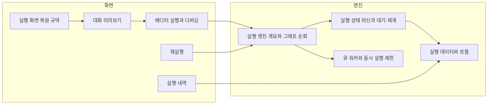

> 구현 상태: 구현됨 (문서별 예외는 각 문서 머리 줄) · 원문: 없음(영역 안내 문서) · 용어: [용어 사전](../CLE-GLOSSARY.md)

## 개요

이 영역은 워크플로우 실행을 다룬다. 두 층으로 나뉜다.

- **실행 화면**: 사용자가 실행을 시작하고 지켜보고 다시 돌리는 화면이다. 에디터 안 실행과 디버깅, 대화 미리보기, 실행 내역, 재실행, 노드 출력을 화면에 되살리는 규약이 여기에 든다.
- **실행 엔진**: 백엔드가 그래프를 순회하고 노드 핸들러를 부르며 상태를 저장·재개·복구하는 내부 계약이다. 엔진 구성, 상태 머신, 컨테이너 실행, 핸들러 계약, 실행 컨텍스트, 노드 취소, 큐 워커, 장애 복구, 실행 데이터가 여기에 든다.

화면 문서는 엔진 문서가 정한 상태와 데이터를 보여 주는 쪽이다. 실행 상태와 전이는 [실행 상태 머신과 대기·재개](CLE-EXEC-STATE.md), 실시간 이벤트 형식은 [WebSocket 이벤트와 명령](../CLE-API/CLE-API-WS-EVENTS.md) 한 곳에서 정하고 화면 문서는 링크로 가리킨다.

사용자는 에디터에서 실행을 시작하거나 실행 내역에서 재실행한다. 요청은 엔진으로 가서 큐 워커가 진행하고 상태와 결과는 실행 데이터에 쌓인다. 화면은 실시간 이벤트와 저장된 데이터로 결과를 보여 준다.

## 문서

### 실행 화면

| 문서 | 다루는 것 |
| --- | --- |
| [에디터 실행과 디버깅](CLE-EXEC-RUN.md) | 실행 방식(전체·선택 노드부터·단일 노드), 테스트 입력과 테스트 데이터셋, 캔버스 실행 표시, 실행 중지, 실행 결과 드로어와 결과 상세 탭, 에디터 안 실행 내역 패널 |
| [대화 미리보기](CLE-EXEC-PREVIEW.md) | 대화 스레드를 항목 출처별로 그리는 규칙, 실시간 이벤트의 store 변환, UI 불변량과 회귀 시나리오 |
| [실행 내역](CLE-EXEC-HISTORY.md) | 워크플로우별 실행 목록·실행 상세 화면 실행 출처 분류, 목록·상세 API |
| [재실행](CLE-EXEC-RERUN.md) | 끝난 실행으로 새 실행을 만드는 정책, dry-run, 재실행 체인, API 와 모달 |
| [실행 화면 복원 규약](CLE-EXEC-HYDRATION.md) | 노드 출력 필드가 라이브·대기·내역 화면에서 어떤 함수로 복원되는지의 매트릭스 |

### 실행 엔진

| 문서 | 다루는 것 |
| --- | --- |
| [실행 엔진 개요와 그래프 순회](CLE-EXEC-ENGINE.md) | 엔진 구성 요소와 그래프 순회 규칙 |
| [실행 상태 머신과 대기·재개](CLE-EXEC-STATE.md) | 실행·노드 실행 상태 전이, 블로킹 노드와 재개 계약 |
| [컨테이너 실행](CLE-EXEC-CONTAINER.md) | Loop·ForEach·Map·Parallel 본문 실행과 엔진 덮어쓰기 |
| [노드 핸들러 계약](CLE-EXEC-HANDLER.md) | 엔진이 노드 핸들러를 부르는 계약 |
| [실행 컨텍스트](CLE-EXEC-CONTEXT.md) | 실행 컨텍스트 필드 분류·저장과 새 필드 추가 규칙 |
| [노드 취소](CLE-EXEC-CANCEL.md) | `abortSignal` 전파, DB 관측 취소 가드, AbortError 분류 |
| [큐 워커와 동시 실행 제한](CLE-EXEC-WORKER.md) | 시작 큐, 워커 모델, 동시 실행 제한 |
| [장애 복구와 안전 종료](CLE-EXEC-RECOVERY.md) | rehydration, stalled 재배달, 부팅 복구 스캔, 안전 종료 |
| [실행 데이터와 흐름](CLE-EXEC-DATA.md) | 실행·노드 실행·노드 실행 순서 로그·테스트 데이터셋 엔티티와 실행 데이터 흐름 |

## 영역 밖

- 실시간 채널 연결·구독과 이벤트·명령 형식: [WebSocket 연결과 채널 구독](../CLE-API/CLE-API-WS.md), [WebSocket 이벤트와 명령](../CLE-API/CLE-API-WS-EVENTS.md)
- 노드 출력 다섯 필드와 노드 에러 처리: [노드 출력 규약](../CLE-NODE/CLE-NODE-OUTPUT.md), [노드 에러 처리 정책](../CLE-NODE/CLE-NODE-ERROR.md)
- 대화 스레드 자료구조와 누적 규칙: [대화 스레드](../CLE-IX/CLE-IX-THREAD.md)
- 외부에서 실행을 시작하고 입력을 보내는 표면: [트리거](../CLE-TRIG/CLE-TRIG.md), [External Interaction API](../CLE-IX/CLE-EIA.md)
