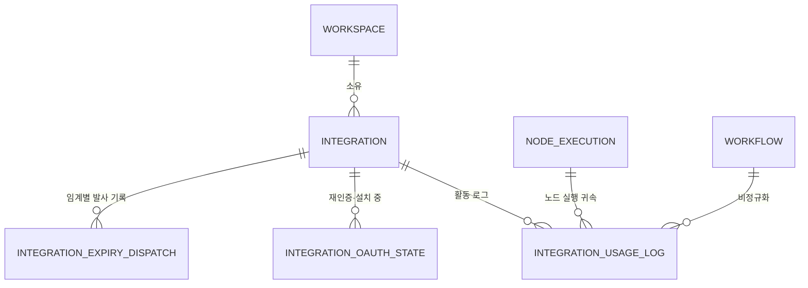
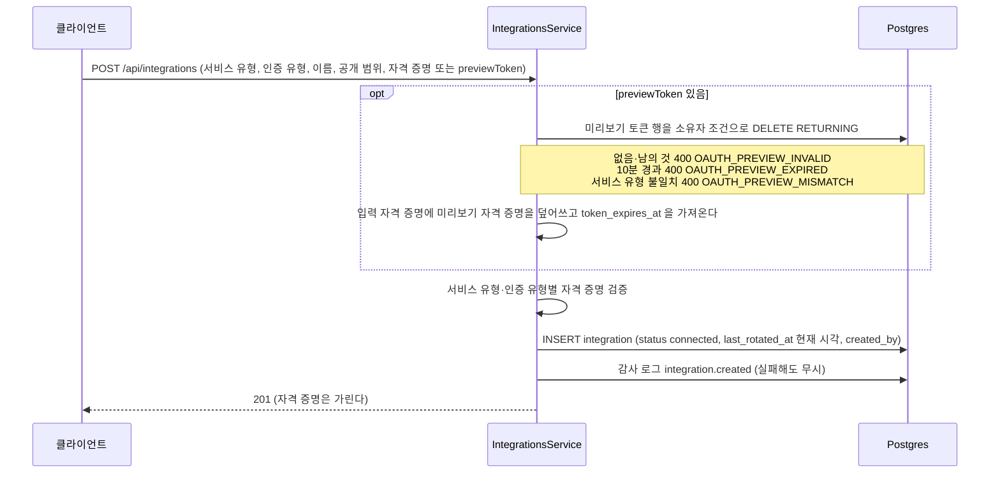
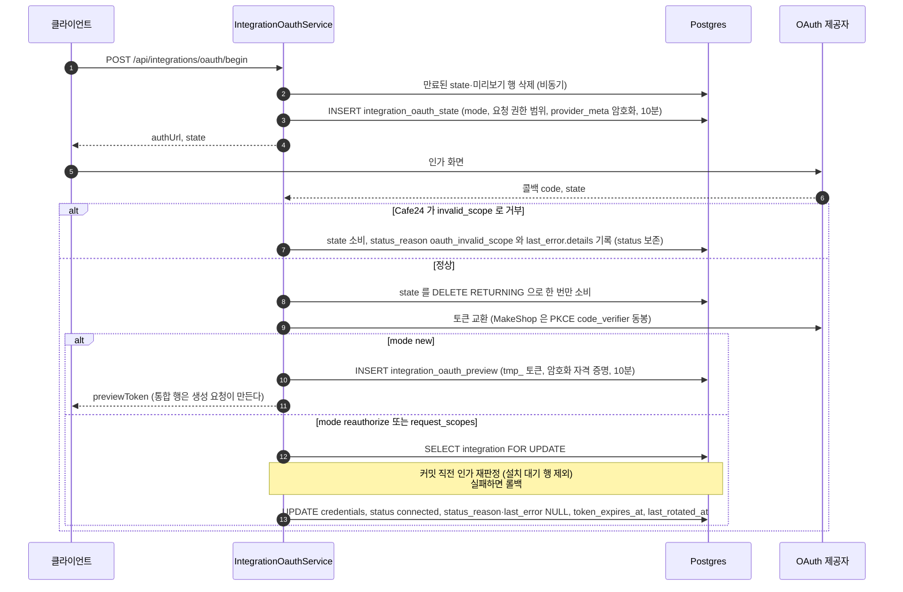
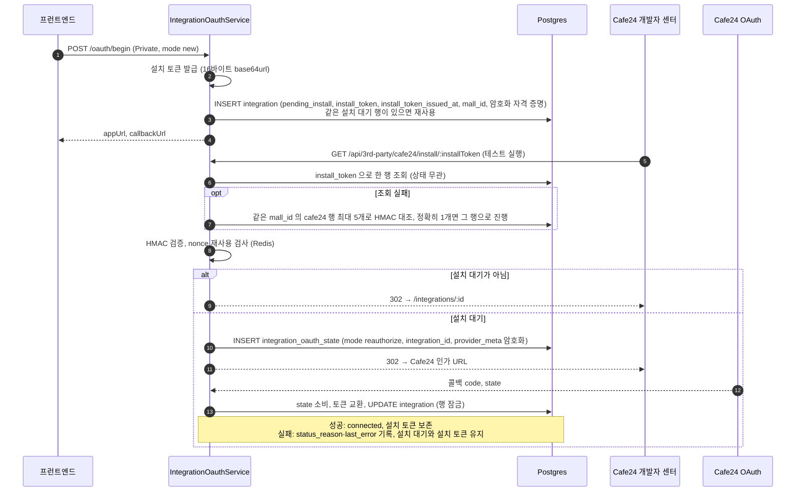
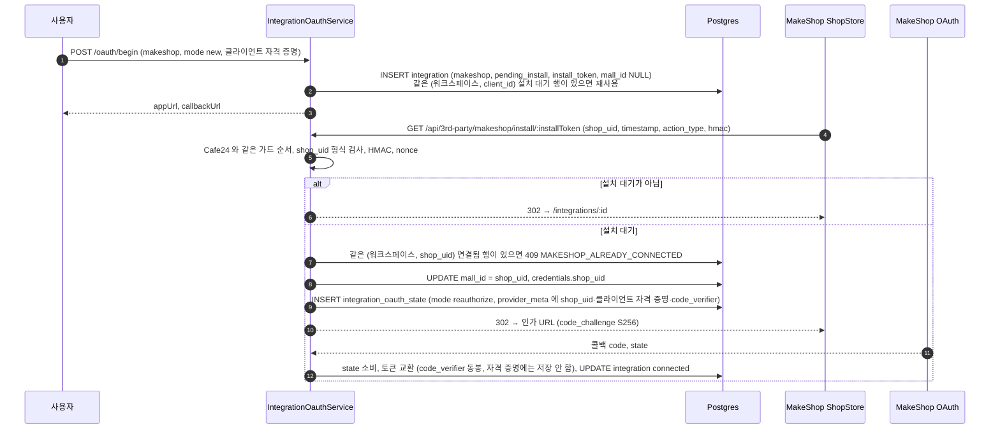
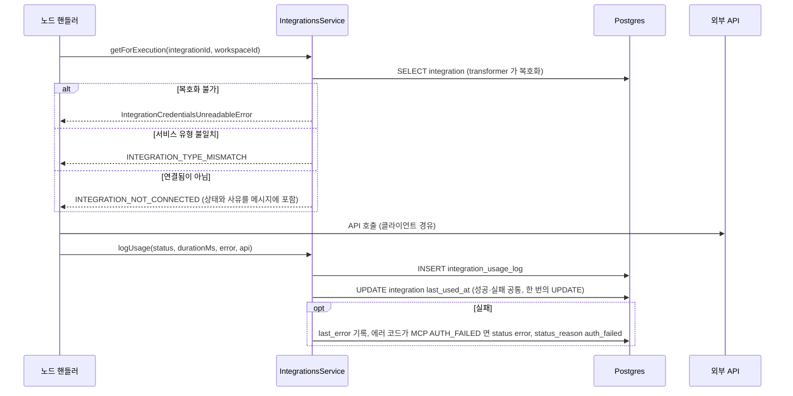

> 구현 상태: 구현됨 · 원문: `spec/data-flow/5-integration.md`, `spec/1-data-model.md` (§2.10, §2.10.1, §2.21.1, §3 통합 인덱스 행, Rationale «install_token 형식»), `spec/2-navigation/4-integration.md` (§13) · 용어: [용어 사전](../CLE-GLOSSARY.md)

## 개요

이 문서는 통합(Integration, `integration`) 도메인이 저장하는 엔티티와 그 데이터가 어디서 들어와 어디로 가는지를 정한다. 통합은 외부 SaaS(Google·GitHub·Cafe24·MakeShop 등)와 통신하는 데 필요한 자격 증명(credentials)과 연결 상태를 워크스페이스에 저장한다. 노드 실행 시점에 통합의 자격 증명을 꺼내 외부 API 를 부르고, 호출 결과는 활동 로그(activity log, `IntegrationUsageLog`)에 한 행씩 남긴다. OAuth 토큰은 만료 스캐너가 주기적으로 점검한다. 갱신할 수 있는 통합은 전용 갱신 큐로 토큰을 새로 받고, 그렇지 않은 통합은 만료됨으로 바꾼다.

다루는 엔티티는 통합, 활동 로그, 통합 연결 과정의 임시 테이블 세 개(통합 OAuth state, 미리보기 토큰, 만료 알림 발사 기록), 그리고 시크릿 저장소(`secret_store`) 테이블이다.

범위 밖:

- 통합 상태 전이 규칙과 상태 사유(`status_reason`) 허용값, 만료 스캐너 동작은 [통합 상태와 만료 알림](CLE-INT-STATUS.md) 이 정한다.
- OAuth 연결·설치 흐름의 API 계약, 에러 매핑, 토큰 자동 갱신 정책은 [OAuth 연결과 토큰 갱신](CLE-INT-OAUTH.md) 이 정한다.
- 통합 화면과 관리 API 는 [통합 관리](CLE-INT-MANAGE.md), 서비스별 자격 증명 필드는 [서비스별 인증 방식과 자격 증명](CLE-INT-AUTH.md) 이 정한다.
- 시크릿 참조 형식과 `SecretResolver` 호출 규약은 [시크릿 저장소](CLE-INT-SECRET.md) 가 정한다.
- 엔티티 관계 전체 지도는 [데이터 모델 개요](../CLE-PLAT/CLE-PLAT-DATA.md), 큐 카탈로그 전체는 [비동기 큐와 Redis 키 목록](../CLE-PLAT/CLE-PLAT-QUEUE.md) 이 정한다.

## 엔티티

활동 로그의 부모는 통합이다. 활동 로그에는 `workspace_id` 가 없고 통합을 거쳐 워크스페이스에 귀속한다. 미리보기 토큰(`integration_oauth_preview`)은 아직 통합 행이 없을 때 쓰는 테이블이라 통합과 FK 로 잇지 않는다.

### 통합 (`integration`)

| 필드 | 타입 | 설명 |
| --- | --- | --- |
| id | UUID | PK |
| workspace_id | UUID | FK → Workspace (CASCADE) |
| service_type | String | 서비스 유형(`service_type`). `google`, `github`, `http`, `database`, `email`, `webhook`, `mcp`, `cafe24`, `makeshop`. 서비스별 자격 증명 형식은 [서비스별 인증 방식과 자격 증명](CLE-INT-AUTH.md). `cafe24`·`makeshop` 통합은 워크플로우 노드와 AI 에이전트의 내부 MCP 브리지 양쪽에서 쓴다([MCP 클라이언트](CLE-INT-MCP.md)) |
| name | String | 사용자가 정한 별칭 |
| auth_type | Enum | 통합 인증 유형(`auth_type`). `oauth2` / `api_key` / `bearer_token` / `basic` / `connection_string` / `smtp` / `webhook_outbound` / `none`. `none` 은 인증 없는 공용 MCP 서버 등에 쓴다 |
| credentials | JSONB (encrypted) | 자격 증명. 암호화해 저장한다([암호화](#암호화)). OAuth 통합은 권한 범위(`scopes: string[]`)를 포함한다 |
| scope | Enum | 공개 범위(`Integration.scope`). `personal` / `organization` |
| status | Enum | 통합 상태. `connected` / `expired` / `error` / `pending_install`. 전이 규칙은 [통합 상태와 만료 알림](CLE-INT-STATUS.md) |
| install_token | String? | 설치 토큰. Cafe24 Private 앱과 MakeShop ShopStore 설치 우선 흐름에서 설치 대기 통합을 가리키는 식별 키다. 그 밖의 서비스 유형은 NULL 이다. 발급 시 16바이트를 base64url(패딩 없음, 22자)로 인코딩한다. 통합이 살아 있는 동안 보존한다(App URL 경로 식별 키). 연결 성공 콜백에서도 보존하고, 설치 대기 24시간 만료 또는 통합 삭제에서만 NULL 로 지운다. `varchar(64)`, V042 |
| install_token_issued_at | Timestamp? | 설치 토큰 발급 시각. 설치 대기 만료 판정의 기준이다. 재사용·재발급 때 갱신하고 연결 성공 콜백에서는 보존한다. 만료·삭제 경로에서만 NULL 로 지운다. V044 이전 행은 NULL 이며 스캐너가 `created_at` 으로 대신 판정한다. Cafe24 Private 과 MakeShop 모두 적용한다. V044 |
| mall_id | String? | 상점 식별자(`mall_id`)의 평문 투영. Cafe24 는 `credentials.mall_id`, MakeShop 은 `credentials.shop_uid` 를 이 컬럼에 복제한다. Cafe24·MakeShop 외 서비스 유형은 항상 NULL 이다. V045 이전 행은 NULL 이고 다음 저장(콜백·재인증)에서 채운다. V045 |
| status_reason | String? | 상태 사유. snake_case 코드이고 허용값은 코드 union `INTEGRATION_STATUS_REASONS` 한 곳에서 정한다. 상태별 허용값은 [통합 상태와 만료 알림](CLE-INT-STATUS.md). `VARCHAR(64)`, V008 |
| consecutive_network_failures | int | 연속 네트워크 실패 횟수. 노드 실행이나 토큰 갱신 중 transport 실패가 나면 늘고, 성공하면 0 으로 되돌린다. 3 에 닿으면 상태를 `error(network)` 로 바꾸고 0 으로 되돌린다. NOT NULL DEFAULT 0. V049 |
| token_expires_at | Timestamp? | OAuth 토큰 만료 시각 |
| last_used_at | Timestamp? | 마지막으로 노드 실행에서 쓴 시각(캐시) |
| last_rotated_at | Timestamp? | 자격 증명을 마지막으로 바꾼 시각(OAuth 통합 재인증, 자격 증명 교체, 토큰 자동 갱신) |
| last_error | JSONB? (encrypted) | 최근 호출 실패 요약 `{ code, message, at, details? }`. 암호화해 저장한다. `details` 는 사유별 추가 맥락을 담는 `Record<string, unknown>` 이다. 현재 정의된 키는 `oauth_invalid_scope` 의 `details.requiresCafe24Approval: string[]`(요청 권한 범위와 [Cafe24 별도 승인 scope](CLE-C24-SCOPES) §1 명단의 교집합) 하나다. 새 사유가 키를 쓰면 이 행에 정의를 더한다. 이 컬럼은 저장만 책임지고 응답 노출은 각 API 정의가 통제한다 |
| created_by | UUID | FK → User (NO ACTION). 통합 소유자(`created_by`) |
| created_at | Timestamp | 생성 시각 |
| updated_at | Timestamp | 수정 시각 |

제약:

- `UNIQUE(workspace_id, name)`: 워크스페이스 안에서 별칭은 하나뿐이다. 공개 범위와 상관없다.
- 상점 식별자 유일성: 한 워크스페이스 안에서 같은 `(service_type, mall_id)` 의 통합은 최대 1행이다. Cafe24 는 앱 유형과 상관없다. 한 상점에 Public 앱 통합과 Private 앱 통합을 함께 두면 토큰과 웹훅 처리 주체가 갈려 사용자 혼란과 회계 충돌이 생기므로 금지한다. 서로 다른 서비스 유형이 같은 `mall_id` 값을 쓰는 것은 괜찮다.

응답 전용 값: `IntegrationDto` 는 DB 컬럼이 아닌 두 값 `autoRefresh`·`appUrl` 을 응답 시점에 계산해 싣는다. 정의는 [통합 관리](CLE-INT-MANAGE.md) 의 API 절이 소유한다. 복호화에 실패한 행을 응답에서 `statusReason='credentials_unreadable'` 로 표시하는 규칙도 DB 저장값이 아니다([통합 상태와 만료 알림](CLE-INT-STATUS.md)).

### 활동 로그 (`integration_usage_log`)

| 필드 | 타입 | 설명 |
| --- | --- | --- |
| id | UUID | PK |
| integration_id | UUID | FK → Integration (CASCADE) |
| node_execution_id | UUID | FK → NodeExecution (CASCADE) |
| workflow_id | UUID | FK → Workflow (CASCADE). 조회 최적화용 비정규화 |
| status | Enum | `success` / `failed` |
| error | JSONB? | 실패 요약 `{ code, message }` |
| duration_ms | Integer | 호출 소요 시간 |
| at | Timestamp | 호출 시각 |
| api_label | varchar(128)? | 호출 API 라벨(`api_label`). 아래 채우기 규칙을 따른다 |
| api_method | varchar(8)? | HTTP 메서드, SQL 동사, `SEND` 처럼 통합마다 뜻이 다르다 |
| api_path | varchar(256)? | endpoint 경로, 드라이버 이름, SMTP host 처럼 통합마다 뜻이 다르다 |

- 보존 기간은 90일이다. 만료 스캐너의 `usage-log-prune` 작업이 매일 정리한다([통합 상태와 만료 알림](CLE-INT-STATUS.md)).
- `api_*` 세 컬럼은 길이 한도를 넘으면 끝에 `…` 를 붙여 잘라 저장한다(`clampMessage` 패턴).
- `node_execution_id` 가 없으면 행을 쓰지 않는다(아래 [노드 실행의 통합 사용](#노드-실행의-통합-사용)). 그래서 저장된 행에는 항상 노드 실행이 있다.

#### 호출 API 식별 채우기 규칙

활동 로그에 행을 쓰는 모든 실행 경로는 `logUsage` 를 부를 때 `api` 식별 정보를 함께 넘긴다. 채우는 값은 통합마다 다르다. 이 표가 채우기 규칙의 단일 기준이고, 각 노드 문서의 «활동 로그» 절은 자기 행을 가리킨다.

| 통합 | `api_label` | `api_method` | `api_path` |
| --- | --- | --- | --- |
| cafe24 ([Cafe24 노드](../CLE-NODE-INT/CLE-NODE-CAFE24.md)) | 카탈로그 키 `cafe24.<resource>.<operation>` ([Cafe24 operation 메타데이터](CLE-C24-META)) | operation 의 HTTP 메서드(`GET`/`POST`/…) | operation 의 경로 템플릿. 자리표시자를 그대로 둔다(`products/{product_no}`) |
| makeshop ([MakeShop 노드](../CLE-NODE-INT/CLE-NODE-MAKESHOP.md)) | 카탈로그 키 `makeshop.<resource>.<operation>` ([MakeShop operation 메타데이터](CLE-MKS-META)) | operation 의 HTTP 메서드(`GET`/`POST`) | operation 의 상대 경로(`product`, `cart/create`). MakeShop 경로에는 `{shopId}` 밖의 path 파라미터가 없어 자리표시자가 없다([MakeShop API 카탈로그](CLE-MKS-CATALOG)) |
| http-request ([HTTP Request 노드](../CLE-NODE-INT/CLE-NODE-HTTP.md)) | NULL | HTTP 메서드 | host + path. query string 은 뺀다. baseUrl 이 없으면 path 만 |
| database-query ([Database Query 노드](../CLE-NODE-INT/CLE-NODE-DBQUERY.md)) | NULL | SQL 동사(`SELECT`/`INSERT`/`UPDATE`/`DELETE`). `queryType='raw'` 이면 평가된 SQL 의 첫 토큰을 대문자로 뽑고, 뽑지 못하면 NULL 이다. 상세는 노드 문서 | 드라이버(`postgres` / `mysql`) |
| send-email ([Send Email 노드](../CLE-NODE-INT/CLE-NODE-EMAIL.md)) | NULL | `SEND` | SMTP host 또는 NULL |

적용 범위는 두 경로다.

1. 노드 핸들러 경로: cafe24·makeshop·http-request·database-query·send-email 노드는 `IntegrationHandlerBase.logUsage` 에 `api` 인자를 넘기고, 베이스 클래스가 `IntegrationsService.logUsage` 로 전달한다.
2. 내부 MCP 브리지 경로: AI 에이전트 노드에 붙은 통합을 MCP 도구로 노출하는 도구 프로바이더(`Cafe24McpToolProvider`, `MakeshopMcpToolProvider`)는 노드 베이스 클래스를 거치지 않고 `IntegrationsService.logUsage` 를 직접 부른다. 이 경로도 노드 핸들러와 같은 카탈로그 키 형식으로 `api.label` 을 채운다. 이때 `node_execution_id` 는 호출 시점의 AI 에이전트 노드 실행이다. 메타 도구 호출은 기록하지 않는다.

내부 MCP 브리지 경로는 노드 베이스 클래스를 거치지 않으므로 `api` 를 빠뜨려도 노드 핸들러 테스트는 통과한다. 새 노드 핸들러나 새 브리지 도구 프로바이더를 더할 때 `logUsage` 의 `api` 동반을 반드시 확인한다.

### 통합 OAuth state (`integration_oauth_state`)

통합 연결의 인가 요청과 콜백을 짝짓는 10분짜리 일회용 행이다(V009). 소셜 로그인의 `auth_oauth_state` 와 다른 테이블이다.

| 필드 | 타입 | 설명 |
| --- | --- | --- |
| id | UUID | PK |
| state | VARCHAR(64) | 인가 요청 식별값. `UNIQUE` |
| workspace_id | UUID | 요청한 워크스페이스. FK → Workspace (CASCADE) |
| user_id | UUID | 요청한 사용자. FK → User (CASCADE) |
| provider | VARCHAR(32) | OAuth 제공자 |
| service_type | VARCHAR(50) | 서비스 유형 |
| mode | VARCHAR(32) | `new` / `reauthorize` / `request_scopes` (`OAuthStateMode`). DB CHECK 가 세 값만 받는다 |
| integration_id | UUID? | 통합 재인증·추가 권한 요청·설치 흐름에서 채운다. `mode='new'` 면 NULL 이다. FK → Integration (CASCADE) |
| requested_scopes | TEXT[] | 요청한 권한 범위. 기본값은 빈 배열 |
| integration_name | VARCHAR(255)? | 통합 이름. 현재 구현은 `oauth/begin` 이 받은 이름을, 설치 흐름에서는 대상 통합의 이름을 담는다. 원문 흐름 정의에는 없는 컬럼이다 |
| scope | VARCHAR(20)? | 공개 범위(`personal` / `organization`). 담는 방식은 `integration_name` 과 같다 |
| provider_meta | JSONB? (encrypted) | V041. 콜백까지 들고 가야 하는 값을 담는다. Cafe24 는 `mall_id`·`client_id`·`client_secret`, MakeShop 은 `shop_uid`·클라이언트 자격 증명·PKCE `code_verifier` |
| expires_at | Timestamp | 발급 시각 + 10분 |
| created_at | Timestamp | 생성 시각 |

콜백은 `DELETE … RETURNING` 으로 한 번만 소비한다. 콜백이 동시에 두 번 와도 한쪽만 이긴다.

### 미리보기 토큰 (`integration_oauth_preview`)

새 OAuth 연결(`mode='new'`)이 통합 행을 만들기 전까지 토큰을 맡겨 두는 10분짜리 테이블이다(V009).

| 필드 | 타입 | 설명 |
| --- | --- | --- |
| preview_token | VARCHAR(64) | PK. `'tmp_'` + hex 32자 |
| workspace_id | UUID | 발급받은 워크스페이스. FK → Workspace (CASCADE) |
| user_id | UUID | 발급받은 사용자. FK → User (CASCADE) |
| service_type | VARCHAR(50) | 서비스 유형 |
| credentials | JSONB (encrypted) | 콜백이 받은 토큰 |
| token_expires_at | Timestamp? | 토큰 만료 시각 |
| expires_at | Timestamp | 발급 시각 + 10분 |
| created_at | Timestamp | 생성 시각 |

`POST /api/integrations` 가 소유자 조건을 WHERE 에 넣은 `DELETE … RETURNING` 으로 한 번만 소비한다. 만료된 행은 다음 `oauth/begin` 이 비동기로 지운다.

### 만료 알림 발사 기록 (`integration_expiry_dispatch`)

만료 스캐너가 임계마다 알림을 한 번만 보내도록 선점(claim)하는 테이블이다(V009).

| 필드 | 타입 | 설명 |
| --- | --- | --- |
| id | UUID | PK |
| integration_id | UUID | FK → Integration (CASCADE) |
| threshold | VARCHAR(16) | `'7d'` / `'3d'` / `'0d'`. DB CHECK 가 세 값만 받는다 |
| token_expires_at | Timestamp | 발사 기준이 된 만료 시각 |
| dispatched_at | Timestamp | 발사 시각. 기본값은 INSERT 시각 |

`UNIQUE (integration_id, threshold, token_expires_at)` 로 같은 만료 시각에 대해 임계마다 한 번만 발사한다. 통합 재인증으로 `token_expires_at` 이 바뀌면 새 키가 되어 다시 발사할 수 있다. 선점은 `INSERT … ON CONFLICT DO NOTHING` 이고, 충돌하면 그 임계를 건너뛴다.

### 일시 테이블의 FK 와 삭제 동작

세 테이블의 FK 는 모두 `ON DELETE CASCADE` 다. 부모 행이 지워지면 함께 지워진다.

| 테이블 | FK | 부모 |
| --- | --- | --- |
| `integration_oauth_state` | `workspace_id` | Workspace |
| `integration_oauth_state` | `user_id` | User |
| `integration_oauth_state` | `integration_id` (nullable) | Integration |
| `integration_oauth_preview` | `workspace_id` | Workspace |
| `integration_oauth_preview` | `user_id` | User |
| `integration_expiry_dispatch` | `integration_id` | Integration |

- 두 OAuth 일시 테이블에서 사용자를 가리키지 않는 FK 셋(`integration_oauth_state` 의 `workspace_id`·`integration_id`, `integration_oauth_preview` 의 `workspace_id`)에는 FK 인덱스를 두지 않는다. 10분 만료 일시 행이라 삭제 연쇄 비용이 호출당 0.1 ms 미만이다. 처분 근거는 [데이터 모델 개요](../CLE-PLAT/CLE-PLAT-DATA.md) 의 Rationale «쓸 인덱스가 없는 FK 서른하나의 처분» 이다.
- 사용자 FK 는 앱에 사용자 삭제 경로가 없어 실제로 연쇄가 일어나지 않는다([데이터 모델 개요](../CLE-PLAT/CLE-PLAT-DATA.md) 의 FK 삭제 동작).

### 시크릿 저장소 (`secret_store`)

워크스페이스 단위 비밀을 암호화해 보관하는 테이블이다. 참조 형식, 암호화 형식, 호출 규약은 [시크릿 저장소](CLE-INT-SECRET.md) 가 단일 기준이다.

| 필드 | 타입 | 설명 |
| --- | --- | --- |
| ref | TEXT | PK. 시크릿 참조 `secret://<scope>/<resourceId>/<name>` (예: `secret://triggers/{triggerId}/bot-token`). 형식은 DB CHECK 로도 막는다(V063) |
| workspace_id | UUID | 귀속 워크스페이스. 처음 저장한 값에서 바뀌지 않는다. `rotate` 는 다른 워크스페이스로 부르면 거부한다([시크릿 저장소](CLE-INT-SECRET.md) 규칙 25). FK 가 없다(애플리케이션 수준 정리). 애플리케이션에는 이 컬럼을 조건으로 지우는 경로가 없다. 트리거 단위 prefix 삭제(`deleteByPrefix`)로 정리한다. 다른 워크스페이스의 요청이 덮어쓴 행(교차 행)과 그 점검 · 정리를 걷은 경위는 [시크릿 저장소 「교차 행 점검과 정리」](CLE-INT-SECRET.md#교차-행-점검과-정리) 에 있다. 어느 경로가 언제 지우는지는 [트리거 관리](../CLE-TRIG/CLE-TRIG-MANAGE.md) |
| encrypted | BYTEA | `[IV(12B) ‖ AES-256-GCM ciphertext ‖ authTag(16B)]`. AAD 는 `ref`. DB 는 암호문만 본다 |
| created_at | Timestamp | 생성 시각 |
| updated_at | Timestamp | 마지막 교체 시각 |

현재 쓰는 참조:

- `secret://triggers/{id}/bot-token`: 채팅 채널 봇 토큰(provider 공통). [채팅 채널](../CLE-CHAT/CLE-CHAT-CORE.md)
- `secret://triggers/{id}/bot-token.v2`: 봇 토큰 24시간 유예용
- `secret://triggers/{id}/inbound-signing`: 채팅 채널 inbound 웹훅 출처 검증 자료(provider 공통 슬롯). [채팅 채널 어댑터 규약](../CLE-CHAT/CLE-CHAT-ADAPTER.md)
- `secret://triggers/{id}/notification-signing`: EIA 알림 웹훅 HMAC 서명 시크릿. [EIA 데이터와 흐름](../CLE-IX/CLE-EIA-DATA.md)

`secret://triggers/{id}/notification-signing.v2` 는 예약만 된 참조다. 현재 구현은 이 참조를 쓰지 않고, 유예 기간의 새 서명 시크릿을 `Trigger.notification_secret_v2` 컬럼에 둔다([시크릿 저장소](CLE-INT-SECRET.md)).

## 인덱스

| 테이블 | 인덱스 | 용도 |
| --- | --- | --- |
| integration | `(workspace_id, name)` UNIQUE | 별칭 유일성 (V001/V008) |
| integration | `(workspace_id, service_type)` | 서비스별 통합 조회 |
| integration | `(workspace_id, status)` | 만료·오류 배지 카운트, 설치 대기 만료 스캔, 중복 조회 겸용 |
| integration | `(token_expires_at)` | 만료 스캐너 배치 조회 (V009) |
| integration | `(install_token) WHERE install_token IS NOT NULL` UNIQUE | App URL 로 설치 대기 통합 한 행을 찾는다. Cafe24 Private 과 MakeShop 공용. 유일성은 워크스페이스를 가리지 않는 전역이다 (V043) |
| integration | `idx_integration_workspace_service_mall` `(workspace_id, service_type, mall_id) WHERE mall_id IS NOT NULL` UNIQUE | 상점 식별자 중복 방지. 서비스 유형을 키에 넣어 새 통합 서비스를 더할 때 인덱스와 마이그레이션이 필요 없다. 옛 서비스별 UNIQUE(V046 cafe24, V071 makeshop)를 대체한다. CONCURRENTLY 라 V045 컬럼 추가와 다른 마이그레이션이다 (V072) |
| integration | `idx_integration_service_mall` `(service_type, mall_id) WHERE mall_id IS NOT NULL` | 복호화 없이 상점 식별자로 찾는다(Cafe24 설치 토큰 불일치 회복 등). 옛 cafe24 전용 `idx_integration_cafe24_mall_id_partial`(V051)을 대체한다 (V072) |
| integration_usage_log | `(integration_id, at DESC)` | 통합별 최근 활동 로그 (V008) |
| integration_usage_log | `(at)` | 보존 기간 정리 배치 |
| integration_usage_log | `(node_execution_id)` | 노드 실행 삭제의 FK CASCADE. CONCURRENTLY (V113) |
| integration_usage_log | `(workflow_id)` | 워크플로우 삭제의 FK CASCADE. CONCURRENTLY (V114) |
| integration_oauth_state | `(expires_at)` | 만료 행 정리 (V009) |
| integration_oauth_preview | `(expires_at)` | 만료 행 정리 (V009) |

`api_*` 컬럼에는 아직 인덱스가 없다. 메서드·경로별 필터(예: «5xx 응답만»)가 필요해질 때 더한다.

## 암호화

- `integration.credentials` 는 TypeORM 컬럼 transformer(`credentials-transformer.ts`)가 ORM 경계에서 AES-256-GCM 으로 암호화·복호화한다. 응답을 만들 때는 컨트롤러·DTO 단계에서 `credentials` 를 가린다.
- 같은 transformer 를 `integration.last_error`, `integration_oauth_state.provider_meta`, `integration_oauth_preview.credentials` 에도 쓴다. 콜백 전 임시 보관 단계에서도 토큰과 `client_secret` 이 평문으로 닿는 곳이 없다.
- 복호화에 실패하면(키 교체 등) 행을 지우지 않는다. 응답에서는 그 행을 `credentialsStatus='needs_reauth'` 로 드러내고, 노드 실행은 `IntegrationCredentialsUnreadableError` 로 멈춘다([노드 실행의 통합 사용](#노드-실행의-통합-사용)).
- 암호화 키 이름과 키가 없을 때의 동작은 정의가 갈린다. [미결 사항](#미결-사항) 참조.
- 평문으로 두는 값: `install_token` 은 App URL 경로에 공개로 들어가는 식별자라 암호화 대상이 아니다. `status_reason` 은 분류 코드만 담아 평문이다. `mall_id` 는 조회용 평문 투영이다.

## 데이터 흐름

### 통합 생성

`POST /api/integrations` 는 두 입력을 받는다. 하나는 API Key 류처럼 사용자가 직접 넣은 자격 증명이고, 다른 하나는 새 OAuth 연결이 발급한 미리보기 토큰(`previewToken`)이다. 새 OAuth 연결의 통합 행은 콜백이 아니라 이 요청에서 생긴다.

`last_rotated_at` 을 생성 시각으로 채우는 이유는 NULL 로 두면 Cafe24 백그라운드 갱신의 기준 시각 비교에서 계속 빠질 수 있어서다. 스캐너 조건에 `IS NULL` 분기도 따로 둔다.

### OAuth 연결과 설치

`integration_oauth_state.mode` 는 `new` / `reauthorize` / `request_scopes` 세 가지다. 진입점과 API 계약은 [OAuth 연결과 토큰 갱신](CLE-INT-OAUTH.md) 이 정한다. 여기서는 테이블에 무엇을 쓰는지만 적는다.

- 통합 재인증과 설치 대기 행은 자격 증명을 통째로 바꾸고, 추가 권한 요청은 기존 자격 증명에 합치고 권한 범위를 갱신한다. 설치 토큰은 보존한다.
- 콜백이 실패하면(토큰 교환 실패 등) state 를 소비한 뒤 식별된 행에 `markIntegrationCallbackError` 가 `status_reason`(`normalizeStatusReason` 으로 union 정규화)과 `last_error={code,message,at}` 을 기록한다. 상태를 바꾸는지는 실패 종류와 행의 현재 상태에 따라 다르다. 연결됨 행의 통합 재인증 토큰 교환 실패는 `error(auth_failed)` 로 바뀌고, 설치 대기 행과 state 단계 실패는 상태를 보존한다. 표는 [OAuth 연결과 토큰 갱신](CLE-INT-OAUTH.md) 의 에러 매핑이 소유한다.
- 커밋 직전 인가 재판정이 실패하면 트랜잭션을 롤백하고, 같은 수집 경로가 `last_error` 에 `RESOURCE_NOT_FOUND` 또는 `ADMIN_REQUIRED` 를 기록한다. 상태는 보존한다.
- 자격 증명 교체(`POST /api/integrations/:id/rotate`)는 OAuth 흐름이 아니다. 연결 테스트를 통과하면 자격 증명을 합치고 `last_rotated_at` 을 갱신하며 연결됨으로 되돌린다.
- 자격 증명 교체와 통합 삭제 직후 `IntegrationsService` 는 `IntegrationCacheBus.publish(integrationId)` 로 Redis pub/sub 채널 `integration:cache:invalidate` 에 알린다. 모든 인스턴스의 로컬 자격 증명 캐시(예: Database Query 연결 풀)가 바로 비워져 교체 전 자격 증명으로 남은 연결을 끊는다. pub/sub 을 받지 못해도 핸들러의 자격 증명 해시 비교가 캐시를 비운다. 상세는 [Database Query 노드](../CLE-NODE-INT/CLE-NODE-DBQUERY.md).

#### Cafe24 Private 앱 설치

가드 순서와 에러 코드, rate limit 은 [OAuth 연결과 토큰 갱신](CLE-INT-OAUTH.md) 의 설치 엔드포인트 절이 소유한다.

#### MakeShop 설치

MakeShop 은 Cafe24 Private 과 같은 설치 대기와 설치 토큰 모델을 쓴다. 다른 점은 이렇다. 클라이언트가 한 종류뿐이다. `shop_uid` 를 설치 redirect 때에야 알게 되므로 `oauth/begin` 에서 `mall_id` 투영과 중복 검사를 할 수 없다. 인가는 OAuth 2.1 로 PKCE S256 과 공백 구분 권한 범위를 쓴다.

MakeShop 에는 설치 토큰 불일치 회복이 없다. 조회에 실패하면 바로 404 다.

### 노드 실행의 통합 사용

통합 노드 핸들러의 공통 베이스는 `IntegrationHandlerBase` 다. 핸들러 계약과 에러 코드는 [통합 노드 공통](../CLE-NODE-INT/CLE-NODE-INT-COMMON.md) 이 정한다.

- 토큰 만료가 가깝거나 지난 것은 조회 실패 조건이 아니다. Cafe24·MakeShop 클라이언트가 호출 직전에 토큰을 갱신하고, 401 을 받으면 갱신 뒤 다시 시도한다([OAuth 연결과 토큰 갱신](CLE-INT-OAUTH.md)).
- `logUsage` 는 예외를 던지지 않는다. 기록 실패가 노드 실행을 깨지 않도록 삼킨다. `nodeExecutionId` 가 없으면 행을 쓰지 않는다.
- Cafe24·MakeShop 의 인증 실패와 네트워크 실패로 인한 오류 전이는 `logUsage` 가 아니라 각 클라이언트의 `markAuthFailed`·`recordNetworkFailure` 가 한다. 노드 실행 실패가 통합 상태를 어디까지 바꾸는지는 [통합 상태와 만료 알림](CLE-INT-STATUS.md) 의 미결 사항이다.

### 만료 스캐너

만료 스캐너는 `integration-expiry-scanner` 큐 위의 네 작업으로 통합 상태와 알림, 활동 로그 보존, Cafe24 백그라운드 갱신을 처리한다. 대상 조건과 동작은 [통합 상태와 만료 알림](CLE-INT-STATUS.md) 이 소유한다. 쓰는 테이블은 `integration`(상태·사유·설치 토큰 UPDATE), `integration_expiry_dispatch`(임계 선점 INSERT), `integration_usage_log`(90일 경과 DELETE), `notification`(인앱 알림 INSERT)이다.

### Redis 와 외부 대상

| 대상 | 쓰임 | 소유 문서 |
| --- | --- | --- |
| `integration-expiry-scanner` 큐 | 만료 스캐너 네 작업 | [통합 상태와 만료 알림](CLE-INT-STATUS.md) |
| `cafe24-token-refresh`·`makeshop-token-refresh` 큐 | 토큰 자동 갱신 | [OAuth 연결과 토큰 갱신](CLE-INT-OAUTH.md) |
| 설치 nonce 캐시·설치 실패 카운터 | Cafe24·MakeShop 설치 재사용 방어와 IP 잠금. Redis 가 없으면 조용히 건너뛴다 | [OAuth 연결과 토큰 갱신](CLE-INT-OAUTH.md) |
| `integration:cache:invalidate` pub/sub | 자격 증명 캐시 무효화 | 이 문서 |
| OAuth 제공자 | 인가·토큰 교환·갱신. Google·GitHub 는 고정 host, Cafe24 는 `{mall_id}.cafe24api.com`, MakeShop 은 `auth.makeshop.com`(데이터 호출 host 와 분리) | [OAuth 연결과 토큰 갱신](CLE-INT-OAUTH.md) |
| 서비스 API | 노드 실행 본체 호출(Google API, GitHub API, HTTP, Cafe24 Admin API, MakeShop API 등) | 각 노드 문서 |

## 미결 사항

- **통합 암호화 키 이름과 키 미설정 시 동작**: 시크릿 저장소 규약의 저장소 예외 설명과 인증 설정(AuthConfig) 데이터 정의는 통합 자격 증명이 `ENCRYPTION_KEY` 를 쓴다고 적는다. 같은 규약의 마스터키 절은 `INTEGRATION_ENCRYPTION_KEY` 를 같은 패턴의 다른 키로 적는다(관련: [시크릿 저장소](CLE-INT-SECRET.md), [트리거 데이터와 흐름](../CLE-TRIG/CLE-TRIG-DATA.md)). 현재 구현(`credentials-transformer.ts`)은 `INTEGRATION_ENCRYPTION_KEY` 를 읽고 SHA-256 으로 32바이트 키를 만든다. 키가 없으면 경고를 한 번 남기고 자격 증명을 암호화하지 않은 채 저장한다. 이 평문 저장 동작은 어느 스펙에도 없다. 운영자가 설정할 환경 변수 이름, 두 키를 합칠지, 키가 없을 때 평문 저장을 허용할지를 정해야 한다.

## 구현 위치

- `codebase/backend/src/modules/integrations/integrations.service.ts` (생성·미리보기 토큰 소비·활동 로그)
- `codebase/backend/src/modules/integrations/integration-oauth.service.ts` (OAuth begin·콜백·설치)
- `codebase/backend/src/modules/integrations/third-party-oauth.controller.ts` (`/api/3rd-party/**` 설치·콜백 엔드포인트)
- `codebase/backend/src/modules/integrations/integration-expiry-scanner.service.ts` (만료 스캐너)
- `codebase/backend/src/modules/integrations/integration-action-required-notifier.service.ts` (조치 필요 알림)
- `codebase/backend/src/modules/integrations/services/credentials-transformer.ts` (자격 증명 컬럼 암호화)
- `codebase/backend/src/modules/integrations/entities/` (엔티티)
- `codebase/backend/src/nodes/integration/cafe24/`, `codebase/backend/src/nodes/integration/makeshop/` (클라이언트의 토큰 갱신·상태 전이, 갱신 큐 워커)
- `codebase/backend/src/modules/secret-store/**` (시크릿 저장소)

## Rationale

### 자격 증명을 컬럼 단위로 암호화한다

평문으로 저장하면 DB 덤프나 복제본이 새어 나갈 때 외부 시스템 자격 증명이 통째로 노출된다. TypeORM 컬럼 transformer 를 쓰면 ORM 경계에서 암호화와 복호화가 자동으로 일어난다. 같은 transformer 를 OAuth state 의 `provider_meta` 와 미리보기 토큰의 자격 증명에도 적용해 콜백 전 임시 보관 단계도 막는다.

### `last_error` 도 암호화한다

OAuth 응답 본문에 토큰 일부가 섞일 수 있다. 그래서 `last_error` 도 같은 transformer 로 암호화한다(`entities/integration.entity.ts`). 반면 `status_reason` 은 분류 코드만 담으므로 평문으로 둔다. 두 컬럼이 같은 코드를 중복해 담는 이유는 [통합 상태와 만료 알림](CLE-INT-STATUS.md) 의 Rationale 에 있다.

### 호출 API 식별을 세 컬럼으로 나눈다

활동 탭이 시간·상태·소요 시간·에러만 보여 주면 Cafe24 처럼 한 통합이 수십 endpoint 를 다루는 서비스에서 실패 행의 원인 API 를 알 수 없다. 그래서 `api_label`·`api_method`·`api_path` 세 컬럼을 둔다. 채우는 값이 통합마다 비대칭이라 한 컬럼으로는 같게 표현할 수 없었다. Cafe24·MakeShop 은 카탈로그 라벨이 있고 나머지는 endpoint 만 있다. 한 `api` 컬럼으로 합치면 Cafe24·MakeShop 의 라벨과 endpoint 두 줄 표시가 깨지고, 나중에 메서드·경로별 인덱스와 필터를 더할 여지도 사라진다. 비정규화 비용은 행당 최대 392바이트(128+8+256)로, 행 평균 200~500바이트인 에러 메시지·코드에 비하면 작다.

- **http-request 는 query string 을 뺀다.** 같은 endpoint 호출을 묶어 보려면 query 차이를 무시해야 한다. query 에는 `api_key`·`token` 같은 자격 증명이 섞이기 쉬운데 활동 로그는 평문으로 저장한다.
- **database-query 는 드라이버 이름만 남긴다.** SQL 본문은 길이가 가변이라 `varchar(256)` 을 자주 넘고, 파라미터를 인라인하면 개인정보가 그대로 드러나며, 파싱과 정규화 비용도 생긴다. 드라이버 이름만으로도 «어느 DB 였는지» 라는 진단 신호는 충분하다.
- **send-email 은 수신자를 저장하지 않는다.** 수신자 이메일은 개인정보다. SMTP host 만 남겨 «어느 메일 서버였는지» 만 보인다. 가린 수신자 정보는 노드 출력의 `output.error.details.to` 가 따로 준다.

카탈로그 라벨을 사람이 읽는 문구로 바꾸는 책임을 프런트엔드에 두는 이유는 [통합 관리](CLE-INT-MANAGE.md) 의 Rationale 에 있다.

### 활동 로그는 90일만 보존한다

상세 화면의 활동 탭은 최근 30~90일 데이터만 의미가 있다. 그보다 오래 쌓으면 행 수가 급격히 늘어 검색 성능이 떨어진다. 그래서 매일 배치로 정리한다.

### 새 OAuth 연결은 콜백에서 통합 행을 만들지 않는다

`mode='new'` 콜백 시점에는 통합의 최종 이름과 공개 범위가 정해지지 않았다. 사용자는 팝업이 닫힌 뒤 폼에서 마저 입력한다. 콜백에서 바로 행을 만들면 미완성 행이 목록에 보이고, 사용자가 폼을 떠나면 주인 없는 행이 남는다. 대신 토큰을 미리보기 토큰 테이블(10분, 암호화)에 맡기고 참조 토큰만 프런트엔드로 보낸다. `POST /api/integrations` 가 이 토큰을 한 번만 원자적으로 소비해 최종 행을 만든다. 폼을 떠나면 남는 것은 만료된 행뿐이고 다음 `oauth/begin` 이 지운다. 한때 «OAuth 콜백이 바로 통합을 INSERT/UPDATE 한다» 는 서술이 있었으나 이 설계로 대체됐다. 콜백의 직접 UPDATE 는 통합 재인증·추가 권한 요청·설치 후속 콜백에만 남는다.

### 설치 토큰은 16바이트 base64url 이다

32바이트 hex(64자)로는 Cafe24 개발자 센터의 App URL 입력 칸 100자 한도를 경로 prefix 단축만으로 맞출 수 없었다. 16바이트(128비트)는 capability 토큰으로 NIST·OWASP 권장치(96비트 이상)를 넉넉히 넘는다. 컬럼 `install_token` 은 `varchar(64)` 라 22자 토큰이 그대로 들어가므로 스키마를 바꾸지 않았다. 경로 단축 결정은 [OAuth 연결과 토큰 갱신](CLE-INT-OAUTH.md) 의 Rationale 에 있다.

### 상점 식별자를 평문 컬럼으로 복제하고 인덱스를 하나로 합쳤다

`mall_id` 가 암호화 JSONB 안에만 있으면 SQL 로 거를 수 없어 중복 검사가 복호화 후 메모리 비교가 되고, 조회와 INSERT 사이의 경쟁도 막을 수 없다. 평문 컬럼(V045)과 부분 UNIQUE 인덱스를 두면 DB 가 중복을 거부한다. 처음에는 서비스별 인덱스(V046 cafe24, V071 makeshop)였으나 서비스 유형을 키에 넣은 인덱스 하나(V072)로 합쳤다. 새 서비스를 더할 때 인덱스와 마이그레이션이 필요 없다. 옛 행의 NULL 은 부분 인덱스 비교에서 빠지므로 새 행과 충돌하지 않고, 다음 저장 때 채워진다.
