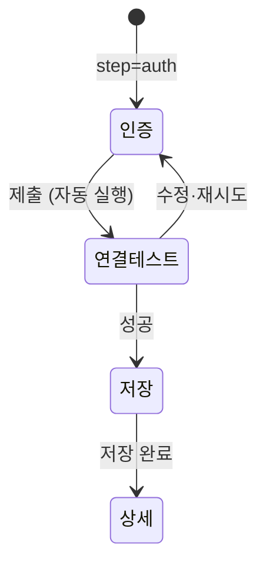

> 구현 상태: 부분 구현 · 원문: `spec/2-navigation/4-integration.md` (§1~§4, §7, §8, §9, §12, §14, 관련 Rationale), `spec/4-nodes/4-integration/_product-overview.md` (§1, §2 의 INT-MG·INT-AU·INT-US·INT-WH·INT-SV·INT-OG), `spec/2-navigation/_product-overview.md` (§3.4 NAV-IN) · 용어: [용어 사전](../CLE-GLOSSARY.md)

## 개요

통합(Integration, `integration`)은 외부 서비스 자격 증명(credentials)과 연결 상태를 워크스페이스에 저장한 것이다. 통합 노드와 AI 에이전트가 통합을 참조해 외부 서비스를 부른다. 이 문서는 사용자가 통합을 만들고 보고, 바꾸고 지우는 기능을 정한다. 목록·추가·상세 화면, 사용처(usages) 추적과 삭제 차단, 권한, 연결 테스트(test connection), 관리 API 와 에러 코드, 노드 실행·에디터·감사 로그와의 연동이 여기에 있다.

하나의 서비스에 계정이나 인스턴스별로 통합을 여러 개 둘 수 있고 별칭으로 구분한다. 공개 범위(`Integration.scope`)가 개인(`personal`)이면 통합 소유자(`created_by`)만, 조직(`organization`)이면 워크스페이스 멤버 전원이 쓴다.

범위 밖:

- 서비스별 자격 증명 필드와 연결 테스트가 서비스마다 무엇을 확인하는지는 [서비스별 인증 방식과 자격 증명](CLE-INT-AUTH.md) 이 정한다.
- OAuth 연결·설치 흐름, 권한 탭, 통합 재인증(reauthorize)과 추가 권한 요청(request scopes), 토큰 자동 갱신은 [OAuth 연결과 토큰 갱신](CLE-INT-OAUTH.md) 이 정한다.
- 상태 전이, 상태 표시, 주의 필요 판정, 만료 스캐너와 알림은 [통합 상태와 만료 알림](CLE-INT-STATUS.md) 이 정한다.
- 엔티티 컬럼, 활동 로그(activity log) 채우기 규칙, 암호화는 [통합 데이터와 흐름](CLE-INT-DATA.md) 이 정한다.
- 통합 노드의 핸들러 계약과 노드 에러 코드는 [통합 노드 공통](../CLE-NODE-INT/CLE-NODE-INT-COMMON.md), MCP 서버 통합의 도구 노출은 [MCP 클라이언트](CLE-INT-MCP.md) 가 정한다.
- 같은 제품 요구사항 문서의 지식 저장소와 마켓플레이스 요구사항은 [지식 저장소 관리](../CLE-KB/CLE-KB-MANAGE.md) 와 [마켓플레이스 (구상)](../CLE-UI/CLE-UI-MARKET.md) 에 있다.

## 요구사항

- REQ-INTMGMT-001 WHEN 사용자가 통합 메뉴를 열면 THE SYSTEM SHALL 워크스페이스의 외부 서비스 통합을 한 목록에서 관리하게 한다. (원본: INT-MG-01, NAV-IN-01)
- REQ-INTMGMT-002 WHEN 사용자가 통합을 추가하면 THE SYSTEM SHALL 목록 모달에서 서비스 유형을 고르게 한 뒤 `/integrations/new?service=<type>&step=auth` 페이지에서 자격 증명을 입력받는다. (원본: INT-MG-02, INT-MG-08, NAV-IN-02)
- REQ-INTMGMT-003 WHEN 사용자가 같은 서비스 유형의 통합을 여러 개 만들면 THE SYSTEM SHALL 계정이나 인스턴스마다 별도 통합으로 저장한다. (원본: INT-MG-03)
- REQ-INTMGMT-004 WHEN 사용자가 통합을 만들면 THE SYSTEM SHALL 워크스페이스 안에서 유일한 별칭을 받는다. (원본: INT-MG-04)
- REQ-INTMGMT-005 IF 같은 워크스페이스에 같은 별칭의 통합이 이미 있으면 THE SYSTEM SHALL 생성과 별칭 수정을 409 `INTEGRATION_NAME_TAKEN` 으로 거절한다.
- REQ-INTMGMT-006 WHEN 사용자가 통합을 열면 THE SYSTEM SHALL 개요·보안·권한·사용·활동·위험 영역 탭이 있는 상세 페이지를 보인다. (원본: INT-MG-05)
- REQ-INTMGMT-007 WHEN 사용자가 OAuth 가 아닌 통합의 자격 증명 교체를 제출하면 THE SYSTEM SHALL 새 값으로 연결 테스트를 하고 성공할 때만 저장한다. (원본: INT-MG-06)
- REQ-INTMGMT-008 IF 자격 증명 교체의 연결 테스트가 실패하면 THE SYSTEM SHALL 기존 자격 증명을 그대로 둔다. (원본: INT-MG-06)
- REQ-INTMGMT-009 WHEN 자격 증명이 바뀌면 THE SYSTEM SHALL 보안 탭에 마지막 교체 시각을 상대 시간과 절대 시간으로 보인다. (원본: INT-MG-06)
- REQ-INTMGMT-010 WHEN 관리자 이상이 공개 범위 전환을 확인하면 THE SYSTEM SHALL 개인과 조직 사이를 바꾸고 기존 자격 증명을 승계하며 감사 로그를 남긴다. (원본: INT-MG-07)
- REQ-INTMGMT-011 WHEN 사용자가 통합을 만들면 THE SYSTEM SHALL 서비스에 맞게 OAuth 2.0·API Key·Bearer Token·Basic·Connection String·SMTP 인증을 받는다. (원본: INT-AU-02, INT-AU-03, INT-AU-08, INT-AU-09, INT-AU-10, NAV-IN-04)
- REQ-INTMGMT-012 WHEN 통합을 저장하면 THE SYSTEM SHALL 자격 증명을 암호화해 저장하고 응답에서는 가린 미리보기만 보인다. (원본: INT-AU-05)
- REQ-INTMGMT-013 WHEN 사용자가 연결 테스트를 누르면 THE SYSTEM SHALL 저장된 자격 증명으로 외부 서비스 연결을 확인하고 결과를 보인다. (원본: NAV-IN-06)
- REQ-INTMGMT-014 WHEN 추가 위저드가 연결 테스트 단계에 들어가면 THE SYSTEM SHALL 저장하지 않은 자격 증명으로 저장 전 연결 테스트를 자동으로 부르고 성공해야 저장 버튼을 활성화한다.
- REQ-INTMGMT-015 IF 설치 대기 통합에 연결 테스트를 요청하면 THE SYSTEM SHALL 외부를 부르지 않고 200 과 `{ success:false, code:'INTEGRATION_INCOMPLETE' }` 를 돌려준다.
- REQ-INTMGMT-016 WHEN 연결 테스트가 실패하면 THE SYSTEM SHALL 그 실패를 연속 네트워크 실패 카운터에 합산하지 않는다.
- REQ-INTMGMT-017 WHEN 사용처를 조회하면 THE SYSTEM SHALL 노드 `config.integrationId` 직접 참조와 AI 에이전트 `config.mcpServers[].integrationId` MCP 참조의 합집합을 워크플로우 활성 여부와 상관없이 돌려준다. (원본: INT-US-01)
- REQ-INTMGMT-018 WHEN 사용처를 돌려주면 THE SYSTEM SHALL 노드마다 `usageKind`(`direct`·`mcp`)를 표시하고 두 경로에 모두 해당하면 `direct` 로 둔다. (원본: INT-US-01)
- REQ-INTMGMT-019 IF 사용처가 남은 통합을 삭제하려 하면 THE SYSTEM SHALL 409 `INTEGRATION_IN_USE` 와 사용처 목록으로 거절하고 노드를 먼저 바꾸거나 지우라고 안내한다. (원본: INT-US-02)
- REQ-INTMGMT-020 WHEN 통합이 만료됨이나 오류가 되면 THE SYSTEM SHALL 그 통합을 참조하는 노드에 에디터 경고 배지와 상세 바로가기를 보인다. (원본: INT-US-03)
- REQ-INTMGMT-021 WHEN 통합 노드나 내부 MCP 브리지가 통합을 부르면 THE SYSTEM SHALL 호출마다 활동 로그를 한 행 남기고 상세 활동 탭에 최근 7일 호출 수 차트를 보인다. (원본: INT-US-04)
- REQ-INTMGMT-022 WHEN 활동 로그를 남기면 THE SYSTEM SHALL 호출 API 식별 정보(`api_label`·`api_method`·`api_path`)를 함께 저장한다. (원본: INT-US-05)
- REQ-INTMGMT-023 WHEN 활동 탭이 Cafe24·MakeShop 카탈로그 키를 보이면 THE SYSTEM SHALL `services/:type/catalog` 의 `labelKey` 와 프런트엔드 i18n 으로 사람이 읽는 문구를 보인다.
- REQ-INTMGMT-024 WHILE 통합이 연결됨이 아닌 동안 THE SYSTEM SHALL 활동 탭 위에 «연결 안 됨» 인라인 안내를 보인다.
- REQ-INTMGMT-025 WHEN 사용자가 Webhook 통합을 만들면 THE SYSTEM SHALL URL·메서드·기본 헤더·서명 시크릿으로 밖으로 보내는 호출 대상만 정의하게 한다. (원본: INT-WH-01, INT-SV-04)
- REQ-INTMGMT-026 WHEN 들어오는 웹훅 URL 이 필요하면 THE SYSTEM SHALL 트리거에서만 발급하고 Webhook 통합과 서로 참조하거나 공유하지 않는다. (원본: INT-WH-02)
- REQ-INTMGMT-027 WHEN 사용자가 서비스를 고르면 THE SYSTEM SHALL HTTP/REST·Database·Email(SMTP)·Webhook·Cafe24·Google·GitHub·MCP 서버·MakeShop 을 제공한다. (원본: INT-SV-01~INT-SV-09)
- REQ-INTMGMT-028 WHEN Cafe24·MakeShop 통합을 만들면 THE SYSTEM SHALL 같은 통합을 워크플로우 노드와 AI 에이전트 MCP 도구 양쪽에서 쓰게 한다. (원본: INT-SV-05, INT-SV-09)
- REQ-INTMGMT-029 WHEN 팀 워크스페이스의 관리자 이상이 통합을 만들면 THE SYSTEM SHALL 조직 공개 범위를 고를 수 있게 한다. (원본: INT-OG-01, NAV-IN-07)
- REQ-INTMGMT-030 WHEN 조직 통합이 있으면 THE SYSTEM SHALL 워크스페이스 멤버 전원이 워크플로우에서 쓰게 한다. (원본: INT-OG-02)
- REQ-INTMGMT-031 IF 관리자 미만이 조직 통합을 생성·별칭 수정·삭제·통합 재인증·자격 증명 교체·추가 권한 요청·공개 범위 전환하려 하면 THE SYSTEM SHALL 403 `ADMIN_REQUIRED` 로 거절한다. (원본: INT-OG-03, NAV-IN-07)
- REQ-INTMGMT-032 WHEN 목록을 보이면 THE SYSTEM SHALL 조직 통합과 개인 통합을 섹션으로 나눠 보인다. (원본: INT-OG-04)
- REQ-INTMGMT-033 IF 요청자가 통합 소유자가 아닌 개인 통합에 접근하면 THE SYSTEM SHALL 목록에서 빼고 그 `:id` 경로 전부를 404 `RESOURCE_NOT_FOUND` 로 응답한다.
- REQ-INTMGMT-034 WHILE 개인 통합을 다루는 동안 THE SYSTEM SHALL 소유자·관리자 역할이라도 통합 소유자가 아니면 보거나 바꾸지 못하게 한다.
- REQ-INTMGMT-035 WHEN 뷰어가 자기 개인 통합을 생성·별칭 수정·자격 증명 교체·삭제하면 THE SYSTEM SHALL 허용한다. (미구현)
- REQ-INTMGMT-036 WHEN 워크플로우 노드가 개인 통합을 참조하면 THE SYSTEM SHALL 통합 소유자의 노드만 쓰게 한다. (미구현)
- REQ-INTMGMT-037 WHEN 사용자가 목록을 검색하거나 거르면 THE SYSTEM SHALL 별칭 부분 일치, 공개 범위, 서비스 유형(다중 선택), 상태(단일 선택) 필터를 URL 쿼리 `q`·`scope`·`serviceType`·`status` 와 맞춰 둔다.
- REQ-INTMGMT-038 WHEN 사용자가 추가 페이지를 새로고침하면 THE SYSTEM SHALL `service`·`step` 을 복원하되 입력한 자격 증명은 복원하지 않고 인증 단계로 되돌린다.
- REQ-INTMGMT-039 WHILE 추가 페이지에 입력 중인 자격 증명이 있는 동안 THE SYSTEM SHALL 페이지를 떠나려 하면 경고한다.
- REQ-INTMGMT-040 WHEN 통합 조회 응답을 만들면 THE SYSTEM SHALL 자격 증명을 가리고 파생 값 `autoRefresh`·`appUrl` 을 싣는다.
- REQ-INTMGMT-041 WHEN 사용자가 Cafe24 상점 식별자를 입력하면 THE SYSTEM SHALL 같은 상점의 Cafe24 통합이 이미 있는지 중복 사전 감지로 미리 알린다.
- REQ-INTMGMT-042 IF 중복 사전 감지의 충돌 행이 요청자가 볼 수 없는 개인 통합이면 THE SYSTEM SHALL 통합 ID 와 이름을 빼고 충돌 여부와 상태만 돌려준다.
- REQ-INTMGMT-043 WHEN 통합의 생성·수정·삭제·자격 증명 교체·비OAuth 재인증·공개 범위 전환이 일어나면 THE SYSTEM SHALL `resource_type='integration'` 감사 로그를 남긴다.
- REQ-INTMGMT-044 WHEN OAuth 통합 재인증이 콜백으로 끝나면 THE SYSTEM SHALL `integration.reauthorized` 감사 로그를 남긴다. (미구현)
- REQ-INTMGMT-045 WHEN 노드 설정 패널에서 통합을 고르면 THE SYSTEM SHALL 서비스 유형으로 거른 통합 선택기를 보이고 해당 유형 통합이 없으면 만들기 링크를 보인다.
- REQ-INTMGMT-046 IF 노드에 저장된 통합이 삭제됐으면 THE SYSTEM SHALL `{id앞8자}… (missing)` 옵션을 더해 값을 보존한다.

## 라우트

| 경로 | 설명 |
| --- | --- |
| `/integrations` | 통합 목록(기본 진입점) |
| `/integrations/new?service=<type>&step=auth` | 통합 추가 위저드. 서비스 선택은 목록 모달이 맡고 인증 단계부터 이 페이지로 들어온다 |
| `/integrations/[id]` | 상세 페이지 |

서비스 선택 같은 가벼운 단계는 목록 모달로 진입 비용을 낮춘다. OAuth 팝업 복귀와 딥링크가 필요한 인증 단계부터는 독립 라우트에서 상태를 복원한다.

## 목록 페이지

| 영역 | 위치 | 들어가는 요소 | 동작 |
| --- | --- | --- | --- |
| 헤더 | 맨 위 | 제목 `Integrations`, `[+ Add Integration]` | 추가 모달을 연다(키보드 `N`) |
| 주의 필요 배너 | 헤더 아래 | 요약 문구와 분해 카운트 | [통합 상태와 만료 알림](CLE-INT-STATUS.md) 의 배너 규칙 |
| 검색·공개 범위 | 배너 아래 | 검색 입력, `Scope: All ▼` 셀렉트 | 아래 필터 표 |
| 서비스 유형 칩 | 그 아래 | `All`·`Google`·`GitHub`·`HTTP`·`DB`·`Email`·`Webhook` 등 | 다중 선택 |
| 상태 칩 | 그 아래 | `All`·`Attention`·`Connected`·`Expiring`·`Expired`·`Error` | 단일 선택 |
| Organization 섹션 | 본문 | 조직 통합 카드 | 섹션 안에서 최신 생성순 |
| Personal 섹션 | 본문 | 개인 통합 카드 | 섹션 안에서 최신 생성순 |

카드 요소:

| 요소 | 설명 |
| --- | --- |
| 상태 아이콘 | 상태별 아이콘. 표시 규칙은 [통합 상태와 만료 알림](CLE-INT-STATUS.md) |
| 서비스 아이콘 | 서비스 유형별 로고 |
| 별칭 | 사용자가 정한 이름(`Integration.name`) |
| 인증 유형 | 통합 인증 유형(`auth_type`)을 대문자·공백을 정리해 보인다(`OAuth2`, `API Key`, `Bearer Token`, `Basic`, `Connection String`, `SMTP`, `Webhook Outbound`). `service_type='mcp'` 는 `MCP Server`, `service_type='cafe24'` 는 `Cafe24` 로 따로 보인다 |
| 상태 문구 | `Connected`·`Expires in Nd`·`Expired`·`Error: <reason>`·`Pending install` 과 진단 단서. 규칙은 [통합 상태와 만료 알림](CLE-INT-STATUS.md) |
| 더보기(⋮) | 상세 열기, 연결 테스트(연결됨만), 통합 재인증(OAuth, 비활성 조건은 [상세 페이지 보안 탭](#보안-탭)), 삭제(사용처가 있으면 비활성). 설치 대기 통합은 상세 열기와 삭제만 활성이다. 재인증은 외부 쪽 «테스트 실행»·앱 설치가 정식이고 연결 테스트는 토큰이 없어 의미가 없다 |

### 검색과 필터

| 컨트롤 | 동작 |
| --- | --- |
| 검색 입력 | 별칭(`name`) ILIKE 부분 일치 |
| 공개 범위 셀렉트 | `All` / `Personal` / `Organization` |
| 서비스 유형 칩 | 다중 선택. 아무것도 고르지 않으면 전체 |
| 상태 칩 | 단일 선택. `Expiring`·`Attention` 은 DB 상태에 없는 가상 필터 값이고 판정은 [통합 상태와 만료 알림](CLE-INT-STATUS.md) 이 정한다. 설치 대기 칩은 없다 |

모든 필터는 URL 쿼리 파라미터(`q`, `scope`, `serviceType`, `status`)와 맞춰 두어 공유하거나 새로고침해도 복원된다.

### 통합 추가 모달

서비스 카드 격자에서 서비스를 고른다. 순서는 자체 서비스(Google·GitHub·Cafe24·MakeShop), 범용(HTTP·Database·Email·Webhook), 도구 확장(MCP)이다. 카드 목록은 `GET /api/integrations/services`(백엔드 서비스 레지스트리)로 그린다. MakeShop 카드는 레지스트리의 `type: 'makeshop'` 등록으로 나온다.

- 카드를 누르면 `/integrations/new?service=<type>&step=auth` 로 가고 모달은 닫힌다.
- 모달은 목록 페이지에서만 열린다(키보드 `N` 허용).

### 화면 상태

| 상태 | 표시 |
| --- | --- |
| 목록 로딩 | 3×3 스켈레톤 카드 격자 |
| 목록 빈 상태 | 아이콘, "No integrations yet", `[+ Add Integration]` |
| 필터 결과 0건 | "No integrations match your filters." 와 필터 초기화 버튼 |
| 목록 조회 에러 | "Failed to load integrations." 와 `[Retry]` |
| 상세 로딩 | 헤더 스켈레톤과 탭 스켈레톤 |
| 상세 없음 | 404 페이지와 목록으로 돌아가기 |
| 연결 테스트 중 | 버튼 `Testing...` 과 스피너 |
| 자격 증명 교체 중 | 폼 비활성과 진행 배너 |
| 삭제 차단 | 모달의 `Delete` 비활성과 차단 사유 다이얼로그 |

## 추가 페이지

쿼리 파라미터 `step` 으로 단계를 제어한다.

### 인증 단계

왼쪽 헤더에 `← Back to list`, 서비스 로고와 이름, 단계 표시(`2 / 3`)를 둔다. 입력 폼은 [서비스별 인증 방식과 자격 증명](CLE-INT-AUTH.md) 의 스키마를 따른다.

| 공통 필드 | 필수 | 설명 |
| --- | --- | --- |
| `name` | ✓ | 별칭. 워크스페이스 안에서 유일 |
| `scope` | ✓ | 공개 범위. 팀 워크스페이스에서 `Personal` / `Organization`. 관리자가 아니면 `Organization` 을 비활성화한다 |

- OAuth 서비스는 인증 단계에서 연결 흐름을 시작한다. Google·GitHub·Cafe24 Public 은 팝업, Cafe24 Private·MakeShop 은 설치 우선 흐름의 설정 안내 화면이다. 흐름, 팝업 복귀, 설정 안내 화면은 [OAuth 연결과 토큰 갱신](CLE-INT-OAUTH.md) 이 정한다.
- OAuth 가 아닌 서비스는 모든 필드를 입력한 뒤 `[Continue]` 로 연결 테스트 단계로 간다.

### 연결 테스트 단계

- 저장 전 연결 테스트(`POST /api/integrations/preview-test`)를 자동으로 부른다. DB 에 저장하지 않고 메모리의 자격 증명으로 확인한다.
- OAuth 는 팝업에서 토큰 교환이 이미 끝났으므로 필드 구조만 확인한다. 서비스별 확인 범위는 [서비스별 인증 방식과 자격 증명](CLE-INT-AUTH.md).
- 성공하면 `[Save integration]` 버튼을 활성화한다.
- 실패하면 에러 메시지와 `[Back to auth]` 버튼을 보인다. 인증 단계로 돌아가도 입력값은 유지한다.

### 저장 단계

- `POST /api/integrations` 로 만든다. OAuth 는 토큰이 이미 서버 임시 저장소에 있어 미리보기 토큰(`previewToken`)만 넘긴다.
- 성공하면 `/integrations/[id]` 로 이동하고 토스트 `Integration created` 를 띄운다.
- 실패하면 연결 테스트 단계 화면을 유지한다.

### 이탈과 복원

- 새로고침하면 쿼리 파라미터에서 `service`·`step` 을 복원한다. 입력한 자격 증명은 보안상 복원하지 않고 인증 단계로 되돌린다.
- 입력 중인 자격 증명이 있으면 `beforeunload` 에서 경고한다.

## 상세 페이지

| 영역 | 위치 | 들어가는 요소 | 동작 |
| --- | --- | --- | --- |
| 뒤로 가기 | 맨 위 | `← Back to integrations` | 목록으로 |
| 제목 | 그 아래 | 상태 아이콘, 별칭 | |
| 메타 라인 | 제목 아래 | `<인증 유형> · <공개 범위> · <상태 배지> · <Last used …>` | 자동 갱신 보조 라벨은 [통합 상태와 만료 알림](CLE-INT-STATUS.md) |
| 생성 정보 | 메타 아래 | `Created by @<user>, <date>` | |
| 탭 | 본문 위 | `Overview`·`Security`·`Scope & Permissions`·`Usage`·`Activity`·`Danger zone` | 앵커(`#security`, `#usage` 등)로 전환 |

### 개요 탭

| 요소 | 설명 |
| --- | --- |
| 기본 정보 | 서비스, 별칭, 생성자, 생성·수정일, 마지막 사용 시각, 마지막 교체 시각, 토큰 만료 시각(자동 갱신 통합의 표기는 [통합 상태와 만료 알림](CLE-INT-STATUS.md)) |
| 빠른 동작 | `Test connection`(연결됨만), `Reauthorize`(OAuth, 비활성 조건은 [보안 탭](#보안-탭). 자동 갱신 통합이 연결됨인 동안에는 버튼을 활성으로 두되 hover 에 "Auto-renewing — manual reauthorization is not required" 를 보인다), `Rotate credentials`(OAuth 아님), `Edit alias` |
| 상태 배지 | 현재 상태와 사유(예: `error(insufficient_scope)`) |
| 별칭 편집 | 인라인 편집, `PATCH /api/integrations/:id` |
| App URL 카드 | `IntegrationDto.appUrl` 이 null 이 아닌 통합에만 보인다. 현재 Cafe24 Private(`service_type='cafe24' AND credentials.app_type='private'`)과 MakeShop ShopStore 설치 통합이다. App URL(`${APP_URL}/api/3rd-party/<provider>/install/:installToken`)과 Redirect URI(App URL 의 `/install/<token>` 을 `/callback` 으로 바꾼 값)를 복사 버튼과 함께 보인다. 문구는 서비스 유형별로 다르다. Cafe24 는 개발자 센터 «앱 URL» 갱신 안내(App URL HMAC 실패 에러 페이지가 비교 대상으로 가리키는 곳이 이 카드다), MakeShop 은 파트너센터 앱 설정 안내다. 새 등록 흐름의 설정 안내 화면과 같은 복사 UX(라벨, 모노스페이스 URL, 복사 버튼, 한 줄 안내)를 다시 쓴다 |

### 보안 탭

| 블록 | 설명 |
| --- | --- |
| Authentication | 인증 유형과 현재 자격 증명 메타(예: `Token preview: xoxb-****4f2a`). 원본 값은 복호화해 보이지 않는다 |
| Reauthorize (OAuth) | `[Reauthorize]` → `POST /api/integrations/:id/reauthorize` 로 `authUrl` 을 받아 팝업 OAuth → 성공하면 연결됨으로 돌아온다. 비활성 조건: 설치 대기(외부 «테스트 실행»·앱 설치 재호출이 정식), `status='expired' AND status_reason='install_timeout'`(설치 기한 만료, 삭제 후 재등록 권장), `service_type='cafe24' AND credentials.app_type='private'` 인 모든 경우(우리 서버가 OAuth 를 시작할 수 없다). MakeShop 통합은 begin 이 재인증을 거절하므로([OAuth 연결과 토큰 갱신](CLE-INT-OAUTH.md)) 버튼을 둘지와 오류 뒤 복구 경로가 [통합 상태와 만료 알림](CLE-INT-STATUS.md#미결-사항) 의 미결 사항이다 |
| Rotate credentials (OAuth 아님) | 인라인 폼. 기존 값은 가리고 토글로 교체 폼을 열어 새 값을 넣으면 `POST /api/integrations/:id/rotate` 가 안에서 연결 테스트를 하고 성공할 때만 저장한다. 실패하면 기존 자격 증명을 유지한다. 폼 필드는 서비스 스키마와 같다. 서버는 테스트가 성공하기 전까지 기존 자격 증명을 건드리지 않는다 |
| Last rotated | `last_rotated_at` 상대 시간과 절대 시간 |

### 권한 탭

OAuth 통합에서만 보인다. 요소와 추가 권한 요청 응답 처리는 [OAuth 연결과 토큰 갱신](CLE-INT-OAUTH.md) 이 정한다.

### 사용 탭

"Used by 3 nodes across 2 workflows" 같은 요약 아래 워크플로우별로 사용 노드를 묶어 보인다. 각 행은 노드 라벨, 노드 ID, `[Open in editor →]` 링크다.

- 데이터는 `GET /api/integrations/:id/usages` 에서 온다([사용처 추적과 삭제 차단](#사용처-추적과-삭제-차단)).
- 워크플로우 활성 여부와 상관없이 모두 보인다. 워크플로우 이름 옆에 `(Active)`·`(Inactive)` 를 붙인다.
- «Open in editor» 는 워크플로우 에디터 URL 로 가서 그 노드를 선택한 상태로 연다.
- `usageKind='mcp'` 노드는 라벨 옆에 보조 톤의 `MCP` 배지를 붙인다. 통합을 직결 노드가 아니라 AI 에이전트의 MCP 도구로 쓴다는 뜻이다. `direct` 는 배지가 없다.

### 활동 탭

맨 위에 "Last 7 days: 124 calls · 98% success" 요약과 일별 호출 수 스파크라인을 두고 아래에 최근 20건 표를 둔다.

| 컬럼 | 내용 |
| --- | --- |
| At | 호출 시각. 상대 표기와 tooltip 절대 시각 |
| API | 라벨(굵게)과 endpoint 보조 문구(작게) 두 줄. `apiLabel` 만 있으면 라벨만, `apiMethod`·`apiPath` 만 있으면 endpoint 한 줄(`{method} {path}`), 둘 다 NULL 이면 `—` |
| Status | `Success` / `Failed` |
| Duration | `durationMs` 를 읽기 쉽게(`412 ms` / `1.2 s`) |
| Error | 실패 행에만 `error.code` 와 잘린 첫 줄 메시지. 비면 `—` |

예시:

| At | API | Status | Duration | Error |
| --- | --- | --- | --- | --- |
| 14:03 Apr 11 | **상품 목록 조회** / `GET products` | Success | 412 ms | — |
| 13:55 Apr 11 | `POST api.example.com/v1/users` | Failed | 1203 ms | `HTTP_502` HTTP 502 Bad Gate… |
| 13:40 Apr 11 | — | Success | 18 ms | — |

- 데이터는 `GET /api/integrations/:id/activity?limit=20&days=7` 에서 온다([사용처와 활동 API](#사용처와-활동-api)).
- 실패 행을 누르면 에러 요약 팝오버와 `Execution detail →` 링크를 보인다.
- 카탈로그 라벨: Cafe24 의 `apiLabel`(`cafe24.<resource>.<operation>`)은 `GET /api/integrations/services/cafe24/catalog` 응답의 `labelKey` 와 프런트엔드 i18n 사전으로 한국어·영어 라벨이 된다. MakeShop 도 같다(`makeshop.<resource>.<operation>`, `services/makeshop/catalog`). 그 밖의 통합은 `apiLabel` 이 NULL 이라 endpoint 만 보인다. 채우기 규칙은 [통합 데이터와 흐름](CLE-INT-DATA.md).
- **연결 안 됨 안내**: 통합 상태가 연결됨이 아니면(오류, 만료됨, 설치 대기) 활동 목록과 빈 상태 위에 [인라인 안내](../CLE-UI/CLE-UI-LAYOUT.md) 를 보인다. 이 상태에서는 새 호출이 기록되지 않는다. AI 에이전트는 내부 MCP 브리지가 연결되지 않은 통합의 도구를 노출하지 않아 호출이 없고 직결 노드는 `INTEGRATION_NOT_CONNECTED` 로 바로 실패한다. 그래서 단순한 «활동 없음» 과 구분해 원인을 알린다. 톤은 오류가 red, 만료됨·설치 대기가 amber 로 헤더 상태 배지와 맞춘다. 안내에는 개요 탭으로 가는 «상태 확인» 버튼이 있다. 연결됨(만료 임박 포함)은 여전히 기록되므로 안내를 보이지 않는다. 설치 대기를 넣는 것은 주의 필요(설치 대기 제외)와 다른 축이다. «조치가 필요한가» 가 아니라 «활동 데이터가 왜 없는가» 를 설명한다.

### 위험 영역 탭

- `[Delete integration]` 버튼을 누르면 `GET /api/integrations/:id/usages` 를 확인한다. 사용처가 0건이면 확인 다이얼로그 뒤 `DELETE /api/integrations/:id` 를 부른다. 1건 이상이면 삭제 차단 다이얼로그에 사용처 목록과 안내를 보인다.
- 공개 범위 전환도 이 탭에 있다(관리자만).

공개 범위 전환 다이얼로그 문구:

> ⚠ Change scope from Personal to Organization?
>
> 기존 OAuth 토큰이 워크스페이스 전체 멤버에게 그대로 승계됩니다. 공유해도 문제가 없는 권한인지 확인해 주세요.
>
> [취소] [Change to Organization]

API 는 `PATCH /api/integrations/:id/scope`(관리자만)이고 전환 뒤 감사 로그 `integration.scope_changed` 를 남긴다.

## 사용처 추적과 삭제 차단

`GET /api/integrations/:id/usages` 는 모든 워크플로우의 `Node.config` 를 JSONB 로 조회해 두 참조 경로의 합집합을 돌려준다.

- 직접 참조: 최상위 `config->>'integrationId' = :id`. HTTP·Database·Send Email·Cafe24·MakeShop 등 통합 노드다.
- MCP 참조: AI 에이전트 노드 `config->'mcpServers'` 배열 안 객체의 `integrationId`. JSONB containment 로 찾는다: `config->'mcpServers' @> '[{"integrationId":"<id>"}]'::jsonb`.

결과는 워크플로우 단위로 묶는다: `{ workflowId, workflowName, isActive, nodes: [{ id, label, type, usageKind }] }[]`.

- `usageKind: 'direct' | 'mcp'` 는 노드가 통합을 참조하는 방식이다. 일반 노드에는 `mcpServers` 가 없고 AI 에이전트 노드는 최상위 `integrationId` 를 쓰지 않아 두 경로는 실제로 겹치지 않는다. 한 노드가 양쪽에 걸리면 `direct` 로 둔다.
- 응답에는 요청자가 볼 수 있는 워크스페이스의 워크플로우만 넣는다.

삭제 차단 다이얼로그 문구:

> Cannot delete "Google - Team Account"
>
> This integration is still referenced by the following nodes:
>
> Workflow A (Active) · Send Email message (node id: abc) · Lookup Google user (node id: def)
> Workflow B (Inactive) · Notify on failure (node id: ghi)
>
> Please replace or remove these node references first.
>
> [Close] [Open Workflow A →]

- 서버의 `DELETE /api/integrations/:id` 도 같은 조건을 확인해 409 를 돌려준다. 본문은 `{ code: 'INTEGRATION_IN_USE', usages: [...] }` 다.
- 통합을 MCP 도구로 참조하는 AI 에이전트 노드도 차단 대상이다. 쓰이고 있는 MCP 통합을 실수로 지워 AI 에이전트가 실행 중에 깨지는 것을 막는다. 다이얼로그의 MCP 노드 행에도 `MCP` 배지를 붙인다.

통합이 만료됨이나 오류가 되면 그 통합을 참조하는 모든 노드는 워크플로우 에디터에서 경고 배지(🟡·🔴)와 tooltip "Integration needs attention — open settings" 를 보인다. 노드 설정 패널에는 통합 상세로 가는 바로가기 링크를 둔다.

## 권한

| 동작 | 개인 통합 | 조직 통합 |
| --- | --- | --- |
| 생성 | 모든 멤버 | 관리자 이상 |
| 조회 | 통합 소유자만 | 모든 멤버 |
| 수정(별칭) | 통합 소유자만 | 관리자 이상 |
| 통합 재인증 | 통합 소유자만 | 관리자 이상 |
| 자격 증명 교체 | 통합 소유자만 | 관리자 이상 |
| 추가 권한 요청 | 통합 소유자만 | 관리자 이상 |
| 공개 범위 전환 | 없음 | 관리자 이상 |
| 삭제 | 통합 소유자만(사용처 없을 때) | 관리자 이상(사용처 없을 때) |
| 워크플로우 노드에서 사용 | 통합 소유자만 | 모든 멤버 |

역할 매트릭스 전체는 [워크스페이스와 멤버](../CLE-ACCT/CLE-ACCT-WS.md) 가 기준이다. 판정 규칙(2026-09-25 부터 강제):

- **통합 소유자는 `created_by` 다.** 개인 통합에는 역할 우위가 없다. 소유자·관리자 역할도 남의 개인 통합을 보거나 바꾸지 못한다.
- **남의 개인 통합은 없는 통합과 같다.** 목록(`GET /api/integrations`)에서 빠지고 `:id` 경로 전부(상세, 사용처, 활동, 연결 테스트, 별칭 수정, 삭제, 자격 증명 교체, 통합 재인증, 추가 권한 요청, 공개 범위 전환)가 없는 ID 와 같은 `404 RESOURCE_NOT_FOUND` 를 낸다. `POST /api/integrations/oauth/begin` 의 `reauthorize`·`request_scopes` 모드(`integrationId` 지정)도 같은 판정을 받는다.
- **표에 없는 조회성 경로는 «조회» 행을 따른다.** 연결 테스트, 사용처, 활동, 그리고 워크플로우 어시스턴트의 통합 목록 도구와 노드 후보 제시가 해당한다.
- **조직 통합의 변경은 관리자 이상이다.** 생성, 별칭 수정, 삭제, 통합 재인증, 자격 증명 교체, 추가 권한 요청, 공개 범위 전환이 해당한다. 거부는 `403 ADMIN_REQUIRED` 다. 라우트 가드의 역할 거부와 같은 코드에 동작별 문구를 싣는다. 라우트 가드(`@Roles('editor')`)는 그 아래의 첫 번째 선일 뿐이다.
- **공개 범위 전환은 관리자가 볼 수 있는 통합에만 된다.** 자기 개인 통합을 조직으로, 조직 통합을 개인으로 바꾼다. 전환해도 `created_by` 는 바뀌지 않으므로 조직에서 개인으로 바꾸면 생성자의 개인 통합이 된다.
- **중복 사전 감지는 공개 범위를 가리지 않는다.** 상점 식별자 유일성이 워크스페이스 단위라서다. 충돌 행이 남의 개인 통합이면 `existingIntegrationId`·`existingName` 을 싣지 않고 `conflict`·`status` 만 싣는다.

아직 강제되지 않는 것(후속 작업 `plan/in-progress/integration-personal-owner-followup.md`):

- «워크플로우 노드에서 사용» 행. 실행 엔진은 워크스페이스만 보고, 노드 설정 저장도 남의 개인 통합 참조를 막지 않는다. 스케줄·웹훅 실행에는 요청 사용자가 없어 «통합 소유자» 를 누구로 볼지부터 정해야 한다.
- 뷰어의 자기 개인 통합 생성·별칭 수정·교체·삭제. 라우트 가드가 편집자 이상이라 막혀 있어 표보다 좁다. 이것이 의도된 권한인지는 [미결 사항](#미결-사항) 이다.
- Cafe24 Private·MakeShop 설치 대기 행 재사용(`oauth/begin`)이 그 행의 생성자를 보지 않는다.
- 상세 화면은 역할과 소유에 따라 버튼을 가리지 않는다. 거부는 서버 응답으로 드러난다.

MCP 서버 통합을 개인 공개 범위로 등록할 수 있는지는 [미결 사항](#미결-사항) 에 있다.

## 연결 테스트

| 경로 | 쓰임 |
| --- | --- |
| `POST /api/integrations/preview-test` | 저장 전 연결 테스트. 본문 `{ serviceType, authType, credentials }`(`PreviewTestDto`) |
| `POST /api/integrations/:id/test` | 저장된 자격 증명으로 연결 테스트 |
| `POST /api/integrations/:id/rotate` | 안에서 새 자격 증명으로 연결 테스트를 하고 성공할 때만 저장 |

- 결과는 `IntegrationTestResult`(`{ success, code, message }` 와 서비스별 추가 필드)다. 실패 코드는 노드 출력의 `output.error.code` 와 다른 이름공간이다. 서비스마다 무엇을 확인하고 어떤 코드를 내는지는 [서비스별 인증 방식과 자격 증명](CLE-INT-AUTH.md) 이 정한다.
- 외부를 실제로 부르는 서비스는 Email·MCP·HTTP·Database 이고 Cafe24·MakeShop·Google·GitHub·Webhook 은 저장 전 테스트에서 구조만 확인한다. Cafe24·MakeShop 은 저장 뒤 `:id/test` 에서 실제로 부른다.
- 설치 대기 통합에 `:id/test` 를 부르면 외부 호출 없이 `200 + { success:false, code:'INTEGRATION_INCOMPLETE' }` 로 바로 거절한다. 토큰이 없어 외부 호출이 의미가 없다. 서비스 유형이 아니라 상태만 보는 가드라 설치 대기를 쓰는 모든 서비스에 적용된다. 화면의 버튼 비활성을 우회한 API 직접 호출의 백엔드 방어다.
- 같은 엔드포인트의 다른 가드도 같은 모양이다. 복호화 실패는 `INTEGRATION_CREDENTIALS_UNREADABLE`, Cafe24 자격 증명 필드 누락은 `INTEGRATION_INCOMPLETE` 를 200 과 `IntegrationTestResult` 로 돌려준다.
- 사용자가 직접 누른 연결 테스트의 실패는 연속 네트워크 실패(`consecutive_network_failures`)에 합산하지 않는다.

## API

응답 봉투는 [HTTP API 규약](../CLE-API/CLE-API-CONV.md) 을 따른다. 성공은 `{ data: ... }` 또는 `{ data: ..., pagination: ... }`, 실패는 `{ code, message, details? }` 다.

### 목록과 CRUD

| 메서드 | 경로 | 설명 |
| --- | --- | --- |
| GET | `/api/integrations` | 목록. 쿼리 `q`, `scope`, `serviceType`, `status`, `page`, `limit`. `status` 허용값은 `connected`·`expiring`·`expired`·`error`·`attention` 이고 `expiring`·`attention` 은 가상 필터 값이다([통합 상태와 만료 알림](CLE-INT-STATUS.md)). 각 행은 상세와 같은 `IntegrationDto` 라 파생 값 두 개가 모두 들어 있다. 페이지네이션은 [HTTP API 규약](../CLE-API/CLE-API-CONV.md) 의 목록 응답을 따른다 |
| POST | `/api/integrations` | 생성. OAuth 는 `previewToken` 으로 서버 임시 저장 토큰을 참조한다. 소비 규칙은 [통합 데이터와 흐름](CLE-INT-DATA.md) |
| GET | `/api/integrations/:id` | 상세. `{ data: IntegrationDto }`. 자격 증명은 가린다 |
| PATCH | `/api/integrations/:id` | 별칭 등 메타 수정 |
| DELETE | `/api/integrations/:id` | 삭제. 사용처가 있으면 409 |
| POST | `/api/integrations/:id/test` | 저장된 자격 증명으로 연결 테스트 |
| GET | `/api/integrations/services` | 지원 서비스 메타데이터(필드 스키마 포함). Cafe24 항목은 `meta.publicAppAvailable` 을 싣는다([OAuth 연결과 토큰 갱신](CLE-INT-OAUTH.md)) |

`IntegrationDto` 는 DB 컬럼이 아닌 파생 값 두 개를 응답마다 계산해 싣는다. 이 둘은 이 절이 소유한다.

- **`appUrl: string | null`**: Cafe24 Private 통합은 `${APP_URL}/api/3rd-party/cafe24/install/:installToken`, MakeShop ShopStore 설치 통합은 `${APP_URL}/api/3rd-party/makeshop/install/...`, 그 밖은 `null` 이다. 설치 토큰은 따로 노출하지 않고 App URL 경로 안에만 둔다.
- **`autoRefresh: boolean`**: 자동 갱신 표시. 백엔드 서비스 레지스트리의 `ServiceDefinition.supportsTokenAutoRefresh`(`service-registry.ts`)에서 파생한다. 현재 `cafe24`·`google`·`makeshop`(auth-code + refresh)이 true, 그 밖(`github` 포함)은 false 다. 사이드바 카운트, 주의 필요 배너, `Expiring`·`Attention` 칩, 상세 헤더·개요의 분기 신호이고 권한과 상관없이 모든 인증 요청에 싣는다. Google 이 true 인 문제는 [통합 상태와 만료 알림](CLE-INT-STATUS.md) 의 미결 사항이다.
- 두 파생 값의 서비스별 계산은 `buildIntegrationMeta` 의 Cafe24 하드코딩에서 `Map<serviceType, fn>` 서비스 레지스트리 방식으로 일반화됐다(C-6, 구현 완료).

`IntegrationDto` 는 파생 값 외에 엔티티 컬럼 투영 다섯 개도 싣는다: `mallId`·`tokenExpiresAt`·`lastRotatedAt`·`lastUsedAt`·`consecutiveNetworkFailures`. 이 컬럼들의 뜻과 마이그레이션은 [통합 데이터와 흐름](CLE-INT-DATA.md) 이 기준이다. 그 컬럼들이 관여하는 상태 전이와 스캐너 판정은 [통합 상태와 만료 알림](CLE-INT-STATUS.md) 이 기준이다. `consecutiveNetworkFailures` 는 health 판정의 내부 카운터이고 프런트엔드 참조가 0곳(2026-09-10 재측정)이라 노출 중단을 별도 트래커(`plan/in-progress/spec-draft-nullable-notation-followups.md`)에서 추적한다. 새 소비자를 만들지 않는다.

### 인증·교체·권한

| 메서드 | 경로 | 설명 |
| --- | --- | --- |
| POST | `/api/integrations/oauth/begin` | OAuth 시작. 요청·응답과 Cafe24 begin 사전 검사는 [OAuth 연결과 토큰 갱신](CLE-INT-OAUTH.md) |
| GET | `/api/integrations/cafe24/precheck` | Cafe24 중복 사전 감지(아래) |
| GET | `/api/integrations/makeshop/precheck` | MakeShop 중복 사전 감지(아래) |
| GET | `/api/3rd-party/cafe24/install/:installToken` | Cafe24 Private App URL. [OAuth 연결과 토큰 갱신](CLE-INT-OAUTH.md) |
| GET | `/api/3rd-party/makeshop/install/:installToken` | MakeShop App URL. 같은 문서 |
| GET | `/api/3rd-party/:provider/callback` | OAuth 콜백. `:provider ∈ {cafe24, google, github, makeshop}`. 같은 문서 |
| POST | `/api/integrations/preview-test` | 저장 전 연결 테스트 |
| POST | `/api/integrations/:id/reauthorize` | 통합 재인증 `authUrl` 발급. 같은 문서 |
| POST | `/api/integrations/:id/rotate` | OAuth 가 아닌 자격 증명 교체. 본문은 새 자격 증명 객체. 안에서 테스트하고 성공할 때만 저장. `oauth2` 는 `INTEGRATION_ROTATE_UNSUPPORTED` |
| POST | `/api/integrations/:id/request-scopes` | 추가 권한 요청. 본문 `{ scopes: string[] }`. 응답 분기는 같은 문서 |
| PATCH | `/api/integrations/:id/scope` | 공개 범위 전환(관리자) |

같은 «서비스 식별자» 개념인데 두 엔드포인트가 필드명을 다르게 쓴다. `oauth/begin` 은 `OAuthBeginDto.service`, `preview-test` 는 `PreviewTestDto.serviceType` 이다. 두 DTO 가 따로 발전한 결과이며 `service` 이름 변경은 별도 breaking change 범위다.

**중복 사전 감지(precheck)**:

- `GET /api/integrations/cafe24/precheck`: 쿼리 `mallId`(`^[a-z0-9-]{3,50}$`). 응답 `Cafe24PrecheckResultDto`(`ApiOkWrappedResponse` 래퍼) = `{ conflict: bool, existingIntegrationId?: string, existingName?: string, status?: 'connected'|'pending_install'|'expired'|'error' }`.
- `GET /api/integrations/makeshop/precheck`: 쿼리 `shopUid`(`^[A-Za-z0-9_-]{2,64}$`). 응답 모양은 Cafe24 와 같다. MakeShop begin 에는 `shop_uid` 입력이 없으므로(설치 redirect 로 온다) 설치 뒤 식별된 `shop_uid` 의 중복 확인 같은 선제 화면에서 쓴다.
- 인증된 사용자의 현재 워크스페이스(`X-Workspace-Id` 헤더) 소속 행만 본다. 워크스페이스를 넘는 조회 경로가 아니다. 충돌 행이 남의 개인 통합이면 `existingIntegrationId`·`existingName` 을 싣지 않는다. 자격 증명, 토큰, 시각은 싣지 않는다.
- 여러 행이 있으면 `connected > pending_install > error > expired` 순으로 가장 제한적인 상태 하나만 돌려준다. enum 밖의 과도 상태(`initializing` 등)가 오면 `status` 를 빼서 프런트엔드가 모르는 값을 조용히 흘려보내지 않게 한다.
- throttle 은 분당 60회이고 이 엔드포인트 전용 상한이다(`@Throttle`). 일반 API rate limit 위에 더하지 않고 이 값으로 바꾼다. 입력 350ms debounce 기준으로 입력당 정상 호출은 1~2회다.
- NestJS 라우트 선언 순서: `:id` 동적 경로보다 앞에 선언해야 `cafe24`·`makeshop` 이 UUID 로 해석되지 않는다. 컨트롤러 주석에 회귀 방지로 적어 둔다.

### 사용처와 활동 API

| 메서드 | 경로 | 설명 |
| --- | --- | --- |
| GET | `/api/integrations/:id/usages` | 사용 중인 워크플로우·노드 목록 |
| GET | `/api/integrations/:id/activity` | 최근 호출 기록. 쿼리 `limit`(기본 20, 최대 100), `days`(기본 7, 최대 30). 응답 `{ items: ActivityItem[], summary: { totalCalls, successRate, dailyCounts[] } }` |
| GET | `/api/integrations/services/:type/catalog` | 서비스 유형별 API 카탈로그. 응답 `{ operations: Array<{ key, method, path, labelKey, descriptionKey }> }` |

`ActivityItem`(모든 통합 공통):

| 필드 | 타입 | 설명 |
| --- | --- | --- |
| `id` | UUID | `integration_usage_log.id` |
| `integrationId` | UUID | `integration_usage_log.integration_id` |
| `nodeExecutionId` | UUID? | `integration_usage_log.node_execution_id`. 컬럼은 NOT NULL 이고 노드 실행이 없으면 행을 쓰지 않으므로 저장된 행에는 늘 있다 |
| `workflowId` | UUID? | 연관 워크플로우(조인) |
| `status` | `'success' \| 'failed'` | 호출 결과 |
| `error` | `{ code, message } \| null` | 실패 코드와 메시지(sanitize 적용) |
| `durationMs` | number | 호출 소요 시간 |
| `at` | ISO8601 | 호출 시각 |
| `apiLabel` | string \| null | 호출 API 라벨(카탈로그 키 형식) |
| `apiMethod` | string \| null | HTTP 메서드, SQL 동사, `SEND` 등 |
| `apiPath` | string \| null | host+path, 드라이버, SMTP host 등 |

세 `api*` 값의 통합별 채우기와 길이 한도(`varchar(128)`·`varchar(8)`·`varchar(256)`, 넘으면 `…` 로 자름)는 [통합 데이터와 흐름](CLE-INT-DATA.md) 이 정한다.

카탈로그 엔드포인트:

- `key` 는 활동 로그 `apiLabel` 과 맞추는 키다. Cafe24 는 `cafe24.<resource>.<operation>`([Cafe24 operation 메타데이터](CLE-C24-META)), MakeShop 은 `makeshop.<resource>.<operation>`([MakeShop operation 메타데이터](CLE-MKS-META)). `method`·`path` 는 endpoint 보조 문구의 대체값이고 `labelKey`·`descriptionKey` 는 프런트엔드 i18n 사전이 사람이 읽는 라벨로 바꾼다.
- `:type='cafe24'`·`'makeshop'` 만 백엔드 메타데이터에서 뽑은 `operations[]` 를 채운다. `http`·`database`·`email`·`webhook`·`mcp`·`google`·`github` 은 빈 배열(`{ operations: [] }`)이다. 지원하지 않는 `:type` 은 일반 404 다.
- 모든 인증 요청이 접근할 수 있고 워크스페이스 격리가 없다(메타데이터는 같다).
- 응답 DTO 이름은 `OperationCatalogDto` 다. 서비스 종류 목록인 `ServiceCatalogDto`(`GET /api/integrations/services`)와 구분한다.
- NestJS 선언 순서는 `:id` 동적 경로보다 앞, `services/:type` 단독 경로(나중에 생기면)보다 뒤다.

### 에러 코드

통합 API 가 내는 에러 코드를 한곳에 모은다. 상태 코드가 정의되지 않은 코드는 비워 둔다.

| 코드 | HTTP | 뜻 |
| --- | --- | --- |
| `INTEGRATION_IN_USE` | 409 | 사용처가 있어 삭제를 막았다. 본문에 `usages` |
| `INTEGRATION_NAME_TAKEN` | 409 | 워크스페이스에 같은 이름의 통합이 있다(`integration_workspace_name_unique`, 공개 범위 무관). 생성과 별칭 수정이 낸다. 겹친 쪽이 남의 개인 통합이어도 난다(아래 Rationale 의 받아들인 잔여) |
| `INTEGRATION_TEST_FAILED` | [미결](#미결-사항) | 연결 테스트 실패. 무엇을 확인하는지는 서비스마다 다르다([서비스별 인증 방식과 자격 증명](CLE-INT-AUTH.md)). HTTP 는 `base_url` 이 401·403 을 돌려줄 때만 자격 증명 거부를 안다 |
| `INTEGRATION_INVALID_SERVICE` | 400 | 지원하지 않는 서비스 유형·인증 유형 조합. 생성과 저장 전 연결 테스트가 공유하는 `IntegrationsService.validateServiceAuthType` 이 서비스 레지스트리(`findVariant`)에 없는 조합을 거부한다. 메시지 `Unsupported service/auth combination: {serviceType}/{authType}` |
| `INTEGRATION_ROTATE_UNSUPPORTED` | | `oauth2` 통합에 자격 증명 교체를 요청했다 |
| `RESOURCE_NOT_FOUND` | 404 | 없는 통합, 다른 워크스페이스 통합, 남의 개인 통합 |
| `ADMIN_REQUIRED` | 403 | 관리자 미만이 조직 통합을 바꾸려 했다 |
| `OAUTH_STATE_MISMATCH` | 400 | OAuth state 불일치 |
| `OAUTH_CONFIG_MISSING` | 500 | 서버 OAuth 설정(예: Cafe24 Public 환경 변수) 없음 |
| `OAUTH_PREVIEW_INVALID` · `OAUTH_PREVIEW_EXPIRED` · `OAUTH_PREVIEW_MISMATCH` | 400 | 미리보기 토큰이 없거나 남의 것 · 10분 경과 · 서비스 유형 불일치 |
| `INSUFFICIENT_SCOPE` | 403 | 권한 부족. 노드 실행 중 감지하면 통합 상태도 `error(insufficient_scope)` 로 바뀐다. `details.missingScopes: string[]`(Cafe24 응답에서 뽑은 누락 권한 범위)와, Cafe24 만 `details.requiresCafe24Approval?: string[]`(누락 권한과 [Cafe24 별도 승인 scope](CLE-C24-SCOPES) §1·§2 명단 전체의 교집합)를 싣는다. §2 항목은 권한 범위 자체(`mall.read_store`·`mall.write_store`)가 일반 사용 가능이라 교집합은 대개 §1 항목에서 생긴다. 다른 서비스는 이 필드를 뺀다. 프런트엔드는 비어 있지 않으면 «이 권한은 카페24 별도 승인이 필요해요» 를 더 보인다. 새 코드 없이 필드만 더한 보강이다. 노드 실행 중 403 의 노드 출력 코드는 [미결](#미결-사항) |
| `CAFE24_PRIVATE_APP_ALREADY_CONNECTED` | 409 | 같은 워크스페이스에 같은 상점의 Cafe24 통합이 있다(앱 유형 무관). 두 경로와 이름의 유래는 [OAuth 연결과 토큰 갱신](CLE-INT-OAUTH.md) |
| `CAFE24_PRIVATE_APP_USE_TEST_RUN` | | Cafe24 Private 통합에 OAuth 재인증을 요청했다. «테스트 실행» 이 정식 경로다 |
| `MAKESHOP_USE_SHOPSTORE_INSTALL` | | MakeShop 통합에 `new` 외 모드로 begin 을 요청했다 |
| `MAKESHOP_ALREADY_CONNECTED` | 409 | 같은 워크스페이스에 같은 `shop_uid` 의 연결됨 MakeShop 통합이 있다 |
| `CAFE24_INSTALL_MISSING_PARAMS` | 400 | App URL 호출에 `mall_id`·`timestamp`·`hmac` 누락 |
| `CAFE24_INSTALL_INVALID_TOKEN` | 404 | App URL 의 설치 토큰이 없다(삭제, 24시간 만료, 회복 실패) |
| `CAFE24_INSTALL_INVALID_HMAC` | 403 | App URL HMAC 검증 실패 |
| `CAFE24_INSTALL_REPLAY` | 400 | App URL timestamp 가 ±5분 창 밖 |
| `CAFE24_INSTALL_RATE_LIMITED` | 429 | 같은 IP 의 설치 토큰 조회·HMAC 실패가 임계치 초과 |
| `MAKESHOP_INSTALL_REPLAY` · `MAKESHOP_INVALID_SHOP_UID` | | MakeShop App URL 의 timestamp 재사용 · `shop_uid` 형식 위반 |

설치 엔드포인트 코드의 조건과 순서는 [OAuth 연결과 토큰 갱신](CLE-INT-OAUTH.md), 409 등 상태 코드 선택은 [OpenAPI 문서화](../CLE-API/CLE-API-SWAGGER.md), 코드 명명 규율은 [에러 코드 규약과 카탈로그](../CLE-API/CLE-API-ERRCODES.md) 가 정한다.

## 노드 실행 연동

핸들러 실행 계약은 [통합 노드 공통](../CLE-NODE-INT/CLE-NODE-INT-COMMON.md) 과 [노드 핸들러 계약](../CLE-EXEC/CLE-EXEC-HANDLER.md) 이 정한다. 통합 쪽에서 보는 핵심은 이렇다.

- 모든 통합 핸들러는 `IntegrationsService.getForExecution(id, workspaceId)` 로 자격 증명을 꺼내고 호출 결과를 `IntegrationsService.logUsage(...)` 로 기록한다.
- 엔진은 노드 실행 직전에 `ExecutionContext.nodeExecutionId` 를 넣어 활동 로그의 귀속을 보장한다.
- 실패하면 핸들러는 `IntegrationError(code, message)` 를 throw 하지 않고 `port: 'error'` 와 `output.error` 로 보내며 `logUsage({ status: 'failed' })` 를 기록한다. config 형식 오류(`handler.validate` 실패)만 throw 로 남는다. 실패가 통합 상태를 어디까지 바꾸는지는 [통합 상태와 만료 알림](CLE-INT-STATUS.md) 의 미결 사항이다.
- 노드 에러 코드(`INTEGRATION_CALL_FAILED`·`INTEGRATION_TYPE_MISMATCH`·`INTEGRATION_NOT_CONNECTED`·`INTEGRATION_INCOMPLETE`·`INTEGRATION_AUTH_UNSUPPORTED`·`INTEGRATION_SERVICE_UNAVAILABLE` 등 공통 코드와 노드별 코드)는 [통합 노드 공통](../CLE-NODE-INT/CLE-NODE-INT-COMMON.md) 과 각 노드 문서가 정한다. 존재하지 않거나 다른 워크스페이스의 통합은 별도 `INTEGRATION_NOT_FOUND` 없이 `INTEGRATION_CALL_FAILED` 다.
- HTTP 노드는 2xx 가 아닌 응답을 노드 출력 `HTTP_4XX`·`HTTP_5XX` 로 내고 활동 로그에는 `HTTP_{status}`(예: `HTTP_502`)로 남긴다([HTTP Request 노드](../CLE-NODE-INT/CLE-NODE-HTTP.md)).
- 연결 테스트 전용 코드(`EMAIL_CONNECT_FAILED`·`DB_AUTH_FAILED`·`DB_CONNECT_FAILED`·`HTTP_AUTH_FAILED`·`HTTP_SERVER_ERROR`·`HTTP_CONNECT_FAILED`)와 노드와 공유하는 host 차단 코드(`EMAIL_HOST_BLOCKED`·`DB_HOST_BLOCKED`·`HTTP_BLOCKED`)는 [서비스별 인증 방식과 자격 증명](CLE-INT-AUTH.md) 에 있다.

활동 로그 기록 시점:

| 노드 | 기록 조건 |
| --- | --- |
| `send_email` | 매 호출(성공·실패 모두) |
| `database_query` | 매 호출(성공·실패 모두) |
| `http_request` | `authentication === 'integration'` 일 때만. None·Custom 은 대상이 아니다 |
| `cafe24` | 매 호출(성공·실패 모두). AI 에이전트의 `Cafe24McpToolProvider` 호출도 같은 로그에 남긴다. `node_execution_id` 는 호출 시점의 AI 에이전트 노드 실행이다. 메타 도구 호출은 남기지 않는다([MCP 클라이언트](CLE-INT-MCP.md)) |
| `makeshop` | 매 호출(성공·실패 모두). `MakeshopMcpToolProvider` 호출도 같다 |

### 워크플로우 에디터

- 노드 설정 패널은 공용 드롭다운인 통합 선택기(`IntegrationSelector`)로 통합을 고른다. `serviceTypes` prop 으로 거른다: Send Email 은 `email`, Database 는 `database`, HTTP 의 `authentication='integration'` 모드는 `http`, Cafe24 노드는 `cafe24`, MakeShop 노드는 `makeshop`, AI 에이전트의 `mcpServers` 항목은 `['mcp', 'cafe24', 'makeshop']`.
- AI 에이전트의 `mcpServers` 선택은 외부 MCP 서버와 Cafe24·MakeShop 통합을 모두 받는다. Cafe24·MakeShop 은 `Cafe24McpToolProvider`·`MakeshopMcpToolProvider` 가 서버 안의 `AgentToolProvider` 로 동작한다([MCP 클라이언트](CLE-INT-MCP.md)). 화면은 그룹을 나눠 보인다(`🌐 Generic MCP (HTTP) servers` / `🛒 Cafe24 stores (Internal Bridge)` / `🛒 MakeShop stores (Internal Bridge)`).
- AI 에이전트의 `mcpServers` 는 다중 선택이고 서버별로 노출 도구 목록과 resource·prompt 노출 토글이 붙는다. Cafe24 는 도구가 많아(리소스 × operation 485개, 2026-07-17 실측, 수치 기준은 [Cafe24 API 카탈로그](CLE-C24-CATALOG#5-coverage-matrix)) 노출 도구 목록을 카테고리 단위로 묶어 보인다. 이 규모는 `AI_AGENT_TOOL_COUNT_MAX` 기본값(128)을 늘 넘으므로 노출 도구 목록은 편의가 아니라 사실상 필수다([AI 에이전트 노드](../CLE-NODE-AI/CLE-NODE-AGENT.md), [Cafe24 operation 메타데이터](CLE-C24-META)).
- 통합 상태 배지를 함께 보이고 해당 유형 통합이 0건이면 선택기 아래에 `+ Create {Service} integration` 링크(`/integrations/new?service=…&step=auth`)를 보인다.
- 삭제된 통합 ID 가 저장돼 있으면 `{id앞8자}… (missing)` 옵션을 더해 값을 보존한다.

### 감사 로그

통합 생성·수정·삭제·교체·재인증·공개 범위 전환을 `resource_type='integration'` 으로 기록한다. 액션은 `integration.created`, `integration.updated`, `integration.deleted`, `integration.rotated`, `integration.reauthorized`, `integration.scope_changed` 다. `integration.scope_changed` 는 개인과 조직 사이의 공개 범위 전환이며 `details { from, to }` 를 싣는다. OAuth 권한 범위 변경이 아니다. 액션 카탈로그는 [감사 로그](../CLE-OBS/CLE-OBS-AUDIT.md), 명명 규약은 [감사 action 명명](../CLE-OBS/CLE-OBS-AUDITNAME.md) 이 정한다.

`integration.reauthorized` 는 모든 재인증을 포괄하지 않는다. OAuth 제공자가 없는 통합의 reset 경로 전용이다. `reauthorize()` 가 상태를 연결됨으로 되돌리는 즉시 `details.mode='reset'` 으로 기록한다. OAuth 통합의 재인증은 `reauthorize()` 가 `oauth/begin` 에 맡기기만 하므로 시작 시점에 기록하지 않고 이어지는 콜백 완료도 현재 기록하지 않는다. OAuth 재인증 완료는 현재 감사 커버리지의 빈틈이다. 확장할 때 콜백 성공 지점에서 기록한다.

## 미결 사항

- **`INTEGRATION_TEST_FAILED` 의 HTTP 상태**: 통합 화면 정의의 에러 카탈로그는 422 로 적는다. [MCP 클라이언트](CLE-INT-MCP.md) 는 자격 증명 교체 경로에서 `BadRequestException`(400)으로 적는다. 현재 구현(`integrations.service.ts` rotate)은 400 이고 컨트롤러 Swagger 도 400 응답 설명에 이 코드를 적는다. 통합 화면 Rationale 도 이 서비스의 다른 throw 가 모두 400 이라고 적는다. API 계약이라 한쪽으로 정해야 한다. 422 로 가면 코드와 MCP 클라이언트 정의를 함께 바꾼다.
- **노드 실행 중 403 의 에러 코드**: [Cafe24 노드](../CLE-NODE-INT/CLE-NODE-CAFE24.md) 는 403 을 `output.error.code=CAFE24_AUTH_FAILED` 로 내고 상태를 `auth_failed` 또는 `insufficient_scope` 로 바꾼다고 적는다. 이 문서의 에러 코드 표와 [Cafe24 별도 승인 scope](CLE-C24-SCOPES) 는 노드 실행 중 403 이 `INSUFFICIENT_SCOPE` 와 `details.missingScopes`·`requiresCafe24Approval` 을 낸다고 적는다. 워크플로우 작성자가 분기할 코드가 문서마다 다르다. 현재 구현에서 `CAFE24_INSUFFICIENT_SCOPE` 는 연결 테스트용으로 보인다(미확인). 노드 출력 코드와 `requiresCafe24Approval` 이 실리는 자리(`last_error.details` 로 보인다)를 확정해야 한다.
- **MCP 서버 통합의 개인 공개 범위**: [MCP 클라이언트](CLE-INT-MCP.md) 는 MCP 통합의 기본값이 조직이고 개인 등록을 지원하지 않는다고 적는다. 이 문서의 추가 화면·권한 규칙과 [서비스별 인증 방식과 자격 증명](CLE-INT-AUTH.md) 에는 MCP 예외가 없어 모든 서비스가 개인을 고를 수 있다. MCP 전용 제한은 코드에서 찾지 못했다(미확인). MCP 개인 등록을 막을지 결정이 필요하다.
- **뷰어의 자기 개인 통합 쓰기**: 이 문서의 권한 표와 [워크스페이스와 멤버](../CLE-ACCT/CLE-ACCT-WS.md) 의 역할 매트릭스는 개인 통합을 역할과 상관없이 «자기 것» 으로 두어, 뷰어도 자기 개인 통합을 생성·별칭 수정·자격 증명 교체·삭제할 수 있다(REQ-INTMGMT-035). 라우트 가드(`@Roles('editor')`)와 요구사항 NAV-IN-07 의 완료 서술은 이 쓰기 경로를 편집자 이상으로 막는다. [제품 비전](../CLE-VISION.md) 은 라우트 가드 사실만 적고 판단을 이 문서와 역할 매트릭스에 맡겼다. 원문은 이 차이를 후속 작업의 «아직 강제되지 않는 것» 으로 적는다. 뷰어에게 개인 통합 쓰기를 여는 것이 의도인지 확정하고, 의도라면 가드를 개인 통합에 한해 넓히고 아니라면 매트릭스를 좁혀야 한다.

## 구현 위치

- `codebase/frontend/src/app/(main)/w/[slug]/integrations/page.tsx`
- `codebase/frontend/src/app/(main)/w/[slug]/integrations/new/page.tsx`
- `codebase/frontend/src/app/(main)/w/[slug]/integrations/[id]/**`
- `codebase/frontend/src/app/(main)/w/[slug]/integrations/_shared/*.tsx`
- `codebase/frontend/src/lib/integrations/*.ts`
- `codebase/frontend/src/lib/api/integrations.ts`
- `codebase/frontend/src/lib/api/integration-error-codes.ts`
- `codebase/backend/src/modules/integrations/**`

## Rationale

### 개인 통합 소유자를 강제한다: 404 로 숨기고 역할 우위를 두지 않으며 노드 실행은 후속으로 둔다 (2026-09-25)

권한 표의 개인 열(«통합 소유자만»)은 표로만 있었고 코드는 어디서도 `created_by` 를 보지 않았다. 멤버면 남의 개인 통합을 목록·상세로 봤고 편집자면 별칭 수정·삭제까지 했다. 조직 통합도 별칭 수정·삭제가 관리자 대신 편집자에게 열려 있었고 통합 재인증은 역할 검사가 아예 없었다. 통합 재인증의 OAuth 콜백은 자격 증명을 통째로 바꾸므로 뷰어가 조직 통합을 자기 외부 계정으로 바꿔치기할 수 있었다. `oauth/begin` 의 `reauthorize` 모드는 `integrationId` 를 받기만 하고 검사하지 않아 두 번째 입구였다. 처음 발견은 자격 증명 교체 한 곳이었고(`/ai-review` `review/code/2026/09/20/18_09_24` requirement INFO 6), 2026-09-25 전수 조사에서 범위가 넓어졌다.

결정(2026-09-25 사용자 결정, 선택지 셋을 제시했다):

1. **쓰기와 읽기를 함께 닫고 노드 실행 시점 검사는 후속으로 둔다.** 실행 시점에는 «통합 소유자» 를 누구로 볼지(스케줄 실행에는 요청자가 없다)부터 정해야 하고 기존 워크플로우가 동료의 개인 통합을 쓰고 있으면 실행이 깨지므로 영향 조사가 필요하다.
2. **남의 개인 통합은 404 다.** 없는 통합과 같은 `RESOURCE_NOT_FOUND` 다. 목록에서 빠진 것과 일관되고 이 도메인이 워크스페이스 밖이나 없는 ID 에 이미 쓰는 응답이라 새 에러 코드가 필요 없다. «권한 없음과 부재를 같은 응답으로 묶는다» 는 원칙은 경로 파라미터 워크스페이스 가드와 같다([계정과 워크스페이스 데이터 흐름](../CLE-ACCT/CLE-ACCT-DATA.md)). 다만 그쪽 응답은 `403 NOT_A_MEMBER` 다. 원칙은 같고 상태 코드는 도메인마다 다르다.
3. **조직 통합의 별칭 수정·삭제는 관리자 이상이다.** 권한 표, 역할 매트릭스, 사용자 가이드(위험 영역 «Admin»)가 모두 그렇게 적는데 코드만 편집자였다. 표를 코드에 맞추지 않고 코드를 표에 맞췄다.

거부 코드는 `ADMIN_REQUIRED` 로 올렸다(`--spec` `review/consistency/2026/09/25/21_33_10` WARNING 1). 라우트 가드가 역할 거부에 전용 코드를 싣고(같은 날 `#1399`), 서비스 계층의 두 번째 선(`WorkspacesService.assertAdmin`)도 같은 코드를 쓴다. 이 모듈의 기존 관리자 판정 네 곳(생성, 교체, 추가 권한 요청, 공개 범위 전환)만 `FORBIDDEN` 이었고 클라이언트는 그 코드로 분기하지 않았다(프런트엔드 `FORBIDDEN` 참조 0곳, 2026-09-25 실측). 같은 변경이 그 자리를 모두 손보므로 함께 올렸다.

기각한 안(모두 같은 날 선택지로 제시했고 사용자가 고르지 않았다):

- 쓰기 경로만 먼저: 목록에 보이는 통합을 눌렀을 때 거부되는 어색한 중간 상태가 남는다.
- 노드 실행까지 한 번에: 기존 워크플로우 영향 조사와 실행 시점 «통합 소유자» 기준 결정이 먼저라 범위가 커진다.
- 403 과 새 에러 코드(예: `INTEGRATION_OWNER_REQUIRED`): 목록에서는 빠지는데 `:id` 가 존재를 확인해 주는 비대칭이 생기고 카탈로그와 클라이언트 분기가 늘어난다.
- 조직 별칭 수정·삭제를 편집자로 두고 스펙을 정정: 스펙 두 곳과 가이드가 이미 관리자다.

받아들인 잔여: 통합 이름(`integration_workspace_name_unique`)과 상점 식별자(`(workspace_id, service_type, mall_id)`)의 유일성은 워크스페이스 단위다. 그래서 생성·이름 변경의 `INTEGRATION_NAME_TAKEN` 과 begin·precheck 의 충돌 응답은 남의 개인 통합이 **있다는 사실**을 드러낸다. 유일성을 생성자 단위로 바꾸면 같은 상점을 두 통합이 붙잡는 상태를 허용하는데 상점 식별자 유일성은 토큰과 설치 흐름의 전제다. 그래서 존재 신호는 남기고 precheck 가 식별자(ID, 이름)를 싣지 않는 데서 멈춘다.

### `IntegrationDto` 인벤토리 주장의 경계 (2026-09-10)

상세 API 행은 «`IntegrationDto` 는 다음 두 파생 필드를 포함한다» 로 시작한다. 문자 그대로는 참이다. 나머지는 파생이 아니라 엔티티 컬럼 투영이다. 그래서 어떤 가드도 이 문장을 잡지 않는다. 그런데 읽는 사람에게는 응답 모양의 전수 목록처럼 보인다. 실제 DTO 는 컬럼 투영 다섯 개를 더 싣는다. 그래서 경계 문장을 덧붙였다. 원문을 지우지 않은 이유는 그 문장이 왜 두 파생 값만 이 절이 소유하는지(계산 값과 컬럼 투영의 차이)를 담고 있어서다.

컬럼 다섯 개의 뜻과 마이그레이션은 데이터 문서가 이미 모두 갖고 있어 복제하지 않는다. 옮기면 두 자리가 갈리는 원인이 하나 늘 뿐이다. 다만 기준을 데이터 문서에 통째로 넘기지도 않았다. 초안은 «뜻·**전이 규칙**·마이그레이션은 데이터 문서가 기준» 이라 적었는데 `--spec` 이 반증했다(`review/consistency/2026/09/10/10_47_01` W1). 데이터 문서의 `consecutive_network_failures` 행 자신이 전이 규칙은 상태 전이 문서라고 되짚기 때문이다. 좁은 인벤토리 주장을 고치다 반대 방향의 넓은 주장을 만들 뻔해서 범위를 뜻·마이그레이션으로 좁히고 전이 축은 상태 문서로 명시했다. 에러 코드 표 쪽이 아닌 이유는 좁은 인벤토리 주장이 실제로 있는 자리가 상세 API 행이라서다.

이 경계 문장에는 유지 비용이 있다. `consecutiveNetworkFailures` 가 실제로 제거되면 여기 문장과 DTO JSDoc(`integration-response.dto.ts` 의 그 필드 주석) 두 자리를 함께 지워야 하고 그 사실을 트래커에도 적었다. 그래도 두는 이유는 경계 문장이 없으면 다음 프런트엔드 작업자가 그 필드를 소비할 수 있고 그러면 제거가 파괴적 변경이 되어 그 항목이 영영 닫히지 못하기 때문이다.

### 사용처 추적에 AI 에이전트 MCP 참조를 넣는다

처음 사용처 추적은 노드 `config.integrationId` 최상위 필드만 훑었다. AI 에이전트 노드는 통합을 `config.mcpServers[].integrationId`(중첩 배열)에 저장하므로 빠졌다. 세 가지 이유로 합집합에 넣는다.

- **스펙 정합**: 에디터 절과 Cafe24·MakeShop 절은 이미 통합이 `mcpServers` 에서 쓰인다고 적고 활동 로그는 MCP 호출을 이미 기록한다. 사용 탭만 빼면 «활동 탭에는 호출이 있는데 사용 탭에는 사용처가 없다» 는 모순이 생긴다.
- **삭제 안전**: 삭제 차단이 같은 쿼리를 쓰므로 MCP 참조가 빠지면 쓰이는 통합이 경고 없이 지워져 AI 에이전트가 깨진다.
- **사용자 신뢰**: MCP 도 정당한 사용 형태라 추적되는 편이 기대와 맞다.

`usageKind` 로 `direct`·`mcp` 를 나눠 배지로 보인다. 한 통합이 일반 노드와 MCP 양쪽에서 쓰일 때 사용자가 맥락을 구분하게 한다. 두 경로는 노드 유형상 실제로 겹치지 않지만 방어적으로 `direct` 우선 규칙을 둔다. 쿼리는 직접 참조는 `->>` 비교, MCP 참조는 JSONB containment(`@>`)로 배열 안 객체를 찾는다. `@>` 는 GIN 인덱스를 탈 수 있어 워크플로우가 늘어도 확장된다.

### 활동 탭의 API 라벨은 카탈로그 엔드포인트와 프런트엔드 i18n 으로 그린다

Cafe24·MakeShop 라벨을 사람이 읽는 문구로 바꾸는 책임을 백엔드가 아니라 프런트엔드에 둔다. 백엔드가 i18n 결과(예: `"상품 목록 조회"`)를 바로 `api_label` 에 넣으면 화면 언어를 바꿔도 DB 의 옛 한국어 라벨이 영어 화면에 그대로 나오고 카탈로그가 바뀌면 DB 의 옛 라벨이 낡는다. 그래서 DB 에는 언어 정보 없는 카탈로그 키만 두고 카탈로그 엔드포인트는 `{ key, method, path, labelKey, descriptionKey }` 만 내며 프런트엔드 i18n 사전(`cafe24Catalog`·`makeshopCatalog`)이 사용자 언어에 따라 바꾼다.

Cafe24·MakeShop 만 `operations` 를 채우는 이유는 다른 통합은 `apiLabel` 이 NULL 이라 카탈로그 조회가 일어나지 않아서다(endpoint 한 줄로 충분하다). 빈 배열을 돌려줘 엔드포인트는 계속 부를 수 있게 두면, 다른 서비스가 카탈로그를 가질 때 분기만 채우면 된다.

활동 탭 표에서 `Workflow`·`Node` 컬럼은 뺐다. 그 정보는 `Execution detail →` 링크로 늘 닿을 수 있고 활동 탭의 본질은 «어느 API 가 언제 실패했나» 라는 진단이라 워크플로우·노드 식별은 한 단계 돌아간 자리가 맞다. 대신 두 번째 컬럼을 API 식별에 줘 진단 신호의 밀도를 높였다. 세 컬럼 설계의 이유는 [통합 데이터와 흐름](CLE-INT-DATA.md) 의 Rationale 에 있다.

### 설치 대기 연결 테스트는 200 과 `success:false` 로 거절한다

`:id/test` 는 `IntegrationsService.testConnection` 입구에서 설치 대기 행을 외부 호출 없이 거절한다. 토큰이 없어 외부 호출이 의미가 없고 화면의 버튼 비활성을 우회한 API 직접 호출에 대한 백엔드 방어가 필요했다.

- 같은 엔드포인트의 다른 가드 둘(`INTEGRATION_CREDENTIALS_UNREADABLE` 복호화 실패, Cafe24 `pingConnection` 의 `INTEGRATION_INCOMPLETE`, `cafe24-api.client.ts` `mapPingError`)이 모두 200 과 `IntegrationTestResult` 모양이다.
- `:id/test` 는 «검증» 이 아니라 «테스트를 하고 결과를 돌려주는» 엔드포인트라 가드 결과도 같은 `{ success, code, message }` 모양이 자연스럽다.
- 사용자가 «Test Connection» 을 눌렀을 때 결과 카드를 그대로 보이는 흐름이 새 분기에도 그대로 동작해 프런트엔드 변경이 없다.

검토한 다른 안: 422 는 HTTP 의미로 가장 정확하지만 프런트엔드가 결과 카드와 별도 에러 토스트 두 경로를 처리해야 하고 이 서비스의 다른 throw(교체, 권한 범위, `INVALID_CREDENTIALS`)가 모두 400 이라 상태 코드가 늘어나는 부담이 있다. 400 은 기존 throw 와 일관되지만 «입력 검증 실패» 로 읽혀 «자원 상태 거부» 와 맞지 않는다. 가드는 서비스 유형을 보지 않고 상태만 본다. 상태 enum 이 영속 상태의 단일 기준이고 설치 대기를 쓰는 새 서비스에도 자동으로 적용된다. 별도 «엔드포인트 보호 정책» 절을 새로 두는 안도 검토했지만 가드 하나로는 절을 둘 규모가 아니고 인접 엔드포인트 비고(precheck 우선순위, begin 멱등 분기)와 같은 표현 방식이라 API 표 비고 한 줄과 이 항목이 가장 가벼운 배치다.

### 상세 화면에 App URL 카드를 둔다

Cafe24 «앱으로 가기»·«테스트 실행» 의 HMAC 실패 에러 페이지(`renderInstallErrorHtml`)는 «통합 상세 페이지에 표시된 URL 과 일치하는지 확인하세요» 라고 안내한다. 그런데 옛 상세 페이지에는 App URL 이 없어 안내가 쓸모없었다. 그래서 개요 탭에 `Cafe24AppUrlCard` 를 두고 App URL·Redirect URI 를 복사 버튼과 함께 보인다. 백엔드는 `IntegrationDto.appUrl` 을 계산해 싣고 설치 토큰은 따로 노출하지 않는다. 경로 안에 이미 있고 식별자가 두 곳에 흩어지면 클라이언트가 어느 값으로 비교할지 헷갈리며 경로 형식이 바뀔 때 두 필드를 함께 맞춰야 하기 때문이다. 새 등록 흐름의 `Cafe24PrivatePending` 컴포넌트(`integrations/new/page.tsx`)와 같은 복사 UX 를 다시 써 혼동을 줄인다. HMAC 실패 로그 보강은 [OAuth 연결과 토큰 갱신](CLE-INT-OAUTH.md) 에 있다.

### 중복 사전 감지로 상점 식별자 입력 단계에서 미리 알린다

사용자가 상점 식별자를 다 입력하기 전(입력 중)에 충돌을 감지해 인라인 경고로 보이는 읽기 전용 엔드포인트다. begin 의 사전 검사와 같은 SELECT 를 노출하되 다음을 반영했다.

- **응답 최소화**: `{ conflict, existingIntegrationId?, existingName?, status? }` 만 돌려준다. 자격 증명, 토큰, 시각, 워크스페이스 메타는 싣지 않는다.
- **노출 범위 격리**: 현재 워크스페이스 소속 행만 돌려준다. 워크스페이스 경계는 그대로이고 충돌 행이 남의 개인 통합이면 ID 와 이름을 뺀다(위 소유자 강제 결정).
- **상태 하나만**: 전체 행 목록이 아니라 가장 제한적인 상태 하나를 돌려준다. 프런트엔드 i18n 메시지 네 가지가 같은 우선순위로 나뉜다.
- **enum 밖 상태**: 미래의 과도 상태가 오면 `status` 를 빼 프런트엔드가 모르는 enum 을 조용히 흘려보내지 않게 한다.
- **throttle**: 분당 60회. 상점 식별자 정규식이 프런트엔드에서 먼저 걸러 백엔드 호출이 줄어든다. 무차별 열거의 비용은 회당 SQL 한 번과 JWT 검증으로 낮지만 throttle 이 마지막 방어다.

폐기한 «전방위 O(N) `mall_id` 스캔 + HMAC 대조» 와 다르다. precheck 는 평문 `mall_id` 컬럼의 인덱스(V072)로 한 번에 몇 행만 가져온다. `mall_id` 가 NULL 인 옛 행을 위한 대체 쿼리만 backfill 이 끝나기 전까지 임시로 더 부르고 backfill 이 끝나면 없앤다(구현 주석 `findAllCafe24RowsForMall`).
