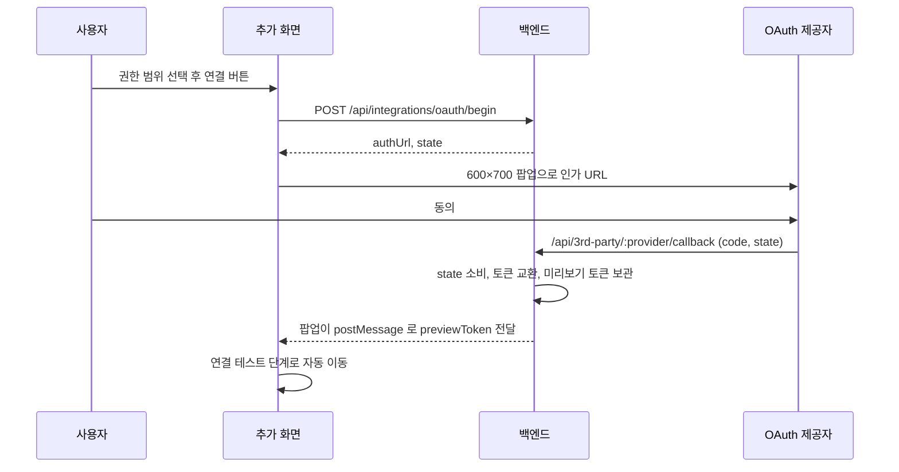
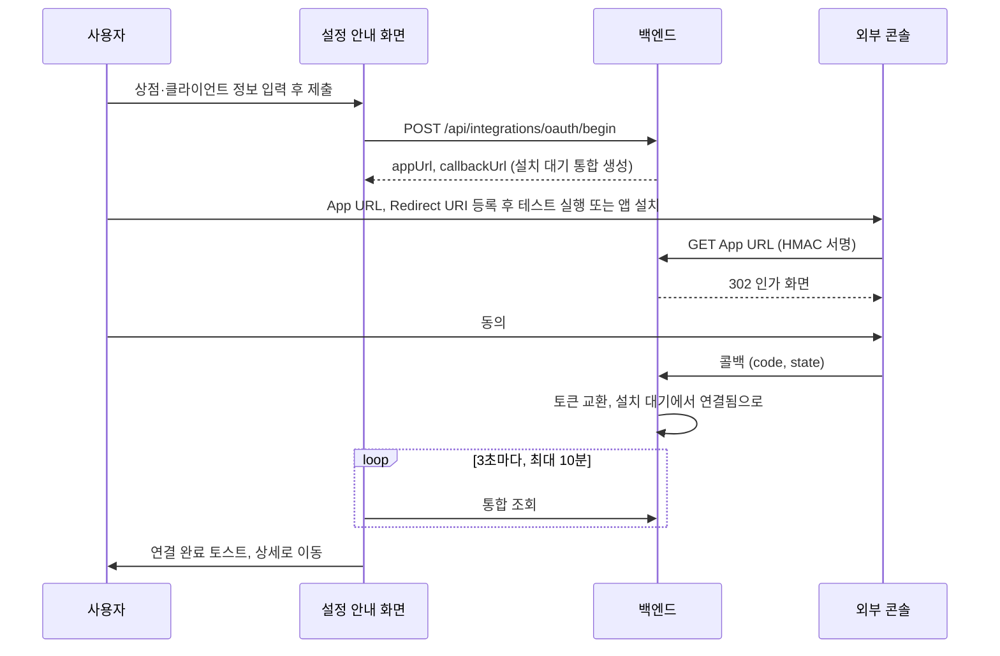

> 구현 상태: 부분 구현 · 원문: `spec/2-navigation/4-integration.md` (§3.2 OAuth 흐름, §3.5, §4.4, §9.2 OAuth·설치 행, §10, 관련 Rationale), `spec/data-flow/5-integration.md` (§1.2 진입점 표, §1.2.1 보안 계층, §2.2), `spec/4-nodes/4-integration/_product-overview.md` (INT-AU-01·04·06), `spec/2-navigation/_product-overview.md` (NAV-IN-03) · 용어: [용어 사전](../CLE-GLOSSARY.md)

## 개요

이 문서는 OAuth 통합(Integration, `integration`)이 연결되는 방법과 연결 뒤 토큰을 유지하는 방법을 정한다. 연결 방식은 두 가지다. Google·GitHub·Cafe24 Public 앱은 우리 화면의 팝업에서 OAuth 제공자(OAuth provider) 동의를 받는다. Cafe24 Private 앱과 MakeShop 은 외부 마켓의 앱 설치가 흐름을 시작하는 설치 우선 흐름(install-first)이라, 통합이 설치 대기(`pending_install`) 상태로 먼저 생기고 외부가 우리 App URL 을 부른다.

다루는 것:

- OAuth 연결 흐름(`oauth/begin` → 인가 → 콜백)과 제공자별 차이
- 설치 우선 흐름의 설정 안내 화면, App URL(설치 엔드포인트)과 보안 계층
- OAuth 콜백 엔드포인트, 팝업 복귀, 에러 매핑
- 통합 재인증(reauthorize)과 추가 권한 요청(request scopes), 상세 화면의 권한 탭
- 토큰 자동 갱신(token refresh)과 갱신 큐

범위 밖:

- 추가 위저드의 단계 구성과 공통 필드, 관리 API 목록, 에러 코드 카탈로그는 [통합 관리](CLE-INT-MANAGE.md) 가 정한다.
- 서비스별 자격 증명 필드와 권한 범위 프리셋은 [서비스별 인증 방식과 자격 증명](CLE-INT-AUTH.md) 이 정한다.
- 통합 상태 전이와 만료 스캐너, 알림은 [통합 상태와 만료 알림](CLE-INT-STATUS.md) 이 정한다.
- 테이블 쓰기 순서와 시퀀스는 [통합 데이터와 흐름](CLE-INT-DATA.md) 이 정한다.
- Cafe24 설치 엔드포인트의 Redis 키, HMAC 알고리즘, 상수는 [Cafe24 노드 §Private 앱 설치 엔드포인트](../CLE-NODE-INT/CLE-NODE-CAFE24.md#private-앱-설치-엔드포인트) 가, Cafe24 별도 승인 명단은 [Cafe24 별도 승인 scope](CLE-C24-SCOPES) 가 정한다.
- 소셜 로그인은 다른 흐름이다([가입과 로그인](../CLE-ACCT/CLE-ACCT-SIGNIN.md)).

## 요구사항

- REQ-INTOAUTH-001 WHEN 사용자가 Google·GitHub 통합의 연결 버튼을 누르면 THE SYSTEM SHALL `oauth/begin` 으로 state 를 발급하고 600×700 팝업에서 인가 URL 을 연다. (원본: INT-AU-01, NAV-IN-03)
- REQ-INTOAUTH-002 WHEN 사용자가 OAuth 통합을 추가하면 THE SYSTEM SHALL 서비스별 권장 기본값을 체크해 둔 권한 범위 체크박스를 보인다. (원본: INT-AU-06)
- REQ-INTOAUTH-003 WHEN 사용자가 Cafe24 통합을 추가하면 THE SYSTEM SHALL OAuth 를 시작하기 전에 상점 식별자와 앱 유형을 먼저 입력받는다.
- REQ-INTOAUTH-004 WHEN Cafe24 인가 URL 을 만들면 THE SYSTEM SHALL 권한 범위를 콤마로 구분한다.
- REQ-INTOAUTH-005 IF Cafe24 Public 앱 서버 환경 변수가 설정되지 않았으면 THE SYSTEM SHALL 서비스 목록 응답에 `publicAppAvailable=false` 를 싣고 화면은 Public 선택지를 숨긴다.
- REQ-INTOAUTH-006 WHEN 사용자가 Cafe24 Private 앱 통합을 제출하면 THE SYSTEM SHALL 팝업 없이 설치 대기 통합을 만들고 App URL·Redirect URI 를 담은 설정 안내 화면을 보인다.
- REQ-INTOAUTH-007 IF MakeShop 통합 폼의 Client ID 나 Client Secret 이 비어 있으면 THE SYSTEM SHALL 제출을 막는다.
- REQ-INTOAUTH-008 WHEN 사용자가 MakeShop 통합을 제출하면 THE SYSTEM SHALL 팝업 없이 설치 대기 통합을 만들고 설치 안내 화면을 보인다.
- REQ-INTOAUTH-009 WHILE 설정·설치 안내 화면이 열려 있는 동안 THE SYSTEM SHALL 그 통합을 3초마다 조회하고 연결됨이 되면 토스트를 띄운 뒤 상세 화면으로 이동한다.
- REQ-INTOAUTH-010 WHEN 안내 화면의 조회가 10분을 넘기면 THE SYSTEM SHALL 조회를 멈추고 «아직 대기 중» 안내를 보이며 재진입하거나 창에 포커스가 오면 다시 조회한다.
- REQ-INTOAUTH-011 IF 같은 워크스페이스에 같은 상점 식별자의 연결됨 Cafe24 통합이 있으면 THE SYSTEM SHALL Cafe24 `oauth/begin` 을 409 `CAFE24_PRIVATE_APP_ALREADY_CONNECTED` 로 거절한다.
- REQ-INTOAUTH-012 WHEN Cafe24 Private `oauth/begin` 에 같은 상점의 Private 설치 대기 행이 있으면 THE SYSTEM SHALL 새 행을 만들지 않고 그 행을 설치 토큰째 재사용한다.
- REQ-INTOAUTH-013 IF Cafe24 Private 통합에 `oauth/begin` 의 `reauthorize` 모드를 요청하면 THE SYSTEM SHALL `CAFE24_PRIVATE_APP_USE_TEST_RUN` 으로 거절한다.
- REQ-INTOAUTH-014 WHEN App URL 호출의 HMAC 검증이 통과하고 통합이 설치 대기이면 THE SYSTEM SHALL OAuth state 를 만들고 인가 URL 로 302 한다.
- REQ-INTOAUTH-015 WHEN App URL 호출의 HMAC 검증이 통과하고 통합이 설치 대기가 아니면 THE SYSTEM SHALL 프런트엔드 통합 상세 화면으로 302 한다.
- REQ-INTOAUTH-016 IF App URL 호출의 timestamp 가 ±5분 창 밖이면 THE SYSTEM SHALL 400 `CAFE24_INSTALL_REPLAY` 로 거절한다.
- REQ-INTOAUTH-017 IF 같은 IP 의 설치 토큰 조회·HMAC 검증 실패가 임계치를 넘으면 THE SYSTEM SHALL 429 `CAFE24_INSTALL_RATE_LIMITED` 로 거절한다.
- REQ-INTOAUTH-018 IF Cafe24 App URL 의 설치 토큰으로 행을 찾지 못하면 THE SYSTEM SHALL 같은 상점 식별자의 Cafe24 행 최대 5개 중 HMAC 이 맞는 행이 정확히 1개일 때만 그 행으로 진행한다.
- REQ-INTOAUTH-019 IF App URL 의 HMAC 검증이 실패하면 THE SYSTEM SHALL 실패 이유와 상관없이 같은 403 `CAFE24_INSTALL_INVALID_HMAC` 로 응답하고 `client_secret` 은 로그에 남기지 않는다.
- REQ-INTOAUTH-020 WHEN App URL 호출이 404 로 끝나고 요청이 `text/html` 을 받으면 THE SYSTEM SHALL 현재 App URL 을 확인하라는 안내가 담긴 HTML 페이지를 보인다.
- REQ-INTOAUTH-021 IF 콜백의 state 가 발급한 값과 맞지 않으면 THE SYSTEM SHALL 팝업에 `Security validation failed` 를 보이고 끝낸다.
- REQ-INTOAUTH-022 IF 콜백에 `error` 파라미터가 있으면 THE SYSTEM SHALL 팝업에 `Authorization denied` 를 보이고 끝낸다.
- REQ-INTOAUTH-023 WHEN 새 연결(`mode='new'`) 콜백의 토큰 교환이 성공하면 THE SYSTEM SHALL 토큰을 10분짜리 미리보기 토큰에 맡기고 `previewToken` 을 돌려준다.
- REQ-INTOAUTH-024 WHEN 통합 재인증 콜백이 성공하면 THE SYSTEM SHALL 자격 증명을 새 토큰으로 바꾸고 상태를 `connected` 로 되돌린다.
- REQ-INTOAUTH-025 WHEN 추가 권한 요청 콜백이 성공하면 THE SYSTEM SHALL 기존 권한 범위에 새 권한 범위를 합치고 토큰을 갱신한다.
- REQ-INTOAUTH-026 WHEN 통합 재인증·추가 권한 요청 콜백을 커밋하기 직전이면 THE SYSTEM SHALL 요청자의 가시성과 조직 통합의 관리자 권한을 다시 판정하고 실패하면 롤백한다.
- REQ-INTOAUTH-027 WHEN 콜백 처리가 끝나면 THE SYSTEM SHALL `postMessage` 로 부모 창에 결과를 알리고 성공은 바로, 실패는 3~5초 뒤 팝업을 닫는다.
- REQ-INTOAUTH-028 IF OAuth 팝업이 5분 안에 돌아오지 않으면 THE SYSTEM SHALL 타임아웃 에러를 보이고 다시 시도할 수 있게 한다.
- REQ-INTOAUTH-029 IF 연결됨 통합의 통합 재인증 코드 교환이 실패하면 THE SYSTEM SHALL 상태를 `error(auth_failed)` 로 바꾸고 `last_error` 를 기록한다.
- REQ-INTOAUTH-030 IF Cafe24 가 `invalid_scope` 로 권한 범위를 거부하면 THE SYSTEM SHALL 상태를 보존하고 사유 `oauth_invalid_scope` 와 `last_error.details.requiresCafe24Approval` 을 기록한다.
- REQ-INTOAUTH-031 WHEN 사용자가 Cafe24 Private 통합에 추가 권한 요청을 하면 THE SYSTEM SHALL OAuth 를 시작하지 않고 권한 범위만 합쳐 저장한 뒤 `cafe24_private_pending` 응답을 돌려준다.
- REQ-INTOAUTH-032 WHEN 추가 권한 요청 응답이 `cafe24_private_pending` 이면 THE SYSTEM SHALL 권한 탭에 인라인 안내와 info 토스트를 보이고 부모 화면을 다시 조회하지 않는다.
- REQ-INTOAUTH-033 WHEN 갱신 가능 통합으로 외부 API 를 부르기 직전 토큰이 만료됐거나 곧 만료되면 THE SYSTEM SHALL 토큰을 갱신한 뒤 부른다. (원본: INT-AU-04)
- REQ-INTOAUTH-034 WHEN Cafe24·MakeShop API 호출이 401 을 받으면 THE SYSTEM SHALL 토큰을 갱신하고 같은 요청을 한 번만 다시 시도한다.
- REQ-INTOAUTH-035 WHEN 토큰 갱신이 성공하면 THE SYSTEM SHALL `access_token`·`refresh_token`·`credentials.expires_at`·`token_expires_at` 네 값을 한 트랜잭션에서 함께 바꾸고 `last_rotated_at` 도 갱신한다.
- REQ-INTOAUTH-036 WHEN Cafe24 토큰 만료 시각을 정하면 THE SYSTEM SHALL JWT `exp`, `expires_in`, `expires_at` ISO, 2시간 기본값 순서로 처음 얻은 값을 쓴다.
- REQ-INTOAUTH-037 WHEN 호출 직전 갱신이나 배경 갱신을 큐에 넣으면 THE SYSTEM SHALL `jobId = integrationId` 로 같은 통합의 갱신을 클러스터에서 한 번만 실행한다.
- REQ-INTOAUTH-038 WHEN 401 뒤 갱신을 큐에 넣으면 THE SYSTEM SHALL 고유 `jobId` 로 중복 제거를 건너뛰고 DB 행 잠금으로 직렬화한다.
- REQ-INTOAUTH-039 IF 갱신 워커의 토큰 갱신이 실패하면 THE SYSTEM SHALL 작업을 실패로 남기고 큐 수준에서 다시 시도하지 않는다.
- REQ-INTOAUTH-040 IF 갱신 대상 통합이 이미 삭제됐으면 THE SYSTEM SHALL 작업을 실패로 보지 않고 아무것도 하지 않는다.
- REQ-INTOAUTH-041 WHEN MakeShop 토큰을 갱신하면 THE SYSTEM SHALL 매번 새로 받은 refresh token 을 저장한다.
- REQ-INTOAUTH-042 WHEN MakeShop 인가를 시작하면 THE SYSTEM SHALL PKCE S256 을 쓰고 권한 범위를 공백으로 구분한다.
- REQ-INTOAUTH-043 IF MakeShop 통합에 `oauth/begin` 의 `new` 가 아닌 모드(`reauthorize`·`request_scopes`)를 요청하면 THE SYSTEM SHALL `MAKESHOP_USE_SHOPSTORE_INSTALL` 로 거절한다.

## OAuth 연결 흐름

통합 OAuth state(`integration_oauth_state`)의 `mode` 는 `new`·`reauthorize`·`request_scopes` 세 가지다(`OAuthStateMode`). 진입점은 셋이다.

| 진입점 | mode | 설명 |
| --- | --- | --- |
| `POST /api/integrations/oauth/begin` | 본문의 `mode` 를 그대로 쓴다. `request-scopes` 표기는 `request_scopes` 로 바꾼다 | Cafe24 Private 과 MakeShop 은 `mode='new'` 만 받는다. 그 밖의 모드는 Cafe24 Private 이 `CAFE24_PRIVATE_APP_USE_TEST_RUN`, MakeShop 이 `MAKESHOP_USE_SHOPSTORE_INSTALL` 로 거절한다. 외부 마켓이 흐름을 시작하기 때문이다. MakeShop 이 오류가 된 뒤의 복구 경로는 [통합 상태와 만료 알림](CLE-INT-STATUS.md#미결-사항) 의 미결 사항이다 |
| `POST /api/integrations/:id/reauthorize` | `reauthorize` | 안에서 `begin(mode='reauthorize', integrationId)` 를 부른다. OAuth 가 아닌 통합은 OAuth 왕복 없이 바로 연결됨으로 되돌린다 |
| `POST /api/integrations/:id/request-scopes` | `request_scopes` | 기존 권한 범위와 새 권한 범위를 합친 뒤 begin 을 부른다. Cafe24 Private 은 begin 을 부를 수 없어 `credentials.scopes` 만 합쳐 저장하고 «테스트 실행» 을 다시 누르라고 안내한다 |

state 는 발급 뒤 10분 동안 유효하고 콜백이 한 번만 소비한다. 권한 판정은 [통합 관리](CLE-INT-MANAGE.md) 의 권한 규칙을 따른다. `oauth/begin` 의 `reauthorize`·`request_scopes` 모드(`integrationId` 지정)도 `:id/reauthorize`·`:id/request-scopes` 와 같은 판정을 받는다. 테이블 쓰기 순서는 [통합 데이터와 흐름](CLE-INT-DATA.md) 의 시퀀스 그림에 있다.

### `oauth/begin` 요청과 응답

본문은 `{ service, scopes[], mode, integrationId? }` 이고 서비스에 따라 필드를 더한다. 요청 본문 필드 표기는 [미결 사항](#미결-사항) 참조.

| 서비스 | 더하는 필드 | 응답 |
| --- | --- | --- |
| Google, GitHub | 없음 | `{ authUrl, state }` (팝업 흐름) |
| Cafe24 Public | `mall_id`, `app_type='public'` | `{ authUrl, state }` (팝업 흐름). `authUrl` 은 상점별 인가 URL 이다 |
| Cafe24 Private | `mall_id`, `app_type='private'`, `client_id`, `client_secret` | `{ mode:'cafe24_private_pending', integrationId, appUrl, callbackUrl }`. 설치 대기 통합을 만들고 팝업은 없다 |
| MakeShop | `client_id`, `client_secret` | `{ mode:'makeshop_pending_install', integrationId, appUrl, callbackUrl }`. 설치 대기 통합을 만들고 팝업은 없다. ShopStore 앱 설치가 설치 흐름의 진입점이다 |

- `appUrl` 은 Cafe24 Private 이 `${APP_URL}/api/3rd-party/cafe24/install/:installToken`, MakeShop 이 `${APP_URL}/api/3rd-party/makeshop/install/:installToken` 이다. `installToken` 은 이 begin 이 발급한 16바이트 base64url(22자, `^[A-Za-z0-9_-]{22}$`) 설치 토큰이다. 사용자는 이 주소를 외부 콘솔의 App URL 칸에 그대로 등록한다.
- Cafe24 흐름(Public·Private)에 들어오면 같은 `(workspaceId, mall_id)` 의 Cafe24 통합을 먼저 본다.
  - Public: 연결됨 행이 있으면 begin 을 409 `CAFE24_PRIVATE_APP_ALREADY_CONNECTED` 로 바로 거절한다. Public 은 begin 에서 행을 만들지 않으므로 이 사전 검사가 없으면 사용자가 OAuth 동의까지 마친 뒤에야 충돌을 알게 된다.
  - Private: 연결됨 행이 있으면 같은 코드로 거절한다. `app_type='private'` 인 설치 대기 행이 있으면 새 행을 만들지 않고 그 행을 재사용하며 설치 토큰을 보존한다(멱등 begin).
  - 만료됨·오류 행은 begin 에서 막지 않는다. 최종 생성 단계에서 상점 식별자 UNIQUE(V072)가 경쟁 상황의 마지막 방어로 같은 409 를 낸다. 한 워크스페이스 안에서 같은 `(service_type, mall_id)` 통합은 최대 1행이므로 사용자는 기존 통합을 쓰거나 지우고 다시 등록한다.
- `CAFE24_PRIVATE_APP_ALREADY_CONNECTED` 는 두 경로에서 같은 코드로 나온다. begin 의 사전 SELECT(연결됨 행만 차단)와, `POST /api/integrations` 최종 생성에서 `idx_integration_workspace_service_mall` 위반(`23505`)을 `throwIfUniqueViolation` 이 서비스 유형이 cafe24 인 분기로 바꾼 것이다. 앱 유형과 상관없이 쓴다. 이름의 `PRIVATE` 는 옛 이름이 남은 것이고 뜻은 «같은 상점의 Cafe24 통합이 이미 있다» 다. 클라이언트는 이름이 아니라 이 뜻으로 분기한다(아래 Rationale).
- MakeShop 은 begin 시점에 `shop_uid` 를 모르므로 같은 `(워크스페이스, client_id)` 의 설치 대기 행을 재사용하고 상점 중복은 설치 콜백에서 `MAKESHOP_ALREADY_CONNECTED`(409)로 막는다.

### 제공자별 설정

| 제공자 | 인가 URL | 토큰 URL | 권한 범위 구분 | 기본 권한 범위 | 갱신 |
| --- | --- | --- | --- | --- | --- |
| Google | 고정 | `https://oauth2.googleapis.com/token` | 공백 | 사용자 체크박스 선택 결과 | refresh token 을 받지만 갱신 경로는 미구현 |
| GitHub | 고정 | `https://github.com/login/oauth/access_token` | 공백 | `repo`, `read:org` | 없음 |
| Cafe24 | `https://{mall_id}.cafe24api.com/api/v2/oauth/authorize?response_type=code&client_id=...&state=...&redirect_uri=...&scope=...` | `POST https://{mall_id}.cafe24api.com/api/v2/oauth/token` (Basic `client_id:client_secret`) | 콤마 | 사용자 체크박스(카테고리 R·W) 결과 | 있음. 같은 토큰 URL 에 `grant_type=refresh_token` |
| MakeShop | `https://auth.makeshop.com/oauth/authorize` (`response_type=code`, PKCE S256) | `POST https://auth.makeshop.com/oauth/token` (Basic `client_id:client_secret`) | 공백 | 사용자 체크박스 결과 | 있음. refresh token 이 매번 새 값으로 바뀐다 |

- **Cafe24 의 권한 범위는 콤마로 구분한다.** RFC 6749 §3.3 의 공백 구분이 아니라 `mall.read_product,mall.write_order` 처럼 보낸다. 공백이나 `+` 로 보내면 권한 범위가 하나여도 `invalid_scope` 로 거부된다. Cafe24 공식 예제(`developers.cafe24.com`)와 `cafe24-app/cafe24_app_sample` 의 `StoreToken.java#getCodeRedirectUrl` 이 모두 콤마를 쓴다. 다른 제공자는 공백 구분을 유지한다.
- **Cafe24 의 토큰 URL 은 `mall_id` 에 따라 바뀐다.** begin 이 사용자가 입력한 `mall_id` 를 통합 OAuth state 의 `provider_meta`(암호화, V041)에 넣어 콜백의 토큰 교환까지 가져간다. `new`·`reauthorize`·`request_scopes` 모두 같다. MakeShop 은 같은 자리에 `shop_uid`, 클라이언트 자격 증명, PKCE `code_verifier` 를 넣는다. `code_verifier` 는 자격 증명에 저장하지 않는다.
- **Cafe24 토큰 응답은 `expires_in` 이 아니라 `expires_at`(ISO8601)을 준다.** 대신 `access_token` 이 JWT 라 `exp` 로도 만료 시각을 알 수 있다. 만료 시각 해석은 [토큰 자동 갱신](#토큰-자동-갱신) 의 규칙을 따른다.
- 통합용 콜백(`/api/3rd-party/:provider/callback`)은 사용자 소셜 로그인 콜백(`/api/auth/oauth/:provider/callback`)과 다르다. Google Cloud Console, GitHub OAuth App, Cafe24 개발자 센터에는 두 redirect URI 를 모두 등록한다.

## 팝업 연결: Google·GitHub·Cafe24 Public



1. 사용자가 권한 범위 체크박스로 권한을 고른다([서비스별 인증 방식과 자격 증명](CLE-INT-AUTH.md)).
2. `[Connect with <Service>]` 를 누르면 `POST /api/integrations/oauth/begin` 으로 state 를 받는다.
3. 새 팝업(600×700)에서 인가 URL 을 연다.
4. 팝업 콜백 페이지(`/api/3rd-party/:provider/callback`)가 토큰을 보관한 뒤 `postMessage` 로 부모 창에 알린다.
5. 부모 창은 연결 테스트 단계로 자동으로 넘어간다([통합 관리](CLE-INT-MANAGE.md) 의 추가 페이지).

Cafe24 Public 앱은 Cafe24 앱스토어에 등록(또는 심사 대기)된 앱이라 서버 환경 변수 `CAFE24_CLIENT_ID`·`CAFE24_CLIENT_SECRET` 을 쓴다. 흐름은 위와 같고 다음이 다르다.

1. 연결 버튼을 누르기 전에 `Mall ID`(예: `myshop`, `https://myshop.cafe24api.com` 의 hostname 앞부분, `/^[a-z0-9-]{3,50}$/`)와 앱 유형 `Public` 을 입력한다. `mall_id` 가 base URL 의 일부이고 인가 URL 도 상점마다 달라서다(Private 도 같다).
2. 권한 범위는 카테고리 단위 체크박스로 고른다: Product·Order·Customer·Category·Promotion·Mileage·Shipping·Translation·Notification(R/W), Salesreport(R). 그 밖의 카테고리는 «고급» 토글 아래에 있다. 체크박스마다 `mall.read_<category>`·`mall.write_<category>` 에 대응한다.
3. 별도 승인이 필요한 카테고리(Mileage·Notification·Privacy 의 R·W 전부, Store 안 일부 sub-resource)는 체크박스 옆에 ⚠ 를 보인다. 체크는 막지 않는다. 체크한 권한 중 별도 승인 대상이 하나라도 있으면 폼 아래에 인라인 안내(경고, amber 톤, [레이아웃과 내비게이션](../CLE-UI/CLE-UI-LAYOUT.md) 의 공통 패턴)를 계속 보인다. 승인 없이 진행하면 OAuth 단계의 `invalid_scope` 나 호출 때의 `INSUFFICIENT_SCOPE`(403)로 실패할 수 있다. 명단, tooltip 문구, i18n 키는 [Cafe24 별도 승인 scope](CLE-C24-SCOPES) 가 정한다.
4. `[Connect with Cafe24]` 를 누르면 begin 을 부른다.

   ```jsonc
   {
     "service": "cafe24",
     "mode": "new",
     "mall_id": "myshop",
     "app_type": "public",
     "scopes": ["mall.read_product", "mall.write_order", "..."]
   }
   ```

5. 새 팝업(600×700)에서 `https://{mall_id}.cafe24api.com/api/v2/oauth/authorize?...` 를 연다. 권한 범위는 콤마로 구분한다.
6. 팝업 콜백 페이지(`/api/3rd-party/cafe24/callback`)가 토큰을 보관하고 `postMessage` 로 알린다. 부모 창은 연결 테스트 단계로 넘어간다.

`/api/integrations/services` 응답의 cafe24 항목은 `meta.publicAppAvailable: boolean` 을 싣는다. `CAFE24_CLIENT_ID` 와 `CAFE24_CLIENT_SECRET` 이 모두 설정돼 있으면 true 다. false 면 추가 폼이 Public 선택지를 빼고 기본값을 `private` 으로 두며 안내 문구를 바꾼다. Private 은 환경 변수와 상관없이 늘 보인다.

### 팝업 복귀

- 부모 창은 `window.addEventListener('message', ...)` 로 `oauth_callback` 이벤트를 받는다.
- `mode='new'` 면 미리보기 토큰(`previewToken`, 통합을 저장하기 전의 임시 참조)을 받아 연결 테스트 단계로 자동으로 들어간다.
- 팝업이 5분 안에 돌아오지 않으면 타임아웃 에러를 보이고 사용자는 다시 시도할 수 있다.

## 설치 우선 흐름: Cafe24 Private·MakeShop

Cafe24 Private 앱은 Cafe24 개발자 센터에서 만든 심사 전 앱이다. MakeShop 은 ShopStore 마켓의 앱 설치가 설치 흐름의 진입점이다. 둘 다 우리 서비스가 OAuth 를 시작할 수 없다. 외부 콘솔(Cafe24 개발자 센터의 «테스트 실행», ShopStore 앱 설치)이 먼저 우리 App URL 을 부르고 그 뒤 동의와 콜백이 이어진다.



### Cafe24 Private 앱

1. **사전 등록**(Cafe24 에서 «테스트 실행» 전에 필수): `Mall ID`, `App type = Private`, `Client ID`, `Client Secret`, 권한 범위를 입력하고 **[저장 및 설정 안내 받기]** 를 누른다. begin 본문은 다음과 같다.

   ```jsonc
   {
     "service": "cafe24",
     "mode": "new",
     "mall_id": "myshop",
     "app_type": "private",
     "client_id": "...",
     "client_secret": "...",
     "scopes": ["mall.read_product", "..."]
   }
   ```

   응답은 `{ "mode": "cafe24_private_pending", "integrationId": "...", "appUrl": "https://<host>/api/3rd-party/cafe24/install/:installToken", "callbackUrl": "https://<host>/api/3rd-party/cafe24/callback" }` 다. 통합이 토큰 없이 `status=pending_install` 로 바로 생긴다. Cafe24 App URL 입력 칸의 100자 한도에 맞추려고 경로와 토큰을 모두 줄였다(아래 Rationale).
2. **설정 안내 화면**(팝업 없음): `App URL` 복사 버튼(Cafe24 개발자 센터 앱의 «앱 URL» 에 등록), `Redirect URI` 복사 버튼(앱의 «Redirect URI» 에 등록), 안내 문구 "① 위 URL 을 Cafe24 Developers → 내 앱 → 개발 정보에 등록하세요. ② 사용 권한(Scope) 이 요청한 scope 와 일치하는지 확인하세요. ③ 테스트 실행 버튼을 클릭하고 mall_id 를 입력하세요." 를 보인다.
3. **Cafe24 «테스트 실행»**: Cafe24 가 App URL(`GET /api/3rd-party/cafe24/install/:installToken`)을 부른다. 쿼리는 `mall_id`, `shop_no`, `user_id`, `user_name`, `user_type`, `lang`, `nation`, `timestamp`, `hmac`(HmacSHA256 서명, 알고리즘은 [Cafe24 노드 §HMAC 검증 알고리즘](../CLE-NODE-INT/CLE-NODE-CAFE24.md#hmac-검증-알고리즘))이다.
4. **App URL 처리**: 경로의 설치 토큰으로 통합 한 행을 찾고 그 행의 `client_secret` 으로 HMAC 을 한 번 검증한다. 통과하면 상태로 나눈다. 설치 대기면 OAuth state 를 만들고 Cafe24 인가 URL 로 302 한다. 연결됨·오류·만료됨이면 `${FRONTEND_URL}/integrations/<id>` 로 302 한다. Cafe24 쇼핑몰 관리자의 «앱으로 가기» 버튼이 같은 App URL 을 쓰므로 이 분기가 꼭 필요하다(아래 Rationale).
5. 쇼핑몰 관리자가 동의 화면에서 동의한다. «앱으로 가기» 분기는 동의 화면 없이 4번에서 바로 우리 화면으로 온다.
6. Cafe24 가 콜백(`/api/3rd-party/cafe24/callback`)으로 code 와 state 를 보내면 토큰을 교환하고 `pending_install → connected` 로 바꾼다. 설치 토큰은 지우지 않고 보존한다.
7. 그동안 설정 안내 화면은 그 통합을 3초마다 조회한다. «테스트 실행» 이 띄운 창의 `window.opener` 는 Cafe24 탭이라 `postMessage` 복귀를 쓸 수 없다. 연결됨을 감지하면 토스트를 띄우고 목록 쿼리를 무효화한 뒤 상세(`/integrations/<id>`)로 이동한다. 10분이 지나면 조회를 멈추고 «아직 대기 중» 안내를 보인다. 행은 백엔드에 남아 있고 페이지에 다시 들어오거나 창에 포커스가 오면 조회를 다시 시작한다. 설치 대기인 채 콜백 실패가 기록되면 `last_error`·`status_reason` 진단 단서를 같은 화면에 보인다. 통합 목록의 상태 배지로도 확인할 수 있다.

### MakeShop

1. **사전 입력**: `Client ID`, `Client Secret`(파트너센터 앱 등록 때 발급). 하나라도 비어 있으면 폼 검증 에러로 막는다. `shop_uid` 는 이 단계에서 입력하지 않는다. ShopStore 설치 redirect 의 파라미터로 온다.
2. **제출**: `POST /api/integrations/oauth/begin`(본문 `{ "service": "makeshop", "mode": "new", "client_id": "...", "client_secret": "...", "scopes": [...] }`). 응답은 `{ "mode": "makeshop_pending_install", "integrationId": "...", "appUrl": "https://<host>/api/3rd-party/makeshop/install/:installToken", "callbackUrl": "..." }` 이고 통합이 토큰 없이 설치 대기로 생긴다.
3. **설치 안내 화면**: Cafe24 Private 설정 안내와 같은 복사 UX(라벨, 모노스페이스 URL, 복사 버튼)로 `App URL`·`Redirect URI` 를 파트너센터 앱 설정에 등록하라고 안내한다.
4. **자동 조회**: Cafe24 Private 7번과 같다(3초 간격, 연결됨이면 토스트와 상세 이동, 10분 soft timeout).
5. 사용자가 ShopStore 에서 앱을 설치하면 MakeShop 이 App URL 을 `?shop_uid=...&timestamp=...&action_type=install&hmac=...` 로 부른다. HMAC 검증 뒤 인가, 콜백을 거쳐 `pending_install → connected` 가 된다.

- 설치 HMAC 은 `client_secret` 으로 만든 HMAC-SHA256 이고 ±5분 재사용 방어를 한다. Cafe24 Private 과 같은 방식이며 설치 토큰 capability 모델, rate limit, nonce 보호를 다시 쓴다. MakeShop HMAC 메시지 구성(정렬, 인코딩)은 코드에 `VERIFY` 로 표시돼 있어 운영 전에 공식 문서로 확정해야 한다([MakeShop 노드](../CLE-NODE-INT/CLE-NODE-MAKESHOP.md)).
- **설치 안내 화면의 에러 표시**: 콜백 실패로 기록된 사유 중 알려진 다섯 개(`oauth_token_exchange_failed`·`oauth_state_mismatch`·`oauth_state_expired`·`oauth_invalid_scope`·`hmac_verification_failed`)만 i18n 문구로 매핑한다. 모르는 사유는 일반 메시지로 보인다. HMAC 상세나 토큰 교환 trace 같은 백엔드 원문을 사용자에게 보이지 않는다. `hmac_verification_failed` 가 상태 사유 union 에 없는 문제는 [통합 상태와 만료 알림](CLE-INT-STATUS.md) 의 미결 사항이다.
- MakeShop 에는 Cafe24 의 설치 토큰 불일치 회복(`tryRecoverByMallId`)이 없다. 조회에 실패하면 바로 404 다.

## 설치 엔드포인트 (App URL)

| 메서드 | 경로 | 설명 |
| --- | --- | --- |
| GET | `/api/3rd-party/cafe24/install/:installToken` | Cafe24 Private App URL. 두 진입점이 부른다. ① 첫 설치: Cafe24 개발자 센터 «테스트 실행» → OAuth 인가로 redirect. ② 설치 뒤 이동: 쇼핑몰 관리자의 «앱으로 가기» → 프런트엔드로 redirect |
| GET | `/api/3rd-party/makeshop/install/:installToken` | MakeShop App URL. 쿼리 `shop_uid`, `timestamp`, `action_type`, `hmac` |

- `:installToken` 은 begin 응답의 22자 설치 토큰이다. 설치 토큰은 통합이 살아 있는 동안 지속되는 식별자다. 콜백 성공에서 NULL 로 지우지 않는다.
- 식별 절차: 설치 토큰으로 한 행을 찾고 그 행의 `client_secret` 으로 HMAC 을 한 번 검증한다.

가드는 이 순서로 건다.

| 순서 | 검사 | 실패 응답 |
| --- | --- | --- |
| ① | IP 잠금 | 429 `CAFE24_INSTALL_RATE_LIMITED` |
| ② | 설치 토큰 형식 | 404, 실패 카운트 |
| ③ | 필수 파라미터(`mall_id`·`timestamp`·`hmac`) | 400 `CAFE24_INSTALL_MISSING_PARAMS` |
| ④ | timestamp ±5분 | 400 `CAFE24_INSTALL_REPLAY` (MakeShop 은 `MAKESHOP_INSTALL_REPLAY`) |
| ⑤ | MakeShop 만: `shop_uid` 형식(SSRF 가드) | `MAKESHOP_INVALID_SHOP_UID` |
| ⑥ | 설치 토큰으로 한 행 조회(상태 무관, V043 부분 UNIQUE). Cafe24 는 실패하면 `tryRecoverByMallId` 회복 | 404 `CAFE24_INSTALL_INVALID_TOKEN` (통합 삭제, 24시간 만료로 지워짐, 회복 실패) |
| ⑦ | `mall_id`·앱 유형 일치와 HMAC(`client_secret`) timing-safe 비교 | 403 `CAFE24_INSTALL_INVALID_HMAC` |
| ⑧ | `(mall_id, timestamp, hmac)` nonce 재사용 검사(Redis, 없으면 건너뜀) | 재사용 거절 |
| ⑨ | MakeShop 설치 대기 분기만: 같은 `(워크스페이스, shop_uid)` 연결됨 행 | 409 `MAKESHOP_ALREADY_CONNECTED` |

`CAFE24_INSTALL_MISSING_PARAMS` 는 capability 토큰 가정(설치 토큰은 추측할 수 없다)과 무관한 파라미터 누락이라 404·403 합산 정책과 별개 코드다. HMAC 실패의 세 갈래(`mall_id` 불일치, `client_secret` 없음, HMAC 불일치)는 같은 403 을 돌려준다. 대신 `logger.warn` 에 갈래, URL 과 DB `mall_id` 의 일치 여부, DB 앱 유형·상태·사유, 설치 토큰 앞뒤 4자를 남긴다. `client_secret` 은 절대 로그에 남기지 않는다(`SECRET_LEAK_PATTERNS` 정책).

보안 계층을 한 표로 모으면 이렇다.

| 계층 | 방법 |
| --- | --- |
| Rate limit 1층 | `@Throttle` IP 당 분당 30회(콜백은 분당 60회). 현재는 pod 마다 메모리에 센다. Redis 로 나눠 세는 전환은 후속이다 |
| Rate limit 2층 | 설치 토큰 조회·HMAC **실패**만 IP 별로 세어 임계치를 넘으면 429 로 잠근다. 성공한 설치(302)는 세지 않으므로 정상 사용자는 걸리지 않는다. Redis 로 pod 사이에 공유한다 |
| 재사용 | timestamp ±5분 창과 `(mall_id, timestamp, hmac)` Redis nonce 캐시 |
| 위조 | raw query 의 HMAC-SHA256(`client_secret`), timing-safe 비교 |
| 오래된 URL | `tryRecoverByMallId`: 같은 `mall_id` 후보의 HMAC 을 대조해 정확히 1개가 맞으면 자동 회복(Cafe24 만) |

Redis 키 구성, TTL, 임계치·창 같은 상수, Redis 가 없을 때의 동작은 [Cafe24 노드 §Private 앱 설치 엔드포인트](../CLE-NODE-INT/CLE-NODE-CAFE24.md#private-앱-설치-엔드포인트) 가 기준이다. Redis 가 없으면 nonce 캐시와 실패 카운터는 조용히 꺼진다.

**설치 토큰 불일치 회복**(Cafe24): 설치 토큰으로 행을 찾지 못하면 다음을 한다.

1. 같은 `mall_id` 의 Cafe24 행을 찾는다(`idx_integration_service_mall` 로 한 번에 조회, 보통 1~2건).
2. 행마다 `client_secret` 으로 HMAC 을 대조한다. 후보는 5개까지다. 넘으면 회복을 포기하고 404 다.
3. 정확히 1개가 맞으면 그 행의 OAuth 또는 이동 흐름으로 진행한다.
4. 0개나 2개 이상이면 404 와 HTML 안내 페이지를 돌려준다.

회복 로그에서는 다른 테넌트의 통합 UUID 와 설치 토큰 prefix 를 빼고 `mall_id` 와 상태만 남긴다. 2개 이상 맞으면 `[cafe24-install-recovery] ambiguous: N rows passed HMAC` 로그를 남긴다.

**404 HTML 안내**: 404(회복 실패 포함)이고 요청의 `Accept` 가 `text/html` 이면 에러 코드·메시지와 «통합 상세 페이지에서 현재 App URL 을 확인해 Cafe24 Developers 를 갱신하세요» 안내가 담긴 간단한 HTML 페이지를 보인다. JSON 을 기대하는 API 클라이언트에는 기존 JSON 응답을 준다.

## OAuth 콜백 엔드포인트

```
GET /api/3rd-party/:provider/callback
```

| 파라미터 | 설명 |
| --- | --- |
| `:provider` | OAuth 제공자. `google`, `github`, `cafe24`, `makeshop` |
| `code` | Authorization Code |
| `state` | CSRF 방지 토큰(서버 발급) |
| `error` | OAuth 에러 코드(거부 등) |

### 처리 순서

1. **state 검증**: `oauth/begin` 이 발급한 state 와 맞는지 본다. 맞지 않으면 팝업에 `Security validation failed` 를 보이고 끝낸다.
2. **error 파라미터 확인**: 있으면 팝업에 `Authorization denied` 를 보이고 끝낸다.
3. **토큰 교환**: 제공자별 토큰 엔드포인트에 code 와 client_secret 을 보낸다. MakeShop 은 PKCE `code_verifier` 를 함께 보낸다.
4. **모드별 처리**:
   - `new`: 아직 통합이 없다. 토큰을 미리보기 토큰(`integration_oauth_preview`, 10분)에 맡기고 `previewToken` 을 발급한다. `POST /api/integrations` 가 이 토큰을 참조해 통합을 만든다.
   - `reauthorize`: 기존 통합의 자격 증명을 새 토큰으로 바꾸고 상태를 `connected` 로 되돌린다. 통합이 설치 대기면 성공 시 연결됨이 되고 실패 시 설치 대기를 유지하며 `last_error`·`status_reason` 만 갱신한다(Cafe24 Private·MakeShop 첫 설치).
   - `request_scopes`: 기존 `credentials.scopes` 에 새 권한 범위를 합치고 access token·refresh token 을 갱신한다.
   - `reauthorize`·`request_scopes` 는 커밋 직전에 요청자에게 그 통합이 보이는지, 조직 통합이면 요청자의 현재 역할이 관리자 이상인지 같은 트랜잭션에서 다시 판정한다(설치 대기 행 제외). 실패하면 롤백한다.
5. **부모 창 알림**:

   ```javascript
   window.opener.postMessage({
     type: "oauth_callback",
     provider: "google",
     status: "success",           // "success" | "error"
     mode: "new",                  // "new" | "reauthorize" | "request_scopes"
     previewToken: "tmp_...",      // mode=new일 때만
     integrationId: "uuid",        // mode=reauthorize/request_scopes
     error: null
   }, window.location.origin);
   window.close();
   ```

6. **실패 처리**: 콜백 처리 중 예외가 나면 컨트롤러는 같은 콜백 HTML 을 `status: 'error'` 와 에러 메시지로 돌려준다. 메시지를 읽을 수 있도록 팝업은 3~5초 뒤 닫는다(성공은 바로). state 를 소비한 뒤의 예외는 `OAuthState.integrationId` 로 행을 알 수 있으므로 그 행의 `last_error`·`status_reason` 을 갱신한다. 상태를 바꾸는지는 아래 에러 매핑 표가 정한다.

### 에러 매핑

| 에러 | 팝업 표시 | 통합 상태 |
| --- | --- | --- |
| state 불일치 | `Security validation failed. Please try again.` | 변경 없음. 통합을 식별하기 전 단계다 |
| 사용자 거부 | `Authorization was denied.` | 변경 없음 |
| 코드 교환 실패 (`mode='reauthorize'`, 상태 `connected`) | `Failed to connect to {provider}.` (3~5초 뒤 닫기) | `error(auth_failed)` + `last_error` 기록 |
| 코드 교환 실패 (`mode='reauthorize'`, 상태 `pending_install`) | 같음 | 상태 보존(설치 대기 유지) + `status_reason='oauth_token_exchange_failed'` + `last_error.code='OAUTH_TOKEN_EXCHANGE_FAILED'`. 외부 설정을 고친 뒤 다시 시도할 수 있다 |
| Cafe24 `invalid_scope` (인가·토큰 교환 두 단계 모두) | `Authorization rejected: invalid scope.` (안내 본문에 별도 승인 안내 분기) | 상태 보존 + `status_reason='oauth_invalid_scope'` + `last_error.code='OAUTH_INVALID_SCOPE'` + `last_error.details.requiresCafe24Approval: string[]`(요청 권한 범위와 [Cafe24 별도 승인 scope](CLE-C24-SCOPES) §1 명단의 교집합). 상세 화면이 이 단서를 읽어 «이 권한은 카페24 별도 승인이 필요해요» 를 보인다. `oauth_token_exchange_failed` 와 진입 경로가 다르다. 이쪽은 Cafe24 가 권한 범위를 명시적으로 거부한 경우이고 저쪽은 그 밖의 토큰 교환 실패 전부(네트워크, 서버 오류, 알 수 없는 `invalid_grant` 등)다 |
| state 불일치·만료 (state 소비 뒤) | `Security validation failed.` / `OAuth state has expired.` | 통합을 알 수 있으면 `status_reason='oauth_state_mismatch'` 또는 `oauth_state_expired` 만 기록, 상태 보존 |
| 토큰 발급 뒤 행 조회 실패 | `Integration not found.` | 변경 불가. 행이 사라져 갱신할 대상이 없다 |
| 커밋 직전 인가 재판정 실패 (`reauthorize`·`request_scopes`, 설치 대기 아님. 시작과 콜백 사이에 요청자가 강등됐거나 통합이 남의 개인 통합이 됨) | 서버 메시지 그대로. `Integration not found`(`RESOURCE_NOT_FOUND`) 또는 `Organization 통합을 재인증하려면 Admin 이상의 권한이 필요합니다.`·`… scope 를 추가하려면 …`(`ADMIN_REQUIRED`) | 자격 증명 불변(롤백), 상태 보존, `last_error` 에 그 코드 기록 |
| 네트워크 오류 | `Connection error.` | 통합을 알 수 있으면 `last_error` 만 기록, 상태 보존 |

상태 사유 저장값(snake_case)과 API 에러 코드(UPPER_SNAKE_CASE)의 관계는 [통합 상태와 만료 알림](CLE-INT-STATUS.md) 에 있다.

## 통합 재인증과 추가 권한 요청

| 메서드 | 경로 | 설명 |
| --- | --- | --- |
| POST | `/api/integrations/:id/reauthorize` | OAuth 통합 재인증용 `authUrl` 을 발급한다. OAuth 가 아닌 통합은 바로 연결됨으로 되돌린다 |
| POST | `/api/integrations/:id/request-scopes` | 추가 권한 요청. 본문 `{ scopes: string[] }`. 응답은 아래 두 갈래다 |

추가 권한 요청 응답은 백엔드가 제공자에 따라 모양을 정하고 프런트엔드는 모양만 보고 화면을 나눈다.

- **일반 OAuth 제공자(Google·GitHub·Cafe24 Public)**: `{ authUrl }`. 새 창으로 OAuth 팝업을 열고 성공 토스트("Scope request window opened" / "권한 요청 창을 열었어요")를 띄운다. 팝업이 성공으로 닫히면 부모 화면이 합쳐진 `credentials.scopes` 를 다시 조회한다.
- **Cafe24 Private**: `{ mode: 'cafe24_private_pending', integrationId, appUrl, callbackUrl, scopesAdded: string[] }`. 우리 서버가 OAuth 를 시작할 수 없어 팝업이 없다. 백엔드는 begin 을 부르지 않고 설치 토큰을 보존한 채 `credentials.scopes` 만 합쳐 저장한다. 사용자가 Cafe24 개발자 센터의 앱 권한에서 추가 권한을 켠 뒤 «테스트 실행» 을 다시 누르게 안내한다. 이 안내가 가정하는 재인증 경로는 [미결 사항](#미결-사항) 참조.

### 권한 탭 (OAuth 통합만)

상세 화면의 `Scope & Permissions` 탭이다. OAuth 가 아닌 통합에서는 숨긴다.

| 요소 | 설명 |
| --- | --- |
| 현재 권한 범위 | `credentials.scopes[]` 전체를 체크된 상태로 보인다 |
| 권장 권한 범위 | 서비스별 프리셋. 현재 권한에 없는 항목은 체크를 풀어 보인다 |
| 누락 권한 배지 | `status_reason = insufficient_scope` 면 누락 권한 범위를 빨간 배지로 강조한다 |
| 별도 승인 ⚠ 배지 | 현재·권장·누락 권한의 각 항목 옆에, 백엔드 메타데이터의 `restrictedApproval`(또는 begin 응답의 같은 정보)이 있는 권한 범위·operation 만 ⚠ 배지를 자동으로 보인다. tooltip 은 [Cafe24 별도 승인 scope](CLE-C24-SCOPES) 의 i18n 문구다. `[Request scopes]` 버튼 위에 «추가하려는 scope 중 N개는 카페24 별도 승인 필요» 보조 문구(N 은 교집합 크기)를 보인다. `status_reason='oauth_invalid_scope'` 이거나 `INSUFFICIENT_SCOPE` 응답의 `details.requiresCafe24Approval` 이 채워져 있으면 «이 권한은 카페24 별도 승인이 필요해요» 분기 메시지를 더 보인다 |
| `[Request scopes]` 버튼 | 체크한 추가 권한 범위로 `POST /api/integrations/:id/request-scopes` 를 부른다 |

Cafe24 Private 응답(`cafe24_private_pending`)의 화면:

- 공통 인라인 안내 패턴([레이아웃과 내비게이션](../CLE-UI/CLE-UI-LAYOUT.md))의 경고(amber) 톤을 쓴다. 권한 카드 안에 계속 보이고 다음 요청 때 초기화하며 다시 조회하지 않는다.
- 제목: "Cafe24 Developers 에서 권한을 추가해 주세요" / "Grant the additional scopes in Cafe24 Developers"
- 설명: "Cafe24 Developers 의 앱 권한 설정에서 추가 scope 를 활성화한 뒤 '테스트 실행' 을 다시 누르면 새 token 으로 갱신됩니다. (Private 앱은 외부에서 OAuth 화면을 띄울 수 없어 Cafe24 측 작업이 필요해요.)" / "Enable the additional scopes in your Cafe24 Developers app permission settings, then click 'Test run' again to refresh the token with the new scopes. (Private apps cannot initiate the OAuth flow externally, so the action must happen on Cafe24.)"
- `scopesAdded` 가 비어 있지 않으면 목록을 작은 칩으로 안내 안에 보인다("Scopes added: [scope_a] [scope_b]"). 빈 배열이면 칩 영역을 보이지 않는다.
- 안내와 함께 info 토스트를 한 번 띄워 응답이 왔음을 알린다. 본문은 안내가 맡는다.
- Cafe24 쪽 작업이 끝날 때까지 토큰이 바뀌지 않으므로 부모 화면의 다시 조회를 부르지 않는다. 토큰 갱신은 «테스트 실행» 콜백 처리가 따로 한다.

통합 재인증 버튼의 비활성 조건은 [통합 관리](CLE-INT-MANAGE.md) 의 상세 화면이 정한다.

## 토큰 자동 갱신

refresh token 을 갖고 제공자가 발급·갱신을 보장하는 통합은 Cafe24·MakeShop 이다. 노드가 외부 API 를 부르기 직전에 만료를 확인하고 만료됐거나 곧 만료되면 갱신한 뒤 부른다. Google 은 refresh token 을 받지만 갱신 경로가 없고 이 통합을 쓰는 노드도 없다. 서비스 레지스트리의 `supportsTokenAutoRefresh` 가 true 라 자동 갱신 표시(`autoRefresh`)는 true 로 나간다. 이 불일치는 [통합 상태와 만료 알림](CLE-INT-STATUS.md) 의 미결 사항이다. `autoRefresh` 는 상태 배지, 주의 필요 술어, 통합 재인증 hover 안내의 분기 신호다.

### 갱신 경로

| 경로 | source | 언제 |
| --- | --- | --- |
| 호출 직전 갱신 | `proactive` | API 호출 직전 `ensureFreshToken` 이 만료가 지났거나 곧 지남을 보았을 때 |
| 401 뒤 갱신 | `reactive_401` | 호출 직전 갱신이 경쟁 조건(DB `expires_at` 미동기, 여러 인스턴스, NULL 인 옛 행 등)으로 빗나가 만료 토큰으로 부른 호출이 401 을 받았을 때 |
| 배경 갱신 | `background` | Cafe24 `cafe24-background-refresh` 작업(6시간), `connected-expiry` 당일 분기, AI 에이전트 내부 MCP 브리지의 `expired` 통합 자가 회복 |

- **401 뒤 갱신**: refresh token 으로 access token 을 갱신한 뒤 같은 요청을 **한 번만** 다시 보낸다. 다시 보낸 요청이 2xx 면 상태는 계속 연결됨이다. 애초에 낮추지 않는다. 다시 보내도 401 이면 토큰 자체의 문제로 보고 `error(auth_failed)` 로 바꾼다([Cafe24 노드](../CLE-NODE-INT/CLE-NODE-CAFE24.md)). 403 은 이 대상이 아니다(갱신으로 해결되지 않는다). 재시도 횟수는 429 rate limit 재시도와 별개로 센다. 연결 테스트의 401 처리([서비스별 인증 방식과 자격 증명](CLE-INT-AUTH.md))와 같은 정책이다.
- **갱신 실패**: refresh token 자체가 무효(`invalid_grant`)면 `error(auth_failed)` 로 바꾼다. transport 실패가 3회 연속이면 `error(network)` 로 바꾼다. 이 전이에는 조치 필요 알림이 나간다([통합 상태와 만료 알림](CLE-INT-STATUS.md)).
- **갱신 성공**: `credentials.access_token`·`credentials.refresh_token`·`credentials.expires_at`·`Integration.token_expires_at` 네 값을 **한 트랜잭션의 원자 UPDATE** 로 바꾼다. 일부만 쓰면 다음 노드 실행이 어긋난 토큰 상태를 쓰게 된다. `last_rotated_at` 도 함께 갱신해 배경 갱신의 기준 시각 비교에 쓴다.
- **Cafe24 만**: 갱신 endpoint 도 `https://{credentials.mall_id}.cafe24api.com/api/v2/oauth/token` 이다. `mall_id` 가 없으면 `INTEGRATION_INCOMPLETE` 로 바로 실패한다.
- **MakeShop**: refresh token 이 매번 바뀌므로 갱신할 때마다 새 refresh token 을 저장한다. 배경 갱신 작업은 없다. 호출 직전 갱신과 401 뒤 갱신으로 충분하다.
- **Cafe24 의 `expired`**: 배경 갱신이 닿기 전에 access token 이 만료돼도 스캐너는 Cafe24 행을 `expired` 로 낮추지 않고 갱신 큐에 넣는다. 그래서 Cafe24 의 `expired` 는 사실상 `install_timeout` 하나만 남는다. refresh token 이 유효한데 access token 만 만료된 통합이 `expired` 가 되어 AI 에이전트와 노드의 자가 회복을 막던 회귀를 없앴다.

### 만료 시각의 기준

Cafe24 의 `access_token`·`refresh_token` 은 JWT 다. 그래서 JWT `exp` claim(RFC 7519, UTC 기준 Unix epoch 초)을 만료 시각의 단일 기준으로 쓴다.

- 콜백의 토큰 교환 정규화(`parseTokenExpiresAt`)와 갱신 경로(`refreshAccessToken`)는 먼저 `parseJwtExp(token)` 을 불러 그 값을 쓴다. JWT 디코드가 실패해 null 일 때만 표준 `expires_in` → Cafe24 의 `expires_at` ISO(시간대 표시가 없으면 `+09:00` KST 로 정규화) → 2시간 기본값 순서로 내려간다.
- 호출 직전 갱신과 워커의 판정(`resolveTokenExpiry`)도 JWT `exp` → `Integration.tokenExpiresAt` → `credentials.expires_at` 순서다.
- 워커의 «아직 충분히 남았다» 건너뛰기 판정은 `parseJwtExp(access_token)` 만 믿는다. JWT `exp` 가 null 이거나 지났으면 건너뛰지 않고 늘 갱신한다. `source='reactive_401'` 이면 건너뛰기 판정 자체를 하지 않는다. 호출자가 실제로 401 을 받았다는 신호라 어떤 만료 정보도 믿을 수 없다.
- JWT 서명은 검증하지 않는다. 만료 시각만 꺼내는 용도라 필요 없고 토큰 진위는 Cafe24 API 호출 때 확인된다.

### 갱신 큐

| 큐 | producer | consumer | payload | 중복 제거 |
| --- | --- | --- | --- | --- |
| `cafe24-token-refresh` | ① `Cafe24ApiClient` 호출 직전(`proactive`) ② `cafe24-background-refresh` 작업(`background`) ③ `connected-expiry` 당일 분기(`background`) ④ `Cafe24ApiClient.performAuthRefresh` 401 뒤(`reactive_401`) ⑤ `Cafe24McpToolProvider` 의 `expired` 자가 회복 `refreshTokenViaQueue(integration, 'background')` | `Cafe24TokenRefreshProcessor` (`Cafe24Module`) | `{ integrationId, source: 'background' \| 'proactive' \| 'reactive_401' }` | `proactive`·`background` 는 `jobId = integrationId` 로 같은 통합의 갱신을 워커 한 번으로 모은다. `reactive_401` 은 `jobId = ${integrationId}#reactive-${Date.now()}-${rand6}` 로 중복 제거를 건너뛰고 pod 사이 직렬화는 `refreshAccessToken` 의 PostgreSQL `pessimistic_write` 행 잠금이 맡는다. 워커는 jobId 가 아니라 `payload.integrationId` 로 통합을 찾는다 |
| `makeshop-token-refresh` | ① `MakeshopApiClient` 호출 직전(`proactive`) ② `MakeshopApiClient` 401 뒤(`reactive_401`) ③ `MakeshopMcpToolProvider` 의 `expired` 자가 회복(`background`). 배경 cron 은 없다 | `MakeshopTokenRefreshProcessor` (`MakeshopModule`) | `{ integrationId, source: 'proactive' \| 'background' \| 'reactive_401' }` | Cafe24 와 같은 방식. Cafe24 와 큐를 공유하지 않는다(토큰 endpoint 와 회전 정책이 다르다) |

- 보존: `removeOnComplete: { age: 60 }`, `removeOnFail: { age: 300 }`(모든 source 공통).
- 재시도: `attempts: 1`. 워커의 `process()` 는 갱신 실패를 삼키지 않고 다시 던져 BullMQ 가 작업을 `failed` 로 남기게 한다. `.catch(logger.error)` 로 흡수하지 않는다. 흡수하면 작업이 `completed` 로 기록돼 «갱신이 조용히 실패하는» 관측 사각지대가 생긴다. 큐 수준 재시도는 하지 않는다. 다시 시도는 호출자(다음 API 호출의 401 뒤 갱신, 다음 `cafe24-background-refresh`·`connected-expiry` 주기)가 한다. 회귀 고정은 `cafe24-token-refresh.processor.spec.ts` TEST-C2(`process()` 재던짐 단언)다.
- 삭제된 통합(행 없음)은 실패가 아니라 아무것도 하지 않고 끝낸다.
- 워커는 DB 에서 행을 다시 읽어 확인한 뒤 `refreshAccessToken` 을 부르고 네 값을 원자 UPDATE 한다. 연결됨이 아닌 행은 건너뛴다.
- 실패의 사용자 표면은 이 큐가 아니라 `error(auth_failed)` 전이와 조치 필요 알림이다. 운영 관측은 OTel 파이프라인이 받는다([비기능 요구사항](../CLE-PLAT/CLE-PLAT-NFR.md) NF-OB-02·03·07).
- 이 큐는 갱신 호출의 pod 사이 직렬화만 맡는다. Cafe24 API 호출 자체(leaky bucket)는 `Cafe24ApiClient` 의 메모리 mutex 가 같은 pod 안에서만 직렬화한다. Cafe24 bucket 은 상점 단위 할당이라 pod 사이 직렬화가 필요 없다.
- 큐가 연결되지 않은 환경(단위 테스트)에서는 프로세스 안에서 `refreshAccessToken` 을 바로 부른다. 운영 배선은 늘 큐를 거친다.
- 큐 전체 목록은 [비동기 큐와 Redis 키 목록](../CLE-PLAT/CLE-PLAT-QUEUE.md) 이 기준이다.

## 미결 사항

- **Cafe24 Private 에서 권한을 더한 뒤의 재인증 경로**: 추가 권한 요청의 Cafe24 Private 분기와 그 Rationale 은 연결됨인 Private 통합에서 권한을 더한 뒤 Cafe24 «테스트 실행» 을 누르면 설치 처리가 OAuth 를 다시 돌려 새 토큰을 받는다고 적는다. 그런데 App URL 처리 규칙, 데이터 흐름 정의, «App URL 재호출 흐름» Rationale 은 통합이 설치 대기가 아니면 App URL 이 OAuth 없이 프런트엔드로 302 한다고 적는다. 추가 권한 요청은 상태를 바꾸지 않으므로(현재 구현 `integrations.service.ts` 도 권한 범위만 저장한다) 안내하는 재인증 경로가 없다. «Cafe24 Private 의 오류 복구 경로» Rationale 은 삭제 후 재등록만 된다고 적어 이쪽과도 맞지 않는다. 추가 권한 요청이 행을 재설치 대기로 표시할지, App URL 이 권한 범위 불일치를 감지해 OAuth 로 보낼지 등 결정이 필요하다. 정해지기 전까지 권한 탭 Cafe24 Private 안내 문구는 동작하지 않는 절차를 안내한다.
- **MakeShop 통합의 재인증·추가 권한 요청**: begin 은 MakeShop 의 `reauthorize`·`request_scopes` 를 거절한다(REQ-INTOAUTH-043). 그런데 화면 버튼은 활성이고 [MakeShop 노드](../CLE-NODE-INT/CLE-NODE-MAKESHOP.md) 는 통합 재인증으로 복구한다고 적는다. 복구 경로 전체는 [통합 상태와 만료 알림](CLE-INT-STATUS.md#미결-사항) 의 미결 사항에서 정한다.
- **`oauth/begin` 요청 본문 필드 표기**: 이 문서의 예시와 데이터 흐름 정의는 본문 필드를 `mall_id`·`app_type`·`client_id`·`client_secret` 으로 적는다. 현재 구현(`OAuthBeginDto`)과 프런트엔드는 `mallId`·`appType`·`clientId`·`clientSecret` 을 쓰고 같은 화면 정의의 precheck 쿼리도 `mallId` 다. 문서대로 보내는 클라이언트는 필드가 무시되거나 거부될 수 있다. API 계약의 표기를 정해야 한다.

## 구현 위치

- `codebase/backend/src/modules/integrations/integration-oauth.service.ts` (begin·콜백·설치)
- `codebase/backend/src/modules/integrations/third-party-oauth.controller.ts` (`/api/3rd-party/**`, rate limit)
- `codebase/backend/src/modules/integrations/cafe24-install-nonce-cache.service.ts`, `cafe24-install-rate-limit.service.ts`
- `codebase/backend/src/modules/integrations/jwt-exp.ts`, `cafe24-token-utils.ts`
- `codebase/backend/src/nodes/integration/cafe24/`, `codebase/backend/src/nodes/integration/makeshop/` (API 클라이언트, 갱신 큐 워커)
- `codebase/frontend/src/app/(main)/w/[slug]/integrations/new/page.tsx` (추가 흐름, 설정 안내 화면)
- `codebase/frontend/src/app/(main)/w/[slug]/integrations/[id]/**` (권한 탭)

## Rationale

### 설치 우선 흐름의 첫 설치에도 `mode='reauthorize'` 를 쓴다

Cafe24 Private «테스트 실행» 흐름은 설치 대기 행이 이미 있는 상태에서 OAuth state 를 새로 발급해 토큰 교환을 끝낸다. «기존 행에 토큰을 채운다» 는 점에서 `mode='reauthorize'` 와 같다. `mode='new'` 는 state 에 통합 ID 가 없고 콜백이 미리보기 토큰을 발급하는 다른 흐름이다. `mode='cafe24_private_install'` 을 새로 두는 안도 검토했지만 콜백의 처리 분기가 같고(통합 행 UPDATE) 이미 reauthorize 를 «기존 통합의 자격 증명 갱신» 으로 정의하고 있어 enum 을 넓혀 얻는 것이 없다. 상태가 설치 대기냐 연결됨이냐에 따라 콜백 후처리만 조금 다르다. reauthorize 와 나눠야 할 동작이 늘면 별도 mode 를 검토한다.

### 설치 토큰을 App URL 경로의 식별 키로 올렸다

처음 설계는 `GET /oauth/install/cafe24` 가 `mall_id` 와 HMAC 만 받고 백엔드가 설치 대기 행을 메모리에서 100건 훑으며 `mall_id` 가 같은 후보의 `client_secret` 으로 HMAC 을 대조했다. 운영 위험이 두 가지였다. 같은 `mall_id` 의 설치 대기가 쌓이면 HMAC 대조가 비결정적이라 사용자가 보고 있는 행이 아닌 다른 행이 연결될 수 있었다. 설치 대기 수가 늘면 비용이 O(N) 이었다. App URL 경로에 설치 토큰을 넣으면 한 행 조회로 고정되고 토큰이 랜덤이라 추측할 수 없는 식별자 역할도 한다. 토큰 없는 옛 경로는 운영 등록자가 0명인 시점에 바로 없앴다. 설치 토큰은 App URL 경로에 공개로 들어가므로 평문으로 저장한다.

### 설치 토큰 미존재를 404 로 분리한 보안 전제

옛 정책은 설치 대기를 찾지 못한 경우도 `CAFE24_INSTALL_INVALID_HMAC`(403)으로 합쳤다. 토큰이 경로에 없던 시절 «어느 `mall_id` 에 설치 대기가 있는지» 가 응답 코드로 새지 않게 하려는 안전망이었다. 설치 토큰은 128비트 이상의 랜덤(16바이트 base64url)이라 추측할 수 없고 URL 경로 자체가 capability 토큰처럼 동작한다. 이 전제에서는 «토큰 없음» 을 `CAFE24_INSTALL_INVALID_TOKEN`(404)으로 나눠도 의미 있는 열거가 일어나지 않는다. 전제가 깨지면(96비트 미만으로 토큰 단축, PRNG 변경, 설치 토큰 노출 사고) 다시 403 으로 합쳐야 한다.

### 설치 엔드포인트 rate limit: 실패 페널티(Redis)와 IP throttle(pod 별)

capability 토큰 가정은 설치 토큰을 추측할 수 없다는 암호학적 1차 방어다. 그 위에 운영 계층 방어를 더해, 전제가 약해지거나(토큰 단축, PRNG 변경, 노출) 샌 토큰으로 대량 시도할 때의 비용을 올린다. 두 계층 모두 기존 Redis(nonce 캐시와 공유) 위에 얹는다(A-3, ai-review W7). 이 결정의 옛 제목은 «Redis 분산 throttle» 이었지만 1층 분산화는 아직 도입되지 않았다.

- **1층(IP throttle)**: 처음부터 `@Throttle({ limit: 30, ttl: 60_000 })` 로 IP 당 분당 30회였다. `ThrottlerModule` 기본 저장소가 pod 마다 메모리라 여러 인스턴스에서는 할당이 흩어진다. Redis 저장소로 옮기는 일은 `@nestjs/throttler` 저장소가 전역 설정이라 모든 throttle 엔드포인트가 함께 바뀌므로 따로 검증할 infra 작업으로 나눴다. 도입하면 Redis 장애 때 메모리로 내려가 제한을 유지한다.
- **2층(실패 페널티)**: 실패 요청만 IP 별로 세어 429 로 잠근다. 성공(302)은 세지 않아 정상 사용자는 카운터가 거의 0 이고 열거는 대량 실패라 빨리 걸린다. Redis 가 없으면 끈다(fail-open). 메모리 대체물이 없는 보조 강화라 끄고 ±5분 창과 capability 토큰으로 돌아가는 편이 정상 설치를 막는 것보다 안전하다. 1층과 일부러 다른 격하 경로다.
- **3층(전역 상한, 미도입)**: 한 공격자가 전체 설치를 마비시키는 부수 DoS 위험이 있어 범위 밖이다.

### Cafe24 App URL 100자 한도에 맞춰 `/api/3rd-party/<provider>/` 경로를 새로 뒀다

운영 사용자가 Cafe24 개발자 센터 앱 URL 칸에서 «허용 길이 초과» 경고를 받아 Private 앱 연결이 막혔다. 직접 시험해 보니 한도는 100자였고 host 변동까지 감안해 90자를 한계로 잡았다. 당시 `/api/integrations/oauth/install/cafe24/<64-hex>` 는 host 32자 가정으로 135자였다. 두 부분을 모두 줄였다.

- **경로**: `/api/integrations/oauth/install/cafe24/...`(39자)를 `/api/3rd-party/cafe24/install/...`(30자)로 바꿨다. 옛 경로는 사용자가 부르는 관리 API 와 외부가 부르는 콜백·설치 API 가 한 prefix 에 섞여 있었다. 외부 호출 전용 prefix 로 나누면 IP allowlist, rate limit, 웹훅 수신 같은 제공자별 처리가 하위 트리 단위로 모인다. 동작별 묶음(`/api/3rd-party/install/cafe24/:token`)도 길이는 같았지만 제공자별 묶음이 앞으로의 웹훅 수신 경로와 제공자 모듈 매핑, 미들웨어 prefix 를 한 곳에 모아 이쪽을 택했다.
- **설치 토큰**: 32바이트 hex(64자)를 16바이트 base64url(22자)로 줄였다. 128비트는 capability 토큰으로 충분하다(NIST SP 800-63B §A.7 은 96비트 이상, OWASP 는 128비트 권장).
- **Google·GitHub 콜백도 함께 옮겼다**: Cafe24 만 옮기면 콜백 경로가 제공자마다 갈린다. 배포와 함께 세 OAuth 콘솔에 새 redirect URI 를 등록했다. 소셜 로그인 redirect URI 는 따로 유지한다. 문서는 `/api/3rd-party/:provider/callback` 한 형식만 쓰고 컨트롤러를 나눌지는 구현 세부다.
- **옛 경로는 바로 없앴다**: 운영자가 OAuth 콘솔을 고쳐야 한다는 사실이 강제로 드러나는 편이 누락 없이 안전하다. 64자 토큰을 가진 설치 대기 행은 옮기지 않고 24시간 만료에 맡겼다. 보고된 사례가 «길이 초과로 등록 못 함» 이라 영향이 거의 없었다.

### App URL 재호출 흐름: 설치 토큰을 지속 식별자로 올렸다

Cafe24 개발자 센터에 등록한 App URL 은 첫 설치(«테스트 실행»)와 설치 뒤 이동(쇼핑몰 관리자의 «앱으로 가기») 두 진입점에서 불린다. 둘째는 나중에 발견한 요구사항이다. 옛 정의는 콜백 성공 때 설치 토큰을 NULL 로 지워, «앱으로 가기» 가 404 `CAFE24_INSTALL_INVALID_TOKEN` 이 됐다. 그래서 설치 토큰을 통합이 살아 있는 동안 보존하고 설치 처리가 상태로 나눠 설치 대기는 OAuth 인가로, 나머지는 `${FRONTEND_URL}/integrations/<id>` 로 보낸다. 사용자가 그 통합의 상태와 진단을 바로 볼 수 있어 `${FRONTEND_URL}/` 보다 낫다. HMAC 검증은 두 분기 모두 유지한다. 이 변경 전에 토큰이 이미 NULL 이 된 연결됨 통합은 마이그레이션하지 않았다. Private 사용자가 적고 재등록이 마이그레이션보다 싸며 토큰을 다시 발급해도 결국 «테스트 실행» 부터 다시 해야 한다. 24시간 만료에서는 사용자가 새 통합을 등록해야 하므로 토큰을 여전히 지운다.

### Cafe24 Private 추가 권한 요청은 begin 을 우회한다

Cafe24 Private 은 우리 서버가 OAuth 를 시작할 수 없어 `reauthorize` begin 이 `CAFE24_PRIVATE_APP_USE_TEST_RUN` 으로 거절한다. 옛 `/request-scopes` 는 안에서 begin 을 불러 같은 거절에 걸렸고(겉으로는 `CAFE24_INVALID_MALL_ID` 가 보였다), `mall_id` 를 `providerMeta` 로 넘기지 않아 누락 거절도 났다.

그래서 추가 권한 요청이 Cafe24 Private 을 감지하면 begin 을 부르지 않고 설치 토큰을 보존한 채 권한 범위만 합쳐 저장하고 `cafe24_private_pending` 을 돌려준다. 사용자가 Cafe24 쪽에서 권한을 켜고 «테스트 실행» 을 누르면 넓어진 권한의 새 토큰으로 바뀐다는 것이 이 결정의 가정이다. 그 가정이 App URL 분기와 맞지 않는 문제는 [미결 사항](#미결-사항) 이다. 권한을 미리 합쳐 두는 것은 설치 처리가 `OAuthState.requestedScopes` 를 채울 때 그 값을 쓰기 때문이다. `reauthorize` 는 여전히 거절하고 `request_scopes` 만 우회한다.

화면은 모달이 아니라 인라인 안내와 info 토스트로 정했다. 사용자는 Cafe24 쪽 작업 동안 안내를 계속 봐야 하는데 모달은 닫으면 잊힌다. 토큰 갱신은 Cafe24 쪽 후속 콜백이 맡아 바로 다시 조회해도 변화가 없다. 안내와 토스트의 역할 분리, 수명, 톤 규칙은 이후 [레이아웃과 내비게이션](../CLE-UI/CLE-UI-LAYOUT.md) 의 공통 패턴으로 모았고 이 문서는 분기 콘텐츠만 다룬다.

### Cafe24 Private 이 오류가 되면 삭제 후 재등록만 된다

일반 OAuth 제공자는 `expired` 를 통합 재인증이나 자동 갱신으로 되살린다. Cafe24 Private 앱은 통합 재인증 진입점이 없다. 갱신은 토큰 endpoint 가 상점별일 뿐 일반 흐름과 같지만 갱신이 실패해 `error(auth_failed)` 가 되면 유일한 복구 경로는 삭제 후 재등록이다. 우리 서버가 OAuth 를 시작할 수 없는 Private 앱 구조의 결과다. 그래서 «`expired`·`error` → `connected`(통합 재인증)» 전이는 Cafe24 Private 에 적용되지 않고 화면의 통합 재인증 버튼 비활성이 이를 반영한다. 추가 권한 요청 Rationale 의 «테스트 실행으로 재인증» 가정과 맞지 않는 점은 [미결 사항](#미결-사항) 이다.

### 설치 토큰 불일치 회복 흐름

운영 사용자가 새 통합을 등록하고 App URL 을 등록했는데 «테스트 실행» 에서 404 `CAFE24_INSTALL_INVALID_TOKEN` 을 받았다. 폼을 여러 번 제출하면서(예: `client_secret` 오타 수정) 멱등 begin 의 자격 증명 변경 분기가 설치 토큰을 다시 발급해, 그 사이 등록한 옛 URL 이 낡았다. 옛 동작은 단호한 404 라 사용자가 상세 화면의 App URL 을 보고 Cafe24 쪽을 직접 고쳐야 했고 운영 문의가 많았다. 그래서 [설치 엔드포인트](#설치-엔드포인트-app-url) 의 회복 분기를 두었다.

- **비용**: 회복 분기에서만 HMAC 대조가 늘고 정상 흐름은 영향이 없다. 폐기한 «100건 스캔 + HMAC 대조» 는 설치 토큰이 없던 시절 **모든 호출**의 식별 전략이었고 이 흐름은 한 행 조회가 **실패했을 때만** 동작한다. 같은 워크스페이스 안에서는 상점 식별자 UNIQUE(V072)가 같은 상점 행을 1개로 제한하고 여러 워크스페이스가 같은 상점을 쓰는 경우는 드물어 실제 후보는 1~2개다.
- **경쟁 없음**: SELECT 와 HMAC 대조만 하는 읽기 전용이다.
- **보안**: HMAC 위조에는 `client_secret` 이 필요하고 그것을 가진 사람은 정상 흐름으로도 같은 일을 한다. 권한을 더 주지 않고 capability 토큰 가정도 깨지 않는다.
- **모호한 경우**: 두 워크스페이스가 같은 상점과 같은 `client_secret` 을 쓰면 어느 행인지 정할 수 없어 포기한다.

### HMAC 검증은 raw URL-encoded 값을 그대로 쓴다

옛 구현은 HMAC 을 «Java `URLEncoder.encode` 호환(공백은 `+`)» 으로 검증했는데 운영에서 새 통합 직후 바로 HMAC 실패가 재현됐다. 진단 로그가 `reason=hmac_verify_failed` 를 가리켰고 `mall_id`·앱 유형·설치 토큰·`client_secret` 은 모두 맞았다. 알고리즘 결함이었다. Cafe24 공식 `validationCheckHmac` Java 예제는 query string 을 `&` 와 `=` 로 나눈 뒤 **raw 값 그대로** 이어 붙인다. 디코드도 재인코드도 하지 않는다. 사용자 보고 URL 의 `user_name=...%20...` 처럼 Cafe24 는 공백을 `%20` 으로 보내는데 Cafe24 가 URLEncoder 를 썼다면 자기 URL 과도 맞지 않았을 것이다. 추론과 운영 재현이 함께 확인한다.

그래서 메시지 조립은 raw query 를 직접 나눠 raw 문자열을 보존하고 `hmac` 을 뺀 key 만 정렬한다. 알고리즘과 코드는 [Cafe24 노드 §HMAC 검증 알고리즘](../CLE-NODE-INT/CLE-NODE-CAFE24.md#hmac-검증-알고리즘) 이 기준이다. 여러 인코더를 차례로 시도하는 방식은 인코더마다 차이(`%20` 과 `+`, `*` 와 `%2A` 등)가 있어 맞는다는 보장이 없다. raw 바이트 보존은 인코더와 상관없이 성립한다. HMAC 강도, capability 토큰 보호, 워크스페이스 횡단 열거 방지(SEC H-2)는 그대로다. 옛 회귀 테스트는 `John+Doe` 형식으로 계산과 검증이 같은 잘못된 알고리즘을 쓰는 자기 충족 검증이었다. 새 테스트는 Cafe24 가 보내는 `%20` 형식 그대로의 raw query 로 검증한다.

### Cafe24 Public 흐름에도 begin 사전 검사를 둔다

Public 흐름은 begin 에서 통합 행을 만들지 않아, 상점 식별자 부분 UNIQUE 가 `POST /api/integrations` 최종 생성 단계에서야 발동한다. 사용자가 Cafe24 동의 페이지까지 마친 뒤에야 충돌을 알았고 `IntegrationsService.throwIfUniqueViolation` 의 옛 분기는 `integration_workspace_name_unique` 만 처리해 상점 식별자 UNIQUE 위반은 raw `QueryFailedError` 로 500 이 났다.

- **begin 사전 검사**: Public 분기에도 Private 과 같은 `(workspaceId, mall_id)` 연결됨 행 SELECT 를 더했다. `IntegrationOAuthService.findConnectedCafe24MallIntegration` 헬퍼를 두 흐름이 함께 쓴다.
- **마지막 방어 확장**: `throwIfUniqueViolation` 이 `idx_integration_workspace_service_mall`(V072) 위반을 서비스 유형별 코드로 바꾼다. 사전 검사를 통과한 뒤의 동시 INSERT 와 최종 생성 시점 충돌도 같은 409 가 된다.
- **다른 상태를 begin 에서 막지 않는 이유**: 설치 대기는 Private 의 멱등 begin(같은 행을 재사용해 설치 토큰 보존)과 맞아야 한다. Public 은 begin 에서 행을 만들지 않으므로 설치 대기가 있어도 begin 은 영향이 없고 최종 생성에서 UNIQUE 가 막는다. 만료됨·오류는 사용자의 재연결 의도를 반영해 begin 진입은 허용하되, 한 워크스페이스에 같은 상점 통합이 최대 1행이라는 불변식은 최종 생성에서 UNIQUE 가 지킨다(사용자는 기존 행을 먼저 지워야 한다). 결과적으로 연결됨이 아닌 모든 상태의 충돌은 같은 409 로 바뀌어 클라이언트 분기가 하나다.

### 상점 중복 검사는 평문 `mall_id` 컬럼으로 한다

begin 은 메모리 사전 검사(연결됨이면 409, 설치 대기면 재사용)와 평문 `mall_id` 컬럼의 부분 UNIQUE(V072)를 함께 쓴다. 두 검사를 모두 통과한 동시 INSERT 는 `23505` 로 바뀌어 같은 409 가 된다. V045 이전에는 `mall_id` 가 암호화 JSONB 안에만 있어 복호화 뒤 메모리 비교(O(N))를 했고 조회와 INSERT 사이에 경쟁 창이 있었다. 전환기 동안 begin 의 메모리 비교는 `credentials.mall_id` 대체를 둔다. 컬럼과 인덱스를 둔 이유는 [통합 데이터와 흐름](CLE-INT-DATA.md) 의 Rationale 에 있다.

### `CAFE24_PRIVATE_APP_ALREADY_CONNECTED` 이름을 유지한다

Public 흐름에도 이 코드를 쓰면서 `CAFE24_MALL_ALREADY_CONNECTED` 로 바꾸자는 안이 나왔지만 기각했다.

- 기존 클라이언트(프런트엔드, 통합 사용자)는 코드의 뜻(`mall_id` 기준 중복)으로 분기하므로 이름을 바꿔 얻는 가독성 이득이 없다. 바꾸면 deprecated 처리와 별칭 추가 같은 호환 부담만 생긴다.
- 중복·충돌은 409 라는 [OpenAPI 문서화](../CLE-API/CLE-API-SWAGGER.md) 정책과 `INTEGRATION_IN_USE`(409) 선례에 맞는다. 이름 토큰의 정확성보다 상태 코드와 뜻의 정확성이 먼저다.
- 에러 코드 명명 규율(뜻 기반 명명, 이름 안정성, 예외 레지스트리)의 기준은 [에러 코드 규약과 카탈로그](../CLE-API/CLE-API-ERRCODES.md) 다. 이 항목은 그 옛 이름 예외 레지스트리의 도메인 근거다. `PRIVATE` 토큰은 처음 Private 흐름 전용이던 시절의 흔적이고 지금은 앱 유형과 상관없다. 새 코드는 이 예외를 선례로 삼지 않고 처음부터 뜻이 정확한 이름을 붙인다.

나중에 이 코드를 다른 `mall_id` 충돌(예: 워크스페이스 횡단 정책 변경)과 나눠야 하면 별도 코드를 검토한다.

### Cafe24 Public 앱은 환경 변수가 있을 때만 보인다

Public 흐름은 서버의 `CAFE24_CLIENT_ID`·`CAFE24_CLIENT_SECRET`(앱스토어 등록 앱의 OAuth 클라이언트) 환경 변수가 있을 때만 동작한다. 없으면 Public 을 골라도 begin 이 `OAUTH_CONFIG_MISSING` 으로 거절해 막다른 흐름이 된다. 그래서 서비스 목록 응답에 `meta.publicAppAvailable` 을 싣고 false 면 폼에서 Public 을 뺀다. 클라이언트는 서버 환경 변수를 알 수 없으므로 서버가 단일 기준이다. `meta` 객체에 담아 두면 다른 가용성 신호(예: GitHub Enterprise URL 설정 여부)도 같은 통로로 낼 수 있다. Private 은 사용자가 client_id·secret 을 직접 넣으므로 배포 환경 변수와 상관없이 늘 보인다(사용자 결정).

### Cafe24 별도 승인 권한 범위는 막지 않고 안내한다

Cafe24 Admin API 가운데 mileage·notification·privacy 의 모든 권한 범위와 store 안 일부 operation 은 카페24 본사가 따로 승인한 클라이언트만 쓸 수 있다. 사용자가 위저드에서 일반 카테고리처럼 체크했다가 `invalid_scope` 나 `INSUFFICIENT_SCOPE`(403)로 막히고 원인을 알 수 없었다. 그래서 백엔드 메타데이터의 `restrictedApproval` 과 카탈로그 `restricted` 컬럼을 기준으로 네 화면(추가 위저드, 권한 탭, Cafe24 노드 Operation 드롭다운, AI 에이전트 노출 도구 목록)이 ⚠ 배지·tooltip·경고를 자동으로 그린다. 에러 안내는 OAuth 단계(`oauth_invalid_scope`)와 호출 단계(`details.requiresCafe24Approval`)로 나눈다. 이미 승인받은 사용자를 막지 않도록 차단하지 않고 경고만 하며 새 에러 코드 없이 보강 필드로 표현해 클라이언트 호환을 지킨다. 명단, 차단하지 않는 근거, 미확인 항목(mileage 의 `credits_*`, `paymentmethods_*` 세 operation)은 [Cafe24 별도 승인 scope](CLE-C24-SCOPES) 가 기준이다.

### 여러 인스턴스의 갱신 경쟁은 BullMQ `jobId` 중복 제거로 푼다

[Cafe24 노드](../CLE-NODE-INT/CLE-NODE-CAFE24.md) 가 미뤄 둔 pod 사이 갱신 경쟁을 BullMQ 큐로 풀었다. 두 pod 가 같은 옛 refresh token 으로 동시에 갱신하면 한쪽 토큰이 고아가 되거나, Cafe24 회전 정책 때문에 한쪽이 `invalid_grant` 를 받고 잘못 `error(auth_failed)` 가 될 수 있었다. `proactive`·`background` 는 `jobId = integrationId` 중복 제거로 워커 한 번에 모이고 호출자는 `waitUntilFinished` 로 같은 결과를 받는다.

뺀 안: PostgreSQL advisory lock 은 잠금을 쥔 채 Cafe24 HTTP 요청을 트랜잭션에 묶어 커넥션 점유가 길어지고 BullMQ 가 이미 있어 별도 메커니즘 부담이 크다. Redis redlock 은 따로 잠금 메커니즘을 운영해야 한다. 메모리 mutex(`withIntegrationLock`)만 두면 여러 pod 에서 경쟁이 남는다.

### 갱신 워커는 실패를 다시 던지고 `attempts: 1` 로 둔다 (2026-07-17)

흡수하면 작업이 `completed` 로 남아 큐 메트릭과 실패 목록에서 사라지고 갱신 실패가 `error(auth_failed)` 로 사용자에게 닿기까지의 진단 경로가 끊긴다. 그래도 재시도하지 않는 이유는 갱신 실패가 거의 늘 끝난 실패(refresh token 만료, Cafe24 무효화)라 재시도가 같은 401 과 알림만 늘리기 때문이다. 다시 시도는 호출자가 자연스럽게 한다. 만료 스캐너 작업의 `attempts: 3` 은 일시적 실패로 한 주기를 잃지 않으려는 것이라 성격이 다르고 두 값이 함께 있는 것은 모순이 아니다.

이 정책은 2026-06-02 에 `cafe24-backlog-residual.md` D-2 로 «관측 인프라를 한꺼번에 들일 때 명시한다» 며 미뤘다. 2026-06-14 OTel 파이프라인(#594) 도입으로 NF-OB-02·03·07 이 구현되어 조건이 충족됐다. 코드는 이미 이 정책을 구현하고 있었고 남은 것은 스펙 명시뿐이었다. 번복이 아니라 예정된 재개다.

### 401 을 받으면 갱신하고 한 번 다시 보낸다

최초 연결 직후 호출은 정상인데 access token 이 만료된 뒤(refresh token 은 유효) 부르면 401 을 받고 갱신 없이 바로 `error(auth_failed)` 가 되어 사용자가 재인증을 강요당했다. 호출 직전 갱신이 경쟁 창에서 빗나간 탓이었다. `expires_at` 이 NULL 인 옛 행, 여러 인스턴스의 캐시 미동기, DB 쓰기와 시계의 미세한 어긋남이다. 그래서 연결 테스트(`pingConnection`)가 쓰던 «401 → 갱신 → 1회 재시도» 를 `Cafe24ApiClient.executeWithRateLimit()` 의 401 분기에도 적용했다. 403 은 갱신으로 해결되지 않아 바로 낮춘다.

- 호출 직전 창을 넓히면(60초 → 5분) 경쟁 창만 좁을 뿐 여러 인스턴스의 캐시 미스는 남는다.
- 여러 번 재시도하면 refresh token 이 무효일 때 알림 폭탄과 `/oauth/token` rate limit 위반을 부른다.
- 바로 낮추고 재인증하게 두면 갱신할 수 있는 경우를 거짓 실패로 만든다.

외부 MCP 서버([MCP 클라이언트](CLE-INT-MCP.md))는 refresh token 이 없어 401 이면 바로 낮추는 정책이 그대로 맞다. refresh token 을 가진 서비스의 401 뒤 갱신은 우리 서버가 명시적으로 갱신하는 정상 단계이고 낮추기 전에 일어나 상태가 오가지도 않는다. 적용 범위는 Cafe24 노드와 내부 MCP 브리지의 `call()` 경로와 `pingConnection()` 이다. 외부 MCP, 403, 갱신 자체의 401·403, 429·5xx·transport 는 대상이 아니다.

### Cafe24 토큰 만료 시각의 기준을 JWT `exp` 로 올렸다

호출 직전 갱신과 401 뒤 갱신이 모두 있는데도 같은 401 이 되풀이될 수 있었다. `Date.parse` 가 시간대 없는 ISO 를 서버 지역 시간으로 해석해(ECMA-262) UTC 컨테이너에서 `tokenExpiresAt` 이 틀리게 저장됐고 워커의 건너뛰기 판정이 그 값을 믿어 401 뒤 갱신도 실제로 갱신하지 않았다. 네 겹의 방어가 모두 같은 잘못된 값을 믿어 무력해졌다. 그래서 Cafe24 토큰이 JWT 라는 사실에 근거해 JWT `exp`(RFC 7519, UTC 절대 시각)를 단일 기준으로 올렸고 워커는 `source='reactive_401'` 이면 건너뛰기 판정을 하지 않는다. 다른 실측 신호 경로가 생기면 `reactive_<signal>` 형식으로 넓힌다.

- `parseTokenExpiresAt` 만 고치면 이미 잘못 저장된 행이 회복하지 못한다.
- 워커 판정만 없애면 정상 상태에서도 매 호출이 401 을 한 번씩 받는다.
- Cafe24 에 응답 정규화를 요청하는 것은 기한을 알 수 없는 외부 의존이다.

JWT 서명은 검증하지 않는다. Cafe24 가 토큰을 불투명 형식으로 바꾸면 대체 순서로 내려간다. `+09:00` 보정은 Cafe24 운영 시간대 기준 추정이고 JWT `exp` 가 우선이다. 이보다 앞선 결정(Cafe24 응답에 `expires_in` 이 없어 `token_expires_at` 이 NULL 로 저장되던 문제를 `expires_at` 파싱, 2시간 기본값, NULL 을 «갱신 필요» 로 해석해 고친 것)은 여기에 흡수됐다. 회귀 테스트는 `jwt-exp.spec.ts`, `integration-oauth.service.cafe24.spec.ts`, `cafe24-api.client.spec.ts`, `cafe24-token-refresh.processor.spec.ts` 에 있다.

### `reactive_401` 은 고유 jobId 로 중복 제거를 완전히 건너뛴다

JWT `exp` 결정 뒤에도 두 결함이 남았다.

- **A.** BullMQ `addStandardJob` Lua 스크립트는 같은 `jobId` 의 작업이 어떤 상태로든 Redis 에 있으면 기존 작업을 돌려주고 새 add 의 옵션을 적용하지 않는다. 그래서 `removeOnComplete: { age: 0 }` 로는 `proactive` 가 완료 뒤 60초 남아 있는 동안 들어온 `reactive_401` 이 그 완료된 작업으로 합쳐지는 것을 막지 못했다. 워커가 새로 돌지 않아 호출자는 낡은 토큰으로 두 번째 401 을 받았다.
- **B.** 워커 판정이 `resolveTokenExpiry` 의 대체 순서까지 믿어, JWT `exp` 파싱이 실패하면 틀린 미래 시각으로 건너뛰었다.

그래서 `reactive_401` jobId 를 `${integrationId}#reactive-${Date.now()}-${rand6}` 로 고유하게 만들고 pod 사이 직렬화는 `refreshAccessToken` 의 `pessimistic_write` 행 잠금에 맡긴다. 워커 판정은 `parseJwtExp(access_token)` 만 믿는다. 호출자 쪽 `ensureFreshToken` 판정은 그대로다(거짓 양성 비용은 enqueue 한 번뿐이다).

- 메모리 mutex(`withIntegrationLock`)는 `reactive_401` 의 같은 pod 안 직렬화 보조로 다시 쓰인다. 앞 결정에서 «메모리 mutex 만 유지» 를 뺀 이유는 pod 사이 경쟁이었고 이번에는 DB 행 잠금과 조합한 역할 재배치다.
- `reactive_401` 에 한해 «워커 한 번 결과를 공유한다» 는 불변식을 풀었다. 두 pod 가 모두 갱신해 한쪽이 `invalid_grant` 로 `markAuthFailed` 까지 가는 fail-safe 결과를 받아들인다. 401 뒤 갱신 자체가 드물어 실제로는 거의 없다.
- 뺀 안: add 직전 `Queue.removeJob`(진행 중 갱신을 끊는다), 큐를 건너뛴 직접 갱신(보존·관측 일관성을 잃는다).

### 설치 대기 화면은 3초마다 스스로 조회한다

설정 안내 화면은 원래 «사용자가 통합 목록에서 상태를 확인한다(새로고침 또는 상태 배지)» 로 수동 확인을 적었다. 그러나 설치 우선 흐름에서는 OAuth 팝업 복귀(`postMessage`)가 구조적으로 동작하지 않는다. Cafe24 «테스트 실행» 과 MakeShop ShopStore 설치 모두 외부 사이트가 자기 창에서 흐름을 시작하므로 그 창의 `window.opener` 는 우리 부모 창이 아니라 외부 탭이다. 사용자가 외부 작업을 마치고 돌아와도 우리 화면은 끝났는지 알 수 없어 «성공했는데 화면은 계속 대기 중» 인 막다른 흐름이 된다.

그래서 안내 화면이 그 통합을 3초마다 조회하는 상태 기계로 바꿨다. 연결됨이면 토스트, 쿼리 무효화, 상세 자동 이동을 한다. 10분 soft timeout 은 화면 쪽 안내일 뿐 상태를 바꾸지 않는다(설치 24시간 기한보다 훨씬 짧다). 행은 백엔드에 남고 재진입이나 창 포커스로 조회를 다시 시작한다. 콜백 실패가 기록되면 `last_error`·`status_reason` 진단을 보인다. 3초는 외부 콘솔 왕복(수십 초에서 수 분)에 비해 충분히 빠르면서 한 행 GET 이라 부하가 무시할 만하다. MakeShop 은 알려진 사유만 i18n 문구로 매핑하고 모르는 사유는 일반 메시지로 보여 백엔드 원문 노출을 막는다.
