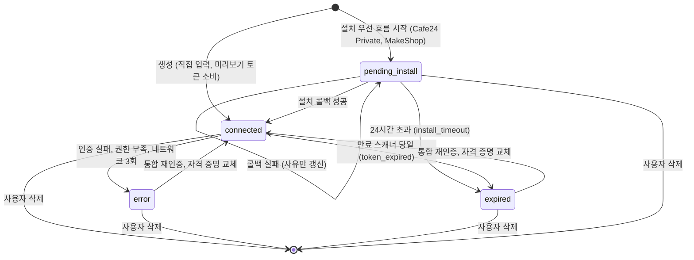
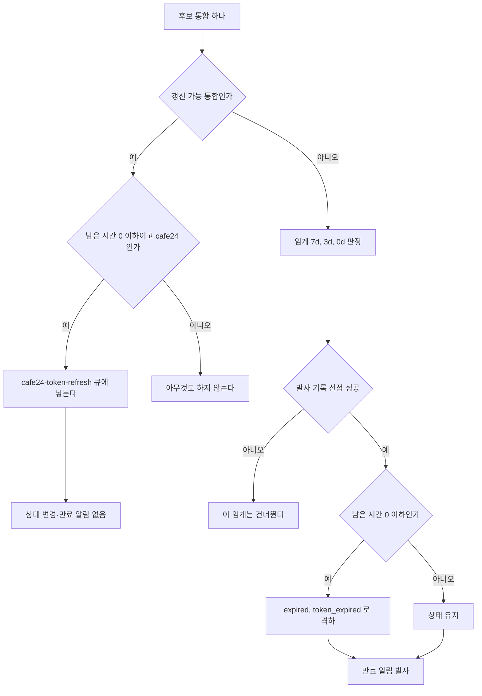

> 구현 상태: 부분 구현 · 원문: `spec/2-navigation/4-integration.md` (§2.2~§2.4 상태 표시·주의 필요, §6, §11, 관련 Rationale), `spec/data-flow/5-integration.md` (§1.4, §3), `spec/4-nodes/4-integration/_product-overview.md` (§2.3, INT-AU-07), `spec/2-navigation/_product-overview.md` (NAV-IN-05) · 용어: [용어 사전](../CLE-GLOSSARY.md)

## 개요

이 문서는 통합(Integration, `integration`)의 상태가 어떻게 바뀌고, 화면에 어떻게 보이며, 만료를 누가 언제 점검해 어떤 인앱 알림을 보내는지를 정한다. 통합 상태(`Integration.status`)는 연결됨(`connected`)·만료됨(`expired`)·오류(`error`)·설치 대기(`pending_install`) 네 값이고, 상태 사유(`status_reason`)가 그 이유를 기계가 읽을 수 있는 코드로 남긴다.

다루는 것:

- 상태 값과 상태 사유, 상태 전이 규칙
- 목록·상세·사이드바의 상태 표시와 «주의 필요» 판정(가상 필터 `expiring`·`attention`)
- 만료 스캐너(`integration-expiry-scanner`)의 네 작업
- 만료 알림(`integration_expired`)과 조치 필요 알림(`integration_action_required`)

범위 밖:

- 통합 화면 전체와 관리 API 는 [통합 관리](CLE-INT-MANAGE.md) 가 정한다.
- 토큰 갱신 경로(호출 직전 갱신, 401 뒤 갱신, 갱신 큐)와 OAuth 콜백 에러 매핑은 [OAuth 연결과 토큰 갱신](CLE-INT-OAUTH.md) 이 정한다.
- 컬럼 정의와 테이블 흐름은 [통합 데이터와 흐름](CLE-INT-DATA.md) 이 정한다.
- 인앱 알림의 공통 저장·채널 계산·중복 방지 헬퍼, 알림 설정 화면은 [알림](../CLE-OBS/CLE-OBS-NOTIFY.md) 이 정한다.

## 요구사항

- REQ-INTSTAT-001 WHEN 통합을 저장하면 THE SYSTEM SHALL 통합 상태를 `connected`·`expired`·`error`·`pending_install` 네 값 중 하나로 둔다. (원본: INT-ST-01)
- REQ-INTSTAT-002 WHEN 통합 상태가 `error`·`expired`·`pending_install` 로 바뀌면 THE SYSTEM SHALL 이유를 snake_case 상태 사유로 함께 기록한다. (원본: INT-ST-01)
- REQ-INTSTAT-003 IF 기록하려는 상태 사유가 허용 union 밖의 값이면 THE SYSTEM SHALL 그 값을 `unknown_error` 로 바꿔 저장한다. (원본: INT-ST-01)
- REQ-INTSTAT-004 WHEN 설치 대기 통합의 설치 콜백이 성공하면 THE SYSTEM SHALL 상태를 `connected` 로 바꾸고 설치 토큰을 보존한다.
- REQ-INTSTAT-005 WHEN 설치 대기 통합이 설치 토큰 발급 뒤 24시간 안에 연결되지 않으면 THE SYSTEM SHALL 상태를 `expired`, 사유를 `install_timeout` 으로 바꾸고 설치 토큰을 지운다.
- REQ-INTSTAT-006 IF 설치 대기 통합의 OAuth 콜백 처리가 실패하면 THE SYSTEM SHALL 상태와 설치 토큰을 보존하고 `status_reason` 과 `last_error` 만 갱신한다.
- REQ-INTSTAT-007 WHEN refresh token 자체가 무효(`invalid_grant`)라 토큰 갱신이 실패하면 THE SYSTEM SHALL 상태를 `error`, 사유를 `auth_failed` 로 바꾼다.
- REQ-INTSTAT-008 WHEN 노드 실행이나 토큰 갱신 중 transport 실패가 3회 연속 나면 THE SYSTEM SHALL 상태를 `error`, 사유를 `network` 로 바꾸고 연속 실패 카운터를 0 으로 되돌린다.
- REQ-INTSTAT-009 WHEN 노드 실행 중 403 과 서비스별 권한 부족 신호를 받으면 THE SYSTEM SHALL 상태를 `error`, 사유를 `insufficient_scope` 로 바꾼다. (원본: INT-AU-07) (부분 구현)
- REQ-INTSTAT-010 WHEN 통합 사유가 `insufficient_scope` 이면 THE SYSTEM SHALL 상세 화면에 누락 권한 범위 배지와 추가 권한 요청 동작을 보인다. (원본: INT-AU-07)
- REQ-INTSTAT-011 WHEN 외부 MCP 서버 호출이 인증 실패로 끝나면 THE SYSTEM SHALL 상태를 `error`, 사유를 `auth_failed` 로 바꾼다.
- REQ-INTSTAT-012 WHEN 통합 재인증이나 자격 증명 교체가 성공하면 THE SYSTEM SHALL `expired`·`error` 통합을 `connected` 로 되돌린다.
- REQ-INTSTAT-013 WHEN OAuth 가 아닌 통합에 통합 재인증을 요청하면 THE SYSTEM SHALL OAuth 왕복 없이 바로 `connected` 로 되돌린다.
- REQ-INTSTAT-014 IF 사용자가 삭제 동작을 하지 않았으면 THE SYSTEM SHALL 통합을 자동으로 삭제하지 않는다.
- REQ-INTSTAT-015 WHILE 통합이 `connected` 가 아닌 동안 THE SYSTEM SHALL 그 통합을 쓰는 통합 노드 실행을 `INTEGRATION_NOT_CONNECTED` 로 실패시킨다.
- REQ-INTSTAT-016 WHILE 통합이 `connected` 가 아닌 동안 THE SYSTEM SHALL AI 에이전트에 그 통합의 MCP 도구를 노출하지 않는다.
- REQ-INTSTAT-017 WHEN 사용자가 통합 목록이나 상세를 보면 THE SYSTEM SHALL 연결됨·만료 임박·만료됨·오류·설치 대기 상태를 아이콘과 문구로 표시한다. (원본: NAV-IN-05)
- REQ-INTSTAT-018 WHILE 자동 갱신 표시(`autoRefresh`)가 true 인 통합이 `connected` 인 동안 THE SYSTEM SHALL 만료가 가까워도 `Connected` 를 유지하고 `Auto-renews` 보조 라벨을 보인다.
- REQ-INTSTAT-019 WHEN 주의 필요를 판정하면 THE SYSTEM SHALL 만료됨·오류와, 자동 갱신 표시가 false 이며 7일 안에 만료되는 연결됨 통합을 합치고 설치 대기는 뺀다.
- REQ-INTSTAT-020 WHEN 주의 필요 통합이 있으면 THE SYSTEM SHALL 사이드바 통합 메뉴에 개수 배지를 보이고 목록 카드와 상세 헤더에 상태 배지를 보인다. (원본: INT-ST-03)
- REQ-INTSTAT-021 WHEN 사용자가 주의 필요 배너를 누르면 THE SYSTEM SHALL 합계가 2건 이상이면 주의 필요 필터로, 1건이면 그 통합 상세로 이동한다.
- REQ-INTSTAT-022 WHEN 만료 스캐너 주기가 되면 THE SYSTEM SHALL `connected-expiry`·`pending-install-ttl`·`usage-log-prune`·`cafe24-background-refresh` 네 작업을 서로 독립된 BullMQ 작업으로 실행한다. (원본: INT-ST-02)
- REQ-INTSTAT-023 IF 만료 스캐너 작업 하나가 실패하면 THE SYSTEM SHALL 그 작업만 최대 3회 다시 시도하고 다른 작업 실행을 막지 않는다.
- REQ-INTSTAT-024 WHEN refresh token 이 없는 통합이 토큰 만료 7일·3일·당일 임계에 닿으면 THE SYSTEM SHALL 같은 만료 시각의 임계마다 한 번 만료 알림을 보낸다. (원본: INT-ST-02, INT-ST-04)
- REQ-INTSTAT-025 WHEN refresh token 이 없는 통합의 토큰 만료 시각이 지나면 THE SYSTEM SHALL 상태를 `expired`, 사유를 `token_expired` 로 바꾼다. (원본: INT-ST-02)
- REQ-INTSTAT-026 IF 통합이 갱신 가능 통합(`isRefreshCapable`)이면 THE SYSTEM SHALL 토큰 만료 임계에서 상태를 낮추지 않고 만료 알림도 보내지 않는다.
- REQ-INTSTAT-027 WHEN 갱신 가능한 Cafe24 통합이 토큰 만료 당일 임계에 닿으면 THE SYSTEM SHALL `cafe24-token-refresh` 큐에 갱신 작업을 넣는다.
- REQ-INTSTAT-028 WHEN `cafe24-background-refresh` 작업이 6시간마다 돌면 THE SYSTEM SHALL 마지막 갱신이 7일 넘었거나 없는 연결됨 Cafe24 통합을 `cafe24-token-refresh` 큐에 넣는다. (원본: INT-ST-02)
- REQ-INTSTAT-029 WHEN `usage-log-prune` 작업이 돌면 THE SYSTEM SHALL 90일이 지난 활동 로그를 지운다. (원본: INT-ST-02)
- REQ-INTSTAT-030 WHEN 통합이 `error` 로 바뀌면 THE SYSTEM SHALL 전이가 일어난 그 자리에서 조치 필요 알림을 보낸다.
- REQ-INTSTAT-031 WHEN 만료 알림이나 조치 필요 알림을 보내면 THE SYSTEM SHALL 개인 통합은 통합 소유자에게, 조직 통합은 관리자 전원에게 보낸다.
- REQ-INTSTAT-032 WHEN 수신자가 통합 이메일 알림(`integrationExpiryEmail`)을 켰으면 THE SYSTEM SHALL 만료 알림과 조치 필요 알림을 인앱과 이메일로 함께 보낸다. (원본: INT-ST-04)
- REQ-INTSTAT-033 IF 설치 대기 통합이 `install_timeout` 으로 만료되면 THE SYSTEM SHALL 인앱 알림을 보내지 않는다.
- REQ-INTSTAT-034 WHEN 통합 재인증이 실패하면 THE SYSTEM SHALL `Reauthorization failed` 알림을 보낸다. (원본: INT-ST-04) (미구현)

## 상태 값과 상태 사유

| 상태 | 뜻 | 화면 라벨 |
| --- | --- | --- |
| `connected` | 연결됨. 노드와 AI 에이전트가 쓸 수 있다 | 연결됨(필터), `Connected`(배지) |
| `expired` | 만료됨 | 만료됨, `Expired` |
| `error` | 오류. 사유를 반드시 남긴다 | 오류, `Error` |
| `pending_install` | 설치 대기. Cafe24 Private 앱과 MakeShop ShopStore 설치 우선 흐름에서 설치가 끝나기 전 상태 | `Pending install`(배지), 필터 없음 |

설치 대기 통합은 노드와 AI 에이전트가 쓸 수 없다. 직결 노드는 `resolveIntegration` 의 상태 검사(`status !== 'connected'`)에서 `INTEGRATION_NOT_CONNECTED` 로 바로 실패하고([통합 노드 공통](../CLE-NODE-INT/CLE-NODE-INT-COMMON.md)), AI 에이전트는 내부 MCP 브리지가 연결되지 않은 통합의 도구를 노출하지 않아 호출도 에러 코드도 없다. 연결 테스트 endpoint 는 따로 `INTEGRATION_INCOMPLETE` 를 돌려준다([통합 관리](CLE-INT-MANAGE.md)). Cafe24 Private 은 사용자가 Cafe24 에서 «테스트 실행» 을 끝내야, MakeShop 은 상점에서 ShopStore 앱 설치가 끝나야 연결됨이 된다.

상태 사유 허용값은 코드 union `INTEGRATION_STATUS_REASONS`(`integration-status-reason.ts`) 한 곳이 기준이다. union 밖의 문자열은 `normalizeStatusReason` 이 `unknown_error` 로 바꾼다. 값은 모두 snake_case 이고 64자 이내다(`VARCHAR(64)`, V008).

| 상태 | 상태 사유 |
| --- | --- |
| `error` | `auth_failed`(401·403, 또는 토큰 갱신 `invalid_grant`), `insufficient_scope`(403 + 권한 부족 신호), `network`(transport 3회 연속 실패, `consecutive_network_failures` 카운터), `unknown_error`(분류 불가 대비값, 운영 알람 신호) |
| `expired` | `install_timeout`(설치 대기 24시간 초과, Cafe24 Private·MakeShop 공통), `token_expired`(refresh token 이 없는 통합의 만료 스캐너 당일 격하. 갱신 가능 통합은 격하하지 않는다) |
| `pending_install` | 콜백 실패 진단 단서(상태는 보존): `oauth_token_exchange_failed`, `oauth_state_invalid`, `oauth_state_mismatch`, `oauth_state_expired`, `oauth_provider_error`, `oauth_invalid_scope`(Cafe24 가 권한 범위를 거부, `last_error.details.requiresCafe24Approval` 동반. [Cafe24 별도 승인 scope](CLE-C24-SCOPES)), `oauth_preview_invalid`, `oauth_preview_expired`(union 예약값. 미리보기 토큰 소비 실패의 API 에러 코드와 같은 어휘) |
| `connected` | NULL |

- DB 저장값은 snake_case 이고, 같은 뜻의 API 에러 코드는 `OAUTH_*` UPPER_SNAKE_CASE 다. 대응은 [OAuth 연결과 토큰 갱신](CLE-INT-OAUTH.md) 의 에러 매핑 표에 있다.
- `resource_not_found` 는 행 자체가 사라진 경우라 DB 를 갱신할 수 없어 허용값에 없다.
- `token_expired` 는 이 컬럼 전용이다. JWT 만료 REST 에러 `TOKEN_EXPIRED`, WebSocket 이벤트 `auth.token_expired` 와 표기가 비슷하지만 이름공간이 다르다.
- MakeShop 설치 안내 화면이 매핑하는 `hmac_verification_failed` 는 union 에 없다. [미결 사항](#미결-사항) 참조.

응답 전용 값 `credentials_unreadable`: 자격 증명을 복호화할 수 없는 행(암호화 키 교체 등)은 DB 를 바꾸지 않는다. API 응답을 만들 때(`toPublic`)만 `status='error'`, `statusReason='credentials_unreadable'`, `credentialsStatus='needs_reauth'` 로 보인다. union 에 없고 DB 에 저장하는 값이 아니다.

## 상태 전이

| 전이 | 트리거 |
| --- | --- |
| `pending_install` → `connected` | 설치 흐름의 HMAC 검증과 OAuth 콜백이 성공했다. 설치 토큰은 보존한다(App URL 재호출의 식별 키. [OAuth 연결과 토큰 갱신](CLE-INT-OAUTH.md)) |
| `pending_install` → `expired` | 설치 토큰 발급 뒤 24시간 안에 콜백이 성공하지 않았다. `pending-install-ttl` 작업이 `status='expired'`, `status_reason='install_timeout'`, `install_token=NULL` 로 바꾼다. 다시 하려면 사용자가 새 통합을 등록한다. Cafe24 Private 은 통합 재인증 진입점이 없어 삭제 후 재등록을 권한다 |
| `pending_install` → `pending_install` | OAuth 콜백 처리 중 토큰 교환 실패, state 불일치·만료 등이 났다. 상태와 설치 토큰은 보존하고 `last_error` 와 사유(`oauth_token_exchange_failed`·`oauth_state_mismatch`·`oauth_state_expired`·`oauth_invalid_scope` 등)만 갱신한다. 사용자가 Cafe24 쪽 설정을 고치고 «테스트 실행» 을 다시 누르면 새 OAuth state 로 다시 시도한다 |
| `connected` → `error(auth_failed)` | 토큰 갱신에서 refresh token 자체가 무효(`invalid_grant`)다. 외부 MCP 서버 호출이 인증 실패다. Cafe24·MakeShop 클라이언트가 401 뒤 토큰 갱신과 1회 재시도에도 401 을 받았거나 403 을 받았다(`markAuthFailed`). 그 밖의 서비스(HTTP·Database·Email) 노드 실행 중 401·403 이 상태를 바꾸는지는 정의가 갈린다. [미결 사항](#미결-사항) 참조 |
| `connected` → `error(insufficient_scope)` | 노드 실행 중 403 과 서비스별 권한 부족 신호를 받았다. 현재 이 신호를 감지해 전이하는 실행 경로는 Cafe24(`cafe24-api.client.ts`, `cafe24-mcp-tool-provider.ts`)뿐이다. HTTP·Database·Email 핸들러로 넓히는 일은 미구현이다 |
| `connected` → `error(network)` | 노드 실행이나 토큰 갱신 중 transport 실패가 3회 연속 났다(`consecutive_network_failures`, V049). Cafe24·MakeShop 클라이언트의 `recordNetworkFailure` 가 판정한다 |
| `connected` → `expired(token_expired)` | refresh token 이 없는 통합의 토큰 만료 시각이 지나 만료 스캐너가 당일 임계에서 격하했다 |
| `expired`·`error` → `connected` | 통합 재인증 또는 자격 증명 교체가 성공했다(연결 테스트 통과). OAuth 가 아닌 통합은 통합 재인증이 OAuth 왕복 없이 바로 연결됨으로 되돌린다. Cafe24 Private 의 재인증 경로는 [OAuth 연결과 토큰 갱신](CLE-INT-OAUTH.md) 의 미결 사항이다. MakeShop 은 통합 재인증을 거절하므로 오류 뒤 복구 경로가 [미결 사항](#미결-사항) 이다. 내부 MCP 브리지가 `expired` 통합을 스스로 되살리는지도 [미결 사항](#미결-사항) 이다 |
| 모든 상태 → 삭제 | 사용자가 명시적으로 삭제했을 때만. 자동 삭제는 없다. 설치 대기 24시간 초과도 `expired` 로만 바꾼다 |

`error` 상태에서는 반드시 상태 사유를 기록한다. 토큰 갱신 실패는 `expired` 가 아니라 `error(auth_failed)` 로 바꾼다. 그래서 `expired` 가 되는 경로는 두 가지뿐이다. refresh token 이 없는 통합의 `token_expired` 와 설치 대기의 `install_timeout` 이다. Cafe24 는 refresh token 을 가지므로 Cafe24 의 `expired` 는 사실상 `install_timeout` 하나만 남는다.

## 상태 표시와 주의 필요

### 목록과 상세의 상태 표시

| 상태 | 목록 아이콘 | 상태 문구 |
| --- | --- | --- |
| 연결됨 | 🟢 | `Connected` |
| 만료 임박(7일 이내) | 🟡 | `Expires in Nd` |
| 만료됨 | 🟡 | `Expired` |
| 오류 | 🔴 | `Error: <reason>` |
| 설치 대기 | ⏳ | `Pending install`. 보조 문구 "Complete Cafe24 Test Run to activate" |

- `status_reason`·`last_error` 가 채워지면 카드 아래에 진단 단서를 보인다. 예: `Last error: OAUTH_TOKEN_EXCHANGE_FAILED — Failed to exchange authorization code`.
- 상세 헤더의 상태 배지는 현재 상태와 사유를 함께 보인다(예: `error(insufficient_scope)`). 만료가 가까우면 `Expires in Nd` 를 보인다.
- 자동 갱신 표시(`autoRefresh`, [통합 관리](CLE-INT-MANAGE.md) 의 `IntegrationDto`)가 true 인 통합은 만료가 가까워도 상태 문구를 `Connected` 로 두고 작은 보조 라벨 `Auto-renews` 를 붙인다. `Expires in Nd` 는 `autoRefresh=false` 통합에만 쓴다.
- 상세 헤더는 자동 갱신 통합이 `Connected` 일 때만 배지 옆에 회색 보조 라벨 `Auto-renews · next in <duration>` 을 보인다(예: `Auto-renews · next in 1h 24m`). `<duration>` 은 `token_expires_at - NOW()` 를 사람이 읽기 쉽게 쓴 값이다. 다른 상태이거나 `autoRefresh=false` 면 보이지 않는다.
- 상세 개요 탭의 토큰 만료 시각은 자동 갱신 통합이면 `in <duration> · auto-renews` 로 쓰고 절대 시각은 행에 마우스를 올릴 때 tooltip 으로 보인다. `autoRefresh=false` 면 절대 시각을 바로 쓴다.

### 주의 필요 판정

화면 필터에는 DB 상태에 없는 가상 값 두 개가 있다. 만료 임박(`expiring`)과 주의 필요(`attention`)다. 백엔드 쿼리 빌더가 목록 API 의 `status` 파라미터를 받아 합집합 WHERE 절로 바꾼다. DB 상태 enum 은 넓히지 않는다.

| 값 | 조건 |
| --- | --- |
| `expiring` | `status='connected' AND token_expires_at within 7d AND NOT autoRefresh` |
| `attention` | `status IN (expired, error)` OR (`status='connected' AND token_expires_at IS NOT NULL AND token_expires_at > NOW() AND token_expires_at <= NOW() + INTERVAL '7d' AND NOT autoRefresh`) |

- 설치 대기는 두 값 모두에서 뺀다. 사용자가 외부(Cafe24 개발자 센터, ShopStore)에서 흐름을 진행하는 정상 상태로 본다. 사유가 채워진 설치 대기도 같다.
- `install_timeout` 으로 `expired` 가 된 행은 주의 필요에 들어간다. 사용자가 삭제 후 재등록해야 하는 운영 신호다.
- 자동 갱신 통합은 만료 임박 분기에서 뺀다. Cafe24 access token(2시간)처럼 수명이 짧은 토큰의 거짓 양성을 막는다. 자동 갱신이 실패해 `error(auth_failed)`·`error(network)` 가 되면 `status IN (expired, error)` 분기로 그대로 들어가므로 사용자 신호가 사라지지 않는다.
- 목록 상태 칩은 `All` / `Attention` / `Connected` / `Expiring` / `Expired` / `Error` 이고 하나만 고른다. 설치 대기 칩은 두지 않는다.

### 주의 필요 배너

- 표시 조건: 위 `attention` 조건에 맞는 통합이 있을 때. 0건이면 보이지 않는다.
- 내용: 한 줄 요약(`"통합 N건이 주의가 필요해요"`)과 그 아래 분해 카운트(`"만료 X · 만료 임박 Y · 오류 Z"`). 0건인 카테고리는 빼고 보인다.
- 톤: 기본은 amber(경고)다. 오류가 1건 이상이면 왼쪽 점과 테두리를 red 로 강조한다. 문구는 같다.
- 클릭: 합계가 2건 이상이면 URL 을 `?status=attention` 으로 바꿔 같은 페이지에 합집합을 보인다. 1건이면 필터 단계를 건너뛰고 그 통합 상세(`/integrations/<id>`)로 바로 간다.
- URL 로 바로 들어와도(`/integrations?status=attention`) 같은 결과를 보이고 `Attention` 칩이 켜진다.
- 집계 범위는 현재 페이지다. 배너의 합계, 분해 카운트, 1건 이동 판정은 현재 페이지 행만 보고 계산하며 별도 카운트 API 를 부르지 않는다. 첫 페이지 30건이 모두 주의 필요면 그 뒤 행이 더 있어도 배너는 30건까지만 보인다. 배너를 눌러 필터로 들어가면 그다음은 페이지를 넘기며 전체를 본다. 전체 개수는 사이드바 배지가 맡는다.

### 사이드바 배지

- 사이드바 통합 메뉴에 `attention` 조건과 같은 술어로 센 개수를 보인다. 설치 대기는 빼고 자동 갱신 통합은 만료 임박 분기에서 뺀다.
- 목록 카드 모서리에도 배지를 보인다.

통합이 `expired`·`error` 가 되면 그 통합을 참조하는 노드에 에디터 경고가 붙고, 상세 화면 활동 탭에 «연결 안 됨» 안내가 붙는다. 두 표시는 [통합 관리](CLE-INT-MANAGE.md) 가 정한다.

## 만료 스캐너

만료 스캐너는 `integration-expiry-scanner` 큐 위의 네 독립 BullMQ 작업이다. 작업마다 재시도(`attempts: 3`, 60초 지수 backoff)와 큐 메트릭을 따로 가지므로 한 작업의 실패가 다른 작업을 막지 않는다. `process(job)` 는 `job.name` 으로 나누기만 하고 에러를 그대로 던진다. 3회를 넘긴 실패는 큐의 failed 목록에 30일 남아 알람이 가져갈 수 있다. 각 작업은 대상을 골라 처리하거나 갱신 큐에 넣기만 하고, 실제 토큰 갱신은 갱신 큐의 워커가 한다([OAuth 연결과 토큰 갱신](CLE-INT-OAUTH.md)). 옛 단일 `integration-expiry-daily` 스케줄러는 `onModuleInit` 에서 `removeJobScheduler` 로 지운다(멱등).

| 작업 | 스케줄러 ID | 주기 | 대상 | 동작 |
| --- | --- | --- | --- | --- |
| `connected-expiry` | `connected-expiry-daily` | 매일 `0 0 * * *` UTC | `status NOT IN (expired, error, pending_install) AND token_expires_at IS NOT NULL AND token_expires_at <= now+7d` | 아래 흐름 |
| `pending-install-ttl` | `pending-install-ttl-daily` | 매일 `0 0 * * *` UTC | `status='pending_install' AND COALESCE(install_token_issued_at, created_at) < now-24h`. 서비스 유형 조건이 없다(Cafe24 Private·MakeShop 공통) | `status='expired', status_reason='install_timeout', install_token=NULL` 로 한 번의 bulk UPDATE. 알림은 보내지 않는다 |
| `usage-log-prune` | `usage-log-prune-daily` | 매일 `0 0 * * *` UTC | `integration_usage_log.at < now-90d` | 행 삭제(보존 정책) |
| `cafe24-background-refresh` | `cafe24-background-refresh-daily` (이름만 옛것, 실제 6시간) | 6시간 `0 */6 * * *` UTC | `status='connected' AND service_type='cafe24' AND (last_rotated_at < now-7d OR last_rotated_at IS NULL)` | `cafe24-token-refresh` 큐에 `jobId = integrationId` 로 넣는다(source `background`). 14일 동안 쓰지 않은 Cafe24 통합의 refresh token 도 갱신한다 |

`pending-install-ttl` 의 격리 수준은 PostgreSQL 기본 READ COMMITTED 와 UPDATE … WHERE 의 행 단위 쓰기 잠금으로 충분하다. WHERE 절이 행 단위로 맞고 `pending_install → expired` 전이는 멱등이다(이미 만료된 행은 상태 조건에서 빠진다). cron 과 수동 호출이 동시에 돌아 한 주기의 행을 나눠 처리해도 최종 상태는 같다. SERIALIZABLE 이나 advisory lock 은 필요 없다.

### `connected-expiry` 흐름

갱신 가능 통합(`isRefreshCapable`)은 `service_type ∈ {cafe24, makeshop}` 이면서 `credentials.refresh_token` 이 있는 통합이다. 이 판정은 화면용 자동 갱신 표시(`autoRefresh`)와 대상이 다르다. Google 은 자동 갱신 표시는 true 지만 갱신 가능 통합이 아니다. [미결 사항](#미결-사항) 참조.

- 갱신 가능 통합은 상태를 낮추지 않고 만료 알림도, 발사 기록 선점도 하지 않는다. Cafe24 는 남은 시간이 0 이하면 `cafe24-token-refresh` 큐에 넣는다(`jobId` 중복 제거, `cafe24-background-refresh` 와 같은 경로의 안전망). MakeShop 은 큐에 넣지 않고 호출 직전 갱신과 401 뒤 갱신에 맡긴다. 갱신이 실패하면 갱신 워커(`Cafe24TokenRefreshProcessor`)나 호출 경로가 `error(auth_failed)`·`error(network)` 로 바꾸고, 그때 조치 필요 알림이 나간다. 이 작업은 상태를 바꾸지 않는다.
- refresh token 이 없는 통합은 임계(7d·3d·0d)마다 `integration_expiry_dispatch` 에 `INSERT … ON CONFLICT DO NOTHING` 으로 선점하고, 선점에 성공한 경우만 알림을 보낸다. 당일(0d)이면 `status='expired', status_reason='token_expired'` 로 바꾼다.
- MakeShop 에는 `cafe24-background-refresh` 같은 배경 갱신 작업이 없다. refresh token 수명이 30~90일로 충분히 길어 호출 직전 갱신과 401 뒤 갱신으로 덮인다([MakeShop 노드](../CLE-NODE-INT/CLE-NODE-MAKESHOP.md)). 그래도 갱신 가능 통합으로 취급하므로 access token 만 만료된 MakeShop 통합이 `expired` 로 잘못 바뀌거나 만료 알림을 받지 않는다.
- 외부 MCP 서버 통합은 refresh token 흐름이 아니라 `token_expires_at` 이 항상 NULL 이므로 이 작업 대상이 아니다. 인증 실패는 노드 실행 시점에 `error(auth_failed)` 로 바뀌고 사용자는 자격 증명 교체로 토큰을 바꾼다([MCP 클라이언트](CLE-INT-MCP.md)).

## 알림

두 인앱 알림 종류를 쓴다. 나누는 기준은 «사용자가 기다리면 되는가, 지금 손봐야 하는가» 다. 인앱 알림 저장, 채널 계산 헬퍼, 중복 방지 헬퍼는 [알림](../CLE-OBS/CLE-OBS-NOTIFY.md) 이 정한다.

### 만료 알림 (`integration_expired`)

| 상황 | 제목 | 메시지 | 수신자 |
| --- | --- | --- | --- |
| 7일 전 | `Integration expiring soon` | `"<name>" will expire on <date>.` | 개인 통합: 통합 소유자 / 조직 통합: 관리자 전원 |
| 3일 전 | `Integration expiring in 3 days` | 같음 | 같음 |
| 당일 | `Integration expired` | `"<name>" has expired. Reauthorize to continue using it.` | 같음 |
| 통합 재인증 실패 (미구현) | `Reauthorization failed` | `Failed to reauthorize "<name>".` | 같음 |

- 발사 조건: refresh token 이 없는 통합의 토큰 만료(`status_reason='token_expired'` 경로)에서 위 7일·3일·당일 임계에만 보낸다. 갱신 가능 통합에는 보내지 않는다.
- 중복 방지: `integration_expiry_dispatch` 의 `UNIQUE (integration_id, threshold, token_expires_at)`(V009)로 임계마다 같은 만료 시각에 한 번만 보낸다. 통합 재인증으로 `token_expires_at` 이 바뀌면 새 만료 시각의 임계를 다시 보낸다. 발사 전에 `INSERT … ON CONFLICT DO NOTHING` 으로 선점하고 충돌하면 그 임계를 건너뛴다.
- 통합 재인증 실패 행은 요구사항(INT-ST-04)과 표에는 있지만 발사하는 코드가 없다. 현재 구현은 7일·3일·당일 세 제목만 보낸다.

### 조치 필요 알림 (`integration_action_required`)

| 상태 사유 | 제목 | 메시지 | 수신자 |
| --- | --- | --- | --- |
| `auth_failed` | `Integration disconnected` | `"<name>" needs reauthorization — Cafe24 rejected the access token. Reconnect to resume.` | 개인 통합: 통합 소유자 / 조직 통합: 관리자 전원 |
| `insufficient_scope` | `Integration missing permissions` | `"<name>" is missing required scopes — open Settings → Integrations and re-grant access.` | 같음 |
| `network` | `Integration network failure` | `"<name>" failed 3 consecutive network calls. Check Cafe24 status or retry later.` | 같음 |

- 발사 시점: 오류 전이가 일어나는 그 자리에서 보낸다. Cafe24·MakeShop 클라이언트의 `markAuthFailed`(`auth_failed`·`insufficient_scope`)와 `recordNetworkFailure`(3회 누적 뒤 `network`) 안에서 `IntegrationActionRequiredNotifier` 를 부른다. 매일 도는 스캐너가 보내는 것이 아니다. 메시지에 «Cafe24» 가 고정된 문제는 [미결 사항](#미결-사항) 에 있다.
- 중복 방지: 정의가 갈린다. [미결 사항](#미결-사항) 참조. 중복 방지 헬퍼 `hasRecentByResource` 는 알림 행이 있는지만 보므로 사용자가 닫은(`dismissed_at` 이 채워진) 알림도 센다. 닫기는 표시 결정일 뿐 다시 보내는 빈도와 무관하다([알림](../CLE-OBS/CLE-OBS-NOTIFY.md)).

### 채널과 이메일

- 수신자의 `notification_preferences.integrationExpiryEmail` 이 켜져 있으면 `Notification.channel='both'` 로, 아니면 `'in_app'` 으로 만든다. 조치 필요 알림도 같은 토글을 쓴다(전용 토글은 없다).
- 이 토글은 opt-in 이고 기본값은 꺼짐이다. 저장 위치는 `User.notification_preferences` JSONB 이고 설정 화면은 [알림](../CLE-OBS/CLE-OBS-NOTIFY.md) 이 정한다.
- `channel='both'` 인 알림은 `NotificationsService.dispatchEmails`(`MailService` 주입)가 이메일을 best-effort 로 보낸다.

### 알림을 보내지 않는 경우

설치 대기가 `install_timeout` 으로 만료될 때는 인앱 알림을 보내지 않는다. 사이드바 카운트, 목록 카드 배지, 노드 에디터 경고로만 알린다. 설치 대기의 다른 콜백 실패(`oauth_token_exchange_failed`·`oauth_state_mismatch`·`oauth_state_expired`)도 알림을 보내지 않는다.

## 미결 사항

- **노드 실행 중 401·403 이 통합 상태를 바꾸는 범위**: 통합 화면 정의는 노드 실행 중 401 을 받으면 Cafe24 는 토큰 갱신과 1회 재시도 뒤에도 401 일 때, 그 밖의 서비스는 즉시 `error(auth_failed)` 로 바꾸고, 403 은 즉시 바꾼다고 적는다. 같은 정의의 노드 실행 연동 절은 핸들러 실패 때 `Integration.status`·`last_error` 가 함께 갱신된다고 적는다. 데이터 흐름 정의는 `logUsage` 가 `last_error` 만 갱신하고 상태는 외부 MCP 서버 `AUTH_FAILED` 일 때만 바꾸며, Cafe24·MakeShop 은 각 클라이언트의 `markAuthFailed` 가 바꾼다고 적는다. [HTTP Request 노드](../CLE-NODE-INT/CLE-NODE-HTTP.md)·[Database Query 노드](../CLE-NODE-INT/CLE-NODE-DBQUERY.md)·[Send Email 노드](../CLE-NODE-INT/CLE-NODE-EMAIL.md) 는 상태 전이를 언급하지 않는다. 현재 구현(`integrations.service.ts`)은 데이터 흐름 정의와 같다. 화면 정의대로 구현하면 HTTP·Database·SMTP 노드의 401 한 번으로 통합이 오류가 되어 이후 모든 실행이 `INTEGRATION_NOT_CONNECTED` 로 막힌다. 일반 서비스의 401·403 격하를 제품 요구로 둘지 결정이 필요하다.
- **`expired` 가 된 Cafe24 통합의 자동 복구**: [Cafe24 노드](../CLE-NODE-INT/CLE-NODE-CAFE24.md) 는 AI 에이전트 도구 구성(`buildTools`)이 `expired` 이고 refresh token 이 있는 행에 큐 갱신을 걸면 워커가 갱신 뒤 `connected` 로 되돌린다고 적는다. 데이터 흐름 정의의 상태도도 «내부 MCP 브리지의 refresh token 자가 회복» 으로 `expired → connected` 를 그린다. 그런데 같은 정의의 주석은 갱신 워커가 source 와 상관없이 `status !== 'connected'` 행을 건너뛴다고 적는다. 현재 구현(`cafe24-token-refresh.processor.ts` 의 상태 가드)은 주석과 같다(MakeShop 도 `MakeshopMcpToolProvider` 가 `makeshop-token-refresh` 큐로 같은 자가 회복을 건다). 자동 복구를 없앨지, 워커 가드에 예외를 둘지 결정이 필요하다.
- **MakeShop 통합이 오류가 된 뒤의 복구 경로**: [MakeShop 노드](../CLE-NODE-INT/CLE-NODE-MAKESHOP.md) 는 `error(auth_failed)` 로 바뀐 통합과 오래 쓰지 않은 통합을 사용자가 통합 재인증으로 되돌린다고 적는다. [OAuth 연결과 토큰 갱신](CLE-INT-OAUTH.md) 의 begin 규칙은 MakeShop 의 `reauthorize`·`request_scopes` 를 `MAKESHOP_USE_SHOPSTORE_INSTALL` 로 거절한다. 외부 마켓(ShopStore 앱 설치)이 흐름을 시작하기 때문이고, 현재 구현도 거절한다. 그런데 [통합 관리](CLE-INT-MANAGE.md) 의 통합 재인증 비활성 조건은 설치 대기, `install_timeout`, Cafe24 Private 만 나열하고 추가 권한 요청 분기도 MakeShop 을 다루지 않아, 연결됨·오류 MakeShop 통합에서 두 버튼이 활성이다. ShopStore 재설치로도 복구되는지 불분명하다. App URL 은 설치 대기가 아닌 행을 OAuth 없이 프런트엔드 상세로 302 하기 때문이다. 오류 뒤 복구를 삭제 후 재등록으로 정할지, 재설치가 기존 행을 되살리게 할지, 버튼을 비활성할지 결정이 필요하다.
- **조치 필요 알림 중복 방지 규칙**: 통합 화면 정의는 `(integration_id, status_reason)` 으로 유니크를 판정해 같은 사유는 통합마다 최대 한 번 보내고, 사용자가 다시 연결해 `connected` 가 되면 키를 되돌린다고 적는다. 같은 절의 주석, 데이터 흐름 정의(같은 통합·사유 24시간), [알림](../CLE-OBS/CLE-OBS-NOTIFY.md) 정의(`(workspace, type, resourceId, title)` 24시간)는 `hasRecentByResource` 의 24시간 창으로 적는다. 현재 구현(`integration-action-required-notifier.service.ts`, `withinMs` 24시간)은 24시간 창이다. 두 규칙은 «24시간 뒤 같은 사유 재발» 과 «24시간 안에 회복 후 재발» 에서 발사 여부가 반대다. 장애가 24시간 넘게 이어질 때 다시 알릴지 결정이 필요하다.
- **Google 의 자동 갱신 표시와 스캐너 판정**: Google 은 서비스 레지스트리에서 `supportsTokenAutoRefresh=true` 라 화면에 `Auto-renews` 로 보이고 만료 임박·주의 필요에서 빠진다. 그런데 갱신 가능 통합 판정에는 없어 만료 스캐너가 7일·3일 알림을 보내고 당일에 `expired` 로 바꾼다. 갱신 경로도 구현돼 있지 않다([OAuth 연결과 토큰 갱신](CLE-INT-OAUTH.md)). 요구사항 INT-SV-06([통합 관리](CLE-INT-MANAGE.md))은 «토큰 자동 갱신 지원» 이라 적는다. 화면 신호와 스캐너 동작이 반대다. Google 을 자동 갱신 표시에서 뺄지, 갱신 경로를 만들고 갱신 가능 통합에 넣을지 결정이 필요하다.
- **`hmac_verification_failed` 상태 사유**: MakeShop 설치 안내 화면은 알려진 사유 다섯 개(`oauth_token_exchange_failed`·`oauth_state_mismatch`·`oauth_state_expired`·`oauth_invalid_scope`·`hmac_verification_failed`)를 i18n 문구로 매핑한다([OAuth 연결과 토큰 갱신](CLE-INT-OAUTH.md)). `hmac_verification_failed` 는 union 에 없어 저장되면 `unknown_error` 로 바뀐다. 프런트엔드 훅만 이 값을 매핑한다. union 에 더할지 프런트엔드에서 뺄지 결정이 필요하다.
- **조치 필요 알림 문구의 Cafe24 고정**: 표의 메시지에는 «Cafe24» 가 들어 있다. 데이터 흐름 정의는 MakeShop 클라이언트도 같은 알림 경로를 쓴다고 적고, 현재 구현도 MakeShop 실패에 같은 문구를 보낸다. 문구를 서비스 중립으로 바꿀지, 서비스 유형별 문구를 둘지 결정이 필요하다.

## 구현 위치

- `codebase/backend/src/modules/integrations/integration-expiry-scanner.service.ts` (만료 스캐너)
- `codebase/backend/src/modules/integrations/integration-action-required-notifier.service.ts` (조치 필요 알림)
- `codebase/backend/src/modules/integrations/integration-status-reason.ts` (상태 사유 union)
- `codebase/backend/src/nodes/integration/cafe24/`, `codebase/backend/src/nodes/integration/makeshop/` (`markAuthFailed`·`recordNetworkFailure`)
- `codebase/frontend/src/app/(main)/w/[slug]/integrations/page.tsx` (목록·배너·칩)
- `codebase/frontend/src/lib/integrations/*.ts`

## Rationale

### 주의 필요를 가상 필터 값 하나로 노출한다

«주의 필요» 배너를 눌렀을 때 정의(만료 임박·만료됨·오류로 전환)와 구현이 어긋나, 배너에 보인 항목을 필터 페이지에서 찾지 못한다는 보고가 있었다. 원인은 둘이었다. 상태 칩이 하나만 고르는 모델이라 세 상태를 한 번에 켤 표현이 없었고, 구현이 차선책으로 `?status=expiring` 하나만 보냈다.

- **`Attention` 칩을 새로 둔다.** 만료됨·만료 임박·오류의 합집합을 값 하나로 더해 단일 선택 모델을 유지하면서 합집합을 준다. 다중 선택 칩이나 `?status=expiring&status=expired` 같은 다중 값 쿼리도 검토했다. URL 공유가 불편해지고, 다른 단일 필터(`scope`, `q`)와 일관성이 깨지며, «사용자가 어떤 카테고리를 봤는지» 라는 분석 신호가 흐려져 기각했다.
- **가상 필터 값 규약.** DB 상태 enum 은 네 값으로 두고 API 필터의 `status` 값 공간만 `expiring`·`attention` 두 가상 값으로 넓힌다. 가상 값 이름은 DB enum 과 겹치지 않아 칩 라벨의 단어가 그대로 URL 파라미터가 된다. 영속 상태와 화면 술어를 섞으면 상태 기계가 비대해지므로 enum 을 넓히지 않는다.
- **배너 톤과 이동.** 분해 카운트를 한 줄에 보여 어떤 카테고리가 몇 건인지 한눈에 보이게 한다. 오류가 있으면 점 색을 red 로 올려 문구를 읽기 전에 알아보게 한다. 합계가 1건이면 필터 단계가 쓸모없으므로 그 통합 상세로 바로 간다. 2건 이상은 필터가 필요한 일반 경우라 분기가 분명히 갈린다.

### 자동 갱신 통합을 주의 필요에서 뺀다

주의 필요와 만료 임박 술어는 원래 `token_expires_at <= NOW() + INTERVAL '7d'` 하나만 봤다. Cafe24 access token 수명은 2시간이라 이 술어가 늘 참이 되어, 자동 갱신이 정상인 통합도 사이드바 카운트와 배너와 `Expiring` 칩에 계속 들어갔다. 상세 헤더도 늘 «Expires today» 노란 톤이라 사용자가 갱신 실패로 잘못 읽었다. 백엔드 자동 갱신(`cafe24-token-refresh` 큐 워커, 6시간 주기 `cafe24-background-refresh`, `Cafe24ApiClient.ensureFreshToken` 호출 직전 갱신)은 모두 정상이라 사용자 조치가 필요 없었는데도 거짓 양성이었다.

그래서 응답에 파생 값 `autoRefresh` 를 두고 모든 주의 필요 술어(배너, 사이드바 카운트, `Expiring` 칩, `?status=expiring`·`?status=attention`)에서 `autoRefresh=true` 행을 만료 임박 분기에서 뺀다. 상세 헤더와 개요 탭은 자동 갱신 사실을 보조 라벨과 친화 표기로 알린다.

- **파생 값인 이유**: `autoRefresh` 는 DB 컬럼이 아니라 서비스 레지스트리의 `supportsTokenAutoRefresh` 에서 응답마다 계산한다(현재 `cafe24`·`google`·`makeshop` 이 true). 서비스 추가와 정책 변경이 잦은 영역이라 영속화하지 않고 코드 한 곳에서 정한다. 술어 SQL 에 `service_type IN ('cafe24', 'google')` 같은 하드코딩을 두는 안도 검토했다. 새 OAuth 제공자를 더할 때마다 SQL 을 고쳐야 하고, «왜 이 서비스를 빼는가» 라는 의도가 SQL 에 묻혀 기각했다.
- **실패 신호는 남는다**: 자동 갱신이 실패해 `error(auth_failed)`·`error(network)` 가 되면 상태가 `error` 라 이 술어와 상관없이 주의 필요에 들어간다. 조치 필요 알림도 따로 나간다.
- **통합 재인증 버튼은 막지 않는다**: 자동 갱신 통합에서도 개요의 통합 재인증은 활성으로 두고 hover 안내만 붙인다. 권한 범위 정리나 자격 증명 재발급처럼 사용자가 의도해 누를 가치가 있다. 설치 대기와 `install_timeout` 의 비활성(외부 흐름 진행 중, 진입점 없음)과는 이유가 다르다. 주의 필요 술어에서는 빼되 사용자의 명시 동작은 막지 않는다.
- **기존 결정과의 관계**: «DB enum 은 넓히지 않고 영속 상태와 화면 술어를 나눈다» 는 원칙은 그대로다. `autoRefresh` 는 영속 상태가 아닌 파생 값이라 같은 원칙 안에서 술어를 합성한다. 설치 대기를 빼는 것도 같은 생각이다.

### 설치 대기는 필터 칩에 넣지 않는다

상태 칩은 `All`·`Attention`·`Connected`·`Expiring`·`Expired`·`Error` 다. 설치 대기는 사용자가 외부 흐름(Cafe24 개발자 센터, ShopStore)을 진행 중인 정상 전환 상태로 보고 칩에 넣지 않는다. 따로 거를 수요가 생기면 후속 작업으로 검토한다.

### 설치 대기의 콜백 실패는 상태를 보존한다

설치 대기 통합이 콜백 처리 중 토큰 교환 실패 등으로 실패하면 자연스러운 선택은 `error(auth_failed)` 다. 그러나 Cafe24 Private 앱은 통합 재인증을 할 수 없다. OAuth 재시작의 정식 진입점은 Cafe24 개발자 센터의 «테스트 실행» 뿐이고, 그 진입점은 우리가 발급한 설치 토큰을 경로에 그대로 쓴다. 상태를 `error` 로 바꾸면 화면이 효과 없는 «통합 재인증» 을 권하고, 사용자가 Cafe24 쪽 설정을 고치고 다시 «테스트 실행» 을 누르는 외부 흐름을 «오류» 로 보여 단계를 잘못 알게 한다. 그래서 콜백 실패는 사유와 `last_error` 만 채우고 상태는 설치 대기로 둔다.

사유 저장값은 콜백 에러 코드를 snake_case 로 쓴다. DB 컬럼 표기(`auth_failed`, `token_expired` 등)가 모두 snake_case 라서다. API 응답과 콜백 HTML 의 에러 코드는 HTTP 관례대로 `OAUTH_*`·`CAFE24_*` UPPER_SNAKE_CASE 로 둔다.

`last_error.code` 와 `status_reason` 이 같은 값을 중복으로 담는 이유는 `last_error` 가 JSONB 라 보존 정책(예: GDPR)에 따라 지워질 수 있어서다. `status_reason` 은 가벼운 문자열 컬럼으로 «왜 이 상태인가» 의 핵심 신호를 남긴다. 분류 코드만 담아 민감 정보가 없으므로 평문으로 둔다.

### 설치 대기는 24시간 뒤 만료된다

예전 정의는 설치 시간 초과 때 행을 삭제했는데, `expired`(`install_timeout`)로 바꾸는 쪽으로 번복했다. 데이터 분석과 감사에는 보존이 낫고, 사용자가 만료된 행을 보고 «왜 설치가 안 됐는지» 진단할 단서가 남아야 한다. 자동 삭제는 더 이상 없고 사용자 삭제만 삭제 경로다.

Cafe24 개발자 센터 앱 등록부터 «테스트 실행» 까지의 사용자 작업을 최대 하루로 본다. 더 길면 오래된 설치 대기 행이 쌓여 설치 토큰 조회 성능과 주의 필요 카운트에 잡음이 된다. 더 짧으면 점심, 회의, 휴일로 작업이 나뉘는 정상 흐름이 끊긴다.

만료 기준은 `created_at` 이 아니라 설치 토큰 발급 시각(`install_token_issued_at`, V044)이다. 같은 상점으로 `oauth/begin` 을 다시 부르면 기존 행을 재사용하며 설치 토큰만 바꾸는데, 행 생성 시각을 기준으로 하면 새 토큰이 발급되자마자 24시간이 이미 끝나 있을 수 있다. 연결 성공 뒤에도 설치 토큰과 발급 시각은 보존된다. 스캐너는 설치 대기 행만 보므로 연결 뒤의 값이 잘못된 만료 처리에 영향을 주지 않는다. NULL 은 만료 경로에서만 생긴다. V044 이전 행은 발급 시각이 NULL 이라 스캐너가 `created_at` 으로 대신 판정한다.

### `oauth_token_exchange_failed` 는 로그인 도메인의 `token_exchange_failed` 와 다른 신호다

소셜 로그인 흐름의 URL 파라미터 `error=token_exchange_failed` 와 통합 콜백의 `status_reason='oauth_token_exchange_failed'` 는 도메인이 다르다. 앞쪽은 사용자 인증, 뒤쪽은 통합 자격 증명이다. grep 과 색인에서 도메인이 바로 드러나도록 `oauth_` prefix 를 일부러 붙였다. 이름을 합치지 않는다.

### 토큰 갱신 실패는 `error(auth_failed)` 로 통일한다

예전 정의는 «connected → expired (refresh fail)» 로 적었지만 구현은 `error(auth_failed)` 로 바꿨다. 화면 분기, 재인증 안내 문구, 알림 발사 정책이 어긋났다. `error(auth_failed)` 로 정하고 `expired (refresh_failed)` 분기는 없앴다. 이 변경은 refresh token 을 가진 서비스의 갱신 실패 경로에만 영향을 주고, `connected-expiry` 스캐너의 토큰 만료 처리는 그대로다.

- 화면이 통합 재인증을 권하기에 `error` 가 자연스럽다. `expired` 는 «자동 재발급을 해 보고 만료» 라는 뜻이 강해 사용자 재인증이 필요한 refresh token 만료와 어긋난다.
- refresh token 자체의 만료(사용자 조치 필요)와 access token 만료(갱신으로 복구 가능)를 뜻으로 구분해 둔다. 앞쪽은 `error(auth_failed)`, 뒤쪽은 refresh token 이 없는 일반 OAuth 서비스의 `expired` 다.
- transport 3회 실패 `error(network)` 와 같은 `error(*)` 영역에서 일관되게 분류된다.

데이터 모델은 바뀌지 않고 사유 값 정의만 바뀌었다. `expired` 사유에서 `refresh_failed` 를 빼고 `error` 사유에 `auth_failed`·`insufficient_scope`·`network` 를 두며, `token_expired` 는 refresh token 이 없는 서비스의 `expired` 용으로 남긴다. 알림은 수동성과 능동성으로 나눈다. `expired` 중 `token_expired` 경로에만 만료 알림을 보내고, `error(*)` 전이에는 조치 필요 알림을 보낸다. `install_timeout` 도 `expired` 전이지만 아래 결정으로 알림을 보내지 않는다.

### 갱신 가능 통합 판정에 MakeShop 을 넣는다

만료 스캐너의 갱신 가능 판정(`isRefreshCapable`)은 Cafe24 뿐 아니라 MakeShop 도 포함한다(`service_type ∈ {cafe24, makeshop}` 이면서 refresh token 보유).

- **거짓 격하를 막는다**: 두 서비스 모두 refresh token 을 가지므로, 수명이 짧은 access token 만 만료된 정상 통합을 당일 임계에서 `expired` 로 바꾸면 자동 갱신으로 멀쩡히 도는 통합이 불필요한 재연결 요청을 받는다.
- **MakeShop 은 배경 큐가 필요 없다**: Cafe24 는 당일 임계에서 갱신 큐로 안전망 갱신을 걸지만, MakeShop 은 호출 직전 갱신과 401 뒤 갱신으로 충분하다(refresh token 수명 30~90일).
- **기각한 안**: MakeShop 을 Cafe24 와 다르게 취급해 `expired` 격하를 유지하는 안은 정상 통합에 거짓 만료 알림과 재연결 요청을 부르므로 기각했다.

한때 데이터 흐름 정의에 «스캐너의 갱신 가능 판정이 `isCafe24RefreshCapable` 로 Cafe24 한정이라 쓰지 않는 MakeShop 행이 당일에 잘못 격하된다» 와 «`token_expired` 사유 미구현» 이라는 구현 갭이 적혀 있었다. 2026-06-10 수정(V-01·V-07)으로 둘 다 해소됐다.

### `install_timeout` 에는 알림을 보내지 않는다

`expirePendingInstalls()`(`integration-expiry-scanner.service.ts`)는 bulk UPDATE 만 하고 알림 생성 호출이 없다. `pending_install → expired (install_timeout)` 전이에는 만료 알림을 보내지 않는다.

- 설치 대기는 사용자가 외부 흐름(Cafe24 개발자 센터 «테스트 실행»)을 직접 진행하는 상태다. 24시간 안에 끝내지 못했다면 본인이 시작점과 진행 상황을 알 가능성이 크다.
- 상세 상태 배지와 목록 주의 필요 배너로 충분히 알린다. 따로 알림을 보내면 잡음이 된다.
- 설치 대기의 다른 콜백 실패(`oauth_token_exchange_failed`, `oauth_state_mismatch`, `oauth_state_expired`)도 알림을 보내지 않는다. `install_timeout` 만 보내면 일관성이 깨진다.
- 설치 토큰을 조용히 지우는 결정과 같은 흐름이다. 외부 흐름이 끝나지 않은 것이 분명한 상태 변화는 알림 가치가 낮다.

이 결정은 만료 알림 미발사만 다룬다. 화면 배지나, 설치 토큰이 NULL 이 되어 다음 설치 시도가 404 가 되는 동작은 영향이 없다.

### `cafe24-background-refresh` 는 7일 기준과 6시간 주기다

Cafe24 refresh token 은 14일 유효하고 갱신할 때마다 새 refresh token 을 준다. 주 1회 이상 쓰는 통합은 매번 호출 직전 갱신이 일어나 사실상 영구히 유효하다. 그러나 14일 넘게 쓰지 않은 통합은 refresh token 까지 만료되어 사용자가 다시 인증해야 한다. 그래서 6시간마다 마지막 갱신이 7일 넘은 연결됨 Cafe24 통합을 갱신한다.

- 7일 기준은 refresh token 14일의 50% 여유다. 6시간 주기라 한 번 빠져도 여유에 거의 영향이 없다.
- 옛 정책(10일 기준 + 24시간 주기)은 여유가 3일이었다. 한 번 빠지면 여유가 바로 2일로 줄어, BullMQ 인프라 장애(Redis AUTH 누락 등)가 24시간 쌓이면 위험했다.
- 더 짧게(예: 1시간) 잡으면 쓰지 않는 통합 전체를 읽는 쿼리 비용이 쌓이고, 기준 자체가 이미 조절 역할을 해 과하다.
- 더 길게(예: 14일 기준) 잡으면 한 번만 빠져도 refresh token 이 만료된다.

스케줄러 ID `cafe24-background-refresh-daily` 는 옛 이름을 그대로 쓴다. BullMQ `upsertJobScheduler` 는 같은 ID 의 기존 항목만 멱등으로 갱신하므로 ID 를 바꾸면 옛 Redis 항목이 고아로 남아 매일과 6시간 주기가 함께 도는 회귀 위험이 있다. 이름은 옛것이고 실제 주기는 6시간이다.

새 Cafe24 통합은 `integrations.service.create()` 가 `lastRotatedAt = new Date()` 로 채운다. 옛 행이나 다른 진입점에서 NULL 로 저장된 경우를 대비해 쿼리 조건은 `Or(LessThan(cutoff), IsNull())` 로 이중 방어한다. 이 작업은 큐에 넣기만 하고 실제 갱신은 `cafe24-token-refresh` 큐 워커가 한다. 호출 직전 갱신과 같은 `jobId` 중복 제거로 충돌 없이 함께 쓴다. 다른 세 작업은 알림, 24시간 기한, 90일 보존이라는 성격이 매일 주기와 맞아 매일 00:00 UTC 로 둔다.
