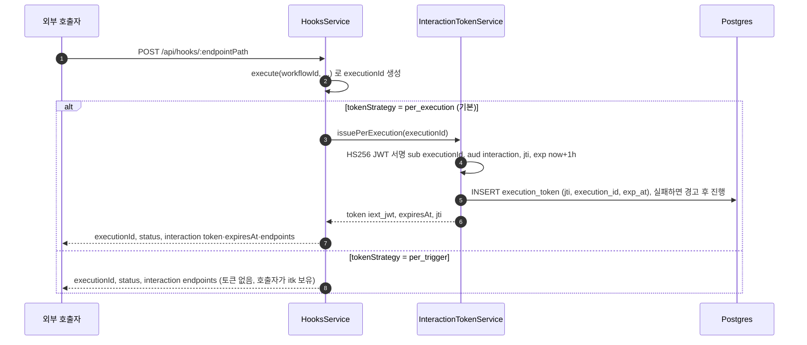
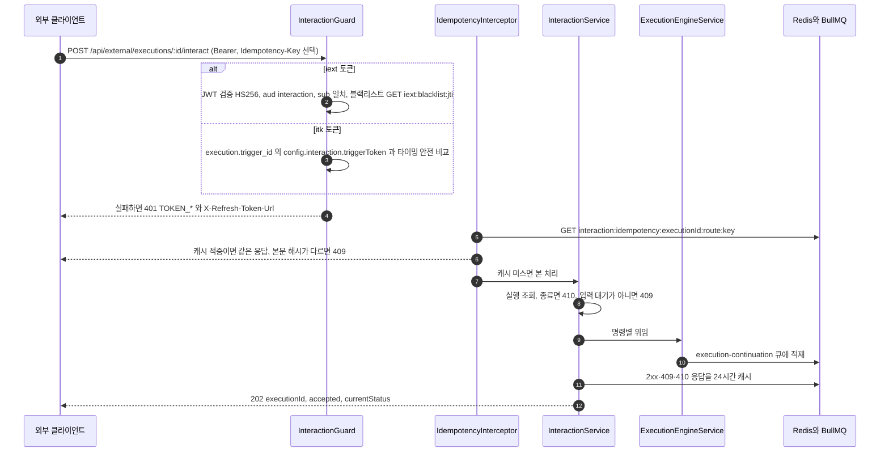
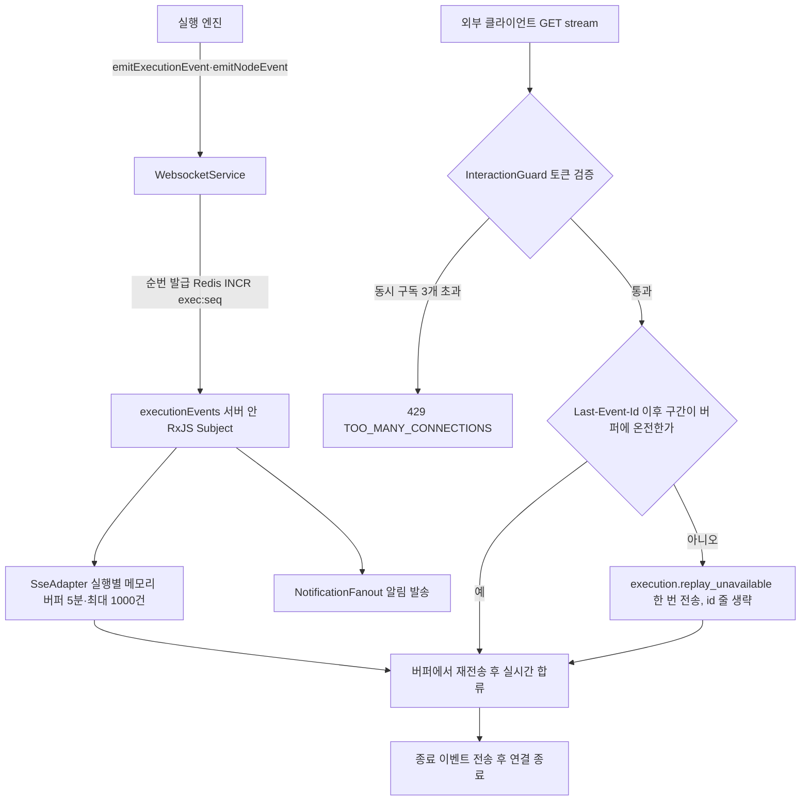
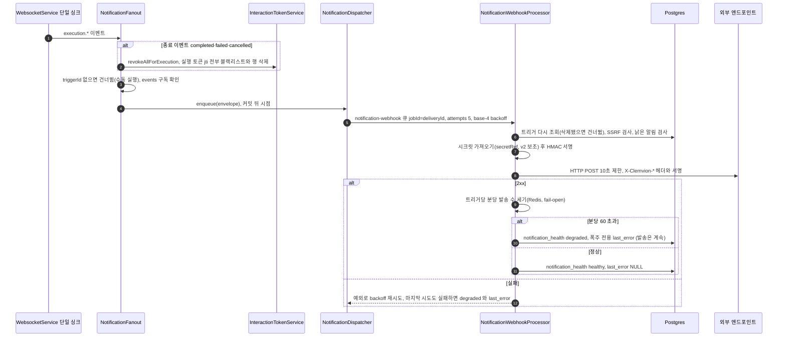
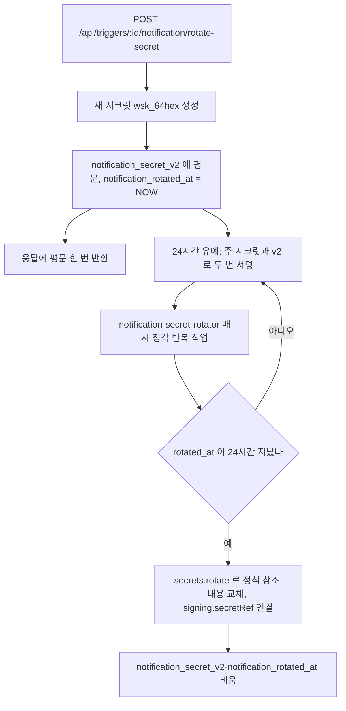
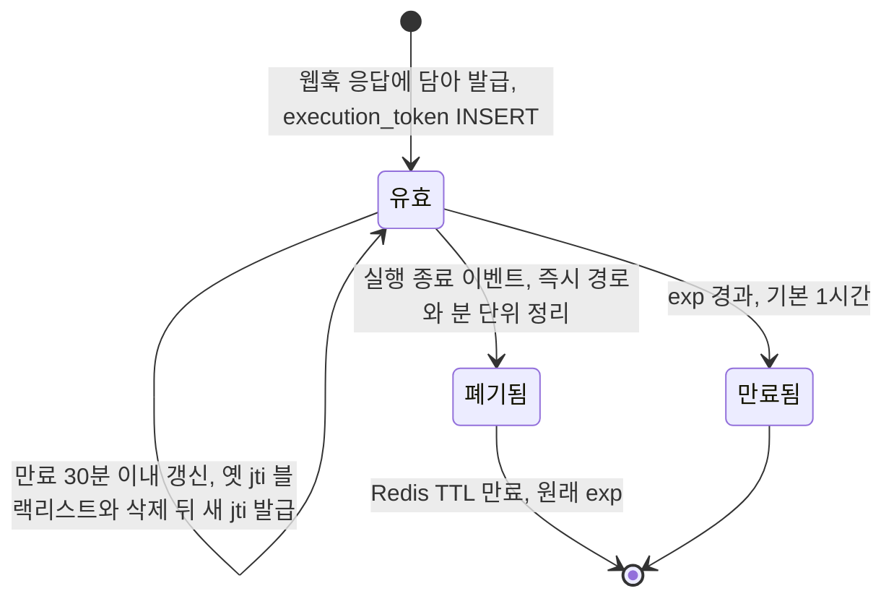
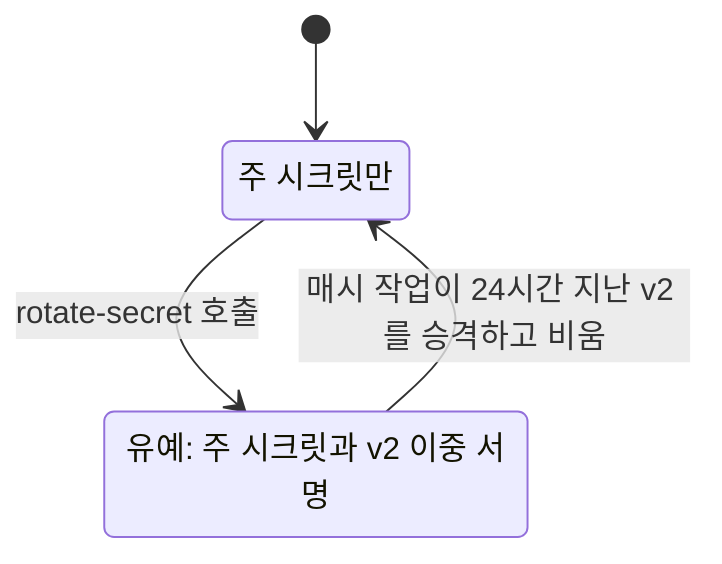

> 구현 상태: 구현됨 · 원문: `spec/5-system/14-external-interaction-api.md` (§7), `spec/data-flow/15-external-interaction.md`, `spec/1-data-model.md` (§2.13.2) · 용어: [용어 사전](../CLE-GLOSSARY.md)

## 개요

External Interaction API(EIA)는 워크플로우 실행을 외부 시스템과 외부 사용자에게 여는 경계 층이다. 데이터는 세 갈래로 흐른다.

1. **인바운드 명령**: 웹훅으로 시작한 실행이 입력 대기에 들어가면 외부 사용자가 `interact`·`cancel` 로 응답한다. 응답은 재개 큐를 거쳐 실행을 잇는다.
2. **SSE 스트림**: 실행의 실시간 이벤트(`execution.*`)를 웹채팅 위젯 같은 외부 클라이언트에 Server-Sent Events 로 보낸다.
3. **EIA 알림 웹훅**: 실행 이벤트를 외부 엔드포인트로 HMAC 서명한 HTTP POST 로 보낸다. BullMQ `notification-webhook` 큐를 거친다.

세 갈래 모두 인증의 바탕은 인터랙션 토큰이다. 실행 단위 토큰(`iext_*`)의 jti 는 실행 토큰 테이블(`ExecutionToken`, `execution_token`)로 영속 추적해 실행이 끝나면 곧바로 무효로 만든다.

이 문서는 EIA 가 더하는 엔티티(트리거 확장 컬럼·설정, 실행 토큰 테이블)와 "데이터가 어디서 생겨 어디로 흐르는가" 를 다룬다. API 필드 계약과 payload 모양은 [External Interaction API](CLE-EIA.md)·[EIA 수신 API와 SSE](CLE-EIA-INBOUND.md)·[EIA 알림 웹훅](CLE-EIA-NOTIFY.md) 이 정한다. 트리거 엔티티의 나머지 컬럼은 [트리거 데이터와 흐름](../CLE-TRIG/CLE-TRIG-DATA.md), 실행 엔티티는 [실행 데이터와 흐름](../CLE-EXEC/CLE-EXEC-DATA.md) 이 정한다.

코드 진입점(`codebase/backend/src/modules/external-interaction/`):

- `interaction-token.service.ts`: 두 토큰 계열의 발급·검증·폐기(`InteractionTokenService`)
- `entities/execution-token.entity.ts`: 실행 토큰 테이블
- `interaction.guard.ts`·`interaction.controller.ts`·`interaction.service.ts`: `/api/external/executions/:executionId/*` REST(interact·cancel·refresh-token·상태 조회)
- `idempotency.interceptor.ts`: 멱등 키 24시간 Redis 캐시
- `interaction-stream.controller.ts` + `sse-adapter.service.ts`: SSE 스트림과 5분 재전송 버퍼
- `notification-fanout.service.ts` → `notification-dispatcher.service.ts` → `notification-webhook.processor.ts`: 알림 발송 파이프라인(+ `notification-signature.util.ts` HMAC)
- 발급 쪽 진입: `hooks/hooks.service.ts`(`buildInteractionResponse`), `triggers/triggers.service.ts`(시크릿 교체·`itk_*` 재발급)

## 엔티티

### 트리거 확장

트리거 테이블에 컬럼 네 개를 더한다. 발송 건강도와 시크릿 교체 추적에는 별도 컬럼이 필요하다. 나머지 설정은 새 컬럼을 만들지 않고 `Trigger.config` JSONB 에 둔다(마이그레이션 비용 최소화).

| 컬럼 | 타입 | 설명 |
|---|---|---|
| `notification_health` | VARCHAR(16) NOT NULL DEFAULT `'unknown'` | 발송 건강도. `unknown`·`healthy`·`degraded` |
| `notification_last_error` | TEXT NULL | 마지막 발송 실패나 폭주 사유(500자로 자름). 응답에서는 자격 증명 모양을 가린다([응답 자격 증명 마스킹](../CLE-API/CLE-API-EGRESS.md#310-트리거-응답의-마지막-오류-2026-10-05)) |
| `notification_secret_v2` | TEXT NULL | 시크릿 교체 유예(24시간) 동안 쓰는 새 서명 시크릿의 평문 |
| `notification_rotated_at` | TIMESTAMPTZ NULL | 시크릿 교체 시각 |

`Trigger.config` 에 더하는 필드:

```jsonc
{
  // 인증은 trigger.auth_config_id(FK → AuthConfig) 하나로 들어간다.
  // 옛 인라인 인증 필드(authType·secret·bearerToken·hmacHeader·hmacAlgorithm)는 폐지됐고
  // V066 정리 마이그레이션이 지운다. 남은 행에 있어도 코드는 무시한다

  "notification": {
    "url":     "https://...",
    "events":  ["execution.waiting_for_input", "execution.completed", ...],
    "signing": { "algorithm": "hmac-sha256", "secretRef": "secret://triggers/{triggerId}/notification-signing" },
    "retry":   { "maxAttempts": 5, "backoff": "exponential" }
  },
  "interaction": {
    "enabled":       true,
    "tokenStrategy": "per_execution" | "per_trigger",
    "triggerToken":  "itk_xxx",   // per_trigger 일 때만
    "appearance": {               // 선택. 웹채팅 운영 콘솔이 저장하는 위젯 외형(평면 저장)
      "locale":       "ko",          // "ko" | "en"
      "primaryColor": "#5B4FE9",     // #RRGGBB
      "position":     "bottom-right",// "bottom-right" | "bottom-left"
      "headerTitle":  "...",         // 80자 이하
      "welcomeText":  "...",         // 500자 이하
      "suggestions":  "...",         // 줄바꿈으로 나눈 추천 질문 문자열 하나, 1000자 이하
      "disclaimer":   "..."          // 500자 이하
    }
  }
}
```

- `interaction.appearance` 는 [External Interaction API](CLE-EIA.md) 의 트리거 등록 페이로드로 받아 저장하는 표시용 값이다. 토큰 발급·검증과 관계없다. 필드는 위 일곱 개이고 모두 선택이다. 허용 값(enum·hex·길이)은 현재 구현의 `WebChatAppearanceDto`(`web-chat-appearance.dto.ts`)가 강제한다. 콘솔 폼과 같은 평면 모양(`welcomeText`, 추천 질문 문자열 하나)으로 저장하고, 위젯 부팅 설정의 중첩 모양(`welcome.text`, `welcome.suggestions[]`)으로 옮기는 일은 클라이언트가 한다. 필드의 뜻과 변환은 [웹채팅 운영 콘솔](../CLE-WEBCHAT/CLE-WEBCHAT-CONSOLE.md) 이 정한다. PATCH 는 `interaction` 객체를 통째로 바꾸므로 `appearance` 없이 보내면 저장된 외형이 사라진다.
- 설정 JSONB 는 키가 없으면 쓰지 않는 것으로 읽는다. 그래서 기존 트리거에 영향이 없다.

저장 형태:

- **서명 시크릿**: `config.notification.signing.secretRef` 의 평문은 `SecretResolver` 가 관리하는 `secret_store` 테이블에 백엔드 AES-256-GCM 으로 암호화해 둔다. DB 에는 암호문만 있고 설정 JSONB 에는 참조만 있다. 만들거나 고칠 때 평문 `signing.secret` 을 받으면 시크릿 저장소로 옮긴다(`normalizeNotificationSecretRef`). `signing.secret` 은 옛 키다.
- **`notification_secret_v2`**: 참조 대신 새 시크릿 평문 자체를 담는다. `rotateNotificationSecret` 이 `` `wsk_${randomBytes(32).toString('hex')}` `` 를 그대로 저장하고, 발송 쪽 `notification-webhook.processor.ts` 는 그 값을 `SecretResolver` 를 거치지 않고 보조 HMAC 키로 쓴다(주 키만 `resolveSigningSecret` 을 거친다). 같은 역할의 채팅 채널 컬럼 `chat_channel_token_v2` 는 참조를 담아 일부러 다르다. 두 컬럼은 뜻이 다르다(서명 시크릿 대 외부 봇 토큰). 컬럼 이름에 관한 결정은 [채팅 채널](../CLE-CHAT/CLE-CHAT-CORE.md), 저장 형태 예외의 기준은 [시크릿 저장소](../CLE-INT/CLE-INT-SECRET.md) 가 정한다. 유예가 끝나 승격하면 값을 `secrets.rotate(canonical ref, v2)` 로 시크릿 저장소에 옮기고 컬럼을 `null` 로 비운다. 이 컬럼은 비밀이 잠시 머무는 경유지다.
- **`config.interaction.triggerToken`**: 설정 JSONB 에 평문으로 둔다. [시크릿 저장소](../CLE-INT/CLE-INT-SECRET.md) 가 정한 명시적 예외다(결정 2026-08-16).
- **응답 비노출**: 위 평문 값들은 응답에 나가지 않는다. 어느 필드·컬럼이 대상인지와 시행 방식은 [시크릿 저장소 §규칙](../CLE-INT/CLE-INT-SECRET.md#규칙) 4~6 이 기준이라 여기서 목록을 되풀이하지 않는다. 현재 구현은 `TriggersService` 의 `TRIGGER_RESPONSE_STRIP_COLUMNS` 가 응답 경계에서 걷어 내고, `shared/testing/schedule-trigger-ref.ts`(스케줄 조인)와 `shared/testing/trigger-workflow-ref.ts`(트리거 직접 조회)가 부재를 단언한다. 저장 형태 예외(평문 보관)와 노출은 다른 문제다.
- 시크릿 교체 응답이 새 시크릿을 한 번 평문으로 싣는 것([EIA 알림 웹훅](CLE-EIA-NOTIFY.md))과 이 컬럼이 유예 동안 평문인 것은 서로 다른 이야기다. 앞의 것은 응답이고 뒤의 것은 DB 저장이다.

### 실행

실행 엔티티에 새 컬럼은 없다. 이벤트 순번은 Redis 카운터(`exec:seq:<executionId>`)로 발급해 WebSocket 이벤트와 함께 쓴다. EIA 는 [대화 스레드](CLE-IX-THREAD.md) 가 둔 `Execution.conversation_thread` 를 읽는다. 상태 조회가 입력 대기일 때 이 스냅샷을 싣기 때문이다([EIA 수신 API와 SSE](CLE-EIA-INBOUND.md)). 컬럼 정의는 [실행 데이터와 흐름](../CLE-EXEC/CLE-EXEC-DATA.md) 에 있다.

### 실행 토큰 테이블

실행 토큰 테이블(`ExecutionToken`, `execution_token`, V060)은 실행 단위 토큰(`iext_*`)의 발급 jti 를 영속 추적한다. 토큰 인증 자체는 JWT 무상태 검증이다. 그런데 실행이 끝날 때 그 실행이 발급한 토큰을 모두 찾아 한꺼번에 폐기하려면 발급 jti 목록이 필요하다. 폐기는 jti 를 Redis 블랙리스트에 올리고 이 행을 지우는 것이다.

| 필드 | 타입 | 설명 |
|---|---|---|
| `jti` | TEXT | PK. JWT jti. Redis 블랙리스트 키 |
| `execution_id` | UUID | FK → Execution(ON DELETE CASCADE) |
| `issued_at` | TimestampTZ | 발급 시각(기본 `NOW()`) |
| `exp_at` | TimestampTZ | JWT 만료 시각. 종료 폐기 때 `(exp_at - now)` 를 Redis TTL 로 쓴다. 이미 만료된 jti 는 올리지 않는다 |

인덱스 `idx_execution_token_execution_id (execution_id)` 는 실행별 발급 토큰 회수(`revokeAllForExecution`)와 정리 작업(`execution_token ⋈ 종료된 execution`)에 쓴다. 한 실행은 갱신 흐름으로 jti 여러 개를 가질 수 있다(옛 jti 를 블랙리스트에 올린 뒤 새 jti 발급).

### 인터랙션 토큰 저장

- **실행 단위 토큰**: 인증 정보를 JWT 자체에 담아 무상태로 검증한다(`sub`=executionId, `aud`='interaction', `exp`, `jti`). 발급한 jti 는 실행 토큰 테이블에 기록한다. 폐기는 jti 마다 Redis 블랙리스트에 올리고(TTL = 만료까지) 행을 지운다. `InteractionGuard` 는 검증할 때 블랙리스트를 조회해 폐기된 토큰을 `TOKEN_REVOKED`(401)로 거부한다.
- **트리거 단위 토큰**: `Trigger.config.interaction.triggerToken` 에 둔다. 재발급하면 새 값으로 바꾼다.

## 데이터 흐름

### 토큰 발급

`config.interaction.enabled === true` 인 웹훅 트리거가 호출되면, 웹훅 진입 흐름([트리거 데이터와 흐름](../CLE-TRIG/CLE-TRIG-DATA.md))의 끝에서 `HooksService.buildInteractionResponse` 가 응답에 인터랙션 블록을 싣는다.



- `endpoints` 는 `stream`·`submit`·`status`·`cancel`·`refresh` 다섯 개의 `/api/external/executions/:executionId/*` 경로다.
- 트리거 단위 토큰(`itk_*`, 32바이트 무작위 hex)은 트리거 단위 토큰 재발급 엔드포인트 `POST /api/triggers/:id/interaction/revoke-token`(`TriggersService.revokePerTriggerToken`)으로 발급·재발급한다. 새 토큰을 `trigger.config.interaction.triggerToken` 에 저장하고 평문은 응답에 한 번만 보인다. 가드가 설정의 현재 값과만 비교하므로 바꾸는 즉시 옛 토큰은 무효다. 트리거를 만들 때 서버가 `itk_*` 를 발급하는지는 [External Interaction API](CLE-EIA.md#미결-사항) 의 미결 사항이다.

### 인바운드 명령과 재개



명령별 위임(`interaction.service.ts`). 외부 호출은 `expectedNodeId`(=`dto.nodeId`)를 함께 넘겨 publisher 가 실제 대기 노드와 맞춰 본다. 내부 신뢰 호출(채팅 채널)은 `undefined` 를 넘긴다.

| 명령 | 위임 대상 | 비고 |
|---|---|---|
| `submit_form` | `ExecutionEngineService.continueExecution(executionId, data, expectedNodeId)` | `nodeId`·`data` 필수 |
| `click_button` | `ExecutionEngineService.continueButtonClick(executionId, buttonId, expectedNodeId)` | `buttonId` 필수 |
| `submit_message` | `ExecutionEngineService.continueAiConversation(executionId, message, expectedNodeId)` | 멀티턴 AI 대화 |
| `end_conversation` | `ExecutionEngineService.endAiConversation(executionId, expectedNodeId)` | 없음 |
| `cancel`(또는 `POST /:id/cancel` 별칭) | `ExecutionsService.stop(executionId)` | 입력 대기가 아니어도 된다 |

- 위 네 진입점은 엔진에 남은 얇은 위임자로, 재개 큐에 명령을 발행한다. 큐를 소비한 뒤 재개 턴 처리는 협력 서비스가 맡는다(`processAiResumeTurn` → `AiTurnOrchestrator`, `processButtonResumeTurn` → `ButtonInteractionService`, `processFormResumeTurn` → `FormInteractionService`). 엔진 분할 결정은 [실행 엔진 개요와 그래프 순회](../CLE-EXEC/CLE-EXEC-ENGINE.md) 에 있다.
- 모든 재개 명령은 영속 큐 `execution-continuation`(재개 큐)으로 들어간다. 발행자는 `ContinuationBusService` 이고, 큐와 워커는 [큐 워커와 동시 실행 제한](../CLE-EXEC/CLE-EXEC-WORKER.md)·[실행 데이터와 흐름](../CLE-EXEC/CLE-EXEC-DATA.md) 이 정한다. publisher 쪽 명령 사전 검증이 던지는 `InvalidExecutionStateError` 는 `409 STATE_MISMATCH` 로 바뀐다.
- 내부 신뢰 경로: 채팅 채널 인바운드(`hooks.service.ts` 의 `handleChatChannelWebhook`)는 HTTP 를 거치지 않고 `scope: 'in_process_trusted'` 컨텍스트를 직접 만들어 같은 위임을 부른다. 토큰 검증을 건너뛰는 것은 서버 내부 모듈만 할 수 있다(타입 union 으로 컴파일러가 강제). 흐름은 [채팅 채널 데이터와 흐름](../CLE-CHAT/CLE-CHAT-DATA.md) 에 있다.
- 토큰 갱신: `POST /:id/refresh-token` 은 `iext_*` 만 받는다(`itk_*` 는 403). 만료 30분 이내(`IEXT_REFRESH_WINDOW_SEC`)에만 새로 발급한다. 옛 jti 를 곧바로 블랙리스트에 올리고 실행 토큰 테이블에서 지운 뒤 새 jti 를 넣는다. 종료된 실행은 410 이다.
- 상태 조회: `GET /:id` 는 실행 행과 대기 중인 노드 실행 출력, 영속 대화 스레드를 읽는 읽기 전용 경로다. 응답 모양은 [EIA 수신 API와 SSE](CLE-EIA-INBOUND.md) 가 정한다. `seq` 는 늘 `0` 이고 순번은 SSE `Last-Event-Id` 로 맞춘다.

### SSE 스트림

원천은 실행 엔진이 내는 WebSocket 이벤트 단일 싱크(`WebsocketService`)다. SSE 는 그 흐름의 어댑터일 뿐 이벤트를 스스로 만들지 않는다.



- 프레임은 `event: <eventType>` / `id: <seq>` / `data: <JSON payload>` 이고 15초마다 heartbeat 주석을 보낸다. 제어 프레임(`execution.replay_unavailable`, 순번 0 이하)은 `id:` 줄을 생략한다.
- EventSource 호환을 위해 `?token=` 쿼리를 허용한다.
- SSE 의 `id:` 와 알림 웹훅의 `seq` 는 같은 카운터(Redis `exec:seq:<id>`)를 쓴다. 클라이언트는 두 채널의 이벤트를 한 순서로 정렬할 수 있다.
- v1 버퍼는 단일 인스턴스 메모리다. 분산 fan-out 은 후속 작업이다(`sse-adapter.service.ts` 주석).
- 대표 소비자는 웹채팅 위젯이다(`codebase/channel-web-chat/src/lib/eia-client.ts` 가 EventSource 로 이 경로를 구독). 위젯 부팅과 CORS 허용 목록(`WebChatCorsOriginResolver` 가 실행 → `workspace.settings.interactionAllowedOrigins` 를 풀고 60초 캐시)은 [웹채팅 구조](../CLE-WEBCHAT/CLE-WEBCHAT-ARCH.md)·[웹채팅 보안](../CLE-WEBCHAT/CLE-WEBCHAT-SECURITY.md) 이 다룬다.

### 알림 웹훅 발송



단계별 사실(`notification-fanout.service.ts`·`notification-webhook.processor.ts`):

- **fanout 대상 이벤트 다섯 가지**: `execution.waiting_for_input`·`completed`·`failed`·`cancelled`·`ai_message`. 종료 때의 jti 폐기는 알림 설정 유무와 관계없다. 인터랙션만 켠 트리거도 종료 때 토큰이 무효가 된다.
- **낡은 알림 차단**: 진행 중 성격의 `waiting_for_input`·`ai_message` 는 보내기 직전 실행 상태를 다시 확인해 이미 종료면 건너뛴다(재시도해도 의미 없음).
- **SSRF**: 등록 때(`TriggersService.assertNotificationUrlSafe`)와 발송 직전(`checkSsrfSafeUrl`) 두 번 검증한다. DNS rebinding 가드는 `NOTIFICATION_ENFORCE_DNS_REBIND_GUARD=1` 일 때만 켠다(기본 꺼짐).
- **서명**: `X-Clemvion-Signature: t=<unix>,v1=<hex>[,v1=<v2hex>]`(`notification-signature.util.ts`). 정규형 `{timestamp}.{rawBody}`, 알고리즘 `hmac-sha256`(기본)·`hmac-sha512`. 시크릿이 없거나 가져오지 못하면 서명 없이 보내지 않고 저하로 처리한다. 교체 유예 중에는 `notification_secret_v2` 로도 서명해 `v1=` 를 두 개 싣는다.
- **실패 정책**: 마지막 시도가 실패해도 트리거를 끄지 않는다. `notification_health`·`notification_last_error`(500자로 자름)만 갱신한다. BullMQ `removeOnComplete` 24시간, `removeOnFail` 7일이다.
- **폭주 감지**: 발송 성공(2xx)마다 `OutboundNotificationRateLimiterService.consume`(Redis 고정 윈도우 `INCR`+`EXPIRE NX`, fail-open)이 트리거당 분당 발송 수를 센다. 60건을 넘으면 `healthy` 대신 `degraded` 와 폭주 전용 `notification_last_error` 로 표시한다(발송 실패 저하와 원인 구분). 초과분도 계속 보낸다([EIA 알림 웹훅](CLE-EIA-NOTIFY.md)).

### 서명 시크릿 교체와 승격



- 승격은 `TriggersService.promoteRotatedNotificationSecrets` 가 한다. `rotated_at ≤ now-24h` 인 트리거의 v2 를 시크릿 저장소 정식 참조(`secret://triggers/<id>/notification-signing`) 내용으로 바꾸고 `signing.secretRef` 를 연결한다.
- 승격은 평문을 설정에 쓰지 않는다. `secrets.rotate(canonical ref, v2)` 로 시크릿 저장소 내용을 바꾸고, `signing.secretRef` 를 정식 참조로 맞추고, 옛 `signing.secret` 평문 키를 지운다(`normalizeNotificationSecretRef` 와 같은 참조 규약). 발송 쪽 `resolveSigningSecret` 이 `secretRef` 를 먼저 보므로, 승격 즉시 새 시크릿으로 주 서명이 바뀐다.
- 알림 설정이 없는 트리거는 승격을 건너뛴다. 서명할 대상이 없고, v2 는 다음 교체 때 덮어쓴다.

## 저장소 매핑

### Postgres

| 테이블 | 흐름 | 읽고 쓰는 컬럼 | 비고 |
|---|---|---|---|
| `execution_token` | `iext_*` 발급 | INSERT `(jti, execution_id, issued_at, exp_at)` | 한 실행이 갱신으로 jti 여러 개를 가질 수 있다. INSERT 실패는 경고 후 진행 |
| `execution_token` | 갱신·종료 폐기 | DELETE `WHERE jti=?`(갱신) / `WHERE execution_id=?`(종료 일괄) | `idx_execution_token_execution_id` 단일 조회. `iext_*` 를 발급하지 않은 실행은 아무 일도 없다 |
| `trigger.config`(JSONB) | 인터랙션 설정 | `interaction.enabled`·`interaction.tokenStrategy`·`interaction.triggerToken`(`itk_*` 평문)·`interaction.appearance` | 1급 컬럼이 아니다 |
| `trigger.config`(JSONB) | 알림 설정 | `notification.url`·`notification.events[]`·`notification.signing.{algorithm, secretRef, secret(옛 키)}` | 평문 `signing.secret` 입력은 만들거나 고칠 때 시크릿 저장소로 옮긴다 |
| `trigger` | 발송 건강도 | UPDATE `notification_health`(`healthy`·`degraded`), `notification_last_error` | 발송 프로세서가 성공·최종 실패 때 |
| `trigger` | 시크릿 교체 | UPDATE `notification_secret_v2`(평문), `notification_rotated_at`. 승격 때 NULL 로 비움 | [서명 시크릿 교체와 승격](#서명-시크릿-교체와-승격) |
| `execution` | 인바운드 검증 | SELECT `status`(종료·입력 대기 검사, `itk_*` 의 `trigger_id` 대조). interact 는 실행 행을 직접 쓰지 않는다(재개 워커가 갱신) | 없음 |
| `execution` | 상태 조회 | SELECT `status`·`result`·`error`·`duration_ms`·`conversation_thread` | 대기 노드 실행 출력도 읽는다 |

### Redis 와 BullMQ

키 형태 규칙은 [Redis 키 명명 규약](../CLE-ENG/CLE-ENG-REDIS.md), 저장소 전체 목록은 [비동기 큐와 Redis 키 목록](../CLE-PLAT/CLE-PLAT-QUEUE.md) 이 기준이다. 아래 표는 EIA 가 소유한 키와 큐의 상세(용도·TTL·정책)다.

| 저장소 | 키·큐 | 흐름 | TTL·정책 |
|---|---|---|---|
| Redis | `iext:blacklist:<jti>` | 종료 이벤트·갱신 때 SET | TTL = 원래 JWT 만료까지. Redis 를 못 쓰면 fail-open(검증도 fail-open + 경고) |
| Redis | `interaction:idempotency:<executionId>:<route>:<key>` | 명령 응답 캐시 `{ bodyHash, responseJson, statusCode }` | 24시간. 캐시 대상은 `2xx`·`409`·`410` 뿐이다. 같은 키에 다른 본문은 409. 항목이 손상되면(형태 불일치·`responseJson` 파싱 실패) 버리고 새로 처리하며 경고한다(500 아님). 키는 가드가 검증한 `executionId` 와 경로(`interact`·`cancel`)로 묶는다([EIA 수신 API와 SSE](CLE-EIA-INBOUND.md)) |
| Redis | `exec:seq:<executionId>` | `INCR`. SSE `id:`·알림 `seq` 공용 카운터 | 종료 이벤트 뒤 해제([WebSocket 연결과 채널 구독](../CLE-API/CLE-API-WS.md)) |
| Redis | `eia:rl:interact:<executionId>`, `eia:rl:status:<executionId>`, `eia:notif:rl:<triggerId>` | 인바운드 명령·상태 조회·알림 발송 레이트 리밋 | 고정 윈도우, fail-open. 한도는 [External Interaction API](CLE-EIA.md) |
| BullMQ | `notification-webhook` | `NotificationDispatcher.enqueue` → `NotificationWebhookProcessor` | `jobId`=deliveryId 로 중복 제거, `attempts` 5, base-4 사용자 정의 backoff(워커 `settings.backoffStrategy`), `removeOnComplete` 24시간, `removeOnFail` 7일 |
| BullMQ | `notification-secret-rotator` | 매시 반복(`0 * * * *`) → v2 승격 | `upsertJobScheduler` 멱등. 여러 인스턴스에서 전역 한 번 |
| BullMQ | `terminal-revoke-reconcile` | 분마다 반복(`* * * * *`) → 종료된 실행에 남은 실행 토큰 정리 → `revokeAllForExecution`(`TerminalRevokeReconcilerService`) | `upsertJobScheduler` 멱등. 전역 한 번. 즉시 경로 누락분을 최소 한 번 보강한다. 실행 토큰 테이블이 영속 outbox 역할을 하므로 전용 테이블이 없다 |
| BullMQ | `webchat-idle-reaper` | 분마다 반복 → 공개 웹훅(`auth_config_id IS NULL`)이고 실행 단위 토큰이 모두 만료(`execution_token.exp_at`)된 입력 대기 실행 → 엔진 `markWebChatIdleTimeout`(조건부 UPDATE `cancelled`·`cancelledBy='timeout'`·`error.code='WEBCHAT_IDLE_TIMEOUT'`) + `revokeAllForExecution`(`WebChatIdleReaperService`) | `upsertJobScheduler` 멱등. 전역 한 번. 종료 토큰 정리 작업의 형제(같은 원천, 다른 큐·서비스). 공개 위젯 한정 |
| BullMQ | `execution-continuation` | 인바운드 명령 위임의 도착지(발행자 ContinuationBus) | 큐 기준은 [큐 워커와 동시 실행 제한](../CLE-EXEC/CLE-EXEC-WORKER.md) |
| 메모리 | `SseAdapter.buffers` | 실행별 링 버퍼 | 5분 보관, 최대 1000건. 단일 인스턴스 한정 |

## 상태 전이

### 실행 단위 토큰



- 검증 실패 사유는 401 코드로 이렇게 바뀐다(`interaction.guard.ts`). `expired` → `TOKEN_EXPIRED`, `blacklisted` → `TOKEN_REVOKED`, `scope_mismatch` → `TOKEN_SCOPE_MISMATCH`, `audience_mismatch` → `TOKEN_AUDIENCE_MISMATCH`, 그 밖 → `TOKEN_INVALID`.
- 종료 폐기는 최소 한 번이다. 즉시 경로(`NotificationFanout` 의 종료 이벤트 구독)가 프로세스 재시작·장애로 빠지면 `terminal-revoke-reconcile` 정리 작업(분 단위)이 종료된 실행에 남은 실행 토큰을 회수한다. 그래서 누락 때 최악의 폐기 지연은 즉시 경로만 있을 때의 토큰 수명(1시간)에서 1분 이하로 줄어든다([External Interaction API](CLE-EIA.md)).
- 다만 Redis(블랙리스트 SET·BullMQ) 전면 장애 중에는 두 경로 모두 fail-open 이라 다음 회차나 복구 시점까지 폐기가 늦어진다. 블랙리스트 조회도 fail-open 이므로 그 창에서 토큰이 통과할 수 있다. 최종 안전망은 만료다(보안 trade-off 는 `interaction-token.service.ts` 클래스 주석).

### 트리거 단위 토큰

재발급 엔드포인트로 발급하면 `config.interaction.triggerToken` 이 바뀌고 옛 토큰은 곧바로 무효다. 트리거를 지우면 설정과 함께 사라진다. 수명과 갱신 개념이 없다. 가드는 요청마다 현재 설정 값과 타이밍 안전 비교를 한다(SHA-256 해시 뒤 `timingSafeEqual`, 길이 노출 차단).

### 알림 서명 시크릿



유예 동안에는 주 시크릿과 v2 로 두 번 서명한다.

## 외부 의존

| 의존 | 방향 | 참고 |
|---|---|---|
| 외부 웹훅 엔드포인트 | 내부 → 외부 HTTP POST | `2xx` 만 성공. 10초 제한. SSRF 이중 검증. 검증 쪽 헬퍼 `verifySignatureHeader`(±5분 허용)는 SDK·e2e 가 다시 쓰도록 export |
| 외부 클라이언트(EventSource·fetch) | 외부 → 내부 | 웹채팅 위젯(`channel-web-chat`)이 대표 소비자 |
| Redis | 내부 | 블랙리스트·멱등 캐시·순번·레이트 리밋·BullMQ. 못 쓰거나 캐시가 손상되면 fail-open(가용성 우선). 경로마다 경고를 남기되 기동 때 미주입(설정 상태)만 예외다. EIA 키는 [비동기 큐와 Redis 키 목록](../CLE-PLAT/CLE-PLAT-QUEUE.md) 에 올라 있다. 실행 엔진 표는 엔진 소유 키 전용이라 EIA 키가 없는 것이 정상이다 |
| Telegram·Slack·Discord 같은 메신저 | 간접 | 내부 신뢰 경로의 상류([채팅 채널 데이터와 흐름](../CLE-CHAT/CLE-CHAT-DATA.md)) |

## 구현 위치

- `codebase/backend/src/modules/external-interaction/entities/execution-token.entity.ts`
- `codebase/backend/src/modules/external-interaction/interaction-token.service.ts` (발급·검증·`revokeAllForExecution`·`reconcileTerminalRevocations`)
- `codebase/backend/src/modules/external-interaction/terminal-revoke-reconciler.service.ts`, `webchat-idle-reaper.service.ts`
- `codebase/backend/src/modules/external-interaction/sse-adapter.service.ts`, `idempotency.interceptor.ts`
- `codebase/backend/src/modules/external-interaction/notification-fanout.service.ts`, `notification-dispatcher.service.ts`, `notification-webhook.processor.ts`, `notification-signature.util.ts`, `outbound-notification-rate-limiter.service.ts`
- `codebase/backend/src/modules/hooks/hooks.service.ts` (`buildInteractionResponse`, `handleChatChannelWebhook`)
- `codebase/backend/src/modules/triggers/triggers.service.ts` (`revokePerTriggerToken`, `rotateNotificationSecret`, `promoteRotatedNotificationSecrets`, `normalizeNotificationSecretRef`, `TRIGGER_RESPONSE_STRIP_COLUMNS`)
- `codebase/backend/src/shared/testing/schedule-trigger-ref.ts`, `trigger-workflow-ref.ts` (응답 비노출 단언)

## Rationale

### EIA 흐름을 실행 흐름과 나눠 적는다

인바운드 REST·SSE·알림 웹훅 세 흐름은 하나의 토큰·이벤트 라이프사이클을 함께 쓴다. 종료 이벤트 하나가 SSE 종료·토큰 폐기·알림 발송을 동시에 일으킨다. [실행 데이터와 흐름](../CLE-EXEC/CLE-EXEC-DATA.md) 에 합치면 실행 엔진 내부 흐름과 경계 층 흐름이 섞인다. 인앱 알림 흐름([알림](../CLE-OBS/CLE-OBS-NOTIFY.md))은 인앱 `notification` 테이블 영역이라 외부 웹훅 발송과 어휘만 겹칠 뿐 도착지가 전혀 다르다. 모듈 응집도에 맞춰 한 문서에 둔다.

### 모든 흐름이 단일 싱크에서 출발한다

SSE 와 알림 흐름이 모두 `WebsocketService.executionEvents$` 에서 출발하는 것은 구현 사실이자 설계 결정이다([External Interaction API](CLE-EIA.md) 의 단일 싱크 결정). 엔진은 여전히 `WebsocketService` 만 부르고, SSE 어댑터와 `NotificationFanout` 은 그 Subject 의 구독자로 떨어져 있다. 데이터 흐름으로 보면 "이벤트 원천이 하나" 라서 순번 공유와 종료 때 일괄 후처리(토큰 폐기)가 자연스럽게 한 지점에 묶인다.

### 인프라 장애에는 fail-open 한다

토큰 블랙리스트·멱등 캐시·jti 추적·알림 적재는 모두 Redis·DB 를 못 쓸 때 fail-open 이다(기능 저하 + 경고 로그). 멱등 캐시는 적재된 항목 자체가 손상된 경우에도 fail-open 이다.

- 원인은 두 축이다. "미가용"(Redis 가 죽었다)과 "손상"(Redis 는 살아 있는데 값이 오염됐다)은 다른 실패다. 손상은 항목 형태 불일치나 `responseJson` 파싱 실패로 나타난다. 예전에는 그 예외가 그대로 올라가 500 이 됐는데, 이는 fail-open 원칙과 정반대였다. 지금은 손상 항목을 버리고 새 처리로 내린다.
- 경고는 다섯 경로 중 넷에 붙는다. `IdempotencyInterceptor` 의 (1) 기동 때 미주입, (2) 조회 실패, (3) 적재 실패, (4) 직렬화 실패, (5) 항목·payload 손상 가운데 (1)만 경고하지 않는다. Redis 를 붙이지 않은 것은 장애로 보지 않고 설정 상태로 본다. 나머지는 운영자가 저하 구간을 알아야 하므로 반드시 로그를 남긴다.
- 근거는 "인터랙션·알림은 워크플로우 실행의 부수 채널이며, 인프라 장애가 실행 자체를 멈추면 안 된다" 는 모듈 전체의 결정이다(`interaction-token.service.ts`·`notification-dispatcher.service.ts` 주석). 표마다 정책을 적어 운영자가 저하 모드의 남은 위험을 추적하게 했다. 블랙리스트 미적용이면 만료까지 토큰이 유효하고, 멱등 저하면 같은 멱등 키 재요청이 모두 캐시 미스가 되어 다운스트림이 중복 실행될 수 있다.
- 멱등 쪽 남은 위험은 창 크기가 다르다. 정상일 때도 GET 과 SET 이 원자적이지 않아 좁은 창이 있지만, Redis 장애가 이어지는 동안에는 그 창이 장애 구간 전체로 넓어진다. 그래서 "같은 응답 24시간 재현" 은 정상 경로의 계약이고 저하 구간의 멱등성은 최선 노력이다. 운영자는 이 구간을 알아챌 수단(Redis 실패율 관측)이 필요하다.

### 승격 때 시크릿 저장소 참조를 교체한다

시크릿 승격은 평문을 설정에 쓰지 않고 시크릿 저장소 정식 참조를 `secrets.rotate` 로 교체한다. 발송 쪽 `resolveSigningSecret` 이 `secretRef` 를 먼저 보기 때문에, 평문을 설정에 쓰면 교체한 시크릿이 실제 서명에 쓰이지 않는 어긋남이 생긴다. 이 어긋남은 "교체한 시크릿이 실제로 쓰이는가" 라는 보안 운영에 직접 닿는다. 한때 코드 주석과 명세가 말한 "v2 → secretRef 승격" 과 실제 코드가 갈라졌던 적이 있어 지금의 방식으로 맞췄다.

### SSE 버퍼를 단일 인스턴스 메모리에 둔다

`SseAdapter.buffers` 는 v1 에서 단일 프로세스 메모리 링 버퍼다.

- 지연과 신뢰성의 trade-off: 실행 이벤트는 SSE 스트림의 실시간성이 중요하고, Redis Pub/Sub 을 거치면 직렬화와 네트워크 홉이 더해진다.
- 단일 진입점 가정: v1 배포는 단일 인스턴스나 sticky-session 로드밸런서를 전제로 했다. 특정 인스턴스에 붙은 SSE 클라이언트는 그 인스턴스가 낸 이벤트만 받으면 충분하다.

남은 위험은 여러 인스턴스 환경이다. 로드밸런서가 sticky-session 을 보장하지 않으면 클라이언트가 붙은 인스턴스와 이벤트를 낸 인스턴스가 달라 이벤트를 받지 못한다. 수평 확장할 때 `SseAdapter` 를 Redis Pub/Sub 기반 fan-out 으로 바꾸고, 그 단계에서 별도 작업을 등록한다. 단일 싱크 구조 자체의 결정은 [External Interaction API](CLE-EIA.md) 가 정한다. 이 항목은 그 싱크의 SSE 소비자가 왜 단일 인스턴스 메모리인지에 한한다.

### 실행 토큰 테이블을 따로 둔다

JWT 는 무상태로 검증할 수 있어 저장소가 필요 없어 보인다. 그러나 실행이 끝날 때 그 실행이 발급한 토큰을 빠짐없이 폐기하려면 발급 jti 목록이 있어야 한다. 그래서 jti 를 실행별로 기록하는 테이블을 두고, 같은 테이블을 종료 토큰 정리 작업과 공개 위젯 입력 대기 회수의 원천으로 함께 쓴다. 이미 만료된 jti 는 블랙리스트에 올릴 필요가 없으므로 `exp_at` 을 함께 둔다.
