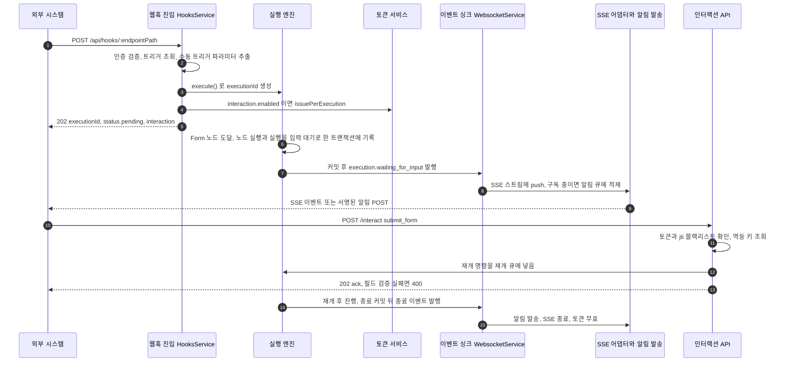

> 구현 상태: 부분 구현 · 원문: `spec/5-system/14-external-interaction-api.md` (§1~§4, §8.3~§8.5, §9, §10, §12, Rationale R1·R4·R7·R9·R10·R15·R19) · 용어: [용어 사전](../CLE-GLOSSARY.md)

## 개요

워크플로우가 외부 시스템(웹훅 트리거·외부 자동화·서드파티 봇)에서 시작되면, 실행 중에 사용자 입력이 필요한 노드(Form, 버튼이 있는 Presentation 노드, AI Agent 멀티턴, 정보 추출기 노드 멀티턴)를 만날 수 있다. 그때 호출자는 실행이 입력 대기(waiting for input, `waiting_for_input`)로 멈춘 사실을 알 수 없고, 대화 턴을 주고받을 수단도 없다. 내부 WebSocket 채널은 워크스페이스 JWT 로만 인증하므로 외부 호출자가 쓸 수 없기 때문이다.

External Interaction API(EIA, `/api/external/*`)는 이 간극을 두 채널로 메운다.

- **EIA 알림 웹훅**(Outbound Notification Webhook, `config.notification`): 서버가 실행 이벤트(`waiting_for_input`·`completed`·`failed`·`cancelled`·`ai_message`)를 외부 URL 로 HMAC 서명해 보낸다. 자세한 계약은 [EIA 알림 웹훅](CLE-EIA-NOTIFY.md) 에서 정한다.
- **인바운드 인터랙션**(Inbound Interaction): 외부 클라이언트가 REST 로 인터랙션 명령(`submit_form`·`click_button`·`submit_message`·`end_conversation`·`cancel`)을 보내고 SSE 로 실행 이벤트를 받는다. 자세한 계약은 [EIA 수신 API와 SSE](CLE-EIA-INBOUND.md) 에서 정한다.

두 채널은 모두 선택 사항이다. 트리거마다 둘 다 켜거나, 하나만 켜거나, 둘 다 끌 수 있다. 내부 처리는 WebSocket 명령·이벤트 경로([WebSocket 이벤트와 명령](../CLE-API/CLE-API-WS-EVENTS.md))를 그대로 다시 쓰는 facade 로 구현해 두 경로가 갈라지지 않게 한다.

이 문서는 두 채널의 공통 부분을 다룬다. 사용 시나리오, 채널 공통 요구사항(인터랙션 토큰·신뢰성·이벤트 순번), 트리거 등록 페이로드 확장, 웹훅 호출 응답 확장, 토큰 규칙, 레이트 리밋과 CORS, 처리 흐름, 호환성이 여기 있다.

범위 밖: 엔티티·저장소·데이터 흐름은 [EIA 데이터와 흐름](CLE-EIA-DATA.md), 외부로 나가는 값의 자격 증명 가리기는 [응답 자격 증명 마스킹](../CLE-API/CLE-API-EGRESS.md), EIA 를 쓰는 서버 어댑터와 임베드 위젯은 [채팅 채널](../CLE-CHAT/CLE-CHAT.md) 과 [웹채팅](../CLE-WEBCHAT/CLE-WEBCHAT.md) 이 정한다. 웹훅 진입 자체(인증·입력 구조)는 [웹훅](../CLE-TRIG/CLE-TRIG-WEBHOOK.md) 소관이다.

## 사용 시나리오

| 시나리오 | 쓰는 채널 | 설명 |
|---|---|---|
| 서버 간 자동화에 사람 결재가 필요한 경우 | EIA 알림 웹훅만 | 외부 서버가 웹훅으로 워크플로우를 시작한다. Form 에 도달하면 알림을 받아 자체 UI 로 안내하고 REST 로 폼을 제출한다. |
| 외부 챗봇(Telegram·Slack·카카오) 위에 워크플로우 얹기, 변환층을 사용자가 직접 구현 | 알림 웹훅 + 인바운드 | `config.chatChannel` 을 쓰지 않는다. 봇 메시지로 웹훅을 불러 실행을 시작하고, AI 멀티턴에 들어가면 알림으로 어시스턴트 응답을 받고, 사용자 메시지마다 REST `submit_message` 를 보낸다. 특이한 통합이나 지원하지 않는 메신저도 운영할 수 있다. |
| 외부 챗봇, 서버 어댑터 사용 | 알림 웹훅 + 인바운드(어댑터가 자동화) | 웹훅 트리거에 `config.chatChannel` 만 등록하면 Telegram 등과 자동으로 연결된다. 어댑터가 서버 안에서 EIA 이벤트를 받아 메신저 메시지로 바꾸고, 서버 안에서 인바운드 명령을 부른다. 사용자 코드가 필요 없다. 자세한 내용은 [채팅 채널](../CLE-CHAT/CLE-CHAT-CORE.md) 에서 정한다. |
| 외부 SaaS 가 채팅 위젯을 호스팅 | 인바운드만(SSE + REST) | 웹훅 응답으로 받은 토큰으로 SSE 스트림을 열고 REST 명령을 보낸다. 알림 웹훅은 쓰지 않는다. |
| 인터랙션 없는 단순 자동화 | 둘 다 쓰지 않음 | 기존 웹훅 그대로다. |

## 요구사항

인바운드 명령·SSE·상태 조회의 요구사항은 [EIA 수신 API와 SSE](CLE-EIA-INBOUND.md), 알림 발송의 요구사항은 [EIA 알림 웹훅](CLE-EIA-NOTIFY.md) 에 있다. 아래는 두 채널이 함께 따르는 요구사항이다.

### 트리거 등록과 웹훅 응답

- REQ-EIA-001 WHEN 트리거 설정에 `notification` 이나 `interaction` 그룹이 없으면 THE SYSTEM SHALL 그 채널을 쓰지 않는 것으로 해석하고 기존 웹훅 동작을 그대로 유지한다. (원본: §1, §12)
- REQ-EIA-002 WHEN `interaction.enabled=true` 인 웹훅 트리거가 호출되면 THE SYSTEM SHALL 202 응답에 `status` 와 `interaction.endpoints`(stream·submit·status·cancel·refresh 다섯 경로)를 함께 싣는다. (원본: §4.1, §9.2)
- REQ-EIA-003 WHEN 그 트리거의 `tokenStrategy` 가 `per_execution` 이면 THE SYSTEM SHALL `interaction` 블록에 새 실행 단위 토큰(`token`)과 `expiresAt` 을 함께 싣는다. (원본: §4.1)
- REQ-EIA-004 WHEN PATCH 로 `interaction` 객체를 보내면 THE SYSTEM SHALL 저장된 `interaction` 을 병합하지 않고 통째로 바꾼다. (원본: §4)
- REQ-EIA-005 WHEN 트리거를 만들면 THE SYSTEM SHALL 알림 서명 시크릿(`wsk_*`)을 생성 응답에서 한 번만 평문으로 보여 주고 이후 모든 조회 응답에서 가린다. (원본: EIA-AU-01 · 발급 주체는 [미결 사항](#미결-사항))

### 인터랙션 토큰

- REQ-EIA-006 WHEN 트리거에 인터랙션을 켜면 THE SYSTEM SHALL 인바운드 인증에 실행 단위 토큰(`iext_*`, 실행 하나에 묶인 1시간 JWT)과 트리거 단위 토큰(`itk_*`, 트리거의 모든 실행에 쓰는 영구 토큰) 중 `tokenStrategy` 가 고른 하나를 쓴다. (원본: EIA-AU-02)
- REQ-EIA-007 IF `tokenStrategy` 를 지정하지 않으면 THE SYSTEM SHALL `per_execution` 을 쓴다. (원본: EIA-AU-03)
- REQ-EIA-008 WHEN 실행이 종료(`completed`·`failed`·`cancelled`)되면 THE SYSTEM SHALL 그 실행에 발급한 실행 단위 토큰을 즉시 무효로 만든다. (원본: EIA-AU-04)
- REQ-EIA-009 WHILE 실행 단위 토큰의 만료가 30분 이내이고 실행이 살아 있는 동안 THE SYSTEM SHALL `POST /api/external/executions/:id/refresh-token` 으로 토큰 갱신을 허용한다. (원본: EIA-AU-05)
- REQ-EIA-010 WHEN 트리거가 삭제되면 THE SYSTEM SHALL 그 트리거 단위 토큰을 무효로 만든다. (원본: EIA-AU-07)
- REQ-EIA-011 WHEN `POST /api/triggers/:id/interaction/revoke-token` 이 호출되면 THE SYSTEM SHALL 새 트리거 단위 토큰을 발급하고 옛 토큰을 즉시 무효로 만든다. (원본: EIA-AU-07)
- REQ-EIA-012 WHEN 트리거 단위 토큰을 재발급하면 THE SYSTEM SHALL 감사 로그에 `trigger.interaction_token_revoked` 를 남긴다. (원본: EIA-AU-07)
- REQ-EIA-013 WHEN 서버 프로세스 안의 신뢰 호출자가 `InteractionService.interact()` 를 직접 부르면 THE SYSTEM SHALL 토큰 발급과 검증을 건너뛴다. (원본: EIA-AU-08)
- REQ-EIA-014 IF 요청이 HTTP 로 들어오면 THE SYSTEM SHALL 내부 신뢰 호출 예외를 적용하지 않고 인터랙션 토큰 인증을 그대로 요구한다. (원본: EIA-AU-08, EIA-IN-06)
- REQ-EIA-015 WHEN HTTP 진입점 가드가 요청 컨텍스트를 합성하면 THE SYSTEM SHALL `scope` 필드를 설정하지 않는다. (원본: §3.3.1-1)
- REQ-EIA-016 WHEN HTTP 요청 본문·헤더·쿼리·경로 값을 역직렬화하면 THE SYSTEM SHALL `scope` 필드를 제거한다. (원본: §3.3.1-2)
- REQ-EIA-017 WHILE `iext_*` 를 서명·검증하는 동안 THE SYSTEM SHALL HS256 과 `INTERACTION_JWT_SECRET`, 그것이 없으면 `JWT_SECRET` 을 쓴다. (원본: §8.3)
- REQ-EIA-018 IF `NODE_ENV=production` 에서 `INTERACTION_JWT_SECRET` 과 `JWT_SECRET` 이 모두 없으면 THE SYSTEM SHALL 서버 부팅을 막는다. (원본: §8.3)
- REQ-EIA-019 IF 개발 환경에서 두 시크릿이 모두 없으면 THE SYSTEM SHALL 프로세스 시작 때 한 번 만든 임시 무작위 키로 서명한다. (원본: §8.3)
- REQ-EIA-020 WHEN 인바운드 요청이 토큰을 보내면 THE SYSTEM SHALL `Authorization: Bearer` 헤더로만 받고, 쿼리 파라미터(`?token=`)는 SSE 스트림에만 허용한다. (원본: §8.3)
- REQ-EIA-021 WHILE 운영 환경인 동안 THE SYSTEM SHALL EIA 경로에 HTTPS 를 강제한다. (원본: §8.3)

### 신뢰성과 이벤트 순번

- REQ-EIA-022 WHEN 실행과 노드 실행의 상태 변경 트랜잭션이 커밋되면 THE SYSTEM SHALL 그 뒤에만 EIA 알림 웹훅 발송과 SSE 이벤트를 내보낸다. (원본: EIA-RL-04)
- REQ-EIA-023 IF 상태 변경 트랜잭션이 롤백되면 THE SYSTEM SHALL 어떤 외부 발송도 하지 않는다. (원본: §9.3)
- REQ-EIA-024 WHEN 같은 실행의 이벤트를 SSE 와 알림 웹훅으로 보내면 THE SYSTEM SHALL 두 채널에 같은 이벤트 순번(`seq`)을 싣는다. (원본: EIA-RL-05)
- REQ-EIA-025 WHILE Redis 를 쓸 수 있는 동안 THE SYSTEM SHALL 여러 인스턴스가 같은 실행의 이벤트를 동시에 내보내도 초당 1000건 부하에서 이벤트 순번을 중복·역전 없이 단조 증가시킨다. (원본: EIA-NF-06)
- REQ-EIA-026 IF Redis 를 쓸 수 없으면 THE SYSTEM SHALL 인스턴스별 메모리 카운터로 이벤트 순번을 이어 가고 인스턴스 사이의 단조성은 보장하지 않는다. (원본: EIA-NF-06)
- REQ-EIA-027 WHEN 이벤트마다 순번을 발급하면 THE SYSTEM SHALL 단일 인스턴스에서 메모리 기준선 대비 추가 지연을 중앙값 5ms 미만으로 유지한다. (원본: EIA-NF-07)
- REQ-EIA-028 WHEN 실행이 종료되면 THE SYSTEM SHALL 엔진 종료 이벤트 구독으로 그 실행의 모든 인터랙션 토큰을 즉시 폐기하고, 분 단위 정리 작업으로 남은 토큰을 다시 폐기해 최소 한 번의 폐기를 보장한다. (원본: EIA-RL-06)
- REQ-EIA-029 WHILE 공개 웹훅 트리거(`auth_config_id IS NULL`)가 시작한 실행이 실행 단위 토큰으로만 접근되며 입력 대기인 동안, 발급한 모든 토큰이 만료되고 유예 시간(`WEBCHAT_IDLE_REAP_GRACE_MS`, 기본 3600000ms)이 지나면 THE SYSTEM SHALL 그 실행을 `cancelled`(`cancelledBy='timeout'`, `error.code='WEBCHAT_IDLE_TIMEOUT'`)로 회수한다. (원본: EIA-RL-07)
- REQ-EIA-030 IF 트리거가 인증 트리거이거나 트리거 단위 토큰을 쓰면 THE SYSTEM SHALL 입력 대기 회수 대상에서 뺀다. (원본: EIA-RL-07)

### 레이트 리밋과 CORS

- REQ-EIA-031 WHEN 한 실행에 인바운드 명령(`/interact`, `/cancel` 합산)이 분당 60건을 넘으면 THE SYSTEM SHALL `429 RATE_LIMITED` 와 `Retry-After` 를 돌려준다. (원본: §8.4)
- REQ-EIA-032 WHEN 한 실행에 단발 상태 조회가 분당 120건을 넘으면 THE SYSTEM SHALL `429 RATE_LIMITED` 와 `Retry-After` 를 돌려준다. (원본: §8.4)
- REQ-EIA-033 IF 레이트 리밋 카운터용 Redis 를 쓸 수 없으면 THE SYSTEM SHALL 요청을 허용한다. (원본: §8.4)
- REQ-EIA-034 WHEN 브라우저가 `/api/external/executions/:id` 이하 경로를 부르면 THE SYSTEM SHALL 워크스페이스의 `interactionAllowedOrigins` 와 공식 웹채팅 위젯 배포 주소에 있는 origin 만 CORS 로 허용한다. (원본: §8.5)
- REQ-EIA-035 IF 워크스페이스에 `interactionAllowedOrigins` 가 없으면 THE SYSTEM SHALL 공식 위젯 배포 주소 밖의 브라우저 호출을 CORS 로 막는다. (원본: §8.5)

### 호환성

- REQ-EIA-036 WHEN 인터랙션 토큰(`iext_*`·`itk_*`)으로 재실행 API(`POST /api/executions/:id/re-run`)를 부르면 THE SYSTEM SHALL 거부하고 워크스페이스 JWT 만 받는다. (원본: §12)
- REQ-EIA-037 WHILE EIA 를 쓰는 동안 THE SYSTEM SHALL 내부 WebSocket 채널(`/ws`)의 명령·이벤트 흐름을 바꾸지 않는다. (원본: §12)

## 트리거 등록 페이로드 확장

트리거 생성·수정 페이로드([트리거 관리](../CLE-TRIG/CLE-TRIG-MANAGE.md), [웹훅](../CLE-TRIG/CLE-TRIG-WEBHOOK.md))에 선택 그룹 두 개를 더한다.

```jsonc
POST /api/triggers
{
  "type": "webhook",
  "workflowId": "uuid",
  "endpointPath": "uuid-or-slug",
  "authConfigId": null,   // 인증 연결(없으면 무인증). 옛 authType 필드는 V066 에서 폐기

  // 알림 웹훅
  "notification": {
    "url": "https://customer.example/webhook/wf-callback",
    "events": [
      "execution.waiting_for_input",
      "execution.completed",
      "execution.failed",
      "execution.cancelled"
      // "execution.ai_message"  // 선택. 양이 많아 명시 구독할 때만
    ],
    "signing": { "algorithm": "hmac-sha256" },
    "retry": { "maxAttempts": 5, "backoff": "exponential" }
  },

  // 인바운드 인터랙션
  "interaction": {
    "enabled": true,
    "tokenStrategy": "per_execution",  // "per_execution"(기본) | "per_trigger"
    // 선택: 웹채팅 운영 콘솔이 저장하는 위젯 외형. 토큰·실행과 무관한 표시용 값
    "appearance": {
      "locale": "ko",
      "primaryColor": "#5B4FE9",
      "position": "bottom-right",
      "headerTitle": "AI 어시스턴트",
      "welcomeText": "...",
      "suggestions": "...",
      "disclaimer": "..."
    }
  }
}
```

`interaction.appearance` 는 웹채팅 운영 콘솔 전용 선택 필드다. 인터랙션 토큰 발급·검증과 관계없는 표시용 값이다. 필드 허용 목록(enum·hex·길이)은 `WebChatAppearanceDto`(`web-chat-appearance.dto.ts`)가 강제한다. 외형 자체의 의미는 [웹채팅 운영 콘솔](../CLE-WEBCHAT/CLE-WEBCHAT-CONSOLE.md) 이 정한다.

PATCH 는 `mergeExternalConfig` 로 `interaction` 키를 통째로 바꾼다. 그래서 `appearance` 만 고칠 때도 `enabled`·`tokenStrategy` 를 함께 보내야 한다. 반대로 외부 API 호출자가 `appearance` 없이 `interaction` 을 PATCH 하면 저장된 외형이 경고 없이 사라진다. 외형을 지키려면 `appearance` 를 함께 보내거나, `GET /api/triggers/:id` 로 현재 값을 읽어 합친 뒤 PATCH 한다.

생성 응답은 다음과 같다.

```jsonc
{
  "id": "trigger_xxx",
  "endpointPath": "...",
  "notification": {
    "url": "...",
    "events": [...],
    "signing": { "algorithm": "hmac-sha256" }
    // signing.secret 은 응답에서 항상 가린다
  },
  "interaction": { "enabled": true, "tokenStrategy": "per_execution" },

  // 생성 시점에만 평문. 이후 조회 응답은 모두 가린다
  "secrets": {
    "notification.secret": "wsk_xxx...",
    "interaction.triggerToken": "itk_xxx..."   // tokenStrategy="per_trigger" 일 때만
  }
}
```

`secrets` 블록을 서버가 만들어 주는지는 정의가 갈린다. [미결 사항](#미결-사항) 참조.

알림 서명 시크릿 교체(`POST /api/triggers/:id/notification/rotate-secret`)는 [EIA 알림 웹훅](CLE-EIA-NOTIFY.md), 트리거 설정의 저장 형태는 [EIA 데이터와 흐름](CLE-EIA-DATA.md) 에서 정한다.

## 웹훅 호출 응답 확장

기존 응답은 `{ "executionId": "uuid", "message": "Webhook received, workflow execution started" }` 였다. 확장한 응답의 논리 payload 는 다음과 같다.

```jsonc
{
  "executionId": "uuid",
  "status": "pending",
  "message": "Webhook received, workflow execution started",

  // interaction.enabled=true 일 때 싣는다. token·expiresAt 은 per_execution 일 때만
  "interaction": {
    "token":     "iext_<short-lived-jwt>",
    "expiresAt": "ISO8601",
    "endpoints": {
      "stream":  "/api/external/executions/{id}/stream",
      "submit":  "/api/external/executions/{id}/interact",
      "status":  "/api/external/executions/{id}",
      "cancel":  "/api/external/executions/{id}/cancel",
      "refresh": "/api/external/executions/{id}/refresh-token"
    }
  }
}
```

전송할 때는 전역 `TransformInterceptor` 가 이 payload 를 응답 봉투(`{ "data": { ... } }`)로 감싼다([HTTP API 규약](../CLE-API/CLE-API-CONV.md), [웹훅](../CLE-TRIG/CLE-TRIG-WEBHOOK.md)). 클라이언트는 `res.data` 를 풀어 읽는다. SSE 프레임은 인터셉터를 거치지 않아 봉투가 없다.

기존 필드는 모두 `data` 안에 그대로 있고 `status`·`interaction` 만 새로 붙는다. 기존 클라이언트는 모르는 필드를 무시하므로 하위 호환이다. 트리거 단위 토큰 전략이면 호출자에게 이미 토큰이 있으므로 `token`·`expiresAt` 을 싣지 않고 `endpoints` 만 싣는다. `message` 필드가 실제 응답에 남아 있는지는 [미결 사항](#미결-사항) 참조.

## 인터랙션 토큰

인바운드 요청은 인터랙션 토큰(interaction token)으로 인증한다. 토큰 전략(`tokenStrategy`)으로 두 가지 중 하나를 고른다.

| 구분 | 실행 단위 토큰(per_execution token, `iext_*`) | 트리거 단위 토큰(per_trigger token, `itk_*`) |
|---|---|---|
| 형태 | 단명 JWT(HS256). payload `{ sub: executionId, aud: 'interaction', jti, exp }` | trigger 별 opaque 토큰(32바이트 무작위 hex) |
| 범위 | 실행 하나 | 그 트리거가 만든 모든 실행 |
| 수명 | 기본 1시간. 만료 30분 이내에 갱신할 수 있다 | 영구. 재발급(`revoke-token`)이나 트리거 삭제 때 무효가 된다 |
| 발급 | 웹훅 호출 응답에 새로 싣는다 | 트리거 단위 토큰 재발급(`revoke-token`)으로 받는다 |
| 서명 비밀 | 전역 비밀 하나(`INTERACTION_JWT_SECRET`, 없으면 `JWT_SECRET`) | trigger 별로 분리돼 다른 trigger 의 토큰과 교차 검증할 수 없다 |
| 폐기 | 실행 종료 때 jti 를 Redis 블랙리스트에 올린다 | 트리거 설정의 현재 값과만 비교하므로 교체 즉시 옛 값이 무효다 |

기본값은 실행 단위다. 실행 단위 토큰은 trigger 별로 비밀을 나누지 않지만, payload 가 실행 하나에 묶여 있고 jti 를 블랙리스트로 폐기할 수 있어 실행 범위로 한정된다.

서명 비밀은 설정 네임스페이스 `interaction.jwtSecret`(= `INTERACTION_JWT_SECRET`)을 먼저 보고, 없으면 `jwt.secret`(= `JWT_SECRET`)을 쓴다. 서비스 코드는 `process.env` 를 직접 읽지 않고 `registerAs` 네임스페이스로 읽는다. 두 값이 모두 없을 때의 동작은 환경마다 다르다.

- 개발 환경: 프로세스 시작 때 한 번 만든 임시 무작위 키(`randomBytes(32)`)로 서명한다. 예측 가능한 고정 비밀이 버전 기록에 남지 않고, 재시작하면 개발용 토큰이 모두 무효가 된다.
- 운영 환경(`NODE_ENV=production`): `InteractionTokenService` 생성자가 예외를 던져 부팅을 막는다. 다른 운영 설정 가드(`OAUTH_STUB_MODE`·`LLM_STUB_MODE`·`JWT_SECRET`·`ENCRYPTION_KEY`)는 `common/config/production-guards.ts` 의 `assertProductionConfig` 에 모여 있지만, 이 가드만은 모듈 안 컨텍스트가 필요해 생성자에 남아 있다.

토큰의 저장·폐기 흐름과 상태 전이(발급 → 갱신 → 폐기·만료)는 [EIA 데이터와 흐름](CLE-EIA-DATA.md) 에서 정한다. 갱신 엔드포인트와 토큰 검증 실패 응답은 [EIA 수신 API와 SSE](CLE-EIA-INBOUND.md) 에서 정한다.

### 내부 신뢰 호출

서버 프로세스 안의 신뢰 호출자(예: [채팅 채널](../CLE-CHAT/CLE-CHAT-CORE.md) 어댑터)는 내부 신뢰 호출(`in_process_trusted`)로 토큰 발급·검증을 건너뛸 수 있다. 이 예외는 `InteractionService.interact()` 를 서버 안에서 직접 부르는 경로에만 있다. HTTP 로 들어온 요청은 언제나 인터랙션 토큰 인증을 따른다.

`scope: 'in_process_trusted'` 는 토큰 검증을 통째로 건너뛰는 플래그다. 그래서 외부 HTTP 입력이 이 값을 설정할 수 없도록 구조로 막는다.

1. HTTP 진입점 가드(`InteractionGuard`)가 합성하는 컨텍스트는 `scope` 를 설정하지 않는다. HTTP 요청에서 만든 컨텍스트는 언제나 `scope === undefined` 다.
2. HTTP 본문·헤더·쿼리·경로 값을 역직렬화할 때 `scope` 를 반드시 걷어 낸다. DTO 는 `class-transformer` 의 `@Exclude({ toClassOnly: true })`, 또는 `excludeExtraneousValues: true` 와 `@Expose()` 허용 목록으로 외부 입력을 막는다.
3. `scope: 'in_process_trusted'` 는 서버 내부 모듈(`ChatChannelDispatcher`, `HooksService` 의 채팅 채널 전달 등)이 컨텍스트를 직접 만들 때만 쓸 수 있다. 호출 위치는 `grep -r "scope: 'in_process_trusted'" codebase/backend/src/` 로 언제든 확인할 수 있어야 한다.

컴파일러가 이 불변식을 지키도록 요청 컨텍스트를 두 타입의 union 으로 나눴다(구현됨, `interaction.guard.ts`).

```typescript
// HTTP 가드가 만드는 컨텍스트 (scope 없음)
interface ExternalInteractionRequestContext {
  executionId: string;
  tokenFamily: 'iext' | 'itk';  // 필수
  triggerId?: string | null;
}

// 서버 내부 모듈만 만든다. scope 필수
interface InternalInteractionRequestContext {
  executionId: string;
  triggerId?: string | null;
  scope: 'in_process_trusted';  // literal type
  // tokenFamily 없음. 내부 호출에는 토큰 자체가 없다
}

type InteractionRequestContext =
  | ExternalInteractionRequestContext
  | InternalInteractionRequestContext;
```

`InteractionGuard` 는 첫 번째 타입만 돌려준다. `InteractionService.interact()` 는 `isInternalCtx()` 타입 가드로 좁힌 경우에만 토큰 검증을 건너뛴다.

## 레이트 리밋

아래 한도는 전역 스로틀 가드(`UserThrottlerGuard`, 분당 100건, `app.module.ts` 의 `APP_GUARD`) 위에 얹는 층이다. 전역 가드의 카운트 기준은 [미결 사항](#미결-사항) 참조. 한 클라이언트가 여러 실행을 다뤄도 실행별로 따로 세고, 두 층은 각자 넘으면 429 를 낸다.

| 대상 | 한도 | 구현 | 초과 응답 |
|---|---|---|---|
| 인바운드 명령(`/interact`, `/cancel` 합산) | 실행당 분당 60 | 구현됨. `InteractionRateLimiterService`(Redis 고정 윈도우, fail-open) + `InteractionRateLimitGuard` | `429 RATE_LIMITED` + `Retry-After`(남은 윈도우 초) |
| SSE 동시 연결 | 실행당 3 | 구현됨. `interaction-stream.controller.ts` | `429 TOO_MANY_CONNECTIONS` |
| 단발 상태 조회 | 실행당 분당 120 | 구현됨. 위 리미터의 별도 버킷 | `429 RATE_LIMITED` + `Retry-After` |
| EIA 알림 웹훅 발송 | 트리거당 분당 60 | 구현됨. `OutboundNotificationRateLimiterService`(Redis 고정 윈도우 `INCR`+`EXPIRE NX`) | 버리지 않고 발송한다. 넘으면 발송 건강도를 저하됨으로 표시한다([EIA 알림 웹훅](CLE-EIA-NOTIFY.md)) |

버킷마다 Redis 키가 따로 있다. 키 형태 규칙은 [Redis 키 명명 규약](../CLE-ENG/CLE-ENG-REDIS.md), 전역 목록은 [비동기 큐와 Redis 키 목록](../CLE-PLAT/CLE-PLAT-QUEUE.md) 에 있다.

| 버킷 | 키 |
|---|---|
| 인바운드 명령(`/interact`, `/cancel` 합산) | `eia:rl:interact:<executionId>` |
| 단발 상태 조회 | `eia:rl:status:<executionId>` |
| EIA 알림 웹훅 발송 | `eia:notif:rl:<triggerId>` |

`/cancel` 은 `interact` 의 `command: "cancel"` 과 같은 뜻이므로 인바운드 명령 버킷에 합산한다. 별칭 경로로 한도를 피하지 못하게 하기 위해서다. `/refresh-token` 은 명령도 조회도 아닌 토큰 관리 경로라 실행별 한도 밖이고 전역 스로틀만 받는다. 인바운드 한도의 429 는 시스템 전역 기본 코드 `RATE_LIMITED` 를 그대로 쓴다. SSE 동시 연결 초과의 `TOO_MANY_CONNECTIONS` 는 EIA 전용 코드이고 별개 경로다.

## CORS

`/api/external/executions/:id` 와 그 아래 경로(`/interact`·`/stream`·`/cancel`·`/refresh-token`, 상태 조회 `GET` 포함)는 CORS 를 허용한다. `Access-Control-Allow-Origin` 은 워크스페이스 설정 `interactionAllowedOrigins` 를 기준으로 정한다. 설정이 없으면 막으므로 브라우저에서 부르려면 사용자가 명시적으로 설정해야 한다. 설정 위치는 워크스페이스 설정 개요 탭(관리자 이상), `PATCH /api/workspaces/:id/settings` 다([워크스페이스와 멤버](../CLE-ACCT/CLE-ACCT-WS.md)).

공식 웹채팅 위젯의 배포 주소는 빌트인 상수로 모든 워크스페이스에서 항상 허용한다. `interactionAllowedOrigins` 는 그 밖의 추가 origin(고객이 직접 만든 UI 도메인 등)을 더한다. 웹훅 진입점(`/api/hooks/:endpointPath`)은 기존대로 CORS 제한이 없다.

구현은 전역 `app.enableCors` 를 `CorsOptionsDelegate` 한 층으로 바꿔 경로별로 나눈다(`main.ts`, `common/cors/web-chat-cors.ts`, `modules/web-chat-cors`). `/api/hooks/*` 는 제한 없음, `/api/external/*` 는 워크스페이스 허용 목록(`WebChatCorsOriginResolver` 가 실행 → 워크플로우 → 워크스페이스로 찾아가고 60초 캐시), 그 밖의 경로는 기존 프런트엔드 허용 목록과 credentials 를 유지한다. delegate 가 하나라 `Access-Control-Allow-Origin` 이 두 번 붙는 충돌이 없다. 경로 판정·빈 목록 처리 같은 세부 규칙은 [웹채팅 보안](../CLE-WEBCHAT/CLE-WEBCHAT-SECURITY.md) 이 정한다.

## 처리 흐름

### 실행 단위 토큰으로 폼 입력 받기

외부 시스템이 웹훅으로 실행을 시작하고, Form 노드에서 멈춘 뒤, 외부 사용자의 응답으로 이어지는 흐름이다.



1. 외부 시스템이 `POST /api/hooks/:endpointPath` 로 호출한다.
2. `HooksService` 가 인증을 검증하고 트리거를 찾아 수동 트리거 노드의 파라미터를 뽑는다.
3. `ExecutionEngineService.execute()` 가 실행을 만든다.
4. `interaction.enabled=true` 이면 `InteractionTokenService.issuePerExecution(executionId)` 가 `iext_*` 를 만든다.
5. `202 Accepted { executionId, status: "pending", interaction: { token, endpoints, ... } }` 로 응답한다.
6. 백그라운드에서 실행이 진행되다 Form 노드에 닿는다. 엔진은 노드 실행 상태를 `WAITING_FOR_INPUT` 으로 바꾸고 같은 트랜잭션에서 실행 상태도 바꾼다.
7. 트랜잭션이 커밋된 뒤 `WebsocketService.emitToExecution(execution.waiting_for_input, payload)` 가 이벤트를 낸다. 내부 WS 구독자에게 전달되고, SSE 어댑터가 서버 안 구독(`executionEvents$`)으로 받아 외부 SSE 스트림에 쓴다. 여러 인스턴스에 나눠 보내는 Redis pub/sub 은 계획 단계다.
8. `notification.events` 에 `execution.waiting_for_input` 이 있으면 `NotificationFanout` 이 `NotificationDispatcher.enqueue` 로 발송을 맡긴다. 발송 직전에 실행 상태를 다시 읽어 낡은 알림을 막고, `notification.url` 로 HMAC 서명해 POST 한다.
9. 외부 시스템은 알림을 받아 자체 UI 로 폼을 안내하거나, SSE 스트림으로 같은 이벤트를 받는다.
10. 사용자 응답을 받은 외부 시스템이 `POST /api/external/executions/:id/interact { command: "submit_form", ... }` 를 보낸다.
11. 인터랙션 API 는 `iext_*` 를 검증(jti 블랙리스트 확인)하고 멱등 키 캐시를 조회한다. 검증을 통과하면 재개 명령을 재개 큐(`execution-continuation`)에 넣는다. 내부 WS 의 `execution.submit_form` 과 같은 경로다. 필드 검증에 실패하면 `400 VALIDATION_ERROR` 와 `details[]` 를 돌려주고 실행 상태는 그대로 둔다.
12. 엔진이 입력을 받아 재개하고 다음 노드로 간다.
13. 실행이 끝나면 트랜잭션 커밋 뒤 알림과 SSE 를 함께 보내고, SSE 를 닫고, 토큰을 무효로 만든다.

재개 큐와 명령별 위임 대상은 [EIA 데이터와 흐름](CLE-EIA-DATA.md), 재개 계약은 [실행 상태 머신과 대기·재개](../CLE-EXEC/CLE-EXEC-STATE.md) 에서 정한다.

### 트리거 단위 토큰으로 AI 멀티턴 대화

1~6단계는 위와 같다. 트리거 단위 토큰 전략이면 웹훅 응답에 토큰을 싣지 않는다.

7. AI Agent 멀티턴에 처음 들어가면 실행이 입력 대기가 되고 `conversationConfig` 를 함께 싣는다.
8. `notification.events` 에 해당 이벤트가 있으면 알림과 SSE 를 함께 보낸다.
9. 외부 시스템은 사용자 메시지마다 `itk_*` 로 `POST /interact { command: "submit_message", message }` 를 보낸다. 진행 중에는 `execution.ai_message` 가 SSE 로 흐르고, 알림 웹훅으로도 선택 구독할 수 있다. 사용자가 대화를 끝내면 `POST /interact { command: "end_conversation" }` 를 보낸다.
10. 끝나면 `execution.completed` 알림(또는 `user_ended` 포트로 이어지는 흐름)을 보내고 SSE 를 닫는다.

### 트랜잭션과 발송 순서

[실행 상태 머신과 대기·재개](../CLE-EXEC/CLE-EXEC-STATE.md) 가 정한 원자성을 지킨다. 실행과 노드 실행의 상태 변경 트랜잭션이 커밋된 뒤에만 외부로 이벤트를 내보낸다. 롤백되면 외부 발송은 없다. 현재 구조에서 엔진은 커밋 뒤 단일 싱크(`WebsocketService.executionEvents$`)에 이벤트를 내고, `NotificationFanout`·SSE 어댑터·`ChatChannelDispatcher` 가 그 싱크를 구독해 각자 처리한다([단일 싱크와 외부 facade](#단일-싱크와-외부-facade) 참조).

### 종료 시 토큰 폐기

실행이 끝날 때 토큰 무효화는 두 경로로 최소 한 번을 보장한다.

1. **즉시 경로**: 엔진이 종료 이벤트(`execution.completed`·`failed`·`cancelled`)를 단일 싱크에 내면 `NotificationFanout` 이 바로 `revokeAllForExecution` 을 부른다. 수십 ms 안에 끝나는 최선 노력 경로다. 이 싱크는 버퍼 없는 RxJS `Subject` 라서, 프로세스가 재시작하거나 죽으면 처리 중이던 종료 이벤트와 함께 폐기가 빠질 수 있다. 폐기 자체도 Redis·DB 장애 때 경고만 남기고 넘어간다(fail-open).
2. **정리 경로**: BullMQ 반복 작업(`terminal-revoke-reconcile`, 분 단위 `* * * * *`)이 실행 토큰 테이블을 종료된 실행과 조인해, 끝났는데 토큰이 남은 실행을 찾아 `revokeAllForExecution` 을 다시 부른다. 폐기는 멱등이라(블랙리스트 SET·행 DELETE 반복이 무해) 즉시 경로와 겹쳐도 안전하다. BullMQ 반복 작업은 Redis 중앙 스케줄에 한 항목으로 등록돼 여러 인스턴스에서도 전역 한 번만 돈다(로그인 이력 정리 작업과 같은 패턴).

그래서 즉시 경로가 빠져도 최악의 폐기 지연은 토큰 수명(1시간)에서 정리 간격(1분 이하)으로 줄어든다. 정리 작업 등록(`TerminalRevokeReconcilerService.onModuleInit` 의 `upsertJobScheduler`)이 실패하면 부팅을 막는다. 매 회차의 정리 실패는 삼키고 다음 회차에 다시 한다. 이 큐는 시스템 상태 모니터링 목록(`MONITORED_QUEUES`, group `system`)에 올라 있다.

### 공개 위젯의 방치된 입력 대기 회수

공개 웹채팅 위젯(`auth_config_id IS NULL`, 실행 단위 토큰)은 패널을 열 때마다 실행을 바로 시작한다. 사용자가 탭을 닫거나 "닫기"로 떠나면 그 실행은 명시적 종료 없이 입력 대기로 남는다. 위젯의 "새 대화" 최선 노력 `cancel` 은 정상 경로만 닫으므로, 놓친 실행을 서버가 회수하는 backstop 을 둔다(구현됨, `WebChatIdleReaperService`).

- 판정: 발급한 모든 실행 단위 토큰이 만료(`execution_token.exp_at` 이 모두 `< now`)된 뒤 유예 시간(`WEBCHAT_IDLE_REAP_GRACE_MS`, 기본 3600000ms=1시간)이 지난 입력 대기 실행이다. 익명 위젯은 만료 뒤 토큰을 갱신할 수 없다. 만료된 JWT 는 `InteractionGuard` 가 401 로 먼저 막아 갱신 핸들러에 닿지 못한다. 살아 있는 세션은 만료 전에 미리 갱신해 유지하므로, 모든 토큰이 만료됐다는 것은 입력이 올 경로가 사라졌다는 증명이다.
- 동작: BullMQ 반복 작업(`webchat-idle-reaper`, 분 단위, 전역 한 번)이 대상을 찾아 엔진 `markWebChatIdleTimeout` 으로 조건부 UPDATE(`cancelled`, `cancelledBy='timeout'`, `error.code='WEBCHAT_IDLE_TIMEOUT'`)하고 `revokeAllForExecution` 을 부른다.
- 회수는 소프트 종료다. 행을 지우지 않고 `cancelled` 로 바꾼 뒤 토큰을 일괄 폐기한다. 이력과 상태 조회(`GET /api/external/executions/:id`)는 남는다.
- 범위는 공개 웹훅 + 실행 단위 토큰뿐이다. 인증 트리거와 트리거 단위 토큰은 대상이 아니다. 노드 설정 쪽 입력 대기 기한도 이 회수와 관계없다. 그런 기한을 둘지는 [Form 노드 §미결 사항](../CLE-NODE-PRES/CLE-NODE-FORM.md#미결-사항) 에서 다룬다.
- 웹채팅 위젯의 재로드 `401` 도 이 규칙(만료 뒤 갱신 불가)을 따른다. 위젯 쪽 처리는 [웹채팅 인증과 세션](../CLE-WEBCHAT/CLE-WEBCHAT-SESSION.md) 이 정한다.

실행 엔진이 입력 대기 실행을 기한 없이 보존한다는 불변식은 [장애 복구와 안전 종료](../CLE-EXEC/CLE-EXEC-RECOVERY.md) 가 정한다. 이 회수는 그 불변식이 보호하는 "곧 올 입력을 기다리는" 경우와 겹치지 않는다.

## API 문서화

EIA 컨트롤러는 워크스페이스 JWT(`access-token` scheme) 대신 별도 토큰 계열(`iext_*`·`itk_*`)로 인증한다. 그래서 [OpenAPI 문서화](../CLE-API/CLE-API-SWAGGER.md) 의 기본 `@ApiBearerAuth('access-token')` 대신 다음을 쓴다.

- `main.ts` 에 Bearer scheme `interaction-token` 을 따로 등록한다.
- 컨트롤러 클래스에 `@ApiBearerAuth('interaction-token')` 을 붙인다.
- Swagger UI 의 토큰 입력란이 `access-token` 과 따로 보여야 한다.

웹훅 진입점(`/api/hooks/:endpointPath`)은 `@Public()` 으로 JWT 인증을 건너뛴다(`hooks.controller.ts`). `@ApiSecurity({})` 는 따로 붙이지 않는다. 보안 없음은 데코레이터 없이 설명으로 적고, HMAC 검증은 핸들러 안에서 한다. 응답 DTO·공용 래퍼·에러 응답 문서화는 [OpenAPI 문서화](../CLE-API/CLE-API-SWAGGER.md) 의 응답 DTO 규약을 따른다. `InteractAckDto` 같은 EIA ack DTO 도 공용 래퍼 헬퍼·새 엔드포인트 체크리스트·에러 응답 참조 규약을 따른다.

## 호환성

- 웹훅 호출 응답(`POST /api/hooks/:endpointPath`)에는 `status`·`interaction` 만 더한다. 기존 클라이언트는 모르는 필드를 무시하므로 영향이 없다.
- 내부 WebSocket 채널(`/ws`)은 그대로다. UI 는 계속 이 경로를 쓰고, EIA 가 WS 흐름을 바꾸지 않는다.
- 트리거에는 새 컬럼 네 개(`notification_health`·`notification_last_error`·`notification_secret_v2`·`notification_rotated_at`)를 더한다. 설정 JSONB 는 키가 없으면 쓰지 않는 것으로 읽으므로 기존 트리거에 영향이 없다([EIA 데이터와 흐름](CLE-EIA-DATA.md)).
- 새 API 는 모두 `/api/external/executions/:id/*` 아래에 둔다. 기존 `/api/executions/*`([에디터 실행과 디버깅](../CLE-EXEC/CLE-EXEC-RUN.md), [실행 내역](../CLE-EXEC/CLE-EXEC-HISTORY.md))와 경로 prefix·인증 계열이 모두 달라 충돌하지 않는다.
- 재실행 API(`POST /api/executions/:id/re-run`, [재실행](../CLE-EXEC/CLE-EXEC-RERUN.md))는 워크스페이스 JWT 전용이다. 외부 시스템이 재실행을 하려면 별도 웹훅 트리거를 두고, 그 호출로 받은 새 실행의 인터랙션 토큰을 써야 한다.

## 미결 사항

- **트리거 생성 때 `wsk_*`·`itk_*` 를 서버가 발급하는가**: 이 문서의 생성 응답 예시와 EIA-AU-01 은 트리거를 만들 때 서버가 알림 서명 시크릿과 트리거 단위 토큰을 만들어 `secrets` 블록으로 한 번 돌려준다고 적는다. [EIA 데이터와 흐름](CLE-EIA-DATA.md) 은 `itk_*` 를 트리거 단위 토큰 재발급(`revoke-token`) 호출로만 만들고, `wsk_*` 는 시크릿 교체 흐름만 적는다. 현재 구현은 생성 응답에 `secrets` 객체가 없고, 생성 때 `signing.secret` 은 호출자가 보낸 평문을 시크릿 저장소로 옮기며, `itk_` 생성 위치는 `revokePerTriggerToken` 하나다(분석 단계 확인). 생성 시 서버 발급을 구현할지, 계약을 현재 동작(호출자 제공 시크릿, `itk_*` 는 재발급으로 받음)으로 고칠지 결정 필요.
- **웹훅 202 응답의 `message` 필드**: 이 문서는 기존 `message` 필드가 `data` 안에 그대로 남는다고 적는다. 현재 구현과 [트리거 데이터와 흐름](../CLE-TRIG/CLE-TRIG-DATA.md) 은 `{ executionId }` 와 인터랙션 블록만 돌려준다고 적는다(분석 단계 확인). 응답 계약을 어느 쪽으로 맞출지 결정 필요.
- **종료된 실행에 대한 명령의 정상 응답 코드**: REQ-EIA-008 에 따라 실행이 끝나면 실행 단위 토큰을 바로 폐기하고, 가드는 폐기된 토큰을 핸들러 전에 `401 TOKEN_REVOKED` 로 막는다. 한편 EIA-IN-12 는 종료된 실행에 대한 명령에 `410 Gone` 을 예고한다. 그래서 정상 경로의 코드가 `401` 인지 `410` 인지 하나로 정해지지 않았다. 두 쪽 서술과 영향은 [EIA 수신 API와 SSE §미결 사항](CLE-EIA-INBOUND.md#미결-사항) 과 [웹채팅 인증과 세션 §미결 사항](../CLE-WEBCHAT/CLE-WEBCHAT-SESSION.md#미결-사항) 에 있다. 결정 필요.
- **전역 스로틀의 카운트 기준**: 원문은 `UserThrottlerGuard` 를 IP 기준 분당 100이라 적고, [HTTP API 규약](../CLE-API/CLE-API-CONV.md) 은 사용자 기준 분당 100이라 적는다. 토큰으로만 인증하는 EIA 경로에서 가드가 IP 로 대신 세는지 확인하고, 키 결정 규칙을 HTTP API 규약에 적어야 한다.

## 구현 위치

- `codebase/backend/src/modules/external-interaction/**` (모듈 전체. 파일별 역할은 아래)
  - `external-interaction.module.ts`
  - `interaction.controller.ts` (`/interact`·`/cancel`·`/refresh-token`·상태 조회, `@Controller('external/executions')` + 전역 prefix `api`)
  - `interaction-stream.controller.ts` (SSE)
  - `interaction.service.ts` (토큰 검증 뒤 명령을 내부 재개 경로로 넘김)
  - `interaction.guard.ts` (HTTP 진입점 가드, `scope` 설정 금지)
  - `interaction-token.service.ts` (`iext_*`·`itk_*` 발급·검증·블랙리스트, `reconcileTerminalRevocations`)
  - `terminal-revoke-reconciler.service.ts`, `terminal-revoke-reconciler.types.ts` (종료 토큰 정리 작업과 큐 이름 상수)
  - `webchat-idle-reaper.service.ts`, `webchat-idle-reaper.types.ts` (공개 위젯 입력 대기 회수, `WEBCHAT_IDLE_REAP_GRACE_MS`)
  - `notification-fanout.service.ts`, `notification-dispatcher.service.ts`, `notification-webhook.processor.ts`, `notification-signature.util.ts` (알림 발송)
  - `sse-adapter.service.ts` (SSE fan-out, 현재 메모리 단일 인스턴스)
  - `idempotency.interceptor.ts` (멱등 키)
  - `entities/execution-token.entity.ts`
  - `dto/interact.dto.ts`, `dto/cancel.dto.ts`, `dto/responses/*-response.dto.ts` (`ExecutionStatusDto`·`InteractAckDto`·`RefreshTokenResponseDto`)
- `codebase/backend/src/modules/hooks/hooks.controller.ts`, `hooks.service.ts` (웹훅 응답에 인터랙션 블록, `buildInteractionResponse`)
- `codebase/backend/src/modules/triggers/triggers.controller.ts`, `triggers.service.ts` (`rotate-secret`·`revoke-token`, 알림·인터랙션 설정 검증)
- `codebase/backend/src/modules/triggers/dto/create-trigger.dto.ts`, `dto/interaction-config.dto.ts`, `dto/web-chat-appearance.dto.ts`
- `codebase/backend/src/modules/websocket/websocket.service.ts` (단일 싱크)
- `codebase/backend/src/modules/execution-engine/events/execution-event-emitter.service.ts`
- `codebase/backend/src/shared/utils/terminal-duration.ts`, `terminal-error-payload.ts`
- `codebase/channel-web-chat/src/lib/eia-client.ts`, `eia-types.ts` (참조 클라이언트)
- 응답 마스킹 관련 코드(`strip-external-only-fields.ts`, `node-output-allowlist.ts`, `redact-stored-error.ts`, `sanitize-error-message.ts`, `packages/masked-markers` 등)는 [응답 자격 증명 마스킹](../CLE-API/CLE-API-EGRESS.md) 이 다룬다.

## Rationale

### 두 채널을 나눈다

알림 웹훅과 인바운드 REST·SSE 를 따로 제공하고, 트리거마다 `notification`·`interaction` 을 따로 켜고 끈다. 인터랙션이 없는 자동화는 둘 다 끈 채 기존 동작을 유지한다. 브라우저 채팅 위젯처럼 SSE 를 늘 열어 둘 수 있으면 인바운드만으로 충분하다. 서버 간 자동화는 SSE 를 계속 유지하기 어렵다. 그래서 둘 다 선택 사항으로 두고 사용자가 고른다.

두 채널은 방향(밖으로 밀기 대 안으로 당기기·보내기)과 인프라 요구(URL 을 호스팅할 수 있는가 대 연결을 유지할 수 있는가)가 다르다. 한 채널로는 외부 환경의 다양성을 덮을 수 없다. 예를 들어 알림만 제공하면 인터랙션이 필요한 워크플로우에서 응답할 길이 없어 AI 멀티턴·Form·버튼이 교착한다. 외부 WebSocket 만 제공하는 안은 [EIA 수신 API와 SSE](CLE-EIA-INBOUND.md) 의 외부 WebSocket 보류 결정에 따라 채택하지 않았다.

### 실행 단위 토큰을 기본값으로

`tokenStrategy: "per_execution"` 이 기본이고, 명시할 때만 `per_trigger` 를 쓴다.

- 최소 권한: 토큰이 새어도 영향이 실행 하나에 그친다.
- 자동 폐기: 실행이 끝나면 저절로 폐기되므로 별도 폐기 절차가 필요 없다.
- 짧은 수명(기본 1시간, 갱신 가능): 만료된 토큰이 악용될 창이 작다.

트리거 단위 토큰이 편한 경우도 있다. 여러 실행을 동시에 다루는 봇(Telegram 봇 등)은 실행마다 토큰을 주고받는 비용을 피할 수 있다. 다만 이 경우는 사용자가 변환층을 직접 만드는 경우에 한한다. 서버 어댑터([채팅 채널](../CLE-CHAT/CLE-CHAT-CORE.md))를 쓰면 내부 신뢰 호출로 토큰 사이클 자체가 없다. 모든 실행의 토큰을 따로 보관해야 하는 클라이언트도 트리거 단위가 편하다. 그래서 기본은 안전한 쪽, 선택지로 편한 쪽을 둔다.

### 이벤트 순번을 SSE 와 알림이 같이 쓴다

SSE 의 `id` 와 알림 payload 의 `seq` 는 같은 단조 카운터다([WebSocket 연결과 채널 구독](../CLE-API/CLE-API-WS.md) 의 이벤트 래퍼와도 같은 값).

- 한 클라이언트가 SSE 와 알림을 함께 구독해도 중복을 걸러 낼 수 있다.
- 디버깅할 때 백엔드 로그·DB 의 발행 순서와 클라이언트가 본 순서를 일대일로 맞출 수 있다.
- 카운터를 새로 만들면 두 채널 사이의 정합을 따로 검증해야 해서 비용만 크고 이득이 없다.

외부 채널은 순번이 필수 전제라 실행별 원자적 INCR 로 발급하는 카운터를 두고, WS 이벤트 래퍼·SSE `id:`·알림 `seq` 세 곳에 같은 값을 싣는다. 저장소는 Redis `INCR exec:seq:<id>` 하나로 정했다. 처음 함께 적었던 DB 행 잠금 대안은 버렸고, Redis 를 못 쓰면 인스턴스별 메모리로 내려간다. 부하 아래 단조 유일성과 발급 지연 예산(REQ-EIA-025·027)은 실제 Redis 두 인스턴스 e2e 로 확인했다(관측: 초당 약 63,000 이벤트, 단일 인스턴스 지연 중앙값 0.083ms). Redis 를 못 쓰는 구간에서 인스턴스 사이의 단조성을 보장하지 않는 것은 [WebSocket 연결과 채널 구독](../CLE-API/CLE-API-WS.md) 과 [비동기 큐와 Redis 키 목록](../CLE-PLAT/CLE-PLAT-QUEUE.md) 이 받아들인 trade-off 와 같다.

### 웹훅 문서와 분리한다

EIA 는 웹훅 문서에 흡수하지 않고 따로 둔다. 웹훅은 "트리거 진입점" 책임에 집중하고, EIA 는 "실행 중 인터랙션 채널" 이라 층이 다르다. 한 문서에 합치면 두 관심사가 섞인다. [웹훅](../CLE-TRIG/CLE-TRIG-WEBHOOK.md) 은 관리 표에 알림·인터랙션 설정 필드 행만 두고 이 문서를 가리킨다.

### 단일 싱크와 외부 facade

실행 엔진은 이벤트를 `WebsocketService` 한 곳에만 낸다([실행 엔진 개요와 그래프 순회](../CLE-EXEC/CLE-EXEC-ENGINE.md) 의 단일 싱크 정책). 그 정책은 "외부 싱크(웹훅 콜백·텔레메트리 export)가 실제로 생기면 다시 검토한다" 고 적었고, EIA 알림 발송이 그 계기다. 결정은 엔진 단일 싱크를 유지하고 알림 발송기와 SSE 어댑터를 엔진 밖 facade 층에 두는 것이다.

- 엔진은 여전히 `WebsocketService.emitToExecution` 만 부른다.
- 알림 발송은 엔진 코드가 직접 부르지 않는다. 단일 싱크를 구독하는 `NotificationFanout` 이 커밋 뒤 이벤트를 받아 `NotificationDispatcher.enqueue()` 로 넘긴다.
- SSE 어댑터는 단일 싱크 `WebsocketService.executionEvents$` 를 서버 안에서 직접 구독한다. 엔진과 직접 묶이지 않는다.

근거는 세 가지다. 엔진이 외부 싱크의 종류를 몰라도 된다. 새 외부 싱크(텔레메트리 export 등)를 더할 때 엔진 코드를 고치지 않고 facade 만 더하면 된다. 커밋 뒤 발행 규칙(REQ-EIA-022)이 단일 싱크의 시점 보장과 자연스럽게 맞는다. 알림 발송기를 엔진 안에서 직접 부르는 안은 엔진이 외부 싱크 종류·재시도·서명·SSRF 정책을 모두 알아야 해 단일 책임을 어기고 엔진의 책임 분리 결정을 뒤집으므로 채택하지 않았다.

단일 싱크(RxJS `Subject`)에는 형제 구독자 셋이 `onModuleInit` 에서 직접 붙는다. 셋 다 같은 facade 층이고 같은 이벤트 순번과 같은 커밋 시점을 공유한다.

- `NotificationFanout`(`notification-fanout.service.ts`): 알림 설정이 그 이벤트를 구독하면 `NotificationDispatcher.enqueue()`(BullMQ 적재만 하는 facade)로 외부 HTTP POST 를 맡긴다. 종료 이벤트면 토큰 폐기도 한다. 지금은 단일 인스턴스 서버 안 구독이다.
- SSE 어댑터(`sse-adapter.service.ts`): 서버 메모리 안에서 직접 구독해 외부 SSE 스트림으로 퍼뜨린다. 여러 인스턴스에서 외부 SSE 클라이언트가 아무 인스턴스에나 붙게 하려면 Redis pub/sub 이 필요하고, 이것은 계획 단계다.
- `ChatChannelDispatcher`: 같은 프로세스 안에서 구독해 메신저 `sendMessage` 로 바꾼다.

채팅 채널 어댑터는 `NotificationFanout`·`NotificationDispatcher` 뒤에 붙지 않고 단일 싱크에 직접 붙은 형제 구독자다. 알림 경로가 채팅 채널용 이벤트를 따로 내지 않는다. 어댑터도 엔진 코드를 부르지 않으므로 "엔진 단일 싱크 + 외부 facade" 원칙을 깨지 않는다.

채팅 채널 어댑터가 알림 화이트리스트 다섯 종 밖의 서버 안 이벤트(현재 `execution.node.completed`, [채팅 채널 어댑터 규약](../CLE-CHAT/CLE-CHAT-ADAPTER.md))를 추가로 걸러 받는 것도 이 원칙 안이다. 싱크는 여전히 `WebsocketService.emit*` 하나이고, 어댑터는 그 구독자일 뿐 새 싱크를 만들지 않는다. 외부 HTTP 알림 화이트리스트 다섯 종은 바뀌지 않는다. 이 허용 범위의 결정 기준은 [채팅 채널](../CLE-CHAT/CLE-CHAT-CORE.md) 이 정한다.

### 종료 토큰 폐기는 실행 토큰 테이블로 정리한다

종료 시 토큰 무효화를 즉시 경로와 실행 토큰 테이블 기반 정리 작업의 두 경로로 보장한다. 핵심 판단은 전용 outbox 테이블을 만들지 않는 것이다. 종료 전이 트랜잭션에 outbox 행을 쌓고 폴링하는 전형적인 transactional outbox 도 검토했다. 그러나 실행 토큰 테이블이 이미 발급 토큰을 실행별로 영속 추적하고 있어서 "실행은 끝났는데 토큰 행이 남아 있다" 는 사실 자체가 처리 안 된 폐기 신호다. 즉 실행 토큰 테이블이 곧 outbox 다. 따로 테이블을 두면 같은 사실을 두 번 기록하게 되고 마이그레이션과 정합 부담만 는다.

기각한 대안:

- 즉시 경로만 두기(이전 방식): 프로세스 재시작 때 처리 중이던 이벤트가 사라져 토큰이 수명(1시간)까지 남을 수 있다.
- 전용 outbox 테이블: 위의 이중 기록 때문에 기각했다.
- 토큰 수명 줄이기: 정상 클라이언트의 갱신 횟수가 늘고(UX·요청량 부작용) 근본 해결이 아니다.

남는 위험: 정리 작업도 Redis(BullMQ) 장애 중에는 다음 회차로 밀리고, 두 경로 모두 Redis 블랙리스트 SET 에 기대므로 Redis 전면 장애 중에는 폐기가 늦어진다. 블랙리스트 조회도 fail-open 이라 그 창에서 토큰이 통과할 수 있다. 토큰이 단명이고 실행 범위라 위험이 낮다는 전제로 받아들인다. 실질 개선은 최악 지연을 1시간에서 1분 이하로 줄인 것이다. 부팅 때 정리 작업 등록 실패를 부팅 차단으로 두는 것은, 등록 실패가 Redis 미연결 같은 운영 설정 오류라 부팅 시점에 드러내는 편이 안전하기 때문이다(로그인 이력 정리 작업과 같은 정책).

### 공개 위젯 회수 신호는 토큰 만료다

- 판정 신호는 토큰 영구 만료다. 일괄 유휴 타이머는 쓰지 않는다. "N일 동안 조용하면 종료" 같은 엔진 전역 정리는 며칠 뒤 입력이 올 정당한 대기를 잘못 끝낼 위험이 있다([장애 복구와 안전 종료](../CLE-EXEC/CLE-EXEC-RECOVERY.md) 의 무기한 보존). 익명 위젯 토큰은 만료 뒤 갱신할 수 없으므로 "발급한 토큰이 모두 만료됨" 은 익명 사용자가 그 실행을 영원히 이을 수 없다는 증명이다. 회수 대상과 불변식의 보호 대상이 겹치지 않으므로 보호를 약하게 만들지 않는다.
- `cancelledBy` 닫힌 union 을 넓히지 않는다. 입력 대기 회수도 시간 한도 초과라 큐 대기 초과와 같은 `cancelledBy='timeout'` 을 쓰고, 새 `error.code='WEBCHAT_IDLE_TIMEOUT'` 으로만 나눈다(선례: `'system'`+`RESUME_*`, `'timeout'`+`EXECUTION_QUEUE_WAIT_TIMEOUT`). 코드 prefix 를 `CHANNEL_` 대신 `WEBCHAT_` 으로 둔 것은 범위에서 뺀 [채팅 채널](../CLE-CHAT/CLE-CHAT-CORE.md) 모듈과 이름이 헷갈리지 않게 하려는 것이다.
- 메커니즘은 새 구조를 만들지 않고 종료 토큰 정리 작업의 형제로 둔다. [실행 상태 머신과 대기·재개](../CLE-EXEC/CLE-EXEC-STATE.md) 의 전이표가 `waiting_for_input → cancelled` 사유로 "타임아웃" 을 이미 예약해 두었고, 이 회수가 그 사유의 첫 구현이다. EIA 층은 이미 종료 토큰 정리 작업(BullMQ 반복·실행 토큰 테이블·전역 한 번)을 운영하므로, 회수 작업은 같은 층·같은 데이터·같은 패턴의 형제다. 헷갈리지 않게 서비스·큐 이름만 나눈다. 따라서 실행 엔진의 "새 주기 스캐너 도입 안 함" 원칙(작업이 있는 RUNNING·대기 중 실행 복구 범위)과 관계없다. park 는 BullMQ 작업이 아예 없어 엔진 복구 대상이 아니다.
- 기각한 대안: 실행마다 지연 작업을 두고 토큰을 갱신할 때마다 다시 예약해 만료+유예 시점에 터뜨리는 안. 대기 실행(잠재적으로 수백만)마다 지연 작업을 추적해야 하고, 갱신마다 다시 예약하는 비용이 들며, 작업 없는 park 설계를 뒤집는다. 실행 토큰 테이블을 그대로 쓰는 전역 정리 한 번이 더 단순하고 싸다.
