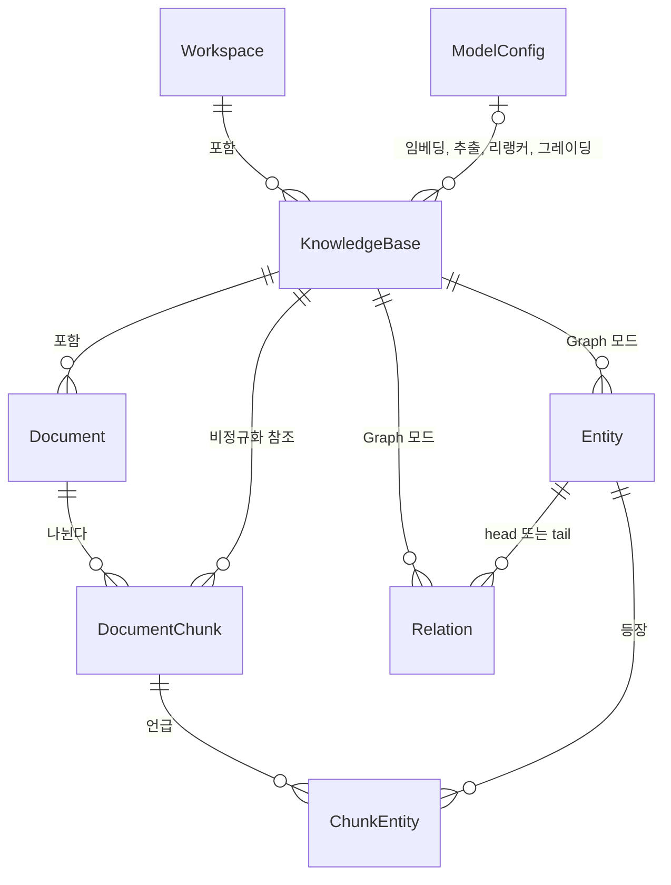
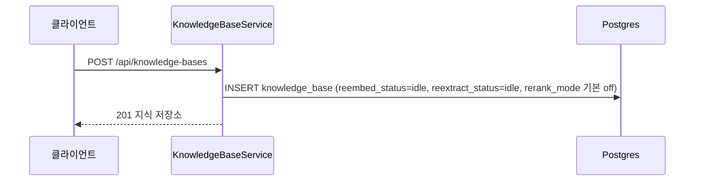
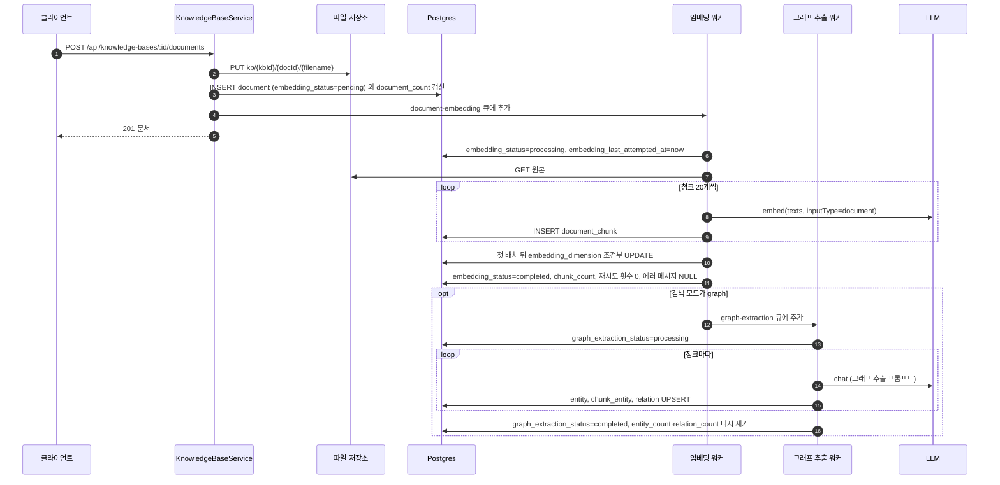

> 구현 상태: 구현됨 · 원문: `spec/data-flow/6-knowledge-base.md`, `spec/1-data-model.md` (§2.11 KnowledgeBase, §2.12 Document, §2.12.1~§2.12.4, Rationale «그래프 RAG 삭제 연쇄의 FK 인덱스 넷») · 용어: [용어 사전](../CLE-GLOSSARY.md)

## 개요

이 문서는 지식 저장소(Knowledge Base, `KnowledgeBase`) 영역의 엔티티와 데이터 흐름을 정한다. 지식 저장소, 문서(Document, `document`), 청크(chunk, `DocumentChunk`), Graph RAG 의 Entity(`GraphEntity`), Relation(`GraphRelation`), 청크-Entity 매핑(`ChunkEntity`)의 컬럼, 제약, 인덱스는 이 문서가 권위 정의다. 흐름마다 어느 테이블·큐·저장소에 무엇을 쓰는지도 여기서 정한다.

지식 저장소는 AI 에이전트가 참조하는 문서 지식을 모아 청크로 나누고 임베딩해 검색하는 파이프라인이다. 검색 모드(`rag_mode`)는 Vector RAG(`rag_mode=vector`)와 Graph RAG(`rag_mode=graph`) 두 가지이고 만들 때 정한 뒤 바꾸지 않는다. Graph 모드는 임베딩이 끝나면 그래프 추출(graph extraction)까지 이어진다.

검색은 세 단계다. 넓게 가져오기(Vector 코사인, Graph seed 와 확장), 선택적 리랭킹(`rerank_mode ≠ off`, 지식 저장소 하나일 때만), 동적 점수 컷(주입 토큰 예산과 주입 상한)이다. 저장 청크 차원(`embedding_dimension`)이 NULL 인 지식 저장소는 검색에서 통째로 빠진다.

범위 밖:

- 적재·재시도·회수 동작은 [문서 임베딩](CLE-KB-EMBED.md), 검색 규칙은 [RAG 검색](CLE-KB-SEARCH.md), 그래프 추출과 확장 검색은 [Graph RAG](CLE-KB-GRAPH.md) 에서 정한다.
- 화면과 API 목록은 [지식 저장소 관리](CLE-KB-MANAGE.md) 에서 정한다.
- 모델 설정(`ModelConfig`) 엔티티는 [LLM 사용량 기록](../CLE-AI/CLE-AI-USAGE.md), 모델 설정 화면은 [모델 설정](../CLE-AI/CLE-AI-MODELS.md) 에서 정한다.
- 전체 엔티티 지도와 인덱스 전략은 [데이터 모델 개요](../CLE-PLAT/CLE-PLAT-DATA.md), 큐 카탈로그는 [비동기 큐와 Redis 키 목록](../CLE-PLAT/CLE-PLAT-QUEUE.md), 파일 키 규칙은 [파일 저장소](../CLE-PLAT/CLE-PLAT-STORAGE.md), WebSocket 이벤트 카탈로그는 [WebSocket 이벤트와 명령](../CLE-API/CLE-API-WS-EVENTS.md) 에서 정한다.

코드 진입점:

| 파일 | 맡는 일 |
|---|---|
| `knowledge-base/knowledge-base.service.ts` | 지식 저장소·문서 CRUD, 파일 저장소 업로드·다운로드, 임베딩 테스트 |
| `knowledge-base/embedding/embedding.service.ts` | 문서를 청크로 나누고 임베딩 |
| `knowledge-base/graph/graph-extraction.service.ts` | 청크에서 Entity·Relation 추출 |
| `knowledge-base/graph/graph-query.service.ts` | 그래프 확장 |
| `knowledge-base/search/rag-search.service.ts` | Vector·Graph 검색과 리랭킹 분기 |
| `knowledge-base/search/rerank.service.ts` | cross-encoder 재점수와 LLM 그레이딩 |
| `knowledge-base/search/dynamic-cut.util.ts` | 동적 점수 컷 상수와 함수(`RAG_RECALL_K`, `applyDynamicCut`, `hnswEfSearchFor`) |
| `model-config/` | 리랭커(`kind=rerank`) 등 모델 설정 CRUD. 리랭킹 서비스는 `ModelConfigService.resolveConfig(id, ws, 'rerank')` 를 직접 부른다 |
| `knowledge-base/queues/*.ts` | BullMQ 큐(`document-embedding`, `graph-extraction`)와 부팅 시 처리 중 문서 회수 |

경로의 앞부분은 `codebase/backend/src/modules/` 다.

## 엔티티 관계

지식 저장소는 워크스페이스에 속하고 그 안에 문서가 있다. 문서는 청크로 나뉜다. Graph 지식 저장소에는 Entity 와 Relation 이 더 있다. 청크와 Entity 는 청크-Entity 매핑으로 이어진다. 지식 저장소는 용도별로 모델 설정을 최대 넷 가리킨다.

## KnowledgeBase (`knowledge_base`)

| 필드 | 타입 | 설명 |
|---|---|---|
| id | UUID | PK |
| workspace_id | UUID | FK → Workspace (CASCADE) |
| name | String | 지식 저장소 이름 |
| description | String? | 설명 |
| embedding_model_config_id | UUID? | FK → ModelConfig (SET NULL, 같은 워크스페이스, `kind=embedding`). 임베딩 모델 설정 참조(V091). 모델, 모델 프로바이더, 모델 출력 차원은 참조한 모델 설정에 있다. NULL 이면 워크스페이스 기본 Embedding 설정으로 해석한다. 유효 임베딩 모델은 API 응답의 읽기 전용 파생 값 `embeddingModel`(= 설정의 `defaultModel`)로 노출한다 |
| embedding_dimension | Integer? | 저장 청크 차원. 지금 저장된 청크 벡터의 실제 길이다. 아래 [임베딩 차원](#임베딩-차원) 참조 |
| chunk_size | Integer | 청크 크기 (기본 1000) |
| chunk_overlap | Integer | 청크 오버랩 (기본 200) |
| document_count | Integer | 문서 수 (캐시). 업로드 때 `COUNT(*)` 로 다시 센다 |
| reembed_status | Enum | 전체 재임베딩 재처리 잠금: `idle`(기본), `in_progress`. 원자적 비교 후 교체로 진입한다 |
| rag_mode | Enum | 검색 모드: `vector`(기본), `graph`. 만들 때만 정하고 바꿀 수 없다. CHECK `chk_kb_rag_mode` |
| extraction_llm_config_id | UUID? | FK → ModelConfig (SET NULL, 같은 워크스페이스, `kind=chat`). Graph 모드의 그래프 추출 LLM. NULL 이면 워크스페이스 기본 Chat 설정 |
| max_hops | Integer | Graph 검색의 최대 확장 깊이 (1 또는 2, 기본 1). CHECK `chk_kb_max_hops`. Vector 모드에서 무시 |
| vector_seed_top_k | Integer | Graph 검색의 vector seed 개수 (기본 5). Vector 모드에서 무시 |
| expanded_chunk_limit | Integer | Graph 확장으로 더 가져오는 청크 수의 상한 (기본 15). Vector 모드에서 무시 |
| entity_count | Integer | Entity 수 (캐시). Vector 모드는 늘 0 |
| relation_count | Integer | Relation 수 (캐시). Vector 모드는 늘 0 |
| reextract_status | Enum | 전체 그래프 재추출 재처리 잠금: `idle`(기본), `in_progress`. CHECK `chk_kb_reextract_status`. Vector 모드에서 쓰지 않음 |
| rerank_mode | Enum | 리랭킹 모드: `off`(기본), `cross_encoder`, `cross_encoder_llm` (V082). 검색할 때만 적용하므로 나중에 바꿀 수 있고 재임베딩이 필요 없다. `off` 면 아래 `rerank_*` 컬럼을 무시한다 |
| rerank_config_id | UUID? | FK → ModelConfig (SET NULL, 같은 워크스페이스, `kind=rerank`). 리랭커. NULL 이면 워크스페이스 기본 리랭커, 그것도 없으면 리랭킹 끔으로 강등 |
| rerank_candidate_k | Integer | 후보 풀: 리랭킹에 넣을 1차 후보 수 (기본 50, CHECK 1~200). `off` 에서 무시. 끔 경로의 내부 상수 `RAG_RECALL_K`(50)와 따로 돈다 |
| rerank_score_threshold | Float? | 점수 컷 임계: 리랭킹 점수가 이보다 낮은 후보를 버린다. `off` 에서 무시. NULL 일 때의 동작은 정의가 갈린다. [RAG 검색의 미결 사항](CLE-KB-SEARCH.md#미결-사항) 참조 |
| rerank_llm_config_id | UUID? | FK → ModelConfig (SET NULL, 같은 워크스페이스, `kind=chat`). `cross_encoder_llm` 의 LLM 그레이딩 모델. NULL 이면 워크스페이스 기본 Chat 설정 |
| created_at | Timestamp | 만든 시각 |
| updated_at | Timestamp | 고친 시각 |

인덱스: `(workspace_id)` (V128, CONCURRENTLY). 워크스페이스별 목록, 지식 저장소 선택 상자, 어시스턴트 도구 `list_knowledge_bases`, FK `ON DELETE CASCADE` 가 쓴다.

### 임베딩 차원

"차원" 은 두 가지를 구분해서 쓴다.

| 용어 | 필드 | 뜻 | 누가 채우나 |
|---|---|---|---|
| 모델 출력 차원 | `ModelConfig.dimension` | 그 모델이 내는 벡터 길이 | 모델 설정의 Embedding 연결 테스트가 감지해 자동 저장한다([모델 설정](../CLE-AI/CLE-AI-MODELS.md)) |
| 저장 청크 차원 | `knowledge_base.embedding_dimension` | 그 지식 저장소에 지금 저장된 청크 벡터의 실제 길이 | 적재 경로가 첫 배치의 벡터 길이로 채운다 |

저장 청크 차원의 규칙:

- 채우기: 문서의 첫 배치 임베딩 직후 `UPDATE knowledge_base SET embedding_dimension = $1 WHERE id = $2 AND (embedding_dimension IS NULL OR embedding_dimension = $1)` 로 채운다. 같은 지식 저장소의 첫 배치가 동시에 돌아도 같은 값이면 무해하다. 다른 값이면 0행이 바뀌고 다음 일관성 검사에서 문서가 실패한다([문서 임베딩](CLE-KB-EMBED.md)).
- NULL 로 되돌리는 경로는 둘이다.
  1. 전체 재임베딩의 잠금 진입 UPDATE(`reembed_status` `idle → in_progress`)와 같은 문장에서(V021).
  2. `PATCH /api/knowledge-bases/:id` 로 `embedding_model_config_id` 가 실제로 바뀔 때. 모델과 차원이 달라질 수 있어 다시 재야 한다.
- 전체 재임베딩의 마무리(잠금을 `idle` 로 되돌림)는 이 값을 건드리지 않는다. 다음 적재가 다시 채운다.
- NULL 은 "저장된 청크의 차원·벡터 공간이 현재 모델과 같다는 보장이 없다" 는 뜻이다. NULL 인 지식 저장소는 검색에서 미리 막는다([RAG 검색](CLE-KB-SEARCH.md)).
- 지식 저장소 폼의 임베딩 테스트(`POST /api/knowledge-bases/embedding-probe`)는 읽기 전용이다. 잰 값을 이 컬럼에 미리 저장하지 않는다. 모델 설정의 연결 테스트가 `ModelConfig.dimension` 에 저장하는 것과는 대상 필드가 달라 서로 보완한다.
- 검색은 이 값으로 `::vector(<dim>)` 캐스트와 `vector_dims` 필터를 건다. 지식 저장소를 묶는 기준도 `(embedding_model_config_id, embedding_dimension)` 이다.

두 값은 정상이라면 같다. 이미 벡터가 적재된 지식 저장소가 가리키는 Embedding 모델 설정의 차원은 나중에 바꿀 수 없다([모델 설정](../CLE-AI/CLE-AI-MODELS.md)). 두 값이 다를 때 어느 쪽을 기준으로 할지는 [미결 사항](#미결-사항) 에 있다.

### 재처리 잠금

지식 저장소 전체 재임베딩(`reembed_status`)과 전체 그래프 재추출(`reextract_status`)을 한 번에 하나만 돌게 하는 잠금이다.

| 상태 | 진입과 종료 |
|---|---|
| `idle` | 기본값. `idle → in_progress` 비교 후 교체로 진입한다 |
| `in_progress` | 전체 재임베딩·재추출이 진행 중이다. 같은 동작을 다시 요청하면 409 다(`KB_REEMBED_IN_PROGRESS`, `KB_REEXTRACT_IN_PROGRESS`). 마지막 작업의 마무리가 대기 중·처리 중 문서가 0건일 때만 한 번의 원자적 UPDATE 로 `idle` 로 되돌린다 |

- 재임베딩 잠금 진입 UPDATE 는 저장 청크 차원을 NULL 로 비우는 일을 함께 한다. 재추출 잠금은 차원을 건드리지 않는다.
- 문서가 없는 지식 저장소는 큐에 넣을 작업이 없어 진입할 때 바로 `idle` 로 되돌린다.
- 실패 문서 재시도는 잠금을 건드리지 않는다.
- 선점 판정은 바뀐 행 수로 한다([raw SQL 결과 읽기 규약](../CLE-ENG/CLE-ENG-RAWQUERY.md)).

## Document (`document`)

| 필드 | 타입 | 설명 |
|---|---|---|
| id | UUID | PK |
| knowledge_base_id | UUID | FK → KnowledgeBase (CASCADE) |
| name | String | 문서 이름 |
| file_type | Enum | `txt`, `md`, `pdf`, `csv` |
| file_url | String | 파일 저장소의 원본 키 |
| file_size | Integer | 파일 크기 (bytes) |
| embedding_status | Enum | `pending`, `processing`, `completed`, `error`, `failed`. `error` 는 재시도가 예약된 일시 오류, `failed` 는 재시도를 모두 썼거나 재시도하지 않는 에러로 인한 최종 실패다. 전이는 [문서 임베딩](CLE-KB-EMBED.md) |
| embedding_retry_count | Integer | 임베딩 재시도 누적 횟수. 성공하면 0 |
| embedding_last_attempted_at | Timestamp? | 마지막 임베딩 시도 시각. 처리 중 문서 회수의 임계 비교에 쓴다 |
| embedding_error_message | Text? | 마지막 임베딩 에러 메시지(사용자에게 보여도 되게 정리한 값). 성공하면 NULL |
| graph_extraction_status | Enum? | `pending`, `processing`, `completed`, `error`, `failed`. Vector 모드 문서는 NULL. 뜻은 `embedding_status` 와 같다 |
| graph_retry_count | Integer | 그래프 추출 재시도 누적 횟수. 성공하면 0 |
| graph_last_attempted_at | Timestamp? | 마지막 그래프 추출 시도 시각 |
| graph_error_message | Text? | 마지막 그래프 추출 에러 메시지 |
| chunk_count | Integer | 만든 청크 수 |
| tags | String[] | 태그 (업로드 때 `{}`) |
| metadata | JSONB | 메타데이터 (업로드 때 `{}`) |
| created_at | Timestamp | 만든 시각 |
| updated_at | Timestamp | 고친 시각 |

- `embedding_status` CHECK 는 V037 에서 `failed` 를 더해 갱신했고 V039 에서 옛 CHECK 를 지웠다. `graph_extraction_status` 는 V025·V026 이다.
- V038 은 `embedding_status IN (error, failed)` 등에 부분 인덱스를 둬 재시도와 처리 중 문서 회수 조회를 받친다.

## DocumentChunk (`document_chunk`)

| 필드 | 타입 | 설명 |
|---|---|---|
| id | UUID | PK |
| document_id | UUID | FK → Document (CASCADE) |
| knowledge_base_id | UUID | FK → KnowledgeBase (CASCADE). 청크가 속한 지식 저장소. 적재할 때 문서의 지식 저장소를 함께 적는 비정규화 값이다(V005, 인덱스 `idx_document_chunk_kb`) |
| chunk_index | Integer | 청크 순서 (0부터) |
| content | Text | 청크 텍스트 원문 |
| embedding | Vector | 벡터 임베딩 (pgvector). 차원을 고정하지 않는다(V021) |
| token_count | Integer | 청크의 추정 토큰 수 |
| metadata | JSONB | `{ page?: number, section?: string }`. Markdown 은 `section`, PDF 는 `page`, 텍스트·CSV 는 `{}` |
| created_at | Timestamp | 만든 시각 |

제약: `UNIQUE(document_id, chunk_index)`

벡터 인덱스는 차원별 부분 HNSW 다. 차원이 다른 벡터를 한 인덱스에 섞지 않는다. 검색 SQL 은 인덱스 정의와 같은 캐스트 식과 `vector_dims` 조건을 써야 인덱스를 탄다.

| 마이그레이션 | 차원 | 형태 |
|---|---|---|
| V022 | 768 | `vector` |
| V023 | 3072 | `halfvec` (pgvector 는 `vector` 의 HNSW 차원에 제한이 있어 3072 는 `halfvec` 캐스트를 쓴다) |
| V030 | 384 | `vector` |
| V031 | 1536 | `vector` |
| V032 | 512 | `vector` |
| V033 | 1024 | `vector` |

모두 `CREATE INDEX CONCURRENTLY` 라 파일 하나에 인덱스 하나를 둔다. 지원 차원 목록은 공유 상수 `SUPPORTED_EMBEDDING_DIMS` 다. `ivfflat` 인덱스는 쓰지 않는다.

## Entity (`entity`, 구현: `GraphEntity`)

Graph 지식 저장소에서만 쓴다. 동작은 [Graph RAG](CLE-KB-GRAPH.md) 에서 정한다.

| 필드 | 타입 | 설명 |
|---|---|---|
| id | UUID | PK |
| knowledge_base_id | UUID | FK → KnowledgeBase (CASCADE) |
| name | String | 정규화한 이름 (소문자, trim) |
| display_name | String | 사용자에게 보여 줄 원형 |
| type | Enum (DB 는 TEXT + CHECK `chk_entity_type`) | `person`, `organization`, `concept`, `location`, `event`, `other` |
| description | Text? | LLM 이 뽑은 짧은 설명 |
| mention_count | Integer | 지식 저장소 안 청크에서 언급된 횟수 (캐시) |
| last_seen_chunk_id | UUID? | 마지막으로 등장한 청크 (FK → DocumentChunk, SET NULL) |
| created_at | Timestamp | 처음 추출한 시각 |
| updated_at | Timestamp | 마지막으로 갱신한 시각 |

제약: `UNIQUE(knowledge_base_id, name, type)` (`uq_entity_kb_name_type`). 같은 지식 저장소 안에서 이름과 타입이 같은 Entity 는 한 행이다.

인덱스:

- `(knowledge_base_id, type)` (`idx_entity_kb_type`): 타입별 조회.
- `(knowledge_base_id, mention_count DESC)` (`idx_entity_kb_mention`): 중심성 정렬.
- `(last_seen_chunk_id) WHERE last_seen_chunk_id IS NOT NULL` (V117): 청크가 지워질 때 FK SET NULL 조회용.

## Relation (`relation`, 구현: `GraphRelation`)

| 필드 | 타입 | 설명 |
|---|---|---|
| id | UUID | PK |
| knowledge_base_id | UUID | FK → KnowledgeBase (CASCADE) |
| head_entity_id | UUID | FK → Entity (CASCADE) |
| tail_entity_id | UUID | FK → Entity (CASCADE) |
| predicate | String | 관계 서술어 (예: `founded`, `employs`, `is_part_of`). P0 는 자유 문자열이고 snake_case 를 권장한다 |
| evidence_chunk_id | UUID? | 추출 근거 청크 (FK → DocumentChunk, SET NULL) |
| weight | Integer | 같은 (head, predicate, tail) 이 여러 청크에서 나온 누적 횟수 |
| created_at | Timestamp | 처음 추출한 시각 |
| updated_at | Timestamp | 마지막으로 갱신한 시각 |

제약: `UNIQUE(knowledge_base_id, head_entity_id, predicate, tail_entity_id)` (`uq_relation_kb_head_pred_tail`, V025)

인덱스:

- `(knowledge_base_id, head_entity_id)`, `(knowledge_base_id, tail_entity_id)` (V027): head 기준 확장과 tail 기준 역방향 확장. 지식 저장소를 아는 검색용이다.
- `(evidence_chunk_id) WHERE evidence_chunk_id IS NOT NULL` (V118): 청크가 지워질 때 FK SET NULL 조회용.
- `(head_entity_id)` (V119), `(tail_entity_id)` (V120): Entity 가 지워질 때 FK CASCADE 조회용.

## ChunkEntity (`chunk_entity`, 구현: `GraphChunkEntity`)

| 필드 | 타입 | 설명 |
|---|---|---|
| chunk_id | UUID | PK 일부, FK → DocumentChunk (CASCADE) |
| entity_id | UUID | PK 일부, FK → Entity (CASCADE) |
| mention_text | String? | 청크에 나온 원형 표기 (정규화 전) |

제약: `PRIMARY KEY (chunk_id, entity_id)`

인덱스: `(entity_id)`. Entity 에서 청크로 거꾸로 찾는 데 쓴다(검색의 확장 단계).

## 데이터 흐름

### 지식 저장소 생성

요청에는 이름, 청크 크기, 청크 오버랩, 검색 모드(`vector` 또는 `graph`), 그래프 추출 LLM, 임베딩 모델 설정, 리랭킹 필드 다섯(`rerank_mode`, `rerank_config_id`, `rerank_candidate_k`, `rerank_score_threshold`, `rerank_llm_config_id`)이 들어간다. 리랭킹 필드는 V082 에서 더했고 기본 `rerank_mode='off'` 라 기존 지식 저장소와 필드를 비운 생성은 동작이 그대로다. 리랭킹 필드는 `PATCH /:id` 로도 바꿀 수 있고 검색할 때 적용하므로 재임베딩이 필요 없다.

### 문서 업로드, 임베딩, 그래프 추출

- 첫 배치 직후 저장 청크 차원을 채운다. 조건은 [임베딩 차원](#임베딩-차원) 에 있다.
- 재시도가 예약되면 문서의 `*_retry_count` 를 늘리고 `*_status='error'`, `*_error_message` 를 쓴다. 최종 실패면 `*_status='failed'` 와 `*_error_message` 를 쓴다.
- 단계마다 보내는 WebSocket 이벤트는 [문서 임베딩](CLE-KB-EMBED.md) 과 [Graph RAG](CLE-KB-GRAPH.md) 에 있다.

### 검색

검색은 쓰기 없이 읽기만 한다. `searchWithMeta(query, knowledgeBaseIds[], workspaceId, { topK?, threshold? })` 가 지식 저장소 메타(`rag_mode`, `embedding_*`, `rerank_*`)를 한 번에 읽는다. 저장 청크 차원이 NULL 이거나 지원 차원 밖인 지식 저장소를 뺀 뒤 Vector 묶음과 Graph 지식 저장소로 나눠 검색한다. 규칙은 [RAG 검색](CLE-KB-SEARCH.md) 과 [Graph RAG](CLE-KB-GRAPH.md) 에서 정한다.

### 재처리 동작별 쓰기

| 동작 | API 또는 시점 | 쓰는 것 |
|---|---|---|
| 문서 하나 재임베딩 | `POST /api/knowledge-bases/:id/documents/:docId/re-embed` | `document-embedding` 큐에 `reEmbed=true`. 워커가 기존 청크를 지우고 처음부터 쓴다 |
| 전체 재임베딩 | `POST /api/knowledge-bases/:id/re-embed` | `reembed_status` `idle → in_progress` 와 `embedding_dimension=NULL` 을 한 UPDATE 로. 전 문서 `embedding_status='pending'` 뒤 한꺼번에 큐 추가(`isKbBatch=true`). 마무리는 `reembed_status='idle'` 만 |
| 문서 하나 재추출 | `POST /api/knowledge-bases/:id/documents/:docId/re-extract` | `graph-extraction` 큐 추가. Graph 지식 저장소만 |
| 전체 재추출 | `POST /api/knowledge-bases/:id/re-extract` | `reextract_status` 잠금. 모든 `entity`·`relation`·`chunk_entity` 를 지우고 다시 채운다 |
| 실패 문서 재시도 | `POST /api/knowledge-bases/:id/retry-failed` | `*_status='failed'` 문서를 `pending` 으로(재시도 횟수·에러 메시지 초기화) 되돌리고 100건씩 큐 추가. 큐 추가가 실패하면 그 묶음을 `failed` 로 되돌린다. 잠금은 건드리지 않는다 |
| 처리 중 문서 회수 | 백엔드 부팅 때 한 번 | 10분 넘게 `processing` 인 문서를 한 번의 `UPDATE … RETURNING` 으로 `pending` 으로 되돌리고 큐에 다시 넣는다. 그래프도 같다 |

## 저장 위치별 쓰기

### Postgres

| 테이블 | 흐름 | 쓰는 컬럼 |
|---|---|---|
| `knowledge_base` | 생성 | `workspace_id`, `name`, `chunk_size`, `chunk_overlap`, `rag_mode`, `extraction_llm_config_id`, `embedding_model_config_id`, 그래프 검색 파라미터, `rerank_*`, 두 재처리 잠금 |
| `knowledge_base` | 적재 | `embedding_dimension`(첫 배치 뒤), `document_count` |
| `knowledge_base` | 그래프 추출 | `entity_count`, `relation_count` (한 번에 다시 세기, `KbStatsHelper`) |
| `document` | 업로드 | `knowledge_base_id`, `name`, `file_type`, `file_url`, `file_size`, `embedding_status='pending'`, `tags='{}'`, `metadata={}` |
| `document` | 임베딩 | `embedding_status`, `embedding_retry_count`, `embedding_last_attempted_at`, `embedding_error_message`, `chunk_count` |
| `document` | 그래프 추출 | `graph_extraction_status`, `graph_retry_count`, `graph_last_attempted_at`, `graph_error_message` |
| `document_chunk` | 임베딩 | `document_id`, `knowledge_base_id`, `chunk_index`, `content`, `embedding`, `token_count`, `metadata` |
| `entity` | 그래프 추출 | UPSERT. 겹치면 `mention_count` 증가 |
| `relation` | 그래프 추출 | UPSERT. 겹치면 `weight` 증가 |
| `chunk_entity` | 그래프 추출 | INSERT `chunk_id`, `entity_id`, `mention_text` |
| `entity`·`relation`·`chunk_entity` | 전체 재추출 | 모두 지운 뒤 다시 채운다 |

리랭커는 `model_config` 의 `kind=rerank` 행이다. `(workspace_id, kind)` 마다 기본 설정(`is_default=TRUE`)은 하나이고 부분 유일 인덱스로 강제한다. CRUD 는 `/api/model-configs?kind=rerank` 다. 컬럼은 [LLM 사용량 기록](../CLE-AI/CLE-AI-USAGE.md) 에서 정한다.

### Redis (BullMQ)

| 큐 | 넣는 곳 | 처리하는 곳 | 작업 내용 |
|---|---|---|---|
| `document-embedding` | 문서 업로드, 재임베딩 API, 실패 문서 재시도, 부팅 시 처리 중 문서 회수 | `DocumentEmbeddingProcessor` (동시 3) | `{ documentId, reEmbed?, isKbBatch?, knowledgeBaseId?, ragMode? }` (`document-embedding.queue.ts`) |
| `graph-extraction` | 임베딩 완료 연쇄, 재추출 API, 실패 문서 재시도, 부팅 시 처리 중 문서 회수 | `GraphExtractionProcessor` (동시 2) | `{ documentId, knowledgeBaseId, isKbBatch? }` (`graph-extraction.queue.ts`) |

### 파일 저장소

원본 파일은 키 `kb/{kbId}/{documentId}/{filename}` 로 둔다. 업로드할 때 PUT, 임베딩할 때 GET, 문서를 지울 때 DELETE 한다(`knowledge-base.service.ts` `uploadDocument`). 키 규칙과 워크스페이스 ID 를 키에 넣지 않는 이유는 [파일 저장소](../CLE-PLAT/CLE-PLAT-STORAGE.md) 에서 정한다.

### 외부 호출

| 대상 | 흐름 | 비고 |
|---|---|---|
| LLM 모델 프로바이더 (embed) | 적재, 검색 질의, 임베딩 테스트 | `LlmService.embed`. [LLM 사용량 기록](../CLE-AI/CLE-AI-USAGE.md) 에 쌓지 않는다 |
| LLM 모델 프로바이더 (chat) | 그래프 추출 | `LlmService.chat`, 그래프 추출 LLM 이나 워크스페이스 기본 Chat 설정. 사용량을 쌓는다 |
| 리랭커 모델 프로바이더 | 리랭킹 후보 재점수 | `RerankClientFactory`. `tei`(셀프 호스팅, API 키 불필요), `cohere`. 엔드포인트는 `kind=rerank` 모델 설정이 정한다 |
| LLM 모델 프로바이더 (chat, 그레이딩) | `cross_encoder_llm` 의 LLM 그레이딩 한 번 | `rerank_llm_config_id` 나 워크스페이스 기본 Chat 설정. 사용량을 쌓는다 |

### WebSocket

모든 이벤트는 문서 단위 채널 `kb:${documentId}` 로 간다. `KbEventType` union 은 11개(임베딩 6, 그래프 5)다. 이벤트별 뜻과 페이로드는 [문서 임베딩](CLE-KB-EMBED.md) 과 [Graph RAG](CLE-KB-GRAPH.md), 카탈로그는 [WebSocket 이벤트와 명령](../CLE-API/CLE-API-WS-EVENTS.md) 에 있다. 지식 저장소 단위 일괄 이벤트는 없다.

## 외부 의존

| 의존 | 방향 | 참고 |
|---|---|---|
| LLM 도메인 | 외부 | embed·chat 호출과 모델 설정 해석([LLM 클라이언트](../CLE-AI/CLE-AI-LLM.md)) |
| 리랭커 모델 프로바이더 | 외부 | `kind=rerank` 모델 설정이 정하는 엔드포인트(`tei`, `cohere`) |
| LLM 사용량 | 상호 참조 | Chat 계열 호출만 `llm_usage_log` 에 쌓는다([LLM 사용량 기록](../CLE-AI/CLE-AI-USAGE.md)) |
| 파일 저장소 | 상호 참조 | 원본 문서 파일([파일 저장소](../CLE-PLAT/CLE-PLAT-STORAGE.md)) |
| 실행 | 상호 참조 | AI 에이전트 노드가 지식 저장소 도구로 검색한다([RAG 검색](CLE-KB-SEARCH.md)) |
| RAG 품질 평가 | 상호 참조 | 오프라인 CLI 가 골든셋과 검색 지표로 검색 품질 회귀를 잰다([RAG 품질 평가](CLE-KB-EVAL.md)) |

## 미결 사항

- **모델 출력 차원과 저장 청크 차원이 다를 때의 기준**: 옛 데이터 모델 원문과 임베딩 파이프라인 원문, 모델 설정 원문은 `ModelConfig.dimension` 을 "차원의 단일 기준" 이라 부르고 `embedding_dimension` 을 그 값에서 채우는 파생 캐시라고 적는다. 반면 RAG 검색 원문과 데이터 흐름 원문은 `embedding_dimension` 을 적재 경로가 실제 벡터 길이로 채우는 저장 청크 차원이라고 적는다(관련: [문서 임베딩](CLE-KB-EMBED.md), [RAG 검색](CLE-KB-SEARCH.md), [모델 설정](../CLE-AI/CLE-AI-MODELS.md)). 이 문서는 [용어 사전 — AI 와 지식 저장소](../CLE-GLOSSARY-AI.md) 의 「임베딩 차원」 과 [용어 사전 — 결정이 필요한 표기](../CLE-GLOSSARY-OPEN.md) 의 「임베딩 차원이 파생 캐시인지 실측값인지」 항목(D46)에 따라 두 값을 다른 개념으로 정의했다. 현재 구현(`embedding.service.ts`)은 벡터 길이를 저장하고 적재·검색 어디서도 `ModelConfig.dimension` 과 비교하지 않는다. 자가호스팅·Azure 처럼 두 값이 어긋날 수 있을 때 적재를 막을지, 모델 출력 차원을 참고값으로만 둘지 결정 필요.

## 구현 위치

- `codebase/backend/migrations/V144__composite_fk_scope_model_config_not_valid.sql` (모델 설정 참조 넷의 복합 FK. SET NULL 은 참조 컬럼만 비운다)
- `codebase/backend/src/modules/knowledge-base/entities/*.entity.ts`
- `codebase/backend/src/modules/knowledge-base/knowledge-base.service.ts`
- `codebase/backend/src/modules/knowledge-base/queues/*.ts` (`document-embedding.queue.ts`, `graph-extraction.queue.ts`)
- `codebase/backend/migrations/V021__variable_embedding_dimension.sql`
- 차원별 임베딩 인덱스: `codebase/backend/migrations/V022__embedding_partial_hnsw_indexes.sql`, `codebase/backend/migrations/V023__halfvec_index_for_3072.sql`, `codebase/backend/migrations/V030__embedding_hnsw_384_512_1024.sql`, `codebase/backend/migrations/V031__embedding_hnsw_1536.sql`, `codebase/backend/migrations/V032__embedding_hnsw_512.sql`, `codebase/backend/migrations/V033__embedding_hnsw_1024.sql`
- 재임베딩 상태와 그래프: `codebase/backend/migrations/V024__kb_reembed_status.sql`, `codebase/backend/migrations/V025__graph_rag.sql`, `codebase/backend/migrations/V026__graph_extraction_status_nullable_index.sql`, `codebase/backend/migrations/V027__relation_head_tail_index.sql`
- 실패 재시도 상태: `codebase/backend/migrations/V037__kb_retry_failed_status.sql`, `codebase/backend/migrations/V038__kb_retry_failed_indexes.sql`, `codebase/backend/migrations/V039__drop_legacy_document_embedding_status_check.sql`
- 그래프 FK 인덱스: `codebase/backend/migrations/V117`, `codebase/backend/migrations/V118`, `codebase/backend/migrations/V119`, `codebase/backend/migrations/V120`. `knowledge_base(workspace_id)` 인덱스: `codebase/backend/migrations/V128`

## Rationale

### 검색 모드를 만들 때 정하고 바꾸지 않는 이유

Vector 와 Graph 는 같은 `document_chunk` 테이블을 쓰지만 Graph 는 `entity`, `relation`, `chunk_entity` 를 더 채운다. 모드를 나중에 바꾸게 하면(예: Vector 에서 Graph 로) 모든 청크를 다시 추출해야 하고 그동안 검색 일관성이 깨진다. P0~P2 에서는 만들 때 정하고 바꾸지 않는 것으로 단순하게 했다([Graph RAG](CLE-KB-GRAPH.md)).

### 임베딩과 그래프 추출을 큐로 잇고 나눈 이유

Graph 지식 저장소에서 새 문서가 임베딩되면 Entity·Relation 추출까지 자동으로 이어지는 것이 자연스럽다. `DocumentEmbeddingProcessor.onCompleted` 가 `graph-extraction` 큐에 자동으로 넣으므로 사용자가 API 를 더 부르지 않아도 된다. 큐를 나눈 이유는 동시성 정책이 달라야 해서다. 그래프 추출은 느리고 속도 제한이 빡빡한 LLM chat 이다. 임베딩은 빠르고 처리량이 큰 embed API 다(동시성은 임베딩 3, 그래프 2).

### 차원별 부분 HNSW 인덱스로 나눈 이유

저장 청크 차원은 지식 저장소마다 다르다(모델 프로바이더·모델별로 384, 512, 768, 1024, 1536, 3072 등). 한 인덱스에 여러 차원 벡터가 섞이면 검색이 비효율적이라 차원별 부분 HNSW 인덱스로 나눴다. 3072 차원은 pgvector 제약으로 `vector` 그대로는 HNSW 에 넣을 수 없어 V023 의 `halfvec` 인덱스를 쓴다.

### 리랭킹 설정을 검색할 때만 읽는 이유

`rerank_mode` 와 관련 설정은 검색할 때만 읽는다. 청크와 임베딩은 그대로이므로 모드를 켜고 끄거나 설정을 바꿔도 재임베딩이 필요 없다. 기본값이 `off` 라 기존 지식 저장소와 필드를 비운 생성은 동작이 그대로다(V082 하위 호환).

### 리랭커를 모델 설정의 `kind=rerank` 로 합친 이유

cross-encoder 리랭커는 chat·embedding 과 API 모양이 다르다(전용 `/rerank` 호출). 하지만 모델 프로바이더 자격 증명, 엔드포인트, 마스킹, SSRF 가드라는 설정 골격은 같다. 그래서 따로 두던 `rerank_config` 테이블(V081)을 `model_config` 의 `kind=rerank` 행으로 합쳤다(V090, 옛 테이블은 V092 에서 지움). API 모양 차이는 실행 층의 `RerankClientFactory` 가 `kind` 로 갈라 흡수한다. 합친 근거의 단일 기준은 [LLM 사용량 기록](../CLE-AI/CLE-AI-USAGE.md) 과 [모델 설정](../CLE-AI/CLE-AI-MODELS.md) 이다. rerank 행은 chat·embedding 행과 두 가지가 다르다. `api_key` 가 NULL 일 수 있고(`tei` 셀프 호스팅은 키가 필요 없다), `default_params` 가 없다(호출 파라미터 프리셋이 없다).

### 저장 청크 차원을 실제 벡터 길이로 정의한 이유

검색이 이 값으로 캐스트하고 필터를 거는 이유는 저장된 청크와 새 질의를 같은 차원·공간에서 비교하기 위해서다. 그러려면 이 값은 모델이 내는 차원이 아니라 지금 저장된 벡터의 길이여야 한다. 그래서 적재 경로만 경쟁 없이 채운다. 임베딩 테스트로 잰 값은 미리 저장하지 않는다. 모델을 바꾼 뒤 새 모델 차원을 미리 넣으면 저장된 청크는 여전히 옛 차원·공간이라 두 가지 문제가 생긴다. 차원이 다르면 `vector_dims` 필터에서 모두 빠져 여전히 0건이다. 차원이 우연히 같으면 옛 벡터와 새 질의를 비교해 틀린 결과가 나온다. [용어 사전 — 결정이 필요한 표기](../CLE-GLOSSARY-OPEN.md) 의 「임베딩 차원이 파생 캐시인지 실측값인지」 항목(D46)은 이 구분에 따라 모델 출력 차원과 저장 청크 차원을 다른 용어로 정했다.

### 그래프 RAG 삭제 연쇄에 FK 인덱스 넷을 둔 이유 (2026-09-18)

`entity`, `relation` 의 기존 인덱스는 모두 `knowledge_base_id` 가 앞이다. FK 트리거의 조회는 지식 저장소를 모르므로 `last_seen_chunk_id`, `evidence_chunk_id` 로 찾을 때 테이블 전체를 훑는다. 비용은 "자식 테이블 크기 × 연쇄로 지워지는 부모 행 수" 다. 처음에는 문서 재임베딩 빈도가 문제라고 예측했다. 다시 측정해 보니 가장 무거운 경로는 지식 저장소 삭제였다.

| 경로 | 연쇄 |
|---|---|
| 재임베딩(수동 재실행, 두 번째 이후 재시도. 문서의 청크를 지우고 다시 만든다), 문서 삭제 | 청크 하나마다 `entity.last_seen_chunk_id`, `relation.evidence_chunk_id` (SET NULL) |
| Entity 하나 삭제(관리 API) | `relation.head_entity_id`, `relation.tail_entity_id` (CASCADE) |
| 지식 저장소 삭제 | 모든 청크에 첫째 연쇄, 모든 Entity 에 둘째 연쇄 |

`head_entity_id`, `tail_entity_id` 는 위 공식의 전제 밖이다. `(knowledge_base_id, head_entity_id)` 가 이미 있어 PostgreSQL 18 의 skip scan 이 지식 저장소 값마다 건너뛰며 쓰므로 비용이 테이블 크기가 아니라 지식 저장소 수에 비례한다(Entity 하나 삭제에서 호출당 0.74 ms → 2.1 ms, 지식 저장소 100 → 400).

실측(PostgreSQL 18, V001~V116 적용, 지식 저장소마다 문서 50 × 청크 40, Entity 1,000, Relation 2,000, 워밍 뒤 1회):

| 규모 (청크 / Entity / Relation) | 재임베딩(문서 하나) | Entity 하나 삭제 | 지식 저장소 하나 삭제 |
|---|---|---|---|
| 200k / 100k / 200k (지식 저장소 100) | 434.4 ms | 1.47 ms | 20,841 ms |
| 800k / 400k / 800k (지식 저장소 400) | 1,795.7 ms | 4.25 ms | 129,941 ms |
| 800k, 인덱스 넷 추가 | 2.37 ms | 0.38 ms | 48.1 ms |

청크 쪽 둘(`last_seen_chunk_id`, `evidence_chunk_id`)만 더하면 지식 저장소 삭제가 1,238.5 ms 로 남는다. 그중 1.2 초가 `head`·`tail`(각 1,000회, 600 ms)이라 둘도 넣었다.

쓰기 비용(10만 행 INSERT 5회 중앙값, FK 컬럼을 모두 채운 최악): `entity` 부분 인덱스 `(last_seen_chunk_id)` 는 1,438.8 → 1,467.9 ms(+2.0%, 잡음 수준), `relation` 인덱스 셋은 1,879.3 → 2,084.0 ms(행당 +2.05 µs, +10.9%)다. 인덱스가 있는 쪽을 먼저 쟀으므로 오버헤드는 과대평가된 방향이다. 그래프 추출은 청크마다 LLM 호출(수백 ms~수 초) 뒤에 쓰므로 무시할 만하다. `last_seen_chunk_id` 와 `evidence_chunk_id` 는 NULL 을 허용해 부분 인덱스로 뒀다.

`chunk_entity` 는 `(chunk_id, entity_id)` PK 와 `(entity_id)` 인덱스가 모두 앞 컬럼이라 이미 쓰인다(지식 저장소 삭제에서 호출당 0.1 ms 미만).
