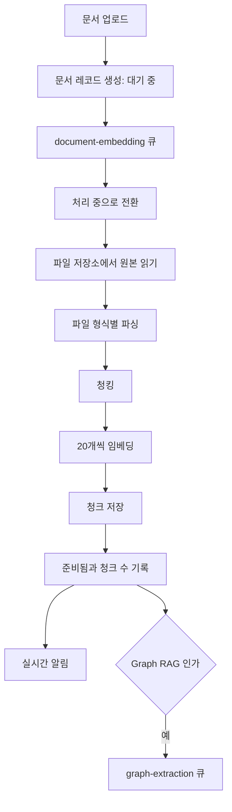
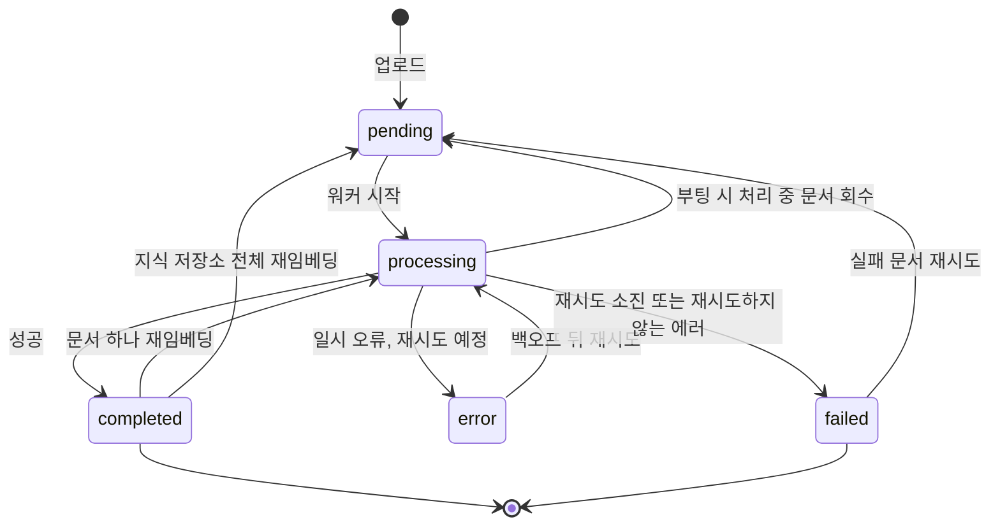

> 구현 상태: 구현됨 (문서 수정 시 자동 재임베딩만 미구현) · 원문: `spec/5-system/8-embedding-pipeline.md`, `spec/data-flow/6-knowledge-base.md` (§1.2·§1.5·§3.1), `spec/4-nodes/3-ai/_product-overview.md` (§3.5 KB-VE, §4 기술 결정, §5 NF-AI-02·NF-AI-06), `spec/4-nodes/4-integration/_product-overview.md` (§3.3 KB-VE) · 용어: [용어 사전](../CLE-GLOSSARY.md)

## 개요

문서 임베딩은 사용자가 지식 저장소(Knowledge Base, `KnowledgeBase`)에 올린 문서(Document, `document`)를 추가 조작 없이 검색할 수 있는 상태로 만드는 자동 적재 파이프라인이다. 업로드하면 백그라운드에서 파싱, 청킹, 임베딩(embedding), 저장이 이어진다. 결과는 청크(chunk, `DocumentChunk`) 단위로 저장되고 검색도 청크 단위로 한다.

사용자는 문서마다 진행 상태를 실시간으로 본다. 최종 실패한 문서만 골라 다시 돌리거나 지식 저장소 전체를 재임베딩(re-embed)할 수 있다. 일시 오류는 자동으로 재시도한다. 서버가 멈춰 처리 중으로 남은 문서는 서버가 뜰 때 되돌린다.

임베딩 모델은 지식 저장소 단위로 고른다. 지정하지 않으면 워크스페이스 기본 설정(`is_default`)의 Embedding 종류 모델 설정(`ModelConfig`, `kind=embedding`)을 쓴다. 모델이 비대칭(질의와 문서를 다르게 인코딩하는 e5·Gemini 계열)이면 적재는 문서용, 검색은 질의용 입력 유형(`inputType`)으로 자동 배선해 검색 품질을 지킨다.

범위 밖:

- 지식 저장소 목록·생성 폼·문서 목록 화면과 API 목록은 [지식 저장소 관리](CLE-KB-MANAGE.md) 에서 정한다.
- 저장된 청크를 찾는 규칙은 [RAG 검색](CLE-KB-SEARCH.md), Graph RAG 의 그래프 추출은 [Graph RAG](CLE-KB-GRAPH.md) 에서 정한다.
- 테이블 컬럼, 재처리 잠금, 저장 청크 차원의 정의는 [지식 저장소 데이터와 흐름](CLE-KB-DATA.md) 에서 정한다.
- 모델 설정 화면은 [모델 설정](../CLE-AI/CLE-AI-MODELS.md), `LlmService.embed` 호출 계약은 [LLM 클라이언트](../CLE-AI/CLE-AI-LLM.md) 에서 정한다.

## 요구사항

- REQ-EMBED-001 WHEN 사용자가 문서를 올리면 THE SYSTEM SHALL 문서 레코드를 대기 중(`pending`)으로 만들고 임베딩을 자동으로 시작한다. (원본: 통합 PRD KB-VE-01, AI PRD KB-VE-01)
- REQ-EMBED-002 WHEN 문서가 수정되면 THE SYSTEM SHALL 그 문서의 임베딩을 자동으로 다시 만든다. (원본: 통합 PRD KB-VE-03, AI PRD KB-VE-03) (미구현)
- REQ-EMBED-003 WHEN 큐 워커가 문서를 받으면 THE SYSTEM SHALL 상태를 처리 중(`processing`)으로 바꾸고 마지막 시도 시각(`embedding_last_attempted_at`)을 기록한다.
- REQ-EMBED-004 WHEN 파이프라인이 문서를 읽으면 THE SYSTEM SHALL 파일 저장소에서 원본을 내려받아 파일 형식별 파서로 텍스트를 뽑는다.
- REQ-EMBED-005 WHEN CSV 파일을 파싱하면 THE SYSTEM SHALL 각 행을 헤더를 키로 쓴 `키: 값` 텍스트 블록 하나로 바꾼다.
- REQ-EMBED-006 WHEN Markdown·PDF 파일을 파싱하면 THE SYSTEM SHALL 청크 메타데이터에 직전 제목(`section`)이나 1부터 세는 쪽 번호(`page`)를 채운다.
- REQ-EMBED-007 WHEN 텍스트를 청크로 나누면 THE SYSTEM SHALL 단락, 문장, 토큰 순서로 나누고 앞 청크의 마지막 `chunk_overlap` 토큰을 다음 청크 앞에 붙인다.
- REQ-EMBED-008 WHEN CSV 문서를 청크로 나누면 THE SYSTEM SHALL 행 단위로 묶고 행 중간에서 자르지 않는다.
- REQ-EMBED-009 WHEN 청크를 임베딩하면 THE SYSTEM SHALL 청크 20개씩 묶어 한 번에 호출한다.
- REQ-EMBED-010 WHEN 지식 저장소에 임베딩 모델 설정(`embedding_model_config_id`)이 지정돼 있으면 THE SYSTEM SHALL 그 모델 설정과 그 설정의 기본 모델(`defaultModel`)로 임베딩한다.
- REQ-EMBED-011 IF 지식 저장소에 임베딩 모델 설정이 없으면 THE SYSTEM SHALL 워크스페이스 기본 Embedding 모델 설정을 쓴다. 기본 설정도 없으면 404 `MODEL_CONFIG_NOT_FOUND` 로 끝낸다.
- REQ-EMBED-012 WHEN 문서 청크를 적재하거나 검색 질의를 임베딩하면 THE SYSTEM SHALL 같은 해석 규칙(`resolveEmbedding`)으로 모델 설정과 모델을 고른다.
- REQ-EMBED-013 WHEN 문서 청크를 임베딩하면 THE SYSTEM SHALL 입력 유형을 `document` 로 넘긴다.
- REQ-EMBED-014 WHEN 지식 저장소의 첫 배치 임베딩이 끝나면 THE SYSTEM SHALL 벡터 길이를 저장 청크 차원(`embedding_dimension`)에 조건부 UPDATE 로 채운다.
- REQ-EMBED-015 IF 이후 배치의 벡터 길이가 저장 청크 차원과 다르거나 빈 벡터가 오면 THE SYSTEM SHALL 재시도하지 않고 그 문서를 실패(`failed`)로 끝낸다.
- REQ-EMBED-016 WHEN 모든 청크를 저장하면 THE SYSTEM SHALL 문서를 준비됨(`completed`)으로 바꾸고 청크 수(`chunk_count`)를 기록하고 실시간 알림을 보낸다.
- REQ-EMBED-017 WHEN 업로드·문서 하나 재임베딩·지식 저장소 전체 재임베딩이 요청되면 THE SYSTEM SHALL 작업을 BullMQ 큐 `document-embedding` 에 넣는다.
- REQ-EMBED-018 WHILE 큐 워커가 돌고 있는 동안 THE SYSTEM SHALL 인스턴스마다 동시에 문서 3건까지만 처리한다.
- REQ-EMBED-019 WHEN Graph RAG 지식 저장소의 문서가 준비됨이 되면 THE SYSTEM SHALL 그래프 추출 큐 `graph-extraction` 에 이어서 작업을 넣는다.
- REQ-EMBED-020 WHEN 문서 하나 재임베딩이 요청되면 THE SYSTEM SHALL 202 로 응답하고 워커가 기존 청크를 지운 뒤 처음부터 다시 임베딩한다.
- REQ-EMBED-021 WHEN 지식 저장소 전체 재임베딩이 요청되면 THE SYSTEM SHALL 재처리 잠금을 `idle` 에서 `in_progress` 로 바꾸는 한 번의 UPDATE 로 저장 청크 차원도 NULL 로 비운다.
- REQ-EMBED-022 IF 지식 저장소 전체 재임베딩이 이미 진행 중이면 THE SYSTEM SHALL 409 `KB_REEMBED_IN_PROGRESS` 로 거절한다.
- REQ-EMBED-023 WHEN 전체 재임베딩 잠금을 얻으면 THE SYSTEM SHALL 모든 문서를 대기 중으로 되돌려 큐에 한꺼번에 넣고 202 와 문서 수(`documentCount`)로 응답한다.
- REQ-EMBED-024 WHEN 전체 재임베딩의 마지막 문서 작업이 끝나 대기 중·처리 중 문서가 0건이면 THE SYSTEM SHALL 재처리 잠금을 `idle` 로 되돌린다.
- REQ-EMBED-025 IF 전체 재임베딩을 요청한 지식 저장소에 문서가 없으면 THE SYSTEM SHALL 잠금을 바로 `idle` 로 되돌린다.
- REQ-EMBED-026 WHEN 배치 임베딩 호출이 60초 안에 응답하지 않으면 THE SYSTEM SHALL 그 호출을 실패로 처리한다.
- REQ-EMBED-027 IF 타임아웃·5xx·네트워크·429 같은 일시 오류가 나면 THE SYSTEM SHALL 상태를 재시도 중(`error`)으로 두고 1초·4초·16초 간격으로 최대 3번 다시 시도한다.
- REQ-EMBED-028 IF 401·403·422 같은 4xx, 차원 불일치, 빈 벡터가 나면 THE SYSTEM SHALL 재시도하지 않고 바로 실패로 끝낸다.
- REQ-EMBED-029 WHEN 두 번째 이후 시도를 시작하면 THE SYSTEM SHALL 재임베딩 모드(`reEmbed=true`)를 강제해 앞 시도가 남긴 청크를 지우고 다시 처리한다.
- REQ-EMBED-030 WHEN 임베딩이 성공하면 THE SYSTEM SHALL 재시도 횟수(`embedding_retry_count`)를 0 으로, 에러 메시지(`embedding_error_message`)를 NULL 로 되돌린다.
- REQ-EMBED-031 IF 재시도를 모두 쓰면 THE SYSTEM SHALL 문서를 실패로 두고 사용자가 다시 시도할 때까지 그대로 유지한다.
- REQ-EMBED-032 WHEN 임베딩이 실패하면 THE SYSTEM SHALL 사용자에게 보여도 되게 정리한 에러 메시지를 `embedding_error_message` 에 저장한다.
- REQ-EMBED-033 WHEN 백엔드가 부팅하면 THE SYSTEM SHALL 처리 중 상태로 10분 넘게 머문 문서를 대기 중으로 되돌리고 재임베딩 모드로 큐에 다시 넣는다.
- REQ-EMBED-034 IF 처리 중 문서의 마지막 시도 시각이 NULL 이면 THE SYSTEM SHALL 그 문서를 부팅 회수 대상에서 뺀다.
- REQ-EMBED-035 WHEN 실패 문서 재시도가 `embedding` 또는 `all` 범위로 요청되면 THE SYSTEM SHALL 실패 상태 문서만 재시도 횟수와 에러 메시지를 비우고 대기 중으로 되돌려 큐에 넣는다.
- REQ-EMBED-036 IF 실패 문서 재시도의 큐 추가가 실패하면 THE SYSTEM SHALL 그 묶음의 문서를 실패로 되돌린다.
- REQ-EMBED-037 WHEN 실패 문서 재시도를 처리하면 THE SYSTEM SHALL 지식 저장소 재처리 잠금을 건드리지 않는다.
- REQ-EMBED-038 WHEN 임베딩이 시작·진행·완료·재시도 예약·최종 실패되면 THE SYSTEM SHALL 문서 채널 `kb:{documentId}` 로 해당 이벤트를 보낸다.
- REQ-EMBED-039 WHEN 문서를 임베딩하면 THE SYSTEM SHALL 분당 100 청크 이상을 처리한다. (원본: AI PRD NF-AI-02)
- REQ-EMBED-040 WHILE 큐 워커가 돌고 있는 동안 THE SYSTEM SHALL 문서 임베딩을 최소 3건 병렬로 처리한다. (원본: AI PRD NF-AI-06)

## 파이프라인 흐름

업로드 요청이 오면 문서 레코드를 대기 중으로 만들고 큐에 넣은 뒤 바로 응답한다. 이후 과정은 큐 워커가 비동기로 처리한다. Graph RAG 지식 저장소는 임베딩이 끝난 뒤 그래프 추출이 이어진다.



단계별 테이블 쓰기 순서는 [지식 저장소 데이터와 흐름](CLE-KB-DATA.md) 의 업로드 흐름에서 정한다.

## 파일 파싱

### 지원 형식

| 파일 형식 | 파서 | 동작 |
|---|---|---|
| `.txt` | 직접 읽기 | UTF-8 텍스트를 그대로 쓴다 |
| `.md` | 직접 읽기 | 렌더링하지 않은 Markdown 원문을 쓴다 |
| `.pdf` | `pdf-parse` | 텍스트를 뽑는다. 이미지 안의 텍스트는 지원하지 않는다 |
| `.csv` | 직접 파싱 | 행 단위 텍스트로 바꾼다. 헤더를 키로 쓴다 |

Markdown·PDF·텍스트는 구간(segment) 단위로 파싱한다(`parseDocumentSegments`). Markdown 은 직전 제목을 `section` 으로, PDF 는 1부터 세는 쪽 번호를 `page` 로 청크 메타데이터에 채운다. 구간별로 청킹한 뒤 청크 번호는 구간 경계를 넘어 이어서 매긴다. 텍스트와 CSV 는 위치 정보가 없어 메타데이터가 `{}` 다.

### CSV 변환 규칙

각 행을 독립된 텍스트 블록으로 바꾼다.

```text
원본
name,age,department
Alice,30,Engineering
Bob,25,Marketing

변환 결과 (행마다 하나)
"name: Alice, age: 30, department: Engineering"
"name: Bob, age: 25, department: Marketing"
```

## 청킹

### 청크 크기와 오버랩

| 파라미터 | 기본값 | 뜻 |
|---|---|---|
| `chunk_size` | 1000 | 청크 하나의 최대 토큰 수 |
| `chunk_overlap` | 200 | 이웃 청크가 겹치는 토큰 수 |

두 값은 지식 저장소마다 설정한다([지식 저장소 관리](CLE-KB-MANAGE.md)). 토큰 수는 실제 토크나이저가 아니라 추정값이다. 추정 함수는 `chunking/text-chunker` 의 `estimateTokens`(글자 수 / 3)이며 [RAG 검색](CLE-KB-SEARCH.md) 의 주입 토큰 예산 계산도 같은 함수를 쓴다.

### 분할 규칙

1. 단락 우선: `\n\n` 을 기준으로 먼저 나눈다.
2. 문장 폴백: 단락이 `chunk_size` 를 넘으면 문장 끝(`.`, `!`, `?`)을 기준으로 나눈다.
3. 강제 분할: 문장도 `chunk_size` 를 넘으면 토큰 단위로 자른다.
4. 오버랩: 앞 청크의 마지막 `chunk_overlap` 토큰을 다음 청크 앞에 붙인다.

### CSV 청킹

CSV 는 공통 `chunkText()` 대신 전용 경로 `chunkCsv()`(`chunking/csv-chunker.ts`)를 쓴다. `doc.fileType === 'csv'` 일 때 이 경로로 간다.

- 행 단위로 청크를 만든다.
- `chunk_size` 안에서 여러 행을 한 청크로 묶는다.
- 행 중간에서 자르지 않는다.

## 임베딩 생성

### 배치

- `LlmService.embed()` 의 입력에 문자열 배열을 넘겨 한 번에 임베딩한다.
- 배치 크기는 청크 20개다. API 요청 수를 줄이려는 값이다.
- 모델 프로바이더별 배치 한도를 지킨다(OpenAI 2048개). Anthropic 은 임베딩을 지원하지 않는다.
- 배치마다 임베딩 직후 바로 청크를 저장한다. 메모리에 쌓아 두지 않는다.

### 임베딩 모델 해석

지식 저장소의 임베딩에 쓸 `(모델 설정, 모델)` 은 `ModelConfigService.resolveEmbedding` 이 두 단계로 정한다. 임베딩은 Chat 설정을 빌려 쓰지 않고 `kind=embedding` 모델 설정이 직접 소유한다.

1. 지정 경로: `knowledge_base.embedding_model_config_id` 가 있으면 그 `kind=embedding` 모델 설정을 읽고 그 설정의 `defaultModel` 을 쓴다. 모델, 모델 프로바이더, 모델 출력 차원은 이 설정에 있다.
2. 워크스페이스 기본 설정: `embedding_model_config_id` 가 없으면 워크스페이스 기본 `kind=embedding` 모델 설정과 그 `defaultModel` 을 쓴다. 둘 다 없으면 404 `MODEL_CONFIG_NOT_FOUND` 다.

문서 적재(`embedding.service`)와 검색 질의(`rag-search.service`)가 같은 해석을 거치므로 질의와 문서의 차원·엔드포인트가 어긋나지 않는다. 검색이 지식 저장소를 묶는 기준(`embedding_model_config_id` 와 저장 청크 차원)은 [RAG 검색](CLE-KB-SEARCH.md) 에서 정한다. 임베딩 모델을 바꾼 뒤의 재임베딩 필요성은 아래 [재임베딩](#재임베딩) 에서 다룬다.

### 차원

저장 청크 차원(`embedding_dimension`)과 모델 출력 차원(`ModelConfig.dimension`)의 정의는 [지식 저장소 데이터와 흐름](CLE-KB-DATA.md) 에서 정한다. 이 파이프라인에서 지키는 규칙은 다음과 같다.

- 한 지식 저장소의 모든 문서는 같은 임베딩 모델과 같은 차원을 쓴다. `document_chunk.embedding` 컬럼은 차원을 고정하지 않는다.
- 첫 배치 직후 벡터 길이로 저장 청크 차원을 채운다. 조건은 `WHERE embedding_dimension IS NULL OR embedding_dimension = $1` 이라 같은 지식 저장소의 첫 배치가 동시에 돌아도 같은 값이면 무해하다.
- 이후 배치는 그 차원과 같아야 한다. 다르면 "지식 저장소 전체 재임베딩이 필요하다" 는 에러로 문서를 실패시킨다.
- 임베딩 모델을 바꾸면 전체 재임베딩이 필요하다.
- 저장 청크 차원을 NULL 로 되돌리는 경로는 두 가지다. 하나는 임베딩 모델 설정을 실제로 바꾸는 지식 저장소 수정(`PATCH /api/knowledge-bases/:id`)이다. 다른 하나는 전체 재임베딩 잠금을 얻는 UPDATE 다([지식 저장소 전체](#지식-저장소-전체)). NULL 인 동안 그 지식 저장소는 검색에서 빠진다([검색에서 빠지는 동안](#검색에서-빠지는-동안)).
- 모델 설정 쪽의 모델 출력 차원(`ModelConfig.dimension`)이 바뀌어도 저장 청크 차원은 NULL 로 돌아가지 않는다. 이때는 적재 중 차원 검사(REQ-EMBED-015)가 어긋난 벡터를 막는다. 정의와 가드 위치는 [미결 사항](#미결-사항) 참조.

모델별 차원 예시(참고용, 실제 값은 모델 설정에 있다):

| 모델 | 차원 |
|---|---|
| `text-embedding-3-small` | 1536 |
| `text-embedding-3-large` | 3072 |
| `text-embedding-ada-002` | 1536 |

모델 프로바이더별 기본 모델은 다르다(예: OpenAI 는 `text-embedding-3-small`).

### 입력 유형 (비대칭 임베딩)

일부 임베딩 모델은 질의와 문서(passage)를 다르게 인코딩해야 검색 품질이 나온다. `LlmService.embed(config, texts, model?, opts?, inputType?)` 의 입력 유형(`'query' | 'document'`, 생략하면 `'document'`)으로 경로를 나눈다. 매핑의 단일 기준은 순수 함수 `codebase/backend/src/modules/llm/embedding-input-type.ts` 다. 서비스 시그니처는 [LLM 클라이언트](../CLE-AI/CLE-AI-LLM.md) 에서 정한다.

| 모델 프로바이더 / 모델 | 적용 방식 | query | document |
|---|---|---|---|
| e5 계열 (multilingual-e5, e5-small·base·large) | 입력 텍스트 접두사 | `query: ` | `passage: ` |
| Google Gemini (text-embedding-004 등) | `embedContent.config.taskType` | `RETRIEVAL_QUERY` | `RETRIEVAL_DOCUMENT` |
| OpenAI text-embedding-3·ada, bge-m3, 매칭되지 않는 모델 | 변경 없음(대칭) | 없음 | 없음 |

- 적재(문서 청크)는 `document`, 검색 질의는 `query` 다.
- `*-instruct` e5 변형은 입력 형식이 달라 변경하지 않는다.
- 입력 유형을 도입하기 전에 색인한 지식 저장소는 문서가 접두사 없이 임베딩돼 있다. 질의에만 접두사가 붙으면 비대칭이 깨지므로 e5·Gemini 계열을 쓰는 기존 지식 저장소는 재임베딩해야 한다. 새로 임베딩하는 문서부터는 양쪽이 일관되게 적용된다.

### 사용량 기록

임베딩 호출은 [LLM 사용량 기록](../CLE-AI/CLE-AI-USAGE.md) 에 쌓지 않는다. Chat 계열 호출만 적재한다.

## 저장

청크는 `document_chunk` 테이블에 본문, 벡터, 토큰 수, 위치 메타데이터와 함께 저장한다. 컬럼, 제약, 차원별 부분 HNSW 인덱스는 [지식 저장소 데이터와 흐름](CLE-KB-DATA.md) 에서 정한다. 차원이 섞인 단일 인덱스는 쓰지 않는다.

## 큐와 동시 처리

문서 임베딩은 BullMQ 큐 `document-embedding` 으로 처리한다. 진입점은 세 곳이다.

| 진입점 | API |
|---|---|
| 문서 업로드 직후 | `POST /api/knowledge-bases/:id/documents` |
| 문서 하나 재임베딩 | `POST /api/knowledge-bases/:id/documents/:docId/re-embed` |
| 지식 저장소 전체 재임베딩 | `POST /api/knowledge-bases/:id/re-embed` |

큐를 쓰면 프로세스가 재시작돼도 작업이 사라지지 않는다. 여러 인스턴스에서도 Redis 가 동시성과 지속성을 맡는다. 실패 문서 재시도와 처리 중 문서 회수도 같은 큐에 넣는다. 큐 이름과 작업 내용(payload)은 [지식 저장소 데이터와 흐름](CLE-KB-DATA.md) 과 [비동기 큐와 Redis 키 목록](../CLE-PLAT/CLE-PLAT-QUEUE.md) 에 있다.

- 동시 처리 한도: `DocumentEmbeddingProcessor` 의 워커 동시성으로 제한하며 기본 3건이다(`@Processor(QUEUE, { concurrency: 3 })`). LLM API 속도 제한과 메모리 사용량을 고려한 값이다. AI 제품 요구사항의 비기능 기준은 동시 임베딩 최소 3건 병렬(NF-AI-06)과 분당 100 청크 이상(NF-AI-02)이다. 기본 동시성 3 은 병렬 하한과 같은 값이다.
- Graph RAG 연쇄: 지식 저장소의 검색 모드(`rag_mode`)가 `graph` 면 워커가 문서를 준비됨으로 바꾼 직후 `graph-extraction` 큐에 다음 작업을 넣는다. 사용자가 따로 조작하지 않아도 그래프 추출이 시작된다. 추출 과정은 [Graph RAG](CLE-KB-GRAPH.md) 에서 정한다.

## 재임베딩

### 문서 하나

`POST /api/knowledge-bases/:id/documents/:docId/re-embed`

1. 권한과 문서 존재를 확인한다.
2. `document-embedding` 큐에 `{ documentId, reEmbed: true }` 를 넣고 202 로 응답한다.
3. 워커가 기존 청크를 지우고 다시 임베딩한다.

### 지식 저장소 전체

`POST /api/knowledge-bases/:id/re-embed`

1. 재처리 잠금(`reembed_status`)을 원자적 비교 후 교체(CAS)로 얻는다. 같은 UPDATE 에서 저장 청크 차원도 NULL 로 비운다.

   ```sql
   UPDATE knowledge_base
     SET reembed_status = 'in_progress', embedding_dimension = NULL
     WHERE id = $1 AND workspace_id = $2 AND reembed_status = 'idle'
     RETURNING id
   ```

   바뀐 행이 0개면 409 `KB_REEMBED_IN_PROGRESS` 다. 판정은 바뀐 행 수로 한다([raw SQL 결과 읽기 규약](../CLE-ENG/CLE-ENG-RAWQUERY.md)).
2. 모든 문서를 대기 중으로 되돌리고 큐에 한꺼번에 넣는다(`addBulk`). 각 작업에 `isKbBatch: true`, `knowledgeBaseId` 를 싣는다.
3. 바로 202 와 `{ documentCount }` 로 응답한다.
4. 마지막 작업이 끝나거나 실패할 때 `DocumentEmbeddingProcessor` 가 그 지식 저장소의 대기 중·처리 중 문서가 0건인지 확인한다. 0건이면 잠금을 `idle` 로 되돌린다. 이 마무리는 잠금만 되돌리고 저장 청크 차원은 건드리지 않는다.
5. 문서가 없는 지식 저장소는 큐에 넣을 작업이 없어 마무리가 불리지 않는다. 그래서 진입할 때 바로 `idle` 로 되돌린다.

Graph RAG 지식 저장소는 재임베딩한 문서의 그래프 추출도 이어서 다시 한다([Graph RAG](CLE-KB-GRAPH.md)).

### 검색에서 빠지는 동안

저장 청크 차원이 NULL 인 지식 저장소는 검색에서 빠진다. 저장된 청크가 현재 모델과 같은 차원·벡터 공간이라는 보장이 없어서다. 이 상태는 두 경우에 생긴다.

- 전체 재임베딩이 진행 중일 때(`reembed_status='in_progress'`). 끝나면 다시 검색된다.
- 임베딩 모델 설정을 바꿔 저장 청크 차원이 NULL 이 됐지만 재임베딩을 아직 하지 않았을 때(`reembed_status='idle'`). 사용자가 전체 재임베딩을 실행할 때까지 이어진다.

검색에서 빠진 사실은 조용히 숨기지 않는다. 에이전트에는 검색 불가(`not_searchable`) 결과로, 검색 진단에는 `skipReason="kb_unsearchable"` 로 알린다([RAG 검색](CLE-KB-SEARCH.md)). 화면의 목록 카드 경고와 상세 배너는 [지식 저장소 관리](CLE-KB-MANAGE.md) 에서 정한다.

## 실시간 알림

채널은 문서 단위 `kb:${documentId}` 다. 지식 저장소 ID 가 아니라 문서 ID 가 채널 키다. 모든 이벤트에 `documentId` 와 `timestamp`(ISO 8601)가 자동으로 붙는다. 백엔드는 `WebsocketService.emitKbEvent` 로 보낸다. 이벤트 union 의 권위 정의는 `websocket-events.types.ts` 의 `KbEventType` 이다. 전체 카탈로그는 [WebSocket 이벤트와 명령](../CLE-API/CLE-API-WS-EVENTS.md) 에서 정한다.

| 이벤트 | 페이로드 | 시점 |
|---|---|---|
| `document:embedding_started` | `{ documentId, knowledgeBaseId }` | 처리 중 시작 |
| `document:embedding_progress` | `{ documentId, progress: number }` | 청크 배치가 끝날 때마다(0~100) |
| `document:embedding_completed` | `{ documentId, chunkCount }` | 완료 |
| `document:embedding_retry` | `{ documentId, attempt: number, maxAttempts: number, error: string }` | 일시 오류 뒤 재시도를 큐에 넣기 직전 |
| `document:embedding_failed` | `{ documentId, error: string }` | 재시도를 모두 썼거나 재시도하지 않는 에러로 최종 실패 |
| `document:embedding_error` | `{ documentId, error: string }` | union 에 선언만 있고 보내는 경로가 없다 |

실제로 보내는 임베딩 이벤트는 다섯 가지다. 일시 오류는 상태를 재시도 중으로 바꾸면서 `document:embedding_retry` 로 알린다. `document:embedding_error` 는 앞으로의 호환을 위해 union 에 남겨 둔 멤버이며 영구 실패 신호로 쓰지 않는다. 영구 실패는 `document:embedding_failed` 다.

Graph RAG 문서는 같은 채널로 그래프 추출 이벤트 다섯 가지가 더 온다. 페이로드는 [Graph RAG](CLE-KB-GRAPH.md) 에서 정한다. 지식 저장소 단위 일괄 이벤트는 없다.

## 재시도와 실패

LLM 호출의 일시 오류로 문서가 "처리 중" 에 영구히 머무는 것을 막으려고 자동 재시도와 명시적인 최종 실패 상태를 둔다.

### 자동 재시도

- 배치 임베딩 호출마다 60초 타임아웃(`withTimeout(60_000)`)을 건다.
- 문서 단위로 `retryWithBackoff(maxRetries=3, baseDelayMs=1_000)` 를 쓴다. 타임아웃, 5xx, 네트워크, 429 같은 일시 오류는 1초, 4초, 16초 간격(±30% 지터)으로 최대 3번 다시 시도한다(`EMBED_MAX_RETRIES`, `EMBED_BASE_DELAY_MS`). LlmService 안쪽의 속도 제한 재시도는 끄고 이 바깥 재시도만 쓴다.
- 재시도하지 않는 에러: 4xx(401·403·422), 차원 불일치, 빈 벡터 같은 도메인 에러는 바로 실패로 끝난다.
- 두 번째 시도부터는 `reEmbed=true` 를 강제한다. 앞 시도가 일부만 저장한 청크를 지우고 다시 처리하므로 몇 번을 돌려도 결과가 같다.
- 재시도 횟수(`embedding_retry_count`)는 시도가 실패할 때마다 늘고 성공하면 0 이 된다.

### 상태 전이

문서의 임베딩 상태(`embedding_status`)는 다섯 값이다. 그래프 추출 상태(`graph_extraction_status`)도 같은 의미로 쓴다.



| 값 | 본문 표기 | 뜻 |
|---|---|---|
| `pending` | 대기 중 | 큐에 들어갔고 워커가 아직 시작하지 않았다 |
| `processing` | 처리 중 | 워커가 처리하고 있다 |
| `completed` | 준비됨 | 청크 저장까지 끝났다 |
| `error` | 재시도 중 | 일시 오류가 났고 다음 시도가 예약돼 있다. 재시도 횟수가 1 이상이다 |
| `failed` | 실패 | 최종 실패. 사용자가 문서 하나 재임베딩, 실패 문서 재시도, 전체 재임베딩 가운데 하나를 실행할 때까지 그대로다 |

화면 라벨과의 대응은 [용어 사전](../CLE-GLOSSARY.md) 의 지식 저장소 값 표를 따른다. 화면 표시 방식은 [지식 저장소 관리](CLE-KB-MANAGE.md) 에서 정한다.

### 처리 중 문서 회수

`StuckDocumentRecoveryService`(`OnApplicationBootstrap`)가 백엔드가 부팅할 때 한 번 다음 문서를 찾는다.

```sql
SELECT id FROM document
 WHERE embedding_status = 'processing'
   AND embedding_last_attempted_at IS NOT NULL
   AND embedding_last_attempted_at < NOW() - INTERVAL '10 minutes';
```

- 찾은 문서는 한 번의 `UPDATE … RETURNING` 으로 대기 중으로 되돌리고 `reEmbed=true` 로 큐에 다시 넣는다.
- 여러 인스턴스가 동시에 부팅해도 행 잠금과 `RETURNING` 으로 두 번 넣지 않는다.
- 마지막 시도 시각이 NULL 인 옛 문서는 잘못 회수하지 않도록 뺀다.
- 그래프 추출도 같은 방식으로 회수한다(`graph_last_attempted_at` 기준, [Graph RAG](CLE-KB-GRAPH.md)).

주기 작업이 아니라 부팅할 때 한 번만 돈다. 실행 엔진의 [장애 복구와 안전 종료](../CLE-EXEC/CLE-EXEC-RECOVERY.md) 와는 다른 동작이다.

### 실패 문서 재시도

`POST /api/knowledge-bases/:id/retry-failed` `{ scope: 'embedding' | 'graph' | 'all' }`

- `scope` 가 `embedding` 이나 `all` 이면 임베딩 상태가 실패인 문서만 다시 넣는다.
- 큐에 넣기 직전에 `embedding_retry_count = 0`, `embedding_error_message = NULL`, `embedding_status = 'pending'` 으로 되돌린다.
- 100건씩 나눠 한꺼번에 큐에 넣는다(`isKbBatch=false`). 큐 추가가 실패하면 그 묶음의 문서를 실패로 되돌린다. 상태 UPDATE 와 큐 추가가 원자적이지 않아서 둔 보완이다.
- 지식 저장소 재처리 잠금은 건드리지 않는다. 일부 문서만 다시 돌리는 가벼운 작업이라서다.
- 권한은 편집자(`editor`) 이상, 속도 제한은 60초에 3번이다.
- `graph` 범위의 동작은 [Graph RAG](CLE-KB-GRAPH.md) 에서 정한다. 화면에서는 임베딩과 그래프 추출을 두 버튼으로 나눠 `embedding` 이나 `graph` 만 보낸다. `all` 은 운영과 스크립트용이다.

## 미결 사항

- **저장 청크 차원의 정의와 Embedding 차원 변경 가드**: 두 결정은 서로 맞물려 있어 함께 정해야 한다. 저장 청크 차원과 모델 출력 차원이 어긋날 때 무엇을 기준으로 할지는 [지식 저장소 데이터와 흐름](CLE-KB-DATA.md#미결-사항) 의 미결 사항이다. Embedding 모델 설정의 차원 변경을 어디서 막을지는 [모델 설정](../CLE-AI/CLE-AI-MODELS.md#미결-사항) 의 미결 사항이다. 현재 모델 설정 층에는 차원 변경 가드가 없다. 보호는 이 문서의 NULL 초기화 두 경로와 적재 중 차원 검사가 맡는다([차원](#차원)). 저장 청크 차원을 실제 벡터 길이로 둘지 모델 출력 차원의 파생 값으로 둘지, 그에 맞춰 가드를 모델 설정 층에 둘지 결정 필요.

## 구현 위치

- `codebase/backend/src/modules/knowledge-base/embedding/embedding.service.ts`
- `codebase/backend/src/modules/knowledge-base/chunking/text-chunker.ts`
- `codebase/backend/src/modules/knowledge-base/chunking/csv-chunker.ts`
- `codebase/backend/src/modules/knowledge-base/parsers/*.ts`
- `codebase/backend/src/modules/knowledge-base/queues/document-embedding.processor.ts`
- `codebase/backend/src/modules/knowledge-base/queues/stuck-document-recovery.service.ts`
- `codebase/backend/src/modules/model-config/model-config.service.ts` (`resolveEmbedding`)
- `codebase/backend/src/modules/llm/embedding-input-type.ts`
- `codebase/backend/src/modules/knowledge-base/search/rag-search.service.ts` (질의 임베딩)

## Rationale

### 다중 차원 임베딩과 지식 저장소 단위 모델 선택

`embedding` 컬럼이 여러 차원을 받아야 한다는 요구와, 지식 저장소마다 그 저장소의 모델로 질의를 임베딩해 그룹별로 따로 검색해야 한다는 요구를 함께 풀려고 정했다.

- 차원: 여러 차원을 지원한다. 스키마를 바꾸고 차원별 부분 HNSW 인덱스를 둔다.
- 모델 변경: 허용한다. 대신 지식 저장소 단위 수동 재임베딩 버튼을 둔다.
- 검색: 지식 저장소의 모델과 질의 임베딩 모델을 맞춘다.

주요 결과:

- V021 에서 `document_chunk.embedding` 을 차원 없는 `vector` 로 바꾸고 `knowledge_base.embedding_dimension` 을 추가했다.
- V022 에서 차원별 부분 HNSW 인덱스를 `CREATE INDEX CONCURRENTLY` 로 나눴다. V023 은 pgvector 0.7 이상의 `halfvec` 으로 3072 차원 인덱스를 붙였다. V030~V033 에서 차원을 보강했다. 검색 SQL 은 차원별 캐스트(`getEmbeddingCastType(dim)`)로 인덱스 정의와 같은 식을 쓴다.
- 첫 임베딩 때 저장 청크 차원을 채우고 이후 배치는 차원 일관성을 강제한다. 빈 벡터도 에러로 본다.
- 임베딩 모델 설정을 실제로 바꾸면 저장 청크 차원을 NULL 로 되돌린다.
- 공유 상수 `embedding/embedding-dimensions.const.ts`(`SUPPORTED_EMBEDDING_DIMS`, `EMBEDDING_MODEL_PATTERN`)를 검색과 생성·수정 DTO 가 함께 쓴다.
- V024 에서 메모리 안 잠금(`inFlightReEmbeds`)과 `p-limit(5)` 동시 큐잉 상한을 BullMQ 큐와 DB 컬럼 잠금(`reembed_status`)으로 바꿨다. 워커 동시성 3 이 예전 폴링 상한을 대신한다. 여러 인스턴스에서도 잠금이 성립한다.
- Embedding 종류 모델 설정을 독립된 설정으로 올리면서 모델 목록 조회의 `type='embedding'` 서비스 필터가 필요 없어졌다. 목록 API 의 입력 검증은 [모델 설정](../CLE-AI/CLE-AI-MODELS.md) 에서 정한다. 화면의 임베딩 선택은 모델 설정 하나를 고르는 단일 select 다([지식 저장소 관리](CLE-KB-MANAGE.md)).

### 임베딩 처리를 BullMQ 큐로 옮긴 이유

AI 제품 요구사항의 기술 결정은 처음에 임베딩 처리를 프로세스 안 비동기(in-process)로 정했다. 초기 구현을 단순하게 하려는 선택이었고 나중에 BullMQ 로 옮길 수 있다고 적었다. 지금은 BullMQ 큐 `document-embedding` 으로 처리한다([큐와 동시 처리](#큐와-동시-처리)). 큐를 쓰면 프로세스가 재시작돼도 작업이 남는다. 여러 인스턴스에서도 Redis 가 동시성과 지속성을 맡는다. 메모리 안 잠금과 `p-limit(5)` 상한을 큐와 DB 컬럼 잠금으로 바꾼 것은 V024 다([다중 차원 임베딩과 지식 저장소 단위 모델 선택](#다중-차원-임베딩과-지식-저장소-단위-모델-선택)).

### PDF 파싱에 pdf-parse 를 쓰는 이유

가벼운 라이브러리이고 텍스트 추출에는 충분하다(AI 제품 요구사항 기술 결정). 이미지 안의 텍스트는 뽑지 않는다([지원 형식](#지원-형식)).

### 입력 유형을 위치 인자로 배선한 이유

e5 계열은 `query:`·`passage:` 접두사, Gemini 는 `taskType` 으로 질의와 문서를 다르게 인코딩해야 검색 품질이 나온다. 예전 파이프라인은 이 구분이 없어 색인은 되지만 회수 품질이 조용히 떨어졌다.

- 응답·옵션 객체로 바꾸지 않고 `inputType?` 위치 인자만 더했다. 바뀌는 범위를 줄이려는 선택이다. 생략하면 `'document'` 라 기존 호출부가 그대로 동작한다. 객체화는 `EmbedResponse` 를 도입할 때 함께 검토한다.
- 잘 알려진 비대칭 모델(instruct 가 아닌 e5, Gemini)만 바꾸고 나머지는 그대로 둔다. 잘못된 접두사를 붙이는 쪽이 안 붙이는 쪽보다 위험해서다.
- 도입 전 색인 데이터는 재임베딩해야 한다. 자동으로 돌리지 않고 모델 변경 경고와 같은 수동 재임베딩 흐름으로 안내한다. 비용을 통제하려는 선택이다.

### Chat 설정을 빌려 쓰던 임베딩 폴백을 없앤 이유

예전 해석 규칙에는 Chat 모델 설정을 빌려 쓰는 세 번째 단계(`embedding_llm_config_id`, `embedding_model`)가 있었다. 무중단 전환을 위한 한시 장치였다. V093 이 `embedding_model_config_id` 가 NULL 인 지식 저장소가 0건임을 확인하며 기존 지식 저장소를 `kind=embedding` 모델 설정으로 옮겼다. 이어서 V094 가 옛 컬럼을 되돌릴 수 없게 지웠다. 저장된 벡터는 바뀌지 않으므로 옮길 때 원래 모델 프로바이더, 모델, 차원을 그대로 보존했다.

### 문서 단위 알림 채널

알림 채널을 지식 저장소 단위(`embedding:{knowledgeBaseId}`)에서 문서 단위(`kb:${documentId}`)로 바꿨다. 이벤트 이름도 점 표기(`embedding.started`)에서 콜론과 밑줄 표기(`document:embedding_started`)로 백엔드에 맞췄다. 그래프 쪽 `_error` 이벤트는 보내는 경로가 없어 #443 에서 union 에서 뺐다. 지금 union 은 11개(임베딩 6, 그래프 5)다. 지식 저장소 단위 일괄 이벤트(`kb:reembed_started` 등, `kb:graph_stats_updated`)는 쓰지 않으며 보내는 코드도 지웠다. 화면은 `document:graph_completed` 를 받으면 캐시를 무효화해 통계를 다시 읽는다.

### 임베딩 에러 메시지 전용 컬럼

예전에는 에러를 `Document.metadata` 에 넣었다. V024 이후 전용 컬럼 `embedding_error_message` 를 두고 그 방식은 없앴다. 사용자에게 보여 주는 값이라 정리(sanitize)한 메시지만 저장한다.

### 부팅 회수 임계를 10분으로 둔 이유

BullMQ 의 멈춘 작업 판정 주기(`stalledInterval` 30초)의 두 배에 부팅 지연과 여유를 더한 값이다. 이보다 짧으면 정상적으로 도는 작업을 잘못 되돌릴 수 있다.

### 전체 재임베딩 잠금의 판정 결함 (2026-08-14 수정)

잠금 설계는 처음부터 CAS 였지만 "바뀐 행 0개" 판정이 넉 달 동안 성립한 적이 없다. raw `UPDATE … RETURNING` 의 반환값이 행 배열이 아니라 `[rows, affectedCount]` 튜플이라 길이가 늘 2 였다. 그래서 동시 요청을 한 번도 거절하지 못했고 409 도 나지 않았다. `#1168` 이 고쳤다. 그래프 재추출 잠금도 같은 결함이었다([Graph RAG](CLE-KB-GRAPH.md)). 결과를 읽는 규칙은 [raw SQL 결과 읽기 규약](../CLE-ENG/CLE-ENG-RAWQUERY.md) 에서 정한다.
