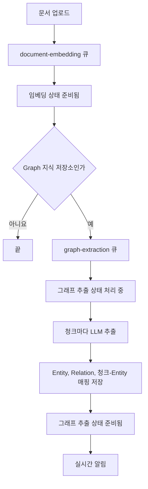
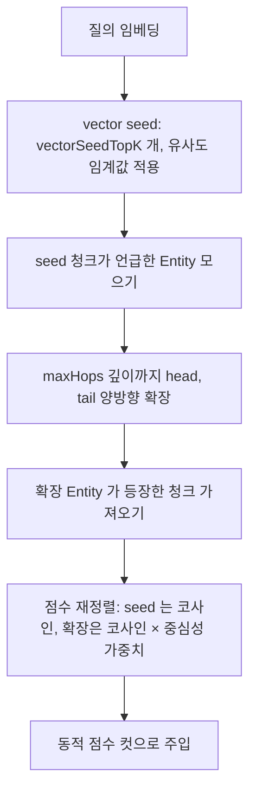

> 구현 상태: 구현됨 (P0~P2) · 원문: `spec/5-system/10-graph-rag.md`, `spec/4-nodes/4-integration/_product-overview.md` (§3.2 KB-MD-03, §3.4 KB-AG-04), `spec/data-flow/6-knowledge-base.md` (§1.2·§1.3 그래프 부분) · 용어: [용어 사전](../CLE-GLOSSARY.md)

## 개요

Graph RAG(`rag_mode=graph`)는 문서에서 Entity(`GraphEntity`)와 Relation(`GraphRelation`)을 뽑아 지식 그래프를 만드는 검색 모드다. 검색할 때 그래프로 범위를 넓혀 답변 품질을 높인다. Vector RAG 는 유사도만 맞춰서 여러 단계를 거치는 추론(예: "A 가 만든 제품을 쓴 고객")이나 Entity 중심 질의에 약하다. Graph RAG 는 이 약점을 보완한다.

| 구분 | 목표 |
|---|---|
| 사용자 가치 | Entity 중심 질의와 여러 단계 추론의 답변 정확도를 높인다. 지식 저장소마다 Vector 와 Graph 를 골라 비용과 품질을 직접 조절한다 |
| 기술 목표 | Vector RAG 는 그대로 두고 Graph 모드를 더한다. PostgreSQL 안에서 새 의존성 없이 동작한다(`entity`, `relation`, `chunk_entity` 관계형 테이블) |
| 제품 차별화 | LLM 자동 추출과 사용자가 고칠 수 있는 그래프 화면으로 지식 그래프 구축 비용을 코딩 없이 흡수한다 |

지식 저장소의 검색 모드(`rag_mode`)가 `graph` 일 때만 켜진다. 검색은 vector seed, 그래프 확장, 중심성 가중치(`centrality_weight`) 순서의 Hybrid 흐름이다. Vector 모드와 같은 인프라(PostgreSQL, pgvector, BullMQ) 위에서 돈다.

용어 구분: 원문에서 그래프 검색 4단계를 "rerank" 나 "score 재정렬" 이라 부른 것은 중심성 가중치(코사인 × 중심성)로 그래프 안에서 1차 정렬하는 단계다. [RAG 검색](CLE-KB-SEARCH.md) 의 리랭킹(cross-encoder 후처리)과 다르다. 리랭킹은 리랭킹이 켜진 지식 저장소라면 Vector·Graph 어느 결과에나 적용하는 2차 단계다.

범위 밖:

- 검색 모드 선택 폼, 그래프 추출 진행 박스, Entity·Relation 목록 화면, 그래프 시각화, API 목록은 [지식 저장소 관리](CLE-KB-MANAGE.md) 에서 정한다.
- `entity`, `relation`, `chunk_entity` 와 지식 저장소·문서 컬럼의 권위 정의는 [지식 저장소 데이터와 흐름](CLE-KB-DATA.md) 에 있다.
- 임베딩과 공통 재시도·처리 중 문서 회수·실패 문서 재시도의 동작은 [문서 임베딩](CLE-KB-EMBED.md) 에서 정한다. 이 문서에는 그래프에서 다른 점만 적는다.
- 동적 점수 컷, 리랭킹, 검색 인용 메타 스키마는 [RAG 검색](CLE-KB-SEARCH.md) 에서 정한다.

### 범위

| 영역 | 상태 | 기능 |
|---|---|---|
| 검색 모드 선택 | ✅ | 만들 때 `vector` 나 `graph` 를 고른다. 바꿀 수 없다([지식 저장소 관리](CLE-KB-MANAGE.md)) |
| 그래프 추출 파이프라인 | ✅ | 문서 임베딩이 끝나면 `graph-extraction` 큐로 이어서 넣고 청크 단위 LLM 추출로 Entity·Relation·청크-Entity 매핑을 UPSERT 한다 |
| 그래프 추출 LLM 설정 | ✅ | 지식 저장소 단위 `extractionLlmConfigId`. 비우면 워크스페이스 기본 Chat 설정 |
| Hybrid 검색 | ✅ | `RagSearchService` 가 `rag_mode === 'graph'` 면 갈라진다. vector seed, 1~2 단계 재귀 CTE 확장, 확장 청크 회수, 중심성 가중치 |
| 추출 상태와 통계 화면 (P0) | ✅ | 진행률과 Entity·Relation 수 카드(캐시 컬럼) |
| Entity 목록 보정 화면 (P1) | ✅ | 검색·정렬·개별 삭제 |
| 그래프 시각화 (P2) | ✅ | 3D 그래프, 줌, 호버 시 청크 미리보기 |

범위 밖으로 둔 것:

| 항목 | 이유 |
|---|---|
| Microsoft GraphRAG community detection, 전역 요약 | 구축 비용과 복잡도가 커서 P2 이후 |
| Apache AGE·Neo4j 도입 | 데이터 규모가 임계에 닿으면 검토한다. 지금은 PostgreSQL 관계형 테이블과 재귀 CTE 로 충분하다 |
| 규칙 기반 Entity 추출(spaCy 등) | LLM 추출 하나로 시작한다. 도메인 적응 비용을 피한다 |
| 검색 모드 사후 변경 | 마이그레이션 비용이 크다. 새 지식 저장소를 만든다 |

## 요구사항

- REQ-GRAPHRAG-001 WHEN 검색 모드가 `graph` 인 지식 저장소를 검색하면 THE SYSTEM SHALL vector seed, 그래프 확장, 중심성 가중치 정렬 순서의 Hybrid 흐름으로 검색한다. (원본: 통합 PRD KB-MD-03, KB-GR-SR-01)
- REQ-GRAPHRAG-002 WHEN Graph 지식 저장소 문서의 임베딩 상태가 준비됨(`completed`)이 되면 THE SYSTEM SHALL 그 문서를 그래프 추출 큐 `graph-extraction` 에 자동으로 넣는다. (원본: KB-GR-EX-01)
- REQ-GRAPHRAG-003 WHEN 그래프 추출이 LLM 을 부르면 THE SYSTEM SHALL 그래프 추출 LLM(`extraction_llm_config_id`)이 가리키는 Chat 모델 설정의 모델을 쓴다. (원본: KB-GR-EX-02)
- REQ-GRAPHRAG-004 IF 그래프 추출 LLM 이 지정되지 않았으면 THE SYSTEM SHALL 워크스페이스 기본 Chat 모델 설정을 쓴다. (원본: KB-GR-EX-02)
- REQ-GRAPHRAG-005 WHEN 청크 하나를 추출하면 THE SYSTEM SHALL Entity 목록과 Relation 목록을 뽑고 지식 저장소 범위에서 이름과 타입을 정규화해 중복을 합친다. (원본: KB-GR-EX-03)
- REQ-GRAPHRAG-006 WHILE 그래프 추출이 진행되는 동안 THE SYSTEM SHALL 문서마다 그래프 추출 상태(`graph_extraction_status`: `pending`, `processing`, `completed`, `error`, `failed`)를 기록한다. (원본: KB-GR-EX-04)
- REQ-GRAPHRAG-007 WHEN 사용자가 문서 하나의 재추출을 요청하면 THE SYSTEM SHALL 그 문서의 그래프를 다시 추출한다. (원본: KB-GR-EX-05)
- REQ-GRAPHRAG-008 WHEN Graph 지식 저장소에서 문서 하나 재임베딩이나 전체 재임베딩이 실행되면 THE SYSTEM SHALL 임베딩이 끝난 뒤 그래프도 다시 추출한다. (원본: KB-GR-EX-06)
- REQ-GRAPHRAG-009 WHEN 추출 LLM 호출이 90초 안에 응답하지 않으면 THE SYSTEM SHALL 그 호출을 실패로 처리한다. (원본: KB-GR-EX-08)
- REQ-GRAPHRAG-010 IF 추출 LLM 호출에 타임아웃·5xx·네트워크·429 같은 일시 오류가 나면 THE SYSTEM SHALL 문서 단위로 1초·4초·16초 간격으로 최대 3번 다시 시도한다. (원본: KB-GR-EX-08)
- REQ-GRAPHRAG-011 IF 재시도를 모두 썼거나 4xx 같은 재시도하지 않는 에러가 나면 THE SYSTEM SHALL 문서의 그래프 추출 상태를 바로 실패(`failed`)로 바꾼다. (원본: KB-GR-EX-08)
- REQ-GRAPHRAG-012 WHEN 실패 문서 재시도가 `graph` 나 `all` 범위로 요청되면 THE SYSTEM SHALL 그래프 추출이 실패한 문서의 재시도 횟수와 에러 메시지를 비우고 큐에 다시 넣는다. (원본: KB-GR-EX-09)
- REQ-GRAPHRAG-013 WHEN 백엔드가 부팅하면 THE SYSTEM SHALL `graph_last_attempted_at` 이 10분 넘게 지난 처리 중 문서를 대기 중으로 되돌려 큐에 다시 넣는다. (원본: KB-GR-EX-10)
- REQ-GRAPHRAG-014 WHEN 그래프 추출이 재시도를 예약하거나 최종 실패하면 THE SYSTEM SHALL `document:graph_retry` 나 `document:graph_failed` 이벤트를 보내 진행 박스에 바로 반영되게 한다. (원본: KB-GR-EX-11)
- REQ-GRAPHRAG-015 WHEN Entity 를 저장하면 THE SYSTEM SHALL 같은 지식 저장소 안에서 `(name, type)` 이 같은 Entity 를 한 행으로 합친다. (원본: KB-GR-DM-01)
- REQ-GRAPHRAG-016 WHEN Relation 을 저장하면 THE SYSTEM SHALL `(head_entity_id, predicate, tail_entity_id)` 가 같은 Relation 을 한 행으로 합친다. (원본: KB-GR-DM-02)
- REQ-GRAPHRAG-017 WHEN 청크에서 Entity 를 뽑으면 THE SYSTEM SHALL 청크-Entity 매핑(`chunk_entity`)을 저장해 검색 때 청크를 찾을 수 있게 한다. (원본: KB-GR-DM-03)
- REQ-GRAPHRAG-018 WHEN 이미 있는 Entity 가 다시 언급되면 THE SYSTEM SHALL 등장 횟수(`mention_count`)와 마지막 등장 청크(`last_seen_chunk_id`)를 갱신한다. (원본: KB-GR-DM-04)
- REQ-GRAPHRAG-019 WHEN Graph 검색을 시작하면 THE SYSTEM SHALL 질의 임베딩으로 청크를 vector seed 개수(`vectorSeedTopK`, 기본 5)만큼 가져온다. (원본: KB-GR-SR-02)
- REQ-GRAPHRAG-020 WHEN vector seed 를 가져오면 THE SYSTEM SHALL 유사도 임계값(`ragThreshold`)을 적용한다.
- REQ-GRAPHRAG-021 WHEN seed 청크를 가져오면 THE SYSTEM SHALL 그 청크가 언급한 Entity 에서 최대 확장 깊이(`maxHops`, 기본 1)까지 head·tail 양방향으로 확장한다. (원본: KB-GR-SR-03)
- REQ-GRAPHRAG-022 WHEN 그래프를 확장하면 THE SYSTEM SHALL 확장한 Entity 가 등장한 청크를 확장 청크 상한(`expandedChunkLimit`, 기본 15)까지 더 가져온다. (원본: KB-GR-SR-04)
- REQ-GRAPHRAG-023 WHEN seed 청크와 확장 청크를 합치면 THE SYSTEM SHALL 확장 청크 점수에 중심성 가중치를 곱해 다시 정렬한다. (원본: KB-GR-SR-05)
- REQ-GRAPHRAG-024 WHEN 그래프 정렬이 끝나면 THE SYSTEM SHALL LLM 에 넣을 청크 수를 동적 점수 컷으로 정한다. (원본: KB-GR-SR-05)
- REQ-GRAPHRAG-025 WHEN Graph 검색 결과를 돌려주면 THE SYSTEM SHALL 그래프 순회 요약(`seedChunkCount`, `traversedEntityCount`, `maxDepth`, `expandedChunkCount`)을 싣는다. (원본: KB-GR-SR-06)
- REQ-GRAPHRAG-026 WHEN 사용자가 Graph 지식 저장소를 설정하면 THE SYSTEM SHALL 그래프 검색 파라미터 `maxHops`(1 또는 2, 기본 1), `vectorSeedTopK`(기본 5), `expandedChunkLimit`(기본 15)를 지식 저장소 설정으로 받는다. (원본: KB-GR-PA-01)
- REQ-GRAPHRAG-027 WHEN 그래프 검색 파라미터가 바뀌면 THE SYSTEM SHALL 재추출이나 재임베딩 없이 다음 검색부터 적용한다. (원본: KB-GR-PA-02)
- REQ-GRAPHRAG-028 WHEN AI 에이전트 노드 설정을 보여 주면 THE SYSTEM SHALL 그래프 검색 파라미터를 노출하지 않고 `ragTopK` 와 `ragThreshold` 만 노출한다. (원본: KB-GR-PA-03, 통합 PRD KB-AG-04)
- REQ-GRAPHRAG-029 WHEN 그래프 추출이 LLM 을 부르면 THE SYSTEM SHALL 사용 토큰을 워크스페이스 단위 LLM 사용량(`LlmUsageLog`)에 기록한다. (원본: KB-GR-OB-01, NF-GR-05)
- REQ-GRAPHRAG-030 WHEN 그래프 추출이 시작·진행·완료·재시도 예약·최종 실패되면 THE SYSTEM SHALL 문서 채널로 해당 WebSocket 이벤트를 보낸다. (원본: KB-GR-OB-02)
- REQ-GRAPHRAG-031 WHEN Entity·Relation 수가 바뀌면 THE SYSTEM SHALL 지식 저장소의 캐시 컬럼(`entity_count`, `relation_count`)을 다시 센 값으로 갱신한다. (원본: KB-GR-OB-03)
- REQ-GRAPHRAG-032 IF Relation 의 head 나 tail 이 같은 응답의 Entity 이름에 없으면 THE SYSTEM SHALL 그 Relation 을 버리고 경고를 남긴다.
- REQ-GRAPHRAG-033 IF 추출 응답을 JSON 으로 해석하지 못하면 THE SYSTEM SHALL 그 청크를 건너뛰고 경고를 남기며 다시 시도하지 않는다.
- REQ-GRAPHRAG-034 IF 청크에서 Entity 가 하나도 나오지 않으면 THE SYSTEM SHALL 그 청크를 그래프에 반영하지 않고 건너뛴다.
- REQ-GRAPHRAG-035 IF Graph 지식 저장소의 Entity 가 0개면 THE SYSTEM SHALL Vector 검색 흐름으로 자동으로 돌아간다.
- REQ-GRAPHRAG-036 WHEN 지식 저장소 전체 재추출을 시작하면 THE SYSTEM SHALL 모든 Entity·Relation·청크-Entity 매핑을 지우고 모든 문서를 다시 큐에 넣는다.
- REQ-GRAPHRAG-037 IF 지식 저장소 전체 재추출이 이미 진행 중이면 THE SYSTEM SHALL 409 `KB_REEXTRACT_IN_PROGRESS` 로 거절한다.
- REQ-GRAPHRAG-038 WHILE 그래프 추출 워커가 도는 동안 THE SYSTEM SHALL 동시에 2건까지만 처리한다.
- REQ-GRAPHRAG-039 WHEN 문서의 추출을 시작하면 THE SYSTEM SHALL 그 문서 청크의 기존 청크-Entity 매핑을 먼저 지운다.
- REQ-GRAPHRAG-040 WHILE 그래프 추출이 진행되는 동안 THE SYSTEM SHALL 평균 분당 30 청크를 처리한다. (원본: NF-GR-01, LLM API 속도에 따라 달라짐)
- REQ-GRAPHRAG-041 WHEN Graph 검색을 실행하면 THE SYSTEM SHALL Entity·Relation 10만 개 기준으로 vector seed 를 포함해 800ms 안에 응답한다. (원본: NF-GR-02)
- REQ-GRAPHRAG-042 IF 청크의 그래프 추출이 실패했으면 THE SYSTEM SHALL Graph 검색에서 그 청크를 vector seed 경로로 가져온다. (원본: NF-GR-03)
- REQ-GRAPHRAG-043 WHILE 지식 저장소 하나의 Entity 가 100,000개 이하인 동안 THE SYSTEM SHALL Graph 검색을 지원한다. (원본: NF-GR-04, P0 한계)

## 그래프 추출 파이프라인

전체 흐름은 문서 임베딩 뒤에 이어진다.



### 큐 연결

`document-embedding` 워커가 임베딩을 마치고 임베딩 상태를 준비됨으로 바꾼 직후, 지식 저장소의 검색 모드가 `graph` 면 `graph-extraction` 큐에 다음 작업을 넣는다(`DocumentEmbeddingProcessor.onCompleted`).

```text
document-embedding 작업 완료
  └ kb.rag_mode === 'graph' 이면 queue('graph-extraction').add({ documentId, knowledgeBaseId, isKbBatch? })
```

### 추출 처리

`@Processor('graph-extraction', { concurrency: 2 })`. LLM 호출 비용과 속도 제한을 생각해 임베딩(3)보다 낮게 잡았다.

1. 문서의 그래프 추출 상태를 처리 중으로 바꾸고 `document:graph_started` 를 보낸다.
2. 그 문서 청크의 기존 청크-Entity 매핑을 지운다(`DELETE FROM chunk_entity WHERE chunk_id IN ...`). 그래서 다시 시도해도 중복 없이 쌓인다.
3. 문서의 모든 청크를 `chunk_index` 순서로 돈다. 다시 시도할 때 기존 Entity·Relation 은 지식 저장소 단위 중복 합치기로 자연스럽게 합쳐진다.
4. 청크마다 LLM 을 부른다. 모델은 그래프 추출 LLM 이나 워크스페이스 기본 Chat 설정이다.
   - 시스템 프롬프트: Entity 타입, Relation 형식, JSON 스키마를 강제한다.
   - 사용자 메시지: 청크 본문(최대 2000 토큰).
   - 응답: `{ entities: [{ name, displayName, type, description? }], relations: [{ head, predicate, tail }] }`
5. 결과를 지식 저장소 단위로 중복을 합쳐 저장한다. Entity 는 `(name, type)` 이 겹치면 `mention_count += 1`, Relation 은 `(head, predicate, tail)` 이 겹치면 `weight += 1` 이다.
6. 청크-Entity 매핑(`chunk_id × entity_id`, 원형 표기 `mention_text`)을 저장한다.
7. 청크를 처리할 때마다 진행률(0~100)과 늘어난 Entity·Relation 수를 `document:graph_progress` 로 보낸다.
8. 모든 청크가 끝나면 그래프 추출 상태를 준비됨으로 바꾸고 재시도 횟수를 0 으로 되돌린다. 지식 저장소의 `entity_count`, `relation_count` 를 한 번에 다시 센다(`KbStatsHelper`). `document:graph_completed` 를 보낸다.

### 추출 응답 스키마

LLM 을 부를 때 JSON 스키마를 강제한다.

```json
{
  "type": "object",
  "properties": {
    "entities": {
      "type": "array",
      "items": {
        "type": "object",
        "properties": {
          "name": { "type": "string", "description": "정규화된 이름 (소문자·trim·동의어 통합)" },
          "displayName": { "type": "string", "description": "원문에서 등장한 자연 표기" },
          "type": {
            "type": "string",
            "enum": ["person", "organization", "concept", "location", "event", "other"]
          },
          "description": { "type": "string" }
        },
        "required": ["name", "displayName", "type"]
      }
    },
    "relations": {
      "type": "array",
      "items": {
        "type": "object",
        "properties": {
          "head": { "type": "string", "description": "head entity 의 name (정규화 형)" },
          "predicate": { "type": "string", "description": "동사·관계 서술어. snake_case 권장" },
          "tail": { "type": "string", "description": "tail entity 의 name (정규화 형)" }
        },
        "required": ["head", "predicate", "tail"]
      }
    }
  },
  "required": ["entities", "relations"]
}
```

응답 검증:

- `relation.head` 와 `relation.tail` 은 같은 응답의 `entities[*].name` 에 있어야 한다. LLM 환각을 막으려는 규칙이다. 맞지 않는 Relation 은 버리고 경고를 남긴다.
- Entity 가 0개인 청크는 그래프에 영향을 주지 않고 건너뛴다.

### 재추출

- 문서 하나: `POST /api/knowledge-bases/:id/documents/:docId/re-extract`. Graph 지식 저장소에서만 받는다. `graph-extraction` 큐에 넣는다.
- 지식 저장소 전체: `POST /api/knowledge-bases/:id/re-extract`. 재처리 잠금(`reextract_status`)을 비교 후 교체로 얻는다. 모든 Entity·Relation·청크-Entity 매핑을 지우고 모든 문서를 한꺼번에 큐에 넣는다. 이미 진행 중이면 409 `KB_REEXTRACT_IN_PROGRESS` 다. 재추출 잠금은 저장 청크 차원을 건드리지 않는다. 잠금 상태 값은 [지식 저장소 데이터와 흐름](CLE-KB-DATA.md) 에서 정한다.
- 재임베딩: Graph 지식 저장소에서 문서를 재임베딩하면 그래프 추출이 자동으로 이어진다.

### 재시도와 회수

그래프 추출은 임베딩과 같은 재시도·회수 정책을 쓴다. 공통 동작은 [문서 임베딩](CLE-KB-EMBED.md) 에서 정하고 여기에는 다른 점만 적는다.

- 타임아웃: 청크 하나의 LLM `chat()` 호출에 90초(`{ timeoutMs: 90_000 }`)를 건다. 응답이 멈추면 90초 안에 실패로 처리한다.
- 재시도: 문서 단위 `retryWithBackoff(maxRetries=3, baseDelayMs=1_000)`(1초, 4초, 16초)다. 청크 단위 LLM 재시도는 따로 두지 않는다. LLM 비용과 코드 복잡도를 견줘 문서 단위로 단순하게 했다. 더 정밀한 재시도는 후속으로 검토한다.
- 일시 오류가 나면 상태를 재시도 중(`error`)으로 두고 `graph_retry_count` 를 늘리고 `graph_error_message` 를 갱신한다. 최종 실패면 실패로 두고 사용자가 문서 하나 재추출이나 실패 문서 재시도를 할 때까지 유지한다.
- 부팅할 때 `graph_last_attempted_at < NOW() - 10분` 인 처리 중 문서를 회수한다(`StuckDocumentRecoveryService`).
- 실패 문서 재시도의 `graph` 범위는 그래프 추출 상태가 실패인 문서를 되돌려 큐에 넣는다.

## 검색 흐름

`RagSearchService.search()` 는 검색 모드별로 갈라진다. Vector 모드는 [RAG 검색](CLE-KB-SEARCH.md) 그대로다.



1. 질의 임베딩: 지식 저장소의 `embedding_model_config_id` 가 가리키는 모델 설정의 `defaultModel` 로 임베딩한다.
2. vector seed: `vectorSeedTopK` 만큼 청크를 가져온다. Vector 검색과 같고 유사도 임계값(θ)을 적용한다.
3. seed 청크가 언급한 Entity 를 모은다(`chunk_entity` 조인).
4. 그래프 확장: 1부터 `maxHops` 깊이까지 head·tail 양방향으로 따라간다.
5. 확장한 Entity 가 등장한 청크를 더 가져온다(`chunk_entity` 역방향).
6. 합친 청크를 다시 정렬한다.
   - seed 청크: 원래 코사인 유사도.
   - 확장 청크: 코사인 유사도 × 중심성 가중치.
   - 중심성 가중치 = `log(entity.mention_count + 1) / log(MAX_MENTION + 1)`
7. 합친 결과를 동적 점수 컷(주입 토큰 예산, 주입 상한, 명시한 `top_k` 가 있으면 그 값)으로 LLM 컨텍스트에 넣는다([RAG 검색](CLE-KB-SEARCH.md)).

확장 청크 상한(`expandedChunkLimit`)은 확장으로 더 가져오는 청크 수의 상한이다. 가져오는 폭 전체는 `vectorSeedTopK + expandedChunkLimit` 이다. 최종으로 넣는 수는 동적 점수 컷이 정한다. seed 개수(기본 5)가 HNSW 기본 `ef_search` 40 보다 작아 seed 쿼리는 `ef_search` 를 올리지 않는다. 저장 청크 차원이 NULL 인 지식 저장소는 seed 쿼리를 실행하지 않고 검색 불가로 처리한다([RAG 검색](CLE-KB-SEARCH.md)).

리랭킹이 켜진 Graph 지식 저장소는 seed 와 확장 뒤 상위 후보 풀만큼 잘라 리랭킹으로 넘긴다. 리랭킹은 [RAG 검색](CLE-KB-SEARCH.md) 에서 정한다.

### SQL 개념

한 번의 SQL(재귀 CTE)로 seed, 확장, 확장 청크 회수를 처리한다.

```sql
-- 1. vector seed
WITH seed AS (
  SELECT dc.id AS chunk_id, dc.content, dc.metadata,
         d.id AS document_id, d.name AS document_name,
         1 - (dc.embedding::vector(1536) <=> $1) AS score
    FROM document_chunk dc
    JOIN document d ON d.id = dc.document_id
   WHERE d.knowledge_base_id = $2
     AND d.embedding_status = 'completed'
     AND 1 - (dc.embedding::vector(1536) <=> $1) >= $6   -- 유사도 임계값(θ)
   ORDER BY score DESC
   LIMIT $3        -- vectorSeedTopK
),
-- 2. seed Entity
seed_entities AS (
  SELECT DISTINCT ce.entity_id
    FROM chunk_entity ce
    JOIN seed s ON s.chunk_id = ce.chunk_id
),
-- 3. 그래프 확장 (재귀)
expanded_entities AS (
  SELECT entity_id, 0 AS depth FROM seed_entities
  UNION
  SELECT CASE WHEN r.head_entity_id = e.entity_id THEN r.tail_entity_id ELSE r.head_entity_id END,
         e.depth + 1
    FROM expanded_entities e
    JOIN relation r ON (r.head_entity_id = e.entity_id OR r.tail_entity_id = e.entity_id)
   WHERE e.depth < $4   -- maxHops
),
-- 4. 확장 청크
expanded_chunks AS (
  SELECT DISTINCT ce.chunk_id
    FROM chunk_entity ce
    JOIN expanded_entities e ON e.entity_id = ce.entity_id
)
-- 5. 중심성 가중치로 합쳐 정렬
SELECT chunk_id, content, score FROM (
  SELECT s.chunk_id, s.content, s.document_name, s.metadata, s.score, 'seed' AS origin
    FROM seed s
  UNION ALL
  SELECT ec.chunk_id, dc.content, d.name, dc.metadata,
         (1 - (dc.embedding::vector(1536) <=> $1)) * COALESCE(centrality_weight(ec.chunk_id), 1) AS score,
         'expanded' AS origin
    FROM expanded_chunks ec
    JOIN document_chunk dc ON dc.id = ec.chunk_id
    JOIN document d ON d.id = dc.document_id
   WHERE ec.chunk_id NOT IN (SELECT chunk_id FROM seed)
) t
ORDER BY score DESC
LIMIT $5;        -- 가져오는 폭: vectorSeedTopK + expandedChunkLimit. 최종 주입 수는 동적 점수 컷이 정한다
```

위 SQL 은 개념 정의다. 실제 구현은 차원별 부분 HNSW 인덱스(V022, V023)와 같은 캐스트 식을 쓴다.

### 출력 메타데이터

Graph 검색 결과에는 그래프 순회 요약이 더 붙는다.

```json
{
  "ragSources": [
    {
      "documentId": "uuid",
      "documentName": "Customer FAQ",
      "chunkId": "uuid",
      "content": "관련 텍스트 (앞 200자)...",
      "score": 0.92,
      "origin": "seed"
    },
    {
      "documentId": "uuid",
      "documentName": "Product Manual",
      "chunkId": "uuid",
      "content": "그래프 확장으로 회수된 텍스트...",
      "score": 0.78,
      "origin": "expanded"
    }
  ],
  "graphTraversal": {
    "mode": "graph",
    "seedChunkCount": 5,
    "traversedEntityCount": 12,
    "maxDepth": 1,
    "expandedChunkCount": 8
  }
}
```

- `graphTraversal` 은 `mode === 'vector'` 면 생략한다. 요약은 개수 값이다. ID 배열이 아니다.
- `ragSources[]` 항목 스키마의 단일 기준은 [RAG 검색](CLE-KB-SEARCH.md) 이다. Graph 모드도 같은 구조에 `origin` 을 `seed` 나 `expanded` 로 채워 같은 누적 경로와 References 화면을 쓴다. 본문 미리보기 필드는 Vector·Graph 모두 `content` 다(코드 `output-shape.ts`). Graph 전용 메타는 `ragSources` 밖의 `graphTraversal` 로 둔다.

## 데이터

컬럼의 권위 정의는 [지식 저장소 데이터와 흐름](CLE-KB-DATA.md) 에 있다. Graph RAG 가 쓰는 것만 요약한다.

- 지식 저장소: `rag_mode`, `extraction_llm_config_id`, `max_hops`, `vector_seed_top_k`, `expanded_chunk_limit`, `entity_count`, `relation_count`, `reextract_status`. 세 검색 파라미터는 Vector 모드에서 무시한다. Vector 지식 저장소는 그래프 컬럼과 테이블을 쓰지 않고 AI 에이전트의 검색도 Vector 흐름 그대로다.
- 문서: `graph_extraction_status`(Vector 모드 문서는 NULL, 의미는 임베딩 상태와 같음), `graph_retry_count`, `graph_last_attempted_at`, `graph_error_message`.
- Entity(`entity`): 지식 저장소 안의 의미 단위. `UNIQUE(knowledge_base_id, name, type)`.
- Relation(`relation`): 두 Entity 사이의 방향 있는 관계. `UNIQUE(knowledge_base_id, head_entity_id, predicate, tail_entity_id)`. 같은 관계가 여러 청크에서 나오면 `weight` 가 는다.
- 청크-Entity 매핑(`chunk_entity`): 어느 청크가 어떤 Entity 를 언급했는지. `PRIMARY KEY (chunk_id, entity_id)` 와 `(entity_id)` 역방향 인덱스로 확장 단계의 청크 회수를 받친다.

## API

엔드포인트 전체 목록은 [지식 저장소 관리](CLE-KB-MANAGE.md) 에 있다. Graph RAG 가 쓰는 것은 다음과 같다.

| 메서드 | 경로 | 설명 |
|---|---|---|
| POST | `/api/knowledge-bases/:id/documents/:docId/re-extract` | 문서 하나 그래프 재추출. Graph 지식 저장소에서만 유효 |
| POST | `/api/knowledge-bases/:id/re-extract` | 지식 저장소 전체 재추출. 재처리 잠금, 진행 중이면 409 `KB_REEXTRACT_IN_PROGRESS` |
| GET | `/api/knowledge-bases/:id/entities` | Entity 목록 (페이지네이션, 검색, 타입 필터) |
| GET | `/api/knowledge-bases/:id/entities/:entityId` | Entity 상세와 등장 청크 목록 |
| DELETE | `/api/knowledge-bases/:id/entities/:entityId` | Entity 삭제. 관련 Relation 과 청크-Entity 매핑이 함께 지워진다 |
| GET | `/api/knowledge-bases/:id/relations` | Relation 목록 (페이지네이션, head·tail 검색) |
| DELETE | `/api/knowledge-bases/:id/relations/:relationId` | Relation 삭제 |
| GET | `/api/knowledge-bases/:id/graph/stats` | `entity_count`, `relation_count`, 추출 진행 요약 |
| GET | `/api/knowledge-bases/:id/graph/visualization` | 등장 횟수 상위 Entity 와 Relation (시각화용) |

## 실시간 알림

임베딩 이벤트와 같은 방식으로 같은 문서 채널 `kb:{documentId}` 에 다섯 이벤트를 보낸다. 채널 규칙과 union 권위는 [문서 임베딩](CLE-KB-EMBED.md) 과 [WebSocket 이벤트와 명령](../CLE-API/CLE-API-WS-EVENTS.md) 에 있다.

| 이벤트 | 페이로드 | 시점 |
|---|---|---|
| `document:graph_started` | `{ documentId, knowledgeBaseId }` | 추출 시작 |
| `document:graph_progress` | `{ documentId, progress: number, entityDelta: number, relationDelta: number }` | 청크를 처리할 때마다 |
| `document:graph_completed` | `{ documentId, entityCount, relationCount }` | 완료 |
| `document:graph_retry` | `{ documentId, attempt: number, maxAttempts: number, error: string }` | 일시 오류 뒤 재시도를 큐에 넣기 직전 |
| `document:graph_failed` | `{ documentId, error: string }` | 재시도를 모두 썼거나 재시도하지 않는 에러로 최종 실패 |

`document:graph_error` 이벤트는 없다. 보내는 경로가 없어 `KbEventType` union 에서 뺐다(#443). 일시 오류는 `document:graph_retry`, 최종 실패는 `document:graph_failed` 로만 알린다. 지식 저장소 단위 통계는 `document:graph_completed` 의 `entityCount`·`relationCount` 나 `GET /:id/graph/stats` 로 읽는다.

## 에러 처리

| 상황 | 처리 |
|---|---|
| 추출 LLM 호출 일시 실패(타임아웃, 5xx, 네트워크, 429) | 그래프 추출 상태를 재시도 중으로, `graph_retry_count` 증가, `graph_error_message` 갱신, `document:graph_retry`. 1초·4초·16초 간격으로 최대 3번 자동 재시도 |
| 추출 LLM 호출 영구 실패(재시도 소진, 4xx) | 그래프 추출 상태를 실패로, `document:graph_failed`. 사용자가 문서 하나 재추출이나 실패 문서 재시도를 할 때까지 유지 |
| 추출 응답 JSON 해석 실패 | 청크 단위로 조용히 건너뛰고 경고. 응답 형식 문제는 다시 해도 같아서 재시도하지 않는다 |
| Relation 의 head·tail 이 응답 Entity 에 없음 | 그 Relation 을 버리고 경고(LLM 환각) |
| Graph 지식 저장소인데 `entity_count = 0`(추출 전이거나 실패) | Vector 흐름으로 자동으로 돌아간다. 빈 그래프 확장은 vector seed 결과와 같다 |
| 전체 재추출 동시 호출 | 재처리 잠금(`reextract_status`) 비교 후 교체로 막는다. 409 `KB_REEXTRACT_IN_PROGRESS` |
| 워커가 멈춰 처리 중으로 남음 | 부팅할 때 `graph_last_attempted_at < NOW() - 10분` 인 문서를 회수해 큐에 다시 넣는다 |

원칙: Graph 검색이 어떤 이유로든 빈 결과를 내면 vector seed 결과만으로 응답을 만든다.

## 기술 결정

| 항목 | 결정 | 근거 |
|---|---|---|
| 그래프 저장소 | PostgreSQL 관계형 테이블(`entity`, `relation`, `chunk_entity`) | 기존 인프라를 그대로 쓴다. 1~2 단계 확장은 재귀 CTE 로 충분하다 |
| 그래프 구축 | LLM 추출(BullMQ `graph-extraction` 큐) | 기존 `document-embedding` 큐와 같은 방식이라 인프라 추가가 없다 |
| 추출 시작 | 임베딩 완료 뒤 자동 연쇄 | 사용자가 조작하지 않아도 그래프가 만들어진다. 추출 비용은 워크스페이스 단위 LLM 사용량으로만 집계한다 |
| 그래프 추출 LLM | 지식 저장소 단위 `extractionLlmConfigId` | 임베딩 모델과 나눠 추론용 Chat 모델을 따로 고른다 |
| 검색 흐름 | Hybrid (vector seed, 그래프 확장, 중심성 가중치) | 그래프만 따라가면 정밀도가 낮다. vector seed 가 진입점을 보장한다 |
| 검색 모드 | 만들 때 정하고 바꾸지 않는다 | 사후 변경의 마이그레이션·UX 부담이 조금씩 도입하는 가치보다 크다 |
| 검색 파라미터 노출 | 지식 저장소 단위만 | AI 에이전트 노드 설정을 단순하게 둔다(`ragTopK`, `ragThreshold` 만) |

## 단계별 도입

| 단계 | 범위 | 상태 | 검증 기준 |
|---|---|---|---|
| P0 | DB 마이그레이션, 추출 큐, 검색 분기, 모드 선택 화면, 추출 진행 상태 | ✅ | 새 Graph 지식 저장소를 만들고 문서를 올리면 자동 추출과 Graph 검색이 동작한다 |
| P1 | Entity·Relation 목록 화면, 개별 삭제, 사용자 보정 | ✅ | 추출 결과를 검토·수정하면 검색 결과에 반영된다 |
| P2 | 그래프 시각화 | ✅ | 시각적으로 탐색할 수 있다 |
| P2 이후 | community detection, 전역 요약, 도메인별 Entity 타입 사전, 지식 저장소 단위 프롬프트 재정의 | ❌ | [후속 검토](#후속-검토) |

## 의존성

| 의존 항목 | 상태 | 비고 |
|---|---|---|
| BullMQ `document-embedding` 큐 | ✅ | `graph-extraction` 큐를 같은 방식으로 더했다 |
| Chat 모델 설정 | ✅ | V025 에서 `extraction_llm_config_id` 컬럼을 더했다 |
| pgvector | ✅ | vector seed 에 그대로 쓴다 |
| 검색 모드 선택 화면 | ✅ | `kb-form-body.tsx` select |
| AI 에이전트의 지식 저장소 연동 | ✅ | 바뀐 것 없음(`ragTopK`, `ragThreshold` 그대로) |

## 비목표

- Entity 동명이인 구분: P2 에서 검토한다. 지금은 `(name, type)` 이 같으면 같은 Entity 로 본다.
- 지식 저장소 사이 그래프 연결: 저장소 사이 Entity 통합 검색은 P2 이후다. 지금은 지식 저장소 단위로 격리한다.
- 그래프 임베딩(Node2Vec 등): 검색에 쓰지 않는다(P2 이후).
- 자동 프롬프트 튜닝: 추출 프롬프트는 시스템 프롬프트로 고정한다. P2 에서 지식 저장소 단위 프롬프트 재정의를 검토한다.
- 지식 저장소 단위 LLM 토큰 귀속과 상세 화면의 누적 토큰 표시(원본: KB-GR-EX-07, NF-GR-05 의 표시 부분): 추출 LLM 사용량은 [LLM 사용량 기록](../CLE-AI/CLE-AI-USAGE.md) 에 워크스페이스 단위로만 쌓인다. `LlmUsageLog` 에 지식 저장소·문서 FK 가 없고 `GraphExtractionService` 는 컨텍스트(`workflow_id`, `execution_id`, `node_execution_id`)를 일부러 NULL 로 둔다. 도입하려면 `LlmUsageLog` 지식 저장소 FK 마이그레이션, 추출 서비스의 컨텍스트 전달, 그 불변식 변경이 먼저 필요한 별도 제품 결정이다.

## 후속 검토

- Entity 타입 사전: 도메인과 무관한 타입(PERSON, ORG, CONCEPT, LOCATION, EVENT)으로 시작했다. 지식 저장소마다 타입 사전을 정의하게 할지는 P2 에서 검토한다.
- Relation 서술어 형식: P0 는 자유 문자열이다. 정합성과 검색 품질을 위한 enum 화는 P2 에서 검토한다.
- 추출 프롬프트 사용자 설정: P0 는 시스템 프롬프트 고정이다. 도메인 정확도가 모자라면 P2 에 지식 저장소 단위 프롬프트 재정의를 도입한다.
- 그래프 community detection: 데이터 패턴을 보고 GraphRAG 방식 클러스터 요약을 P2 에서 검토한다.

## 구현 위치

- `codebase/backend/src/modules/knowledge-base/graph/**` (`graph-extraction.service.ts`, `graph-query.service.ts`)
- `codebase/backend/src/modules/knowledge-base/entities/*.entity.ts`
- `codebase/backend/src/modules/knowledge-base/queues/graph-extraction.processor.ts`
- `codebase/backend/src/modules/knowledge-base/queues/stuck-document-recovery.service.ts`
- `codebase/backend/src/modules/knowledge-base/graph.controller.ts`
- `codebase/backend/src/modules/knowledge-base/dto/retry-failed.dto.ts`
- `codebase/backend/src/modules/knowledge-base/search/rag-search.service.ts`
- `codebase/frontend/src/components/knowledge-base/graph-3d-renderer.tsx`
- `codebase/frontend/src/components/knowledge-base/graph-visualization.tsx`
- `codebase/frontend/src/components/knowledge-base/entity-list.tsx`
- `codebase/frontend/src/components/knowledge-base/relation-list.tsx`
- `codebase/frontend/src/components/knowledge-base/entity-detail-dialog.tsx`
- `codebase/frontend/src/components/knowledge-base/kb-form-body.tsx`
- `codebase/backend/migrations/V025__graph_rag.sql`, `V026__graph_extraction_status_nullable_index.sql`, `V027__relation_head_tail_index.sql`, `V037__kb_retry_failed_status.sql`

## Rationale

### 사용자 결정

| # | 결정 사항 | 선택 |
|---|---|---|
| 2 | 모드 옵션 범위 | `vector`, `graph` 2종. Graph 안에 Hybrid 를 넣는다 |
| 3 | 추출 시작 | 임베딩 완료 뒤 자동 연쇄(사용자 조작 없이 `graph-extraction` 큐에 넣음) |
| 4 | 화면 우선순위 | P0 = 추출 진행·완료 상태, P1 = Entity 목록과 통계, P2 = 그래프 시각화 |
| 5 | 검색 파라미터 노출 | 지식 저장소 단위만(`maxHops`, `vectorSeedTopK`, `expandedChunkLimit`). AI 에이전트 노드는 기존 `ragTopK`, `ragThreshold` 유지 |
| 6 | 검색 모드 사후 변경 | 만들 때만 정한다. 바꾸려면 새 지식 저장소를 만든다 |
| 7 | 그래프 추출 LLM | 지식 저장소에 `extraction_llm_config_id` 필드를 새로 둔다(임베딩 모델과 별도인 Chat LLM) |

### 결정 근거

- 모드 2종: Graph 안에 vector seed 가 이미 들어 있는 Hybrid 라 모드를 셋으로 나눌 가치가 작다.
- 자동 연쇄: 사용자에게 따로 조작을 요구하지 않는다. 임베딩 큐에서 추출 큐로 자연스럽게 이어진다. 큐를 나눈 이유는 [지식 저장소 데이터와 흐름](CLE-KB-DATA.md) 에 있다.
- 사후 변경 불가: Vector 에서 Graph 로 바꾸면 기존 청크 전부를 추출해야 해 마이그레이션이 무겁다. Graph 에서 Vector 로 바꾸면 Entity·Relation 을 버린다. 새 지식 저장소가 더 단순하다.
- 추출 LLM 분리: 임베딩 모델은 표현 학습용이고 추출 모델은 추론용이다. 비용과 품질을 따로 조절할 수 있다.

### 구현 이름에 `Graph` 접두를 붙인 이유

도메인 용어 Entity, Relation, 청크-Entity 매핑의 실제 클래스 이름은 `GraphEntity`, `GraphRelation`, `GraphChunkEntity` 다. TypeORM 의 `@Entity` 데코레이터와 이름이 겹쳐 접두를 붙였다(DTO 는 `GraphEntityDto` 등, 프런트엔드 import 도 같다). 도메인 용어는 접두 없는 형태를 유지한다. 접두는 구현 언어의 제약이지 제품 개념이 아니다. 구현을 찾을 때는 접두형으로 찾는다. `Entity` 로 찾으면 TypeORM 데코레이터에 묻힌다.

### 지식 저장소 단위 토큰 표시를 비목표로 둔 이유 (2026-07-11)

추출 사용량은 워크스페이스 단위 집계가 단일 기준이다. LLM 사용량 쪽이 추출 서비스의 컨텍스트 NULL 을 "의도된 누락" 으로 확정했다. 지식 저장소 단위 귀속은 그 불변식을 뒤집는 별도 결정이라 채택하지 않았다. 예전에는 KB-GR-EX-07 과 NF-GR-05 가 이를 충족으로 잘못 표시했는데 실제로는 스키마, API, WebSocket, 화면 어디에도 지식 저장소 단위 경로가 없었다. 그래서 비목표로 정직하게 바꿨다.

### 전체 재추출 잠금의 판정 결함 (2026-08-14 수정)

재추출 잠금은 `UPDATE … RETURNING` 이 0행인지로 선점을 판정한다. 그런데 반환값이 행 배열이 아니라 `[rows, affectedCount]` 튜플이라 길이가 늘 2 였다. 그래서 409 `KB_REEXTRACT_IN_PROGRESS` 가 넉 달 동안 한 번도 나지 않았다. 설계는 옳았고 구현이 지키지 못했다. `#1168` 이 고쳤다. 전체 재임베딩 잠금도 같은 결함이었다([문서 임베딩](CLE-KB-EMBED.md)). 결과를 읽는 규칙은 [raw SQL 결과 읽기 규약](../CLE-ENG/CLE-ENG-RAWQUERY.md) 에 있다.
