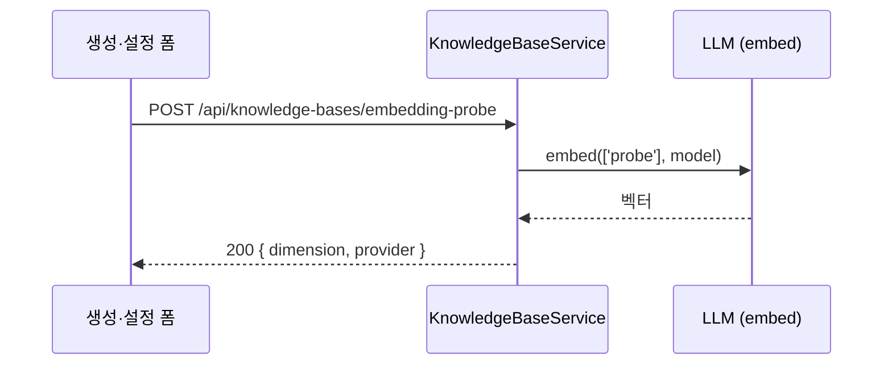

> 구현 상태: 부분 구현 (화면과 API 는 구현됨, PRD 요구사항 일부 미구현) · 원문: `spec/2-navigation/5-knowledge-base.md`, `spec/2-navigation/_product-overview.md` (§3.5), `spec/4-nodes/4-integration/_product-overview.md` (§3), `spec/4-nodes/3-ai/_product-overview.md` (§3.5, §5 NF-AI-05), `spec/data-flow/6-knowledge-base.md` (§1.6 임베딩 테스트) · 용어: [용어 사전](../CLE-GLOSSARY.md)

## 개요

지식 저장소(Knowledge Base, `KnowledgeBase`)는 문서를 올려 임베딩하고 AI 에이전트 노드가 검색하는 워크스페이스 단위 저장소다. 이 문서는 지식 저장소 메뉴의 화면과 API 를 정한다. 목록, 생성·설정 폼, 상세 화면의 문서 관리, 업로드, 미리보기, 진행 상태, 검색 불가 경고, Graph RAG 패널, 그리고 지식 저장소 API 전체 목록이 여기 있다.

요구사항은 세 PRD(내비게이션 PRD, 통합 PRD, AI PRD)에 흩어져 있었다. 두 PRD 가 같은 ID(KB-DC-01~03)를 서로 다른 문장에 썼기 때문에 요구사항 줄의 원본 표기에 PRD 이름을 함께 적어 구분한다. ID 마다 두 PRD 의 문장과 이 요구사항이 어디에 실렸는지는 [PRD 요구사항 ID 대응](#prd-요구사항-id-대응) 에 한 벌로 모았다. 화면의 옛 표기 "컬렉션(Collection)" 은 지식 저장소 자체를 뜻한다. 통합 PRD 의 "컬렉션(폴더)" 은 지식 저장소 안에서 문서를 묶는 문서 폴더이며 아직 구현되지 않았다.

범위 밖:

- 업로드한 문서의 파싱·청킹·임베딩·재시도는 [문서 임베딩](CLE-KB-EMBED.md) 에서 정한다.
- AI 에이전트의 검색 규칙, 리랭킹, 동적 점수 컷은 [RAG 검색](CLE-KB-SEARCH.md) 에서 정한다.
- 그래프 추출과 확장 검색의 동작은 [Graph RAG](CLE-KB-GRAPH.md) 에서 정한다.
- 테이블 컬럼, 저장 청크 차원의 정의, 재처리 잠금은 [지식 저장소 데이터와 흐름](CLE-KB-DATA.md) 에서 정한다.
- Embedding·Rerank 모델 설정의 관리 화면은 [모델 설정](../CLE-AI/CLE-AI-MODELS.md) 에서 정한다.
- AI 에이전트 노드에서 지식 저장소를 고르는 설정은 [AI 노드 공통](../CLE-NODE-AI/CLE-NODE-AI-COMMON.md) 에서 정한다.

## 요구사항

- REQ-KBUI-001 WHEN 사용자가 지식 저장소 메뉴를 열면 THE SYSTEM SHALL AI 에이전트 노드의 RAG 에 쓸 문서를 지식 저장소 단위로 관리하는 목록을 보여 준다. (원본: 내비게이션 PRD NAV-KB-01)
- REQ-KBUI-002 WHEN 편집자 이상이 지식 저장소 생성을 요청하면 THE SYSTEM SHALL 이름(필수)과 설명, 검색 모드, 임베딩 모델 설정, 청크 설정, 리랭킹 설정을 받아 지식 저장소를 만든다. (원본: 내비게이션 PRD NAV-KB-03, AI PRD KB-DC-01)
- REQ-KBUI-003 WHEN 편집자 이상이 지식 저장소 설정 수정이나 삭제를 요청하면 THE SYSTEM SHALL 설정을 고치거나 지식 저장소를 지운다. (원본: 내비게이션 PRD NAV-KB-03, AI PRD KB-DC-01)
- REQ-KBUI-004 WHEN 사용자가 지식 저장소를 만들면 THE SYSTEM SHALL 검색 모드를 `vector`(기본)와 `graph` 가운데서 고르게 한다. (원본: 통합 PRD KB-MD-01, AI PRD KB-MD-01, KB-GR-MD-01)
- REQ-KBUI-005 IF 만든 뒤 검색 모드를 바꾸려 하면 THE SYSTEM SHALL 막고 새 지식 저장소를 만들게 한다. (원본: 통합 PRD KB-MD-02, AI PRD KB-MD-01, KB-GR-MD-02)
- REQ-KBUI-006 WHEN 지식 저장소를 목록과 상세에 보여 주면 THE SYSTEM SHALL 검색 모드 배지를 표시한다. (원본: KB-GR-MD-03)
- REQ-KBUI-007 WHEN 생성 폼에서 검색 모드를 고르면 THE SYSTEM SHALL 모드별 도움말을 인라인으로 보여 준다. (원본: KB-GR-UI-01)
- REQ-KBUI-008 WHEN 사용자가 임베딩 모델을 고르면 THE SYSTEM SHALL 워크스페이스의 `kind=embedding` 모델 설정 목록에서 하나를 고르는 select 만 제공하고 자유 입력을 받지 않는다. (원본: 통합 PRD KB-VE-02, AI PRD KB-VE-02)
- REQ-KBUI-009 IF 임베딩 모델 설정 목록을 불러오지 못하면 THE SYSTEM SHALL select 를 비활성으로 두고 에러 메시지만 보여 준다.
- REQ-KBUI-010 IF 사용자가 임베딩 모델 설정을 고르지 않으면 THE SYSTEM SHALL 워크스페이스 기본 설정을 쓴다.
- REQ-KBUI-011 WHEN 임베딩 모델 목록을 보여 주면 THE SYSTEM SHALL 한국어 추천 모델(KURE, arctic-embed, bge-m3, multilingual-e5 패턴)의 옵션 라벨에 "한국어 추천" 배지를 붙이되 선택을 제한하지 않는다.
- REQ-KBUI-012 WHEN 한국어 추천 배지 대상을 정하면 THE SYSTEM SHALL `text-embedding-3` 계열을 뺀다.
- REQ-KBUI-013 WHEN 사용자가 임베딩 테스트 버튼을 누르면 THE SYSTEM SHALL 고른 모델 설정으로 `embed('probe')` 를 한 번 불러 잰 차원과 모델 프로바이더를 인라인으로 보여 준다.
- REQ-KBUI-014 WHEN 임베딩 테스트가 끝나면 THE SYSTEM SHALL 잰 차원을 지식 저장소의 저장 청크 차원(`embedding_dimension`)에 저장하지 않는다.
- REQ-KBUI-015 IF 임베딩 테스트가 실패하면 THE SYSTEM SHALL 400 `EMBEDDING_PROBE_FAILED` 로 응답하고 정리한 에러 메시지만 보여 준다.
- REQ-KBUI-016 WHILE 폼의 검색 모드가 `graph` 인 동안 THE SYSTEM SHALL 그래프 추출 LLM 과 그래프 검색 파라미터 필드를 보여 준다.
- REQ-KBUI-017 WHEN 사용자가 청크 설정을 바꾸면 THE SYSTEM SHALL 청크 크기(기본 1000 토큰)와 청크 오버랩(기본 200 토큰)을 지식 저장소 설정으로 받는다. (원본: 통합 PRD KB-VE-05, AI PRD KB-VE-05)
- REQ-KBUI-018 WHEN 사용자가 리랭킹을 사용 안 함이 아닌 값으로 고르면 THE SYSTEM SHALL 리랭커, 후보 풀, 점수 컷 임계 필드를 보여 주고 `cross_encoder_llm` 이면 그레이딩 LLM 필드도 보여 준다.
- REQ-KBUI-019 WHEN 사용자가 리랭킹 설정을 바꾸면 THE SYSTEM SHALL 재임베딩 없이 저장하고 다음 검색부터 적용한다.
- REQ-KBUI-020 WHEN 사용자가 설정 폼에서 임베딩 모델을 다른 값으로 바꾸면 THE SYSTEM SHALL 재임베딩이 필요하다는 인라인 경고를 보여 준다.
- REQ-KBUI-021 WHEN 임베딩 모델 설정 변경이 저장되면 THE SYSTEM SHALL 재임베딩을 자동으로 시작하지 않는다.
- REQ-KBUI-022 WHEN 지식 저장소 목록을 보여 주면 THE SYSTEM SHALL 카드마다 이름, 문서 수, 청크 수, 임베딩 상태를 보여 준다.
- REQ-KBUI-023 WHEN 사용자가 지식 저장소 카드를 누르면 THE SYSTEM SHALL 상세 화면으로 이동한다.
- REQ-KBUI-024 WHEN Graph 지식 저장소 카드를 보여 주면 THE SYSTEM SHALL Entity 수와 Relation 수도 보여 준다.
- REQ-KBUI-025 IF 저장 청크 차원이 NULL 이고 재처리 잠금이 `in_progress` 면 THE SYSTEM SHALL 카드에 "재임베딩 중" 을 진행색으로 보여 준다.
- REQ-KBUI-026 IF 저장 청크 차원이 NULL 이고 재처리 잠금이 `idle` 이면 THE SYSTEM SHALL 카드에 "재임베딩 필요 · 검색 불가" 를 경고색으로 보여 준다.
- REQ-KBUI-027 WHEN 문서 목록을 보여 주면 THE SYSTEM SHALL 파일 아이콘, 파일 이름, 형식(MD, PDF, TXT, CSV), 크기, 임베딩 상태를 보여 준다.
- REQ-KBUI-028 WHILE 지식 저장소가 Graph 모드인 동안 THE SYSTEM SHALL 문서마다 그래프 추출 상태를 더 보여 준다.
- REQ-KBUI-029 WHEN 재시도 횟수가 1 이상인 문서의 상태에 마우스를 올리면 THE SYSTEM SHALL 에러 메시지와 재시도 횟수를 툴팁으로 보여 준다.
- REQ-KBUI-030 WHEN 문서의 임베딩 상태를 표시하면 THE SYSTEM SHALL 대기 중, 처리 중, 준비됨, 재시도 중, 실패 다섯 상태를 구분한다. (원본: 내비게이션 PRD NAV-KB-05, 통합 PRD KB-VE-04, AI PRD KB-VE-04)
- REQ-KBUI-031 WHEN 상세 화면을 열면 THE SYSTEM SHALL 상단에 완료 수, 전체 수, 실패 수를 담은 임베딩 진행 박스를 보여 준다.
- REQ-KBUI-032 WHILE 처리 중인 문서가 있는 동안 THE SYSTEM SHALL 진행 박스를 5초마다 갱신하고 모두 끝나면 1분마다 갱신한다.
- REQ-KBUI-033 WHILE 지식 저장소가 Graph 모드인 동안 THE SYSTEM SHALL 추출 완료 수, 실패 수, Entity 수, Relation 수를 담은 그래프 추출 박스를 더 보여 준다. (원본: KB-GR-UI-02, KB-GR-UI-03)
- REQ-KBUI-034 WHEN 편집자 이상이 실패 문서 재시도 버튼을 눌러 확인하면 THE SYSTEM SHALL 실패 문서 재시도를 `embedding` 이나 `graph` 범위로 요청하고 다시 넣은 건수를 토스트로 알린다.
- REQ-KBUI-035 WHEN 문서 이벤트를 WebSocket 으로 받으면 THE SYSTEM SHALL 관련 목록과 통계 캐시를 바로 무효화한다.
- REQ-KBUI-036 IF WebSocket 연결이 끊기면 THE SYSTEM SHALL 폴링으로 상태를 갱신한다.
- REQ-KBUI-037 IF 저장 청크 차원이 NULL 이고 재처리 잠금이 `idle` 이면 THE SYSTEM SHALL 상세 상단에 검색 불가 배너를 보여 주고 편집자 이상에게 "지금 재임베딩" 버튼을 함께 보여 준다.
- REQ-KBUI-038 WHEN 편집자 이상이 "지금 재임베딩" 을 눌러 확인하면 THE SYSTEM SHALL 지식 저장소 전체 재임베딩을 시작한다.
- REQ-KBUI-039 IF 재처리 잠금이 `in_progress` 면 THE SYSTEM SHALL 배너에 "재임베딩 중" 만 보여 주고 버튼을 숨긴다.
- REQ-KBUI-040 WHEN 저장 청크 차원이 다시 채워지면 THE SYSTEM SHALL 검색 불가 배너를 자동으로 없앤다.
- REQ-KBUI-041 WHEN 사용자가 문서를 올리면 THE SYSTEM SHALL 버튼과 드래그 앤 드롭으로 여러 파일을 한 번에 받고 업로드 진행률을 보여 준다. (원본: 내비게이션 PRD NAV-KB-02, 통합 PRD KB-DC-01)
- REQ-KBUI-042 WHEN 사용자가 문서를 올리면 THE SYSTEM SHALL 텍스트(.txt), Markdown(.md), PDF(.pdf), CSV(.csv) 형식을 받는다. (원본: 통합 PRD KB-DC-02, AI PRD KB-DC-02)
- REQ-KBUI-043 WHEN 사용자가 상세 화면에서 검색어를 넣으면 THE SYSTEM SHALL 문서 목록에서 문서를 찾게 한다. (원본: AI PRD KB-DC-03, 내비게이션 PRD NAV-KB-04)
- REQ-KBUI-044 WHEN 사용자가 문서 이름을 누르면 THE SYSTEM SHALL 오른쪽 슬라이드 패널에 문서 내용과 청크 목록을 보여 준다. (원본: 통합 PRD KB-DC-04, AI PRD KB-DC-03, 내비게이션 PRD NAV-KB-04)
- REQ-KBUI-045 WHEN 사용자가 Graph 지식 저장소의 문서를 미리 보면 THE SYSTEM SHALL 청크마다 뽑힌 Entity 목록을 칩으로 보여 준다. (원본: KB-GR-UI-06)
- REQ-KBUI-046 WHEN 편집자 이상이 문서를 지우면 THE SYSTEM SHALL 문서와 그 청크와 파일 저장소의 원본 파일을 지운다. (원본: 통합 PRD KB-DC-05)
- REQ-KBUI-047 WHEN 사용자가 올린 문서의 내용을 고치면 THE SYSTEM SHALL 문서를 새 내용으로 바꾼다. (원본: 통합 PRD KB-DC-05) (미구현)
- REQ-KBUI-048 WHEN 사용자가 문서를 폴더로 묶으면 THE SYSTEM SHALL 지식 저장소 안에 문서 폴더를 만든다. (원본: 통합 PRD KB-DC-03) (미구현)
- REQ-KBUI-049 WHEN 사용자가 문서의 태그와 설명을 고치면 THE SYSTEM SHALL 문서 메타데이터로 저장한다. (원본: 통합 PRD KB-DC-06) (미구현)
- REQ-KBUI-050 WHEN 편집자 이상이 Graph 지식 저장소 상세에서 전체 재추출을 눌러 확인하면 THE SYSTEM SHALL 지식 저장소 전체 그래프 재추출을 시작한다.
- REQ-KBUI-051 WHEN 사용자가 Entity 목록을 열면 THE SYSTEM SHALL 이름, 타입, 등장 횟수 열과 검색, 정렬, 개별 삭제를 제공한다. (원본: KB-GR-UI-04)
- REQ-KBUI-052 WHEN 사용자가 Relation 목록을 열면 THE SYSTEM SHALL head, predicate, tail, weight 와 검색, 개별 삭제, 근거 청크 미리보기를 제공한다. (원본: KB-GR-UI-05)
- REQ-KBUI-053 WHEN 사용자가 그래프 시각화를 열면 THE SYSTEM SHALL 등장 횟수 상위 200개 Entity 까지 3D 그래프로 그린다. (원본: KB-GR-UI-07)
- REQ-KBUI-054 WHEN 지식 저장소 목록 API 가 불리면 THE SYSTEM SHALL `page`, `limit`, `sort`, `order`, `search` 쿼리를 받고 API 규약의 목록 응답 형식으로 돌려준다.
- REQ-KBUI-055 WHILE 사용자의 역할이 뷰어(`viewer`)인 동안 THE SYSTEM SHALL 지식 저장소를 읽기만 하게 한다.
- REQ-KBUI-056 WHEN 임베딩 테스트 API 가 불리면 THE SYSTEM SHALL 편집자 이상에게만 허용하고 분당 30번으로 제한한다.
- REQ-KBUI-057 WHEN 전체 재임베딩이나 실패 문서 재시도 API 가 불리면 THE SYSTEM SHALL 편집자 이상에게만 허용하고 분당 3번으로 제한한다.
- REQ-KBUI-058 WHEN 사용자가 문서를 올리면 THE SYSTEM SHALL 파일 하나당 50MB 까지 받는다. (원본: AI PRD NF-AI-05)

## PRD 요구사항 ID 대응

통합 PRD 와 AI PRD 는 지식 저장소 요구사항에 같은 ID 를 썼다. 몇몇 ID 는 문장이 다르다. 아래 표에 ID 하나당 한 행으로 두 PRD 의 문장과 실린 곳을 정리했다. 다른 문서가 맡은 요구사항은 그 문서의 요구사항 줄로 옮겼다.

| ID | 통합 PRD | AI PRD | 실린 곳 |
|---|---|---|---|
| `KB-DC-01` | 지식 저장소에 문서를 올려 관리 | 지식 저장소 생성·관리 | 통합 PRD 문장은 REQ-KBUI-041, AI PRD 문장은 REQ-KBUI-002·003 |
| `KB-DC-02` | 지원 형식 txt·md·pdf·csv | 문서 업로드(txt, md, pdf, csv) | REQ-KBUI-042 |
| `KB-DC-03` | 문서를 컬렉션(폴더)으로 묶기 | 문서 검색과 미리보기 | 통합 PRD 문장은 REQ-KBUI-048(미구현), AI PRD 문장은 REQ-KBUI-043·044 |
| `KB-DC-04` | 문서 내용 미리보기 | 없음 | REQ-KBUI-044 |
| `KB-DC-05` | 문서 추가·수정·삭제 | 없음 | REQ-KBUI-041·046, 수정은 REQ-KBUI-047(미구현). [미결 사항](#미결-사항) 참조 |
| `KB-DC-06` | 문서 메타데이터(태그, 설명) 관리 | 없음 | REQ-KBUI-049(미구현) |
| `KB-MD-01` | 생성할 때 검색 모드 `vector`(기본)·`graph` 선택 | 검색 모드 선택, 생성할 때만 정함 | REQ-KBUI-004·005 |
| `KB-MD-02` | 생성 뒤 검색 모드 변경 불가 | AI PRD 는 `KB-MD-01` 에 함께 적음 | REQ-KBUI-005 |
| `KB-MD-03` | `graph` 모드의 Hybrid 흐름 | 없음 | [Graph RAG](CLE-KB-GRAPH.md) |
| `KB-VE-01` | 업로드하면 자동 임베딩 | 같음 | [문서 임베딩](CLE-KB-EMBED.md) 의 REQ-EMBED-001 |
| `KB-VE-02` | 임베딩 모델 선택(모델 설정 연동) | 같음 | REQ-KBUI-008 |
| `KB-VE-03` | 문서를 고치면 자동 재임베딩 | 같음 | [문서 임베딩](CLE-KB-EMBED.md) 의 REQ-EMBED-002(미구현). 현재 재임베딩은 문서 하나·전체 모두 수동이다. [미결 사항](#미결-사항) 참조 |
| `KB-VE-04` | 상태 표시(대기·처리 중·완료·오류) | 상태 표시(`pending`·`processing`·`completed`·`error`) | REQ-KBUI-030. 두 PRD 는 네 상태를 적었지만 현재는 `failed` 를 더한 다섯 상태다 |
| `KB-VE-05` | 청크 분할(크기, 오버랩) | 같음 | REQ-KBUI-017 |
| `KB-AG-01` | AI 에이전트 노드에서 지식 저장소 선택, 검색 모드와 무관하게 같은 방식 | AI 에이전트 노드에서 지식 저장소 선택 | [RAG 검색](CLE-KB-SEARCH.md) 의 REQ-RAG-001 |
| `KB-AG-02` | 유사도 임계값 설정 | 같음 | [RAG 검색](CLE-KB-SEARCH.md) 의 REQ-RAG-008 |
| `KB-AG-03` | 검색 결과 수(Top-K) 설정 | 같음 | [RAG 검색](CLE-KB-SEARCH.md) 의 REQ-RAG-009. Top-K 는 노드마다 고르는 주입 상한이다 |
| `KB-AG-04` | 그래프 검색 파라미터는 지식 저장소 단위, 노드는 `ragTopK`·`ragThreshold` 만 노출 | 없음 | [RAG 검색](CLE-KB-SEARCH.md) 의 REQ-RAG-009·010, [Graph RAG](CLE-KB-GRAPH.md) |
| `NF-AI-05` | 없음 | 문서 업로드 50MB/파일 | REQ-KBUI-058 |

## 화면

### 목록

| 영역 | 위치 | 들어가는 요소 | 동작 |
|---|---|---|---|
| 헤더 | 위 | 화면 제목, 새로 만들기 버튼("+ New Collection") | 버튼을 누르면 생성 폼이 열린다 |
| 지식 저장소 카드 목록 | 본문 | 카드마다 이름, 문서 수, 청크 수, 임베딩 상태, 더보기(⋮) | 이름이나 카드를 누르면 상세로 간다. 더보기에서 설정과 삭제를 고른다 |

| 요소 | 설명 |
|---|---|
| 이름 | 누르면 상세 화면으로 간다 |
| 문서 수 | 들어 있는 문서 개수 |
| 청크 수 | 만든 청크의 총 개수 |
| 임베딩 상태 | 준비됨(Ready, ✅), 처리 중(Processing, 🔄), 재시도 중(Retrying, 회전 아이콘과 경고색, 자동 재시도 중), 실패(Failed, ❌, 최종 실패라 재시도 버튼이 필요). 저장 청크 차원이 NULL 이면 검색 불가 경고를 더한다(아래) |
| 더보기(⋮) | 설정, 삭제 |

카드 오른쪽 위에 검색 모드 배지(`vector`, `graph`)를 표시한다. Graph 카드는 Entity 수와 Relation 수도 보여 준다. 처리 중이면 "Processing graph (2/5)" 처럼 그래프 추출 진행을 보여 준다. 저장 청크 차원이 비어 있는 카드는 차원 자리(`{dim}d`) 대신 임베딩 모델 이름과 경고를 보여 준다.

#### 목록 카드의 검색 불가 경고

저장 청크 차원이 NULL(`embeddingDimension == null`)인 지식 저장소는 RAG 검색에서 빠진다. 저장된 청크가 현재 모델과 같은 차원·공간이라는 보장이 없어서다([RAG 검색](CLE-KB-SEARCH.md)). 이때 에이전트의 지식 저장소 검색은 경고 없이 0건이 될 수 있다. 사용자가 이 상태를 목록에서 바로 알아차리도록 카드에 경고를 띄운다. 두 상태는 응답 필드 `reembedStatus`(DB `reembed_status`)로 구분한다.

| 조건 | 카드 표시 | 뜻 |
|---|---|---|
| `embeddingDimension == null` 이고 `reembedStatus === 'in_progress'` | 🔄 "재임베딩 중" (진행색) | 재임베딩이 진행 중이다. 끝나면 검색이 자동으로 돌아온다. 일시적이다 |
| `embeddingDimension == null` 이고 `reembedStatus === 'idle'` | ⚠️ "재임베딩 필요 · 검색 불가" (경고색) | 임베딩 모델을 바꾼 뒤 재임베딩을 하지 않았다. 사용자가 전체 재임베딩을 실행할 때까지 검색되지 않는다 |

- 이 경고는 설정 폼의 "임베딩 모델 변경 경고" 와 다르다. 폼 경고는 모델을 바꾸는 순간에만 보인다. 카드 경고는 모델을 바꾸고 재임베딩을 잊은 상태를 나중에라도 발견하게 한다.
- 카드를 누르면 상세로 가서 [검색 불가 배너](#검색-불가-배너) 로 바로 조치할 수 있다.

### 생성·설정 폼

| 필드 | 설명 |
|---|---|
| 이름 | 필수 |
| 설명 | 선택. 지식 저장소 도구 설명에 들어가 LLM 이 도메인을 가려 부르게 한다([RAG 검색](CLE-KB-SEARCH.md)) |
| 검색 모드 | `vector`(기본), `graph`. 만들 때만 정하고 나중에 바꿀 수 없다 |
| 임베딩 모델 | [모델 설정](../CLE-AI/CLE-AI-MODELS.md) 화면의 `kind=embedding` 모델 설정 목록에서 select 로 고른다. "워크스페이스 기본값" 을 고르거나 비우면 워크스페이스 기본 설정이다. 자유 입력은 없다. 목록을 못 불러오거나 조회가 실패하면 select 를 비활성으로 두고 에러 메시지만 보여 준다([Rationale](#rationale)). 한국어 추천 모델(KURE, arctic-embed, bge-m3, multilingual-e5 패턴)은 옵션 라벨에 "한국어 추천" 배지를 붙인다. 배지는 표시용일 뿐이라 선택을 제한하지 않고 자유 입력 경로도 더하지 않는다. `text-embedding-3`(OpenAI, 대칭)은 한국어 검색 벤치마크 하위라 배지에서 뺀다. 쓸 수는 있지만 추천으로 오인되지 않게 한다. 패턴은 `embedding-model-recommendation.ts` 에 있다 |
| 임베딩 테스트 | 버튼. 고른 모델 설정(비우면 워크스페이스 기본)으로 `embed('probe')` 를 한 번 불러 잰 차원과 모델 프로바이더를 인라인으로 보여 준다(`POST /api/knowledge-bases/embedding-probe`). 자가호스팅·Azure 처럼 모델 이름이 같아도 차원이 다른 엔드포인트를 저장 전에 확인하는 용도다. 실패하면 정리한 에러 메시지만 보여 준다. 읽기 전용 검증이라 잰 차원을 저장 청크 차원에 미리 저장하지 않는다([지식 저장소 데이터와 흐름](CLE-KB-DATA.md)) |
| 그래프 추출 LLM | `graph` 모드일 때만 보인다. 그래프 추출에 쓸 Chat 모델 설정. 비우면 워크스페이스 기본 설정 |
| 청크 크기 | 문서를 나누는 청크 크기 (기본 1000 토큰) |
| 청크 오버랩 | 이웃 청크가 겹치는 양 (기본 200 토큰) |
| 그래프 검색 파라미터 | `graph` 모드일 때만 보인다. `maxHops`(1 또는 2, 기본 1), `vectorSeedTopK`(기본 5), `expandedChunkLimit`(기본 15). 바꿔도 재추출·재임베딩이 필요 없다([Graph RAG](CLE-KB-GRAPH.md)) |
| 리랭킹 | 선택. 사용 안 함(기본), Cross-encoder, Cross-encoder + LLM grading. 두 켬 모드 모두 구현됐다(리랭커 모델 프로바이더 `tei`, `cohere`). 기본이 사용 안 함이라 설정하지 않으면 동작이 그대로다. 검색할 때 적용하므로 나중에 바꿀 수 있고 재임베딩이 필요 없다. 사용 안 함이 아닐 때만 하위 필드가 보인다 |
| 리랭커 | 리랭킹 하위 필드. 워크스페이스의 `kind=rerank` 모델 설정 목록에서 고른다. 비우면 워크스페이스 기본 리랭커 |
| 후보 풀 | 리랭킹 하위 필드. 1~200, 기본 50 |
| 점수 컷 임계 | 리랭킹 하위 필드, 선택. 비워 두었을 때의 동작은 정의가 갈린다. [RAG 검색의 미결 사항](CLE-KB-SEARCH.md#미결-사항) 참조. 현재 화면 도움말은 "비워 두면 컷 없이 점수순 정렬 후 top-k 를 반환해요." 다 |
| 그레이딩 LLM | Cross-encoder + LLM grading 일 때만 보인다. LLM 그레이딩에 쓸 Chat 모델 설정. 비우면 워크스페이스 기본 설정 |

폼 인라인 도움말:

- Vector: 유사도 기반의 단순 검색이다.
- Graph: Entity·Relation 을 추출한 뒤 그래프 탐색을 결합한다. 그래프 추출 LLM 호출이 추가 비용으로 든다.
- 리랭킹: 사용 안 함(기본)이면 동작이 바뀌지 않는다. 리랭커를 설정했을 때만 검색을 정밀하게 한다. 셀프 호스팅(TEI) 또는 외부 API(Cohere)를 쓴다.

리랭커 모델 설정(`kind=rerank`)은 지식 저장소 화면이 아니라 [모델 설정](../CLE-AI/CLE-AI-MODELS.md) 화면의 Rerank 탭에서 Chat·Embedding 과 같은 방식(모델 프로바이더, 엔드포인트, 모델, API 키)으로 관리한다. 폼의 리랭커 select 는 그 목록에서 고른다. 리랭킹 동작은 [RAG 검색](CLE-KB-SEARCH.md) 에서 정한다.

임베딩 모델 변경 경고: 설정 폼에서 임베딩 모델을 기존과 다른 값으로 바꾸면 "검색 정확도를 위해 재임베딩이 필요하다" 는 인라인 경고를 보여 준다. 저장된 청크는 옛 모델의 차원·공간이라 새 질의와 맞지 않는다. 재임베딩은 자동으로 시작하지 않는다. 사용자가 [지식 저장소 전체 재임베딩](#진행-박스) 을 확인 창(Vector·Graph 비용 안내를 나눠 보여 줌)에서 직접 실행한다. 비용을 통제하려는 선택이다. 비대칭 입력(e5·Gemini) 모델로 바꾸거나 입력 유형 배선이 바뀔 때도 같은 재임베딩을 권한다([문서 임베딩](CLE-KB-EMBED.md)).

### 상세 화면 (문서 관리)

| 영역 | 위치 | 들어가는 요소 | 동작 |
|---|---|---|---|
| 경로와 헤더 | 위 | 뒤로 가기, "지식 저장소 / 이름" 경로, 문서 올리기 버튼("Upload Documents") | 버튼을 누르거나 파일을 끌어 놓으면 업로드한다 |
| 검색 불가 배너 | 진행 박스 위 | 저장 청크 차원이 NULL 일 때만 | [검색 불가 배너](#검색-불가-배너) |
| 진행 박스 | 상단 | 임베딩 진행 박스, Graph 모드면 그래프 추출 박스 | [진행 박스](#진행-박스) |
| 문서 검색 | 목록 위 | 검색 입력 | 문서 목록을 좁힌다 |
| 문서 목록 | 본문 | 문서 항목 | 이름을 누르면 미리보기 패널이 열린다 |
| 그래프 패널 | 본문 | Graph 모드만 | [그래프 패널](#그래프-패널) |

#### 문서 항목

| 요소 | 설명 |
|---|---|
| 파일 아이콘 | 파일 형식별 아이콘 |
| 파일 이름 | 누르면 미리보기 패널이 열린다 |
| 파일 형식 | MD, PDF, TXT, CSV |
| 파일 크기 | 표시 |
| 임베딩 상태 | 준비됨(Ready), 처리 중(Processing), 재시도 중(Retrying, 자동 재시도 중), 실패(Failed, 최종 실패). 재시도 횟수(`embedding_retry_count`)가 1 이상이면 마우스를 올렸을 때 에러 메시지(`embedding_error_message`)와 재시도 횟수를 툴팁으로 보여 준다 |
| 그래프 추출 상태 | Graph 지식 저장소일 때만 더 보인다. 뜻은 임베딩 상태와 같다 |
| 더보기(⋮) | 미리보기, 재임베딩, 삭제 |

#### 상태 표시

문서 상태 값과 화면 표시는 다음과 같이 대응한다. 전이는 [문서 임베딩](CLE-KB-EMBED.md) 에서 정한다.

| 값 | 화면 라벨 | 아이콘 |
|---|---|---|
| `pending` | 대기 중 | 없음 |
| `processing` | 처리 중(Processing) | 🔄 |
| `completed` | 준비됨(Ready) | ✅ |
| `error` | 재시도 중(Retrying) | 회전 아이콘, 경고색 |
| `failed` | 실패(Failed) | ❌ |

#### 진행 박스

- 임베딩 진행 박스(Vector·Graph 공통): "완료 {completed} / 전체 {total}" 을 보여 준다. 실패가 있으면 "{failed} 실패" 와 편집자 이상에게만 보이는 [실패 문서 재시도] 버튼을 더한다. 처리 중에는 5초마다, 모두 끝난 상태에서는 1분마다 폴링한다. 소스는 `GET /api/knowledge-bases/:id/embedding-stats` 다.
- 그래프 추출 박스(Graph 지식 저장소만): "{extracted}개 문서 추출 완료 / {total}", "{failed} 실패", [실패 문서 재시도] 버튼, Entity·Relation 수를 보여 준다. 폴링 정책은 같다.
- 재시도 버튼을 누르면 확인 창을 거쳐 `POST /api/knowledge-bases/:id/retry-failed { scope }` 를 부른다. 응답의 재시도 건수로 "{embedding}개 임베딩 · {graph}개 그래프 추출을 재시도해요" 토스트를 띄운다. 화면은 Vector·Graph 두 버튼으로 나뉘어 `scope: 'embedding'` 이나 `'graph'` 만 보낸다. `'all'` 은 운영과 스크립트용이다.
- `useKbEvents` 가 `document:embedding_retry`, `document:graph_retry`, `*_failed`, `*_completed` 이벤트를 받으면 React Query 캐시를 바로 무효화한다. WebSocket 이 끊기면 폴링으로 갱신한다.
- 지식 저장소 전체 재임베딩도 상세 화면에서 확인 창을 거쳐 실행한다. 확인 창은 Vector 와 Graph 의 비용 안내를 나눠 보여 준다.

#### 검색 불가 배너

저장 청크 차원이 NULL 인 지식 저장소만 진행 박스 위에 배너를 보여 준다. 목록 카드가 발견을 맡는다면 상세 배너는 그 자리에서 바로 조치하게 한다.

- `reembedStatus === 'idle'`: ⚠️ "재임베딩 필요 · 검색 불가"(경고색)와 편집자 이상에게만 [지금 재임베딩] 버튼. 누르면 확인 창(Vector·Graph 비용 안내 분리, 임베딩 모델 변경 경고와 같은 문구 계열)을 거쳐 `POST /api/knowledge-bases/:id/re-embed` 를 부른다. 편집자 미만에게는 배너 문구만 보인다.
- `reembedStatus === 'in_progress'`: 🔄 "재임베딩 중"(진행색). 버튼은 없다. 끝나면 검색이 자동으로 돌아온다.
- 상태에 따라 뜨는 인라인 알림이라 닫기(X) 버튼이 없다. 재임베딩이 끝나 저장 청크 차원이 다시 채워지면(진행 박스 폴링이나 `useKbEvents` 의 캐시 무효화) 저절로 사라진다. 인라인 알림의 수명 규칙은 [레이아웃과 내비게이션](../CLE-UI/CLE-UI-LAYOUT.md) 에서 정한다.
- 새 API 는 없다. 기존 전체 재임베딩 API(편집자 이상, 분당 3번, 잠금이 `idle` 일 때만 진입, 진행 중이면 409 `KB_REEMBED_IN_PROGRESS`)를 그대로 쓴다.

### 문서 업로드

- 문서 올리기 버튼이나 드래그 앤 드롭으로 올린다.
- 지원 형식은 `.txt`, `.md`, `.pdf`, `.csv` 다.
- 여러 파일을 한 번에 올릴 수 있다.
- 올리면 임베딩이 자동으로 시작된다([문서 임베딩](CLE-KB-EMBED.md)).
- 업로드 진행률을 보여 준다.
- 파일 크기 한도와 요청 형식은 [HTTP API 규약](../CLE-API/CLE-API-CONV.md) 의 업로드 규칙을 따른다(지식 저장소 문서 50MB, `multipart/form-data`, 필드 이름 `file`).

### 문서 미리보기

- 오른쪽 슬라이드 패널에 문서 내용을 보여 준다.
- PDF 는 쪽별로 렌더링한다.
- 텍스트와 Markdown 은 렌더링한 내용을 보여 준다.
- 만든 청크 목록과 청크별 내용 미리보기를 보여 준다.
- Graph 지식 저장소는 청크별로 뽑힌 Entity 목록을 칩으로 함께 보여 준다(P1).

### 그래프 패널

Graph 지식 저장소의 상세 화면에만 그래프 통계와 탐색 영역을 둔다.

#### P0: 추출 진행 상태와 통계 카드

| 영역 | 들어가는 요소 | 동작 |
|---|---|---|
| 그래프 추출 상태 카드("Graph Build Status") | "5/5 documents extracted" 같은 추출 완료 문서 수, "1,240 entities · 3,802 relations" 같은 Entity·Relation 수, 전체 재추출 버튼("Re-extract entire KB") | 버튼을 누르면 확인 창을 거쳐 `POST /api/knowledge-bases/:id/re-extract` 를 부른다 |

- 그래프 추출 이벤트(`document:graph_started`, `_progress`, `_completed`, `_retry`, `_failed`)로 실시간 갱신한다. 그래프에는 `_error` 이벤트가 없다. 에러는 `_retry` 와 `_failed` 로 드러난다([Graph RAG](CLE-KB-GRAPH.md)).
- 지식 저장소 단위 통계는 `document:graph_completed` 의 `entityCount`·`relationCount` 나 `GET /api/knowledge-bases/:id/graph/stats` 폴링으로 읽는다.

#### P1: Entity·Relation 목록

| 화면 | 설명 |
|---|---|
| Entity 목록 | 이름, 타입, 등장 횟수 열. 검색, 정렬, 개별 삭제. `(name, type)` 을 누르면 등장 청크 목록 창이 열린다 |
| Relation 목록 | head, predicate, tail, weight. 검색, 개별 삭제. 근거 청크를 누르면 미리보기 창이 열린다 |
| 문서 상세 미리보기 | 청크별 Entity 목록을 칩으로 보여 준다 |

#### P2: 그래프 시각화

3D force-directed 그래프로 Entity 와 Relation 을 그린다(`react-force-graph-3d`, `three.js`). 마우스를 끌어 자유롭게 돌리고 휠로 확대·축소한다. 노드 색은 Entity 타입(person, organization, concept, location, event, other)별이고 크기는 등장 횟수(`mention_count`)에 비례한다. 라벨은 `three-spritetext` 의 카메라를 향하는 스프라이트다. 노드 위에 마우스를 올리면 청크를 미리 보여 준다. 200개를 넘으면 등장 횟수 상위 기준으로 자른다. 데이터는 `GET /api/knowledge-bases/:id/graph/visualization` 에서 온다.

## API

지식 저장소 API 의 전체 목록이다. 동작의 자세한 규칙은 각 행에 링크한 문서에 있다.

| 메서드 | 경로 | 설명 |
|---|---|---|
| GET | `/api/knowledge-bases` | 지식 저장소 목록. 쿼리 `page`, `limit`, `sort`, `order`, `search`. 목록 응답 형식은 [HTTP API 규약](../CLE-API/CLE-API-CONV.md) 을 따른다 |
| POST | `/api/knowledge-bases` | 지식 저장소 생성. 201 |
| POST | `/api/knowledge-bases/embedding-probe` | 임베딩 테스트. 편집자 이상, 분당 30번. 실패하면 400 `EMBEDDING_PROBE_FAILED`([임베딩 테스트](#임베딩-테스트)) |
| GET | `/api/knowledge-bases/:id` | 지식 저장소 상세 |
| PATCH | `/api/knowledge-bases/:id` | 설정 수정. 임베딩 모델 설정이 실제로 바뀌면 저장 청크 차원을 NULL 로 되돌린다([지식 저장소 데이터와 흐름](CLE-KB-DATA.md)) |
| DELETE | `/api/knowledge-bases/:id` | 지식 저장소 삭제 |
| GET | `/api/knowledge-bases/:id/documents` | 문서 목록 |
| POST | `/api/knowledge-bases/:id/documents` | 문서 업로드(multipart). 업로드한 파일 메타데이터(id, 상태 등)로 응답한다. 따로 속도 제한이 없어 전역 한도(분당 100번)를 따른다 |
| GET | `/api/knowledge-bases/:id/documents/:docId` | 문서 상세와 미리보기 |
| DELETE | `/api/knowledge-bases/:id/documents/:docId` | 문서 삭제 |
| POST | `/api/knowledge-bases/:id/documents/:docId/re-embed` | 문서 하나 재임베딩. 202([문서 임베딩](CLE-KB-EMBED.md)) |
| POST | `/api/knowledge-bases/:id/re-embed` | 지식 저장소 전체 재임베딩. 모든 문서의 청크를 지우고 다시 처리한다. 잠금이 `idle` 일 때만 진입하고 진행 중이면 409 `KB_REEMBED_IN_PROGRESS`. 편집자 이상, 분당 3번. 202 `{ documentCount }` |
| GET | `/api/knowledge-bases/:id/embedding-stats` | 임베딩 진행 통계(완료·실패·진행 수, Vector·Graph 공통). 진행 박스 폴링 소스 |
| POST | `/api/knowledge-bases/:id/retry-failed` | 실패 문서 일괄 재시도. 본문 `{ scope: 'embedding' \| 'graph' \| 'all' }`. 편집자 이상, 분당 3번([문서 임베딩](CLE-KB-EMBED.md)) |
| POST | `/api/knowledge-bases/search` | RAG 검색 디버그(`query`, `knowledgeBaseIds`, `topK`, `threshold`). 디버깅과 테스트용이다. 실제 워크플로우 실행은 노드가 검색 서비스를 직접 부른다([RAG 검색](CLE-KB-SEARCH.md)) |
| POST | `/api/knowledge-bases/:id/documents/:docId/re-extract` | (Graph) 문서 하나 그래프 재추출 |
| POST | `/api/knowledge-bases/:id/re-extract` | (Graph) 지식 저장소 전체 그래프 재추출. 재처리 잠금(`reextract_status`), 진행 중이면 409 `KB_REEXTRACT_IN_PROGRESS` |
| GET | `/api/knowledge-bases/:id/graph/stats` | (Graph) Entity·Relation 수와 추출 진행 요약 |
| GET | `/api/knowledge-bases/:id/graph/visualization` | (Graph, P2) 등장 횟수 상위 Entity 와 Relation. 시각화 페이로드 |
| GET | `/api/knowledge-bases/:id/entities` | (Graph, P1) Entity 목록(페이지네이션, 검색, 타입 필터) |
| GET | `/api/knowledge-bases/:id/entities/:entityId` | (Graph, P1) Entity 상세와 등장 청크 목록 |
| DELETE | `/api/knowledge-bases/:id/entities/:entityId` | (Graph, P1) Entity 삭제. 관련 Relation 과 청크-Entity 매핑이 함께 지워진다 |
| GET | `/api/knowledge-bases/:id/relations` | (Graph, P1) Relation 목록 |
| DELETE | `/api/knowledge-bases/:id/relations/:relationId` | (Graph, P1) Relation 삭제 |

- 응답 필드는 camelCase 다. 저장 청크 차원은 `embeddingDimension`, 재처리 잠금은 `reembedStatus`(DB `reembed_status`), 유효 임베딩 모델은 읽기 전용 파생 값 `embeddingModel`(모델 설정의 `defaultModel`)이다.
- 생성·수정 본문 필드와 컬럼은 [지식 저장소 데이터와 흐름](CLE-KB-DATA.md) 에 있다.
- 생성·수정 본문의 모델 설정 참조(`embeddingModelConfigId`·`extractionLlmConfigId`·`rerankConfigId`·`rerankLlmConfigId`)는 같은 워크스페이스에서 필드마다 정한 `kind` 의 모델 설정만 받는다. 아니면 404 `MODEL_CONFIG_NOT_FOUND` 다([데이터 모델 개요 §참조의 소속](../CLE-PLAT/CLE-PLAT-DATA.md#참조의-소속)).
- 워크스페이스 기본 Embedding 설정이 없는데 임베딩을 쓰려 하면 404 `MODEL_CONFIG_NOT_FOUND` 다. Chat 기본 설정이 없을 때의 400 `MODEL_CONFIG_DEFAULT_MISSING` 과는 다른 코드다. 코드 목록은 [에러 코드 규약과 카탈로그](../CLE-API/CLE-API-ERRCODES.md) 에 있다.
- 권한: 소유자, 관리자, 편집자는 지식 저장소를 만들고 읽고 고치고 지울 수 있다. 뷰어는 읽기만 한다. 역할별 권한 매트릭스는 [워크스페이스와 멤버](../CLE-ACCT/CLE-ACCT-WS.md) 에서 정한다.

### 임베딩 테스트

- 요청 본문은 `{ embeddingModelConfigId?, llmConfigId?, embeddingModel }` 다. `embeddingModelConfigId` 가 있으면 그 `kind=embedding` 모델 설정을 쓴다. 없으면 옛 필드 `llmConfigId` 나 워크스페이스 기본 설정을 쓴다.
- 응답의 `dimension` 은 잰 벡터 길이이고 `provider` 는 모델 프로바이더다.
- 지식 저장소를 저장하기 전에 실제 벡터 차원을 재어 보여 주려는 기능이다. 버튼을 눌렀을 때만 부르고 자동으로 부르지 않는다.
- 실패하면 400 `EMBEDDING_PROBE_FAILED` 와 정리한 메시지로 응답한다. 내부 URL 이나 API 키가 새지 않게 한다.

## 미결 사항

- **문서 수정, 자동 재임베딩, 문서 메타데이터 관리**: 통합 PRD 는 문서 수정(KB-DC-05)과 문서 태그·설명 관리(KB-DC-06)를, 두 PRD 는 문서를 고치면 임베딩을 자동으로 다시 만드는 것(KB-VE-03, [문서 임베딩](CLE-KB-EMBED.md))을 요구한다. 반면 지식 저장소 API 에는 문서를 고치는 엔드포인트가 없고 재임베딩은 문서 하나·전체 모두 수동이다. 문서의 `tags`, `metadata` 컬럼은 있지만 고치는 화면과 API 가 없다. 요구사항을 현재 동작에 맞게 줄일지, 문서 수정 기능을 만들지 결정 필요.
- **임베딩 테스트의 옛 `llmConfigId` 필드**: Chat 설정을 빌려 쓰던 임베딩 해석 단계는 V094 에서 없앴다([문서 임베딩](CLE-KB-EMBED.md)). 그런데 임베딩 테스트 API 는 아직 `llmConfigId` 를 받는다(DTO 에도 남아 있다). 이 필드를 지울지, 남기는 이유를 적을지 결정 필요.

## 구현 위치

- `codebase/frontend/src/app/(main)/w/[slug]/knowledge-bases/page.tsx`
- `codebase/frontend/src/app/(main)/w/[slug]/knowledge-bases/[id]/page.tsx`
- `codebase/frontend/src/components/knowledge-base/*.tsx` (`kb-form-body.tsx`, `create-kb-form-dialog.tsx`, `embedding-test-button.tsx`, `unsearchable-banner.tsx`, `entity-list.tsx`, `relation-list.tsx`, `graph-visualization.tsx`, `graph-3d-renderer.tsx`)
- `codebase/frontend/src/components/knowledge-base/embedding-model-recommendation.ts`
- `codebase/frontend/src/components/knowledge-base/graph-constants.ts`
- `codebase/frontend/src/lib/api/knowledge-bases.ts`
- `codebase/frontend/src/lib/websocket/use-kb-events.ts`
- `codebase/backend/src/modules/knowledge-base/knowledge-base.controller.ts`
- `codebase/backend/src/modules/knowledge-base/knowledge-base.service.ts`
- `codebase/backend/src/modules/knowledge-base/graph.controller.ts`
- `codebase/backend/src/modules/knowledge-base/dto/**`

## Rationale

### 임베딩 모델 선택을 select 로만 받는 이유

임베딩 모델 입력은 select 로만 받는다. 근거는 [모델 설정](../CLE-AI/CLE-AI-MODELS.md) 의 "기본 모델 선택을 select 로만 받는다" 결정과 같다. 임베딩 모델은 모델마다 차원이 달라 잘못된 ID 가 저장되면 지식 저장소 임베딩 전체가 망가진다. 그래서 select 강제가 Chat 모델보다 보호 효과가 더 크다.

- 단일 select: 워크스페이스의 `kind=embedding` 모델 설정 목록에서 설정 하나를 고른다. 설정이 모델, 모델 프로바이더, 차원을 정하므로([문서 임베딩](CLE-KB-EMBED.md), `config.defaultModel` 사용) 모델 문자열을 따로 입력하거나 "모델 불러오기" 를 두 단계로 할 일이 없다. 설정 목록은 폼을 열 때 우리 DB 에서 오므로(모델 프로바이더 호출이 아님) 늘 고를 수 있다. "워크스페이스 기본값" 을 고르면 기본 `kind=embedding` 설정으로 간다. 기본 설정이 없으면 임베딩을 쓰기 전에 모델 설정을 만들어야 한다(`MODEL_CONFIG_NOT_FOUND`, 404). 예전 Chat 설정을 빌려 쓰던 두 단계 "모델 불러오기" UX 를 모델 설정 통합으로 대신한 결과다.
- Local(Ollama) 모델 프로바이더가 내려갔을 때: 설정을 고르는 일은 모델 프로바이더 호출이 아니라 영향이 없다. 임베딩 테스트와 실제 임베딩은 모델 프로바이더를 부르므로 실패한다. 이때도 모델 ID 를 자유 입력해 우회하는 길은 두지 않는다. 잘못된 설정이나 모델이 저장되는 것을 막으려는 선택이다. 새 임베딩 모델이 필요하면 [모델 설정](../CLE-AI/CLE-AI-MODELS.md) 의 Embedding 탭에서 설정을 먼저 추가한다.

### 목록 카드에 검색 불가 경고를 둔 이유

저장 청크 차원이 NULL 인 지식 저장소는 검색에서 빠진다. 저장된 청크가 현재 모델과 차원·공간이 다를 수 있어 옛 벡터 비교를 막으려는 장치다. 이 상태가 되면 AI 에이전트의 지식 저장소 검색이 경고 없이 0건이 된다. 특히 임베딩 모델을 바꾸고 재임베딩을 잊은 지식 저장소(`idle` 이면서 NULL)는 영구히 조용하게 검색되지 않는다. 설정 폼의 모델 변경 경고는 모델을 바꾸는 순간에만 보이므로 나중의 발견을 보장하지 못한다. 그래서 목록 카드에 이 상태를 드러내 사용자가 바로 알아차리고 재임베딩하게 했다. 에이전트 쪽 대응(검색 결과로 재임베딩 필요 신호 전달)은 [RAG 검색](CLE-KB-SEARCH.md) 에서 정한다. 근본 원인(모델을 바꿔도 재임베딩이 자동으로 시작되지 않음)의 자동화는 비용과 UX 정책을 더 정해야 해서 따로 떼었다.

### 상세 상단에 검색 불가 배너와 "지금 재임베딩" 버튼을 둔 이유

목록 카드 경고는 어느 지식 저장소가 검색되지 않는지 발견하게 해 준다. 하지만 조치하려면 카드에서 상세로 들어가 진행 박스에서 재임베딩 경로를 스스로 찾아야 했다. 근본 원인 후속 검토에서 세 가지를 견줬다. 자동 재임베딩은 비용 부담이 있다. 저장 차단은 UX 마찰이 있다. 결국 발견한 자리에서 한 번에 조치하는 배너 강화를 골랐다. 검색 불가는 모델을 바꾼 뒤 재임베딩을 잊은 상태이므로 조치 동선을 발견 지점에 붙이는 것이 비용과 마찰을 늘리지 않고 구멍을 닫는 가장 작은 개입이다.

- 버튼은 새 동작이 아니라 기존 `POST /re-embed` 를 발견 지점으로 끌어온 것이다. 새 비용 경로, 새 API, 새 상태 전이를 만들지 않아 "자동화는 정책 결정이 필요하다" 는 유보와 충돌하지 않는다. 비용은 여전히 사용자가 확인 창에서 확인한 뒤에만 생긴다.
- `in_progress` 에서 버튼을 숨기는 이유: `POST /re-embed` 는 잠금이 `idle` 일 때만 진입하고 진행 중에는 409 다. 진행 중의 버튼은 늘 실패할 동작이라 보여 주지 않고 진행 표시만 둔다.
- 편집자 미만에게 버튼을 숨기는 이유: 재임베딩은 쓰기이자 비용이 드는 동작이라 편집자 이상으로 제한한다. 검색 불가 상태 자체는 읽기 권한자도 알아야 하므로 배너 문구는 보여 준다.

### 그래프 시각화를 3D 로 바꾼 이유

처음에는 단순한 원형 배치(2D React Flow)였다. 노드가 200개를 넘으면 라벨이 빽빽하게 겹쳐 읽기 어려웠다. 3D force layout 은 같은 정보량도 회전과 확대로 밀도를 나눈다. 비슷한 Entity 는 자연스럽게 군집을 이룬다. 현재 구현은 3D 렌더러만 쓴다.
