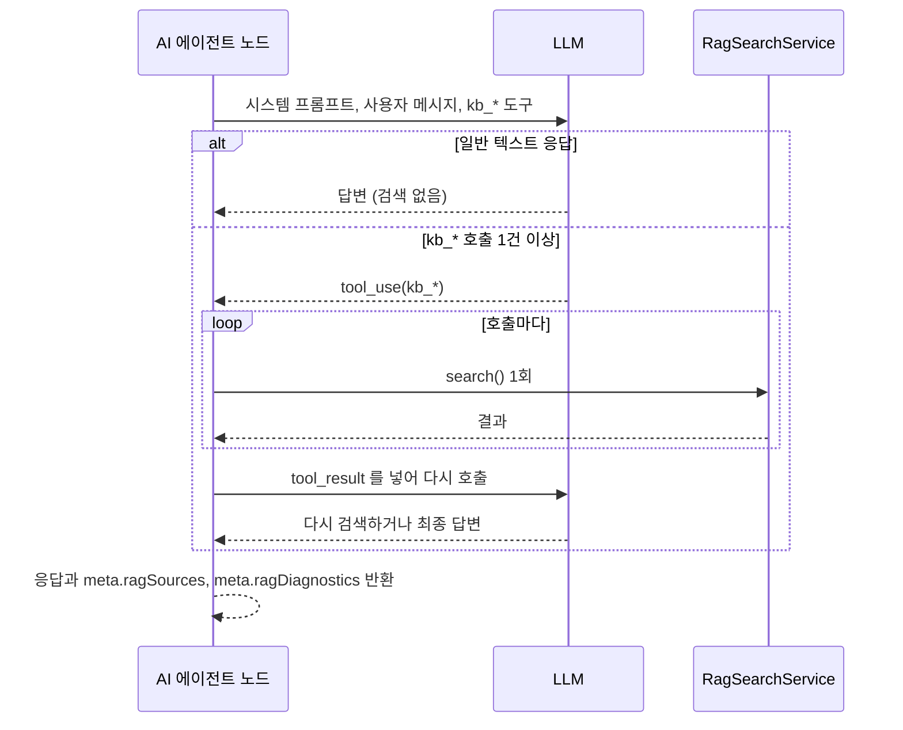
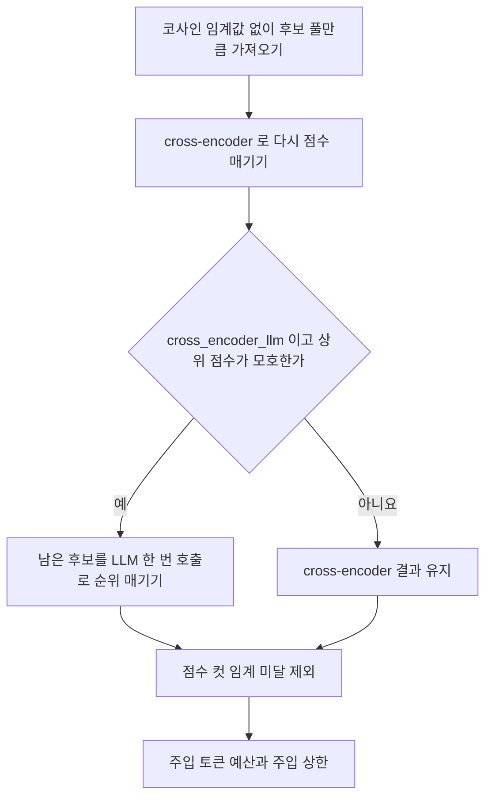
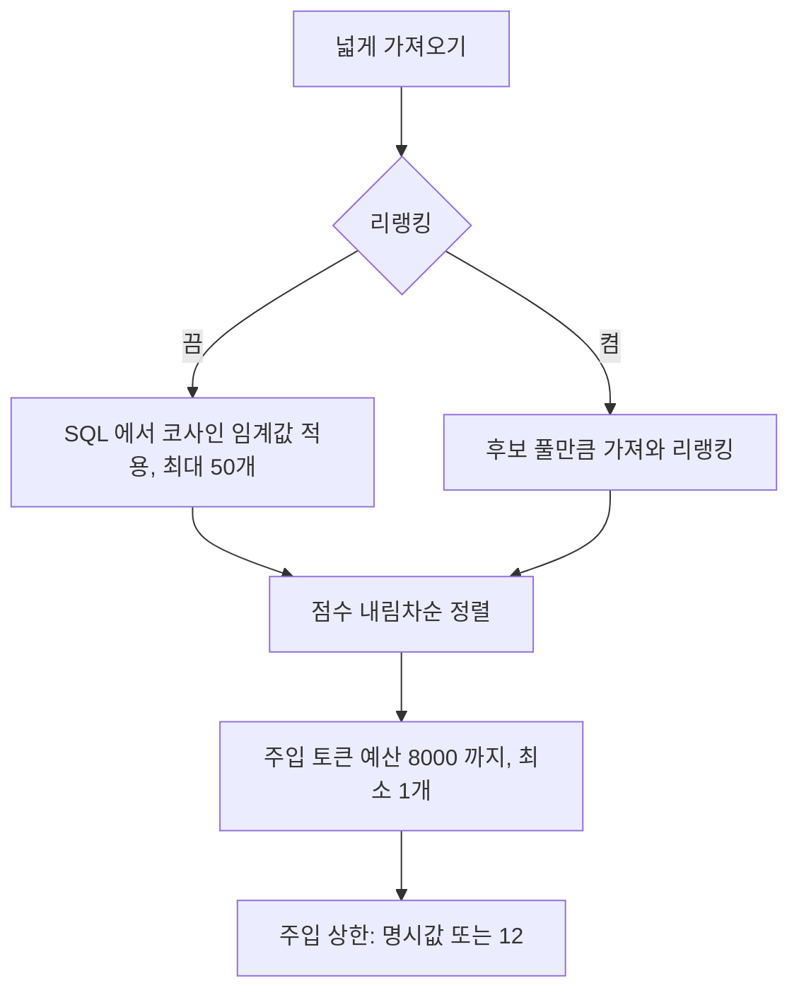

> 구현 상태: 부분 구현 · 원문: `spec/5-system/9-rag-search.md`, `spec/data-flow/6-knowledge-base.md` (§1.3·§1.4), `spec/4-nodes/3-ai/_product-overview.md` (§3.5 KB-AG, §5 NF-AI-03), `spec/4-nodes/4-integration/_product-overview.md` (§3.4 KB-AG), `spec/2-navigation/_product-overview.md` (§3.5 NAV-KB-06) · 용어: [용어 사전](../CLE-GLOSSARY.md)

## 개요

RAG 검색은 AI 에이전트 노드가 지식 저장소(Knowledge Base, `KnowledgeBase`)를 LLM 도구로 검색해 답변 근거를 가져오는 검색 엔진이다. 사용자는 설정 없이 기본 벡터 검색을 쓴다. 지식 저장소마다 리랭킹(reranking, `rerank_mode`)을 켜 검색 정밀도를 더 높일 수 있다.

검색 흐름은 지식 저장소의 검색 모드(`rag_mode`)에 따라 갈린다.

- Vector RAG(`rag_mode=vector`, 기본): 이 문서에서 정하는 유사도 검색이다.
- Graph RAG(`rag_mode=graph`): 벡터 seed, 그래프 확장, 중심성 가중치로 이어지는 흐름이다. [Graph RAG](CLE-KB-GRAPH.md) 에서 정한다. 이 문서의 리랭킹과 동적 점수 컷은 두 모드에 모두 적용된다.

검색은 AI 에이전트 노드가 지식 저장소를 지식 저장소 도구(`kb_*`)로 LLM 에 노출하는 능동 tool calling 방식이다. LLM 이 사용자 의도를 보고 호출 여부, 질의, 지식 저장소, 결과 수를 정한다. 여러 도구를 한 번에 불러 병렬로 검색하거나 결과가 모자라면 다른 질의로 다시 부르는 것도 LLM 이 정한다.

에이전트는 사용자 문장을 그대로 질의로 쓰지 않고 답에 필요한 지식 단위로 나눠 검색한다(agentic RAG). 별개의 정보가 필요하면 같은 턴에 `kb_*` 를 여러 번 부른다. 같은 지식 저장소라도 따로 부른다. 예를 들어 "교환과 반품 정책 알려줘" 는 `query="교환정책"` 과 `query="반품정책"` 두 번이 된다. 임베딩 검색은 주제가 하나일수록 정확하다. 나눌지는 에이전트가 판단하며 시스템 프롬프트와 도구 설명으로 유도한다.

각 호출 결과는 따로 유지한다. `kb_*` 호출 하나는 지식 저장소 하나만 검색하고 결과는 호출별 tool_result 메시지로 LLM 에 간다. 호출 사이의 점수 병합이나 재정렬은 하지 않는다. 에이전트가 각 결과를 인용하고 종합한다. 노드 메타(`meta.ragSources`)를 쌓을 때만 `chunkId` 로 중복을 빼서 References 화면의 중복 표시를 막는다.

`RagSearchService.search()` 는 여러 지식 저장소를 인자로 받으면 점수로 병합한 뒤 동적 점수 컷을 적용한다. 이 경로는 디버그 API(`POST /api/knowledge-bases/search`)의 여러 지식 저장소 검색에서만 쓴다. AI 에이전트 노드의 `KbToolProvider` 는 늘 지식 저장소 하나로 부르므로 병합 로직이 돌지 않는다.

범위 밖:

- 노드 설정 필드(`knowledgeBases`, `ragTopK`, `ragThreshold`)의 정의는 [AI 노드 공통](../CLE-NODE-AI/CLE-NODE-AI-COMMON.md), 도구 호출 한도와 도구 분류는 [AI 에이전트 노드](../CLE-NODE-AI/CLE-NODE-AGENT.md) 에서 정한다.
- 문서 적재와 질의 임베딩 모델 해석은 [문서 임베딩](CLE-KB-EMBED.md), 저장 청크 차원의 정의는 [지식 저장소 데이터와 흐름](CLE-KB-DATA.md) 에서 정한다.
- 리랭커 설정 화면은 [모델 설정](../CLE-AI/CLE-AI-MODELS.md), 리랭커 호출 계약(`RerankClient`)은 [LLM 클라이언트](../CLE-AI/CLE-AI-LLM.md) 에서 정한다.
- 검색 결과를 대화 미리보기에 그리는 규칙은 [대화 미리보기](../CLE-EXEC/CLE-EXEC-PREVIEW.md) 와 [대화 스레드](../CLE-IX/CLE-IX-THREAD.md) 에서 정한다.
- 검색 품질을 재는 방법은 [RAG 품질 평가](CLE-KB-EVAL.md) 에서 정한다.

## 요구사항

- REQ-RAG-001 WHEN 사용자가 AI 에이전트 노드에서 지식 저장소를 고르면 THE SYSTEM SHALL 검색 모드와 상관없이 같은 방식으로 그 지식 저장소를 검색 대상으로 쓴다. (원본: 통합 PRD KB-AG-01, AI PRD KB-AG-01, 내비게이션 PRD NAV-KB-06)
- REQ-RAG-002 WHEN AI 에이전트 노드가 실행되면 THE SYSTEM SHALL 고른 지식 저장소마다 `kb_<sanitizedKbId>` 이름의 지식 저장소 도구를 LLM 에 노출한다.
- REQ-RAG-003 WHEN 지식 저장소에 설명이 있으면 THE SYSTEM SHALL 그 설명을 도구 설명에 넣는다.
- REQ-RAG-004 WHEN LLM 이 한 응답에서 지식 저장소 도구를 여러 번 부르면 THE SYSTEM SHALL 호출마다 검색을 한 번씩 실행한다.
- REQ-RAG-005 WHEN 지식 저장소 도구 호출을 처리하면 THE SYSTEM SHALL 지식 저장소 하나만 검색하고 결과를 호출별 tool_result 로 따로 돌려준다.
- REQ-RAG-006 WHEN 여러 호출의 결과가 모이면 THE SYSTEM SHALL 호출 사이의 점수 병합이나 재정렬을 하지 않는다.
- REQ-RAG-007 WHEN 검색 인용 메타를 쌓으면 THE SYSTEM SHALL `chunkId` 가 같은 항목의 중복만 뺀다.
- REQ-RAG-008 WHEN LLM 이 도구 인자로 `threshold` 를 주지 않으면 THE SYSTEM SHALL 노드의 유사도 임계값(`ragThreshold`, 기본 0.7)을 쓴다. (원본: 통합 PRD KB-AG-02, AI PRD KB-AG-02)
- REQ-RAG-009 WHEN 노드 `ragTopK` 나 도구 인자 `top_k` 가 주어지면 THE SYSTEM SHALL 그 값을 LLM 에 넣을 청크 수의 상한으로 쓴다. (원본: 통합 PRD KB-AG-03·KB-AG-04, AI PRD KB-AG-03)
- REQ-RAG-010 IF 주입 상한이 주어지지 않으면 THE SYSTEM SHALL 동적 점수 컷으로 넣을 청크 수를 정한다. (원본: 통합 PRD KB-AG-04)
- REQ-RAG-011 IF 임베딩 API 나 pgvector 쿼리가 실패하면 THE SYSTEM SHALL `error: "search_failed"` 결과를 LLM 에 돌려주고 노드를 실패시키지 않는다.
- REQ-RAG-012 IF 지식 저장소의 저장 청크 차원이 NULL 이면 THE SYSTEM SHALL 벡터 쿼리를 실행하지 않고 `status: "not_searchable"` 결과를 돌려준다.
- REQ-RAG-013 WHEN 검색 불가 결과를 돌려주면 THE SYSTEM SHALL 사유를 재임베딩 진행 중이면 `reembedding_in_progress`, 재임베딩 전이면 `reembedding_required` 로 싣는다.
- REQ-RAG-014 IF LLM 그레이딩이 모든 후보를 근거 없음으로 판정하면 THE SYSTEM SHALL 결과를 비우고 `grounding: "none"` 결과를 돌려준다.
- REQ-RAG-015 WHEN 도구 결과를 만들면 THE SYSTEM SHALL `error`, `status`, `grounding` 판별 키 가운데 하나만 싣는다.
- REQ-RAG-016 WHEN 지식 저장소 도구가 불리면 THE SYSTEM SHALL 호출 한 번을 도구 호출 한도(`maxToolCalls`)의 1회로 센다.
- REQ-RAG-017 WHEN 벡터 검색을 실행하면 THE SYSTEM SHALL 워크스페이스로 격리하고 준비됨 문서의 같은 차원 청크만 비교한다.
- REQ-RAG-018 WHILE 리랭킹이 꺼져 있는 동안 THE SYSTEM SHALL 코사인 유사도 임계값을 SQL 에서 적용하고 후보를 `RAG_RECALL_K`(50)개까지 가져온다.
- REQ-RAG-019 WHILE 리랭킹이 켜져 있는 동안 THE SYSTEM SHALL 코사인 임계값 없이 후보 풀(`rerank_candidate_k`, 기본 50)만큼 가져온다.
- REQ-RAG-020 WHILE 리랭킹이 켜져 있는 동안 THE SYSTEM SHALL `threshold` 인자와 `ragThreshold` 를 리랭킹 점수 기준으로 해석한다.
- REQ-RAG-021 WHEN 지식 저장소에 점수 컷 임계(`rerank_score_threshold`)가 설정돼 있으면 THE SYSTEM SHALL 런타임 임계값보다 그 값을 먼저 리랭킹 점수 컷에 쓴다.
- REQ-RAG-022 WHEN 리랭킹 모드가 `cross_encoder` 나 `cross_encoder_llm` 이면 THE SYSTEM SHALL 모든 후보를 리랭커로 다시 점수 매긴다.
- REQ-RAG-023 WHEN 리랭킹 모드가 `cross_encoder_llm` 이고 cross-encoder 상위 점수가 평탄하거나 모호하면 THE SYSTEM SHALL 남은 후보를 LLM 한 번 호출로 순위를 다시 매긴다.
- REQ-RAG-024 IF LLM 그레이딩 조건에 해당하지 않으면 THE SYSTEM SHALL cross-encoder 결과를 그대로 쓴다.
- REQ-RAG-025 WHEN 리랭킹을 적용하면 THE SYSTEM SHALL 지식 저장소 하나를 검색하는 호출에만 적용한다.
- REQ-RAG-026 IF 리랭커 엔드포인트가 실패하거나 시간을 넘기면 THE SYSTEM SHALL 코사인 점수 순으로 강등하고 진단에 `RERANK_ENDPOINT_FAILED` 를 남긴다.
- REQ-RAG-027 IF 리랭커가 유효한 결과를 하나도 돌려주지 않으면 THE SYSTEM SHALL 코사인 점수 순으로 강등하고 진단에 `RERANK_NO_VALID_RESULTS` 를 남긴다.
- REQ-RAG-028 IF 리랭커 모델 설정이 없거나 프로바이더를 지원하지 않으면 THE SYSTEM SHALL 그 지식 저장소를 리랭킹 끔으로 강등하고 진단에 `RERANK_CONFIG_INVALID` 를 남긴다.
- REQ-RAG-029 IF LLM 그레이딩이 실패하면 THE SYSTEM SHALL cross-encoder 결과를 유지하고 진단에 `RERANK_LLM_GRADING_FAILED` 를 남긴다.
- REQ-RAG-030 WHEN 후보를 LLM 에 넣기 직전이면 THE SYSTEM SHALL 모든 검색 모드에 동적 점수 컷을 적용한다.
- REQ-RAG-031 WHEN 동적 점수 컷을 적용하면 THE SYSTEM SHALL 누적 추정 토큰이 8000 을 넘기 전까지만 넣되 최소 1개는 넣는다.
- REQ-RAG-032 WHEN 동적 점수 컷을 적용하면 THE SYSTEM SHALL 주입 수를 주입 상한이나 기본 상한 12 로 자른다.
- REQ-RAG-033 WHEN 벡터 회수 쿼리를 실행하면 THE SYSTEM SHALL 트랜잭션 범위에서 `hnsw.ef_search` 를 `LIMIT×2` 를 40~1000 으로 자른 값으로 올린다.
- REQ-RAG-034 WHEN AI 노드 실행이 끝나면 THE SYSTEM SHALL 검색 인용 메타(`meta.ragSources`)와 검색 진단(`meta.ragDiagnostics`)을 노드 출력에 싣는다.
- REQ-RAG-035 WHEN 멀티턴 노드가 검색하면 THE SYSTEM SHALL 턴별 인용과 진단을 `meta.turnDebug[]` 에도 싣는다.
- REQ-RAG-036 WHEN 모든 호출의 결과가 0건이면 THE SYSTEM SHALL `skipReason` 을 `empty_kb_list`, `kb_unsearchable`, `no_results` 순서로 가장 구체적인 하나만 채운다.
- REQ-RAG-037 WHEN 리랭킹이 켜진 호출이면 THE SYSTEM SHALL 검색 진단에 `rerank` 하위 객체를 싣는다.
- REQ-RAG-038 WHEN 검색 질의를 임베딩하면 THE SYSTEM SHALL 그 지식 저장소의 임베딩 모델 설정과 같은 엔드포인트로 입력 유형 `query` 를 넘겨 임베딩한다.
- REQ-RAG-039 IF 지식 저장소 메타 조회가 실패하면 THE SYSTEM SHALL 그 지식 저장소만 도구 노출에서 빼고 경고 로그를 남긴다.
- REQ-RAG-040 WHEN AI 노드가 지식 저장소 도구를 한 번이라도 불렀거나 인용이 있으면 THE SYSTEM SHALL 실행 결과 화면에 References 탭을 보여 준다.
- REQ-RAG-041 WHEN 디버그 API 로 여러 지식 저장소를 한 번에 검색하면 THE SYSTEM SHALL 임베딩 모델 설정과 저장 청크 차원이 같은 지식 저장소끼리 묶어 묶음마다 질의를 한 번 임베딩한다.
- REQ-RAG-042 WHEN 청크 1만 개 규모의 지식 저장소를 검색하면 THE SYSTEM SHALL 500ms 안에 검색 결과를 돌려준다. (원본: AI PRD NF-AI-03)

## 검색 호출 흐름

AI 에이전트 노드는 고른 지식 저장소를 도구로 노출하고 LLM 을 부른다. LLM 이 도구를 부르면 호출마다 검색을 한 번 실행하고 결과를 다음 LLM 호출에 넣는다. LLM 이 충분하다고 판단해 일반 텍스트로 답하면 끝난다.



LLM 호출 전에 엔진이 지식 저장소를 자동으로 검색하는지는 정의가 갈린다. [미결 사항](#미결-사항) 참조. 현재 구현에서 검색 서비스를 부르는 곳은 지식 저장소 도구 경로와 디버그 API 뿐이다.

### 지식 저장소 도구 정의

각 지식 저장소는 다음 도구 정의로 LLM 에 노출된다.

```json
{
  "name": "kb_<sanitizedKbId>",
  "description": "Search the \"<kb name> — <kb description>\" knowledge base. ...",
  "parameters": {
    "type": "object",
    "properties": {
      "query":     { "type": "string", "description": "Short search phrase ..." },
      "top_k":     { "type": "integer", "description": "Max chunks to inject. If omitted, a dynamic token-budget cut applies (internal ceiling). Increase for broader recall." },
      "threshold": { "type": "number",  "description": "Default: <ragThreshold>" }
    },
    "required": ["query"]
  }
}
```

- `top_k` 와 `threshold` 는 LLM 이 호출 인자로 바꿀 수 있다. `threshold` 의 기본값은 노드의 유사도 임계값(`ragThreshold`)이다.
- `top_k` 는 주입 상한(`ragTopK`)이다. LLM 인자나 노드 `ragTopK` 로 주면 그 값이 상한이다. 주지 않으면 [동적 점수 컷](#동적-점수-컷) 이 넣을 청크 수를 정한다. 고정 기본값은 없다.
- 지식 저장소 설명이 있으면 도구 설명에 들어가 LLM 이 도메인을 가려 부른다.
- 한 응답에서 여러 `kb_*` 를 부를 수 있다.

### 도구 결과 형식

정상 결과:

```json
{
  "kb": "Refund Policy",
  "query": "refund window",
  "results": [
    { "source": "refund-rules.md", "score": 0.872, "content": "..." }
  ]
}
```

LLM 은 `source` 와 `score` 로 인용과 신뢰도를 판단한다.

검색 실패(임베딩 API 나 pgvector 의 일시적인 인프라 에러):

```json
{
  "kb": "Refund Policy",
  "query": "refund window",
  "error": "search_failed",
  "results": []
}
```

근거 없음(`cross_encoder_llm` 의 LLM 그레이딩이 모든 후보를 근거 없음으로 판정, 진단의 `gradingNoGrounding=true` 와 1:1 대응):

```json
{
  "kb": "Refund Policy",
  "query": "refund window",
  "grounding": "none",
  "note": "Relevance grading found no passages in this knowledge base that ground the query. Do not fabricate an answer from this KB.",
  "results": []
}
```

이 신호를 받은 에이전트는 그 지식 저장소를 근거로 답하지 않고 관련 근거가 없다고 밝힌다. 환각을 줄이려는 장치다.

검색 불가(`not_searchable`, 저장 청크 차원이 NULL):

```json
{
  "kb": "요금제 안내",
  "query": "요금제 종류",
  "status": "not_searchable",
  "reason": "reembedding_required",
  "note": "This knowledge base is being (re)embedded and is temporarily unsearchable. Tell the user it needs re-embedding (or that it is in progress); do not claim the KB is empty or fabricate an answer.",
  "results": []
}
```

- `reason` 은 재임베딩 진행 중(`reembed_status='in_progress'`)이면 `reembedding_in_progress`, 모델 변경 뒤 재임베딩 전(`reembed_status='idle'`)이면 `reembedding_required` 다. 뒤쪽은 사용자가 재임베딩할 때까지 계속 검색되지 않는다.
- 이 신호를 받은 에이전트는 그 지식 저장소로 답을 만들지 않고 재임베딩이 필요하거나 진행 중이라고 사용자에게 알린다. 빈 지식 저장소나 무관한 결과로 오인하지 않게 한다. 진단의 `skipReason="kb_unsearchable"` 과 대응한다.
- `search_failed` 는 다시 시도하면 회복될 수 있는 인프라 에러다. `not_searchable` 은 데이터 적재 상태 문제라 재임베딩 전까지는 다시 시도해도 같다.

판별 순서와 표기:

- 소비 코드는 `error`(일시 실패), `status`(검색 불가), `grounding`(근거 없음), 정상 `results` 순서로 분기한다. 결과 하나에는 판별 키가 하나만 있다.
- 판별 키의 문자열 값(`search_failed`, `not_searchable`, `reembedding_required`, `none`)은 snake_case 다. 노드 출력 에러 코드(UPPER_SNAKE_CASE, [노드 출력 규약](../CLE-NODE/CLE-NODE-OUTPUT.md))나 리랭킹 진단 에러 코드와는 층이 다르다. 이쪽은 LLM 컨텍스트에 넣는 본문 문자열이다.

### 호출 한도

지식 저장소 도구 호출은 한 번이 1회로 도구 호출 한도(`maxToolCalls`)에 합산된다. 한도의 기본값, 한도에 닿았을 때의 처리, 한 응답의 도구 호출 수가 남은 한도를 넘을 때의 처리는 [AI 에이전트 노드](../CLE-NODE-AI/CLE-NODE-AGENT.md) 에서 정한다.

## 유사도 검색

### 쿼리

```sql
SELECT
  dc.id AS chunk_id,
  dc.document_id,
  dc.content,
  dc.metadata,
  d.name AS document_name,
  1 - (dc.embedding::vector(<dim>) <=> $1::vector(<dim>)) AS score
FROM document_chunk dc
JOIN document d ON d.id = dc.document_id
JOIN knowledge_base kb ON kb.id = d.knowledge_base_id AND kb.workspace_id = $5
WHERE vector_dims(dc.embedding) = <dim>
  AND d.embedding_status = 'completed'
  AND dc.embedding IS NOT NULL
  AND 1 - (dc.embedding::vector(<dim>) <=> $1::vector(<dim>)) >= $3
ORDER BY score DESC
LIMIT $4;
```

| 파라미터 | 뜻 | 기본값 |
|---|---|---|
| `$1` | 질의 임베딩 벡터 | 없음 |
| `$2` | 지식 저장소 ID 배열 (도구 호출은 하나) | 없음 |
| `$3` | 유사도 임계값(θ). 관련성 게이트 | LLM 인자 또는 0.7 |
| `$4` | 후보를 가져오는 폭(recall LIMIT) | 리랭킹 끔: 내부 상수 `RAG_RECALL_K`(50). 리랭킹 켬: `rerank_candidate_k`(기본 50) |
| `$5` | 워크스페이스 ID (멀티테넌시 격리) | 없음 |

`$4` 는 가져오는 폭이지 LLM 에 넣는 청크 수가 아니다. 넣는 수는 [동적 점수 컷](#동적-점수-컷) 이 정한다.

위 SQL 은 점수 계산을 보여 주는 개념 축약본이다. 실제 쿼리는 다음과 같다.

- 차원 `<dim>` 으로 양쪽에 `::vector(<dim>)` 캐스트를 건다. 3072 차원은 `halfvec` 캐스트를 쓴다. 캐스트 식은 차원별 부분 HNSW 인덱스 정의와 같다.
- `vector_dims(dc.embedding) = <dim>` 으로 차원이 다른 청크를 뺀다.
- `knowledge_base` 조인의 `workspace_id` 로 테넌트를 격리한다.
- 같은 차원의 지식 저장소를 묶은 뒤 묶음 단위로 ID 를 넣는다(`searchVectorGroup`, `rag-search.service.ts`).

### 후보 폭과 컷

두 경로 모두 넓게 가져온 뒤 동적 점수 컷으로 자른다.

- 리랭킹 끔(`rerank_mode='off'`, 기본): 코사인 임계값(`$3`) 게이트는 유지한다. `LIMIT` 만 `RAG_RECALL_K`(50)로 넓힌다.
- 리랭킹 켬: 코사인 임계값 없이 `rerank_candidate_k` 만큼 가져와 리랭킹한다. 이때 `kb_*` 의 `threshold` 인자와 노드 `ragThreshold` 는 리랭킹 점수 임계값으로 해석한다. 지식 저장소의 점수 컷 임계와의 관계는 [점수 컷 임계](#점수-컷-임계) 에서 정한다.

### 검색 불가 지식 저장소의 사전 차단

위 SQL 은 `<dim>` 을 알아야 실행된다. 그래서 저장 청크 차원이 NULL 인 지식 저장소(모델 변경 뒤 재임베딩 전, 재임베딩 진행 중)는 지식 저장소 메타를 읽는 단계에서 막고 벡터 쿼리를 실행하지 않는다. 저장된 청크가 옛 차원·벡터 공간이라 새 질의와 비교하면 오답이 나오기 때문이다. 쿼리가 우연히 0행을 돌려주는 것이 아니라 명시적인 차단이다. 차단 사실은 도구 결과 `status:"not_searchable"` 와 진단 `skipReason="kb_unsearchable"` 로 알린다. 지원 차원(부분 HNSW 인덱스가 있는 차원) 밖의 지식 저장소도 검색에서 빠지고 에러 로그를 남긴다. Graph RAG 의 seed 쿼리도 차원이 NULL 이면 똑같이 막는다.

### 거리 함수

- 코사인 유사도: `1 - (embedding <=> query_vector)`
- pgvector `<=>` 연산자는 코사인 거리다.
- 점수 범위는 0.0(무관)부터 1.0(동일)까지다.

### 여러 지식 저장소 검색

`searchWithMeta(query, knowledgeBaseIds[], workspaceId, { topK?, threshold? })` 는 여러 지식 저장소를 받는 시그니처다. 지식 저장소 메타를 한 번에 읽은 뒤 다음과 같이 나눈다.

- 저장 청크 차원이 NULL 이거나 지원 차원 밖인 지식 저장소는 뺀다(`groupVectorKbs` 의 skip, `isGraphKbSearchable` false).
- Vector 지식 저장소는 `(embedding_model_config_id, embedding_dimension)` 묶음으로 나눠 묶음마다 질의를 한 번 임베딩하고 병렬로 검색한다. 모델 설정이 같으면 모델, 모델 프로바이더, 차원이 같아 질의 임베딩을 함께 쓸 수 있다. 다르면 엔드포인트 호환을 보장할 수 없어 묶음을 나눈다.
- Graph 지식 저장소는 `max_hops`, `vector_seed_top_k` 가 저장소마다 달라 저장소 단위로 병렬 처리한다.
- 합친 결과 전체를 점수 내림차순으로 정렬한 뒤 동적 점수 컷을 적용한다.
- Graph 지식 저장소가 하나라도 끼면 그래프 순회 요약(`graphTraversal`)을 함께 돌려준다.

AI 에이전트 노드는 이 병합 경로를 쓰지 않는다. 디버그 API 만 쓴다.

## 리랭킹

리랭킹은 가져온 후보를 LLM 에 넣기 전에 지식 저장소의 `rerank_mode` 에 따라 한 번 더 정밀하게 정렬하는 선택 단계다. `kb_*` 도구 인터페이스(`query`, `top_k`, `threshold`)는 그대로이고 후처리는 `RagSearchService` 안에서 일어난다. `cross_encoder` 와 `cross_encoder_llm` 모두 구현됐다. 리랭커 모델 프로바이더는 `tei` 와 `cohere` 다(V081 리랭커 설정, V082 지식 저장소 `rerank_*` 컬럼). 리랭킹은 검색 모드와 독립이다. Graph RAG 의 중심성 가중치([Graph RAG](CLE-KB-GRAPH.md))는 그래프 안의 1차 정렬이다. 리랭킹은 벡터·그래프 어느 쪽 결과에나 적용하는 2차 후처리다.

### 모드

| `rerank_mode` | 동작 |
|---|---|
| `off` (기본) | 다시 점수 매기지 않는다. 넓게 가져오고(코사인 임계값 게이트) 동적 점수 컷을 적용한다. 리랭커 인프라가 필요 없다 |
| `cross_encoder` | 넓게 가져오고 cross-encoder 로 다시 점수 매긴 뒤 동적 점수 컷을 적용한다 |
| `cross_encoder_llm` | `cross_encoder` 뒤에 조건부로 LLM 그레이딩을 한 번 더한다. cross-encoder 상위 점수가 평탄하거나 모호할 때만 한다. 정책·지시 판단이 필요한 지식 저장소용이며 이 모드를 고르는 것 자체가 표시다. 별도 플래그는 없다 |

### 흐름 (`rerank_mode ≠ off`)



1. 코사인 임계값 없이 `rerank_candidate_k`(기본 50, 최대 200)만큼 가져온다. Vector 지식 저장소는 `searchVectorGroup` 으로, Graph 지식 저장소는 seed 와 확장 뒤 상위 후보 풀만큼 잘라 넘긴다.
2. `(query, chunk.content)` 쌍을 리랭커(`kind=rerank` 모델 설정) 엔드포인트로 점수 매긴다(`RerankClient.rerank()`, [LLM 클라이언트](../CLE-AI/CLE-AI-LLM.md)). 리랭커는 `rerank_config_id` 가 있으면 그 설정, 없으면 워크스페이스 기본 리랭커다.
3. `cross_encoder_llm` 만: 상위 점수가 평탄하거나 모호하면 LLM 그레이딩으로 넘어간다. 아니면 cross-encoder 결과를 그대로 쓴다. 넘어가지 않는 것도 정상이다.
4. 점수 컷 임계에 못 미치는 후보를 빼고 주입 토큰 예산으로 자른다.
5. 주입 상한: 명시한 `top_k`(노드 `ragTopK` 나 LLM 인자)가 있으면 그 값, 없으면 내부 상한까지 넣는다.

컷 기준이 코사인에서 리랭킹 점수로 옮겨 간다. 고정 개수 컷(top-k)으로 의미 있는 청크가 잘리는 문제는 점수 기반 동적 점수 컷으로 푼다. 한국어 권장 cross-encoder 모델은 `dragonkue/bge-reranker-v2-m3-ko`(자가호스팅 `tei`)다.

### LLM 그레이딩

- listwise 방식으로 한 번만 부른다. 후보마다 따로 묻는 pointwise 방식은 쓰지 않는다. 응답은 ID 순위와 1~10 점수다.
- 그레이딩 LLM 은 `rerank_llm_config_id` 가 있으면 그 Chat 모델 설정, 없으면 워크스페이스 기본 Chat 설정이다.
- 현재 구현의 넘어가는 조건은 cross-encoder 최고 점수가 0.6 미만이거나 1위와 2위의 상대 격차가 0.05 미만일 때다. 남은 후보(survivor) 15개를 후보마다 본문 500자로 잘라 넘긴다. 이 수치는 합리적 기본값으로 시작한 값이며 골든셋 기반 A/B 로 확정하는 일은 [남은 과제](#남은-과제) 다.
- 결과는 셋이다. 적용되면 그 순위로 다시 정렬하고 점수는 10 으로 나눠 쓴다. 모든 후보가 무관하면 결과를 비우고 근거 없음 신호를 낸다. 실패하면 cross-encoder 결과를 유지한다.
- 모든 후보를 무관으로 판정한 사실은 검색 결과 메타로 알려 에이전트가 "관련 근거 없음" 을 밝히게 한다. 환각을 줄이고 인용 정밀도를 높이려는 장치다.

### 점수 컷 임계

지식 저장소에 점수 컷 임계(`rerank_score_threshold`)가 있으면 그 값으로 리랭킹 점수를 자른다. 런타임 임계값(노드 `ragThreshold` 나 LLM 인자)보다 먼저 쓴다. 값을 비워 둔 경우의 동작은 정의가 갈린다. [미결 사항](#미결-사항) 참조.

### 적용 범위

리랭킹은 `RagSearchService` 가 지식 저장소 하나로 불린 경로(지식 저장소 도구 `KbToolProvider`)에만 적용한다. 여러 지식 저장소를 인자로 받는 디버그 경로는 코사인 점수로 병합한 뒤 동적 점수 컷만 적용하고 리랭킹은 하지 않는다. 지식 저장소 하나가 RAG 의 정상 경로라서 이 범위로 충분하다고 봤다. 여러 지식 저장소 리랭킹은 [남은 과제](#남은-과제) 다.

### 실패 처리

리랭킹 경로는 어떤 실패에도 예외를 던지지 않는다. 설정 해석 실패, 엔드포인트 실패, 유효 결과 없음이면 원래 코사인 점수 순으로 강등한 뒤 같은 동적 점수 컷을 적용한다. 진단 `rerank.error` 에 코드를 남긴다. 그레이딩만 실패하면 cross-encoder 결과를 유지한다. 코드별 처리는 [에러 처리](#에러-처리) 표에 있다.

## 동적 점수 컷

가져오기와 리랭킹 직후 LLM 컨텍스트에 넣기 직전에 모든 모드에 공통으로 적용하는 후처리다. 예전 고정 개수 컷(`LIMIT topK=5`)은 질의마다 다른 최적 개수를 무시해 의미 있는 청크를 빠뜨렸다. 가져오는 폭을 넓히고 점수 기반으로 자르는 방식으로 바꿨다. `kb_*` 도구 인터페이스는 그대로이고 후처리는 `RagSearchService` 안에서 일어난다.



1. 넓게 가져오기: 리랭킹 끔이면 코사인 임계값 게이트와 `LIMIT RAG_RECALL_K`(50). 리랭킹 켬이면 후보 풀만큼 가져와 리랭킹하고 조건부 LLM 그레이딩을 한다.
2. 점수 내림차순으로 정렬한 후보 위에서 자른다.
   - 임계값 게이트: 리랭킹 끔은 SQL 단계에서 이미 적용했다. 리랭킹 켬은 점수 컷 임계로 자른다.
   - 주입 토큰 예산: 누적 토큰 추정이 `RAG_INJECT_TOKEN_BUDGET`(8000)을 넘으면 멈춘다. 최소 1개는 넣는다.
   - 주입 상한: 명시한 `top_k` 가 있으면 그 값, 없으면 `RAG_MAX_INJECT_COUNT`(12)다.

상수(모듈 상수, 환경변수로 노출하지 않음):

| 상수 | 값 | 뜻 |
|---|---|---|
| `RAG_RECALL_K` | 50 | 리랭킹 끔 경로의 가져오는 폭. `rerank_candidate_k` 기본값과 수치만 같고 따로 도는 코드 경로다. 지식 저장소 필드가 아니다 |
| `RAG_INJECT_TOKEN_BUDGET` | 8000 | 주입 토큰 예산. 작업 메모리 압축 예산 `DEFAULT_MEMORY_TOKEN_BUDGET`(8000)과 값은 같지만 쓰임새가 다른 별개 상수다 |
| `RAG_MAX_INJECT_COUNT` | 12 | 주입 상한의 기본값 |

- 새 지식 저장소·노드 설정 필드는 없다. 사용자와 LLM 에 노출하는 값은 임계값(`ragThreshold`)과 `top_k`(`ragTopK` 나 LLM 인자)뿐이다.
- 토큰 추정은 청킹 경로의 `chunking/text-chunker.estimateTokens`(글자 수 / 3, 동기, 의존성 없음)를 쓴다. 청크 도메인과 같은 추정이다. AI 에이전트 작업 메모리의 언어별 추정과는 일부러 분리했다.
- 적용 경로: 지식 저장소 하나의 벡터 검색, 디버그 API 의 여러 지식 저장소 병합, 그래프 통합 결과 모두 마지막 단계에서 똑같이 적용한다(`applyDynamicCut`).
- 실패 처리: 프로세스 안의 순수 후처리(필터와 합산)라 따로 실패하는 경우가 없다. 그 앞의 예외는 기존 검색 예외 처리(빈 결과, `search_failed`)가 맡는다.

### pgvector `ef_search`

넓게 가져오는 폭(리랭킹 끔 50, 리랭킹 켬 최대 200)은 HNSW 기본 `ef_search=40` 보다 크다. 그대로 두면 `ef_search < LIMIT` 이 돼 재현율이 떨어진다. 그래서 벡터 회수 쿼리(`searchVectorGroup`)는 `SET LOCAL hnsw.ef_search = clamp(LIMIT×2, 40, 1000)`(`hnswEfSearchFor`)을 트랜잭션 범위로 적용한다. `SET LOCAL` 이라 커넥션 풀을 오염시키지 않는다. pgvector 표준 GUC 라 관리형 DB 어디서나 같게 동작하고 확장이 따로 필요 없다. Graph RAG seed(기본 5개)는 40 보다 작아 올리지 않는다. `ivfflat` 인덱스는 쓰지 않는다. 운영 부하에 맞춘 정밀 조정은 [남은 과제](#남은-과제) 다.

## 출력 메타데이터

AI 에이전트 노드 출력의 `meta.ragSources` 와 `meta.ragDiagnostics` 를 검색 인용 메타라고 부른다. 스키마의 단일 기준은 이 절이다. Graph RAG 도 같은 구조를 쓴다.

### 인용 청크 (`ragSources`)

```json
{
  "ragSources": [
    {
      "documentId": "uuid",
      "documentName": "Customer FAQ",
      "chunkId": "uuid",
      "content": "관련 텍스트 (최대 200자)...",
      "score": 0.92
    }
  ]
}
```

- `content`: 청크 원문의 앞 200자(미리보기용). Vector·Graph 공통 필드 이름이다.
- `score`: 0.0~1.0. 리랭킹 끔이면 코사인 유사도, 켬이면 정규화한 리랭킹 점수다.
- `origin?`: 점수 출처. `cosine`(기본 벡터), `reranked`(리랭킹 적용), Graph RAG 의 `seed`, `expanded`([Graph RAG](CLE-KB-GRAPH.md)). 생략하면 `cosine` 이다.
- 한 노드 실행 동안 도구를 여러 번 부르면 결과가 모두 쌓인다. 멀티턴도 포함한다.
- 멀티턴에서 어느 응답이 어느 청크를 썼는지 알 수 있도록 같은 항목을 턴 단위로 `meta.turnDebug[].ragSources`, `meta.turnDebug[].ragDiagnostics` 에도 싣는다. 노드 전체 누적은 `meta.ragSources` 에 그대로 둔다.

### 화면 표시

AI 노드가 지식 저장소를 부르려 했으면(`ragDiagnostics.attempted=true` 또는 `ragSources.length > 0`) 실행 결과 화면에 References 탭을 둔다. 노드 전체 요약과 턴 단위 묶음을 보여 준다. Output·Meta 탭에는 청크를 중복해서 싣지 않는다.

대화 미리보기(Preview)에는 두 표면이 있다.

- 📚 문서명 칩: 어시스턴트 메시지 아래 한 줄. 누르면 References 탭의 해당 턴으로 간다.
- 🔎 `rag` 행: 대화 타임라인 위의 독립 행이다. 이 행이 무엇을 나타내는지는 정의가 갈린다. [미결 사항](#미결-사항) 참조.

세 표면(References 탭, 칩, 행)은 모두 `meta.turnDebug[].ragSources` 를 읽고 같은 턴이면 같은 `sources[]` 를 보여야 한다. 시각 매핑과 불변식은 [대화 미리보기](../CLE-EXEC/CLE-EXEC-PREVIEW.md), 소스 정의는 [대화 스레드](../CLE-IX/CLE-IX-THREAD.md) 에서 정한다. 이 절과 그 문서들은 같은 표면을 다루므로 한쪽을 고치면 다른 쪽도 확인한다.

### 검색 진단 (`ragDiagnostics`)

```json
{
  "ragDiagnostics": {
    "attempted": true,
    "searchedKbCount": 2,
    "queriesUsed": ["refund window", "exchange policy"],
    "resultCount": 8
  }
}
```

| 필드 | 뜻 |
|---|---|
| `attempted` | 노드 실행 동안 지식 저장소 도구가 한 번 이상 불렸는지 |
| `searchedKbCount` | 불린 서로 다른 지식 저장소 수 |
| `queriesUsed` | LLM 이 보낸 모든 질의의 합집합(호출 순서 유지) |
| `resultCount` | 모든 호출에서 가져온 청크 수의 합 |
| `skipReason` | `empty_kb_list`(지식 저장소 미설정), `kb_unsearchable`(불린 지식 저장소가 모두 검색 불가), `no_results`(검색은 했지만 모든 호출이 0건). 정상이면 생략 |
| `rerank?` | 리랭킹 진단. 리랭킹이 켜진 호출에만 있다 |

`skipReason` 은 노드 단위 값 하나이고 `resultCount === 0` 일 때만 채운다. 결과가 하나라도 있으면 생략한다. 0건 원인이 둘 이상이면 `empty_kb_list`, `kb_unsearchable`, `no_results` 순서로 가장 구체적인 사유를 고른다. 호출 하나의 검색 불가 사실은 그 호출의 도구 결과로 이미 LLM 에 전달되므로 `skipReason` 은 실행 결과 화면의 요약 진단용이다.

리랭킹 진단(`rerank`):

```json
{
  "rerank": {
    "mode": "cross_encoder",
    "candidateCount": 50,
    "returnedCount": 6,
    "llmGradingApplied": false,
    "gradingNoGrounding": false,
    "cutoffApplied": true,
    "error": null
  }
}
```

- `error`: 실패하면 `RERANK_ENDPOINT_FAILED`, `RERANK_NO_VALID_RESULTS`, `RERANK_LLM_GRADING_FAILED`, `RERANK_CONFIG_INVALID` 가운데 하나다. 어느 값이든 검색은 코사인 경로로 강등되고 노드 실패가 아니다.
- `llmGradingApplied`: `cross_encoder` 는 늘 `false` 다. `cross_encoder_llm` 은 그레이딩으로 넘어가 성공했을 때만 `true` 다. `false` 는 넘어가지 않은 경우와 그레이딩 실패를 모두 포함하므로 `mode` 와 `error` 로 구분한다.
- `gradingNoGrounding`: LLM 그레이딩이 실행됐고 모든 후보를 근거 없음으로 판정하면 `true` 다. 그레이딩 응답 해석 실패(`RERANK_LLM_GRADING_FAILED`)와는 다르다. 뒤쪽은 cross-encoder 결과로 돌아간다.
- `cutoffApplied`: 동적 점수 컷이 후보를 하나라도 뺐으면 `true` 다. 점수 컷 임계, 주입 토큰 예산, 주입 상한 가운데 어느 것이든 해당한다. 강등 경로에서도 예산이나 상한 컷이 나면 `true` 다. 리랭킹 끔 경로의 컷 여부는 진단에 싣지 않는다. `rerank` 객체 자체가 리랭킹이 켜진 호출에만 있어서다.

## 임베딩 모델 일관성

- 검색 질의 임베딩은 지식 저장소의 임베딩 모델 설정(`embedding_model_config_id`, `kind=embedding`)과 같은 엔드포인트를 쓴다. 해석 규칙은 [문서 임베딩](CLE-KB-EMBED.md) 과 같다.
- 도구 호출 하나는 지식 저장소 하나를 검색하므로 그 저장소의 모델과 엔드포인트로 임베딩한다.
- LLM 이 한 응답에서 여러 지식 저장소 도구를 부르면 저장소마다 자기 임베딩 엔드포인트를 따로 쓴다.
- 질의는 입력 유형 `query` 로 임베딩한다(`LlmService.embed(..., inputType:'query')`). 적재 청크는 `document` 다. e5·Gemini 계열에서 질의와 문서를 구분해 회수 품질 저하를 막는다.
- 저장 청크 차원(`embedding_dimension`)은 모델이 내는 차원이 아니라 지금 저장된 청크 벡터의 실제 차원이다. 정의와 채우는 규칙은 [지식 저장소 데이터와 흐름](CLE-KB-DATA.md) 에서 정한다. 이 값이 NULL 이면 저장된 청크가 현재 모델과 같은 차원·공간이라는 보장이 없어 검색에서 미리 막는다.

## 에러 처리

| 상황 | 처리 |
|---|---|
| 지식 저장소 메타 조회 실패(찾을 수 없음 등) | 그 지식 저장소만 도구 노출에서 빼고 나머지는 노출한다. 경고 로그 |
| LLM 이 도구를 부르지 않음 | 정상이다. `ragDiagnostics.attempted=false` |
| 검색은 했지만 0건 | 도구 결과 `results: []`. LLM 이 다시 검색할지 일반 답변할지 정한다. 모든 호출이 0건이면 `skipReason="no_results"` |
| 검색 불가(저장 청크 차원 NULL, `reembedding_required`·`reembedding_in_progress`) | 메타 단계에서 미리 막는다(벡터·seed 쿼리 실행 안 함). `status:"not_searchable"` 와 `note` 로 LLM 에 알린다. `skipReason="kb_unsearchable"`. 노드 실패가 아니다. 옛 벡터로 검색하지 않는다. 화면 경고는 [지식 저장소 관리](CLE-KB-MANAGE.md) |
| 임베딩 API·pgvector 쿼리 실패 | 도구 결과 `error: "search_failed"`. LLM 이 알맞게 답한다. 노드 실패가 아니다. 일시 인프라 에러라 검색 불가와 다르다 |
| 리랭커 엔드포인트 실패·타임아웃 | 코사인 점수 순으로 정렬한 뒤 동적 점수 컷으로 강등. `rerank.error = "RERANK_ENDPOINT_FAILED"` |
| 리랭커가 유효 결과 0건 반환(모든 index 가 후보 범위 밖) | 코사인 점수 순으로 강등. `rerank.error = "RERANK_NO_VALID_RESULTS"`. 경고 로그 |
| 리랭커 모델 설정 없음·지원하지 않는 프로바이더 | 그 지식 저장소를 리랭킹 끔(코사인 경로)으로 강등. `RERANK_CONFIG_INVALID`. 경고 로그 |
| `cross_encoder_llm` 그레이딩 LLM 실패 | cross-encoder 결과로 돌아간다(LLM 단계만 건너뜀). `RERANK_LLM_GRADING_FAILED` |
| 그레이딩이 모든 후보를 무관으로 판정(정상) | 결과를 비우고 `gradingNoGrounding=true`. 도구 결과 `grounding:"none"`. `error=null` |
| 동적 점수 컷 | 순수 후처리라 따로 실패하지 않는다 |
| 도구 호출 한도 도달 | [AI 에이전트 노드](../CLE-NODE-AI/CLE-NODE-AGENT.md) 의 도구 호출 한도 처리를 따른다 |

- `RERANK_CONFIG_INVALID` 는 검색 실행(리랭커 호출) 층에서만 쓰는 코드다. 검색 중 설정이 없거나 프로바이더를 쓸 수 없어도 에러를 던지지 않고 강등한다. `MODEL_CONFIG_INVALID`·`MODEL_CONFIG_NOT_FOUND` 는 모델 설정 CRUD(`/api/model-configs`) 층에서만 쓴다. 미지원 프로바이더 구성은 이 층에서 `MODEL_CONFIG_INVALID` 로 거부된다. 층별 대응은 [LLM 클라이언트](../CLE-AI/CLE-AI-LLM.md#rerankclientfactory), 코드 목록은 [에러 코드 규약과 카탈로그](../CLE-API/CLE-API-ERRCODES.md) 에 있다.
- 원칙: 지식 저장소 검색이 실패해도 LLM 대화는 이어간다. LLM 이 실패를 알고 사용자에게 알맞게 안내하도록 도구 결과에 명시한다.

## 확장 지점

지식 저장소 검색은 도구 프로바이더(`AgentToolProvider`) 추상화의 첫 구현체(`KbToolProvider`)다. 같은 인터페이스로 핸들러 안에서 실행하는 다른 도구(워크스페이스 변수 조회, MCP 서버, 외부 벡터 저장소 등)를 더할 수 있다. 인터페이스 정의는 `codebase/backend/src/nodes/ai/ai-agent/tool-providers/agent-tool-provider.interface.ts` 다. MCP 도구는 [MCP 클라이언트](../CLE-INT/CLE-INT-MCP.md) 에서 정한다. 캔버스의 다른 노드를 도구로 연결하던 일반 도구(`tool_*`) 경로는 지금 제거된 상태다([AI 에이전트 노드](../CLE-NODE-AI/CLE-NODE-AGENT.md)).

## 남은 과제

이 문서는 부분 구현 상태다. 아래 네 가지가 아직 구현되지 않았고 RAG 품질 개선 계획(`rag-quality-improvement`)에서 추적한다. 네 가지가 모두 닫히면 구현됨으로 올린다.

1. 여러 지식 저장소를 합친 검색의 리랭킹.
2. 임베딩 모델을 바꿀 때 재임베딩을 자동으로 시작하는 것. 지금은 경고와 수동 재임베딩만 있다([지식 저장소 관리](CLE-KB-MANAGE.md)).
3. LLM 그레이딩으로 넘어가는 정량 기준을 골든셋 A/B 로 확정하는 것.
4. `ef_search` 값의 운영 부하 기반 조정과 지식 저장소 설정으로의 노출.

## 미결 사항

- **점수 컷 임계를 비웠을 때 컷을 하는가**: 데이터 모델 원문과 지식 저장소 화면은 `rerank_score_threshold` 가 NULL 이면 점수 컷 없이 점수순 정렬 뒤 동적 점수 컷만 적용한다고 적는다. 화면 도움말도 "비워 두면 컷 없이 점수순 정렬 후 top-k 를 반환해요." 다. 반면 이 문서의 원문은 리랭킹이 켜지면 `ragThreshold` 와 `threshold` 인자를 리랭킹 점수 임계로 해석한다고 적는다. 데이터 흐름 원문과 [RAG 품질 평가](CLE-KB-EVAL.md) 는 `kb.rerankScoreThreshold ?? threshold` 로 NULL 이면 런타임 임계값(기본 0.7 또는 LLM 인자)을 쓴다고 적는다. `ragThreshold` 에는 늘 기본값 0.7 이 있으므로 두 서술은 결과가 다르다(관련: [지식 저장소 관리](CLE-KB-MANAGE.md), [지식 저장소 데이터와 흐름](CLE-KB-DATA.md)). 현재 구현(`rag-search.service.ts`)은 런타임 임계값으로 돌아간다. 화면 문구를 고칠지 동작을 고칠지 결정 필요.
- **LLM 호출 전 자동 검색과 Preview `rag` 행의 뜻**: 이 문서의 원문(§1·§2)과 [AI 노드 공통](../CLE-NODE-AI/CLE-NODE-AI-COMMON.md)·[AI 에이전트 노드](../CLE-NODE-AI/CLE-NODE-AGENT.md) 는 지식 저장소 검색이 LLM 의 도구 호출로만 일어나고 미리 채우지(prefill) 않는다고 적는다. 반면 이 문서 원문의 Preview 설명(§4.1)과 [대화 스레드](../CLE-IX/CLE-IX-THREAD.md)·[대화 미리보기](../CLE-EXEC/CLE-EXEC-PREVIEW.md) 는 🔎 `rag` 행을 "엔진이 LLM 호출 전에 자동 수행한 검색" 으로 정의하고 LLM 이 부른 도구(`ai_tool`)와 인과가 다르다고 구분한다. 현재 구현에서 검색 서비스를 부르는 곳은 지식 저장소 도구 경로와 디버그 API 뿐이다. 그래서 `rag` 행은 실제로는 LLM 도구 호출 결과를 자동 검색처럼 보여 준다. `rag` 행 정의를 "도구 호출이 가져온 청크의 타임라인 표시" 로 고칠지, 자동 검색 기능을 새로 만들지 결정 필요.

## 구현 위치

- `codebase/backend/src/modules/knowledge-base/search/rag-search.service.ts`
- `codebase/backend/src/modules/knowledge-base/search/rerank.service.ts`
- `codebase/backend/src/modules/knowledge-base/search/dynamic-cut.util.ts` (`RAG_RECALL_K`, `applyDynamicCut`, `hnswEfSearchFor`)
- `codebase/backend/src/nodes/ai/ai-agent/tool-providers/kb-tool-provider.ts`

## Rationale

### 리랭킹을 선택 기능(기본 끔)으로 둔 이유

셀프 호스팅에서 리랭커 인프라(GPU, 외부 API)를 강제하면 진입 장벽과 운영비가 오른다. 기본 끔이면 리랭커 인프라 없이 동작하고 필요할 때 켤 수 있다. 리랭킹은 품질을 더하는 단계이지 필수 경로가 아니다.

예전 리랭킹 설계에는 "끔이면 현행과 바이트 단위로 같다" 는 하위 호환 조항이 있었다. 동적 점수 컷(D1, 2026-06-06)을 도입하면서 이 조항을 버렸다. 끔 경로도 고정 `LIMIT topK` 대신 넓게 가져오기와 동적 점수 컷을 거치므로 바이트 단위로 같지 않다. 새 하위 호환의 뜻은 "리랭커 인프라 없이 동작하고 조금씩 도입할 수 있다" 다. 동적 점수 컷은 코사인 점수 위의 순수 후처리라 새 인프라가 필요 없다.

### 리랭킹을 지식 저장소 단위로 둔 이유

검색 파이프라인을 지식 저장소가 소유한다는 기존 결정(`rag_mode`, `embedding_model_config_id`, 그래프 검색 파라미터)과 맞춘다. 저장소마다 도메인과 문서 성격이 달라 리랭킹 전략도 저장소 단위가 자연스럽다. 노드 단위로 두면 같은 저장소를 여러 노드가 쓸 때 설정이 흩어진다.

### 검색 모드는 불변인데 리랭킹 모드는 바꿀 수 있는 이유

검색 모드는 임베딩과 그래프 추출 같은 적재 결과물의 형태를 정한다. 나중에 바꾸면 재임베딩과 재추출이 필요하다. 리랭킹 모드는 검색할 때만 적용하는 후처리라 재임베딩이나 마이그레이션 없이 켜고 끌 수 있다. 그래서 둘을 다르게 다뤄도 된다.

### 유사도 임계값의 뜻을 다시 해석한 이유

새 필드를 더하지 않고 기존 `ragThreshold` 를 리랭킹 모드에 따라 나눠 해석한다. 끔이면 코사인 임계값, 켬이면 리랭킹 점수 임계의 기본값이다. 노드 설정 필드가 늘어나는 것을 피하려는 선택이다. 또 "최소 관련도 컷" 이라는 사용자 의도가 두 경로에서 같기 때문이다.

### cross-encoder 를 기본으로, LLM 그레이딩은 조건부로 둔 이유

조사한 범위에서 cross-encoder 는 넓은 벤치마크에서 LLM 리랭커와 비슷하거나 낫고 지연과 비용은 한두 자릿수 낮았다. 고객지원 도메인 A/B 에서 listwise LLM 은 해결률 이점이 없고 40% 느렸다. LLM 의 실익은 정책·지시 판단과 근거 인용에 있으므로 `cross_encoder_llm` 의 조건부 단계로만 쓴다.

### 동적 점수 컷을 도입한 이유 (D1)

고정 개수 컷(`LIMIT topK=5`)은 질의마다 다른 최적 개수를 무시해 의미 있는 청크를 빠뜨리고 lost-in-the-middle 을 부른다. 고칠 대상은 개수로 먼저 자르는 것이지 관련성 게이트(θ)가 아니다. θ 는 끔이면 SQL 의 코사인 게이트, 켬이면 리랭킹 점수 게이트로 그대로 둔다. 대신 가져오는 폭을 50 으로 넓힌 뒤 주입 토큰 예산과 주입 상한(12)으로 넣을 수를 정한다. 근거는 CAR(토큰 −60%, 지연 −22%, 환각 −10%)다. 모든 모드의 마지막 단계에 공통으로 적용한다.

- θ 를 SQL·리랭킹 게이트에 둔 이유: θ 를 후처리로 옮기면 가중 점수가 낮은 그래프 확장 청크를 지나치게 버리는 등 의미가 바뀔 위험이 있다. 가져오는 폭 확대와 후처리 예산·상한만으로 목표(의미 청크 누락 해소)를 이루므로 회귀 범위를 줄였다.
- 끔 경로의 코사인 θ 유지는 기각한 대안 "코사인 임계값을 유지한 채 리랭킹"(넓은 후보를 코사인으로 미리 줄여 리랭커 효과가 반감)과 다르다. 끔에는 리랭커가 없어 코사인 θ 가 유일한 관련성 게이트다.

### 가져오는 폭, 예산, 상한을 내부 상수로 둔 이유

`ragThreshold` 재해석과 같은 "노드 설정 필드를 늘리지 않는다" 원칙을 따른다. 처음에는 모듈 상수로 시작하고 조정 수요가 측정되면 지식 저장소 필드로 올린다. 사용자와 LLM 에는 θ 와 `top_k` 만 노출한다.

### `ragTopK` 기본값(5)을 없앤 이유

동적 점수 컷을 도입하면서 "고정 기본 주입 수" 라는 개념 자체가 사라졌다. 예전 리랭킹 설계가 기본값 5 를 유지한 것은 리랭킹 뒤 마지막으로 자르는 뜻을 보강하는 데 그쳤다. D1 이 그 자르기를 동적 점수 컷으로 대신하므로 기본값을 없앴다. `ragTopK` 는 이제 선택적 상한이다. 비우면 동적 점수 컷(상한 12)이 정하고 주면 그 값이 상한이다. `ragThreshold` 는 기본 0.7 을 그대로 둔다.

### LLM 그레이딩을 조건부로 바꾼 이유 (D2)

처음 결정은 "`cross_encoder_llm` 은 늘 그레이딩한다" 였고 LLM 호출 비용을 지키려는 단순화였다(2026-06-04 확정). 2026-06-06 에 이를 뒤집어 조건부로 바꿨다. 조건부 구조는 데이터와 상관없이 안전하다. 넘어가지 않으면 cross-encoder 결과를 그대로 쓰므로 예전 동작의 부분집합이다. 그래서 구조는 바로 도입했다. 넘어가는 정량 기준은 합리적 기본값(상위 N 점수의 평탄도, 최고점과의 차이나 표준편차)으로 시작해 골든셋 A/B 로 확정하는 일은 뒤로 미뤘다. "정책 판단 지식 저장소" 는 별도 컬럼이나 휴리스틱 없이 `rerank_mode = cross_encoder_llm` 선택으로 표현한다.

### `cutoffApplied` 의 뜻을 넓힌 이유

동적 점수 컷을 도입하면서 `ragDiagnostics.rerank.cutoffApplied` 가 "리랭킹 점수(θ) 컷" 하나에서 "θ, 주입 토큰 예산, 주입 상한 가운데 하나 이상" 으로 넓어졌다. 강등 경로에서도 예산이나 상한 컷이 나면 `true` 다. `cutoffApplied=true` 를 반드시 θ 컷으로 읽던 소비자는 뜻을 다시 확인해야 한다. 별도 `dynamicCutApplied` 필드는 진단 스키마가 늘어나는 것을 피하려고 만들지 않았다.

### 토큰 추정에 글자 수 / 3 을 쓰는 이유

청크 도메인과 같은 추정 함수(`chunking/text-chunker.estimateTokens`)를 쓴다. 빠르고 균일한 근사라 주입 컷에 충분하다. 작업 메모리의 언어별 추정과는 도메인이 달라 일부러 나눴다. `RAG_INJECT_TOKEN_BUDGET`(8000)은 `DEFAULT_MEMORY_TOKEN_BUDGET`(8000)과 값만 같은 별개 상수라 혼동을 막으려고 `RAG` 접두를 붙였다.

### 설정 테이블을 합친 뒤에도 `RerankClient` 를 따로 두는 이유

리랭커 설정은 모델 설정(`kind=rerank`)으로 합쳤다. 하지만 검색 후처리 호출은 입력과 출력의 모양이 달라 `RerankClient`·`RerankClientFactory` 를 따로 둔다([LLM 클라이언트](../CLE-AI/CLE-AI-LLM.md)).

### 검색 불가를 조용한 제외에서 명시 신호로 바꾼 이유

저장 청크 차원이 NULL 이면 검색에서 빼는 것(옛 벡터 비교 방지)은 올바른 안전장치라 유지한다. 하지만 예전에는 빈 `results:[]` 를 돌려줘 "지식 저장소가 비었다" 와 구분되지 않았다. 에이전트가 "관련 자료 없음" 으로 오답하거나 환각하기 쉬웠다. 특히 모델을 바꾸고 재임베딩을 잊은 저장소(`idle` 이면서 NULL)는 영구히 조용한 0건이 된다. `status:"not_searchable"` 과 `note` 로 바꿔 에이전트가 재임베딩 필요나 진행 중을 안내하게 했다. `grounding:"none"` 과 같은 방식이다. 문서 임베딩이 적던 "재임베딩 중인 저장소는 자연스럽게 검색에서 빠진다" 를 `idle` 이면서 NULL 인 경우까지 넓히고 조용한 제외를 없앤 결정이다.

### 이번 범위를 경고 노출로 한정한 이유

근본 원인은 모델 변경이 저장 청크 차원만 NULL 로 두고 재임베딩을 자동으로 시작하지 않는 데 있다. 이를 푸는 방법(자동 재임베딩 또는 저장 차단·확인 강제)은 비용과 UX 정책을 더 정해야 해서 뒤로 미뤘다. 이 결정은 이미 검색 불가가 된 상태를 에이전트와 사용자에게 알리는 표면에만 집중해 회귀 범위를 줄였다.

### 부분 구현 상태를 유지하는 이유 (2026-07-16)

동적 점수 컷 계획이 끝나면서 문서 상태를 구현됨으로 올려야 하는 조건이 됐다. 하지만 올리는 것은 거짓이다. [남은 과제](#남은-과제) 네 가지가 실제로 남아 있다. 그 계획은 D1 동적 점수 컷과 D2 조건부 그레이딩 구조만 맡았을 뿐 네 가지의 책임 계획이 아니었다. 그래서 상태를 올리지 않고 추적 계획을 RAG 품질 개선 계획으로 바꿨다. 상태는 가드를 통과하려는 형식이 아니라 구현 현실의 진술이다.

### 기각한 대안

- 노드 단위 리랭킹 설정: 지식 저장소 소유 원칙을 어기고 설정이 흩어진다.
- 늘 리랭킹(끔 없음): 셀프 호스팅에 리랭커 의존을 강제한다.
- 코사인 임계값을 유지한 채 리랭킹: 넓은 후보를 코사인으로 미리 줄여 리랭커 효과가 반감된다. 그래서 리랭킹 경로는 코사인 임계값 없이 가져온다.
- VectorChord·ColBERT 같은 DB 안 리랭킹: 한국어 토크나이저가 없고 인프라가 복잡하다. cross-encoder API·TEI 로 충분하다.
