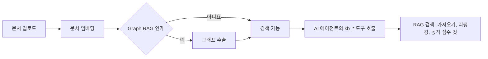

> 구현 상태: 부분 구현 · 원문: `spec/data-flow/6-knowledge-base.md` (Overview), `spec/5-system/8-embedding-pipeline.md` (Overview), `spec/5-system/9-rag-search.md` (Overview) · 용어: [용어 사전](../CLE-GLOSSARY.md)

## 개요

지식 저장소(Knowledge Base, `KnowledgeBase`) 영역은 사용자가 문서를 올려 임베딩하고 AI 에이전트 노드가 그 문서를 검색해 답변 근거로 쓰게 하는 기능을 다룬다. 지식 저장소는 워크스페이스 단위로 만든다.

영역 안의 흐름은 세 단계다.

1. 적재: 문서를 올리면 백그라운드에서 파싱, 청킹, 임베딩, 저장이 이어진다. 사용자는 진행 상태를 실시간으로 보고 실패한 문서만 다시 돌리거나 전체를 재임베딩할 수 있다.
2. 그래프 추출: 검색 모드가 Graph RAG(`rag_mode=graph`)인 지식 저장소는 임베딩이 끝나면 청크에서 Entity·Relation 을 뽑아 지식 그래프를 만든다.
3. 검색: AI 에이전트 노드가 지식 저장소를 LLM 도구(`kb_*`)로 노출하고 LLM 이 필요할 때 부른다. 넓게 가져와 선택적으로 리랭킹한 뒤 동적 점수 컷으로 넣을 청크를 정한다.

검색 모드(Vector RAG 와 Graph RAG)는 만들 때 정하고 바꾸지 않는다. 리랭킹은 검색할 때만 적용하므로 언제든 켜고 끌 수 있다. 저장 청크 차원이 비어 있는 지식 저장소(모델을 바꾼 뒤 재임베딩 전이거나 재임베딩 중)는 검색에서 빠진다. 에이전트와 화면에는 그 사실을 명시적으로 알린다.

이 영역은 모델 설정(Embedding·Chat·Rerank 종류)과 LLM 호출 계층을 [AI 모델과 메모리](../CLE-AI/CLE-AI.md) 영역에서 빌려 쓴다. AI 에이전트 노드의 설정은 [AI 노드](../CLE-NODE-AI/CLE-NODE-AI.md) 영역, 원본 파일 보관은 [파일 저장소](../CLE-PLAT/CLE-PLAT-STORAGE.md) 가 맡는다.

## 문서

- [지식 저장소 관리](CLE-KB-MANAGE.md): 지식 저장소 목록, 생성·설정 폼, 문서 관리, 진행 상태와 검색 불가 경고, Graph 패널 화면과 지식 저장소 API 전체 목록. 세 PRD 의 지식 저장소 요구사항 대부분이 여기 있다.
- [문서 임베딩](CLE-KB-EMBED.md): 파싱, 청킹, 임베딩 모델 해석, 입력 유형, 큐와 동시 처리, 재임베딩, 자동 재시도, 처리 중 문서 회수, 실패 문서 재시도.
- [RAG 검색](CLE-KB-SEARCH.md): 지식 저장소 도구, 유사도 검색, 리랭킹, 동적 점수 컷, 검색 인용 메타와 진단, 검색 불가 신호, 에러 처리.
- [Graph RAG](CLE-KB-GRAPH.md): Entity·Relation 그래프 추출과 vector seed, 그래프 확장, 중심성 가중치로 이어지는 Graph 검색.
- [RAG 품질 평가](CLE-KB-EVAL.md): 골든셋과 검색 지표로 검색 품질 변화를 재는 오프라인 평가 하네스 규약.
- [지식 저장소 데이터와 흐름](CLE-KB-DATA.md): 지식 저장소, 문서, 청크, Entity, Relation, 청크-Entity 매핑의 컬럼과 인덱스, 저장 청크 차원의 정의, 재처리 잠금, 흐름별 쓰기.

## 남은 결정

영역 문서들에 풀리지 않은 결정이 남아 있다. 자세한 내용은 각 문서의 미결 사항에 있다.

- 리랭킹 점수 컷 임계를 비웠을 때 컷을 하는지, LLM 호출 전 자동 검색과 대화 미리보기 `rag` 행의 뜻: [RAG 검색](CLE-KB-SEARCH.md)
- 모델 출력 차원과 저장 청크 차원이 다를 때의 기준: [지식 저장소 데이터와 흐름](CLE-KB-DATA.md)
- 문서 수정, 자동 재임베딩, 문서 메타데이터 관리 요구사항과 임베딩 테스트의 옛 필드: [지식 저장소 관리](CLE-KB-MANAGE.md)
