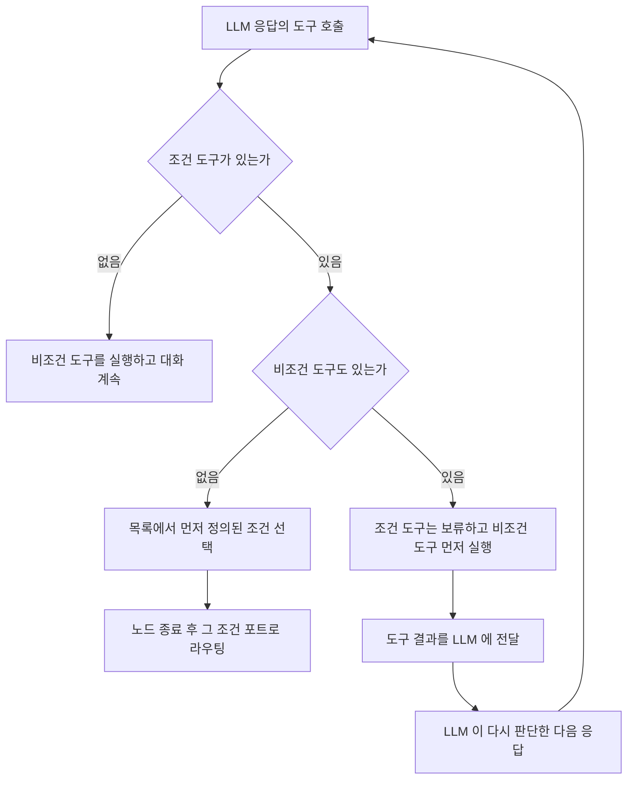
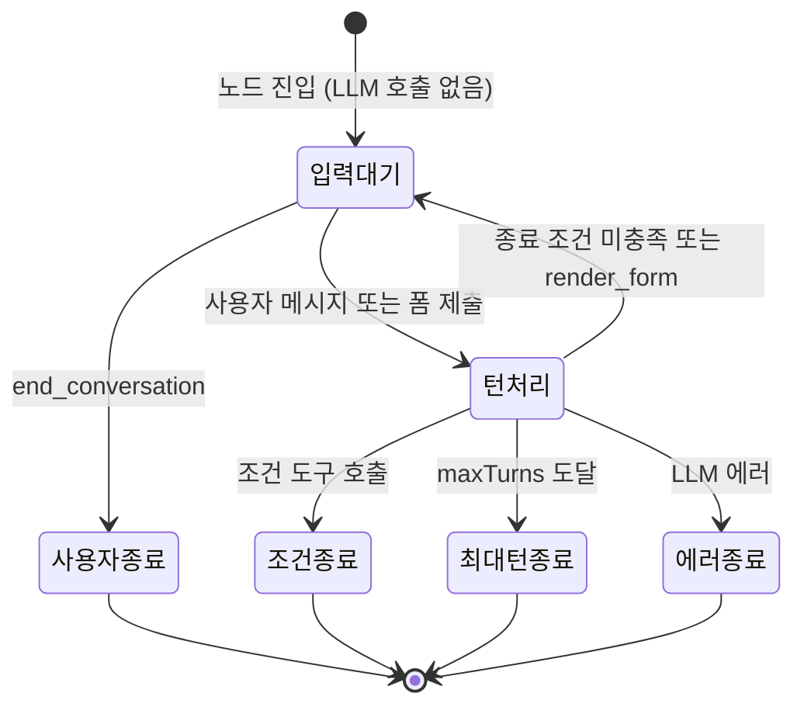

> 구현 상태: 부분 구현 · 원문: `spec/4-nodes/3-ai/1-ai-agent.md` (§1~§6, §9~§12), `spec/4-nodes/3-ai/_product-overview.md` (§3.2), `spec/4-nodes/_product-overview.md` (§6.1) · 용어: [용어 사전](../CLE-GLOSSARY.md)

## 개요

AI 에이전트 노드(AI Agent, `ai_agent`)는 LLM 으로 응답을 만든다. LLM 에는 지식 저장소 도구(`kb_*`), MCP 도구(`mcp_*`), 조건 도구(`cond_*`), 표시 도구(`render_*`)를 노출한다. 단일 턴(`single_turn`)은 LLM 을 한 번 불러 끝낸다. 멀티턴(`multi_turn`)은 워크플로우 실행을 멈추고 사용자와 대화한다.

이 문서는 설정, 설정 화면, 포트, 도구 분류와 표시 도구, 도구 정의 크기 예산, 조건, 실행 로직, LLM 호출 타임아웃, 진단 메타, 에러 코드를 정한다.

다음 주제는 다른 문서가 정한다.

- 출력 케이스별 구조와 LLM 호출 기록(`meta.turnDebug`): [AI 에이전트 노드 출력과 디버그](CLE-NODE-AGENT-OUTPUT.md)
- 세 AI 노드 공통 규약(모델 선택, McpServerRef, 대화 맥락 설정, 메모리 전략, 시스템 컨텍스트 접두, 캔버스 요약, 에러 계약): [AI 노드 공통](CLE-NODE-AI-COMMON.md)
- 표시 도구의 스키마 변환·defaults 덮어쓰기·제출 wire 형식: [Presentation 노드 공통](../CLE-NODE-PRES/CLE-NODE-PRES-COMMON.md)
- 지식 저장소 검색: [RAG 검색](../CLE-KB/CLE-KB-SEARCH.md). MCP 도구 노출: [MCP 클라이언트](../CLE-INT/CLE-INT-MCP.md). 에이전트 메모리: [에이전트 메모리](../CLE-AI/CLE-AI-MEMORY.md)
- 입력 대기·재개·마지막 턴 재시도의 상태 전이: [실행 상태 머신과 대기·재개](../CLE-EXEC/CLE-EXEC-STATE.md)

다른 노드를 도구로 연결하던 입력 경로(옛 도구 영역, Tool Area)는 제거됐고 새 설계를 기다린다. 조건·지식 저장소·MCP·표시 도구는 영향이 없다.

## 요구사항

- REQ-AGENT-001 WHEN 노드가 실행되면 THE SYSTEM SHALL 설정한 모델로 LLM 을 불러 AI 에이전트를 실행한다. (원본: ND-AG-01)
- REQ-AGENT-002 WHEN 사용자가 시스템 프롬프트를 입력하면 THE SYSTEM SHALL 마크다운과 표현식을 허용한다. (원본: ND-AG-02)
- REQ-AGENT-003 WHEN 사용자가 모델을 고르면 THE SYSTEM SHALL 모델 설정에 등록한 Chat 프로바이더와 모델 중에서 고르게 한다. (원본: ND-AG-03)
- REQ-AGENT-004 WHEN `temperature`·`maxTokens` 를 지정하면 THE SYSTEM SHALL 모델 설정 기본값 대신 그 값을 쓴다. (원본: ND-AG-04)
- REQ-AGENT-005 WHEN 지식 저장소를 연결하면 THE SYSTEM SHALL 지식 저장소 도구를 LLM 에 노출해 RAG 검색을 가능하게 한다. (원본: ND-AG-05)
- REQ-AGENT-006 WHEN 대화 맥락 설정을 켜면 THE SYSTEM SHALL 대화 스레드를 설정한 범위와 형식으로 LLM 입력에 넣는다. (원본: ND-AG-07)
- REQ-AGENT-007 WHEN `responseFormat` 이 `json` 이면 THE SYSTEM SHALL 최종 응답을 JSON 으로 파싱하고 `jsonSchema` 가 있으면 출력 스키마로 쓴다. (원본: ND-AG-08)
- REQ-AGENT-008 IF `responseFormat` 이 `json` 인데 최종 응답 파싱에 실패하면 THE SYSTEM SHALL 원문 문자열을 응답으로 둔다.
- REQ-AGENT-009 WHEN AI 에이전트가 응답을 만들면 THE SYSTEM SHALL 응답을 스트리밍으로 전달한다. (원본: ND-AG-09) (미구현)
- REQ-AGENT-010 WHEN 사용자가 실행 모드를 고르면 THE SYSTEM SHALL 단일 턴 또는 멀티턴으로 실행한다. (원본: ND-AG-11)
- REQ-AGENT-011 WHILE 멀티턴으로 실행 중인 동안 THE SYSTEM SHALL 워크플로우 실행을 멈추고 사용자와 대화한다. (원본: ND-AG-12)
- REQ-AGENT-012 WHEN 멀티턴 대화가 최대 턴 수에 닿거나 사용자가 종료하거나 LLM 이 조건 도구를 부르거나 LLM 에러가 나면 THE SYSTEM SHALL 대화를 끝내고 사유별 포트로 보낸다. (원본: ND-AG-13)
- REQ-AGENT-013 WHILE 멀티턴 사용자 응답을 기다리는 동안 THE SYSTEM SHALL 타임아웃 없이 기다린다.
- REQ-AGENT-014 WHILE 멀티턴 대화 중인 동안 THE SYSTEM SHALL 매 턴 도구 호출과 지식 저장소 검색을 허용한다. (원본: ND-AG-14)
- REQ-AGENT-015 WHEN 사용자가 조건을 정의하면 THE SYSTEM SHALL 라벨과 프롬프트 쌍으로 된 조건 목록을 저장한다. (원본: ND-AG-15)
- REQ-AGENT-016 WHEN 조건이 추가되면 THE SYSTEM SHALL 조건마다 독립된 출력 포트를 만든다. (원본: ND-AG-16)
- REQ-AGENT-017 WHEN LLM 을 부를 때 THE SYSTEM SHALL 조건마다 `cond_` 와 정제한 조건 id 로 이름 지은 조건 도구를 등록하고 조건 프롬프트를 도구 설명으로 쓴다. (원본: ND-AG-17)
- REQ-AGENT-018 WHEN LLM 이 조건 도구만 부르면 THE SYSTEM SHALL 노드를 끝내고 그 조건 포트로 보낸다. (원본: ND-AG-18)
- REQ-AGENT-019 WHEN LLM 이 한 응답에서 조건 도구와 비조건 도구를 함께 부르면 THE SYSTEM SHALL 비조건 도구를 먼저 실행하고 LLM 이 다시 판단하게 한다. (원본: ND-AG-18)
- REQ-AGENT-020 WHEN LLM 이 조건 도구 여러 개를 함께 부르면 THE SYSTEM SHALL 조건 목록에서 먼저 정의된 조건을 고른다. (원본: ND-AG-22)
- REQ-AGENT-021 WHEN 사용자가 조건을 추가·삭제·이름 변경·재정렬하면 THE SYSTEM SHALL 기존 조건의 포트 ID(UUID v4)를 바꾸지 않는다. (원본: ND-AG-20)
- REQ-AGENT-022 WHEN 모드가 단일 턴이면 THE SYSTEM SHALL 조건 포트와 `out`·`error` 포트를 두고 조건이 없으면 `out`·`error` 만 둔다. (원본: ND-AG-23)
- REQ-AGENT-023 WHEN 모드가 멀티턴이면 THE SYSTEM SHALL 조건 포트와 `user_ended`·`max_turns`·`error` 포트를 두고 조건이 없어도 `out` 은 두지 않는다. (원본: ND-AG-24)
- REQ-AGENT-024 IF LLM 오류·타임아웃·rate limit 이 나면 THE SYSTEM SHALL `error` 포트로 보낸다. (원본: ND-AG-19) (부분 구현)
- REQ-AGENT-025 WHEN 캔버스에 노드를 그리면 THE SYSTEM SHALL 조건 포트는 초록, 시스템 포트는 파랑, 에러 포트는 빨강으로 칠하고 조건이 있으면 두 영역 사이에 점선 구분자를 그린다. (원본: ND-AG-25)
- REQ-AGENT-026 WHEN `presentationTools` 에 도구를 등록하면 THE SYSTEM SHALL 그 type 의 `render_{type}` 표시 도구를 LLM 에 노출한다. (원본: ND-AG-26) (부분 구현)
- REQ-AGENT-027 IF `presentationTools` 가 비어 있으면 THE SYSTEM SHALL 표시 도구를 노출하지 않는다.
- REQ-AGENT-028 IF 표시 도구 페이로드가 스키마나 1MB 상한을 어기면 THE SYSTEM SHALL `{error: 'INVALID_PAYLOAD', issues}` 를 돌려 같은 턴에서 한 번 더 시도하게 한다.
- REQ-AGENT-029 IF 재시도한 표시 도구 페이로드도 스키마를 어기면 THE SYSTEM SHALL 그 호출을 버리고 `meta.presentationSchemaViolations[]` 에 쌓으며 `error` 포트로 보내지 않는다.
- REQ-AGENT-030 IF 단일 턴에서 LLM 이 `render_form` 을 부르면 THE SYSTEM SHALL 스키마 위반과 같이 한 번 재시도 후 버린다.
- REQ-AGENT-031 WHEN 사용자가 `render_form` 폼을 제출하면 THE SYSTEM SHALL 제출 값과 재호출 금지 안내를 tool_result 에 담아 LLM 을 다시 부른다.
- REQ-AGENT-032 IF 폼 제출 데이터가 10KB 를 넘으면 THE SYSTEM SHALL 문자열 필드를 고르게 잘라 `...<truncated>` 를 붙이고 `formDataTruncation` 메타를 싣는다.
- REQ-AGENT-033 IF 폼이 활성인 동안 사용자가 일반 메시지를 보내면 THE SYSTEM SHALL 그 폼 호출의 tool_result 를 `{type:'cancelled', reason:'user_sent_message_instead'}` 로 채우고 메시지를 일반 사용자 턴으로 처리한다.
- REQ-AGENT-034 IF 폼 제출이 들어왔는데 대기 중인 폼 호출(`pendingFormToolCall`)이 없으면 THE SYSTEM SHALL 제출 데이터를 일반 사용자 메시지로 넣고 경고 로그를 남긴다.
- REQ-AGENT-035 WHEN LLM 이 도구를 부르면 THE SYSTEM SHALL 호출을 조건·지식 저장소·MCP·표시·일반 도구로 분류한다.
- REQ-AGENT-036 WHEN 한 응답에 지식 저장소·MCP·표시 전용 도구 호출이 여러 개 있으면 THE SYSTEM SHALL 병렬로 실행하고 결과를 결정적 순서로 쌓는다.
- REQ-AGENT-037 IF 지식 저장소나 MCP 서버 호출 하나가 실패하면 THE SYSTEM SHALL 실패를 진단 메타에 기록하고 대화를 계속한다.
- REQ-AGENT-038 IF 한 배치의 도구 호출이 남은 도구 호출 한도를 넘으면 THE SYSTEM SHALL 넘는 호출에 `tool_call_budget_exceeded` tool_result 를 돌려준다.
- REQ-AGENT-039 IF LLM 이 일반 도구로 분류되는 호출을 하면 THE SYSTEM SHALL 도구 미연결을 알리는 `tool_call_not_implemented` 를 돌려준다. (미구현)
- REQ-AGENT-040 WHEN 도구 정의를 만든 직후 THE SYSTEM SHALL 도구 정의 직렬화 크기와 개수를 예산과 비교한다.
- REQ-AGENT-041 IF 도구 정의 크기가 hard 예산을 넘거나 개수가 상한을 넘으면 THE SYSTEM SHALL LLM 을 부르기 전에 `TOOL_DEFINITION_PAYLOAD_EXCEEDED` 로 `error` 포트에 보낸다.
- REQ-AGENT-042 IF 도구 정의 크기가 soft 예산만 넘으면 THE SYSTEM SHALL 경고 로그만 남기고 실행을 계속한다.
- REQ-AGENT-043 WHEN 워크플로우를 저장할 때 도구 정의 크기 추정치가 예산을 넘으면 THE SYSTEM SHALL `ai_agent:tool-payload-budget` 그래프 경고를 낸다.
- REQ-AGENT-044 IF `AI_AGENT_TOOL_BUDGET_STRICT_SAVE=true` 이고 저장 시 추정치가 hard 예산을 넘으면 THE SYSTEM SHALL 저장을 `GRAPH_VALIDATION_FAILED` 로 막는다.
- REQ-AGENT-045 WHEN 멀티턴 노드에 처음 들어오면 THE SYSTEM SHALL LLM 을 부르지 않고 바로 입력 대기로 들어간다.
- REQ-AGENT-046 WHEN 멀티턴 턴이 종료 조건 없이 끝나면 THE SYSTEM SHALL 누적 대화를 갱신하고 다시 입력 대기로 들어간다.
- REQ-AGENT-047 WHEN 사용자가 메모리 전략을 고르면 THE SYSTEM SHALL `manual`·`summary_buffer`·`persistent` 중 하나를 적용하고 기본값은 `manual` 이다. (원본: ND-AG-27) (부분 구현)
- REQ-AGENT-048 WHEN 메모리 전략이 `summary_buffer`·`persistent` 이고 working-memory 추정 토큰이 `memoryTokenBudget` 을 넘으면 THE SYSTEM SHALL 오래된 턴부터 롤링 요약으로 압축한다. (원본: ND-AG-28) (부분 구현)
- REQ-AGENT-049 WHILE 토큰 예산 임계치에 닿지 않은 동안 THE SYSTEM SHALL 롤링 요약을 다시 만들지 않는다. (원본: ND-AG-28)
- REQ-AGENT-050 IF `summaryModelConfigId` 가 비어 있으면 THE SYSTEM SHALL 요약 LLM 호출에 노드의 main 모델 설정을 쓴다. (원본: ND-AG-28)
- REQ-AGENT-051 WHEN 메모리 전략이 `persistent` 면 THE SYSTEM SHALL LLM 호출 전에 에이전트 메모리를 동기로 회수하고 턴 경계에서 메모리 추출을 비동기로 넣는다. (원본: ND-AG-29) (부분 구현)
- REQ-AGENT-052 WHEN 멀티턴 롤링 요약이 오래된 교환을 새로 덮으면 THE SYSTEM SHALL 다음 턴 messages 에서 그 교환을 `user` 메시지 경계에서 지운다.
- REQ-AGENT-053 WHEN 메모리 전략이 `manual` 이 아니면 THE SYSTEM SHALL `meta.memory` 에 전략·요약 여부·회수 수·예산 사용량을 싣는다. (원본: ND-AG-30) (부분 구현)
- REQ-AGENT-054 WHEN LLM `chat` 을 부르면 THE SYSTEM SHALL 호출마다 `AI_AGENT_LLM_CALL_TIMEOUT_MS`(기본 10분) 앱 레벨 타임아웃을 건다.
- REQ-AGENT-055 IF 조건이 검증 규칙(최대 20개, id·label·prompt 필수, prompt 2,000자 이하, 예약 포트 이름 금지)을 어기면 THE SYSTEM SHALL 설정을 거부한다.

## 설정

| 필드 | 타입 | 필수 | 기본값 | 설명 |
|------|------|------|--------|------|
| `mode` | `single_turn` / `multi_turn` | ✓ | `single_turn` | AI 실행 모드 |
| `llmConfigId` | UUID | | 없음 | 모델 설정 참조([AI 노드 공통](CLE-NODE-AI-COMMON.md)) |
| `model` | String (표현식) | | 없음 | 모델 ID. `{{ }}` 허용 |
| `systemPrompt` | String (표현식) | | 없음 | 마크다운·표현식 지원 |
| `userPrompt` | String (표현식) | | 없음 | 단일 턴 전용. 멀티턴으로 바꾸면 프런트엔드 `clearFields` 가 지우고 백엔드도 무시한다(서버 쪽 안전망) |
| `temperature` | Float | | 모델 설정 기본 파라미터 | 덮어쓰기 |
| `maxTokens` | Integer | | 모델 설정 기본 파라미터(`max_tokens`, 새 설정 폼 기본값 4096) | 덮어쓰기. 기본 파라미터는 [모델 설정](../CLE-AI/CLE-AI-MODELS.md#기본-파라미터-기본값) 이 정한다 |
| `responseFormat` | `text` / `json` | ✓ | `text` | 응답 형식 |
| `jsonSchema` | JSONSchema | | 없음 | `responseFormat=json` 일 때 출력 스키마 |
| `knowledgeBases` | UUID[] | | `[]` | 지식 저장소 목록 |
| `ragTopK` | Integer | | 없음 | 주입 상한(선택). 비우면 동적 점수 컷(토큰 예산 + 내부 주입 상한 12)이 정한다([RAG 검색 §동적 점수 컷](../CLE-KB/CLE-KB-SEARCH.md#동적-점수-컷)). LLM 이 인자로 덮어쓸 수 있다. 리랭킹이 켜진 지식 저장소는 리랭크 뒤 적용 |
| `ragThreshold` | Float | | `0.7` | 최소 유사도(0~1) 기본값. LLM 이 인자로 덮어쓸 수 있다. 리랭킹이 켜지면 리랭크 점수 임계 |
| `mcpServers` | McpServerRef[] | | `[]` | MCP 지원 통합 목록(`mcp`·`cafe24`·`makeshop`). `cafe24`·`makeshop` 은 `Cafe24McpToolProvider`·`MakeshopMcpToolProvider` 가 in-process 도구 프로바이더로 동작. 대형 카탈로그는 노출 도구 목록 없이 쓰면 실패한다(도구 정의 크기 예산) |
| `maxToolCalls` | Integer | ✓ | `10` | 도구 호출 한도(지식 저장소·MCP·표시·일반 합산) |
| `includeSystemContext` | Boolean | | `true` | 시스템 컨텍스트 접두 |
| `systemContextSections` | String[] | | `['time', 'timezone']` | 접두 섹션(`time`·`timezone`·`workspace`·`node`) |
| `contextScope` | `none` / `thread` / `lastN` | ✓ | `none` | 대화 맥락 범위. 메모리 전략이 `manual` 이 아니면 무효 |
| `contextScopeN` | Integer | | `20` | `lastN` 의 N. `manual` 이 아니면 무효 |
| `contextInjectionMode` | `messages` / `system_text` | | `messages` | 주입 형식. 자동 전략에서는 최근 원문 턴의 형식으로만 뜻이 있고(요약·회수 블록은 늘 system_text) 범위 선택은 무효 |
| `includeToolTurns` | Boolean | | `false` | `ai_tool` 턴도 누적. 자동 전략이면 주입 쪽에서만 무효 |
| `excludeFromConversationThread` | Boolean | | `false` | 스레드 opt-out. 메모리 전략과 무관 |
| `memoryStrategy` | `manual` / `summary_buffer` / `persistent` | | `manual` | 메모리 전략([AI 노드 공통](CLE-NODE-AI-COMMON.md)) |
| `memoryTokenBudget` | Integer | | `8000` | 자동 전략의 working-memory 토큰 예산. 스레드 문자 상한과 별개 |
| `memoryKey` | String (표현식) | | 없음 | `persistent` 메모리 범위 키. `(workspace_id, memoryKey)` 가 실행을 넘는 네임스페이스. 비우면 `execution_id` 로 격리 |
| `memoryTopK` | Integer | | `5` | `persistent` 회수 top-k. `ragTopK` 와 독립 |
| `memoryThreshold` | Float | | `0.7` | `persistent` 회수 최소 유사도. `ragThreshold` 와 독립 |
| `memoryTtlDays` | Integer | | 없음 | 추출 메모리 TTL(일). 주면 `expires_at = now() + ttlDays` 를 붙여 만료 뒤 회수에서 빼고 정리한다. 비우면 만료 없음(기존 동작) |
| `embeddingModelConfigId` | 모델 설정 선택 | | 없음 | 회수·저장 임베딩용 embedding 모델 설정 id(`embedding-config-selector`). 회수와 저장이 같은 설정이어야 차원이 맞다. 비우면 워크스페이스 기본(`ModelConfigService.resolveEmbedding`) |
| `summaryModelConfigId` | 모델 설정 선택 | | 없음 | 롤링 요약 LLM 호출용 chat 모델 설정 id(`chat-config-selector`). 비우면 노드 main 모델 설정. 다른 프로바이더의 저가 모델도 된다 |
| `extractionModelConfigId` | 모델 설정 선택 | | 없음 | 메모리 추출 LLM 호출용 chat 모델 설정 id. 비우면 노드 `llmConfigId` → 기본 모델 |
| `maxTurns` | Integer | | `20` | 멀티턴 최대 턴 수. `0` 무제한. 멀티턴일 때만 보인다 |
| `conditions` | ConditionDef[] | | `[]` | 조건 목록. 조건마다 `{condition.id}` 포트 |
| `presentationTools` | PresentationToolDef[] | | `[]` | 표시 도구 등록 목록. 비어 있으면 꺼짐 |

현재 구현은 모델 설정에 저장한 기본 파라미터(`defaultParams`)를 LLM 호출에 넣지 않는다. `temperature`·`maxTokens` 를 비우면 값 없이 부르고, Anthropic 클라이언트만 `max_tokens` 를 4096 으로 채운다. 나머지 프로바이더는 자체 기본값을 쓴다.

세 모델 설정 선택 필드는 노드 `llmConfigId` 와 독립이며, 고른 설정 자신의 provider·credential·defaultModel 로 부른다. 설정 스키마의 단일 기준은 `ai-agent.schema.ts` 의 `aiAgentNodeConfigSchema` 다. 스키마는 `.passthrough()` 라 DB 에 남은 옛 키는 조용히 통과하지만 핸들러는 읽지 않는다.

**ConditionDef 구조**

| 필드 | 타입 | 필수 | 설명 |
|------|------|------|------|
| `id` | String (UUID v4) | ✓ | 조건 식별자이자 출력 포트 ID. UUID v4 는 slug 정규식 `^[a-zA-Z0-9_-]{1,64}$` 을 통과하는 유효 포트 ID 다([노드 시스템 구조와 카탈로그](../CLE-NODE/CLE-NODE-ARCH.md)). 만들 때 주고 이후 바꾸지 않는다 |
| `label` | String | ✓ | 조건 이름(화면 표시와 포트 라벨) |
| `prompt` | String (2,000자 이하) | ✓ | 조건 설명. LLM 도구 description 으로 쓴다. "언제 이 조건을 골라야 하는지" 를 적는다 |

**PresentationToolDef 구조**

| 필드 | 타입 | 필수 | 설명 |
|------|------|------|------|
| `type` | Enum | ✓ | `carousel` / `table` / `chart` / `form` / `template` |
| `description` | String? | | LLM 에 보일 description. 비우면 type 별 기본 문구([Presentation 노드 공통 §도구 카탈로그](../CLE-NODE-PRES/CLE-NODE-PRES-COMMON.md#도구-카탈로그)) |
| `defaults` | Object? | | 브랜드·스타일 고정값. LLM 은 데이터만 채운다. 병합 규칙은 [Presentation 노드 공통 §defaults 덮어쓰기 규칙](../CLE-NODE-PRES/CLE-NODE-PRES-COMMON.md#defaults-덮어쓰기-규칙) |

- 한 노드 안에서 `type` 은 중복할 수 없다.
- 켜면 도구 이름은 `render_{type}` 으로 고정이며 정제가 필요 없다.

## 설정 화면

| 영역 | 들어가는 요소 | 동작 |
|------|---------------|------|
| 모델 (맨 위) | "LLM Provider", "Model" 드롭다운 | 프로바이더를 고르면 모델 목록이 바뀐다 |
| 실행 모드 | "Single Turn" / "Multi Turn" 라디오 | 멀티턴으로 바꾸면 `userPrompt` 를 지운다 |
| 시스템 프롬프트 | 여러 줄 입력 | 마크다운·표현식 |
| 사용자 프롬프트 | 여러 줄 입력(예: `{{ $input.message }}`) | 단일 턴일 때만 보인다 |
| 파라미터 | "Temperature", "Max Tokens", "Response"(Text / JSON) | 모델 설정 기본값 덮어쓰기 |
| 지식 저장소 | "Add Knowledge Base" 버튼, 연결 목록 | 주입 상한(`ragTopK`)은 지식 저장소별이 아니라 노드 단위 선택 값 |
| MCP 서버 | "Add MCP Server" 버튼, 연결 목록 | 후보를 세 그룹으로 보여 준다(아래) |
| 조건 | 조건 목록(번호·라벨·프롬프트·삭제), "Add Condition" | 선택 사항 |
| 메모리 | "Strategy" 드롭다운과 조건부 필드 | 아래 노출 규칙 |
| 대화 맥락 | "Scope", "Last N", "Mode", "Include tool turns in thread", "Exclude this node from thread" | 메모리 전략이 `manual` 일 때만 보인다 |
| 멀티턴 설정 (맨 아래) | "Max Turns" | 멀티턴일 때만 보인다 |

**메모리 영역 노출 규칙(`visibleWhen`)**: "Strategy" 는 늘 보인다. "Token Budget"·"Summary Model" 은 `summary_buffer`·`persistent` 일 때, "Memory Key"·"Top-K"·"Threshold"·"TTL (days)"·"Extraction Model" 은 `persistent` 일 때만 보인다. `manual` 이면 대화 맥락 영역 5필드가 그대로 보이고, `manual` 이 아니면 대화 맥락 영역 전체를 숨긴다.

**"Add MCP Server" 후보**: 워크스페이스의 `service_type='mcp'`·`'cafe24'`·`'makeshop'` 통합을 그룹으로 나눠 보여 준다([통합 관리](../CLE-INT/CLE-INT-MANAGE.md)).

- `🌐 Generic MCP (HTTP) servers`: `mcp`
- `🛒 Cafe24 stores (Internal Bridge)`: `cafe24`
- `🛒 MakeShop stores (Internal Bridge)`: `makeshop`

추가한 행 앞에 브리지 아이콘(🌐·🛒)을 붙인다. 라벨은 "MCP 지원 통합" 뜻으로 쓰며, 바꾸지 않고 허용 목록만 넓혀 학습 비용을 줄였다. 워크플로우 AI 어시스턴트의 후보 선택기도 세 `service_type` 을 모두 모은다([AI 어시스턴트 도구](../CLE-WF/CLE-WF-ASSIST-TOOLS.md)).

## 포트

### 입력 포트

| id | label | type | dynamic | 설명 |
|------|-------|------|---------|------|
| `in` | Input | data | false | 노드 입력(1개) |

### 출력 포트

**단일 턴**

| id | label | type | dynamic | 발생 조건 |
|------|-------|------|---------|-----------|
| `out` | Output | data | false | 정상 완료(조건 미매칭 또는 조건 0개) |
| `{condition.id}` | `{condition.label}` | data | true | 해당 조건 매칭. 조건마다 1개 |
| `error` | Error | data | false | LLM 오류·타임아웃·rate limit 등 모든 오류(현재 예외 있음, 아래) |

**멀티턴**

| id | label | type | dynamic | 발생 조건 |
|------|-------|------|---------|-----------|
| `{condition.id}` | `{condition.label}` | data | true | 해당 조건 매칭. 조건마다 1개 |
| `user_ended` | User Ended | data | false | 사용자가 `execution.end_conversation` 으로 종료 |
| `max_turns` | Max Turns | data | false | 턴 수가 `maxTurns` 에 닿음(`0` 이면 발생 안 함) |
| `error` | Error | data | false | LLM 오류·타임아웃·rate limit 등 모든 오류 |

멀티턴에는 `out` 포트가 없다. 종료 사유가 늘 분명해 사유별 포트로 나눈다. 조건이 0개여도 같다. 포트 `type` 표기는 AI 노드와 코드 사이에 정의가 갈린다([AI 노드 공통](CLE-NODE-AI-COMMON.md) 미결 사항).

단일 턴 `error` 포트 출력은 목표 계약이다. 현재 단일 턴의 일반 LLM `chat` 실패는 try/catch 로 감싸지 않아 `error` 포트로 가지 않고 엔진 레벨의 분류 없는 `FAILED` 로 끝난다(부분 구현). 도구 정의 크기 예산 초과만 `error` 포트로 간다. 후속은 `plan/in-progress/node-output-redesign/ai-agent.md` 가 추적한다. 멀티턴 에러 종결은 엔진 `handleAiTurnError` 경로로 구현돼 있다.

**포트 시각 구분**

- 사용자 조건 포트는 초록 핸들로 위쪽에, 시스템 포트(`out`·`user_ended`·`max_turns`)는 파랑, 에러 포트는 빨강으로 그린다.
- 조건이 1개 이상이면 조건 포트와 시스템·에러 포트 사이에 점선 구분자를 그린다. 조건이 0개여도 색 규칙은 같다.

**공통**

- 조건을 추가·삭제·이름 변경·재정렬해도 포트 ID(UUID)가 바뀌지 않아 연결선이 유지된다.
- `timeout` 포트는 없다. 타임아웃·rate limit 은 `error` 포트로 모은다. 옛 `timeout` 포트 연결선은 끊기므로 `error` 로 다시 연결한다(신규 기능이라 실제 연결선은 없다).
- 조건 없는 옛 멀티턴 노드의 `out` 연결선도 끊긴다. `user_ended` 나 `max_turns` 로 다시 연결한다.

## 도구

### 도구 이름 규칙

| 분류 | 이름 형식 | 자세한 규칙 |
|------|-----------|-------------|
| 조건 도구 | `cond_` + 정제한 조건 id (예: `cond_def9012_3456_...`) | "조건" 절 |
| 지식 저장소 도구 | `kb_` + 정제한 지식 저장소 id | [RAG 검색](../CLE-KB/CLE-KB-SEARCH.md) |
| MCP 도구 | `mcp_<sid>__<toolName>`. `<sid>` 는 통합 UUID 를 정제한 8자. 메타도구는 `mcp_<sid>__list_resources`·`__read_resource`·`__list_prompts`·`__get_prompt` | [MCP 클라이언트](../CLE-INT/CLE-INT-MCP.md) |
| 표시 도구 | `render_` + Presentation type(`render_table`·`render_chart`·`render_carousel`·`render_template`·`render_form`) | "표시 도구" 절 |

- 정제는 UUID 의 `-` 같은 영숫자가 아닌 문자를 `_` 로 바꿔 LLM API 호환을 보장한다.
- 접두사로 분류를 나눠 이름 충돌을 막는다.
- LLM 은 이름이 아니라 description 으로 도구를 고르도록 설계했다.

### 도구 호출 분류

LLM 응답의 `toolCalls` 를 조건·지식 저장소·MCP·표시·일반 도구로 나눈다.

1. 등록된 도구 프로바이더 중 `matches(tc.name)` 가 참인 첫 프로바이더를 찾는다(등록 순서: 지식 저장소 → MCP → 표시).
2. 없으면 조건 이름 집합과 대조한다.
3. 그래도 없으면 일반 도구로 분류한다.

접두사(`kb_`·`mcp_`·`render_`·`cond_`)가 서로 겹치지 않아 결과는 결정적이다. 접두사가 같아도 프로바이더가 등록되지 않았으면 매칭되지 않는다. 예를 들어 `presentationTools` 가 비었는데 LLM 이 환각으로 `render_xxx` 를 부르면 일반 도구다.

일반 도구 입력 경로가 없는 지금, 일반 도구 호출에는 가짜 성공 stub `{result: "Tool <name> executed", arguments: {...}}` 을 돌려준다. `tool_call_not_implemented` 회신은 미구현이며 입력 경로를 다시 만들 때 들인다. 구현은 `AiConditionEvaluator.classifyToolCalls` 다.

### 표시 도구

표시 도구(`render_*`)는 응답 표면을 텍스트에서 표·차트·캐러셀·템플릿·폼으로 넓힌다. LLM 이 알맞은 표현을 판단해 만든다. 다른 노드로 연결하는 방식이 아니라 AI 세션 안의 도구다. `presentationTools[]` 에 등록할 때만 노출하며(기본 꺼짐) 비어 있으면 동작이 바뀌지 않는다.

| 도구 | 종류 | 동작 | tool_result | 턴 종료 |
|---|---|---|---|---|
| `render_table`·`render_chart`·`render_carousel`·`render_template` | 표시 전용 | 페이로드 하나를 내보내고 바로 결과를 돌려준다 | `{ok: true, rendered: true, …}` | 텍스트·다른 도구·조건 도구가 정한다. 표시 도구는 종료 계기가 아니다 |
| `render_form` | 대화형 | `waiting_for_input` 으로 턴을 보류한다. 제출되면 스레드에 `presentation_user` 로 누적하고 제출 값을 tool_result 로 넘겨 LLM 을 다시 부른다 | `{ok: true, type: 'form_submitted', data: { … }, message: '<재호출 금지 안내문>'}` | LLM 의 다음 응답이 정한다 |

- **파라미터·description·`defaults`**: 각 Presentation 노드 입력 스키마(zod)를 그대로 노출해 스키마를 한 곳에서만 관리한다. description 은 LLM 이 언제 부를지 판단하는 1차 신호다. 스키마 변환, 기본 description, `defaults` 병합의 단일 기준은 [Presentation 노드 공통 §표시 도구 모드](../CLE-NODE-PRES/CLE-NODE-PRES-COMMON.md#표시-도구-모드) 다.
- **호출 회계**: 표시 도구 호출도 `maxToolCalls` 에 들어간다. 텍스트 뒤 한두 번 부르는 흔한 패턴에서는 기본 10 으로 충분하지만, 표시 도구 여러 개와 다른 도구를 섞으면 한도를 넘어 잘릴 수 있다.
- **스키마 위반**(필수 필드 누락, 타입 불일치, 1MB 상한 초과 등): 한 번 재시도한 뒤 조용히 버리고 `meta.presentationSchemaViolations[]` 에 쌓는다. `error` 포트로 가지 않고 텍스트 응답이 있으면 그것만 보여 준다. 처리 단계(검증, `defaults` 병합, 크기 한도, 버튼 ID·폼 옵션 값 채우기)는 [Presentation 노드 공통 §스키마 위반 처리와 정규화](../CLE-NODE-PRES/CLE-NODE-PRES-COMMON.md#스키마-위반-처리와-정규화) 가 정한다.
- **역할 분리**: 표시 도구는 표현만, 그래프 분기는 조건 도구가 맡는다. Presentation 노드 버튼의 "클릭 → 다른 포트" 기능은 없다. `defaults` 에 `buttons` 를 넣어도 클릭은 다음 LLM 턴의 사용자 메시지가 되며(합성 규칙은 [Presentation 노드 공통](../CLE-NODE-PRES/CLE-NODE-PRES-COMMON.md)) 포트 분기에 영향이 없다.
- **공존**: 조건 도구와 함께 불리면 조건 절의 우선순위를 따른다(표시 도구는 비조건). 지식 저장소·MCP 도구와 함께 불리면 모두 병렬 실행에 들어간다.
- **스레드 운반**: 호출이 성공한 턴은 `ai_assistant` 대화 기록 항목의 최상위 `presentations[]` 에 페이로드를 쌓는다(`data?` 안이 아니다). 텍스트(`turn.text`)와 `presentations[]` 는 한 턴에 함께 있을 수 있다. 운반 규칙은 [Presentation 노드 공통 §대화 스레드 운반](../CLE-NODE-PRES/CLE-NODE-PRES-COMMON.md#대화-스레드-운반), 페이로드 타입과 WebSocket `execution.ai_message` 스냅샷은 [AI 에이전트 노드 출력과 디버그 §표시물 페이로드 운반](CLE-NODE-AGENT-OUTPUT.md#표시물-페이로드-운반) 이 정한다.

### 도구 정의 크기 예산

LLM 요청에 싣는 도구 정의(스키마) 전체의 직렬화 크기를 예산으로 관리한다. 도구 호출 한도(`maxToolCalls`), 메모리 토큰 예산(`memoryTokenBudget`)과 다른 자원이다. 1차 지표는 개수가 아니라 bytes 다. 대형 카탈로그는 operation 개수가 같아도 필드 단위 스키마로 도구당 크기가 몇 배 커질 수 있고, 그 크기가 프롬프트를 provider transport 타임아웃 너머로 밀면 provider 와 무관하게 "응답 없음" 이나 SDK 재시도의 "무한 반복" 이 된다.

**추정 함수(단일 기준)**: `estimateAgentToolPayload(tools) → { bytes, approxTokens, toolCount, perProvider?: [{ key, bytes, toolCount }] }`. `bytes = Buffer.byteLength(JSON.stringify(tools))`, `approxTokens` 는 언어 인식 휴리스틱(`shared/agent-memory-injection.ts`, 근사), `perProvider` 는 원인 프로바이더 지목용이다. 실행 판정·저장 경고·관측 로깅이 모두 이 함수를 쓴다.

| 변수 | 기본값 | 동작 |
|------|--------|------|
| `AI_AGENT_TOOL_PAYLOAD_SOFT_BYTES` | 98304 (96 KB) | 넘으면 `logger.warn` 만 남기고 계속한다 |
| `AI_AGENT_TOOL_PAYLOAD_HARD_BYTES` | 262144 (256 KB) | 넘으면 바로 실패(`TOOL_DEFINITION_PAYLOAD_EXCEEDED`) |
| `AI_AGENT_TOOL_COUNT_MAX` | 128 | 2차 점검. 넘으면 hard 와 같게 다룬다 |
| `AI_AGENT_TOOL_BUDGET_STRICT_SAVE` | false | 저장 시 hard 초과를 `error` 로 올려 `GRAPH_VALIDATION_FAILED` 로 막는 opt-in |

**대형 카탈로그는 노출 도구 목록이 사실상 필수다 (2026-07-17)**: 내부 MCP 브리지 카탈로그는 기본값 128 을 늘 넘는다. 2026-07-17 실측으로 Cafe24 는 485 operation, MakeShop 은 161 REST operation 이다. 전체 수의 단일 기준은 [Cafe24 API 카탈로그 §5 Coverage Matrix](CLE-C24-CATALOG#5-coverage-matrix) 와 [MakeShop API 카탈로그 §5 Coverage Matrix](CLE-MKS-CATALOG#5-coverage-matrix) 다. `mcpServers[].enabledTools`([MCP 클라이언트](../CLE-INT/CLE-INT-MCP.md)) 없이 연결하면 정상 설정처럼 보여도 개수 상한과 bytes hard 예산 양쪽에서 실패한다. 필요한 operation 만 노출하는 것이 정상 사용법이며, 도구 수백 개를 한 번에 주는 것은 도구 선택 정확도에도 좋지 않다. 기본값 128 은 bytes 팽창 사고의 2차 점검 값이고 대형 카탈로그 전량 노출을 상정하지 않았다. 기본값의 타당성은 별건이다.

**실행 판정**: `AiTurnExecutor.buildTools` 직후(단일 턴·멀티턴 재개 공통 헬퍼)에 판정한다. hard 나 개수 상한을 넘으면 LLM 을 부르기 전에 `TOOL_DEFINITION_PAYLOAD_EXCEEDED` 를 던져 `error` 포트로 보낸다(`details` 구조화). soft 초과는 로그만 남긴다. 멀티턴은 이 예외를 오케스트레이터까지 올려 `extractAiTurnErrorPayload` 가 `output.error` 를 만든다. 단일 턴은 `buildSingleTurnToolsOrError` 가 try/catch 로 받아 에러 출력을 직접 돌려준다. 이 return·throw 차이는 `AiTurnExecutor` JSDoc 에 적혀 있고 통일은 후속이다.

**저장 시점 경고**: `mcpServers`·`presentationTools` 로 다시 만든 추정치가 예산을 넘으면 그래프 경고(rule id `ai_agent:tool-payload-budget`, 기본 severity `warning`)로 알린다([그래프 경고 규칙](../CLE-WF/CLE-WF-WARN.md)).

- 경고는 `GET /workflows/:id/graph-warnings`(`getGraphWarnings`)가 결과 배열에 덧붙인다. 새 응답 필드는 없고 `saveCanvas` 응답은 그래프 경고를 싣지 않는다.
- 저장(`POST /workflows/:id/save`)은 기본이면 통과하고, strict 옵션이면 hard 초과를 `GRAPH_VALIDATION_FAILED`(400)로 막는다.
- 연결된 cafe24·makeshop 정적 카탈로그와 표시 도구만 센다. 외부 MCP 와 연결되지 않은 통합은 실시간 연결 없이 재현할 수 없어 건너뛴다.
- 통합 허용 scope 를 비동기로 조회해야 해 공유 동기 규칙 패키지(`@workflow/graph-warning-rules`)로 표현할 수 없다. 그래서 백엔드(`WorkflowsService`)에서만 평가하고 프런트엔드 캔버스 가드는 이 규칙을 계산하지 않는다. 실질 안전망은 실행 시점 실패와 저장 가드다.

## 조건

조건은 AI 에이전트가 대화 중 특정 상황을 알아차리면 그 조건의 출력 포트로 실행을 나눈다. 텍스트 분류기가 입력 하나를 정적으로 분류한다면, 조건은 대화 맥락 전체를 보고 동적으로 분류한다.

### 조건 도구 등록

| 도구 속성 | 값 |
|-----------|-----|
| name | `cond_{sanitizeId(condition.id)}` |
| description | `condition.prompt` |
| parameters | `{ type: "object", properties: { reason: { type: "string", description: "이 조건을 선택한 이유" } }, required: [] }` |

- 조건은 최대 20개다(`warningRules: ai_agent:too-many-conditions`).
- `id` 는 필수이며 예약 포트 ID(`out`·`in`·`error`·`user_ended`·`max_turns`)와 같을 수 없다. 이 집합은 규약과 다르다([미결 사항](#미결-사항)).
- `label` 은 필수, `prompt` 는 필수이며 2,000자 이하다.
- LLM 이 보낸 `reason` 은 500자로 자른다.
- 조건이 있으면 시스템 프롬프트에 다음 지시를 넣는다. "다음 조건 중 상황이 충족되면 해당 도구를 호출하세요. 조건이 충족되지 않으면 대화를 계속하세요."

### 조건 도구 호출 처리

1. 조건 도구만 불렸으면 `conditions` 배열에서 인덱스가 가장 작은 조건을 골라 노드를 끝내고 그 포트로 보낸다.
2. 비조건 도구와 섞였으면 조건 도구는 보류하고 비조건 도구를 먼저 실행한다. 결과를 LLM 에 넘기고, 조건 도구 호출에는 "확인되었습니다. 도구 실행 결과를 참고하여 최종 판단해주세요." 를 tool result 로 돌려준다. 다음 응답에서 조건을 다시 확인하며, 이 과정은 도구 호출 반복 안에서 이어진다.
3. 조건 도구가 없으면 도구를 실행하고 대화를 계속한다.

## 실행 로직

핸들러 `AiAgentHandler` 는 facade 다. 턴 반복은 `AiTurnExecutor`(`executeSingleTurn`·`executeMultiTurn`·`processMultiTurnMessage`), 조건 분류는 `AiConditionEvaluator`, 자동 메모리 전략은 `AiMemoryManager` 에 맡긴다. 멀티턴 park·재개 수명 주기는 엔진 `AiTurnOrchestrator` 가 구동한다.

응답 스트리밍(REQ-AGENT-009)은 미구현이다. 모든 LLM 호출은 `LlmService.chat` 을 쓴다. `stream()` 은 [워크플로우 AI 어시스턴트](../CLE-WF/CLE-WF-ASSIST.md) 전용이다([LLM 클라이언트 §스트리밍](../CLE-AI/CLE-AI-LLM.md#스트리밍)).

### 단일 턴

1. **시스템 컨텍스트 접두**: `includeSystemContext !== false` 면 접두를 시스템 프롬프트 앞에 붙인다. 시간대는 [AI 노드 공통](CLE-NODE-AI-COMMON.md) 의 결정 순서를 따른다.
2. **도구 준비**: 지식 저장소 도구와 MCP 도구(메타도구 포함)를 조건 도구와 함께 노출한다([RAG 검색](../CLE-KB/CLE-KB-SEARCH.md), [MCP 클라이언트](../CLE-INT/CLE-INT-MCP.md)). 지식 저장소 검색은 LLM 이 도구를 부를 때 실행한다. 호출 전 자동 검색 여부는 정의가 갈린다([AI 노드 공통](CLE-NODE-AI-COMMON.md) 미결 사항).
3. **에이전트 메모리 회수**(`persistent`, LLM 호출 전 동기): 메모리 범위 키 `(workspace_id, memoryKey ?? execution_id)` 로 `agent_memory` 에서 top-k 의미 검색(`memoryTopK`·`memoryThreshold`)을 해 결과를 시스템 프롬프트 안정 프리픽스에 넣는다. 회수 수는 `meta.memory.recalledCount` 다. 구현은 `AiMemoryManager.injectMemoryContext`, 단일 기준은 [에이전트 메모리](../CLE-AI/CLE-AI-MEMORY.md) 다.
4. **대화 맥락 주입**(LLM 호출 전)
    - `manual`: `contextScope ≠ 'none'` 이면 `ConversationThreadService.getThreadExcludingNode(context, this.nodeId)` 로 자기 턴을 뺀 스레드를 가져와 `messages` 모드면 messages 앞에, `system_text` 모드면 시스템 프롬프트 끝에(`thread-renderer`) 붙인다([대화 스레드](../CLE-IX/CLE-IX-THREAD.md)). 길이 상한으로 버린 턴 수는 `meta.contextInjection.droppedTurns` 다. 대화 맥락 설정은 이 분기에서만 적용한다.
    - `summary_buffer`·`persistent`: working-memory(자기 이력 + 주입 스레드) 추정 토큰이 `memoryTokenBudget` 을 넘으면 오래된 턴부터 롤링 요약으로 줄인다. 추정은 언어 인식 휴리스틱이다(토큰당 문자 수: 라틴·ASCII 약 4, 한·중·일 약 1.7, 그 밖 약 3). provider tokenizer 정확 카운트가 아닌 근사이며, 지식 저장소 청킹의 `char/3`(`text-chunker`)과 다른 경로다. 요약 블록은 회수 블록과 같은 안정 프리픽스에, 압축하지 않은 최근 원문 턴은 휘발성 꼬리에 둔다. 요약은 임계치에 닿을 때만 갱신한다(매 턴 재요약 금지). 요약 LLM 호출은 `summaryModelConfigId` 설정을, 비어 있으면 노드 main LLM 을 쓴다. 요약은 `ConversationThread.runningSummary`·`summarizedUpToSeq` 에 둔다. `meta.memory.summarized`·`tokenBudgetUsed` 로 결과를 보인다.
5. **`ai_user` 턴 누적**: `userPrompt` 를 풀어낸 직후 LLM 호출 전에 한 번 넣는다.
6. **LLM 호출**: 시스템 프롬프트와 `userPrompt` 로 부르고 `tools` 에 위 도구를 싣는다. 진입점은 `executeSingleTurn` 이다.
7. **`ai_assistant` 턴 누적**: 정상 종료면 최종 `output.result.response`(json 모드는 `JSON.stringify`)를, 조건으로 나갈 때도 분기 직전 마지막 응답을 넣는다. 도구 반복 중 assistant·tool 결과는 `includeToolTurns: true` 일 때만 넣는다.
8. **에이전트 메모리 추출**(`persistent`, 턴 경계 비동기): 직전 턴에서 사실·선호를 background 로 추출해 `agent_memory` 에 저장한다. 응답 지연에 얹지 않는다. enqueue 는 `AiMemoryManager.scheduleMemoryExtraction`, background 격리는 `scheduleBackgroundBody` 의 턴 스냅샷 얕은 복사 불변식을 따른다. 멀티턴은 추출 기준점(`lastExtractionTurnSeq`) 뒤의 턴만 넣고 기준점을 옮긴다(새 턴이 없으면 건너뜀). 기준점의 저장 키 경로(`_resumeState.memoryState.lastExtractionTurnSeq` 와 평면 키 `_resumeState.lastExtractionTurnSeq`)는 정의가 갈린다. [에이전트 메모리 미결 사항](../CLE-AI/CLE-AI-MEMORY.md#미결-사항) 참조. 현재 구현은 `memoryState` 아래에 쓰고, 읽을 때 평면 키로 폴백한다. 추출 LLM 은 `extractionModelConfigId`, 비어 있으면 노드 `llmConfigId` → 기본 모델이다. 추출 항목 `{content, kind}`(fact·preference·entity), TTL, 의미 기반 중복 제거는 [에이전트 메모리](../CLE-AI/CLE-AI-MEMORY.md) 가 정한다. `summary_buffer` 는 이 단계가 없다.
9. **도구 호출 처리**
    - a. 호출을 분류한다("도구 호출 분류").
    - b. 조건 도구만 있으면 그 조건 포트로 바로 보낸다.
    - c. 조건 도구와 비조건 도구가 섞였으면 비조건 도구를 먼저 실행하고 LLM 이 다시 판단하게 한다.
    - d. 비조건 도구만 있으면 각 프로바이더가 실행한다(지식 저장소 검색, MCP RPC, 표시 도구, 일반 도구 stub). 결과는 호출마다 따로 된 tool_result 로 넘기고 점수 병합·재정렬은 하지 않는다.
    - d.i. 표시 전용 도구: 페이로드를 검증·정규화한다([Presentation 노드 공통 §스키마 위반 처리와 정규화](../CLE-NODE-PRES/CLE-NODE-PRES-COMMON.md#스키마-위반-처리와-정규화)). 그 결과를 현재 턴 `ai_assistant` 항목의 최상위 `presentations[]` 에 넣고 `{ok: true, rendered: true, …}` 를 회신한다. LLM 은 같은 턴에서 계속 쓰거나 다른 도구를 부를 수 있다.
    - d.ii. `render_form`: 현재 턴을 보류하고 `status: 'waiting_for_input'`, `meta.interactionType: 'ai_form_render'` 로 멈춘다. `'ai_conversation'` 과 다른 값이며 클라이언트가 `execution.submit_form` 을 쓸 근거다([WebSocket 이벤트와 명령](../CLE-API/CLE-API-WS-EVENTS.md)). 폼 페이로드(`type: 'form'`)를 `presentations[]` 에 넣고 `_resumeState.pendingFormToolCall = {toolCallId, formConfig}` 를 저장한다. 단일 턴에서 부르면 스키마 위반과 같이 한 번 재시도 후 버린다. 폼 입력이 필요하면 멀티턴을 써야 한다.
    - d.iii. **dry-run 재실행**: dry-run 재실행에서는 LLM 이 MCP 도구(외부 MCP 서버 도구와 Cafe24·MakeShop 내부 MCP 브리지 도구)를 불러도 그 호출을 외부로 보내지 않고 건너뛴 결과를 받는다. 부수효과 도구를 골라 모의 응답을 주는 동작이 생기기 전까지 쓰는 임시 가드다(2026-10-10). 대상·예외·값의 출처·해제 조건은 [재실행 §LLM 호출](../CLE-EXEC/CLE-EXEC-RERUN.md#llm-호출) 이 정한다(REQ-RERUN-043~046). 결과 형식은 [MCP 클라이언트 §dry-run 재실행](../CLE-INT/CLE-INT-MCP.md#dry-run-재실행) 이 정한다.
        - 가드는 도구 실행(`execute`) 단계에만 있다. 도구 목록 구성(`buildTools`)은 dry-run 에서도 평소처럼 돈다. 이 단계의 외부 호출은 [MCP 클라이언트 미결 사항](../CLE-INT/CLE-INT-MCP.md#미결-사항) 에서 다룬다.
        - 도구 프로바이더는 실행하지 않았다는 성공 결과(`_dryRun: true`, `executed: false`)를 tool_result 로 돌려준다. LLM 은 이 결과를 보고 다음 판단을 한다. 건너뛴 호출도 `maxToolCalls` 에 센다.
        - 건너뛴 호출 결과의 `_dryRun` 마커는 도구 결과 본문(LLM 에 돌려주는 문자열) 안에만 실린다. dry-run 배지 판정에 쓰는 노드 출력의 `output._dryRun` 과 다르다.
    - e. 한 서버나 지식 저장소의 실패는 격리해 `meta.mcpDiagnostics.errors`·`meta.ragDiagnostics` 에 기록하고 대화를 계속한다.
    - f. 지식 저장소·MCP 도구와 표시 전용 도구는 같은 턴 안에서 `Promise.all` 로 병렬 실행해 지연을 가장 긴 호출만큼으로 줄인다. `render_form` 은 차단형이라 직렬로 들어간다. tool_result 는 결과 순서대로 직렬로 넣어 누적이 결정적이다.
    - g. `maxToolCalls` 전까지 반복한다. 배치에 들어갈 때 남은 한도를 넘는 호출은 앞쪽부터 잘라내고 잘린 호출에 `tool_call_budget_exceeded` 를 돌려준다. Anthropic 의 tool_use ↔ tool_result 짝 요건 때문이다.
10. **응답 변환**: `responseFormat=json` 이면 `JSON.parse` 하고, 실패하면 원문 문자열을 둔다.
11. **출력**: 정상이면 `out`, 조건이 매칭되면 `{condition.id}`, LLM 오류면 `error` 포트다(단일 턴 일반 LLM 실패는 현재 예외). 출력 구조는 [AI 에이전트 노드 출력과 디버그](CLE-NODE-AGENT-OUTPUT.md) 가 정한다.

### 멀티턴

멀티턴은 Form 노드의 입력 대기 메커니즘을 넓혀 구현한다. 첫 진입 턴은 `executeMultiTurn`, 후속 턴은 `processMultiTurnMessage` 가 처리한다.

1. **첫 턴**: 시스템 프롬프트와 도구를 준비하고 접두를 맨 앞에 붙인다(후속 턴에도 유지, `$now` 고정이라 값이 같다). 첫 LLM 호출은 미루고 바로 `waiting_for_input` 으로 들어간다. `output` 에는 빈 `messages` 와 `_resumeState` 를 싣는다. 클라이언트 채팅 화면이 입력 칸을 켠다.
2. **사용자 메시지를 받으면**
    - a. 클라이언트가 `execution.submit_message`(채팅)나 `execution.submit_form`(`render_form` 응답)을 보낸다. `submit_form` 은 `pendingFormToolCall` 이 있을 때만 유효하고 맞는 `toolCallId` 가 없으면 거부한다(c.fallback 과의 관계는 [미결 사항](#미결-사항)).
    - b. 엔진이 `status: 'resumed'` 스냅샷을 한 번 낸다. 채팅은 `output.interaction.{type:'message_received', data:{content, role:'user'}, receivedAt}`, 폼은 `{type:'form_submitted', data:{<field>:value}, receivedAt}` 이다. 이 구조화 스냅샷은 목표 계약이며 AI 대화 경로에서는 아직 내지 않는다(미구현). 채팅이면 엔진은 같은 시점에 WS `execution.user_message` 를 보내 사용자 발화를 AI 응답보다 먼저 보여 준다(구현됨).
    - c. 메시지를 대화 이력에 더하고 스레드에 `ai_user`(채팅) 또는 `presentation_user`(폼) 턴을 넣는다. 폼이면 `data.via: 'ai_render'` 표지를 박아 그래프 Form 노드 출처(`data.via` 없음)와 나누고, 화면은 `<AI 에이전트 라벨> · form via AI render` 카드로 그린다. tool_result 는 `{ok:true, type:'form_submitted', data:{…}, message:'<재호출 금지 안내문>'}` 로 채운다. 제출 데이터가 10KB 를 넘으면 문자열 필드를 고르게 잘라 `...<truncated>` 를 붙이고(비문자열은 그대로) `formDataTruncation: { originalBytes, bytesAfterCap, truncatedFields }` 를 붙인다. 이후 `pendingFormToolCall` 을 지운다.
    - c.bypass. **폼 우회**: `pendingFormToolCall` 이 있는데 `submit_message` 가 오면 폼 호출 tool_result 를 `{type:'cancelled', reason:'user_sent_message_instead'}` 로 채워 짝 요건을 맞추고, `pendingFormToolCall` 을 지우고, 텍스트를 일반 `ai_user` 턴으로 넣어 다음 LLM 을 부른다. LLM 은 취소를 알고 다음 행동을 스스로 정한다. 메시지 입력 칸은 늘 켜져 있어 폼 대신 텍스트를 보낼 수 있다.
    - c.fallback. **대기 중인 폼 호출이 없을 때(불변식 예외)**: 폼 제출 경로로 들어왔는데 `pendingFormToolCall` 이 없으면(직접 보낸 `submit_form`, 경합으로 늦게 온 제출 등) 버리지 않는다. 폼 JSON 을 일반 `ai_user` 메시지로 넣어 LLM 이 자연어로 답하게 하고 `logger.warn('[processMultiTurnMessage] form submission without pendingFormToolCall — fallback to plain user message', { executionId, nodeId, formData })` 를 남긴다. "`ai_form_render` 진입과 `pendingFormToolCall` 존재는 1:1" 불변식의 예외 경로다.
    - d. 지식 저장소가 있으면 LLM 이 부를 때 다시 검색한다.
    - d.5. **매 턴 맥락 재주입**: `manual` 은 `contextScope ≠ 'none'` 이면 messages 를 `[system, ...injectedThread, ...selfHistory]` 로 다시 만든다(`injectedThread` 는 자기 턴 제외). `summary_buffer` 는 단일 턴 4단계의 롤링 요약만 적용하고 회수·추출은 하지 않는다. `persistent` 는 회수(3단계)와 요약(4단계)을 매 턴 적용하고 턴 경계에서 추출(8단계)도 한다.
    - d.6. **누적 messages 물리 압축**(`summary_buffer`·`persistent`): 요약이 오래된 턴을 새로 덮으면(`summarizedUpToSeq` 전진) 다음 턴 `messages` 에서 그 교환을 지운다. `user` 메시지 경계에서만 잘라 tool_use ↔ tool_result 짝을 지킨다. 남는 것은 `system`(요약 포함)과 휘발성 꼬리다. 지운 수는 `meta.memory.compactedMessages` 다. `manual` 은 누적 messages 를 바꾸지 않는다.
    - e. LLM 을 부르고 도구·조건을 단일 턴 9단계와 같이 처리한다.
    - f. 조건을 채우면 그 포트로 보내고 끝낸다. 채우지 못하면 AI 응답을 WebSocket 으로 보낸다.
    - g. 종료 조건을 채우지 못하면 `output.result.messages` 를 누적 상태로 갱신하고 다시 `waiting_for_input` 으로 들어간다.
3. **종료 조건**(하나라도 채우면 끝냄): 조건 도구 호출 → `{condition.id}`, `execution.end_conversation` → `user_ended`, `maxTurns` 도달(`0` 무제한) → `max_turns`, LLM 오류·rate limit·LLM 호출 타임아웃 → `error`. 사용자 응답은 타임아웃 없이 기다린다.
4. **종료 시** 사유의 포트로 출력하고 워크플로우 실행을 이어 간다.

**활성 폼의 화면**: `render_form` 이 활성인 동안 폼 입력 화면은 별도 표면이 아니라 assistant 턴 `presentations[*]` 의 `type: 'form'` 자리에 인라인으로 그린다. `toolCallId` 로 활성 폼과 제출된 폼을 가르는 규칙은 [Presentation 노드 공통 §입력 대기 여부](../CLE-NODE-PRES/CLE-NODE-PRES-COMMON.md#입력-대기-여부), 화면은 [대화 미리보기](../CLE-EXEC/CLE-EXEC-PREVIEW.md) 가 정한다.

### LLM 호출 타임아웃

모든 LLM `chat` 호출(단일 턴 2곳, 멀티턴 재개 2곳)에 호출당 앱 레벨 타임아웃을 건다.

- 환경 변수 `AI_AGENT_LLM_CALL_TIMEOUT_MS`, 기본 600000ms(10분), `0` 이면 끈다. `LlmService.chat` 은 `opts.timeoutMs > 0` 이면 `withTimeout`(자체 `AbortController`)으로 경쟁시켜 넘으면 예외를 던진다. 새 에러 코드는 없다.
- 멀티턴 재개에서는 `AiTurnOrchestrator.classifyLlmError` 가 이 예외를 재시도 가능 `LLM_CALL_FAILED`(네트워크 타임아웃 계열)로 분류한다. AI 에이전트 경로는 `LLM_TIMEOUT` 을 내지 않는다. `error-codes.ts` 의 `LLM_TIMEOUT` 은 어느 경로도 내지 않는 별개 enum 이며 정리는 [에러 코드 규약과 카탈로그](../CLE-API/CLE-API-ERRCODES.md) 소관이다.
- 단일 턴은 일반 `chat` 호출에 try/catch 가 없어 타임아웃이 지금은 분류 없는 `FAILED` 로 끝난다. 이는 기존 라우팅 공백이며 타임아웃 배선은 이를 만들지도 없애지도 않는다. 1차 목적은 무기한 멈춤에 상한을 두는 것이다.
- 타임아웃은 노드 `abortSignal` 과 독립이다. 재개 경로에는 전파할 signal 이 없다. 사용자 중단은 `AbortController` 없이 Execution 행만 UPDATE 하고, `AbortController` 를 만드는 곳은 `parallel-executor.ts` 한 곳뿐이다. 그래서 재개 경로 취소는 턴 경계 DB 관측 가드가 맡는다(2026-07-27 구현, [노드 취소](../CLE-EXEC/CLE-EXEC-CANCEL.md)). `ResumableMessageOptions.signal` 은 지금 늘 `undefined` 인 자리다.
- provider SDK 타임아웃과 나란히 적용돼 먼저 발화하는 쪽이 실제 상한이다. OpenAI·Anthropic·Azure·Local(OpenAI 계열) 클라이언트는 약 120초 요청 타임아웃이 박혀 있어 대개 SDK 쪽이 먼저 발화한다. 앱 레벨은 SDK 타임아웃이 없는 구성의 긴 멈춤과 호출당 단일 손잡이 역할을 한다. 앱 레벨을 1차 상한으로 쓰려면 SDK 보다 낮게 준다. NF-AI-01(120초)과의 관계는 [AI 노드 공통](CLE-NODE-AI-COMMON.md) 미결 사항 참조.
- `LlmService.chat` 은 내부 타임아웃 signal 을 호출자 `opts.signal` 과 `AbortSignal.any` 로 합쳐 SDK 요청에 넘긴다. 타임아웃이 나면 실제 HTTP 요청을 취소해 소켓이 남지 않는다(`listModels` 와 같은 패턴). Google 클라이언트도 `chat(params, signal)` 로 받은 signal 을 `generateContent` 의 `abortSignal` 로 넘긴다. `embed` 경로는 signal 을 받지 않아 이 배선 밖이다(후속).
- 이 배선은 AI 에이전트 전용이다. 텍스트 분류기·정보 추출기로 넓히는 것은 후속이다.

## 진단 메타 포함 조건

필드 의미는 [AI 노드 공통](CLE-NODE-AI-COMMON.md) 의 진단 누적 절을 따른다. 각 필드는 해당 provider 가 불린 노드에만 있다.

| 필드 | 조건 | 출처 |
|------|------|------|
| `meta.ragSources` | `knowledgeBases` 가 1개 이상 | `RagAccumulator.getSources()` (chunkId 중복 제거) |
| `meta.ragDiagnostics` | `knowledgeBases` 가 1개 이상 | `RagAccumulator.getDiagnostics()` |
| `meta.mcpDiagnostics` | `mcpServers` 가 1개 이상이거나 LLM 이 MCP 도구를 한 번 이상 부름 | MCP 프로바이더 |

## 에러 코드

단일 기준은 핸들러와 LLM provider 가 예외를 던지는 시점이다.

| code | 발생 조건 | retryable | 시점 |
|------|-----------|---|------|
| `LLM_CALL_FAILED` | provider HTTP 5xx | true | 실행 중 |
| `LLM_CALL_FAILED` | 네트워크 타임아웃 | true | 실행 중 |
| `LLM_CALL_FAILED` | provider HTTP 401·403 (인증) | false | 실행 중 |
| `LLM_CALL_FAILED` | 분류 불가 fallback. status·명시 code·네트워크 신호가 모두 없는 예외. 재시도 안전성을 확인할 수 없어 보수적으로 처리 | false | 실행 중 |
| `LLM_RATE_LIMIT` | provider HTTP 429. 5xx 와 뜻이 달라 하위 사례로 나눈다(`LLM_CALL_FAILED` 는 유지) | true | 실행 중 |
| `LLM_RESPONSE_INVALID` | 응답 형식 오류. `responseFormat=json` 파싱 실패는 현재 원문 문자열로 두므로 내지 않는다. 명시 code 로 들어오면 보존한다 | false | 실행 중 |
| `TOOL_EXECUTION_FAILED` | (예약) 일반 도구 실행 예외. 입력 경로를 다시 만든 뒤 쓴다. 지식 저장소·MCP 단일 호출 실패는 격리해 `meta.*Diagnostics.errors` 에 기록하고 대화를 계속한다 | false | 실행 중(예약) |
| `MAX_TOOL_CALLS_EXCEEDED` | (예약) `maxToolCalls` 초과로 강제 종결을 정한 경우. 지금은 `tool_call_budget_exceeded` 로 돌려주기만 해 발생하지 않는다. 호출 한도 정책이 바뀌면 쓴다 | false | 실행 중(예약) |
| `TOOL_DEFINITION_PAYLOAD_EXCEEDED` | 도구 정의 크기가 hard 예산(기본 256 KB)이나 개수 상한(기본 128)을 넘음. LLM 호출 전 점검이며 호출 횟수 축 코드와 실패 지점이 다르다. `details: { retryable: false, totalBytes, budgetBytes, toolCount, culpritProvider? }`. message 에 해결법(`mcpServers[].enabledTools` 지정, 서버 끄기)을 적는다 | false | LLM 호출 전 |

**재시도 가능 여부** ([노드 출력 규약](../CLE-NODE/CLE-NODE-OUTPUT.md) 의 LLM 계열 필수 필드)

- `true`: HTTP 429·5xx·네트워크 타임아웃. 백엔드가 `_retryState` 를 싣고, 화면은 스레드 `system_error` 항목 오른쪽에 [다시 시도] 버튼과 `retryAfterSec` 카운트다운을 보인다.
- `false`: 인증 실패(401·403), JSON 파싱 실패, 스키마 치명 오류, 사용자 취소, 분류 불가 fallback. `_retryState` 를 싣지 않고 버튼도 보이지 않는다.

인증 실패 분류는 AI 노드마다 다르다([AI 노드 공통](CLE-NODE-AI-COMMON.md) 미결 사항).

**분류는 HTTP status 기준이다.** 멀티턴 `chat()` 경로는 provider SDK 원시 에러의 최상위 `.status` 를 받는다. 429 는 `LLM_RATE_LIMIT`, 401·403 은 재시도 불가 `LLM_CALL_FAILED`, 5xx·네트워크·타임아웃은 재시도 가능 `LLM_CALL_FAILED` 다. 에러에 명시 `code` 가 있으면 등록 코드든 미등록 벤더 코드(`LLM_PROVIDER_QUOTA`·`LLM_API_ERROR` 등)든 그대로 두고 `retryable=false` 로 한다. `AI_*` 코드로 감싸지 않는다. status·code·네트워크 신호가 모두 없을 때만 재시도 불가 `LLM_CALL_FAILED` fallback 이다. 구현은 `AiTurnOrchestrator.classifyLlmError`(진입점 `extractAiTurnErrorPayload`), 회귀 가드는 PR #630 에서 들였다.

**`retryAfterSec`**: provider 가 `Retry-After`(Anthropic·OpenAI)나 같은 뜻의 신호(Google Gemini `retryDelay`)를 주면 초 단위로 바꿔 넣는다. `retryable === true` 일 때만 넣는다.

**표시 도구 스키마 위반은 `error` 포트로 가지 않는다.** 한 번 재시도 후 버리고 `meta.presentationSchemaViolations[]` 에 쌓는다. 턴은 정상으로 끝난다.

**실행 전 설정 검증** ([노드 출력 규약](../CLE-NODE/CLE-NODE-OUTPUT.md) Principle 3.1, 예외를 던진다)

| 발생 조건 | 메시지 (warningRule id 또는 validateConfig) | 시점 |
|-----------|---------|------|
| `model` 과 `llmConfigId` 가 모두 없음 | `ai_agent:no-llm-provider` (`AI_NO_LLM_PROVIDER_MESSAGE`) | warningRule(캔버스 배지) + handler.validate |
| 멀티턴인데 `systemPrompt` 가 없음 | `Multi Turn 모드에서는 System Prompt 가 필요합니다.` | warningRule + handler.validate |
| 단일 턴인데 `systemPrompt`·`userPrompt` 가 모두 없음 | `System Prompt 또는 User Prompt 중 하나는 입력해야 합니다.` | warningRule + handler.validate |
| `conditions.length > 20` | `Conditions 는 최대 20개까지 추가할 수 있습니다.` | warningRule + handler.validate |
| `conditions[i].id` 가 없거나 string 이 아님 | `conditions[${i}]: id is required` | handler.validate |
| `conditions[i].id` 가 예약 포트 | `conditions[${i}]: id '<id>' conflicts with reserved port name` | handler.validate |
| `conditions[i].label` 이 없음 | `conditions[${i}]: label is required` | handler.validate |
| `conditions[i].prompt` 가 없음 | `conditions[${i}]: prompt is required` | handler.validate |
| `conditions[i].prompt` 가 2,000자 초과 | `conditions[${i}]: prompt must be 2000 characters or less` | handler.validate |
| 멀티턴인데 `maxTurns < 0` 이거나 숫자가 아님 | `maxTurns must be 0 (unlimited) or a positive integer` | handler.validate |

프런트엔드 캔버스 경고는 `getConfigSummary`(`node-config-summary.ts`)가 백엔드 `warningRules` 를 평가해 만든다. `*:no-llm-provider` 는 `hasDefaultLlmConfig` 문맥 값에 달려 있어, 워크스페이스 기본 LLM 이 있으면 캔버스 배지에서만 뺀다. 백엔드는 이 문맥을 모르므로 두 필드가 모두 없으면 늘 발화한다.

## 캔버스 요약

형식은 [AI 노드 공통](CLE-NODE-AI-COMMON.md) 의 캔버스 요약 절이 정한다. `summaryTemplate` 이 없어 지금 AI 에이전트 요약은 보이지 않는다(미구현).

## 미결 사항

- **조건 id 예약어 집합**: 조건 id 검증은 `out`·`in`·`error`·`user_ended`·`max_turns` 다섯 개만 막는다. [노드 출력 규약](../CLE-NODE/CLE-NODE-OUTPUT.md) Principle 6 의 예약어는 `out`·`error`·`default`·`done`·`user_ended`·`max_turns`·`completed`·`fallback`·`continue` 아홉 개이고 `in` 은 없다. 텍스트 분류기는 아홉 개를 백엔드 스키마에서, Switch 는 세 개만 막는다. 조건 id 는 UUID v4 라 충돌 가능성은 낮다. 규약 집합에 맞출지, UUID 발급 예외 근거를 적을지 결정 필요.
- **`execution.submit_form` 거부와 fallback**: 멀티턴 2.a 는 대기 중인 폼 호출이 없거나 `toolCallId` 가 맞지 않으면 거부한다고 적는다. 2.c.fallback 은 `render_form` 호출이 없는 턴에 `submit_form` 이 직접 오는 경우를 예로 들며 일반 메시지로 넣는다고 적는다. 현재 핸들러(`processMultiTurnMessage`)는 대기 중인 폼 호출이 없으면 fallback 한다. 거부는 명령 검증 계층, fallback 은 경합 대비로 나눌지, 하나로 정리할지 결정 필요.
- 지식 저장소 자동 검색 여부, 인증 실패 재시도 분류, LLM 호출 타임아웃 기준, 포트 type 표기, 캔버스 요약 표시 도구 세그먼트는 [AI 노드 공통](CLE-NODE-AI-COMMON.md) 미결 사항에서 다룬다.
- dry-run 재실행에서 부수효과 도구만 골라 모의 응답을 주는 동작(임시 가드를 푸는 조건)은 [재실행 미결 사항](../CLE-EXEC/CLE-EXEC-RERUN.md#미결-사항) 에서 다룬다. 후속 작업은 CLE-T-G62XJS 다.
- **dry-run 재실행의 도구 목록 구성 단계**: 단일 턴 9.d.iii 의 가드 밖에 있는 도구 목록 구성(`buildTools`) 단계를 가드 범위에 넣을지는 [MCP 클라이언트 미결 사항](../CLE-INT/CLE-INT-MCP.md#미결-사항) 에서 다룬다(CLE-T-8B66BK).
- **dry-run 재실행의 메모리 추출**: `persistent` 전략의 메모리 추출(단일 턴 8단계)은 dry-run 여부를 보지 않는다. 현재 구현은 dry-run 재실행에서도 추출한 사실·선호를 `agent_memory` 에 저장한다(`AiMemoryManager.scheduleMemoryExtraction` 과 공유 헬퍼 `scheduleMemoryExtraction` 에 `isDryRun` 확인이 없다). `memoryKey` 를 주면 이 기록은 실행을 넘어 이후 실행의 회수에 쓰인다. 저장과 회수 규칙의 기준 문서는 [에이전트 메모리](../CLE-AI/CLE-AI-MEMORY.md) 다. dry-run 에서 추출을 막을지 정의가 없어 [재실행 미결 사항](../CLE-EXEC/CLE-EXEC-RERUN.md#미결-사항) 으로 넘긴다. 담당 작업은 CLE-T-C9GF9F 다.
- 추출 기준점 저장 키 경로는 [에이전트 메모리 미결 사항](../CLE-AI/CLE-AI-MEMORY.md#미결-사항) 에서 다룬다.

## 구현 위치

- `codebase/backend/src/nodes/ai/ai-agent/ai-agent.handler.ts` (facade)
- `codebase/backend/src/nodes/ai/ai-agent/ai-turn-executor.ts` (턴 실행)
- `codebase/backend/src/nodes/ai/ai-agent/ai-condition-evaluator.ts` (도구 호출 분류)
- `codebase/backend/src/nodes/ai/ai-agent/ai-memory-manager.ts` (자동 메모리 전략)
- `codebase/backend/src/nodes/ai/ai-agent/tool-payload-budget.ts`, `tool-payload-save-warning.ts` (도구 정의 크기 예산)
- `codebase/backend/src/nodes/ai/ai-agent/llm-call-timeout.ts`
- `codebase/backend/src/nodes/ai/ai-agent/ai-agent.schema.ts`, `ai-agent.component.ts`
- `codebase/backend/src/nodes/ai/ai-agent/tool-providers/*.ts`
- `codebase/backend/src/nodes/ai/ai-agent/tool-providers/dry-run-tool-result.ts` (dry-run 재실행에서 건너뛴 MCP 도구 결과)
- `codebase/backend/src/nodes/ai/shared/agent-memory-injection.ts`, `agent-memory-schema.ts`
- `codebase/backend/src/modules/execution-engine/execution-engine.service.ts`
- `codebase/backend/src/modules/execution-engine/ai-turn-orchestrator.service.ts` (멀티턴 park·재개, 에러 분류)
- `codebase/backend/src/shared/llm-tracing/llm-call-record.ts`

진행 중 작업: `plan/in-progress/ai-agent-tool-connection-rewrite.md`, `plan/in-progress/node-output-redesign/ai-agent.md`

## Rationale

### 도구 연결 입력 경로 제거

다른 노드를 캔버스 도구 영역에 끌어다 도구로 등록하던 입력 경로(`toolNodeIds`·`toolOverrides`, 일반 도구 `tool_*` 이름 규칙, 도구 영역 캔버스 UX)를 설정 스키마에서 제거했다. 새 설계가 정해질 때까지 비활성이며 `plan/in-progress/ai-agent-tool-connection-rewrite.md` 가 추적한다. 원본 요구사항 ND-AG-06·ND-AG-10·ND-AG-21 은 이 결정으로 효력이 없다.

### dry-run 재실행의 MCP 도구 임시 가드 (2026-10-10)

임시 가드를 둔 근거와 막는 범위는 [재실행 Rationale](../CLE-EXEC/CLE-EXEC-RERUN.md#dry-run-에서-ai-에이전트의-mcp-도구를-막는다-2026-10-10) 에 있다. 이 절은 이 노드 몫의 근거만 적는다.

dry-run 여부는 도구 프로바이더 실행 문맥의 `ProviderExecCtx.dryRun` 으로 도구 프로바이더에 넘긴다. 외부 호출을 하는 곳이 도구 프로바이더라서 외부로 보내기 바로 앞에서 도구 프로바이더가 이 값을 확인한다([MCP 클라이언트 §dry-run 재실행](../CLE-INT/CLE-INT-MCP.md#dry-run-재실행)).

가드는 실행을 거부하지 않고 `success` 결과로 흐름을 잇는다. dry-run 을 완전하게 구현한다는 방향(부수효과 도구만 모의 응답, [재실행](../CLE-EXEC/CLE-EXEC-RERUN.md) Rationale)은 그대로다. 도구 단위 분류가 들어갈 때까지 AI 에이전트의 MCP 도구는 읽기 operation 까지 모두 막는다. 해제는 CLE-T-G62XJS 가 맡는다.

### 표시 도구를 들인 이유

**문제**: 응답 표면이 텍스트 하나라 LLM 이 표·차트가 알맞다고 판단해도 만들 경로가 없었다. 사용자는 Presentation 노드를 따로 연결하고 매핑 표현식을 써야 했다. 그래프 분기와 표현 표면이 한 층에 묶여 응답 형식 선택을 LLM 에 맡길 수 없었다.

**결정**: 노드별 opt-in `presentationTools[]`, `render_*` 접두사, 5종 동시 출시, 표시 전용·대화형 구분, 스키마 위반 조용한 fallback 을 채택한다.

- 노드별 정책이라 과금 추적·권한·예측 가능성이 자연스럽다. 워크스페이스 전역 토글은 한 노드만 쓰고 싶을 때 막는다.
- 스키마 단일 기준을 재사용하고 조건 도구와 직교해 기존 워크플로우 영향이 없다. `render_*` 는 프런트엔드 모듈명(`presentation-renderers.tsx`)과 이어져 추적 비용이 가장 낮다. 5개가 같은 패턴이라 함께 출시한다.
- 렌더 결과로 그래프 분기를 흉내 내는 기능은 조건 도구와 책임이 겹쳐 뺐다. 역할은 "AI 세션 안 표현(`render_*`)" 과 "그래프 분기(`cond_*`)" 로 나눈다.
- 스키마 위반을 `error` 포트로 보내면 사용자에게 "AI 가 가끔 멈춘다" 처럼 보인다. 텍스트는 유지하고 표현 시도만 버린 뒤 메타로 알려 프롬프트를 다듬게 한다. 지식 저장소·MCP 의 graceful degradation 과 같은 원칙이다.
- 재작성을 기다리는 일반 도구 자리와 직교한다. 의도(외부 노드 부수 효과 대 응답 표면), 스키마 출처(연결 노드 대 Presentation 입력 스키마), 결과 라우팅(다운스트림 대 AI 세션 스레드)이 다르다. dispatcher 5분류(cond·kb·mcp·render·tool)가 유지된다.
- 처음 경계(v1)는 노드별 opt-in, 5종 동시 출시, 조용한 버림, 페이로드는 대화 기록 항목 최상위 `presentations[]`, 다운스트림은 스레드 접근이다. 예정(v2)은 페이로드를 별도 출력 포트로 보내는 opt-in, `defaults` 표현식 지원, Presentation 노드 추가 시 자동 노출이다.
- 출발점은 "AI 노드들이 멀티턴으로 설정되었을 때, LLM의 판단에 따라 적절한 표시 노드(presentation node)를 tool calling 방식으로 호출하여 응답을 표현" 하려는 요구였다.

### 활성 폼을 타임라인 안에 인라인으로 그리는 이유

**문제**: `render_form` 출시 뒤 세 회귀가 있었다. 제출 직후 store `resumeFromForm` 이 대기 상태 필드를 한꺼번에 지워 타임라인과 상세 패널이 깜빡였다. 실행 상세의 `isWaitingConversation` 분기가 `DynamicFormUI` 를 그리지 않아 제출 뒤에도 `FormSubmittedContent` 가 폼처럼 남았다. `result-detail.tsx` 가 폼을 입력 칸 아래에 쌓아 캐러셀 인라인 패턴과 달랐다. 셋 다 "활성 폼이 타임라인 밖 별도 표면" 이라는 같은 원인이다.

**결정**: assistant 턴 `presentations[*].form` 을 활성 폼 화면의 단일 기준으로 삼고 `toolCallId` 대조로 활성과 제출 완료를 나눈다. 새 store 액션 `resumeFromAiRenderForm` 은 `pendingFormToolCall` 만 지운다. 폼이 활성인 동안 입력 칸을 켜 두어 폼 우회를 허용한다. 활성 폼을 별도 대화 기록 출처로 나누는 안은 출처 enum 확장 영향이 커서 뺐다.

- `pendingFormToolCall` 은 `{ toolCallId, formConfig }` 로 통일해 프런트엔드가 한 곳에서 읽게 했다.
- 폼 우회를 cancelled tool_result 로 처리한 이유: tool_result 를 채우지 않으면 Anthropic·OpenAI 다음 호출에서 짝 에러가 난다. 백엔드가 강제 프롬프트를 넣지 않는 것은 LLM 추론 자율성을 지키기 위해서다.
- 출발점은 "submit 후 timeline 이 사라지고, form 이 안 사라지고, 입력창 아래에 form 이 떠 있어 부자연스럽다" 는 보고였다.

### `render_form` 제출 뒤 같은 폼 재호출을 막은 방법

**문제**: 폼 제출 직후 LLM 이 같은 `render_form` 을 다시 내 폼이 또 떴다(예: "샘플상품 1 → 문의하기" 폼 제출 직후 같은 폼 재렌더링). 예전 stub `{ok:true, pending:'form_submission'}` 의 `ok:true` 신호가 제출 뒤 `{type:'form_submitted', data:{…}}` 로 바꾸면서 사라졌다. 여기에 두 원인이 겹쳤다. `PRESENTATION_TOOLS_GUIDANCE` 의 재호출 금지 안내가 표시 전용 결과만 다뤘다. 핸들러가 `user` 메시지를 넣지 않아 tool_result 안 `data` 가 새 사용자 입력처럼 읽혔다.

**결정**: 기존 `{type, data}` 에 가드 필드 `ok:true` 와 `message`(재호출 금지 + 후속 행동 안내)를 더하고 `PRESENTATION_TOOLS_GUIDANCE` 에 `form_submitted` 안내를 더한다. [Presentation 노드 공통](../CLE-NODE-PRES/CLE-NODE-PRES-COMMON.md) 의 네 층(WS wire, 내부 bus 표지, NodeOutput `interaction.type`, LLM tool_result) 중 마지막 층만 바꿔 다른 층 영향이 없다. 안내문은 상태 신호이지 행동 강제가 아니라 다음 행동은 LLM 이 정한다.

- `rendered: false` 는 기각했다. 표시 전용의 `rendered: true` 와 같은 키라 LLM 이 "표시 실패" 로 읽고 다시 부를 수 있다.
- `status: 'form_submitted'` 는 기각했다. `type` 과 같은 값을 두 번 실어 권위 신호가 모호해진다.

### 폼 제출 데이터 10KB 상한

**문제**: 제출 `data` 에 크기 제한이 없어 긴 텍스트가 전부 LLM 맥락으로 들어가 토큰 비용과 rate limit·context window 초과 위험이 생겼다.

**결정**: `FORM_SUBMITTED_MAX_BYTES = 10 * 1024` 를 제출 tool_result 의 `data` 에만 적용한다. 필드 이름과 구조를 모두 남겨 LLM 이 어느 필드가 잘렸는지 알게 하고, `message` 는 잘려도 유지한다.

- `formDataTruncation` 은 `PresentationPayload.truncation` 과, `bytesAfterCap` 은 `render-tool-provider.ts` 지역 변수 `cappedBytes` 와 이름을 나눴다.
- 넘을 때만 붙는 선택 메타라 본문의 tool_result 표기(`{ok, type, data, message}`)에는 더하지 않는다.
- 전체 거부는 폼 제출이 사용자 행위라 재시도가 의미 없고 UX 가 끊겨 기각했다. 꼬리 자르기는 순서에 뜻이 없는 폼 필드를 무작위로 버리는 효과라 기각했다.
- 표시 전용의 `PRESENTATION_MAX_BYTES = 1MB` 는 같은 스키마 배열(`items`·`rows`)을 이분 탐색으로 꼬리 자르기한다. 알고리즘은 다르지만 "LLM 입력 상한 + 명시 잘림 메타" 라는 의도는 같고, 값은 크기 분포 차이로 다르다.

### 롤링 요약과 에이전트 메모리를 들인 근거

[대화 스레드](../CLE-IX/CLE-IX-THREAD.md) 로드맵은 토큰 인식 상한과 DB 컬럼을 다음 버전으로 미뤘다. 이 작업은 겉보기에 그 유보를 뒤집지만, 적대적 검증을 거친 근거는 다음과 같다.

- 로드맵의 "토큰 인식 상한" 방향과 같아 번복이 아니라 부분 실현이다. 토큰 예산 근사이고 provider tokenizer 정확 카운트는 다음 로드맵에 남는다.
- 정확한 tokenizer(js-tiktoken 등)를 들이지 않았다. 주력 Claude 모델의 로컬 tokenizer 가 없어 정확 카운트는 네트워크 호출이 필요한데 추정은 매 턴 동기 hot path 다. 새 의존성을 들이지 않는다. 경량 휴리스틱은 혼합 스크립트의 치우침만 줄이는 근사이며, 적용 범위는 메모리 예산 경로(`agent-memory-injection`)뿐이다.
- 계기는 턴 수가 아니라 토큰 예산이다(LangChain `ConversationSummaryBufferMemory` 의 max_token_limit, Anthropic compaction). 턴 크기 편차가 커 턴 수로는 예산을 통제하지 못한다.
- "요약이 prompt cache 를 깨서 손해" 라는 우려는 기각됐다. 압축 절감이 캐시 재구축보다 크다. 안정 프리픽스와 휘발성 꼬리를 나누고 임계치 갱신으로 캐시를 지킨다.
- 요약만으로는 장기 대화 정확도가 떨어져(LongMemEval, arXiv 2410.10813) `persistent` 는 의미 검색 회수를 함께 쓴다.
- `agent_memory`(실행을 넘는 사실 회수, [에이전트 메모리](../CLE-AI/CLE-AI-MEMORY.md))와 `Execution.conversation_thread`(한 실행 안 스레드의 무손실 재개)는 목적과 저장소가 다르다.

### 요약·추출 전용 모델 필드

현재 규칙은 마지막 단계다.

1. **처음(v1)**: 요약·추출이 노드 `model`·`llmConfigId` 를 재사용했다. 전용 필드 기각 근거는 (a) 설정 표면 최소화, (b) provider 의 토큰 회계·rate limit·credential 경로 재사용, (c) main 과 같은 품질 보장이었다.
2. **번복**: `summaryModel`·`extractionModel` 선택 필드를 들였다. 보조 호출에 저가 모델을 쓰면 멀티턴 누적 비용이 준다. 메인 추론과 요약·추출은 품질 요구가 달라 (c) 는 요구가 아닌 제약이었다. 비우면 기존 모델로 되돌아가 기존 동작을 지킨다.
3. **후속**: 자유 입력을 노드 provider 의 등록 모델 select 로 바꿨다. 오타나 없는 모델명 저장을 막는다. 특히 embedding 은 차원 불일치로 회수가 조용히 실패했다([지식 저장소 관리](../CLE-KB/CLE-KB-MANAGE.md) 의 select 전용 원칙). 대가로 `{{ }}` 동적 모델명은 없어졌다.
4. **현재(재번복)**: `/models` 에 등록한 모델 설정 하나를 `config.id` 로 고른다(`embeddingModelConfigId`·`summaryModelConfigId`·`extractionModelConfigId`, 위젯 `embedding-config-selector`·`chat-config-selector`). "노드 provider 안의 모델만" 제약을 번복했다. main provider 에 가두면 다른 provider 의 더 싼 모델을 못 써 비용 동기를 스스로 막기 때문이다. 지식 저장소의 `embeddingModelConfigId` + `resolveEmbedding` 선례를 재사용해 저장·회수 차원 일치를 같은 코드 경로로 보장한다. 등록 설정 select 라 잘못된 ID 차단도 유지되고, 설정이 지워지면 stale 경고를 보인다.

대가: `config.id` 저장이라 옛 모델명 값과 호환되지 않아, 옛 값은 폐기되고 미설정 폴백으로 물러난다(보조 호출이라 대화 무결성 영향 없음). 보조 호출은 그 설정 자신의 회계 경로로 집계되므로 누락이 아니라 분리다.

### 롤링 요약이 유실됐을 때

`runningSummary`·`summarizedUpToSeq` 는 park 때 `Execution.conversation_thread` 에 스레드와 함께 영속해 재시작·다른 인스턴스 재개에서 복원된다. 다만 park 사이 진행 중에는 메모리 `ExecutionContext` 에만 있어, 컨텍스트가 사라지고 직전 park 스냅샷도 없으면(예: 첫 park 전) 요약이 사라질 수 있다. 이때 재요약하지 않고 원문 스레드로 맥락을 다시 만든다. 요약은 파생물이라 대화 자체(`output.result.messages`)는 남고, 예산을 넘으면 다시 임계치에서 요약을 시작한다. 요약 손실은 토큰 효율 저하일 뿐 대화 무결성 손상이 아니다.

### 멀티턴 누적 messages 물리 압축

처음에는 멀티턴 요약을 system 프리픽스에 더하기만 하고 누적 `messages` 는 지우지 않았다(짝이 깨질 걱정). 그러면 누적 messages 가 계속 늘어 절감이 프리픽스에 그쳤다. 모든 tool_use 의 tool_result 는 다음 `user` 메시지 전에 끝나므로, `user` 경계에서만 자르면 짝을 가르지 않고 오래된 교환을 지울 수 있다. `manual` 은 대상이 아니다.

### 도구 정의 크기 예산을 들인 근거

**사고**: 2026-07-06 커밋(#828, "Cafe24 field-set docs 전량 미러")이 operation 개수는 그대로 둔 채 스키마를 필드 단위로 부풀렸다(`order.ts` 1,353→5,742줄, 메타데이터 +18,879줄). 노출 도구 목록 없이 연결한 AI 에이전트는 383개 operation 을 모두 노출해 도구 정의가 약 118k 토큰이 됐고, Gemini·Ollama(로컬 gemma-4-26b) 모두 transport 타임아웃으로 실패했다(로컬 120초×3 재시도 = 6분 "무한 반복", Gemini 연결 종료). 사용자 설정과 턴 코드는 그대로였다.

- 개수 상한으로는 이 사고를 못 잡아 bytes 를 1차 지표로 두고 개수는 값싼 2차 점검으로 둔다.
- 전에는 provider SDK 타임아웃에만 기대 몇 분 멈춘 뒤 정체불명으로 끝났다. `buildTools` 직후 점검으로 원인 provider 를 지목하며 바로 실패시킨다.
- 저장 시 추정은 근사라 hard 차단을 기본으로 두면 정상 설정을 잘못 막는다. 저장은 경고가 기본이고 엄격 차단은 opt-in 이다.
- 새 응답 필드 대신 [그래프 경고 규칙](../CLE-WF/CLE-WF-WARN.md) 계약을 재사용한다. 비동기 scope 조회가 필요해 백엔드 전용으로 두고 프런트엔드 가드만 예외로 생략한다.
- 같은 코드에 호출 횟수 축의 "budget" 이 이미 있고 사고가 축 혼동으로 늦게 밝혀졌으므로, 이름(`TOOL_DEFINITION_PAYLOAD_EXCEEDED`)만 봐도 정의 크기 축임을 알게 했다.

### LLM 호출 앱 레벨 타임아웃을 둔 근거

도구 정의 크기 예산은 팽창에 의한 멈춤의 근본 원인을 막지만, 네트워크 지연이나 모델 stall 같은 다른 이유의 무기한 멈춤에는 앱 레벨 상한이 없었다. 이를 심층 방어로 보완한다. 기본값 10분은 정상적인 긴 생성(큰 출력, extended thinking)을 해치지 않으면서 무기한 멈춤만 끊는 값이고 주요 SDK 기본값과도 맞다. AI 에이전트에만 둔 이유는 재개 다단계 도구 반복 때문에 멈춤 노출면이 가장 넓어서다.

### 멀티턴에 `out` 포트가 없는 이유 (2026-07-18)

원본 ND-AG-24 는 "멀티턴 조건 0개면 하위 호환으로 `out` + `error`" 라고 적어 포트 절과 코드와 맞지 않았다(일관성 점검 5회 연속 지적). 코드는 프런트엔드 `resolve-dynamic-ports.ts` 의 `aiAgentConditionalPorts` 가 멀티턴·조건 없음에서 `user_ended`·`max_turns`·`error` 만 내고, 백엔드 `multiTurnPortForEndReason` 도 어떤 종료 사유도 `out` 으로 보내지 않는다(`condition`·기본값은 방어적으로 `error`). 포트 절의 마이그레이션 규칙이 이미 옛 `out` 연결선을 다시 연결하라고 정해 하위 호환 `out` 은 구현된 적이 없다. 설계 번복이 아니라 어긋난 요구사항 문구를 지운 것이다.

### 시스템 컨텍스트 접두

필드와 결정 근거는 [AI 노드 공통](CLE-NODE-AI-COMMON.md) 에 있다. 이 노드는 설정 표, 실행 로직, 설정 에코 세 곳만 맞췄고 Cafe24 도구 description 자동 suffix 와 한 묶음으로 결정했다.
