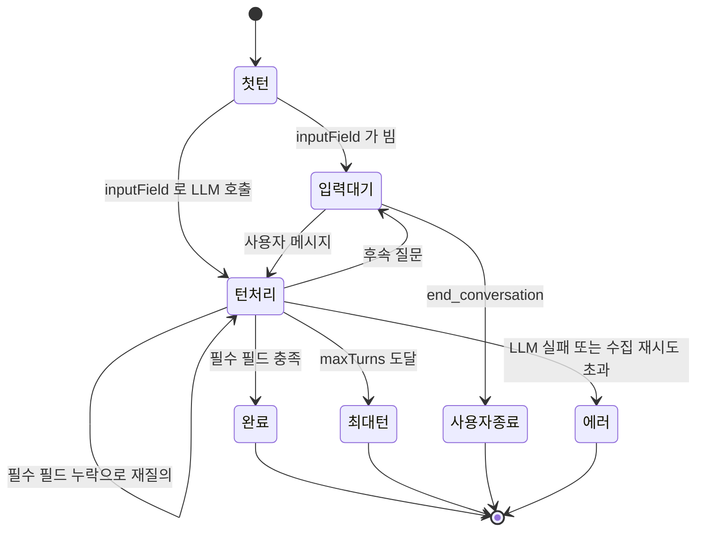

> 구현 상태: 부분 구현 · 원문: `spec/4-nodes/3-ai/3-information-extractor.md`, `spec/4-nodes/3-ai/_product-overview.md` (§3.4), `spec/4-nodes/_product-overview.md` (§6.3) · 용어: [용어 사전](../CLE-GLOSSARY.md)

## 개요

정보 추출기 노드(Information Extractor, `information_extractor`)는 LLM 으로 비정형 텍스트에서 출력 스키마(`outputSchema`)에 정의한 구조화 필드를 뽑는다. 캔버스 표시 이름은 "Info Extractor" 다. 단일 턴(`single_turn`)은 LLM 을 한 번 불러 JSON 응답을 받는다. 멀티턴(`multi_turn`)은 워크플로우 실행을 멈추고 사용자와 대화해 부족한 필드를 채우며, LLM 이 `finalize_extraction` 도구를 부르면 끝난다.

이 문서는 설정, 설정 화면, 포트, 실행 로직, 출력 구조, 에러 코드, 에이전트 메모리 사용 방식을 정한다. 모델 선택, 멀티턴 차단 모드의 공통 동작, 출력 묶음(`output.result`·`output.error`·`output.interaction`), 대화 맥락 설정, 메모리 전략, 시스템 컨텍스트 접두, 캔버스 요약은 [AI 노드 공통](CLE-NODE-AI-COMMON.md) 을 따른다. 에이전트 메모리 저장소·범위 키·추출·회수는 [에이전트 메모리](../CLE-AI/CLE-AI-MEMORY.md), 입력 대기·재개 상태 전이는 [실행 상태 머신과 대기·재개](../CLE-EXEC/CLE-EXEC-STATE.md) 가 정한다.

## 요구사항

- REQ-EXTRACT-001 WHEN 노드가 실행되면 THE SYSTEM SHALL LLM 으로 비정형 텍스트에서 구조화된 정보를 추출한다. (원본: ND-IE-01)
- REQ-EXTRACT-002 WHEN 사용자가 추출 필드를 정의하면 THE SYSTEM SHALL 필드마다 이름·타입·설명을 받는다. (원본: ND-IE-02)
- REQ-EXTRACT-003 WHEN 출력 스키마를 정의하면 THE SYSTEM SHALL 필드 정의를 JSON Schema 로 바꿔 LLM 에 넘긴다. (원본: ND-IE-03)
- REQ-EXTRACT-004 WHEN 추출이 끝나면 THE SYSTEM SHALL 결과를 출력 스키마의 모든 필드를 담은 객체로 돌려주고 미수집 필드는 `null` 로 둔다. (원본: ND-IE-04)
- REQ-EXTRACT-005 WHEN 사용자가 모델을 고르면 THE SYSTEM SHALL 그 모델로 추출한다. (원본: ND-IE-05)
- REQ-EXTRACT-006 WHEN 사용자가 예시 입력·출력을 넣으면 THE SYSTEM SHALL few-shot 예시로 시스템 프롬프트에 넣는다. (원본: ND-IE-06)
- REQ-EXTRACT-007 WHEN 단일 턴이면 THE SYSTEM SHALL `inputField` 값을 사용자 메시지로 해 JSON 응답 형식으로 LLM 을 한 번 부른다.
- REQ-EXTRACT-008 IF 단일 턴 JSON 파싱에 실패하면 THE SYSTEM SHALL 최대 2번 다시 시도하고, 모두 실패하면 `LLM_RESPONSE_INVALID` 로 `error` 포트에 보낸다.
- REQ-EXTRACT-009 IF LLM 호출이 예외를 던지면 THE SYSTEM SHALL `LLM_CALL_FAILED` 로 `error` 포트에 보낸다.
- REQ-EXTRACT-010 WHEN 멀티턴이면 THE SYSTEM SHALL `finalize_extraction` 도구를 LLM 에 노출한다.
- REQ-EXTRACT-011 IF 멀티턴 첫 진입에서 `inputField` 가 비었으면 THE SYSTEM SHALL LLM 을 부르지 않고 `turnCount: 0` 으로 입력 대기에 들어간다.
- REQ-EXTRACT-012 WHEN LLM 이 `finalize_extraction` 을 부르면 THE SYSTEM SHALL 인자를 부분 결과에 병합하고 `null`·`undefined` 값은 기존 값을 유지한다.
- REQ-EXTRACT-013 IF `finalize_extraction` 호출 뒤에도 필수 필드가 비어 있으면 THE SYSTEM SHALL 누락 필드를 알리고 같은 턴에서 LLM 을 다시 부른다.
- REQ-EXTRACT-014 IF 수집 재시도 횟수가 `maxCollectionRetries`(0 이 아닐 때)를 넘으면 THE SYSTEM SHALL `MAX_COLLECTION_RETRIES_EXCEEDED` 로 `error` 포트에 보내고 부분 결과를 함께 싣는다.
- REQ-EXTRACT-015 WHEN 모든 필수 필드가 채워지면 THE SYSTEM SHALL `completed` 포트로 보낸다.
- REQ-EXTRACT-016 WHEN 멀티턴 턴 수가 `maxTurns`(0 보다 클 때)에 닿으면 THE SYSTEM SHALL `max_turns` 포트로 보낸다.
- REQ-EXTRACT-017 WHEN 사용자가 `execution.end_conversation` 을 보내면 THE SYSTEM SHALL 수집한 만큼의 결과로 `user_ended` 포트에 보낸다.
- REQ-EXTRACT-018 WHILE 멀티턴 사용자 응답을 기다리는 동안 THE SYSTEM SHALL 타임아웃 없이 기다린다.
- REQ-EXTRACT-019 WHEN LLM 이 도구 호출 없이 텍스트만 돌려주면 THE SYSTEM SHALL 후속 질문으로 보고 입력 대기에 들어간다.
- REQ-EXTRACT-020 WHEN 멀티턴 대화가 `completed`·`max_turns`·`user_ended` 로 끝나면 THE SYSTEM SHALL 최종 추출 스냅샷을 `ai_assistant` 턴으로 대화 스레드에 한 번 누적한다.
- REQ-EXTRACT-021 IF 멀티턴이 LLM 호출 실패(`error`)로 끝나면 THE SYSTEM SHALL 대화 스레드에 누적하지 않는다.
- REQ-EXTRACT-022 WHEN 사용자 메시지를 받아 재개하고 종료 조건에 닿지 않으면 THE SYSTEM SHALL `status: 'resumed'` 스냅샷을 한 번 낸다. (미구현)
- REQ-EXTRACT-023 WHEN `memoryStrategy` 가 `persistent` 면 THE SYSTEM SHALL 추출 LLM 호출 전에 에이전트 메모리를 한 번 회수해 시스템 메시지 뒤 안정 프리픽스에 넣는다.
- REQ-EXTRACT-024 WHEN `memoryStrategy` 가 `persistent` 이고 대화 스레드에 결과를 누적하면 THE SYSTEM SHALL 메모리 추출을 비동기로 넣는다.
- REQ-EXTRACT-025 WHILE `memoryStrategy` 가 `manual` 인 동안 THE SYSTEM SHALL 메모리 회수·추출을 부르지 않고 기존 동작과 같은 messages 와 출력을 낸다.
- REQ-EXTRACT-026 IF 메모리 회수에 실패하면 THE SYSTEM SHALL 빈 회수로 보고 추출을 계속한다.
- REQ-EXTRACT-027 WHEN `contextScope` 가 `none` 이 아니고 메모리 전략이 `manual` 이면 THE SYSTEM SHALL 단일 턴은 LLM 호출 직전, 멀티턴은 첫 진입 때 한 번 대화 스레드를 주입한다.
- REQ-EXTRACT-028 IF 출력 스키마가 비었거나 단일 턴인데 `inputField` 가 비었거나 모델이 설정되지 않았으면 THE SYSTEM SHALL 캔버스 경고를 낸다.
- REQ-EXTRACT-029 WHEN `mode` 를 바꾸면 THE SYSTEM SHALL 출력 포트를 모드에 맞게 다시 계산한다.

## 설정

| 필드 | 타입 | 필수 | 기본값 | 설명 |
|------|------|------|--------|------|
| `llmConfigId` | UUID? | | 없음 | 모델 설정 참조([AI 노드 공통](CLE-NODE-AI-COMMON.md)) |
| `model` | String? | | 모델 설정 기본값 | 모델 ID |
| `inputField` | 표현식? | 단일 턴 필수 | 없음 | 추출 대상 텍스트. 단일 턴이면 warningRule 이 강제한다. 멀티턴에서 비어 있으면 첫 LLM 호출을 건너뛰고 바로 사용자 입력을 기다린다 |
| `outputSchema` | FieldDef[] | ✓ | `[]` | 추출할 필드 정의. 비면 warningRule 이 발화한다 |
| `examples` | ExampleDef[] | | `[]` | few-shot 예시 |
| `instructions` | String? | | `''` | 추가 추출 지시(시스템 프롬프트에 넣음) |
| `mode` | `single_turn` / `multi_turn` | ✓ | `single_turn` | AI 실행 모드. 멀티턴 차단 동작은 [AI 노드 공통](CLE-NODE-AI-COMMON.md) |
| `maxTurns` | Integer? | | `10` | 멀티턴 최대 턴 수. `0` 은 무제한 |
| `maxCollectionRetries` | Integer? | | `3` | 수집 재시도. 멀티턴에서 LLM 이 `finalize_extraction` 을 불렀는데 필수 필드가 비었을 때 다시 묻는 횟수. `0` 은 무제한. 넘으면 `error` 포트와 `MAX_COLLECTION_RETRIES_EXCEEDED` |
| `memoryStrategy` | `manual` / `persistent` | | `manual` | 메모리 전략. `manual` 은 대화 맥락 설정을 그대로 쓴다. `persistent` 는 추출 LLM 호출 전 에이전트 메모리 회수와 턴 경계 비동기 추출을 한다. `summary_buffer` 값은 없다 |
| `memoryKey` | 표현식? | | 없음 | 메모리 범위 키. 같은 키는 실행을 넘어 같은 기억을 회수한다. 비우면 `executionId` 로 격리. AI 에이전트와 같은 범위 키 규칙([에이전트 메모리](../CLE-AI/CLE-AI-MEMORY.md)). `persistent` 일 때만 보인다 |
| `memoryTopK` | Integer? | | `5` | 회수 top-k(지식 저장소 Top-K 와 독립). `persistent` 일 때 보인다 |
| `memoryThreshold` | Float? | | `0.7` | 회수 최소 유사도(0~1, 지식 저장소 임계값과 독립). `persistent` 일 때 보인다 |
| `memoryTtlDays` | Integer? | | 없음 | 메모리 만료(일). 비우면 만료 없음. `persistent` 일 때 보인다 |
| `embeddingModelConfigId` | 모델 설정 선택? | | 없음 | 회수·추출 임베딩 설정 id. 범위 메모리와 차원이 맞아야 한다. `embedding-config-selector` 로 고르며 노드 `llmConfigId` 와 독립이다. 비우면 워크스페이스 기본 embedding 설정(`resolveEmbedding`). `persistent` 일 때 보인다. 메모리 임베딩 설정 출처는 문서마다 정의가 갈린다([에이전트 메모리 미결 사항](../CLE-AI/CLE-AI-MEMORY.md#미결-사항)) |
| `extractionModelConfigId` | 모델 설정 선택? | | 없음 | 메모리 추출 LLM 호출 전용 chat 설정 id. `chat-config-selector` 로 고르며 main LLM 과 독립이다. 비우면 노드 `llmConfigId` → 기본 모델. `persistent` 일 때 보인다 |
| `contextScope` | `none` / `thread` / `lastN` | | `none` | 대화 맥락 설정 범위. `manual` 일 때만 적용한다(`persistent` 면 숨김) |
| `contextScopeN` | Integer? | `lastN` 일 때 | `20` | 최근 N개 턴 |
| `contextInjectionMode` | `messages` / `system_text` | 범위가 `none` 이 아닐 때 | `messages` | 주입 형식 |
| `includeToolTurns` | Boolean? | | `false` | `ai_tool` 턴 누적 여부. `finalize_extraction` 도구 턴은 누적 대상이 아니며 주입 인터페이스를 맞추려고 둔다 |
| `excludeFromConversationThread` | Boolean? | | `false` | 이 노드 턴을 스레드에서 뺀다(opt-out) |
| `includeSystemContext` | Boolean? | | `true` | 시스템 컨텍스트 접두 |
| `systemContextSections` | String[]? | | `['time', 'timezone']` | 접두 섹션 |

- 설정 스키마의 단일 기준은 `information-extractor.schema.ts` 의 `informationExtractorNodeConfigSchema` 다.
- 멀티턴 사용자 응답은 무제한으로 기다린다. 외부 취소 말고는 타임아웃이 없다.
- 대화 맥락 설정은 AI 에이전트와 같은 인터페이스다(`buildConversationContextSchemaFields()`, `injectConversationContext()`). 단일 턴은 LLM 호출 직전, 멀티턴은 첫 진입(`executeMultiTurn`)에서 초기 messages 를 만든 직후 한 번 주입하고 이후 턴은 `_resumeState.messages` 로 운반한다. `memoryStrategy = manual` 일 때만 적용하고, `persistent` 면 설정 화면에서 대화 맥락 필드를 숨기고 에이전트 메모리가 맥락을 맡는다(AI 에이전트의 `gateOnManualMemoryStrategy` 와 같음). 기본값이 `manual` + `none` 이라 기존 워크플로우 동작은 그대로다.

**FieldDef 구조** (`outputSchema[i]`)

| 필드 | 타입 | 필수 | 기본값 | 설명 |
|------|------|------|--------|------|
| `name` | String | ✓ | | 필드 이름(LLM 응답 JSON 의 키) |
| `type` | `string` / `number` / `boolean` / `array` / `object` | ✓ | | 필드 타입. JSON Schema 로 바꿔 LLM 에 넘긴다 |
| `description` | String | ✓ | | LLM 에 주는 필드 설명 |
| `required` | Boolean | | `true` | 필수 여부. 멀티턴에서 `false` 인 필드는 비어도 끝낼 수 있다 |
| `enumValues` | String[]? | | | 허용 값 목록. JSON Schema `enum` 으로 바꾼다(null 허용) |

**ExampleDef 구조** (`examples[i]`)

| 필드 | 타입 | 설명 |
|------|------|------|
| `input` | String | 예시 입력 텍스트 |
| `output` | Object | 예시 추출 결과(스키마와 같은 키 구성) |

## 설정 화면

| 영역 | 들어가는 요소 | 동작 |
|------|---------------|------|
| 모델 (맨 위) | "LLM Provider", "Model" 드롭다운 | 프로바이더를 고르면 모델 목록이 바뀐다 |
| 입력 | "Input Field"(예: `{{ $input.emailBody }}`) | 단일 턴일 때만 보인다 |
| 출력 스키마 | 필드 목록(이름·타입·필수 여부·설명·허용 값), "Add Field" 버튼 | 예: `senderName` String 필수 "발신자 이름", `amount` Number 선택 "관련 금액" |
| 예시 | "Add Example" 버튼 | few-shot |
| 지시 | "Instructions" 입력 | |
| 실행 모드 | "Single Turn" / "Multi Turn" 라디오 | |
| 멀티턴 설정 (맨 아래) | "Max Turns", "Max Collection Retries" | 멀티턴일 때만 보인다 |

## 포트

### 입력 포트

| id | label | type | dynamic | 설명 |
|------|-------|------|---------|------|
| `in` | Input | data | false | 추출 대상 데이터(`inputField` 표현식의 평가 컨텍스트) |

### 출력 포트 (모드에 따라 동적)

`isDynamicPorts: true`, `dynamicPorts.kind: 'info-extractor-mode'`. 프런트엔드 `resolveDynamicPorts` 가 `config.mode` 를 보고 포트 세트를 만든다.

**단일 턴**

| id | label | type | dynamic | 설명 |
|------|-------|------|---------|------|
| `out` | Output | system | true (모드에서 유도) | 추출 성공(`resolveDynamicPorts` 가 `system` 으로 발행) |
| `error` | Error | error | true (모드에서 유도) | LLM 호출 실패, JSON 파싱 재시도 소진 |

**멀티턴**

| id | label | type | dynamic | 설명 |
|------|-------|------|---------|------|
| `completed` | Completed | system | true (모드에서 유도) | 필수 필드를 모두 채워 자연 완료 |
| `user_ended` | User Ended | system | true (모드에서 유도) | 사용자가 `execution.end_conversation` 으로 종료 |
| `max_turns` | Max Turns | system | true (모드에서 유도) | `turnCount >= maxTurns` (`maxTurns > 0` 일 때) |
| `error` | Error | error | true (모드에서 유도) | LLM 호출 실패 또는 `MAX_COLLECTION_RETRIES_EXCEEDED` |

- 모드를 바꾸면 동적 출력 포트를 바로 다시 계산한다.
- 사용자가 정의한 추출 필드는 포트가 아니라 결과 객체의 키가 된다.
- `out`·`completed`·`user_ended`·`max_turns`·`error` 는 [노드 출력 규약](../CLE-NODE/CLE-NODE-OUTPUT.md) Principle 6 의 시스템 포트 예약어라 사용자가 같은 ID 를 쓸 수 없다.
- 포트 `type` 값 `system` 은 포트 정의 enum 에 없는 값이라 정의가 갈린다([AI 노드 공통](CLE-NODE-AI-COMMON.md) 미결 사항).

## 실행 로직

### 단일 턴

1. **시스템 컨텍스트 접두**: `includeSystemContext !== false` 면 접두를 시스템 프롬프트 앞에 붙인다([AI 노드 공통](CLE-NODE-AI-COMMON.md)).
2. **JSON Schema 변환**: `outputSchema` 를 `buildJsonSchema(schema, multiTurn=false)` 로 바꾼다. 각 필드는 `[type, 'null']` 유니온이라 LLM 이 미수집 필드를 `null` 로 나타낼 수 있다.
3. **시스템 프롬프트 구성**: 스키마 설명, `instructions`, `examples`, "JSON 으로만 응답" 지시를 넣는다.
4. **대화 맥락 주입**: `contextScope ≠ none` 이면 `injectConversationContext()` 로 자기 노드 턴을 뺀 스레드를 messages 앞이나 시스템 프롬프트 뒤에 붙인다.
5. **에이전트 메모리 회수**: `memoryStrategy === 'persistent'` 면 LLM 호출 직전 `AgentMemoryService.recall(workspaceId, scopeKey, queryText, {topK, threshold, embeddingModelConfigId})` 로 회수해 시스템 메시지 뒤 안정 프리픽스(회수 블록)에 넣는다. `scopeKey = resolveScopeKey(memoryKey, executionId)`, `queryText = inputField`(비면 시스템 프롬프트로 대신)다. `manual` 이면 부르지 않는다. 회수 실패는 빈 회수로 처리한다.
6. **LLM 호출**: 평가된 `inputField` 를 사용자 메시지로, `responseFormat: 'json'` 과 `jsonSchema` 옵션을 붙여 `LlmService.chat` 을 부른다. 예외가 나면 바로 `error` 포트와 `LLM_CALL_FAILED` 다.
7. **파싱과 출력**: 응답을 `JSON.parse` 한다. 성공하면 결과를 `output.result.extracted` 에 담아 `out` 포트로 보낸다. 스레드에 `ai_assistant` 턴(`JSON.stringify(extracted)`)을 누적한 직후 `persistent` 면 `AgentMemoryService.scheduleExtraction(...)` 으로 메모리 추출을 비동기로 넣는다.
8. **파싱 재시도**: 파싱에 실패하면 최대 2번 다시 시도한다(모두 3회). 모두 실패하면 `error` 포트와 `LLM_RESPONSE_INVALID` 다.

### 멀티턴

`finalize_extraction` 도구를 LLM 에 노출하고, LLM 이 모든 필드를 모았다고 판단해 이 도구를 부르면 끝낸다. 시스템 프롬프트 정책은 핸들러의 `buildMultiTurnSystemPrompt` 를 따른다. 시스템 컨텍스트 접두는 매 턴 시스템 프롬프트 맨 앞에 유지한다. `$now` 가 실행 단위로 고정이라 턴마다 다시 계산해도 값이 같다.



1. **첫 턴**
    - `inputField` 가 비면 LLM 호출을 건너뛰고 `turnCount: 0` 으로 바로 `waiting_for_input` 을 돌려준다. 사용자가 첫 메시지를 보낼 때까지 기다린다.
    - `inputField` 에 값이 있으면 그 값을 첫 사용자 메시지로 LLM 을 부른다. 그 직전에 대화 맥락을 한 번 주입한다(`contextScope ≠ none` 일 때). 주입한 턴은 `_resumeState.messages` 로 운반해 후속 턴은 다시 주입하지 않는다.
    - `persistent` 면 위 주입 직후, 첫 LLM 호출 직전에 한 번 회수해 시스템 메시지에 회수 블록을 붙인다. 시스템 메시지가 `_resumeState.messages` 로 운반되므로 후속 턴은 다시 회수하지 않는다. 스레드 참조·`executionId`·평가된 메모리 설정·추출 기준점(`memoryState.lastExtractionTurnSeq`, 옛 평면 키 `lastExtractionTurnSeq` 도 읽어 진행 중 실행과 호환)·`memoryStrategy` 를 멀티턴 상태에 실어 턴 사이 유실을 막는다.
2. **턴 처리** (`runTurnWithCollectionRetries`)
    - LLM 응답에 `finalize_extraction` 호출이 있으면 인자를 파싱해 `partialResult` 에 병합한다(`null`·`undefined` 는 기존 값 유지). 필수 필드가 모두 채워지면 `completed` 다. 부족하면 `tool` 역할 메시지로 누락 필드를 알리고 `collectionRetryCount += 1` 한 뒤 같은 턴에서 다시 부른다.
    - `collectionRetryCount > maxCollectionRetries`(0 제외)면 `forcedEnd: 'max_retries'` 로 끝낸다(`error` 포트, `MAX_COLLECTION_RETRIES_EXCEEDED`).
    - 도구 호출 없이 텍스트만 있으면 후속 질문으로 보고 `waiting_for_input` 을 돌려준다.
3. **종결 판정** (각 턴 끝)
    - `forcedEnd` 가 있으면 그 사유로 끝낸다.
    - 필수 필드를 모두 채우면 `completed` 포트(`endReason: 'completed'`)다.
    - `turnCount >= maxTurns`(`maxTurns > 0`)면 `max_turns` 포트다.
    - **종결 누적과 메모리 추출**: `buildMultiTurnFinalOutput` 종결 경로(`completed`·`max_turns`·`user_ended`)에서 최종 추출 스냅샷을 `ai_assistant` 턴(`JSON.stringify(extracted)`)으로 한 번 누적한다(단일 턴과 같음, [대화 스레드](../CLE-IX/CLE-IX-THREAD.md)). 입력 대기 중에는 누적하지 않는다. `error`(LLM 호출 실패)는 불완전한 결과를 쌓지 않으려 누적하지 않는다. 누적 직후 `persistent` 면 그 스레드를 소스로 메모리 추출을 비동기로 넣는다. 이 누적이 추출 소스와 다운스트림의 대화 맥락 가시성을 준다.
4. **`processMultiTurnMessage(userMessage, _resumeState)`**: 엔진이 사용자 메시지를 받으면 부른다. 메시지를 대화에 더하고 2~3을 반복한다.
5. **`endMultiTurnConversation(_resumeState, endReason)`**: 사용자가 `execution.end_conversation` 을 보내면 엔진이 부른다. `endReason` 에 따라 `user_ended`·`max_turns`·`error` 포트로 보낸다.
6. **재개 스냅샷**: 사용자 메시지로 재개했지만 종결 조건에 닿지 않으면 다음 `waiting_for_input` 직전에 `status: 'resumed'` 와 `output.interaction.{type, data, receivedAt}` 스냅샷을 한 번 내는 것이 목표 계약이다. 지금은 내지 않는다(미구현, 아래 재개 절).

단일 기준은 `information-extractor.handler.ts` 다. 시스템 프롬프트와 도구 정의는 같은 파일의 `buildMultiTurnSystemPrompt`·`buildFinalizationTool` 이다.

## 출력 구조

출력은 [노드 출력 규약](../CLE-NODE/CLE-NODE-OUTPUT.md) Principle 11 형식을 따른다. JSON 예시는 `undefined` 필드를 빼고 최상위 키는 5필드만 쓴다. 멀티턴 입력 대기·재개는 Principle 4 에 따라 내부 `_resumeState` 를 함께 싣고 표현식 계층에는 노출하지 않는다. 옛 `output.output.extracted.*` 이중 중첩 형식은 폐기했다(Principle 8).

**설정 에코 정책** (Principle 7): 모든 종결·입력 대기·재개 시점에서 `config` 는 사용자가 입력한 원본 값(`{{ ... }}` 보존)을 에코한다. 멀티턴 재개 턴에서는 엔진이 `state.rawConfig` 로 같은 원본을 운반한다. 고정 범위는 한 턴이고, 매 턴 재개 때 현재 `node.config` 에서 새로 유도해 다시 고정한다(D3 fresh-per-turn, [실행 컨텍스트](../CLE-EXEC/CLE-EXEC-CONTEXT.md)). 후속 노드는 `$node["X"].config.{mode, model, schema, instructions, examples, inputField, maxTurns, maxCollectionRetries}` 로 원본을 읽고, 평가된 모델 ID 는 `meta.model` 에서 읽는다. 출력 스키마는 원본 필드명 `outputSchema` 가 아니라 `schema` 키로 에코된다. 정의가 갈린다. [미결 사항](#미결-사항) 참조. `includeSystemContext`·`systemContextSections` 는 기본값과 같으면 뺀다.

| 케이스 | 포트 | status |
|------|------|------|
| 단일 턴 정상 | `out` | `ended` |
| 에러(단일 턴·멀티턴 LLM 실패) | `error` | `ended` |
| 멀티턴 입력 대기 | 없음 | `waiting_for_input` |
| 멀티턴 재개 | 없음 | `resumed` (미구현) |
| 멀티턴 종결 4종 | `completed` / `user_ended` / `max_turns` / `error`(`max_retries`) | `ended` |

### 단일 턴 정상 (`out`)

```json
{
  "config": {
    "mode": "single_turn",
    "model": "claude-sonnet-4-6",
    "schema": [
      { "name": "senderName", "type": "string", "description": "발신자", "required": true },
      { "name": "orderNumber", "type": "string", "description": "주문번호", "required": true },
      { "name": "issueType", "type": "string", "description": "문제 유형", "required": true },
      { "name": "amount", "type": "number", "description": "금액", "required": false }
    ],
    "instructions": "",
    "examples": [],
    "inputField": "{{ $input.emailBody }}"
  },
  "output": {
    "result": {
      "extracted": {
        "senderName": "김철수",
        "orderNumber": "ORD-12345",
        "issueType": "refund",
        "amount": 29900
      },
      "endReason": "out",
      "turnCount": 1,
      "originalInput": "환불 요청합니다. 주문번호 ORD-12345 …"
    }
  },
  "meta": {
    "durationMs": 810,
    "model": "claude-sonnet-4-6",
    "inputTokens": 450,
    "outputTokens": 80,
    "totalTokens": 530,
    "thinkingTokens": 0,
    "turnDebug": [
      { "turnIndex": 1, "llmCalls": [{ "requestPayload": {}, "responsePayload": {}, "durationMs": 810 }], "totalDurationMs": 810 }
    ]
  },
  "port": "out",
  "status": "ended"
}
```

| 필드 | 타입 | 출처 | 설명 |
|------|------|------|------|
| `config.mode` | `'single_turn'` | 설정 에코 | 실행 모드 |
| `config.model` | string | 설정 에코(원본) | `{{ }}` 보존. 평가 값은 `meta.model` |
| `config.schema` | FieldDef[] | 설정 에코(= 원본 `outputSchema`) | 추출 스키마 원본 |
| `config.instructions`·`config.examples`·`config.inputField` | | 설정 에코(원본) | |
| `output.result.extracted` | `Record<string, unknown>` | 핸들러 | LLM 이 추출한 필드. 출력 스키마 전 필드를 담고 미수집은 `null` |
| `output.result.endReason` | `'out'` | 핸들러 | 단일 턴 정상 종료 사유. 종료 사유 패키지 밖 값이다([인터랙션 타입 레지스트리](../CLE-IX/CLE-IX-TYPES.md)) |
| `output.result.turnCount` | number | 핸들러 | 단일 턴은 늘 `1` |
| `output.result.originalInput` | string | 핸들러 | LLM 에 넣은 실제 입력 |
| `meta.durationMs` | number | 핸들러·엔진 | 총 실행 시간(ms) |
| `meta.model` | string | LLM 응답 | 실제 모델 ID |
| `meta.{inputTokens, outputTokens, totalTokens, thinkingTokens}` | number | LLM 사용량 | 토큰 회계([AI 노드 공통](CLE-NODE-AI-COMMON.md)) |
| `meta.turnDebug` | Array | 핸들러 | 턴별 LLM 호출 기록(단일 턴은 1항목). 필드 의미는 [AI 에이전트 노드 출력과 디버그](CLE-NODE-AGENT-OUTPUT.md) |
| `meta.contextInjection` | object? | 핸들러 | `contextScope ≠ 'none'` 이고 스레드가 비지 않았을 때만. `{ appliedScope, appliedMode, injectedTurns, droppedTurns, totalInjectedChars }`. 적용 결과이지 설정 에코가 아니다 |
| `port` | `'out'` | 핸들러 | |
| `status` | `'ended'` | 핸들러 | |

표현식 접근 예: `$node["X"].output.result.extracted.senderName` → `"김철수"`, `$node["X"].output.result.extracted.amount` → `29900` 또는 `null`, `$node["X"].config.schema` → 원본 출력 스키마, `$node["X"].port` → `"out"`.

### 에러 (`error`)

단일 턴 LLM 호출 실패·JSON 파싱 재시도 소진, 멀티턴 LLM 호출 실패가 모두 이 포트로 간다(`max_retries` 는 종결 절). 멀티턴 대화 중 실패하면 `output.error` 와 함께 `output.result` 가 부분 수집 결과로 남는다.

```json
{
  "config": {
    "mode": "single_turn",
    "model": "claude-sonnet-4-6",
    "schema": [/* … */],
    "instructions": "",
    "examples": [],
    "inputField": "{{ $input.emailBody }}"
  },
  "output": {
    "error": {
      "code": "LLM_RESPONSE_INVALID",
      "message": "Failed to parse JSON after 3 attempts",
      "details": {
        "retryable": false,
        "attempts": 3,
        "originalInput": "환불 요청합니다…",
        "lastResponse": "..."
      }
    }
  },
  "meta": {
    "durationMs": 3200,
    "model": "claude-sonnet-4-6",
    "turnDebug": [{ "turnIndex": 1, "llmCalls": [{}, {}, {}], "totalDurationMs": 3200 }]
  },
  "port": "error",
  "status": "ended"
}
```

| 필드 | 타입 | 출처 | 설명 |
|------|------|------|------|
| `output.error.code` | string | 핸들러 | 에러 코드 표 참조 |
| `output.error.message` | string | 핸들러 | 사람이 읽는 원문 메시지(국제화 없음) |
| `output.error.details.retryable` | boolean | 핸들러 | 모든 에러 경로가 `retryabilityDetails` 헬퍼(`buildErrorOutput`)로 채운다. 원문 불변식은 `LLM_CALL_FAILED`·`LLM_RATE_LIMIT` 은 `true`, `LLM_RESPONSE_INVALID`·`MAX_COLLECTION_RETRIES_EXCEEDED` 는 `false` 다. 인증 실패(401·403)도 `true` 가 되어 다른 노드와 정의가 갈린다. [미결 사항](#미결-사항) 참조 |
| `output.error.details.retryAfterSec` | number? | 핸들러 | provider 신호가 있을 때 권장 대기(초). `retryable === true` 일 때만 |
| `output.error.details`(기타) | object? | 핸들러 | `attempts`·`originalInput`·`lastResponse`·`turnCount`·`collectionRetryCount` 등 |
| `output.result` | object? | 핸들러 | 멀티턴 `LLM_CALL_FAILED` 한정. `extracted`·`endReason: 'error'`·`turnCount`·`messages` 부분 결과 |
| `meta.durationMs` | number | 핸들러·엔진 | 실행 시간 |
| `meta.model` | string? | LLM 응답 | 호출이 일부라도 성공했을 때만. 공통 규약과 다르다([AI 노드 공통](CLE-NODE-AI-COMMON.md) 미결 사항) |
| `meta.collectionRetryCount` | number? | 핸들러 | 멀티턴 에러 때 누적값 |
| `meta.turnDebug` | Array | 핸들러 | 턴별 기록 |
| `port` | `'error'` | 핸들러 | |
| `status` | `'ended'` | 핸들러 | |

멀티턴 대화 중 LLM 호출이 실패하면 `output.error`(`LLM_CALL_FAILED`)와 `output.result`(부분 추출)가 함께 나온다. 후속 노드는 `output.error` 가 있는지로 판단하고 부분 결과는 `output.result.extracted` 에서 가져온다. 표현식 접근 예: `$node["X"].output.error.code`, `$node["X"].output.error.details.originalInput`, `$node["X"].output.result?.extracted`(단일 턴 에러면 `undefined`).

정보 추출기는 마지막 턴 재시도(`execution.retry_last_turn`)를 지원하지 않는다. 재시도 가능 에러여도 `_retryState` 를 만들지 않는다. 그래서 AI 에이전트가 `_retryState` 에 싣는 실패 사용자 메시지(`failedUserMessage`)도 담지 않는다. 현재 구현의 근거는 `information-extractor.handler.ts` 의 주석이다. 화면은 실시간 `system_error` 를 AI 에이전트 노드(`ai_agent`)에만 붙이므로 정보 추출기 실패에는 [다시 시도] 버튼이 보이지 않는다([대화 미리보기 §다시 시도 버튼 조건](../CLE-EXEC/CLE-EXEC-PREVIEW.md#다시-시도-버튼-조건)). `retryable=true` 인데 버튼이 없는 이 상태가 버튼 노출 규약과 어긋나는 문제는 [미결 사항](#미결-사항), [노드 출력 규약 미결 사항](../CLE-NODE/CLE-NODE-OUTPUT.md#미결-사항) 참조.

### 멀티턴 입력 대기 (`status: 'waiting_for_input'`)

핸들러가 `output: { result: {...}, partial?: {...} }` 와 내부 `_resumeState` 를 돌려주고 엔진이 실행을 멈춘 상태다. `output.result.*` 에는 이 턴 시점의 대화 스냅샷(`messages`·`message`·`turnCount`)이 AI 에이전트와 같은 경로로 들어가고, `output.partial.*` 에는 부분 수집 진행 상태가 들어간다. `maxTurns`·`maxCollectionRetries`·`schema` 같은 리터럴 설정은 출력에 에코하지 않으며, 화면과 후속 노드는 `$node["X"].config.*` 를 직접 읽는다(Principle 1.1).

```json
{
  "config": {
    "schema": [/* … */],
    "mode": "multi_turn",
    "maxCollectionRetries": 3
  },
  "output": {
    "result": {
      "messages": [
        { "role": "user", "content": "환불 요청합니다." },
        { "role": "assistant", "content": "주문번호를 알려주세요." }
      ],
      "message": "주문번호를 알려주세요.",
      "turnCount": 1
    },
    "partial": {
      "extracted": { "senderName": "김철수", "orderNumber": null, "issueType": "refund", "amount": null },
      "missingFields": ["orderNumber"],
      "collectionRetryCount": 0
    }
  },
  "meta": {
    "interactionType": "ai_conversation"
  },
  "status": "waiting_for_input"
}
```

| 필드 | 타입 | 출처 | 설명 |
|------|------|------|------|
| `config.schema`·`config.mode`·`config.maxCollectionRetries` | | 설정 에코 | `maxCollectionRetries` 는 대기 화면 진행률 표시용(`output.partial.collectionRetryCount` 와 비교) |
| `output.result.messages` | `ChatMessage[]` | 핸들러 | 누적 대화(system 제외, user·assistant·tool). AI 에이전트와 같은 구조 |
| `output.result.message` | string | 핸들러 | 가장 최근 assistant 후속 질문 |
| `output.result.turnCount` | number | 핸들러 | 지금까지 진행한 턴 수. 분모 `maxTurns` 는 `config.maxTurns` 에서 읽는다 |
| `output.partial.extracted` | `Record<string, unknown>` | 핸들러 | 스키마 전 필드 기준 현재 스냅샷. 미수집은 `null` |
| `output.partial.missingFields` | `string[]` | 핸들러 | 아직 채우지 않은 필수 필드 이름 |
| `output.partial.collectionRetryCount` | number | 핸들러 | 누적 재질의 횟수 |
| `meta.interactionType` | `'ai_conversation'` | 핸들러 | 엔진 WS 페이로드 분류용. 종결 때는 쓰지 않는다 |
| `status` | `'waiting_for_input'` | 핸들러 | 엔진 일시 정지 계기 |
| `_resumeState` | object | 핸들러 내부 | 다음 턴 처리용 내부 상태. 표현식 계층에 노출하지 않고 DB 저장 때 지운다. 정보 추출기도 `_resumeCheckpoint` 기반 턴 재개를 쓴다(턴 단위 park, 재시작·다른 인스턴스 포함, [장애 복구와 안전 종료](../CLE-EXEC/CLE-EXEC-RECOVERY.md)). 자격 증명을 뺀 부분집합(고유 상태 `partialResult`·`collectionRetryCount` 포함)을 `NodeExecution.outputData._resumeCheckpoint` 에 영속한다. 재개 때 조작 필드(`outputSchema`·`examples`·`instructions`·`maxCollectionRetries`)는 `node.config` 에서, 식별 필드(`workflowId`·`nodeExecutionId`)는 호출 측 컨텍스트에서 다시 유도한다. 식별 필드는 재개 턴 `llmContext` 로 쓰여 `llm_usage_log` 귀속을 성립시킨다. provider 도구가 없는 정보 추출기의 유일한 귀속 경로다([LLM 사용량 기록](../CLE-AI/CLE-AI-USAGE.md)). checkpoint 가 없거나 손상되거나 미래 버전일 때만 초기화한다(`RESUME_INCOMPATIBLE_STATE`) |

`meta.contextInjection` 은 이 일시 스냅샷에 일부러 싣지 않는다. 첫 진입 때 주입한 결과는 `state.contextInjection` 으로 운반해 종결 출력에서만 에코한다. 대기 스냅샷은 가볍게 유지한다(`buildWaitingOutput` 은 `meta.interactionType` 만 낸다).

표현식 접근 예: `$node["X"].output.result.messages[-1].content`, `$node["X"].output.partial.missingFields`, `$node["X"].config.maxTurns`, `$node["X"].status` → `"waiting_for_input"`.

### 멀티턴 재개 (`status: 'resumed'`)

사용자 메시지를 받아 다음 턴을 처리한 뒤 종결 조건에 닿지 않았을 때, 다음 `waiting_for_input` 직전에 한 번 내는 관찰 전용 스냅샷이다. 연결선 라우팅은 없고 실행 내역·타임라인에만 기록한다.

> 구현 현황: 이 구조화 스냅샷은 목표 관찰 계약이며 아직 내지 않는다(미구현). 현재 엔진의 AI 대화 턴 경로(`processAiResumeTurn` → `handleAiMessageTurn`)는 정보 추출기 턴에서 `message_received` interaction 과 `status:'resumed'` 스냅샷을 내지 않는다. `resumed` 스냅샷은 form·buttons 경로에만 있다([AI 에이전트 노드 출력과 디버그](CLE-NODE-AGENT-OUTPUT.md) 와 같은 상태). 같은 수신 시점의 WS `execution.user_message` 라이브 신호는 노드 타입과 무관한 공통 경로라 정보 추출기에도 적용된다. 구현하거나 이 절을 폐기할지는 `plan/in-progress/node-output-redesign/information-extractor.md` 가 추적한다.

```json
{
  "config": {
    "schema": [/* … */],
    "mode": "multi_turn",
    "maxCollectionRetries": 3
  },
  "output": {
    "result": {
      "messages": [
        { "role": "user", "content": "환불 요청합니다." },
        { "role": "assistant", "content": "주문번호를 알려주세요." },
        { "role": "user", "content": "ORD-12345 입니다" }
      ]
    },
    "partial": {
      "extracted": { "senderName": "김철수", "orderNumber": null, "issueType": "refund", "amount": null },
      "missingFields": ["orderNumber"],
      "collectionRetryCount": 0
    },
    "interaction": {
      "type": "message_received",
      "data": { "content": "ORD-12345 입니다", "role": "user" },
      "receivedAt": "2026-04-19T06:45:12.480Z"
    }
  },
  "meta": {
    "durationMs": 0,
    "interactionType": "ai_conversation"
  },
  "status": "resumed"
}
```

| 필드 | 타입 | 출처 | 설명 |
|------|------|------|------|
| `config.*` | | 설정 에코 | 대기 시점과 같은 원본 |
| `output.result.messages` | `ChatMessage[]` | 핸들러 | 사용자 메시지를 더한 직후 누적(system 제외) |
| `output.partial` | object | 핸들러 | 직전 대기 시점 스냅샷 유지(새 LLM 결과가 아직 없음) |
| `output.interaction.type` | `'message_received'` | 엔진 | 재개 계기 종류([노드 출력 규약](../CLE-NODE/CLE-NODE-OUTPUT.md) Principle 4.5). 핸들러는 `waiting_for_input` 만 내고 `output.interaction.*` 와 `status: 'resumed'` 는 엔진이 넣는다 |
| `output.interaction.data.content` | string | 엔진 | 사용자 메시지 |
| `output.interaction.data.role` | `'user'` | 엔진 | 고정 |
| `output.interaction.receivedAt` | ISO8601 string | 엔진 | 수신 시각 |
| `meta.durationMs` | number | 엔진 | 별도 LLM 호출이 없어 보통 0 |
| `meta.interactionType` | `'ai_conversation'` | 핸들러 | 대기·재개 공통 분류 |
| `status` | `'resumed'` | 엔진 | 관찰용 일시 표지 |
| `_resumeState` | object | 핸들러 내부 | 다음 턴 처리용 내부 상태 |

`meta.contextInjection` 은 이 스냅샷에도 일부러 싣지 않는다. 표현식 접근 예: `$node["X"].output.interaction.data.content`, `$node["X"].output.interaction.receivedAt`, `$node["X"].status` → `"resumed"`.

### 멀티턴 종결 4종

종료 사유 값 목록의 단일 기준은 패키지 `@workflow/ai-end-reason` 의 `InformationExtractorEndReason` 이다([인터랙션 타입 레지스트리](../CLE-IX/CLE-IX-TYPES.md)). 이 문서는 값의 뜻과 포트 매핑을 정하고 값 목록은 패키지가 정한다. 예전에는 프런트엔드가 목록을 손으로 베껴 두었고 어긋날 때마다 대화 미리보기가 사라졌다. 값을 더하거나 빼려면 패키지 유니온을 고친다.

유니온 6값 중 이 절은 4값(`completed`·`user_ended`·`max_turns`·`max_retries`)을 다룬다. `error` 는 에러 절에서 다룬다. `timeout` 은 유니온에 선언만 있고 만드는 곳이 없는 휴면 값이다(`portForEndReason` 에 case 도 없어 기본값 `error` 로 간다). 휴면이어도 선언된 이상 대화 UI 허용 목록에는 들어간다(살아나는 순간 미리보기가 사라지지 않게). 단일 턴 `endReason: "out"` 은 AI 에이전트와 같은 이유로 패키지 밖이다.

공통 형태(`endReason`·`port`·`status` 만 다르다):

```jsonc
{
  "config": { /* multiTurnConfigEcho — 원본 mode/model/schema/instructions/examples/inputField/maxTurns/maxCollectionRetries */ },
  "output": {
    "result": {
      "extracted": { /* 출력 스키마 전 필드, 미수집은 null */ },
      "endReason": "<completed|user_ended|max_turns|max_retries>",
      "turnCount": <number>,
      "messages": [/* 누적 대화 */]
    }
    // max_retries 는 output.error 가 result 와 함께 있다
  },
  "meta": {
    "durationMs": <number>,
    "model": "claude-sonnet-4-6",
    "inputTokens": <number>,
    "outputTokens": <number>,
    "totalTokens": <number>,
    "thinkingTokens": <number>,
    "collectionRetryCount": <number>,
    "turnDebug": [/* … */]
  },
  "port": "<completed|user_ended|max_turns|error>",
  "status": "ended"
}
```

| 종료 사유 | port | 뜻 | 예시 값 |
|------|------|------|------|
| `completed` | `completed` | 필수 필드를 모두 채워 `finalize_extraction` 이 성공한 자연 완료 | `extracted` 전 필드 채움, `turnCount: 2`, `collectionRetryCount: 0` |
| `user_ended` | `user_ended` | 사용자가 `execution.end_conversation` 으로 명시 종료. `extracted` 는 수집한 만큼만 남고 나머지는 `null` | `{ "senderName": "김철수", "orderNumber": null, "issueType": null, "amount": null }` |
| `max_turns` | `max_turns` | `turnCount >= maxTurns`(`maxTurns > 0`) 도달 | `turnCount: 5`, `collectionRetryCount: 1` |
| `max_retries` | `error` | `collectionRetryCount > maxCollectionRetries` 초과. `output.error` 와 `output.result` 가 함께 있다 | 아래 예시 |

`max_retries` 예시:

```json
{
  "config": { "mode": "multi_turn", "schema": [/* … */], "maxTurns": 10, "maxCollectionRetries": 3 },
  "output": {
    "error": {
      "code": "MAX_COLLECTION_RETRIES_EXCEEDED",
      "message": "LLM attempted finalize_extraction 4 times with missing required fields",
      "details": {
        "retryable": false,
        "extracted": { "senderName": "김철수", "orderNumber": null, "issueType": "refund", "amount": null },
        "missingFields": ["orderNumber"],
        "turnCount": 3,
        "collectionRetryCount": 3
      }
    },
    "result": {
      "extracted": { "senderName": "김철수", "orderNumber": null, "issueType": "refund", "amount": null },
      "endReason": "max_retries",
      "turnCount": 3,
      "messages": [/* … */]
    }
  },
  "meta": {
    "durationMs": 5600,
    "model": "claude-sonnet-4-6",
    "inputTokens": 500,
    "outputTokens": 150,
    "totalTokens": 650,
    "thinkingTokens": 0,
    "collectionRetryCount": 3,
    "turnDebug": [/* … */]
  },
  "port": "error",
  "status": "ended"
}
```

**종결 공통 필드**

| 필드 | 타입 | 출처 | 설명 |
|------|------|------|------|
| `config.*` | 원본 `multiTurnConfigEcho` | 설정 에코 | 엔진이 운반한 `state.rawConfig` 에서 에코 |
| `output.result.extracted` | `Record<string, unknown>` | 핸들러 | 스키마 전 필드, 미수집은 `null` |
| `output.result.endReason` | `'completed'` / `'user_ended'` / `'max_turns'` / `'max_retries'` | 핸들러 | 종료 사유 |
| `output.result.turnCount` | number | 핸들러 | 실제 진행 턴 수 |
| `output.result.messages` | `ChatMessage[]` | 핸들러 | 누적 대화 |
| `output.error` | object | 핸들러 | `max_retries` 한정. 멀티턴 `LLM_CALL_FAILED` 도 같은 형태(에러 절) |
| `meta.durationMs` | number | 핸들러·엔진 | 누적 실행 시간 |
| `meta.model` | string | 핸들러 | 사용한 모델 |
| `meta.{inputTokens, outputTokens, totalTokens, thinkingTokens}` | number | LLM 사용량 누적 | 턴별 합산 |
| `meta.collectionRetryCount` | number | 핸들러 | 재질의 누적 |
| `meta.turnDebug` | Array | 핸들러 | 턴별 LLM 호출 기록 |
| `meta.contextInjection` | object? | 핸들러 | `contextScope ≠ 'none'` 이고 스레드가 비지 않았을 때만. 첫 진입 때 한 번 주입한 결과를 상태로 운반해 종결 출력에 에코한다 |
| `port` | `'completed'` / `'user_ended'` / `'max_turns'` / `'error'` | 핸들러(`portForEndReason`) | 종료 사유 → 포트 |
| `status` | `'ended'` | 핸들러 | |

표현식 접근 예: `$node["X"].output.result.extracted.orderNumber`, `$node["X"].output.result.endReason`, `$node["X"].output.error?.code === "MAX_COLLECTION_RETRIES_EXCEEDED"`(max_retries 분기 판정), `$node["X"].port`, `$node["X"].meta.collectionRetryCount`.

## 에러 코드

`output.error.code` 예약어다(Principle 3.2 표준 형태 `{code, message, details?}`).

| code | 발생 조건 | 포트 | 분류 |
|------|-----------|------|------|
| `LLM_CALL_FAILED` | provider 네트워크·타임아웃·5xx·기타 예외 | `error` | 실행 중. 단일 턴은 바로, 멀티턴은 `result` 와 함께 |
| `LLM_RATE_LIMIT` | 429(provider 가 따로 분류할 때) | `error` | 실행 중 |
| `LLM_RESPONSE_INVALID` | 단일 턴 JSON 파싱이 모든 재시도(기본 3회)에서 실패 | `error` | 실행 중 |
| `MAX_COLLECTION_RETRIES_EXCEEDED` | 멀티턴 `collectionRetryCount > maxCollectionRetries` | `error` | 실행 중. `result` 와 함께(`max_retries`) |

**실행 전 검증** ([노드 출력 규약](../CLE-NODE/CLE-NODE-OUTPUT.md) Principle 3.1, 예외를 던진다)

| 발생 조건 | 메시지 | 시점 |
|-----------|--------|------|
| `model` 과 `llmConfigId` 가 모두 없음 | `LLM provider or model must be selected (auto-handled by the canvas when a workspace default provider is configured).` (`AI_NO_LLM_PROVIDER_MESSAGE`, `codebase/backend/src/nodes/ai/llm-provider-rule.ts`) | warningRule(캔버스 배지) + handler.validate |
| `outputSchema` 가 빈 배열 | `At least one extraction field must be defined.` | warningRule + handler.validate |
| 단일 턴인데 `inputField` 가 비었음 | `In Single Turn mode, Input Field must be entered.` | warningRule(캔버스 배지) |
| `outputSchema[i].name`·`outputSchema[i].type` 이 없음 | `Field {i+1}: name is required` / `type is required` | handler.validate |
| 멀티턴인데 `maxTurns` 가 음수이거나 숫자가 아님 | `maxTurns must be 0 (unlimited) or a positive integer` | handler.validate |

## 에이전트 메모리 사용

`memoryStrategy = persistent` 면 정보 추출기는 에이전트 메모리의 소비자(회수)이자 생산자(추출)다([에이전트 메모리](../CLE-AI/CLE-AI-MEMORY.md)). AI 에이전트의 회수·추출 패턴을 추출 노드에 맞게 일부 들인 것으로, 회수와 추출만 쓰고 롤링 요약(`summary_buffer`)은 뺐다. AI 에이전트와 다른 점은 회수 쿼리와 시점이다.

### 회수 (소비자)

- 추출 LLM 호출 직전 한 번 `AgentMemoryService.recall(workspaceId, scopeKey, queryText, { topK: memoryTopK, threshold: memoryThreshold, embeddingModelConfigId })` 를 부른다. 단일 턴과 멀티턴 첫 진입 모두 적용한다. 멀티턴 후속 턴은 다시 회수하지 않는다(AI 에이전트 `persistent` 는 매 턴 회수한다).
- 회수 쿼리는 `inputField` 이고 비면 시스템 프롬프트로 대신한다(AI 에이전트는 사용자 메시지).
- 쿼리를 입력 유형 `inputType:'query'` 로 임베딩한다. 범위 메모리는 저장 때 `'document'` 로 임베딩되므로 비대칭 모델(e5·Gemini)에서 인코딩이 어긋나지 않게 검색 쪽만 query 로 보낸다([에이전트 메모리](../CLE-AI/CLE-AI-MEMORY.md)).
- `scopeKey = resolveScopeKey(memoryKey, executionId)` 는 AI 에이전트와 같은 범위 키 규칙이다. 같은 키면 AI 에이전트와 정보 추출기가 같은 메모리를 공유한다. 비우면 `executionId` 로 격리한다.
- 결과는 안정 프리픽스(회수 블록, `[memory]…[/memory]` data-fence)로 시스템 메시지 뒤에 붙인다. `manual` 이면 부르지 않는다.
- 회수 실패는 빈 회수로 처리해 hot path 를 깨지 않는다.

### 추출 (생산자)

- 턴 경계(스레드 누적 직후)에 `AgentMemoryService.scheduleExtraction({ workspaceId, scopeKey, llmConfigId, model, extractionModelConfigId, embeddingModelConfigId, turns, ttlDays })` 로 비동기 enqueue 한다. 큐 추가까지만 기다리고 추출 LLM 호출은 워커가 한다.
- 단일 턴은 최종 응답 누적 뒤 한 번, 멀티턴은 종결 누적 뒤 한 번이다. 누적이 종결 때 한 번뿐이라 매 턴 추출하지 않는다.
- `turns` 는 스레드 스냅샷의 얕은 복사다(격리 불변식). 추출 기준점(`memoryState.lastExtractionTurnSeq`, 옛 평면 키 폴백)은 멀티턴 상태로 운반하지만, 멀티턴 추출이 종결 1회라 실제로는 스레드 전체를 스냅샷한다. 기준점의 저장 키 경로는 문서마다 정의가 갈린다. [에이전트 메모리 미결 사항](../CLE-AI/CLE-AI-MEMORY.md#미결-사항) 참조.
- enqueue 실패는 서비스 안에서 삼켜 대화를 계속한다.

### `manual` 회귀 불변식

`memoryStrategy = manual`(기본)이면 회수와 추출을 모두 부르지 않고 messages·출력이 기존과 같다(회귀 고정 테스트로 강제). `AgentMemoryService` 가 주입되지 않은 경우(테스트 fixture, 옛 구성)도 아무 일 없이 넘어간다.

## 캔버스 요약

형식은 [AI 노드 공통](CLE-NODE-AI-COMMON.md) 의 캔버스 요약 절이 정한다. 목표는 `{model} · {N} fields`(출력 스키마 필드 수)이고 멀티턴이면 앞에 `Multi Turn` 을 붙인다(예: `claude-sonnet-4-6 · 4 fields`, `Multi Turn · claude-sonnet-4-6 · 4 fields`). `summaryTemplate` 이 없어 지금은 표시되지 않는다(미구현).

## 미결 사항

- **설정 에코의 출력 스키마 키**: [노드 출력 규약](../CLE-NODE/CLE-NODE-OUTPUT.md) Principle 7 은 설정 에코가 원본 필드명을 그대로 쓴다고 정한다. 이 노드는 `outputSchema` 를 `schema` 로 에코한다. 원문은 이를 알려진 결함(W-1)으로 적고, 문서 약 15곳과 표현식 예시에 걸쳐 있어 일괄 이름 변경을 뒤로 미뤘다. 표현식 작성자는 설정 화면과 다른 키를 써야 한다. 이름을 바꿀지(하위 호환 영향 있음), 이 노드를 Principle 7 예외로 등재할지 결정 필요.
- **재시도 가능 에러와 마지막 턴 재시도**: [노드 출력 규약](../CLE-NODE/CLE-NODE-OUTPUT.md) 은 `retryable=true` 면 화면이 [다시 시도] 버튼을 보인다고 정한다. 이 노드는 멀티턴 LLM 실패를 `retryable=true` 로 내지만 `_retryState` 를 만들지 않는다(현재 핸들러 주석: 정보 추출기는 `execution.retry_last_turn` 미지원). 현재 화면은 노드 유형으로 버튼을 막는다. 실시간 `system_error` 는 노드 유형이 `ai_agent` 이고 store 에 대화가 있을 때만 만든다(`use-execution-events.ts` 의 `isMultiTurnAiContext`). 내역 화면이 `output.error` 로 합성한 항목에는 `nodeExecutionId` 가 없어 버튼을 숨긴다. 그래서 정보 추출기에는 버튼이 보이지 않는다. 이 게이트 조건은 [대화 미리보기 §다시 시도 버튼 조건](../CLE-EXEC/CLE-EXEC-PREVIEW.md#다시-시도-버튼-조건) 에 적었다. 게이트가 없으면 버튼을 눌러도 `RETRY_STATE_NOT_FOUND` 가 난다. 이 노드에 마지막 턴 재시도를 들일지, `retryable=true` 인데 버튼이 없는 지금 상태를 규약의 예외로 적을지 결정 필요. 같은 문제가 [노드 출력 규약 미결 사항](../CLE-NODE/CLE-NODE-OUTPUT.md#미결-사항) 의 인증 실패 재시도 분류 항목에도 올라 있다.
- **인증 실패(401·403)의 재시도 가능 분류**: 이 노드는 `LLM_CALL_FAILED` 면 늘 `retryable: true` 로 고정한다. AI 에이전트·텍스트 분류기 문서와 규약은 `false` 로 정한다. [AI 노드 공통](CLE-NODE-AI-COMMON.md) 미결 사항 참조.

## 구현 위치

- `codebase/backend/src/nodes/ai/information-extractor/information-extractor.handler.ts` (`buildMultiTurnSystemPrompt`, `buildFinalizationTool`, `buildErrorOutput`)
- `codebase/backend/src/nodes/ai/information-extractor/information-extractor.schema.ts` (`informationExtractorNodeConfigSchema`)
- `codebase/backend/src/nodes/ai/shared/agent-memory-injection.ts`
- `codebase/backend/src/nodes/ai/shared/agent-memory-schema.ts`

진행 중 작업: `plan/in-progress/node-output-redesign/information-extractor.md`

## Rationale

### 에이전트 메모리는 쓰고 롤링 요약은 쓰지 않는 이유

추출 노드의 가치는 실행을 넘는 사실 누적(이전 추출 결과를 다음 실행이 쓰는 것)에 있다. 회수로 과거 사실을 가져오고 추출로 새 사실을 저장하는 `persistent` 주기와 정확히 맞는다. 반면 `summary_buffer` 는 한 실행 안의 긴 대화에서 working-memory 토큰을 줄이는 장치인데, 추출은 출력 스키마로 범위가 한정된 짧은 수집 대화라 압축 이득이 거의 없다. 그래서 `summary_buffer` 값을 두지 않아 설정 표면을 단순하게 둔다.

### 텍스트 분류기를 메모리 대상에서 뺀 이유

텍스트 분류기는 단일 턴이고 상태가 없어 회수할 이전 실행 사실도, 저장할 추출 사실도 정의되지 않는다. 그래서 에이전트 메모리 대상에서 빼고 대화 맥락 설정만 둔다.

### 멀티턴 종결 누적을 함께 들인 이유

전에는 멀티턴 종결 경로가 대화 스레드에 누적하지 않는 한계가 있었다(단일 턴만 누적). 메모리 추출은 누적된 스레드 턴을 소스로 삼으므로 종결 누적이 먼저 있어야 추출할 소스가 생긴다. 이 누적은 다운스트림 노드의 대화 맥락 가시성도 준다(추출 결과를 스레드에서 읽을 수 있음). 그래서 같은 작업에서 종결 1회 누적을 들였다. 입력 대기 중에는 누적하지 않아 미완성 결과가 스레드와 메모리에 쌓이지 않는다.

### 메모리 모델 필드를 등록 모델 설정 선택으로 둔 이유

`embeddingModelConfigId`·`extractionModelConfigId` 는 AI 에이전트와 같이 `/models` 에 등록한 모델 설정을 `config.id` 로 고른다(위젯 `embedding-config-selector`·`chat-config-selector`, 노드 `llmConfigId` 와 독립). 채택 근거와 번복 이력의 단일 기준은 [AI 에이전트 노드](CLE-NODE-AGENT.md) 의 요약·추출 전용 모델 필드 결정이며, 이 노드는 그 결정을 그대로 따른다. 이 노드는 롤링 요약 경로가 없어 요약 LLM 호출이 없으므로 `summaryModelConfigId` 를 갖지 않는다. 옛 모델명 필드(`embeddingModel`·`extractionModel`) 값은 새 필드와 키가 달라 폐기되고, 미설정 폴백(워크스페이스 기본 embedding, 노드 `llmConfigId`)으로 물러난다. 보조 호출이라 추출 무결성에는 영향이 없다.

### 설정 에코 기본값 생략

`includeSystemContext`·`systemContextSections` 는 기본값과 같으면 설정 에코에서 뺀다([AI 노드 공통](CLE-NODE-AI-COMMON.md)).
