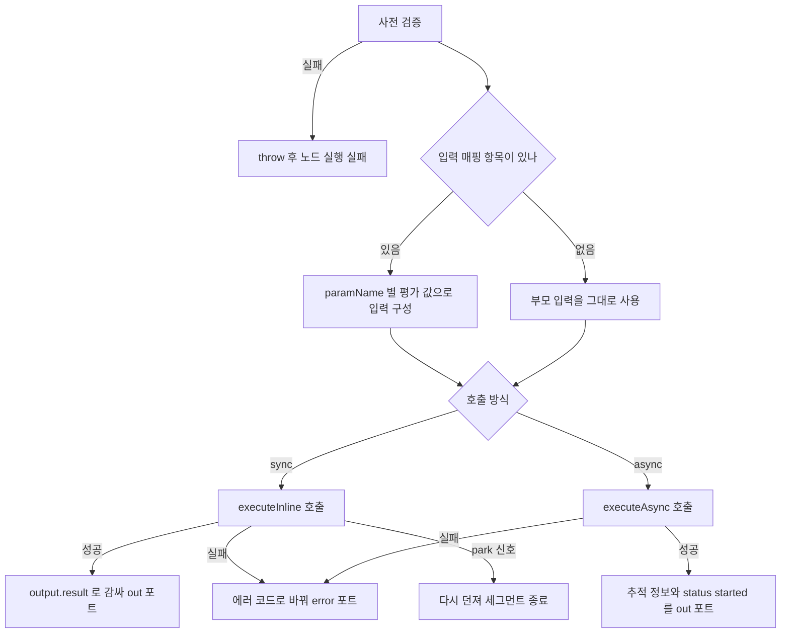

> 구현 상태: 구현됨(메타 노출 일부 미구현) · 원문: `spec/4-nodes/2-flow/1-workflow.md`, `spec/4-nodes/_product-overview.md` (§5.1) · 용어: [용어 사전](../CLE-GLOSSARY.md)

## 개요

워크플로우 호출 노드(Workflow node, `workflow`)는 다른 워크플로우를 서브 워크플로우(sub-workflow)로 불러 재사용과 모듈화를 돕는 Flow 노드다. 캔버스 표시 이름은 "Workflow" 다.

호출 방식은 두 가지다.

- 동기 호출(`sync`): 부모 실행 안에서 서브 워크플로우를 인라인으로 돌리고, 서브 워크플로우의 최종 출력을 받는다.
- 비동기 호출(`async`): 서브 워크플로우를 별도 실행으로 큐에 등록하고 추적 ID 를 바로 받는다. 부모는 결과를 기다리지 않는다(fire-and-forget).

이 문서는 노드 설정, 설정 화면, 포트, 실행 로직, 출력 형태, 에러 코드, 설정 요약을 정한다. Flow 카테고리 공통 규약은 [Flow 노드 공통](CLE-NODE-FLOW-COMMON.md), 노드 출력 필드 규칙은 [노드 출력 규약](../CLE-NODE/CLE-NODE-OUTPUT.md), 에러 처리 정책은 [노드 에러 처리 정책](../CLE-NODE/CLE-NODE-ERROR.md)이 정한다. 서브 워크플로우 안에서 입력 대기가 생겼을 때 엔진이 재개하는 방법은 [실행 상태 머신과 대기·재개](../CLE-EXEC/CLE-EXEC-STATE.md)와 [장애 복구와 안전 종료](../CLE-EXEC/CLE-EXEC-RECOVERY.md)에 있다.

## 요구사항

- REQ-SUBWF-001 WHEN 워크플로우 호출 노드가 실행되면 THE SYSTEM SHALL `workflowId` 가 가리키는 다른 워크플로우를 서브 워크플로우로 호출한다. (원본: ND-WF-01)
- REQ-SUBWF-002 WHEN 사용자가 대상 워크플로우 셀렉터를 열면 THE SYSTEM SHALL 같은 워크스페이스의 워크플로우를 후보로 보여 주고 지금 편집 중인 워크플로우는 뺀다. (원본: ND-WF-02)
- REQ-SUBWF-003 WHEN 사용자가 셀렉터에서 워크플로우를 고르면 THE SYSTEM SHALL `workflowId` 와 `workflowName` 을 함께 저장한다.
- REQ-SUBWF-004 WHEN 사용자가 `workflowId` 를 직접 입력하면 THE SYSTEM SHALL `workflowName` 을 비운다.
- REQ-SUBWF-005 WHEN `inputMapping` 에 항목이 하나 이상 있으면 THE SYSTEM SHALL 항목마다 `paramName` 을 키로, 평가한 `expression` 을 값으로 한 객체를 서브 워크플로우 입력으로 넘긴다. (원본: ND-WF-03)
- REQ-SUBWF-006 WHEN `inputMapping` 이 비어 있으면 THE SYSTEM SHALL 부모 입력을 그대로 서브 워크플로우에 넘긴다.
- REQ-SUBWF-007 WHEN `mode` 가 `sync` 이면 THE SYSTEM SHALL 서브 워크플로우를 부모 실행 안에서 인라인으로 실행하고 끝날 때까지 기다린다. (원본: ND-WF-05)
- REQ-SUBWF-008 WHEN 동기 호출이 성공하면 THE SYSTEM SHALL 서브 워크플로우의 최종 노드 출력을 `output.result` 에 한 겹 감싸 `out` 포트로 내보낸다. (원본: ND-WF-04)
- REQ-SUBWF-009 WHEN `mode` 가 `async` 이면 THE SYSTEM SHALL 서브 워크플로우를 별도 실행으로 큐에 등록하고 `output: { executionId, workflowId, status: 'started' }` 를 바로 돌려준다. (원본: ND-WF-05)
- REQ-SUBWF-010 IF 비동기 호출로 등록한 서브 워크플로우가 실행 중에 실패하면 THE SYSTEM SHALL 그 에러를 부모 실행에 전파하지 않고 서브 실행의 로그와 상태에만 남긴다.
- REQ-SUBWF-011 WHEN 서브 워크플로우를 호출하면 THE SYSTEM SHALL 서브 실행 상태를 `parentExecutionId` 로 조회해 지켜볼 수 있게 한다. (원본: ND-WF-06)
- REQ-SUBWF-012 WHILE `mode` 가 `sync` 인 동안 THE SYSTEM SHALL `timeout`(기본 300초, `0` 은 무제한)을 넘긴 호출을 `SUB_WORKFLOW_TIMEOUT` 으로 에러 포트에 보낸다.
- REQ-SUBWF-013 WHILE `mode` 가 `async` 인 동안 THE SYSTEM SHALL `timeout` 설정을 무시한다.
- REQ-SUBWF-014 IF 재귀 깊이(`context.recursionDepth`)가 10 이상이면 THE SYSTEM SHALL `Maximum recursion depth exceeded (limit: 10)` 를 throw 해 노드 실행을 실패로 끝낸다.
- REQ-SUBWF-015 WHEN 서브 워크플로우를 호출하면 THE SYSTEM SHALL 재귀 깊이를 1 늘려 넘기고, 동기 호출은 실행 컨텍스트에, 비동기 호출은 실행 행(`Execution`)에 누적한다.
- REQ-SUBWF-016 WHEN 워크플로우가 자기 자신을 직접 호출하면 THE SYSTEM SHALL 재귀 깊이 한도 안에서 허용한다.
- REQ-SUBWF-017 IF 대상 워크플로우가 호출자와 다른 워크스페이스에 있거나 호출자 워크스페이스 ID 가 없으면 THE SYSTEM SHALL 호출을 막고 `WORKFLOW_FORBIDDEN_WORKSPACE` 로 에러 포트에 보낸다.
- REQ-SUBWF-018 IF 동기·비동기 호출이 실행 중에 실패하면 THE SYSTEM SHALL `output.error.{code, message, details: {workflowId, mode}}` 와 `port: 'error'` 를 돌려준다.
- REQ-SUBWF-019 IF 대상 워크플로우 정의가 없으면 THE SYSTEM SHALL `SUB_WORKFLOW_NOT_FOUND` 로 에러 포트에 보낸다.
- REQ-SUBWF-020 IF 서브 워크플로우 안의 블로킹 노드가 park 신호(`ParkReleaseSignal`)를 보내면 THE SYSTEM SHALL 이를 에러 포트로 보내지 않고 다시 던진다.
- REQ-SUBWF-021 WHEN 동기 호출한 서브 워크플로우 안의 블로킹 노드가 park 하면 THE SYSTEM SHALL 이 노드의 ID(`invokerNodeId`)를 호출 스택(`resume_call_stack`) 프레임 키로 저장해 재개 때 이 노드로 다시 들어오게 한다.
- REQ-SUBWF-022 IF 동기 호출한 서브 워크플로우에 `manual_trigger` 가 아닌 트리거 카테고리 노드가 있으면 THE SYSTEM SHALL 조용히 건너뛰지 않고 실행을 실패시킨다.
- REQ-SUBWF-023 IF `workflowId` 가 비어 있으면 THE SYSTEM SHALL 캔버스에 경고 `Target workflow must be selected.` 를 보이고 실행 때 사전 검증 에러로 throw 한다.
- REQ-SUBWF-024 IF `workflowId`·`mode`·`timeout`·`inputMapping` 값이 형식에 맞지 않으면 THE SYSTEM SHALL 사전 검증 에러로 throw 한다.
- REQ-SUBWF-025 WHEN 노드가 출력을 돌려주면 THE SYSTEM SHALL 설정 에코에 `workflowId`, `workflowName`, `mode`, `inputMapping`, `timeout` 원본을 싣는다.
- REQ-SUBWF-026 WHEN 동기 호출이 끝나면 THE SYSTEM SHALL `meta.durationMs` 에 인라인 실행 소요 시간을 싣는다.
- REQ-SUBWF-027 WHEN 서브 워크플로우를 호출하면 THE SYSTEM SHALL `meta` 에 `recursionDepth`, `subExecutionId`, `mode` 를 싣는다. (미구현)
- REQ-SUBWF-028 WHEN 캔버스에 노드를 그리면 THE SYSTEM SHALL `{{workflowName|fallback:workflowId}} · {{mode|default:sync}}` 형식의 설정 요약을 보인다.
- REQ-SUBWF-029 IF `workflowId` 는 있는데 `workflowName` 이 비었으면 THE SYSTEM SHALL 캔버스에 `⚠ Missing workflow` 배지를 보인다.
- REQ-SUBWF-030 IF `error` 포트에 연결선이 없는 상태에서 서브 워크플로우가 실패하면 THE SYSTEM SHALL [노드 에러 처리 정책](../CLE-NODE/CLE-NODE-ERROR.md)의 일반 규칙대로 워크플로우 중단으로 대신 처리한다.

## 설정

| 필드 | 타입 | 필수 | 기본값 | 설명 |
| --- | --- | --- | --- | --- |
| `workflowId` | UUID(string) | ✓ | `''` | 호출할 워크플로우 정의 ID. 워크플로우 셀렉터나 표현식(`{{ }}`)으로 넣는다. |
| `workflowName` | string | | `undefined` | 설정 요약에 보일 이름. 셀렉터가 자동으로 채우고, UUID 를 직접 넣으면 비운다. |
| `mode` | `sync` / `async` | ✓ | `sync` | 호출 방식 |
| `inputMapping` | MappingDef[] | | `[]` | 서브 워크플로우 입력 매핑. 비어 있으면 부모 입력을 그대로 넘긴다. |
| `timeout` | Integer | | `300` | 동기 호출 타임아웃(초). `0` 은 무제한 대기다. 비동기 호출에서는 무시한다. |

`MappingDef` 는 다음과 같다.

| 필드 | 타입 | 설명 |
| --- | --- | --- |
| `paramName` | string | 서브 워크플로우 입력 키 이름. 핸들러가 이 키로 읽는다. |
| `expression` | string | 넘길 값의 표현식 또는 리터럴 문자열. 설정 스키마(zod)는 `z.string()` 으로 저장한다. 엔진이 평가한 뒤 평가된 값(런타임 `unknown`)을 핸들러에 넘긴다. |

설정 스키마의 기준은 `codebase/backend/src/nodes/flow/workflow/workflow.schema.ts` 의 `workflowNodeConfigSchema` 다. 스키마와 핸들러 모두 `paramName`·`expression` 을 쓴다.

## 설정 화면

설정 스키마의 `widget: 'workflow-selector'` 는 프론트엔드 `WIDGET_REGISTRY`(`widget-registry.ts`)에서 `WorkflowSelectorWidget` 으로 이어져 전용 셀렉터가 그려진다. `workflowId` 는 셀렉터로 고르거나 텍스트·표현식으로 넣을 수 있다.

| 영역 | 위치 | 들어가는 요소 | 동작 |
| --- | --- | --- | --- |
| Target Workflow | 맨 위 | "Select a workflow..." 드롭다운 | 같은 워크스페이스의 워크플로우를 후보로 보인다. 지금 편집 중인 워크플로우는 뺀다. 고르면 `workflowId` 와 `workflowName` 을 함께 저장한다. |
| Workflow ID | 셀렉터 아래 | 텍스트 입력(UUID 또는 표현식) | 직접 넣으면 `workflowName` 을 비운다. |
| Mode | Workflow ID 아래 | `Sync`·`Async` 드롭다운 | `mode` 를 정한다. |
| Input Mapping | Mode 아래 | `paramName ← expression` 행 목록, "+ Add Parameter" 버튼 | 행마다 `MappingDef` 하나를 만든다. 예: `param1 ← {{ $input.data }}` |
| Timeout | 맨 아래 | 숫자 입력(초, 0 은 무제한) | 동기 호출에서만 보인다. |

삭제되거나 비활성인 워크플로우를 가리키면(`workflowId` 는 있고 `workflowName` 은 없음) 캔버스에 `⚠ Missing workflow` 배지가 보인다(`warnWhen: 'workflowId && !workflowName'`).

셀렉터가 후보를 거르는 것과 별개로, 엔진은 실행 때 워크스페이스 격리를 강제한다(W-6).

1. 핸들러는 부모 워크스페이스 ID(`parentWorkspaceId`, `context.variables.__workspaceId`)를 엔진의 `executeInline`·`executeAsync` 에 넘긴다.
2. 엔진(`execution-engine.service.ts`)은 `assertSameWorkspace` 로 대상 워크플로우가 호출자와 같은 워크스페이스인지 확인한다.
3. 다르면 typed `WorkflowForbiddenWorkspaceError`(메시지 접두사 `WORKFLOW_FORBIDDEN_WORKSPACE:`)를 던진다.
4. 호출자 워크스페이스 ID(`callerWorkspaceId`)가 없어도 통과시키지 않고 같은 에러로 막는다(fail-closed).
5. 핸들러는 `mapSubWorkflowError` 로 이 에러를 `ErrorCode.WORKFLOW_FORBIDDEN_WORKSPACE` 로 바꿔 에러 포트의 `output.error.code` 에 싣는다.

## 포트

입력 포트는 다음과 같다.

| id | label | type | dynamic | 설명 |
| --- | --- | --- | --- | --- |
| `in` | Input | data | false | 부모에게서 받는 입력(1개 필수) |

출력 포트는 다음과 같다.

| id | label | type | dynamic | 설명 |
| --- | --- | --- | --- | --- |
| `out` | Output | data | false | 동기 호출은 `output.result` 에 한 겹 감싼 서브 워크플로우 최종 출력, 비동기 호출은 `output.{executionId, workflowId, status}` 추적 정보와 최상위 `status: 'started'` |
| `error` | Error | error | false | 서브 워크플로우 런타임 실패. `port: 'error'` 와 `output.error`([노드 출력 규약 Principle 3](../CLE-NODE/CLE-NODE-OUTPUT.md#principle-3-에러-계약)) |

워크플로우 호출 노드에는 동적 포트가 없다. `error` 포트는 항상 보인다. 연결선이 없으면 [노드 에러 처리 정책](../CLE-NODE/CLE-NODE-ERROR.md)의 일반 규칙대로 워크플로우 중단으로 대신 처리한다.

## 실행 로직



1. 사전 검증(throw, [노드 출력 규약 Principle 3](../CLE-NODE/CLE-NODE-OUTPUT.md#principle-3-에러-계약)의 3.1)
   - `workflowId` 가 비어 있으면 스키마 경고 규칙 `workflow:no-workflow-selected` 가 `Target workflow must be selected.` 를 낸다(`workflow.schema.ts`). 캔버스 배지는 i18n 으로 한국어를 보인다.
   - `workflowId` 가 문자열이 아니거나, `mode` 가 `sync`·`async` 밖이거나, `timeout` 이 음수·숫자가 아니거나, `inputMapping` 이 배열이 아니거나, `inputMapping[i].paramName` 이 없으면 검증에서 실패한다.
   - `context.recursionDepth >= 10` 이면 `Maximum recursion depth exceeded (limit: 10)` 를 throw 한다.
   - 동기 호출에서 `context._executedNodes` 가 없으면 `Inline execution requires _executedNodes in context` 를 throw 한다.
2. 서브 워크플로우 입력을 만든다. `inputMapping` 이 하나 이상이면 `{ [paramName]: 평가한 expression }` 객체를 쓴다. 비어 있으면 부모 `input` 을 그대로 넘긴다.
3. 호출 방식에 따라 나뉜다.
   - 동기 호출: `executionEngine.executeInline(workflowId, effectiveInput, { executionId, context, executedNodes, recursionDepth: depth+1, parentNodeExecutionId, invokerNodeId })` 를 부른다. 돌아온 값을 `output: { result: <inlineResult> }` 로 한 겹 감싼다([동기 호출 성공](#동기-호출-성공-port-out)). `invokerNodeId` 는 이 노드 자신의 `Node.id` 다. 서브 워크플로우 안의 블로킹 노드가 park 하면 이 값이 호출 스택(`resume_call_stack`) 프레임 키로 저장된다. rehydration 은 부모 그래프에서 이 노드까지 나아간 뒤 다시 들어온다([장애 복구와 안전 종료](../CLE-EXEC/CLE-EXEC-RECOVERY.md)).
   - 비동기 호출: `executionEngine.executeAsync(workflowId, effectiveInput, { parentExecutionId, recursionDepth: depth+1 })` 를 부른다. `output: { executionId, workflowId, status: 'started' }` 와 최상위 `status: 'started'` 를 바로 돌려준다([비동기 호출 성공](#비동기-호출-성공-port-out)).
4. 런타임 에러를 처리한다.
   - `executeInline`·`executeAsync` 가 throw 하면 `output.error.{code, message, details: {workflowId, mode}}` 와 `port: 'error'` 를 돌려준다([런타임 에러](#런타임-에러-port-error)). `code` 는 실행기 에러(typed error 또는 메시지)에 따라 정한다([에러 코드](#에러-코드)).
   - 예외: `ParkReleaseSignal`(서브 워크플로우 안 블로킹 노드의 park 신호)은 런타임 실패가 아니다. 에러 포트로 보내지 않고 그대로 다시 던진다. 엔진이 세그먼트를 끝내고 rehydration 으로 재개한다.
5. 재귀 깊이(`recursionDepth`)를 누적한다. 자식을 부를 때 1 을 더해 넘긴다. 동기 호출은 실행 컨텍스트에, 비동기 호출은 실행 행(`Execution`)에 쌓인다. 기본 최대 깊이는 10 이고, 자기 자신을 직접 부르는 것(A→A)도 한도 안에서는 허용한다.
6. 동기 호출한 서브 워크플로우의 진입점 트리거는 `manual_trigger` 만 허용한다. 다른 트리거 카테고리 노드를 만나면 엔진이 조용히 건너뛰지 않고 throw 한다. 현재 구현은 `INVALID_SUB_WORKFLOW_TRIGGER:` 로 시작하는 메시지를 던진다(`execution-engine.service.ts`). 지금 트리거 카테고리 노드는 `manual_trigger` 한 종류뿐이다.

## 출력 구조

[노드 출력 규약 Principle 11](../CLE-NODE/CLE-NODE-OUTPUT.md#principle-11-출력-예시-작성-규칙) 형식을 따른다. JSON 예시에서 `undefined` 필드는 빼고, 다섯 필드 밖 최상위 키는 쓰지 않는다. 호출 방식에 따라 `output` 형태가 분명히 다르므로 동기 성공, 비동기 성공, 런타임 에러, 사전 검증 throw 네 경우로 나눈다.

### 동기 호출 성공 (port `out`)

```json
{
  "config": {
    "workflowId": "wf_uuid_1234",
    "workflowName": "Data Processing Pipeline",
    "mode": "sync",
    "inputMapping": [
      { "paramName": "userId", "expression": "{{ $input.user.id }}" }
    ],
    "timeout": 300
  },
  "output": {
    "result": {
      "result": "success",
      "data": [1, 2, 3]
    }
  },
  "meta": {
    "durationMs": 0
  }
}
```

| 필드 | 타입 | 출처 | 설명 |
| --- | --- | --- | --- |
| `config.workflowId` | string | 설정 에코 | 사용자가 설정한 워크플로우 정의 ID. 모든 실행에서 같다. |
| `config.workflowName` | string? | 설정 에코 | 셀렉터가 채운 표시 이름(설정 요약, 디버깅용) |
| `config.mode` | `'sync'` | 설정 에코 | 호출 방식(기본 `sync`) |
| `config.inputMapping` | MappingDef[] | 설정 에코 | 사용자가 넣은 원본 매핑. `expression` 의 `{{ }}` 템플릿을 그대로 둔다. |
| `config.timeout` | number | 설정 에코 | 타임아웃(초) |
| `output.result` | 서브 워크플로우 출력 | 런타임, `executeInline` 반환값 | 서브 워크플로우 최종 노드 출력을 한 겹 감싸 담는다. 키 구조는 호출한 워크플로우에 전적으로 달려 있다. `workflow.schema.ts` 의 `workflowNodeOutputSchema` 는 이를 Tier 3 unknown 으로 표시한다. |
| `meta.durationMs` | number | 핸들러가 채움 | 인라인 실행 소요 시간(ms). `executeInline` 을 부르기 직전부터 돌아올 때까지의 실제 시간 |
| `port` | 생략(= `'out'`) | 핸들러 반환 | 단일 성공 출력 |

표현식 접근 예는 다음과 같다.

- `$node["X"].output.result.data` → `[1, 2, 3]`(서브 워크플로우 최종 출력의 필드)
- `$node["X"].output.result` → 서브 워크플로우 최종 노드 출력 전체
- `$node["X"].config.workflowId` → `"wf_uuid_1234"`
- `$node["X"].port` → `undefined`(= 기본 `'out'`)

서브 워크플로우 최종 노드 출력에 `result` 키가 있으면 경로가 `output.result.result` 가 된다. 한 겹 감싸기를 늘 똑같이 적용한 의도된 결과다. 위 예시도 서브 워크플로우 출력이 `{ result: 'success', data: [1,2,3] }` 인 경우라 `output.result.result === 'success'` 다.

### 비동기 호출 성공 (port `out`)

```json
{
  "config": {
    "workflowId": "wf_uuid_1234",
    "workflowName": "Email Notification Flow",
    "mode": "async",
    "inputMapping": [],
    "timeout": 300
  },
  "output": {
    "executionId": "sub-exec-async-1",
    "workflowId": "wf_uuid_1234",
    "status": "started"
  },
  "status": "started"
}
```

| 필드 | 타입 | 출처 | 설명 |
| --- | --- | --- | --- |
| `config.*` | 동기 호출과 같음 | 설정 에코 | `mode: 'async'` |
| `output.executionId` | string | 런타임, `executeAsync` 반환값 | 이번 호출로 큐에 등록한 서브 실행의 추적 ID. 호출할 때마다 다르다. `config.workflowId` 와 뜻이 다르다. |
| `output.workflowId` | string | 런타임 | 대상 워크플로우 정의 ID. 사용 편의를 위해 다시 싣는다. 늘 `config.workflowId` 와 같다. |
| `output.status` | `'started'` | 런타임 | 큐 등록을 마쳤다는 표시 |
| `status` | `'started'` | 핸들러 반환 | 큐 등록 완료를 최상위 `status` 로도 알린다. 이 값의 허용 여부는 [미결 사항](#미결-사항) 참조. |
| `port` | 생략(= `'out'`) | 핸들러 반환 | 단일 성공 출력 |

비동기 호출은 `meta` 를 돌려주지 않는다. 표현식 접근 예는 다음과 같다.

- `$node["X"].output.executionId` → `"sub-exec-async-1"`
- `$node["X"].output.workflowId` → `"wf_uuid_1234"`
- `$node["X"].output.status` → `"started"`
- `$node["X"].status` → `"started"`

### 런타임 에러 (port `error`)

`executeInline`(동기) 또는 `executeAsync`(비동기)가 throw 한 모든 경우다. 서브 워크플로우 안 노드 실패, `Workflow not found`, 표현식 평가 에러, 큐 등록 실패 등이 해당한다. park 신호는 런타임 실패가 아니라서 여기에 들어가지 않는다([실행 로직](#실행-로직) 4번).

```json
{
  "config": {
    "workflowId": "wf_uuid_9999",
    "mode": "sync",
    "inputMapping": [],
    "timeout": 300
  },
  "output": {
    "error": {
      "code": "SUB_WORKFLOW_NOT_FOUND",
      "message": "Workflow not found: wf_uuid_9999",
      "details": {
        "workflowId": "wf_uuid_9999",
        "mode": "sync"
      }
    }
  },
  "port": "error"
}
```

| 필드 | 타입 | 출처 | 설명 |
| --- | --- | --- | --- |
| `config.*` | 동기 호출과 같음 | 설정 에코 | 에러일 때도 똑같이 싣는다. |
| `output.error.code` | `ErrorCodeValue` | 핸들러 반환 | [에러 코드](#에러-코드) 표에 따라 실행기 에러별로 나눈다. |
| `output.error.message` | string | 핸들러 반환 | `err.message` 원문. 현지화하지 않는다(로그·디버깅용). |
| `output.error.details.workflowId` | string | 핸들러 반환 | 실패한 서브 워크플로우 정의 ID. 에러 맥락은 자유 스키마라서 [Principle 1.1](../CLE-NODE/CLE-NODE-OUTPUT.md#principle-11-설정과-출력-값은-겹치지-않는다)의 겹침 금지 예외다. |
| `output.error.details.mode` | `'sync'` / `'async'` | 핸들러 반환 | 실패한 호출 방식 |
| `port` | `'error'` | 핸들러 반환 | 에러 분기 |

표현식 접근 예는 다음과 같다.

- `$node["X"].port === "error"` → 에러 분기에 들어왔는지 판단
- `$node["X"].output.error.code` → `"SUB_WORKFLOW_NOT_FOUND"` 등
- `$node["X"].output.error.details.workflowId` → 실패한 워크플로우 ID

### 사전 검증 throw (포트 라우팅 없음)

아래 조건이면 핸들러가 바로 throw 하고 엔진이 노드 실행을 `failed` 로 표시한다. `output` 과 `port` 가 생기지 않으므로 다음 노드로 넘어가지 않는다.

| 조건 | 메시지 | 시점 |
| --- | --- | --- |
| `workflowId` 가 없거나 빈 문자열 | `Target workflow must be selected.` | 경고 규칙(캔버스 배지)과 `handler.validate` |
| `workflowId` 가 문자열이 아님 | `workflowId is required and must be a string` | `handler.validate` |
| `mode` 가 `sync`·`async` 밖 | `mode must be "sync" or "async"` | `handler.validate` |
| `timeout` 이 음수이거나 숫자가 아님 | `timeout must be a non-negative number (0 = no timeout)` | `validateConfig`(스키마) |
| `inputMapping` 이 배열이 아님 | `inputMapping must be an array` | `validateConfig` |
| `inputMapping[i].paramName` 이 없거나 문자열이 아니거나 빈 문자열 | `inputMapping[i].paramName is required and must be a string` | `validateConfig` |
| `context.recursionDepth >= 10` | `Maximum recursion depth exceeded (limit: 10)` | 실행 중 |
| 동기 호출에서 `context._executedNodes` 가 없음 | `Inline execution requires _executedNodes in context` | 실행 중(직접 호출하는 쪽을 위한 방어) |

## 에러 코드

| 코드 | 분류 | 뜻 |
| --- | --- | --- |
| `SUB_WORKFLOW_NOT_FOUND` | 런타임(port `error`) | 대상 워크플로우 정의가 없다. 실행기의 `Workflow not found: <id>` 를 이 코드로 바꾼다. |
| `SUB_WORKFLOW_TIMEOUT` | 런타임(port `error`) | 동기 호출 타임아웃을 넘겼다. 실행기의 `timed out`·`timeout` 메시지를 이 코드로 바꾼다. |
| `SUB_WORKFLOW_QUEUE_FAILED` | 런타임(port `error`) | 비동기 호출의 큐 등록이 실패했다. 메시지에 `queue` 와 실패 표시(`failed`·`enqueue`·`reject`)가 모두 있을 때다. 드물다. |
| `WORKFLOW_FORBIDDEN_WORKSPACE` | 런타임(port `error`) | 워크스페이스 격리로 막았다(W-6, fail-closed). 대상이 다른 워크스페이스이거나 호출자 컨텍스트가 없다. typed `WorkflowForbiddenWorkspaceError` 를 이 코드로 바꾼다. |
| `SUB_WORKFLOW_FAILED` | 런타임(port `error`) | 위 넷에 맞지 않는 모든 런타임 실패. 서브 워크플로우 안 노드 실패, 표현식 평가 에러 등의 일반 fallback 이다. |
| (throw) `Maximum recursion depth exceeded` | 사전 검증 | `recursionDepth >= 10` |
| (throw) `Inline execution requires _executedNodes in context` | 사전 검증 | 동기 호출 내부 불변식 위반(직접 호출하는 쪽을 위한 방어) |
| (throw) 스키마·검증 메시지 | 사전 검증 | [사전 검증 throw](#사전-검증-throw-포트-라우팅-없음) 표 참조 |

비동기 호출에서 큐 등록 뒤에 난 서브 워크플로우 런타임 에러는 부모 실행에 전파하지 않는다(fire-and-forget). 서브 실행의 로그와 상태에만 남고, `parentExecutionId` 로 조회해 지켜본다.

에러 코드 전체 카탈로그는 [에러 코드 규약과 카탈로그](../CLE-API/CLE-API-ERRCODES.md)에 있다.

## 설정 요약

`workflowNodeMetadata.summaryTemplate` 은 `{{workflowName|fallback:workflowId}} · {{mode|default:sync}}` 이고 `node-config-summary.ts` 가 `renderSummaryTemplate` 으로 그린다. `workflowName` 이 있으면 이름을, 없으면 ID 를 보인다. 예: `Data Pipeline · sync`

1. 대상 워크플로우가 삭제·비활성화되어 `workflowName` 이 비면 `⚠ Missing workflow` 배지를 보인다(`warnWhen: 'workflowId && !workflowName'`).
2. `workflowId` 가 비어 있으면 blocking 경고 규칙 `workflow:no-workflow-selected` 가 먼저 나서 `⚠ Target workflow must be selected.` 를 보인다.

템플릿 문법은 [노드 시스템 구조와 카탈로그](../CLE-NODE/CLE-NODE-ARCH.md#템플릿-문법)에 있다.

## 미결 사항

- **비동기 호출의 최상위 `status: 'started'`**: 이 문서와 현재 구현은 비동기 호출에서 최상위 `status: 'started'` 를 돌려준다. [노드 출력 규약](../CLE-NODE/CLE-NODE-OUTPUT.md#principle-0-노드-출력의-다섯-필드)은 `status` 를 엔진 흐름을 바꾸는 흐름 지시 상태(`waiting_for_input`, `resumed`, `ended` 등)로 정의하고, Flow 노드 공통 규약의 옛 서술은 Flow 노드 `status` 를 `undefined` 로 적었다. 엔진이 모르는 `status` 값을 받는 셈이다. 결정 필요: `output.status` 만 남기고 최상위 `status` 를 없앨지, `started` 를 허용 값으로 규약에 더할지.
- **재귀 깊이 초과의 에러 코드**: [에러 코드 규약과 카탈로그](../CLE-API/CLE-API-ERRCODES.md)는 `RECURSION_DEPTH_EXCEEDED` 코드를 서브 워크플로우 재귀 깊이 초과로 올려 두었다. 이 문서와 현재 구현(`workflow.handler.ts`)은 코드 없이 `Maximum recursion depth exceeded` 메시지만 throw 한다. 결정 필요: throw 에 코드를 붙일지, 카탈로그에서 뺄지.

## 구현 위치

- `codebase/backend/src/nodes/flow/workflow/workflow.handler.ts`: 핸들러, `mapSubWorkflowError`
- `codebase/backend/src/nodes/flow/workflow/workflow.schema.ts`: 설정 스키마, `summaryTemplate`, 경고 규칙
- `codebase/backend/src/nodes/flow/workflow/workflow.component.ts`: 컴포넌트

## Rationale

### 재귀 깊이 초과를 사전 검증 에러로 분류한 이유

재귀 깊이 초과는 실행 중에 발견된다. 그러나 사용자 입력으로 회복할 수 있는 비즈니스 실패가 아니라 실행 환경의 불변식을 어긴 경우다. 그래서 에러 포트로 보내지 않고 throw 한다.

### 동기 호출의 진입점을 수동 트리거 노드로 제한한 이유

웹훅·스케줄 트리거에는 외부 이벤트(HTTP, cron)와 묶인 실행 출처 분류 의미가 있다. 동기 호출은 부모 실행 안에서 돌기 때문에 이런 트리거를 진입점으로 허용하면 부모 실행의 출처를 몰래 덮어쓰게 된다. 그래서 다른 트리거를 만나면 조용히 건너뛰지 않고 바로 실패시킨다.

### 동기 호출 결과를 늘 한 겹 감싸는 이유

서브 워크플로우 출력의 키 구조는 호출한 워크플로우마다 다르다. 감싸기를 조건에 따라 바꾸면 표현식 경로가 워크플로우마다 달라진다. 그래서 늘 `output.result` 한 겹을 적용하고, 그 결과 `output.result.result` 같은 이중 중첩이 생기는 것도 의도된 동작으로 둔다.

### 워크스페이스 격리를 fail-closed 로 바꾼 이유 (PR #637)

예전에는 호출자 워크스페이스 ID 가 없으면 로그만 남기고 통과시켰다(fail-open). 운영 호출처 세 곳(`executeInline` 두 곳, `executeAsync` 한 곳)을 모두 추적해 워크스페이스 ID 가 늘 공급된다는 것을 확인한 뒤, 값이 없을 때도 막는 fail-closed 로 바꿨다. 경위는 [실행 엔진 개요와 그래프 순회](../CLE-EXEC/CLE-EXEC-ENGINE.md)의 Rationale "C-1" 에 있다.
