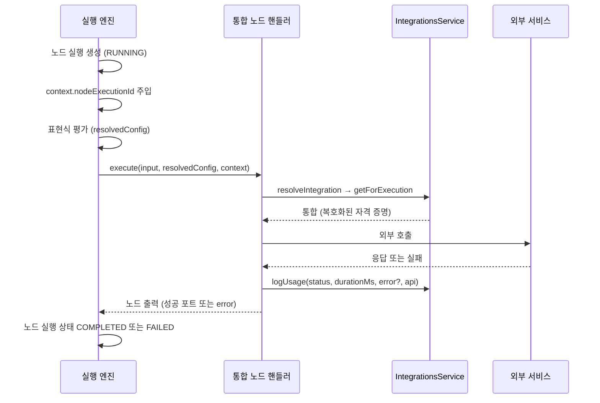

> 구현 상태: 구현됨 · 원문: `spec/4-nodes/4-integration/0-common.md`, `spec/5-system/4-execution-engine.md` (§10 Integration Handler 계약), `spec/4-nodes/_product-overview.md` (§7 머리말) · 용어: [용어 사전](../CLE-GLOSSARY.md)

## 개요

통합 노드(integration nodes)는 통합(Integration)에 저장된 자격 증명을 써서 외부 서비스를 부르는 노드다. 다섯 종류가 있다. 범용 노드는 [HTTP Request 노드](CLE-NODE-HTTP.md)와 [Database Query 노드](CLE-NODE-DBQUERY.md)이고, 서비스 특화 노드는 [Send Email 노드](CLE-NODE-EMAIL.md), [Cafe24 노드](CLE-NODE-CAFE24.md), [MakeShop 노드](CLE-NODE-MAKESHOP.md)다. 서비스 특화 노드는 언제나 통합을 참조하고, HTTP Request 노드는 인증 방식을 `integration` 으로 골랐을 때만 참조한다.

이 문서는 다섯 노드가 함께 따르는 규약을 정한다. 통합 참조와 통합 선택기, 노드 출력의 카테고리별 사용 방식, 핸들러 실행 계약(실행 엔진이 통합 핸들러를 부르는 순서 포함), 공통 에러 코드, 사설망 차단(SSRF guard), 캔버스 요약과 삭제된 통합 표시가 여기에 속한다. 노드별 설정·동작·출력은 각 노드 문서가 정한다.

다음은 이 문서의 범위 밖이다.

- 통합 엔티티와 서비스별 자격 증명 스키마: [서비스별 인증 방식과 자격 증명](../CLE-INT/CLE-INT-AUTH.md), [통합 데이터와 흐름](../CLE-INT/CLE-INT-DATA.md)
- 노드 실행 결과가 통합 상태(`connected`·`error` 등)를 바꾸는 범위: [통합 상태와 만료 알림](../CLE-INT/CLE-INT-STATUS.md)
- 활동 로그의 API 식별 정보를 통합별로 채우는 정책(INT-US-05): [통합 관리](../CLE-INT/CLE-INT-MANAGE.md)
- 외부 MCP 서버 통합(`service_type='mcp'`): 워크플로우 노드로 노출되지 않고 AI 에이전트 노드의 `mcpServers` 설정에서만 쓴다. [MCP 클라이언트](../CLE-INT/CLE-INT-MCP.md)와 [AI 에이전트 노드](../CLE-NODE-AI/CLE-NODE-AGENT.md)에서 정한다. 즉 통합 엔티티는 이 문서의 노드와 AI 에이전트 MCP 도구 프로바이더, 두 곳에서 쓰인다.
- 노드 출력 다섯 필드의 일반 규약: [노드 출력 규약](../CLE-NODE/CLE-NODE-OUTPUT.md). 노드 핸들러 일반 계약: [노드 핸들러 계약](../CLE-EXEC/CLE-EXEC-HANDLER.md)

## 규칙

1. 서비스 특화 통합 노드는 통합 참조(`config.integrationId`)로 통합을 가리킨다. HTTP Request 노드는 `authentication='integration'` 일 때만 이 값을 쓴다.
2. 설정 에코에는 자격 증명을 싣지 않는다. 통합에 관해서는 `integrationId` 만 싣는다.
3. 시간 메트릭은 모든 통합 노드에서 `meta.durationMs`(단위 ms) 하나로 쓴다.
4. 통합 노드는 블로킹 노드가 아니다. 흐름 지시 상태(`status`)는 비워 둔다. 예외는 [Send Email 노드](CLE-NODE-EMAIL.md)의 DI 미주입 식별값 하나다(아래 "서비스 미주입과 워크스페이스 누락").
5. 모든 통합 핸들러는 아래 "핸들러 실행 계약" 의 6단계를 따른다.
6. 사전 검증 에러(`handler.validate()` 실패)만 throw 로 실행을 실패시킨다. `execute()` 안에서 난 실패는 모두 에러 포트(`port: 'error'`)와 `output.error.{code, message, details?}` 로 내보낸다(D4 결정).
7. 성공·실패와 관계없이 외부 호출마다 활동 로그를 1건 남긴다. 이때 API 식별 정보(`api`)를 함께 넘긴다. HTTP Request 노드는 통합 인증일 때만 활동 로그를 남긴다.
8. HTTP Request·Database Query·Send Email 노드는 사설망 차단을 기본으로 켠다. 끄는 방법은 `ALLOW_PRIVATE_HOST_TARGETS=true` 하나뿐이다.
9. 차단 코드(`HTTP_BLOCKED`·`DB_HOST_BLOCKED`·`EMAIL_HOST_BLOCKED`)는 차단 판정에만 쓴다. 클라이언트에 나가는 차단 메시지에는 차단된 호스트나 IP 를 넣지 않는다.
10. 캔버스 요약은 노드 스키마의 `summaryTemplate` 으로 렌더하고, 렌더된 한 줄을 40자에서 자른다.
11. 삭제된 통합 표시는 캔버스 렌더러가 판정한다. 노드 스키마의 경고 규칙(`warningRules`)으로 판정하지 않는다.

## 통합 참조

| 설정 필드 | 타입 | 설명 |
|-----------|------|------|
| `integrationId` | UUID | 통합(`Integration`)을 가리키는 FK. 설정 패널의 통합 선택기에서 고른다. 통합 엔티티 정의는 [통합 데이터와 흐름](../CLE-INT/CLE-INT-DATA.md) |

## 통합 선택기

통합 선택기(`IntegrationSelector`)는 노드 설정 패널 위쪽에 놓이는 드롭다운이다.

- 현재 워크스페이스에 등록된 통합 가운데 노드가 기대하는 서비스 유형만 보여 준다. HTTP Request 노드는 `http`, Database Query 노드는 `database`, Send Email 노드는 `email`, Cafe24 노드는 `cafe24`, MakeShop 노드는 `makeshop` 으로 거른다.
- 개인 통합과 조직 통합을 구분해 표시한다.
- 연결 상태 배지(`connected`·`expired`·`error`)를 함께 보인다.
- "새 Integration 추가" 링크를 누르면 [통합 관리](../CLE-INT/CLE-INT-MANAGE.md) 화면으로 간다.

## 노드 출력

통합 노드의 노드 출력은 [노드 출력 규약](../CLE-NODE/CLE-NODE-OUTPUT.md)의 다섯 필드(`config`, `output`, `meta?`, `port?`, `status?`)를 따른다. 정확한 필드 목록은 각 노드 문서의 "출력 구조" 절이 정한다.

```json
{
  "config": { /* 노드별 원본 설정 에코 */ },
  "output": { /* 노드별 결과 */ },
  "meta": { "statusCode": 200, "durationMs": 150 },
  "port": "success"
}
```

| 필드 | 통합 노드에서의 사용 방식 |
|------|---------------------------|
| `config` | 사용자가 입력한 원본 설정을 에코한다(노드 출력 규약 Principle 7). HTTP Request 의 `headers`·`body`, Database Query 의 `query`, Send Email 의 `subject`·`body` 에 든 표현식 템플릿을 평가 전 모습 그대로 남긴다. 자격 증명은 싣지 않고 `integrationId` 만 싣는다 |
| `output` | 외부 호출 결과의 도메인 데이터. HTTP Request 는 `output.response`·`output.responseHeaders`, Database Query 는 `output.rows`·`output.rowCount`·`output.insertId?`, Send Email 은 `output.messageId`, Cafe24·MakeShop 은 `output.response`. 실패하면 `output.error.{code, message, details?}` (Principle 3.2) |
| `meta` | 실행 메트릭만 둔다(Principle 2). 공통은 `meta.durationMs`. HTTP Request·Cafe24·MakeShop 은 `meta.statusCode` 도 둔다. Database Query 의 `rowCount` 는 `output` 에만 두고 `meta` 에 복제하지 않는다 |
| `port` | 성공 포트 또는 `'error'`. 성공 포트 이름은 노드마다 다르다. HTTP Request·Database Query·Cafe24·MakeShop 은 `success`, Send Email 은 `out` 이다 |
| `status` | 비워 둔다(비블로킹). 예외: Send Email 노드는 서비스가 주입되지 않은 환경에서 `requires_integration` 을 돌려준다 |

## 핸들러 실행 계약

통합 노드의 외부 호출은 실행 엔진이 부르는 노드 핸들러가 맡는다. 모든 통합 핸들러는 공통 베이스(`IntegrationHandlerBase`)로 자격 증명을 해소하고 호출 기록을 남긴다. 베이스를 상속하지 않는 핸들러도 같은 동작을 해야 한다.

### 6단계 계약

| 단계 | 책임 |
|------|------|
| 1. 워크스페이스 확인 | `ExecutionContext.variables.__workspaceId` 를 읽는다. 없으면 에러로 끝낸다(처리 방식은 아래 "서비스 미주입과 워크스페이스 누락") |
| 2. 통합 조회 | `IntegrationsService.getForExecution(integrationId, workspaceId)` 를 부른다. 자격 증명은 AES-256-GCM 컬럼 transformer 가 자동으로 복호화한다 |
| 3. 유형·상태 검증 | `serviceType` 이 노드 기대값과 같은지, `status === 'connected'` 인지 확인한다 |
| 4. 자격 증명 충족 검증 | 서비스별 필수 필드가 빠지면 `INTEGRATION_INCOMPLETE` |
| 5. 외부 호출 | 서비스별 SDK 나 드라이버로 부른다 |
| 6. 활동 로그 기록 | 성공·실패와 관계없이 `IntegrationsService.logUsage({integrationId, nodeExecutionId, workflowId, status, durationMs, error?, api?})` 를 부른다 |

6단계의 `api` 식별 정보(`{ label?, method?, path? }`)는 동반이 의무다. 이 값은 `integration_usage_log.api_label`·`api_method`·`api_path` 에 저장된다. 통합별로 무엇을 채우는지는 [통합 관리](../CLE-INT/CLE-INT-MANAGE.md)의 INT-US-05 표가 정하고, 각 노드 문서는 자기 노드의 값만 적는다. 값이 길면 백엔드(`logUsage` 내부)가 `varchar(128)`·`varchar(8)`·`varchar(256)` 한도로 자르고 끝에 `…` 를 붙인다(`clampMessage` 패턴). 호출하는 쪽이 직접 자를 필요는 없다.

### IntegrationsService API (실행 엔진용)

```ts
class IntegrationsService {
  /**
   * 실행 엔진 전용 내부 조회. credentials 는 AES-256-GCM transformer 가
   * 복호화한 평문으로 반환된다. 결과는 시크릿으로 취급한다.
   */
  getForExecution(id: UUID, workspaceId: UUID): Promise<Integration>;

  /**
   * 노드 실행이 끝나면 부른다. 성공·실패 여부와 durationMs 를 기록하고
   * integration.last_used_at / last_error 를 갱신한다.
   */
  logUsage(params: {
    integrationId: UUID;
    nodeExecutionId: UUID;
    workflowId: UUID;
    status: "success" | "failed";
    durationMs: number;
    error?: { code?: string; message?: string } | null;
    api?: { label?: string; method?: string; path?: string };
  }): Promise<void>;
}
```

`logUsage` 는 best-effort 다. 내부 예외를 삼키므로 실행 흐름을 멈추지 않는다. `logUsage` 가 갱신하는 통합 컬럼은 `last_used_at` 과 `last_error` 다. 노드 실행 결과로 통합 상태가 바뀌는 범위는 [통합 상태와 만료 알림](../CLE-INT/CLE-INT-STATUS.md)에서 정한다.

### IntegrationHandlerBase

```ts
class IntegrationHandlerBase {
  constructor(protected readonly integrationsService?: IntegrationsService) {}

  protected resolveIntegration(
    integrationId: UUID,
    context: ExecutionContext,
    expectedServiceType: string,
  ): Promise<Integration>; // workspaceId / service_type / status 를 모두 검증

  protected logUsage(
    context: ExecutionContext,
    params: IntegrationUsageParams, // api 식별 정보 포함
  ): Promise<void>;
}
```

`resolveIntegration` 은 검증에 실패하면 `IntegrationError(code, message)` 를 던진다. `code` 는 아래 "공통 에러 코드" 의 값이다. 핸들러는 이 예외를 잡아 에러 포트로 내보낸다.

### 호출 순서

실행 엔진은 노드 실행을 만들고 `context.nodeExecutionId` 를 주입한 다음 표현식을 평가해 핸들러를 부른다. 핸들러는 통합을 해소하고 외부 서비스를 부른 뒤 활동 로그를 남긴다. 엔진은 핸들러가 돌려준 노드 출력으로 노드 실행 상태를 마감한다.



- `context.nodeExecutionId` 는 노드를 부르기 직전마다 새로 배정되므로 순차 실행 모델에서 안전하다.
- 멀티턴 AI 노드의 재개·재시도 턴은 노드를 새로 dispatch 하지 않고 `resumeState` 로 다시 들어온다. 이때 `context.nodeExecutionId` 와 `workflowId` 는 새로 배정되지 않는다. `buildRetryReentryState` 가 입력 대기·재시도 중인 노드 실행 행의 식별 필드에서 다시 유도한다. 이 유도가 빠지면 활동 로그의 귀속이 누락된다. 불변식은 [실행 상태 머신과 대기·재개](../CLE-EXEC/CLE-EXEC-STATE.md)에서 정한다(#501).

### 서비스 미주입과 워크스페이스 누락

`IntegrationsService` 가 핸들러에 주입되지 않았거나 `__workspaceId` 가 없는 경우는 배포 구성 에러다. 프로덕션 경로에서는 서비스가 반드시 주입돼야 한다. D4 이후 노드별 동작은 다음과 같다.

| 노드 | 서비스 미주입 | `__workspaceId` 누락 |
|------|---------------|----------------------|
| HTTP Request (통합 인증일 때) | 에러 포트, `INTEGRATION_SERVICE_UNAVAILABLE` | 에러 포트, `INTEGRATION_SERVICE_UNAVAILABLE` |
| Database Query | 에러 포트, `INTEGRATION_SERVICE_UNAVAILABLE` | 에러 포트, `INTEGRATION_SERVICE_UNAVAILABLE` |
| Cafe24 | 에러 포트, `INTEGRATION_SERVICE_UNAVAILABLE` (`Cafe24ApiClient` 미주입 포함) | 에러 포트, `INTEGRATION_SERVICE_UNAVAILABLE` |
| MakeShop | 에러 포트, `INTEGRATION_SERVICE_UNAVAILABLE` (`MakeshopApiClient` 미주입 포함) | 에러 포트, `INTEGRATION_SERVICE_UNAVAILABLE` |
| Send Email | 외부 호출 없이 `status: 'requires_integration'` 을 돌려준다(포트·메트릭 없음) | 에러 포트, `EMAIL_SEND_FAILED` (IntegrationError 가 아니어서 흡수됨) |

HTTP Request 노드가 `none`·`custom` 인증이면 통합을 조회하지 않으므로 이 표의 대상이 아니다. Send Email 노드의 두 예외는 [Send Email 노드](CLE-NODE-EMAIL.md)에서 자세히 정한다.

워크스페이스 누락 열은 부분 구현이다. 현재 구현의 공통 베이스 `resolveIntegration` 은 `__workspaceId` 가 없으면 `IntegrationError` 가 아닌 일반 `Error('Missing workspace context …')` 를 던진다. 그래서 HTTP Request·Cafe24·MakeShop 노드는 기본 규칙대로 `INTEGRATION_CALL_FAILED` 를, Database Query 노드는 드라이버 에러 분류기(`mapDbError`)의 결과를 내보내는 것으로 보인다. [미결 사항](#미결-사항) 참조.

## 공통 에러 코드

| 코드 | 의미 |
|------|------|
| `INTEGRATION_TYPE_MISMATCH` | 참조한 통합의 `serviceType` 이 노드 기대 유형과 다르다. `resolveIntegration` 이 `IntegrationError` 를 던진다 |
| `INTEGRATION_NOT_CONNECTED` | 통합 상태가 `connected` 가 아니다(`expired`, `error`, `pending_install`). `resolveIntegration` 이 `IntegrationError` 를 던진다 |
| `INTEGRATION_INCOMPLETE` | credentials JSONB 에 서비스별 필수 필드가 없다. 각 핸들러가 자격 증명을 검증할 때 `IntegrationError` 를 던진다 |
| `INTEGRATION_CALL_FAILED` | 분류되지 않은 그 밖의 실패. `IntegrationError` 가 아닌 예외의 기본 코드다(`toLogError` fallback). 사설망 차단 가드가 차단 판정(`SsrfBlockedError`)이 아닌 오류를 던진 경우(가드 자체의 고장)도 이 코드로 나온다. 노드마다 시점 차이가 있다(HTTP Request 는 preflight 와 리다이렉트 홉이 다르다) |
| `INTEGRATION_SERVICE_UNAVAILABLE` | `IntegrationsService` 미주입 또는 workspace context 누락(배포 구성 에러). 에러 포트로 내보낸다 |

- **통합이 없거나 다른 워크스페이스 소속일 때**: `IntegrationsService.getForExecution` 안의 `requireEntity` 가 `NotFoundException({ code: 'RESOURCE_NOT_FOUND' })` 를 던진다. 이 예외는 `IntegrationError` 가 아니므로 전용 코드로 보존되지 않는다. 대부분의 노드는 `INTEGRATION_CALL_FAILED` 로, Send Email 노드는 `EMAIL_SEND_FAILED` 로 내보낸다. 별도의 `INTEGRATION_NOT_FOUND` 코드는 현재 코드에 없다(`integrations.service.ts` `requireEntity`, `_base/integration-handler-base.ts` `toLogError`).
- **에러 포트 라우팅(D4)**: 위 코드가 생기는 모든 경우는 핸들러 안에서 잡혀 `port: 'error'` 와 `output.error.{code, message, details?}` 로 나간다. 다섯 노드 모두 Send Email 노드의 catch 패턴으로 통일했다. `IntegrationError` 를 throw 해서 노드 실행이 실패하는 경로는 없다. 모든 `IntegrationError.code` 는 `output.error.code` 로 나온다. 활동 로그에는 같은 실패를 `status: 'failed'` 와 `error: {code, message}` 로 기록한다.
- 노드별 코드(`HTTP_*`, `DB_*`, `EMAIL_*`, `CAFE24_*`, `MAKESHOP_*`)와 `INTEGRATION_AUTH_UNSUPPORTED`(HTTP 전용)는 각 노드 문서가 정한다. 어느 코드가 어느 문서에 있는지는 아래 "노드별 코드 색인" 에 모았다.
- 자격 증명을 복호화할 수 없을 때(`IntegrationCredentialsUnreadableError`)의 출력 코드는 정해지지 않았다. [미결 사항](#미결-사항) 참조.

### 노드별 코드 색인

공통 코드 밖의 `output.error.code` 는 노드마다 다르다. 코드마다 발생 조건, 출력 모양, 활동 로그 기록은 각 노드 문서의 에러 코드 절이 단일 기준이다. 이 표에는 코드가 어느 문서에 있는지만 적는다.

| 노드 | 노드 고유 코드 |
|------|----------------|
| [HTTP Request](CLE-NODE-HTTP.md#에러-코드) | `HTTP_4XX`·`HTTP_5XX`(활동 로그에는 `HTTP_{status}`), `HTTP_TRANSPORT_FAILED`, `HTTP_BLOCKED`, `INTEGRATION_AUTH_UNSUPPORTED` |
| [Database Query](CLE-NODE-DBQUERY.md#에러-코드) | `DB_QUERY_FAILED`, `DB_CONNECTION_ERROR`, `DB_CONSTRAINT_VIOLATION`, `DB_PERMISSION_DENIED`, `DB_HOST_BLOCKED`, `INVALID_PARAMETERS` |
| [Send Email](CLE-NODE-EMAIL.md#에러-코드) | `EMAIL_SEND_FAILED`, `EMAIL_HOST_BLOCKED` |
| [Cafe24](CLE-NODE-CAFE24.md#에러-코드) | `CAFE24_4XX`·`CAFE24_404`·`CAFE24_422`·`CAFE24_5XX`, `CAFE24_AUTH_FAILED`, `CAFE24_RATE_LIMITED`, `CAFE24_TRANSPORT_FAILED`, `CAFE24_UNKNOWN_OPERATION`, `CAFE24_MISSING_FIELDS`, `CAFE24_INVALID_MALL_ID` |
| [MakeShop](CLE-NODE-MAKESHOP.md#에러-코드) | `MAKESHOP_4XX`·`MAKESHOP_404`·`MAKESHOP_422`·`MAKESHOP_5XX`, `MAKESHOP_AUTH_FAILED`, `MAKESHOP_RATE_LIMITED`, `MAKESHOP_TRANSPORT_FAILED`, `MAKESHOP_UNKNOWN_OPERATION`, `MAKESHOP_MISSING_FIELDS`, `MAKESHOP_INVALID_SHOP_UID` |

- Cafe24 노드가 403 에 어떤 코드를 내는지는 정의가 갈린다. [Cafe24 노드 미결 사항](CLE-NODE-CAFE24.md#미결-사항) 참조.
- 통합 연결 테스트만 쓰는 코드(`EMAIL_CONNECT_FAILED`·`DB_AUTH_FAILED`·`DB_CONNECT_FAILED`·`HTTP_AUTH_FAILED`·`HTTP_SERVER_ERROR`·`HTTP_CONNECT_FAILED`)는 노드 출력에 나오지 않는다. [서비스별 인증 방식과 자격 증명](../CLE-INT/CLE-INT-AUTH.md)에서 정한다. 사설망 차단 코드(`HTTP_BLOCKED`·`DB_HOST_BLOCKED`·`EMAIL_HOST_BLOCKED`)는 노드와 연결 테스트가 같이 쓴다.

## 사설망 차단

사설망 차단(SSRF guard)은 통합 노드가 사설·loopback·클라우드 메타데이터 주소로 연결하지 못하게 막는 검사다.

| 노드 | 검사 대상 | 검사 시점 | 차단 코드 |
|------|-----------|-----------|-----------|
| HTTP Request | 요청 URL 의 호스트. 모든 인증 방식(`none`·`integration`·`custom`) | 요청 전 preflight, 그리고 통합 인증에서 따라가는 리다이렉트 홉마다 | `HTTP_BLOCKED` |
| Database Query | `credentials.host` | 자격 증명 충족 검증 직후, 풀 연결 전 | `DB_HOST_BLOCKED` |
| Send Email | `credentials.host` (SMTP 호스트) | 통합 조회 직후, SMTP 발송 전 | `EMAIL_HOST_BLOCKED` |

- 막는 대역은 loopback, RFC1918 사설 대역, link-local, CGNAT, IPv6 link-local·ULA 다. 호스트 이름은 DNS 로 해석한 뒤 IP 를 다시 검사한다(DNS rebinding 방어, `assertSafeOutboundHostResolved`). HTTP Request 는 그 전에 호스트 리터럴도 검사한다(`assertSafeOutboundUrl`).
- 기본은 차단이다(secure-by-default). 셀프 호스팅에서 내부 DB·on-prem API·내부 SMTP relay 같은 사설망 대상을 정당하게 불러야 할 때만 사설망 허용 플래그 `ALLOW_PRIVATE_HOST_TARGETS=true` 를 켠다. 외부 egress 방화벽이 있다는 전제다.
- 세 노드는 이 플래그 하나를 함께 쓴다. AI 에이전트의 외부 MCP 서버는 별도 정책(`MCP_ALLOW_INSECURE_URL`)을 따른다. [MCP 클라이언트](../CLE-INT/CLE-INT-MCP.md)에서 정한다.
- MakeShop 노드는 호출 호스트가 `connect.makeshop.co.kr` 하나로 고정돼 사용자 입력이 호스트를 정하지 않는다. 그래서 이 가드를 쓰지 않고 `shop_uid` 형식 검증으로 경로 주입을 막는다([MakeShop 노드](CLE-NODE-MAKESHOP.md)).
- 차단 코드는 차단 판정(`SsrfBlockedError`)에만 쓴다. 가드가 판정이 아닌 오류를 던지면(예: DNS 해석기가 낸 예기치 않은 예외) `INTEGRATION_CALL_FAILED` 로 내보낸다. HTTP Request 의 리다이렉트 홉에서 같은 고장이 나면 `HTTP_TRANSPORT_FAILED` 가 된다. 두 시점의 코드를 통일할지는 [HTTP Request 노드](CLE-NODE-HTTP.md)의 미결 사항이다. Send Email 노드는 `IntegrationError` 가 아닌 실패를 모두 `EMAIL_SEND_FAILED` 로 흡수하므로 `INTEGRATION_CALL_FAILED` 를 출력하지 않는다.
- 클라이언트에 나가는 `output.error.message` 에는 차단된 호스트나 IP 를 넣지 않는다. 일반화된 문구만 쓴다(내부망 정찰 방지, CWE-209). 원본 상세를 어디에 남기는지는 정의가 갈린다. [미결 사항](#미결-사항) 참조.

## 캔버스 요약

캔버스 요약은 노드 스키마의 `summaryTemplate`(백엔드 단일 기준)을 프론트엔드가 `renderSummaryTemplate` 으로 렌더한 한 줄이다. `truncateSummary` 가 렌더된 줄 전체를 **40자**로 자르고, 넘치면 마지막 1자를 `…` 로 바꾼다. 노드별 부분 필드를 따로 자르지 않는다(`codebase/frontend/src/lib/utils/node-config-summary.ts`). 잘림 규칙 자체는 [노드 시스템 구조와 카탈로그](../CLE-NODE/CLE-NODE-ARCH.md)와 같다.

| 노드 | 요약 포맷 | 예시 | 상태 |
|------|-----------|------|------|
| HTTP Request | `{{method\|default:GET}} {{url}}` | `GET https://api.example.com/v1/users…` | 구현됨 (`http-request.schema.ts`) |
| Cafe24 | `{{resource}} · {{operation}}` | `product · product_list` | 구현됨 (`cafe24.schema.ts`) |
| MakeShop | `{{resource}} · {{operation}}` | `product · get-product` | 구현됨 (`makeshop.schema.ts`) |
| Database Query | `{{queryType\|upper}} · {{query}}` | `SELECT · SELECT * FROM us…` | 구현됨 (`database-query.schema.ts`) |
| Send Email | `{{to.length}} recipients · {{subject}}` | `2 recipients · Welcome` | 구현됨 (`send-email.schema.ts`) |

예시 끝의 `…` 는 잘린 모양을 보이려는 표시다. 예시의 글자 수는 실제와 다르다. 실제로는 렌더된 줄이 40자를 넘으면 앞 39자 뒤에 `…` 를 붙여 40자로 만든다.

### 삭제된 통합 표시

통합 노드(`category: integration`)의 `config.integrationId` 가 현재 워크스페이스 통합 목록에 없으면(참조하던 통합이 삭제됨) 캔버스 노드 헤더에 앰버색 `⚠ Missing integration` 배지를 붙인다.

- 캔버스(`workflow-canvas.tsx`)가 워크스페이스 통합 목록을 React Query 로 한 번 조회한다. 키는 캔버스 전용 `["integrations","list"]` 로, 서비스 유형 필터 없이 전체 목록을 받는다. 설정 패널 선택기의 `["integrations","list",{serviceTypes}]` 키와 다르다.
- 캔버스는 실재하는 id 집합을 Context 로 내려 준다. 각 노드 렌더러(`custom-node.tsx`)가 자기 `config.integrationId` 가 집합에 있는지(`Set.has(id)`) 확인한다.
- 목록이 아직 확정되지 않았으면(로딩 중이거나 페이지네이션 한도로 전체를 받지 못함) 배지를 억제한다. 위양성을 막기 위해서다.
- `integrationId` 가 비어 있으면(미선택) 이 배지 대신 각 노드 스키마의 `warningRules`(필드 미선택 경고)가 표시된다.
- HTTP Request 노드의 `integrationId` 는 `authentication === "integration"` 일 때만 유효하다. 다른 인증 방식에 남은 값에는 배지를 붙이지 않는다. 나머지 통합 노드에는 조건 없이 적용한다.
- 시각적으로는 캔버스의 `⚠ Missing workflow` 배지와 같은 앰버 계열이다. 그래프 경고 배지(`AlertTriangle`)와 겹쳐 보이지 않도록 연결 끊김 아이콘(`Unplug`)과 별도 슬롯에 렌더한다.
- 백엔드와 `warningRules` DSL 은 바꾸지 않았다.

## 출력 구조 색인

다섯 노드 모두 에러 경로는 하나(`port: 'error'` + `output.error.*`)다.

| 노드 | 정상 케이스 | 에러 케이스 |
|------|-------------|-------------|
| [HTTP Request](CLE-NODE-HTTP.md) | 2xx 성공 (`success`) | 4xx·5xx, 전송 실패, 통합 해소 실패, 사설망 차단 (`error`) |
| [Database Query](CLE-NODE-DBQUERY.md) | 정상 실행 (`success`) | 드라이버 에러, 통합 해소 실패, 자격 증명 누락, 잘못된 파라미터 (`error`) |
| [Send Email](CLE-NODE-EMAIL.md) | 발송 성공 (`out`) | 전송 실패, 통합 해소 실패, 사설망 차단 (`error`) |
| [Cafe24](CLE-NODE-CAFE24.md) | 2xx 성공 (`success`) | API 호출 실패, 리소스·operation 검증, `mall_id` 누락, 통합 해소 실패 (`error`) |
| [MakeShop](CLE-NODE-MAKESHOP.md) | 2xx 성공 (`success`) | API 호출 실패, 리소스·operation 검증, `shop_uid` 누락·형식 위반, 통합 해소 실패 (`error`) |

## 미결 사항

- **워크스페이스 누락 시 출력 코드**: 이 문서와 [HTTP Request 노드](CLE-NODE-HTTP.md)·[Cafe24 노드](CLE-NODE-CAFE24.md)·[MakeShop 노드](CLE-NODE-MAKESHOP.md) 원문은 `__workspaceId` 누락을 `INTEGRATION_SERVICE_UNAVAILABLE` 로 내보낸다고 적는다. [Send Email 노드](CLE-NODE-EMAIL.md) 원문은 이 경우를 `EMAIL_SEND_FAILED` 로 흡수한다고 적고 전용 코드 노출을 Planned 로 둔다. 현재 구현은 공통 베이스가 일반 `Error` 를 던져 다른 노드에서도 `INTEGRATION_CALL_FAILED`(Database Query 는 드라이버 에러 분류 결과)가 나오는 것으로 보인다. 구현을 규칙에 맞출지, 규칙을 현재 동작에 맞출지 결정 필요.
- **사설망 차단 원본 상세를 남기는 위치**: [Database Query 노드](CLE-NODE-DBQUERY.md) 원문은 차단 상세(원본 호스트)가 활동 로그(`logUsage`)에만 남는다고 적고, 이를 "서버 활동 로그" 라고 부른다. [HTTP Request 노드](CLE-NODE-HTTP.md) 원문은 활동 로그가 `GET /integrations/:id/activity` 로 워크스페이스 사용자에게 그대로 나가므로 활동 로그에도 일반화 문구만 남기고 원본은 서버 로그(`logger.warn`)에만 둔다고 적는다. 같은 정찰 방지 원칙을 두 노드가 반대로 적용한다. 현재 구현은 Database Query 핸들러가 일반화 문구만 담은 `IntegrationError('DB_HOST_BLOCKED')` 를 만들고 원본을 `cause` 로도 싣지 않는 것으로 보인다(활동 로그에 원본이 남는지는 미확인). 어느 쪽을 규칙으로 삼을지 결정 필요.
- **자격 증명 복호화 실패의 출력 코드**: 암호화 키 교체 등으로 자격 증명을 복호화할 수 없으면 `getForExecution` 이 `IntegrationCredentialsUnreadableError` 를 던진다([통합 데이터와 흐름](../CLE-INT/CLE-INT-DATA.md)). 이 경로가 어떤 `output.error.code` 로 나오는지 원문에 없다. 현재 구현의 이 예외는 `BadRequestException` 계열이라 `IntegrationError` 가 아니므로 기본 규칙대로 `INTEGRATION_CALL_FAILED`(Send Email 은 `EMAIL_SEND_FAILED`)로 나올 것으로 보이나 확인되지 않았다. 공통 에러 코드 표에 행을 둘지 결정 필요.
- **통합 자격 증명 암호화와 시크릿 저장소의 관계**: 통합 노드는 자격 증명을 컬럼 transformer 로 직접 복호화한다. [시크릿 저장소](../CLE-INT/CLE-INT-SECRET.md)는 모든 도메인 모듈이 `SecretResolver` 를 거친다고 정하면서 예외 목록에 `Integration.credentials` 를 두지 않았다. 예외로 등재할지 이관할지 결정 필요(관련: [시크릿 저장소](../CLE-INT/CLE-INT-SECRET.md)).

## 구현 위치

- `codebase/backend/src/nodes/integration/_base/integration-handler-base.ts` (공통 베이스, `resolveIntegration`·`logUsage`·`toLogError`)
- `codebase/backend/src/nodes/integration/*/*.handler.ts` (노드별 핸들러)
- `codebase/backend/src/modules/integrations/integrations.service.ts` (`getForExecution`·`logUsage`·`requireEntity`)
- `codebase/frontend/src/lib/utils/node-config-summary.ts` (캔버스 요약 렌더·잘림)
- `codebase/frontend/src/components/editor/canvas/custom-node.tsx` (삭제된 통합 배지 판정)
- `codebase/frontend/src/components/editor/canvas/workflow-canvas.tsx` (통합 목록 단일 조회)
- `codebase/frontend/src/components/editor/canvas/integration-list-context.ts` (실재 id 집합 Context)

## Rationale

### 핸들러 실패를 에러 포트로 통일 (D4, 2026-05-17)

D4 이전에는 `resolveIntegration` 의 `IntegrationError` 와 환경 에러가 throw 돼 노드 실행 자체가 실패했다. 서비스 미주입도 throw 였다. D4 에서 이 경로를 폐기하고, `execute()` 안의 모든 실패를 Send Email 노드가 먼저 쓰던 catch 패턴(에러 포트 + `output.error`)으로 모았다. 설정 형식 자체가 잘못된 경우(`handler.validate()` 실패)만 throw 로 남는다. 실행 엔진 문서에 남아 있던 "workspace 누락 시 `Missing workspace context` throw", "모든 핸들러가 미주입 시 `requires_integration` stub 반환" 서술은 D4 이전 상태라서 이 문서의 현행 규칙으로 대체했다.

### 시간 메트릭을 `meta.durationMs` 로 통일

HTTP Request 노드만 `meta.duration` 을 쓰고 나머지 노드와 시스템 문서는 `meta.durationMs` 를 썼다. 단위(ms)가 이름에 드러나는 `meta.durationMs` 로 통일했다. `http_request` 의 `meta.duration` 은 폐지했고, `$node["X"].meta.duration` 을 참조하던 워크플로우는 고쳐야 하는 breaking change 였다.

### 삭제된 통합 표시를 렌더러 전용 판정으로 둔 이유

노드 스키마 경고 규칙의 `when` DSL 평가기(`node-summary` 의 `evaluateWhen(expr, config)`)는 노드 자신의 config 만 받는다. 그래서 통합이 실재하는지 같은 교차 엔티티 검증을 할 수 없다. 기존 통합 노드 규칙의 `!integrationId` 는 "필드 미선택" 만 본다. 그래서 이 판정은 캔버스 렌더러가 맡는다.

목록 조회를 캔버스 한 곳으로 올린 것은 노드마다 `useQuery` 를 구독하면 N개 노드에 N개 구독과 리렌더가 생기기 때문이다. AI 노드의 `hasDefaultLlmConfig` Context 와 같은 패턴이다. 판정 로직(`Set.has(id)`)은 설정 패널의 `integration-selector`·`mcp-server-selector` 가 쓰는 것과 같다. 다만 선택기는 패널이 열린 노드 하나에만 마운트되고 이 배지는 캔버스의 모든 통합 노드에 동시에 붙으므로, 개수 차이 때문에 Context 로 올렸다. 교차 엔티티 경고가 앞으로 많아지면 DSL 조회 기능을 일반화하는 방안(plan `spec-sync-integration-common-gaps` 옵션 C)을 다시 검토한다.

이 배지는 방어용 표시다. 정상 UI 삭제 경로는 사용처가 있는 통합의 삭제를 막는다(409 `INTEGRATION_IN_USE`, [통합 관리](../CLE-INT/CLE-INT-MANAGE.md)). 그래서 "캔버스의 라이브 노드가 참조하는데 통합이 없는" 상태는 평소에 생기지 않는다. 삭제 차단의 사용처 조회(`queryUsageNodes`)는 라이브 `Node` 테이블만 보고 과거 버전 스냅샷, 워크스페이스 이동, 레거시·직접 DB 조작은 보지 않는다. 배지는 이 틈으로 남은 잔존 참조(dangling reference)를 드러낸다.

### 캔버스 요약을 줄인 이유

Database Query 의 "쿼리 첫 줄" 과 Send Email 의 "to: {수신자} +N" 은 `summaryTemplate` DSL 이 개행 분리·배열 슬라이스·조건 카운트를 지원하지 않아 표현할 수 없다. 그래서 각각 전체 쿼리를 잘라 보이는 `{{query}}` 와 수신자 수 + 제목(`{{to.length}} recipients · {{subject}}`)으로 줄였다([노드 시스템 구조와 카탈로그](../CLE-NODE/CLE-NODE-ARCH.md) 템플릿 문법).

### 사설망 허용 플래그 하나를 세 노드가 공유

HTTP Request·Database Query·Send Email 노드는 노드별 플래그를 새로 만들지 않고 `ALLOW_PRIVATE_HOST_TARGETS` 하나를 쓴다. 통합 노드 전체의 보안 자세(기본 차단, 셀프 호스팅만 해제)를 한 가지로 유지하기 위해서다. HTTP Request 노드가 모든 인증 방식에 가드를 적용하게 된 배경은 [HTTP Request 노드](CLE-NODE-HTTP.md) Rationale 에 있다. Database Query 노드의 전용 차단 코드 배경은 [Database Query 노드](CLE-NODE-DBQUERY.md) Rationale 에 있다.

### 차단 코드를 판정에만 쓰는 이유

막힌 적 없는 요청을 "막혔다" 고 보고하면 없는 사실을 사용자에게 알리고 활동 로그에도 남기게 된다. 그래서 가드 자체의 고장은 차단 코드가 아니라 분류되지 않은 실패(`INTEGRATION_CALL_FAILED`)로 내보낸다.
